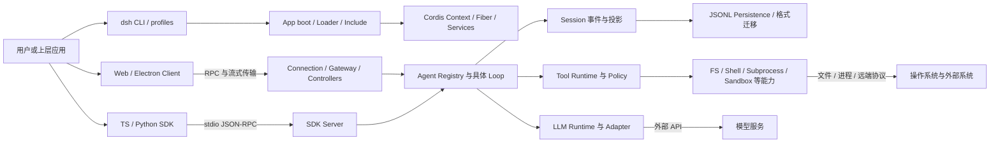
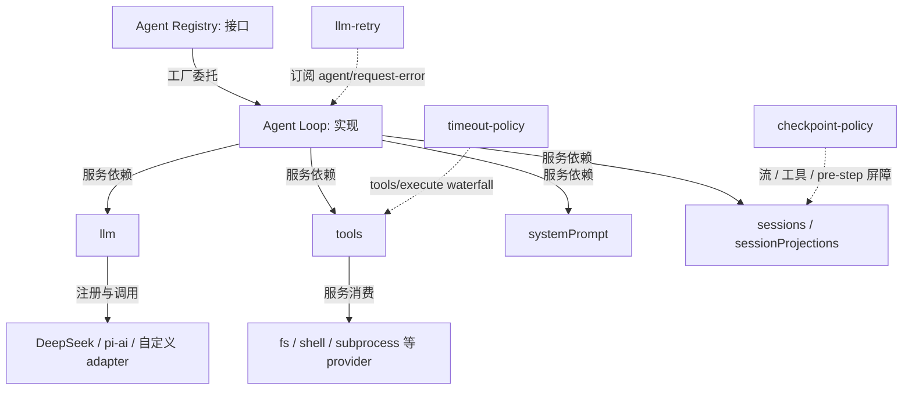
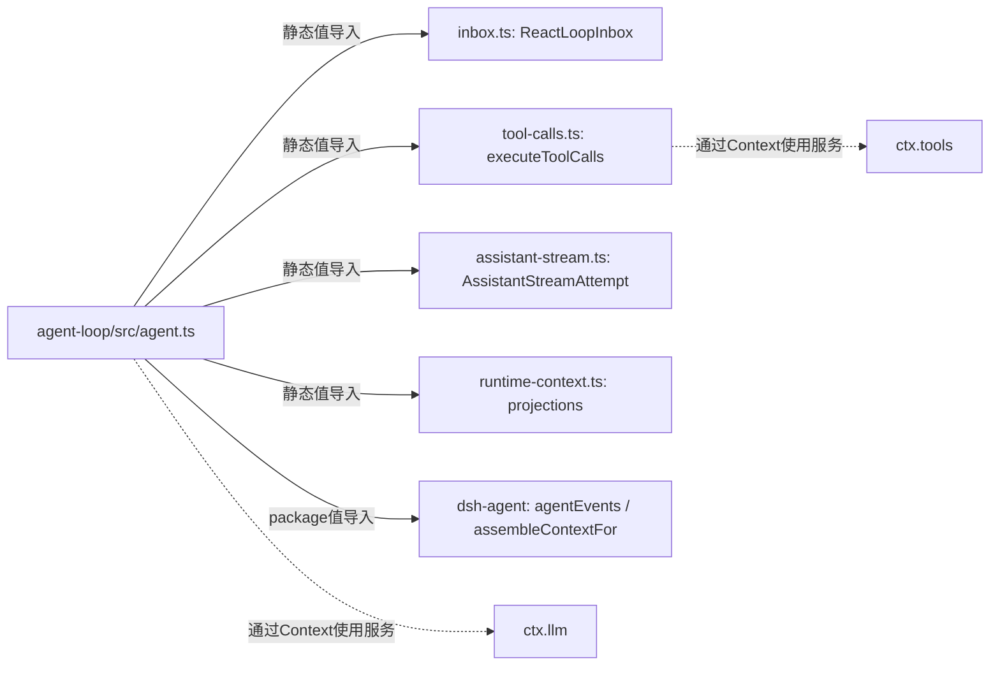
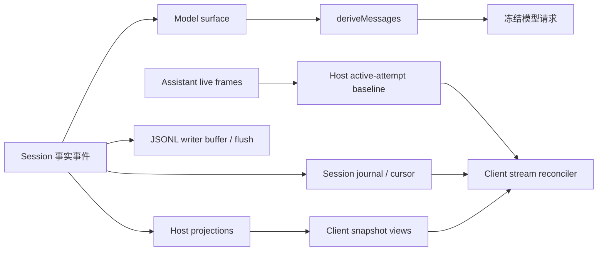
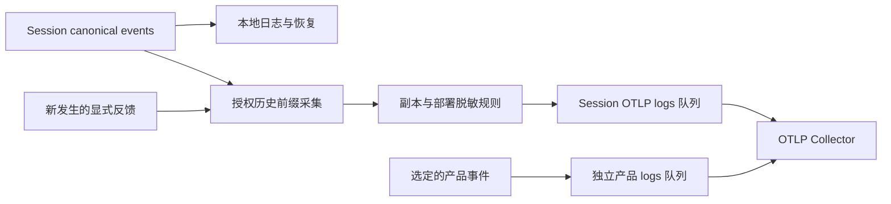
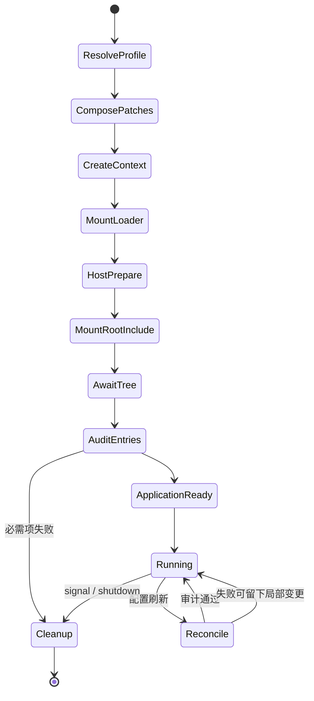

# 第一篇章：宏观架构与系统设计

基线：2026-10-04；`0.2.1-alpha.1`；commit `5badb15009ae1756c3afe0ae0cef1faafc290ccc`。本次补充保持该提交不变，按成熟 AI Agent Harness 的 16 项公共关注点梳理系统组成、机制与能力边界；执行细节见[第二篇](02-runtime-source.md)，扩展操作见[第三篇](03-extension-practices.md)。这是一份固定版本的架构分析，不是最新线上版本的能力声明。

正文以源码事实和该提交内的官方说明为依据；架构评价注明“分析判断”，尚需实现的方案注明“改造建议”。源码链接统一固定 SHA，证据类别、路径和行号见[公共索引](appendices/evidence-index.md)。本次新增的契约验证与原有验证分开记录，详见[验证附录](appendices/validation.md)。

阅读路径：先读架构总览建立系统地图，再按任务与执行（1—3）、上下文与工具（4—6）、运行治理（7—11）、可验证性与交付演进（12—16）阅读。各项讨论覆盖了什么、由谁负责，以及在哪些条件下仍需要上层系统补足。

## 架构总览

### 定位与组合方式

DeepSeek Harness 是一个把模型调用、工具、持久会话、交互载体和扩展插件组装成 Agent 应用的运行框架。它有官方模型接入，也有 `llm-pi-ai` 等模型提供者；不能把它理解成单一模型 SDK。支持的 Node 应用通过 `dsh` 命名 profile 启动，Web、一次性 Headless、SDK 和 ACP 是不同组装，不是同一个服务器换皮。Electron 使用其专有 profile 和 Host 载体；浏览器 WebWorker 预览属于实验运行面。[E01](https://github.com/deepseek-ai/deepseek-harness/blob/5badb15009ae1756c3afe0ae0cef1faafc290ccc/docs/architecture.md#L15-L55) [E09](https://github.com/deepseek-ai/deepseek-harness/blob/5badb15009ae1756c3afe0ae0cef1faafc290ccc/apps/cli/src/bin.ts#L26-L73)

“一切皆插件”的精确含义是：产品能力，包括具体 Agent Loop，沿 Cordis 插件／服务机制挂载。最小 Context 仍内建 Reflect、Registry、Events、Logger 和根 Fiber；不意味着没有框架基础，也不意味着第三方插件受安全沙箱保护。本文把它描述为**插件组合架构**；若用“微内核”类比，内核仅指这些组合与生命周期机制，不能沿用操作系统进程隔离、特权级或 ABI 稳定性含义。[E02](https://github.com/deepseek-ai/deepseek-harness/blob/5badb15009ae1756c3afe0ae0cef1faafc290ccc/vendor/cordis/src/context.ts#L70-L145) [E16](https://github.com/deepseek-ai/deepseek-harness/blob/5badb15009ae1756c3afe0ae0cef1faafc290ccc/packages/core/agent/src/index.ts#L358-L415)

官方所谓时空可组合，可以落到两个可观察机制：空间维度由 Context、服务隔离 realm、Harness Agent Scope 决定可见性；时间维度由依赖满足后激活、effect 注册撤销和 Fiber 重载决定存续。服务可替换、监听器可卸载，均不自动提供业务事务、状态迁移或任意时刻无损替换。[E03](https://github.com/deepseek-ai/deepseek-harness/blob/5badb15009ae1756c3afe0ae0cef1faafc290ccc/vendor/cordis/src/reflect.ts#L277-L327) [E04](https://github.com/deepseek-ai/deepseek-harness/blob/5badb15009ae1756c3afe0ae0cef1faafc290ccc/vendor/cordis/src/fiber.ts#L611-L752) [E48](https://github.com/deepseek-ai/deepseek-harness/blob/5badb15009ae1756c3afe0ae0cef1faafc290ccc/packages/core/scope/src/index.ts#L1-L180)

### 系统边界与分层

图 A1 区分应用载体、进程内组合和外部 I/O；并不把所有箭头当作静态 import。SDK Server 按输入输出流处理 JSON-RPC；Python 客户端创建子进程并拥有 reader 线程。Web Gateway 负责流与 Remote 协议，其传输不是 Cordis 事件总线直接跨进程广播。[E60](https://github.com/deepseek-ai/deepseek-harness/blob/5badb15009ae1756c3afe0ae0cef1faafc290ccc/packages/sdk/server/src/index.ts#L46-L100) [E61](https://github.com/deepseek-ai/deepseek-harness/blob/5badb15009ae1756c3afe0ae0cef1faafc290ccc/python/sdk/src/deepseek_harness/client.py#L71-L92) [E45](https://github.com/deepseek-ai/deepseek-harness/blob/5badb15009ae1756c3afe0ae0cef1faafc290ccc/packages/api/gateway/src/client/journal-stream.ts#L261-L391)

|层／子系统|职责与实际边界|状态所有者／主体|主要契约|
|---|---|---|---|
|应用组装|profile、bundle、patch、启动环境与 readiness|CLI／Desktop Host|`runProfile`、`boot`、Loader entries|
|框架基础|插件实例、服务注入、事件分发、effects 清理|Cordis root、Fiber|`ctx.plugin`、`ctx.provide`、`ctx.on/effect`|
|Agent 接口|活实例登记、创建工厂、所有权与生命周期|`AgentRegistry`|`agents.setFactory/create/resume`|
|具体 Loop|收输入、驱动 Turn/Step、请求与工具迭代|`ReactLoopAgent`|`agent/pre-step`、`agent/request`|
|Session|连续事件序列、模型 surface、请求配置折叠|内存 Session|`append`、`deriveMessages`|
|Projection|类型化状态折叠、客户端裁剪视图、版本化 checkpoint|`SessionProjectionRegistry`|`register/stateOf/snapshot`|
|模型|注册路由、元信息、PreparedCall 与流规范化|`LlmRuntime`、adapter|`registerAdapter`、`prepareCall`、`llm/stream`|
|工具|schema、可见性、审批与执行中间件、结果规范化|`ToolRuntime` 与工具插件|`register/restrict/guard`、`tools/*`|
|持久化|write handle、buffer、flush、跨进程单写者|JSONL provider|`SessionPersistence`、`SessionHandle`|
|上下文|有序 prompt section／变量／动态 context、tools schema|SystemPrompt + Loop projections|`section/context/tools/variable`|
|客户端|Remote 控制快照、journal、assistant stream、UI slots|Host Controller / Client store|baseline、cursor、revision、slot注册|
|外围能力|MCP、LSP、SSH、web、skills、jobs、goal、schedule、workflow、subagent等|对应 provider、注册拥有者|逐包契约，不是 Loop 固定内置分支|

上表核心依据：[E16](https://github.com/deepseek-ai/deepseek-harness/blob/5badb15009ae1756c3afe0ae0cef1faafc290ccc/packages/core/agent/src/index.ts#L358-L415) [E20](https://github.com/deepseek-ai/deepseek-harness/blob/5badb15009ae1756c3afe0ae0cef1faafc290ccc/packages/core/agent-loop/src/agent.ts#L296-L395) [E26](https://github.com/deepseek-ai/deepseek-harness/blob/5badb15009ae1756c3afe0ae0cef1faafc290ccc/packages/core/session/src/index.ts#L718-L775) [E28](https://github.com/deepseek-ai/deepseek-harness/blob/5badb15009ae1756c3afe0ae0cef1faafc290ccc/packages/session/session-projection/src/index.ts#L253-L355) [E30](https://github.com/deepseek-ai/deepseek-harness/blob/5badb15009ae1756c3afe0ae0cef1faafc290ccc/packages/llm/llm/src/index.ts#L929-L1018) [E33](https://github.com/deepseek-ai/deepseek-harness/blob/5badb15009ae1756c3afe0ae0cef1faafc290ccc/packages/core/tools/src/index.ts#L1493-L1699) [E37](https://github.com/deepseek-ai/deepseek-harness/blob/5badb15009ae1756c3afe0ae0cef1faafc290ccc/packages/session/session-persistence/src/index.ts#L52-L173) [E59](https://github.com/deepseek-ai/deepseek-harness/blob/5badb15009ae1756c3afe0ae0cef1faafc290ccc/packages/core/system-prompt/src/index.ts#L454-L544)。外围全部包的身份、依赖与职责来源见[覆盖清单](appendices/coverage.md)，不会把只盘点的包写成深入验证。

#### 插件、服务、工具与应用的关系

插件是可挂载的代码单元，通常导出 `name`、`inject`、`Config`、`apply`，或是 Service 类。服务定义给出能力接口，提供者实现接口，消费者依赖服务；工具是通过 `tools.register()` 发布给模型的 schema／执行能力；bundle 是配置分发单元，profile 是应用组装。一个插件可提供服务、注册工具和订阅事件，因此这些分类不是互斥包目录。`WorkflowEngine` 就是定义层，具体 workflow provider 才执行脚本。[E32](https://github.com/deepseek-ai/deepseek-harness/blob/5badb15009ae1756c3afe0ae0cef1faafc290ccc/packages/core/tools/src/index.ts#L90-L208) [E57](https://github.com/deepseek-ai/deepseek-harness/blob/5badb15009ae1756c3afe0ae0cef1faafc290ccc/packages/workflow/workflow/src/index.ts#L150-L187) [E08](https://github.com/deepseek-ai/deepseek-harness/blob/5badb15009ae1756c3afe0ae0cef1faafc290ccc/vendor/include/src/index.ts#L57-L123)

图 A2 的实线是调用／注入依赖，虚线是事件扩展。`AgentRegistry` 不静态依赖具体 Loop 来创建 Agent，而是委托已登记 factory；这才是实际的解耦接缝。不同 package 清单中的 dependencies、peerDependencies、devDependencies 共 5,209 条工作区内部边，另见[清单依赖图 JSON](appendices/dependency-graph.json)。这些边仅表示 manifest 声明，不证明动态服务或事件依赖。[E16](https://github.com/deepseek-ai/deepseek-harness/blob/5badb15009ae1756c3afe0ae0cef1faafc290ccc/packages/core/agent/src/index.ts#L358-L415) [E31](https://github.com/deepseek-ai/deepseek-harness/blob/5badb15009ae1756c3afe0ae0cef1faafc290ccc/packages/llm/llm-retry/src/index.ts#L188-L259) [E35](https://github.com/deepseek-ai/deepseek-harness/blob/5badb15009ae1756c3afe0ae0cef1faafc290ccc/packages/guard/timeout-policy/src/index.ts#L55-L81) [E38](https://github.com/deepseek-ai/deepseek-harness/blob/5badb15009ae1756c3afe0ae0cef1faafc290ccc/packages/session/session-checkpoint-policy/src/index.ts#L54-L83)

#### 静态导入与动态能力使用

图 A3 是已读实现的静态值导入子图；TypeScript type-only imports不当作运行调用。它与A2的注入／事件关系及A1的进程传输分开，清单依赖图仍只表示manifest声明。[E77](https://github.com/deepseek-ai/deepseek-harness/blob/5badb15009ae1756c3afe0ae0cef1faafc290ccc/packages/core/agent-loop/src/agent.ts#L1-L40) [E23](https://github.com/deepseek-ai/deepseek-harness/blob/5badb15009ae1756c3afe0ae0cef1faafc290ccc/packages/core/agent-loop/src/tool-calls.ts#L60-L290)

### 工程结构与技术栈

完整基线有 **14,208 个 tracked 文件、341 个 workspace 成员**；pnpm 递归清单含根工具项目共 342 项。原生平台包也纳入统计，没有只数 `packages/*/*`。完整机器清单和逐包覆盖表见附录。

|目录|组织意图与交付关系|
|---|---|
|`packages/*/*`|按能力分组；定义、provider、consumer、UI 分别成包，很多包独立发布|
|`apps/cli`|拥有 `dsh` bin 和统一 profile runner|
|`apps/web`|前端资产构建，实际 Host 由 CLI Web profile 启动|
|`apps/desktop`|Electron 分发、平台资源与 Desktop Host，不是另写一套 Loop|
|`vendor/*`|固定的 Cordis 家族源码和项目修改；不等于 npm 上同名 upstream 行为|
|`native/system`|Node-API、POSIX flock、Linux launcher及平台预构建包；独立版本与 BSD-3-Clause|
|`python`|Python SDK、runtime wheel和构建／验证材料|
|`scripts`、`snapshots`、`benchmarks`|生成、发布、静态契约与行为快照、专项性能研究；本研究未运行完整benchmark|
|`docs`、`.agents`、`.github`、`website`|架构／决策记录、维护规则、CI、文档网站；官方说明需与实现互证|
|`patches`|第三方依赖补丁；评价其行为时不能忽略补丁|

主要语言是 TypeScript，界面使用 TSX／React，另有 Python、C/C++、Shell 和 YAML。根工具链采用 pnpm、tsdown、TypeScript 与 Vitest；Web 和 Desktop 有各自的构建配置。根测试环境的 Vite 版本与应用 manifest 声明不同，应分别解读。Node 支持范围、声明版本与本机实际版本统一记录在[基线](appendices/baseline.md)，避免把开发测试环境误当作所有发布形态的运行要求。

源码测试通过工作区 paths 解析；发布包入口指向构建后的 `lib/index.js` 和 `lib/types`。两者是不同的验证层：源码测试通过，不能代替 npm 安装、Electron 分发包或单文件可执行程序的安装启动验证。Host 与 Client 也有不同的类型编译域，扩展应遵守对应契约。[E68](https://github.com/deepseek-ai/deepseek-harness/blob/5badb15009ae1756c3afe0ae0cef1faafc290ccc/vendor/README.md#L1-L69)

## 1. 任务定义与完成语义

Harness 需要区分三种结果：一次模型调用结束、一个 Turn 结束，以及用户的任务真正完成。当前 Loop 的 `completed` 表示执行控制流已经收敛，例如模型不再提出工具调用或工具请求结束本回合；`maxTokens`、`aborted`、`error`、`blocked` 则描述其他终止原因。这些状态可被上层消费，但没有将业务验收条件编码成统一的完成判定。[E20](https://github.com/deepseek-ai/deepseek-harness/blob/5badb15009ae1756c3afe0ae0cef1faafc290ccc/packages/core/agent-loop/src/agent.ts#L296-L395) [E21](https://github.com/deepseek-ai/deepseek-harness/blob/5badb15009ae1756c3afe0ae0cef1faafc290ccc/packages/core/agent-loop/src/agent.ts#L398-L544)

跨回合目标由 `goal`、`goal-round-driver`、`tool-goal` 和命令入口分工实现。`GoalService` 保存每个 Session 的一个当前目标，记录目标文本、修订号、阶段、已准入回合数与回合上限；变更写入 `goal/change`，消费者须以准确的目标 id 与 revision 更新，避免旧视图覆盖新目标。基础 bundle 同时挂载目标服务、驱动和命令；只挂载服务会提供状态读写，并不会自行运行任务。[E78](https://github.com/deepseek-ai/deepseek-harness/blob/5badb15009ae1756c3afe0ae0cef1faafc290ccc/packages/goal/goal/src/index.ts#L240-L280) [E79](https://github.com/deepseek-ai/deepseek-harness/blob/5badb15009ae1756c3afe0ae0cef1faafc290ccc/packages/goal/goal/src/index.ts#L303-L424) [E115](https://github.com/deepseek-ai/deepseek-harness/blob/5badb15009ae1756c3afe0ae0cef1faafc290ccc/packages/bundle/base/cordis.patch.yml#L313-L323)

目标的 `active`、`paused`、`blocked`、`complete` 是可恢复的业务阶段；自动续跑的 `armed/disarmed` 是进程内权限状态。驱动在 Agent 静止后先做持久化 checkpoint，再为同一个 Session 预留下一回合；进入 Step 前，前后两次校验当前目标、修订号与预留消息。达到回合上限后写入 `round-limit` 阻塞原因。恢复或重新挂载驱动不会继承之前的自动执行授权，需要显式重新激活。[E81](https://github.com/deepseek-ai/deepseek-harness/blob/5badb15009ae1756c3afe0ae0cef1faafc290ccc/packages/goal/goal-round-driver/src/index.ts#L137-L205) [E82](https://github.com/deepseek-ai/deepseek-harness/blob/5badb15009ae1756c3afe0ae0cef1faafc290ccc/packages/goal/goal-round-driver/src/index.ts#L350-L459)

任务拆解另有 `plan-mode` 与 `todo_write`。前者管理规划阶段及审阅后的模式切换，后者维护模型声明的进度清单；它们不等于目标状态机，也没有在基础 Loop 中形成一个统一的任务 DAG。尤其是 todo 当前投影会在下一个 `turn/start` 清空，历史事件仍在日志中，因此不能把清单展示理解为跨回合持续维护的任务数据库。[E85](https://github.com/deepseek-ai/deepseek-harness/blob/5badb15009ae1756c3afe0ae0cef1faafc290ccc/packages/todo/tool-todo/src/index.ts#L117-L134) [E86](https://github.com/deepseek-ai/deepseek-harness/blob/5badb15009ae1756c3afe0ae0cef1faafc290ccc/packages/plan/plan-mode/src/index.ts#L277-L348) [E87](https://github.com/deepseek-ai/deepseek-harness/blob/5badb15009ae1756c3afe0ae0cef1faafc290ccc/packages/plan/plan-mode/src/index.ts#L418-L453)

**分析判断：**本版本已具备同会话长期目标治理；目标完成仍由有权限的调用者申报，独立评测认证明确留给另一个策略层。`tool-goal` 对自动回合自报阻塞设置最低回合数，实际检查的是已准入回合数量，并没有算法验证连续回合遇到的是同一个阻塞条件。业务上需要的完成标准、证明材料和阻塞归因应由验收策略补足。[E80](https://github.com/deepseek-ai/deepseek-harness/blob/5badb15009ae1756c3afe0ae0cef1faafc290ccc/packages/goal/goal/README.md#L152-L159) [E84](https://github.com/deepseek-ai/deepseek-harness/blob/5badb15009ae1756c3afe0ae0cef1faafc290ccc/packages/goal/tool-goal/src/index.ts#L207-L331)

## 2. Agent Loop 与执行模型

执行职责被分成 Registry、具体 Loop 和可插入的策略。Registry 拥有工厂与活实例登记；`ReactLoopAgent` 拥有 inbox、运行状态、取消信号以及 Turn/Step 驱动。输入先被 claim，经过 `agent/pre-step` 的准入 waterfall，才写入已接纳消息并启动 Step；拒绝或空的首次输入可以结束一个零 Step 的 Turn。这使“接受了一条请求”和“已经调用模型”成为不同事实。[E16](https://github.com/deepseek-ai/deepseek-harness/blob/5badb15009ae1756c3afe0ae0cef1faafc290ccc/packages/core/agent/src/index.ts#L358-L415) [E20](https://github.com/deepseek-ai/deepseek-harness/blob/5badb15009ae1756c3afe0ae0cef1faafc290ccc/packages/core/agent-loop/src/agent.ts#L296-L395) [E63](https://github.com/deepseek-ai/deepseek-harness/blob/5badb15009ae1756c3afe0ae0cef1faafc290ccc/packages/core/agent/src/runtime-types.ts#L309-L350) [E66](https://github.com/deepseek-ai/deepseek-harness/blob/5badb15009ae1756c3afe0ae0cef1faafc290ccc/packages/core/agent-loop/src/inbox.ts#L109-L148)

一个 Step 完成请求准备、模型流消费和工具执行。工具结果若要求继续推理，Loop 进入下一个 Step；模型请求失败则交给 `agent/request-error` 的恢复策略。Step 可以包含多次模型 attempt，每次 attempt 都有自己的流结算，不能把 Step 计数直接当成模型调用次数。流式内容在结算前属于 live 状态，成功消息或失败 attempt 才进入 Session 的事实记录。[E21](https://github.com/deepseek-ai/deepseek-harness/blob/5badb15009ae1756c3afe0ae0cef1faafc290ccc/packages/core/agent-loop/src/agent.ts#L398-L544) [E24](https://github.com/deepseek-ai/deepseek-harness/blob/5badb15009ae1756c3afe0ae0cef1faafc290ccc/packages/core/agent-loop/src/assistant-stream.ts#L45-L110) [E31](https://github.com/deepseek-ai/deepseek-harness/blob/5badb15009ae1756c3afe0ae0cef1faafc290ccc/packages/llm/llm-retry/src/index.ts#L188-L259)

控制入口包括 `send`、`followup`、`steer`、`inject`、`cancel` 和 `whenIdle`，用于不同时间边界的输入与干预。`whenIdle` 表示 Loop 的运行收敛；持久化由 Session provider 与 checkpoint 管理，不能用它证明日志已落盘。目标驱动也是这些入口的消费者，它通过 `followup` 续跑，而不是在 Loop 中增加一个不可替换的目标分支。[E19](https://github.com/deepseek-ai/deepseek-harness/blob/5badb15009ae1756c3afe0ae0cef1faafc290ccc/packages/core/agent-loop/src/agent.ts#L154-L241) [E37](https://github.com/deepseek-ai/deepseek-harness/blob/5badb15009ae1756c3afe0ae0cef1faafc290ccc/packages/session/session-persistence/src/index.ts#L52-L173) [E81](https://github.com/deepseek-ai/deepseek-harness/blob/5badb15009ae1756c3afe0ae0cef1faafc290ccc/packages/goal/goal-round-driver/src/index.ts#L137-L205)

防止失控循环有不同强度的措施。回合上限能阻止驱动再启动自动回合；`repeat-tool-reminder` 则按工具名与规范化参数累计重复次数，通过 post-execute 给模型追加提醒，明确不否决执行。它能提示“尝试缺乏进展”，但不是语义上的进度检测器或强制熔断器。**改造建议：**需要严格停止条件的应用，应在准入或任务策略层实现确定的上限与验收规则，并保留终止原因。[E81](https://github.com/deepseek-ai/deepseek-harness/blob/5badb15009ae1756c3afe0ae0cef1faafc290ccc/packages/goal/goal-round-driver/src/index.ts#L137-L205) [E100](https://github.com/deepseek-ai/deepseek-harness/blob/5badb15009ae1756c3afe0ae0cef1faafc290ccc/packages/guard/repeat-tool-reminder/src/index.ts#L188-L239)

## 3. 模型接入与能力适配

模型接入的中心是 `LlmRuntime` 与 adapter 注册表。运行时按 provider/model 路由准备 `PreparedCall`，把一次调用使用的 adapter、解析后配置和模型能力绑定在一起；该次模型流的派发使用这份绑定，避免请求日志与实际派发因注册变化而指向不同实现。`llm-pi-ai` 等 provider 扩展表明系统具有多提供者接缝，但每个路由能做什么仍由其 adapter 声明与实现决定。[E30](https://github.com/deepseek-ai/deepseek-harness/blob/5badb15009ae1756c3afe0ae0cef1faafc290ccc/packages/llm/llm/src/index.ts#L929-L1018) [E70](https://github.com/deepseek-ai/deepseek-harness/blob/5badb15009ae1756c3afe0ae0cef1faafc290ccc/packages/llm/llm/src/index.ts#L389-L435)

能力契约包含已知的上下文容量、默认输出上限、可选 reasoning effort，以及对会话中途更新 system prompt 和工具声明的支持方式。显式请求不支持的 reasoning effort 会在调用前报错，系统不会把它悄悄映射成另一个等级。`toolUpdate` 缺省意味着每次完整声明工具；`addition-only` 与 `in-history` 的支持范围也不同。因此，换模型涉及上下文与历史重建策略，不能仅视为替换 URL 或 model 字符串。[E89](https://github.com/deepseek-ai/deepseek-harness/blob/5badb15009ae1756c3afe0ae0cef1faafc290ccc/packages/llm/llm/src/types.ts#L379-L421) [E90](https://github.com/deepseek-ai/deepseek-harness/blob/5badb15009ae1756c3afe0ae0cef1faafc290ccc/packages/llm/llm/src/index.ts#L885-L918)

adapter 私有 `replayState` 随成功响应保存，用于其自己的历史恢复。切换到其他 adapter 时，Runtime 会剥离不属于新 adapter 的私有状态，保留规范化消息和来源。这个隔离避免把提供者私有协议硬塞给另一提供者，但不能保证跨模型推理行为、缓存命中或答案完全一致。[E91](https://github.com/deepseek-ai/deepseek-harness/blob/5badb15009ae1756c3afe0ae0cef1faafc290ccc/packages/llm/llm/src/index.ts#L984-L998)

结构化输出也要明确作用域。进程内子 Agent 的 `outputSchema` 在创建时挂载专属 `structured_output` 工具：校验参数，等待最终成功的 `tools/result` 才捕获结果，随后通过 guard 阻止继续执行；嵌套执行还要等待外层结果成功。这个机制是子 Agent 的工具与结果契约，不能外推为所有顶层模型路由均支持原生 JSON Schema 输出。[E92](https://github.com/deepseek-ai/deepseek-harness/blob/5badb15009ae1756c3afe0ae0cef1faafc290ccc/packages/subagent/subagent-in-process-driver/src/structured.ts#L49-L141) [E93](https://github.com/deepseek-ai/deepseek-harness/blob/5badb15009ae1756c3afe0ae0cef1faafc290ccc/packages/subagent/subagent-in-process-driver/src/index.ts#L110-L139)

**分析判断：**模型适配已覆盖执行绑定、能力差异与私有历史边界。生产应用仍需分别验证所用 provider 的流异常、工具调用、多模态与 reasoning 行为；本研究的离线 mock 测试没有证明真实服务可用性。

## 4. 上下文工程

Session 事件构成内存中的权威事实序列。`append` 先校验、冻结，再提交事件并通知观察者；模型 surface 选出当前可见的消息节点，压缩或替换可以遮蔽旧节点而不删除原始日志。模型请求由这些消息、`request/header`、`request/context` 和工具历史派生，再冻结为本次请求。因此，事实日志、模型上下文与界面历史是不同视图。[E26](https://github.com/deepseek-ai/deepseek-harness/blob/5badb15009ae1756c3afe0ae0cef1faafc290ccc/packages/core/session/src/index.ts#L718-L775) [E27](https://github.com/deepseek-ai/deepseek-harness/blob/5badb15009ae1756c3afe0ae0cef1faafc290ccc/packages/core/session/src/index.ts#L856-L904) [E22](https://github.com/deepseek-ai/deepseek-harness/blob/5badb15009ae1756c3afe0ae0cef1faafc290ccc/packages/core/agent-loop/src/agent.ts#L547-L686)

系统提示词通过 `section`／`variable` 等有序组装。变化如何进入请求取决于 PreparedCall 的 `systemPromptUpdate`／`toolUpdate` 能力：可采用历史追加、增量工具声明，或重建完整声明；具体方式还受请求 series 边界影响。动态环境通过 context 投影的变化进入记录；扩展不应绕过日志直接改写模型消息。compaction 插件可以在请求前检查上下文压力，也可以参与窗口溢出错误的恢复，请求重建仍须遵守相应恢复决策。[E59](https://github.com/deepseek-ai/deepseek-harness/blob/5badb15009ae1756c3afe0ae0cef1faafc290ccc/packages/core/system-prompt/src/index.ts#L454-L544) [E29](https://github.com/deepseek-ai/deepseek-harness/blob/5badb15009ae1756c3afe0ae0cef1faafc290ccc/packages/core/agent-loop/src/runtime-context.ts#L88-L164) [E30](https://github.com/deepseek-ai/deepseek-harness/blob/5badb15009ae1756c3afe0ae0cef1faafc290ccc/packages/llm/llm/src/index.ts#L929-L1018) [E62](https://github.com/deepseek-ai/deepseek-harness/blob/5badb15009ae1756c3afe0ae0cef1faafc290ccc/packages/compaction/compaction-basic/src/index.ts#L158-L221)

工作区指令由 `agent-instructions` 在 Step 准入边界组装，等待此前的指令投影更新，再将实际需要的上下文插入准入通过的消息批次；被拒绝的 Step 不会被这段上下文强行变成一次独立模型请求。工具触碰文件后也可能引起新的指令投影，说明上下文是随执行环境变化的请求状态，而不是启动时读取一次的静态 prompt。[E117](https://github.com/deepseek-ai/deepseek-harness/blob/5badb15009ae1756c3afe0ae0cef1faafc290ccc/packages/context/agent-instructions/src/index.ts#L315-L340)

MCP 连接还可以把带服务归属的服务器 instructions 注册为 `MCP_SERVERS` 提示词 section，关闭变量插值。标注来源与限制插值有助于解释上下文如何产生，但这不是对文字语义的信任认证；第三方 instructions 依然属于需要审查的输入。不能因为提示词有 section 或日志能追溯，就声称系统已经解决 prompt injection。[E96](https://github.com/deepseek-ai/deepseek-harness/blob/5badb15009ae1756c3afe0ae0cef1faafc290ccc/packages/mcp/mcp-client/src/server-context.ts#L28-L40)

**分析判断：**这里的核心价值是让上下文组装、变更和压缩具有可解释的提交点。压缩后保留原日志有利于追溯，却不等于模型仍能看到全部事实，也不保证摘要无损。**改造建议：**应对目标约束、授权边界、未完成事项和证据引用建立压缩后的回归检查，避免关键要求在长任务中被摘要弱化。

## 5. 记忆、状态与持久化

状态按运行对象、可持久事实和可重建视图分工。Agent 或插件释放时，运行对象结束；Session 日志保存执行历史，projection 从历史折叠出状态。明确这些所有权和寿命，是讨论恢复与记忆的前提。

|名称|实际形态|关系与寿命|
|---|---|---|
|Context|Cordis原型继承／代理对象，访问服务并归属Fiber|应用root、插件上下文、Agent scope上下文；不是单纯请求DTO|
|Fiber|一个插件实例的生命周期、依赖epoch、effects集合|同一插件可以有多个Fiber；卸载撤销其拥有的注册|
|Agent|运行对象／接口；Loop实现维护phase、abort、inbox和options|与live Session共用id；handle拥有停止和释放权|
|Session|header + append-only事实事件 + surface／缓存|持久历史可跨Agent进程生命周期；对象不是持久存储本身|
|Turn|`turn/start`／`turn/end`圈出的事件边界|接纳拒绝或首输入变空时可以零Step|
|Step|`step/start`／`step/end`圈出的事件边界|可以含多次模型attempt和一批工具；不是独立持久对象|
|Attempt|一次模型流及其结算|live stream frame过程态；成功或失败结算写入一个Session事件|
|Scope|Harness opaque key及可配置父链|服务隔离realm与Scope不是同一机制；父层注册向子继承，事件向祖先监听传播|
|Projection|事件折叠出来的host state／wire view|可重建；不要反过来把UI缓存当作权威事实源|

事实依据：[E02](https://github.com/deepseek-ai/deepseek-harness/blob/5badb15009ae1756c3afe0ae0cef1faafc290ccc/vendor/cordis/src/context.ts#L70-L145) [E04](https://github.com/deepseek-ai/deepseek-harness/blob/5badb15009ae1756c3afe0ae0cef1faafc290ccc/vendor/cordis/src/fiber.ts#L611-L752) [E17](https://github.com/deepseek-ai/deepseek-harness/blob/5badb15009ae1756c3afe0ae0cef1faafc290ccc/packages/core/agent-loop/src/index.ts#L479-L640) [E20](https://github.com/deepseek-ai/deepseek-harness/blob/5badb15009ae1756c3afe0ae0cef1faafc290ccc/packages/core/agent-loop/src/agent.ts#L296-L395) [E24](https://github.com/deepseek-ai/deepseek-harness/blob/5badb15009ae1756c3afe0ae0cef1faafc290ccc/packages/core/agent-loop/src/assistant-stream.ts#L45-L110) [E25](https://github.com/deepseek-ai/deepseek-harness/blob/5badb15009ae1756c3afe0ae0cef1faafc290ccc/packages/core/session/src/types.ts#L79-L137) [E28](https://github.com/deepseek-ai/deepseek-harness/blob/5badb15009ae1756c3afe0ae0cef1faafc290ccc/packages/session/session-projection/src/index.ts#L253-L355) [E48](https://github.com/deepseek-ai/deepseek-harness/blob/5badb15009ae1756c3afe0ae0cef1faafc290ccc/packages/core/scope/src/index.ts#L1-L180)。Agent 对外只有 `idle`／`running` 两种状态；内部维护阶段表现为 idle，释放后的 Agent 从 Registry 退出。Session、Turn、Step 也不是三个层层嵌套的类实例：后两者是日志中的执行边界。

图 A4 的 `LOG → DISK` 包含异步缓冲和显式 flush，不表示每个事件都同步 fsync。checkpoint 策略在模型流、顶层工具执行和 Step 准入等边界调用 flush，降低副作用先于前置事实保存的风险；外部操作完成而结果未落盘时若进程退出，恢复仍可能只能得到 unknown outcome。[E38](https://github.com/deepseek-ai/deepseek-harness/blob/5badb15009ae1756c3afe0ae0cef1faafc290ccc/packages/session/session-checkpoint-policy/src/index.ts#L54-L83) [E40](https://github.com/deepseek-ai/deepseek-harness/blob/5badb15009ae1756c3afe0ae0cef1faafc290ccc/packages/session/session-persistence-jsonl/src/storage.ts#L187-L263) [E43](https://github.com/deepseek-ai/deepseek-harness/blob/5badb15009ae1756c3afe0ae0cef1faafc290ccc/packages/core/session/src/repair.ts#L14-L97)

长期记忆需要与上述执行历史分开理解。官方提供的 MCP 记忆配置默认关闭，Harness 负责启动 stdio 子进程或连接 HTTP 服务、发现工具并纳入 ToolRuntime；它不替外部服务安装数据库、选择 embedding 模型、迁移数据或管理云账户。`syncTools` 将远端调用包装成 Harness 工具，并拥有注册撤销句柄；stdio 生命周期由本地插件管理，独立 HTTP 服务仍由外部系统负责。[E94](https://github.com/deepseek-ai/deepseek-harness/blob/5badb15009ae1756c3afe0ae0cef1faafc290ccc/docs/user/guide/mcp-memory.md#L5-L31) [E95](https://github.com/deepseek-ai/deepseek-harness/blob/5badb15009ae1756c3afe0ae0cef1faafc290ccc/packages/mcp/mcp-client/src/tools.ts#L113-L160)

因此，日志持久化解决的是会话事实保存与状态重建；跨会话的语义检索、记忆更新、遗忘、身份隔离与冲突解决，则取决于实际接入的记忆服务和应用策略。**分析判断：**应将本版本描述为“持久会话与恢复有原生支持、长期记忆可通过 MCP 扩展”，而不是宣称内置了统一的长期记忆系统。外部记忆的写入还属于有副作用的工具操作，不能假设 resume 会撤销或重复它。[E94](https://github.com/deepseek-ai/deepseek-harness/blob/5badb15009ae1756c3afe0ae0cef1faafc290ccc/docs/user/guide/mcp-memory.md#L5-L31) [E43](https://github.com/deepseek-ai/deepseek-harness/blob/5badb15009ae1756c3afe0ae0cef1faafc290ccc/packages/core/session/src/repair.ts#L14-L97)

## 6. 工具与执行环境契约

工具是模型可见的 schema 与执行能力，执行环境则由文件系统、shell、subprocess、sandbox 等 provider 提供。ToolRuntime 统一工具登记、作用域、参数与结果规范化，执行分成 prepare、dispatch 与 finalize；限制集合和单调 guard 在真正派发前生效。工具 body 获得与调用相关的 Agent、信号和执行上下文，经过流水线后才形成模型历史中的规范结果。[E32](https://github.com/deepseek-ai/deepseek-harness/blob/5badb15009ae1756c3afe0ae0cef1faafc290ccc/packages/core/tools/src/index.ts#L90-L208) [E33](https://github.com/deepseek-ai/deepseek-harness/blob/5badb15009ae1756c3afe0ae0cef1faafc290ccc/packages/core/tools/src/index.ts#L1493-L1699) [E34](https://github.com/deepseek-ai/deepseek-harness/blob/5badb15009ae1756c3afe0ae0cef1faafc290ccc/packages/core/tools/src/schema.ts#L554-L632) [E69](https://github.com/deepseek-ai/deepseek-harness/blob/5badb15009ae1756c3afe0ae0cef1faafc290ccc/packages/core/tools/src/index.ts#L1063-L1155)

这层契约的重要性在于：模型看到的工具定义、策略允许的操作，以及实际执行环境必须对应。内置消费者经由 `ctx.fs` 或 subprocess provider 使用能力，文件沙箱在真正 write/edit 时再次检查目标；MCP 工具也经由注册桥接进入同一服务。若第三方插件直接调用 Node 文件或进程 API，则可能绕开这些能力策略，不能因为它被“注册成插件”就视为安全。[E50](https://github.com/deepseek-ai/deepseek-harness/blob/5badb15009ae1756c3afe0ae0cef1faafc290ccc/packages/fs/fs-sandbox/src/index.ts#L80-L140) [E52](https://github.com/deepseek-ai/deepseek-harness/blob/5badb15009ae1756c3afe0ae0cef1faafc290ccc/packages/subprocess/subprocess-local/src/index.ts#L107-L138) [E95](https://github.com/deepseek-ai/deepseek-harness/blob/5badb15009ae1756c3afe0ae0cef1faafc290ccc/packages/mcp/mcp-client/src/tools.ts#L113-L160)

工具成功不是 body 返回一个对象便立即成立。最终结果仍可能被流水线策略转换或拒绝；子 Agent 结构化输出和 `present` 都在最终 `tools/result` 成功后才提交自己的结果状态。这个提交边界支持上层一致地消费工具结果，但不把已经发生的外部写入自动变成可回滚事务。[E33](https://github.com/deepseek-ai/deepseek-harness/blob/5badb15009ae1756c3afe0ae0cef1faafc290ccc/packages/core/tools/src/index.ts#L1493-L1699) [E92](https://github.com/deepseek-ai/deepseek-harness/blob/5badb15009ae1756c3afe0ae0cef1faafc290ccc/packages/subagent/subagent-in-process-driver/src/structured.ts#L49-L141) [E109](https://github.com/deepseek-ai/deepseek-harness/blob/5badb15009ae1756c3afe0ae0cef1faafc290ccc/packages/deliverables/tool-present/src/index.ts#L70-L108)

取消和清理同样属于工具契约。超时策略向执行 signal 发出取消，并等待底层执行安静下来；subprocess provider 管理已启动进程的退出。**分析判断：**插件必须兑现取消响应和资源释放，运行时才有能力安全推进卸载；只是设定一个 timeout 数值，不能证明不合作的第三方代码已经停止。具体执行顺序与扩展要求分别见第二、第三篇。[E35](https://github.com/deepseek-ai/deepseek-harness/blob/5badb15009ae1756c3afe0ae0cef1faafc290ccc/packages/guard/timeout-policy/src/index.ts#L55-L81) [E52](https://github.com/deepseek-ai/deepseek-harness/blob/5badb15009ae1756c3afe0ae0cef1faafc290ccc/packages/subprocess/subprocess-local/src/index.ts#L107-L138)

## 7. 可靠性恢复与副作用一致性

“回放”需要说明具体含义：读取历史、按事件折叠状态、重建模型请求，与重新执行模型或工具是四种不同操作。只有重新执行会产生新的调用成本和副作用。resume 获取写所有权，读取历史并修补中断尾部，再发布新的 Agent；fork 复制选定前缀，添加 seed 标记并补齐边界。二者都不会自动重跑历史工具，也不保证真实模型重新作答一致。[E18](https://github.com/deepseek-ai/deepseek-harness/blob/5badb15009ae1756c3afe0ae0cef1faafc290ccc/packages/core/agent-loop/src/index.ts#L807-L866) [E43](https://github.com/deepseek-ai/deepseek-harness/blob/5badb15009ae1756c3afe0ae0cef1faafc290ccc/packages/core/session/src/repair.ts#L14-L97) [E44](https://github.com/deepseek-ai/deepseek-harness/blob/5badb15009ae1756c3afe0ae0cef1faafc290ccc/packages/core/session/src/fork.ts#L1-L30)

恢复机制针对不同故障边界处理，不能统称为“自动重试”。模型请求的 retry 负责请求失败后的策略恢复及流清理；中断工具调用的 repair 则根据执行是否开始，补入 `TOOL_NOT_STARTED` 或 `TOOL_OUTCOME_UNKNOWN`。后者主动保留“不知道外部操作是否已经完成”的事实，避免用虚构结果掩盖不确定性。[E31](https://github.com/deepseek-ai/deepseek-harness/blob/5badb15009ae1756c3afe0ae0cef1faafc290ccc/packages/llm/llm-retry/src/index.ts#L188-L259) [E43](https://github.com/deepseek-ai/deepseek-harness/blob/5badb15009ae1756c3afe0ae0cef1faafc290ccc/packages/core/session/src/repair.ts#L14-L97)

|故障边界|本版本的处理|恢复后仍需确认什么|
|---|---|---|
|模型请求／流失败|请求错误 hook、可控重试、attempt 结算|重试可能再计费；输出和缓存状态不保证与原尝试相同|
|工具超时／取消|取消信号、等待执行收敛、写入规范结果|外部系统是否已提交操作，取决于工具与其协议|
|Session 尾部中断|resume 修补未闭合边界与缺失工具结果|unknown outcome 不是操作失败证明，也不是重新执行授权|
|目标续跑 checkpoint 失败|驱动 disarm，阻止下一自动回合|持久状态与运行权限要分别确认，不能静默继续|
|进程退出后的本地 job|进程内作业记录不再存在|producer 的外部工作是否残留，不能仅靠 Session 重建判断|

表中机制依据：模型恢复 [E31](https://github.com/deepseek-ai/deepseek-harness/blob/5badb15009ae1756c3afe0ae0cef1faafc290ccc/packages/llm/llm-retry/src/index.ts#L188-L259)，工具取消 [E35](https://github.com/deepseek-ai/deepseek-harness/blob/5badb15009ae1756c3afe0ae0cef1faafc290ccc/packages/guard/timeout-policy/src/index.ts#L55-L81)，Session repair [E43](https://github.com/deepseek-ai/deepseek-harness/blob/5badb15009ae1756c3afe0ae0cef1faafc290ccc/packages/core/session/src/repair.ts#L14-L97)，目标 checkpoint [E81](https://github.com/deepseek-ai/deepseek-harness/blob/5badb15009ae1756c3afe0ae0cef1faafc290ccc/packages/goal/goal-round-driver/src/index.ts#L137-L205)，本地作业生命周期 [E97](https://github.com/deepseek-ai/deepseek-harness/blob/5badb15009ae1756c3afe0ae0cef1faafc290ccc/packages/jobs/jobs-local/src/index.ts#L128-L224) [E98](https://github.com/deepseek-ai/deepseek-harness/blob/5badb15009ae1756c3afe0ae0cef1faafc290ccc/packages/jobs/jobs-local/src/index.ts#L610-L683)。

**分析判断：**日志、checkpoint、单写者租约和中断修补已经构成可靠性的基础，但提供的是可追溯恢复，并非外部副作用的 exactly-once。**改造建议：**涉及支付、发布或第三方数据写入的工具，应使用业务幂等键、操作凭证和状态查询；在结果不明时先核对外部事实，再决定重试或补偿。没有外部系统参与的事务协议，Harness 日志本身无法保证一次且仅一次生效。

## 8. 并发、调度与资源治理

并发至少有四层，限制各自负责的资源，不能相互替代。

|层次|调度与限制|实际边界|
|---|---|---|
|单 Agent Loop|inbox claim、当前 Turn 驱动及取消收敛|运行对象拥有执行顺序；新的输入按相应入口与边界接纳|
|同 Step 工具批次|prepare 有序、允许并行的 body 有限并发、结果按模型顺序提交|保证可预测的工具历史；不保证 body 完成顺序，可能出现提交队头等待|
|本地后台 job|`jobs-local` 按 owner 限制活跃作业，默认上限 10；超限拒绝准入|记录在进程内 Map 中，不是自动排队或跨主机工作队列|
|子 Agent|SubagentRuntime 管理 provider、委派深度与可续接活跃子 Agent 容量|默认深度 1、可续接容量 8；具体执行与连续会话能力仍由 provider 负责|

依据分别为 [E20](https://github.com/deepseek-ai/deepseek-harness/blob/5badb15009ae1756c3afe0ae0cef1faafc290ccc/packages/core/agent-loop/src/agent.ts#L296-L395) [E66](https://github.com/deepseek-ai/deepseek-harness/blob/5badb15009ae1756c3afe0ae0cef1faafc290ccc/packages/core/agent-loop/src/inbox.ts#L109-L148)、[E23](https://github.com/deepseek-ai/deepseek-harness/blob/5badb15009ae1756c3afe0ae0cef1faafc290ccc/packages/core/agent-loop/src/tool-calls.ts#L60-L290)、[E97](https://github.com/deepseek-ai/deepseek-harness/blob/5badb15009ae1756c3afe0ae0cef1faafc290ccc/packages/jobs/jobs-local/src/index.ts#L128-L224) [E119](https://github.com/deepseek-ai/deepseek-harness/blob/5badb15009ae1756c3afe0ae0cef1faafc290ccc/packages/jobs/jobs-local/src/index.ts#L30-L61)、[E99](https://github.com/deepseek-ai/deepseek-harness/blob/5badb15009ae1756c3afe0ae0cef1faafc290ccc/packages/subagent/subagent/src/index.ts#L189-L202)。工具并行数的 Loop 默认值见 [E71](https://github.com/deepseek-ai/deepseek-harness/blob/5badb15009ae1756c3afe0ae0cef1faafc290ccc/packages/core/agent-loop/src/constants.ts#L1-L6)；作业容量、子 Agent 容量与工具并行数是三种不同计数。

目标驱动是单目标、同会话的后续回合调度器。它在 checkpoint 后再次确认没有竞争输入，通过预留消息和 revision 校验避免旧目标启动新工作；它不承担多个目标之间的全局优先级、跨用户公平性或机器资源分配。[E81](https://github.com/deepseek-ai/deepseek-harness/blob/5badb15009ae1756c3afe0ae0cef1faafc290ccc/packages/goal/goal-round-driver/src/index.ts#L137-L205) [E82](https://github.com/deepseek-ai/deepseek-harness/blob/5badb15009ae1756c3afe0ae0cef1faafc290ccc/packages/goal/goal-round-driver/src/index.ts#L350-L459)

`jobs-local` 将所有权与资源清理绑定：owner 释放时取消其作业，等待 settled，再移除记录；服务卸载对全部作业执行相同收敛。producer 的 cancel 如果返回却没有完成结算，清理可能一直等待；cancel 抛错时会记录可能存在孤儿工作。这个边界反映了真实的资源责任，不能把“发出取消”当成“资源已经释放”。[E98](https://github.com/deepseek-ai/deepseek-harness/blob/5badb15009ae1756c3afe0ae0cef1faafc290ccc/packages/jobs/jobs-local/src/index.ts#L610-L683)

**分析判断：**当前组合适合单 Host 的有限并发执行。对于共享服务的大规模调度，仍需应用层或独立执行后端提供持久队列、跨进程配额、公平调度与过载策略；Scope 的逻辑 owner 隔离不等于跨租户资源或安全隔离。

## 9. 权限与安全边界

权限判断分布在入口、工具准入和能力消费边界。应用应逐层确认实际生效的控制，而不能把工具可见性、用户审批和操作系统隔离当作一种机制。

|控制层|已有机制|不能外推的保证|
|---|---|---|
|工具可见性|Scope layers、`restrict`允许集合／拒绝集合、`guard`单调拒绝|隐藏schema不限制任意插件直接调用Node API|
|审批|pre-execute ask后由approval service审计；`never`确定拒绝、无answerer fail closed|不是企业审批系统，也不是多租户身份授权|
|文件系统|fs-sandbox在write/edit真正消费能力时检查read-only或workspace containment|不覆盖第三方插件绕过provider的文件写入|
|子进程|shell消费者使用sandbox argv包装；subprocess-local管理进程范围及退出|共享host内核和文件系统；外部不可逆副作用无统一回滚|
|平台sandbox|Linux bwrap→Landlock，macOS Seatbelt，Windows ACL restricted token；报告full/partial|Windows和部分Landlock只能partial；不是容器／虚拟机隔离|
|凭据|local YAML文件、POSIX owner-only校验／0600|文件权限不是KMS、密文vault或租户授权；Windows模式校验不同|
|Web入口|launch token/browser auth及Host／Origin fence|Host trust fence不是登录层；有本地认证不等于企业SSO/RBAC|
|插件安装|可信同进程模块，effects和依赖管理|没有证明不可信插件不能取密钥、访问磁盘或调用进程API|

上述边界：[E69](https://github.com/deepseek-ai/deepseek-harness/blob/5badb15009ae1756c3afe0ae0cef1faafc290ccc/packages/core/tools/src/index.ts#L1063-L1155) [E36](https://github.com/deepseek-ai/deepseek-harness/blob/5badb15009ae1756c3afe0ae0cef1faafc290ccc/packages/interaction/user-approval/src/index.ts#L215-L307) [E50](https://github.com/deepseek-ai/deepseek-harness/blob/5badb15009ae1756c3afe0ae0cef1faafc290ccc/packages/fs/fs-sandbox/src/index.ts#L80-L140) [E51](https://github.com/deepseek-ai/deepseek-harness/blob/5badb15009ae1756c3afe0ae0cef1faafc290ccc/packages/sandbox/sandbox-local/src/index.ts#L152-L184) [E52](https://github.com/deepseek-ai/deepseek-harness/blob/5badb15009ae1756c3afe0ae0cef1faafc290ccc/packages/subprocess/subprocess-local/src/index.ts#L107-L138) [E55](https://github.com/deepseek-ai/deepseek-harness/blob/5badb15009ae1756c3afe0ae0cef1faafc290ccc/packages/credentials/credentials-local/src/index.ts#L114-L146) [E53](https://github.com/deepseek-ai/deepseek-harness/blob/5badb15009ae1756c3afe0ae0cef1faafc290ccc/packages/client/connection/src/api-request-trust.ts#L91-L118) [E54](https://github.com/deepseek-ai/deepseek-harness/blob/5badb15009ae1756c3afe0ae0cef1faafc290ccc/packages/client/connection/src/browser-auth.ts#L52-L57)。尤其 `ctx.isolate`改变服务名称对应的symbol，Harness Scope改变继承和事件范围；二者都不是OS隔离或租户安全边界。[E02](https://github.com/deepseek-ai/deepseek-harness/blob/5badb15009ae1756c3afe0ae0cef1faafc290ccc/vendor/cordis/src/context.ts#L70-L145) [E48](https://github.com/deepseek-ai/deepseek-harness/blob/5badb15009ae1756c3afe0ae0cef1faafc290ccc/packages/core/scope/src/index.ts#L1-L180)

还应分别看待输入信任与执行权限。MCP 服务器 instructions 可以进入提示词，远端工具结果和工作区指令也会影响模型后续行为；它们能触发模型提出操作，却不能作为新的审批或文件权限授权。现有来源标注、schema 校验、工具限制与沙箱降低了执行风险，但本次核查的这些机制没有证明存在统一的语义注入检测、污点传播或不可信内容隔离。[E96](https://github.com/deepseek-ai/deepseek-harness/blob/5badb15009ae1756c3afe0ae0cef1faafc290ccc/packages/mcp/mcp-client/src/server-context.ts#L28-L40) [E117](https://github.com/deepseek-ai/deepseek-harness/blob/5badb15009ae1756c3afe0ae0cef1faafc290ccc/packages/context/agent-instructions/src/index.ts#L315-L340) [E69](https://github.com/deepseek-ai/deepseek-harness/blob/5badb15009ae1756c3afe0ae0cef1faafc290ccc/packages/core/tools/src/index.ts#L1063-L1155)

外部 MCP 进程默认会移除环境变量中常见的凭据名称和 `DSH_*`，其他环境仍可继承；这是一项有明确范围的凭据暴露控制，不是清空所有环境，也不隔离远端服务的数据访问。**改造建议：**引入第三方连接器时，应按实际部署限定凭据与网络权限，并将登录身份、数据授权和工具执行身份纳入一致的授权链。该建议属于部署补充，不能当作现成的企业 RBAC。[E94](https://github.com/deepseek-ai/deepseek-harness/blob/5badb15009ae1756c3afe0ae0cef1faafc290ccc/docs/user/guide/mcp-memory.md#L5-L31)

## 10. 自主性控制与人工干预

自主性由目标授权、执行准入和交互策略共同约束。目标工具要求调用来自准确的 live Agent 和合法运行回合：创建、编辑与暂停等动作依赖直接人类输入；自动目标回合可以报告当前目标完成或阻塞，但不能任意扩大或重写目标。模型工具对已经 paused 的目标禁止自行 resume，即使当前回合含有人类输入也不等于获得该操作权限；用户需要通过相应控制入口恢复。[E83](https://github.com/deepseek-ai/deepseek-harness/blob/5badb15009ae1756c3afe0ae0cef1faafc290ccc/packages/goal/tool-goal/src/authority.ts#L48-L117) [E84](https://github.com/deepseek-ai/deepseek-harness/blob/5badb15009ae1756c3afe0ae0cef1faafc290ccc/packages/goal/tool-goal/src/index.ts#L207-L331)

这里的“人类输入”来自被接纳消息的 `source.kind === 'user'`，是可信 Host/插件之间的来源契约，不是密码学身份证明。工具注释还明确提醒插件生产者为自动 followup 提供正确的非人类 source。**分析判断：**这一机制能防止正常模型流程自行获取权限，不能拿来抵抗在同进程内伪造来源的恶意插件。[E83](https://github.com/deepseek-ai/deepseek-harness/blob/5badb15009ae1756c3afe0ae0cef1faafc290ccc/packages/goal/tool-goal/src/authority.ts#L48-L117)

规划模式提供另一个干预点：`exit_plan_mode` 必须有符合要求的完整计划，并通过 `userQuestions` 请求审阅；没有交互通道时失败，不会默认批准。模式选项在空闲时立即写入 `plan/mode`，运行期间则待后续接受的 Step 边界提交。规划模式与 sandbox/approval 是分别管理的能力，计划获批不能直接解释成随后所有工具均已获准。[E86](https://github.com/deepseek-ai/deepseek-harness/blob/5badb15009ae1756c3afe0ae0cef1faafc290ccc/packages/plan/plan-mode/src/index.ts#L277-L348) [E87](https://github.com/deepseek-ai/deepseek-harness/blob/5badb15009ae1756c3afe0ae0cef1faafc290ccc/packages/plan/plan-mode/src/index.ts#L418-L453)

用户也可以通过 steer、inject、取消或审批回应介入执行。审批通道缺失时应按服务的拒绝规则处理；取消后要等 Loop 和已启动工作收敛。目标在恢复、fork 或驱动重挂载后 disarm，使持久目标文本不会自动变成新的执行授权。**分析判断：**无人值守运行应通过明确的 profile 与策略给出允许的自主范围，同时保留可审计的停止和升级原因；不应依靠默认答复把需要决策的情况隐式放行。[E19](https://github.com/deepseek-ai/deepseek-harness/blob/5badb15009ae1756c3afe0ae0cef1faafc290ccc/packages/core/agent-loop/src/agent.ts#L154-L241) [E36](https://github.com/deepseek-ai/deepseek-harness/blob/5badb15009ae1756c3afe0ae0cef1faafc290ccc/packages/interaction/user-approval/src/index.ts#L215-L307) [E78](https://github.com/deepseek-ai/deepseek-harness/blob/5badb15009ae1756c3afe0ae0cef1faafc290ccc/packages/goal/goal/src/index.ts#L240-L280) [E82](https://github.com/deepseek-ai/deepseek-harness/blob/5badb15009ae1756c3afe0ae0cef1faafc290ccc/packages/goal/goal-round-driver/src/index.ts#L350-L459)

## 11. 成本、延迟与预算

当前预算措施分布在各执行层，限制对象和强度不同。

|机制|限制或记录的对象|不能据此承诺的能力|
|---|---|---|
|`maxTokens`／路由默认值|一次模型请求的输出额度；`maxTokens` finish reason 进入 Turn 结算|整个任务的累计 token、费用或最大耗时|
|`maxGoalRounds`|自动目标回合数，创建缺省为 256|每回合 Step 数、模型尝试次数、token、币种金额与 provider 配额|
|工具 timeout|声明了 timeout 的执行时限与取消请求|所有代码都能立即停止，或整个任务拥有统一 deadline|
|工具／job／子 Agent 容量|相应层的并行准入与资源数量|跨用户全局配额、provider 限流或跨主机负载均衡|
|compaction 与 token 计量|模型上下文压力、请求能否适配窗口|业务费用预算或压缩后的语义质量|
|`TokenUsage`|provider 可提供的一次调用用量|缺失用量补齐、实时账单与统一货币结算|

依据：模型额度 [E90](https://github.com/deepseek-ai/deepseek-harness/blob/5badb15009ae1756c3afe0ae0cef1faafc290ccc/packages/llm/llm/src/index.ts#L885-L918) [E21](https://github.com/deepseek-ai/deepseek-harness/blob/5badb15009ae1756c3afe0ae0cef1faafc290ccc/packages/core/agent-loop/src/agent.ts#L398-L544)，目标额度 [E78](https://github.com/deepseek-ai/deepseek-harness/blob/5badb15009ae1756c3afe0ae0cef1faafc290ccc/packages/goal/goal/src/index.ts#L240-L280) [E80](https://github.com/deepseek-ai/deepseek-harness/blob/5badb15009ae1756c3afe0ae0cef1faafc290ccc/packages/goal/goal/README.md#L152-L159)，工具时限 [E35](https://github.com/deepseek-ai/deepseek-harness/blob/5badb15009ae1756c3afe0ae0cef1faafc290ccc/packages/guard/timeout-policy/src/index.ts#L55-L81)，并发 [E23](https://github.com/deepseek-ai/deepseek-harness/blob/5badb15009ae1756c3afe0ae0cef1faafc290ccc/packages/core/agent-loop/src/tool-calls.ts#L60-L290) [E97](https://github.com/deepseek-ai/deepseek-harness/blob/5badb15009ae1756c3afe0ae0cef1faafc290ccc/packages/jobs/jobs-local/src/index.ts#L128-L224) [E99](https://github.com/deepseek-ai/deepseek-harness/blob/5badb15009ae1756c3afe0ae0cef1faafc290ccc/packages/subagent/subagent/src/index.ts#L189-L202)，上下文压力 [E62](https://github.com/deepseek-ai/deepseek-harness/blob/5badb15009ae1756c3afe0ae0cef1faafc290ccc/packages/compaction/compaction-basic/src/index.ts#L158-L221)，用量语义 [E88](https://github.com/deepseek-ai/deepseek-harness/blob/5badb15009ae1756c3afe0ae0cef1faafc290ccc/packages/llm/llm/src/types.ts#L167-L189)。

用量字段有容易出错的口径：`inputTokens` 仅计未缓存输入，cache read 与 cache write 单列，三者之和才是完整计费输入；`totalTokens` 在提供者无法给出可靠总量时可以缺省。推理 token 也要依提供者语义解释，不宜直接与 output 相加。调用次数应按 attempt 而非 Turn 汇总，费用统计还要考虑失败重试、压缩辅助调用和子 Agent；不可把缺失 usage 当成零。[E88](https://github.com/deepseek-ai/deepseek-harness/blob/5badb15009ae1756c3afe0ae0cef1faafc290ccc/packages/llm/llm/src/types.ts#L167-L189) [E24](https://github.com/deepseek-ai/deepseek-harness/blob/5badb15009ae1756c3afe0ae0cef1faafc290ccc/packages/core/agent-loop/src/assistant-stream.ts#L45-L110) [E31](https://github.com/deepseek-ai/deepseek-harness/blob/5badb15009ae1756c3afe0ae0cef1faafc290ccc/packages/llm/llm-retry/src/index.ts#L188-L259)

**分析判断：**本版本已有请求额度、自动回合上限与局部资源控制；目标包明确没有统一的 token、金额、总时长与 provider 配额预算。**改造建议：**若要承诺任务级预算，需要建立可恢复的累计账本，在请求与工具准入前检查剩余额度，并为费用不确定或取消尚未收敛的情况定义保守策略。不能把 `maxGoalRounds` 简称为“成本预算”。[E80](https://github.com/deepseek-ai/deepseek-harness/blob/5badb15009ae1756c3afe0ae0cef1faafc290ccc/packages/goal/goal/README.md#L152-L159)

延迟方面，流式响应改善可见反馈，工具有限并发允许 I/O 重叠；checkpoint、审批、顺序提交和取消收敛则可能增加等待。仓库已有合成后端 benchmark，但本研究没有执行性能测量，也没有计入真实模型网络和浏览器渲染，故不对整体响应速度或吞吐量作定量结论。[E23](https://github.com/deepseek-ai/deepseek-harness/blob/5badb15009ae1756c3afe0ae0cef1faafc290ccc/packages/core/agent-loop/src/tool-calls.ts#L60-L290) [E108](https://github.com/deepseek-ai/deepseek-harness/blob/5badb15009ae1756c3afe0ae0cef1faafc290ccc/benchmarks/agent-continuation/README.md#L5-L27)

## 12. 可观测性与审计

本版本应区分事实日志、Session 遥测和产品使用分析。Session 日志服务于执行历史与恢复；通用 `session-telemetry` seam 定义 ledger/ops 记录以及采集、脱敏和 backend 接口；`session-telemetry-otel` 是其中一个有明确分享策略的实现。另一路 ProductAnalytics 发送部署选定的产品事件，通过独立 reporter 处理。挂载 OTel 基础服务本身，不等于已经开始导出每个模型调用的实时 trace。[E101](https://github.com/deepseek-ai/deepseek-harness/blob/5badb15009ae1756c3afe0ae0cef1faafc290ccc/packages/session/session-telemetry/src/coordinator.ts#L180-L217) [E105](https://github.com/deepseek-ai/deepseek-harness/blob/5badb15009ae1756c3afe0ae0cef1faafc290ccc/packages/telemetry/otel/src/index.ts#L14-L34) [E106](https://github.com/deepseek-ai/deepseek-harness/blob/5badb15009ae1756c3afe0ae0cef1faafc290ccc/packages/client/product-analytics/src/index.ts#L76-L100)

基础 bundle 的 Session 后端默认 `FEEDBACK_ONLY`：新提交的显式反馈才授权导出截至该反馈事件的、尚未交接的历史前缀，所有模型 provider 适用。启动、恢复、普通模型请求、旧反馈或插件挂载都不构成授权；子会话继承的父反馈也不能授权子会话，需子会话自己的新反馈。直接调用公开 `emit` 在该后端无效，`FULL` 配置被拒绝。`DISABLED` 不创建 coordinator、provider、processor 或 exporter。[E102](https://github.com/deepseek-ai/deepseek-harness/blob/5badb15009ae1756c3afe0ae0cef1faafc290ccc/packages/session/session-telemetry-otel/src/index.ts#L151-L162) [E103](https://github.com/deepseek-ai/deepseek-harness/blob/5badb15009ae1756c3afe0ae0cef1faafc290ccc/packages/session/session-telemetry-otel/src/index.ts#L218-L250) [E104](https://github.com/deepseek-ai/deepseek-harness/blob/5badb15009ae1756c3afe0ae0cef1faafc290ccc/packages/session/session-telemetry-otel/README.md#L30-L80) [E114](https://github.com/deepseek-ai/deepseek-harness/blob/5badb15009ae1756c3afe0ae0cef1faafc290ccc/packages/bundle/base/cordis.patch.yml#L188-L216)

图 A5 描述本版本两条导出路径；反馈授权的范围是历史前缀，其中可能包含此前对话与工具上下文，不只是反馈文字。模型 live frame 本身不进入 durable feed，结算后的紧凑流属于相应 Session 事件。通用 seam 可以支持其他采集策略，而当前 OTel 实现选择按需采集；必须分别判断接口能力与已挂载实现。[E104](https://github.com/deepseek-ai/deepseek-harness/blob/5badb15009ae1756c3afe0ae0cef1faafc290ccc/packages/session/session-telemetry-otel/README.md#L30-L80) [E118](https://github.com/deepseek-ai/deepseek-harness/blob/5badb15009ae1756c3afe0ae0cef1faafc290ccc/docs/subsystems/session-telemetry.md#L24-L60) [E105](https://github.com/deepseek-ai/deepseek-harness/blob/5badb15009ae1756c3afe0ae0cef1faafc290ccc/packages/telemetry/otel/src/index.ts#L14-L34)

脱敏 waterfall 作用于事件的深拷贝，默认原样通过，没有随包附带的通用脱敏规则；规则抛错会阻止该条记录导出，不影响核心 Loop。交接游标在 backend `emit` 后推进，表示交给 backend，并非 collector 已确认写入。队列、重试与关闭期限可能导致丢失或重复，接收端可按 session id、格式版本和 event seq 去重。因而这条 best-effort 导出链不能替代强持久、可证明完整性的合规审计存储。[E101](https://github.com/deepseek-ai/deepseek-harness/blob/5badb15009ae1756c3afe0ae0cef1faafc290ccc/packages/session/session-telemetry/src/coordinator.ts#L180-L217) [E104](https://github.com/deepseek-ai/deepseek-harness/blob/5badb15009ae1756c3afe0ae0cef1faafc290ccc/packages/session/session-telemetry-otel/README.md#L30-L80) [E118](https://github.com/deepseek-ai/deepseek-harness/blob/5badb15009ae1756c3afe0ae0cef1faafc290ccc/docs/subsystems/session-telemetry.md#L24-L60)

产品分析同样应遵循自己的开关与字段范围；存在可用账号身份时可附加标识，返回代表本地提交而非数据仓库确认。**改造建议：**如需实时调用 trace、token/费用看板、SLO、不可抵赖审计或企业数据保留制度，应在相应接缝补充采集与存储，并明确与反馈分享策略的关系，不能用“有 OTel”概括这些能力。[E106](https://github.com/deepseek-ai/deepseek-harness/blob/5badb15009ae1756c3afe0ae0cef1faafc290ccc/packages/client/product-analytics/src/index.ts#L76-L100)

## 13. 评测与质量保障

仓库的质量体系不止单元测试。官方测试规范区分 package unit、逐文件覆盖率门禁、真实模型 API E2E、组装后进程输出、记录式 Session snapshot、浏览器 snapshot 与性能 benchmark。覆盖率能证明代码路径运行过，不能证明发布产品工作正确；规范因此要求真正启动入口，并通过重读文件或外部命令检查世界变化，不能只检查 Agent 自述中的成功关键词。[E107](https://github.com/deepseek-ai/deepseek-harness/blob/5badb15009ae1756c3afe0ae0cef1faafc290ccc/docs/testing.md#L7-L41)

记录式 snapshot 对输入、模型重放和期望持久结果进行回归；有写入的场景还独立比较 `workspace.expected`，录制或刷新不会自动改写这棵期望目录。它适合检验协议、事件顺序、恢复和可见行为，但确定的模型重放不是对真实模型推理能力的重新评测。真实 API suite 则依赖相应凭据，缺凭据可以跳过，因此“CI 无失败”必须结合实际执行层级解释。[E107](https://github.com/deepseek-ai/deepseek-harness/blob/5badb15009ae1756c3afe0ae0cef1faafc290ccc/docs/testing.md#L7-L41)

性能门禁也有明确边界。例如 continuation benchmark 使用合成输入，涵盖后端请求处理与 shipped sdk-minimal 的连续回合、真实文件读取；不包含模型 provider 的真实序列化和网络调用，也不渲染浏览器。应将其当作指定路径的性能回归约束，而不是完整 Agent 业务成功率或端到端性能排名。[E108](https://github.com/deepseek-ai/deepseek-harness/blob/5badb15009ae1756c3afe0ae0cef1faafc290ccc/benchmarks/agent-continuation/README.md#L5-L27)

**运行验证：**原研究已完成 22 个仓库测试文件与 1 个自定义文件，本次另运行 7 个未重复的仓库测试文件，新增 201 个用例通过。新增范围包括 goal 状态、自动续跑的准入/取消/卸载、工具权限、反馈遥测模式与 `present` 声明；模型与外部传输边界使用测试提供的可控实现，没有访问真实模型或线上 collector。计数和命令见[验证记录](appendices/validation.md)。

**分析判断：**当前工程回归体系覆盖了执行框架正确性，并提供真实入口与世界事实验证的规范。任务级“是否完成得好”仍需领域数据集、验收断言和独立评测策略；尤其 `GoalService.complete` 只接受有权限的状态变更，不会自动运行这些验收。**改造建议：**将关键任务的成功条件与副作用验收转成独立断言，并同时统计完成率、错误执行、人工介入及成本。[E80](https://github.com/deepseek-ai/deepseek-harness/blob/5badb15009ae1756c3afe0ae0cef1faafc290ccc/packages/goal/goal/README.md#L152-L159) [E79](https://github.com/deepseek-ai/deepseek-harness/blob/5badb15009ae1756c3afe0ae0cef1faafc290ccc/packages/goal/goal/src/index.ts#L303-L424)

## 14. 扩展机制与生命周期

扩展通过插件与服务组合进入应用；依赖决定何时激活，注册拥有权决定卸载时撤销什么，资源的执行者负责收敛外部工作。profile 与配置加载是这套生命周期的应用入口。

命名 profile 模板包括 `web`、`headless`、`sdk`、`sdk-minimal` 和 `acp`。通常先叠加 base，再叠加应用 bundle；sdk-minimal 使用自己的显式配置树。Desktop 则使用保留的专有 profile。[E01](https://github.com/deepseek-ai/deepseek-harness/blob/5badb15009ae1756c3afe0ae0cef1faafc290ccc/docs/architecture.md#L15-L55)

补丁顺序：profile列出的bundle顺序 → profile `cordis.patch.yml` → home patch → CLI `--patch`顺序；关闭telemetry的启动选项还会产生尾部覆盖。`applyEntryPatches`通过id定位，`config`整体替换而非递归合并；缺失目标警告跳过，新插入行会被后续patch索引。[E11](https://github.com/deepseek-ai/deepseek-harness/blob/5badb15009ae1756c3afe0ae0cef1faafc290ccc/packages/boot/app-boot/src/profile-context.ts#L63-L74) [E08](https://github.com/deepseek-ai/deepseek-harness/blob/5badb15009ae1756c3afe0ae0cef1faafc290ccc/vendor/include/src/index.ts#L57-L123)

图 A6 是研究归纳的阶段图，节点不是全部源码事件名。实际入口链是 `runCli → runProfile → boot → Loader → prepare → mountRootInclude → loader.await → auditStartupEntries`，runner在树可用后提交appReady。依赖服务等待由Fiber负责，不是按配置列表强行线性实例化。config-only HMR在base有 `root: []`，Headless／SDK／ACP默认禁用，sdk-minimal省略。profile可以覆盖这些默认值。[E09](https://github.com/deepseek-ai/deepseek-harness/blob/5badb15009ae1756c3afe0ae0cef1faafc290ccc/apps/cli/src/bin.ts#L26-L73) [E10](https://github.com/deepseek-ai/deepseek-harness/blob/5badb15009ae1756c3afe0ae0cef1faafc290ccc/apps/cli/src/profile-boot.ts#L244-L326) [E12](https://github.com/deepseek-ai/deepseek-harness/blob/5badb15009ae1756c3afe0ae0cef1faafc290ccc/packages/boot/app-boot/src/index.ts#L973-L1036) [E15](https://github.com/deepseek-ai/deepseek-harness/blob/5badb15009ae1756c3afe0ae0cef1faafc290ccc/packages/bundle/base/cordis.patch.yml#L20-L40) [E64](https://github.com/deepseek-ai/deepseek-harness/blob/5badb15009ae1756c3afe0ae0cef1faafc290ccc/packages/boot/hmr/src/index.ts#L262-L340)

初始化或config变化不是全局数据库事务：patch解析失败不会开始有效树变更，但Entry应用、服务激活随后逐项发生；audit失败可能留下已成功的兄弟变更。模块代码HMR有缓存和插件重注册恢复逻辑，也不能撤销已经产生的外部业务副作用。[E13](https://github.com/deepseek-ai/deepseek-harness/blob/5badb15009ae1756c3afe0ae0cef1faafc290ccc/packages/boot/app-boot/src/index.ts#L274-L302) [E14](https://github.com/deepseek-ai/deepseek-harness/blob/5badb15009ae1756c3afe0ae0cef1faafc290ccc/packages/boot/hmr/src/index.ts#L525-L732)

扩展接缝不仅是新增工具，还包括替换 service provider、注册 prompt section/projection、订阅生命周期事件或在 waterfall 中参与决策。注册由 Fiber/effect 拥有，卸载撤销监听器、服务和工具；外部工作则须由扩展实现取消、等待与释放。目标驱动卸载先 disarm，再取消已预留或运行中的回合并等待静止；jobs 服务取消并等待作业，展示了生命周期规则如何落到真实资源。[E05](https://github.com/deepseek-ai/deepseek-harness/blob/5badb15009ae1756c3afe0ae0cef1faafc290ccc/vendor/cordis/src/fiber.ts#L418-L550) [E69](https://github.com/deepseek-ai/deepseek-harness/blob/5badb15009ae1756c3afe0ae0cef1faafc290ccc/packages/core/tools/src/index.ts#L1063-L1155) [E82](https://github.com/deepseek-ai/deepseek-harness/blob/5badb15009ae1756c3afe0ae0cef1faafc290ccc/packages/goal/goal-round-driver/src/index.ts#L350-L459) [E98](https://github.com/deepseek-ai/deepseek-harness/blob/5badb15009ae1756c3afe0ae0cef1faafc290ccc/packages/jobs/jobs-local/src/index.ts#L610-L683)

可卸载注册与已写入日志的事实是两件事：移除监听器不会撤销已有会话中的 route、目标状态或已执行的文件写入。扩展升级还涉及服务契约、事件 schema、projection 版本和旧日志兼容，不能只验证插件重新挂载成功。**分析判断：**Cordis 提供了组合和清理机制，业务状态的迁移与兼容责任仍由提供者承担。扩展选型和最小示例见第三篇。[E26](https://github.com/deepseek-ai/deepseek-harness/blob/5badb15009ae1756c3afe0ae0cef1faafc290ccc/packages/core/session/src/index.ts#L718-L775) [E28](https://github.com/deepseek-ai/deepseek-harness/blob/5badb15009ae1756c3afe0ae0cef1faafc290ccc/packages/session/session-projection/src/index.ts#L253-L355) [E42](https://github.com/deepseek-ai/deepseek-harness/blob/5badb15009ae1756c3afe0ae0cef1faafc290ccc/packages/session/session-format-catalog/src/generated.ts#L16-L48)

## 15. 交互协议与交付物

客户端通过控制状态的 baseline/delta 和 journal cursor 同步；物理 generation 变化时替换快照，journal 检查重复、重叠和缺口，并支持补页。assistant stream 另有 revision 与 Host 当前 attempt 的基线，使持久事件和 live 内容能够协同重建。Host 退出前尚未结算的流前缀无法仅从磁盘恢复。原研究已通过相关协议测试，但未执行浏览器 E2E。[E45](https://github.com/deepseek-ai/deepseek-harness/blob/5badb15009ae1756c3afe0ae0cef1faafc290ccc/packages/api/gateway/src/client/journal-stream.ts#L261-L391) [E46](https://github.com/deepseek-ai/deepseek-harness/blob/5badb15009ae1756c3afe0ae0cef1faafc290ccc/packages/api/gateway/src/client/snapshot-stream.ts#L67-L94) [E47](https://github.com/deepseek-ai/deepseek-harness/blob/5badb15009ae1756c3afe0ae0cef1faafc290ccc/packages/api/session-controller/src/assistant-stream.ts#L45-L102) [E24](https://github.com/deepseek-ai/deepseek-harness/blob/5badb15009ae1756c3afe0ae0cef1faafc290ccc/packages/core/agent-loop/src/assistant-stream.ts#L45-L110)

SDK、Web 与 ACP 是不同协议和应用组装面，不能把内部 Cordis 事件当作统一的外部网络协议。TypeScript/Python SDK 通过各自的控制入口管理会话，Web 客户端同步控制快照、journal 与 assistant stream；协议侧需要区分已接受、运行中、终止和流已结算，前述目标状态则属于另外的业务投影。[E01](https://github.com/deepseek-ai/deepseek-harness/blob/5badb15009ae1756c3afe0ae0cef1faafc290ccc/docs/architecture.md#L15-L55) [E60](https://github.com/deepseek-ai/deepseek-harness/blob/5badb15009ae1756c3afe0ae0cef1faafc290ccc/packages/sdk/server/src/index.ts#L46-L100) [E61](https://github.com/deepseek-ai/deepseek-harness/blob/5badb15009ae1756c3afe0ae0cef1faafc290ccc/python/sdk/src/deepseek_harness/client.py#L71-L92) [E45](https://github.com/deepseek-ai/deepseek-harness/blob/5badb15009ae1756c3afe0ae0cef1faafc290ccc/packages/api/gateway/src/client/journal-stream.ts#L261-L391)

文件交付由 `present` 与 workspace changes 分别支持。`present` 校验调用 Agent、打开的 Turn、工作目录和文件数量，对路径做检查并拒绝最终符号链接与非普通文件；只有最终工具结果成功后才追加 `deliverables/presented`。它记录文件引用，不读取或复制内容，也允许执行环境能访问的工作目录外普通文件。因此“已声明交付”证明文件检查和声明流程成功，不能证明内容正确、不可变或已经完成业务验收。[E109](https://github.com/deepseek-ai/deepseek-harness/blob/5badb15009ae1756c3afe0ae0cef1faafc290ccc/packages/deliverables/tool-present/src/index.ts#L70-L108)

workspace changes 则在回合开始、工具执行和回合停止边界记录变化。它使用临时 Git 对象或文件副本支持比较，不覆盖所有环境变更：没有 Git 快照覆盖时，纯 shell 修改可能漏记，二进制、大文件与 diff 超时也有降级策略。更关键的是，持久 `workspace/changes` 事件只有 turn；完整 summary、内容来源与 diff 服务依赖当前进程的 recorder，Session 释放时清除记录和临时目录，Host 重启后的旧回合不再有原来的变更卡片。[E110](https://github.com/deepseek-ai/deepseek-harness/blob/5badb15009ae1756c3afe0ae0cef1faafc290ccc/packages/deliverables/workspace-changes/src/index.ts#L94-L163) [E111](https://github.com/deepseek-ai/deepseek-harness/blob/5badb15009ae1756c3afe0ae0cef1faafc290ccc/packages/deliverables/workspace-changes/src/recorder.ts#L342-L369) [E112](https://github.com/deepseek-ai/deepseek-harness/blob/5badb15009ae1756c3afe0ae0cef1faafc290ccc/packages/deliverables/workspace-changes/src/recorder.ts#L242-L251) [E113](https://github.com/deepseek-ai/deepseek-harness/blob/5badb15009ae1756c3afe0ae0cef1faafc290ccc/packages/deliverables/workspace-changes/README.md#L40-L60)

**分析判断：**当前交付支持面向人的流式反馈、文件声明和本次运行的变更查看。需要跨重启验收或审计的应用，应单独持久保存交付清单、内容 hash、不可变产物及验收结果，并关联目标、Session 与 Turn；这个产物仓库属于新增应用能力，不能把临时 diff 服务当作已经具备它。

## 16. 部署、兼容性与版本演进

部署首先要确定运行载体和信任边界。Web、Headless、SDK、sdk-minimal、ACP 与 Desktop 的 profile 决定服务树、入口和默认策略；文件、子进程、外部 MCP 服务与模型账户构成其执行环境。本文实际验证的是本机固定 checkout 的选定契约及扩展示例，没有验证公开网络多用户部署、完整应用安装、真实模型可用性或跨平台 confinement。应用层仍需为进程守护、数据备份、密钥分发、容量与故障升级指定责任人或系统。[E01](https://github.com/deepseek-ai/deepseek-harness/blob/5badb15009ae1756c3afe0ae0cef1faafc290ccc/docs/architecture.md#L15-L55) [E09](https://github.com/deepseek-ai/deepseek-harness/blob/5badb15009ae1756c3afe0ae0cef1faafc290ccc/apps/cli/src/bin.ts#L26-L73) [E53](https://github.com/deepseek-ai/deepseek-harness/blob/5badb15009ae1756c3afe0ae0cef1faafc290ccc/packages/client/connection/src/api-request-trust.ts#L91-L118) [E94](https://github.com/deepseek-ai/deepseek-harness/blob/5badb15009ae1756c3afe0ae0cef1faafc290ccc/docs/user/guide/mcp-memory.md#L5-L31)

持久兼容性与包版本要分别管理。本提交的 writer 为 Session format 4，提交内文档将已接受兼容基线记为 4、已验证发布记录记为 3；后者是该 checkout 保存的发布证据，不能不经在线核实就推断为当前世界的最新发布状态。格式权威来自 `SESSION_FORMAT_VERSION` 和相邻迁移 catalog，而不是 npm 版本、projection 缓存版本或 fixture 文件名。已发布格式的数据兼容义务不会因为产品仍为 alpha 就消失。[E25](https://github.com/deepseek-ai/deepseek-harness/blob/5badb15009ae1756c3afe0ae0cef1faafc290ccc/packages/core/session/src/types.ts#L79-L137) [E42](https://github.com/deepseek-ai/deepseek-harness/blob/5badb15009ae1756c3afe0ae0cef1faafc290ccc/packages/session/session-format-catalog/src/generated.ts#L16-L48) [E116](https://github.com/deepseek-ai/deepseek-harness/blob/5badb15009ae1756c3afe0ae0cef1faafc290ccc/docs/session-format-status.md#L18-L51)

JSONL generation 与迁移负责兼容读取和新代写入，写租约保证本地同一会话的单写者；它们没有提供跨主机分布式锁或高可用任务调度。resume 是新运行对象对历史的接续，也不能保证进程内 job、未结算 live 流或临时交付 diff 恢复。升级恢复路径必须同时考虑可持久事实与运行时资源。[E41](https://github.com/deepseek-ai/deepseek-harness/blob/5badb15009ae1756c3afe0ae0cef1faafc290ccc/packages/session/session-persistence-jsonl/src/lease.ts#L70-L134) [E67](https://github.com/deepseek-ai/deepseek-harness/blob/5badb15009ae1756c3afe0ae0cef1faafc290ccc/packages/session/session-persistence-jsonl/src/index.ts#L1446-L1482) [E18](https://github.com/deepseek-ai/deepseek-harness/blob/5badb15009ae1756c3afe0ae0cef1faafc290ccc/packages/core/agent-loop/src/index.ts#L807-L866) [E97](https://github.com/deepseek-ai/deepseek-harness/blob/5badb15009ae1756c3afe0ae0cef1faafc290ccc/packages/jobs/jobs-local/src/index.ts#L128-L224) [E112](https://github.com/deepseek-ai/deepseek-harness/blob/5badb15009ae1756c3afe0ae0cef1faafc290ccc/packages/deliverables/workspace-changes/src/recorder.ts#L242-L251)

**改造建议：**固定目标 SHA、包锁定与 profile 配置，升级时分别复核 adapter 能力、工具权限、事件/投影格式及资源清理；用既有 Session、关键任务验收与真实入口做回归，并在恢复验证前保留原始数据和旧产物。config HMR 适合开发期调整，不替代正式版本部署、格式迁移与回滚方案。开发者预览允许破坏性变化，现阶段不宜承诺稳定插件 ABI。[E13](https://github.com/deepseek-ai/deepseek-harness/blob/5badb15009ae1756c3afe0ae0cef1faafc290ccc/packages/boot/app-boot/src/index.ts#L274-L302) [E14](https://github.com/deepseek-ai/deepseek-harness/blob/5badb15009ae1756c3afe0ae0cef1faafc290ccc/packages/boot/hmr/src/index.ts#L525-L732) [E75](https://github.com/deepseek-ai/deepseek-harness/blob/5badb15009ae1756c3afe0ae0cef1faafc290ccc/README.md#L11-L13)

## 架构取舍与适用性

以下“收益／代价”属于**分析推断**，无测量时不做性能排名；源码和官方说明仅证明当前方案。

|问题|当前方案|可考虑的替代|收益／代价与前提|依据|
|---|---|---|---|---|
|能力扩展|插件、服务seam、事件waterfall|固定单体业务对象|组合灵活、生命周期显式；依赖图／顺序／共享realm理解成本高|E03/E06/E16|
|模型上下文可追溯|日志事实与surface分离|只存聊天message列表|支持压缩和请求重建；事件schema、迁移和投影维护复杂|E26/E27/E42|
|单写者安全|进程claim+内核lease|集中数据库事务|本地部署简洁且可跨进程互斥；不是跨主机分布式锁，挂起进程仍占锁|E39/E41|
|资源清理|Fiber effects和owned AgentHandle|仅进程退出统一释放|可定向卸载；插件须实现取消与quiescence，错误清理可影响shutdown|E05/E17|
|工具性能|安全工具有限并发+模型顺序提交|全串行／无界并发|较好平衡可预测历史和I/O重叠；存在排序队头等待，未做量化benchmark|E23|
|在线变化|profile config reconcile、可选module HMR|版本部署+重启|开发反馈快；部分激活与状态兼容不具业务事务保证|E13/E14|
|宿主安全|能力层策略+平台sandbox|每用户容器／远端executor|本机体验与跨平台覆盖；硬租户隔离应新增独立执行边界|E49/E51|

适合：自定义个人／单团队Agent、可信工具的研究工作台、按profile组装的自动化入口、固定版本插件实验。需要大量新增工程：公开互联网多租户服务、不可信第三方插件平台、跨主机大规模任务系统、强一致外部副作用恢复。API处于alpha／开发者预览，应围绕固定SHA开发与升级回归，不能宣传稳定插件ABI。[E75](https://github.com/deepseek-ai/deepseek-harness/blob/5badb15009ae1756c3afe0ae0cef1faafc290ccc/README.md#L11-L13) 实际私有化方案和验收路径见第三篇。

从上述 16 项看，系统的核心优势是插件组合、可追溯会话、明确的执行边界以及较丰富的工程回归体系。长期目标、有限并发、审批和遥测已有具体实现，同时各自限定了作用域。选择它作为成熟产品的基础时，仍需明确由应用补足哪些职责：任务验收、累计预算、外部副作用一致性、持久产物与真正的多租户执行边界；这属于架构责任划分，而不是对仓库规模或插件数量的判断。
