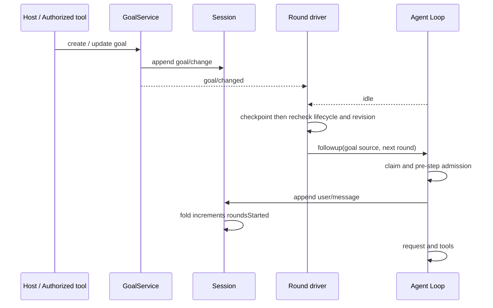
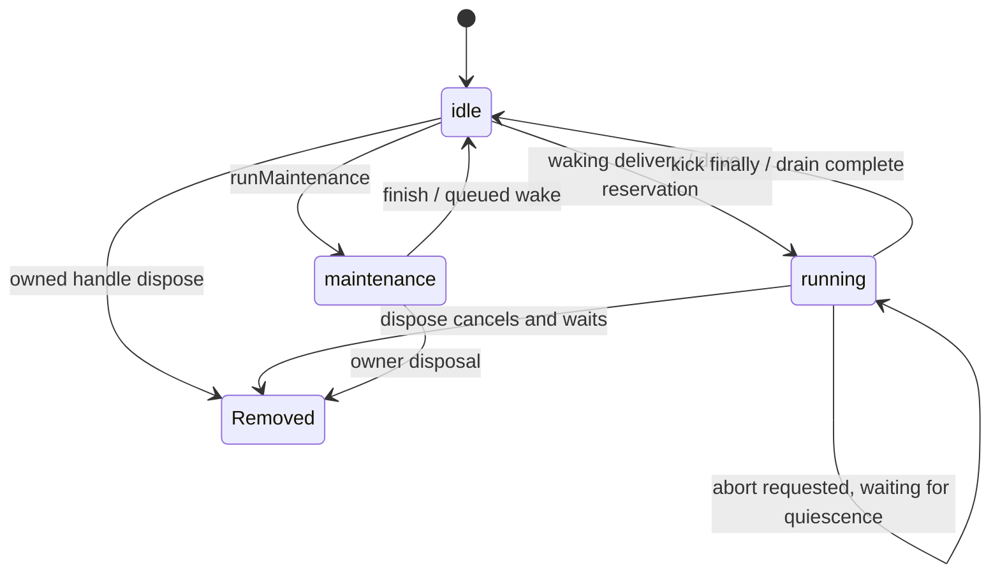
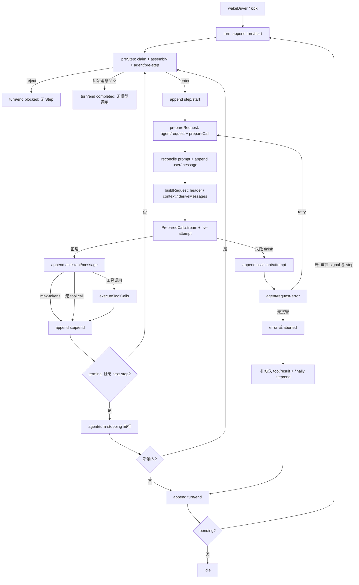
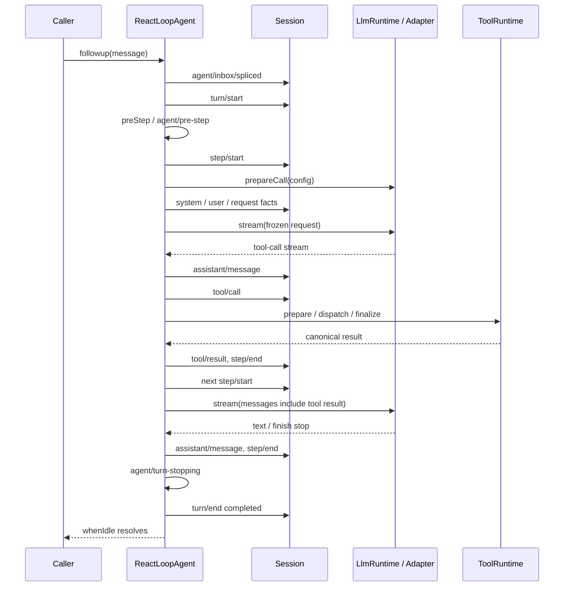
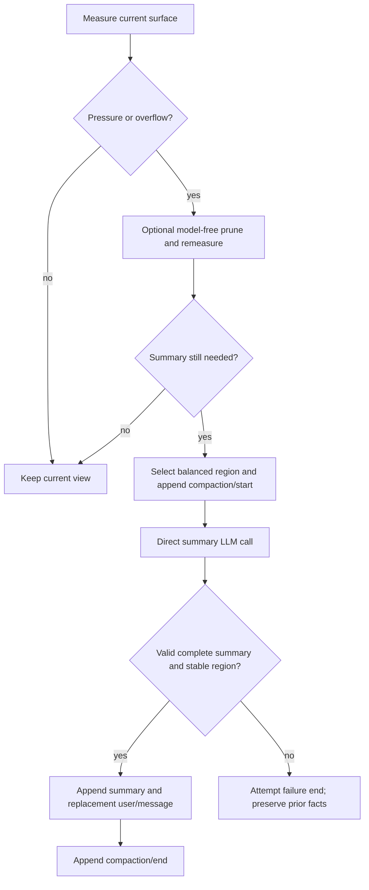
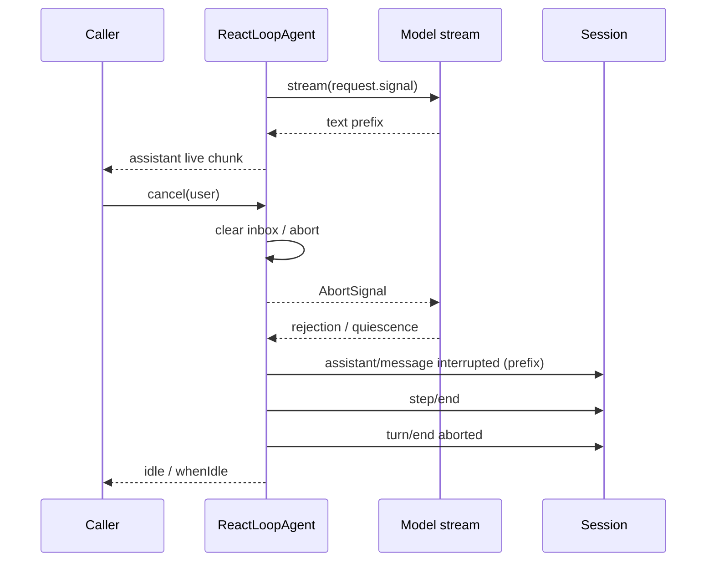
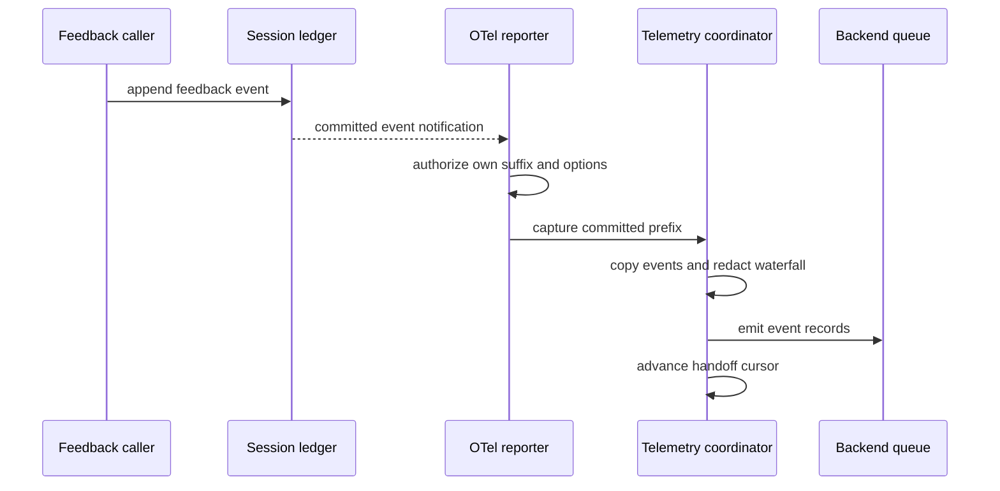

# 第二篇章：微观源码实现与动态运行流程

本文沿用[第一篇](01-architecture.md)的 16 项关注点，进一步解释 DeepSeek Harness 如何接纳任务、调用模型、执行工具、保存事实，以及在失败后恢复。第一篇回答能力如何组成，本文重点回答一次操作经过哪些边界、何时生效、最后能观察到什么。

研究固定于 **`5badb15009ae1756c3afe0ae0cef1faafc290ccc`／`0.2.1-alpha.1`**，不将此基线称为持续更新的最新版本。正文中的链路依据源码追踪；实际运行结论对应 V 编号或具名测试，其命令与原始结果在验证附录记录。教学场景用于解释机制，不等同于已连接真实模型完成业务。证据类型、命令与验证限制见[证据索引](appendices/evidence-index.md)和[验证附录](appendices/validation.md)。

阅读时先区分三个动作：**入队**表示系统接受了一条待处理消息；**Session append**表示事实已进入当前会话日志和相应投影；**持久 flush**才是存储屏障。模型输出、工具副作用和磁盘日志还各有自己的完成条件，将它们分开才能准确理解恢复语义。

下文用 Turn 表示一次回合，Step 表示回合中的一个步骤，attempt 表示该步骤的一次模型请求尝试；同一 Step 可因重试产生多个 attempt。fold 指根据事件逐条重建状态，waterfall 指监听者通过 next 串接的控制管线。

### 运行入口索引

|业务入口|实际符号／关键位置|汇合与依赖|已执行验证|
|---|---|---|---|
|CLI profile|`apps/cli/src/bin.ts:runCli`、`profile-boot.ts:runProfile`|读环境、compose、`boot`、Loader tree|config-reload测试；未运行完整Web profile|
|Agent创建|`AgentRegistry.create → AgentLoop.createAgent`|创建Session、scope、setup、publish、announce|loop／scope-lifecycle、示例|
|Agent输入|`ReactLoopAgent.followup/send/steer/inject`|持久inbox splice→wakeDriver→kick→turn|loop／cancel、示例|
|SDK请求|`sdk/server:apply`、`HarnessSdkJsonRpcServer`|stdio transport→agents接口；initialize等待Loader|server测试；未安装Pythonwheel|
|Host会话控制|`api/session-controller`及其Remote实现|控制API驱动同一agents/session服务；gateway负责transport|transport、assistant-stream测试|
|客户端订阅|`RemoteSnapshotStream`／`RemoteJournalStream`|controller的baseline、page、event、live frame|transport测试；未跑UI E2E|
|请求扩展|`agent/pre-step`、`agent/request`、`agent/request-error`|不同阶段的waterfall，不是统一pre/post hook|request-error/reconstruction／示例|
|工具执行|`executeToolCalls → TOOL_RUNTIME_SCHEDULER`|ToolRuntime prepare、dispatch、finalize|tool-calls／approval／timeout|
|持久恢复|`AgentLoop.resumeWith`、JSONL `open`|先锁后读→repair→prepare→setup/publish|resume／jsonl／lease／migration|

实际入口证据：[E09](https://github.com/deepseek-ai/deepseek-harness/blob/5badb15009ae1756c3afe0ae0cef1faafc290ccc/apps/cli/src/bin.ts#L26-L73) [E10](https://github.com/deepseek-ai/deepseek-harness/blob/5badb15009ae1756c3afe0ae0cef1faafc290ccc/apps/cli/src/profile-boot.ts#L244-L326) [E16](https://github.com/deepseek-ai/deepseek-harness/blob/5badb15009ae1756c3afe0ae0cef1faafc290ccc/packages/core/agent/src/index.ts#L358-L415) [E18](https://github.com/deepseek-ai/deepseek-harness/blob/5badb15009ae1756c3afe0ae0cef1faafc290ccc/packages/core/agent-loop/src/index.ts#L807-L866) [E19](https://github.com/deepseek-ai/deepseek-harness/blob/5badb15009ae1756c3afe0ae0cef1faafc290ccc/packages/core/agent-loop/src/agent.ts#L154-L241) [E33](https://github.com/deepseek-ai/deepseek-harness/blob/5badb15009ae1756c3afe0ae0cef1faafc290ccc/packages/core/tools/src/index.ts#L1493-L1699) [E45](https://github.com/deepseek-ai/deepseek-harness/blob/5badb15009ae1756c3afe0ae0cef1faafc290ccc/packages/api/gateway/src/client/journal-stream.ts#L261-L391) [E60](https://github.com/deepseek-ai/deepseek-harness/blob/5badb15009ae1756c3afe0ae0cef1faafc290ccc/packages/sdk/server/src/index.ts#L46-L100)。库内手工挂Context仅用于测试本次扩展契约；不是官方推荐的另一套生产应用启动方式。

## 1. 任务定义与完成语义

### 从“一条请求”到“一个需要持续推进的目标”

普通输入经 `followup` 入队后，Loop 可以运行一个 Turn，最终给出 `completed`、`aborted`、`error`、`blocked` 或 `max-tokens` 等结果。这里的 `completed` 描述循环正常结束，业务是否达标仍需应用判断。目标模式在此基础上增加 `GoalService` 的目标状态，以及 `goal-round-driver` 的自动续跑机制；todo 和规划模式则提供局部工作组织。四者没有共同的“业务验收成功”提交点。[E20](https://github.com/deepseek-ai/deepseek-harness/blob/5badb15009ae1756c3afe0ae0cef1faafc290ccc/packages/core/agent-loop/src/agent.ts#L296-L395) [E79](https://github.com/deepseek-ai/deepseek-harness/blob/5badb15009ae1756c3afe0ae0cef1faafc290ccc/packages/goal/goal/src/index.ts#L303-L424) [E80](https://github.com/deepseek-ai/deepseek-harness/blob/5badb15009ae1756c3afe0ae0cef1faafc290ccc/packages/goal/goal/README.md#L152-L159)

以“修复缺陷并通过测试”为例，目标描述和回合上限先通过目标服务进入 `goal/change`。该事件追加成功后，服务才发变更通知；自动续跑的进程内激活状态则另行管理。驱动器等到 Agent idle、没有竞争输入且目标仍可推进时，经过 checkpoint，重新检查实例和目标状态，再送入携带 `goalId`、`revision`、`round` 的续跑消息。revision 是目标修订身份，用来拒绝旧目标下已经排队的操作。[E120](https://github.com/deepseek-ai/deepseek-harness/blob/5badb15009ae1756c3afe0ae0cef1faafc290ccc/packages/goal/goal/src/index.ts#L609-L625) [E78](https://github.com/deepseek-ai/deepseek-harness/blob/5badb15009ae1756c3afe0ae0cef1faafc290ccc/packages/goal/goal/src/index.ts#L240-L280) [E81](https://github.com/deepseek-ai/deepseek-harness/blob/5badb15009ae1756c3afe0ae0cef1faafc290ccc/packages/goal/goal-round-driver/src/index.ts#L137-L205) [E122](https://github.com/deepseek-ai/deepseek-harness/blob/5badb15009ae1756c3afe0ae0cef1faafc290ccc/packages/goal/goal-round-driver/src/index.ts#L96-L134)

图 B1 表示续跑的一条正常路径，省略拒绝分支。**回合并非在 `followup` 或 claim 时计数**：只有实际追加的 `user/message` 同时匹配 active 目标、revision、下一个 round 和额度，fold 才推进 `roundsStarted`。因此 checkpoint 等待期间有人暂停目标，或用户插入新输入，旧续跑不能仅凭“已经入队”取得执行权；准入 waterfall 前后还会重查。模型错误、`max-tokens`、卸载和恢复也会影响进程内激活，不能理解为异常后无条件自动续跑。[E121](https://github.com/deepseek-ai/deepseek-harness/blob/5badb15009ae1756c3afe0ae0cef1faafc290ccc/packages/goal/goal/src/fold.ts#L313-L331) [E82](https://github.com/deepseek-ai/deepseek-harness/blob/5badb15009ae1756c3afe0ae0cef1faafc290ccc/packages/goal/goal-round-driver/src/index.ts#L350-L459) [E123](https://github.com/deepseek-ai/deepseek-harness/blob/5badb15009ae1756c3afe0ae0cef1faafc290ccc/packages/goal/goal-round-driver/src/index.ts#L246-L344)

### todo、规划和子任务分别在哪里确认

`todo_write` 在工具 body 内追加 `todo/write`，随后返回结构化结果。清单中的 completed 是模型提交的任务标记；后续 `turn/start` 会清空当前 todo 投影，历史事件仍在。若 body 已写清单，而后续工具处理失败，状态写入与最终错误结果可能同时存在，运行时没有为它们提供统一回滚。[E124](https://github.com/deepseek-ai/deepseek-harness/blob/5badb15009ae1756c3afe0ae0cef1faafc290ccc/packages/todo/tool-todo/src/index.ts#L192-L208) [E85](https://github.com/deepseek-ai/deepseek-harness/blob/5badb15009ae1756c3afe0ae0cef1faafc290ccc/packages/todo/tool-todo/src/index.ts#L117-L134) [E33](https://github.com/deepseek-ai/deepseek-harness/blob/5badb15009ae1756c3afe0ae0cef1faafc290ccc/packages/core/tools/src/index.ts#L1493-L1699)

规划模式使用“待应用意图”与“已记录模式”两层状态。用户精确同意退出规划后，服务先保存 pending intent；`preStep` 先组装提示词，其规划段可以读取该 intent，再执行准入 waterfall。后者若接受且未取消，模式监听器才在边界追加 `plan/mode`；拒绝或取消时不提交。这样既能为即将进入的 Step 选择正确提示，又避免把未接纳的模式选择冒充已确认事实。[E125](https://github.com/deepseek-ai/deepseek-harness/blob/5badb15009ae1756c3afe0ae0cef1faafc290ccc/packages/plan/plan-mode/src/index.ts#L196-L224) [E126](https://github.com/deepseek-ai/deepseek-harness/blob/5badb15009ae1756c3afe0ae0cef1faafc290ccc/packages/plan/plan-mode/src/index.ts#L340-L352) [E128](https://github.com/deepseek-ai/deepseek-harness/blob/5badb15009ae1756c3afe0ae0cef1faafc290ccc/packages/core/agent-loop/src/agent.ts#L267-L285) [E87](https://github.com/deepseek-ai/deepseek-harness/blob/5badb15009ae1756c3afe0ae0cef1faafc290ccc/packages/plan/plan-mode/src/index.ts#L418-L453)

子 Agent 又有自己的结果契约：若父级要求 `outputSchema`，普通文本结束并不够，子运行必须捕获合规结构化结果。即使 Loop 为 completed，没有该结果仍可被驱动器判为委派失败。**循环结束、任务状态、结构化输出和业务验收是四种判断**；接入自动评测时应明确应用究竟依据哪一种。目标、todo、规划和结构化输出分别有 V08／V10 测试支撑，均不证明真实业务测试一定通过。[E92](https://github.com/deepseek-ai/deepseek-harness/blob/5badb15009ae1756c3afe0ae0cef1faafc290ccc/packages/subagent/subagent-in-process-driver/src/structured.ts#L49-L141) [E144](https://github.com/deepseek-ai/deepseek-harness/blob/5badb15009ae1756c3afe0ae0cef1faafc290ccc/packages/subagent/subagent-in-process-driver/src/index.ts#L219-L237)

## 2. Agent Loop 与执行模型

Agent 的创建、输入接纳和模型请求是三个阶段。先完成 setup 再发布实例，可以让调用者观察到已准备好的服务；输入入队后，由该 Agent 的单一 driver 串行推进 Turn；一个 Turn 又可以包含多个 Step。工具调用通常要求下一 Step 将结果送回模型，因此“一次用户请求”并不等于“一次模型调用”。

### 创建、所有权和输入队列

`agents.create` 接受 sessionId、meta、seed、setup、parentAgent、signal，以及嵌套的 `agentOptions`。Registry 和 Loop 内部创建方法的参数层次不同，集成时应以各自类型为准。

Factory 将资源归属调用者的 ownerCtx，先准备 Session 和 scope，等待 setup 完成，再提交并登记实例，最后宣布会话并串行通知 `agent/created`。setup 失败或 owner 卸载会触发清理；已经被外部观察到的通知不能靠内部回滚抹去。 [E16](https://github.com/deepseek-ai/deepseek-harness/blob/5badb15009ae1756c3afe0ae0cef1faafc290ccc/packages/core/agent/src/index.ts#L358-L415) [E17](https://github.com/deepseek-ai/deepseek-harness/blob/5badb15009ae1756c3afe0ae0cef1faafc290ccc/packages/core/agent-loop/src/index.ts#L479-L640) [E63](https://github.com/deepseek-ai/deepseek-harness/blob/5badb15009ae1756c3afe0ae0cef1faafc290ccc/packages/core/agent/src/runtime-types.ts#L309-L350)

|输入API|队列／唤醒语义|执行中影响|
|---|---|---|
|`followup(message)`|next-turn、唤醒|当前Turn结束后开始后续Turn|
|`steer(message)`|next-step、唤醒|在下一个Step边界接纳|
|`inject(message)`|next-step、不唤醒|独立注入不会把idle Agent启动起来|
|`send(message)`|运行未取消时倾向next-step；取消中的driver转next-turn|便捷路由，不能统一说永远排下一轮|
|`cancel(cause, options)`|默认清空两队列并abort；keepInbox可保留|停止当前Turn，由driver等待在途工作到终态|

输入队列的变更记录为 `agent/inbox/spliced`，恢复时可从日志折叠重建。claim 在 Step 开始前取走接纳候选：全部 next-step 输入，以及第一步的一条 next-turn 输入。每个 Agent 只有一个 driver 预留槽位，因此追加消息不会为同一实例启动第二条并行 Loop。多个 Agent 虽然各自运行，仍可能共用模型、工具和 I/O 服务；局部串行不能推出全局吞吐保证。 [E19](https://github.com/deepseek-ai/deepseek-harness/blob/5badb15009ae1756c3afe0ae0cef1faafc290ccc/packages/core/agent-loop/src/agent.ts#L154-L241) [E66](https://github.com/deepseek-ai/deepseek-harness/blob/5badb15009ae1756c3afe0ae0cef1faafc290ccc/packages/core/agent-loop/src/inbox.ts#L109-L148)

图 B2 归纳内部运行阶段和资源生命周期，`Removed` 不是第三种公开 AgentStatus。`whenIdle` 等待 driver 的活动完成状态稳定，说明循环已经静止；它不代表请求成功，也不代表存储完成 flush。失败原因仍应查看 `agent/error` 和 `turn/end`。 [E19](https://github.com/deepseek-ai/deepseek-harness/blob/5badb15009ae1756c3afe0ae0cef1faafc290ccc/packages/core/agent-loop/src/agent.ts#L154-L241) [E20](https://github.com/deepseek-ai/deepseek-harness/blob/5badb15009ae1756c3afe0ae0cef1faafc290ccc/packages/core/agent-loop/src/agent.ts#L296-L395) [E17](https://github.com/deepseek-ai/deepseek-harness/blob/5badb15009ae1756c3afe0ae0cef1faafc290ccc/packages/core/agent-loop/src/index.ts#L479-L640)

### Step 内的提交顺序

图 B3 根据 `turn`、`step` 和 `prepareRequest` 的实际分支绘制。Step 尚未打开就失败时，不走图中 Step 闭合分支；repair 针对已经打开的 Step。`max-tokens` 一旦进入 Turn 结果，后续正常 Step 不会把它改成 completed。普通工具调用通常继续下一步，`concludesTurn` 工具可以给出结束信号，但新的 next-step 输入和 turn-stopping 监听者仍可能要求继续。 [E20](https://github.com/deepseek-ai/deepseek-harness/blob/5badb15009ae1756c3afe0ae0cef1faafc290ccc/packages/core/agent-loop/src/agent.ts#L296-L395) [E21](https://github.com/deepseek-ai/deepseek-harness/blob/5badb15009ae1756c3afe0ae0cef1faafc290ccc/packages/core/agent-loop/src/agent.ts#L398-L544) [E22](https://github.com/deepseek-ai/deepseek-harness/blob/5badb15009ae1756c3afe0ae0cef1faafc290ccc/packages/core/agent-loop/src/agent.ts#L547-L686)

### 按一次两步工具对话逐点追踪

1. `followup`提交inbox splice并同步预留运行／取消槽位；driver进入`turn`提交`turn/start`。
2. `preStep`移除接纳候选输入，组装prompt/runtime context，调用`agent/pre-step` waterfall。reject会关闭blocked Turn；接纳不意味着已经提交user/message。
3. `step/start`后先`prepareRequest`：freeze默认配置，`agent/request`可以返回新provider/model，`prepareCall`绑定adapter实例、metadata和capabilities。此处取消／解析失败，尚未提交该批system/user消息。
4. prompt projection根据绑定路由的更新能力调整surface；首次attempt提交接纳user消息。`buildRequest`必要时追加request/header、工具变化developer消息和request/context；调用`deriveMessages`，freeze请求和共享message对象。
5. 创建live attempt发`agent/assistant-stream` start/chunk。正常完成将流嵌入一次`assistant/message`，**先Session append成功，后发committed end frame**。字块不是每个都单独持久写入。
6. 从结算内容取tool calls，调度前追加`tool/call`，再prepare／审批／dispatch。结果按模型顺序提交`tool/result`；additionalContexts进next-step。
7. finally提交`step/end`。存在工具调用通常继续第二Step；第二次请求由日志派生，包含上一Step tool result。示例V05证明2+3的结果5实际进入第二次adapter收到的messages，而非只断言注册存在。
8. 无工具且无新next-step，经turn-stopping和再次检查，提交`turn/end completed`；driver回idle。使用持久provider的调用者若要求立即磁盘可见，仍应调用flush。

源码证据：[E19](https://github.com/deepseek-ai/deepseek-harness/blob/5badb15009ae1756c3afe0ae0cef1faafc290ccc/packages/core/agent-loop/src/agent.ts#L154-L241) [E20](https://github.com/deepseek-ai/deepseek-harness/blob/5badb15009ae1756c3afe0ae0cef1faafc290ccc/packages/core/agent-loop/src/agent.ts#L296-L395) [E21](https://github.com/deepseek-ai/deepseek-harness/blob/5badb15009ae1756c3afe0ae0cef1faafc290ccc/packages/core/agent-loop/src/agent.ts#L398-L544) [E22](https://github.com/deepseek-ai/deepseek-harness/blob/5badb15009ae1756c3afe0ae0cef1faafc290ccc/packages/core/agent-loop/src/agent.ts#L547-L686) [E23](https://github.com/deepseek-ai/deepseek-harness/blob/5badb15009ae1756c3afe0ae0cef1faafc290ccc/packages/core/agent-loop/src/tool-calls.ts#L60-L290) [E24](https://github.com/deepseek-ai/deepseek-harness/blob/5badb15009ae1756c3afe0ae0cef1faafc290ccc/packages/core/agent-loop/src/assistant-stream.ts#L45-L110)。V05代码和结果见[完整测试](validation/examples.spec.ts)、[日志](validation/examples-tests.log)。

图 B4 省略实时 frame 通知和具体 flush，Session 内存追加不能画成同步磁盘写入。是否在请求或工具前建立持久屏障，取决于 checkpoint 插件及实际组合。

例如用户在文件读取期间补充“先别修改文件”：`steer` 让这条输入在后续 Step 边界被接纳，不会回溯撤销已经完成的文件读取；`followup` 则排到后续 Turn。`inject` 单独调用不会唤醒 idle Agent。选择输入 API，实质是在选择干预边界，而不是选择消息显示样式。上述正常、追加输入和取消路径由 V01／V05 验证；它们使用受控模型。

## 3. 模型接入与能力适配

### 先解析路由，再固定本次调用

每次 attempt 从 `prepareRequest` 开始：`agent/request` 可以调整 provider、model 和输出配置；`LlmRuntime.prepareCall` 再将这次配置绑定到具体 adapter、模型元数据和能力。PreparedCall 是一次性调用凭证，重复消费或修改其配置会触发 `INVALID_PREPARED_CALL`。重试必须重新准备，避免在一次请求中途把模型实现换掉。[E22](https://github.com/deepseek-ai/deepseek-harness/blob/5badb15009ae1756c3afe0ae0cef1faafc290ccc/packages/core/agent-loop/src/agent.ts#L547-L686) [E30](https://github.com/deepseek-ai/deepseek-harness/blob/5badb15009ae1756c3afe0ae0cef1faafc290ccc/packages/llm/llm/src/index.ts#L929-L1018)

能力不是 provider 名称下的统一常量。`resolveCallWithInfo` 按精确模型解析 reasoning effort、默认输出额度及更新能力，不支持的 effort 会被拒绝。prompt projection 和工具历史也按路由能力投影：支持工具更新的路由可以保留相应历史，不支持的路由需要调整声明与 prompt series。H02 的实际 diff 已修复相关历史重建问题，不应将旧行为当成本基线缺陷。[E89](https://github.com/deepseek-ai/deepseek-harness/blob/5badb15009ae1756c3afe0ae0cef1faafc290ccc/packages/llm/llm/src/types.ts#L379-L421) [E90](https://github.com/deepseek-ai/deepseek-harness/blob/5badb15009ae1756c3afe0ae0cef1faafc290ccc/packages/llm/llm/src/index.ts#L885-L918) [E29](https://github.com/deepseek-ai/deepseek-harness/blob/5badb15009ae1756c3afe0ae0cef1faafc290ccc/packages/core/agent-loop/src/runtime-context.ts#L88-L164) [E30](https://github.com/deepseek-ai/deepseek-harness/blob/5badb15009ae1756c3afe0ae0cef1faafc290ccc/packages/llm/llm/src/index.ts#L929-L1018)

例如从支持图像输入的模型切换到纯文本路由，不能原样搬运所有内部内容。adapter 边界会处理附件引用、按输入模态投影图像，并过滤其他 adapter 的私有 `replayState`。内部消息表示、可供模型理解的输入和供应商请求格式由不同层负责；看到内部存在附件字段，并不意味着每个路由都能直接消费其二进制内容。[E127](https://github.com/deepseek-ai/deepseek-harness/blob/5badb15009ae1756c3afe0ae0cef1faafc290ccc/packages/llm/llm/src/index.ts#L1047-L1114) [E91](https://github.com/deepseek-ai/deepseek-harness/blob/5badb15009ae1756c3afe0ae0cef1faafc290ccc/packages/llm/llm/src/index.ts#L984-L998)

### 错误从哪个边界进入恢复机制

adapter 调用或其迭代器推进时抛出的异常，会在 LLM 边界规范成失败 finish，Loop 据此记录 `assistant/attempt` 并进入请求错误 waterfall。中间件或消费侧抛出的异常不全部位于该捕获范围，不能保证都自动使用 provider 的重试策略。`prepareRequest` 对 `NO_ADAPTER` 还保留走直接 stream／中间件的路径，因此注册缺失并非在所有扩展组合下都以同一种方式结束；最终 adapter dispatch 仍需要可用实现。[E127](https://github.com/deepseek-ai/deepseek-harness/blob/5badb15009ae1756c3afe0ae0cef1faafc290ccc/packages/llm/llm/src/index.ts#L1047-L1114) [E21](https://github.com/deepseek-ai/deepseek-harness/blob/5badb15009ae1756c3afe0ae0cef1faafc290ccc/packages/core/agent-loop/src/agent.ts#L398-L544) [E22](https://github.com/deepseek-ai/deepseek-harness/blob/5badb15009ae1756c3afe0ae0cef1faafc290ccc/packages/core/agent-loop/src/agent.ts#L547-L686)

SDK 初始化则先检查参数，再确认或挂载路由，调用 `resolveCallConfig` 成功后才标记 initialized。它对 `deepseek-official` 有延迟挂载逻辑，不对任意 provider 承诺自动安装。子 Agent 的 outputSchema 是额外挂载的结构化运行契约，也不能推广为所有普通模型回复都有通用 JSON 校验。V05／SDK／结构化用例分别验证相关离线边界，真实供应商网络兼容性未实测。[E139](https://github.com/deepseek-ai/deepseek-harness/blob/5badb15009ae1756c3afe0ae0cef1faafc290ccc/packages/sdk/server/src/server.ts#L137-L170) [E93](https://github.com/deepseek-ai/deepseek-harness/blob/5badb15009ae1756c3afe0ae0cef1faafc290ccc/packages/subagent/subagent-in-process-driver/src/index.ts#L110-L139) [E92](https://github.com/deepseek-ai/deepseek-harness/blob/5badb15009ae1756c3afe0ae0cef1faafc290ccc/packages/subagent/subagent-in-process-driver/src/structured.ts#L49-L141)

## 4. 上下文工程

### 从历史事实构造“这次模型看到的内容”

Session 保存事件事实，surface 表示当前可用于请求的历史视图，projection 维护提示词或业务状态，`deriveMessages` 最后生成模型消息。四层分开后，旧日志可以保留，而当前请求只使用经过替换、压缩或适配的视图。每个 Step 的 `preStep` 先 claim 输入、组装系统提示和 runtime context，再执行准入 waterfall；工作区指令插件在 accepted pre-step 中加入相应上下文，拒绝输入不会因此变成正常用户消息。[E26](https://github.com/deepseek-ai/deepseek-harness/blob/5badb15009ae1756c3afe0ae0cef1faafc290ccc/packages/core/session/src/index.ts#L718-L775) [E27](https://github.com/deepseek-ai/deepseek-harness/blob/5badb15009ae1756c3afe0ae0cef1faafc290ccc/packages/core/session/src/index.ts#L856-L904) [E128](https://github.com/deepseek-ai/deepseek-harness/blob/5badb15009ae1756c3afe0ae0cef1faafc290ccc/packages/core/agent-loop/src/agent.ts#L267-L285) [E117](https://github.com/deepseek-ai/deepseek-harness/blob/5badb15009ae1756c3afe0ae0cef1faafc290ccc/packages/context/agent-instructions/src/index.ts#L315-L340)

### 请求重建和重试的真实粒度

一个 Step 只执行一次 `preStep` 上下文组装；内部 attempt 重试重新准备路由和请求，但只提交一次本 Step 接纳的用户输入，不重复消费 inbox，也不重跑已完成的工具。每次请求仍从当时的 Session surface 派生，因此恢复插件压缩视图后，下一 attempt 能看到替换结果。工具清单和普通上下文却不会因每次 retry 无条件重新组装。 [E21](https://github.com/deepseek-ai/deepseek-harness/blob/5badb15009ae1756c3afe0ae0cef1faafc290ccc/packages/core/agent-loop/src/agent.ts#L398-L544) [E22](https://github.com/deepseek-ai/deepseek-harness/blob/5badb15009ae1756c3afe0ae0cef1faafc290ccc/packages/core/agent-loop/src/agent.ts#L547-L686) [E62](https://github.com/deepseek-ai/deepseek-harness/blob/5badb15009ae1756c3afe0ae0cef1faafc290ccc/packages/compaction/compaction-basic/src/index.ts#L158-L221)

`SystemPromptProjection` 维护系统提示的头节点及后续追加节点，按 adapter 能力选择替换或历史追加。工具定义的增加、删除和修改也会影响请求 header、声明序列与历史。在判断路由切换是否保持上下文时，应同时检查这些投影，而不是只比对最终 prompt 字符串。 [E29](https://github.com/deepseek-ai/deepseek-harness/blob/5badb15009ae1756c3afe0ae0cef1faafc290ccc/packages/core/agent-loop/src/runtime-context.ts#L88-L164) [E30](https://github.com/deepseek-ai/deepseek-harness/blob/5badb15009ae1756c3afe0ae0cef1faafc290ccc/packages/llm/llm/src/index.ts#L929-L1018)

当模型上下文接近路由窗口，compaction-basic 使用 token meter 测量当前 surface，结合输出预留额度决定是否处理。它可以先做无需模型的裁剪，再重测；仍有压力才选择摘要区域。选区保留尾部预算，并调整边界以保持 tool-call 与 tool-result 配对，避免模型看到有调用却无结果的残缺历史。[E130](https://github.com/deepseek-ai/deepseek-harness/blob/5badb15009ae1756c3afe0ae0cef1faafc290ccc/packages/compaction/compaction-basic/src/index.ts#L278-L346) [E131](https://github.com/deepseek-ai/deepseek-harness/blob/5badb15009ae1756c3afe0ae0cef1faafc290ccc/packages/compaction/compaction-basic/src/region.ts#L117-L154)

图 B5 展示压缩主线。摘要通过直接 `ctx.llm.stream` 调用生成，具有自己的路由、maxTokens 和 usage，并非新建一个子 Agent。空摘要、error、aborted 或 max-tokens finish 都不能当作完整 checkpoint。有效摘要提交为 `compaction/summary`，再通过带 `surfaceOp` 的 `user/message` 替换选区；重放该日志只重建视图，不重新调用摘要模型。[E134](https://github.com/deepseek-ai/deepseek-harness/blob/5badb15009ae1756c3afe0ae0cef1faafc290ccc/packages/compaction/compaction-basic/src/summarizer.ts#L120-L180) [E135](https://github.com/deepseek-ai/deepseek-harness/blob/5badb15009ae1756c3afe0ae0cef1faafc290ccc/packages/compaction/compaction-basic/src/summarizer.ts#L196-L209) [E133](https://github.com/deepseek-ai/deepseek-harness/blob/5badb15009ae1756c3afe0ae0cef1faafc290ccc/packages/compaction/compaction-basic/src/region.ts#L470-L509)

例如模型以窗口溢出拒绝请求，插件只在 surface 的 `replaceGeneration` 确实前进且未取消时返回 retry。若前面的裁剪已经生效，后续可选摘要失败，仍可据此重试较小的视图；如果没有视图进展，则保留原错误，避免对同一过长输入盲重试。正常压力处理、溢出恢复、摘要失败和取消等已有 V10 的 105 个 compaction 用例覆盖。压缩 start／end 和稳定性校验提供日志层的边界，不能推广成跨全部插件或外部服务的事务回滚。[E129](https://github.com/deepseek-ai/deepseek-harness/blob/5badb15009ae1756c3afe0ae0cef1faafc290ccc/packages/compaction/compaction-basic/src/index.ts#L190-L234) [E132](https://github.com/deepseek-ai/deepseek-harness/blob/5badb15009ae1756c3afe0ae0cef1faafc290ccc/packages/compaction/compaction-basic/src/region.ts#L173-L268)

## 5. 记忆、状态与持久化

运行状态首先要问“由谁重建”：inbox、目标、todo 等可以从 Session 事件折叠得到；当前 live 文本、进程内自动续跑激活、作业记录和工作区 diff 缓存还依赖活实例。重启后恢复一份会话日志，不等于恢复全部进程对象。下面的持久化路径负责会话事实，跨会话长期记忆另有接口与配置。

### JSONL 的写入、恢复和分支

JSONL `create` 先返回尚未物化的 handle，首次 append 或显式 flush 才建立实际存储；若进程在此之前退出，可能没有会话文件。打开已有会话进行写入时，先取得进程内 claim 和跨进程内核锁，占用冲突返回 `SessionAlreadyOwnedError`。POSIX flock 随句柄和进程生命周期释放，仍存活但挂起的 writer 不会因“租约超时”被夺权；Windows 使用 named semaphore，本机未验证。 [E39](https://github.com/deepseek-ai/deepseek-harness/blob/5badb15009ae1756c3afe0ae0cef1faafc290ccc/packages/session/session-persistence-jsonl/src/index.ts#L314-L435) [E41](https://github.com/deepseek-ai/deepseek-harness/blob/5badb15009ae1756c3afe0ae0cef1faafc290ccc/packages/session/session-persistence-jsonl/src/lease.ts#L70-L134)

live Session 事件先进入 writer 缓冲，再经有界批处理序列化；它与持久 handle 的 `append(events)` 等待语义不同。`flush` 提供显式屏障，close 排空缓冲并释放锁，清理失败也需释放进程内 claim，多个失败可合并报告。

checkpoint-policy 在 LLM stream、顶层 `tools/execute` 和 `agent/pre-step` 前 flush，嵌套调用复用外层屏障。Turn 关闭或 `whenIdle` 本身不能作为普遍的 fsync 保证。 [E26](https://github.com/deepseek-ai/deepseek-harness/blob/5badb15009ae1756c3afe0ae0cef1faafc290ccc/packages/core/session/src/index.ts#L718-L775) [E40](https://github.com/deepseek-ai/deepseek-harness/blob/5badb15009ae1756c3afe0ae0cef1faafc290ccc/packages/session/session-persistence-jsonl/src/storage.ts#L187-L263) [E38](https://github.com/deepseek-ai/deepseek-harness/blob/5badb15009ae1756c3afe0ae0cef1faafc290ccc/packages/session/session-checkpoint-policy/src/index.ts#L54-L83)

resume 先以写方式打开存储，读取有效事件，补充被中断 Turn 的闭合事件，再准备 Session、选项与投影，执行 setup 并发布实例。读取和迁移不调用模型，只有后续唤醒输入才推进 Loop。fork 的 `buildForkSeed` 复制包含指定边界的历史前缀，再补 seed 和 fork 闭合事件；复制历史不重做历史操作。V04 已运行 resume／repair 用例。 [E18](https://github.com/deepseek-ai/deepseek-harness/blob/5badb15009ae1756c3afe0ae0cef1faafc290ccc/packages/core/agent-loop/src/index.ts#L807-L866) [E43](https://github.com/deepseek-ai/deepseek-harness/blob/5badb15009ae1756c3afe0ae0cef1faafc290ccc/packages/core/session/src/repair.ts#L14-L97) [E44](https://github.com/deepseek-ai/deepseek-harness/blob/5badb15009ae1756c3afe0ae0cef1faafc290ccc/packages/core/session/src/fork.ts#L1-L30)

格式版本 4 的静态 catalog 包含 0→1→2→3→4 codec 和迁移，不依赖某个用户插件是否挂载。resolver 选择最高合法 generation，拒绝错误压缩布局等冲突。迁移先准备和校验，写操作取得所有权后才发布新 generation；普通读取不会为了升级改写旧文件。

新的 generation 不覆盖已发布的前代，但当前 generation 仍可追加事件。“保留历史代际”与“文件不可追加”是不同约束。 [E42](https://github.com/deepseek-ai/deepseek-harness/blob/5badb15009ae1756c3afe0ae0cef1faafc290ccc/packages/session/session-format-catalog/src/generated.ts#L16-L48) [E67](https://github.com/deepseek-ai/deepseek-harness/blob/5badb15009ae1756c3afe0ae0cef1faafc290ccc/packages/session/session-persistence-jsonl/src/index.ts#L1446-L1482) [E39](https://github.com/deepseek-ai/deepseek-harness/blob/5badb15009ae1756c3afe0ae0cef1faafc290ccc/packages/session/session-persistence-jsonl/src/index.ts#L314-L435)

文件末尾写入不完整时，读取只返回有效前缀，下一写操作处理截断与恢复；这是物理存储修复。补齐未闭合 Turn 或缺失工具结果则属于逻辑修复。尚未持久化的 live 字块可能丢失，已经启动却没有结果的工具补 unknown，不自动重跑。

checkpoint 可以缩小不确定窗口，本地 JSONL 与外部服务之间仍没有统一两阶段提交。由此不能承诺外部副作用恰好发生一次、停电零损失，或精确恢复尚未结算的文本。 [E40](https://github.com/deepseek-ai/deepseek-harness/blob/5badb15009ae1756c3afe0ae0cef1faafc290ccc/packages/session/session-persistence-jsonl/src/storage.ts#L187-L263) [E43](https://github.com/deepseek-ai/deepseek-harness/blob/5badb15009ae1756c3afe0ae0cef1faafc290ccc/packages/core/session/src/repair.ts#L14-L97) [E24](https://github.com/deepseek-ai/deepseek-harness/blob/5badb15009ae1756c3afe0ae0cef1faafc290ccc/packages/core/agent-loop/src/assistant-stream.ts#L45-L110)

会话导出由 `session-query/session-log-export` 提供 Host 下载路由和流式 ZIP，不是 `SessionPersistence.export()` 方法。基线官方架构文档的接口概述在这里与具体类型不同，接入应依据实际的 create／open／flush／stat／list 契约；这一差异是文档问题，未复现数据损坏。 [E73](https://github.com/deepseek-ai/deepseek-harness/blob/5badb15009ae1756c3afe0ae0cef1faafc290ccc/docs/architecture.md#L159-L164) [E72](https://github.com/deepseek-ai/deepseek-harness/blob/5badb15009ae1756c3afe0ae0cef1faafc290ccc/packages/session-query/session-log-export/src/index.ts#L78-L169)

同一官方 quick-reference 的 fork 示例使用 meta.seedLength，当前 CreateAgentOptions 则使用 meta.isSeeded 和独立 inheritedEventCount。实际实现应结合类型、`buildForkSeed` 及调用参数核对字段，避免复制过时示例。 [E73](https://github.com/deepseek-ai/deepseek-harness/blob/5badb15009ae1756c3afe0ae0cef1faafc290ccc/docs/architecture.md#L159-L164) [E74](https://github.com/deepseek-ai/deepseek-harness/blob/5badb15009ae1756c3afe0ae0cef1faafc290ccc/packages/core/agent/src/index.ts#L64-L118)

### 长期记忆与运行缓存的区别

官方 MCP memory 方案默认关闭，数据服务位于外部 MCP server；Harness 挂载客户端工具，并将服务指令作为有来源的提示段引入。记忆存储、备份和可用性由该外部服务承担，不能从“有 memory 工具”推导内核自带长期记忆数据库。作业记录与 workspace summary 则是本地运行缓存，也不属于这项外部记忆能力。[E94](https://github.com/deepseek-ai/deepseek-harness/blob/5badb15009ae1756c3afe0ae0cef1faafc290ccc/docs/user/guide/mcp-memory.md#L5-L31) [E95](https://github.com/deepseek-ai/deepseek-harness/blob/5badb15009ae1756c3afe0ae0cef1faafc290ccc/packages/mcp/mcp-client/src/tools.ts#L113-L160) [E96](https://github.com/deepseek-ai/deepseek-harness/blob/5badb15009ae1756c3afe0ae0cef1faafc290ccc/packages/mcp/mcp-client/src/server-context.ts#L28-L40) [E97](https://github.com/deepseek-ai/deepseek-harness/blob/5badb15009ae1756c3afe0ae0cef1faafc290ccc/packages/jobs/jobs-local/src/index.ts#L128-L224) [E111](https://github.com/deepseek-ai/deepseek-harness/blob/5badb15009ae1756c3afe0ae0cef1faafc290ccc/packages/deliverables/workspace-changes/src/recorder.ts#L342-L369)

例如上一 Turn 生成了工作区改动摘要，随后进程重启：`workspace/changes` 事实可以仍在日志中，依赖内存和临时 Git 资源的旧 diff 却未必可继续查询；若未结算的 assistant 字块只存在 live 通道，它们也无法凭磁盘重放补回。设计“恢复到哪里”的产品承诺，应逐项列出日志、投影、缓存和外部系统的边界。V03／V04 验证会话存储与恢复，V10 验证工作区记录的选定本地路径，并未验证 MCP 外部记忆服务。[E112](https://github.com/deepseek-ai/deepseek-harness/blob/5badb15009ae1756c3afe0ae0cef1faafc290ccc/packages/deliverables/workspace-changes/src/recorder.ts#L242-L251) [E113](https://github.com/deepseek-ai/deepseek-harness/blob/5badb15009ae1756c3afe0ae0cef1faafc290ccc/packages/deliverables/workspace-changes/README.md#L40-L60) [E24](https://github.com/deepseek-ai/deepseek-harness/blob/5badb15009ae1756c3afe0ae0cef1faafc290ccc/packages/core/agent-loop/src/assistant-stream.ts#L45-L110)

## 6. 工具与执行环境契约

一个工具既要说明参数是否合法，也要说明结果是什么、如何供模型阅读、执行资源由谁提供。Harness 将注册契约、权限决策、body、副作用和最终结果分阶段处理；这使模型可以收到可解释的错误，也要求扩展开发者清楚自己处于哪一阶段。

### 从模型调用到规范结果

工具必须定义输出契约，可用 `defineTool` 推导参数和结果类型。prepare 区分参数不合法、schema 错误、未知工具、不可见工具和取消；execute 返回规范值，render 负责模型可读内容。`projectContent`、`finalizeContent` 和 presentation 承担不同职责，运行时不能仅凭 execute 返回字符串就猜出完整结果契约。 [E32](https://github.com/deepseek-ai/deepseek-harness/blob/5badb15009ae1756c3afe0ae0cef1faafc290ccc/packages/core/tools/src/index.ts#L90-L208) [E34](https://github.com/deepseek-ai/deepseek-harness/blob/5badb15009ae1756c3afe0ae0cef1faafc290ccc/packages/core/tools/src/schema.ts#L554-L632) [E69](https://github.com/deepseek-ai/deepseek-harness/blob/5badb15009ae1756c3afe0ae0cef1faafc290ccc/packages/core/tools/src/index.ts#L1063-L1155)

一次工具执行按以下阶段推进：解析调用参数并分类并发能力，记录 `tool/call`，执行 pre-execute 决策，必要时审批，再检查 guard 与取消信号；通过后进入 `tools/execute` 包装层和 body。随后校验结果，按模型顺序完成 post-execute 与内容处理，通知 `tools/result` 观察者，最后由 Loop 记录 `tool/result`。

普通工具异常通常转为错误 outcome，让模型在下一请求中判断；调度或结果提交本身失败时，则由 Step 的恢复分支收尾。 [E23](https://github.com/deepseek-ai/deepseek-harness/blob/5badb15009ae1756c3afe0ae0cef1faafc290ccc/packages/core/agent-loop/src/tool-calls.ts#L60-L290) [E33](https://github.com/deepseek-ai/deepseek-harness/blob/5badb15009ae1756c3afe0ae0cef1faafc290ccc/packages/core/tools/src/index.ts#L1493-L1699)

审批服务在开放 Turn 内记录 `approval/asked` 和 `approval/decided`。`policy=never` 在分派 answerer 前拒绝 ask；需要询问却没有 answerer，或监听者抛错时，结果为 unavailable 并拒绝执行。只有 allowed-once 授予本次操作权限。工具规则的直接拒绝和用户审批的拒绝来源不同，应分别审计。 [E36](https://github.com/deepseek-ai/deepseek-harness/blob/5badb15009ae1756c3afe0ae0cef1faafc290ccc/packages/interaction/user-approval/src/index.ts#L215-L307)

例如工具执行数据库写入成功，但 render 或 post-execute 随后失败，最终结果仍可能报错；模型收到错误并不能据此判断数据库没有变化。`todo_write` 更直接展示了 body 内已有领域事件，而工具结果仍要走后续管线。需要可靠补偿的工具应将外部操作身份与结果查询纳入自己的契约，这是由分段提交方式得出的改造建议。[E33](https://github.com/deepseek-ai/deepseek-harness/blob/5badb15009ae1756c3afe0ae0cef1faafc290ccc/packages/core/tools/src/index.ts#L1493-L1699) [E124](https://github.com/deepseek-ai/deepseek-harness/blob/5badb15009ae1756c3afe0ae0cef1faafc290ccc/packages/todo/tool-todo/src/index.ts#L192-L208)

`tools/result` 是只读观察通知：观察者同步抛错会记录警告，返回 Promise 的拒绝也会被观察，但运行时不等待其完成，也不让它改写既定 outcome。因此消费该通知追加交付声明的插件，和 Loop 随后提交 `tool/result`，各有自己的事实记录；工具成功并不单独证明所有观察者的后续工作成功。排查缺少交付物时应同时查看 `tool/result` 和 `deliverables/presented`。[E137](https://github.com/deepseek-ai/deepseek-harness/blob/5badb15009ae1756c3afe0ae0cef1faafc290ccc/packages/core/tools/src/index.ts#L1694-L1713) [E109](https://github.com/deepseek-ai/deepseek-harness/blob/5badb15009ae1756c3afe0ae0cef1faafc290ccc/packages/deliverables/tool-present/src/index.ts#L70-L108)

### 文件、Shell 与 MCP 是不同执行边界

文件工具依赖 `fs` 服务，本地、sandbox 和 SSH 是不同 provider；Shell 工具同样通过服务选择 bash-local 或 bash-sandbox。底层 subprocess 管理执行范围与退出状态，持久 Bash、terminal 和 PTY 另外维护各自状态。

sandbox-policy 决定调用模式，fs-sandbox 在实际 write／edit 处校验目标，sandbox-local 构造平台隔离参数。provider 卸载时发出终止请求并等待托管执行范围退出，不能仅关注直接子进程。本次未验证跨平台 Shell／PTY 和执行隔离。 [E49](https://github.com/deepseek-ai/deepseek-harness/blob/5badb15009ae1756c3afe0ae0cef1faafc290ccc/packages/sandbox/sandbox-policy/src/index.ts#L1-L87) [E50](https://github.com/deepseek-ai/deepseek-harness/blob/5badb15009ae1756c3afe0ae0cef1faafc290ccc/packages/fs/fs-sandbox/src/index.ts#L80-L140) [E51](https://github.com/deepseek-ai/deepseek-harness/blob/5badb15009ae1756c3afe0ae0cef1faafc290ccc/packages/sandbox/sandbox-local/src/index.ts#L152-L184) [E52](https://github.com/deepseek-ai/deepseek-harness/blob/5badb15009ae1756c3afe0ae0cef1faafc290ccc/packages/subprocess/subprocess-local/src/index.ts#L107-L138)

MCP 客户端将远端 schema 和调用结果桥接为本地 ToolRuntime 契约，工具发现、撤销和重新注册是另一条生命周期链。`syncTools` 先构造发现结果，再撤销旧注册并注册新集合，不能将刷新描述为有全局回滚的数据库事务。若远端工具已执行外部写入，客户端取消或重新发现工具同样不能撤回该写入。[E95](https://github.com/deepseek-ai/deepseek-harness/blob/5badb15009ae1756c3afe0ae0cef1faafc290ccc/packages/mcp/mcp-client/src/tools.ts#L113-L160)

## 7. 可靠性恢复与副作用一致性

可靠性要分为请求能否重试、循环能否闭合，以及外部副作用能否确认三件事。Harness 会记录失败 attempt、补齐工具历史并等待在途工作结束；这些机制保证可解释的下一步，而不会虚构远端操作是否成功。

### 请求重试的作用域

llm-retry 按 provider 和策略身份记录计数，projection 在 `step/start` 或 `turn/end` 清空，普通模式只处理允许的错误码并检查 `maxRetries`。`always` 模式先等待下游恢复器，尊重已经给出的 retry 和取消；它随后走自己的退避，**不使用 normal 模式的 maxRetries 上限**。`maxDelayMs` 限制单次等待，不限制总尝试次数。插件卸载时撤销监听、abort 生命周期并等待活跃恢复操作，防止旧 waterfall 回调继续改变新实例状态。[E136](https://github.com/deepseek-ai/deepseek-harness/blob/5badb15009ae1756c3afe0ae0cef1faafc290ccc/packages/llm/llm-retry/src/index.ts#L124-L137) [E31](https://github.com/deepseek-ai/deepseek-harness/blob/5badb15009ae1756c3afe0ae0cef1faafc290ccc/packages/llm/llm-retry/src/index.ts#L188-L259)

|触发|处理归属|事件／结算|边界|
|---|---|---|---|
|adapter失败被规范为error finish|LLM边界 + Loop|`assistant/attempt`→`agent/request-error`|没有接管则LlmError使Turn error|
|retryable failure|llm-retry插件、provider retryPolicy|记录retry，执行可取消backoff，返回retry|step/provider-policy作用域，不是全局熔断器|
|上下文窗口不足|compaction-basic请求错误监听|确实缩减surface才提供恢复依据，受次数限制|V10 已运行 105 项 compaction 用例；恢复仍须有视图进展|
|流水线异常抛出|Loop catch/finally|记录attempt／关闭Step与Turn|不保证任何中间件throw都自动走provider retry|
|用户／父级／hook／卸载取消|当前Turn AbortController|可见文本／安全块→interrupted assistant/message；无可见内容→attempt；Turn aborted|未分发的tool-call不冒充已执行|
|工具timeout|timeout-policy挂tools/execute|派生deadline signal，待next到quiescence后输出TOOL_TIMEOUT|不是Promise.race超时返回后遗留任务；不响应signal的工具仍可能拖住|
|通用provider circuit breaker|限定范围未确认|无closed/open/half-open实现证据|不能说全仓库“不可能有”；新增方案见第三篇|

[E21](https://github.com/deepseek-ai/deepseek-harness/blob/5badb15009ae1756c3afe0ae0cef1faafc290ccc/packages/core/agent-loop/src/agent.ts#L398-L544) [E31](https://github.com/deepseek-ai/deepseek-harness/blob/5badb15009ae1756c3afe0ae0cef1faafc290ccc/packages/llm/llm-retry/src/index.ts#L188-L259) [E35](https://github.com/deepseek-ai/deepseek-harness/blob/5badb15009ae1756c3afe0ae0cef1faafc290ccc/packages/guard/timeout-policy/src/index.ts#L55-L81) [E62](https://github.com/deepseek-ai/deepseek-harness/blob/5badb15009ae1756c3afe0ae0cef1faafc290ccc/packages/compaction/compaction-basic/src/index.ts#L158-L221)。否定性核验范围：`packages/core`、`packages/llm`、`packages/guard`非tests的TS／MD关键词`circuit.?break`／`熔断`无匹配，再追踪Loop重试、LLM路由、retry state与deadline实际分支；没有发现provider级健康状态机。`goal`预算或外部服务策略不是同一个机制，不以缺少关键词证明全仓绝对不存在。

图 B6 的取消响应依赖adapter／工具正确终止；mock V05验证协作式取消，不能证明任何远端服务收到Abort即回滚。失败Step由`ToolCallRecovery`在step/end前补缺失结果，已启动无已记录结果标unknown，没启动标not-started；避免下一请求出现悬空调用，但不捏造真实外部结果。[E43](https://github.com/deepseek-ai/deepseek-harness/blob/5badb15009ae1756c3afe0ae0cef1faafc290ccc/packages/core/session/src/repair.ts#L14-L97) [E20](https://github.com/deepseek-ai/deepseek-harness/blob/5badb15009ae1756c3afe0ae0cef1faafc290ccc/packages/core/agent-loop/src/agent.ts#L296-L395)

### 为什么恢复不等于重跑

设想一个上传工具已把文件提交远端，但进程在记录 `tool/result` 前退出。恢复器能够知道调用开始过，却无法仅凭本地日志判断远端最终结果，只能补 `TOOL_OUTCOME_UNKNOWN`。若自动重跑，就可能生成第二份上传。checkpoint 缩小本地不确定窗口；业务幂等键、远端状态查询或补偿操作仍需工具／应用提供。这一场景用于解释源码边界，研究没有对真实远端上传做故障注入。[E43](https://github.com/deepseek-ai/deepseek-harness/blob/5badb15009ae1756c3afe0ae0cef1faafc290ccc/packages/core/session/src/repair.ts#L14-L97) [E38](https://github.com/deepseek-ai/deepseek-harness/blob/5badb15009ae1756c3afe0ae0cef1faafc290ccc/packages/session/session-checkpoint-policy/src/index.ts#L54-L83)

用户取消也遵循这个边界：已经发送的外部请求可能需要供应商配合终止，已完成副作用不会随 `turn/end aborted` 回滚。timeout-policy 等到被包装操作静止后才输出 `TOOL_TIMEOUT`；若工具不响应 signal，仍会拖住取消。因此“超时结果有了”和“资源已经释放”不能只靠计时器判断。[E35](https://github.com/deepseek-ai/deepseek-harness/blob/5badb15009ae1756c3afe0ae0cef1faafc290ccc/packages/guard/timeout-policy/src/index.ts#L55-L81) [E33](https://github.com/deepseek-ai/deepseek-harness/blob/5badb15009ae1756c3afe0ae0cef1faafc290ccc/packages/core/tools/src/index.ts#L1493-L1699)

## 8. 并发、调度与资源治理

### 单 Agent 串行，工具 body 有限并行

同一个 Agent 的 driver reservation 保证一条 Turn 推进链；不同 Agent 可以各自运行。一个 Step 中的工具则有更细粒度调度：先有序 prepare，再允许安全工具 body 重叠，最后按模型顺序提交结果。这样模型收到的历史稳定，但一个较早的慢调用仍可能阻塞后面的结果提交。[E19](https://github.com/deepseek-ai/deepseek-harness/blob/5badb15009ae1756c3afe0ae0cef1faafc290ccc/packages/core/agent-loop/src/agent.ts#L154-L241) [E23](https://github.com/deepseek-ai/deepseek-harness/blob/5badb15009ae1756c3afe0ae0cef1faafc290ccc/packages/core/agent-loop/src/tool-calls.ts#L60-L290)

工具只有显式声明 `isConcurrencySafe` 才能并行，默认采取独占方式。`maxParallelToolCalls` 默认 10，可通过 volatile 配置更新。独占调用形成屏障，尚未开始的调用随后重新分类；prepare／审批按顺序等待，body 可以重叠，post 处理、结果和 additionalContexts 仍按模型顺序提交。

取消后停止补充新的 dispatch，等待已经启动的工作；未启动槽位记录 `TOOL_ABORTED_BEFORE_DISPATCH`。这套策略是单 Loop 的调度约束，不提供跨 Agent 全局限流或工具事务回滚。 [E71](https://github.com/deepseek-ai/deepseek-harness/blob/5badb15009ae1756c3afe0ae0cef1faafc290ccc/packages/core/agent-loop/src/constants.ts#L1-L6) [E23](https://github.com/deepseek-ai/deepseek-harness/blob/5badb15009ae1756c3afe0ae0cef1faafc290ccc/packages/core/agent-loop/src/tool-calls.ts#L60-L290)

例如模型同时要求读取三个互不干扰的文件，工具只有显式声明并发安全才可进入并行组；遇到默认独占的写操作则形成屏障。将 `maxParallelToolCalls` 调大，只增加该 Loop 的局部派发能力，不能代替跨 Agent 的模型配额、文件锁或远端数据库限流。

### 作业和子 Agent 有各自的额度与生命周期

jobs-local 在注册前验证精确 live owner 与控制可达性，配额将 running 和 stopping 都计为活跃。它先分配身份并启动生产者，启动函数返回后才提交 job 记录，再启动输出消费。生产者启动失败可能跳过一个编号，但不会留下正常注册的作业；这里的提交顺序避免把没有成功建立的生产者当作可管理任务。[E141](https://github.com/deepseek-ai/deepseek-harness/blob/5badb15009ae1756c3afe0ae0cef1faafc290ccc/packages/jobs/jobs-local/src/index.ts#L206-L280) [E142](https://github.com/deepseek-ai/deepseek-harness/blob/5badb15009ae1756c3afe0ae0cef1faafc290ccc/packages/jobs/jobs-local/src/index.ts#L378-L409)

取消 job 不等于 job 已 settled。owner 卸载会取消、等待并清理记录；不响应终止的生产者仍可能阻塞，错误分支的告警也不能证明外部资源已经停止。子 Agent 的深度和活跃容量由另一项服务控制，in-process driver 将父 signal 接到 child.cancel，等待 child idle 后读取结果，dispose 再排空 handle 和结果 Promise。两套额度不能合并解释为统一全局调度器。[E98](https://github.com/deepseek-ai/deepseek-harness/blob/5badb15009ae1756c3afe0ae0cef1faafc290ccc/packages/jobs/jobs-local/src/index.ts#L610-L683) [E99](https://github.com/deepseek-ai/deepseek-harness/blob/5badb15009ae1756c3afe0ae0cef1faafc290ccc/packages/subagent/subagent/src/index.ts#L189-L202) [E143](https://github.com/deepseek-ai/deepseek-harness/blob/5badb15009ae1756c3afe0ae0cef1faafc290ccc/packages/subagent/subagent-in-process-driver/src/index.ts#L158-L207)

例如父 Agent 启动后台测试后被卸载，正在 stopping 的 job 仍占容量，直到生产者真正结算；同一父任务的子 Agent 也需要收到取消并完成自己的清理。V10 的 jobs 83 项和结构化驱动 30 项验证选定本地边界；它们不测量全局吞吐、公平性或远程工作节点。

## 9. 权限与安全边界

权限沿不同边界逐层判断：工具是否可见、pre-execute 是否允许、是否需要用户授权、执行 provider 能否触达资源，以及控制请求是否可信。Scope／realm 提供注册与事件的逻辑可见性，不能直接当作操作系统隔离或企业租户身份系统。[E48](https://github.com/deepseek-ai/deepseek-harness/blob/5badb15009ae1756c3afe0ae0cef1faafc290ccc/packages/core/scope/src/index.ts#L1-L180) [E69](https://github.com/deepseek-ai/deepseek-harness/blob/5badb15009ae1756c3afe0ae0cef1faafc290ccc/packages/core/tools/src/index.ts#L1063-L1155) [E49](https://github.com/deepseek-ai/deepseek-harness/blob/5badb15009ae1756c3afe0ae0cef1faafc290ccc/packages/sandbox/sandbox-policy/src/index.ts#L1-L87)

以修改受保护文件为例，模型能看到工具定义并不意味着获得修改权。pre-execute 可以返回 deny 或 ask；ask 在缺 ApprovalService、缺 Agent 或没有可用审批通道时都会拒绝。只有 `allowed-once` 通过这一授权缝隙，之后还要经过 guard、取消检查和实际文件 provider 的目标校验。`policy=never` 表示拒绝提交给审批服务的 ask，并非禁止一切无需审批的工具。[E138](https://github.com/deepseek-ai/deepseek-harness/blob/5badb15009ae1756c3afe0ae0cef1faafc290ccc/packages/core/tools/src/index.ts#L1727-L1767) [E36](https://github.com/deepseek-ai/deepseek-harness/blob/5badb15009ae1756c3afe0ae0cef1faafc290ccc/packages/interaction/user-approval/src/index.ts#L215-L307) [E33](https://github.com/deepseek-ai/deepseek-harness/blob/5badb15009ae1756c3afe0ae0cef1faafc290ccc/packages/core/tools/src/index.ts#L1493-L1699) [E50](https://github.com/deepseek-ai/deepseek-harness/blob/5badb15009ae1756c3afe0ae0cef1faafc290ccc/packages/fs/fs-sandbox/src/index.ts#L80-L140)

目标工具还检查输入来源：当前直接人类输入与自动目标回合拥有不同权限，子 Agent 或模型自己写出的文本不会自动变成人类授权。MCP server 指令只是有来源的提示段，不是授权证明，也没有因注册提示段就完成恶意指令识别。[E83](https://github.com/deepseek-ai/deepseek-harness/blob/5badb15009ae1756c3afe0ae0cef1faafc290ccc/packages/goal/tool-goal/src/authority.ts#L48-L117) [E84](https://github.com/deepseek-ai/deepseek-harness/blob/5badb15009ae1756c3afe0ae0cef1faafc290ccc/packages/goal/tool-goal/src/index.ts#L207-L331) [E96](https://github.com/deepseek-ai/deepseek-harness/blob/5badb15009ae1756c3afe0ae0cef1faafc290ccc/packages/mcp/mcp-client/src/server-context.ts#L28-L40)

控制面另有 API trust、浏览器启动 token 和本地凭据权限检查；执行面由 fs-sandbox 和 sandbox-local 的平台实现约束。前者不能保证 Shell 命令被正确 confinement，后者不能替代用户登录和跨租户授权。生产部署若要求多租户，应另外明确身份到 Session、资源和 provider 的映射，这是基于现有层次划分的设计建议。审批测试证明局部 fail-closed 行为；研究没有验证企业多租户或 Linux／Windows 执行沙箱。[E53](https://github.com/deepseek-ai/deepseek-harness/blob/5badb15009ae1756c3afe0ae0cef1faafc290ccc/packages/client/connection/src/api-request-trust.ts#L91-L118) [E54](https://github.com/deepseek-ai/deepseek-harness/blob/5badb15009ae1756c3afe0ae0cef1faafc290ccc/packages/client/connection/src/browser-auth.ts#L52-L57) [E55](https://github.com/deepseek-ai/deepseek-harness/blob/5badb15009ae1756c3afe0ae0cef1faafc290ccc/packages/credentials/credentials-local/src/index.ts#L114-L146) [E51](https://github.com/deepseek-ai/deepseek-harness/blob/5badb15009ae1756c3afe0ae0cef1faafc290ccc/packages/sandbox/sandbox-local/src/index.ts#L152-L184)

## 10. 自主性控制与人工干预

自主性不是一个开关，而是推进权限、工作边界和人工接管点的组合。目标 driver 决定 idle 后是否再发一轮；规划模式决定模型当前遵循的工作政策；审批决定一个具体敏感动作能否继续；输入 API 和 cancel 决定人工指令何时被接纳。[E81](https://github.com/deepseek-ai/deepseek-harness/blob/5badb15009ae1756c3afe0ae0cef1faafc290ccc/packages/goal/goal-round-driver/src/index.ts#L137-L205) [E125](https://github.com/deepseek-ai/deepseek-harness/blob/5badb15009ae1756c3afe0ae0cef1faafc290ccc/packages/plan/plan-mode/src/index.ts#L196-L224) [E36](https://github.com/deepseek-ai/deepseek-harness/blob/5badb15009ae1756c3afe0ae0cef1faafc290ccc/packages/interaction/user-approval/src/index.ts#L215-L307) [E19](https://github.com/deepseek-ai/deepseek-harness/blob/5badb15009ae1756c3afe0ae0cef1faafc290ccc/packages/core/agent-loop/src/agent.ts#L154-L241)

规划退出会先读取并检查计划文件，要求合规内容，再请求用户审阅；没有 answerer、拒绝、取消或等待期间生命周期失效都不能视为批准。用户只选精确批准项且没有自定义回复时，才暂存退出规划意图，随后由接纳边界提交。它控制规划流程，实际写文件仍须使用权限与 sandbox 契约，不能仅凭一段提示词称为不可突破的只读隔离。[E86](https://github.com/deepseek-ai/deepseek-harness/blob/5badb15009ae1756c3afe0ae0cef1faafc290ccc/packages/plan/plan-mode/src/index.ts#L277-L348) [E126](https://github.com/deepseek-ai/deepseek-harness/blob/5badb15009ae1756c3afe0ae0cef1faafc290ccc/packages/plan/plan-mode/src/index.ts#L340-L352) [E87](https://github.com/deepseek-ai/deepseek-harness/blob/5badb15009ae1756c3afe0ae0cef1faafc290ccc/packages/plan/plan-mode/src/index.ts#L418-L453)

例如自动目标正在推进，Host 发起暂停：driver 会停止自己的续跑权限，按目标变更与当前运行来源决定取消／保留其他 inbox，已排队的旧 revision 不能继续使用旧授权。模型在自己的 Turn 中修改状态与 Host 外部干预所处边界不同，接口来源和 `currentInitiator` 判断不能省略。等待 checkpoint 或审批期间都可能发生卸载，源码因此在 await 之后再检查 live 实例和 signal。[E123](https://github.com/deepseek-ai/deepseek-harness/blob/5badb15009ae1756c3afe0ae0cef1faafc290ccc/packages/goal/goal-round-driver/src/index.ts#L246-L344) [E122](https://github.com/deepseek-ai/deepseek-harness/blob/5badb15009ae1756c3afe0ae0cef1faafc290ccc/packages/goal/goal-round-driver/src/index.ts#L96-L134) [E82](https://github.com/deepseek-ai/deepseek-harness/blob/5badb15009ae1756c3afe0ae0cef1faafc290ccc/packages/goal/goal-round-driver/src/index.ts#L350-L459)

重复工具提醒属于软干预：观察连续调用模式，再向后续上下文补充提醒，不阻止 body 派发。要保证终止应使用明确额度、拒绝、取消或应用策略，不能把“模型收到提醒”当成控制已经执行。V08／V10 分别覆盖目标权限与规划状态；完整人机界面交互未运行。[E100](https://github.com/deepseek-ai/deepseek-harness/blob/5badb15009ae1756c3afe0ae0cef1faafc290ccc/packages/guard/repeat-tool-reminder/src/index.ts#L188-L239)

## 11. 成本、延迟与预算

### 各种上限限制的是不同对象

|控制项|生效位置|限制范围与容易误解之处|
|---|---|---|
|`maxTokens`|精确路由解析和模型请求|单次输出额度；不是完整任务费用|
|`maxGoalRounds`|目标准入、user/message fold|已接纳的自动目标回合；不计同 Step 重试次数|
|normal `maxRetries`|provider／策略重试状态|该 Step 内受策略约束的恢复；always 模式不受此上限约束|
|压缩次数／overflow 重试|compaction-basic|上下文恢复范围；摘要调用本身也消耗 token|
|工具并行度、job 与 child 配额|各自调度服务|同时占用的局部资源；不等于跨任务费用配额|

相应源码：[E90](https://github.com/deepseek-ai/deepseek-harness/blob/5badb15009ae1756c3afe0ae0cef1faafc290ccc/packages/llm/llm/src/index.ts#L885-L918) [E121](https://github.com/deepseek-ai/deepseek-harness/blob/5badb15009ae1756c3afe0ae0cef1faafc290ccc/packages/goal/goal/src/fold.ts#L313-L331) [E31](https://github.com/deepseek-ai/deepseek-harness/blob/5badb15009ae1756c3afe0ae0cef1faafc290ccc/packages/llm/llm-retry/src/index.ts#L188-L259) [E129](https://github.com/deepseek-ai/deepseek-harness/blob/5badb15009ae1756c3afe0ae0cef1faafc290ccc/packages/compaction/compaction-basic/src/index.ts#L190-L234) [E130](https://github.com/deepseek-ai/deepseek-harness/blob/5badb15009ae1756c3afe0ae0cef1faafc290ccc/packages/compaction/compaction-basic/src/index.ts#L278-L346) [E71](https://github.com/deepseek-ai/deepseek-harness/blob/5badb15009ae1756c3afe0ae0cef1faafc290ccc/packages/core/agent-loop/src/constants.ts#L1-L6) [E119](https://github.com/deepseek-ai/deepseek-harness/blob/5badb15009ae1756c3afe0ae0cef1faafc290ccc/packages/jobs/jobs-local/src/index.ts#L30-L61) [E99](https://github.com/deepseek-ai/deepseek-harness/blob/5badb15009ae1756c3afe0ae0cef1faafc290ccc/packages/subagent/subagent/src/index.ts#L189-L202)。

例如设置“最多续跑 3 轮”，某一轮第一 Step 的模型请求却持续失败：若路由使用 always 重试，它可以在这一 Step 中不断退避和尝试，目标回合数仍然不变。因而目标额度不能保证总耗时或总调用数有限。若业务需要硬性截止，应另设任务级 deadline／累计预算，并让取消信号进入模型、工具、重试和子任务；这是改造建议，本基线未证明已有统一金额预算控制器。

token meter 用于请求视图压力判断，供应商返回的 TokenUsage 用于记录实际输入、输出和缓存计数；二者不能混用成账单。摘要有独立 usage，重试、委派和缓存策略还影响整体费用。统计成本时需明确是否包含这些调用，并遵循互斥输入／缓存计数定义，避免把字段重复相加。[E130](https://github.com/deepseek-ai/deepseek-harness/blob/5badb15009ae1756c3afe0ae0cef1faafc290ccc/packages/compaction/compaction-basic/src/index.ts#L278-L346) [E88](https://github.com/deepseek-ai/deepseek-harness/blob/5badb15009ae1756c3afe0ae0cef1faafc290ccc/packages/llm/llm/src/types.ts#L167-L189) [E134](https://github.com/deepseek-ai/deepseek-harness/blob/5badb15009ae1756c3afe0ae0cef1faafc290ccc/packages/compaction/compaction-basic/src/summarizer.ts#L120-L180)

延迟也包含模型之外的等待：有序审批、工具结果前序阻塞、checkpoint flush、摘要请求及协作式取消都会进入关键路径。调大并行度未必减少最终提交时间。本研究给出这些源码路径，没有真实供应商价格测算、p95 延迟或容量压测结果。

## 12. 可观测性与审计

### 本地事实日志和外发遥测分开工作

Session 日志记录回合、请求、工具、审批和领域变更，用于重建与审计；assistant live stream 用于低延迟显示；Session telemetry 和 product analytics 则是另外的外发链路。查看本地事实不要求某个远端 collector 成功接收，也不能从遥测关闭推导 Session 停止记录。[E26](https://github.com/deepseek-ai/deepseek-harness/blob/5badb15009ae1756c3afe0ae0cef1faafc290ccc/packages/core/session/src/index.ts#L718-L775) [E24](https://github.com/deepseek-ai/deepseek-harness/blob/5badb15009ae1756c3afe0ae0cef1faafc290ccc/packages/core/agent-loop/src/assistant-stream.ts#L45-L110) [E118](https://github.com/deepseek-ai/deepseek-harness/blob/5badb15009ae1756c3afe0ae0cef1faafc290ccc/docs/subsystems/session-telemetry.md#L24-L60) [E105](https://github.com/deepseek-ai/deepseek-harness/blob/5badb15009ae1756c3afe0ae0cef1faafc290ccc/packages/telemetry/otel/src/index.ts#L14-L34)

默认 base 的 Session OTel 采用反馈授权捕获。reporter 以会话事实日志中的反馈事件为依据，检查 Session 自有后缀，避免把 fork 继承来的反馈再次当作当前会话授权。第一次符合条件的反馈触发前缀复制，后续反馈从交接游标继续；它并不是每个模型字块和每个工具结果实时自动外发。直接 emit 一个同名通知也不能替代已追加的授权事实。[E114](https://github.com/deepseek-ai/deepseek-harness/blob/5badb15009ae1756c3afe0ae0cef1faafc290ccc/packages/bundle/base/cordis.patch.yml#L188-L216) [E103](https://github.com/deepseek-ai/deepseek-harness/blob/5badb15009ae1756c3afe0ae0cef1faafc290ccc/packages/session/session-telemetry-otel/src/index.ts#L218-L250) [E147](https://github.com/deepseek-ai/deepseek-harness/blob/5badb15009ae1756c3afe0ae0cef1faafc290ccc/packages/session/session-telemetry-otel/src/index.ts#L45-L53) [E148](https://github.com/deepseek-ai/deepseek-harness/blob/5badb15009ae1756c3afe0ae0cef1faafc290ccc/packages/session/session-telemetry/src/coordinator.ts#L151-L164)

图 B7 中的游标代表交接，不代表 collector ACK。协调器先复制事件，再走 redaction waterfall；默认未额外挂载脱敏逻辑时不能宣称内容已自动脱敏。后端失败、队列额度与停机导出均是 best-effort 边界，某个事件处理失败不会证明整个批次完整送达。`DSH_TELEMETRY_DISABLED` 则让 reporter 提前退出，不创建相应外发对象。[E101](https://github.com/deepseek-ai/deepseek-harness/blob/5badb15009ae1756c3afe0ae0cef1faafc290ccc/packages/session/session-telemetry/src/coordinator.ts#L180-L217) [E104](https://github.com/deepseek-ai/deepseek-harness/blob/5badb15009ae1756c3afe0ae0cef1faafc290ccc/packages/session/session-telemetry-otel/README.md#L30-L80) [E102](https://github.com/deepseek-ai/deepseek-harness/blob/5badb15009ae1756c3afe0ae0cef1faafc290ccc/packages/session/session-telemetry-otel/src/index.ts#L151-L162) [E118](https://github.com/deepseek-ai/deepseek-harness/blob/5badb15009ae1756c3afe0ae0cef1faafc290ccc/docs/subsystems/session-telemetry.md#L24-L60)

例如要追查一次计划批准后仍未生成交付物，应核对 `approval/decided`、`plan/mode`、`tool/call`、`tool/result` 和 `deliverables/presented`。交付声明在结果观察阶段追加，可能先于 Loop 的 `tool/result` 记录，排查时应按事件 seq 还原实际顺序。不能因为控制台没有错误，或用户稍后提交反馈，就认定 collector 已保存每个环节。产品分析上报还有启用开关与可用身份条件，与 Session 记录不能相互替代。V08 的 coordinator／OTel／egress 测试验证受控后端和队列行为，没有连接线上 collector。[E36](https://github.com/deepseek-ai/deepseek-harness/blob/5badb15009ae1756c3afe0ae0cef1faafc290ccc/packages/interaction/user-approval/src/index.ts#L215-L307) [E87](https://github.com/deepseek-ai/deepseek-harness/blob/5badb15009ae1756c3afe0ae0cef1faafc290ccc/packages/plan/plan-mode/src/index.ts#L418-L453) [E109](https://github.com/deepseek-ai/deepseek-harness/blob/5badb15009ae1756c3afe0ae0cef1faafc290ccc/packages/deliverables/tool-present/src/index.ts#L70-L108) [E106](https://github.com/deepseek-ai/deepseek-harness/blob/5badb15009ae1756c3afe0ae0cef1faafc290ccc/packages/client/product-analytics/src/index.ts#L76-L100)

## 13. 评测与质量保障

测试需要验证可观察的结果，而不只验证注册存在。官方测试说明区分纯单元、受控边界集成和真实入口／外部世界断言。本研究也按这个原则区分证据：源码追踪证明分支存在，离线测试证明特定输入下的不变量，真实业务评测还需任务集合、供应商和实际环境。[E107](https://github.com/deepseek-ai/deepseek-harness/blob/5badb15009ae1756c3afe0ae0cef1faafc290ccc/docs/testing.md#L7-L41)

原 V05 让模型先调用 `research_sum(2,3)`，再接收第二次请求；断言结果 5 已进入后续模型 messages，同时检查 Step／Turn 闭合。它证明完整工具回流，不代表数学之外的任务正确率。结构化输出用例则验证 schema 与缺少最终结果的失败处理，不能代替业务验收。

本次 V10 增加了 6 个此前未计入的仓库测试文件，**302 passed、0 failed／skipped**：

|关注点／文件|用例数|实际验证层次|
|---|---:|---|
|plan-mode.spec.ts|66|真实规划服务与审批／边界管线，部分 Agent／pre-step 用受控对象驱动|
|todo integration.spec.ts|2|真实 Loop、受控模型，todo 写入与回合行为|
|jobs.spec.ts|83|真实本地 registry，受控 Agent 与生产者，配额／输出／取消／清理|
|structured.spec.ts|30|真实 Loop 与 in-process child，受控模型；部分 PTC 服务用替身|
|workspace plugin.spec.ts|16|真实本地 Git／subprocess 与临时仓库，记录和资源清理；未跑浏览器|
|compaction-basic.spec.ts|105|真实 Session 与压缩服务，受控摘要调用，压力／溢出／异常／取消|

原先通过的测试未重复执行；去重累计现为 36 文件、1,504 passed、1 条原有条件 skip。最初 native flock 缺失导致的失败和修复仍保留，不能把环境修复前的错误删去，也不能把 describe 分组数当测试文件数。具体执行命令、逐文件断言和退出状态见[验证附录](appendices/validation.md)及[V10 原始 JSON](validation/runtime-supplement-tests.json)。

例如评估“长任务可自动完成”，至少应分别观察目标回合准入、请求恢复、工具事实、交付物和独立任务验收。只检查 `turn/end completed` 会漏掉结构化结果缺失、工具错误被模型接受，以及业务断言未通过等情况。官方 continuation benchmark 使用合成后端，适合研究控制循环，不能外推真实模型的长任务成功率。[E144](https://github.com/deepseek-ai/deepseek-harness/blob/5badb15009ae1756c3afe0ae0cef1faafc290ccc/packages/subagent/subagent-in-process-driver/src/index.ts#L219-L237) [E80](https://github.com/deepseek-ai/deepseek-harness/blob/5badb15009ae1756c3afe0ae0cef1faafc290ccc/packages/goal/goal/README.md#L152-L159) [E108](https://github.com/deepseek-ai/deepseek-harness/blob/5badb15009ae1756c3afe0ae0cef1faafc290ccc/benchmarks/agent-continuation/README.md#L5-L27)

原有九类运行场景仍可作为验收入口：

|场景／触发与前置条件|入口及变化／提交点|结果与失败分支|证据／实际验证|
|---|---|---|---|
|1 启动／有效profile及完整provider|runCli→runProfile→boot→include→Loader await→audit→appReady|必需项失败cleanup；非必需兄弟可保留，reload非全局事务|E09–E13；config/HMR测试通过，完整应用启动未跑|
|2 单轮／mock route可用|followup→inbox→turn/start→preStep→step/start→request→stream→assistant/message→闭合|无tools正常completed；拒绝输入blocked且无Step|E19–E24；V01、V05|
|3 工具／Sum插件已注册|assistant tool-call→tool/call→prepare/dispatch/finalize→tool/result→第二Step请求|结果5进入模型历史；invalid args形成错误结果|E23/E33；V05两个工具场景|
|4 模型失败／provider retryPolicy或cancel|assistant/attempt→request-error→backoff/retry；cancel传播signal|无接管error；有可见prefix取消则interrupted消息并aborted|E21/E31；request-error、retry、cancel与V05|
|5 工具失败／审批或timeout插件|pre-execute ask→approval audit；deadline wrapper→等待quiescence→error result|never／无answerer fail closed；timeout需工具响应signal|E33/E35/E36；approval、timeout和tool-calls通过|
|6 运行追加输入／同Agent|followup下轮、steer下Step、inject不唤醒；driver reservation唯一|队列持久fold；取消默认清空，keepInbox保留|E19/E66；loop/cancel通过|
|7 卸载／reload／有owned registrations|Entry update或HMR queue→旧effects cleanup→重新挂载|volatile可保留Fiber；模块activation恢复不撤销业务副作用|E07/E13/E14；scope/HMR/config通过，路由卸载V05|
|8 恢复／已有持久日志且可取得写锁|write open→read→closers→prepare/publish；fork prefix→seed/closers|争用拒绝；未知tool outcome不重跑；torn tail有效前缀|E18/E39–E44；jsonl、lease、migration、resume/repair通过|
|9 重连／carrier新generation|baseline replace→cursor检查／缺口page repair；live revision baseline|不合法序列terminal error；磁盘不能补未结算live字块|E45–E47；transport／host assistant测试通过，UI E2E未跑|

测试汇总、失败修复过程、未运行的平台及确切复现命令见[validation](appendices/validation.md)。

文稿的链接、SHA、源码区间和 Mermaid 使用独立结构检查；这些检查只证明材料可复核和图表语法有效，不证明架构结论自动成立，也不代表完成视觉渲染。

## 14. 扩展机制与生命周期

扩展不只是在启动时注册回调，还必须说明依赖变化、配置刷新和 owner 卸载时如何处理在途工作。一次 `await` 之后，旧 Agent、旧 Fiber 或旧授权可能已经失效；撤销监听仅能阻止以后捕获新回调，不能自动终止已经进入的 Promise。

### 事件、依赖与资源归属

Cordis 的事件方式决定扩展控制权：`emit` 同步遍历，不等待返回的 Promise；`parallel` 使用 allSettled 并汇总错误；`serial` 按顺序调用，遇到有效返回值停止；`waterfall` 把 next 交给监听者，不调用 next 可以截断后续链。

Harness 在 Agent 通知、Session 观察者和工具结果等局部边界包含异常，不能推广成所有 Cordis 事件都会异步并行或吞掉错误。 [E06](https://github.com/deepseek-ai/deepseek-harness/blob/5badb15009ae1756c3afe0ae0cef1faafc290ccc/vendor/cordis/src/events.ts#L180-L242) [E65](https://github.com/deepseek-ai/deepseek-harness/blob/5badb15009ae1756c3afe0ae0cef1faafc290ccc/packages/core/agent/src/dispatch.ts#L120-L176) [E26](https://github.com/deepseek-ai/deepseek-harness/blob/5badb15009ae1756c3afe0ae0cef1faafc290ccc/packages/core/session/src/index.ts#L718-L775) [E33](https://github.com/deepseek-ai/deepseek-harness/blob/5badb15009ae1756c3afe0ae0cef1faafc290ccc/packages/core/tools/src/index.ts#L1493-L1699)

`ctx.on`、`tools.register` 和 `ctx.provide` 的注册由 Fiber effect 持有，资源所有权来自调用上下文。Context realm 解析不同服务 symbol；HarnessScope 根据事件载体过滤可见范围，允许祖先观察子事件及子作用域继承祖先注册。逻辑 scope、用于终止在途工作的 signal，以及撤销注册的 disposer 各有职责。 [E03](https://github.com/deepseek-ai/deepseek-harness/blob/5badb15009ae1756c3afe0ae0cef1faafc290ccc/vendor/cordis/src/reflect.ts#L277-L327) [E05](https://github.com/deepseek-ai/deepseek-harness/blob/5badb15009ae1756c3afe0ae0cef1faafc290ccc/vendor/cordis/src/fiber.ts#L418-L550) [E48](https://github.com/deepseek-ai/deepseek-harness/blob/5badb15009ae1756c3afe0ae0cef1faafc290ccc/packages/core/scope/src/index.ts#L1-L180)

Fiber 的公开状态包括 PENDING、LOADING、ACTIVE、FAILED、DISPOSED、UNLOADING；依赖 epoch 缺失时的内部 INACTIVE 不应画成另一个公开状态。epoch 标识依赖实例的变化，旧加载 checkpoint 与新 epoch 不一致时会被跳过，配置也延迟到依赖可用后解析。

`_reload` 失败会记录错误并卸载，`await()` 可向调用者暴露启动失败。generator effect 内已取得的资源逆序释放，但多个顶层 effect 由 Promise.all 聚合清理，不能承诺全部注册全局严格逆序。 [E04](https://github.com/deepseek-ai/deepseek-harness/blob/5badb15009ae1756c3afe0ae0cef1faafc290ccc/vendor/cordis/src/fiber.ts#L611-L752) [E05](https://github.com/deepseek-ai/deepseek-harness/blob/5badb15009ae1756c3afe0ae0cef1faafc290ccc/vendor/cordis/src/fiber.ts#L418-L550)

AgentHandle 清理先停止接纳并取消 driver，等待 `whenIdle`，再释放 Agent scope、关闭持久 handle 并排空缓冲，最后解除 registry／Session 关联及跟踪。释放顺序应以 `prepare` 中的 disposer 为准。多个清理失败可能汇总报告，不能只发 cancel 就立即销毁仍被在途任务使用的资源。 [E17](https://github.com/deepseek-ai/deepseek-harness/blob/5badb15009ae1756c3afe0ae0cef1faafc290ccc/packages/core/agent-loop/src/index.ts#L479-L640) [E40](https://github.com/deepseek-ai/deepseek-harness/blob/5badb15009ae1756c3afe0ae0cef1faafc290ccc/packages/session/session-persistence-jsonl/src/storage.ts#L187-L263)

### 配置、模块和退出各有边界

Entry 更新可以禁用、移除、激活或重新挂载插件。普通有效配置改变可能更新或重建活动 Fiber；只改变 volatile 字段可保留实例。候选值不通过 schema 时，系统给出警告而不提交活动引用；volatile 并非绕过校验的任意内存修改。 [E07](https://github.com/deepseek-ai/deepseek-harness/blob/5badb15009ae1756c3afe0ae0cef1faafc290ccc/vendor/loader/src/config/entry.ts#L118-L237)

profile 配置刷新先读取 patches，再经 `reconcileProfilePatches` 应用根 include 更新，等待 Loader 与旧 Fiber，审计新增激活失败，成功后才发 config-reload。解析失败保护旧配置，应用阶段却不是全局事务：一个插件失败时，成功的兄弟插件仍可能生效。V01／V02 的配置和 HMR 用例验证选定边界。 [E13](https://github.com/deepseek-ai/deepseek-harness/blob/5badb15009ae1756c3afe0ae0cef1faafc290ccc/packages/boot/app-boot/src/index.ts#L274-L302)

模块 HMR 需要 Loader internal 和 `--expose-internals`，队列串行处理并拒绝嵌套 reload。缓存分析决定局部替换还是让 Loader 退出；局部替换包含缓存备份、新模块导入、旧 runtime 撤销、旧 Fiber 排空和新实现注册。导入失败恢复缓存，激活失败尝试恢复旧插件。

这类恢复针对代码与配置注册，不能撤销工具副作用、网络写入或旧闭包任意业务状态。默认 base 仅监听配置，并非开箱支持所有源码热更新。 [E14](https://github.com/deepseek-ai/deepseek-harness/blob/5badb15009ae1756c3afe0ae0cef1faafc290ccc/packages/boot/hmr/src/index.ts#L525-L732) [E64](https://github.com/deepseek-ai/deepseek-harness/blob/5badb15009ae1756c3afe0ae0cef1faafc290ccc/packages/boot/hmr/src/index.ts#L262-L340)

退出信号由 runProfile 的一次性 cleanup 处理 root Fiber 和代理；SDK shutdown 先写响应并 flush transport，再释放 root 并退出，effect 同时清理 SDK 创建的 Agent。provider 停止还可能引起依赖消费者卸载。插件持有的 timer、Promise 和连接应归属 effect，清理时等待在途工作静止。本研究没有测量 heap 或复现内存泄漏。 [E10](https://github.com/deepseek-ai/deepseek-harness/blob/5badb15009ae1756c3afe0ae0cef1faafc290ccc/apps/cli/src/profile-boot.ts#L244-L326) [E60](https://github.com/deepseek-ai/deepseek-harness/blob/5badb15009ae1756c3afe0ae0cef1faafc290ccc/packages/sdk/server/src/index.ts#L46-L100) [E52](https://github.com/deepseek-ai/deepseek-harness/blob/5badb15009ae1756c3afe0ae0cef1faafc290ccc/packages/subprocess/subprocess-local/src/index.ts#L107-L138)

一个典型例子是路由插件卸载：listener 已撤销，但已有 Session 的 request/header 仍记录旧路由，下一请求可能继续使用该会话状态；新 Agent 则使用当前组合的默认路由。V05 已验证这一差别。若产品要求卸载立即改变所有存量会话，应显式迁移日志路由或重新配置实例，不能仅依赖 disposer。

同理，目标 driver 在准入 waterfall 前后重查状态，SDK 在异步附件处理前后重查 live Agent，retry 插件在卸载时 abort 并 drain，都是“撤销注册”和“终止在途操作”两项责任的具体实现。设计新扩展时应同时列出这两项，而不是只返回一个删除 listener 的函数。[E82](https://github.com/deepseek-ai/deepseek-harness/blob/5badb15009ae1756c3afe0ae0cef1faafc290ccc/packages/goal/goal-round-driver/src/index.ts#L350-L459) [E140](https://github.com/deepseek-ai/deepseek-harness/blob/5badb15009ae1756c3afe0ae0cef1faafc290ccc/packages/sdk/server/src/server.ts#L178-L194) [E31](https://github.com/deepseek-ai/deepseek-harness/blob/5badb15009ae1756c3afe0ae0cef1faafc290ccc/packages/llm/llm-retry/src/index.ts#L188-L259)

## 15. 交互协议与交付物

### 请求接纳、事实订阅和实时显示

SDK `prompt` 确认已初始化，取得会话，再在附件异步准入前后检查精确 live Agent，随后 `followup` 并返回 messageId。这个身份说明消息被接纳，不说明对应任务结束，也不把后续全部活动独占归给这条 prompt。同一会话并发提交输入时，客户端仍要结合 inbox／user/message／Turn 事实确定实际接纳边界。[E140](https://github.com/deepseek-ai/deepseek-harness/blob/5badb15009ae1756c3afe0ae0cef1faafc290ccc/packages/sdk/server/src/server.ts#L178-L194)

`RemoteSnapshotStream` 每个连接 generation 先取得完整 baseline，再应用增量；重试期间保留旧视图，直到新 baseline 替换。`RemoteJournalStream` 检查起始游标不倒退，忽略已经覆盖的重复记录，拒绝部分重叠，并结合分页读取和 follow 修补缺口。

assistant-stream 要求 revision 连续，snapshot 携带 activeAttempt 供重连恢复。连接载体丢失与终止性的业务／协议错误处理不同，断线不表示任意业务命令都能自动重发。 [E45](https://github.com/deepseek-ai/deepseek-harness/blob/5badb15009ae1756c3afe0ae0cef1faafc290ccc/packages/api/gateway/src/client/journal-stream.ts#L261-L391) [E46](https://github.com/deepseek-ai/deepseek-harness/blob/5badb15009ae1756c3afe0ae0cef1faafc290ccc/packages/api/gateway/src/client/snapshot-stream.ts#L67-L94) [E47](https://github.com/deepseek-ai/deepseek-harness/blob/5badb15009ae1756c3afe0ae0cef1faafc290ccc/packages/api/session-controller/src/assistant-stream.ts#L45-L102)

例如网络在 assistant 文本输出中途断开，重连先恢复 baseline 和 active attempt，再接受连续 revision；若服务进程也退出，未结算文本只存在于旧 live 状态时，磁盘日志不能补出它。控制命令也不能仅凭“没收到响应”就重发，否则可能重复排队。transport 测试验证协议状态机，完整真实网络与 UI E2E 未运行。

### 文件交付和工作区变更是两类产物

`present` 先检查目标是常规文件，在工具最终成功结果观察阶段声明 `deliverables/presented`。它表示会话中明确展示的文件，不保证文件内容已通过业务验收，也不等于把文件永久归档；通知观察者的异常隔离使该声明与工具 outcome 仍须分别核对。[E109](https://github.com/deepseek-ai/deepseek-harness/blob/5badb15009ae1756c3afe0ae0cef1faafc290ccc/packages/deliverables/tool-present/src/index.ts#L70-L108) [E137](https://github.com/deepseek-ai/deepseek-harness/blob/5badb15009ae1756c3afe0ae0cef1faafc290ccc/packages/core/tools/src/index.ts#L1694-L1713)

workspace-changes 在 Turn 开始排队捕获基线，在相关工具执行前捕获路径，观察工具结果，再在 turn-stopping 阶段计算变更。比较的是本 Turn 拥有的变化，应避免把用户原有未提交修改算给 Agent；缺有效基线、缺工具结果身份或不受支持的嵌套仓库路径会限制记录。产出的 summary／sources 放在内存索引，日志 `workspace/changes` 只记 Turn 身份，dispose 清理索引和临时资源。[E145](https://github.com/deepseek-ai/deepseek-harness/blob/5badb15009ae1756c3afe0ae0cef1faafc290ccc/packages/deliverables/workspace-changes/src/recorder.ts#L128-L187) [E146](https://github.com/deepseek-ai/deepseek-harness/blob/5badb15009ae1756c3afe0ae0cef1faafc290ccc/packages/deliverables/workspace-changes/src/recorder.ts#L303-L333) [E111](https://github.com/deepseek-ai/deepseek-harness/blob/5badb15009ae1756c3afe0ae0cef1faafc290ccc/packages/deliverables/workspace-changes/src/recorder.ts#L342-L369) [E112](https://github.com/deepseek-ai/deepseek-harness/blob/5badb15009ae1756c3afe0ae0cef1faafc290ccc/packages/deliverables/workspace-changes/src/recorder.ts#L242-L251)

例如 Agent 修改两个文件并展示一份报告，用户界面可以同时呈现“工作区修改”与“报告文件”，但重启后两者的可恢复程度不同。若要求长期共享旧 diff 或跨设备下载报告，应另设持久产物存储、版本和访问权限，这是应用侧改造建议。V08 的 present 10 项和 V10 的 workspace 16 项验证本地声明与记录，未验证远端文件分发。[E113](https://github.com/deepseek-ai/deepseek-harness/blob/5badb15009ae1756c3afe0ae0cef1faafc290ccc/packages/deliverables/workspace-changes/README.md#L40-L60)

## 16. 部署、兼容性与版本演进

### 组合启动是能力接线，也是失败边界

CLI 经 `runCli → runProfile → boot` 解析 profile／运行环境、构造 Context 并让 Loader 激活插件树。必需服务、profile 配置和 native 能力需要在这个实际组合中可用；独立安装某个包或只挂一个 Context fixture，不能证明整套产品可以启动。base 启用的 HMR 行为也受 profile 控制，模块热替换还依赖运行时 internal 条件。[E09](https://github.com/deepseek-ai/deepseek-harness/blob/5badb15009ae1756c3afe0ae0cef1faafc290ccc/apps/cli/src/bin.ts#L26-L73) [E10](https://github.com/deepseek-ai/deepseek-harness/blob/5badb15009ae1756c3afe0ae0cef1faafc290ccc/apps/cli/src/profile-boot.ts#L244-L326) [E12](https://github.com/deepseek-ai/deepseek-harness/blob/5badb15009ae1756c3afe0ae0cef1faafc290ccc/packages/boot/app-boot/src/index.ts#L973-L1036) [E15](https://github.com/deepseek-ai/deepseek-harness/blob/5badb15009ae1756c3afe0ae0cef1faafc290ccc/packages/bundle/base/cordis.patch.yml#L20-L40) [E64](https://github.com/deepseek-ai/deepseek-harness/blob/5badb15009ae1756c3afe0ae0cef1faafc290ccc/packages/boot/hmr/src/index.ts#L262-L340)

例如只改工具并行度这种 volatile 配置，可以保留活动实例；换一个普通插件配置可能重建 Fiber；替换模块又走缓存和旧资源卸载链。三种变化对正在运行的 Agent 有不同影响。配置解析失败保留旧候选，激活阶段局部失败却不保证全树回滚；部署系统应基于实际 readiness 和失败审计判定是否完成更新。V01／V02 验证选定配置和 HMR 场景，没有运行完整发布包安装。[E07](https://github.com/deepseek-ai/deepseek-harness/blob/5badb15009ae1756c3afe0ae0cef1faafc290ccc/vendor/loader/src/config/entry.ts#L118-L237) [E13](https://github.com/deepseek-ai/deepseek-harness/blob/5badb15009ae1756c3afe0ae0cef1faafc290ccc/packages/boot/app-boot/src/index.ts#L274-L302) [E14](https://github.com/deepseek-ai/deepseek-harness/blob/5badb15009ae1756c3afe0ae0cef1faafc290ccc/packages/boot/hmr/src/index.ts#L525-L732)

### 会话兼容必须和插件版本一起核对

本基线 writer 使用会话格式 4，catalog 静态包含历史 codec 和迁移。读兼容、写迁移、generation 发布和当前 generation 追加是不同操作；迁移后的新文件不能证明旧外部工具、旧 adapter 私有状态或应用产物都获得兼容。官方格式状态文档给出基线与发布记录，具体输入仍需按 catalog、resolver 和所有权检查判断。[E25](https://github.com/deepseek-ai/deepseek-harness/blob/5badb15009ae1756c3afe0ae0cef1faafc290ccc/packages/core/session/src/types.ts#L79-L137) [E42](https://github.com/deepseek-ai/deepseek-harness/blob/5badb15009ae1756c3afe0ae0cef1faafc290ccc/packages/session/session-format-catalog/src/generated.ts#L16-L48) [E67](https://github.com/deepseek-ai/deepseek-harness/blob/5badb15009ae1756c3afe0ae0cef1faafc290ccc/packages/session/session-persistence-jsonl/src/index.ts#L1446-L1482) [E116](https://github.com/deepseek-ai/deepseek-harness/blob/5badb15009ae1756c3afe0ae0cef1faafc290ccc/docs/session-format-status.md#L18-L51)

源码研究还发现文档 quick-reference 的 fork 字段和 persistence export 与实际类型不一致，本文按当前实现解释，而不复制过时接口。`CreateAgentOptions` 的嵌套 agentOptions、meta.isSeeded 和独立 inheritedEventCount，也应在同步新版本时重新核对。项目声明处于 developer preview，不能由 alpha 包号推导长期稳定 API。[E73](https://github.com/deepseek-ai/deepseek-harness/blob/5badb15009ae1756c3afe0ae0cef1faafc290ccc/docs/architecture.md#L159-L164) [E74](https://github.com/deepseek-ai/deepseek-harness/blob/5badb15009ae1756c3afe0ae0cef1faafc290ccc/packages/core/agent/src/index.ts#L64-L118) [E75](https://github.com/deepseek-ai/deepseek-harness/blob/5badb15009ae1756c3afe0ae0cef1faafc290ccc/README.md#L11-L13)

退出路径同样属于部署质量：CLI memoized cleanup 处理 root Fiber 与代理；SDK 先提交 shutdown 响应并 flush transport，再 dispose root 和退出。不能把立即杀进程与这条有序资源清理链等同。实际集群滚动升级、跨版本压测、Python wheel、Web／Electron、Windows 锁和 Linux／Windows sandbox 未实测。[E10](https://github.com/deepseek-ai/deepseek-harness/blob/5badb15009ae1756c3afe0ae0cef1faafc290ccc/apps/cli/src/profile-boot.ts#L244-L326) [E60](https://github.com/deepseek-ai/deepseek-harness/blob/5badb15009ae1756c3afe0ae0cef1faafc290ccc/packages/sdk/server/src/index.ts#L46-L100)

后续同步应固定新 SHA，比较上述 16 项涉及的入口、事件、投影、配置和测试，再更新证据及运行记录。需要重新验证的不是“文件是否还存在”，而是任务何时接纳、状态何时提交、取消如何排空，以及旧日志和产物还能否被正确解释。此处是基于研究链路给出的同步建议；本次没有切换上游版本。
