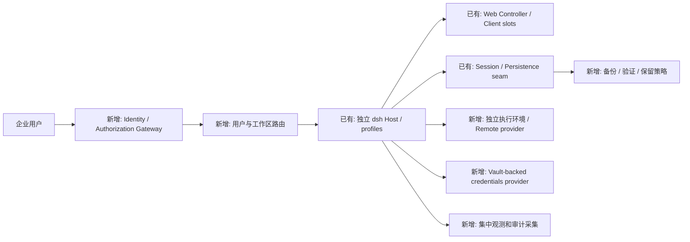

# 第三篇章：二次开发能力、定制方案与工程实践

基线固定为 `5badb15009ae1756c3afe0ae0cef1faafc290ccc`（0.2.1-alpha.1）。本篇的“改造建议”是新增工程设计，不是项目已经提供的能力。正文引用的API都来自此版本；官方开发接口处于预稳定阶段，未发现对这些插件接口的长期稳定性承诺。内部symbol、Loader internals和experimental包的升级风险更高。

## 1. 扩展接缝与具体契约

表中“作用域”指逻辑能力与注册寿命；不是安全租户隔离。除明确写内部者，其余是有导出／官方说明的开发接口，但仍不等于stable ABI。[E75 · 官方说明 · `Developer preview / compatibility-breaking changes`](https://github.com/deepseek-ai/deepseek-harness/blob/5badb15009ae1756c3afe0ae0cef1faafc290ccc/README.md#L11-L13) [E76 · 官方说明 · `tool / gate plugin examples and extension selection`](https://github.com/deepseek-ai/deepseek-harness/blob/5badb15009ae1756c3afe0ae0cef1faafc290ccc/docs/cookbook/extension-cookbook.md#L1-L36)

|接缝／定义实现|参数、返回与执行时机|作用域／依赖／顺序|错误、清理和兼容风险|
|---|---|---|---|
|Plugin `name/inject/Config/apply`；Cordis Fiber／Loader|Context与解析config；apply注册effects或Service实例|inject满足后激活；父Fiber拥有实例；按服务依赖而非仅YAML位置|初始化throw使Fiber失败；ctx.on/effect自动撤销；手工promise需取消排空；预稳定，E04/E05/E07|
|profile `dsh.profile.bundles`／bundle `dsh.bundle`／patch；Include|entry列表、按id覆盖或insert；在boot或reconcile|bundle→profile→home→CLI；config整体替换|目标不存在warn跳过；解析与激活失败语义不同；载体默认HMR不同，E08/E11/E13|
|`agents.setFactory(factory)`；AgentRegistry|createAgent(ownerCtx,options)、resume；供create/resume委托|一个factory slot；具体driver消费者依赖registry|重复注册throw；factory provider卸载要drain它创建的handles；实现Agent事件和持久契约成本高，E16/E17|
|`agents.create({sessionId,agentOptions,setup,...})`|返回owned AgentHandle；setup在publish前组装|ownerCtx持有生命周期；setup收到agentCtx；父Agent所有权另传|setup只能组装，创建完成后再drive；失败回滚scope；清理handle.dispose，E17|
|`agent/pre-step`；runtime-types / ReactLoopAgent|payload agent/messages/turn/step/signal，next→PreStepDecision，返回reject或enter|每Step接纳前；scoped waterfall；spread保留startsRequestSeries|不调next可以截断；reject可零Step；throw关闭Turn；ctx.on拥有监听器，E63/E20|
|`agent/request`；prepareRequest|payload agent/turn/step/signal，next→LlmCallConfig；返回配置|每attempt、输入提交前；不能修改messages|路由必须有provider/model；取消在提交前生效；卸载不撤销已记header，E22/E63/V05|
|`agent/request-error`；Loop / llm-retry|failure/provider/retryPolicy/signal等，返回retry或next委托|失败attempt后；recovery插件按注册waterfall顺序接管|禁止盲重跑工具；插件卸载取消backoff并drain；provider owns policy，E31|
|`agent/turn-stopping`；turn|payload turn/signal等；serial可注入后续输入|terminal且next-step空时调用，之后重查inbox|listener throw可使Turn失败；不是保证最终停止的通知，E20|
|`llm.registerAdapter(providers, adapter)`；LlmRuntime|Adapter stream→AsyncIterable<StreamChunk>；resolveModel提供能力元信息；registration可replace路由集|provider命名路由；PreparedCall绑定当次adapter generation|重复route拒绝；replace不是原地替换适配器内部state；signal／stream规范／错误规范化需兼容，E30/E70|
|`tools.register(defineTool(...))`；ToolRuntime / schema|typed parameters、output schema/render、execute canonical value；返回disposer|注册时归属调用Context；AgentScope层可shadow；工具执行时解析|无output拒绝；invalid args结构化失败；需协作signal和quiescence；自动effect清理，E32/E34/E69|
|`tools.restrict(mask)`／`tools.guard(predicate)`|restrict返回disposer；guard对exec作拒绝判定|必须Agent context才能restrict；多mask求交并叠deny；guard单调拒绝|不可借guard重新allow已拒绝；不等价OS权限；自动撤销，E69|
|`tools/pre-execute`|exec＋next→allow/deny/cancel/ask|有序prepare，进入body前；可触发审批|ask无approval／Agent时降级deny；不吞异常默认allow，E33/E36|
|`tools/execute`|exec＋next→ToolExecutionResult|实际body外wrapper；signal可临时替换但上游取消仍融合|timeout需要等待底层停稳；不能悬挂Promise.race；必须finally恢复signal，E32/E35|
|`tools/post-execute`／`tools/result`|前者normalized result＋next→result；后者最终结果观察|batch finalize按模型序；result只观察|后置改变需要符合canonical契约；result observer failures局部包含；不能倒推所有event吞错，E33|
|`systemPrompt.section/context/variable/tools`|有序文本、动态context、变量provider、工具schemaprovider，均返回disposer|scope可shadow；assembleContext带agent/scope/signal；order＋name排序|重复／非法变量、缺失值可fail；模型可见变化由Loop记录；纯渲染不能执行副作用，E59/E29|
|`sessionProjections.register(def)`|key/stateSchema/stateVersion/init/apply与可选wire schema/view；返回disposer|增量fold committed events；host stateOf与client snapshot分开|stateVersion不兼容拒绝；returned host state不得mutate；cache不是事实源，E28|
|`Session.append(type,data,surfaceIntent)`／message projections|连续seq、JSON快照、surface append/replace/source归因|Session事件权威边界；log-only和model-visible事件分开|消息类型必须surface metadata；拒绝reentrant；事件格式属高风险兼容契约，E26/E27|
|`SessionPersistence` provider / SessionHandle|create/open/flush/stat/list；handle read/append/close等|单写者、写ownership、有效前缀与明确durability|不是自由KV替换；需保版本迁移、torn tail、flush、lease；export另包，E37/E39/E40|
|`agentPresets.register`及声明插件|PresetDefinition，异步activation和retained generation|scope父链与当前preset generation绑定；依赖loader/projections|失效或service leakage audit；切换不等价所有旧实例立即销毁；未运行该能力，E56|
|`subagents.registerProvider`／WorkflowEngine.start|provider、owned子生命周期／WorkflowRun|父Agent委派和result／dispose契约；不同provider可能进程内／外|实验Team不是租户平台；必须限深度／容量、取消和归档兼容；仅接口概览，E57及包清单|
|UI `SlotCore.register(options, component)`|已声明slot名、key/id/select等，与渲染component|single/keyed/list/chain及priority，Host/Client编译域分开|未声明／同层冲突throw；按Client插件清理；完整页面替换需构建，E58|
|`Hmr.partialReload`／Loader.internal|module graph/cache/namespace/Fiber重建|Node internals、ready gate、串行队列；配置HMR与模块HMR分开|内部接口；任何state迁移需另设计；不推荐业务插件依赖私有cache，E14/E64|

关键实现链接：[E63 · 源码事实 · `PreStepDecision / agent/pre-step / agent/request`](https://github.com/deepseek-ai/deepseek-harness/blob/5badb15009ae1756c3afe0ae0cef1faafc290ccc/packages/core/agent/src/runtime-types.ts#L309-L350) [E69 · 源码事实 · `ToolRuntime.register / restrict / guard`](https://github.com/deepseek-ai/deepseek-harness/blob/5badb15009ae1756c3afe0ae0cef1faafc290ccc/packages/core/tools/src/index.ts#L1063-L1155) [E34 · 源码事实 · `defineTool`](https://github.com/deepseek-ai/deepseek-harness/blob/5badb15009ae1756c3afe0ae0cef1faafc290ccc/packages/core/tools/src/schema.ts#L554-L632) [E70 · 源码事实 · `LlmRuntime.registerAdapter`](https://github.com/deepseek-ai/deepseek-harness/blob/5badb15009ae1756c3afe0ae0cef1faafc290ccc/packages/llm/llm/src/index.ts#L389-L435) [E59 · 源码事实 · `SystemPrompt.section / context / tools / variable`](https://github.com/deepseek-ai/deepseek-harness/blob/5badb15009ae1756c3afe0ae0cef1faafc290ccc/packages/core/system-prompt/src/index.ts#L454-L544) [E28 · 源码事实 · `SessionProjectionRegistry.register / stateOf / snapshot`](https://github.com/deepseek-ai/deepseek-harness/blob/5badb15009ae1756c3afe0ae0cef1faafc290ccc/packages/session/session-projection/src/index.ts#L253-L355) [E37 · 源码事实 · `SessionHandle / SessionPersistence`](https://github.com/deepseek-ai/deepseek-harness/blob/5badb15009ae1756c3afe0ae0cef1faafc290ccc/packages/session/session-persistence/src/index.ts#L52-L173) [E58 · 源码事实 · `SlotCore.register`](https://github.com/deepseek-ai/deepseek-harness/blob/5badb15009ae1756c3afe0ae0cef1faafc290ccc/packages/client/ui-slots/src/index.ts#L1203-L1262)。表内编号集中索引每个路径与行号，避免在大表重复极长URL。

## 2. 替换矩阵：能接入不代表任意时刻无损更换

|组件|接口与配置入口／官方可对照实现|本次验证|状态及依赖方约束|生效方式／运行中风险|建议与升级成本|
|---|---|---|---|---|---|
|模型adapter|registerAdapter；DeepSeek、pi-ai等first-party实现，profile provider插件配置|mock＋request reconstruction／路由示例|StreamChunk、capabilities、tools/history/reasoning、provider policy|新增注册／禁用旧provider并重挂；PreparedCall已绑定旧实例，当次不自动改路由|优先写provider插件；空闲边界切换；中等成本，E30/E70|
|模型调度policy|agent/request、request-error；llm-retry／compaction实例|route-policy、retry／request-error|只改config，内容仍走日志；失败recovery次数和取消须有界|listener注册／卸载；已记录header持久保留|做路由／预算policy；新Agent与已有header分别回归；中等成本，E22/E31|
|单个工具／工具集合|tools.register/restrict；官方工具插件众多|sum-tool、invalid args、工具并发原tests|schema、output、scope、side effect和取消|新增注册或shadow；注册撤销不自动rollback已执行body|首选原生扩展点；低至中成本，E32/E69|
|执行pipeline|tools/pre-/execute/post-execute；timeout/checkpoint例子|approval／timeout相关tests|signal融合、canonical result、顺序、quiescence|mount wrapper；若全换ToolRuntime还须内部scheduler协议|优先wrapper，避免fork整个runtime；中至高成本，E33/E35|
|具体Agent Loop|agents.setFactory；agent-loop就是provider|原Loop验证；未实现替代Loop|Agent接口、inbox/projections、created、history、turn/step、tools/LLM checkpoint|停止原factory生成handles后重挂／重启；不能把旧driver对象换class|接口允许另实现，但非简单热插拔；高成本，E16/E17/E20|
|Session管理|SessionStore、Session append／surface消费链|原session/fork/repair tests；未写替代|事件seq、冻结、surface metadata、projections、恢复兼容|替换服务重挂；在途消费者要停；已有持久事实不应丢|保留事实格式，优先外围投影；高成本，E26/E27|
|持久backend|SessionPersistence定义＋JSONL实现，base配置可选择provider|原JSONL、lease、migration；未写SQL替代|single writer、append durable、flush、有效前缀、migration及resume语义|移除旧provider重挂／重启，迁移数据；不能同时向同realm提供同名服务|数据库provider可新增；先双向兼容契约测试；高成本，E37/E41/E42|
|UI单slot／视图|Client Slots；已有ui-*提供者，profile client模块|源码；未运行浏览器UI插件|host contract、Remote类型生成、slot声明和registration冲突|Client插件挂载；新assets需构建；前端HMR不等于Host module HMR|小功能用slot；全换UI基于协议另做Client；中至高，E58/E45|
|日志／观测|Cordis logger、session-telemetry、otel插件|仅核心事件测试，无OTLP接收实测|logger观察不能改变事件真相；敏感消息、工具参数脱敏|配置sink／订阅观察；不改Session事实日志作“压缩日志优化”|增加可观测插件，区分trace与durable journal；低至中，E26/E65|
|FS／Shell／Subprocess|定义/provider/consumer拆分；local／SSH／sandbox版本|源码追踪，平台执行未验证|原子write意图、路径身份、进程range、输出spill、signal和sandbox策略|配置provider并重挂；持有live句柄时不直接卸载|远端/容器替代须完整能力与ownership契约；高成本，E50/E52|

框架同一服务realm不允许并存两个同名provider，卸载provider会通知依赖Fiber刷新；“替换接口存在”绝不等于“业务state自动迁移”。对未知插件的任意热替换，本研究没有证据给出无损保证。[E03 · 源码事实 · `ReflectService.provide / notify`](https://github.com/deepseek-ai/deepseek-harness/blob/5badb15009ae1756c3afe0ae0cef1faafc290ccc/vendor/cordis/src/reflect.ts#L277-L327) [E04 · 源码事实 · `Fiber._refresh / _reload / _unload / update`](https://github.com/deepseek-ai/deepseek-harness/blob/5badb15009ae1756c3afe0ae0cef1faafc290ccc/vendor/cordis/src/fiber.ts#L611-L752)

## 3. 专属智能体和私有工作台实施方案

### 方案A：可信个人／小团队专属Agent（改造建议）

假设：工具开发者可信，主要本机或受管内网，允许固定版本迭代，不要求不可信租户同进程隔离。

路径：选择sdk或headless profile；通过bundle／patch增添自定义工具与policy；用systemPrompt section/context输入企业规范；以agent preset组织能力组合；模型路由插件选择已注册provider；应用通过agents/SDK控制生命周期；需要步骤脚本时再接workflow／PTC，不直接在Loop.step塞企业业务分支。依赖来源：E01、E59、E56、E57；本次真正运行的增量切口是两个示例。

验收：正常工具输入生成canonical结果并进入下一Step；invalid args不进入body；作用域A的能力不会进入无关Agent；cancel、dispose等待清理；保存后resume保留上下文并拒绝盲重跑副作用。工具白名单不是插件进程权限，开发者可信是必要前提。

### 方案B：私有AI工作台（改造建议）

原生可用：Web界面及slots、controller Remote与流重建、会话事件／查询／导出、local credentials、工具审批／sandbox、preset、基础遥测插件。新增部分：企业入口身份、组织角色、持久授权、KMS／vault与密钥轮转、集中审计策略、持久服务运维、备份验证和升级控制。既有browser auth可参与本地入口保护，但不能冒充企业OIDC／SAML及RBAC。[E53 · 源码事实 · `isTrustedApiRequest`](https://github.com/deepseek-ai/deepseek-harness/blob/5badb15009ae1756c3afe0ae0cef1faafc290ccc/packages/client/connection/src/api-request-trust.ts#L91-L118) [E54 · 源码事实 · `processLaunchToken`](https://github.com/deepseek-ai/deepseek-harness/blob/5badb15009ae1756c3afe0ae0cef1faafc290ccc/packages/client/connection/src/browser-auth.ts#L52-L57) [E55 · 源码事实 · `assertOwnerOnly`](https://github.com/deepseek-ai/deepseek-harness/blob/5badb15009ae1756c3afe0ae0cef1faafc290ccc/packages/credentials/credentials-local/src/index.ts#L114-L146)

图 C1明确标出新增与原生。默认每受信任用户／工作区独立Host和数据目录；需要强隔离时再用容器或远端执行器分开权限主体。不要用一个root Context的Scope来承载相互不信任租户。

### 方案C：多用户、多Agent平台（改造建议）

原生subagent有provider、父子所有权、消息投递／归档等机制；experimental agent-team提供roster、durable peer mailbox、task DAG。它们解决Agent协作的一部分，不能自动提供企业租户模型、跨主机调度、任务幂等恢复、配额和计费。目录已概览，Team不在本次运行验证范围，不推荐据此直接承诺生产协作SLA。

|平台需求|可复用原生部分|必须新增／验证|集成位置与相对工作量|
|---|---|---|---|
|用户身份／权限|browser auth、Host trust、工具approval／guard|SSO、主体与session ownership、RBAC/ABAC、跨资源授权|入口gateway与controllers／policy；高|
|租户隔离|Scope用于能力继承，OS sandbox限制工具文件效果|独立进程／容器／密钥／数据根与网络隔离|执行Host层，非Scope技巧；高|
|凭据管理|CredentialProvider抽象、local provider|vault/KMS provider、轮转、授权token最小化、审计|credentials seam；中至高|
|持久化／备份|JSONL、格式catalog、lease、projection cache／query|集中索引／跨机一致性／快照与恢复演练|Persistence seam与平台存储；高|
|并发／队列|单Agent driver、per-step工具pool、子代理限制|per-user/provider全局预算、持久任务队列、公平性／背压|SDK／API前任务协调器；高|
|任务恢复|Session repair、工具unknown outcome、resume|job状态、幂等键／外部效果核对、重试策略|工具connector与新增job协调；高|
|审计／观测|Session事实、approval audit、遥测插件|trace关联、敏感字段控制、集中索引、保留与删除策略|观察插件和采集服务；中|
|UI定制|slot与controller协议|租户／组织视图、管理功能、权限可见性与完整E2E|Client插件或新UI；中至高|
|运维／升级|固定profile、包兼容管理、格式迁移|版本晋级、故障恢复、容量监控、平台矩阵、回滚演练|部署流水线；高|

“低／中／高”表示相对契约和新增系统复杂度，不是人日估算。没有测吞吐、并发上限、真实模型价格，不提供虚构预算。

如需provider熔断：在路由／调用层新增受控健康状态、rolling failure统计、冷却和half-open探测，不能在工具结果层随意重发。必须考虑当前PreparedCall已绑定provider、记录实际路由、取消和最大总请求预算；这属于新设计，项目retry插件不能直接替代它。

## 4. 两个最小扩展示例与验证

源码文件、包manifest、编译JS、patch和操作说明均在[examples](examples/README.md)；每例是独立ESM插件，没有虚构import、schema或生产直接Context入口。

|示例|原有行为→扩展行为|主要契约|本次验证|
|---|---|---|---|
|[sum-tool](examples/sum-tool/README.md)|模型不存在该业务工具→挂插件后可调用`research_sum`，2+3结果5进入第二Step请求|tools.register、defineTool、output schema/render、signal、isConcurrencySafe|严格类型／JS编译通过；真实Loop正常链、invalid args、卸载清理通过|
|[route-policy](examples/route-policy/README.md)|原路由model=base→挂插件后agent/request选择model=policy|Config Schema、await next、spread downstream、signal、logged header|严格类型／JS编译通过；调用收到新route、unload后已有header保持／新Agent无listener、取消通过|

验证运行环境使用固定checkout的真实Cordis、Session、Projection、LLM和Loop，加脚本化adapter；没有真实模型凭据、网络请求或业务数据写入。**离线通过证明目标扩展点实际生效，不证明真实DeepSeek／其他provider服务、UI或平台sandbox可用。**示例app接入patch有完整说明，但未把完整发布profile启动写成已验证。

route-policy是全局mount时影响该Context可见的Agent；如果只作用于一个Agent，使用 `agents.create`的setup中 `await agentCtx.plugin(Route, config)`，其注册属于该Agent scope。已有header恢复／路由选项覆盖须通过明确policy处理，不能卸载后假定会回到创建options。V05已验证该边界。

## 5. 开发规范、升级和回归建议

**官方说明／源码约束：**支持的Node应用走profile；采用ESM与正确package入口；Host／Client编译域分开；一次能力只保留清晰定义、provider与consumer；所有注册归属effects；waterfall清楚何时next、何时截断；尊重lossless JSON和surface metadata，保持released session格式与单调迁移。具体机制见E01、E03–E08、E26、E42、E68。

**源码推导建议：**业务内容优先 `agent/pre-step`或systemPrompt贡献，route配置走agent/request，工具执行wrapper走tools/execute；不要改冻结的model request。observer只作观察，关键业务失败应在可await的契约中传播。每个工具明确是否read-only、idempotent、可并发和可取消，持有子进程／网络连接时close到quiescence；工具完成后再发布结果，防止假超时。[E22 · 源码事实 · `ReactLoopAgent.prepareRequest / buildRequest`](https://github.com/deepseek-ai/deepseek-harness/blob/5badb15009ae1756c3afe0ae0cef1faafc290ccc/packages/core/agent-loop/src/agent.ts#L547-L686) [E33 · 源码事实 · `ToolRuntime.prepareExecution / dispatchExecution / finalizeExecution`](https://github.com/deepseek-ai/deepseek-harness/blob/5badb15009ae1756c3afe0ae0cef1faafc290ccc/packages/core/tools/src/index.ts#L1493-L1699) [E35 · 源码事实 · `tools/execute deadline wrapper`](https://github.com/deepseek-ai/deepseek-harness/blob/5badb15009ae1756c3afe0ae0cef1faafc290ccc/packages/guard/timeout-policy/src/index.ts#L55-L81)

**一般工程经验，非项目保证：**固定SHA与lockfile，发布前验证packed artifact；采用沙盒输入、mock和必要真实provider smoke分层回归；对工具外部写入保存operation id并支持状态核对；升级先复制数据做只读catalog检查，再在备份数据上验证写迁移与恢复。不要把源码单测通过换算成生产可用率。

建议最小回归包：创建／取消／dispose、2-Step工具对话、invalid args／审批拒绝／timeout、request header重建、scope隔离、关键provider路由变化、存储写锁／torn tail／migration／resume、carrier重连、UI新增slot。每次升级只补与新变更和未解决风险相关的验证，不无依据重复全仓suite。

## 6. 已确认差异、限制和潜在风险

|性质／适用版本|触发／现象与影响|成因／证据|处理／验证状态|
|---|---|---|---|
|文档差异；本SHA|架构接口概述提export，实际Persistence无export方法|E37/E72/E73；session-log-export独立Host route|按实际接口集成；源码已确认，不是数据缺陷|
|文档字段差异；本SHA|fork quick-reference仍写meta.seedLength，当前类型不接受此字段|E73/E74：isSeeded及独立inheritedEventCount|使用真实CreateAgentOptions和buildForkSeed；源码确认|
|环境阻碍；本机source checkout|初次154 tests失败，主要缺原生flock binding|V02，install采用ignore-scripts|执行build:native-system后受影响suite全部通过V03；不归为项目bug|
|预期契约；本SHA|route插件unload后已有会话仍保持logged选择|requestProposal依赖header；V05|用后继route policy显式切换／新Agent；已运行验证|
|设计限制；本SHA|config激活失败可能已有成功兄弟变更|E13 eager更新／audit|上线配置先离线dump与兼容核验，运行更新失败检查实际树；相关测试通过|
|设计限制；本SHA|工具不响应取消时timeout与卸载可能长时间等待|E35等待next而非abandon；E17drain|为工具实现真正取消／进程termination；不声称已测任意第三方hang|
|设计限制；本SHA|进程crash丢未结算assistant live前缀|E24/E47两种状态寿命|UI提示过程态；若要每chunk耐久需新增格式与性能工程；源码确认|
|副作用不确定性；本SHA|已做外部操作但未记录结果，resume补unknown|E38/E43并非分布式事务|幂等键＋外部核对；repair已测，不自动blind retry|
|安全边界限制；本SHA|不可信插件可绕开工具provider|E02同进程Context；E50仅消费层约束|隔离插件／执行host并最小化凭据；属于架构推导，不是漏洞复现|
|平台限制；本SHA|Windows／旧Landlock partial；macOS依赖Seatbelt runner|E51及sandbox-local官方README|生产按平台实测并检查enforcement；本次无三平台验证|
|潜在风险；有stateful provider在线替换|旧闭包／PreparedCall／句柄仍握旧实现，可能状态不兼容|E14/E30/E52|停止接纳、drain、迁移、重启优先；未构造任意provider故障复现|
|潜在风险；公开多用户部署|使用Scope或本地token代替企业租户授权会权限混淆|E48/E53/E54|新增主体授权与进程边界；未审计所有controller的所有权逻辑|
|通用升级风险；alpha API|接口／格式／Node internal变化影响外部插件|E07/E14/E42/E68|固定版本、分层兼容tests、逐版本迁移；不编造发生频率|

H01失败Step结果补齐、H02动态工具prompt保持、H03HMR entry身份均是历史已修复问题。本研究没有在修复后的基线上发现足够证据另报这些bug，也没有测量内存泄漏、速度退化或泄漏率。

## 7. 决策与落地验收

|阶段|目标与原生依赖|新增工作|验收条件|
|---|---|---|---|
|最小原型|固定SDK／Headless profile、LLM与tools seams|两例扩展、企业只读工具、prompt section|可复现正常／错误／取消；schema与历史一致|
|能力验证|Scope、preset、Persistence、Gateway|真实provider smoke、幂等工具、专项platform checks|日志可恢复、写锁互斥、外部结果可核对、指定平台sandbox拒绝有效|
|工作台集成|Web controller／slots、credentials、telemetry|身份接入、UI管理、数据保留与备份、审计|授权独立检验、E2E重连、可恢复备份、敏感字段控制|
|平台化生产|独立Host与能力provider|租户执行隔离、任务队列、预算／限流、升级／回滚运维|故障注入不串租户、不盲重做副作用，迁移可追溯、载体真实安装通过|

可先选作可信个人Agent与内部原型的组合底座；不建议把它未经增量工程直接包装为不可信租户共享平台。核心接口和测试提供了清晰扩展起点，代价在于预稳定API、事件／格式约束、生命周期及跨平台执行。没有完成的真实provider、UI E2E、打包安装、安全与负载验证，会影响上线承诺，具体最小动作列在[待验证问题](appendices/open-questions.md)。
