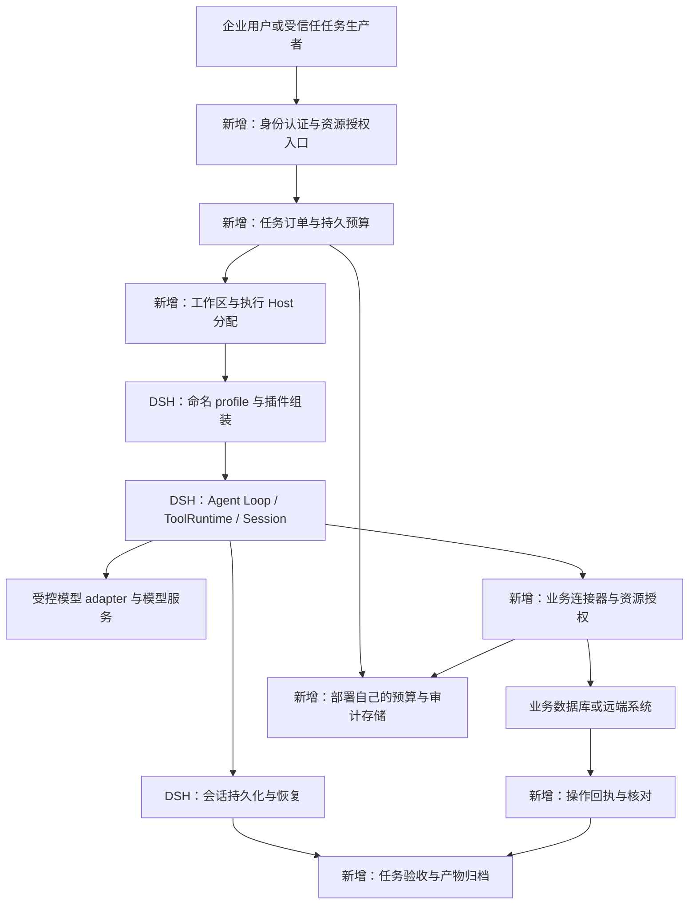
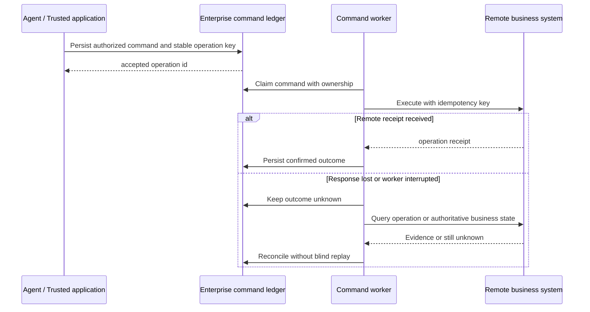

# 基于 DSH 构建企业专属 Agent Harness：架构分工、开发实践与可验证示例

基线：`5badb15009ae1756c3afe0ae0cef1faafc290ccc`，Harness 包版本 `0.2.1-alpha.1`。本文依据[宏观架构](01-architecture.md)和[源码运行](02-runtime-source.md)，复核相关源码接口后提出企业化方案。**这里的最佳实践是面向特定信任边界的工程建议，不是 DSH 已经交付的企业产品能力，也不是对最新上游版本的判断。** 原有扩展接缝和替换矩阵见[第三篇](03-extension-practices.md)。

配套[企业工单助手示例](examples/enterprise-harness/README.md)包含真实 Cordis 服务、两个可独立挂载的策略／工具插件、本地 SQLite 业务账本与可信入口组装函数。示例经过严格类型检查、ESM 编译和真实 Loop 离线测试；身份认证、真实模型、远端工单系统及完整产品部署不在这次验证范围。所有新增应用能力均在下文说明责任归属。

## 1. 企业化首先要确定哪些状态由谁负责

企业 Agent 最容易发生的架构失误，是让一个“会话”同时承担登录身份、业务任务、模型上下文、执行权限和计费账本。这样做的原型很快，但授权撤销、任务重试和升级恢复会逐渐失去明确边界。

DSH 已有很好的运行基础：Registry 管理实例，Loop 推进 Turn／Step，ToolRuntime 管理工具执行，Session 保存事实并派生模型视图。这些能力应继续由原生组件负责。企业系统增加一个可信控制面，负责用户是谁、这个任务允许做什么、交付是否满足要求，以及外部业务结果如何确认。业务连接器再负责资源访问、幂等写入和远端操作查询。[Agent 创建与 setup 契约](https://github.com/deepseek-ai/deepseek-harness/blob/5badb15009ae1756c3afe0ae0cef1faafc290ccc/packages/core/agent/src/index.ts#L37-L118)，[工具分阶段执行](https://github.com/deepseek-ai/deepseek-harness/blob/5badb15009ae1756c3afe0ae0cef1faafc290ccc/packages/core/tools/src/index.ts#L1493-L1699)。

|责任域|建议复用 DSH|企业需要新增的职责|权威状态在哪里|
|---|---|---|---|
|身份与授权|Agent setup、scope、工具准入接缝|SSO、主体映射、Session 所有权、资源授权、授权修订与撤销|企业身份／授权服务|
|任务控制|Loop、goal、规划与输入控制|任务订单、验收标准、风险分级、全局准入与任务取消|企业任务数据库|
|执行事实|Session、projection、JSONL、checkpoint|备份、保留、访问控制，以及需要时新增持久后端|DSH 日志与其持久 provider|
|模型上下文|systemPrompt、surface、compaction、adapter|企业资料检索、来源标注、数据分类与出境路由约束|由可信事实派生的请求视图|
|业务效果|ToolRuntime、工具结果规范化|资源版本、业务幂等键、操作回执、核对与补偿|业务系统与操作账本|
|费用与审计|usage、事件与 telemetry 接缝|预留／结算账本、部署自己的采集与审计存储|企业账本与审计服务|
|运行隔离|profile、provider、平台 sandbox|不同信任主体的进程／容器、密钥和网络边界|部署控制系统|

这些状态可以关联，但不应互相冒充。例如 `turn/end completed` 可以通知验收器开始工作，不能直接把业务任务标记为成功；`request/header` 可以记录本次选择了哪个模型，不能作为用户被允许使用该模型的授权证明。

默认建议从**单个受信任业务团队、固定场景、独立 Host**起步。相互不信任的团队、租户或插件，应具有独立执行进程和数据／凭据边界。Agent scope 有利于能力组合，却不能阻止同进程插件直接调用 Node API；这一选择来自第一篇第 9 项的安全边界，而非性能偏好。



图中的箭头表示业务调用和状态关联，不表示上述新增服务已经存在于官方 bundle。企业控制面与业务数据库可以先部署在同一应用中；图中分工并不要求立即拆成多个微服务。

## 2. 把 16 项关注点转成企业开发与验收要求

下面按两篇原文的顺序建立映射。它既是设计线索，也给后续需求评审和版本升级提供明确的检查对象。

|关注点|二次开发最佳实践|主要接缝与位置|应独立验收的行为|
|---|---|---|---|
|1. 任务与完成语义|定义业务 Task 和验收规则，分别保存执行结束与验收结果；一个最小任务先独占一个 Session|企业任务服务、`turn/end`、goal|Loop 正常结束但业务断言不满足时，任务不能成功|
|2. Loop 与执行模型|保留原 Loop；在 setup 组装能力，在准入点限制执行；成功创建后才驱动|`agents.create/resume`、`agent/pre-step`|setup／发布复核失败不发布半成品 Agent；排队回执不宣称完成|
|3. 模型适配|按数据等级、能力和部署约束选择已注册路由；保持 PreparedCall 契约|`agent/request`、`registerAdapter`|不允许的路由无法派发；工具、多模态与历史恢复分别测试|
|4. 上下文工程|企业规则进 section；业务证据带来源／版本；检索结果仅作为数据，权限由连接器检查|`systemPrompt.section/context`、检索工具|越权资料不进入模型；压缩后仍保留验收约束和引用|
|5. 状态与记忆|保留 Session 事实格式；任务、账本、记忆、产物分别持久化|Session、projection、Persistence、外部记忆|重启后各类状态恢复到明确边界；恢复日志不自动恢复授权|
|6. 工具契约|使用窄参数、规范输出、服务端资源过滤与取消；读写工具分离|`defineTool`、`tools.guard`、业务 provider|伪造 tenant／资源 ID 不能改变数据归属；最终输出符合 schema|
|7. 可靠性与副作用|写入使用业务幂等键、版本条件与可查询回执；unknown 先核对后重试|业务操作服务、Session repair|响应丢失后不重复业务效果；取消不伪装成远端回滚|
|8. 并发与调度|保留 Loop 局部并发；在外围新增任务队列和全局公平配额|任务准入、provider 限流、工具并发|局部工具池调大不能突破租户／provider 总容量；有过载策略|
|9. 权限与安全|从登录主体贯通任务、Agent、资源和执行凭据；不可信主体分开 Host|入口授权、setup、guard、能力 provider|Session 读／写／导出均验证主体；越权读取和任意执行被独立拒绝|
|10. 自主性与干预|把自主范围编码成授权政策；无人值守任务只运行已允许动作，遇到范围外操作返回阻塞|goal driver、工具准入、cancel|模型不能扩大目标或自行恢复暂停任务；授权撤销能停止后续工作|
|11. 成本与时延|对调用尝试、金额、截止时间和并行槽分别建账；预留先于派发|`agent/request`、LLM 调用边界、任务账本|同 Step 的重试也扣额度；恢复和多 Agent 不能各自重置预算|
|12. 可观测与审计|区分会话事实、业务审计、trace 和产品分析；审计只记录必要字段|工具 wrapper、业务事务、部署采集器|有可关联的意图、业务回执、最终结果；强审计不依赖异步 observer|
|13. 评测与质量|同时建设框架契约回归、领域任务集、权限反例和业务效果断言|真实 Loop fixture、真实模型 smoke、业务测试|不能以 Agent 自述替代数据库／文件检查；测试层级分别报告|
|14. 扩展与生命周期|注册归属 Fiber；在途请求另行取消、等待和释放；授权在 await 后复核|`ctx.on/effect`、AgentHandle、provider|卸载撤销新工作并排空旧工作；旧回调不继续使用过期权限|
|15. 交互与交付|外部 API 分开请求回执、执行状态和任务验收；归档不可变产物与访问权限|SDK／Controller、产物服务|断线重连不盲重发命令；旧交付跨重启仍可授权下载和核验|
|16. 部署与演进|锁定 SHA／依赖／profile；按旧数据和真实启动入口回归，正式发布采用 drain 与版本部署|`dsh` profile、格式迁移、部署流水线|readiness、恢复、备份与回滚分别通过；不把 HMR 当发布事务|

表中 DSH 契约的逐项源码与已有验证见[第一篇](01-architecture.md)和[第二篇](02-runtime-source.md)。以下选出对企业产品影响最大的跨层问题，展开具体实现。

## 3. 扩展路径：从策略插件与业务工具开始

### 保留执行内核，围绕稳定职责增加插件

企业业务规则通常应进入三个位置：任务接纳放在可信入口，模型路由／执行上限放在 policy，资源访问与业务操作放在 tool／provider。只有执行模型本身无法表达需求，例如必须采用不同的确定性流程时，才评估实现新 Agent factory。替换 Loop 还要兑现 inbox、取消、流结算、Session 历史和清理等契约，升级成本明显更高；这是工程复杂度判断，不是已测量的人日。

建议先构建一个企业 bundle，固定 profile、核心包和可信插件集，再由入口插件在 `agents.create` 的 setup 内组装具体 Agent。agent preset 可用于表达角色能力组合，但企业授权仍由控制面提供，不能从 preset 名字推断权限。[setup 与发布提交点](https://github.com/deepseek-ai/deepseek-harness/blob/5badb15009ae1756c3afe0ae0cef1faafc290ccc/packages/core/agent/src/index.ts#L37-L118)，[原生扩展选择](https://github.com/deepseek-ai/deepseek-harness/blob/5badb15009ae1756c3afe0ae0cef1faafc290ccc/docs/cookbook/extension-cookbook.md#L24-L36)。

配套示例的职责很窄：可信应用先创建工单读取任务；`EnterprisePlatform` 绑定身份和授权；policy 指定模型、调用额度与可执行工具；ticket tool 只读任务指定的工单。没有往 Loop 增加企业业务分支。

|代码|职责|为何放在这里|
|---|---|---|
|[ledger.ts](examples/enterprise-harness/ledger.ts)|任务授权快照、预算、工单表、操作回执和最小审计|持久业务事实独立于模型上下文与插件实例|
|[platform.ts](examples/enterprise-harness/platform.ts)|Cordis 服务、live Agent 身份绑定、连接器边界与清理|统一向策略与工具提供可信能力|
|[policy.ts](examples/enterprise-harness/policy.ts)|Step 准入、request 路由与额度、工具 mask／guard、执行观察|复用公开拦截点，保持原 Loop|
|[ticket-tool.ts](examples/enterprise-harness/ticket-tool.ts)|窄参数工具、资源授权、规范输出、await 后复核|业务访问在能力实际消费处约束|
|[provision.ts](examples/enterprise-harness/provision.ts)|可信创建、setup 组装、发布前复核、任务截止取消|把授权与生命周期联系在同一个创建链路|

插件保留 bare package import，由宿主与插件共享同一份 Cordis／Harness runtime；打包另一份框架会破坏单例、scope 和类型注册假设。示例的编译产物没有复制上游源码，发布安装仍需另外验证。

### 启动入口与配置不要另起一套约定

生产应用继续通过 `dsh` 命名 profile 启动。profile／bundle 解决部署组合；入口插件处理经过认证的任务，然后调用示例的 provision 函数。直接 `new Context()` 的写法仅存在于本次测试 fixture，不作为新的生产入口。

挂载平台服务不会自动改造标准 SDK／Controller 的所有 Agent 创建路径。企业入口需要统一管理 create／resume 与外部控制 API 的所有权；未经绑定的标准入口应由部署关闭或限制访问，不能认为一个 insert patch 就已经使所有会话获得企业政策。尤其不能把仅用于本机的 stdio SDK 直接当作带 SSO 的公网接口。

配置覆盖也要显式：patch 的 `config` 是整体替换，不能假设递归合并。企业应保存最终配置快照，并验证所需服务是否真正 active；“加载了包”与“消费者已经可用”是不同事实。[profile 组合顺序](https://github.com/deepseek-ai/deepseek-harness/blob/5badb15009ae1756c3afe0ae0cef1faafc290ccc/packages/boot/app-boot/src/profile-context.ts#L63-L74)，[patch 实现](https://github.com/deepseek-ai/deepseek-harness/blob/5badb15009ae1756c3afe0ae0cef1faafc290ccc/vendor/include/src/index.ts#L57-L123)。接入骨架及运行边界见[示例说明](examples/enterprise-harness/README.md)。

## 4. 身份、上下文与工具权限必须形成同一条授权链

### 身份来自可信入口，资源范围来自任务订单

典型错误是把 `tenantId` 放进 prompt 或工具参数，让模型传给数据库。模型能够生成字段，无法证明字段的可信来源。推荐在 SSO 和资源授权通过后，生成不可由模型更改的任务订单，记录主体、Session、政策 revision、资源范围、允许路由、额度与有效期。

示例先根据 `tenantId + actorId + taskId + sessionId` 获取任务，再把冻结的授权快照绑定到**Agent 对象**。工具执行必须同时满足 Registry 中仍是该实例、当前任务未撤销、revision 一致、有效期未结束。旧会话恢复出一个新 Agent 时必须重新绑定，不能仅凭相同 session id 继承旧权限。

```ts
// platform.ts：用于工具／模型准入，不用于 setup 的未发布阶段。
current(agent: Agent | undefined): TaskSpec {
  if (this.closing || !agent || this.ctx.agents.get(agent.id) !== agent) {
    throw new Error('UNBOUND_AGENT')
  }
  const grant = this.grants.get(agent)
  if (!grant) throw new Error('UNBOUND_AGENT')
  this.ledger.assertCurrent(grant)
  return grant
}
```

`setup` 的复核有所不同：此时实例尚未进入 Registry，因此示例在返回的 `commit()` 中直接复核业务账本，再由原生 factory 发布。这个细节能够防止“创建开始时已获准，等待插件加载期间已被撤销”的过期授权。

示例的 `Subject` 参数约定来自可信应用，并未实现 JWT 校验或 SSO。生产入口必须完成 token 校验、组织映射、Session 所有权与资源授权后才调用。也不能开放 `createTask`、`putTicket` 或 `bind` 为模型工具。测试证明的是约束正确使用时的隔离，不是同进程恶意插件防护。

### schema 可见性与实际派发要同时限制

`tools.restrict({ allow: [] })` 使 Agent 不继承全局工具，但当前 scope 自己注册的工具仍可见。因此示例另外用单调 guard 只允许 `enterprise_ticket_read`。guard 可以拒绝，不会因为另一个 pre-execute listener 允许而失效。[restrict／guard 实现](https://github.com/deepseek-ai/deepseek-harness/blob/5badb15009ae1756c3afe0ae0cef1faafc290ccc/packages/core/tools/src/index.ts#L1104-L1160)。

```ts
ctx.tools.restrict({ allow: [] })
ctx.tools.guard(exec => {
  try {
    ctx.enterprisePlatform.current(exec.agent)
    if (exec.name !== TICKET_TOOL) return 'TOOL_NOT_AUTHORIZED'
  } catch { return 'AGENT_NOT_AUTHORIZED' }
  return undefined
})
```

这段策略适用于示例的 native tool mode。PTC 的 `run_code` 是保留运输工具，不能套用同一个只允许工单工具名的 guard；若增加 PTC、workflow 或子 Agent，必须扩展运输层与底层能力的政策，并为子实例重新授权。示例未挂载这些能力，父层 guard 会拒绝未绑定的子实例。

### 业务工具还要在数据返回前复核

工单工具只接收 `ticketId`。后端查询同时使用绑定的 tenant 和任务指定的资源编号；输出只包含工单编号、裁剪后的标题、状态和版本，不带凭据或完整后台对象。等待后端期间发生撤销时，工具在返回之前再次检查 signal 和当前授权。

```ts
const grant = ctx.enterprisePlatform.current(exec.agent)
const ticket = await ctx.enterprisePlatform.readTicket(grant, args.ticketId, exec.signal)
exec.signal.throwIfAborted()
ctx.enterprisePlatform.current(exec.agent)
return ticket
```

生产连接器仍须在自己的查询／事务边界进行授权；应用检查和远端提交之间若存在异步窗口，需要远端接受有有效期、资源范围及 revision 的凭证或另一个强制授权机制。Node 中的最后一次检查只能约束本进程接下来是否释放数据，不能追回已经交给模型的历史内容。

检索与长期记忆也遵循同一原则：权限过滤应发生在召回与取正文之前；cache key 需要包含租户和授权范围，记忆写入需要来源、有效期、删除与冲突政策。systemPrompt section 的来源标注帮助解释行为，不能替代权限检查或承诺消除 prompt injection。

## 5. 从单次 maxTokens 走向持久任务预算

原生 `maxTokens` 限制一次输出，goal 的回合上限限制续跑轮数。第二篇指出，同一个 Step 可以持续重试，且 always 重试不受 normal `maxRetries` 的上限约束；只数回合无法给出总调用数保证。[retry 的实际分支](https://github.com/deepseek-ai/deepseek-harness/blob/5badb15009ae1756c3afe0ae0cef1faafc290ccc/packages/llm/llm-retry/src/index.ts#L188-L259)。

示例将每次 Loop attempt 的准入预留放进 `agent/request`：先等待下游配置，复核取消与身份，再原子扣减持久额度，最后返回企业路由和输出上限。这样下游 await 期间撤销的授权不能继续使用，失败重试也必须再次经过预算。

```ts
ctx.on('agent/request', async (event, next) => {
  event.signal.throwIfAborted()
  ctx.enterprisePlatform.current(event.agent)
  const downstream = await next()
  event.signal.throwIfAborted()
  const grant = ctx.enterprisePlatform.current(event.agent)
  ctx.enterprisePlatform.ledger.reserveAttempt(grant)
  return {
    ...downstream, provider: grant.provider, model: grant.model,
    maxTokens: Math.min(downstream.maxTokens ?? grant.maxTokens, grant.maxTokens),
  }
})
```

账本在 `BEGIN IMMEDIATE` 内执行条件更新 `used < limit_count`，并把准入审计放在同一事务。它避免先查询余额再无条件写入造成的超额。SQLite 文件重开后计数仍在，多个连接也共享同一额度；**本次只验证了同机两连接与重开，未进行多进程竞争或集群测试。**

这是一种保守的“调用准入次数预算”：路由解析失败、准入后取消等情况也消耗预留，不自动退款。它没有计算货币费用，也不证明供应商确实收到一次请求；文稿和看板应使用“预留次数”，避免把它写成已计费调用。

生产金额预算需要额外的预留／结算／核对状态。调用前按明确上界预留，结束后按 usage 与供应商计费口径结算；usage 缺失时记为未知并保守保留，不能记零。退款与重试必须具有幂等身份，供应商最终账单还需要异步核对。

尤其要注意覆盖范围：压缩摘要直接调用 `ctx.llm.stream`，不会经过这个 request hook；子 Agent、评测调用及业务内部调用也可能走其他路径。如果承诺完整任务费用上限，应把总预算放在实际共享的 LLM 调用边界或受控模型网关，映射每次调用到 tenant／task，再让 Loop policy 提供更清晰的局部拒绝。示例 fixture 未启用 compaction 和子 Agent，不能把本例额度包装成全局模型计费系统。[摘要独立调用](https://github.com/deepseek-ai/deepseek-harness/blob/5badb15009ae1756c3afe0ae0cef1faafc290ccc/packages/compaction/compaction-basic/src/summarizer.ts#L120-L180)。

截止时间同样独立管理。示例任务最长一天，setup 注册截止 timer，触发带明确 hook 原因的 cancel，并在卸载时清除 timer；已有工具和模型必须响应 signal，Handle 清理等待其静止。生产环境还需控制面监测截止时间和节点失联，进程内 timer 不能作为跨进程恢复的唯一时钟。

## 6. 业务写入：幂等回执比“工具成功”更接近真实效果

### 本地同事务写入的完整示例

`ledger.closeTicket()` 用于可信应用命令，**没有注册成模型工具**。调用前任务必须明确拥有 `canClose` 权限；目标工单和期望版本来自可信任务订单。该设计用于解释可靠写入，不是在示例中自动批准关闭工单。

事务按以下顺序进行：复核授权；使用任务身份派生业务 operation id；检查同键输入 hash；以 tenant、工单编号和 expected version 更新业务表；写入幂等回执；写审计；提交。再次提交同一个授权任务会返回已存回执，业务版本只增加一次。若业务版本已经变化则事务失败，不写虚构回执。

```text
BEGIN IMMEDIATE
  检查当前任务授权与 canClose
  查询 (tenantId, operationId) 的既有回执
  已存在：核对 inputHash，返回同一回执
  不存在：按 tenantId + ticketId + expectedVersion 更新工单
          写操作回执
          写业务提交审计
COMMIT
```

完整 SQL、条件更新与错误处理见[ledger.ts](examples/enterprise-harness/ledger.ts)。三个记录在同一个 SQLite 数据库事务中提交，使本地业务变更、回执和审计具有共同的提交点。这个事务没有包括 DSH 的 JSONL，也没有包括外部 HTTP API。

幂等键不应来自每次模型生成的新字符串，也不应仅用 toolCallId。模型重新规划或新 attempt 可能产生不同调用身份，而业务仍是“对这个任务关闭这个工单”。应用应定义稳定的业务操作身份，绑定租户、业务对象、动作与输入 hash；相同键不同输入必须拒绝。同一业务对象跨多个任务的重复操作，还需唯一业务约束、版本条件或领域状态机，本例用 expectedVersion 和当前状态约束该风险。

### 远端写入需要另一套确认协议

若工单在远端 SaaS，本地事务不能把 HTTP 请求和远端提交包进去。建议先持久化命令／outbox，再由 worker 携带稳定 idempotency key 派发；结果回到操作账本。响应丢失时标记 unknown，优先查询供应商 operation id 或业务对象版本。供应商没有可靠幂等／状态查询时，系统必须保留不确定性，并按业务政策处理人工核对或补偿。



这张图是新增企业协议的设计建议；本次没有实现远端 worker，也没有测试真实 SaaS。DSH resume 对中断工具补 `TOOL_OUTCOME_UNKNOWN`，正好可成为触发业务核对的线索，但不能成为重复派发授权。[恢复器的未知结果语义](https://github.com/deepseek-ai/deepseek-harness/blob/5badb15009ae1756c3afe0ae0cef1faafc290ccc/packages/core/session/src/repair.ts#L14-L97)。

## 7. 完成语义、产物与审计需要各自的提交点

### 任务成功由独立验收器确认

企业任务订单应保存成功条件与验证器版本。例如“工单摘要”要求指定工单的真实编号／版本、可追溯引用和必填栏目；“关闭工单”要求业务系统存在对应回执，工单版本与目标状态一致。自然语言可以描述目标，机器验收还需要确定的 schema 和事实读取。

一个建议的应用状态链是 `accepted → running → verifying → succeeded`，另有 `blocked / cancelled / failed / outcome-unknown`。这些都是**建议新增的企业 Task 状态**，不是 DSH 的事件名或内置枚举。执行 completed 只让任务进入 verifying；goal complete 的模型自报可以提供候选理由，独立验证器仍要读取外部事实。验证结果和产物关联记录完成后，控制面才提交业务成功。

本例只验证授权读取和写操作回执，没有提供通用报告验收器。模型脚本输出“工单已处理”不能证明报告质量，也不自动调用 `closeTicket()`；这条分工刻意保持清晰。

### 交付声明之外，再保存不可变产物

DSH `present` 声明经过路径检查的文件引用，workspace-changes 的完整 diff 还依赖当前进程资源。企业长期交付应增加归档步骤：校验文件类型／规模、复制到受控产物存储、计算 hash、记录 artifact id 与版本，再进行业务验收。下载、分享和保留政策均由企业服务执行，不能把本机路径直接作为长期外部 API。[present 提交位置](https://github.com/deepseek-ai/deepseek-harness/blob/5badb15009ae1756c3afe0ae0cef1faafc290ccc/packages/deliverables/tool-present/src/index.ts#L70-L108)，[workspace 临时资源清理](https://github.com/deepseek-ai/deepseek-harness/blob/5badb15009ae1756c3afe0ae0cef1faafc290ccc/packages/deliverables/workspace-changes/src/recorder.ts#L242-L251)。

### 审计必须说明记录的是哪个阶段

示例分别记录 `model-reserved`、`tool-dispatch-intent`、`tool-body-settled`、`tool-final-observed` 和 `business-committed`。这些名称属于应用账本，没有修改 Session 格式。audit 不保存 prompt、工单正文、密钥或原始工具参数，只保存主体／任务／会话关联与必要操作元数据。

`tools/execute` 的结果尚未经过最终 post-execute；`tools/result` 的 observer 又受到框架异常包含，不能阻止既定结果返回。因而 `tool-final-observed` 是观察证据，无法单独承诺审计完整。授权失效也不能删除原操作的审计主体，示例通过原绑定快照记录终态，而不会因此重新授予资源读取权限。[最终结果观察实现](https://github.com/deepseek-ai/deepseek-harness/blob/5badb15009ae1756c3afe0ae0cef1faafc290ccc/packages/core/tools/src/index.ts#L1694-L1713)。

若业务要求“没有耐久审计就不能生效”，把业务效果与审计放在业务事务，或使用持久 outbox；不能依赖异步监听器、控制台日志或 best-effort OTLP 导出。SQLite audit 表在本例中可修改，也没有签名、独立访问角色或防篡改存储，因此不称为合规审计系统。

默认 Session OTel 是反馈授权前缀分享，不能直接改成“全部请求实时企业 trace”。需要实时运维数据时应另建部署自己的采集器，明确脱敏、开关、字段和保留，并分别处理产品分析与 Session 分享策略。[该版本 OTel 模式边界](https://github.com/deepseek-ai/deepseek-harness/blob/5badb15009ae1756c3afe0ae0cef1faafc290ccc/packages/session/session-telemetry-otel/README.md#L30-L80)。

## 8. 生命周期、恢复与部署要从一开始纳入设计

### 卸载不是业务状态回滚

插件的 listener、工具和 prompt 注册归属 Fiber；外部 I/O、数据库连接、timer 和在途 Promise 则要显式管理。示例平台停止接纳，取消绑定 Agent，等其 idle 后关闭数据库；task timer 和授权绑定归属 Agent scope。应用持有的 Handle 应在任务结束后 `dispose()`，不要只调用 cancel 后丢弃句柄。

策略卸载也可能扩大可执行范围：restrict 与 guard 被释放，Session 里已经保存的路由可能继续存在。企业应用应将授权策略视为 Agent 的必要生命周期依赖，变更时停止接纳、排空并重新组装，避免在活跃会话上单独移除保护插件。原有路由示例已证明“监听器撤销”和“持久 header 撤销”不同。

工具不响应 signal 时，取消和卸载仍可能等待。示例的只读 SQLite 连接器具有同步短事务和受控异步边界；生产远端连接器需要传递 signal、控制超时，并等待连接／子进程收敛。不能用 `Promise.race` 提前返回来掩盖仍在后台执行的写入。

### 恢复时重新取得所有权与授权

应用恢复建议按以下顺序进行：确认任务与当前主体；取得执行节点和 Session 单写者所有权；调用原生 resume 并在 setup 内重新绑定；复核 task budget、deadline 与操作账本；对 unknown 业务操作先核对；决定是否恢复任务推进。

恢复流程不能从旧 Session 中读出一份身份文本就信任它。预算不应由新插件实例重新初始化；业务回执不应因 fork 丢失去重身份；旧 goal 的持久 active 状态也不代表自动执行权限仍然有效。本例数据库重开验证了应用额度不会重置，但**没有新增完整 DSH 持久 resume／fork 测试**，这些原生机制仍沿用原报告的既有验证。

### 部署以真实入口、旧数据与资源排空为标准

锁定上游 SHA、包版本、依赖锁、企业插件和最终 profile 配置，并把政策版本、任务 schema、业务连接器契约和验收器版本分别记录。升级先用代表旧 Session、典型业务任务、授权反例和操作回执回归；需要迁移时保留原代际与备份，不能推断旧二进制能读取新格式。

生产灰度按可信团队或独立 Host 开展。readiness 检查至少覆盖核心服务激活、业务后端连通、模型路由可用、数据目录可写和预算存储可用；滚动更新先停止任务准入，再取消／排空在途工作，最后释放 Handle 与进程。配置 HMR 适合开发反馈，局部激活失败没有全局业务回滚保证。[配置更新提交边界](https://github.com/deepseek-ai/deepseek-harness/blob/5badb15009ae1756c3afe0ae0cef1faafc290ccc/packages/boot/app-boot/src/index.ts#L274-L302)。

相同机器上的 SQLite 可用于本地研究和受管单 Host 的原型；高可用、多机并发、集中任务调度和容量保障属于后续平台工程。跨 Host 的预算与任务租约应由支持相应一致性的服务承接，不能把一个 SQLite 文件放进共享目录就视为集群方案。

## 9. 本次代码验证与可交付程度

新增测试加载[编译后的插件](examples/enterprise-harness/lib/platform.js)，复用真实 Cordis、Session、Projection、LlmRuntime、ToolRuntime 与 AgentLoop。模型只由脚本 adapter 提供流，不重新实现循环或工具管线；业务端使用真实本地 SQLite。严格类型检查和编译的具体命令见[复现说明](examples/enterprise-harness/README.md)。

|验证对象|本次实际证据|结论边界|
|---|---|---|
|模型／工具完整链|两次 request，规范工单结果进入下一 Step，企业路由／输出额度生效|真实 Loop，受控模型，无供应商网络|
|授权与隔离|同编号不同 tenant、不匹配主体、越权资源、模型伪造 tenant、额外 scoped 工具、await 期间撤销|可信应用与插件约束下的行为，不是恶意插件／SSO 攻防认证|
|预算与停止|后续 Step 额度耗尽；同 Step 重试准入预留；两连接与数据库重开；取消与 deadline|准入次数和本地持久账本，不是金额预算／跨机全局配额|
|业务写入|单事务变更／回执／审计、审计插入失败的真实 SQL 故障注入、重复回执、无写权限和版本冲突|本地数据库事务，不涉及远程 exactly-once|
|生命周期|Handle 释放后 registry 与绑定失效；root Fiber 清理；deadline timer 归属 scope|受控模型／本地资源，不承诺任意连接器都能及时静止|

最终 **16 个新增用例通过，0 失败／跳过**，原有用例没有因本轮修改而重复计入。第一次执行 15 个用例时有 11 个失败，原因是输出 schema 将 raw JSON Schema 的 `required` 数组写进 author DSL；修复为属性级 `required: true` 后通过，再增加重试额度用例。失败日志和运行台账保留在[企业验证记录](validation/enterprise-runs.json)，当前结果见[测试日志](validation/enterprise-tests.log)和[原始 JSON](validation/enterprise-tests.json)。

这次实测说明，类型检查通过仍需要实际挂载插件才能发现 schema 编译差异；“接口名写对”离可运行扩展还有注册、执行与清理三个验证阶段。它也验证了本设计最重要的业务不变量，而不是只断言插件成功注册。

源码引用的固定区间和片段 hash 另见[企业补充锚点](validation/enterprise-source-anchors.json)；它们不改变原 E01—E149 台账的历史计数。`defineTool` 的属性级 required 与原始 JSON Schema 的区别可对照[author DSL 类型](https://github.com/deepseek-ai/deepseek-harness/blob/5badb15009ae1756c3afe0ae0cef1faafc290ccc/packages/core/tools/src/schema.ts#L65-L105)，修正内容见[示例 schema 修复记录](validation/enterprise-schema-fix.patch)。

代码可以作为固定版本的参考起点，但未完成企业产品部署：SSO／真实权限服务、远端工单、真实模型、Vault、完整 profile 启动、发布包安装、持久 Session 联调、UI E2E、集群调度与容量测试均未在本轮运行。

## 10. 分阶段落地与技术判断

|阶段|建议范围|完成条件|
|---|---|---|
|受控原型|一个受信任团队、一个场景、只读连接器、固定 Host|模型／工具正常链、越权反例、错误／取消、scope 清理全部可复现|
|业务闭环|任务验收、真实模型、业务写入与操作核对、产物归档|业务成功有外部事实；响应丢失有幂等核对；旧会话可恢复且重新授权|
|企业工作台|SSO、Session 所有权、管理 UI、部署审计、密钥与备份|入口到资源授权贯通；重连／导出／下载不串主体；备份可恢复|
|多团队平台|独立执行边界、持久队列、总预算、公平配额、灰度升级|故障注入下无越权／盲重试；旧数据兼容和真实安装通过；容量经实测|

技术判断有三个重点。第一，企业专属化的核心是建立可信业务状态与模型运行状态之间的契约；只修改 persona 或工具描述，无法定义任务的授权与验收。第二，副作用应由业务系统自己的事务、版本和回执负责，DSH 日志提供的是可追溯的运行事实；接受 unknown 比虚构成功或盲重试更适合可靠系统。第三，把预算、政策和任务状态留在持久控制面，可以让插件卸载、Agent 恢复和上游升级拥有更清晰的边界。

这些做法能够保留 DSH 的组合能力，同时降低企业代码与执行内核的耦合。代价是需要维护业务账本、授权链与多层验证；它们应在方案评估中被当作真实工程职责，而不因框架已有大量插件而省略。
