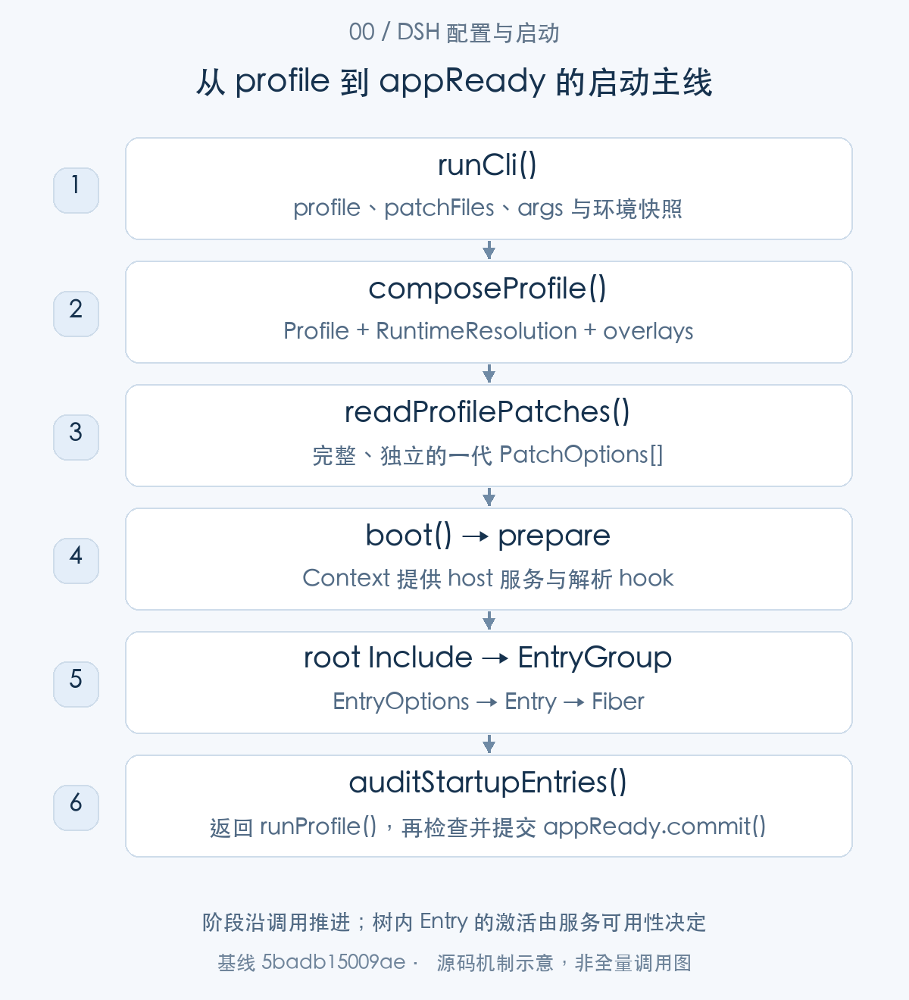
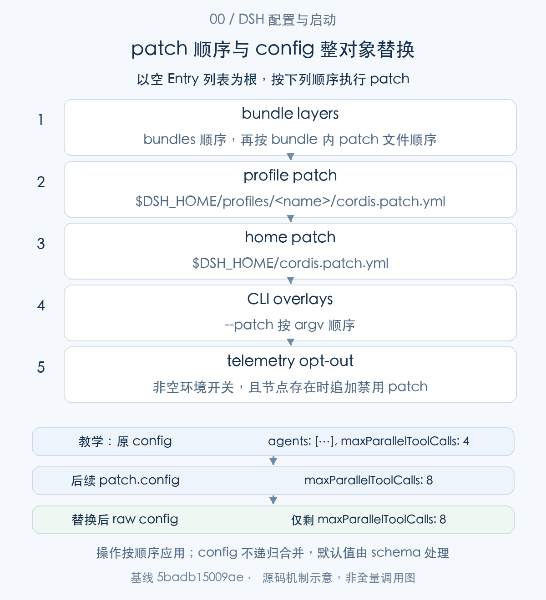
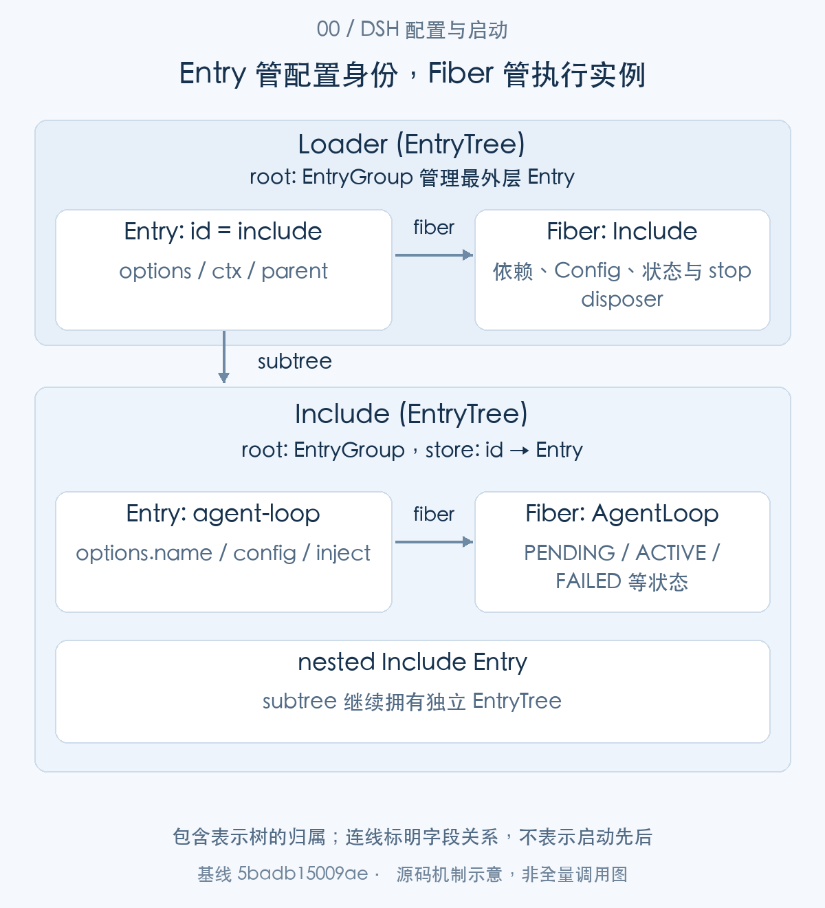
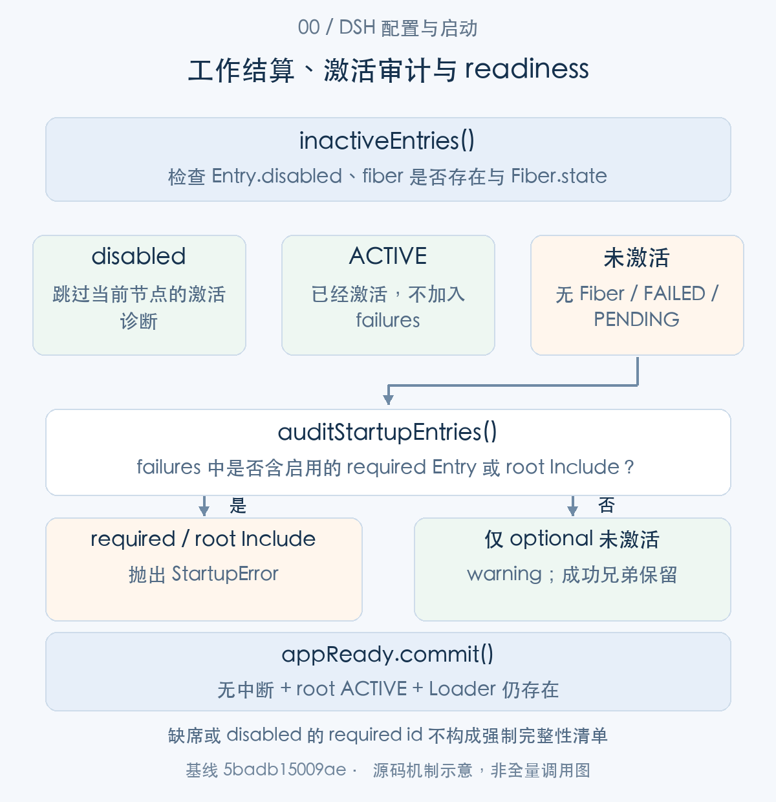

# 一份配置如何启动 DSH：从 profile、bundle、patch 到 Entry 与 appReady

> 从源码理解 Agent Harness · 第00篇：配置与启动

使用 DSH 时，最常见的入口只有一条命令：`dsh web`。但这条命令背后并没有一个包揽所有能力的 Web 主程序。launcher 选择 profile，profile 选择 bundles，bundles 贡献 patch，patch 组合成插件配置，Loader 再把这些配置转为有依赖、有状态、能清理的运行中实例。Web、ACP、Headless 等应用形态，正是在这条组合链上形成的。

这也解释了配置问题为什么容易让人困惑：包已经安装，插件却没有运行；YAML 中写了某个字段，实际值却来自另一个文件；配置能够打印出来，启动仍然失败。这些现象往往发生在不同边界，分别对应**配置来源、有效 Entry、模块导入、依赖激活和应用 readiness**。

本文沿一次启动逐步进入真实函数，再沿数据和返回值接回调用现场。中心问题只有一个：**一份描述性的配置，如何成为可以接受启动审计的插件树？** 在主线之后，再看配置刷新、失败清理和实际排障，理解它们为什么必须复用相同契约。

研究基线为 **`0.2.1-alpha.1`／`5badb15009ae1756c3afe0ae0cef1faafc290ccc`**。下列源码块是该提交的局部原文，仅统一公共缩进；教学配置和演示插件另行标明。本轮执行了与 profile、patch、boot、兼容检查、模块服务和 reload 相关的7个现有测试文件，共195项通过；完整已安装应用、真实模型和公众号排版不在这次验证范围内。

## 先建立整体地图：启动链中有三类不同的对象

先不要把 profile、bundle、patch、Entry 当成同一层的配置名词。它们分别承担来源选择、组合规则和运行管理的责任。

|概念|它是什么|由谁生产或读取|交给谁继续处理|
|---|---|---|---|
|profile|一个配置项目，包含自己的 `package.json` 和用户 patch|`prepareProfile()`／`loadProfile()`|`composeProfile()` 与 `readProfilePatches()`|
|bundle|声明了 `dsh.bundle.patch` 的 npm package，可贡献一个或多个 patch 文件|`loadProfileDirectory()`|形成 `Profile.layers`|
|patch|针对 Entry 列表执行的插入、属性覆盖与禁用规则|patch 文件解析器|`applyEntryPatches()`|
|`EntryOptions`|组合后的声明性节点数据，含 id、name、config 等|patch 组合和兼容 preflight|`EntryGroup.create()`|
|`Entry`|Loader 管理的节点，连接 options、Context、parent 与 Fiber|`EntryGroup.create()`|导入、更新、审计与清理|
|`Fiber`|一次插件实例的依赖、配置、执行状态与 effects 所有者|`Registry.plugin()`|激活检查、等待与 dispose|
|`appReady`|launcher 提供的单次 readiness 通知服务|`createAppReady()`|启动成功后的监听者|

前三项回答“系统应该由什么组成”，`EntryOptions`与`Entry`回答“这棵树具体有哪些节点”，`Fiber`回答“节点是否真正运行起来”。`appReady`再把启动结果提交给需要 readiness 的组件。



图1沿调用阶段展示主线。`readProfilePatches()`的返回值作为 `boot()` 参数进入 host；`boot()`返回后，`runProfile()`才有资格提交 `appReady`。树内插件可能并发准备和激活，图中的阶段顺序不代表插件按配置行逐个执行。

带着这份地图，先回到命令实际进入的地方。

## 命令行先确定启动事实，再把它们交给 profile

### 第一步：runCli() 只处理 launcher 自己拥有的参数

`parseDshArgs()`将调用分为 profile、plugin 和配置 dump 等模式。本文跟踪 profile 分支：launcher 将 profile 名称、额外 patch 和剩余应用参数集中交给 `runProfile()`。

<!-- source:S01 -->

```typescript
export async function runCli(options: RunCliOptions = {}): Promise<void> {
  const version = getDshRuntimeVersion()
  const { manageDesktopProfile, ...profileOptions } = options
  const invocation = parseDshArgs(process.argv.slice(2), version, manageDesktopProfile)

  switch (invocation.mode) {
    case 'profile': {
      const { runProfile } = await import('./profile-boot.ts')
      try {
        await runProfile({
          environment: loadLayeredEnv('dsh'),
          profile: invocation.profile,
          fromDefaultProfile: invocation.fromDefaultProfile,
          patchFiles: invocation.patches,
          args: invocation.args,
          ...profileOptions,
        })
      } catch (error) {
        if (!(error instanceof StartupError)) throw error
        await reportStartupFailure(error, { home: resolveDshHome(), version, profile: invocation.profile })
```

[源码：`apps/cli/src/bin.ts:26–45`](https://github.com/deepseek-ai/deepseek-harness/blob/5badb15009ae1756c3afe0ae0cef1faafc290ccc/apps/cli/src/bin.ts#L26-L45)。

这里值得观察的是参数之间的分工。`profile`决定加载哪份组合，`patchFiles`是 launcher 解析的 overlay 路径，`args`则是后续应用插件自己的参数。`runCli()`不尝试理解每一个 Web 或 Headless 参数，而是把职责留给已挂载的应用。

例如，`dsh web --patch ./team.patch.yml`选择 Web profile，并增加一个 overlay；`dsh headless "检查当前项目"`中的任务文本进入 inner args。launcher flags 应放在应用参数之前，因为解析器遇到不属于自身的参数后，会把后续内容交给应用。具体语法由[CLI 参数适配器](https://github.com/deepseek-ai/deepseek-harness/blob/5badb15009ae1756c3afe0ae0cef1faafc290ccc/apps/cli/src/args.ts#L1-L13)定义。

同时，调用 `runProfile()`之前，`loadLayeredEnv()`已经产生这次启动的环境快照。这份数据会被 Proxy 准备和后续插件共同消费。

<!-- source:S02 -->

```typescript
const home = resolveDshHome()
const inherited = { ...process.env } as Record<string, string>
// Parse both layers first: a rejection must not leave one file applied.
const project = readEnvLayer(binName, cwd, warn, home)
const user = home === resolve(cwd) ? undefined : readEnvLayer(binName, home, warn, home)
// Apply the checked values without replacing a higher-ranked name.
for (const layer of [project, user]) {
  if (layer === undefined) continue
  for (const [name, value] of Object.entries(layer.values)) {
    if (process.env[name] === undefined) process.env[name] = value
  }
}
return createLaunchEnvironmentSnapshot([
  { source: 'process', values: inherited },
  ...project === undefined ? [] : [{ source: 'project-env' as const, path: project.path, values: project.values }],
  ...user === undefined ? [] : [{ source: 'user-env' as const, path: user.path, values: user.values }],
])
```

[源码：`packages/boot/app-boot/src/index.ts:239–255`](https://github.com/deepseek-ai/deepseek-harness/blob/5badb15009ae1756c3afe0ae0cef1faafc290ccc/packages/boot/app-boot/src/index.ts#L239-L255)。

这里的优先级是 **继承的进程环境 > 当前工作目录 `.env` > Harness home `.env`**。它和后面“越后的 patch 越能覆盖”的组合顺序不同：环境层用“已有值不替换”实现优先级，patch 则按操作列表顺序修改节点。

两个 `.env`先解析、检查，再应用；若某一层声明了不允许从文件输入的 bootstrap 变量，不能让另一层先部分生效。Harness home 本身也在读取文件前解析。与运行入口、模块加载和网络 bootstrap 有关的限制见[`readEnvLayer()`](https://github.com/deepseek-ai/deepseek-harness/blob/5badb15009ae1756c3afe0ae0cef1faafc290ccc/packages/boot/app-boot/src/index.ts#L190-L221)。因此，环境快照是经过来源规则整理的启动输入，不是一份随时重新读取 `process.env` 的动态配置。

取得这些启动事实后，`runProfile()`先安装 Proxy，再调用 `composeProfile()`。我们的下一步就是进入它所调用的 `prepareProfile()`，看 profile 怎样落到磁盘和内存。

## profile 确定组合来源，bundle 提供配置层

### 第二步：loadProfile() 找到配置项目，首次使用时初始化模板

对于命名 profile，目录为 `$DSH_HOME/profiles/<name>`。`resolveProfileDir()`还拒绝包含路径分隔符、`.`、`..`和`node_modules`等不适合作为 profile 名称的输入。命名入口不是任意路径拼接器。[目录解析实现](https://github.com/deepseek-ai/deepseek-harness/blob/5badb15009ae1756c3afe0ae0cef1faafc290ccc/packages/boot/app-boot/src/profile.ts#L169-L176)

profile 尚无 `package.json`时，`loadProfile()`根据安装所带模板决定能否初始化：

<!-- source:S03 -->

```typescript
/** The shipped profile templates auto-initialized on first use, by name. */
export const PROFILE_TEMPLATES: Record<string, ProfileTemplate> = {
  acp: {
    bundles: ['@deepseek-ai/dsh-base', '@deepseek-ai/dsh-acp-app'],
  },
  web: {
    bundles: ['@deepseek-ai/dsh-base', '@deepseek-ai/dsh-web-app'],
  },
  headless: {
    bundles: ['@deepseek-ai/dsh-base', '@deepseek-ai/dsh-headless'],
  },
  sdk: {
    bundles: ['@deepseek-ai/dsh-base', '@deepseek-ai/dsh-sdk-app'],
  },
  'sdk-minimal': {
    bundles: ['@deepseek-ai/dsh-sdk-minimal'],
  },
}
```

[源码：`packages/boot/app-boot/src/profile.ts:178–195`](https://github.com/deepseek-ai/deepseek-harness/blob/5badb15009ae1756c3afe0ae0cef1faafc290ccc/packages/boot/app-boot/src/profile.ts#L178-L195)。

`web`、`acp`、`headless`、`sdk`都在 base 之上叠加相应应用 bundle；`sdk-minimal`则直接选择自己的最小组合。**profile 的应用形态来自 bundle 列表，而不是“profile 名字等于某个特殊启动类”。**

模板是在下面的分支里使用的：

<!-- source:S04 -->

```typescript
export function loadProfile(
  binName: string, name: string, installAnchor: string, home: string = resolveDshHome(),
  options: { userLayer?: boolean } = {},
): Profile {
  const dir = resolveProfileDir(name, home)
  if (!existsSync(join(dir, 'package.json'))) {
    const template = PROFILE_TEMPLATES[name]
    if (template === undefined) {
      throw new Error(
        `${binName}: profile ${JSON.stringify(name)} does not exist; create it with 'dsh plugin --profile ${name} add <package>'`,
      )
    }
    initProfile(dir, template.bundles)
  }
  removeLinkProjections(dir)
  normalizeShippedProfile(name, dir, readProfileManifest(binName, dir))
  return loadProfileDirectory(binName, dir, installAnchor, options)
}
```

[源码：`packages/boot/app-boot/src/profile.ts:781–798`](https://github.com/deepseek-ai/deepseek-harness/blob/5badb15009ae1756c3afe0ae0cef1faafc290ccc/packages/boot/app-boot/src/profile.ts#L781-L798)。

`initProfile()`生成 profile manifest、空的用户 `cordis.patch.yml`及插件安装所需的 `pnpm-workspace.yaml`。manifest 中 `dependencies`负责声明 profile 安装的包，`dsh.profile.bundles`负责选择参与配置组合的 bundles，两者回答不同问题。[初始化实现](https://github.com/deepseek-ai/deepseek-harness/blob/5badb15009ae1756c3afe0ae0cef1faafc290ccc/packages/boot/app-boot/src/profile.ts#L254-L273)

加载现有 profile 时，代码还清理历史模块投影，并对匹配已知旧模板的组合执行归一化；`loadProfileDirectory()`会移除该版本已退休的 bundle。它们是明确条件下的兼容处理，不能理解为任意用户组合都会被模板覆盖。也因此，profile 加载不是完全无磁盘行为的纯查询。[组合归一化与退休 bundle 处理](https://github.com/deepseek-ai/deepseek-harness/blob/5badb15009ae1756c3afe0ae0cef1faafc290ccc/packages/boot/app-boot/src/profile.ts#L651-L675)

因此，“安装了某个普通插件包”并不会自然产生一个配置节点。普通插件仍需要某个 patch 的 `insert`创建 Entry。CLI 插件管理操作可以识别 bundle 并维护 bundle 列表，那是管理流程提供的动作，不能理解为每次启动都会扫描所有已安装包并自动运行。[管理操作的 bundle reconciliation](https://github.com/deepseek-ai/deepseek-harness/blob/5badb15009ae1756c3afe0ae0cef1faafc290ccc/packages/boot/app-boot/src/profile-plugins.ts#L101-L126)

自定义 profile 也可用 `--from-default-profile web`初始化。它只复制安装所带模板的 bundle 列表，目标名称和目录需要满足初始化规则；它不会持续继承同名现有 Web profile 的用户设置。[自定义 profile 初始化](https://github.com/deepseek-ai/deepseek-harness/blob/5badb15009ae1756c3afe0ae0cef1faafc290ccc/apps/cli/src/profile-boot.ts#L101-L150)

模板只负责提供起点。`loadProfile()`随后仍进入 `loadProfileDirectory()`，逐个读取实际选中的 bundle。这里会产生本文第一份重要交接数据。

### 第三步：Profile 保存的是解析后的配置来源，还不是运行中插件

<!-- source:S05 -->

```typescript
export interface ProfileLayer {
  /** The bundle's package name, as listed in `dsh.profile.bundles`. */
  packageName: string
  /** Absolute directory of the resolved bundle package. */
  packageDir: string
  /** Absolute paths of the bundle's patch files, in application order. */
  patchPaths: readonly string[]
  /** The parsed patch lists of every file, concatenated in application order. */
  patches: PatchOptions[]
}

/** A loaded profile: resolved bundle layers plus the user's own patch layer. */
export interface Profile {
  /** The profile name (its directory basename). */
  name: string
  /** Absolute profile directory. */
  dir: string
  /** Bundle layers in `dsh.profile.bundles` order. */
  layers: ProfileLayer[]
  /** Absolute path of the profile's own patch file. */
  patchPath: string
  /** The profile's own patches; empty when the file is absent. */
  patches: PatchOptions[]
  /** Selected bundles that contributed no layer, in `dsh.profile.bundles` order, with why. */
  skippedBundles: SkippedBundle[]
}
```

[源码：`packages/boot/app-boot/src/profile.ts:78–103`](https://github.com/deepseek-ai/deepseek-harness/blob/5badb15009ae1756c3afe0ae0cef1faafc290ccc/packages/boot/app-boot/src/profile.ts#L78-L103)。

可以把这些字段分为三组。

|字段|内容与职责|后续消费者|
|---|---|---|
|`name`、`dir`|profile 身份及配置项目位置|launcher、包解析和诊断|
|`layers`|已加载 bundle 的 packageDir、patchPaths 和有序 patches|`readProfilePatches()`|
|`patchPath`、`patches`|profile 自有配置层的位置与内容|首次组合、后续配置刷新|
|`skippedBundles`|选中但未贡献配置层的 bundle 及原因|`reportSkippedBundles()`|

`Profile`里没有插件对象，也没有“已经启动”的布尔值。它描述来源解析的结果。要得到 `layers`，`loadProfileDirectory()`先解析 bundle 的目录：

<!-- source:S06 -->

```typescript
export function resolveBundleDir(
  binName: string, packageName: string, installAnchor: string, profileDir: string,
): string {
  for (const anchor of [installAnchor, join(profileDir, 'package.json')]) {
    const dir = packageDirFromAnchor(anchor, packageName)
    if (dir !== undefined) return dir
  }
  throw new Error(
    `${binName}: cannot resolve profile bundle ${JSON.stringify(packageName)} from the dsh installation or ${profileDir}; `
    + `run 'dsh plugin --profile ${basename(profileDir)} install' if its dependency is not installed`,
  )
}
```

[源码：`packages/boot/app-boot/src/profile.ts:706–717`](https://github.com/deepseek-ai/deepseek-harness/blob/5badb15009ae1756c3afe0ae0cef1faafc290ccc/packages/boot/app-boot/src/profile.ts#L706-L717)。

这里的顺序是 **installation anchor 优先，profile anchor 次之**。这样，安装自带的 `dsh-base`等 bundle 的配置来源仍属于当前 dsh 安装，profile 中的同名副本不会抢走它的组合身份。

这条规则只是在回答“读取哪个 bundle package 的 patch”。后面 Entry 导入插件时，模块解析会考虑 importer 的原生祖先链和 RuntimeResolution；不能把“bundle discovery 的安装优先”推广成“所有 import 都安装优先”。

找到目录以后，继续读取 bundle manifest 和 patch：

<!-- source:S07 -->

```typescript
const manifest = dropRetiredBundles(dir, readProfileManifest(binName, dir))
const bundles = manifest.dsh?.profile?.bundles ?? []
const layers: ProfileLayer[] = []
const skippedBundles: SkippedBundle[] = []
const exemptions = bundles.length === 0 ? {} : readProfileVersionExemptions(dir)
for (const packageName of bundles) {
  try {
    const packageDir = resolveBundleDir(binName, packageName, installAnchor, dir)
    const bundleManifest = readProfileManifest(binName, packageDir)
    const bundle = bundleManifest.dsh?.bundle
    if (bundle === undefined) {
      throw new Error(`${binName}: profile bundle ${JSON.stringify(packageName)} declares no dsh.bundle in its package.json`)
    }
    // A bundle is not a plugin row, so row admission never reads its own peers.
    const issue = evaluatePluginCompatibility(bundleManifest, exemptions)
    if (issue !== undefined && !issue.exempted) throw new Error(pluginCompatibilityWarning(issue))
    const patchPaths = bundlePatchPaths(packageDir, bundle)
    const patches = patchPaths.flatMap(patchPath => loadOverlayPatches(binName, patchPath))
    layers.push({ packageName, packageDir, patchPaths, patches })
  } catch (error) {
    skippedBundles.push({ packageName, reason: String(error) })
  }
}
const patchPath = join(dir, PROFILE_PATCH_FILENAME)
const patches = options.userLayer !== false && existsSync(patchPath)
  ? loadOverlayPatches(binName, patchPath)
  : []
return { name: basename(dir), dir, layers, patchPath, patches, skippedBundles }
```

[源码：`packages/boot/app-boot/src/profile.ts:738–765`](https://github.com/deepseek-ai/deepseek-harness/blob/5badb15009ae1756c3afe0ae0cef1faafc290ccc/packages/boot/app-boot/src/profile.ts#L738-L765)。

`dsh.bundle.patch`可以是一个文件路径，也可以是有序路径数组。`bundlePatchPaths()`把它们锚定在 bundle 目录，`flatMap()`再按声明顺序拼接各文件的 patch 列表。基础 bundle 的[实际声明](https://github.com/deepseek-ai/deepseek-harness/blob/5badb15009ae1756c3afe0ae0cef1faafc290ccc/packages/bundle/base/package.json#L31-L35)就是 `patch: "./cordis.patch.yml"`。

这个循环有一个明确的容错边界：单个 bundle 的解析、manifest、兼容判断或 patch 读取失败，会进入 `skippedBundles`；profile 自有 patch 则在循环外读取，文件存在但损坏时仍会抛错。来源层的“跳过一个 bundle”和启动阶段的“某个 Entry 没激活”是两类不同诊断。

继续沿读取调用展开：bundle 声明和 CLI 显式指定的文件使用 `loadOverlayPatches()`，文件缺失也会抛错；home 等可选层使用 `loadOptionalPatches()`，仅 ENOENT 表示没有这一层。两者成功读取内容以后，交给同一个 `parsePatchList()`：

<!-- source:S37 -->

```typescript
function parsePatchList(
  binName: string, file: string, content: string, label: string,
): PatchOptions[] {
  let parsed: unknown
  try {
    parsed = yaml.load(content, { schema: userPatchesSchema })
  } catch (error) {
    throw new Error(`${binName}: failed to parse ${label} ${file}: ${String(error)}`)
  }
  if (!Array.isArray(parsed)) {
    throw new Error(`${binName}: ${label} ${file} must be a top-level YAML array of loader patch entries`)
  }
  parsed.forEach((entry, index) => {
    if (typeof entry !== 'object' || entry === null || Array.isArray(entry)) {
      throw new Error(`${binName}: ${label} entry ${index + 1} in ${file} must be a mapping (a loader patch entry)`)
    }
  })
  return anchorInsertedPluginNames(parsed as PatchOptions[], file)
}
```

[源码：`packages/boot/app-boot/src/index.ts:371–389`](https://github.com/deepseek-ai/deepseek-harness/blob/5badb15009ae1756c3afe0ae0cef1faafc290ccc/packages/boot/app-boot/src/index.ts#L371-L389)。

这个解析器使用 Include 共享的 YAML dialect，检查顶层数组和每一项的 mapping 形状，再处理 insert 的插件路径。它没有在这里完成每个插件业务字段的 schema 校验；那项工作属于稍后激活具体 Fiber 时的 Config 处理。这样，文件语法、patch 操作和插件 Config 分别有清楚的错误位置。[必需与可选文件读取](https://github.com/deepseek-ai/deepseek-harness/blob/5badb15009ae1756c3afe0ae0cef1faafc290ccc/packages/boot/app-boot/src/index.ts#L316-L344)

`prepareProfile()`取得 `Profile`后，还会做一件看似不起眼、实际很关键的事：

<!-- source:S08 -->

```typescript
export function prepareProfile(name: string, userLayer = true, fromDefaultProfile?: string): Profile {
  if (fromDefaultProfile !== undefined) initializeProfileFromDefault(name, fromDefaultProfile)
  const profile = loadProfile(NAME, name, INSTALL_ANCHOR, undefined, { userLayer })
  reportSkippedBundles(NAME, profile)
  writeFileSync(join(profile.dir, PROFILE_ROOT_FILENAME), PROFILE_ROOT_CONFIG)
  return profile
}
```

[源码：`apps/cli/src/profile-boot.ts:167–173`](https://github.com/deepseek-ai/deepseek-harness/blob/5badb15009ae1756c3afe0ae0cef1faafc290ccc/apps/cli/src/profile-boot.ts#L167-L173)。

它每次都重写 profile 下的 `cordis.yml`为一个空数组。这个根文件是 Include 的真实读取入口，也提供相对路径的配置锚点。业务配置来源则在 bundles 和 patch 层中。

为什么每次重写？Loader 的树写回可能把当前组合出的节点写进根文件；若下一次启动又在这些节点上重复执行 bundle 的 insert，就会重复组合。空根文件明确区分了“组合入口”和“应持久维护的配置来源”。该约束由[`PROFILE_ROOT_CONFIG`及 prepareProfile 的说明](https://github.com/deepseek-ai/deepseek-harness/blob/5badb15009ae1756c3afe0ae0cef1faafc290ccc/apps/cli/src/profile-boot.ts#L80-L85)与[重写原因](https://github.com/deepseek-ai/deepseek-harness/blob/5badb15009ae1756c3afe0ae0cef1faafc290ccc/apps/cli/src/profile-boot.ts#L152-L160)共同定义。

至此，`prepareProfile()`返回完整 `Profile`，控制权回到 `composeProfile()`。接下来要为未来的 Entry import 准备解析规则。

### 第四步：composeProfile() 同时准备模块解析表与本次 overlay

<!-- source:S09 -->

```typescript
async function composeProfile(
  name: string,
  patchFiles: readonly string[],
  fromDefaultProfile?: string,
  resolvedProfile?: ResolvedProfileRuntime,
): Promise<ComposedProfile> {
  const profile = resolvedProfile?.profile ?? prepareProfile(name, true, fromDefaultProfile)
  if (resolvedProfile !== undefined) writeFileSync(join(profile.dir, PROFILE_ROOT_FILENAME), PROFILE_ROOT_CONFIG)
  const resolutionOptions = { installAnchor: resolvedProfile?.installAnchor ?? INSTALL_ANCHOR, profile }
  const resolution = await createRuntimeResolution(resolutionOptions)
  const overlays = patchFiles.flatMap(file => loadOverlayPatches(NAME, resolve(file)))
  return { profile, resolution, overlays }
}
```

[源码：`apps/cli/src/profile-boot.ts:197–209`](https://github.com/deepseek-ai/deepseek-harness/blob/5badb15009ae1756c3afe0ae0cef1faafc290ccc/apps/cli/src/profile-boot.ts#L197-L209)。

这个函数的返回值包含三个对象：`profile`是配置来源，`resolution`是模块解析计划，`overlays`是命令行指定文件已解析的内容。它仍然没有创建应用插件树。

`createRuntimeResolution()`生成的核心结构如下：

<!-- source:S10 -->

```typescript
/** Complete immutable package table for one profile launch. */
export interface RuntimeResolution {
  /** Directory containing every profile; its node_modules is the interception layer. */
  readonly profilesDir: string
  /** Active profile directory, when profile-scope entries were included. */
  readonly profileDir: string | undefined
  /** Profile-declared packages installed in the profile's own node_modules. */
  readonly localPackageNames: readonly string[]
  /** Installation-scope entries followed by profile-scope entries in precedence order. */
  readonly entries: readonly RuntimeResolutionEntry[]
  /** Active profile links to external directories, sorted by name. */
  readonly linkedRoots: readonly LinkedRoot[]
}
```

[源码：`packages/boot/app-boot/src/profile.ts:149–161`](https://github.com/deepseek-ai/deepseek-harness/blob/5badb15009ae1756c3afe0ae0cef1faafc290ccc/packages/boot/app-boot/src/profile.ts#L149-L161)。

|字段|为什么启动前需要它|
|---|---|
|`profilesDir`、`profileDir`|判断某次模块请求是否属于 profile 参与的查找范围|
|`localPackageNames`|记录 profile 声明且已安装的本地包，保留其原生解析位置|
|`entries`|提供安装依赖闭包及选中 bundle 带来的包映射；每项还记录 version、declarer 和 scope|
|`linkedRoots`|识别 profile 链接到外部真实目录的包，按相应 peer 规则参与解析|

构造过程从安装 manifest 的 `dependencies`与`peerDependencies`进行遍历，再补充安装闭包没有提供的 bundle 依赖，并把结果冻结。它构造映射，不自动执行包管理器安装。[解析表构造](https://github.com/deepseek-ai/deepseek-harness/blob/5badb15009ae1756c3afe0ae0cef1faafc290ccc/packages/boot/app-boot/src/profile.ts#L441-L474)

运行时，这张表在 profile 的祖先查找链上提供 interception 层；更近的插件私有依赖和 profile 本地依赖保留原生位置。外部 linked root 又按访问到的目录和 peer 声明参与解析。`exports`等包入口规则仍由 Node 决定。实现见[profile 模块路由](https://github.com/deepseek-ai/deepseek-harness/blob/5badb15009ae1756c3afe0ae0cef1faafc290ccc/packages/boot/app-boot/src/profile-resolution/resolver.ts#L444-L512)、[本地声明包的原生路由](https://github.com/deepseek-ai/deepseek-harness/blob/5badb15009ae1756c3afe0ae0cef1faafc290ccc/packages/boot/app-boot/src/profile-resolution/resolver.ts#L556-L575)，官方[解析规则说明](https://github.com/deepseek-ai/deepseek-harness/blob/5badb15009ae1756c3afe0ae0cef1faafc290ccc/.agents/notes/implemented/architecture/2026-09-19-profile-resolution-lookup-order.md#L13-L48)提供了祖先链示例。

这样的分工允许“一个 bundle 贡献若干配置节点”和“这些节点的模块从正确位置被导入”分别处理。来源已找到，不代表某个子路径能够 import；metadata 查询成功，也不代表 `exports`允许实际模块请求。

`composeProfile()`返回后，`runProfile()`据此建立 `ProfileContext`，再取得完整 patch 列表。现在进入真正的配置组合过程。

## patch 是有序操作，config 按整个对象替换

### 第五步：readProfilePatches() 把所有来源整理成一代输入

`ProfileContext`保存本次启动使用的目录、安装锚点、startedBundles、命令行 overlays 和 telemetry 开关值。它是 launcher 提供的事实服务，调度与修改不由这份数据自行承担。[ProfileContext 声明](https://github.com/deepseek-ai/deepseek-harness/blob/5badb15009ae1756c3afe0ae0cef1faafc290ccc/packages/boot/app-boot/src/profile-context.ts#L15-L30)

`runProfile()`把它和已经读取的 `Profile`交给 `readProfilePatches()`：

<!-- source:S11 -->

```typescript
export function readProfilePatches(binName: string, context: ProfileContext, initialProfile?: Profile): PatchOptions[] {
  const profile = initialProfile ?? loadProfileDirectory(binName, context.dir, context.installAnchor, { userLayer: false })
  const patches = structuredClone([
    ...profile.layers.flatMap(layer => layer.patches),
    ...(initialProfile?.patches ?? loadOptionalPatches(binName, context.patchPath) ?? []),
    ...(loadOptionalPatches(binName, join(context.home, PROFILE_PATCH_FILENAME)) ?? []),
    ...context.overlays,
  ])
  const telemetryPatch = resolveTelemetryPatch(context.telemetryDisabledEnv,
    composeEntries([patches]).some(row => row.id === TELEMETRY_ROW_ID))
  if (telemetryPatch !== undefined) patches.push(telemetryPatch)
  return patches
}
```

[源码：`packages/boot/app-boot/src/profile-context.ts:63–75`](https://github.com/deepseek-ai/deepseek-harness/blob/5badb15009ae1756c3afe0ae0cef1faafc290ccc/packages/boot/app-boot/src/profile-context.ts#L63-L75)。

顺序可以直接从数组展开读出来：

1. `dsh.profile.bundles`中的 bundle 顺序，以及每个 bundle 内部声明的文件顺序。
2. profile 自有 `cordis.patch.yml`。
3. `$DSH_HOME/cordis.patch.yml`。
4. 命令行 `--patch`，按 argv 顺序。
5. 条件成立时，追加 telemetry 禁用 patch。

**home patch 在 profile patch 之后。** 这意味着跨 profile 的本机偏好可以覆盖 profile 自有配置；命令行 overlay 再覆盖它。不能只看 profile 的文件就解释最后生效的值。

telemetry 则有一个专门的最后输入：`DSH_TELEMETRY_DISABLED`任意非空值，包括字符串 `0`或`false`，都表示禁用；只有有效组合包含 `session-telemetry-otel`节点时才生成 patch。[开关实现](https://github.com/deepseek-ai/deepseek-harness/blob/5badb15009ae1756c3afe0ae0cef1faafc290ccc/packages/boot/app-boot/src/profile-context.ts#L52-L55) 这里没有把字符串解析为普通布尔值。

`structuredClone()`把这代输入与先前保存的来源对象分离。后续算法在处理插入节点时会修改有效列表，不能让这些操作污染下一次刷新要重新使用的原始来源。



图2上半部是实际应用顺序；下半部是教学配置，说明覆盖 `config`时替换整个值。顺序决定“后来的操作看到什么”，对象替换决定“某个字段会不会被保留”，二者要一起理解。

完整 patch 列表将被 `boot()`的根 Include 使用。为读懂接下来的挂载，先沿同一个返回值进入 Include 共享的组合算法。

### 第六步：applyEntryPatches() 先建 id 索引，再顺序执行 insert 和覆盖

patch 的结构并不是“任意深度合并的 YAML”。它是一份针对 Entry 的操作描述：

<!-- source:S12 -->

```typescript
export interface PatchOptions {
  id?: string
  insert?: EntryOptions[]
  name?: string
  config?: any
  group?: boolean | null
  disabled?: boolean | null
  inject?: any
  intercept?: any
  isolate?: any
  [key: string]: any
}
```

[源码：`vendor/include/src/index.ts:130–141`](https://github.com/deepseek-ai/deepseek-harness/blob/5badb15009ae1756c3afe0ae0cef1faafc290ccc/vendor/include/src/index.ts#L130-L141)。

`id`是目标，`insert`是要加入的节点，`name`在覆盖时用于校验目标身份，`config`及其他属性才是要替换的值。根列表或带 `group`标记的配置列表，承担了不同的插入位置。

当存在 patch 时，`applyEntryPatches()`先克隆输入 Entry 列表，并建立索引：

<!-- source:S13 -->

```typescript
if (!patches?.length) return [...data]
data = structuredClone(data)

const entryMap = new Map<string, EntryOptions>()
const buildMap = (entries: EntryOptions[]) => {
  for (const entry of entries) {
    if (entry.id) entryMap.set(entry.id, entry)
    if (entry.group && Array.isArray(entry.config)) {
      buildMap(entry.config)
    }
  }
}
buildMap(data)
```

[源码：`vendor/include/src/index.ts:62–74`](https://github.com/deepseek-ai/deepseek-harness/blob/5badb15009ae1756c3afe0ae0cef1faafc290ccc/vendor/include/src/index.ts#L62-L74)。

索引遍历根节点及 `group`内部列表，使后续 patch 能直接按 id 定位。它不是每次都靠插件模块名扫描整棵树。同一组合范围内，id 因而是重要的配置契约；给两个不同节点使用相同 id，会使 Map 的后一次写入覆盖前一次查找结果，这不等于算法提供了重复 id 的业务协调机制。

先看 insert 分支：

<!-- source:S14 -->

```typescript
for (const patch of patches) {
  const { id, insert, name, ...overrides } = patch

  if (insert) {
    if (id) {
      const target = entryMap.get(id)
      if (!target) {
        warn('patch insert: entry %C not found', id)
        continue
      }
      if (!target.group) {
        warn('patch insert: entry %C is not a group', id)
        continue
      }
      if (!Array.isArray(target.config)) target.config = []
      target.config.push(...insert)
    } else {
      data.push(...insert)
    }
    // Index what this patch added so a LATER patch in the same list can
    // target it. Patch lists compose one layer per source (each bundle
    // layer, then the user's, then `--patch` overlays), and a layer must be
    // able to configure or disable a row an earlier layer inserted; without
    // this, inserted rows were silently unpatchable.
    buildMap(insert)
    continue
  }
```

[源码：`vendor/include/src/index.ts:76–102`](https://github.com/deepseek-ai/deepseek-harness/blob/5badb15009ae1756c3afe0ae0cef1faafc290ccc/vendor/include/src/index.ts#L76-L102)。

没有 `id`时，节点插入根列表；指定 `id`时，目标必须存在并标为 group，插入其 config 列表。插入完成立刻调用 `buildMap(insert)`，因此后一个 bundle 或 overlay 可以配置前一个来源刚加入的节点。一个来源负责创建，后续来源负责调整，这就是 bundle 组合得以成立的具体实现。

insert 分支随后 `continue`。若同一条 patch 同时写了 `insert`和其他覆盖属性，不能把它当成“插入并继续覆盖”的两步合并操作。需要表达两个动作时，分别写两条 patch 更符合实际分支。

再看普通覆盖：

<!-- source:S15 -->

```typescript
    if (!id) {
      warn('patch: id is required for non-insert patches')
      continue
    }

    const target = entryMap.get(id)
    if (!target) {
      warn('patch: entry %C not found', id)
      continue
    }

    if (name && name !== target.name) {
      warn('patch: name mismatch for %C (expected %C, got %C), skipping', id, target.name, name)
      continue
    }

    for (const [key, value] of Object.entries(overrides)) {
      if (key === 'id') continue
      target[key] = value
    }
  }

  return data
}
```

[源码：`vendor/include/src/index.ts:104–127`](https://github.com/deepseek-ai/deepseek-harness/blob/5badb15009ae1756c3afe0ae0cef1faafc290ccc/vendor/include/src/index.ts#L104-L127)。

这里有三个关键条件。没有 id，不能定位；找不到目标，产生 warning 并跳过；`name`与目标不符，也跳过。因此 `name`在这个分支中是断言，不是给节点更换插件模块的通道。

找到目标以后，代码逐个执行 `target[key] = value`。**当 key 为 config 时，整个 config 被替换。** 例如已有配置含 `agents`和`maxParallelToolCalls`，后续 patch 只提供新的 `maxParallelToolCalls`，原 `agents`不会被隐式保留；最终缺省值由插件 schema 处理。AgentLoop 的 schema 确实为 `agents`提供空数组默认值。[AgentLoop schema](https://github.com/deepseek-ai/deepseek-harness/blob/5badb15009ae1756c3afe0ae0cef1faafc290ccc/packages/core/agent-loop/src/index.ts#L330-L346)

因此，合适的工程做法是在覆盖前查看当前完整 Entry 配置，判断需要保留哪些字段。若后来要恢复 bundle 对整个 Entry config 的控制，需要撤去该 config override。设置表单采用 profile 写回时也面对这个相同契约，官方[配置所有权说明](https://github.com/deepseek-ai/deepseek-harness/blob/5badb15009ae1756c3afe0ae0cef1faafc290ccc/.agents/notes/implemented/architecture/2026-09-19-profile-owned-live-configuration.md#L11-L19)明确记录了整对象覆盖带来的继承影响。

路径也在组合之前处理，而非任由插件猜测来源目录：

<!-- source:S16 -->

```typescript
function anchorInsertedPluginNames(patches: PatchOptions[], file: string): PatchOptions[] {
  const base = dirname(resolve(file))
  const visit = (entry: EntryOptions): void => {
    if (typeof entry.name === 'string' && (isAbsolute(entry.name) || entry.name.startsWith('./') || entry.name.startsWith('../'))) {
      entry.name = pathToFileURL(resolve(base, entry.name)).href
    }
    if (entry.group && Array.isArray(entry.config)) entry.config.forEach(visit)
  }
  for (const patch of patches) patch.insert?.forEach(visit)
  return patches
}
```

[源码：`packages/boot/app-boot/src/index.ts:347–357`](https://github.com/deepseek-ai/deepseek-harness/blob/5badb15009ae1756c3afe0ae0cef1faafc290ccc/packages/boot/app-boot/src/index.ts#L347-L357)。

只对 `insert`中的节点做路径锚定。绝对路径或以 `./`、`../`开头的插件名，会转换成相对 **patch 文件所在目录**解析的 file URL；group 内的插入节点递归处理。普通覆盖 patch 的 `name`仍保留为身份断言，bare package name 则交给运行时模块解析。

至此，来源列表已经可以转换为准确的 `EntryOptions[]`。但列表没有自己的 host，无法提供 profile 信息、环境、命令行和模块解析服务。沿 `runProfile()`的调用现场继续进入 `boot()`，才会开始创建这份共同运行环境。

## boot 先准备 host，再挂载根 Include

### 第七步：prepare 回调将启动事实发布到 Context

`boot()`先创建 root Context，并安排日志收集与错误标签。下面是实际装配的核心部分：

<!-- source:S17 -->

```typescript
ctx.baseUrl = pathToFileURL(dirname(absoluteConfigPath)).href + '/'
ctx.provide('dshHomePath', dshHomePath)
// Fiber.update() discards the restart promise. Observe it before the
// waterfall returns; activation audits still report the failed fiber.
ctx.on('internal/update', (_config, _noSave, next: () => unknown) => {
  void Promise.resolve(next()).catch((error: unknown) => { ctx.logger.error(error) })
}, { global: true, prepend: true })
await ctx.plugin(Loader)
await prepare?.(ctx)
stage = 'plugin tree failed to load'
await mountRootInclude(ctx, absoluteConfigPath, patches, bareModuleBaseUrl, binName)
// A surface can finish and dispose the whole tree while startup is still
// in flight, before the last entry settles. The Loader service goes with
// it, and the activation audit describes a live tree — reading `ctx.loader`
// past this point would throw a TypeError over an app that exited exactly
// as asked. Re-check after settlement before auditing the tree.
await ctx.get('loader')?.await()
if (ctx.get('loader') === undefined) return ctx
await auditStartupEntries(ctx, binName)
return ctx
```

[源码：`packages/boot/app-boot/src/index.ts:995–1014`](https://github.com/deepseek-ai/deepseek-harness/blob/5badb15009ae1756c3afe0ae0cef1faafc290ccc/packages/boot/app-boot/src/index.ts#L995-L1014)。

先安装 Loader，再执行 `prepare`，随后才调用 `mountRootInclude()`。这三个动作的顺序很重要：prepare 需要有已安装的 Loader，但业务配置节点必须等 prepare 发布共同服务之后才挂载。

那么 prepare 来自哪里？回到 `runProfile()`传入的真实回调：

<!-- source:S18 -->

```typescript
const ctx = await boot(NAME, rootConfig, readProfilePatches(NAME, profileContext, composed.profile), async (hostCtx) => {
  app.current = hostCtx
  hostCtx.provide('profileContext', profileContext)
  // Before any config-tree entry mounts, so plugins resolve all launch-time
  // environment values from the same immutable launch snapshot.
  hostCtx.provide(DSH_LAUNCH_ENVIRONMENT_KEY, options.environment)
  await hostCtx.plugin(PluginPackages, {
    resolution: composed.resolution,
  })
  // The command line and bounded exit request are launcher facts available
  // to every app plugin that injects the argument snapshot.
  provideCmdline(hostCtx, {
    args: options.args,
    exit: code => void shutdown.shutdown(code),
    ready: appReady.service,
  })
})
```

[源码：`apps/cli/src/profile-boot.ts:296–312`](https://github.com/deepseek-ai/deepseek-harness/blob/5badb15009ae1756c3afe0ae0cef1faafc290ccc/apps/cli/src/profile-boot.ts#L296-L312)。

这一步给 tree 中的插件提供 `profileContext`、环境快照、`pluginPackages`和 cmdline/readiness 服务。`app.current = hostCtx`同时让清理逻辑在启动尚未完成时就能找到部分创建的 Context。

各个 bundle 的插件不必再猜配置目录，应用插件也不必重新解释 launcher 的原始 argv。它们读取共同服务，服务中的数据已经由 launcher 选定。`PluginPackages`则消费前面保存的 RuntimeResolution：

<!-- source:S19 -->

```typescript
constructor(ctx: Context, config: PluginPackagesConfig = {}) {
  super(ctx, 'pluginPackages')
  if (config.resolution === undefined) return
  this.current = config.resolution
  const interception = installRuntimeInterception(config.resolution)
  this.disposeWorkerResolution = registerWorkerResolution(config.resolution)
  this.interception = interception
  ctx.effect(() => () => {
    this.disposeWorkerResolution?.()
    interception.dispose()
  }, 'profile package resolution')
}
```

[源码：`packages/boot/app-boot/src/profile-resolution/service.ts:66–77`](https://github.com/deepseek-ai/deepseek-harness/blob/5badb15009ae1756c3afe0ae0cef1faafc290ccc/packages/boot/app-boot/src/profile-resolution/service.ts#L66-L77)。

它安装模块 interception，并登记 Worker 解析数据，最后把释放函数挂在当前 Context 的 effect 上。**模块解析表是启动前计算的对象；解析 hook 是 prepare 阶段安装的运行资源。** 二者通过 `PluginPackagesConfig.resolution`衔接，而不是一开始就在 profile 解析函数里偷偷修改全局加载器。

准备完成后，控制权回到 `boot()`。下一次调用 `mountRootInclude()`，才会把完整 patch 变成根树的挂载输入。

### 第八步：兼容 preflight 处理候选，再创建固定身份的 root Include

在有 `profileContext`的启动中，`prepareProfilePatches()`先按前述算法计算完整 Entry 列表，再检查实际候选的兼容性：

<!-- source:S20 -->

```typescript
export function prepareProfilePatches(
  ctx: Context, patches: PatchOptions[], parentURL: string, binName = 'dsh',
): PatchOptions[] {
  if (ctx.get('profileContext') === undefined) return patches
  const entries = applyEntryPatches([], patches, patchWarning(ctx))
  const rows = prepareProfileEntries(ctx, entries, parentURL, binName)
  return rows.length === 0 ? [] : [{ insert: rows }]
}
```

[源码：`packages/boot/app-boot/src/compatibility-preflight.ts:180–187`](https://github.com/deepseek-ai/deepseek-harness/blob/5badb15009ae1756c3afe0ae0cef1faafc290ccc/packages/boot/app-boot/src/compatibility-preflight.ts#L180-L187)。

返回值是一条包含 prepared rows 的 insertion patch。这样，根 Include 仍然读取空 `cordis.yml`，但是实际接到的插入内容已经经过 profile 的兼容规则。

preflight 根据插件 manifest 的 DSH peer 要求和 profile 兼容豁免进行判断。明确冲突的普通节点会被标为 disabled；可静态检查的 nested Include 若触达被拒绝的插件，会拒绝整个 Include，文件本身不会被改写。无法解析某个模块的 manifest 时，保留 Loader 后续 import 失败的诊断。[兼容候选检查](https://github.com/deepseek-ai/deepseek-harness/blob/5badb15009ae1756c3afe0ae0cef1faafc290ccc/packages/boot/app-boot/src/compatibility-preflight.ts#L89-L168)

这是一个**挂载前的版本准入阶段**，不是代码安全沙箱，也不是完整插件行为测试。它改的是本次候选树，保留 profile、bundle 和 patch 文件的来源内容。

`mountRootInclude()`注册 `cordis:include`和`cordis:group`内置模块之后，构造实际节点：

<!-- source:S21 -->

```typescript
const prepared = prepareProfilePatches(ctx, [...patches], pathToFileURL(dirname(absoluteConfigPath)).href + '/', binName)
const includeConfig: Include.Config = {
  path: pathToFileURL(absoluteConfigPath).href,
  ...prepared.length > 0 ? { patches: prepared } : {},
}
const rootInclude: EntryOptions = {
  id: 'include',
  name: 'cordis:include',
  config: includeConfig,
}
const includeId = await ctx.loader.create(rootInclude)
const loader = ctx.get('loader')
if (loader === undefined) return undefined
const entry = loader.resolve(includeId)
bootstrapIncludes.set(ctx, entry)
return entry
```

[源码：`packages/boot/app-boot/src/index.ts:570–585`](https://github.com/deepseek-ai/deepseek-harness/blob/5badb15009ae1756c3afe0ae0cef1faafc290ccc/packages/boot/app-boot/src/index.ts#L570-L585)。

`rootInclude`自身也是一份 `EntryOptions`，固定 id 为 `include`，模块名为内置 `cordis:include`。`ctx.loader.create()`返回节点 id，函数再通过 `loader.resolve()`取得真实 `Entry`，保存到 `bootstrapIncludes`。

保存这个对象有两个用途：启动审计能识别“必须工作的根 Include”；之后 reconciliation 能更新 **同一个根 Entry**的 `config.patches`。后续刷新不需要再临时创建另一棵无关插件树。

现在，根 Entry 已交给 Loader 创建。为解释它怎样生出业务节点，我们进入 Include 的生命周期，再沿其中的 `root.update()`追踪 `EntryGroup`。

## Include 读取配置，Entry 将声明变成运行节点

### 第九步：Include 的 Service.init() 读取根文件并拥有子树

Include 继承 `EntryTree`，构造时建立自己的 root group，读取路径锚定在 `ctx.baseUrl`，并将子树的 baseUrl 指向配置文件目录。[Include 声明与构造](https://github.com/deepseek-ai/deepseek-harness/blob/5badb15009ae1756c3afe0ae0cef1faafc290ccc/vendor/include/src/index.ts#L158-L201) 这使“一个 Include 对应一个文件所属树”的责任清楚可见。

它的生命周期入口是：

<!-- source:S22 -->

```typescript
async* [Service.init]() {
  try {
    await this.read()
  } catch (error) {
    // Only a missing file falls back to `initial` (or the not-found error):
    // an existing-but-invalid file must fail loud with its real parse error,
    // never be mislabelled as absent or silently overwritten.
    if ((error as NodeJS.ErrnoException | null)?.code !== 'ENOENT') throw error
    if (this.config.initial) {
      await this._writeFile(this.config.initial as any)
      await this.read(true)
    } else {
      throw new Error(`config file not found: ${this.filename}`)
    }
  }

  yield () => this.stop()
  await this.root.update(this.applyPatches(this.data!))
}
```

[源码：`vendor/include/src/index.ts:245–263`](https://github.com/deepseek-ai/deepseek-harness/blob/5badb15009ae1756c3afe0ae0cef1faafc290ccc/vendor/include/src/index.ts#L245-L263)。

`read()`仅在成功解析出顶层数组后提交缓存内容与数据。已有文件内容错误会抛错；只有文件不存在，且提供了 `initial`，才执行初始化写入。[读取和提交条件](https://github.com/deepseek-ai/deepseek-harness/blob/5badb15009ae1756c3afe0ae0cef1faafc290ccc/vendor/include/src/index.ts#L213-L236)

随后 `yield () => this.stop()`把停机责任交给 Fiber。后面的 `this.root.update(this.applyPatches(this.data!))`则将准备好的有效 Entry 列表交给子树 root group。`yield`是生命周期 disposer 的登记，不是向用户输出一个流式结果。

在这条主线上，最外层 Loader 自己拥有根 Include Entry；Include 的 `EntryTree`拥有其文件中的业务节点。group 在所属树内组织节点，nested Include 再形成独立子树。先把这些所有权放在一起，下面的 id 和 Fiber 才不会混淆。



图3用包含区域表示 tree 和 group 的管理范围，用标明关系的连线表示 Entry 与 Fiber、subtree 的联系。`Entry`是管理节点，`Fiber`是节点的插件执行实例；nested Include 才继续拥有新的 EntryTree。

### 第十步：EntryGroup 按 id 管理节点，Entry._init() 再导入插件

子树中的声明数据采用下面的结构：

<!-- source:S23 -->

```typescript
export interface EntryOptions {
  /** Stable id inside the containing entry tree. */
  id: string
  /** Module specifier imported by the entry tree. */
  name: string
  /** Config passed to the plugin. */
  config?: any
  /** Marks this entry as a nested group. */
  group?: boolean | null
  /** Prevents this entry and descendants from running. */
  disabled?: boolean | null
  /** Required services or service intercept config for this entry. */
  inject?: Inject | null
}
```

[源码：`vendor/loader/src/config/entry.ts:10–23`](https://github.com/deepseek-ai/deepseek-harness/blob/5badb15009ae1756c3afe0ae0cef1faafc290ccc/vendor/loader/src/config/entry.ts#L10-L23)。

其中 `id`负责稳定身份，`name`负责模块 specifier，`config`是插件原始输入；`inject`可增加节点的服务要求。`group`用于树内组织，`disabled`影响运行资格。`options.id`和`Entry.id`也并非始终同一个字符串：当所属 tree 由 Include Entry 拥有时，运行身份会带父 Entry 前缀，冒号用于 nested tree 定位。[Entry.id](https://github.com/deepseek-ai/deepseek-harness/blob/5badb15009ae1756c3afe0ae0cef1faafc290ccc/vendor/loader/src/config/entry.ts#L67-L73)、[EntryTree.resolve()](https://github.com/deepseek-ai/deepseek-harness/blob/5badb15009ae1756c3afe0ae0cef1faafc290ccc/vendor/loader/src/config/tree.ts#L60-L71)

`root.update()`进入 `EntryGroup.update()`后，以旧、新 id 映射判断保留、创建和删除：

<!-- source:S25 -->

```typescript
async update(config: EntryOptions[]) {
  const oldConfig = this.data as EntryOptions[]
  this.data = config
  const oldMap = Object.fromEntries(oldConfig.map(options => [options.id, options]))
  const newMap = Object.fromEntries(config.map(options => [options.id ?? Symbol('anonymous'), options]))

  // update inner plugins
  const ids = Reflect.ownKeys({ ...oldMap, ...newMap }) as string[]
  await Promise.all(ids.map(async (id) => {
    if (newMap[id]) {
      await this.create(newMap[id]).catch((error) => {
        this.ctx.logger.error(error)
      })
    } else {
      this.remove(id)
    }
  }))
}
```

[源码：`vendor/loader/src/config/group.ts:48–65`](https://github.com/deepseek-ai/deepseek-harness/blob/5badb15009ae1756c3afe0ae0cef1faafc290ccc/vendor/loader/src/config/group.ts#L48-L65)。

它通过 `Promise.all()`准备各个节点，单个创建错误由 logger 记录。**配置行的书写顺序不承担“依赖已经可用”的保证。** patch 的操作顺序影响组合结果，而插件的激活时机由服务可用性决定，这是两类不同的顺序。

每个保留或新增节点都会进入 `create()`：

<!-- source:S24 -->

```typescript
async create(options: Omit<EntryOptions, 'id'>) {
  const id = this.tree.ensureId(options)
  const entry: Entry = this.tree.store[id] ??= new Entry(this.ctx.loader)
  // Entry may be moved from another group,
  // so we need to update the parent reference.
  entry.parent = this
  // Use `create: true` to replace existing entry.options.
  await entry.update(options, true, true)
  return entry.id
}
```

[源码：`vendor/loader/src/config/group.ts:20–29`](https://github.com/deepseek-ai/deepseek-harness/blob/5badb15009ae1756c3afe0ae0cef1faafc290ccc/vendor/loader/src/config/group.ts#L20-L29)。

`tree.store[id]`负责复用 Entry；`parent`可以因 group 变化而更新；`entry.update(options, true, true)`用当前完整 options 替换旧值，并执行后续生命周期处理。

因此 Entry 是配置身份、Context 和执行实例的交汇处。[Entry 的真实字段](https://github.com/deepseek-ai/deepseek-harness/blob/5badb15009ae1756c3afe0ae0cef1faafc290ccc/vendor/loader/src/config/entry.ts#L43-L60)可以这样阅读：

|字段|承担的责任|
|---|---|
|`options`|当前原始配置节点；不能当作已经解析完成的插件 Config|
|`ctx`、`parent`|节点的运行 Context 和所属 EntryGroup|
|`fiber`|已创建的插件 Fiber；import 失败时可能尚不存在|
|`moduleNamespace`|导入的原始 namespace，供后续模块管理使用|
|`subgroup`、`subtree`|该节点进一步拥有的 group 或独立子树|
|`_initTask`|导入初始化期间需要被 Loader 等待的任务|

`Entry.update()`先检查 disabled 等条件，没有活动 Fiber 时会进入 `init()`，再进入 `_init()`：

<!-- source:S26 -->

```typescript
private async _init() {
  let moduleNamespace: unknown
  try {
    moduleNamespace = await this.parent.tree.import(this.options.name, this.getOuterStack)
  } catch (error) {
    this.ctx.logger.error(error)
    return
  } finally {
    this._initTask = undefined
  }
  const plugin = this.loader.unwrapExports(moduleNamespace)
  this._patchContext([])
  this.loader.showLog(this, 'apply')
  this.fiber = this.ctx.registry.plugin(plugin, this.options.config, this.getOuterStack).ctx.fiber
  this.moduleNamespace = moduleNamespace
}
```

[源码：`vendor/loader/src/config/entry.ts:223–238`](https://github.com/deepseek-ai/deepseek-harness/blob/5badb15009ae1756c3afe0ae0cef1faafc290ccc/vendor/loader/src/config/entry.ts#L223-L238)。

这里的 caller 是 `Entry.update()`；import 的执行者是 `parent.tree`，因为实际导入必须使用节点所属树的 baseUrl。import 失败记录 logger 并返回，这解释了为什么后续审计必须处理“Entry 已存在，但 fiber 尚不存在”的状态。

`unwrapExports()`兼容 ESM、CommonJS 与 default 导出形状；`_patchContext([])`连接父 Context；`Registry.plugin()`再创建 Fiber，并让 `entry.fiber`指向该实例。原始 `moduleNamespace`单独保存，不能用它的存在推导插件已激活。

为把 import 接口展开完整，再进入 `EntryTree.import()`：

<!-- source:S27 -->

```typescript
/** Import a plugin module from a specifier or `cordis:` builtin. */
import(name: string, getOuterStack?: () => string[]) {
  if (name.startsWith('cordis:')) {
    return this.ctx.loader.builtins[name.slice(7)]
  }
  return composeError(async (info) => {
    // ModuleJob.run
    // onImport.tracePromise.__proto__
    // internal.import
    info.offset += 3
    if (this.ctx.loader.internal) {
      return await this.ctx.loader.internal.import(name, this.ctx.baseUrl!, {})
    } else if (name.startsWith('.')) {
      return await import(/* @vite-ignore */new URL(name, this.ctx.baseUrl).href)
    } else {
      return await import(/* @vite-ignore */name)
    }
  }, getOuterStack)
}
```

[源码：`vendor/loader/src/config/tree.ts:111–129`](https://github.com/deepseek-ai/deepseek-harness/blob/5badb15009ae1756c3afe0ae0cef1faafc290ccc/vendor/loader/src/config/tree.ts#L111-L129)。

`cordis:`直接读取 builtin。其他名称在可用时进入 Node internal loader；relative specifier 按树的 baseUrl 解析，其他请求使用相应模块入口。前面 prepare 安装的 RuntimeResolution 在模块路由中参与，`EntryTree.import()`本身没有再次选择 profile 的 bundle。

到这里，声明已变成 Entry，模块也可能成功导入，但插件 body 仍需要依赖资格和配置校验。沿 `Registry.plugin()`创建的 Fiber，继续看激活前的最后两道边界。

## Fiber 等待依赖，并在所属 Context 中解析 Config

### 第十一步：inject 决定什么时候执行，!!js 属于具体节点的激活

`Registry.plugin()`从插件的 `inject`声明创建 Fiber；Loader 的 `internal/plugin`通知还会把 Entry 的额外 inject 合入同一依赖表。[Registry 创建 Fiber](https://github.com/deepseek-ai/deepseek-harness/blob/5badb15009ae1756c3afe0ae0cef1faafc290ccc/vendor/cordis/src/registry.ts#L316-L335)、[Loader 关联 Entry](https://github.com/deepseek-ai/deepseek-harness/blob/5badb15009ae1756c3afe0ae0cef1faafc290ccc/vendor/loader/src/index.ts#L129-L135)

Fiber 会检查各服务的实际实现，再调用 `_refresh()`：

<!-- source:S28 -->

```typescript
_refresh() {
  let epoch: string | boolean = false
  epoch = ''
  for (const name of Object.keys(this.inject)) {
    const impl = this._store[name]
    if (!impl) {
      epoch = INACTIVE
      break
    }
    epoch += ':' + impl.fiber.uid
  }
  this._setEpoch(epoch)
}
```

[源码：`vendor/cordis/src/fiber.ts:611–623`](https://github.com/deepseek-ai/deepseek-harness/blob/5badb15009ae1756c3afe0ae0cef1faafc290ccc/vendor/cordis/src/fiber.ts#L611-L623)。

只要有一个必需实现缺失，epoch 就成为 `INACTIVE`，插件继续处于等待资格的状态。满足依赖后，epoch 由相关 provider 的 Fiber uid 组成，`_setEpoch()`进入 `_reload()`。服务实现身份发生变化时，同样通过这条生命周期链判断是否重新运行。[epoch 与激活转换](https://github.com/deepseek-ai/deepseek-harness/blob/5badb15009ae1756c3afe0ae0cef1faafc290ccc/vendor/cordis/src/fiber.ts#L625-L639)

这让源码中“配置很靠后的 provider”仍有机会唤醒前面已建立的 consumer。反过来，重新调整 YAML 行序并不能修复缺少服务或错误的 inject 声明。

依赖具备后，还不能直接把 YAML 内容当成最终 Config。Loader 注册了 `internal/config`处理器：

<!-- source:S29 -->

```typescript
ctx.on('internal/config', function (this: Fiber, _config, next) {
  const config = next()
  if (!this.entry || this.parent.fiber?.entry === this.entry) return config
  // Tree carriers (Group, Include) keep their configs literal: their
  // entry and patch lists hold other rows' configs, whose `!!js`
  // expressions belong to those rows' own fibers.
  const plugin = this.runtime?.callback as Record<PropertyKey, unknown> | undefined
  if (plugin?.[EntryGroup.key]) return config
  return interpolate(this.ctx, config)
}, { global: true })
```

[源码：`vendor/loader/src/index.ts:104–113`](https://github.com/deepseek-ai/deepseek-harness/blob/5badb15009ae1756c3afe0ae0cef1faafc290ccc/vendor/loader/src/index.ts#L104-L113)。

Group 和 Include 的 config 是承载其他节点的列表，需要保留 literal。否则，某个子节点的 `!!js`会在父 Include 的 Context 中提前求值，既失去正确的依赖环境，也改变配置所属责任。

YAML 解析阶段，`!!js`只形成 `{ __jsExpr: ... }`表达式节点；实际插值通过 `interpolate()`在所属 Fiber 的 Context 中递归求值。[YAML 表达式构造](https://github.com/deepseek-ai/deepseek-harness/blob/5badb15009ae1756c3afe0ae0cef1faafc290ccc/vendor/include/src/index.ts#L9-L23)、[求值实现](https://github.com/deepseek-ai/deepseek-harness/blob/5badb15009ae1756c3afe0ae0cef1faafc290ccc/vendor/loader/src/config/utils.ts#L5-L21) 因而，读取 patch 文件成功不证明表达式执行成功。

这里讨论的是 **config 内的表达式**。`disabled`表达式有自己的时机：`Entry.update()`检查运行资格时，经 `Entry.disabled`在节点 Context 中求值，可能早于 Fiber 的依赖激活。base 用它检查 prepare 阶段已发布的 `profileContext`，不应据此推导插件自己的 inject 都已准备好。disabled 表达式抛错，也会成为 Entry 失败，不能当作明确禁用而跳过。[disabled 求值](https://github.com/deepseek-ai/deepseek-harness/blob/5badb15009ae1756c3afe0ae0cef1faafc290ccc/vendor/loader/src/config/entry.ts#L75-L95)

表达式采用 JavaScript 求值机制，可以访问其上下文和运行环境。理解配置信任边界时，应把能写入这类表达式的配置来源视为有代码执行能力的输入，不能把 `!!js`称为安全模板沙箱。这一判断直接来自 `new Function`与`eval`的实现，不需要猜测额外隔离机制。

Fiber 中真实的配置消费顺序如下：

<!-- source:S30 -->

```typescript
private _resolveConfig(config: any) {
  config = this.context.waterfall(this, 'internal/config', config, () => config)
  return this.runtime ? resolveConfig(this.runtime, config) : config
}

private async _reload() {
  this.store = { ...this._store }
  const oldEpoch = this._runner.epoch
  try {
    await Promise.resolve()
    // A disposer queued before this checkpoint may already have invalidated
    // the load. Do not run plugin code for a stale epoch; the state update
    // below will drain any effects collected while the fiber was PENDING.
    if (this._runner.epoch === oldEpoch) {
      this.config = this._resolveConfig(this._config)
      await this._execute(this._runner)
      this._error = undefined
    }
  } catch (reason) {
    // impl guarantees that the error is non-null (?)
    this.ctx.logger.error(reason)
    this._error = reason
    this._runner.epoch = INACTIVE
  }
```

[源码：`vendor/cordis/src/fiber.ts:641–664`](https://github.com/deepseek-ai/deepseek-harness/blob/5badb15009ae1756c3afe0ae0cef1faafc290ccc/vendor/cordis/src/fiber.ts#L641-L664)。

`_resolveConfig()`先经过 `internal/config` waterfall，让表达式变成值；再调用插件的 Config schema；最后 `_execute()`运行插件 body。schema 存在时负责验证和归一化，未声明时保持原值。当前实现不支持异步 Standard Schema 校验。[resolveConfig()](https://github.com/deepseek-ai/deepseek-harness/blob/5badb15009ae1756c3afe0ae0cef1faafc290ccc/vendor/cordis/src/fiber.ts#L50-L62)

这里还有一个重要的 await 边界：`_reload()`让出一次微任务后重新检查 epoch，只在仍属于同一次激活时才执行插件。启动途中若父作用域已经要求卸载，就不会把失效配置继续交给 body。

校验或 body 执行错误被保存到 `_error`，使 Fiber 可被诊断为 FAILED；缺服务则是 PENDING。它们不应统一解释成“插件文件没有找到”。现在有了这些具体状态，我们可以回到等待中的 `boot()`，看它怎样决定整次启动的结果。

## 从 Loader 工作结算到应用 readiness

### 第十二步：loader.await() 等工作，auditStartupEntries() 判结果

`boot()`在 `mountRootInclude()`之后等待 `ctx.get('loader')?.await()`。这个方法继承自 `EntryTree`：

<!-- source:S31 -->

```typescript
/** Return pending import and lifecycle tasks owned by this tree. */
getTasks() {
  return [...this.entries()]
    .map(entry => entry._initTask || entry.fiber?.inertia)
    .filter(isNonNullable)
}

/** Wait until this tree has no pending import or lifecycle tasks. */
async await() {
  while (true) {
    const tasks = this.getTasks()
    if (!tasks.length) return
    await Promise.allSettled(tasks)
  }
}
```

[源码：`vendor/loader/src/config/tree.ts:35–49`](https://github.com/deepseek-ai/deepseek-harness/blob/5badb15009ae1756c3afe0ae0cef1faafc290ccc/vendor/loader/src/config/tree.ts#L35-L49)。

任务包括 Entry 的 import 初始化和 Fiber 的生命周期 `inertia`。`while`循环是为了继续观察执行过程中派生的新任务；`Promise.allSettled()`则意味着“等待所有工作结算”，不会因为一个任务失败就把整棵树立刻拒绝。

所以，`await()`返回只能说明当前没有这类待结算工作，不能说明每个 Entry 已 ACTIVE。缺服务的 PENDING 可以没有正在执行的 Promise，FAILED 也可以已经把错误记录下来。这正是下一行 `auditStartupEntries()`存在的原因。

审计先调用 `inactiveEntries()`查看节点：disabled 跳过；没有 Fiber 表示 import 阶段未建立实例；FAILED 用 `fiber.await()`取回原始错误；PENDING 根据 inject 表报告缺少的服务。[状态分类实现](https://github.com/deepseek-ai/deepseek-harness/blob/5badb15009ae1756c3afe0ae0cef1faafc290ccc/packages/boot/app-boot/src/index.ts#L825-L862)

然后才应用启动政策：

<!-- source:S32 -->

```typescript
export async function auditStartupEntries(
  ctx: Context,
  binName: string,
  warn: (line: string) => void = line => void process.stderr.write(line),
): Promise<void> {
  const failures = await inactiveEntries(ctx)
  const required = new Set(failures.filter(({ entry }) => entry === bootstrapIncludes.get(ctx)
    || requiredStartupEntryIds.has(entry.options.id)).map(({ entry }) => entry))
  if (required.size > 0) {
    throw new StartupError(startupDiagnostic(binName, failures, required), failures.map(({ entry, outcome }) => ({
      id: entry.options.id, module: entry.options.name, required: required.has(entry), fiberState: entry.fiber?.state, outcome,
    })))
  }
  if (failures.length > 0) warn(activationDiagnostic(binName, failures))
}
```

[源码：`packages/boot/app-boot/src/index.ts:926–940`](https://github.com/deepseek-ai/deepseek-harness/blob/5badb15009ae1756c3afe0ae0cef1faafc290ccc/packages/boot/app-boot/src/index.ts#L926-L940)。

root Include 是必需的，其次是源码中明确列出的 id，如 `agent-loop`、`webserver`、`modules`、`connection`、`headless-runner`、`acp`和`sdk-jsonrpc-server`。[required 集合](https://github.com/deepseek-ai/deepseek-harness/blob/5badb15009ae1756c3afe0ae0cef1faafc290ccc/packages/boot/app-boot/src/index.ts#L740-L755)

这条政策需要精确阅读：**它要求已经存在且启用的 required Entry 成功激活。** 某个 id 根本不在组合中，或者节点明确 disabled，并不会因此强制失败。它不是“所有 profile 都必须包含这一整套组件”的通用清单。

因此，前面 `skippedBundles`的来源诊断仍然重要：若整个 bundle 没贡献节点，Entry 审计不能替代“预期 bundle 是否参与组合”的核对。对于企业部署，可以在外层另外声明产品所需组合并验证存在性；这是扩展建议，当前 required id 集合本身没有承担这项完整性契约。



图4区分“无需激活”“激活成功”和“需要诊断”。未激活节点再由 required 政策决定抛错或 warning；`appReady`最终还需检查 root、Loader 与中断状态。图中的分支不会把 PENDING 当成成功，也不暗示 optional 失败会自动重试。

若 required 失败，`StartupError`保留各节点 id、module、状态和失败原因；其他节点的诊断一并进入错误信息。若只有 optional 节点失败，则打印 warning，成功的兄弟插件可以继续运行。这个取舍把“能否使用应用”和“每一个可选能力是否可用”分开评估。

### 第十三步：boot 返回以后，runProfile() 才提交 appReady

通过审计后，`boot()`返回 Context。控制权回到原 caller，执行以下守卫：

<!-- source:S33 -->

```typescript
app.current = ctx
if (!signalShutdown.signal.aborted
  && ctx.fiber.state === FiberState.ACTIVE
  && ctx.get('loader') !== undefined) {
  appReady.commit()
}
return { ctx, shutdown }
```

[源码：`apps/cli/src/profile-boot.ts:313–319`](https://github.com/deepseek-ai/deepseek-harness/blob/5badb15009ae1756c3afe0ae0cef1faafc290ccc/apps/cli/src/profile-boot.ts#L313-L319)。

三项条件必须同时满足：启动没有因信号中断、root Fiber 仍 ACTIVE、Loader 服务仍存在。因为应用可能在其他节点尚未完成启动时就请求退出，单纯看到 `boot()`Promise 已完成还不能向监听者宣布 ready。

`createAppReady()`的 commit 只执行一次：把内部 ready 标记置为 true，调用当前监听者并清空集合；后来的 `onReady()`会立即收到通知。[readiness 服务实现](https://github.com/deepseek-ai/deepseek-harness/blob/5badb15009ae1756c3afe0ae0cef1faafc290ccc/apps/cli/src/profile-boot.ts#L43-L65)

这个信号定义的是 launcher 的启动准备完成。它不等于业务任务已经完成，也不证明外部模型可访问或一次用户请求必然成功。是否还需业务健康检查，由真正消费应用的系统定义。

到这里，一次启动的主线已经闭合：入口参数形成启动事实，来源组合形成节点，节点形成实例，实例状态经审计形成启动结果，最后由 caller 提交 readiness。接下来把视角切到运行中配置变化，看看它怎样复用刚刚建立的根 Entry。

## 配置刷新和失败清理沿原来的所有权继续工作

### 第十四步：reconciliation 更新同一个 root Include，并等待旧 Fiber

base 组合默认挂载 HMR，其模块 root 默认是空列表。profile 配置刷新和任意模块文件的热替换因此不能混为一个功能。[base HMR 配置](https://github.com/deepseek-ai/deepseek-harness/blob/5badb15009ae1756c3afe0ae0cef1faafc290ccc/packages/bundle/base/cordis.patch.yml#L26-L32)

profile HMR 取得 `appReady`通知，并监视 profile patch、home patch 和 profile manifest。发现相关输入改变时，刷新函数再次调用 `readProfilePatches()`，然后将这一代完整输入交给 `reconcileProfilePatches()`。[HMR 配置读取与调用现场](https://github.com/deepseek-ai/deepseek-harness/blob/5badb15009ae1756c3afe0ae0cef1faafc290ccc/packages/boot/hmr/src/index.ts#L320-L350) 配置操作队列会等待 applicationReady，随后执行操作。[队列守卫](https://github.com/deepseek-ai/deepseek-harness/blob/5badb15009ae1756c3afe0ae0cef1faafc290ccc/packages/boot/hmr/src/index.ts#L262-L277)

reconciliation 先通过 `bootstrapIncludes`找到原 root Include Entry，再保存既有失败与旧 Fiber。下面是候选应用之后的主段：

<!-- source:S34 -->

```typescript
const { patches: _previous, ...includeConfig } = entry.options.config as Include.Config
// The recomposition judges the rows the launch judged, resolved from the file this Include read.
const parentURL = new URL('.', new URL(includeConfig.path, entry.parent.tree.ctx.baseUrl)).href
const prepared = prepareProfilePatches(ctx, patches, parentURL, binName)
await entry.update({ config: { ...includeConfig, patches: prepared } })
const results = await Promise.allSettled(previousFibers.map(({ fiber }) => fiber.await()))
await ctx.loader.await()
const failures = await inactiveEntries(ctx)
const introduced = failures.filter(failure => requiredIds.includes(failure.entry.options.id) || !previousFailures.some(previous =>
  previous.entry === failure.entry && previous.fiber === failure.entry.fiber
  && previous.options === JSON.stringify(failure.entry.options) && previous.diagnostic === inactiveDiagnostic(failure)))
if (introduced.length > 0) throw new Error(activationDiagnostic(binName, introduced).trimEnd())
for (const [index, result] of results.entries()) {
  if (result.status === 'rejected' && !previousFibers[index]?.failed) throw result.reason
}
ctx.emit('app-boot/config-reload')
return failures.map(inactiveDiagnostic)
```

[源码：`packages/boot/app-boot/src/index.ts:286–302`](https://github.com/deepseek-ai/deepseek-harness/blob/5badb15009ae1756c3afe0ae0cef1faafc290ccc/packages/boot/app-boot/src/index.ts#L286-L302)。

`entry.update()`改变 Include 的 `config.patches`；Include 同路径更新时维护原有子树，交给 `root.update()`按 id 处理节点。接着等待旧 Fiber 的结束和 Loader 当前工作，审计本次新增、改变或显式要求的激活失败。只有这些检查通过，才发出 `app-boot/config-reload`。

特意保存旧 Fiber，是因为节点从 store 移除时，异步 disposer 可能还没结束。只遍历当前树，无法证明已移出的执行实例已经清理。

这里不能推导“reload 是全局事务”。成功的兄弟节点可能已经生效，而另一个节点失败；reconciliation 拒绝并不自动撤销所有插件已经做过的外部副作用。读取失败保护旧输入，与应用阶段逐节点完成，是两个不同的保证。诊断或部署控制面应记录具体节点状态和变化代次。

并非每次 Config 改变都要重建实例。Entry 有一条专门的 volatile 路径：

<!-- source:S35 -->

```typescript
if (this.fiber?.uid) {
  const changes = Object.keys({ ...this.options, ...legacy })
    .filter(key => !deepEqual(this.options[key], legacy[key], key === 'config'))
  // Only an active fiber in an unchanged context takes volatile-only config changes without a remount.
  const volatileOnly = changes.length === 1 && changes[0] === 'config'
    && this.fiber.state === FiberState.ACTIVE && Object.getPrototypeOf(this.ctx) === this.parent.ctx
    && equalExceptVolatile(legacy.config, this.options.config, this.fiber.runtime?.Config)
  if (volatileOnly) this.fiber._config = this.options.config
  const pending = volatileOnly && this._commitVolatile() ? [] : changes
  if (!pending.length && !force) return
  this.context.emit('loader/partial-dispose', this, legacy, true)
  this._patchContext(pending)
} else {
  await this.init()
```

[源码：`vendor/loader/src/config/entry.ts:142–155`](https://github.com/deepseek-ai/deepseek-harness/blob/5badb15009ae1756c3afe0ae0cef1faafc290ccc/vendor/loader/src/config/entry.ts#L142-L155)。

只有 config 是唯一变化、Fiber 正在 ACTIVE、父 Context 没变化，且普通字段相等，才进入这个分支。`_commitVolatile()`仍会重新进行表达式处理和 schema 校验；无效候选不会写入运行中的 references，原始配置则可能保留等待下一次激活。[volatile 提交实现](https://github.com/deepseek-ai/deepseek-harness/blob/5badb15009ae1756c3afe0ae0cef1faafc290ccc/vendor/loader/src/config/entry.ts#L164-L196)

因此，“支持 live Config”依赖字段声明和消费者的读取方式，不等于所有参数都能原地修改。AgentLoop 将 `maxParallelToolCalls`标为 `.volatile()`，消费者才可以通过该 reference 读到新值；普通配置和 provider 身份变化仍走相应生命周期。

### 第十五步：失败与退出共享 dispose，资源回到各自 owner

`runProfile()`在真正 boot 之前已经准备统一 cleanup：

<!-- source:S36 -->

```typescript
const app: { current?: Context } = {}
let disposal: Promise<void> | undefined
const dispose = (): Promise<void> => disposal ??= (async () => {
  const failures: unknown[] = []
  for (const release of [() => app.current?.fiber.dispose(), disposeProxy]) {
    try { await release() } catch (error) { failures.push(error) }
  }
  if (failures.length === 1) throw failures[0]
  if (failures.length > 1) throw new AggregateError(failures, 'dsh: profile cleanup failed')
})()
```

[源码：`apps/cli/src/profile-boot.ts:254–263`](https://github.com/deepseek-ai/deepseek-harness/blob/5badb15009ae1756c3afe0ae0cef1faafc290ccc/apps/cli/src/profile-boot.ts#L254-L263)。

`disposal ??=`让重复调用共享同一个 Promise。释放顺序是 root Fiber，再释放 Proxy；多个错误用 AggregateError 汇总。启动失败时 catch 会调用这份 dispose，同时保留原始启动错误。[启动失败处理](https://github.com/deepseek-ai/deepseek-harness/blob/5badb15009ae1756c3afe0ae0cef1faafc290ccc/apps/cli/src/profile-boot.ts#L320-L325)

root Fiber 向下释放它拥有的插件 effects：Include 的 stop 负责子树，`PluginPackages`的 effect 负责解析 hook，其他插件负责自己的 timer、watcher 或连接。释放语义沿运行时所有权传递，不能靠删除几行配置就假定资源已经结束。

这条清理链也说明为什么 host 资源需要在启动早期找到 owner。Proxy 比业务节点更早存在，partial Context 也可能在 prepare 或激活期间失败；若只在“正常启动成功后”登记清理，就会遗漏最容易产生残留的窗口。

## 把这条机制落到一份配置和一组排障动作

下面的文件是教学示例，使用本文已经核对的配置结构和 API，不是上游默认文件的复制。先准备自定义 profile 的 `package.json`：

```json
{
  "name": "dsh-profile-team-web",
  "private": true,
  "dependencies": {},
  "dsh": {
    "profile": {
      "bundles": [
        "@deepseek-ai/dsh-base",
        "@deepseek-ai/dsh-web-app"
      ]
    }
  }
}
```

文件位于 `$DSH_HOME/profiles/team-web/package.json`；bundle 名称来自该版本模板，包仍须由当前安装或 profile 项目实际提供。若尚未创建这个目录，也可直接用 `dsh team-web --from-default-profile web`从安装模板初始化；该选项不能覆盖已经存在的 profile。之后运行已有组合时，使用 `dsh team-web`。

同目录的 `cordis.patch.yml`调整已有 Entry，并插入一个用于观察 Config 的本地插件：

```yaml
- id: agent-loop
  name: '@deepseek-ai/dsh-agent-loop'
  config:
    agents: []
    maxParallelToolCalls: 4

- insert:
    - id: startup-probe
      name: ./startup-probe.mjs
      config:
        label: team-web
        root: !!js dshHomePath('scratch')
```

这里显式写出 `agents: []`，方便读者看到一次完整 config 覆盖；并发参数是教学选择，不是吞吐最佳值。`name`断言保护目标身份；第二条 patch 将本地节点插入根列表，路径由本文件的位置锚定。`!!js`在这个节点的 Fiber Context 中求值得到 root 字符串。

同目录的 `startup-probe.mjs`采用 Cordis 函数插件形状：

```javascript
// 教学插件：把已经解析的 Config 注册为可观察服务。
export function apply(ctx, config) {
  ctx.provide('startupProbe', {
    label: config.label,
    root: config.root,
  })
}
```

它演示的是 `insert → file URL import → Config 求值 → apply → service`这段链。函数形式由 Registry 接受，服务所有权由所在 Context/Fiber 管理；本示例没有声明自己的 schema，因此不能把字段存在性检查归功于它。

若再通过 CLI 指定教学 overlay：

```yaml
# team-overlay.patch.yml
- id: agent-loop
  config:
    agents: []
    maxParallelToolCalls: 8
```

这一层在 profile 和 home patch 之后，会接管该 Entry 的完整 config。可在安装完成的环境中查看组合描述：

```sh
dsh team-web --dump-default-config
dsh team-web --dump-config
dsh team-web --patch ./team-overlay.patch.yml --dump-config
```

`--dump-default-config`只读 bundle 层，跳过 profile、home 和 argv overlays，适合先定位默认来源。`--dump-config`按相同 patch 算法输出组合描述，保留 `!!js`节点，并提供来源注释；它不挂载这棵树、不执行激活表达式。[dump 的来源收集](https://github.com/deepseek-ai/deepseek-harness/blob/5badb15009ae1756c3afe0ae0cef1faafc290ccc/apps/cli/src/dump-config.ts#L32-L74)

还要注意，dump 虽然不 boot，仍调用 `prepareProfile()`，可以初始化 profile 并重写空根文件；它不是完全没有磁盘行为的只读命令。dump 也不会执行与实际 boot 相同的启动审计和兼容候选准备，telemetry 的最终环境禁用 patch 由启动路径单独追加。因而，dump 是解释声明来源的工具，实际运行结果仍需查看 Entry/Fiber 和诊断。

排障时，按照对象交接顺序核对，比在所有 YAML 文件里反复改值更有方向：

|观察到的现象|优先检查哪一层|为什么|
|---|---|---|
|选中的能力没有出现在组合里|`bundles`、bundle manifest 和 `skippedBundles`|来源未贡献层时，还没进入 Entry 激活|
|dump 有节点，运行中没有 Fiber|compatibility preflight、name 和 import 日志|prepared 候选可能被禁用，import 也可能失败|
|Entry 存在但 PENDING|inject 与缺少的 provider|调整行序不能创造服务|
|某个 config 字段意外消失|后续 profile、home 或 CLI 的整 config 覆盖|算法没有递归合并字段|
|表达式在启动时才失败|节点 Context、依赖和 Config schema|YAML 解析只保存了表达式节点|
|修改文件后看起来只更新了一部分|reconciliation 诊断、有效节点与旧 Fiber|应用阶段不是全局回滚事务|
|root 已退出却有组件继续等待|`appReady`守卫和组件 effect 的清理|启动期间退出不会承诺 readiness|

这些检查围绕当前实现可观测的对象展开。真实产品验证还应使用实际 profile、发布产物、目标平台和外部依赖；本文的离线测试支持对应契约，不代替完整部署验收。

## 技术心得：让配置、运行和启动结果各有清楚的事实

沿这条链读完源码，我最有价值的收获并不是多认识几个 YAML 字段，而是学会给不同阶段分别定义“已经完成了什么”。`Profile`证明来源解析，`EntryOptions`证明当前组合描述，`Entry`保存配置身份，`Fiber`保存执行状态，审计与 `appReady`再提交不同层面的启动事实。用这几个对象组织诊断，很多看似随机的配置问题就有了明确位置。

第一，**配置来源和运行状态应分别保存，又能通过稳定 id 联系起来。** 同一个包可以有多个配置节点；节点存在也可能没有活动实例。研发和运维的界面若同时提供来源层、Entry id、模块名与 Fiber 状态，排障就不必靠“包已经安装”推测功能可用。

第二，**覆盖一个 Entry config 应被当成明确接管该配置的动作。** DSH 的整对象替换使组合规则易于解释，也要求维护者意识到继承边界。实际写回设置时，应保留必要字段和原始表达式，并明确 reset 恢复哪个来源。若希望字段级继承，那是另一份需要设计、实现并验证的 merge 契约，不能寄希望于 YAML 自行合并。

第三，**准备阶段应负责共同事实，插件阶段负责自己的能力。** 环境、profile 位置、命令行和解析表由 launcher 选定，再统一发布到 Context；插件按自己的 inject 和 Config 参与激活。企业组合可以沿这个分工提供部署事实，减少每个插件对目录、环境和参数的重复猜测。

第四，**等待工作结束和判断系统可用应是两道显式边界。** `loader.await()`配合状态审计，使缺服务、导入失败和 body 失败都能被解释；`appReady`再检查中断与存活状态。产品若有更严格的能力清单或业务健康要求，可以在这些边界之上补充验证，并清楚声明自己额外承诺的范围。

第五，**刷新和清理应持续沿最初建立的所有权运行。** 同一个 root Include 接收新配置，稳定 Entry 身份连接更新，旧 Fiber 被等待，effects负责资源释放。这样，新配置的应用、旧实例的退出和当前有效状态都能被分别观察。对长期运行的 Agent Harness，这种可追踪的交接关系，是后续扩展和治理能够落地的基础。

---

[专栏目录](README.md) · [插件生命周期](01-plugin-lifecycle.md) · [部署与版本演进](02-deployment-evolution.md)

结构化研究计划与逐段来源见[配置启动计划](../validation/config-startup-plan.json)，本文校对和测试范围见[专题验证记录](../validation/config-startup-check.json)。本轮实测范围见[195项契约测试记录](../validation/config-startup-runtime-tests.json)，命令与失败修正见[执行日志](../validation/config-startup-validation.log)。四图的可编辑定义见[专题图示清单](assets/config-startup-diagrams.json)。
