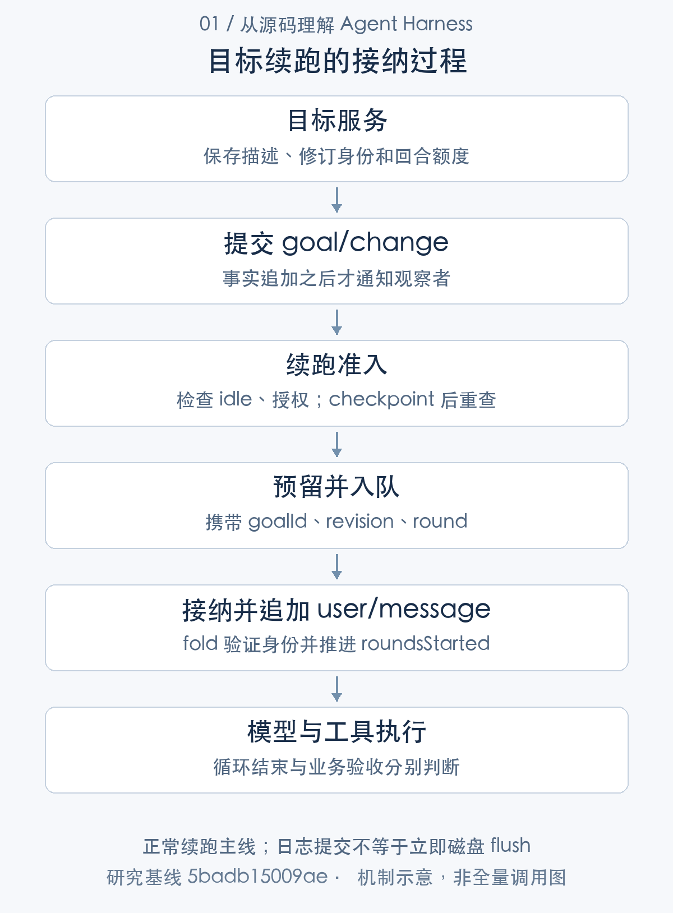

# 任务何时才算完成：目标、回合与业务验收

> 从源码理解 Agent Harness · 第 01 篇 · 任务定义与完成语义

让 Agent “修复这个缺陷并通过测试”，看起来只有一个目标。实际执行却包含几种不同的结束：模型停止生成，工具返回结果，当前回合关闭，任务清单被标为完成，以及测试真的通过。它们可能发生在不同时间，也可能彼此矛盾。

如果系统把模型最后一句“已经完成”当作成功，便很难解释失败重试、自动续跑和人工接管。研究 DeepSeek Harness，值得先从这里开始：**运行时可以记录任务进展，但业务成功需要单独定义。**

DSH 是以插件组合能力的 Agent 运行框架。它的 Loop 管理执行，GoalService 管理持续目标，todo 工具组织当前工作，规划模式管理计划状态。理解这些组件的分工，才能设计清楚“什么时候继续，什么时候停，凭什么验收”。

## 先把完成拆成四个层次

最靠近执行器的是回合完成。一个 Turn 可以经过多次模型请求和工具执行，最终正常关闭，记录 `turn/end completed`。这说明控制循环走到了正常结束分支，并不保证它写出的程序能够运行。

目标完成属于任务状态。GoalService 维护目标内容、修订身份、生命周期和自动回合额度；调用者可以报告完成、暂停或阻塞。todo 中的 completed 又是局部清单状态，表达模型对某个工作项的判断。二者都有结构化记录，但都没有因此自动获得独立评测能力。

委派结果是第三种检查。父 Agent 要求子 Agent 返回符合 outputSchema 的结果时，驱动器会检查是否捕获结构化结果。子 Loop 即使正常完成，没有满足这一要求也会得到失败结算。最后一层才是业务验收，例如重新执行测试命令并检查退出状态、检查目标文件是否正确，同时确认无关文件未被修改。[目标服务的评测边界](https://github.com/deepseek-ai/deepseek-harness/blob/5badb15009ae1756c3afe0ae0cef1faafc290ccc/packages/goal/goal/README.md#L152-L159) [子 Agent 的结构化结果结算](https://github.com/deepseek-ai/deepseek-harness/blob/5badb15009ae1756c3afe0ae0cef1faafc290ccc/packages/subagent/subagent-in-process-driver/src/index.ts#L219-L237)

这些判断不应只合并成一个 success 布尔值。架构上更有用的表达，是分别保留执行结果、目标状态、输出检查和验收依据，让上层产品决定它们如何共同构成成功。

## 持续目标由状态服务和驱动器共同推进

GoalService 不直接包办所有执行。目标改变先写入 Session 的 `goal/change`，会话投影根据事件重建目标状态；`goal-round-driver` 观察目标和 Agent 的运行情况，在允许继续时提交下一条输入。这是一种“状态定义工作、执行器消费工作”的组合。



正常路径可以这样理解：用户创建“修复缺陷”的目标，服务确认变更并通知观察者；Agent 执行当前回合，回到 idle；驱动器确认目标仍 active、自动激活仍 armed、额度未耗尽，并且没有普通用户输入竞争，才预留下一轮。

有一项容易被忽略的实现细节：目标的持久 phase 和进程内 activation 分开。phase 表达目标当前处于什么生命周期，activation 表达这个运行实例是否具备自动推进权限。保留一个 active 目标，不等于进程重启之后就允许它继续自动行动。[目标状态与进程内激活](https://github.com/deepseek-ai/deepseek-harness/blob/5badb15009ae1756c3afe0ae0cef1faafc290ccc/packages/goal/goal/src/index.ts#L240-L280) [目标续跑驱动](https://github.com/deepseek-ai/deepseek-harness/blob/5badb15009ae1756c3afe0ae0cef1faafc290ccc/packages/goal/goal-round-driver/src/index.ts#L137-L205)

这一分离对恢复很重要。系统可以展示尚未完成的目标，同时要求重新取得自动执行权，避免把“恢复历史”无声地变成“重新执行外部操作”。

## 回合额度在什么时刻扣除

续跑消息经历 queued、claimed、admitted 几个阶段。queued 表示进入 inbox，claimed 表示成为下一步的候选输入，admitted 才表示实际接纳。仅在排队时计数，会让被取消的输入也消耗额度；仅在执行结束时计数，又可能低估已经开始的工作。

DSH 把计数依据放在会话事实中：携带目标来源的 `user/message` 追加后，fold 验证并推进 roundsStarted。fold 是按日志逐条重建状态的过程，下面的代码体现了这个选择。

```typescript
if (event.type === 'user/message') {
  const source = goalSource(event.data.source)
  if (source === undefined) return
  const current = state.goal
  if (current === undefined || current.phase !== 'active' || source.goalId !== current.id
    || source.revision !== current.revision || source.round !== state.roundsStarted + 1
    || source.round > current.maxGoalRounds) {
    throw new Error(`goal round at session event ${event.seq} is not the next admitted round of the active goal`)
  }
  state.roundsStarted = source.round
}
```

[对应源码](https://github.com/deepseek-ai/deepseek-harness/blob/5badb15009ae1756c3afe0ae0cef1faafc290ccc/packages/goal/goal/src/fold.ts#L321-L331)。以上为原文片段，仅统一缩进，需结合完整实现阅读。

校验包含四项身份与约束：目标仍 active，goalId 相同，revision 相同，round 恰好是下一个且不超过额度。revision 指目标的一次修订，使旧目标下排队的消息不能冒用新目标的执行权。

例如驱动器准备第 2 轮时，用户暂停目标并修改要求，旧消息即使已经排队，也不能只凭自己的 round 值获得接纳。目标回合不是一张无条件有效的票据，而是必须与当前任务状态匹配的输入。这种约束同时存在于驱动准入和日志折叠中。[准入前后的身份重查](https://github.com/deepseek-ai/deepseek-harness/blob/5badb15009ae1756c3afe0ae0cef1faafc290ccc/packages/goal/goal-round-driver/src/index.ts#L350-L459)

## 提交事实之后，再发布通知

目标变更也有明确时序。下面的片段先安排激活状态对应的事件位置，追加 `goal/change`，清除 pendingActivation，然后构造通知视图。

```typescript
const ref = goalChangeRef(change)
runtime.pendingActivation = { offset: agent.session.seq, activation }
try {
  const event = agent.session.append('goal/change', change)
  /* v8 ignore next -- Session.append returns the event committed at the pre-append seq. */
  if (SessionSeq(runtime.pendingActivation.offset) === event.seq) runtime.activation = activation
} finally {
  runtime.pendingActivation = undefined
}
const goal = this.view(this.state(agent.session), runtime)
const notification: GoalChanged = {
  operation: change.operation,
  ref: { ...ref },
  ...goal === undefined ? {} : { goal },
}
agentEvents(this.ctx, agent).emit('goal/changed', { change: notification })
```

[对应源码](https://github.com/deepseek-ai/deepseek-harness/blob/5badb15009ae1756c3afe0ae0cef1faafc290ccc/packages/goal/goal/src/index.ts#L610-L625)。以上为原文片段，仅统一缩进，需结合完整实现阅读。

通知引用的是已经进入 Session 的变更。消费侧可以从日志找到发生了什么，而不必把一次瞬时通知当作唯一真相。不过这里的 append 仍是会话事实提交，是否立即写入磁盘需要看持久 provider 和 flush，不能把方法返回理解为统一磁盘屏障。

驱动器在需要时先等待 checkpoint，再检查 Agent 是否仍是 registry 中的同一个实例、是否 idle，以及是否出现竞争输入。这个“等待之后再确认”很关键：异步等待期间，用户可能暂停任务，插件可能卸载，实例也可能被替换。检查发生得早，并不能保证检查结果一直有效。[checkpoint 后的有效性重查](https://github.com/deepseek-ai/deepseek-harness/blob/5badb15009ae1756c3afe0ae0cef1faafc290ccc/packages/goal/goal-round-driver/src/index.ts#L96-L134)

## todo 和计划为什么不能替代目标验收

`todo_write` 在工具 body 内追加 `todo/write`，随后生成工具结果。清单能帮助模型组织工作，也便于界面显示，但下一 Turn 会清空当前清单投影，历史事件则保留。它更适合表达一次工作中的计划与进展，不能直接当作跨回合任务账本。[todo 写入时点](https://github.com/deepseek-ai/deepseek-harness/blob/5badb15009ae1756c3afe0ae0cef1faafc290ccc/packages/todo/tool-todo/src/index.ts#L192-L208) [todo 投影的回合清理](https://github.com/deepseek-ai/deepseek-harness/blob/5badb15009ae1756c3afe0ae0cef1faafc290ccc/packages/todo/tool-todo/src/index.ts#L117-L134)

工具 body 的清单写入和最终结果还有不同提交点。假如清单已经更新，后续内容处理失败，日志可能同时包含新的 todo 状态与错误工具结果。框架没有为这两个动作提供统一回滚。这不是“清单不可信”的结论，而是提醒应用：需要依据哪项事实展示状态，必须明确。

规划模式则区分 pending intent 与已记录模式。用户批准退出规划后先保存意图，后续 accepted pre-step 才提交模式事件。它回答的是“接下来按什么工作政策推进”，并不回答“这个计划实施之后是否正确”。[规划意图与接纳边界](https://github.com/deepseek-ai/deepseek-harness/blob/5badb15009ae1756c3afe0ae0cef1faafc290ccc/packages/plan/plan-mode/src/index.ts#L196-L224)

## 这套设计的优势，以及应用需要补上的部分

优势在于完成语义没有全部塞入 Loop。回合执行、目标续跑和业务判断可以分别演进；事件记录又让目标修订、额度和进展可以被追踪。把自动权限与历史状态分开，也使取消和恢复更保守。

代价是应用必须做更多语义整合。目标完成可能来自模型或调用者声明；todo 完成不等于测试通过；结构化输出能证明字段合规，也不能证明字段内容真实。若只展示一个绿色成功图标，这些差别就被界面掩盖了。

用于代码修复的产品可以额外保存验收证据：测试命令及退出码、验证过的提交或文件版本、失败用例、检查时间，以及验收所对应的目标 revision。这是工程建议，并非 DSH 已内置的统一验收模型。测试通过后目标又被修改，旧证据也需要重新判断是否适用。

## 技术心得：完成应当是一组可解释的事实

这次源码分析让我更关注“完成由谁判断”，而不只是“循环在哪里结束”。模型适合提出行动与判断，运行时适合记录和限制行动，独立验证器适合检查外部结果。把三者职责分开，比让模型在一段提示词里同时承担全部责任更容易定位问题。

这一原则也适用于工作流和后台任务：输出、状态与验收证据分别保存，成功才有可解释的来源。它不要求所有任务都建立复杂审批；对于低风险文本生成，回合正常结束可能已经足够。关键是让完成标准与任务的实际风险、结果可检查程度相匹配。

本系列沿用的目标相关验证是 V08 中 goal 35、round-driver 53、tool-goal 23 项；结构化子任务和 todo 的选定路径在 V10 中验证。这些离线测试支持状态与准入机制，不证明某次真实代码修复已经通过业务验收。下一篇会从这个基础继续追踪：一条输入如何实际走过 Agent Loop。

---

研究基线：DeepSeek Harness `0.2.1-alpha.1`，提交 `5badb15009ae1756c3afe0ae0cef1faafc290ccc`。源码事实以该版本为准；文中的工程判断和改造建议另行说明。教学场景不代表真实模型业务实测。

源码与运行记录可从[证据索引](../appendices/evidence-index.md)和[验证附录](../appendices/validation.md)复核。本文引用此前同一提交的验证结果，本轮写作不将其重新计为新测试。

[专栏目录](README.md) · [下一篇](02-agent-loop.md)
