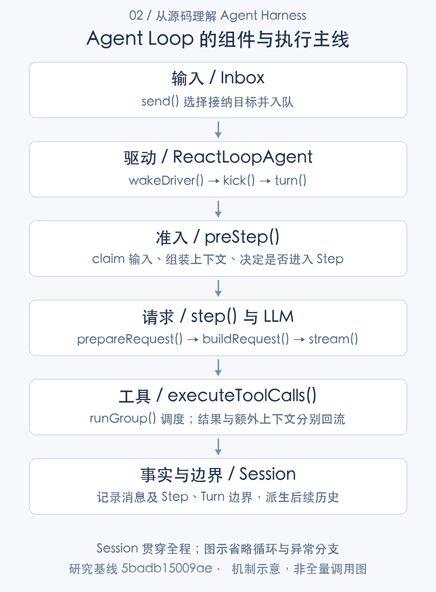
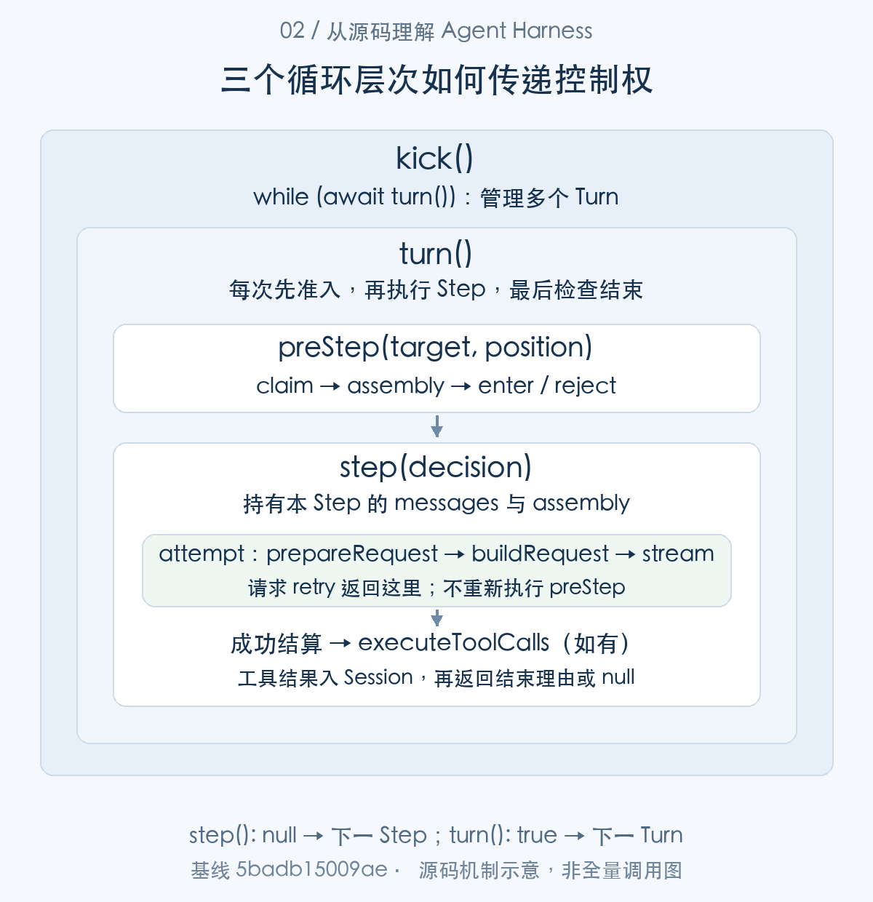
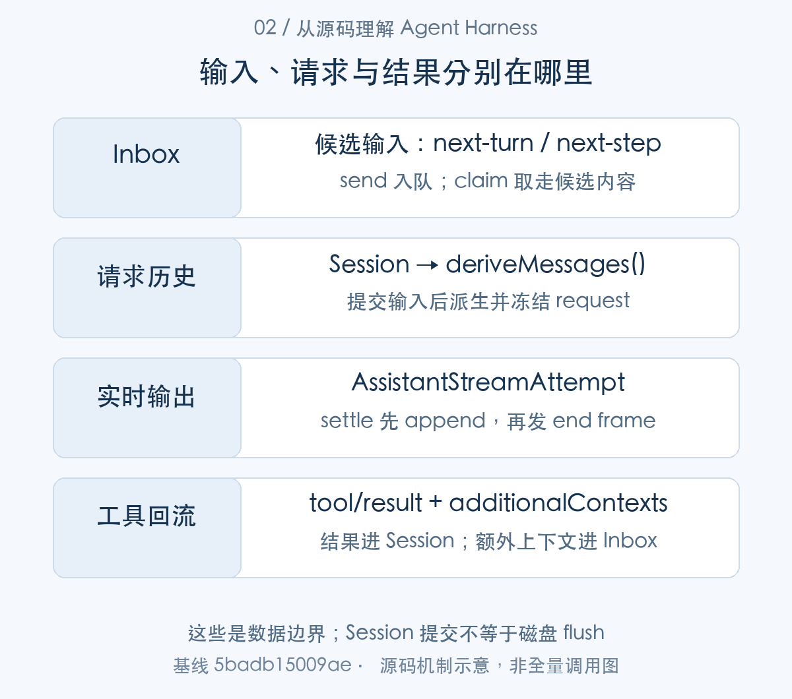
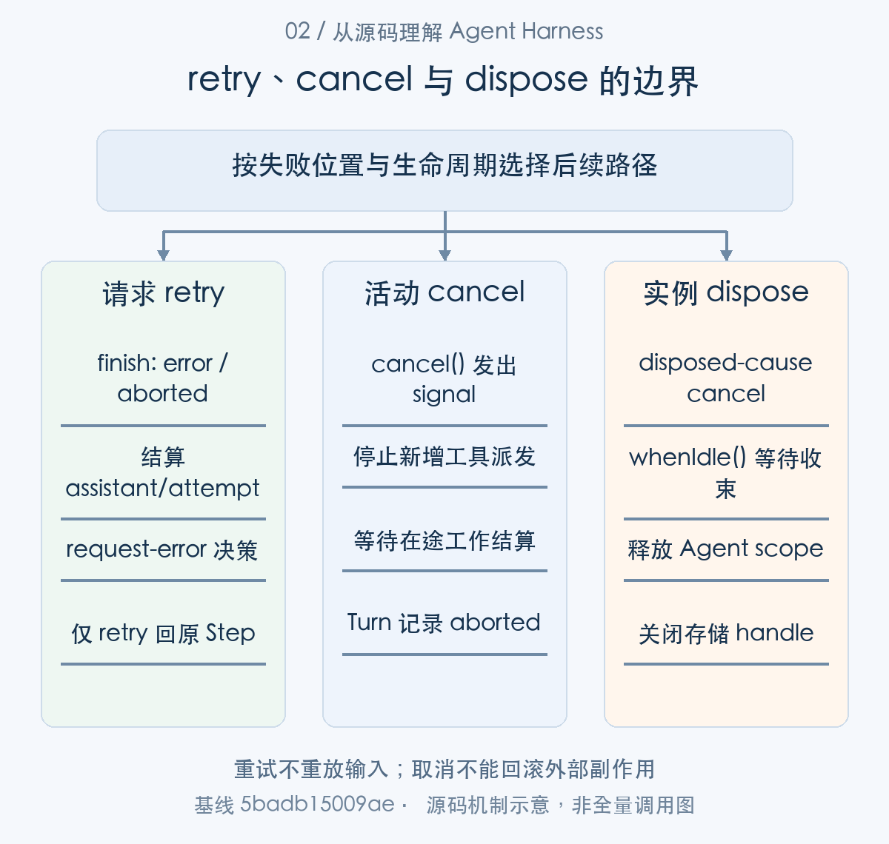

# 一次输入如何推进为多步执行：拆解 Agent Loop

> 从源码理解 Agent Harness · 第 02 篇 · Agent Loop 与执行模型

用户输入“修改这个函数，再运行测试”，界面上只有一次发送操作，运行时却需要完成一条连续的执行链：接纳输入，组装上下文，调用模型，执行工具，把结果交还模型，最后决定是否停止。其间还可能收到新的指令，遇到请求失败，或者被用户取消。Agent Loop 的职责，就是让这些动作在明确的状态和提交边界内发生。

DeepSeek Harness（下文简称 DSH）用 `ReactLoopAgent` 实现这条执行链。它不包办所有能力：Inbox 管理待接纳输入，Session 保存执行事实并派生模型可见历史，LLM 服务处理模型调用，工具运行时执行具体操作；Loop 把这些组件按顺序连接起来，并承担继续、结束和取消的控制责任。

本文沿一次代码修复任务的真实调用关系展开：先说明执行器如何创建，再从 `followup()` 追到 `send()`、`wakeDriver()`、`kick()` 和 `turn()`，随后进入 `preStep()`、`step()`，最后沿模型与工具的返回路径回到结束判断。重试与取消放在正常路径讲清之后。**阅读重点是：控制权交给了谁，返回值意味着什么，以及哪些信息已经进入 Session。**

## 整体架构：一个 Turn 中如何组织 Step 与 attempt

先区分三个执行单位。**Turn** 是 Loop 记录的一次执行边界；**Step** 是其中一次经过准入的执行单元，可以包含模型调用和工具执行；**attempt** 是 Step 内的一次模型请求尝试。一次请求失败后若获准重试，仍属于同一 Step。一次工具执行完成后若需要模型继续处理，则进入新的 Step。

它们的嵌套关系是 `Turn → Step → attempt`，但并非每个 Turn 都一定调用模型：初始输入被移除、准入结果变空或被拒绝，都可能在 Step 开始之前结束。也不能把“一次用户点击”与“一个 Turn”简单对应，输入 API 决定的是接纳位置，实际边界由执行器建立。

|组件|本文追踪的职责|与 Loop 的连接点|
|---|---|---|
|Agent Registry / AgentLoop factory|准备实例、执行 setup、发布和管理释放|`ctx.agents.create()` → `createAgent()`|
|`ReactLoopInbox`|区分 `next-turn` 与 `next-step` 的待处理输入|`send()` 入队，`preStep()` 调用 `claim()`|
|`ReactLoopAgent`|驱动 Turn、Step 和 attempt，处理结束与取消|`kick()` → `turn()` → `step()`|
|Session|记录消息及执行边界，派生请求历史|`append()`、`deriveMessages()`|
|LLM 服务|确定模型配置和调用能力，提供输出流|`prepareCall()`、`stream()`|
|工具运行时|调度工具并形成规范结果|`executeToolCalls()` → `runGroup()`|



*图 1：先看输入到执行的整体主线。图中展示主要连接点，Session 的记录与投影贯穿执行全程；Turn、Step 与 attempt 的嵌套和重复执行将在图 2 展开。*

### 第一步：从 Registry 创建入口走到 Loop 实例

创建和执行是两个相连但不同的阶段。调用者通过 `ctx.agents.create(options)` 请求一个 Agent，Registry 的 `create()` 找到已注册的 factory，再调用其 `createAgent()`。下面是 Registry 的完整方法，`ownerCtx` 将调用者的生命周期上下文传给 factory：

```typescript
async create(options: CreateAgentOptions): Promise<AgentHandle> {
  const ownerCtx = this.ctx
  // Re-trace a Service-backed factory through the accessing context
  // explicitly. This preserves AgentLoop's dependency origin while binding
  // its effects to ownerCtx; plain factories receive ownerCtx as an explicit
  // capability and need no Cordis tracker magic.
  const { target } = this.requireFactory()
  const receiver = getTraceable(ownerCtx, target)
  // oxlint-disable-next-line typescript/unbound-method -- Reflect.apply intentionally supplies the caller-traced receiver
  return Reflect.apply(target.createAgent, receiver, [ownerCtx, options])
}
```

[源码：`packages/core/agent/src/index.ts:391–401`](https://github.com/deepseek-ai/deepseek-harness/blob/5badb15009ae1756c3afe0ae0cef1faafc290ccc/packages/core/agent/src/index.ts#L391-L401)。

在 DSH 的 AgentLoop 实现中，`createAgent(ownerCtx, options)` 先准备 Session，再尝试建立存储写路径；接着调用 `setupAndPublish()`。下列选段正是上面 `target.createAgent` 的实现内部，参数没有凭空变化：`options.agentOptions` 在这里被拆出，与 Session、setup 和 signal 一同向下传递。

```typescript
  return this.setupAndPublish(
    ownerCtx,
    options.sessionId,
    preparation,
    options.agentOptions ?? {},
    options.setup,
    options.signal,
    'startup',
    stored,
    options.parentAgent,
  )
})()
this.ownership.trackWrapper(published)
return published
```

[源码：`packages/core/agent-loop/src/index.ts:737–750`](https://github.com/deepseek-ai/deepseek-harness/blob/5badb15009ae1756c3afe0ae0cef1faafc290ccc/packages/core/agent-loop/src/index.ts#L737-L750)。

这里的 `published` 是最终返回 `AgentHandle` 的 Promise，factory 用 `trackWrapper()` 跟踪尚未完成的创建过程。创建存储失败时会释放 preparation；创建过程中发生取消时，还需要关闭晚到的存储 handle。这些是实例生命周期问题，尚未进入模型执行。[完整 `createAgent()`](https://github.com/deepseek-ai/deepseek-harness/blob/5badb15009ae1756c3afe0ae0cef1faafc290ccc/packages/core/agent-loop/src/index.ts#L714-L751)

现在进入被调用的 `setupAndPublish()`。它取得 preparation 中的 Session，调用 `prepare()` 构造待发布实例，然后借助 `initializeAgent()` 执行初始化：

```typescript
using ownedPreparation = preparation
const session = ownedPreparation.session
let prepared: PreparedAgent
try {
  prepared = this.prepare(ownerCtx, id, agentOptions, session, signal, stored?.handle, parentAgent)
} catch (error: unknown) {
  await stored?.handle.close().catch(() => {})
  throw error
}
return await this.initializeAgent(prepared, async () => {
  const setupCommit = await raceAbort(setup?.(prepared.agent.ctx, prepared.agent), prepared.signal, id)
  setupCommit?.commit()
  await this.appendUnstoredSuffix(stored, session)
  return await prepared.publish(source)
})
```

[源码：`packages/core/agent-loop/src/index.ts:765–779`](https://github.com/deepseek-ai/deepseek-harness/blob/5badb15009ae1756c3afe0ae0cef1faafc290ccc/packages/core/agent-loop/src/index.ts#L765-L779)。

`prepare()` 是同步的资源准备入口，返回包含 Agent、signal 和发布能力的 `PreparedAgent`。`initializeAgent()` 则通过 `runMaintenance()` 保护初始化期间的活动边界；setup 可以注册工具或 listener，setup 返回的提交对象会先 `commit()`，随后补写尚未存储的事件，再发布实例。初始化失败还有取消和释放路径。因此，`create()` 返回的 handle 表示创建、setup 与发布已经完成，不能只凭“构造函数返回了”判断实例可用。[初始化与失败处理](https://github.com/deepseek-ai/deepseek-harness/blob/5badb15009ae1756c3afe0ae0cef1faafc290ccc/packages/core/agent-loop/src/index.ts#L782-L806)

继续向下，`prepare()` 内部由 owner 的 effect 实际构造 Loop：

```typescript
let unfollowOwner: () => Promise<void> | void
try {
  unfollowOwner = ownerCtx.effect(function* () {
    machine = new ReactLoopAgent(loopCtx, id, options, session)
    machineReady.resolve()
```

[源码：`packages/core/agent-loop/src/index.ts:573–577`](https://github.com/deepseek-ai/deepseek-harness/blob/5badb15009ae1756c3afe0ae0cef1faafc290ccc/packages/core/agent-loop/src/index.ts#L573-L577)。

这个 `new ReactLoopAgent(loopCtx, id, options, session)` 才进入本文的执行器。构造函数建立 dispatcher、scope、Inbox 和上下文投影，并从已有 Session 的 `turnBoundary` 投影取得 `lastTurn`：

```typescript
this.requestSurfaceGeneration = session.surface.contentGeneration
this.dispatch = agentEvents(loopCtx, this)
this.scope = createScope(loopCtx, this)
this.ctx = this.scope.ctx
this.inbox = new ReactLoopInbox(this.ctx.sessionProjections, session, this.dispatch)
/* v8 ignore next -- the loop registers its own turnBoundary unit, so the key is always present */
const lastTurn = this.loopCtx.sessionProjections.stateOf(session, 'turnBoundary')?.lastTurn ?? 0
this.phase = { kind: 'idle', lastTurn }
this.runtimeContext = new RuntimeContextProjection(this.ctx, session)
this.systemPrompt = new SystemPromptProjection(session)
```

[源码：`packages/core/agent-loop/src/agent.ts:128–137`](https://github.com/deepseek-ai/deepseek-harness/blob/5badb15009ae1756c3afe0ae0cef1faafc290ccc/packages/core/agent-loop/src/agent.ts#L128-L137)。

`phase` 被设为 `idle`，意味着构造本身没有发出模型请求。由此可以完整串起创建链：`create()` → `createAgent()` → `setupAndPublish()` → `prepare()` → `ReactLoopAgent`。后面的 setup、发布与维护期间排队输入的唤醒仍由 factory 管理。本文接下来追踪实例就绪后，一条输入如何启动 driver。

这层划分的工程价值是，工具注册、模型配置和 owner 生命周期可以在执行之前得到组织。相应的成本也很明确：创建 Agent 需要正确管理 Session、scope 和 handle，不能只保留一个模型客户端引用。

## 输入 API：从入队到唯一 driver

### 第二步：followup、steer、inject 都进入 send()

三个输入方法的差别集中在传给 `send()` 的两个参数：接纳目标 `target` 和是否请求唤醒 `wakeup`。下面把调用方和被调用方法放在同一个源码选段中：

```typescript
send(message: UserMessage, target: InboxTarget, wakeup: boolean): void {
  // Waking input cannot join an aborted activity, so it starts the next turn.
  // Captured before the insertion so a reentrant cancel from a splice observer cannot reclassify it.
  const wakingAfterAbort = wakeup && this.phase.kind !== 'idle' && this.phase.abort.signal.aborted
  const resolvedTarget = wakingAfterAbort ? 'next-turn' : target
  this.inbox.splice(resolvedTarget, Infinity, 0, [message])
  if (wakeup) this.wakeDriver(wakingAfterAbort)
}

followup(input: UserMessage): void {
  this.send(input, 'next-turn', true)
}

steer(input: UserMessage): void {
  this.send(input, 'next-step', true)
}

inject(input: UserMessage): void {
  this.send(input, 'next-step', false)
}
```

[源码：`packages/core/agent-loop/src/agent.ts:154–173`](https://github.com/deepseek-ai/deepseek-harness/blob/5badb15009ae1756c3afe0ae0cef1faafc290ccc/packages/core/agent-loop/src/agent.ts#L154-L173)。

|方法|队列位置|是否请求唤醒|使用含义|
|---|---|---|---|
|`followup()`|`next-turn`|是|把后续任务安排到新的 Turn 接纳|
|`steer()`|`next-step`|是|让执行器在下一个 Step 边界接纳调整|
|`inject()`|`next-step`|否|只追加上下文，等待其他活动推动执行|

`send()` 返回 `void`：此时完成的是入队和必要的唤醒请求，没有等待模型、工具或任务完成。`steer()` 也不会把内容直接塞进已经发出的请求；正在执行的 attempt 持有自己的请求对象，新输入要等后续 `preStep()`。

还有一个容易忽略的条件：如果活动已经被取消，而这条输入要求唤醒，`send()` 会把它重分类为 `next-turn`。这个判断发生在 `splice()` **之前**，因为入队通知可能触发重入的取消，后做判断会改变同一条输入的归属。至此，输入仍是 Inbox 中的候选内容；只有下一阶段的准入与提交，才会将其写成 `user/message`。

### 第三步：wakeDriver() 预留执行状态，kick() 才驱动 Turn

沿 `send()` 最后一行进入 `wakeDriver(wakingAfterAbort)`。它不是每收到一条输入就启动一个新循环，而是先检查当前 `phase`：

```typescript
private wakeDriver(wakeAfterAbort = false): void {
  if (this.phase.kind !== 'idle') {
    // Maintenance and aborted drivers cannot deliver the wake: latch it for
    // replay at convergence. Live drivers claim queued work themselves;
    // disposal never latches, so teardown waits on no model turn.
    const reason = abortedCancelCause(this.phase.abort.signal)
    if (reason?.kind !== 'disposed' && (this.phase.kind === 'maintenance' || wakeAfterAbort)) {
      this.phase.wakeRequested = true
    }
    return
  }
  const driver = Promise.withResolvers<void>()
  this.activityDone = driver.promise
  this.setPhase({
    kind: 'running',
    abort: new AbortController(),
    turn: this.phase.lastTurn,
    step: 0,
    wakeRequested: false,
  })
  this.loopCtx.agents.withInitiator(this, () => this.kick()).then(driver.resolve, driver.reject)
}
```

[源码：`packages/core/agent-loop/src/agent.ts:214–235`](https://github.com/deepseek-ai/deepseek-harness/blob/5badb15009ae1756c3afe0ae0cef1faafc290ccc/packages/core/agent-loop/src/agent.ts#L214-L235)。

如果已有正常运行的 driver，方法直接返回，让原 driver 接纳队列里的新输入。如果处于 maintenance，或者输入到达时旧活动已经取消，则设置 `wakeRequested`，留到旧活动收束后处理；`disposed` 不再锁存唤醒。

当状态是 `idle`，方法先创建表示本次活动完成的 Promise，赋给 `activityDone`，再同步切换到 `running`。这样第二次唤醒会看到已经预留的执行状态，不能再启动另一条 driver。最后，`withInitiator(this, () => this.kick())` 在当前 Agent 的 initiator 上下文中调用 `kick()`；工具执行稍后也通过这一上下文找到所属 Agent 和 Session。

`wakeDriver()` 本身仍返回 `void`。实际执行完成通过 `kick()` 的 Promise 结算到 `activityDone`，需要等待执行收束的调用者使用 `whenIdle()`。现在进入它真正调用的 driver：

```typescript
private async kick(): Promise<void> {
  try {
    while (await this.turn()) {}
  } catch (_error) {
    // Reported failures and cancellation are contained at the driver boundary.
  } finally {
    /* v8 ignore next -- kick owns a running phase until this driver boundary */
    if (this.phase.kind === 'running') {
      const { turn, wakeRequested } = this.phase
      this.setPhase({ kind: 'idle', lastTurn: turn })
      if (wakeRequested && this.inbox.hasPending) this.wakeDriver()
    }
  }
}
```

[源码：`packages/core/agent-loop/src/agent.ts:252–265`](https://github.com/deepseek-ai/deepseek-harness/blob/5badb15009ae1756c3afe0ae0cef1faafc290ccc/packages/core/agent-loop/src/agent.ts#L252-L265)。

`kick()` 的核心只有 `while (await this.turn()) {}`。**`turn()` 返回 `true` 表示还需要启动下一个 Turn，返回 `false` 表示当前 driver 不再继续。** 这个布尔值不表达业务成功。异常和取消在 driver 边界被收束；已有错误由内部的 `agent/error` 或执行事实报告，不能把 `kick()` 的 Promise 正常结算当成“任务没有出错”。

`finally` 将状态恢复为 `idle`，并根据锁存标记及队列内容决定是否重新唤醒。至此，调用关系已经闭合到 `send()` → `wakeDriver()` → `kick()` → `turn()`。接下来我们进入 `turn()`，看它如何产生 Step。



*图 2：`kick()` 重复调用 `turn()`，`turn()` 在每个 Step 前调用 `preStep()`，获准后再调用 `step()`。`step()` 内部的 attempt 循环承担请求重试；工具正常回流通常促成下一个 Step。*

## preStep：候选输入如何成为可执行的 Step

### 第四步：turn() 先建立边界，再提出 Step

下面是 `kick()` 直接调用的 `turn()` 入口。它读取 driver 预留的 running 状态，计算新的 Turn 编号，并先记录 `turn/start`：

```typescript
private async turn(): Promise<boolean> {
  if (this.phase.kind !== 'running') {
    this.throwError(new Error(`agent "${this.id}": turn without driver reservation`))
  }
  const phase = this.phase
  const { signal } = phase.abort
  signal.throwIfAborted()
  const turn = phase.turn + 1
  try {
    this.session.append('turn/start', { turn })
  } catch (error: unknown) {
    this.throwError(error)
  }
  phase.turn = turn
  let turnEnds: TurnEndReason | null = null
  let target: InboxTarget = 'next-turn'
  try {
    while (true) {
```

[源码：`packages/core/agent-loop/src/agent.ts:296–313`](https://github.com/deepseek-ai/deepseek-harness/blob/5badb15009ae1756c3afe0ae0cef1faafc290ccc/packages/core/agent-loop/src/agent.ts#L296-L313)。

`phase.turn` 保存当前 Turn；`turnEnds` 保存是否已经得到结束理由；`target` 初始为 `next-turn`，随后才切换到 `next-step`。这些变量属于 `turn()`，不会随着一次 attempt 重试重新初始化。

紧接着，`turn()` 的循环计算拟进入的 Step，并将接纳位置和执行坐标传给 `preStep(target, { turn, step })`：

```typescript
signal.throwIfAborted()
const step = phase.step + 1
const decision = await this.preStep(target, { turn, step })
if (decision.kind === 'reject') {
  turnEnds = { kind: 'blocked' }
  return false
}
if (turnEnds && decision.messages.length === 0) break
// A removed waking message or an enter decision rewritten to empty
// still owns the initial turn boundary, but it spends no model call.
if (phase.step === 0 && decision.messages.length === 0) {
  turnEnds = { kind: 'completed' }
  return false
}
signal.throwIfAborted()
this.session.append('step/start', { turn, step })
phase.step = step
```

[源码：`packages/core/agent-loop/src/agent.ts:314–330`](https://github.com/deepseek-ai/deepseek-harness/blob/5badb15009ae1756c3afe0ae0cef1faafc290ccc/packages/core/agent-loop/src/agent.ts#L314-L330)。

注意 `step/start` 位于 `await preStep()` **之后**。`reject` 表示当前 Turn 被阻止，直接返回 `false`；第一份准入结果为空，也可以记录 completed 后退出，不消耗模型调用。这里的 completed 只是该执行边界的结束理由，并不验证代码修复成功。

另一个条件 `turnEnds && decision.messages.length === 0` 是停止检查的补充：如果上一 Step 已经产生结束理由，即使上一轮未退出，下一次准入又没有留下消息，也会结束。下一节会说明为什么工具回流时 `turnEnds` 可以是 `null`，即使没有新用户消息也仍可继续。

### 第五步：preStep() 调用 Inbox.claim()，再返回准入结果

上面出现的 `preStep()` 是 `ReactLoopAgent` 的私有方法。它返回 `PreparedStep`：要么拒绝，要么携带准入后的 messages 和 prompt assembly。这里展示整个方法，避免把 claim、上下文组装和准入 hook 当成无关的片段：

```typescript
private async preStep(target: InboxTarget, position: { turn: number; step: number }): Promise<PreparedStep> {
  /* v8 ignore next -- private callers establish the running phase before proposing a step */
  if (this.phase.kind !== 'running') throw new Error(`agent "${this.id}": pre-step outside running phase`)
  const signal = this.phase.abort.signal
  const claimed = this.inbox.claim(target, position.turn)
  const assembly = await this.loopCtx.systemPrompt.assemble(assembleContextFor(this, signal))
  signal.throwIfAborted()
  const sections = renderContextSections(assembly)
  const context = this.runtimeContext.project(joinContextSections(sections), sections)
  const decision = await this.dispatch.waterfall(
    'agent/pre-step', { messages: claimed, ...position, signal },
    (): Promise<PreStepDecision> => Promise.resolve<PreStepDecision>({
      kind: 'enter',
      messages: context === undefined ? claimed : [...claimed, context],
    }),
  )
  signal.throwIfAborted()
  if (decision.kind === 'reject') return decision
  return { ...decision, assembly }
```

[源码：`packages/core/agent-loop/src/agent.ts:267–285`](https://github.com/deepseek-ai/deepseek-harness/blob/5badb15009ae1756c3afe0ae0cef1faafc290ccc/packages/core/agent-loop/src/agent.ts#L267-L285)。

第一站 `this.inbox.claim(target, position.turn)` 进入的是 **`ReactLoopInbox` 的方法**，并不是第二个 Loop。它先取走全部 `next-step` 内容；只有接纳目标为 `next-turn` 时，才额外取一个 `next-turn` 输入：

```typescript
claim(target: InboxTarget, turn: number): UserMessage[] {
  const claimed = this.mutate('next-step', 0, this.nextStep.length, [], false)
  if (target === 'next-turn') claimed.push(...this.mutate('next-turn', 0, 1, [], false))
  for (const message of claimed) this.dispatch.emit('agent/inbox/claimed', { message, turn })
  return claimed
}
```

[源码：`packages/core/agent-loop/src/inbox.ts:109–114`](https://github.com/deepseek-ai/deepseek-harness/blob/5badb15009ae1756c3afe0ae0cef1faafc290ccc/packages/core/agent-loop/src/inbox.ts#L109-L114)。

这个策略解释了 `steer()` 与 `followup()` 的区别：多个 steer 可以一起进入下一 Step，而 followup 的输入按新的 Turn 接纳。claim 是从队列取候选内容，还不是向请求历史追加 `user/message`；后者由 `step()` 在准备请求之后完成。

从 `claim()` 返回 `claimed` 后，控制权回到上面的 `preStep()`：`systemPrompt.assemble()` 组装 prompt、工具和上下文段；`runtimeContext.project()` 计算需要追加的运行上下文；`agent/pre-step` waterfall 再决定是否接纳以及最终消息内容。默认准入把候选输入与必要的运行上下文合并，扩展也可以拒绝或改写结果。

`assembly` 和 `decision` 是两个相关但不同的输出：前者提供本 Step 的提示与工具快照，后者确定本 Step 接纳哪些消息。每个异步等待之后重新检查 signal，是为了避免 await 期间发生取消却仍继续执行。准入被拒绝时，已经 claim 的输入不会因为方法返回 reject 就自动恢复为原队列；扩展若需要另行保留任务，必须有明确策略，不能假设存在事务回滚。

最后，`preStep()` 返回 `{ ...decision, assembly }` 给 `turn()`。`turn()` 记录 `step/start`，建立工具结果恢复观察，然后调用 `this.step(decision)`。我们现在沿这次调用进入模型请求路径。[`step()` 调用与恢复边界](https://github.com/deepseek-ai/deepseek-harness/blob/5badb15009ae1756c3afe0ae0cef1faafc290ccc/packages/core/agent-loop/src/agent.ts#L328-L357)

## step：从请求准备到模型与工具结果回流

### 第六步：step() 持有准入快照，prepareRequest() 确定调用配置

`step(decision)` 的入参，就是 `preStep()` 返回且被 `turn()` 接纳的 enter 结果。它读取当前 Turn、Step 和 signal，渲染 assembly，随后进入 attempt 循环：

```typescript
private async step(decision: Extract<PreparedStep, { kind: 'enter' }>): Promise<StepEndReason | null> {
  /* v8 ignore next -- private callers establish the running phase before executing a step */
  if (this.phase.kind !== 'running') throw new Error(`agent "${this.id}": step outside running phase`)
  const { turn, step, abort: { signal } } = this.phase
  signal.throwIfAborted()

  const { assembly } = decision
  const renderedPrompt = renderPrompt(assembly)
  let firstAttempt = true
  while (true) {
    const { config, preparedCall } = await this.prepareRequest(turn, step, signal)
    const startsRequestSeries = firstAttempt && decision.startsRequestSeries === true
```

[源码：`packages/core/agent-loop/src/agent.ts:398–409`](https://github.com/deepseek-ai/deepseek-harness/blob/5badb15009ae1756c3afe0ae0cef1faafc290ccc/packages/core/agent-loop/src/agent.ts#L398-L409)。

这里的 `while (true)` 与 `kick()` 的 while 承担不同职责。正常请求结算后，`step()` 会返回；只有特定请求失败获准 retry 时，才在这一 while 内重新发起 attempt。它不会重复执行 `preStep()`，因此同一 Step 的输入准入和 assembly 不会因请求重试而重新产生。

循环首行 `prepareRequest(turn, step, signal)` 返回 `{ config, preparedCall }`。这个方法先依据 Agent options、已记录的 request header 和默认值标记生成 seed config，再由 `agent/request` waterfall 修改本次请求提案。以下摘录位于 **`prepareRequest()` 内部**，展示它怎样把配置提案交给 LLM 服务：

```typescript
const proposedConfig = await this.dispatch.waterfall(
  'agent/request', { turn, step, signal },
  () => Promise.resolve(seedConfig),
)
signal.throwIfAborted()
if (!proposedConfig.provider || !proposedConfig.model) {
  throw new Error(`agent "${this.id}" has no provider/model: set AgentOptions.provider and AgentOptions.model or supply both via the agent/request waterfall`)
}
let config: LlmCallConfig
let preparedCall: PreparedLlmCall | undefined
try {
  preparedCall = await this.loopCtx.llm.prepareCall(proposedConfig, signal)
  config = preparedCall.config
} catch (error: unknown) {
  // Middleware may serve an unregistered route; terminal dispatch still requires an adapter.
  if (!(error instanceof LlmError) || error.code !== 'NO_ADAPTER') throw error
  config = proposedConfig
}
signal.throwIfAborted()
return { config, ...preparedCall === undefined ? {} : { preparedCall } }
```

[源码：`packages/core/agent-loop/src/agent.ts:576–595`](https://github.com/deepseek-ai/deepseek-harness/blob/5badb15009ae1756c3afe0ae0cef1faafc290ccc/packages/core/agent-loop/src/agent.ts#L576-L595)。

`proposedConfig` 是扩展给出的路由提案；`preparedCall.config` 是 LLM 服务解析后的配置，调用句柄还携带模型能力和流式执行入口。`NO_ADAPTER` 会退回配置路径，以允许中间件服务未注册路由，但这不意味着最终模型派发可以不具备实现。更详细的 provider 绑定分析见下一篇。[`prepareRequest()` 的配置起点](https://github.com/deepseek-ai/deepseek-harness/blob/5badb15009ae1756c3afe0ae0cef1faafc290ccc/packages/core/agent-loop/src/agent.ts#L547-L575)

返回后，控制权仍在 `step()` 的 attempt 循环里。下一步要将本次调用所需的消息提交到 Session，再构造 request。

### 第七步：先提交输入，再由 buildRequest() 派生模型历史

下面接续 `step()` 中的 `prepareRequest()` 调用，直到 `buildRequest()`：

```typescript
const commits = this.systemPrompt.project(renderedPrompt, {
  inHistory: preparedCall?.systemPromptUpdate === 'in-history',
  startsSeries: startsRequestSeries
    || this.requestSurfaceGeneration !== this.session.surface.contentGeneration
    || (preparedCall?.toolUpdate === undefined && this.toolsChanged(assembly.tools)),
})
for (const { message, intent } of commits) {
  this.session.append('system/message', { turn, step, message }, intent)
}
if (firstAttempt) {
  for (const message of decision.messages) {
    this.session.append('user/message', message, { surfaceOp: 'append' })
  }
}
firstAttempt = false
const request = this.buildRequest(config, preparedCall, assembly.tools, { turn, step }, startsRequestSeries, signal)
```

[源码：`packages/core/agent-loop/src/agent.ts:410–425`](https://github.com/deepseek-ai/deepseek-harness/blob/5badb15009ae1756c3afe0ae0cef1faafc290ccc/packages/core/agent-loop/src/agent.ts#L410-L425)。

`systemPrompt.project()` 根据 prompt 和模型更新能力生成需要记录的 system/message；`startsRequestSeries` 等条件用于处理请求系列和历史视图变化。用户输入的提交则由 `firstAttempt` 保护：**第一次 attempt 追加 `decision.messages`，同 Step 的 retry 不重复追加**。否则一次请求失败后重试，就可能把相同指令重复写入历史。

这里也能看到具体提交边界：输入先入 Inbox，再由 `preStep()` claim 和准入，直到当前位置才写入 `user/message`。它不是在 `send()` 时就成为模型历史。`firstAttempt` 随后改为 false；若本 Step 的准备或提交过程发生其他异常，不能据此推断系统会自动重试所有失败。

`buildRequest(config, preparedCall, assembly.tools, position, startsRequestSeries, signal)` 接收刚才的解析配置、调用能力、本 Step 工具快照和执行坐标。它先记录所需的 request header 与工具历史变化；方法末尾再从 **已经提交的 Session surface** 派生消息，冻结本次请求：

```typescript
// canonicalHeader is shallow; append logs a detached snapshot, not these local values.
deepFreeze(header)
const boundaryMessages = session.deriveMessages()
for (const message of boundaryMessages) {
  if (this.frozenMessages.has(message)) continue
  deepFreeze(message)
  this.frozenMessages.add(message)
}
Object.freeze(boundaryMessages)
const request = markAgentLoopRequest(Object.freeze({
  ...header.config,
  messages: boundaryMessages,
  toolHistory: session.toolHistory(),
  ...header.tools !== undefined ? { tools: header.tools } : {},
  sessionId: this.session.id,
  signal,
}))
return request
```

[源码：`packages/core/agent-loop/src/agent.ts:669–686`](https://github.com/deepseek-ai/deepseek-harness/blob/5badb15009ae1756c3afe0ae0cef1faafc290ccc/packages/core/agent-loop/src/agent.ts#L669-L686)。

这段是 `buildRequest()` 的返回部分，`header` 来自该方法前半段的配置规范化与日志处理。`session.deriveMessages()` 不是读取 Inbox，而是生成当前模型可见历史；`toolHistory()` 则提供工具历史信息。weak set 避免重复冻结同一消息身份，request 的 signal 继续使用当前 Turn 的取消信号。[完整请求构建过程](https://github.com/deepseek-ai/deepseek-harness/blob/5badb15009ae1756c3afe0ae0cef1faafc290ccc/packages/core/agent-loop/src/agent.ts#L605-L687)

返回的 `GenerateOptions` 交还 `step()`，成为这一次 attempt 的请求对象。此后新输入即使已经排队，也不会改变这个冻结的请求；它需要经过下一次准入和提交。



*图 3：请求构造完成后，可以先对照数据边界，再看后面的流式输出与工具回流。候选输入在 Inbox，冻结请求派生自 Session；实时输出先由 attempt 管理，工具结果最终提交 Session，额外上下文则进 next-step。*

### 第八步：流式输出先显示，再结算成 Session 事实

`step()` 得到 request 后创建 `AssistantStreamAttempt`，用它累积内容、使用量和 stream 身份，并发出 `agent/assistant-stream` frame。[attempt 对象的创建](https://github.com/deepseek-ai/deepseek-harness/blob/5badb15009ae1756c3afe0ae0cef1faafc290ccc/packages/core/agent-loop/src/agent.ts#L426-L435)

接下来仍在同一个 `step()` 内：优先调用已准备的 `preparedCall.stream(request)`，否则走 `loopCtx.llm.stream(request)`；流中的每个 chunk 都交给 `live.push()`：

```typescript
const stream = preparedCall?.stream(request) ?? this.loopCtx.llm.stream(request)
signal.throwIfAborted()
live.start()
started = true
for await (const chunk of stream) {
  signal.throwIfAborted()
  live.push(chunk)
}
signal.throwIfAborted()
```

[源码：`packages/core/agent-loop/src/agent.ts:436–444`](https://github.com/deepseek-ai/deepseek-harness/blob/5badb15009ae1756c3afe0ae0cef1faafc290ccc/packages/core/agent-loop/src/agent.ts#L436-L444)。

`live.start()` 与 `live.push()` 支持实时显示，但“界面已经显示”还不等于“Session 中已经保存一条完整 assistant/message”。正常流结束之后，`step()` 读取 `live.finish`；在处理成功分支时，从 `live.blocks()` 构造消息，再调用 `live.settle()`：

```typescript
const message = createAssistantMessage({
  content: live.blocks(),
  source: {
    provider: request.provider,
    model: request.model,
    ...live.replayState !== undefined ? { replayState: live.replayState } : {},
  },
})
live.settle(
  'assistant/message',
  () => this.session.append('assistant/message', {
    turn,
    step,
    message,
    ...live.usage === undefined ? {} : { usage: live.usage },
    stream: live.stream,
  }, { surfaceOp: 'append' }).seq,
)
if (finish.kind === 'max-tokens') return { kind: 'max-tokens' }
```

[源码：`packages/core/agent-loop/src/agent.ts:512–530`](https://github.com/deepseek-ai/deepseek-harness/blob/5badb15009ae1756c3afe0ae0cef1faafc290ccc/packages/core/agent-loop/src/agent.ts#L512-L530)。

`settle()` 通过回调先执行 `session.append()`，取得事件 seq 后才宣布提交后的 stream 结束状态。这一顺序使实时输出能够关联到正式事实，append 失败也不能假装已经结算。[stream settlement 实现](https://github.com/deepseek-ai/deepseek-harness/blob/5badb15009ae1756c3afe0ae0cef1faafc290ccc/packages/core/agent-loop/src/assistant-stream.ts#L78-L98)

此处的 Session 提交仍不能直接等同于磁盘 flush；持久写路径的排空另由存储 handle 负责。模型供应商报告失败、流迭代抛错或取消时也有不同结算分支，后文再分析，不把它们混入正常主线。

### 第九步：step() 调用 executeToolCalls()，工具结果回到下一 Step

assistant/message 已结算后，`step()` 判断输出结束原因，并从消息内容提取 tool-call。下面先看调用现场，而不是直接跳到调度器内部：

```typescript

const toolCalls = message.content.filter(block => block.type === 'tool-call')
if (toolCalls.length === 0) return { kind: 'completed' }
const { concluded } = await executeToolCalls(
  this.loopCtx, turn, step, toolCalls, signal,
  context => this.inbox.splice('next-step', this.inbox.nextStep.length, 0, [context]),
)
return concluded ? { kind: 'completed' } : null
```

[源码：`packages/core/agent-loop/src/agent.ts:531–538`](https://github.com/deepseek-ai/deepseek-harness/blob/5badb15009ae1756c3afe0ae0cef1faafc290ccc/packages/core/agent-loop/src/agent.ts#L531-L538)。

这几行决定模型输出如何返回到 Loop：达到输出上限返回 `max-tokens`；没有 tool-call 返回 completed；存在 tool-call 时，调用 `executeToolCalls()`。传入参数依次是 Loop context、Turn/Step 坐标、调用块、取消信号和接纳额外上下文的回调。

回调会把工具产生的 additionalContexts 放入 `next-step` 队列，供后续 `preStep()` 接纳。工具结果本身则直接提交 Session，二者不能混为一条路径。

现在进入 **`tool-calls.ts` 的导出函数 `executeToolCalls()`**。它先通过 `ctx.agents.requireInitiator()` 找到所属 Agent，把模型参数转换成 planned calls，然后按当前工具执行模式分组。下面是该函数调用 `runGroup()` 并返回结果的部分：

```typescript
let next = 0
let concluded = false
while (next < planned.length) {
  // Commit before classifying again so registry changes affect unstarted calls.
  // oxlint-disable-next-line typescript/no-non-null-assertion -- bounded by the loop condition
  const first = planned[next]!
  const mode = ctx.tools.executionMode(first.exec).kind
  const group = mode === 'parallel' ? planned.slice(next) : [first]
  const outcome = await runGroup(
    ctx, turn, step, group, mode, signal, acceptContext,
  )
  next += outcome.consumed
  concluded ||= outcome.concluded
  if (outcome.aborted) {
    for (const call of planned.slice(next)) appendSkippedToolCall(session, turn, step, call.block)
    return { concluded }
  }
}
return { concluded }
```

[源码：`packages/core/agent-loop/src/tool-calls.ts:83–101`](https://github.com/deepseek-ai/deepseek-harness/blob/5badb15009ae1756c3afe0ae0cef1faafc290ccc/packages/core/agent-loop/src/tool-calls.ts#L83-L101)。

exclusive 工具单独成组，parallel 工具交给有界调度器；尚未启动的调用会再次分类，注册状态变化可以影响后续调度。`runGroup()` 的返回值告诉外层消耗了多少调用、是否有工具要求结束，以及是否被取消。取消后未启动的调用会记录 skipped 结果。[函数入口与参数规划](https://github.com/deepseek-ai/deepseek-harness/blob/5badb15009ae1756c3afe0ae0cef1faafc290ccc/packages/core/agent-loop/src/tool-calls.ts#L60-L82)

再沿 `await runGroup(...)` 进入该函数。它允许部分工具 body 并行执行，但提交结果时通过局部函数 `commitReady()` 保持模型给出的调用顺序：

```typescript
// `committed` advances only across contiguous model-order slots.
const commitReady = async (): Promise<void> => {
  while (committed < group.length) {
    const slot = slots[committed]
    if (slot === undefined) break
    const call = group[committed]
    const result = slot.needsPost
      ? await ctx.tools[TOOL_RUNTIME_SCHEDULER].finalize(slot.exec, slot.result)
      : ctx.tools[TOOL_RUNTIME_SCHEDULER].finish(slot.exec, slot.result)
    // oxlint-disable-next-line typescript/no-non-null-assertion -- bounded index
    appendToolResult(session, turn, step, call!.block, result, callSeqs[committed]!)
    for (const context of result.additionalContexts ?? []) acceptContext(context)
    concluded ||= result.concludesTurn === true
    committed++
  }
```

[源码：`packages/core/agent-loop/src/tool-calls.ts:146–160`](https://github.com/deepseek-ai/deepseek-harness/blob/5badb15009ae1756c3afe0ae0cef1faafc290ccc/packages/core/agent-loop/src/tool-calls.ts#L146-L160)。

`slots[committed]` 未就绪时就停止向后提交，不能因为后面的工具先完成，就把历史排列成完成时间顺序。结果经过 finalize 或 finish，再调用 `appendToolResult()`；additionalContexts 随后经前述回调入队；`concludesTurn` 汇总为 `concluded`。

最后进入这里明确调用的 `appendToolResult()`。它把规范工具结果转成消息，追加 `tool/result`，并用 `sourceEventSeqs` 关联此前的 tool/call：

```typescript
  const message = createToolResultMessage({
    callId: block.id,
    content: result.content,
    isError: result.isError,
  })
  session.append('tool/result', {
    turn, step,
    message,
    ...result.error?.info ? { error: result.error.info } : {},
    // The tool's private presentation payload (e.g. a result-time diff),
    // persisted so a UI bridge reproduces the card on replay.
    ...result.meta !== undefined ? { meta: result.meta } : {},
  }, { surfaceOp: 'append', sourceEventSeqs: [callSeq] })
}
```

[源码：`packages/core/agent-loop/src/tool-calls.ts:277–290`](https://github.com/deepseek-ai/deepseek-harness/blob/5badb15009ae1756c3afe0ae0cef1faafc290ccc/packages/core/agent-loop/src/tool-calls.ts#L277-L290)。

现在可以沿返回路径回到起点：`appendToolResult()` 完成记录 → `runGroup()` 返回分组结果 → `executeToolCalls()` 返回 `{ concluded }` → `step()` 返回 completed 或 `null` → `turn()` 决定是否继续。

**`null` 表示这个 Step 没有给出结束理由，需要继续推进。** 即使没有新用户输入，下一次 `preStep()` 仍可以返回空 messages，而下一 Step 的 `buildRequest()` 会从 Session 派生出包含刚才工具结果的历史。模型因此能读到文件内容或测试结果，再决定下一动作。工具结果回流依靠 Session，继续资格则由 `step()` 的返回值表达。

## 结束检查：从 step() 返回到 turn()，再返回 kick()

### 第十步：Step 结束理由为什么还不是立即停止

离开 `step()` 后，控制权回到 `turn()` 中的 `await this.step(decision)`。这段接收返回值的代码，也是前面讨论 `null` 与 completed 的落点：

```typescript
// max-tokens is sticky: once any step hits the ceiling, later steps
// that complete normally must not downgrade the turn outcome.
const stepEnd = await this.step(decision)
// max-tokens stays sticky: a later completed step must not
// downgrade the turn outcome.
if (turnEnds === null || turnEnds.kind !== 'max-tokens') turnEnds = stepEnd
```

[源码：`packages/core/agent-loop/src/agent.ts:336–341`](https://github.com/deepseek-ai/deepseek-harness/blob/5badb15009ae1756c3afe0ae0cef1faafc290ccc/packages/core/agent-loop/src/agent.ts#L336-L341)。

`turnEnds` 会保留 `max-tokens`：只要某个 Step 达到输出上限，之后即使因为追加输入又完成一个 Step，也不能把整个 Turn 的结果降为普通 completed。这个事实保留策略有利于排查不完整输出，但不代表 Loop 会自动补全模型未生成的内容。

工具调度失败时，`turn()` 还通过 `ToolCallRecovery` 为已记录开始却缺少结果的调用补充恢复事实；外部操作究竟成功没有，不能靠这份补记录替代查询。无论正常执行还是异常退出，相应 finally 都会尝试记录 `step/end`，然后才进入下面的停止判断。[Step 异常与 finally](https://github.com/deepseek-ai/deepseek-harness/blob/5badb15009ae1756c3afe0ae0cef1faafc290ccc/packages/core/agent-loop/src/agent.ts#L328-L357)

```typescript
  } finally {
    stopRecovery()
    this.session.append('step/end', { turn, step })
  }
  signal.throwIfAborted()
  if (turnEnds && this.inbox.nextStep.length === 0) {
    await this.dispatch.serial('agent/turn-stopping', { turn, signal })
    signal.throwIfAborted()
  }
  if (turnEnds && this.inbox.nextStep.length === 0) break
  target = 'next-step'
}
```

[源码：`packages/core/agent-loop/src/agent.ts:354–365`](https://github.com/deepseek-ai/deepseek-harness/blob/5badb15009ae1756c3afe0ae0cef1faafc290ccc/packages/core/agent-loop/src/agent.ts#L354-L365)。

只有已经得到结束理由且 `nextStep` 为空，才运行 `agent/turn-stopping`。这个 hook 是一个最后的调整窗口：listener 可能在 await 期间注入新上下文，也可能取消活动，所以返回后必须重新检查 signal 和队列，不能沿用 await 之前的判断。

有新的 next-step 输入时，`target` 改为 `next-step`，循环回到已经讲过的 `preStep()`；如果准入仍留下消息，就继续执行。如果工具返回 `null`，则没有结束理由，也会沿这条路径进入下一 Step。若准入拒绝，或既有结束理由下消息被改写为空，则由前文的准入条件退出。

### 第十一步：记录 turn/end 后，布尔值交还 driver

从 Step 循环退出后，`turn()` 的 finally 尝试写入 `turn/end`；普通失败会形成 error 理由，取消则形成带 cause 的 aborted 理由。下面是 finally 与后续返回部分：

```typescript
} finally {
  try {
    // oxlint-disable-next-line typescript/no-non-null-assertion -- every exit assigns a turn ending
    this.session.append('turn/end', { turn, reason: turnEnds! })
  } catch (error: unknown) {
    this.throwError(error)
  }
}
if (!this.inbox.hasPending) return false
phase.abort = new AbortController()
// A fresh controller makes a latch set on the old one stale: the live driver claims the queue itself.
phase.wakeRequested = false
phase.step = 0
return true
```

[源码：`packages/core/agent-loop/src/agent.ts:382–395`](https://github.com/deepseek-ai/deepseek-harness/blob/5badb15009ae1756c3afe0ae0cef1faafc290ccc/packages/core/agent-loop/src/agent.ts#L382-L395)。

这里再次区分两种返回：`step()` 返回的是结束理由或 `null`；`turn()` 返回的是是否继续启动新 Turn 的布尔值。队列没有待处理内容时返回 false，`kick()` 的 while 结束；正常退出后仍有输入，则为下一 Turn 创建新的 AbortController，清除旧唤醒标记，并把 Step 编号重置为零，返回 true。

这一逻辑的前提是流程正常走到 finally 后面的代码。被拒绝的提前 return 和抛出的取消、错误不会自动执行这段“继续新 Turn”的逻辑；它们仍会执行 finally，并交由 driver 的退出处理收束。因而不能把 `hasPending` 理解成一项“任何失败都会自动续跑”的承诺。

对最初的代码修复场景，正常路径现在已经闭合：输入被接纳，模型读文件，工具结果进入 Session，后续 Step 修改并运行测试，最终模型给出无工具的回答，经过停止检查后结束 Turn。以上只是说明控制流如何运行；测试是否真正通过、修改是否符合需求，还需要独立的业务验收。

## 重试、取消与 idle：异常怎样回到同一条执行链

正常路径讲清后，再看三个容易混淆的去向：在原 Step 内重试、终止当前 Turn、等待执行器真正收束。



*图 4：异常路径按发生层次分开。请求 retry 留在 step() 的 attempt 循环；cancel() 通过 signal 终止当前活动；dispose 还要等待收束并关闭资源。三者并不是同一种“停止”。*

### 第十二步：request-error 的 retry 回到 step()，不会重新接纳输入

回到第八步的流读取之后、成功结算之前。`step()` 检查 `live.finish`：如果供应商以 error 或 aborted 结束状态返回，会先结算 `assistant/attempt`，再调用 `agent/request-error` waterfall。下面是这个分支的策略选择与循环跳转：

```typescript
const finish = live.finish
if (finish.kind === 'error' || finish.kind === 'aborted') {
  live.settle(
    'assistant/attempt',
    () => this.session.append('assistant/attempt', { turn, step, stream: live.stream }).seq,
  )
  const action = await this.dispatch.waterfall(
    'agent/request-error', {
      turn,
      step,
      provider: request.provider,
      failure: finish.failure,
      retryPolicy: preparedCall?.retryPolicy,
      signal,
    },
    () => Promise.resolve<RequestErrorAction>(undefined),
  )
  signal.throwIfAborted()
  if (action?.kind !== 'retry') {
    throw new LlmError(finish.failure.message, finish.failure.code, finish.failure)
  }
  continue
```

[源码：`packages/core/agent-loop/src/agent.ts:488–509`](https://github.com/deepseek-ai/deepseek-harness/blob/5badb15009ae1756c3afe0ae0cef1faafc290ccc/packages/core/agent-loop/src/agent.ts#L488-L509)。

hook 收到失败事实、provider、Turn/Step、retryPolicy 与 signal。只有返回 `{ kind: 'retry' }` 才执行 `continue`，回到第六步 `step()` 的 `while (true)`，重新调用 `prepareRequest()` 并构造下一 attempt。`firstAttempt` 此时已经为 false，所以不会再次追加用户输入；准入快照也仍属于同一 Step。

这条恢复路径比“捕获所有异常就重试”更具体。流迭代直接抛错、abort signal 生效、消息提交失败等情况另有 catch 和结算逻辑，不能笼统认为都会到达这个 waterfall。真实取消会在 signal 检查处阻止重试。[流读取异常与中断结算](https://github.com/deepseek-ai/deepseek-harness/blob/5badb15009ae1756c3afe0ae0cef1faafc290ccc/packages/core/agent-loop/src/agent.ts#L445-L486)

失败 attempt 单独留存，使诊断可以区分“曾经向供应商发起过请求”和“最终形成了一条 assistant/message”。其代价是费用统计必须考虑失败 attempt，不能只数最终成功消息，也不能只按 Turn 数预算。

### 第十三步：cancel() 发出取消，whenIdle() 等待活动收束

`cancel()` 是对当前活动的取消入口，并不直接将 phase 强行设置为 idle。下面是完整方法：

```typescript
cancel(cause: AgentCancelCause, options: CancelOptions = {}): void {
  if (!options.keepInbox) {
    this.inbox.clear()
    if (this.phase.kind !== 'idle') this.phase.wakeRequested = false
  }
  if (this.phase.kind !== 'idle') this.phase.abort.abort(cause)
}
```

[源码：`packages/core/agent-loop/src/agent.ts:175–181`](https://github.com/deepseek-ai/deepseek-harness/blob/5badb15009ae1756c3afe0ae0cef1faafc290ccc/packages/core/agent-loop/src/agent.ts#L175-L181)。

默认会清空 Inbox 并清除唤醒标记，再取消当前活动的 controller；`keepInbox` 只改变队列保留策略。`step()` 的模型流、工具调度和 `turn()` 的 signal 检查共同响应取消。工具调度会停止新增派发，并等待已启动工作结算；外部系统是否及时停止仍依赖实现对 signal 的配合，取消不能撤回已经发生的副作用。

取消期间已产生的输出，会按中断结算路径保留可用事实；Turn 的 catch 记录 aborted 理由，finally 关闭边界，错误再由 `kick()` 收束。**调用 cancel() 返回，仅表示取消动作已经发出。** 若要释放资源，必须等待这一条链真正退出。

为此提供的 `whenIdle()` 等待的是 `activityDone`，而不只是观察状态标签：

```typescript
async whenIdle(): Promise<void> {
  let activity: Promise<void>
  do {
    await (activity = this.activityDone)
  } while (activity !== this.activityDone)
}
```

[源码：`packages/core/agent-loop/src/agent.ts:237–242`](https://github.com/deepseek-ai/deepseek-harness/blob/5badb15009ae1756c3afe0ae0cef1faafc290ccc/packages/core/agent-loop/src/agent.ts#L237-L242)。

await 后还要比较 Promise 身份，是因为旧活动收束时可能触发锁存输入的重新唤醒，并替换 `activityDone`。只等待旧 Promise，可能在新 driver 已启动时误报空闲；当前实现会继续等待新的活动。若输入持续到达，等待也可能持续，这并非业务完成的超时机制。

maintenance 同样占用内部 phase。公开 `status` 将 maintenance 显示为 idle，但 `runMaintenance()` 拒绝与已有活动重叠，`whenIdle()` 仍等待其 Promise；维护完成后也会处理合法的锁存唤醒。因此，公共 idle 标签、内部无活动与业务验收通过是三个不同判断。[maintenance 与公开 status](https://github.com/deepseek-ai/deepseek-harness/blob/5badb15009ae1756c3afe0ae0cef1faafc290ccc/packages/core/agent-loop/src/agent.ts#L140-L242)

### 第十四步：回到 factory，释放实例还包括 scope 与存储

执行器收束之后，控制权回到第一步中 `prepare()` 建立的生命周期 disposer。它处理 caller、owner 和 factory 的释放，复用同一份清理 Promise；以下选段是 disposer 内的执行与持久资源清理部分：

```typescript
  if (machine !== undefined) {
    machine.cancel({ kind: 'disposed' })
    await machine.whenIdle()
    await machine.scope.dispose()
  }
} catch (error: unknown) {
  failures.push(error)
}
// The loop above committed its closing events synchronously into the
// session; handle close drains them durably before releasing the write
// path. The close drain can be the first operation that surfaces a
// durability failure, so its error is retained, not logged away.
try {
  await handle?.close()
} catch (error: unknown) {
  failures.push(error)
```

[源码：`packages/core/agent-loop/src/index.ts:543–558`](https://github.com/deepseek-ai/deepseek-harness/blob/5badb15009ae1756c3afe0ae0cef1faafc290ccc/packages/core/agent-loop/src/index.ts#L543-L558)。

顺序是 disposed-cause cancel → `whenIdle()` → scope dispose，然后尝试关闭存储 handle。scope 管理 Agent 所属注册和资源；handle.close 则排空最终事件的存储写路径。失败被收集，后续 registry 与 ownership 清理仍会继续，最终再统一报告。这样，创建链的 owner 责任与执行链的收束边界在同一个释放流程里接上了。[完整 disposer](https://github.com/deepseek-ai/deepseek-harness/blob/5badb15009ae1756c3afe0ae0cef1faafc290ccc/packages/core/agent-loop/src/index.ts#L515-L571)

## 技术心得：用控制边界与提交边界共同理解 Loop

DSH 的这套设计，优点是把执行意图、接纳资格和历史事实分开。Inbox 表达“准备让 Agent 做什么”，preStep 决定“当前是否进入执行”，Session 记录“哪些动作与结果已正式发生”。这些对象在明确的方法之间传递，重试、追加输入和取消才能保持可解释的归属。

从源码看，三个小细节尤其值得借鉴：`wakeDriver()` 在异步执行前同步预留 running 状态，避免重复 driver；`firstAttempt` 保护用户输入的单次提交，使请求重试不会重放输入准入；`whenIdle()` 重查活动 Promise，使等待能够覆盖收束时触发的新活动。它们解决的都是边界处的竞态，而不是模型推理本身。

这种分层也有不足和成本。waterfall 可以改变准入与请求配置，await 期间状态又可能变化，阅读和扩展都必须沿完整调用链判断；Session 提交和实时 stream 各有状态，持久 flush 还在另外一层；工具 body 并行却按模型顺序提交，后面的结果可能等待前面的慢工具；错误被 driver 收束，则要求调用者主动检查 turn/end、错误事实及实际产物，不能只等待一个 Promise。

对企业二次开发，我会把 **“返回值的控制含义”与“结果的业务含义”分别设计**。例如代码修复 Agent 可以在 Turn 结束后，独立校验 diff、测试退出码和交付文件；需要成本控制时覆盖每个 attempt 与工具调用；需要可靠退出时等待执行和存储各自的完成屏障。这些是依据现有边界提出的工程建议，不能当作 DSH 已自动提供的企业能力。

理解 Agent Loop，最终要能从任意一段代码回答四个问题：谁调用它、它消费什么状态、它提交什么事实、它返回后控制权到哪里。沿这条方法阅读，`LLM → Tools → LLM` 才会从概念图变成可以推演正常、失败和取消行为的运行架构。

---

研究基线：DeepSeek Harness `0.2.1-alpha.1`，提交 `5badb15009ae1756c3afe0ae0cef1faafc290ccc`。所有 TypeScript 代码块均为该提交的原文选段，统一展示缩进，可能只覆盖函数的一部分；所在函数、调用现场和返回关系在相邻正文中说明。教学任务不是本轮真实模型实测。

源码与既有运行记录可从[证据索引](../appendices/evidence-index.md)和[验证附录](../appendices/validation.md)复核。本轮只改进源码解读与图示，没有新增或重跑 runtime 行为测试。

[专栏目录](README.md) · [上一篇](01-task-completion.md) · [下一篇](03-model-adaptation.md)
