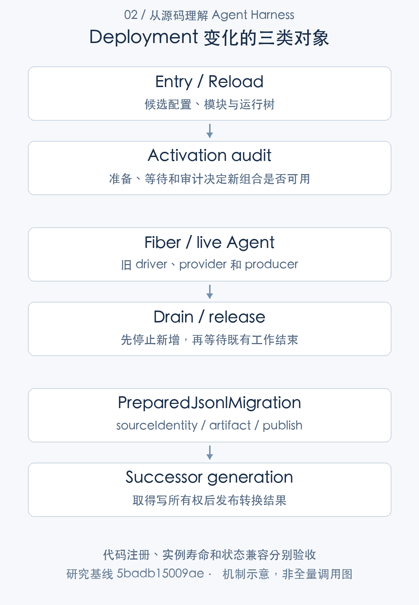
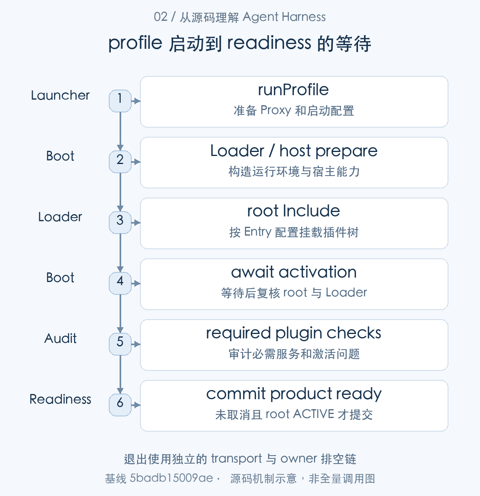
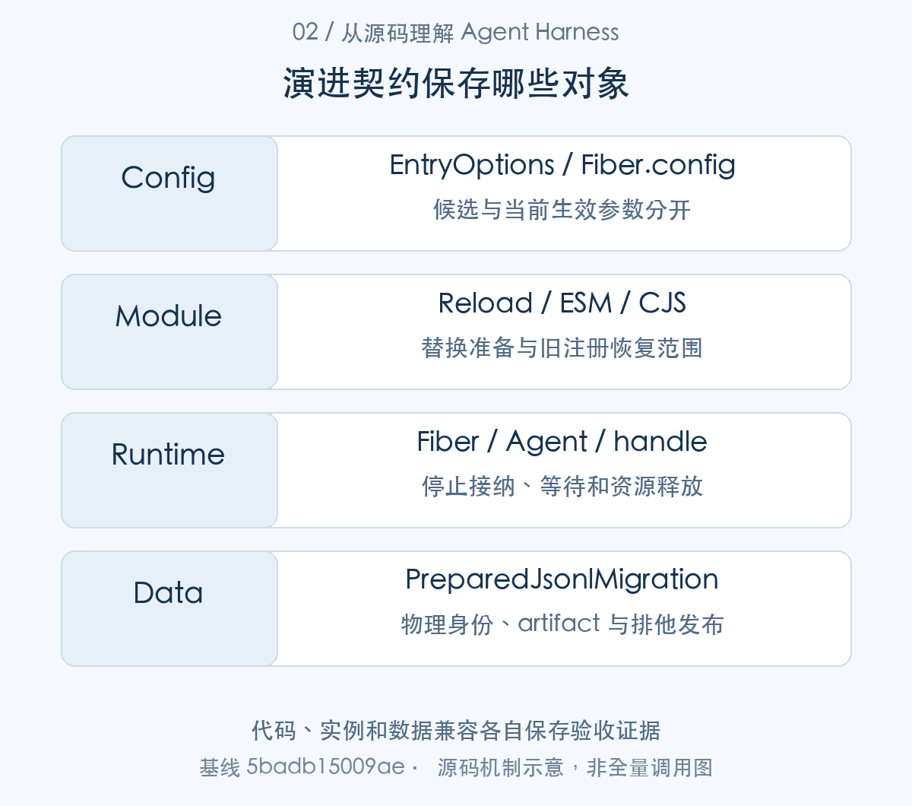
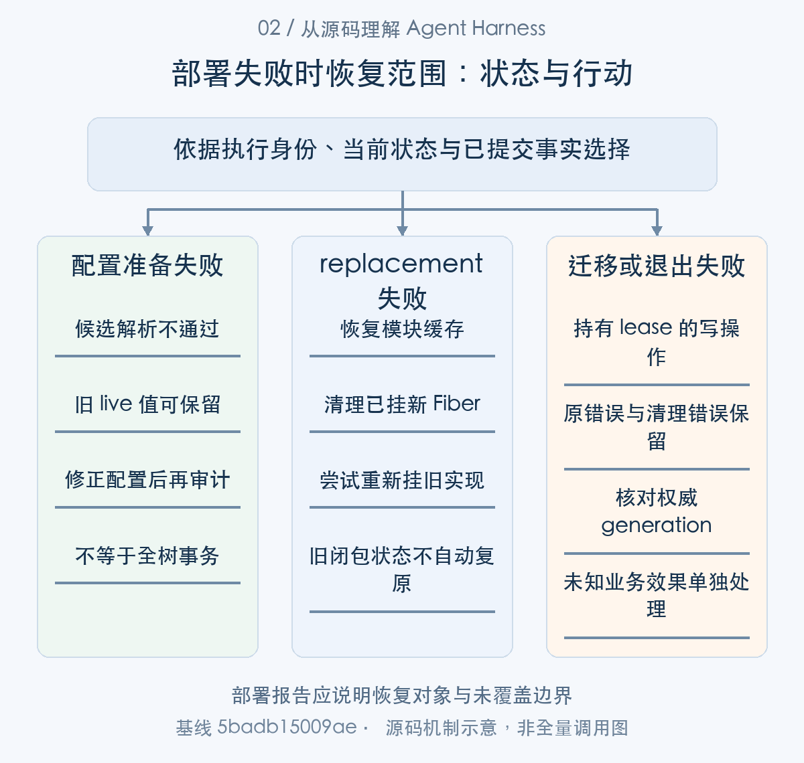

# Agent 系统如何持续演进：部署、兼容与状态迁移

> 从源码理解 Agent Harness · 第 02 篇 · 部署、兼容性与版本演进

升级一个 Agent 系统，远不止换一份程序。已有会话可能还在执行，旧日志需要读取，工具副作用不能撤销，临时产物也可能随进程退出消失。若把“支持热更新”当作完整升级策略，真正的问题通常会在存量任务中暴露。

DeepSeek Harness 的部署路径包括 profile 组合、插件激活审计、配置刷新、模块 HMR、会话格式迁移和有序退出。本文将它们放到一次版本演进中分析，说明**代码可替换、实例可释放与数据可兼容，是三项独立责任**。


版本演进可以按候选、实例和数据三条链理解。runProfile()/boot() 组合插件并审计 readiness；配置 reconciliation 与模块 HMR 各自准备候选、等待旧 Fiber、检查新激活；JSONL catalog 解码历史格式，write open 在取得所有权后发布 successor。退出再沿 driver、scope、storage 与 transport 排空。本文从受支持入口开始，逐条说明这些变化在哪里交接。

## 从受支持入口验证实际组合

CLI 经 runCli、runProfile、boot 解析运行环境与 profile，创建 Context，让 Loader 激活插件树，再检查必需项和 readiness。包能导入、fixture 能手工挂 Context，并不证明这个组合可以作为完整产品启动。[CLI 入口](https://github.com/deepseek-ai/deepseek-harness/blob/5badb15009ae1756c3afe0ae0cef1faafc290ccc/apps/cli/src/bin.ts#L26-L73) [profile 启动和退出](https://github.com/deepseek-ai/deepseek-harness/blob/5badb15009ae1756c3afe0ae0cef1faafc290ccc/apps/cli/src/profile-boot.ts#L244-L326) [应用 boot](https://github.com/deepseek-ai/deepseek-harness/blob/5badb15009ae1756c3afe0ae0cef1faafc290ccc/packages/boot/app-boot/src/index.ts#L973-L1036)

模型、持久化、工具 provider、审批和 UI 能力都由组合决定。缺一个必需依赖，单个包的测试仍可能全部通过，应用却无法提供对应流程。正式部署验证应使用相应 profile 和实际构建产物，而不是临时演示入口代替。

项目处于 developer preview，公共 API 尚未稳定。包号 0.2.1-alpha.1 和 TypeScript 可编译，不足以推导长期 ABI 或跨版本插件兼容承诺。[预稳定版本说明](https://github.com/deepseek-ai/deepseek-harness/blob/5badb15009ae1756c3afe0ae0cef1faafc290ccc/README.md#L11-L13)




图1：代码注册、实例寿命和状态兼容分别验收。先按这张主线图建立对象地图，再结合下面的 caller、数据和返回路径展开。

### 第一步：启动准备、插件激活和 readiness 分开验收

runProfile() 准备 Proxy 和 profile，boot() 建立 Loader 与 root Include，等待激活后审计；readiness 只在 root、Loader 和取消条件仍有效时提交。


```typescript
export async function runProfile(options: RunProfileOptions): Promise<{ ctx: Context; shutdown: ProcessShutdown }> {
  // Before the first plugin mounts and before anything can issue a request: Node's fetch ignores the
  // proxy environment on its own, so every profile would otherwise connect directly. Resolving from
  // the launcher's snapshot — not `process.env` — is what lets a proxy declared in a `.env` layer
  // work, which the NODE_USE_ENV_PROXY flag cannot do because Node samples the environment at start.
  const disposeProxy = await installProxyFromEnvironment(
    options.environment,
    (message) => { process.stderr.write(`${NAME}: ${message}\n`) },
  )

  const app: { current?: Context } = {}
  let disposal: Promise<void> | undefined
  const dispose = (): Promise<void> => disposal ??= (async () => {
    const failures: unknown[] = []
    for (const release of [() => app.current?.fiber.dispose(), disposeProxy]) {
      try { await release() } catch (error) { failures.push(error) }
    }
    if (failures.length === 1) throw failures[0]
    if (failures.length > 1) throw new AggregateError(failures, 'dsh: profile cleanup failed')
  })()
```

[源码：`apps/cli/src/profile-boot.ts:244–263`](https://github.com/deepseek-ai/deepseek-harness/blob/5badb15009ae1756c3afe0ae0cef1faafc290ccc/apps/cli/src/profile-boot.ts#L244-L263)。

Proxy 环境在插件挂载前安装；dispose memoized，先 root Fiber 再 Proxy，并汇总释放错误。包可以 import 不等于网络环境、配置与清理可作为完整产品运行。

```typescript
try {
  ctx.baseUrl = pathToFileURL(dirname(absoluteConfigPath)).href + '/'
  ctx.provide('dshHomePath', dshHomePath)
  // Fiber.update() discards the restart promise. Observe it before the
  // waterfall returns; activation audits still report the failed fiber.
  ctx.on('internal/update', (_config, _noSave, next: () => unknown) => {
    void Promise.resolve(next()).catch((error: unknown) => { ctx.logger.error(error) })
  }, { global: true, prepend: true })
  await ctx.plugin(Loader)
  await prepare?.(ctx)
  stage = 'plugin tree failed to load'
  await mountRootInclude(ctx, absoluteConfigPath, patches, bareModuleBaseUrl, binName)
  // A surface can finish and dispose the whole tree while startup is still
  // in flight, before the last entry settles. The Loader service goes with
  // it, and the activation audit describes a live tree — reading `ctx.loader`
  // past this point would throw a TypeError over an app that exited exactly
  // as asked. Re-check after settlement before auditing the tree.
  await ctx.get('loader')?.await()
  if (ctx.get('loader') === undefined) return ctx
  await auditStartupEntries(ctx, binName)
  return ctx
```

[源码：`packages/boot/app-boot/src/index.ts:994–1014`](https://github.com/deepseek-ai/deepseek-harness/blob/5badb15009ae1756c3afe0ae0cef1faafc290ccc/packages/boot/app-boot/src/index.ts#L994-L1014)。

boot 创建 Loader，执行 host prepare，挂 root Include，等待 Loader 后复查仍存在才审计。启动期间应用可能已经被要求退出，不能在 await 后盲读失效服务。

```typescript
  app.current = ctx
  if (!signalShutdown.signal.aborted
    && ctx.fiber.state === FiberState.ACTIVE
    && ctx.get('loader') !== undefined) {
    appReady.commit()
  }
  return { ctx, shutdown }
} catch (error) {
  try { await dispose() } catch (cleanupError) {
    throw new AggregateError([error, cleanupError], 'dsh: profile startup and cleanup failed')
  }
  throw error
}
```

[源码：`apps/cli/src/profile-boot.ts:313–325`](https://github.com/deepseek-ai/deepseek-harness/blob/5badb15009ae1756c3afe0ae0cef1faafc290ccc/apps/cli/src/profile-boot.ts#L313-L325)。

只在未取消、root ACTIVE 且 Loader 存在时 commit readiness；startup error 后也清理。部署 smoke 应通过受支持入口检验必需服务和 readiness，而不是手工 Context 成功就宣称产品启动成功。


## 配置刷新先准备，再等待并审计

启动建立了当前 live tree，配置变化随后进入 reconciliation。下面保留 Entry 与旧 Fiber 的关系，追踪候选准备、更新、等待和审计。

Entry 能禁用、移除、激活和重挂插件。普通有效配置变化可能重建 Fiber，仅 volatile 字段变化可保留实例；非法候选警告而不提交 live 值。[Entry 配置更新](https://github.com/deepseek-ai/deepseek-harness/blob/5badb15009ae1756c3afe0ae0cef1faafc290ccc/vendor/loader/src/config/entry.ts#L118-L237)

profile reconciliation 的代码说明，更新完成不只看方法调用是否返回。它保存旧失败和旧 Fiber，准备 patches，await 更新和依赖，再审计新增激活问题。

```typescript
export async function reconcileProfilePatches(
  ctx: Context, patches: PatchOptions[], binName: string, requiredIds: readonly string[] = [],
): Promise<string[]> {
  const entry = bootstrapIncludes.get(ctx)
  if (entry === undefined) throw new Error(`${binName}: profile reload requires the root Include entry`)
  const previousFailures = (await inactiveEntries(ctx)).map(failure => ({
    ...failure, diagnostic: inactiveDiagnostic(failure), fiber: failure.entry.fiber, options: JSON.stringify(failure.entry.options),
  }))
  // Removed entries leave the Loader store before their async disposers finish.
  const previousFibers = [...ctx.loader.entries()].flatMap(row => row.fiber === undefined ? [] : [{
    fiber: row.fiber, failed: row.fiber.state === FIBER_FAILED || row.fiber.state === FIBER_DISPOSED,
  }])
  const { patches: _previous, ...includeConfig } = entry.options.config as Include.Config
  // The recomposition judges the rows the launch judged, resolved from the file this Include read.
  const parentURL = new URL('.', new URL(includeConfig.path, entry.parent.tree.ctx.baseUrl)).href
  const prepared = prepareProfilePatches(ctx, patches, parentURL, binName)
  await entry.update({ config: { ...includeConfig, patches: prepared } })
  const results = await Promise.allSettled(previousFibers.map(({ fiber }) => fiber.await()))
  await ctx.loader.await()
  const failures = await inactiveEntries(ctx)
  const introduced = failures.filter(failure => requiredIds.includes(failure.entry.options.id) || !previousFailures.some(previous =>
    previous.entry === failure.entry && previous.fiber === failure.entry.fiber
    && previous.options === JSON.stringify(failure.entry.options) && previous.diagnostic === inactiveDiagnostic(failure)))
  if (introduced.length > 0) throw new Error(activationDiagnostic(binName, introduced).trimEnd())
  for (const [index, result] of results.entries()) {
    if (result.status === 'rejected' && !previousFibers[index]?.failed) throw result.reason
  }
  ctx.emit('app-boot/config-reload')
  return failures.map(inactiveDiagnostic)
```

[对应源码](https://github.com/deepseek-ai/deepseek-harness/blob/5badb15009ae1756c3afe0ae0cef1faafc290ccc/packages/boot/app-boot/src/index.ts#L274-L302)。以上为原文片段，仅统一缩进，需结合完整实现阅读。

旧 Entry 可能已经从 Loader store 移除，异步 disposer 却还没有结束，因此需要同时等待旧 Fiber。新配置激活完后还要检查必需项与新增失败，成功才通知 config-reload。

但这不是全局事务。解析准备失败可以保护旧配置，应用阶段某个插件失败时，成功的兄弟插件仍可能生效。部署系统应检查最终组合与错误审计，而不是把“有 reload API”写成“失败时全树自动回滚”。[配置重组与激活审计](https://github.com/deepseek-ai/deepseek-harness/blob/5badb15009ae1756c3afe0ae0cef1faafc290ccc/packages/boot/app-boot/src/index.ts#L274-L302)



图2：退出使用独立的 transport 与 owner 排空链。从 caller 的交接对象追到 consumer，具体分支结合正文源码阅读。

### 第二步：reload 包含旧资源等待与新树审核

运行后配置变更进入 reconcileProfilePatches()：prepare patches，再调用 Entry.update()，分别等待旧 Fiber 和当前 Loader，最后检查 introduced failures。volatile 判断属于 update() 内部支线。

reconciliation 更新的是明确的 EntryOptions：

```typescript
export interface EntryOptions {
  /** Stable id inside the containing entry tree. */
  id: string
  /** Module specifier imported by the entry tree. */
  name: string
  /** Config passed to the plugin. */
  config?: any
  /** Marks this entry as a nested group. */
  group?: boolean | null
  /** Prevents this entry and descendants from running. */
  disabled?: boolean | null
  /** Required services or service intercept config for this entry. */
  inject?: Inject | null
}
```

[源码：`vendor/loader/src/config/entry.ts:10–23`](https://github.com/deepseek-ai/deepseek-harness/blob/5badb15009ae1756c3afe0ae0cef1faafc290ccc/vendor/loader/src/config/entry.ts#L10-L23)。

|核心字段|保存的信息|使用位置|
|---|---|---|
|`id` / `name`|配置树节点与模块身份|patch 和 import|
|`config` / `inject`|候选参数和依赖|update、解析与激活|
|`disabled` / `group`|运行选择和嵌套组合|最终树审计|

字段已写入候选不表示 Fiber 已成功激活。管理面应关联这份 Entry 身份、当前实例与激活错误。


原文 reconcileProfilePatches 先保存旧失败与旧 Fiber 引用，再 prepare patches，entry.update 后分别等 previousFibers 和 Loader，比较 introduced failures。这条链保护准备失败不触动 live tree，却没有提供应用阶段全树原子回滚。

```typescript
  // step 3: check if options are changed
  if (this.fiber?.uid) {
    const changes = Object.keys({ ...this.options, ...legacy })
      .filter(key => !deepEqual(this.options[key], legacy[key], key === 'config'))
    // Only an active fiber in an unchanged context takes volatile-only config changes without a remount.
    const volatileOnly = changes.length === 1 && changes[0] === 'config'
      && this.fiber.state === FiberState.ACTIVE && Object.getPrototypeOf(this.ctx) === this.parent.ctx
      && equalExceptVolatile(legacy.config, this.options.config, this.fiber.runtime?.Config)
    if (volatileOnly) this.fiber._config = this.options.config
    const pending = volatileOnly && this._commitVolatile() ? [] : changes
    if (!pending.length && !force) return
    this.context.emit('loader/partial-dispose', this, legacy, true)
    this._patchContext(pending)
  } else {
    await this.init()
  }
}
```

[源码：`vendor/loader/src/config/entry.ts:141–157`](https://github.com/deepseek-ai/deepseek-harness/blob/5badb15009ae1756c3afe0ae0cef1faafc290ccc/vendor/loader/src/config/entry.ts#L141-L157)。

volatile-only 需 ACTIVE 与上下文未变；否则走普通重挂。配置更新是否重建实例取决于 schema 和当前状态，不是所有字段都无损生效。

```typescript
private _commitVolatile(): boolean {
  const fiber = this.fiber!
  const refs = volatileEntries(fiber.config)
  if (!refs.length) return true
  const raw = this.options.config
  let candidate: unknown
  try {
    candidate = resolveConfig(fiber.runtime!, fiber.ctx.waterfall(fiber, 'internal/config', raw, () => raw))
  } catch (error) {
    this.ctx.logger.warn('volatile config update failed for %C', this.options.id)
    this.ctx.logger.warn(error)
    return true
  }
  if (!deepEqual(fiber.config, candidate, true)) {
    this.ctx.logger.debug('ordinary config values of %C changed with its volatile values; applying the ordinary update', this.options.id)
    return false
  }
  const paths = refs.flatMap(({ path, ref }) => {
    const source = path.reduce<unknown>((value, key) => Reflect.get(value as object, key), candidate) as Volatile<unknown>
    if (deepEqual(ref.get(), source.get(), true)) return []
    updateVolatile(ref, source)
    return [path]
```

[源码：`vendor/loader/src/config/entry.ts:164–185`](https://github.com/deepseek-ai/deepseek-harness/blob/5badb15009ae1756c3afe0ae0cef1faafc290ccc/vendor/loader/src/config/entry.ts#L164-L185)。

候选校验失败保留 live refs、记录告警；raw 候选仍在，下一激活可能再次解析。管理面应分别呈现候选配置、生效配置与激活错误，避免把文件写入成功等同部署成功。

若兄弟插件部分成功，部署系统应按最终树审核决定流量准入，不能依赖 reload 抛错就假设所有旧实例仍完整工作。

## 模块 HMR 解决的是另一类变化

配置入口已经说明，模块文件变化则进入 HMR 的独立 consumer。它消费缓存与 runtime，替换的是代码注册，不能与普通字段更新混为一次事务。

模块 HMR 依赖 Loader internal 和 expose-internals，通过串行队列防止嵌套 reload，分析缓存决定局部替换或退出。局部流程备份 ESM／CJS 缓存，导入 replacement，卸载旧 runtime 并等待旧 Fiber，再注册新实现。[HMR 前提与控制](https://github.com/deepseek-ai/deepseek-harness/blob/5badb15009ae1756c3afe0ae0cef1faafc290ccc/packages/boot/hmr/src/index.ts#L262-L340) [partialReload 流程](https://github.com/deepseek-ai/deepseek-harness/blob/5badb15009ae1756c3afe0ae0cef1faafc290ccc/packages/boot/hmr/src/index.ts#L525-L732)

导入失败可以恢复缓存，激活失败尝试恢复旧插件。恢复范围是代码和配置注册，不是旧对象的任意业务状态，更不是工具已经发生的外部写入。base 默认主要监听配置，不代表所有产品 profile 都开箱提供源码热替换。[base 的运行配置](https://github.com/deepseek-ai/deepseek-harness/blob/5badb15009ae1756c3afe0ae0cef1faafc290ccc/packages/bundle/base/cordis.patch.yml#L20-L40)

例如一个模型请求已经准备了 adapter registration，热替换不能假定它会自动换到新实现；安全退出也必须等它结算。一个有持久进程或连接的 provider，更需要停止接纳、排空，再决定如何重挂和恢复状态。

### 第三步：代码替换要准备新模块并排空旧 Fiber

模块 HMR 是另一入口。partialReload() 先备份缓存并 import replacement，随后卸载旧 runtime、等旧 Fiber，再激活新实现；失败从对应阶段进入恢复路径。

模块替换准备阶段保留 Reload：

```typescript
export interface Reload {
  filename: string
  /** Original namespaces and URLs of all entry modules participating in this runtime replacement. */
  modules: ReloadModules
  runtime?: Plugin.Runtime | undefined
}
```

[源码：`packages/boot/hmr/src/index.ts:82–87`](https://github.com/deepseek-ai/deepseek-harness/blob/5badb15009ae1756c3afe0ae0cef1faafc290ccc/packages/boot/hmr/src/index.ts#L82-L87)。

|核心字段|保存的信息|使用位置|
|---|---|---|
|`filename` / `modules`|模块位置、namespace 与 URL 集合|缓存和 replacement 处理|
|`runtime`|可选旧运行实例|卸载与恢复原注册|

它保存替换所需代码身份，业务对象和外部效果不在这份结构中。HMR 恢复范围应沿这些字段解释。


```typescript
/**
 * Clear module caches for all accepted files before re-importing.
 *
 * We need to clear both:
 * 1. ESM loadCache — managed by Node's internal ModuleLoader
 * 2. CJS Module._cache — for CJS modules that were imported via import()
 *
 * In Node 24, CJS modules loaded via import() appear in both caches.
 * If we only clear loadCache, the CJS cache may serve stale modules.
 *
 * We use Map.prototype methods directly on loadCache because:
 * - In Node 22/23, loadCache is a plain Map<url, ModuleJob>
 * - In Node 24, loadCache is a LoadCache extends Map<url, { [type]: ModuleJob }>
 *   where .delete() only sets the type slot to undefined (doesn't remove the entry)
 * Using Map.prototype.delete ensures complete removal in both versions.
 */
const esmBackup = new Map<string, unknown>()
const cjsBackup = new Map<string, NodeJS.Module>()
const require = createRequire(import.meta.url)
for (const filename of this.accepted) {
  // Backup and clear ESM loadCache
  const job: unknown = Map.prototype.get.call(this.internal.loadCache, filename)
  esmBackup.set(filename, job)
  Map.prototype.delete.call(this.internal.loadCache, filename)
```

[源码：`packages/boot/hmr/src/index.ts:587–610`](https://github.com/deepseek-ai/deepseek-harness/blob/5badb15009ae1756c3afe0ae0cef1faafc290ccc/packages/boot/hmr/src/index.ts#L587-L610)。

ESM 与 CJS 缓存都要备份和清理，部分 Node 版本内部缓存行为不同。该机制依赖 Node internal，不应据存在 HMR 包就承诺所有运行版本有同样支持。

```typescript
const attempts: ReloadAttempt[] = []
try {
  for (const generation of generations) {
    const moduleNamespace: unknown = await this.ctx.loader.import(generation.filename, this.getOuterStack)
    const replacement = this.ctx.loader.unwrapExports(moduleNamespace) as Plugin
    const replacements = await generation.modules.importRemaining(this.ctx.loader, this.getOuterStack, {
      filename: generation.filename, moduleNamespace, plugin: replacement,
    })
    attempts.push({ ...generation, replacement, replacements, activated: [] })
  }
} catch (e) {
  handleError(this.ctx, e)
  rollback()
  throw e
}
```

[源码：`packages/boot/hmr/src/index.ts:645–659`](https://github.com/deepseek-ai/deepseek-harness/blob/5badb15009ae1756c3afe0ae0cef1faafc290ccc/packages/boot/hmr/src/index.ts#L645-L659)。

先导入各 replacement，失败则 rollback 缓存并抛错。这个准备阶段尚未拆旧运行树，有明确保护范围。

```typescript
const removed = new Set<Plugin>()
try {
  for (const { previous: plugin, replacement, filename, runtime, fibers, replacements, activated } of attempts) {
    if (!runtime) continue
    const path = relative(this.baseDir, fileURLToPath(filename))

    removed.add(plugin)
    try {
      this.ctx.registry.delete(plugin)
      await Promise.all(fibers.map(({ fiber }) => fiber.await()))
    } catch (err) {
      this.ctx.logger.warn('failed to dispose plugin at %C', path)
      this.ctx.logger.warn(err)
    }

    try {
      await reload(replacement, fibers, replacements, activated)
      this.ctx.logger.info('reload plugin at %C', path)
    } catch (err) {
      this.ctx.logger.warn('failed to reload plugin at %C', path)
      this.ctx.logger.warn(err)
      throw err
    }
```

[源码：`packages/boot/hmr/src/index.ts:678–700`](https://github.com/deepseek-ai/deepseek-harness/blob/5badb15009ae1756c3afe0ae0cef1faafc290ccc/packages/boot/hmr/src/index.ts#L678-L700)。

删除旧 registry 并等待旧 fibers，再激活 replacement；卸载失败记录警告，新激活失败继续进入恢复。这并非旧闭包内存状态的复制，业务状态必须放在可恢复的服务或存储里。

```typescript
} catch (error) {
  // Restore caches and re-register old plugins after a replacement failure.
  rollback()
  for (const { previous: plugin, fibers, activated } of attempts) {
    if (!removed.has(plugin)) continue
    try {
      for (const { runtime } of activated) {
        if (runtime && this.ctx.registry.get(runtime.callback) === runtime) {
          const replacementFibers = [...runtime.fibers]
          this.ctx.registry.delete(runtime.callback)
          // Failed startup errors remain on fibers after their teardown finishes.
          await Promise.allSettled(replacementFibers.map(fiber => fiber.await()))
        }
      }
      await reload(plugin, fibers)
    } catch (err) {
      this.ctx.logger.warn(err)
    }
  }
  throw error
```

[源码：`packages/boot/hmr/src/index.ts:702–721`](https://github.com/deepseek-ai/deepseek-harness/blob/5badb15009ae1756c3afe0ae0cef1faafc290ccc/packages/boot/hmr/src/index.ts#L702-L721)。

失败时恢复缓存，撤销已激活新实例，等待结算，尝试重新挂旧插件。恢复的仍是代码和配置注册；期间已写数据库、已发送网络请求的效果不会因 rollback 自动撤回。生产发布不能把它当跨系统回滚方案。


## 会话格式兼容由静态 catalog 承担

代码替换之后还有持久历史兼容问题。下面切到存储 reader 使用的静态 catalog，物理 codec 与领域事件能力在这里分层判断。

本基线当前 writer 格式为 4，历史 codec 和相邻迁移固定导入 catalog。是否挂载某个用户插件，不决定旧物理格式是否存在解码器。

```typescript
export const sessionFormatCatalogOptions: SessionFormatCatalogOptions = {
  currentVersion: 4,
  codecs: [
    releasedV0SessionFormatCodec,
    releasedV1SessionFormatCodec,
    releasedV2SessionFormatCodec,
    releasedV3SessionFormatCodec,
    releasedV4SessionFormatCodec,
  ],
  currentEncoder: releasedV4SessionFormatCodec,
  migrations: [
    sessionFormatV0ToV1,
    sessionFormatV1ToV2,
    sessionFormatV2ToV3,
    sessionFormatV3ToV4,
  ],
  restoreCurrent(artifact) {
    const restored = restoreReleasedV4Artifact(artifact, KNOWN_SESSION_EVENT_TYPES)
    validateInstalledCurrentSessionArtifact(restored)
    return restored
  },
  restoreTransformedCurrent(artifact) {
    return restoreReleasedV4Artifact(artifact, KNOWN_SESSION_EVENT_TYPES)
  },
  restoreCurrentHeader(header) {
    assertReleasedV4Header(header)
    validateInstalledCurrentSessionHeader(header)
    return header
  },
}

/** Physical codec dispatch and complete adjacent chain, independent of mounted plugins. */
export const sessionFormatCatalog = createSessionFormatCatalog(sessionFormatCatalogOptions)
```

[对应源码](https://github.com/deepseek-ai/deepseek-harness/blob/5badb15009ae1756c3afe0ae0cef1faafc290ccc/packages/session/session-format-catalog/src/generated.ts#L16-L48)。以上为原文片段，仅统一缩进，需结合完整实现阅读。

这份表同时规定 currentVersion、currentEncoder、迁移链和当前 artifact 恢复校验。物理格式能解码，与当前安装理解全部事件和载荷，是不同检查。未知事件或数据类型不能因为 JSON 可解析就被无声接受。

这也是保存状态的插件为什么参与升级义务：若它改变模型可见输入、Session 事件或读取类型，需要考虑旧数据和所有 consumer。API 变更只让新代码编译，不会自动迁移已有日志。[会话 header 与格式版本](https://github.com/deepseek-ai/deepseek-harness/blob/5badb15009ae1756c3afe0ae0cef1faafc290ccc/packages/core/session/src/types.ts#L79-L137) [格式基线和发布状态](https://github.com/deepseek-ai/deepseek-harness/blob/5badb15009ae1756c3afe0ae0cef1faafc290ccc/docs/session-format-status.md#L18-L51)



图3：代码、实例和数据兼容各自保存验收证据。表中对象并列展示用途与寿命，层次之间以源码所示身份关联。

### 第四步：格式能力不能依赖运行插件恰好挂载

现在转到历史数据 reader：静态 catalog 固定 codec、migration 与当前 writer 版本。restoreCurrent 等方法对安装能力再作检查，让物理解码结果进入当前领域解释。


原文 generated catalog 明确 currentVersion=4，列出 v0—v4 codec 和相邻 migration。静态组合让读取旧 artifact 与当前 profile 的可选插件分离，但旧格式可读取不代表新事件能被旧程序解释。

```typescript
restoreCurrent(artifact) {
  const restored = restoreReleasedV4Artifact(artifact, KNOWN_SESSION_EVENT_TYPES)
  validateInstalledCurrentSessionArtifact(restored)
  return restored
},
restoreTransformedCurrent(artifact) {
  return restoreReleasedV4Artifact(artifact, KNOWN_SESSION_EVENT_TYPES)
},
restoreCurrentHeader(header) {
  assertReleasedV4Header(header)
  validateInstalledCurrentSessionHeader(header)
  return header
},
```

[源码：`packages/session/session-format-catalog/src/generated.ts:32–44`](https://github.com/deepseek-ai/deepseek-harness/blob/5badb15009ae1756c3afe0ae0cef1faafc290ccc/packages/session/session-format-catalog/src/generated.ts#L32-L44)。

restoreCurrent 包含 installed current artifact 验证，restoreTransformedCurrent 与 header restore 有各自责任。迁移链先处理物理格式，安装能力再判断领域数据；不能用“JSON 能 parse”替代完整协议兼容。

扩展改事件 schema 或模型可见 projection 时，应一起更新 reader、migrator、fixtures 与格式发布说明。只修当前 TypeScript consumer 会把风险留在已有持久日志里。

## 新 generation 保留历史，不提供任意降级保证

catalog 已定义转换路径，write open 接下来准备并发布新 generation。这条发布链还消费第五篇说明的 lease，只有合法写方才能改变当前存储代。

resolver 选择最高合法 canonical generation，拒绝冲突布局。迁移先准备和校验，写操作取得所有权后发布新的 successor；普通读取不会仅为了升级覆写前代。当前 generation 仍可以追加新事实。[generation 选择](https://github.com/deepseek-ai/deepseek-harness/blob/5badb15009ae1756c3afe0ae0cef1faafc290ccc/packages/session/session-persistence-jsonl/src/index.ts#L1446-L1482) [写 open 与发布路径](https://github.com/deepseek-ai/deepseek-harness/blob/5badb15009ae1756c3afe0ae0cef1faafc290ccc/packages/session/session-persistence-jsonl/src/index.ts#L314-L435)

“保留旧文件”不等于旧程序可以随时接管。新版本已经追加新事件、外部工具已经产生变化，降级后的代码未必理解，也不能把旧 generation 当作最新状态。前代用于历史兼容与追溯，不能直接宣传为任意失败的业务回滚点。

例如升级后模型已经修改文件，即使恢复旧 runtime，文件修改仍存在。迁移和业务副作用属于不同系统，只有明确的版本与补偿协议才能让它们共同支持恢复策略。

### 第五步：写迁移在取得所有权后发布 successor

需要写升级后的 artifact 时，resolver 先识别合法 generation；open(write) 取得 claim 和 lease，在锁内准备权威迁移，再 publish successor 并 adopt handle。

迁移准备结果通过 PreparedJsonlMigration 交给合法写方：

```typescript
export interface PreparedJsonlMigration {
  readonly sourceIdentity: JsonlPhysicalIdentity
  readonly artifact: SessionFormatArtifact
  /** Encode, verify, and exclusively publish once; every call shares the same success or failure. */
  publish(): Promise<JsonlPhysicalIdentity>
}
```

[源码：`packages/session/session-persistence-jsonl/src/generation.ts:122–127`](https://github.com/deepseek-ai/deepseek-harness/blob/5badb15009ae1756c3afe0ae0cef1faafc290ccc/packages/session/session-persistence-jsonl/src/generation.ts#L122-L127)。

|核心字段|保存的信息|使用位置|
|---|---|---|
|`sourceIdentity`|读取的物理文件身份|稳定性与发布验证|
|`artifact`|已转换的 Session artifact|当前编码及检查|
|`publish()`|共享一次成功或失败的发布|successor generation|

prepare 与 publish 分开，编码、校验和排他发布属于后者。write open 在所有权内使用权威材料，失败仍释放 claim 和 lease。


```typescript
const generations: Array<{ readonly path: string; readonly version: number }> = []
const opposite: string[] = []
for (const entry of entries) {
  const version = parseGenerationLogFilename(entry.name, this.compression)
  if (version !== undefined) {
    generations.push({ path: join(dir, entry.name), version })
    continue
  }
  if (parseGenerationLogFilename(entry.name, this.oppositeCompression()) !== undefined) {
    opposite.push(join(dir, entry.name))
  }
}
if (opposite.length > 0) throw this.encodingMismatch(opposite[0] as string)
const latest = generations.sort((left, right) => right.version - left.version)[0]
if (latest === undefined) return undefined
return {
  sourcePath: latest.path,
  sourceVersion: latest.version,
  currentPath: join(
    dir,
    generationLogFilename(sessionFormatCatalog.currentVersion, this.compression),
  ),
}
```

[源码：`packages/session/session-persistence-jsonl/src/index.ts:1460–1482`](https://github.com/deepseek-ai/deepseek-harness/blob/5badb15009ae1756c3afe0ae0cef1faafc290ccc/packages/session/session-persistence-jsonl/src/index.ts#L1460-L1482)。

resolver 识别 canonical generation，拒绝相反 compression 布局，选择数值最高版本，同时构造当前版本 path。选择最新 generation 是格式协议，不是按文件 mtime 猜测。

```typescript
this.tracker.claimWrite(id)
let lease: SessionWriteLease | undefined
try {
  const resolved = await this.findLog(id, options?.signal)
  if (resolved === undefined) throw new SessionPersistenceNotFoundError(id)
  lease = await this.acquireLease(id, undefined, dirname(resolved.currentPath))
  const prepared = await this.requireStoredLog(id, options?.signal)
  options?.signal?.throwIfAborted()
  let stored: CurrentStoredLog
  if (prepared.status === 'prepared') {
    stored = await this.publishStoredMigration(id, prepared)
  } else {
    stored = prepared
  }
  options?.signal?.throwIfAborted()
  return this.tracker.adopt(new JsonlSessionHandle(this, id, stored.meta, 'write', {
    cursor: stored.events.length,
    materialized: true,
    tornTruncateTo: stored.tornTruncateTo,
    recoveredTail: stored.recoveredTail,
    inheritedEventCount: stored.inheritedEventCount,
    primed: stored,
  }, lease))
```

[源码：`packages/session/session-persistence-jsonl/src/index.ts:377–399`](https://github.com/deepseek-ai/deepseek-harness/blob/5badb15009ae1756c3afe0ae0cef1faafc290ccc/packages/session/session-persistence-jsonl/src/index.ts#L377-L399)。

先 in-process claim，取得 kernel lease，再读取和发布 prepared migration，最后 adopt write handle。普通观察读取不能无权发布新代；旧读出的准备结果也不能取代获得锁后的权威状态。

```typescript
} catch (error) {
  // Free the in-process claim no matter how the kernel-lock release
  // fares, and keep the original diagnostic: a release failure joins it
  // instead of replacing it.
  /* v8 ignore next -- typed backends and fs reject with Error */
  const failure = error instanceof Error ? error : new Error(String(error))
  let releaseFailure: Error | undefined
  try {
    await lease?.release()
  } catch (raw: unknown) {
    /* v8 ignore next -- lock releases reject with Error */
    releaseFailure = raw instanceof Error ? raw : new Error(String(raw))
  }
  this.tracker.releaseClaim(id)
  if (releaseFailure !== undefined) {
    throw new AggregateError([failure, releaseFailure], `session "${id}": write open failed and its lock release failed`)
  }
  throw failure
```

[源码：`packages/session/session-persistence-jsonl/src/index.ts:400–417`](https://github.com/deepseek-ai/deepseek-harness/blob/5badb15009ae1756c3afe0ae0cef1faafc290ccc/packages/session/session-persistence-jsonl/src/index.ts#L400-L417)。

失败仍释放 lease 与 claim，原错误与释放错误共同保留。持有锁不意味着迁移必定成功，错误证据不应被 cleanup error 覆盖。

保留前代文件有助审计和恢复，但降级程序是否支持新日志、新事件与新 consumer 必须单独验证。滚回代码包与安全降级状态不是同一件事。


## 文档、类型与实现需要一起核对

已有研究发现官方 quick-reference 的 Persistence.export 与实际接口不一致，导出由独立 Host ZIP 路由实现；fork 示例的 meta.seedLength 也与当前 meta.isSeeded 和 inheritedEventCount 不同。[官方接口概述](https://github.com/deepseek-ai/deepseek-harness/blob/5badb15009ae1756c3afe0ae0cef1faafc290ccc/docs/architecture.md#L159-L164) [实际会话导出](https://github.com/deepseek-ai/deepseek-harness/blob/5badb15009ae1756c3afe0ae0cef1faafc290ccc/packages/session-query/session-log-export/src/index.ts#L78-L169) [当前创建选项](https://github.com/deepseek-ai/deepseek-harness/blob/5badb15009ae1756c3afe0ae0cef1faafc290ccc/packages/core/agent/src/index.ts#L64-L118)

升级时只移动源码行号，无法判断原结论是否仍然成立。相同方法文本也可能因为 caller、默认配置、投影或依赖变化改变行为。因此版本研究应沿定义、provider、consumer、配置、执行和清理重新核对，而不是只检查文件是否还在。

测试也应跟随受影响义务选择：入口变化检查真实启动，状态类型变化检查旧日志，provider 生命周期变化检查取消与释放。旧提交的成功日志不能作为新提交运行通过的证据。

### 第六步：从公共声明追到真正执行入口

兼容研究还要回到公共声明的 consumer。以 export 为例，实际入口在独立 command/Host route，接口与调用方共同决定能力，旧文档名称不能代替执行证据。


```typescript
export function apply(ctx: Context, config: Config = {}): void {
  ctx.effect(() => ctx.commands.register({
    definitionId: brandString<CommandDefinitionId>('@deepseek-ai/dsh-session-log-export'),
    name: 'export',
    description: 'Download this Session log as a ZIP archive',
    handler: invocation => Promise.resolve(invocation.rawInput.trim() === ''
      ? REQUESTED
      : { kind: 'error', text: 'The Web /export command does not accept a path.' }),
  }), 'session-log-download: command')
  connectionOf(ctx).fetch.register({
    path: SESSION_LOG_EXPORT_PATH,
    methods: ['GET', 'HEAD'],
    requestBody: 'buffered',
    fetch: async (request) => {
      const response = await sessionLogExportResponse(
        ctx,
        request,
        config.compressionLevel ?? DEFAULT_SESSION_LOG_COMPRESSION_LEVEL,
      )
      if (request.method === 'GET') return response
      await response.body?.cancel()
      return new Response(null, { status: response.status, headers: response.headers })
    },
  })
```

[源码：`packages/session-query/session-log-export/src/index.ts:78–101`](https://github.com/deepseek-ai/deepseek-harness/blob/5badb15009ae1756c3afe0ae0cef1faafc290ccc/packages/session-query/session-log-export/src/index.ts#L78-L101)。

导出注册为独立 command 与 Host GET/HEAD ZIP route，并非直接由 Persistence.export 方法完成。文档的概括可能滞后，实际扩展应核对接口类型、provider、调用方和产物入口。

研究固定 SHA 的价值就在于可复核：版本号相同仍可能有不同工作树，引用完整提交和代码行让结论有明确边界。当前 developer preview 的公共 API 尚不稳定，企业应记录适配层与升级验证清单，而非只依赖包号。

## 有序退出是部署能力的一部分

启动、更新与迁移都定义了进入新状态的条件，最后看退出如何完成旧状态责任。SDK transport 与 Agent owner 的清理有各自 caller，但都要等待下游结束。

CLI 使用 memoized cleanup 清理 root Fiber 与 Proxy；SDK shutdown 先写响应并 flush transport，再 dispose root 和退出，并清理自己创建的 Agent。provider 停止可能带动依赖消费者卸载，资源释放仍需等待在途工作。[CLI 清理](https://github.com/deepseek-ai/deepseek-harness/blob/5badb15009ae1756c3afe0ae0cef1faafc290ccc/apps/cli/src/profile-boot.ts#L244-L326) [SDK shutdown 顺序](https://github.com/deepseek-ai/deepseek-harness/blob/5badb15009ae1756c3afe0ae0cef1faafc290ccc/packages/sdk/server/src/index.ts#L46-L100)

立刻杀进程可能留下未结算文本、未知工具结果或临时产物消失，恢复器随后只能依据持久事实修补。滚动升级若要求不丢业务结果，应先定义接纳停止、任务 drain、持久产物保存和恢复准入，再设计切流与退出步骤。

本研究没有执行集群滚动升级、跨版本压测、Python wheel 或多平台发布安装。上述步骤是基于源码义务的部署建议，不能写成已经验证的生产方案。



图4：部署报告应说明恢复对象与未覆盖边界。各分支基于自己的证据返回决定，不按完成文案推断下一动作。

### 第七步：响应、传输排空和资源释放按顺序结束

最后从 SDK shutdown 追到资源终点：先响应并 flush transport，再 dispose root；Agent owner 内部 cancel、whenIdle、Scope.dispose、handle.close 依次等待。退出完成以后新部署才应接管相应资源。


```typescript
// Share one exit task so racing shutdown requests cannot dispose the root or
// exit the process more than once.
let exitTask: Promise<void> | undefined
const disposeAndExit = (): Promise<void> => {
  exitTask ??= (async () => {
    await Promise.allSettled([Promise.resolve().then(() => transport.flush())])
    await Promise.allSettled([Promise.resolve().then(() => rootFiber.dispose())])
    exit(0)
  })()
  return exitTask
}

transport.onRequest(async (method, params) => {
  // `initialize` is the SDK's readiness boundary. This plugin can activate
  // before async sibling Loader entries (for example an MCP client's initial
  // tool discovery), so do not advertise a ready runtime until the complete
  // current tree has settled. Loader settlement joins entry imports, fiber
  // lifecycle work, and synchronous effect registration; no scheduler delay
  // is part of readiness. A hand-built context without Loader remains
  // immediately usable.
  if (method === 'initialize') {
    await ctx.get('loader')?.await()
  }
  const result = await server.handleRequest(method, params)
  if (method === 'shutdown') {
    // Run after the handler result is written; the task then flushes, disposes, and exits.
    setImmediate(() => { void disposeAndExit() })
  }
  return result
```

[源码：`packages/sdk/server/src/index.ts:64–92`](https://github.com/deepseek-ai/deepseek-harness/blob/5badb15009ae1756c3afe0ae0cef1faafc290ccc/packages/sdk/server/src/index.ts#L64-L92)。

shutdown handler 先返回响应，再 setImmediate 启动共享 exitTask；flush transport、dispose root 后退出。initialize 则等待当前 Loader 整树结算，SDK 插件先 ACTIVE 不能抢先声明全产品 ready。

```typescript
  if (machine !== undefined) {
    machine.cancel({ kind: 'disposed' })
    await machine.whenIdle()
    await machine.scope.dispose()
  }
} catch (error: unknown) {
  failures.push(error)
}
// The loop above committed its closing events synchronously into the
// session; handle close drains them durably before releasing the write
// path. The close drain can be the first operation that surfaces a
// durability failure, so its error is retained, not logged away.
try {
  await handle?.close()
} catch (error: unknown) {
  failures.push(error)
```

[源码：`packages/core/agent-loop/src/index.ts:543–558`](https://github.com/deepseek-ai/deepseek-harness/blob/5badb15009ae1756c3afe0ae0cef1faafc290ccc/packages/core/agent-loop/src/index.ts#L543-L558)。

Agent 清理 cancel、whenIdle、Scope dispose、persistence close。退出必须等待下游静止，不能仅撤销 registry 就让进程立即结束，否则会丢历史尾部或留下外部孤儿工作。

Host supervisor 应设置合理的优雅退出期限，并在超过期限时记录未释放资源；强终止后的未知业务效果必须在下次恢复中显式处理。这是部署建议，不是协作式 cancel 自动获得硬停止保证。

## 技术心得：让版本演进持续履行运行契约

### 将部署状态对应真实等待点

EntryOptions、Fiber、readiness 与 introduced failures 说明候选、生效和可接流量不是同一时刻。我会为升级分别保存候选配置、激活结果与 smoke 证据，让发布判断可以复核。

### 分别定义代码、实例与数据兼容

Reload 管代码替换，Fiber 管运行寿命，PreparedJsonlMigration 管持久格式发布。三条链需要不同回退范围；企业升级可以据此列出哪些注册可恢复、哪些状态要迁移、哪些外部效果要查询或补偿。

### 把退出作为下一次启动的前提

transport flush、whenIdle、Scope dispose 和 handle close 把旧责任逐步交还。滚动部署可沿这些边界停止接纳、排空任务、保存产物，再让新实例接管；具体期限与强终止政策由部署环境安排。

整套专栏最终收获是一种可复用的研究方法：从定义追到 provider 与 consumer，再看等待、提交、释放和重放。每次升级沿同一条链核对实际变化，便能把源码理解转为持续维护的运行契约。本轮固定原 SHA，未新增线上滚动升级或跨版本实验。

---

研究基线：DeepSeek Harness `0.2.1-alpha.1`，提交 `5badb15009ae1756c3afe0ae0cef1faafc290ccc`。源码事实以该版本为准；文中的工程判断和改造建议另行说明。教学场景不代表真实模型业务实测。

源码与运行记录可从[证据索引](../appendices/evidence-index.md)和[验证附录](../appendices/validation.md)复核。本文引用此前同一提交的验证结果，本轮写作不将其重新计为新测试。

[专栏目录](README.md) · [上一篇](01-plugin-lifecycle.md) · [下一篇](03-agent-loop.md)
