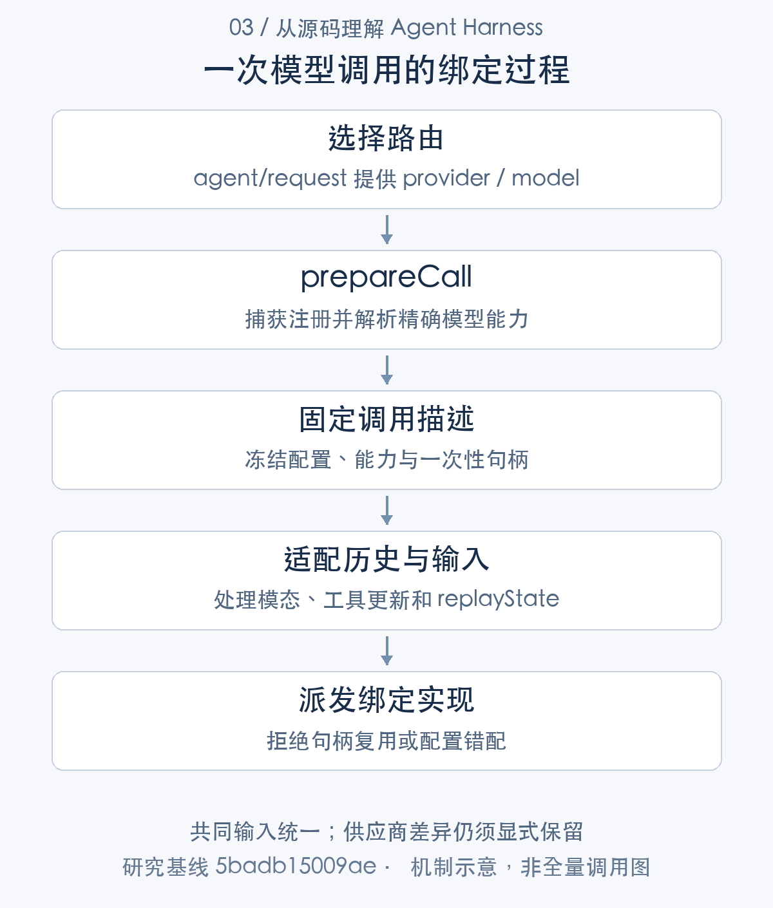

# 接入不同模型：路由绑定、能力解析与消息适配

> 从源码理解 Agent Harness · 第 03 篇 · 模型接入与能力适配

给 Agent 增加第二个模型，接口层面可能只需要换一个 provider 和 model。工程上却还要处理推理参数、附件输入、工具历史、供应商私有状态，以及调用过程中插件被替换的情况。即使两家服务都接受“messages”，它们对这份历史的理解也未必相同。

DeepSeek Harness 把模型接入分成路由选择、能力解析、单次调用准备和 adapter 派发。它最值得研究的设计是：**模型能力与一次请求绑定，而不是在组装消息时和发送请求时各查一次当前实现。**

本文从一次代码修复任务切换模型的场景出发，分析这一机制如何工作，以及它能解决哪些兼容问题。

## 接口统一之后，差异仍然存在

模型服务的共同部分可以抽象为输入消息、工具定义、流式块和结束原因。差异则包括 reasoning effort 是否支持、哪些 effort 合法、默认输出额度、上下文窗口、图像模态，以及系统提示和工具定义能否在历史中更新。

这些差异不能只按供应商名称配置。一个 provider 的不同 model 可能拥有不同能力，因此 DSH 的解析过程落到精确 provider／model 路由。调用者给出意图，adapter 提供模型信息，LLM runtime 再判断这份请求是否可执行。[模型能力定义](https://github.com/deepseek-ai/deepseek-harness/blob/5badb15009ae1756c3afe0ae0cef1faafc290ccc/packages/llm/llm/src/types.ts#L379-L421) [精确路由的配置解析](https://github.com/deepseek-ai/deepseek-harness/blob/5badb15009ae1756c3afe0ae0cef1faafc290ccc/packages/llm/llm/src/index.ts#L885-L918)

例如应用统一提供 high reasoning 选项，某个模型却不支持相应 effort。源码会拒绝不支持的取值，而不是悄悄丢弃它。这样调用者能区分“已按要求执行”和“服务降级执行”。代价是应用必须处理能力错误，也需要为不同模型提供适当选项。

## 路由选择和调用绑定是两个阶段

Agent Loop 在 `agent/request` waterfall 中允许插件调整 provider、model 及配置。这个阶段回答“这次用谁”；`LlmRuntime.prepareCall` 则读取 adapter 注册，等待 adapter 准备调用，规范模型信息和默认值，固定配置，然后返回 PreparedCall。[Loop 的请求准备](https://github.com/deepseek-ai/deepseek-harness/blob/5badb15009ae1756c3afe0ae0cef1faafc290ccc/packages/core/agent-loop/src/agent.ts#L547-L686) [LLM 调用准备](https://github.com/deepseek-ai/deepseek-harness/blob/5badb15009ae1756c3afe0ae0cef1faafc290ccc/packages/llm/llm/src/index.ts#L929-L1018)



这里的等待不是无关紧要的细节。模型能力可能需要异步读取；同一时间配置刷新或 HMR 可能替换注册。如果请求先按旧模型能力组织历史，发送时又取新 adapter，就会产生组合错误：每个对象单独都正确，组合却不是一次一致的调用。

PreparedCall 持有本次 registration、解析后的配置和能力，把它们一起交给发送入口。它冻结的是这次调用的选择，不代表整个 Session 此后永远使用这一模型，也不代表所有插件都不能再影响请求。重试可以重新准备，但一个已经准备好的 attempt 不能随意改换配置。

## 一次性 PreparedCall 如何防止错误复用

下面是返回调用对象的关键片段。能力与 resolvedConfig 同时提供，stream 内检查调用是否已消费，以及发送配置是否保持一致。

```typescript
  return Object.freeze({
    config: resolvedConfig,
    retryPolicy: registration.retryPolicy,
    adapterDefaults,
    ...context === undefined ? {} : { context },
    ...modelInfo.inputModalities === undefined
      ? {}
      : { inputModalities: Object.freeze([...modelInfo.inputModalities]) },
    ...modelInfo.systemPromptUpdate === undefined ? {} : { systemPromptUpdate: modelInfo.systemPromptUpdate },
    ...modelInfo.toolUpdate === undefined ? {} : { toolUpdate: modelInfo.toolUpdate },
    stream: (options: GenerateOptions): AsyncIterable<StreamChunk> => {
      if (dispatched) {
        throw new LlmError('a prepared LLM call can only be dispatched once', 'INVALID_PREPARED_CALL')
      }
      if (!callConfigEquals(options, resolvedConfig)) {
        throw new LlmError(
          'prepared LLM call config changed before adapter dispatch',
          'INVALID_PREPARED_CALL',
        )
      }
      dispatched = true
      return this.streamWithRegistration(options, {
        registration,
        config: resolvedConfig,
        modelInfo,
        dispatch: options => adapterCall.stream(options),
      })
    },
  })
}
```

[对应源码](https://github.com/deepseek-ai/deepseek-harness/blob/5badb15009ae1756c3afe0ae0cef1faafc290ccc/packages/llm/llm/src/index.ts#L947-L977)。以上为原文片段，仅统一缩进，需结合完整实现阅读。

`dispatched` 保证句柄只派发一次。`callConfigEquals` 则防止调用者拿着某个模型的能力结果，转而发送另一份配置。这两种错误都报告 `INVALID_PREPARED_CALL`，不继续拼出一个含混的请求。

这不是简单的“冻结对象就安全”。一致性来自三步共同成立：准备阶段捕获 registration，返回对象暴露同一能力与配置，发送阶段使用已绑定的 adapterCall。只冻结 provider 字符串，却在发送时重新查 registry，仍可能遇到生命周期变化。

这样的设计适合插件化模型接入，也适合其他需要异步解析的执行器：先 resolve 到完整执行描述，再用该描述 execute。它减少了隐式默认值和二次解析导致的偏差。

## 历史属于会话，私有状态属于 adapter

在模型切换场景中，历史文本通常仍有价值，供应商私有 replayState 却不能直接带到另一种实现。DSH 在 adapter 边界过滤不属于当前 adapter 的状态。

```typescript
const messages: RequestMessage[] = options.messages.map((message) => {
  if (message.role !== 'assistant') return message
  const source = message.source
  if (source.replayState === undefined) return message
  if (this.adapters.get(source.provider)?.adapter === adapter) return message
  return freezeMessage({
    ...message,
    source: { kind: 'model', provider: source.provider, model: source.model },
  })
})
if (messages.every((message, index) => message === options.messages[index])) return options
const filtered = { ...options, messages }
return Object.isFrozen(options) ? deepFreeze(filtered) : filtered
```

[对应源码](https://github.com/deepseek-ai/deepseek-harness/blob/5badb15009ae1756c3afe0ae0cef1faafc290ccc/packages/llm/llm/src/index.ts#L986-L998)。以上为原文片段，仅统一缩进，需结合完整实现阅读。

代码不仅比较历史 provider 字符串，还查看该来源当前注册的 adapter 对象是否为同一实现。符合条件时保留消息；不符合时重建 source，保留通用模型来源信息而去掉私有状态。需要时继续保持请求的冻结语义。

例如上一模型产生了特有的推理续接状态，用户改用另一模型修复代码。新模型可以继续使用可解释的对话与工具事实，但不能假定自己理解前一 adapter 的私有字节或字段。这种区别让历史迁移更稳健，同时意味着跨模型续接不一定保留全部隐含状态。

附件也经过投影。内部内容引用不等于供应商原生输入；runtime 会处理文件引用，按输入模态调整图像内容，并根据工具更新能力组织历史。模型接口统一，只能统一共同语义，不能承诺全部信息无损迁移。[附件、模态与 adapter 派发](https://github.com/deepseek-ai/deepseek-harness/blob/5badb15009ae1756c3afe0ae0cef1faafc290ccc/packages/llm/llm/src/index.ts#L1047-L1114)

## 能力变化为什么会影响 prompt 历史

SystemPromptProjection 和工具历史会根据路由能力选择处理方式。某些路由支持工具定义更新，另一些需要在请求中重新组织声明或 prompt series。因而增加一个工具，不只是当前 tools 数组多一项，也可能改变模型应该看到的历史。

本基线相关提交 H02 修复了支持 toolUpdate 的路由仍不必要重建 prompt 的路径。研究这种变化，应比较实际 diff 和调用条件，不能把旧问题直接当作当前缺陷。这里的工程启示是：能力解析不只是 UI 上的“支持／不支持”标签，它参与请求历史的构造。[系统提示与上下文投影](https://github.com/deepseek-ai/deepseek-harness/blob/5badb15009ae1756c3afe0ae0cef1faafc290ccc/packages/core/agent-loop/src/runtime-context.ts#L88-L164) [H02 实际差异](../validation/history-prompt-tool-update.patch)

## 异常应该在哪一层规范化

adapter 派发或迭代器推进的异常，在 LLM 边界规范为失败 finish，Loop 再记录 assistant attempt 并调用 request-error 恢复链。中间件和消费端异常不全处于这一捕获范围，不能都解释成供应商可重试错误。

一个认证失败应保留适配器提供的事实；一个插件处理消息时抛出的程序错误，也应能与网络错误区分。若把所有 throw 都包成“稍后再试”，系统既会隐藏代码问题，也可能增加无意义调用。

`prepareRequest` 对 `NO_ADAPTER` 还保留直接 stream／中间件路径，用于不同扩展组合；这不意味着最终 adapter 派发无需实现。SDK 的 initialize 则采用更明确的入口检查：验证参数，确认或延迟挂载 deepseek-official，再 resolveCallConfig，成功后才开放请求。任意 provider 不享有相同自动挂载保证。[SDK 初始化的路由校验](https://github.com/deepseek-ai/deepseek-harness/blob/5badb15009ae1756c3afe0ae0cef1faafc290ccc/packages/sdk/server/src/server.ts#L137-L170)

## 能力适配的优势与不足

优势是精确能力、实际配置和发送实现保持一致。unsupported 参数及时失败，历史与供应商私有状态分别处理，Loop 不必承担每种模型的请求格式细节。这些都降低了多模型组合中的隐式假设。

不足也很明确：能力描述需要 adapter 正确维护，供应商行为仍需要真实调用验证；声明支持不等于远端永远按声明工作。切换模型可能失去私有状态、改变历史投影或默认输出额度，不能承诺所有路由语义等价。模型服务之外的限流、健康调度和任务级预算，也不能由一次 PreparedCall 自动解决。

接入新 adapter 时，应分别验证能力解析、请求投影、流式结算、错误分类和取消，还要检查真实入口加载是否成功。只断言 registerAdapter 返回，不足以证明产品能调用该模型。

## 技术心得：抽象应保存差异的来源

这次研究让我更认可一种模型抽象：共同字段统一，差异显式描述，私有状态明确归属。它不追求把所有模型包装成完全相同的对象，而是让上层在可理解的条件下使用共同能力。

一旦差异来自模型能力，调用者就能做有依据的选择；一旦差异被藏在 adapter 内的默认回退中，调用者就很难知道自己到底获得了什么。对需要审计和复现的 Agent，后者尤其不利。

现有 V05、请求重建和 SDK 用例支持受控路由下的选定行为，未连接真实供应商验证所有模态与网络异常。因此本文讨论的是架构与实现依据，不以离线通过替代供应商兼容认证。下一篇将继续分析：这些路由选择如何作用于模型每次真正看到的上下文。

---

研究基线：DeepSeek Harness `0.2.1-alpha.1`，提交 `5badb15009ae1756c3afe0ae0cef1faafc290ccc`。源码事实以该版本为准；文中的工程判断和改造建议另行说明。教学场景不代表真实模型业务实测。

源码与运行记录可从[证据索引](../appendices/evidence-index.md)和[验证附录](../appendices/validation.md)复核。本文引用此前同一提交的验证结果，本轮写作不将其重新计为新测试。

[专栏目录](README.md) · [上一篇](02-agent-loop.md) · [下一篇](04-context-engineering.md)
