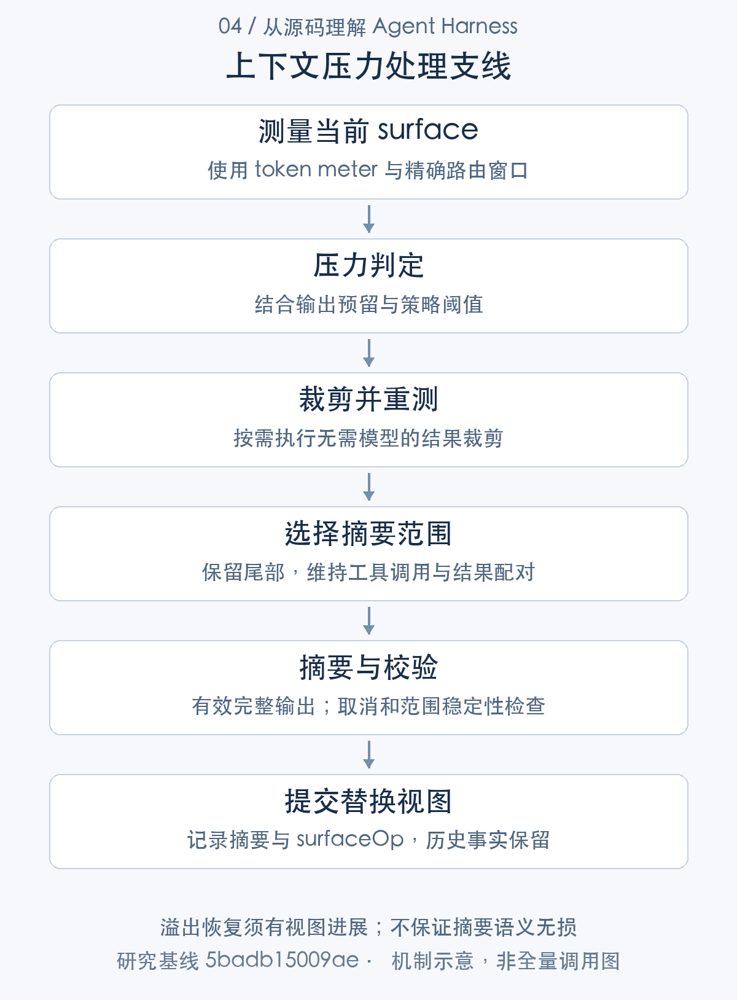

# 模型每次究竟看到什么：上下文组装与压缩

> 从源码理解 Agent Harness · 第 04 篇 · 上下文工程

Agent 修改代码时，读过的文件、工具输出、旧计划和失败测试会不断累积。等到模型拒绝请求，应用才发现历史超过窗口，此时简单删除最早几条消息可能把工具调用和结果拆开，也可能丢掉尚未完成的要求。

上下文工程因此需要回答两个问题：怎样从会话事实构造本次请求，以及输入过长后怎样改变这份视图。DeepSeek Harness 把事件日志、surface、projection 和模型 messages 分开，压缩也通过事件提交新视图。**原始历史保留什么，与当前模型看到什么，是两项不同责任。**

## 从事实到请求，需要四种表示

Session 日志记录发生了什么，包括用户输入、请求配置、模型输出、工具结果和压缩事实。surface 是当前参与模型请求的历史节点视图；它可以保留、追加或替换一部分节点。projection 则按事件维护系统提示、运行上下文或业务状态，`deriveMessages` 将当前视图转换为请求消息。[会话事件追加](https://github.com/deepseek-ai/deepseek-harness/blob/5badb15009ae1756c3afe0ae0cef1faafc290ccc/packages/core/session/src/index.ts#L718-L775) [请求消息派生](https://github.com/deepseek-ai/deepseek-harness/blob/5badb15009ae1756c3afe0ae0cef1faafc290ccc/packages/core/session/src/index.ts#L856-L904) [提示词与上下文投影](https://github.com/deepseek-ai/deepseek-harness/blob/5badb15009ae1756c3afe0ae0cef1faafc290ccc/packages/core/agent-loop/src/runtime-context.ts#L88-L164)

假设模型已读取三份大文件，当前只需要其中两个函数。事实日志应能说明这些读取发生过，请求却未必需要再次携带全部文件内容。只用一个数组同时承担审计与请求输入，会把保留历史和控制窗口变成相互冲突的操作。

DSH 的分层让替换视图成为明确动作。它并不自动判断哪些信息最有价值，而是提供可记录、可重建的处理机制；信息选择仍取决于插件策略、摘要质量和实际任务。



## 上下文组装发生在什么时刻

每个 Step 的 preStep 先 claim 候选输入，再组装 SystemPrompt 和 runtime context，随后执行准入 waterfall。只有接纳后才进入请求阶段；被组装过的内容不等于已经提交给模型。工作区指令插件也在 accepted pre-step 中加入对应内容。[Step 前组装与准入](https://github.com/deepseek-ai/deepseek-harness/blob/5badb15009ae1756c3afe0ae0cef1faafc290ccc/packages/core/agent-loop/src/agent.ts#L267-L285) [工作区指令的接纳](https://github.com/deepseek-ai/deepseek-harness/blob/5badb15009ae1756c3afe0ae0cef1faafc290ccc/packages/context/agent-instructions/src/index.ts#L315-L340)

请求准备时解析精确路由，prompt projection 再按系统提示与工具更新能力调整历史。这样，prompt 不是固定字符串加聊天记录，而是由能力、配置、工作区和会话状态共同决定的可解释输入。

同一 Step 重试通常不重新执行 preStep，也不重新消费 inbox。attempt 每次重新准备请求，从当时 surface 派生消息；如果恢复器压缩了历史，下一 attempt 能使用新的视图，但普通 assembly 不会因此无条件全部重做。扩展开发者要分清“步骤前上下文”与“每次请求派生”。[Step 内重试循环](https://github.com/deepseek-ai/deepseek-harness/blob/5badb15009ae1756c3afe0ae0cef1faafc290ccc/packages/core/agent-loop/src/agent.ts#L398-L544) [每次请求的构建](https://github.com/deepseek-ai/deepseek-harness/blob/5badb15009ae1756c3afe0ae0cef1faafc290ccc/packages/core/agent-loop/src/agent.ts#L547-L686)

## 先量化压力，再选择处理方式

compaction-basic 使用 token meter 测量当前 surface，再结合精确模型窗口、输出预留和策略阈值判断压力。保留输出空间是必要的：请求能容纳全部输入，不代表还剩足够额度生成有效答案。

处理可以先做无需模型的工具结果裁剪，随后重测。如果压力消失，便不必再花一次摘要调用；仍有压力才选取摘要范围。窗口溢出的恢复路径也可以先裁剪，但其选区与普通压力路径的尾部保留策略并不完全相同。[压力测量、裁剪与摘要路径](https://github.com/deepseek-ai/deepseek-harness/blob/5badb15009ae1756c3afe0ae0cef1faafc290ccc/packages/compaction/compaction-basic/src/index.ts#L278-L346)

这一机制的价值是让恢复动作与实际输入联系起来。只是调用过 compact 方法不够；选不到区域、裁剪无效或窗口信息缺失，都可能意味着请求仍然没有可用的恢复依据。

## 选区必须尊重工具历史的结构

保留最后若干 token，并不等于可以从任意消息位置切开历史。工具调用与结果需要配对，否则下一模型可能看到悬空的 tool-call。下面的选区片段会检查尾部边界之前的配对情况，必要时继续向前移动。

```typescript
while (keepFromIdx > firstIdx) {
  // oxlint-disable-next-line typescript/no-non-null-assertion
  if (toolPairingBalancedBefore(session, surfaceNodes[keepFromIdx]!)) break
  keepFromIdx -= 1
}
if (keepFromIdx <= firstIdx) return null

// oxlint-disable-next-line typescript/no-non-null-assertion
const first = surfaceNodes[firstIdx]!
// oxlint-disable-next-line typescript/no-non-null-assertion
const cutoff = surfaceNodes[keepFromIdx - 1]!
return { start: first, end: cutoff }
```

[对应源码](https://github.com/deepseek-ai/deepseek-harness/blob/5badb15009ae1756c3afe0ae0cef1faafc290ccc/packages/compaction/compaction-basic/src/region.ts#L143-L154)。以上为原文片段，仅统一缩进，需结合完整实现阅读。

前面的测量还会检查 token meter 的节点与当前 surface 是否对应，避免根据过时测量切割新的历史。选区排除系统提示头，并在预算基础上寻找可压缩范围。这里既有数量约束，也有结构约束；后者不能靠“输入总 token 已减小”替代。[压缩范围选择的完整实现](https://github.com/deepseek-ai/deepseek-harness/blob/5badb15009ae1756c3afe0ae0cef1faafc290ccc/packages/compaction/compaction-basic/src/region.ts#L117-L154)

例如一次读取请求有三条工具结果，选区不能只保留 assistant 的调用而移除某个结果。对工具密集任务，结构正确比机械保留固定条数更重要，因为模型不仅需要文本，也需要知道各个结果属于什么操作。

## 摘要如何成为可重放的 checkpoint

压缩先追加 `compaction/start`，准备并直接调用 LLM 摘要器；它具有独立路由、maxTokens 和 usage，不是创建另一个 Agent。摘要结束后检查内容、取消状态和选区稳定性，再提交压缩正文与 end。[压缩过程和错误收尾](https://github.com/deepseek-ai/deepseek-harness/blob/5badb15009ae1756c3afe0ae0cef1faafc290ccc/packages/compaction/compaction-basic/src/region.ts#L173-L268) [摘要模型调用](https://github.com/deepseek-ai/deepseek-harness/blob/5badb15009ae1756c3afe0ae0cef1faafc290ccc/packages/compaction/compaction-basic/src/summarizer.ts#L120-L180)

提交包含两种事实：`compaction/summary` 保存摘要、来源范围和调用信息；带 surfaceOp 的 `user/message` 将选区替换为 checkpoint。历史事件没有因此被当场删除，重放日志也不需要重新询问摘要模型。[摘要与视图替换的提交](https://github.com/deepseek-ai/deepseek-harness/blob/5badb15009ae1756c3afe0ae0cef1faafc290ccc/packages/compaction/compaction-basic/src/region.ts#L470-L509)

空文本、error、aborted 和 max-tokens finish 都不能被当成完整摘要。截断摘要可能遗漏任务约束，如果继续把它作为可靠 checkpoint，后续执行看起来正常，实际信息却已经损坏。保守拒绝这些结算，是上下文质量控制的一部分。[摘要失败与截断检查](https://github.com/deepseek-ai/deepseek-harness/blob/5badb15009ae1756c3afe0ae0cef1faafc290ccc/packages/compaction/compaction-basic/src/summarizer.ts#L196-L209)

## 窗口错误重试需要“进展证明”

当供应商报告上下文窗口溢出，恢复器记录处理前的 replaceGeneration，等待压缩，再用下面的条件决定是否返回 retry。

```typescript
if (signal.aborted
  || agent.session.surface.replaceGeneration <= generation) return next()
if (result !== null) logResult(result, 'context overflow recovery')
this.overflowRetries.set(agent, retries + 1)
return { kind: 'retry' }
```

[对应源码](https://github.com/deepseek-ai/deepseek-harness/blob/5badb15009ae1756c3afe0ae0cef1faafc290ccc/packages/compaction/compaction-basic/src/index.ts#L229-L233)。以上为原文片段，仅统一缩进，需结合完整实现阅读。

请求视图的替换代际必须前进，且取消没有发生。若压缩没有改变输入，反复发送同一份过长请求只会重复失败。代码还处理一个更细的情况：无需模型的裁剪先成功，后续可选摘要失败，只要视图已经前进，仍可以以这份进展为依据重试。[溢出恢复的完整分支](https://github.com/deepseek-ai/deepseek-harness/blob/5badb15009ae1756c3afe0ae0cef1faafc290ccc/packages/compaction/compaction-basic/src/index.ts#L190-L234)

replaceGeneration 提供的是视图变化证据，不是摘要语义正确的证明。它解决“恢复动作有没有落地”，业务信息是否完整还依赖摘要策略和评测；两项判断不能混淆。

## 这套架构解决了什么，又留下了什么

它的优势是事实日志和请求优化可以同时成立，模型历史替换可被重建，工具配对与取消也有明确检查。先裁剪后重测能避免不必要摘要，进展检查则减少无效溢出重试。

代价是多层表示带来额外复杂度。某个字段在日志中存在，不代表当前请求仍携带它；提示词变化也不能只看最终字符串。压缩还引入独立模型成本与延迟，摘要可能损失细节，策略阈值不合适时会频繁压缩或过晚介入。源码没有让这些风险消失。

工程上可以为任务保留不可压缩的关键约束，并评测摘要前后是否丢失目标、失败结论和待完成工作。这属于应用策略建议，不能写成 DSH 原生已经保证了语义无损。

## 技术心得：优化应针对视图，审计应保留事实

上下文分析让我看到一种可迁移的设计原则：当同一批数据同时服务执行与追溯时，应允许它们拥有不同表示。事实日志尽量回答发生了什么，请求视图回答现在需要什么；优化操作必须留下能解释两者关系的记录。

另一个收获是，恢复策略应检查实际进展。重试次数、摘要调用次数只是动作统计，只有输入视图改变，才构成窗口恢复的直接依据。这个思路也适用于缓存重建、状态迁移和任务修复。

V10 的 105 项 compaction 用例验证受控摘要下的压力、溢出、失败与取消路径。它们没有证明真实模型摘要保持全部业务信息，也没有测量生产任务的最优压缩阈值。下一篇将进一步区分：这些上下文视图、会话事实和长期记忆究竟怎样被保存。

---

研究基线：DeepSeek Harness `0.2.1-alpha.1`，提交 `5badb15009ae1756c3afe0ae0cef1faafc290ccc`。源码事实以该版本为准；文中的工程判断和改造建议另行说明。教学场景不代表真实模型业务实测。

源码与运行记录可从[证据索引](../appendices/evidence-index.md)和[验证附录](../appendices/validation.md)复核。本文引用此前同一提交的验证结果，本轮写作不将其重新计为新测试。

[专栏目录](README.md) · [上一篇](03-model-adaptation.md) · [下一篇](05-state-persistence.md)
