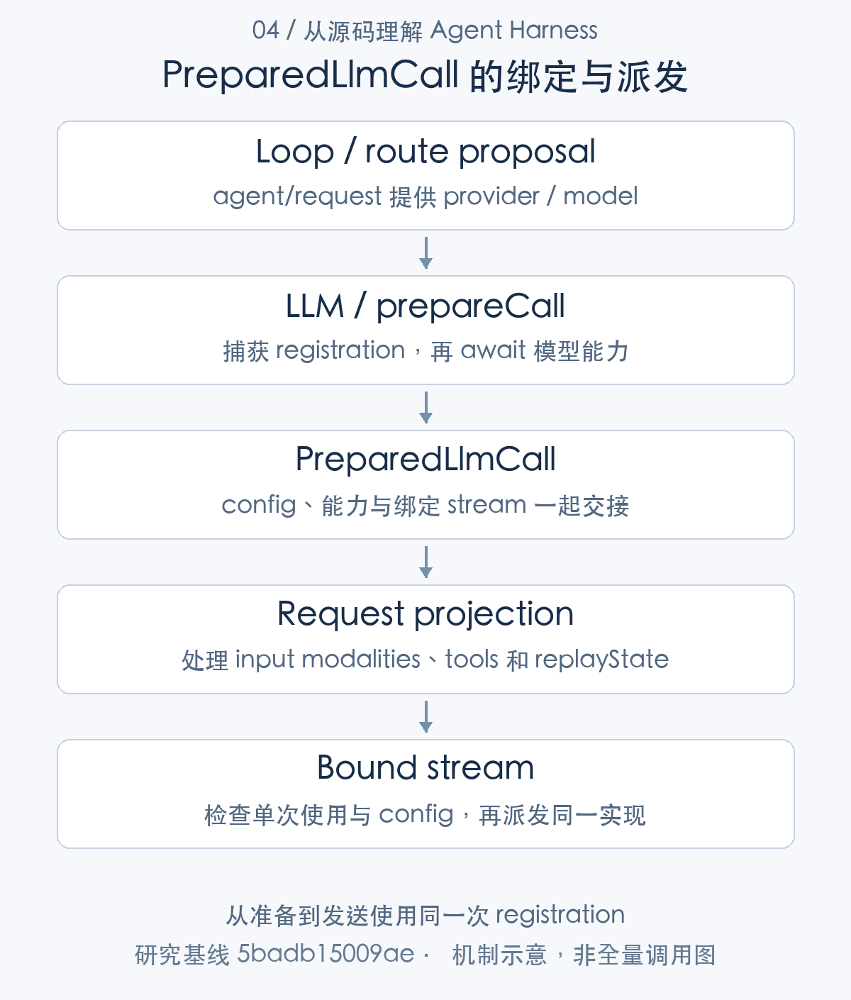
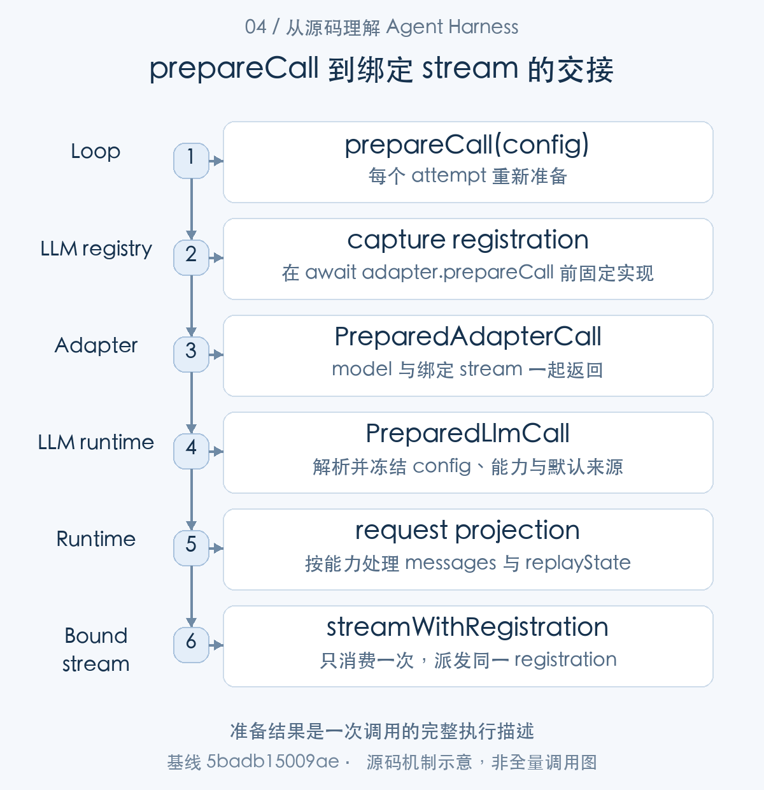
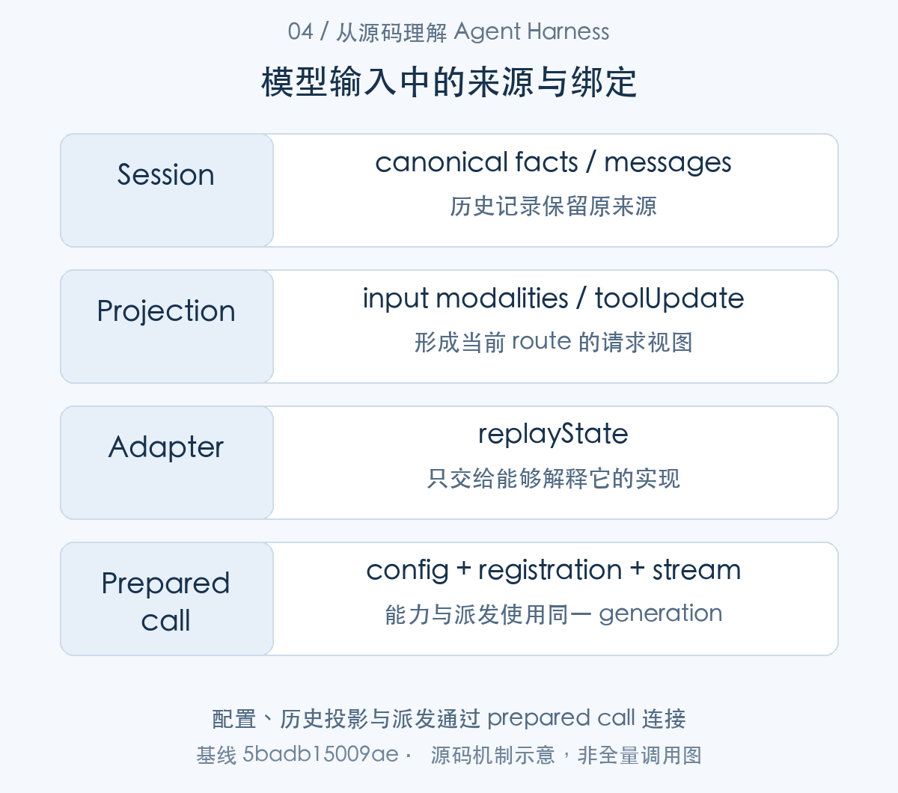
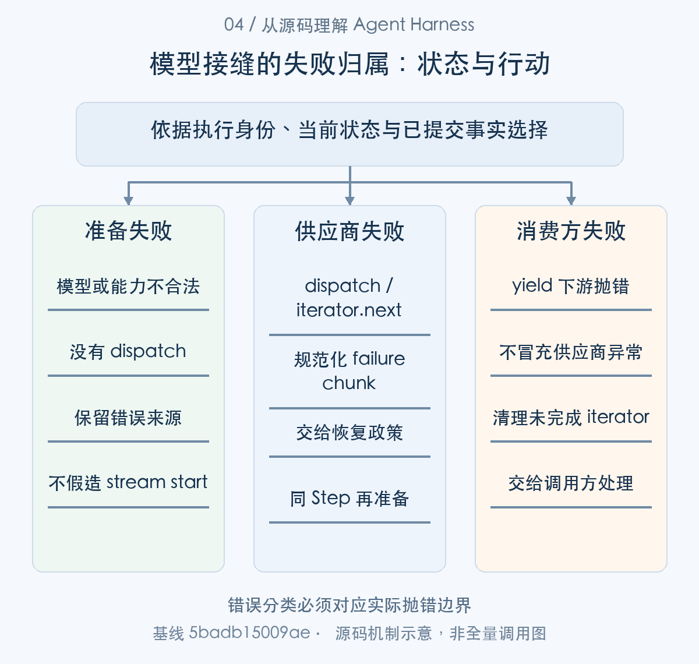

# 接入不同模型：路由绑定、能力解析与消息适配

> 从源码理解 Agent Harness · 第 04 篇 · 模型接入与能力适配

给 Agent 增加第二个模型，接口层面可能只需要换一个 provider 和 model。工程上却还要处理推理参数、附件输入、工具历史、供应商私有状态，以及调用过程中插件被替换的情况。即使两家服务都接受“messages”，它们对这份历史的理解也未必相同。

DeepSeek Harness 把模型接入分成路由选择、能力解析、单次调用准备和 adapter 派发。它最值得研究的设计是：**模型能力与一次请求绑定，而不是在组装消息时和发送请求时各查一次当前实现。**

本文从一次代码修复任务切换模型的场景出发，分析这一机制如何工作，以及它能解决哪些兼容问题。


整体接线可以分为装配与执行：插件用 registerAdapter() 提供 provider 路由；Loop 提出配置并调用 prepareCall()；LLM runtime 固定 registration、能力和 config，再通过绑定的 stream 入口派发。消息、附件与 replayState 在发送边界投影，失败再以 finish 返回 Loop。本文先解释契约，再沿注册、准备、派发和返回逐层展开。

## 接口统一之后，差异仍然存在

模型服务的共同部分可以抽象为输入消息、工具定义、流式块和结束原因。差异则包括 reasoning effort 是否支持、哪些 effort 合法、默认输出额度、上下文窗口、图像模态，以及系统提示和工具定义能否在历史中更新。

这些差异不能只按供应商名称配置。一个 provider 的不同 model 可能拥有不同能力，因此 DSH 的解析过程落到精确 provider／model 路由。调用者给出意图，adapter 提供模型信息，LLM runtime 再判断这份请求是否可执行。[模型能力定义](https://github.com/deepseek-ai/deepseek-harness/blob/5badb15009ae1756c3afe0ae0cef1faafc290ccc/packages/llm/llm/src/types.ts#L379-L421) [精确路由的配置解析](https://github.com/deepseek-ai/deepseek-harness/blob/5badb15009ae1756c3afe0ae0cef1faafc290ccc/packages/llm/llm/src/index.ts#L885-L918)

例如应用统一提供 high reasoning 选项，某个模型却不支持相应 effort。源码会拒绝不支持的取值，而不是悄悄丢弃它。这样调用者能区分“已按要求执行”和“服务降级执行”。代价是应用必须处理能力错误，也需要为不同模型提供适当选项。



图1：从准备到发送使用同一次 registration。先按这张主线图建立对象地图，再结合下面的 caller、数据和返回路径展开。

### 第一步：能力不是 provider 的一个笼统标签

先看 adapter 返回的精确模型契约，再看 normalizeModelInfo() 如何检查它。后续 prepareCall() 将调用这个规范化方法，确保能力身份对应本次 provider/model。


```typescript
/** Exact-route model metadata resolved by its owning adapter. */
export interface LlmResolvedModelInfo extends LlmModelInfo {
  /** Provider-owned context capacity when known. */
  context?: LlmModelContext
  /** Adapter-configured per-request output cap materialized when callers omit one. */
  defaultMaxTokens?: number
  /** Adapter-owned selectable reasoning levels when exposed. */
  reasoning?: LlmModelReasoningInfo
  /** Declared mid-conversation system prompt handling; absent means only a leading system message is read. */
  systemPromptUpdate?: SystemPromptUpdate
  /** Declared mid-conversation tool declaration handling; absent means every request declares the complete tool list. */
  toolUpdate?: ToolUpdate
}
```

[源码：`packages/llm/llm/src/types.ts:409–421`](https://github.com/deepseek-ai/deepseek-harness/blob/5badb15009ae1756c3afe0ae0cef1faafc290ccc/packages/llm/llm/src/types.ts#L409-L421)。

context、defaultMaxTokens、reasoning、systemPromptUpdate 与 toolUpdate 都属于精确模型信息。context 缺省表示容量未知；系统提示更新模式缺省与显式 in-history 代表不同历史构造方式，不能把 undefined 自动翻译成支持。工具的 addition-only 与 in-history 也有不同语义：前者允许追加，后者还允许移除。

运行时不直接相信 adapter 返回的对象：

```typescript
const provider = registration.provider.id
if (
  typeof resolved.provider !== 'string'
  || resolved.provider !== provider
  || typeof resolved.id !== 'string'
  || resolved.id !== model
  || typeof resolved.name !== 'string'
  || resolved.name.length === 0
  || (resolved.description !== undefined && typeof resolved.description !== 'string')
) {
  throw new LlmError(
    `adapter returned invalid exact model metadata for provider "${provider}" model "${model}"`,
    'INVALID_MODEL_INFO',
  )
}
```

[源码：`packages/llm/llm/src/index.ts:756–770`](https://github.com/deepseek-ai/deepseek-harness/blob/5badb15009ae1756c3afe0ae0cef1faafc290ccc/packages/llm/llm/src/index.ts#L756-L770)。

返回 provider 必须等于注册路由，id 必须等于此次 model，展示名称不能为空。一个适配器误把默认模型信息用于所有型号，会在这里失败。这让调用配置和模型能力有可检查的身份关系，也意味着接入者必须维护真实型号信息。

```typescript
const context = resolved.context
if (context !== undefined && (!Number.isInteger(context.contextWindow) || context.contextWindow <= 0)) {
  throw new LlmError(
    `adapter returned invalid context metadata for provider "${provider}" model "${model}"`,
    'INVALID_MODEL_CONTEXT',
  )
}
// Capability metadata rides through: an explicit modality omission is
// negative capability downstream preflights act on (image admission).
const inputModalities = this.detachedModalities(resolved.inputModalities)
// Widened: adapters derive this mode from catalog config, so the value is checked as a string.
const systemPromptUpdate: string | undefined = resolved.systemPromptUpdate
if (systemPromptUpdate !== undefined && systemPromptUpdate !== 'in-history') {
  throw new LlmError(
    `adapter returned invalid system prompt update mode for provider "${provider}" model "${model}"`,
    'INVALID_MODEL_INFO',
  )
}
```

[源码：`packages/llm/llm/src/index.ts:771–788`](https://github.com/deepseek-ai/deepseek-harness/blob/5badb15009ae1756c3afe0ae0cef1faafc290ccc/packages/llm/llm/src/index.ts#L771-L788)。

上下文窗口必须是正整数；systemPromptUpdate 只接受当前实现认识的模式。代码复制能力信息再交给下游，避免 adapter 后来修改对象造成一次调用内能力漂移。能力校验提高可解释性，却不能证明远端供应商始终按声明行为，需要用真实模型再验证。


## 路由选择和调用绑定是两个阶段

能力对象已经明确，接下来把它接到可查找的 provider 路由。注册发生在插件装配期，prepareCall 则发生在每个 attempt；两种生命周期在 registration 的捕获位置连接。

Agent Loop 在 `agent/request` waterfall 中允许插件调整 provider、model 及配置。这个阶段回答“这次用谁”；`LlmRuntime.prepareCall` 则读取 adapter 注册，等待 adapter 准备调用，规范模型信息和默认值，固定配置，然后返回 PreparedCall。[Loop 的请求准备](https://github.com/deepseek-ai/deepseek-harness/blob/5badb15009ae1756c3afe0ae0cef1faafc290ccc/packages/core/agent-loop/src/agent.ts#L547-L686) [LLM 调用准备](https://github.com/deepseek-ai/deepseek-harness/blob/5badb15009ae1756c3afe0ae0cef1faafc290ccc/packages/llm/llm/src/index.ts#L929-L1018)


这里的等待不是无关紧要的细节。模型能力可能需要异步读取；同一时间配置刷新或 HMR 可能替换注册。如果请求先按旧模型能力组织历史，发送时又取新 adapter，就会产生组合错误：每个对象单独都正确，组合却不是一次一致的调用。

PreparedCall 持有本次 registration、解析后的配置和能力，把它们一起交给发送入口。它冻结的是这次调用的选择，不代表整个 Session 此后永远使用这一模型，也不代表所有插件都不能再影响请求。重试可以重新准备，但一个已经准备好的 attempt 不能随意改换配置。

### 第二步：注册拥有路由，销毁必须释放自己仍拥有的路由

能力由实现提供，registry 则把实现挂到 provider。registerAdapter() 返回管理注册的 handle，其 disposer 属于注册上下文；后续请求据此捕获 registration。


```typescript
registerAdapter(providers: string[], adapter: LlmAdapter): AdapterRegistrationHandle {
  // The routes this registration currently holds; `replace` rewrites it, and
  // the disposer releases whatever it holds at disposal time.
  const owned = new Set<string>()
  // The disposer has run: `owned` being empty cannot say so on its own,
  // because `replace([])` legally leaves a live registration holding none.
  let released = false
  const dispose = this.ctx.effect(function* (this: LlmRuntime) {
    if (providers.length === 0) throw new LlmError('an adapter must register at least one provider', 'INVALID_ADAPTER')
    this.commitRoutes(owned, this.prepareRoutes(providers, adapter, owned))
    yield () => {
      released = true
      for (const provider of owned) this.adapters.delete(provider)
      owned.clear()
      this.emitAdaptersUpdated()
    }
  }.bind(this), 'llm.registerAdapter()')
```

[源码：`packages/llm/llm/src/index.ts:389–405`](https://github.com/deepseek-ai/deepseek-harness/blob/5badb15009ae1756c3afe0ae0cef1faafc290ccc/packages/llm/llm/src/index.ts#L389-L405)。

owned 集合记录此 registration 当前管理的 provider；released 与 owned 分开，因为 replace([]) 可以留下一个活着却没有路由的注册。effect 的销毁闭包删除当前 owned、清空集合并通知更新。把卸载简单写成删除最初 providers 数组，会漏掉动态 replace 之后新增的路由。



图2：准备结果是一次调用的完整执行描述。从 caller 的交接对象追到 consumer，具体分支结合正文源码阅读。

### 第三步：能力查询与一次调用绑定的契约不同

路由可查找后，resolveCallConfig() 提供配置查询，prepareCall() 则保留发送能力。Loop 使用后者，把异步解析的结果交给当前 attempt。

adapter 一侧先返回 PreparedAdapterCall：

```typescript
export interface PreparedAdapterCall {
  /** Exact model metadata from the same adapter generation as {@link stream}. */
  readonly model: LlmResolvedModelInfo
  /** Dispatch through that generation without re-reading dynamic connection facts. */
  stream(options: GenerateOptions): AsyncIterable<StreamChunk>
}
```

[源码：`packages/llm/llm/src/index.ts:195–200`](https://github.com/deepseek-ai/deepseek-harness/blob/5badb15009ae1756c3afe0ae0cef1faafc290ccc/packages/llm/llm/src/index.ts#L195-L200)。

|核心字段|保存的信息|使用位置|
|---|---|---|
|`model`|当前 adapter generation 的模型信息|normalizeModelInfo()|
|`stream(options)`|使用同一 generation 派发|runtime 绑定的发送入口|

模型信息与发送能力一起返回，等待能力解析时 registry 变化也不会把两次选择混用。


```typescript
async resolveCallConfig(config: LlmCallConfig, signal?: AbortSignal): Promise<LlmCallConfig> {
  return (await this.resolveCallFor(this.registration(config.provider), config, signal)).config
}

private async resolveCallFor(
  registration: AdapterRegistration,
  config: LlmCallConfig,
  signal?: AbortSignal,
): Promise<{ config: LlmCallConfig; context?: LlmModelContext; modelInfo: LlmResolvedModelInfo }> {
  const info = await this.resolveModelInfoFor(registration, config.model, signal)
  return this.resolveCallWithInfo(config, info)
}
```

[源码：`packages/llm/llm/src/index.ts:871–882`](https://github.com/deepseek-ai/deepseek-harness/blob/5badb15009ae1756c3afe0ae0cef1faafc290ccc/packages/llm/llm/src/index.ts#L871-L882)。

resolveCallConfig 查询当前 registration 并解析配置，适用于 UI 检查、初始化等；返回配置不保留未来发送所使用的 registration。要让“按谁的能力构造”和“由谁发送”一致，需要 prepareCall。

```typescript
async prepareCall(config: LlmCallConfig, signal?: AbortSignal): Promise<PreparedLlmCall> {
  const registration = this.registration(config.provider)
  const adapterCall = await registration.adapter.prepareCall(config.provider, config.model, signal)
  const modelInfo = this.normalizeModelInfo(registration, config.model, adapterCall.model)
  const resolved = this.resolveCallWithInfo(config, modelInfo)
  const resolvedConfig = deepFreeze(structuredClone(resolved.config))
  const context = resolved.context === undefined
    ? undefined
    : deepFreeze(structuredClone(resolved.context))
  const adapterDefaults = deepFreeze<LlmCallConfigAdapterDefaults>({
    ...config.reasoningEffort === undefined && resolvedConfig.reasoningEffort !== undefined
      ? { reasoningEffort: true }
      : {},
    ...config.maxTokens === undefined && resolvedConfig.maxTokens !== undefined
      ? { maxTokens: true }
      : {},
  })
  let dispatched = false
```

[源码：`packages/llm/llm/src/index.ts:929–946`](https://github.com/deepseek-ai/deepseek-harness/blob/5badb15009ae1756c3afe0ae0cef1faafc290ccc/packages/llm/llm/src/index.ts#L929-L946)。

第一行先捕获 registration，之后才 await adapter.prepareCall。异步期间注册表可能更新，但后续 normalizeModelInfo 仍使用捕获的对象。resolvedConfig 和 context 经过 structuredClone 与 deepFreeze；adapterDefaults 标记哪些值由 adapter 补齐，而不是用户显式指定。

一个具体竞争是：旧 adapter 查询能力较慢，等待期间新 adapter 注册了同一 provider。如果只保存 provider 名字，发送时再查当前注册，就会混用旧窗口与新实现。此实现保留的是执行描述与已准备的 adapterCall。之后的新 attempt 可以重新准备；已经准备好的 attempt 使用同一次选择。

不能由此宣称卸载不需要管理在途调用。绑定保证一致性，取消与底层连接释放仍属于 owner 的生命周期协议。

## 一次性 PreparedCall 如何防止错误复用

下面是返回调用对象的关键片段。能力与 resolvedConfig 同时提供，stream 内检查调用是否已消费，以及发送配置是否保持一致。

```typescript
  return Object.freeze({
    config: resolvedConfig,
    retryPolicy: registration.retryPolicy,
    adapterDefaults,
    ...context === undefined ? {} : { context },
    ...modelInfo.inputModalities === undefined
      ? {}
      : { inputModalities: Object.freeze([...modelInfo.inputModalities]) },
    ...modelInfo.systemPromptUpdate === undefined ? {} : { systemPromptUpdate: modelInfo.systemPromptUpdate },
    ...modelInfo.toolUpdate === undefined ? {} : { toolUpdate: modelInfo.toolUpdate },
    stream: (options: GenerateOptions): AsyncIterable<StreamChunk> => {
      if (dispatched) {
        throw new LlmError('a prepared LLM call can only be dispatched once', 'INVALID_PREPARED_CALL')
      }
      if (!callConfigEquals(options, resolvedConfig)) {
        throw new LlmError(
          'prepared LLM call config changed before adapter dispatch',
          'INVALID_PREPARED_CALL',
        )
      }
      dispatched = true
      return this.streamWithRegistration(options, {
        registration,
        config: resolvedConfig,
        modelInfo,
        dispatch: options => adapterCall.stream(options),
      })
    },
  })
}
```

[对应源码](https://github.com/deepseek-ai/deepseek-harness/blob/5badb15009ae1756c3afe0ae0cef1faafc290ccc/packages/llm/llm/src/index.ts#L947-L977)。以上为原文片段，仅统一缩进，需结合完整实现阅读。

`dispatched` 保证句柄只派发一次。`callConfigEquals` 则防止调用者拿着某个模型的能力结果，转而发送另一份配置。这两种错误都报告 `INVALID_PREPARED_CALL`，不继续拼出一个含混的请求。

这不是简单的“冻结对象就安全”。一致性来自三步共同成立：准备阶段捕获 registration，返回对象暴露同一能力与配置，发送阶段使用已绑定的 adapterCall。只冻结 provider 字符串，却在发送时重新查 registry，仍可能遇到生命周期变化。

这样的设计适合插件化模型接入，也适合其他需要异步解析的执行器：先 resolve 到完整执行描述，再用该描述 execute。它减少了隐式默认值和二次解析导致的偏差。

### 第四步：单次句柄既检查次数，也检查实际请求配置

prepareCall() 返回后，stream() 消费这个一次性调用对象；它继续进入 streamWithRegistration()，保持配置与派发实现一致。这里沿发送边界补充第二次配置检查。

提供给 Loop 的完整交接结构是 PreparedLlmCall：

```typescript
export interface PreparedLlmCall {
  /** Detached, deep-frozen config with any adapter-owned default materialized. */
  readonly config: LlmCallConfig
  /** Immutable retry policy captured with the adapter registration. */
  readonly retryPolicy: ResolvedRetryPolicy
  /** Detached context metadata resolved with the registration-bound call. */
  readonly context?: LlmModelContext
  /** Exact model modalities captured with the adapter dispatch generation. */
  readonly inputModalities?: readonly ModelModality[]
  /** Exact model system prompt update mode captured with the adapter dispatch generation. */
  readonly systemPromptUpdate?: SystemPromptUpdate
  /** Exact model tool update mode captured with the adapter dispatch generation. */
  readonly toolUpdate?: ToolUpdate
  /** Config fields materialized by the captured adapter rather than proposed by the caller. */
  readonly adapterDefaults: LlmCallConfigAdapterDefaults
  /**
   * Dispatch this call once through the registration captured during
   * preparation. The request's call-config fields must match {@link config};
   * reuse or mismatch fails with `INVALID_PREPARED_CALL`.
   * @param options - fully assembled request carrying the prepared config.
   * @returns the chunk stream, including the `llm/stream` waterfall.
   */
  stream(options: GenerateOptions): AsyncIterable<StreamChunk>
}
```

[源码：`packages/llm/llm/src/index.ts:169–192`](https://github.com/deepseek-ai/deepseek-harness/blob/5badb15009ae1756c3afe0ae0cef1faafc290ccc/packages/llm/llm/src/index.ts#L169-L192)。

|核心字段|保存的信息|使用位置|
|---|---|---|
|`config` / `adapterDefaults`|实际参数与默认值来源|历史记录及配置比较|
|`context` / `inputModalities`|窗口与输入能力|压力计算和消息投影|
|`retryPolicy` / `stream()`|恢复策略与一次派发能力|失败处理及本 attempt 发送|

它不是一份可无限重用的客户端。每次 retry 都重新 prepare，以取得属于新 attempt 的调用描述。


原文片段中，dispatched 在校验成功后、派发之前设为 true。这是一次调用消费，不是“等网络成功才算使用”。网络失败之后应重新 prepare 新 attempt，而不是用同一个句柄重新发送。

发送边界还有一次配置检查：

```typescript
if (prepared !== undefined && !callConfigEquals(options, resolvedConfig)) {
  throw new LlmError(
    'prepared LLM call config changed before adapter dispatch',
    'INVALID_PREPARED_CALL',
  )
}
const resolvedOptions = callConfigEquals(options, resolvedConfig)
  ? options
  : Object.isFrozen(options)
    ? deepFreeze({ ...options, ...resolvedConfig })
    : { ...options, ...resolvedConfig }
```

[源码：`packages/llm/llm/src/index.ts:1047–1057`](https://github.com/deepseek-ai/deepseek-harness/blob/5badb15009ae1756c3afe0ae0cef1faafc290ccc/packages/llm/llm/src/index.ts#L1047-L1057)。

prepared 存在时，options 必须与 resolvedConfig 一致；否则抛 INVALID_PREPARED_CALL。未绑定路径则可补齐实际解析的配置。对于被冻结请求，新的配置覆盖生成另一个冻结对象，不修改原 envelope。

这项校验比较的是 route 与采样／输出控制，不等于对每个 messages 字节做签名。它防止换模型、换 maxTokens 等配置漂移；输入投影、中间件的消息职责仍需另行理解。[配置逐字段比较](https://github.com/deepseek-ai/deepseek-harness/blob/5badb15009ae1756c3afe0ae0cef1faafc290ccc/packages/llm/llm/src/call-config.ts#L46-L61)

### 第五步：默认值的来源必须能被后续步骤辨认

默认生成参数是在 prepareCall() 调用 resolveCallWithInfo() 时解析的。这里回看这一步，解释 resolvedConfig 与 adapterDefaults 为什么必须一起保留。

配置解析消费的字段来自 LlmCallConfig：

```typescript
export interface LlmCallConfig {
  provider: string
  model: string
  reasoningEffort?: ReasoningEffortId
  temperature?: number
  maxTokens?: number
  stop?: string[]
}
```

[源码：`packages/llm/llm/src/call-config.ts:23–30`](https://github.com/deepseek-ai/deepseek-harness/blob/5badb15009ae1756c3afe0ae0cef1faafc290ccc/packages/llm/llm/src/call-config.ts#L23-L30)。

|核心字段|保存的信息|使用位置|
|---|---|---|
|`provider` / `model`|精确路由|registration 与能力校验|
|`reasoningEffort` / `maxTokens`|生成要求|模型能力与默认值解析|
|`temperature` / `stop`|生成控制|请求配置一致性比较|

这些参数进入 request，与 messages 的来源不同。先确定配置，再按对应能力组织历史，才形成可解释的一次调用。


```typescript
const defaulted = config.maxTokens === undefined && info.defaultMaxTokens !== undefined
  ? { ...config, maxTokens: info.defaultMaxTokens }
  : config
const reasoning = info.reasoning
const requested = defaulted.reasoningEffort
let resolvedConfig = defaulted
if (reasoning === undefined) {
  if (requested !== undefined) {
    throw new LlmError(
      `provider "${config.provider}" model "${config.model}" does not support reasoning effort "${requested}"`,
      'UNSUPPORTED_REASONING_EFFORT',
    )
  }
} else {
  const effective = requested ?? reasoning.defaultEffort
  if (effective !== undefined) {
    if (!reasoning.efforts.some(effort => effort.id === effective)) {
      throw new LlmError(
        `provider "${config.provider}" model "${config.model}" does not support reasoning effort "${effective}"`,
        'UNSUPPORTED_REASONING_EFFORT',
      )
    }
    if (requested !== effective) resolvedConfig = { ...defaulted, reasoningEffort: effective }
  }
}
```

[源码：`packages/llm/llm/src/index.ts:889–913`](https://github.com/deepseek-ai/deepseek-harness/blob/5badb15009ae1756c3afe0ae0cef1faafc290ccc/packages/llm/llm/src/index.ts#L889-L913)。

maxTokens 未指定才使用 defaultMaxTokens。reasoning 不存在而调用者请求了 effort，会立即报不支持；存在 reasoning 时，显式值或 defaultEffort 都必须位于 efforts 中。没有静默把 high 降为 low 的分支。

这带来两项收益：配置日志能解释真正发送了什么；切换路由时可以区分旧模型默认与人类明确选择。代价是应用必须处理 capability error，并为不同型号刷新可选项。把所有模型统一提供相同滑块但悄悄忽略参数，会损坏这份可解释性。


## 历史属于会话，私有状态属于 adapter

调用配置已经绑定，下一件事是决定这次 adapter 实际接收哪些历史。下面进入发送视图支线，它消费已准备的能力与 Session 派生消息。

在模型切换场景中，历史文本通常仍有价值，供应商私有 replayState 却不能直接带到另一种实现。DSH 在 adapter 边界过滤不属于当前 adapter 的状态。

```typescript
const messages: RequestMessage[] = options.messages.map((message) => {
  if (message.role !== 'assistant') return message
  const source = message.source
  if (source.replayState === undefined) return message
  if (this.adapters.get(source.provider)?.adapter === adapter) return message
  return freezeMessage({
    ...message,
    source: { kind: 'model', provider: source.provider, model: source.model },
  })
})
if (messages.every((message, index) => message === options.messages[index])) return options
const filtered = { ...options, messages }
return Object.isFrozen(options) ? deepFreeze(filtered) : filtered
```

[对应源码](https://github.com/deepseek-ai/deepseek-harness/blob/5badb15009ae1756c3afe0ae0cef1faafc290ccc/packages/llm/llm/src/index.ts#L986-L998)。以上为原文片段，仅统一缩进，需结合完整实现阅读。

代码不仅比较历史 provider 字符串，还查看该来源当前注册的 adapter 对象是否为同一实现。符合条件时保留消息；不符合时重建 source，保留通用模型来源信息而去掉私有状态。需要时继续保持请求的冻结语义。

例如上一模型产生了特有的推理续接状态，用户改用另一模型修复代码。新模型可以继续使用可解释的对话与工具事实，但不能假定自己理解前一 adapter 的私有字节或字段。这种区别让历史迁移更稳健，同时意味着跨模型续接不一定保留全部隐含状态。

附件也经过投影。内部内容引用不等于供应商原生输入；runtime 会处理文件引用，按输入模态调整图像内容，并根据工具更新能力组织历史。模型接口统一，只能统一共同语义，不能承诺全部信息无损迁移。[附件、模态与 adapter 派发](https://github.com/deepseek-ai/deepseek-harness/blob/5badb15009ae1756c3afe0ae0cef1faafc290ccc/packages/llm/llm/src/index.ts#L1047-L1114)



图3：配置、历史投影与派发通过 prepared call 连接。表中对象并列展示用途与寿命，层次之间以源码所示身份关联。

### 第六步：共同内容延续，私有 replayState 按实现身份过滤

准备结果进入 streamWithRegistration() 后，forAdapter() 过滤当前实现无法解释的 replayState。这是 request 视图处理，原 Session 事实仍保留。


原文 forAdapter 的两个 early return 保留非 assistant 消息与没有 replayState 的消息。真正有私有状态时，检查历史 provider 当前注册的 adapter 是否就是此次 adapter；不是则重建 source，保留通用来源，移除私有状态。最后只在有变更时构造新 options。

这不是把原日志删除。过滤作用于本次派发视图，历史仍能说明旧模型产生过什么。也不能认为同名 provider 永远兼容旧 replayState：实现对象变化会影响判定。

### 第七步：文件、图像与工具更新在最终 adapter 边界投影

同一发送路径还依次投影 file、image 与 tool updates，必要时用 fileReadPath() 映射资源路径；最后把 projectedOptions 交给绑定的 adapterCall.stream()。


```typescript
// Files are never dispatched natively: every route receives handle text.
let projectedMessages: readonly RequestMessage[] = resolvedOptions.messages
if (projectedMessages.some(message => contentHasFile(message.content))) {
  projectedMessages = projectFilesToText(projectedMessages, ref => this.fileReadPath(ref))
}
if (modelInfo.inputModalities !== undefined
  && !modelInfo.inputModalities.includes('image')
  && projectedMessages.some(message => contentHasImage(message.content))) {
  projectedMessages = projectImagesForTextModel(projectedMessages)
}
// Tool changes are logged on every route; the route's declared mode selects what it receives.
const projectedTools = projectToolUpdates(projectedMessages, resolvedOptions.tools, modelInfo.toolUpdate, resolvedOptions.toolHistory)
projectedMessages = projectedTools.messages
let projectedOptions = resolvedOptions
if (projectedMessages !== resolvedOptions.messages || projectedTools.tools !== resolvedOptions.tools) {
  projectedOptions = {
    ...resolvedOptions,
    messages: projectedMessages as RequestMessage[],
    ...projectedTools.tools === undefined ? {} : { tools: projectedTools.tools as ToolSchema[] },
  }
  if (Object.isFrozen(resolvedOptions)) deepFreeze(projectedOptions)
}
```

[源码：`packages/llm/llm/src/index.ts:1058–1079`](https://github.com/deepseek-ai/deepseek-harness/blob/5badb15009ae1756c3afe0ae0cef1faafc290ccc/packages/llm/llm/src/index.ts#L1058-L1079)。

所有文件引用先 projectFilesToText，代码明确没有原生文件派发路径。图像只在 inputModalities 明确不含 image 时降为文本模型可用表示；能力未声明与明确不支持不能混淆。之后 projectToolUpdates 依据 toolUpdate 决定 messages 和 tools。只有发生变化才构造新 projectedOptions，并保持冻结语义。

```typescript
private fileReadPath(ref: FileAttachmentRef): string | undefined {
  let hostPath: string | undefined
  try {
    hostPath = this.ctx.get('attachments')?.fileHostPath(ref)
  } catch {
    // A malformed durable reference degrades this occurrence to the no-path
    // handle instead of failing every later request over the same log.
    return undefined
  }
  if (hostPath === undefined) return undefined
  // Structural face: dsh-llm cannot depend on the filesystem package, and
  // only this one mapping method is consumed.
  const fs = this.ctx.get('fs') as { processPathFromHostPath(hostPath: string): string | undefined } | undefined
  return fs?.processPathFromHostPath(hostPath)
```

[源码：`packages/llm/llm/src/index.ts:1005–1018`](https://github.com/deepseek-ai/deepseek-harness/blob/5badb15009ae1756c3afe0ae0cef1faafc290ccc/packages/llm/llm/src/index.ts#L1005-L1018)。

文件定位先问 attachments 获得 hostPath，再通过 fs.processPathFromHostPath 映射到执行世界。不能把宿主路径直接当作模型工具可读路径；映射缺失时得到未定位句柄，恶意或失效引用也不应让整个历史永久无法发送。

例如之前模型读取了一个文件，恢复时附件已不可用。runtime 可以继续保留文件的历史引用与文本说明，却不能凭这条引用重新创造已丢失内容。多模型兼容必须同时管理附件寿命、路径世界与私有状态。

## 能力变化为什么会影响 prompt 历史

前一节解释最终发送的投影，这里回到请求构造之前的 prompt 提交。二者并非按文章顺序连续执行，而是共同消费同一次 preparedCall 的能力。

SystemPromptProjection 和工具历史会根据路由能力选择处理方式。某些路由支持工具定义更新，另一些需要在请求中重新组织声明或 prompt series。因而增加一个工具，不只是当前 tools 数组多一项，也可能改变模型应该看到的历史。

本基线相关提交 H02 修复了支持 toolUpdate 的路由仍不必要重建 prompt 的路径。研究这种变化，应比较实际 diff 和调用条件，不能把旧问题直接当作当前缺陷。这里的工程启示是：能力解析不只是 UI 上的“支持／不支持”标签，它参与请求历史的构造。[系统提示与上下文投影](https://github.com/deepseek-ai/deepseek-harness/blob/5badb15009ae1756c3afe0ae0cef1faafc290ccc/packages/core/agent-loop/src/runtime-context.ts#L88-L164) [H02 实际差异](../validation/history-prompt-tool-update.patch)

### 第八步：同样的提示变化，在不同能力下生成不同事实

能力不仅作用于发送；Loop 在 buildRequest 之前调用 SystemPromptProjection.project()，消费相同的 systemPromptUpdate、toolUpdate 决定历史事实。此处是准备到请求构建的另一消费点。


```typescript
project(rendered: string, input: SystemPromptDecisionInput): SystemPromptCommit[] {
  const nodes = this.systemNodes()
  const head = nodes[0]
  if (head === undefined) {
    return [{ message: createSystemMessage(rendered), intent: { surfaceOp: 'append' } }]
  }
  const latest = nodes.findLast(node => node.text !== '') ?? head
  if (!input.inHistory || input.startsSeries || rendered.length === 0) {
    const updates = nodes.slice(1).filter(node => node.text !== '')
      .map(node => this.replace(node.seq, ''))
    if (head.text !== rendered) updates.push(this.replace(head.seq, rendered))
    return updates
  }
  if (latest.text === rendered) return []
  return [{ message: createSystemMessage(rendered), intent: { surfaceOp: 'append' } }]
}
```

[源码：`packages/core/agent-loop/src/runtime-context.ts:88–103`](https://github.com/deepseek-ai/deepseek-harness/blob/5badb15009ae1756c3afe0ae0cef1faafc290ccc/packages/core/agent-loop/src/runtime-context.ts#L88-L103)。

不存在 system head 时追加第一条提示。若模型不支持 in-history、开始新 series，或当前渲染为空，清空非空尾部 system 节点，再按需替换 head；否则同值不产生事件，新值追加到历史。清空不只改最新一条，因为旧 system 指令仍可能留在其他节点。

能力因此影响缓存和历史形状，而不只是显示标签。一个不支持中途 system 的路由，不能复用后置提示的语义；一个支持工具更新的路由也不一定需要每次工具变化都重建 prompt。H02 的实际补丁应放回这些条件判断理解。

上一个片段展示 SystemPromptProjection.project() 的内部规则，下面回到 step() 对它的调用现场。step 消费返回的 commits，将 system/message 追加到 Session，再继续 buildRequest()；这说明能力如何改变请求构造前的历史。

```typescript
const startsRequestSeries = firstAttempt && decision.startsRequestSeries === true
const commits = this.systemPrompt.project(renderedPrompt, {
  inHistory: preparedCall?.systemPromptUpdate === 'in-history',
  startsSeries: startsRequestSeries
    || this.requestSurfaceGeneration !== this.session.surface.contentGeneration
    || (preparedCall?.toolUpdate === undefined && this.toolsChanged(assembly.tools)),
})
for (const { message, intent } of commits) {
  this.session.append('system/message', { turn, step, message }, intent)
}
```

[源码：`packages/core/agent-loop/src/agent.ts:409–418`](https://github.com/deepseek-ai/deepseek-harness/blob/5badb15009ae1756c3afe0ae0cef1faafc290ccc/packages/core/agent-loop/src/agent.ts#L409-L418)。

project 使用 preparedCall 的实际能力；工具变化且 toolUpdate 缺失时才作为新 series 条件之一。这里取得绑定能力之后再提交提示，而不是先按 UI 模型描述写入历史，再临时切换发送路由。

应用接入检查可以列出三种场景：同路由追加工具、切换不支持历史更新的路由、清空系统提示。验证最终供应商消息与日志关系，才能发现“接口调用成功但旧指令仍在”的问题。


## 异常应该在哪一层规范化

adapter 派发或迭代器推进的异常，在 LLM 边界规范为失败 finish，Loop 再记录 assistant attempt 并调用 request-error 恢复链。中间件和消费端异常不全处于这一捕获范围，不能都解释成供应商可重试错误。

一个认证失败应保留适配器提供的事实；一个插件处理消息时抛出的程序错误，也应能与网络错误区分。若把所有 throw 都包成“稍后再试”，系统既会隐藏代码问题，也可能增加无意义调用。

`prepareRequest` 对 `NO_ADAPTER` 还保留直接 stream／中间件路径，用于不同扩展组合；这不意味着最终 adapter 派发无需实现。SDK 的 initialize 则采用更明确的入口检查：验证参数，确认或延迟挂载 deepseek-official，再 resolveCallConfig，成功后才开放请求。任意 provider 不享有相同自动挂载保证。[SDK 初始化的路由校验](https://github.com/deepseek-ai/deepseek-harness/blob/5badb15009ae1756c3afe0ae0cef1faafc290ccc/packages/sdk/server/src/server.ts#L137-L170)



图4：错误分类必须对应实际抛错边界。各分支基于自己的证据返回决定，不按完成文案推断下一动作。

### 第九步：供应商错误变成 finish，插件错误保留异常来源

请求交给 adapter 后，streamWithRegistration() 保护创建与 iterator.next()，失败通过 adapterFailureChunk() 返回 finish，供 Loop 的 request-error 处理。


```typescript
  const stream = dispatch(this.forAdapter(projectedOptions, adapter))
  iterator = stream[Symbol.asyncIterator]()
} catch (error: unknown) {
  yield adapterFailureChunk(error, options.signal)
  return
}
```

[源码：`packages/llm/llm/src/index.ts:1080–1085`](https://github.com/deepseek-ai/deepseek-harness/blob/5badb15009ae1756c3afe0ae0cef1faafc290ccc/packages/llm/llm/src/index.ts#L1080-L1085)。

dispatch、异步迭代器构造处的异常被转为 adapterFailureChunk，形成流协议的终止事实。但取得 iterator 之后，还要保护每一次 next：

现在回到发送主线。streamWithRegistration() 已构造 projectedOptions 并取得 adapter iterator，下面逐次消费 iterator.next()；供应商读取失败被规范为 finish，consumer 在 yield 处的失败则保持自己的归属。

```typescript
let completed = false
try {
  while (true) {
    let item: { done: true } | { done: false; value: StreamChunk }
    try {
      const next = await iterator.next()
      item = next.done
        ? { done: true }
        : { done: false, value: next.value }
    } catch (error: unknown) {
      completed = true
      yield adapterFailureChunk(error, options.signal)
      return
    }
    if (item.done) {
      completed = true
      return
    }
    // End the adapter-owned try before yielding: consumer/middleware
    // failures resumed into this generator must remain thrown.
    yield item.value
  }
} finally {
  if (!completed) {
    const close = iterator.return?.bind(iterator)
    if (close) await close()
  }
}
```

[源码：`packages/llm/llm/src/index.ts:1087–1114`](https://github.com/deepseek-ai/deepseek-harness/blob/5badb15009ae1756c3afe0ae0cef1faafc290ccc/packages/llm/llm/src/index.ts#L1087-L1114)。

iterator.next 的异常规范为失败 chunk；item.done 标记正常结束。最值得留意的是 yield item.value 放在 adapter-owned try 之外：消费方或中间件在 yield 恢复时抛出的错误，不能被伪装成供应商故障。finally 在没有正常完成时调用 iterator.return，让连接或生成器有机会释放资源；return 自身失败也不能一律装成网络重试。

```typescript
function adapterFailureChunk(error: unknown, signal?: AbortSignal): StreamChunk {
  const failure = normalizeLlmFailure(error)
  return {
    type: 'finish',
    reason: signal?.aborted || failure.code === 'ABORTED'
      ? { kind: 'aborted', failure }
      : { kind: 'error', failure },
  }
}
```

[源码：`packages/llm/llm/src/index.ts:1146–1154`](https://github.com/deepseek-ai/deepseek-harness/blob/5badb15009ae1756c3afe0ae0cef1faafc290ccc/packages/llm/llm/src/index.ts#L1146-L1154)。

normalizeLlmFailure 保留规范化失败事实，signal.aborted 或 ABORTED 分类生成 aborted，否则 error。Loop 据此记录 attempt、进入 request-error。分类是重试政策的输入，不能用“所有错误稍后再试”替代。

### 第十步：产品初始化还要验证实际 adapter 已挂载

最后回到产品入口的装配检查：SDK initialize() 在开放 prompt 前验证 adapter 与配置。它与单次 prepareCall() 是不同入口，但共用 LLM 服务的能力解析契约。


```typescript
if (!this.hasAdapterFor(provider)) {
  if (provider !== 'deepseek-official') throw new Error(`no adapter registered for provider "${provider}"`)
  this.llmFiber = await this.ctx.plugin(LlmDeepSeek)
}
// Adapter presence was read from this service above; a successful fallback mount also requires it.
const llm = this.ctx.get('llm') as LlmRuntime
await llm.resolveCallConfig({
  provider,
  model,
  ...reasoningEffort === undefined ? {} : { reasoningEffort },
  ...params.maxTokens === undefined ? {} : { maxTokens: params.maxTokens },
})
this.cwd = cwd
this.provider = provider
this.model = model
this.reasoningEffort = reasoningEffort
this.maxTokens = params.maxTokens
this.initialized = true
```

[源码：`packages/sdk/server/src/server.ts:152–169`](https://github.com/deepseek-ai/deepseek-harness/blob/5badb15009ae1756c3afe0ae0cef1faafc290ccc/packages/sdk/server/src/server.ts#L152-L169)。

SDK 缺少 deepseek-official adapter 时可延迟挂载；任意其他 provider 缺失则报错。resolveCallConfig 成功之后才保存参数并 initialized。这个顺序避免把“接受了 initialize JSON”误报为“模型可调用”。它仍然是参数和组合检查，不是一次真实远端请求认证。

## 能力适配的优势与不足

优势是精确能力、实际配置和发送实现保持一致。unsupported 参数及时失败，历史与供应商私有状态分别处理，Loop 不必承担每种模型的请求格式细节。这些都降低了多模型组合中的隐式假设。

不足也很明确：能力描述需要 adapter 正确维护，供应商行为仍需要真实调用验证；声明支持不等于远端永远按声明工作。切换模型可能失去私有状态、改变历史投影或默认输出额度，不能承诺所有路由语义等价。模型服务之外的限流、健康调度和任务级预算，也不能由一次 PreparedCall 自动解决。

接入新 adapter 时，应分别验证能力解析、请求投影、流式结算、错误分类和取消，还要检查真实入口加载是否成功。只断言 registerAdapter 返回，不足以证明产品能调用该模型。

### 用一张检查表把能力适配落实到接入测试

|检查对象|应观察的事实|只检查注册会遗漏什么|
|---|---|---|
|精确型号|provider/model 对应能力与合法 effort|默认型号冒充所有路由|
|一次调用|准备、日志与派发保持同一 registration|异步替换导致能力与实现混用|
|历史与附件|replayState、图像、文件和 tools 投影|请求格式有效但信息来源不兼容|
|结束与错误|finish、throw、iterator.return 的归属|消费端错误被误当作可重试网络错误|
|实际入口|SDK/profile 加载与取消释放|单元注册成功但产品缺少 provider|

优势来自明确保存差异，复杂度也来自同一原因。声明能力需要随供应商变更维护；异步准备与流式派发之间要照顾生命周期；历史可迁移不代表供应商私有状态无损迁移。对新模型，应先以受控 adapter 验证 Harness 契约，再运行真实服务验证，分开记录两层结论。

## 技术心得：抽象应保存差异的来源

### 保存一次调用的完整描述

prepareCall() 把 registration、config、能力和 stream 一起固定。我的收获是，异步解析之后应交接完整执行描述；这样构造请求与真正发送使用同一依据，也方便解释等待期间的注册变化。

### 保留默认值与私有状态的来源

adapterDefaults 区分调用者要求与模型默认，forAdapter() 区分共同历史与实现私有 replayState。接入新模型时，可以分别验证显式参数、默认参数和历史迁移，得到比单纯“接口能调用”更具体的兼容结论。

### 用同一能力贯通构造和派发

system prompt、tools 与附件都消费实际路由能力。企业模型策略可据此把可选项、消息投影和测试样例按 provider/model 组织：受控测试核对 Harness 契约，真实调用核对远端行为。

对代码修复任务，切换模型后应能解释当前请求用哪份配置、携带哪份历史、由哪个实现派发。本文给出的绑定与投影路径，正是落实这三项检查的接线依据。

---

研究基线：DeepSeek Harness `0.2.1-alpha.1`，提交 `5badb15009ae1756c3afe0ae0cef1faafc290ccc`。源码事实以该版本为准；文中的工程判断和改造建议另行说明。教学场景不代表真实模型业务实测。

源码与运行记录可从[证据索引](../appendices/evidence-index.md)和[验证附录](../appendices/validation.md)复核。本文引用此前同一提交的验证结果，本轮写作不将其重新计为新测试。

[专栏目录](README.md) · [上一篇](03-agent-loop.md) · [下一篇](05-context-engineering.md)
