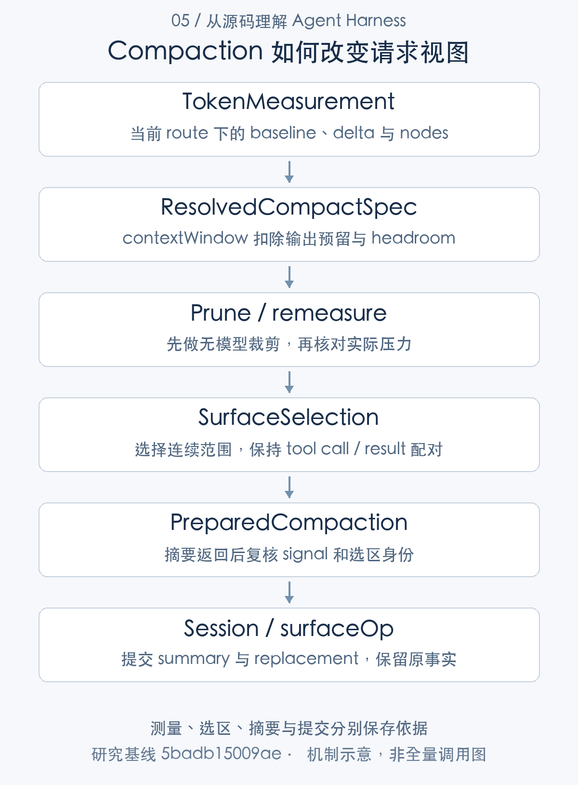
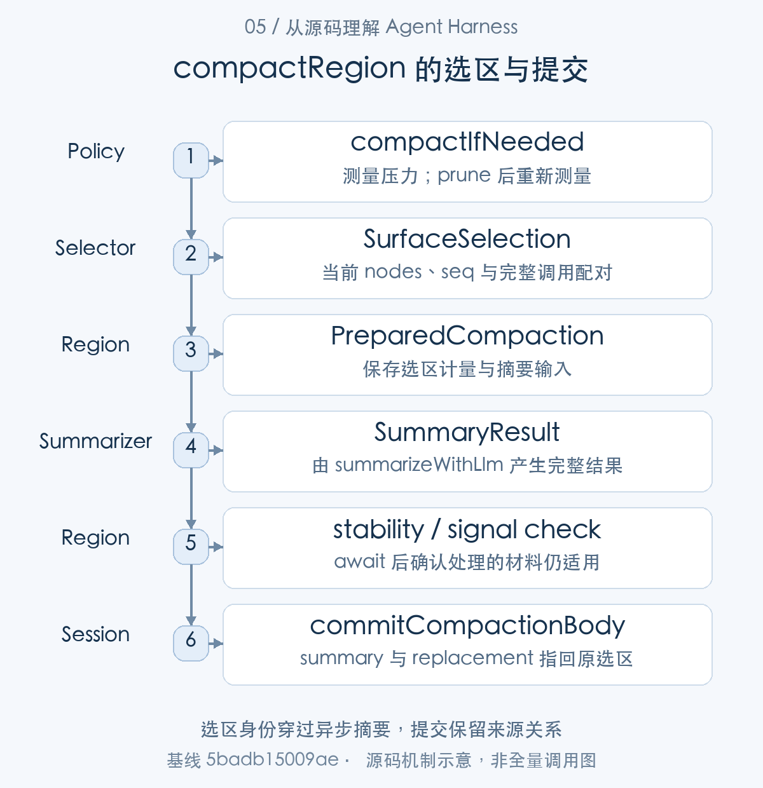
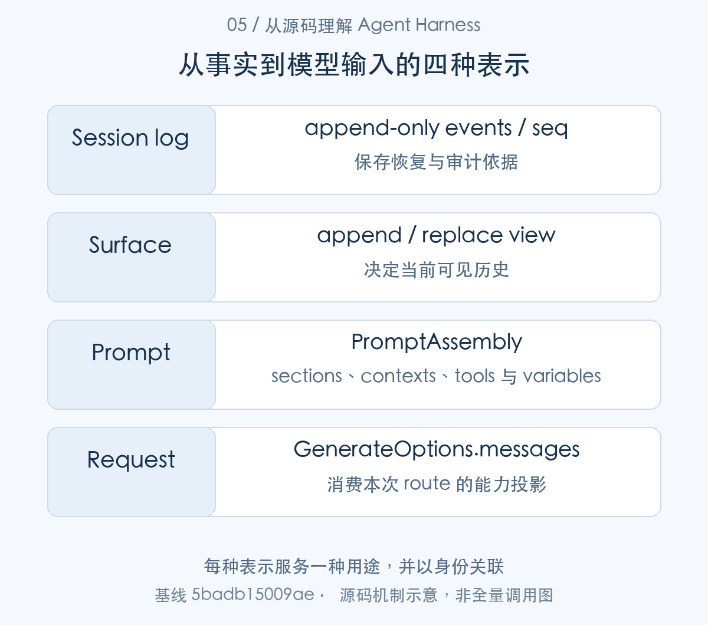
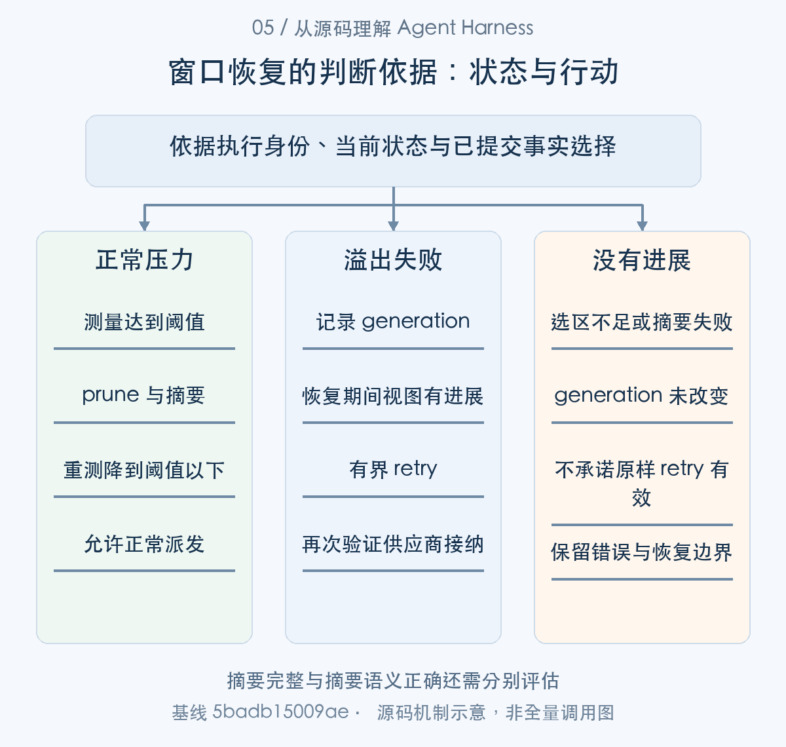

# 模型每次究竟看到什么：上下文组装与压缩

> 从源码理解 Agent Harness · 第 05 篇 · 上下文工程

Agent 修改代码时，读过的文件、工具输出、旧计划和失败测试会不断累积。等到模型拒绝请求，应用才发现历史超过窗口，此时简单删除最早几条消息可能把工具调用和结果拆开，也可能丢掉尚未完成的要求。

上下文工程因此需要回答两个问题：怎样从会话事实构造本次请求，以及输入过长后怎样改变这份视图。DeepSeek Harness 把事件日志、surface、projection 和模型 messages 分开，压缩也通过事件提交新视图。**原始历史保留什么，与当前模型看到什么，是两项不同责任。**


上下文工程在 DSH 中是一条数据转换链：Session 事件形成 surface，preStep 组装 PromptAssembly，请求从当前视图派生 messages；压力策略读取测量与路由，必要时选择历史区间、调用摘要器，再用日志提交新的 checkpoint。本文沿输入视图、选区身份、摘要结果和提交事实解释这条链，窗口错误恢复作为单独支线展开。

## 从事实到请求，需要四种表示

Session 日志记录发生了什么，包括用户输入、请求配置、模型输出、工具结果和压缩事实。surface 是当前参与模型请求的历史节点视图；它可以保留、追加或替换一部分节点。projection 则按事件维护系统提示、运行上下文或业务状态，`deriveMessages` 将当前视图转换为请求消息。[会话事件追加](https://github.com/deepseek-ai/deepseek-harness/blob/5badb15009ae1756c3afe0ae0cef1faafc290ccc/packages/core/session/src/index.ts#L718-L775) [请求消息派生](https://github.com/deepseek-ai/deepseek-harness/blob/5badb15009ae1756c3afe0ae0cef1faafc290ccc/packages/core/session/src/index.ts#L856-L904) [提示词与上下文投影](https://github.com/deepseek-ai/deepseek-harness/blob/5badb15009ae1756c3afe0ae0cef1faafc290ccc/packages/core/agent-loop/src/runtime-context.ts#L88-L164)

假设模型已读取三份大文件，当前只需要其中两个函数。事实日志应能说明这些读取发生过，请求却未必需要再次携带全部文件内容。只用一个数组同时承担审计与请求输入，会把保留历史和控制窗口变成相互冲突的操作。

DSH 的分层让替换视图成为明确动作。它并不自动判断哪些信息最有价值，而是提供可记录、可重建的处理机制；信息选择仍取决于插件策略、摘要质量和实际任务。




图1：测量、选区、摘要与提交分别保存依据。先按这张主线图建立对象地图，再结合下面的 caller、数据和返回路径展开。

### 第一步：日志保存原事实，请求由当前 surface 派生

先从 deriveMessages() 确认模型历史的数据来源。它消费当前 surface，而 surface 是事实日志派生的执行视图，后面的压缩改变的是这一视图。


```typescript
deriveMessages(): Message[] {
  const surface = this.surface
  const nodes = surface.nodes
  const generation = surface.contentGeneration
  if (generation !== this.derivedGeneration) {
    this.derived = []
    this.derivedNodes = 0
    this.derivedGeneration = generation
  }
  for (const seq of nodes.slice(this.derivedNodes)) {
    // Surface sequences are built from this.log — seq is always a valid
    // index by construction. The non-null assertion expresses that invariant.
    // oxlint-disable-next-line typescript/no-non-null-assertion
    const msg = this.deriveEventMessage(this.log[seq]!)
    // A surface node is one of the five message-producing types, but an
    // empty-content assistant/message (a max-tokens step that hosts only
    // usage) derives to null and must not enter the transcript.
    if (msg) this.derived.push(msg)
  }
  this.derivedNodes = nodes.length
  return [...this.derived]
```

[源码：`packages/core/session/src/index.ts:856–876`](https://github.com/deepseek-ai/deepseek-harness/blob/5badb15009ae1756c3afe0ae0cef1faafc290ccc/packages/core/session/src/index.ts#L856-L876)。

deriveMessages 先取得 surface.nodes 和 contentGeneration。代际发生变化时，清空派生缓存；否则仅从 derivedNodes 之后追加派生消息。每个 seq 指向真实日志事件，deriveEventMessage 应用已经提交的投影；某些只有 usage 的空 assistant 消息不进入 transcript。最后返回数组拷贝，而不是把内部缓存直接交给调用者。

这解释了为什么“日志条数增加”和“模型输入 token 增加”不具有简单比例。request/header、tool/call 等事实不都生成消息，surface replacement 又能令旧节点退出请求。排查上下文时应同时检查事件 seq、当前 nodes 和实际 deriveMessages，不能只把 snapshotEvents 全部转成字符串。

原事实与请求视图的分离，也允许压缩不破坏审计：被摘要替换的工具输出仍可由原事件定位。它不意味着日志永远都能被当前 provider 原样发送，附件、私有状态和工具能力还需模型边界投影。


## 上下文组装发生在什么时刻

每个 Step 的 preStep 先 claim 候选输入，再组装 SystemPrompt 和 runtime context，随后执行准入 waterfall。只有接纳后才进入请求阶段；被组装过的内容不等于已经提交给模型。工作区指令插件也在 accepted pre-step 中加入对应内容。[Step 前组装与准入](https://github.com/deepseek-ai/deepseek-harness/blob/5badb15009ae1756c3afe0ae0cef1faafc290ccc/packages/core/agent-loop/src/agent.ts#L267-L285) [工作区指令的接纳](https://github.com/deepseek-ai/deepseek-harness/blob/5badb15009ae1756c3afe0ae0cef1faafc290ccc/packages/context/agent-instructions/src/index.ts#L315-L340)

请求准备时解析精确路由，prompt projection 再按系统提示与工具更新能力调整历史。这样，prompt 不是固定字符串加聊天记录，而是由能力、配置、工作区和会话状态共同决定的可解释输入。

同一 Step 重试通常不重新执行 preStep，也不重新消费 inbox。attempt 每次重新准备请求，从当时 surface 派生消息；如果恢复器压缩了历史，下一 attempt 能使用新的视图，但普通 assembly 不会因此无条件全部重做。扩展开发者要分清“步骤前上下文”与“每次请求派生”。[Step 内重试循环](https://github.com/deepseek-ai/deepseek-harness/blob/5badb15009ae1756c3afe0ae0cef1faafc290ccc/packages/core/agent-loop/src/agent.ts#L398-L544) [每次请求的构建](https://github.com/deepseek-ai/deepseek-harness/blob/5badb15009ae1756c3afe0ae0cef1faafc290ccc/packages/core/agent-loop/src/agent.ts#L547-L686)

### 第二步：组装、接纳和派生发生在不同边界

回到调用顺序：turn() 调用 preStep() 取得 assembly 和准入消息，step() 再提交输入并派生 request。RuntimeContextProjection 在这次组装中决定需要追加的 context。

组装阶段交接的是 PromptAssembly：

```typescript
export interface PromptAssembly {
  sections: AssembledSection[]
  contexts: AssembledContext[]
  tools: ToolSchema[]
  variables: Record<string, string | undefined>
}
```

[源码：`packages/core/system-prompt/src/index.ts:118–123`](https://github.com/deepseek-ai/deepseek-harness/blob/5badb15009ae1756c3afe0ae0cef1faafc290ccc/packages/core/system-prompt/src/index.ts#L118-L123)。

|核心字段|保存的信息|使用位置|
|---|---|---|
|`sections` / `contexts`|尚待渲染的提示与上下文段|renderPrompt / renderContextSections|
|`tools` / `variables`|工具 schema 与渲染变量|本 Step 的请求构造|

它承载组装结果，Session surface 承载历史视图；两者在 step() 构建 request 时汇合。


```typescript
const claimed = this.inbox.claim(target, position.turn)
const assembly = await this.loopCtx.systemPrompt.assemble(assembleContextFor(this, signal))
signal.throwIfAborted()
const sections = renderContextSections(assembly)
const context = this.runtimeContext.project(joinContextSections(sections), sections)
const decision = await this.dispatch.waterfall(
  'agent/pre-step', { messages: claimed, ...position, signal },
  (): Promise<PreStepDecision> => Promise.resolve<PreStepDecision>({
    kind: 'enter',
    messages: context === undefined ? claimed : [...claimed, context],
  }),
)
signal.throwIfAborted()
if (decision.kind === 'reject') return decision
return { ...decision, assembly }
```

[源码：`packages/core/agent-loop/src/agent.ts:271–285`](https://github.com/deepseek-ai/deepseek-harness/blob/5badb15009ae1756c3afe0ae0cef1faafc290ccc/packages/core/agent-loop/src/agent.ts#L271-L285)。

claim 取走候选，assemble 等待各上下文贡献；随后 signal 检查，再构造 runtime context，最后进入 pre-step waterfall。runtime context 是候选消息，不是一次即时写日志；decision reject 时不会把它直接提交成已接纳输入。

动态上下文还有去重状态：

```typescript
project(current: string, sections: readonly ContextSnapshotSection[]): UserMessage | undefined {
  if (this.retained === undefined && current.length === 0) return
  const snapshot = current.length === 0 ? CLEARED : current
  if (this.retained?.text === snapshot) return
  return createUserMessage({
    content: [{ type: 'text', text: snapshot }],
    // The cleared marker has no contributions left to attribute.
    source: sections.length === 0
      ? { kind: SOURCE }
      : { kind: SOURCE, form: 'snapshot', sections },
  })
}
```

[源码：`packages/core/agent-loop/src/runtime-context.ts:152–163`](https://github.com/deepseek-ai/deepseek-harness/blob/5badb15009ae1756c3afe0ae0cef1faafc290ccc/packages/core/agent-loop/src/runtime-context.ts#L152-L163)。

没有历史且当前为空则不提交；有历史却清空内容时使用 CLEARED 标记；与 retained 相同则不再追加；变化才生成带来源归属的 user message。这个区别防止“暂时没有上下文”和“明确清除旧上下文”被混为同一状态。

每个 Step 只做一次这种组装，同 Step 重试则重新 prepare 与 derive。恢复插件改了 surface，下一 attempt 会看到新视图，但不会无条件重跑所有贡献者。因而放在 assemble、pre-step 或 request 的扩展，执行频率和可见材料并不相同。

## 先量化压力，再选择处理方式

请求视图已经形成，自动维护接下来读取实际路由和 TokenMeasurement。只有达到政策条件，才从测量进入裁剪和摘要；下面跟踪触发判断怎样转换为具体选区。

compaction-basic 使用 token meter 测量当前 surface，再结合精确模型窗口、输出预留和策略阈值判断压力。保留输出空间是必要的：请求能容纳全部输入，不代表还剩足够额度生成有效答案。

处理可以先做无需模型的工具结果裁剪，随后重测。如果压力消失，便不必再花一次摘要调用；仍有压力才选取摘要范围。窗口溢出的恢复路径也可以先裁剪，但其选区与普通压力路径的尾部保留策略并不完全相同。[压力测量、裁剪与摘要路径](https://github.com/deepseek-ai/deepseek-harness/blob/5badb15009ae1756c3afe0ae0cef1faafc290ccc/packages/compaction/compaction-basic/src/index.ts#L278-L346)

这一机制的价值是让恢复动作与实际输入联系起来。只是调用过 compact 方法不够；选不到区域、裁剪无效或窗口信息缺失，都可能意味着请求仍然没有可用的恢复依据。



图2：选区身份穿过异步摘要，提交保留来源关系。从 caller 的交接对象追到 consumer，具体分支结合正文源码阅读。

### 第三步：按实际路由和输出预留计算压力

自动维护进入 compactIfNeeded()，先取得 routedTarget，再用 TokenMeter 测量当前视图。resolveModelInfo() 与 resolveCompactSpec() 将窗口和输出预留带入阈值判断。


```typescript
const target = routedTarget(agent.session)
if (target === undefined) return null
const policy = resolveTargetPolicy(this.config, target)
const meter = this.ctx.tokenMeter
let measurement = meter.measure(agent.session)
```

[源码：`packages/compaction/compaction-basic/src/index.ts:274–278`](https://github.com/deepseek-ai/deepseek-harness/blob/5badb15009ae1756c3afe0ae0cef1faafc290ccc/packages/compaction/compaction-basic/src/index.ts#L274-L278)。

先从已经记录的 routedTarget 取得精确 provider/model，再选择其政策，最后用 tokenMeter 测量该 Session。还没有路由时返回 null，而不是拿一个全局猜测窗口强行裁剪。

```typescript
const info = await this.ctx.llm.resolveModelInfo(target.provider, target.model, signal)
assertNoActiveCompaction(agent.session, 'automatic pressure compaction')
const targetKey = `${target.provider}/${target.model}`
if (info.context === undefined) {
  throw new TargetPressureConfigError(
    targetKey,
    `compaction-basic: no context capacity for ${targetKey}; `
    + 'configure contextWindow on that adapter model',
  )
}
const spec = resolveCompactSpec(
  policy,
  info.context.contextWindow,
  reservedCompletionTokens(agent, info.defaultMaxTokens),
)
if (measurement.totalTokens < spec.thresholdTokens) return null
```

[源码：`packages/compaction/compaction-basic/src/index.ts:304–319`](https://github.com/deepseek-ai/deepseek-harness/blob/5badb15009ae1756c3afe0ae0cef1faafc290ccc/packages/compaction/compaction-basic/src/index.ts#L304-L319)。

resolveModelInfo 是异步查询；返回后检查没有活动压缩。未知 contextWindow 会报告配置问题，因为不能把“容量未知”当作无限容量。resolveCompactSpec 同时使用模型窗口与 reservedCompletionTokens，预留回答空间；输入能塞满窗口并不代表生成也能成功。

### 第四步：先做低成本裁剪，再判断是否需要摘要

压力通过判断后，compactIfNeeded() 先运行可选 pruner 并重测，再选择区间调用 compactRegion()。它消费上一阶段的 measurement，而不是固定删掉最后若干条消息。


```typescript
// Once pressure qualifies, land the model-free pass before choosing a
// summary range, then remeasure through the singleton replay fold.
if (prune !== undefined) {
  prune.pruneSession(agent.session)
  measurement = meter.measure(agent.session)
}
if (measurement.totalTokens < spec.thresholdTokens) return null

let result: CompactionResult | null = null
for (let attempt = 0; attempt <= spec.compactionRetries; attempt += 1) {
  const range = selectCompactableRange(agent.session, measurement, spec.retainTokens)
  if (range === null) {
    /* v8 ignore else -- concrete replacement preserves a compactable checkpoint; subclass hooks cannot mutate it. */
    if (result === null) return null
    /* v8 ignore next -- paired with the defensive post-success branch above. */
    break
  }
  result = await this.compactRegion(range.start, range.end, agent, signal)
  measurement = meter.measure(agent.session)
  if (measurement.totalTokens < spec.thresholdTokens) return result
```

[源码：`packages/compaction/compaction-basic/src/index.ts:321–340`](https://github.com/deepseek-ai/deepseek-harness/blob/5badb15009ae1756c3afe0ae0cef1faafc290ccc/packages/compaction/compaction-basic/src/index.ts#L321-L340)。

压力达到阈值才执行可选 toolResultPruner，随后重新测量。若已经低于阈值，直接返回，不增加摘要调用。仍有压力则根据 retainTokens 选区，执行 compactRegion，再测量；重试循环由 compactionRetries 限制，不能依靠摘要模型保证一次必然收缩。

overflow 支线与普通 pressure 不同：供应商已经确认窗口不足，可以绕过普通阈值与尾部保留政策，尝试一份有效缩减。裁剪 provider 可不挂载，这也是独立组合的边界。[窗口溢出下的可选裁剪与选区](https://github.com/deepseek-ai/deepseek-harness/blob/5badb15009ae1756c3afe0ae0cef1faafc290ccc/packages/compaction/compaction-basic/src/index.ts#L289-L302)


## 选区必须尊重工具历史的结构

裁剪后的测量仍显示压力时，策略需要把“保留多少”转换成合法的历史区间。选区同时维护 token 口径与 tool-call/result 配对，供异步摘要前后复核。

保留最后若干 token，并不等于可以从任意消息位置切开历史。工具调用与结果需要配对，否则下一模型可能看到悬空的 tool-call。下面的选区片段会检查尾部边界之前的配对情况，必要时继续向前移动。

```typescript
while (keepFromIdx > firstIdx) {
  // oxlint-disable-next-line typescript/no-non-null-assertion
  if (toolPairingBalancedBefore(session, surfaceNodes[keepFromIdx]!)) break
  keepFromIdx -= 1
}
if (keepFromIdx <= firstIdx) return null

// oxlint-disable-next-line typescript/no-non-null-assertion
const first = surfaceNodes[firstIdx]!
// oxlint-disable-next-line typescript/no-non-null-assertion
const cutoff = surfaceNodes[keepFromIdx - 1]!
return { start: first, end: cutoff }
```

[对应源码](https://github.com/deepseek-ai/deepseek-harness/blob/5badb15009ae1756c3afe0ae0cef1faafc290ccc/packages/compaction/compaction-basic/src/region.ts#L143-L154)。以上为原文片段，仅统一缩进，需结合完整实现阅读。

前面的测量还会检查 token meter 的节点与当前 surface 是否对应，避免根据过时测量切割新的历史。选区排除系统提示头，并在预算基础上寻找可压缩范围。这里既有数量约束，也有结构约束；后者不能靠“输入总 token 已减小”替代。[压缩范围选择的完整实现](https://github.com/deepseek-ai/deepseek-harness/blob/5badb15009ae1756c3afe0ae0cef1faafc290ccc/packages/compaction/compaction-basic/src/region.ts#L117-L154)

例如一次读取请求有三条工具结果，选区不能只保留 assistant 的调用而移除某个结果。对工具密集任务，结构正确比机械保留固定条数更重要，因为模型不仅需要文本，也需要知道各个结果属于什么操作。



图3：每种表示服务一种用途，并以身份关联。表中对象并列展示用途与寿命，层次之间以源码所示身份关联。

### 第五步：测量结果必须对应同一份 nodes

selectCompactableRange() 把测量映射到当前 nodes，先核对 seq，再算保留位置。位置只是候选边界，后续 pairing 检查还要使调用与结果保持完整。

选区进入摘要前扩展为 PreparedCompaction：

```typescript
interface PreparedCompaction extends SurfaceSelection {
  readonly measurement: TokenMeasurement
  readonly selectedNodes: TokenMeasurement['nodes']
  readonly shadowedTokenCount: number
  /** Route-priced total of the selected span; the shrink comparison's unit. */
  readonly shadowedRouteTokenCount: number
  readonly input: SummarizationInput
}
```

[源码：`packages/compaction/compaction-basic/src/region.ts:42–49`](https://github.com/deepseek-ai/deepseek-harness/blob/5badb15009ae1756c3afe0ae0cef1faafc290ccc/packages/compaction/compaction-basic/src/region.ts#L42-L49)。

|核心字段|保存的信息|使用位置|
|---|---|---|
|`measurement` / `selectedNodes`|对应选区的计量快照|稳定性与收缩检查|
|`shadowedTokenCount` / `shadowedRouteTokenCount`|节点及路由口径的大小|摘要记录与缩减比较|
|`input`|由选区生成的 SummarizationInput|摘要器|

它继承 SurfaceSelection 的 start/end、索引和 shadowedSeqs。保存选区身份与计量快照，返回时才有准确的比较对象。


```typescript
const pricedNodes = measurement.nodes
if (pricedNodes.length === 0) return null

const surfaceNodes = session.surface.nodes
if (surfaceNodes.length !== pricedNodes.length
  || surfaceNodes.some((seq, index) => seq !== pricedNodes[index]?.seq)) {
  throw new Error('compaction: token-meter surface does not match the current session surface')
}
// oxlint-disable-next-line typescript/no-non-null-assertion
const firstIdx = systemHead(session, surfaceNodes[0]!) === undefined ? 0 : 1

let accumulated = 0
let keepFromIdx = pricedNodes.length
for (let index = pricedNodes.length - 1; index >= 0; index -= 1) {
  // oxlint-disable-next-line typescript/no-non-null-assertion
  accumulated += pricedNodes[index]!.tokens
  keepFromIdx = index
  if (accumulated >= retainTokens) break
}
if (keepFromIdx <= firstIdx) return null
```

[源码：`packages/compaction/compaction-basic/src/region.ts:122–141`](https://github.com/deepseek-ai/deepseek-harness/blob/5badb15009ae1756c3afe0ae0cef1faafc290ccc/packages/compaction/compaction-basic/src/region.ts#L122-L141)。

pricedNodes 来自 tokenMeter，但先比较长度与每个 seq，拒绝过期测量。firstIdx 跳过 system head；从尾部累加 token 决定保留起点。keepFromIdx 到达 firstIdx，说明没有合适的前缀可压缩，返回 null。

原文后面的 pairing 循环再把边界往前移动，直到工具调用与结果不被切开。于是预算提供候选位置，结构规则决定位置是否合法。不能因为测量显示只剩 2,000 token，就默认保留下来的历史满足供应商工具协议。

例如 assistant 一次提出 A、B 两个读取，结果分别为 A、B。若只摘要 B 的结果却保留原 assistant 调用，模型会收到不平衡历史。这里的边界校验维护的是调用关系，不是自动保证所有业务约束都被摘要保留。

### 第六步：异步摘要期间，选区外变化与选区内变化区别处理

选区交给摘要器后可能发生 await，assertSelectedSpanStable() 在返回时再次确认旧区间。这里先看提交所需的身份条件，下一节再展开真正的摘要调用。


```typescript
let current: SurfaceSelection
try {
  current = validateSurfaceRegion(session, prepared.start, prepared.end)
} catch (error: unknown) {
  throw new SurfaceChangedError(
    'compaction: the selected span is no longer a valid replacement target',
    { cause: error },
  )
}
if (!isDeepStrictEqual([...current.shadowedSeqs], [...prepared.shadowedSeqs])) {
  throw new SurfaceChangedError('compaction: the selected span changed during summarization')
}
const measured = dependencies.meter.measure(session).nodes.slice(current.startIdx, current.endIdx + 1)
if (!isDeepStrictEqual(measured, prepared.selectedNodes)) {
  throw new SurfaceChangedError('compaction: the selected span was rewritten during summarization')
}
```

[源码：`packages/compaction/compaction-basic/src/region.ts:452–467`](https://github.com/deepseek-ai/deepseek-harness/blob/5badb15009ae1756c3afe0ae0cef1faafc290ccc/packages/compaction/compaction-basic/src/region.ts#L452-L467)。

validateSurfaceRegion 再确认原区间仍存在并连续；shadowedSeqs 必须相等，选区内的节点计量也必须相等。selected-span 稳定规则允许区间外新增节点继续可见，但不能拿针对旧内容的摘要覆盖重写过的选区。whole-surface 模式更严格，保护整份视图。

这不是只比较“历史条数没变”。即使条数相同，内容替换或节点身份变化也能让摘要失效。工作区快照和验收也需要类似的身份校验，不能拿返回时的新世界冒充开始时的材料。

## 摘要如何成为可重放的 checkpoint

合法选区确定后，compactRegion 的事务路径把它准备为摘要输入；摘要返回再校验同一范围并提交，确保新 checkpoint 能与旧事实建立关系。

压缩先追加 `compaction/start`，准备并直接调用 LLM 摘要器；它具有独立路由、maxTokens 和 usage，不是创建另一个 Agent。摘要结束后检查内容、取消状态和选区稳定性，再提交压缩正文与 end。[压缩过程和错误收尾](https://github.com/deepseek-ai/deepseek-harness/blob/5badb15009ae1756c3afe0ae0cef1faafc290ccc/packages/compaction/compaction-basic/src/region.ts#L173-L268) [摘要模型调用](https://github.com/deepseek-ai/deepseek-harness/blob/5badb15009ae1756c3afe0ae0cef1faafc290ccc/packages/compaction/compaction-basic/src/summarizer.ts#L120-L180)

提交包含两种事实：`compaction/summary` 保存摘要、来源范围和调用信息；带 surfaceOp 的 `user/message` 将选区替换为 checkpoint。历史事件没有因此被当场删除，重放日志也不需要重新询问摘要模型。[摘要与视图替换的提交](https://github.com/deepseek-ai/deepseek-harness/blob/5badb15009ae1756c3afe0ae0cef1faafc290ccc/packages/compaction/compaction-basic/src/region.ts#L470-L509)

空文本、error、aborted 和 max-tokens finish 都不能被当成完整摘要。截断摘要可能遗漏任务约束，如果继续把它作为可靠 checkpoint，后续执行看起来正常，实际信息却已经损坏。保守拒绝这些结算，是上下文质量控制的一部分。[摘要失败与截断检查](https://github.com/deepseek-ai/deepseek-harness/blob/5badb15009ae1756c3afe0ae0cef1faafc290ccc/packages/compaction/compaction-basic/src/summarizer.ts#L196-L209)

### 第七步：打开压缩边界后，才等待摘要器

compactRegion() 建立 compaction/start，再 prepareCompaction() 和 summarizeCompaction()；返回时检查 signal 与 stability，才进入 commitCompactionBody()。

压缩调用者通过事务选项说明运行场景：

```typescript
interface CompactionTransactionOptions {
  /** `current-turn` derives a numbered owner; `null` writes a standalone bracket. */
  readonly owner: 'current-turn' | null
  /** Surface relationship that must survive asynchronous summarization. */
  readonly stability: 'whole-surface' | 'selected-span'
  /** Optional durability checkpoint after a successfully closed bracket. */
  readonly flush?: () => Promise<void>
  /** Manual command that initiated this transaction, when present. */
  readonly sourceCommandId?: CommandId
}
```

[源码：`packages/compaction/compaction-basic/src/region.ts:55–64`](https://github.com/deepseek-ai/deepseek-harness/blob/5badb15009ae1756c3afe0ae0cef1faafc290ccc/packages/compaction/compaction-basic/src/region.ts#L55-L64)。

|核心字段|保存的信息|使用位置|
|---|---|---|
|`owner`|当前 Turn 或独立操作|start/end 归属|
|`stability`|whole-surface 或 selected-span|await 后稳定性检查|
|`flush` / `sourceCommandId`|可选持久屏障与命令来源|关闭及审计关联|

同一个 compact 操作由自动压力维护、窗口恢复或人工命令发起时，使用的稳定性和错误政策可以不同；调用者必须一起阅读。


```typescript
const compactionId = CompactionId(randomUUID())
const lifecycle = {
  compactionId,
  ...options.sourceCommandId === undefined ? {} : { sourceCommandId: options.sourceCommandId },
  turn: owner,
}
const startEvent = session.append('compaction/start', lifecycle)
const assertStable: StabilityCheck = options.stability === 'whole-surface'
  ? assertWholeSurfaceUnchanged
  : assertSelectedSpanStable
let failure: TransactionFailure | undefined
let flushFailure: unknown
let result: CompactionResult | undefined
let closed = false
let closing = false
let stage: TransactionFailure['stage'] = 'summary'
```

[源码：`packages/compaction/compaction-basic/src/region.ts:204–219`](https://github.com/deepseek-ai/deepseek-harness/blob/5badb15009ae1756c3afe0ae0cef1faafc290ccc/packages/compaction/compaction-basic/src/region.ts#L204-L219)。

生成 compactionId，记录所属 Turn 和可选 commandId，然后追加 compaction/start。start 与前面的活动检查同步相邻，因此日志中的开放边界能被其他操作发现。随后选择稳定规则并准备失败阶段标记：summary 与 commit 分开，便于解释错误发生在哪里。

compaction/start 已提交，下面继续沿 compactRegion() 的 try 分支。prepareCompaction() 把选区变成摘要材料，await summarizeCompaction() 返回后复核稳定性，再交给 commitCompactionBody()；下一步会进入摘要器的模型调用。

```typescript
try {
  const prepared = prepareCompaction(dependencies, session, selection)
  const summarized = await summarizeCompaction(
    dependencies,
    prepared,
    agent,
    compactionId,
    options.sourceCommandId,
    assertStable,
    signal,
  )
  if (options.owner === null) signal?.throwIfAborted()
  assertStable(dependencies, session, summarized)
  stage = 'commit'
  const pending = commitCompactionBody(session, startEvent, summarized)
  closing = true
  const endEvent = session.append('compaction/end', lifecycle)
  closed = true
  result = completeCompaction(pending, endEvent)
```

[源码：`packages/compaction/compaction-basic/src/region.ts:221–239`](https://github.com/deepseek-ai/deepseek-harness/blob/5badb15009ae1756c3afe0ae0cef1faafc290ccc/packages/compaction/compaction-basic/src/region.ts#L221-L239)。

prepareCompaction 形成待摘要输入；await summarizeCompaction 后先检查取消和稳定性，才执行 commitCompactionBody。closing 设为 true 后尝试 end；不能因为摘要文本已经生成，就对外宣布一次完整压缩成功。

### 第八步：摘要是辅助 LLM 调用，不是一个新的 Agent Turn

summarizeCompaction() 所需的模型摘要由 summarizeWithLlm() 提供。它直接调用 LLM，返回 SummaryResult 给 compaction 路径；不创建新的 Agent driver。


```typescript
const options: GenerateOptions = {
  provider: target.provider,
  model: target.model,
  messages,
  toolHistory: agent.session.toolHistory(),
  ...input.tools === undefined ? {} : { tools: [...input.tools] },
  maxTokens: config.maxTokens,
  sessionId: agent.session.id,
  purpose: 'compaction',
  ...signal === undefined ? {} : { signal },
}
for await (const chunk of ctx.llm.stream(options)) assembler.push(chunk)
const error = finishError(assembler.finish)
if (error !== undefined) throw error

const rawOutput = assembler.blocks()
const summary = summaryText(rawOutput)
if (!summary.some(block => block.text.trim().length > 0)) {
  throw new Error('summarization produced no text summary content')
}
return {
  summary,
  rawOutput,
  llmStreamCall: true,
  provider: options.provider,
  model: options.model,
  maxTokens: config.maxTokens,
  ...(assembler.usage === undefined ? {} : { usage: assembler.usage }),
}
```

[源码：`packages/compaction/compaction-basic/src/summarizer.ts:152–180`](https://github.com/deepseek-ai/deepseek-harness/blob/5badb15009ae1756c3afe0ae0cef1faafc290ccc/packages/compaction/compaction-basic/src/summarizer.ts#L152-L180)。

GenerateOptions 带 purpose=compaction、独立 maxTokens、sessionId 和 signal，直接走 ctx.llm.stream。assembler 收集内容与 usage；finishError 通过后还检查非空文本。返回值保留 provider、model、原输出和用量，允许审计区分主任务与辅助调用。

```typescript
/** Map a terminal summarization finish to its fail-closed error. */
function finishError(finish: FinishReason): Error | undefined {
  switch (finish.kind) {
    case 'error':
    case 'aborted': {
      return new LlmError(finish.failure.message, finish.failure.code, finish.failure)
    }
    case 'max-tokens': {
      const error = new Error('summarization truncated at the token cap (incomplete checkpoint)') as Error & { code?: string }
      error.code = 'MAX_TOKENS'
      return error
    }
    default:
      return undefined
```

[源码：`packages/compaction/compaction-basic/src/summarizer.ts:196–209`](https://github.com/deepseek-ai/deepseek-harness/blob/5badb15009ae1756c3afe0ae0cef1faafc290ccc/packages/compaction/compaction-basic/src/summarizer.ts#L196-L209)。

error、aborted 抛出 LlmError；max-tokens 也明确拒绝，因为截断结果不能充当完整 checkpoint。普通主回答可以保留截断前缀，摘要却要承担后续历史的主要信息来源，容忍策略因此不同。

### 第九步：摘要记录与替换用户消息都进入日志

SummaryResult 通过完整性和稳定性检查后，commitCompactionBody() 追加 summary 与替换消息。sourceEventSeqs 把新 checkpoint 关联到被替换范围和本次摘要。


```typescript
const summaryEvent = session.append('compaction/summary', {
  compactionId: startEvent.data.compactionId,
  ...startEvent.data.sourceCommandId === undefined
    ? {}
    : { sourceCommandId: startEvent.data.sourceCommandId },
  summary,
  ...callRecord,
  shadowedRange: { start, end },
  shadowedSeqs: [...shadowedSeqs],
  shadowedTokenCount,
  provider,
  model,
  ...maxTokens === undefined ? {} : { maxTokens },
  ...usage === undefined ? {} : { usage },
})
session.append('user/message', checkpointMessage, {
  surfaceOp: { op: 'replace', startSeq: start, endSeq: end },
  sourceEventSeqs: [startEvent.seq, summaryEvent.seq, ...shadowedSeqs],
})
```

[源码：`packages/compaction/compaction-basic/src/region.ts:491–509`](https://github.com/deepseek-ai/deepseek-harness/blob/5badb15009ae1756c3afe0ae0cef1faafc290ccc/packages/compaction/compaction-basic/src/region.ts#L491-L509)。

compaction/summary 记录文本、被遮盖的 seq、token 数、路由及 usage。紧接着追加 checkpoint user/message，surfaceOp 指定原区间替换，sourceEventSeqs 连接 start、summary 和被摘要节点。重放只需消费这些事实，不需要重新让模型产生相同摘要。

这里两次 append 同步执行，避免中间 yield；它仍不是数据库事务式全回滚。如果 summary 已追加但 checkpoint 或 end 失败，日志要保留异常边界以便恢复解释。错误分支至多再尝试一次 compaction/end，关闭失败会保留 unmatched start。[压缩错误、关闭失败与刷新失败](https://github.com/deepseek-ai/deepseek-harness/blob/5badb15009ae1756c3afe0ae0cef1faafc290ccc/packages/compaction/compaction-basic/src/region.ts#L240-L270)


## 窗口错误重试需要“进展证明”

当供应商报告上下文窗口溢出，恢复器记录处理前的 replaceGeneration，等待压缩，再用下面的条件决定是否返回 retry。

```typescript
if (signal.aborted
  || agent.session.surface.replaceGeneration <= generation) return next()
if (result !== null) logResult(result, 'context overflow recovery')
this.overflowRetries.set(agent, retries + 1)
return { kind: 'retry' }
```

[对应源码](https://github.com/deepseek-ai/deepseek-harness/blob/5badb15009ae1756c3afe0ae0cef1faafc290ccc/packages/compaction/compaction-basic/src/index.ts#L229-L233)。以上为原文片段，仅统一缩进，需结合完整实现阅读。

请求视图的替换代际必须前进，且取消没有发生。若压缩没有改变输入，反复发送同一份过长请求只会重复失败。代码还处理一个更细的情况：无需模型的裁剪先成功，后续可选摘要失败，只要视图已经前进，仍可以以这份进展为依据重试。[溢出恢复的完整分支](https://github.com/deepseek-ai/deepseek-harness/blob/5badb15009ae1756c3afe0ae0cef1faafc290ccc/packages/compaction/compaction-basic/src/index.ts#L190-L234)

replaceGeneration 提供的是视图变化证据，不是摘要语义正确的证明。它解决“恢复动作有没有落地”，业务信息是否完整还依赖摘要策略和评测；两项判断不能混淆。



图4：摘要完整与摘要语义正确还需分别评估。各分支基于自己的证据返回决定，不按完成文案推断下一动作。

### 第十步：先记录代际，再判断恢复是否真正改变请求视图

这里转到供应商窗口溢出的恢复支线：request-error listener 调用同一压缩能力，并比较 replaceGeneration。只有请求视图真实前进，才返回 retry 进入原 Step 的新 attempt。


```typescript
if (failure.code !== CONTEXT_WINDOW_EXCEEDED_CODE || signal.aborted) return next()
this.overflowAgents.set(agent.session, agent)
const target = routedTarget(agent.session)
if (target === undefined) return next()
const policy = resolveTargetPolicy(this.config, target)
const retries = this.overflowRetries.get(agent) ?? 0
if (retries >= policy.maxOverflowRetries) return next()

const generation = agent.session.surface.replaceGeneration
let result: CompactionResult | null
try {
  result = await this.compactIfNeeded(agent, 'context-overflow', signal)
```

[源码：`packages/compaction/compaction-basic/src/index.ts:194–205`](https://github.com/deepseek-ai/deepseek-harness/blob/5badb15009ae1756c3afe0ae0cef1faafc290ccc/packages/compaction/compaction-basic/src/index.ts#L194-L205)。

只处理 CONTEXT_WINDOW_EXCEEDED，取消直接让下游接管；解析路由政策与本序列 retries，达到 maxOverflowRetries 不再恢复。generation 在恢复之前捕获，后面的比较才有意义。记录一次“compact 已被调用”不足以决定 retry。

原文正常返回分支要求 replaceGeneration 前进。异常分支也有同样原则：

```typescript
} catch (recoveryError: unknown) {
  const message = recoveryError instanceof Error ? recoveryError.message : String(recoveryError)
  // A model-free prune can land before later summary work fails. That
  // durable reduction is sufficient retry proof; do not discard it just
  // because the optional second phase threw. Cancellation still wins.
  // oxlint-disable-next-line typescript/no-unnecessary-condition -- the signal can abort while recovery is awaited.
  if (!signal.aborted && agent.session.surface.replaceGeneration > generation) {
    ctx.logger.warn(
      `context-overflow compaction failed after durable surface progress: ${message}; `
      + 'retrying from the replacement surface',
    )
    this.overflowRetries.set(agent, retries + 1)
    return { kind: 'retry' }
  }
  ctx.logger.warn(
    // oxlint-disable-next-line typescript/no-unnecessary-condition -- the signal can abort while recovery is awaited.
    `context-overflow compaction failed: ${message}; ${signal.aborted
      ? 'cancellation prevents retry'
      : 'preserving the original request error'}`,
  )
  return next()
```

[源码：`packages/compaction/compaction-basic/src/index.ts:206–226`](https://github.com/deepseek-ai/deepseek-harness/blob/5badb15009ae1756c3afe0ae0cef1faafc290ccc/packages/compaction/compaction-basic/src/index.ts#L206-L226)。

前面的无模型裁剪可能已经提交，而后续可选摘要失败。若未取消且视图代际已前进，仍允许从缩减后的输入重试；没有进展则保留原请求失败，避免相同过长输入无效重复发送。取消优先于这种恢复机会。

成功 assistant/message 与返回 idle 会重置相应恢复序列计数，因此这是局部窗口恢复计数，不是整个任务终身压缩额度。[窗口恢复计数的清理](https://github.com/deepseek-ai/deepseek-harness/blob/5badb15009ae1756c3afe0ae0cef1faafc290ccc/packages/compaction/compaction-basic/src/index.ts#L178-L188)

代际证明“恢复动作落到了视图”，不证明摘要保留了所有语义。把两者分别测量，才不会用较小 token 数掩盖遗漏需求。

## 这套架构解决了什么，又留下了什么

它的优势是事实日志和请求优化可以同时成立，模型历史替换可被重建，工具配对与取消也有明确检查。先裁剪后重测能避免不必要摘要，进展检查则减少无效溢出重试。

代价是多层表示带来额外复杂度。某个字段在日志中存在，不代表当前请求仍携带它；提示词变化也不能只看最终字符串。压缩还引入独立模型成本与延迟，摘要可能损失细节，策略阈值不合适时会频繁压缩或过晚介入。源码没有让这些风险消失。

工程上可以为任务保留不可压缩的关键约束，并评测摘要前后是否丢失目标、失败结论和待完成工作。这属于应用策略建议，不能写成 DSH 原生已经保证了语义无损。

### 把压缩失败放回实际阶段解释

|阶段|可观察事实|合理处理|
|---|---|---|
|测量或选区失败|nodes 不匹配、没有可替换区间|重新测量或保留原错误，不能假报已压缩|
|摘要失败|start 已有，模型输出为空或截断|记录失败 end，保留原视图|
|提交失败|摘要与替换可能只完成部分 append|保留日志边界，按真实事实恢复|
|可选摘要失败但裁剪成功|replaceGeneration 已增长|未取消时可依据既有进展重试|
|刷新失败|内存记录完成，但存储检查点失败|区别说明执行与持久结果|

优势是请求优化可以被追溯、工具结构不会被任意切割、窗口重试需要实际缩减。代价是多层表示与辅助模型带来维护、时延和成本；稳定性规则保护选区身份，却不承担摘要语义质量。企业可以给关键约束独立保存不可压缩事实，并用任务集评测摘要前后信息保留，这属于额外策略而非现成保证。

## 技术心得：优化应针对视图，审计应保留事实

### 用不同表示服务不同读者

日志保留行动事实，surface 决定当前历史，PromptAssembly 组织提示，request.messages 交给模型。我的收获是，把数据表示与用途一起定义，再用 seq 和 replacement 事实连接它们，既便于执行优化，也便于回看优化前的过程。

### 让异步优化带着材料身份返回

PreparedCompaction 保存选区和计量快照，摘要返回后重新检查原区间。这个实践可用于任何后台重写：先记录处理哪份材料，完成后确认它仍适用，再提交替换结果。

### 以视图进展决定恢复

pruner 之后重新测量，窗口恢复比较 replaceGeneration，二者都检查动作实际带来的改变。应用策略可以进一步保存关键约束，并用任务集对比摘要前后的目标、结论和待办，形成执行压力与信息质量两份评测。

对持续代码修复，务实的目标是让模型保留当前任务、关键失败和未完成工作，同时让 Session 仍可追溯原始工具结果。本文的选区、稳定性与提交协议给出了实现这一目标的基础。

---

研究基线：DeepSeek Harness `0.2.1-alpha.1`，提交 `5badb15009ae1756c3afe0ae0cef1faafc290ccc`。源码事实以该版本为准；文中的工程判断和改造建议另行说明。教学场景不代表真实模型业务实测。

源码与运行记录可从[证据索引](../appendices/evidence-index.md)和[验证附录](../appendices/validation.md)复核。本文引用此前同一提交的验证结果，本轮写作不将其重新计为新测试。

[专栏目录](README.md) · [上一篇](04-model-adaptation.md) · [下一篇](06-state-persistence.md)
