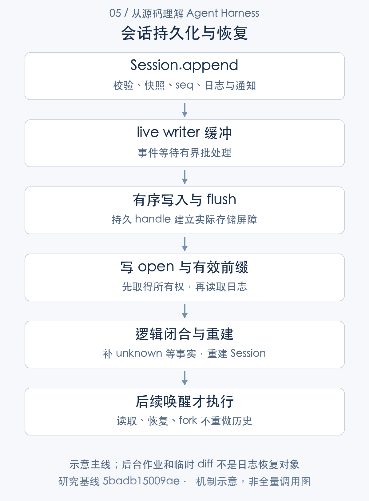

# 进程重启之后：Agent 的状态、记忆与持久化

> 从源码理解 Agent Harness · 第 05 篇 · 记忆、状态与持久化

一个 Agent 连续工作了半小时，已经读文件、修改代码并启动测试。如果进程此时重启，“恢复会话”究竟意味着什么？能看到聊天记录，能继续理解上下文，能重建输入队列，还是能接着追踪那个测试进程？这些能力经常被一起称为记忆，实际依赖完全不同的状态。

研究 DeepSeek Harness 的持久化，首先应区分：**会话事实、派生视图、运行对象和外部记忆，不能靠同一种恢复承诺覆盖。** 本文从重启场景出发，分析 Session 与 JSONL 如何协作，以及它们刻意保留的不确定性。

## 先识别状态由谁拥有

Session 事件记录用户输入、模型输出、工具调用、目标变更等事实。projection 从这些事件折叠出当前状态，surface 决定模型请求使用哪些历史节点。两者可以根据日志重新建立，但并不意味着所有进程对象都可重建。[Session 事实日志](https://github.com/deepseek-ai/deepseek-harness/blob/5badb15009ae1756c3afe0ae0cef1faafc290ccc/packages/core/session/src/index.ts#L718-L775) [投影注册与重建](https://github.com/deepseek-ai/deepseek-harness/blob/5badb15009ae1756c3afe0ae0cef1faafc290ccc/packages/session/session-projection/src/index.ts#L253-L355)

live assistant 字块、自动目标的进程内 activation、jobs-local 记录和 workspace diff 缓存还依赖活实例。外部 MCP memory 又是另外的数据服务，默认关闭，启用后通过 MCP 工具提供长期记忆能力。它的存储、备份和可用性属于外部服务责任。[目标激活状态](https://github.com/deepseek-ai/deepseek-harness/blob/5badb15009ae1756c3afe0ae0cef1faafc290ccc/packages/goal/goal/src/index.ts#L240-L280) [本地作业记录](https://github.com/deepseek-ai/deepseek-harness/blob/5badb15009ae1756c3afe0ae0cef1faafc290ccc/packages/jobs/jobs-local/src/index.ts#L128-L224) [外部 MCP 记忆配置](https://github.com/deepseek-ai/deepseek-harness/blob/5badb15009ae1756c3afe0ae0cef1faafc290ccc/docs/user/guide/mcp-memory.md#L5-L31)

因此“所有历史都保存了”不是足够精确的产品说明。应列出恢复对象、数据来源、重建方式及不能恢复的部分，让用户知道哪些动作仍需重新确认。



## Session.append 提交了什么

Session.append 是同步事实追加入口。实现先对数据和 surface 元信息进行 JSON 快照、校验并冻结事件，分配 seq，检查下一事件是否合法，然后将事件放入日志，最后通知观察者。[追加事件的完整实现](https://github.com/deepseek-ai/deepseek-harness/blob/5badb15009ae1756c3afe0ae0cef1faafc290ccc/packages/core/session/src/index.ts#L718-L775)

```typescript
validateSessionEventData(event, `session event "${type}" at seq ${event.seq}`)
this.surfaceManager.validateNext(event as SessionEvent)

if (entry !== undefined) entry.appending = true
try {
  let callbacks: SessionCallback[] | undefined
  const callbackArgs: unknown[] = [this, event]
  if (entry !== undefined) {
    callbacks = collectSessionCallbacks(entry.emitCtx, [entry.carrier, 'session/event', ...callbackArgs])
  }
  this.log.push(event as SessionEvent)
  this.eventsSnapshot = undefined
  if (callbacks !== undefined && entry !== undefined) {
    invokeContainedSessionObservers(entry.emitCtx, 'session/event', entry.id, callbackArgs, callbacks)
  }
  return event
} finally {
  if (entry !== undefined) {
    entry.appending = false
    if (entry.detachRequested && !entry.announcing) entry.detach()
  }
}
```

[对应源码](https://github.com/deepseek-ai/deepseek-harness/blob/5badb15009ae1756c3afe0ae0cef1faafc290ccc/packages/core/session/src/index.ts#L747-L768)。以上为原文片段，仅统一缩进，需结合完整实现阅读。

这里的 `log.push` 与后面的 observer 通知明确了顺序：观察者收到的是已进入会话的事件。观察异常由局部包含机制处理，不应任由某个展示插件阻止其他消费者。entry.appending 还用于防止发布期间重入，同一追加过程不能无约束地再次进入自己。

这段代码没有等待磁盘。持久 provider 订阅 live 事件后，事件可能先进入缓冲，再通过有界批处理写入文件。需要区分 live Session.append、持久 handle.append 与 sessions.flush，三个名字相近，却承担不同的完成条件。

## JSONL handle 把写入变成有序操作

JSONL handle 的显式 append 会在入队前校验并快照整个 batch，再通过自身操作链执行 persistContiguous。flush 同样进入这条链，并在空会话尚未物化时保存 header。

```typescript
async append(events: readonly SessionEvent[], options?: SessionHandleAppendOptions): Promise<void> {
  this.assertOpen('append')
  // Validate and deep-snapshot the batch HERE, before queueing behind the
  // chain, so the checked value is exactly the value persisted.
  const batch = materializeAppendBatch(events)
  return this.run('append', async () => {
    options?.signal?.throwIfAborted()
    await this.persistContiguous(batch)
  })
}

/**
 * Durability barrier; materializes the artifact when nothing has been
 * appended yet, so an explicitly flushed empty session survives this process.
 * @param options - optional cancellation observed before the barrier starts.
 */
flush(options?: SessionHandleFlushOptions): Promise<void> {
  return this.run('flush', async () => {
    options?.signal?.throwIfAborted()
    if (this.access !== 'write') throw new SessionReadOnlyError(this.id, 'flush')
    if (this.state.materialized) return // appends are durable on resolution
    await this.ensureLease()
    await this.storage.persistHeader(this.header, this.state.inheritedEventCount)
    this.state.materialized = true
  })
}
```

[对应源码](https://github.com/deepseek-ai/deepseek-harness/blob/5badb15009ae1756c3afe0ae0cef1faafc290ccc/packages/session/session-persistence-jsonl/src/storage.ts#L187-L212)。以上为原文片段，仅统一缩进，需结合完整实现阅读。

提前快照避免调用者在等待队列期间修改数据，最终写入的必须是已校验的值。操作链提供同一 handle 的顺序，不能自动变成多个进程之间的锁；跨进程写入另有所有权机制。

create 先建立 pending handle，首次 append 或显式 flush 才物化存储。一个尚未物化的会话可能随进程退出而消失。close 则反复排空 live 缓冲，等待操作链，再释放内核 lease 和进程 claim；即使清理失败，也要避免把会话身份永久卡在进程内。[JSONL 创建和打开](https://github.com/deepseek-ai/deepseek-harness/blob/5badb15009ae1756c3afe0ae0cef1faafc290ccc/packages/session/session-persistence-jsonl/src/index.ts#L314-L435) [handle 写入、flush 与关闭](https://github.com/deepseek-ai/deepseek-harness/blob/5badb15009ae1756c3afe0ae0cef1faafc290ccc/packages/session/session-persistence-jsonl/src/storage.ts#L187-L263)

## 写所有权为什么需要两层检查

写 open 先取得进程内 claim，随后取得跨进程 kernel lease，占用冲突报告 `SessionAlreadyOwnedError`。前者防止本进程重复占有，后者处理其他进程的竞争，两者解决不同范围的问题。

POSIX 实现使用原生 flock，锁随句柄和进程生命周期释放。活着但挂起的 writer 不会仅因等待过久就被抢走所有权，这与基于时间续约的分布式 lease 不同。Windows 使用 named semaphore；本研究的实际锁测试发生在 macOS，不能据此宣称两平台都验证通过。[会话写锁的获取和释放](https://github.com/deepseek-ai/deepseek-harness/blob/5badb15009ae1756c3afe0ae0cef1faafc290ccc/packages/session/session-persistence-jsonl/src/lease.ts#L70-L134)

这种设计适合本地文件的单 writer 管理。若换成多主机数据库存储，不能仅实现相同方法名，还需要重新定义所有权、并发写入、提交可见性与恢复语义；接口相同不代表一致性要求相同。

## checkpoint 提前保存事实，但不包办外部事务

session-checkpoint-policy 在 LLM stream、顶层 tools/execute 和 pre-step 前 flush，嵌套调用复用外层屏障。它可以在进入重要执行前缩小尚未写盘的窗口。[执行前 checkpoint](https://github.com/deepseek-ai/deepseek-harness/blob/5badb15009ae1756c3afe0ae0cef1faafc290ccc/packages/session/session-checkpoint-policy/src/index.ts#L54-L83)

例如上传工具的调用已经记录并 flush，再发送远端请求，至少恢复时有机会知道它曾进入执行。但远端成功和本地结果写入之间仍有窗口：进程可能在两者之间退出。JSONL 与远端服务没有统一两阶段提交，checkpoint 不能把这项操作变成恰好发生一次。

同样，turn/end 和 whenIdle 是循环状态，不是普遍 fsync 保证。应用需要立即磁盘可见时，应明确等待存储屏障，而不是从 Agent 不再运行推导数据已经安全保存。

## resume 和 fork 都不会重做历史

resume 以写方式打开存储，读取有效前缀，识别未闭合的 Turn／Step／工具调用，追加必要 closers，再准备 Session、选项与投影，执行 setup 并发布实例。恢复本身不调用模型，后续唤醒才进入执行。[Agent 恢复入口](https://github.com/deepseek-ai/deepseek-harness/blob/5badb15009ae1756c3afe0ae0cef1faafc290ccc/packages/core/agent-loop/src/index.ts#L807-L866) [未闭合事件修复](https://github.com/deepseek-ai/deepseek-harness/blob/5badb15009ae1756c3afe0ae0cef1faafc290ccc/packages/core/session/src/repair.ts#L14-L97)

缺 tool/result 时，已经记录开始的调用补 unknown，没有记录开始的调用标 not-started。恢复器说明本地知道什么，不猜测外部发生了什么。未持久化的 live 字块也不能从空白处推导出来。

fork 复制包含指定边界的历史前缀，再追加 seed 和分支闭合事件。父会话可能在分支点之后继续执行，所以子会话没有某项工具结果，不证明父会话未完成该操作。复制历史与再次执行历史分开，对有副作用工具尤为重要。[fork seed 构造](https://github.com/deepseek-ai/deepseek-harness/blob/5badb15009ae1756c3afe0ae0cef1faafc290ccc/packages/core/session/src/fork.ts#L1-L30)

物理文件尾部不完整与逻辑事件未闭合也要分开处理。前者读有效前缀并在后续写操作修复存储；后者补足事件结构。把两者统一叫“恢复成功”，会掩盖实际上恢复到了哪个位置。

## 可恢复事实与不可恢复缓存

workspace-changes 把 Turn 身份写入日志，却将完整 summary 和 sources 放在内存索引与临时资源中。重启后日志仍可说明这一 Turn 曾有变化记录，旧 diff 未必还能继续查询。jobs-local 同样不能凭会话恢复就重新生成生产者。[工作区记录的保存方式](https://github.com/deepseek-ai/deepseek-harness/blob/5badb15009ae1756c3afe0ae0cef1faafc290ccc/packages/deliverables/workspace-changes/src/recorder.ts#L342-L369) [临时资源的释放](https://github.com/deepseek-ai/deepseek-harness/blob/5badb15009ae1756c3afe0ae0cef1faafc290ccc/packages/deliverables/workspace-changes/src/recorder.ts#L242-L251)

若产品要求长期查看旧 diff、下载旧文件或恢复后台任务，应为这些对象增加独立持久存储与版本、状态查询和权限控制。这是应用改造建议，不是 Session 日志已经覆盖的能力。

会话格式本身由静态 catalog 负责历史 codec 和迁移，当前 writer 为 4。普通读取不为了升级覆写旧文件，迁移写入发布新 generation；前代保持，当前 generation 仍可追加。数据兼容与运行恢复是两个问题，后续部署篇会专门展开。[格式 catalog](https://github.com/deepseek-ai/deepseek-harness/blob/5badb15009ae1756c3afe0ae0cef1faafc290ccc/packages/session/session-format-catalog/src/generated.ts#L16-L48) [generation 解析](https://github.com/deepseek-ai/deepseek-harness/blob/5badb15009ae1756c3afe0ae0cef1faafc290ccc/packages/session/session-persistence-jsonl/src/index.ts#L1446-L1482)

## 技术心得：恢复能力要按对象承诺

这套设计的优势是事实、模型视图和运行对象分工清楚，重放不重做副作用，写锁和 checkpoint 各有明确职责。代价则是应用要承担多种状态的整合，不能对用户只说一句“支持断点续跑”。

我的技术心得是：恢复能力应该表达为“从什么事实重建什么对象”，并明确缺失结果。对于低风险对话，恢复日志已经足够；对于交易、后台构建和长期产物，则需要另外的查询与持久协议。

此前 JSONL、lease、migration 与 resume／repair 测试验证本机临时数据下的选定行为。它们没有证明停电零损失、跨主机并发存储、外部 MCP 可用性或所有后台资源重启恢复。保持这些边界，才能让持久化成为可信的工程能力。

---

研究基线：DeepSeek Harness `0.2.1-alpha.1`，提交 `5badb15009ae1756c3afe0ae0cef1faafc290ccc`。源码事实以该版本为准；文中的工程判断和改造建议另行说明。教学场景不代表真实模型业务实测。

源码与运行记录可从[证据索引](../appendices/evidence-index.md)和[验证附录](../appendices/validation.md)复核。本文引用此前同一提交的验证结果，本轮写作不将其重新计为新测试。

[专栏目录](README.md) · [上一篇](04-context-engineering.md) · [下一篇](06-tool-runtime.md)
