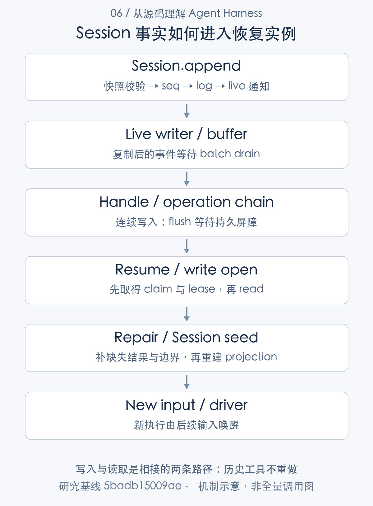
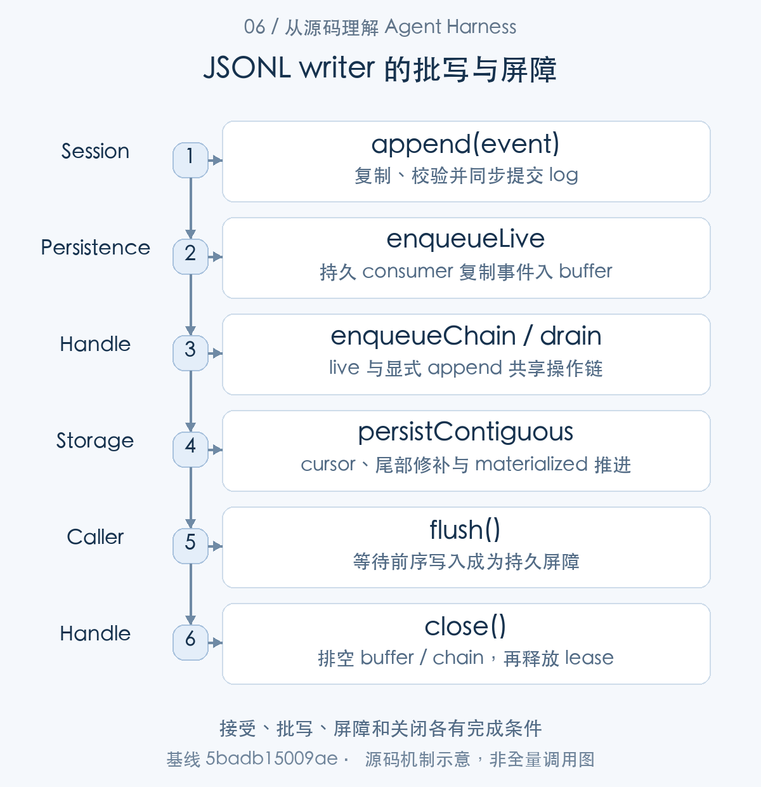
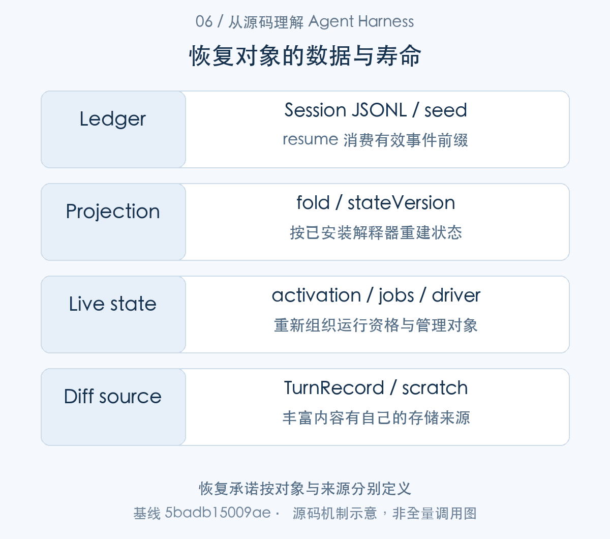
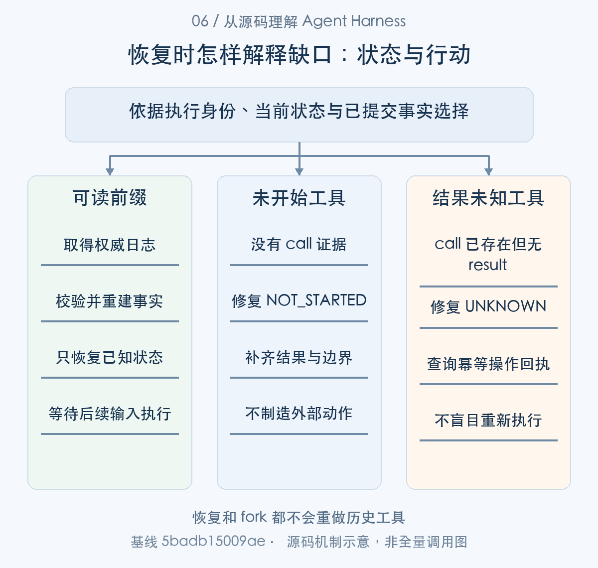

# 进程重启之后：Agent 的状态、记忆与持久化

> 从源码理解 Agent Harness · 第 06 篇 · 记忆、状态与持久化

一个 Agent 连续工作了半小时，已经读文件、修改代码并启动测试。如果进程此时重启，“恢复会话”究竟意味着什么？能看到聊天记录，能继续理解上下文，能重建输入队列，还是能接着追踪那个测试进程？这些能力经常被一起称为记忆，实际依赖完全不同的状态。

研究 DeepSeek Harness 的持久化，首先应区分：**会话事实、派生视图、运行对象和外部记忆，不能靠同一种恢复承诺覆盖。** 本文从重启场景出发，分析 Session 与 JSONL 如何协作，以及它们刻意保留的不确定性。


恢复链的整体顺序是：Session 同步追加事实，持久 consumer 缓冲事件，JSONL handle 在操作链中顺序写入；resume 先取得写所有权，再读取有效前缀、补逻辑闭合并重建实例。fork 是另一条消费历史前缀的支线，live stream、job 和 diff 缓存则各有自己的来源。本文以提交、写入、所有权和重建四个边界解释重启后的能力。

## 先识别状态由谁拥有

Session 事件记录用户输入、模型输出、工具调用、目标变更等事实。projection 从这些事件折叠出当前状态，surface 决定模型请求使用哪些历史节点。两者可以根据日志重新建立，但并不意味着所有进程对象都可重建。[Session 事实日志](https://github.com/deepseek-ai/deepseek-harness/blob/5badb15009ae1756c3afe0ae0cef1faafc290ccc/packages/core/session/src/index.ts#L718-L775) [投影注册与重建](https://github.com/deepseek-ai/deepseek-harness/blob/5badb15009ae1756c3afe0ae0cef1faafc290ccc/packages/session/session-projection/src/index.ts#L253-L355)

live assistant 字块、自动目标的进程内 activation、jobs-local 记录和 workspace diff 缓存还依赖活实例。外部 MCP memory 又是另外的数据服务，默认关闭，启用后通过 MCP 工具提供长期记忆能力。它的存储、备份和可用性属于外部服务责任。[目标激活状态](https://github.com/deepseek-ai/deepseek-harness/blob/5badb15009ae1756c3afe0ae0cef1faafc290ccc/packages/goal/goal/src/index.ts#L240-L280) [本地作业记录](https://github.com/deepseek-ai/deepseek-harness/blob/5badb15009ae1756c3afe0ae0cef1faafc290ccc/packages/jobs/jobs-local/src/index.ts#L128-L224) [外部 MCP 记忆配置](https://github.com/deepseek-ai/deepseek-harness/blob/5badb15009ae1756c3afe0ae0cef1faafc290ccc/docs/user/guide/mcp-memory.md#L5-L31)

因此“所有历史都保存了”不是足够精确的产品说明。应列出恢复对象、数据来源、重建方式及不能恢复的部分，让用户知道哪些动作仍需重新确认。




图1：写入与读取是相接的两条路径；历史工具不重做。先按这张主线图建立对象地图，再结合下面的 caller、数据和返回路径展开。

### 第一步：先列恢复对象，再找它的唯一事实来源

先区分可从 Session 事件重建的 projection 与依赖活实例的对象。ProjectionRegistry.register() 规定 projection 的版本与归属，恢复因此有明确的数据解释器。


Session、projection、live stream 和 producer 应分别问“数据在哪里”。projection 的注册代码说明它不是任意缓存键：

```typescript
if (!Number.isSafeInteger(definition.stateVersion) || definition.stateVersion < 0) {
  throw new Error(`session projection ${JSON.stringify(definition.key)} stateVersion must be a non-negative integer, got ${String(definition.stateVersion)}`)
}
const dispose = this.ctx.effect(function* (this: SessionProjectionRegistry) {
  const key = erased.key
  const existing = this.registrations.get(key)
  if (existing === undefined) {
    this.registrations.set(key, { def: erased, cells: new WeakMap(), refs: 1 })
  } else {
    if (existing.def.stateVersion !== erased.stateVersion) {
      throw new Error(`session projection key ${JSON.stringify(key)} is already registered at stateVersion ${String(existing.def.stateVersion)}; refusing to share it with stateVersion ${String(erased.stateVersion)}`)
    }
    existing.refs += 1
  }
  yield () => {
    const live = this.registrations.get(key)
    /* v8 ignore next -- the disposer runs once per successful registration, so the entry it counted is still here */
    if (live === undefined) return
    live.refs -= 1
    if (live.refs === 0) this.registrations.delete(key)
  }
```

[源码：`packages/session/session-projection/src/index.ts:270–290`](https://github.com/deepseek-ai/deepseek-harness/blob/5badb15009ae1756c3afe0ae0cef1faafc290ccc/packages/session/session-projection/src/index.ts#L270-L290)。

stateVersion 必须合法；首次注册建立按 Session 弱引用的 cells，同版本注册共享并计数，不同版本拒绝混用；最后一个贡献销毁才移除注册。投影按事实重新 materialize，而宿主读取的 state 是 live 值，调用者不应修改它。

这让目标、inbox 和 Turn 边界能从日志重建；它不替应用恢复已经丢失的进程 handle、权限 grant 或临时文件。对于“半小时任务恢复”，应把要求拆成“重建任务进展”“继续观察测试作业”“重新取得自动执行权”等独立能力。

|对象|重建依据|重启后需要额外处理|
|---|---|---|
|目标定义与已接纳轮数|合法 goal/change 与 user/message|重新取得进程内 activation|
|模型请求历史|日志、surface replacement、projection|附件和私有 adapter 状态可用性|
|本地测试进程|jobs／producer 活实例|外部查询或独立进程监管，不能由日志造出 handle|
|产物引用与差异|领域事件加实际存储|不可变内容归档与权限，不只保存字符串路径|


## Session.append 提交了什么

Session.append 是同步事实追加入口。实现先对数据和 surface 元信息进行 JSON 快照、校验并冻结事件，分配 seq，检查下一事件是否合法，然后将事件放入日志，最后通知观察者。[追加事件的完整实现](https://github.com/deepseek-ai/deepseek-harness/blob/5badb15009ae1756c3afe0ae0cef1faafc290ccc/packages/core/session/src/index.ts#L718-L775)

```typescript
validateSessionEventData(event, `session event "${type}" at seq ${event.seq}`)
this.surfaceManager.validateNext(event as SessionEvent)

if (entry !== undefined) entry.appending = true
try {
  let callbacks: SessionCallback[] | undefined
  const callbackArgs: unknown[] = [this, event]
  if (entry !== undefined) {
    callbacks = collectSessionCallbacks(entry.emitCtx, [entry.carrier, 'session/event', ...callbackArgs])
  }
  this.log.push(event as SessionEvent)
  this.eventsSnapshot = undefined
  if (callbacks !== undefined && entry !== undefined) {
    invokeContainedSessionObservers(entry.emitCtx, 'session/event', entry.id, callbackArgs, callbacks)
  }
  return event
} finally {
  if (entry !== undefined) {
    entry.appending = false
    if (entry.detachRequested && !entry.announcing) entry.detach()
  }
}
```

[对应源码](https://github.com/deepseek-ai/deepseek-harness/blob/5badb15009ae1756c3afe0ae0cef1faafc290ccc/packages/core/session/src/index.ts#L747-L768)。以上为原文片段，仅统一缩进，需结合完整实现阅读。

这里的 `log.push` 与后面的 observer 通知明确了顺序：观察者收到的是已进入会话的事件。观察异常由局部包含机制处理，不应任由某个展示插件阻止其他消费者。entry.appending 还用于防止发布期间重入，同一追加过程不能无约束地再次进入自己。

这段代码没有等待磁盘。持久 provider 订阅 live 事件后，事件可能先进入缓冲，再通过有界批处理写入文件。需要区分 live Session.append、持久 handle.append 与 sessions.flush，三个名字相近，却承担不同的完成条件。

### 第二步：冻结的是提交事实，不是整个存储系统

Session.append() 先快照并校验事件，再 log.push 和通知。持久 consumer 消费这个已提交事件，enqueueLive() 把复制后的值放进缓冲，连接内存与存储两层。


```typescript
const dataSnapshot = snapshotJsonValue(data)
if (dataSnapshot === undefined) {
  throw new Error(`session event "${type}" carries non-JSON-serializable data`)
}
const surfaceMetadataSnapshot = snapshotJsonValue(surfaceMetadata)
if (surfaceMetadataSnapshot === undefined) {
  throw new Error(`session event "${type}" carries non-JSON-serializable surface metadata`)
}
const entry = attachments.get(this)
if (entry?.appending) {
  throw new Error('session append cannot reenter while another append is being published')
}
const event = deepFreeze({
  type,
  seq: SessionSeq(this.log.length),
  time: Date.now(),
  data: dataSnapshot,
  ...(surfaceMetadataSnapshot as { surfaceOp?: unknown; sourceEventSeqs?: unknown }),
} as unknown as SessionEvent<T>)
```

[源码：`packages/core/session/src/index.ts:728–746`](https://github.com/deepseek-ai/deepseek-harness/blob/5badb15009ae1756c3afe0ae0cef1faafc290ccc/packages/core/session/src/index.ts#L728-L746)。

snapshotJsonValue 把数据和 surface 元信息分开快照；非 JSON 值拒绝。entry.appending 防止同步通知中重入追加，seq 取 log.length，事件整体 deepFreeze。这样参数对象在方法返回后被修改，不会悄悄改变已经记录的过去。

原文后续 log.push 与 invokeContainedSessionObservers 的顺序表明通知依据已进入内存日志。它保护一个 Session 的接受与发布边界，并没有 await 文件操作。要理解重启可见性，必须再追 live writer：

```typescript
enqueueLive(event: SessionEvent, reportBackgroundFailure: (error: unknown) => void): void {
  this.buffered.push(structuredClone(event))
  if (this.batchTimer !== undefined || this.drainPaused) return
  this.batchTimer = setTimeout(() => {
    this.batchTimer = undefined
    this.drainLive().catch(reportBackgroundFailure)
  }, LIVE_WRITE_BATCH_MAX_DELAY_MS)
}
```

[源码：`packages/session/session-persistence-jsonl/src/storage.ts:274–281`](https://github.com/deepseek-ai/deepseek-harness/blob/5badb15009ae1756c3afe0ae0cef1faafc290ccc/packages/session/session-persistence-jsonl/src/storage.ts#L274-L281)。

持久 consumer 再次 structuredClone 并进入 buffered，首次安排有界计时器；已有计时器或失败暂停状态不再重复安排。事件可能在 append 返回时仍处在缓冲区。写入批处理改善吞吐，但也形成内存提交与实际持久之间的窗口。

因此观察者读到新事件、UI 显示新文本、另一个进程能读取该事件，是三个不同检查。要做“保存成功”的交互，应明确选用持久屏障，而不是依据 live 通知推断。

## JSONL handle 把写入变成有序操作

Session 追加返回后，事件已经进入内存事实和 live writer。现在沿 buffered 数据继续进入 handle 的操作链，检查何时推进 durable cursor、何时结束写所有权。

JSONL handle 的显式 append 会在入队前校验并快照整个 batch，再通过自身操作链执行 persistContiguous。flush 同样进入这条链，并在空会话尚未物化时保存 header。

```typescript
async append(events: readonly SessionEvent[], options?: SessionHandleAppendOptions): Promise<void> {
  this.assertOpen('append')
  // Validate and deep-snapshot the batch HERE, before queueing behind the
  // chain, so the checked value is exactly the value persisted.
  const batch = materializeAppendBatch(events)
  return this.run('append', async () => {
    options?.signal?.throwIfAborted()
    await this.persistContiguous(batch)
  })
}

/**
 * Durability barrier; materializes the artifact when nothing has been
 * appended yet, so an explicitly flushed empty session survives this process.
 * @param options - optional cancellation observed before the barrier starts.
 */
flush(options?: SessionHandleFlushOptions): Promise<void> {
  return this.run('flush', async () => {
    options?.signal?.throwIfAborted()
    if (this.access !== 'write') throw new SessionReadOnlyError(this.id, 'flush')
    if (this.state.materialized) return // appends are durable on resolution
    await this.ensureLease()
    await this.storage.persistHeader(this.header, this.state.inheritedEventCount)
    this.state.materialized = true
  })
}
```

[对应源码](https://github.com/deepseek-ai/deepseek-harness/blob/5badb15009ae1756c3afe0ae0cef1faafc290ccc/packages/session/session-persistence-jsonl/src/storage.ts#L187-L212)。以上为原文片段，仅统一缩进，需结合完整实现阅读。

提前快照避免调用者在等待队列期间修改数据，最终写入的必须是已校验的值。操作链提供同一 handle 的顺序，不能自动变成多个进程之间的锁；跨进程写入另有所有权机制。

create 先建立 pending handle，首次 append 或显式 flush 才物化存储。一个尚未物化的会话可能随进程退出而消失。close 则反复排空 live 缓冲，等待操作链，再释放内核 lease 和进程 claim；即使清理失败，也要避免把会话身份永久卡在进程内。[JSONL 创建和打开](https://github.com/deepseek-ai/deepseek-harness/blob/5badb15009ae1756c3afe0ae0cef1faafc290ccc/packages/session/session-persistence-jsonl/src/index.ts#L314-L435) [handle 写入、flush 与关闭](https://github.com/deepseek-ai/deepseek-harness/blob/5badb15009ae1756c3afe0ae0cef1faafc290ccc/packages/session/session-persistence-jsonl/src/storage.ts#L187-L263)



图2：接受、批写、屏障和关闭各有完成条件。从 caller 的交接对象追到 consumer，具体分支结合正文源码阅读。

### 第三步：操作链保证顺序，错误返回与链健康分开

显式 append 和 live drain 都通过 enqueueChain() 排队。前一阶段进入 buffered 的事件，要等对应操作真正执行后才推进写入位置。

JSONL handle 推进的是 StorageHandleState：

```typescript
export interface StorageHandleState {
  /** The stored next-seq (the logical end this handle knows). */
  cursor: number
  /** Whether the session has a durable artifact yet. */
  materialized: boolean
  /** Torn-tail truncation point, consumed by the first new append. */
  tornTruncateTo?: number | undefined
  /** Complete events recovered from the torn final frame; the first mutation rewrites them durably. */
  recoveredTail?: SessionEvent[] | undefined
  /** Exact fork-inherited prefix length stored with the log; `0` when unseeded. */
  inheritedEventCount: SessionLogOffset
  /** The validated stored prefix from a write open, served to reads until the first append. */
  primed?: SessionHandleReadResult | undefined
}
```

[源码：`packages/session/session-persistence-jsonl/src/storage.ts:64–77`](https://github.com/deepseek-ai/deepseek-harness/blob/5badb15009ae1756c3afe0ae0cef1faafc290ccc/packages/session/session-persistence-jsonl/src/storage.ts#L64-L77)。

|核心字段|保存的信息|使用位置|
|---|---|---|
|`cursor` / `materialized`|已知 durable 尾部与是否有实际 artifact|连续写入与首次物化|
|`tornTruncateTo` / `recoveredTail`|物理尾部修补材料|首次新写入前处理|
|`primed` / `inheritedEventCount`|读取快照与 fork 前缀长度|恢复读取与文件编码|

只有对应存储操作完成，相关标记才推进或清除。这份结构让 drain、flush 和恢复读取共享准确的存储位置。


```typescript
private enqueueChain(op: () => Promise<void>): Promise<void> {
  const next = this.chain.then(op)
  this.chain = next.catch(() => {})
  return next
}

/** Serialize one public mutating operation onto this handle's chain. */
private async run(operation: string, op: () => Promise<void>): Promise<void> {
  this.assertOpen(operation)
  return this.enqueueChain(async () => {
    this.assertOpen(operation)
    return op()
  })
```

[源码：`packages/session/session-persistence-jsonl/src/storage.ts:357–369`](https://github.com/deepseek-ai/deepseek-harness/blob/5badb15009ae1756c3afe0ae0cef1faafc290ccc/packages/session/session-persistence-jsonl/src/storage.ts#L357-L369)。

next 接在前一个 chain 后执行；把内部 chain 设为 next.catch 以保持链可继续，而返回的 next 仍会向调用者拒绝。catch 在这里不是吞掉用户可见错误，而是防止一次失败永久毒化排队基础设施。run 入队前和真正执行前都 assertOpen，覆盖排队期间 close 的变化。

### 第四步：实时批次失败必须保留原顺序

drainBuffered() 取出当前批次，再调用 persistContiguous()。前者保留失败批次的顺序，后者核对 cursor、处理尾部修补并推进 materialized 状态。


```typescript
this.drainPaused = false
while (this.buffered.length > 0) {
  // Capture inside the chained turn so events landing while an earlier
  // batch writes coalesce into the next one, in order.
  await this.enqueueChain(async () => {
    // Only this single-flight drain splices the buffer, so the batch the
    // while-guard saw is still here when the chained turn runs.
    const batch = this.buffered.splice(0)
    try {
      await this.persistContiguous(materializeAppendBatch(batch))
    } catch (error: unknown) {
      this.buffered = batch.concat(this.buffered)
      this.drainPaused = true
      throw error
    }
  })
}
```

[源码：`packages/session/session-persistence-jsonl/src/storage.ts:299–315`](https://github.com/deepseek-ai/deepseek-harness/blob/5badb15009ae1756c3afe0ae0cef1faafc290ccc/packages/session/session-persistence-jsonl/src/storage.ts#L299-L315)。

drain 在操作链内取出 buffered，避免先捕获后等待导致漏批。persistContiguous 失败时，把原 batch 放回剩余缓冲前面并暂停后台重试。下一次显式 flush 能重新尝试且明确报告，不能悄悄跳过失败事件继续写后面的 seq。

```typescript
private async persistContiguous(batch: readonly SessionEvent[]): Promise<void> {
  if (this.access !== 'write') throw new SessionReadOnlyError(this.id, 'append')
  if (batch.length === 0) return
  await this.ensureLease()
  assertContiguous(this.id, batch, this.state.cursor)
  // Commit any pending torn-tail repair first, clearing each step's state
  // only once it lands so a failed step retries on the next mutation:
  // truncate the torn bytes, then durably rewrite the complete events
  // recovered from them (already counted in the primed cursor).
  if (this.state.tornTruncateTo !== undefined) {
    await this.storage.truncateTornTail(this.header, this.state.tornTruncateTo)
    this.state.tornTruncateTo = undefined
  }
  if (this.state.recoveredTail !== undefined) {
    if (this.state.recoveredTail.length > 0) {
      await this.storage.persistBatch(this.header, this.state.recoveredTail, this.state.materialized, this.state.inheritedEventCount)
    }
    this.state.recoveredTail = undefined
  }
  await this.storage.persistBatch(this.header, batch, this.state.materialized, this.state.inheritedEventCount)
  this.state.materialized = true
  this.state.cursor += batch.length
  this.state.primed = undefined
```

[源码：`packages/session/session-persistence-jsonl/src/storage.ts:319–341`](https://github.com/deepseek-ai/deepseek-harness/blob/5badb15009ae1756c3afe0ae0cef1faafc290ccc/packages/session/session-persistence-jsonl/src/storage.ts#L319-L341)。

只允许 write access；取得 lease 后检查从 cursor 开始连续。若文件尾部曾损坏，先完成 truncate 和 recoveredTail 写回，再 persist 当前 batch。cursor、materialized 与 observedLength 在成功后推进；失败步骤对应的待修复标记只有实际完成才清除。

### 第五步：create、flush 与 close 各自有可观察语义

沿同一 handle 回看创建和关闭：create() 建立 pending，flush 物化并排空，close() 等待缓冲和操作链后释放 lease。这三项完成条件属于同一资源的不同阶段。


```typescript
if (this.tracker.hasPending(snapshot.id) || await this.findLog(snapshot.id, options?.signal) !== undefined) {
  throw new SessionAlreadyExistsError(snapshot.id)
}
options?.signal?.throwIfAborted()
// No lock yet: before materialization there is no durable artifact for
// another process to contend over, so the handle acquires the lock right
// before its first log bytes publish (ensureLease); an unmaterialized
// session leaves no filesystem footprint at all.
this.tracker.registerCreated(snapshot, inheritedEventCount)
return this.tracker.adopt(new JsonlSessionHandle(this, snapshot.id, snapshot, 'write', { cursor: 0, materialized: false, inheritedEventCount }))
```

[源码：`packages/session/session-persistence-jsonl/src/index.ts:323–332`](https://github.com/deepseek-ai/deepseek-harness/blob/5badb15009ae1756c3afe0ae0cef1faafc290ccc/packages/session/session-persistence-jsonl/src/index.ts#L323-L332)。

create 拒绝已有身份，但先建立 pending handle，不立即建立 durable log。首次写入前才获取跨进程锁；显式 flush 可以物化空会话。因此“create 已返回”和“会话能在进程退出后找到”不能混同。

```typescript
close(): Promise<void> {
  return this.closing ??= (async () => {
    let drainFailure: unknown
    // Producers on other fibers may still publish while close waits for
    // in-flight mutations (root disposal is concurrent), so drain again
    // until a full pass leaves the routed buffer empty. The chain never
    // rejects because run() swallows each operation's rejection after its
    // caller observed it.
    for (;;) {
      try {
        await this.drainLive()
      } catch (error: unknown) {
        drainFailure = error
        break
      }
      await this.chain
      if (this.buffered.length === 0) break
    }
```

[源码：`packages/session/session-persistence-jsonl/src/storage.ts:223–240`](https://github.com/deepseek-ai/deepseek-harness/blob/5badb15009ae1756c3afe0ae0cef1faafc290ccc/packages/session/session-persistence-jsonl/src/storage.ts#L223-L240)。

close memoize 一个 Promise，反复 drainLive、等待 chain，直到一整轮之后缓冲为空；其他 Fiber 清理时仍可能发布事件，所以一次 drain 不足以排空。它不接受取消，避免关闭一半就释放写权。

```typescript
try {
  await this.lease?.release()
} catch (releaseFailure: unknown) {
  /* v8 ignore next -- lock releases reject with Error */
  failures.push(releaseFailure instanceof Error ? releaseFailure : new Error(errorChain(releaseFailure)))
}
this.storage.releaseHandle(this, this.state.materialized)
if (failures.length > 1) throw new AggregateError(failures, `session "${this.id}": close failed to drain and to release its write lock`)
if (failures[0] !== undefined) throw failures[0]
```

[源码：`packages/session/session-persistence-jsonl/src/storage.ts:250–258`](https://github.com/deepseek-ai/deepseek-harness/blob/5badb15009ae1756c3afe0ae0cef1faafc290ccc/packages/session/session-persistence-jsonl/src/storage.ts#L250-L258)。

即使 lease.release 失败，也继续 releaseHandle，释放进程内 claim；有多个错误时 AggregateError 保留两份原因。关闭不是把对象从 Map 删除，而是排空、解锁、释放身份与报告失败的协议。


## 写所有权为什么需要两层检查

操作链约束同一 handle 的写入顺序，跨 handle 的排他由 open(write) 与 lease 负责。下面先看写方如何取得身份，再看锁住的资源是否仍是当前路径。

写 open 先取得进程内 claim，随后取得跨进程 kernel lease，占用冲突报告 `SessionAlreadyOwnedError`。前者防止本进程重复占有，后者处理其他进程的竞争，两者解决不同范围的问题。

POSIX 实现使用原生 flock，锁随句柄和进程生命周期释放。活着但挂起的 writer 不会仅因等待过久就被抢走所有权，这与基于时间续约的分布式 lease 不同。Windows 使用 named semaphore；本研究的实际锁测试发生在 macOS，不能据此宣称两平台都验证通过。[会话写锁的获取和释放](https://github.com/deepseek-ai/deepseek-harness/blob/5badb15009ae1756c3afe0ae0cef1faafc290ccc/packages/session/session-persistence-jsonl/src/lease.ts#L70-L134)

这种设计适合本地文件的单 writer 管理。若换成多主机数据库存储，不能仅实现相同方法名，还需要重新定义所有权、并发写入、提交可见性与恢复语义；接口相同不代表一致性要求相同。



图3：恢复承诺按对象与来源分别定义。表中对象并列展示用途与寿命，层次之间以源码所示身份关联。

### 第六步：进程内 claim 要先于跨进程打开

恢复需要 write handle，因此 open(write) 在读取前取得 claimWrite。异步查找和 lease 成功后，再把 cursor 与已验证日志带入 handle。


```typescript
this.tracker.claimWrite(id)
let lease: SessionWriteLease | undefined
try {
  const resolved = await this.findLog(id, options?.signal)
  if (resolved === undefined) throw new SessionPersistenceNotFoundError(id)
  lease = await this.acquireLease(id, undefined, dirname(resolved.currentPath))
  const prepared = await this.requireStoredLog(id, options?.signal)
  options?.signal?.throwIfAborted()
  let stored: CurrentStoredLog
  if (prepared.status === 'prepared') {
    stored = await this.publishStoredMigration(id, prepared)
  } else {
    stored = prepared
  }
  options?.signal?.throwIfAborted()
  return this.tracker.adopt(new JsonlSessionHandle(this, id, stored.meta, 'write', {
    cursor: stored.events.length,
    materialized: true,
    tornTruncateTo: stored.tornTruncateTo,
    recoveredTail: stored.recoveredTail,
    inheritedEventCount: stored.inheritedEventCount,
    primed: stored,
  }, lease))
```

[源码：`packages/session/session-persistence-jsonl/src/index.ts:377–399`](https://github.com/deepseek-ai/deepseek-harness/blob/5badb15009ae1756c3afe0ae0cef1faafc290ccc/packages/session/session-persistence-jsonl/src/index.ts#L377-L399)。

claimWrite 在异步 findLog 与 acquireLease 前取得，阻止同进程并发 resume。lease 成功后重新 requireStoredLog，必要时在锁内发布迁移；构造 handle 时带当前 cursor、尾部修复状态和读出的 primed log。所有权不是读完旧文件之后才申请，否则两个恢复器会基于同一旧状态作决定。

### 第七步：锁住 inode 之后，还要确认路径仍指向它

open() 所需的跨进程 lease 由 SessionWriteLease.acquire() 建立。POSIX 分支在取得内核锁后核对 inode，确保随后写入使用同一资源。


```typescript
for (let attempt = 0; attempt < 3; attempt += 1) {
  const handle = await open(path, 'w')
  try {
    try {
      await tryLockExclusive(handle.fd)
    } catch (error: unknown) {
      if (isLockContention(error)) throw new SessionAlreadyOwnedError(id)
      throw error
    }
    const held = await handle.stat({ bigint: true })
    const current = await stat(path, { bigint: true }).catch((error: unknown) => {
      if ((error as NodeJS.ErrnoException | null)?.code === 'ENOENT') return undefined
      throw error
    })
    if (current !== undefined && current.ino === held.ino && current.dev === held.dev) {
      return new SessionWriteLease({ kind: 'posix', handle })
    }
  } catch (error: unknown) {
    await handle.close()
    throw error
  }
  // The locked inode is no longer the file at the lock path: start over
  // against whatever now stands there.
  await handle.close()
}
throw new SessionAlreadyOwnedError(id)
```

[源码：`packages/session/session-persistence-jsonl/src/lease.ts:90–115`](https://github.com/deepseek-ai/deepseek-harness/blob/5badb15009ae1756c3afe0ae0cef1faafc290ccc/packages/session/session-persistence-jsonl/src/lease.ts#L90-L115)。

POSIX 打开锁文件并 tryLockExclusive；竞争转为 SessionAlreadyOwnedError。随后比较 handle.stat 与路径 stat 的 ino/dev。若持有的是刚被替换掉的 inode，不能认为自己锁住了当前路径，关闭后有界重试。

这保护本地文件系统上的稳定写排他，不是按时间抢占的分布式租约。活 writer 挂起也仍持有内核锁。Windows 分支走 named semaphore，平台实现不能从 macOS 的实际验证外推为全平台通过。

锁只排斥写方，不自动让所有 reader 获得相同事务视图；跨机数据库 provider 更需要定义读版本、fencing 与迁移发布。相同 SessionPersistence 方法签名只是兼容入口，不能替代这些存储语义。

## checkpoint 提前保存事实，但不包办外部事务

session-checkpoint-policy 在 LLM stream、顶层 tools/execute 和 pre-step 前 flush，嵌套调用复用外层屏障。它可以在进入重要执行前缩小尚未写盘的窗口。[执行前 checkpoint](https://github.com/deepseek-ai/deepseek-harness/blob/5badb15009ae1756c3afe0ae0cef1faafc290ccc/packages/session/session-checkpoint-policy/src/index.ts#L54-L83)

例如上传工具的调用已经记录并 flush，再发送远端请求，至少恢复时有机会知道它曾进入执行。但远端成功和本地结果写入之间仍有窗口：进程可能在两者之间退出。JSONL 与远端服务没有统一两阶段提交，checkpoint 不能把这项操作变成恰好发生一次。

同样，turn/end 和 whenIdle 是循环状态，不是普遍 fsync 保证。应用需要立即磁盘可见时，应明确等待存储屏障，而不是从 Agent 不再运行推导数据已经安全保存。

### 第八步：副作用前的屏障阻止执行超越尚未保存的记录

这里转到执行前的 checkpoint consumer：LLM、工具和 pre-step 的 hook 等待 sessions.flush，使用的是前面说明的持久屏障，再把控制权交还原执行链。


```typescript
ctx.on('llm/stream', (options, next): AsyncIterable<StreamChunk> => {
  if (options.sessionId === undefined) return next()
  const session = ctx.sessions.get(options.sessionId)
  return session === undefined ? next() : afterCheckpoint(ctx, session, next)
})

ctx.on('tools/execute', async (exec, next): Promise<ToolExecutionResult> => {
  if (exec.agent === undefined || exec.parent !== undefined) return next()
  await ctx.sessions.flush(exec.agent.session)
  if (exec.signal.aborted) return abortedBeforeDispatchResult()
  return next()
})

// Before each request, persist everything committed by the preceding step;
// the first step's call is an intentional no-op beyond any prompt intake.
ctx.on('agent/pre-step', async ({ agent }, next): Promise<PreStepDecision> => {
  await ctx.sessions.flush(agent.session)
  return next()
})
```

[源码：`packages/session/session-checkpoint-policy/src/index.ts:64–82`](https://github.com/deepseek-ai/deepseek-harness/blob/5badb15009ae1756c3afe0ae0cef1faafc290ccc/packages/session/session-checkpoint-policy/src/index.ts#L64-L82)。

llm/stream 有 sessionId 且能找到 Session 时经过 afterCheckpoint；顶层 tools/execute 在 body 前等待 sessions.flush，取消后返回 dispatch 前 aborted；嵌套工具复用外层记录边界。pre-step 还先刷新前一批 response/result。

它能缩小“工具已经写了业务，日志连开始都没保存”的窗口，却无法消除“远端业务成功，结果尚未记录”的窗口。例如工单关闭接口已返回 200，进程在 append tool/result 前退出，本地恢复只能得到 unknown。操作幂等键与远端回执查询要由业务连接器补齐。

这也解释为何持久错误应 fail closed：前置 flush 拒绝时，不能继续派发 adapter 或 body，再只给 UI 一个保存失败警告。该政策只保护实际经过这些接缝的路径；直接旁路或独立外部生产者需另定义自己的屏障。


## resume 和 fork 都不会重做历史

写入与 checkpoint 确定了存储中的已知前缀，resume 接下来消费这份前缀。它重建历史并补边界，后续新输入才启动新的执行。

resume 以写方式打开存储，读取有效前缀，识别未闭合的 Turn／Step／工具调用，追加必要 closers，再准备 Session、选项与投影，执行 setup 并发布实例。恢复本身不调用模型，后续唤醒才进入执行。[Agent 恢复入口](https://github.com/deepseek-ai/deepseek-harness/blob/5badb15009ae1756c3afe0ae0cef1faafc290ccc/packages/core/agent-loop/src/index.ts#L807-L866) [未闭合事件修复](https://github.com/deepseek-ai/deepseek-harness/blob/5badb15009ae1756c3afe0ae0cef1faafc290ccc/packages/core/session/src/repair.ts#L14-L97)

缺 tool/result 时，已经记录开始的调用补 unknown，没有记录开始的调用标 not-started。恢复器说明本地知道什么，不猜测外部发生了什么。未持久化的 live 字块也不能从空白处推导出来。

fork 复制包含指定边界的历史前缀，再追加 seed 和分支闭合事件。父会话可能在分支点之后继续执行，所以子会话没有某项工具结果，不证明父会话未完成该操作。复制历史与再次执行历史分开，对有副作用工具尤为重要。[fork seed 构造](https://github.com/deepseek-ai/deepseek-harness/blob/5badb15009ae1756c3afe0ae0cef1faafc290ccc/packages/core/session/src/fork.ts#L1-L30)

物理文件尾部不完整与逻辑事件未闭合也要分开处理。前者读有效前缀并在后续写操作修复存储；后者补足事件结构。把两者统一叫“恢复成功”，会掩盖实际上恢复到了哪个位置。

### 第九步：先取得写权，再读有效日志并补闭合事实

resumeWith() 先 open(write)，再 read 与 interruptedTurnClosers，追加必要闭合后交给 prepare/setup。存储读取的输出成为新 Session 的 seed，而不是重新派发历史操作。

重建 Session 时传递的是恢复选项，而不只是一组 messages：

```typescript
export interface RestoredSessionOptions {
  /** Events that are independently owned or already deeply frozen. */
  readonly seed: SessionEvent[]
  /** Independently owned storage metadata to validate and freeze in place. */
  readonly meta: SessionHeader
  /** Exact number of fork-inherited leading events decoded from storage. */
  readonly inheritedEventCount: SessionLogOffset
  /** Aliasing state carried from the operation that produced the seed. */
  readonly eventState: SessionSeedEventState
}
```

[源码：`packages/core/session/src/types.ts:172–181`](https://github.com/deepseek-ai/deepseek-harness/blob/5badb15009ae1756c3afe0ae0cef1faafc290ccc/packages/core/session/src/types.ts#L172-L181)。

|核心字段|保存的信息|使用位置|
|---|---|---|
|`seed`|已读取的 SessionEvent 数组|prepare 重建历史|
|`meta` / `inheritedEventCount`|会话 header 与分支继承前缀|恢复身份与 fork 边界|
|`eventState`|detached 或 shared-frozen|对象接纳时的复制与冻结政策|

seed 与 eventState 一起说明事件内容和对象共享语义，meta 与 inheritedEventCount 保留会话及分支身份。prepare 消费这些输入重建投影；运行资源随后由实例生命周期重新组织。


```typescript
handle = await raceAbortCall(
  () => persistence.open(id, 'write', { signal: fused }),
  fused,
  id,
  (abandoned) => { void abandoned.close() },
)
// Semantic crash repair is the agent layer's job: persistence hands
// back the physically valid log; an interrupted final turn receives
// synthetic closers (missing tool errors, step/end, turn/end) that
// are appended through the same handle as an ordinary batch.
const coldRead = await handle.read(0, undefined, { signal: fused })
fused.throwIfAborted()
const persisted = coldRead.events
const closers = interruptedTurnClosers(persisted)
if (closers.length > 0) await handle.append(closers)
preparation = SessionPreparation.create(this.runtime.ctx.sessions.prepare(id, {
  seed: [...persisted, ...closers],
  meta: structuredClone(handle.header),
  inheritedEventCount: handle.inheritedEventCount,
  eventState: coldRead.eventState,
}))
stored = { handle, storedCount: persisted.length + closers.length }
await this.appendUnstoredSuffix(stored, preparation.session)
```

[源码：`packages/core/agent-loop/src/index.ts:842–864`](https://github.com/deepseek-ai/deepseek-harness/blob/5badb15009ae1756c3afe0ae0cef1faafc290ccc/packages/core/agent-loop/src/index.ts#L842-L864)。

open(write) 在 read 前完成，且与调用方、owner 和工厂取消联动；迟到取得的废弃 handle 要 close。read 返回物理有效前缀，interruptedTurnClosers 生成逻辑闭合，append closers 后才 prepare 新 Session。meta、inheritedEventCount 和 eventState 一起带入，不能仅拷贝 messages。



图4：恢复和 fork 都不会重做历史工具。各分支基于自己的证据返回决定，不按完成文案推断下一动作。

### 第十步：结果缺失时，恢复器保留不知道的内容

逻辑闭合进入 ToolCallRecovery.results() 与 openTurnClosers()。它们消费已记录的 call/result 和边界事件，按本地已知状态形成确定性的补充事实。


```typescript
const text = CLOSER_TEXT[this.cause.kind]
// Close calls before their step: providers reject dangling assistant calls,
// and Map insertion order preserves their transcript order.
for (const [callId, { turn, step, callSeq }] of this.pendingCalls) {
  const started = callSeq !== undefined
  const message: ToolResultMessage = deepFreeze({
    id: brandString<MessageId>(`${this.cause.kind}-tool-result-${callId}-${seq}`),
    role: 'tool',
    toolCallId: callId,
    isError: true,
    source: { kind: 'tool', callId },
    content: [{
      type: 'text',
      text: started ? text.started : text.notStarted,
    }],
  })
  results.push({
    type: 'tool/result',
    seq: SessionSeq(seq++),
    time,
    data: {
      turn,
      step,
      message,
      error: started
        ? { name: 'ToolOutcomeUnknownError', code: TOOL_OUTCOME_UNKNOWN }
        : { name: 'ToolNotStartedError', code: TOOL_NOT_STARTED },
    },
    surfaceOp: 'append',
    ...started ? { sourceEventSeqs: [callSeq] } : {},
  })
```

[源码：`packages/core/session/src/repair.ts:163–193`](https://github.com/deepseek-ai/deepseek-harness/blob/5badb15009ae1756c3afe0ae0cef1faafc290ccc/packages/core/session/src/repair.ts#L163-L193)。

pendingCalls 按 assistant 顺序遍历，callSeq 是否存在决定 started。已有 tool/call 而没有 result，合成 TOOL_OUTCOME_UNKNOWN；没有记录调用开始则 TOOL_NOT_STARTED。sourceEventSeqs 在 started 时指回原调用。这是记录认识范围，不是反向检查外部系统。

```typescript
const last = events.at(-1)
if (openTurn === null || last === undefined) return []

// The last real event supplies the seq base and the timestamp for the
// synthetic closers (reusing the last timestamp keeps them deterministic and
// never invents a "future" time).
const closers: SessionEvent[] = recovery.results()
let seq = last.seq + closers.length + 1
const time = last.time

// Close an open step before its turn.
if (openStep !== null) {
  closers.push({ type: 'step/end', seq: SessionSeq(seq++), time, data: { turn: openTurn, step: openStep } })
}
closers.push({ type: 'turn/end', seq: SessionSeq(seq++), time, data: { turn: openTurn, reason: { kind: cause.kind } } })
return closers
```

[源码：`packages/core/session/src/repair.ts:82–97`](https://github.com/deepseek-ai/deepseek-harness/blob/5badb15009ae1756c3afe0ae0cef1faafc290ccc/packages/core/session/src/repair.ts#L82-L97)。

已经闭合的日志不动；开放尾部先补结果，再补 step/end 与 cause-specific turn/end，seq 延续，时间使用最后事实时间。确定性闭合便于复核，却不会让一个未知写操作变成失败且可安全重做。

### 第十一步：fork 继承过去，不复制运行权

fork 是历史读取的另一消费者：buildForkSeed() 取到指定边界的前缀，并以 forked 原因闭合。它与 resume 的后续 driver 生命周期分别建立。


```typescript
export function buildForkSeed(events: readonly SessionEvent[], boundary: SessionSeqType): SessionEvent[] {
  const prefix = events.slice(0, boundary + 1)
  prefix.push({
    type: 'session/end-seed', seq: SessionSeq(boundary + 1),
    // oxlint-disable-next-line typescript/no-non-null-assertion -- the caller validated this exact source event.
    time: events[boundary]!.time,
    data: { inherited: true },
  })
  return prefix.concat(openTurnClosers(prefix, { kind: 'forked' }))
```

[源码：`packages/core/session/src/fork.ts:21–29`](https://github.com/deepseek-ai/deepseek-harness/blob/5badb15009ae1756c3afe0ae0cef1faafc290ccc/packages/core/session/src/fork.ts#L21-L29)。

prefix 包含边界，追加 session/end-seed，再以 forked 原因闭合。父会话在边界之后可能继续完成工具，因此子分支的未知结果不能说明父没有操作。分支应核对业务状态，而不是按继承历史重新执行所有工具。

读有效前缀处理物理损坏，closers 处理逻辑未闭合，后续新输入才触发执行。三者分别是存储恢复、历史修补与任务继续，产品应能明确展示恢复到哪个位置。

## 可恢复事实与不可恢复缓存

workspace-changes 把 Turn 身份写入日志，却将完整 summary 和 sources 放在内存索引与临时资源中。重启后日志仍可说明这一 Turn 曾有变化记录，旧 diff 未必还能继续查询。jobs-local 同样不能凭会话恢复就重新生成生产者。[工作区记录的保存方式](https://github.com/deepseek-ai/deepseek-harness/blob/5badb15009ae1756c3afe0ae0cef1faafc290ccc/packages/deliverables/workspace-changes/src/recorder.ts#L342-L369) [临时资源的释放](https://github.com/deepseek-ai/deepseek-harness/blob/5badb15009ae1756c3afe0ae0cef1faafc290ccc/packages/deliverables/workspace-changes/src/recorder.ts#L242-L251)

若产品要求长期查看旧 diff、下载旧文件或恢复后台任务，应为这些对象增加独立持久存储与版本、状态查询和权限控制。这是应用改造建议，不是 Session 日志已经覆盖的能力。

会话格式本身由静态 catalog 负责历史 codec 和迁移，当前 writer 为 4。普通读取不为了升级覆写旧文件，迁移写入发布新 generation；前代保持，当前 generation 仍可追加。数据兼容与运行恢复是两个问题，第 02 篇部署与演进文章已专门展开。[格式 catalog](https://github.com/deepseek-ai/deepseek-harness/blob/5badb15009ae1756c3afe0ae0cef1faafc290ccc/packages/session/session-format-catalog/src/generated.ts#L16-L48) [generation 解析](https://github.com/deepseek-ai/deepseek-harness/blob/5badb15009ae1756c3afe0ae0cef1faafc290ccc/packages/session/session-persistence-jsonl/src/index.ts#L1446-L1482)

### 第十二步：一个 seq 可以只是引用身份，未必保存全部内容

最后转到产物缓存支线：workspace recorder 用事件 seq 索引 TurnRecord，但丰富的 diff 内容另存在 records 和临时资源。恢复能力要沿该对象自己的来源判断。


```typescript
const event = this.session.append('workspace/changes', { turn: state.turn })
const kept = sorted.slice(0, this.env.maxFiles)
this.records.set(event.seq, {
  summary: {
    turn: state.turn,
    cwd: this.cwd,
    files: kept.map(entry => entry.file),
    total: sorted.length,
    added: sorted.reduce((sum, entry) => sum + entry.file.added, 0),
    deleted: sorted.reduce((sum, entry) => sum + entry.file.deleted, 0),
    ...snapshot === undefined ? {} : { snapshot },
  },
  sources: kept.map(entry => entry.sources),
})
state.recordedAfterSeq = event.seq
```

[源码：`packages/deliverables/workspace-changes/src/recorder.ts:354–368`](https://github.com/deepseek-ai/deepseek-harness/blob/5badb15009ae1756c3afe0ae0cef1faafc290ccc/packages/deliverables/workspace-changes/src/recorder.ts#L354-L368)。

日志只保存 workspace/changes 的 Turn；summary、sources 与可选 snapshot 放进 records Map。event.seq 提供查询身份，但这份丰富 diff 依赖内存与临时资源，不能从 `{turn}` 重建文件内容。

长期回看需要额外把产物或快照写到独立存储，以稳定内容标识和权限绑定，不能只把 records Map 改名为“记忆”。后台作业也是如此：任务日志能保留提交说明，却不能重建运行中的 PID owner、输出订阅或 producer stop 函数。

格式迁移又是另一维度。codec 把物理与版本数据转为当前事件，运行恢复再对这些事件做逻辑修补；把旧文件升级到可读，不代表旧 job、附件或工具副作用已经恢复。

## 技术心得：恢复能力要按对象承诺

### 从事实来源定义恢复对象

ProjectionRegistry、surface 与 Session seed 说明哪些状态可以由日志重建。我会把恢复需求写成对象清单：目标与历史从事件恢复，job 从生产者或监管服务查询，diff 和产物从各自的存储读取。每项能力都有明确来源，验收也能逐项执行。

### 把保存动作拆成可等待的阶段

append、buffered drain、flush 和 close 依次管理接受、批写、屏障和资源释放。这个划分帮助产品选择准确的保存信号，也帮助 provider 实现者定位失败发生在快照、写入还是排空。

### 先取得所有权，再使用恢复材料

claimWrite 与 lease 在 read 之前建立，cursor 和尾部状态在锁内解释。对企业存储，复用接口时也应同步定义写方所有权、连续事件与版本可见性；数据后端的选择随后服务这些契约。

半小时任务恢复的务实交付，可以包含恢复到的 seq、当前目标 revision、未知工具结果和可查询产物。按这些具体对象展示进展，用户和下一次执行都能从同一份事实出发。

---

研究基线：DeepSeek Harness `0.2.1-alpha.1`，提交 `5badb15009ae1756c3afe0ae0cef1faafc290ccc`。源码事实以该版本为准；文中的工程判断和改造建议另行说明。教学场景不代表真实模型业务实测。

源码与运行记录可从[证据索引](../appendices/evidence-index.md)和[验证附录](../appendices/validation.md)复核。本文引用此前同一提交的验证结果，本轮写作不将其重新计为新测试。

[专栏目录](README.md) · [上一篇](05-context-engineering.md) · [下一篇](07-tool-runtime.md)
