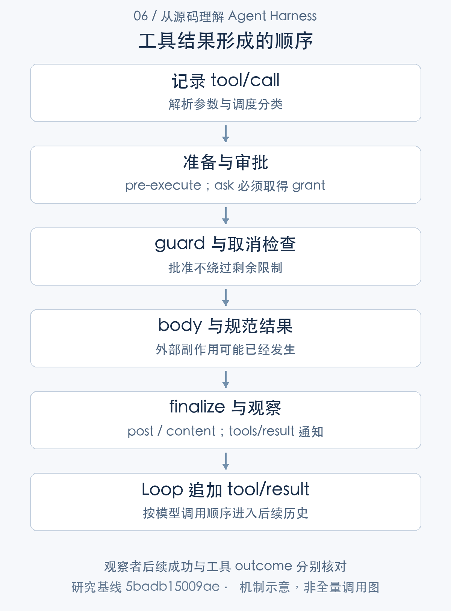

# 一次工具调用的完整生命周期：从参数到结果

> 从源码理解 Agent Harness · 第 06 篇 · 工具与执行环境契约

一个工具看似只是函数：接收参数，执行操作，返回字符串。把它放入 Agent 后，问题会迅速增加：模型参数是否合法，调用者有没有权限，审批期间被取消怎么办，结果能否被下一次请求理解，以及函数成功后格式处理失败该如何报告？

DeepSeek Harness 的工具运行时把这些责任分成注册、prepare、dispatch、finalize 和结果观察。研究这条链路，可以理解为什么**可靠的工具集成需要完整执行协议，而不仅是一组可调用函数**。

## 定义工具时，先定义结果语义

DSH 工具有输入与输出契约，`defineTool` 可以推导参数和结果类型。execute 返回规范值，render 把它转成模型可读内容；projectContent、finalizeContent 和面向产品的 presentation 又承担不同职责。[工具定义与执行事件](https://github.com/deepseek-ai/deepseek-harness/blob/5badb15009ae1756c3afe0ae0cef1faafc290ccc/packages/core/tools/src/index.ts#L90-L208) [defineTool 的类型与 schema](https://github.com/deepseek-ai/deepseek-harness/blob/5badb15009ae1756c3afe0ae0cef1faafc290ccc/packages/core/tools/src/schema.ts#L554-L632)

假设“运行测试”工具返回退出码、耗时和日志引用。退出码应保留为结构化事实，模型文本可以说明失败原因，界面则可以展示测试卡片。如果只返回“测试成功”字符串，调用者便很难区分执行结果、模型解释和显示文案。

参数校验同样需要在运行入口完成。TypeScript 只能约束本进程正确调用，模型给出的 JSON、远端 MCP schema 和持久数据都跨过了不同来源；INVALID_ARGS 与未知工具、权限不可见、取消应产生可区分结果，而不是一起报告函数异常。[工具注册、限制与 guard](https://github.com/deepseek-ai/deepseek-harness/blob/5badb15009ae1756c3afe0ae0cef1faafc290ccc/packages/core/tools/src/index.ts#L1063-L1155)

## 先准备，再决定是否进入 body

模型输出 tool-call 后，Loop 解析参数并分类并发能力，记录 `tool/call`，再进入 ToolRuntime。prepare 创建执行对象，检查调用者取消状态，运行 pre-execute waterfall，必要时转交审批，之后检查 guard 和取消。[Loop 工具调度](https://github.com/deepseek-ai/deepseek-harness/blob/5badb15009ae1756c3afe0ae0cef1faafc290ccc/packages/core/agent-loop/src/tool-calls.ts#L60-L290) [工具运行的三个阶段](https://github.com/deepseek-ai/deepseek-harness/blob/5badb15009ae1756c3afe0ae0cef1faafc290ccc/packages/core/tools/src/index.ts#L1493-L1699)



下面的片段显示规则、审批与 guard 的关系：ask 不是立即执行，而是先得到审批结果；allow 也不是跳过剩余检查。

```typescript
const carrier = scopeTarget(this, exec.agent)
const gate = await this.ctx.waterfall(
  carrier, 'tools/pre-execute', exec,
  () => Promise.resolve<PreToolDecision>({ kind: 'allow' }),
)
const askResolution = gate.kind === 'ask'
  ? await this.serviceAsk(exec, gate)
  : { decision: gate, approvalCancelled: false }
const { decision } = askResolution
if (this.callerCancelled(exec) && askResolution.approvalCancelled) {
  return await next({ kind: 'post-result', exec, result: toolAbortedBeforeDispatchResult() })
}
if (decision.kind === 'cancel') {
  return await next({ kind: 'post-result', exec, result: toolAbortedBeforeDispatchResult() })
}
const denialReason = decision.kind === 'allow' ? this.guardReason(exec) : decision.reason
const denialInfo = decision.kind === 'deny' ? decision.info : undefined
```

[对应源码](https://github.com/deepseek-ai/deepseek-harness/blob/5badb15009ae1756c3afe0ae0cef1faafc290ccc/packages/core/tools/src/index.ts#L1504-L1520)。以上为原文片段，仅统一缩进，需结合完整实现阅读。

不同失败发生在不同位置。参数不合法可以直接给出结果；pre-execute deny 没有进入 body；ask 被取消可能转换成 dispatch 前取消结果。已经有 `tool/call`，只说明调用生命周期被记录，不能凭它判断外部操作已经完成。

这一分段让插件可以在不修改工具 body 的情况下提供审批和策略，但也要求扩展了解自己的位置。一个观察结果的 listener 不能冒充授权规则，一个执行包装器也不能假定参数仍未校验。

## 授权只授予本次操作

审批服务在开放 Turn 记录 asked 和 decided。只有 allowed-once 通过 ask；没有服务、没有 Agent、没有 answerer、拒绝或取消都不会默认获得授权。`policy=never` 的语义是拒绝进入审批服务的 ask，不是禁止所有无需审批的工具。[审批请求及审计](https://github.com/deepseek-ai/deepseek-harness/blob/5badb15009ae1756c3afe0ae0cef1faafc290ccc/packages/interaction/user-approval/src/index.ts#L215-L307) [工具 ask 的结果映射](https://github.com/deepseek-ai/deepseek-harness/blob/5badb15009ae1756c3afe0ae0cef1faafc290ccc/packages/core/tools/src/index.ts#L1727-L1767)

例如测试工具需要请求执行受限命令，批准的是这个调用。之后模型改了参数再次请求，不能仅凭上一条同意便推导永久 grant。资源 provider 的路径与执行策略检查仍需继续执行，审批结果不是绕过底层限制的通行证。

取消还可能发生在等待审批时。实现需要在等待后检查状态，忽略失效的迟到回复；否则用户已经取消当前任务，旧点击却可能让命令开始。这是异步授权必须处理的时序，而不是 UI 交互细节。

## body 运行与结果结算各有责任

dispatch 进入 tools/execute 包装层，再调用 body，结合信号等待在途操作结算。结果随后经过输出 schema 与规范化，再在 finalize 中完成 post-execute 和内容处理。Loop 按模型顺序写入最终 tool/result，additionalContexts 进入后续步骤。

普通工具失败通常成为错误 outcome，让模型收到失败历史并选择下一动作；调度器或结果提交失败则要由 Step 恢复处理。模型继续对话不代表工具成功，Turn completed 也不抹去历史中的错误工具结果。

副作用发生时点尤其重要。数据库写入成功后，render 或后续处理仍可能失败，最终结果报错并不证明数据库没有变化。todo_write 在 body 内追加 todo/write，也说明领域事实可能早于最终工具结算。需要补偿的工具，应自行设计操作身份、结果查询和幂等方式。[领域事件在工具 body 中的提交](https://github.com/deepseek-ai/deepseek-harness/blob/5badb15009ae1756c3afe0ae0cef1faafc290ccc/packages/todo/tool-todo/src/index.ts#L192-L208)

## 观察通知不改变已经结算的结果

工具 finalize 后会通知 `tools/result` 观察者。这里包含同步错误，也观察 Promise 拒绝，但不会等待所有异步观察工作，更不会让观察者改写已确定 outcome。

```typescript
// WeakMap-keyable view.
Object.freeze(exec)
const { name: toolName, callId } = exec
const reportFailure = (error: unknown): void => {
  this.ctx.logger.warn(`tool "${toolName}" (${callId}): tools/result observer failed: ${errorMessage(error)}`)
}
const callbacks = this.ctx.events.dispatch('emit', [
  scopeTarget(this, exec.agent), 'tools/result', exec, result,
])
for (const callback of callbacks) {
  try {
    const returned: unknown = callback(exec, result)
    void Promise.resolve(returned).catch(reportFailure)
  } catch (error: unknown) {
    reportFailure(error)
  }
}
```

[对应源码](https://github.com/deepseek-ai/deepseek-harness/blob/5badb15009ae1756c3afe0ae0cef1faafc290ccc/packages/core/tools/src/index.ts#L1697-L1713)。以上为原文片段，仅统一缩进，需结合完整实现阅读。

冻结执行对象保护观察视图；局部 try/catch 和拒绝处理避免展示或记录插件破坏工具结算。它同时划定了一项限制：工具成功，并不证明每个观察者的后续业务处理成功。

`present` 插件正是在这个通知阶段写 deliverables/presented。若需要确定交付声明存在，应检查它自身的事件，不能只查看 tool/result 成功。这种“执行结果”和“后续消费结果”的分开，在通知、审计和产物展示中都值得保留。[交付声明的观察提交](https://github.com/deepseek-ai/deepseek-harness/blob/5badb15009ae1756c3afe0ae0cef1faafc290ccc/packages/deliverables/tool-present/src/index.ts#L70-L108)

## 环境能力通过 provider 进入工具

文件工具消费 fs，Shell 工具消费 shell，下层 subprocess 管理进程范围与退出。local、sandbox、SSH provider 的能力和限制不同；同一个工具名称不保证落在同一种执行环境。

fs-sandbox 在 write／edit 处检查目标，sandbox-local 组织平台隔离参数，provider 卸载则终止托管执行范围并等待退出。只在模型提示中写“不要访问工作区外”，不能替代这些实际检查。[文件目标校验](https://github.com/deepseek-ai/deepseek-harness/blob/5badb15009ae1756c3afe0ae0cef1faafc290ccc/packages/fs/fs-sandbox/src/index.ts#L80-L140) [平台沙箱实现](https://github.com/deepseek-ai/deepseek-harness/blob/5badb15009ae1756c3afe0ae0cef1faafc290ccc/packages/sandbox/sandbox-local/src/index.ts#L152-L184) [托管进程的清理](https://github.com/deepseek-ai/deepseek-harness/blob/5badb15009ae1756c3afe0ae0cef1faafc290ccc/packages/subprocess/subprocess-local/src/index.ts#L107-L138)

MCP 工具经过远端发现、schema 桥接和本地注册。syncTools 先构造发现结果，再撤销旧集合并注册新集合；刷新不是全局事务回滚。网络取消和重新发现也不能撤回远端已经完成的写入。[MCP 工具的发现和调用桥接](https://github.com/deepseek-ai/deepseek-harness/blob/5badb15009ae1756c3afe0ae0cef1faafc290ccc/packages/mcp/mcp-client/src/tools.ts#L113-L160)

## 优势与不足都来自分段执行

优势是公共治理可以复用：参数、授权、超时、结果处理和观察各有位置，工具 body 专注业务。模型与界面还可以使用同一规范结果，减少语义重复。

不足是一次操作拥有多个提交点，body 副作用、领域事件、工具结果和观察者处理不能统一回滚。扩展过多时，waterfall 顺序也会影响实际行为。工具声明并发安全或响应 signal，是实现者的责任，运行时不能仅凭类型证明外部资源安全。

设计新工具时，最好同时写出四件事：进入 body 的条件、规范结果的含义、副作用何时发生，以及取消或卸载怎样等待结束。对高风险写操作，再明确未知结果的处理方式。这些要求比“支持函数调用”更接近成熟 Agent 的工具能力。

## 技术心得：工具是模型与外部世界之间的执行协议

我从这条链路得到的认识是，工具协议应当服务多个参与方。模型需要可理解的反馈，调度器需要并发与取消信息，审计需要操作身份，用户界面需要可靠状态，外部系统需要幂等或查询能力。

如果所有责任都塞进一个返回字符串，代码虽然简短，错误却会以不可解释的方式进入产品。DSH 的阶段划分提供了结构，应用仍需把自己的外部业务语义接进去。

此前工具调度、审批、timeout、present 和 V05 扩展测试覆盖选定本地链路。它们不证明任意第三方工具都能及时取消，也不证明所有外部操作可回滚。下一篇将以“已经执行但结果未知”为起点，深入可靠性恢复。

---

研究基线：DeepSeek Harness `0.2.1-alpha.1`，提交 `5badb15009ae1756c3afe0ae0cef1faafc290ccc`。源码事实以该版本为准；文中的工程判断和改造建议另行说明。教学场景不代表真实模型业务实测。

源码与运行记录可从[证据索引](../appendices/evidence-index.md)和[验证附录](../appendices/validation.md)复核。本文引用此前同一提交的验证结果，本轮写作不将其重新计为新测试。

[专栏目录](README.md) · [上一篇](05-state-persistence.md) · [下一篇](07-reliability.md)
