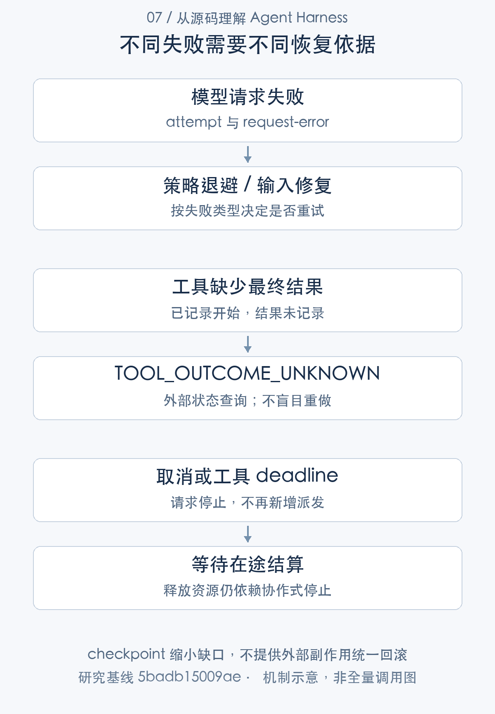

# 失败之后如何继续：重试、取消与副作用一致性

> 从源码理解 Agent Harness · 第 07 篇 · 可靠性恢复与副作用一致性

Agent 调用上传工具，远端已经保存文件，进程却在记录结果前退出。重启后日志里只有 tool/call，没有 tool/result。此时自动再上传一次，可能生成重复文件；宣布失败，又可能与远端事实不符。

这是可靠性问题的核心：系统不仅要“能够继续”，还要知道自己能够依据什么继续。DeepSeek Harness 的恢复设计区分请求重试、取消排空、日志修复与外部副作用，**未知结果被明确记录，而不是被包装成确定失败**。

## 先给失败分类，再决定恢复动作

模型 adapter 抛错或流迭代失败时，LLM 层可以规范为 error finish，Loop 记录 `assistant/attempt`，把供应商、策略、失败信息和 signal 交给 `agent/request-error` waterfall。恢复插件决定是否处理，未接管则结束为相应错误。[adapter 的异常规范化](https://github.com/deepseek-ai/deepseek-harness/blob/5badb15009ae1756c3afe0ae0cef1faafc290ccc/packages/llm/llm/src/index.ts#L1047-L1114) [Loop 的请求失败处理](https://github.com/deepseek-ai/deepseek-harness/blob/5badb15009ae1756c3afe0ae0cef1faafc290ccc/packages/core/agent-loop/src/agent.ts#L398-L544)

窗口溢出可能需要缩减输入，短暂网络错误可能需要退避，参数不支持则可能根本不该原样重试。中间件或消费端异常也不一定处于 adapter 捕获范围，把所有 throw 都当作网络重试会隐藏程序错误。

工具失败属于另外的对象。body 错误通常形成 tool error outcome，模型可以据此改变方案；若工具可能完成外部写入，则还要检查副作用状态。这类恢复不能只使用模型请求的 retryPolicy。



## 重试计数的作用域决定了上限含义

llm-retry 按 provider 与策略身份保存计数，状态在 step/start 或 turn/end 清空。普通模式只处理允许的错误码，并在该作用域内检查 maxRetries。

```typescript
const policyKey = retryPolicyKey(policy)
const retryState = ctx.sessionProjections.stateOf(agent.session, 'llmRetry') as LlmRetryState
const previous = retryState[retryStateKey(provider, policyKey)]
const previousRetry = previous?.retry ?? 0
if (policy.mode === 'normal' && previousRetry >= policy.maxRetries) return next()
const retry = previousRetry + 1
```

[对应源码](https://github.com/deepseek-ai/deepseek-harness/blob/5badb15009ae1756c3afe0ae0cef1faafc290ccc/packages/llm/llm-retry/src/index.ts#L219-L224)。以上为原文片段，仅统一缩进，需结合完整实现阅读。

这段代码中最重要的词是 normal。always 模式先等待下游恢复器，尊重其 retry 决定及取消，随后允许自己的退避重试，并不使用这里的 maxRetries 条件。maxDelayMs 限制一次等待，不限制总尝试次数。[normal 和 always 恢复分支](https://github.com/deepseek-ai/deepseek-harness/blob/5badb15009ae1756c3afe0ae0cef1faafc290ccc/packages/llm/llm-retry/src/index.ts#L188-L259) [重试投影的清空边界](https://github.com/deepseek-ai/deepseek-harness/blob/5badb15009ae1756c3afe0ae0cef1faafc290ccc/packages/llm/llm-retry/src/index.ts#L124-L137)

例如业务设置目标最多续跑三轮，第一轮的某个 Step 请求一直失败。若配置 always，它可以持续尝试，roundsStarted 仍不增加。任务回合额度因此不能代替总调用次数、总成本或截止时间。预算篇会进一步分析这种跨层问题。

退避事件也进入日志，开始重试另有记录。延迟可被 signal 中断，插件卸载撤销 listener 后还 abort 自身 lifetime 并等待活跃恢复任务，避免已进入 waterfall 的旧回调继续行动。

## 恢复器必须证明输入有变化

compaction-basic 对窗口溢出检查 replaceGeneration 是否前进。没有视图变化，返回 retry 只会再次发送同一过长输入。有无需模型裁剪先成功、后续摘要失败的情况，恢复器可以依据已经生效的视图变化继续；取消则仍然优先。[压缩恢复的进展判断](https://github.com/deepseek-ai/deepseek-harness/blob/5badb15009ae1756c3afe0ae0cef1faafc290ccc/packages/compaction/compaction-basic/src/index.ts#L190-L234)

这说明重试是一项有前提的决策。普通网络退避的前提是错误可恢复，窗口修复的前提是请求视图变化，工具重做的前提则应是只读、幂等或外部状态已确认。框架不可能用同一种“再来一次”策略覆盖三者。

## 取消不是立即返回，而是停止新增并等待结算

用户、父级或插件卸载可以向当前 Turn 传播 AbortSignal。Loop 停止新的派发，等待已启动模型或工具结束，再关闭步骤与回合。已经显示的安全文本块可以作为 interrupted assistant/message 保存，没有可见内容时则保留 attempt 事实。[Agent 取消入口](https://github.com/deepseek-ai/deepseek-harness/blob/5badb15009ae1756c3afe0ae0cef1faafc290ccc/packages/core/agent-loop/src/agent.ts#L154-L241) [部分文本的结算](https://github.com/deepseek-ai/deepseek-harness/blob/5badb15009ae1756c3afe0ae0cef1faafc290ccc/packages/core/agent-loop/src/assistant-stream.ts#L45-L110)

timeout-policy 使用派生 deadline signal 包装工具执行，并等待下游静止后才产出 TOOL_TIMEOUT。它不会只用 Promise.race 提前返回并把工作遗留在后台；相应代价是工具必须合作响应 signal，否则等待仍可能拖住。[工具 deadline 包装](https://github.com/deepseek-ai/deepseek-harness/blob/5badb15009ae1756c3afe0ae0cef1faafc290ccc/packages/guard/timeout-policy/src/index.ts#L55-L81)

例如一个构建进程超时，用户看到 timeout 之前，provider 需要终止并排空托管进程范围。若构建已经写入文件，取消也不会自动删除修改。终止能力、资源清理和业务补偿是不同责任。

## 日志修复保留不知道的事实

失败 Step 和崩溃恢复都需要处理悬空工具历史。repair 定义了两种结果：调用没有记录开始，以及调用开始但没有可靠记录最终结果。

```typescript
/** Recovery code for an assistant tool request that never reached a recorded call start. */
export const TOOL_NOT_STARTED = 'TOOL_NOT_STARTED'

/** Recovery code for a recorded tool call whose completed outcome was not durably recorded. */
export const TOOL_OUTCOME_UNKNOWN = 'TOOL_OUTCOME_UNKNOWN'
```

[对应源码](https://github.com/deepseek-ai/deepseek-harness/blob/5badb15009ae1756c3afe0ae0cef1faafc290ccc/packages/core/session/src/repair.ts#L14-L18)。以上为原文片段，仅统一缩进，需结合完整实现阅读。

`TOOL_NOT_STARTED` 说明日志没有该调用的开始记录；`TOOL_OUTCOME_UNKNOWN` 说明有开始记录但没有结果。它们使模型后续历史结构完整，同时保留信息边界。对于 fork，父会话可能已经在分支点之后执行，所以子分支里的 not-started 也不能推导整个外部世界从未发生操作。[恢复和 fork 的工具说明](https://github.com/deepseek-ai/deepseek-harness/blob/5badb15009ae1756c3afe0ae0cef1faafc290ccc/packages/core/session/src/repair.ts#L14-L97)

例如上传场景恢复为 unknown，应用应以操作身份查询远端，再判断返回既有文件、重做还是请求人工处理。若远端支持幂等键，同一业务操作可以再次提交而不产生重复效果；这属于 connector 的业务协议，JSONL 本身不能提供。

工具结果修补也可能失败。Loop 在关闭 Step 前尝试补结果，失败时汇总原始与恢复错误，不应假装所有历史都已修好。错误可解释比输出一个笼统 completed 更重要。

## checkpoint 和熔断分别解决什么

checkpoint 在执行前 flush 会话事实，缩小进程崩溃时的本地缺口。它不能把远端成功与本地结果写入合并成一个原子事务，更不能承诺停电零损失或外部恰好执行一次。[执行前持久屏障](https://github.com/deepseek-ai/deepseek-harness/blob/5badb15009ae1756c3afe0ae0cef1faafc290ccc/packages/session/session-checkpoint-policy/src/index.ts#L54-L83)

provider 熔断通常还需要健康状态、打开／半开状态和试探恢复等机制。本研究在 core、llm、guard 的限定实现范围未确认这样的通用状态机；已有 retry 与 deadline 不应被命名为完整 provider circuit breaker。这个结论有范围，不代表仅靠关键词搜索证明整个仓库绝对不存在相关扩展。

如果需要新增熔断，应该明确它限制哪些路由、健康状态由谁维护、并发试探怎样准入，以及是否会影响已经准备的调用。这是改造方向，不是本基线的运行事实。

## 可靠性的优势与尚需补齐的协议

DSH 的优势是失败、取消和修复都留下明确记录，工具未知结果不被盲目重跑，生命周期清理等待在途任务。请求恢复通过插件组合，也方便按失败类型选择策略。

不足在于协作式取消依赖 provider，外部副作用还需要幂等和查询；always 重试需要另设任务上限。日志结构修复可以使会话继续，却不代表业务结果已经确认。若产品需要交易级承诺，必须在工具与外部系统之间建立相应协议。

## 技术心得：可靠恢复首先要表达不确定性

源码给我的重要启发是，可靠系统应保存“已知开始、未知结果”这样的中间状态。它看起来没有确定成功或失败漂亮，却给后续恢复留下正确选择。把未知粗暴归为失败，再自动重跑，往往只是把局部故障转成重复副作用风险。

另一个原则是，取消必须有清理完成条件。发出 signal 只是请求，等待真正静止才是资源可安全释放的依据。把两者分开，会让超时和卸载逻辑更复杂，但能避免后台残留工作与新任务互相干扰。

此前 request-error、retry、cancel、timeout、resume／repair 和 V05 验证选定受控路径；没有对真实远端上传做故障注入，也未验证所有第三方 provider 的取消响应。可靠性的讨论应停留在这些真实证据能够支撑的范围。

---

研究基线：DeepSeek Harness `0.2.1-alpha.1`，提交 `5badb15009ae1756c3afe0ae0cef1faafc290ccc`。源码事实以该版本为准；文中的工程判断和改造建议另行说明。教学场景不代表真实模型业务实测。

源码与运行记录可从[证据索引](../appendices/evidence-index.md)和[验证附录](../appendices/validation.md)复核。本文引用此前同一提交的验证结果，本轮写作不将其重新计为新测试。

[专栏目录](README.md) · [上一篇](06-tool-runtime.md) · [下一篇](08-concurrency.md)
