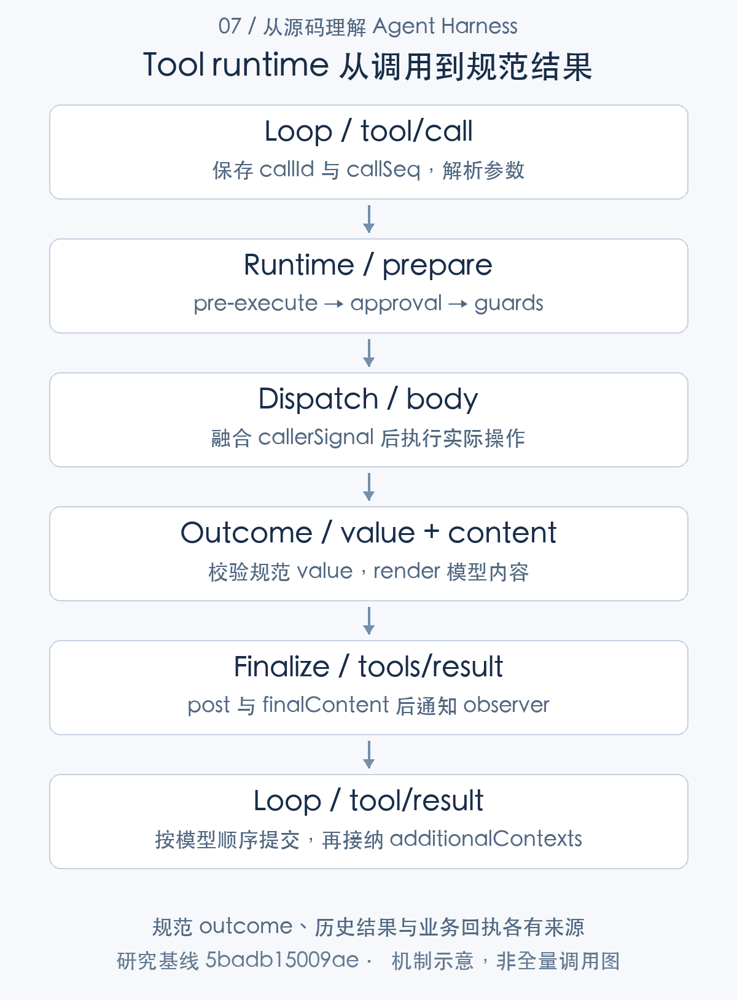
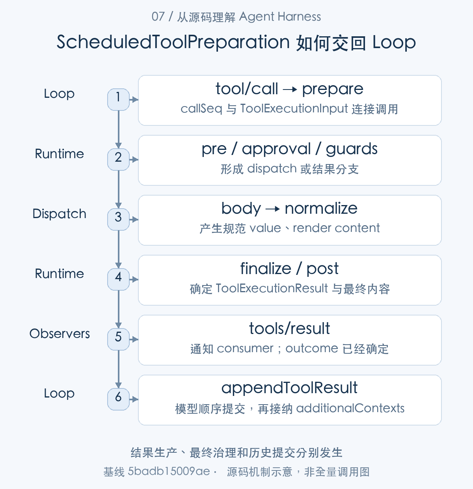
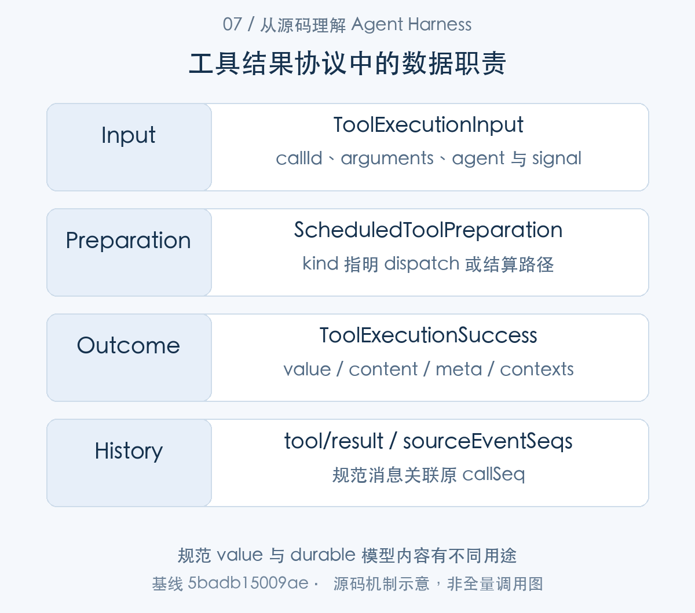
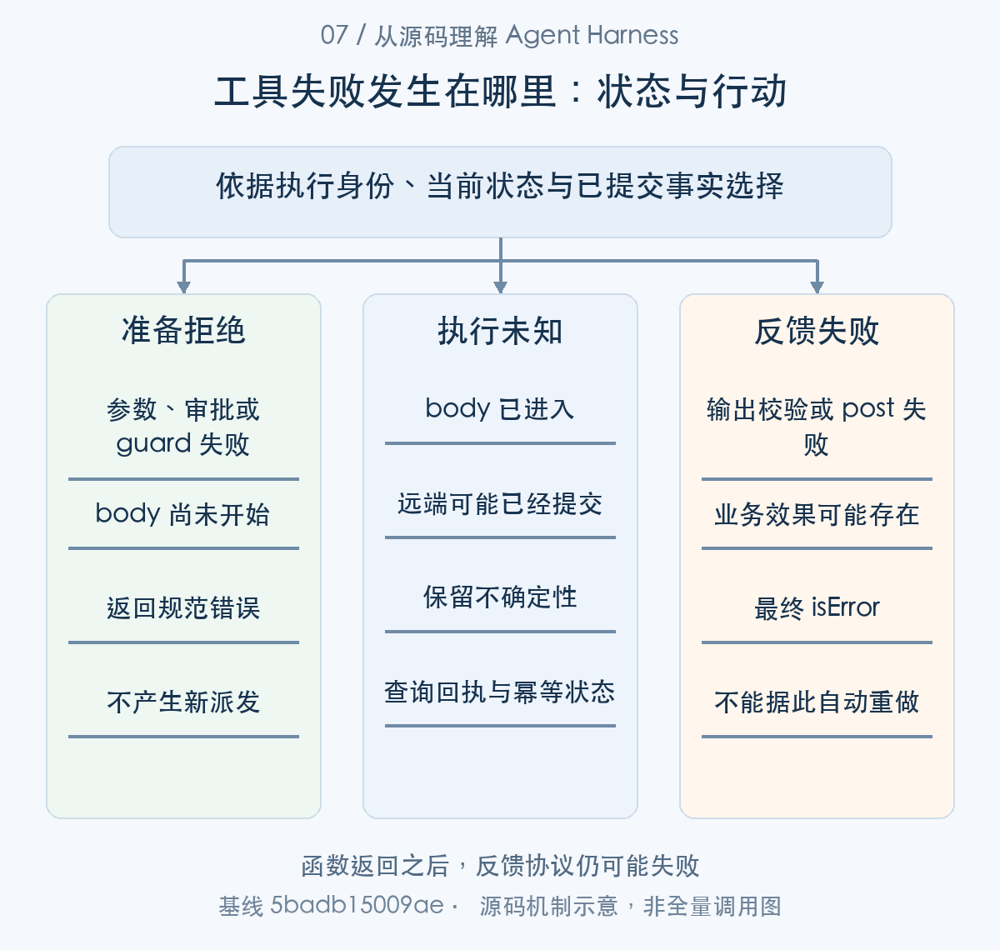

# 一次工具调用的完整生命周期：从参数到结果

> 从源码理解 Agent Harness · 第 07 篇 · 工具与执行环境契约

一个工具看似只是函数：接收参数，执行操作，返回字符串。把它放入 Agent 后，问题会迅速增加：模型参数是否合法，调用者有没有权限，审批期间被取消怎么办，结果能否被下一次请求理解，以及函数成功后格式处理失败该如何报告？

DeepSeek Harness 的工具运行时把这些责任分成注册、prepare、dispatch、finalize 和结果观察。研究这条链路，可以理解为什么**可靠的工具集成需要完整执行协议，而不仅是一组可调用函数**。


一次模型 tool-call 从 Loop 进入工具调度，先记录调用并 prepare，再通过 tools/execute dispatch 到 body；返回值经输出校验、post 与 content 处理后成为 ToolExecutionResult，Loop 再写 tool/result。approval 和资源 provider 位于不同检查层，tools/result 则是后续观察接缝。本文沿这条主链解释每个阶段接收的结构与返回的 kind。

## 定义工具时，先定义结果语义

DSH 工具有输入与输出契约，`defineTool` 可以推导参数和结果类型。execute 返回规范值，render 把它转成模型可读内容；projectContent、finalizeContent 和面向产品的 presentation 又承担不同职责。[工具定义与执行事件](https://github.com/deepseek-ai/deepseek-harness/blob/5badb15009ae1756c3afe0ae0cef1faafc290ccc/packages/core/tools/src/index.ts#L90-L208) [defineTool 的类型与 schema](https://github.com/deepseek-ai/deepseek-harness/blob/5badb15009ae1756c3afe0ae0cef1faafc290ccc/packages/core/tools/src/schema.ts#L554-L632)

假设“运行测试”工具返回退出码、耗时和日志引用。退出码应保留为结构化事实，模型文本可以说明失败原因，界面则可以展示测试卡片。如果只返回“测试成功”字符串，调用者便很难区分执行结果、模型解释和显示文案。

参数校验同样需要在运行入口完成。TypeScript 只能约束本进程正确调用，模型给出的 JSON、远端 MCP schema 和持久数据都跨过了不同来源；INVALID_ARGS 与未知工具、权限不可见、取消应产生可区分结果，而不是一起报告函数异常。[工具注册、限制与 guard](https://github.com/deepseek-ai/deepseek-harness/blob/5badb15009ae1756c3afe0ae0cef1faafc290ccc/packages/core/tools/src/index.ts#L1063-L1155)



图1：规范 outcome、历史结果与业务回执各有来源。先按这张主线图建立对象地图，再结合下面的 caller、数据和返回路径展开。

### 第一步：作者 DSL 转成运行时契约，类型约束之外仍要校验

从作者 DSL 的 defineTool() 开始，它把 schema、validate、execute 和 render 组织成 ToolDefinition。runtime.register() 消费这份定义，随后模型调用才能找到实际实现。


```typescript
if (options.timeoutMs !== undefined && (!Number.isFinite(options.timeoutMs) || options.timeoutMs <= 0)) {
  throw new Error(`defineTool(${options.name}): timeoutMs must be a positive finite number`)
}
const parameters = parameterSchemaSpecToJsonSchema(options.parameters)
const outputSchema = valueSchemaSpecToJsonSchema(options.output.schema)
const validate = (args: unknown): string[] => validateJsonSchemaValue(parameters, args, '')
const tool: ToolDefinition = {
  name: options.name,
  description: options.description,
  parameters: parameters as unknown as Record<string, unknown>,
  output: {
    schema: outputSchema,
    render(args: unknown, value: JsonValue): ContentBlock[] {
      return userRender(args as InferArgs<S>, value as InferValue<NoInfer<O>>)
    },
```

[源码：`packages/core/tools/src/schema.ts:574–588`](https://github.com/deepseek-ai/deepseek-harness/blob/5badb15009ae1756c3afe0ae0cef1faafc290ccc/packages/core/tools/src/schema.ts#L574-L588)。

parameters 与 output.schema 分别转换为 JSON Schema，validate 依据转换后的参数结构；output.render 接收规范值。作者 DSL 的 required 是属性级标记，不能无条件把原始 JSON Schema 的 required 数组混进去。企业示例初次 schema 错误已经展示：静态类型通过，也未必说明这份声明正确进入 runtime。

```typescript
async execute(args: unknown, exec: ToolRunContext): Promise<JsonValue> {
  const violations = validate(args)
  if (violations.length > 0) throw new ToolArgsError(violations)
  return userExecute(args as InferArgs<S>, exec) as Promise<JsonValue>
},
```

[源码：`packages/core/tools/src/schema.ts:597–601`](https://github.com/deepseek-ai/deepseek-harness/blob/5badb15009ae1756c3afe0ae0cef1faafc290ccc/packages/core/tools/src/schema.ts#L597-L601)。

执行包装先检查 violations，参数不合法就抛 ToolArgsError，不进入 userExecute。注意它与 prepare 中的 JSON 快照不同：快照保证值可序列化、身份固定；此处保证值符合工具定义。它们不能合并成一句“参数已校验”。

### 第二步：展示与执行对旧参数采取不同政策

同一 ToolDefinition 还用于历史 presentation 与并发分类。它们与 execute 是并列消费者，对旧参数分别采取展示降级和安全降级，真实执行仍由 validator 检查。


```typescript
if (userPresentCall) {
  tool.presentCall = (args: unknown): ToolCallView | undefined => {
    if (validate(args).length > 0) return undefined
    return userPresentCall(args as InferArgs<S>)
  }
}
if (userPresentResult) {
  tool.presentResult = (args: unknown, result: ToolResult): ToolResultView | undefined => {
    if (validate(args).length > 0) return undefined
    return userPresentResult(args as InferArgs<S>, result)
  }
}
if (userIsConcurrencySafe) {
  tool.isConcurrencySafe = (args: unknown): boolean => {
    if (validate(args).length > 0) return false
    return userIsConcurrencySafe(args as InferArgs<S>)
  }
```

[源码：`packages/core/tools/src/schema.ts:613–629`](https://github.com/deepseek-ai/deepseek-harness/blob/5badb15009ae1756c3afe0ae0cef1faafc290ccc/packages/core/tools/src/schema.ts#L613-L629)。

presentCall/presentResult 可能在历史重放中接到旧 schema 参数，校验不匹配返回 undefined，退到通用展示；并发安全判断不匹配则返回 false。执行硬拒绝、展示软降级、并发保守降级，分别服务不同对象。不能为了旧 UI 可读性放宽真实业务执行。

```typescript
register(definition: ToolDefinition): () => void {
  const name = definition.name
  const output = (definition as Partial<ToolDefinition>).output
  if (output === undefined || typeof output !== 'object'
    || typeof output.render !== 'function'
    || (output.presentationMeta !== undefined && typeof output.presentationMeta !== 'function')) {
    throw new TypeError(`tool "${name}" must declare output { schema, render, presentationMeta? }`)
  }
  assertSupportedJsonSchema(output.schema)
  const timeoutMs = definition.timeoutMs
  if (timeoutMs !== undefined
    && (!Number.isFinite(timeoutMs) || timeoutMs <= 0)) {
    throw new TypeError(`tool "${name}" timeoutMs must be a positive finite number`)
  }
  // Reserved unconditionally: any agent may select a code mode for itself,
  // so a name free to take under the deployment default would become a
  // collision the moment a preset mounted.
  if (name === RUN_CODE_NAME) {
    throw new Error(`tool name "${RUN_CODE_NAME}" is reserved for the PTC mode presentation transport and cannot be registered or shadowed`)
  }
  return this.layers.effect(
    this.ctx,
    layer => layer.tools.insert(name, definition),
    { label: 'tools.register()' },
  )
```

[源码：`packages/core/tools/src/index.ts:1063–1087`](https://github.com/deepseek-ai/deepseek-harness/blob/5badb15009ae1756c3afe0ae0cef1faafc290ccc/packages/core/tools/src/index.ts#L1063-L1087)。

注册要求 schema/render 完整，timeout 合法；run_code 名称无条件保留，避免切换 PTC 模式后与用户工具冲突。layers.effect 管理注册寿命。一个成熟工具包不仅应有 execute，还要说明输出契约、取消、并发与卸载。


## 先准备，再决定是否进入 body

工具定义已经进入 registry，模型产生的调用接下来携带 callId、arguments、Agent 与 signal 进入 prepare。准备阶段把运行身份固定下来，并决定后面执行还是直接结算。

模型输出 tool-call 后，Loop 解析参数并分类并发能力，记录 `tool/call`，再进入 ToolRuntime。prepare 创建执行对象，检查调用者取消状态，运行 pre-execute waterfall，必要时转交审批，之后检查 guard 和取消。[Loop 工具调度](https://github.com/deepseek-ai/deepseek-harness/blob/5badb15009ae1756c3afe0ae0cef1faafc290ccc/packages/core/agent-loop/src/tool-calls.ts#L60-L290) [工具运行的三个阶段](https://github.com/deepseek-ai/deepseek-harness/blob/5badb15009ae1756c3afe0ae0cef1faafc290ccc/packages/core/tools/src/index.ts#L1493-L1699)


下面的片段显示规则、审批与 guard 的关系：ask 不是立即执行，而是先得到审批结果；allow 也不是跳过剩余检查。

```typescript
const carrier = scopeTarget(this, exec.agent)
const gate = await this.ctx.waterfall(
  carrier, 'tools/pre-execute', exec,
  () => Promise.resolve<PreToolDecision>({ kind: 'allow' }),
)
const askResolution = gate.kind === 'ask'
  ? await this.serviceAsk(exec, gate)
  : { decision: gate, approvalCancelled: false }
const { decision } = askResolution
if (this.callerCancelled(exec) && askResolution.approvalCancelled) {
  return await next({ kind: 'post-result', exec, result: toolAbortedBeforeDispatchResult() })
}
if (decision.kind === 'cancel') {
  return await next({ kind: 'post-result', exec, result: toolAbortedBeforeDispatchResult() })
}
const denialReason = decision.kind === 'allow' ? this.guardReason(exec) : decision.reason
const denialInfo = decision.kind === 'deny' ? decision.info : undefined
```

[对应源码](https://github.com/deepseek-ai/deepseek-harness/blob/5badb15009ae1756c3afe0ae0cef1faafc290ccc/packages/core/tools/src/index.ts#L1504-L1520)。以上为原文片段，仅统一缩进，需结合完整实现阅读。

不同失败发生在不同位置。参数不合法可以直接给出结果；pre-execute deny 没有进入 body；ask 被取消可能转换成 dispatch 前取消结果。已经有 `tool/call`，只说明调用生命周期被记录，不能凭它判断外部操作已经完成。

这一分段让插件可以在不修改工具 body 的情况下提供审批和策略，但也要求扩展了解自己的位置。一个观察结果的 listener 不能冒充授权规则，一个执行包装器也不能假定参数仍未校验。



图2：结果生产、最终治理和历史提交分别发生。从 caller 的交接对象追到 consumer，具体分支结合正文源码阅读。

### 第三步：先快照执行身份和内容转换器

调度器进入 ToolRuntime.prepare() 时，先捕获内容转换贡献并固定 arguments、callerSignal 与执行 token，再调用 pre-execute。后续授权等待使用的就是这份执行身份。

工具执行的基础身份由 ToolExecutionInput 描述：

```typescript
export interface ToolExecutionInput {
  readonly callId: ToolCallId
  /**
   * Root model-requested call owning this execution tree. Callers omit it for
   * a root execution; nested dispatchers propagate the enclosing value.
   */
  readonly rootCallId?: ToolCallId
  readonly name: string
  /** Binding-time tool schema for a PTC inner call; frozen by its producer and never logged. */
  readonly schema?: ToolSchema
  /** Losslessly JSON-serializable parsed arguments (tools validate their own schema). */
  readonly arguments: unknown
  /** The agent on whose behalf the call runs (set by the agent loop). */
  readonly agent?: Agent
  /**
   * Opaque token of the enclosing transport execution, when one exists. PTC
   * mode sets this on SDK sub-dispatches so commit-style observers can wait for
   * the outer `run_code` outcome without receiving its live mutable execution.
   * The token also marks the call as a transport sub-dispatch rather than a
   * model-direct call: under `mode: 'ptc'`, only calls WITH a parent may
   * execute a native tool name — a model-direct call (no parent) is denied as
   * `UNKNOWN_TOOL` before the policy pipeline. See {@link ToolRuntime.execute}.
   */
  readonly parent?: ToolExecutionToken
  /** Required caller-owned cancellation for this invocation. */
  readonly signal: AbortSignal
}
```

[源码：`packages/core/tools/src/index.ts:326–352`](https://github.com/deepseek-ai/deepseek-harness/blob/5badb15009ae1756c3afe0ae0cef1faafc290ccc/packages/core/tools/src/index.ts#L326-L352)。

|核心字段|保存的信息|使用位置|
|---|---|---|
|`callId` / `rootCallId`|当前调用与根调用|日志与嵌套执行关联|
|`name` / `arguments`|执行对象与输入|工具查找及 schema 校验|
|`agent` / `signal` / `parent`|所属 Agent、取消与 transport 身份|授权、signal 融合和子派发|

prepare 在这份输入上增加运行上下文，原始 callerSignal 持续约束当前调用。


```typescript
const capturedFinalizer = visible?.finalizeContent?.bind(visible)
const capturedProjector = visible?.projectContent?.bind(visible)
const finalizerFor = (): ToolDefinition['finalizeContent'] | undefined =>
  collapsed && !signal.aborted ? undefined : capturedFinalizer
try {
  const detached = snapshotJsonValue(exec.arguments)
  if (detached === undefined) {
    throw new TypeError('tool execution arguments must be losslessly JSON-serializable')
  }
  const execution: MutableToolRunContext = { ...base, arguments: deepFreeze(detached) }
  this.deferredContexts.set(execution, deferredContexts)
  this.contentFinalizers.set(execution, finalizerFor())
  if (!collapsed) this.contentProjectors.set(execution, capturedProjector)
  this.cancellationStates.set(execution, {
    callerSignal: signal,
    bodyInvoked: false,
  })
```

[源码：`packages/core/tools/src/index.ts:1436–1452`](https://github.com/deepseek-ai/deepseek-harness/blob/5badb15009ae1756c3afe0ae0cef1faafc290ccc/packages/core/tools/src/index.ts#L1436-L1452)。

finalizer/projector 在读取参数快照之前捕获，因为参数 getter 可能改变注册贡献。snapshotJsonValue 只保留可序列化值，arguments deepFreeze；执行对象绑定 deferredContexts、内容转换与原 callerSignal，bodyInvoked 初始 false。之后等待审批，参数不会随原对象修改而变化。

pre-execute waterfall 返回 allow 并不绕过 guard；deny/cancel 和 callerCancelled 分开处理。准备成功的最后一步如下：

```typescript
  if (this.callerCancelled(exec)) {
    return await next({ kind: 'post-result', exec, result: toolAbortedBeforeDispatchResult() })
  }
  return await next({ kind: 'dispatch', exec })
} catch (error: unknown) {
  return next({ kind: 'final-result', exec, result: toolErrorResult(error) })
}
```

[源码：`packages/core/tools/src/index.ts:1532–1538`](https://github.com/deepseek-ai/deepseek-harness/blob/5badb15009ae1756c3afe0ae0cef1faafc290ccc/packages/core/tools/src/index.ts#L1532-L1538)。

等待后再检查原调用者取消，然后才能返回 dispatch。异常成为 final-result，不继续掉进 body。用 ScheduledToolPreparation 的 kind 明确表示后面该走 dispatch、post 还是 final，比在函数间传一个含混 success 更容易避免重复结算。

### 第四步：Loop 记录 call，运行时准备 body，职责分开

回到 Loop 的 runGroup.startCall() 看调用现场：appendToolCall() 后调用 scheduler.prepare()，再把返回的 kind 交给 dispatch。这里把调度记录与 runtime 内部接起来。

prepare 与调度器的交接用 kind 明确分支：

```typescript
export type ScheduledToolPreparation =
  | { kind: 'dispatch'; exec: ToolRunContext }
  | { kind: 'post-result'; exec: ToolRunContext; result: ToolExecutionResult }
  | { kind: 'final-result'; exec: ToolRunContext; result: ToolExecutionResult }
```

[源码：`packages/core/tools/src/index.ts:445–449`](https://github.com/deepseek-ai/deepseek-harness/blob/5badb15009ae1756c3afe0ae0cef1faafc290ccc/packages/core/tools/src/index.ts#L445-L449)。

dispatch 表示可以进入 body；post-result 表示已有结果但仍需 post；final-result 表示直接走最终结算。三个分支都携带执行上下文，调用方据此选择下一站。


```typescript
const startCall = async (index: number): Promise<void> => {
  // oxlint-disable-next-line typescript/no-non-null-assertion -- bounded index
  const call = group[index]!
  callSeqs[index] = appendToolCall(session, turn, step, call.block)
  started++
  const prepared = await ctx.tools[TOOL_RUNTIME_SCHEDULER].prepare(call.exec)
  throwSchedulerFailure()
  switch (prepared.kind) {
    case 'dispatch': {
      const promise = ctx.tools[TOOL_RUNTIME_SCHEDULER].dispatch(prepared.exec).then(
        (outcome) => {
          slots[index] = { exec: prepared.exec, result: outcome.result, needsPost: outcome.kind === 'post-result' }
          return index
        },
```

[源码：`packages/core/agent-loop/src/tool-calls.ts:165–178`](https://github.com/deepseek-ai/deepseek-harness/blob/5badb15009ae1756c3afe0ae0cef1faafc290ccc/packages/core/agent-loop/src/tool-calls.ts#L165-L178)。

appendToolCall 在 prepare 之前执行，started 计的是已记录调用生命周期；prepare 可能直接拒绝，dispatch 也可能没到用户业务代码。工具调用事件不能作为“已执行写操作”的证据。dispatch 结果进入 slot，尚未按模型顺序写入最终工具消息。

这条顺序允许崩溃恢复识别一个调用已被记录，却不声称外部系统完成了请求。对高风险操作还需业务操作 id 与回执，不能依赖 tool/call 的存在推断远端效果。

## 授权只授予本次操作

审批服务在开放 Turn 记录 asked 和 decided。只有 allowed-once 通过 ask；没有服务、没有 Agent、没有 answerer、拒绝或取消都不会默认获得授权。`policy=never` 的语义是拒绝进入审批服务的 ask，不是禁止所有无需审批的工具。[审批请求及审计](https://github.com/deepseek-ai/deepseek-harness/blob/5badb15009ae1756c3afe0ae0cef1faafc290ccc/packages/interaction/user-approval/src/index.ts#L215-L307) [工具 ask 的结果映射](https://github.com/deepseek-ai/deepseek-harness/blob/5badb15009ae1756c3afe0ae0cef1faafc290ccc/packages/core/tools/src/index.ts#L1727-L1767)

例如测试工具需要请求执行受限命令，批准的是这个调用。之后模型改了参数再次请求，不能仅凭上一条同意便推导永久 grant。资源 provider 的路径与执行策略检查仍需继续执行，审批结果不是绕过底层限制的通行证。

取消还可能发生在等待审批时。实现需要在等待后检查状态，忽略失效的迟到回复；否则用户已经取消当前任务，旧点击却可能让命令开始。这是异步授权必须处理的时序，而不是 UI 交互细节。

### 第五步：没有审批通道的 ask 必须落为拒绝

prepare 的 ask 分支调用审批服务，allowed-once 返回 allow，然后继续 guard 与取消检查。审批记录使用同一 callId，与已固定参数共同说明本次授权对象。


```typescript
const approval = this.ctx.get('approval')
if (approval === undefined) {
  return {
    decision: { kind: 'deny', reason: ask.reason ?? `tool "${exec.name}" requires approval (not yet supported)` },
    approvalCancelled: false,
  }
}
if (exec.agent === undefined) {
  return {
    decision: { kind: 'deny', reason: `tool "${exec.name}" requires approval, but the call has no agent to route it through` },
    approvalCancelled: false,
  }
}
```

[源码：`packages/core/tools/src/index.ts:1731–1743`](https://github.com/deepseek-ai/deepseek-harness/blob/5badb15009ae1756c3afe0ae0cef1faafc290ccc/packages/core/tools/src/index.ts#L1731-L1743)。

approval 服务缺失或调用没有 Agent，返回 deny；它们不是自动 allow，也不是无限等待 UI。当前执行环境不能处理审批时，错误反馈能让模型选择另一路径。

```typescript
const outcome = await approval.request({
  agent: exec.agent,
  toolName: exec.name,
  callId: exec.callId,
  ...ask.reason !== undefined ? { reason: ask.reason } : {},
  ...ask.displayReason !== undefined ? { displayReason: ask.displayReason } : {},
  signal: exec.signal,
})
switch (outcome) {
  case 'allowed-once': return { decision: { kind: 'allow' }, approvalCancelled: false }
  case 'rejected': return {
    decision: { kind: 'deny', reason: `the user rejected tool "${exec.name}"` },
    approvalCancelled: false,
  }
  case 'cancelled': return {
    decision: { kind: 'deny', reason: `approval for tool "${exec.name}" was cancelled` },
    approvalCancelled: true,
  }
  case 'unavailable': return {
    decision: { kind: 'deny', reason: `tool "${exec.name}" requires approval, but no approval channel is available` },
    approvalCancelled: false,
  }
  default: return assertNever(outcome, 'ApprovalOutcome')
```

[源码：`packages/core/tools/src/index.ts:1744–1766`](https://github.com/deepseek-ai/deepseek-harness/blob/5badb15009ae1756c3afe0ae0cef1faafc290ccc/packages/core/tools/src/index.ts#L1744-L1766)。

请求带 toolName、callId、reason 与 signal。allowed-once 唯一映射为 allow；rejected、cancelled、unavailable 各自保留原因。approvalCancelled 特别用于原调用已经取消时选择正确 dispatch 前结果。

```typescript
async request(req: ApprovalRequest): Promise<ApprovalOutcome> {
  const session = req.agent.session
  if (!hasOpenTurn(session)) {
    throw new Error(
      'approval.request() outside an open turn: the approval/asked + approval/decided audit pair '
      + 'must be turn-enclosed (a bare event between turns is crash-tail garbage on reload). '
      + 'Ask from inside the turn that needs the decision.',
    )
  }
  const id = ApprovalRequestId(randomUUID())
  session.append('approval/asked', {
    id,
    toolName: req.toolName,
    ...req.callId !== undefined ? { callId: req.callId } : {},
    ...req.reason !== undefined ? { reason: req.reason } : {},
  })
  const outcome = await this.decide(req, session)
  session.append('approval/decided', { id, outcome })
  return outcome
```

[源码：`packages/interaction/user-approval/src/index.ts:215–233`](https://github.com/deepseek-ai/deepseek-harness/blob/5badb15009ae1756c3afe0ae0cef1faafc290ccc/packages/interaction/user-approval/src/index.ts#L215-L233)。

审批必须在开放 Turn 内，先记录 asked，再等待决定，最后记录 decided。id 连接两项事实，callId 连接执行。它证明是谁针对哪次请求作了什么决定，不为未来不同参数自动生成永久 grant。长期授权需要另外的数据模型和撤销协议。

批准之后资源 provider 仍要检查实际目标，guard 仍能拒绝。不能把审阅者的一次 allow 当作绕过路径权限、租户权限和运行取消的通行证。


## body 运行与结果结算各有责任

prepare 返回 dispatch 时才进入 body。下一段沿实际执行结果向外返回，依次说明规范值、模型内容、post 决策和最终通知，避免把 body 返回当作所有阶段同时完成。

dispatch 进入 tools/execute 包装层，再调用 body，结合信号等待在途操作结算。结果随后经过输出 schema 与规范化，再在 finalize 中完成 post-execute 和内容处理。Loop 按模型顺序写入最终 tool/result，additionalContexts 进入后续步骤。

普通工具失败通常成为错误 outcome，让模型收到失败历史并选择下一动作；调度器或结果提交失败则要由 Step 恢复处理。模型继续对话不代表工具成功，Turn completed 也不抹去历史中的错误工具结果。

副作用发生时点尤其重要。数据库写入成功后，render 或后续处理仍可能失败，最终结果报错并不证明数据库没有变化。todo_write 在 body 内追加 todo/write，也说明领域事实可能早于最终工具结算。需要补偿的工具，应自行设计操作身份、结果查询和幂等方式。[领域事件在工具 body 中的提交](https://github.com/deepseek-ai/deepseek-harness/blob/5badb15009ae1756c3afe0ae0cef1faafc290ccc/packages/todo/tool-todo/src/index.ts#L192-L208)

### 第六步：执行包装器不能丢掉原调用者的取消

准备获得 dispatch 后，ToolRuntime.dispatch() 进入 tools/execute 包装层；实际 body 的 signal 再与原 callerSignal 融合。body 返回后才开始结果规范化与结算。


```typescript
const wrapperSignal = exec.signal
const fused = fuseToolSignals(state.callerSignal, wrapperSignal)
const signal = fused.signal

if (isAborted(signal)) {
  fused.dispose()
  return toolAbortedBeforeDispatchResult()
}
exec.signal = signal
try {
  const tool = this.resolveExecution(exec.name, exec.agent, exec.parent !== undefined)
  if (!tool) throw new ToolNotFoundError(exec.name)
  state.bodyInvoked = true
  const returned = await tool.execute(exec.arguments, exec)
  const result = this.createSuccessResult(exec, tool, returned)
  return isAborted(signal)
    ? toolAbortedResult(result)
    : result
} catch (error: unknown) {
  return toolErrorResult(error)
} finally {
  fused.dispose()
  exec.signal = wrapperSignal
}
```

[源码：`packages/core/tools/src/index.ts:1568–1591`](https://github.com/deepseek-ai/deepseek-harness/blob/5badb15009ae1756c3afe0ae0cef1faafc290ccc/packages/core/tools/src/index.ts#L1568-L1591)。

工具包装器可以替换 exec.signal，但 fuseToolSignals 把原 callerSignal 重新合进去。派发前已 aborted 则返回未开始结果；否则临时放入 fused signal，再重新 resolveExecution。state.bodyInvoked 在 execute 入口前设置，不能把它当作数据库写入已经成功的标记。

execute 返回后先 createSuccessResult，再根据取消选择结果。实现没有在 signal 一触发就丢弃 body Promise：已启动操作必须到 quiescence 后再结束，因此无协作的外部工具可能延迟退出。finally 释放监听并恢复 wrapperSignal，避免这次融合泄漏到后续包装层。



图3：规范 value 与 durable 模型内容有不同用途。表中对象并列展示用途与寿命，层次之间以源码所示身份关联。

### 第七步：规范值、模型文本与副作用不是同一个东西

createSuccessResult() 消费 body 返回值，先快照与输出校验，再调用 render。结构化 value 与模型 content 分别形成，供后续治理和显示使用。

成功 outcome 的结构解释规范值与模型内容如何共存：

```typescript
export interface ToolExecutionSuccess {
  readonly isError: false
  /** Execution-local canonical value; deliberately omitted from durable events. */
  readonly value: JsonValue
  readonly content: ContentBlock[]
  readonly error?: never
  readonly meta?: JsonValue
  readonly additionalContexts?: UserMessage[]
  /** The agent loop stops after committing this successful result batch. */
  readonly concludesTurn?: true
}
```

[源码：`packages/core/tools/src/index.ts:572–582`](https://github.com/deepseek-ai/deepseek-harness/blob/5badb15009ae1756c3afe0ae0cef1faafc290ccc/packages/core/tools/src/index.ts#L572-L582)。

|核心字段|保存的信息|使用位置|
|---|---|---|
|`value` / `content`|执行内规范值与模型内容|输出校验、后续反馈|
|`meta` / `additionalContexts`|展示材料与下一 Step 补充输入|UI 与 Loop context acceptor|
|`concludesTurn`|成功 batch 的结束意图|Loop 的 concluded 判断|

value 刻意不进入 durable tool/result；正式消息保存 content 和必要的 error/meta。需要长期保存业务回执时，应在明确的数据协议中安排它的持久来源。


```typescript
private createSuccessResult(exec: ToolExecution, tool: ToolDefinition, candidate: unknown): ToolExecutionSuccess {
  const detached = snapshotToolValue(tool.name, candidate)
  const violations = validateJsonSchemaValue(tool.output.schema, detached, 'value')
  if (violations.length > 0) throw new ToolOutputError(tool.name, violations)
  const value = deepFreeze(detached)
  let rendered: ContentBlock[]
  try {
    rendered = tool.output.render(exec.arguments, value)
  } catch (error: unknown) {
    throw projectionError(tool.name, 'render', error)
  }
  const content = snapshotProjection(tool.name, 'render', rendered)
```

[源码：`packages/core/tools/src/index.ts:1832–1843`](https://github.com/deepseek-ai/deepseek-harness/blob/5badb15009ae1756c3afe0ae0cef1faafc290ccc/packages/core/tools/src/index.ts#L1832-L1843)。

先快照 candidate，再检查输出 schema，deepFreeze 成为 value；render 使用该规范值，渲染异常成为 projectionError，内容也要再次快照。用户业务 execute 成功后，输出或渲染仍可以失败，外部写入不会因此自动撤销。

对于“关闭工单”，业务效果应由幂等回执证明；value 应保留 operationId、状态与版本；render 只是生成可读解释。若仅返回“已关闭”文本，后续失败时无法判断是效果没有发生，还是反馈处理失败。

### 第八步：post、content finalization 和结算通知按阶段推进

结果返回 scheduler.finalize() 后进入 postExecute()，再 finishScheduledExecution()。不同 kind 说明需要 post 还是已完成结果，控制流因此不会重复处理。

准入治理与结果治理各有协议，先看前置决策：

```typescript
export type PreToolDecision =
  | { kind: 'allow' }
  | { kind: 'deny'; reason: string; info?: ToolErrorInfo }
  | { kind: 'cancel' }
  | { kind: 'ask'; reason?: string; displayReason?: { readonly en: string; readonly [locale: string]: string } }
```

[源码：`packages/core/tools/src/index.ts:607–611`](https://github.com/deepseek-ai/deepseek-harness/blob/5badb15009ae1756c3afe0ae0cef1faafc290ccc/packages/core/tools/src/index.ts#L607-L611)。

allow、deny、cancel、ask 分别表达执行、拒绝、取消或请求本次审批；arguments 已记录，前置决策不在这里重写它。post 则对反馈内容和额外 context 作出决定，作用阶段不同。


```typescript
private async finalizeScheduledExecution(exec: ToolRunContext, result: ToolExecutionResult): Promise<ToolExecutionResult> {
  try {
    const project = this.contentProjectors.get(exec)
    this.contentProjectors.delete(exec)
    const content = project?.(exec, result)
    const projected = content === undefined
      ? result
      : this.markCanonical(exec, this.materializeFinalResult({ ...result, content }))
    const postResult = await this.postExecute(exec, projected)
    return this.finishScheduledExecution(
      exec,
      this.callerCancelled(exec) && !postResult.isError
        ? this.cancellationResult(exec, postResult)
        : postResult,
    )
  } catch (error: unknown) {
    return this.finishScheduledExecution(exec, toolErrorResult(error))
  }
```

[源码：`packages/core/tools/src/index.ts:1641–1658`](https://github.com/deepseek-ai/deepseek-harness/blob/5badb15009ae1756c3afe0ae0cef1faafc290ccc/packages/core/tools/src/index.ts#L1641-L1658)。

读取并删除 content projector，按需投影内容；postExecute 等待治理结果；取消再校正结果；最后 finish。阶段抛错也进入 finishScheduledExecution，不让工具留在没有最终 outcome 的分支。

```typescript
private async postExecute(exec: ToolExecution, result: ToolExecutionResult): Promise<ToolExecutionResult> {
  const decision = await this.ctx.waterfall(
    scopeTarget(this, exec.agent), 'tools/post-execute', exec, result,
    () => Promise.resolve<PostToolDecision>({ kind: 'accept' }),
  )
  const decisionContexts = decision.additionalContexts ?? []
  if (decision.kind === 'block') {
    const message = failureMessageFromContent(decision.feedback)
    return this.markCanonical(exec, {
      content: decision.feedback,
      isError: true,
      error: { message },
      ...decisionContexts.length > 0 ? { additionalContexts: decisionContexts } : {},
    })
  }
  if (Object.hasOwn(decision, 'content') && Object.hasOwn(decision, 'value')) {
    throw new TypeError('tools/post-execute accept decision cannot replace both value and content')
```

[源码：`packages/core/tools/src/index.ts:1781–1797`](https://github.com/deepseek-ai/deepseek-harness/blob/5badb15009ae1756c3afe0ae0cef1faafc290ccc/packages/core/tools/src/index.ts#L1781-L1797)。

post waterfall 的 block 可以把成功反馈改成 isError，并只暴露阻塞政策提供的上下文；accept 不允许同时替换 value 与 content，避免字段来源互相矛盾。这是在反馈协议上的治理，不是把此前 body 副作用回滚。

postExecute() 的返回值回到 finalizeScheduledExecution()，后者选择正常结果或取消结果，再调用 finishScheduledExecution()。下面进入这个最终结算方法：materialize 和 definition-owned finalContent 完成后，notifyResult() 才通知 observer。

```typescript
private finishScheduledExecution(exec: ToolRunContext, result: ToolExecutionResult): ToolExecutionResult {
  let materializedResult: ToolExecutionResult
  try {
    materializedResult = this.materializeFinalResult(result)
  } catch (error: unknown) {
    materializedResult = this.materializeFinalResult(toolErrorResult(error))
  }
  let finalResult: ToolExecutionResult
  try {
    finalResult = this.materializeFinalResult(this.applyFinalContent(exec, materializedResult))
  } catch (error: unknown) {
    finalResult = this.materializeFinalResult(toolErrorResult(error))
  }
  this.notifyResult(exec, finalResult)
  return finalResult
```

[源码：`packages/core/tools/src/index.ts:1669–1683`](https://github.com/deepseek-ai/deepseek-harness/blob/5badb15009ae1756c3afe0ae0cef1faafc290ccc/packages/core/tools/src/index.ts#L1669-L1683)。

最终 materialize、工具 finalContent、再次 materialize，之后 notifyResult。规范 outcome 已确定，观察通知再失败也不该改写它。多个提交点应分别保存证据，尤其不要把错误 tool/result 解释为外部系统没有变化。

## 观察通知不改变已经结算的结果

工具 finalize 后会通知 `tools/result` 观察者。这里包含同步错误，也观察 Promise 拒绝，但不会等待所有异步观察工作，更不会让观察者改写已确定 outcome。

```typescript
// WeakMap-keyable view.
Object.freeze(exec)
const { name: toolName, callId } = exec
const reportFailure = (error: unknown): void => {
  this.ctx.logger.warn(`tool "${toolName}" (${callId}): tools/result observer failed: ${errorMessage(error)}`)
}
const callbacks = this.ctx.events.dispatch('emit', [
  scopeTarget(this, exec.agent), 'tools/result', exec, result,
])
for (const callback of callbacks) {
  try {
    const returned: unknown = callback(exec, result)
    void Promise.resolve(returned).catch(reportFailure)
  } catch (error: unknown) {
    reportFailure(error)
  }
}
```

[对应源码](https://github.com/deepseek-ai/deepseek-harness/blob/5badb15009ae1756c3afe0ae0cef1faafc290ccc/packages/core/tools/src/index.ts#L1697-L1713)。以上为原文片段，仅统一缩进，需结合完整实现阅读。

冻结执行对象保护观察视图；局部 try/catch 和拒绝处理避免展示或记录插件破坏工具结算。它同时划定了一项限制：工具成功，并不证明每个观察者的后续业务处理成功。

`present` 插件正是在这个通知阶段写 deliverables/presented。若需要确定交付声明存在，应检查它自身的事件，不能只查看 tool/result 成功。这种“执行结果”和“后续消费结果”的分开，在通知、审计和产物展示中都值得保留。[交付声明的观察提交](https://github.com/deepseek-ai/deepseek-harness/blob/5badb15009ae1756c3afe0ae0cef1faafc290ccc/packages/deliverables/tool-present/src/index.ts#L70-L108)



图4：函数返回之后，反馈协议仍可能失败。各分支基于自己的证据返回决定，不按完成文案推断下一动作。

### 第九步：观察者适合显示和追踪，不承担强制验收屏障

finish 内部的 notifyResult() 对外发布工具 outcome，随后返回 Loop 的 commitReady()。Loop 再追加 tool/result，并把 additionalContexts 交给下一 Step。


原文 notifyResult 对同步 throw 和返回 Promise 的拒绝都记录警告，但不 await 后者。Object.freeze(exec) 保护身份，不能让 emit 自动变成强事务。比如异步审计在日志服务器失败，工具仍可能已经返回正常结果。

Loop 最终提交的位置在另一层：

```typescript
const commitReady = async (): Promise<void> => {
  while (committed < group.length) {
    const slot = slots[committed]
    if (slot === undefined) break
    const call = group[committed]
    const result = slot.needsPost
      ? await ctx.tools[TOOL_RUNTIME_SCHEDULER].finalize(slot.exec, slot.result)
      : ctx.tools[TOOL_RUNTIME_SCHEDULER].finish(slot.exec, slot.result)
    // oxlint-disable-next-line typescript/no-non-null-assertion -- bounded index
    appendToolResult(session, turn, step, call!.block, result, callSeqs[committed]!)
    for (const context of result.additionalContexts ?? []) acceptContext(context)
    concluded ||= result.concludesTurn === true
    committed++
  }
```

[源码：`packages/core/agent-loop/src/tool-calls.ts:147–160`](https://github.com/deepseek-ai/deepseek-harness/blob/5badb15009ae1756c3afe0ae0cef1faafc290ccc/packages/core/agent-loop/src/tool-calls.ts#L147-L160)。

slot.needsPost 决定 finalize 或 finish；appendToolResult 之后才接纳 additionalContexts，并推进 committed。观察通知发生在上述 finalize/finish 内，甚至早于 Loop 的 tool/result append。不能用一条 tools/result 通知宣称 Session 最终工具消息已成功保存。

对于 present，应该检查独立 deliverables/presented 事件；对于强审计，应把业务写入、回执与审计放在可原子提交的可信入口，而不是把 best-effort observer 改名为“审计保证”。观察接缝有价值，但职责要与时序一致。


## 环境能力通过 provider 进入工具

结果协议管理反馈，外部能力通过 fs、shell 或 MCP provider 接线。这里转到实际资源操作和远端工具发现支线，核对 body 依赖的目标与注册生命周期。

文件工具消费 fs，Shell 工具消费 shell，下层 subprocess 管理进程范围与退出。local、sandbox、SSH provider 的能力和限制不同；同一个工具名称不保证落在同一种执行环境。

fs-sandbox 在 write／edit 处检查目标，sandbox-local 组织平台隔离参数，provider 卸载则终止托管执行范围并等待退出。只在模型提示中写“不要访问工作区外”，不能替代这些实际检查。[文件目标校验](https://github.com/deepseek-ai/deepseek-harness/blob/5badb15009ae1756c3afe0ae0cef1faafc290ccc/packages/fs/fs-sandbox/src/index.ts#L80-L140) [平台沙箱实现](https://github.com/deepseek-ai/deepseek-harness/blob/5badb15009ae1756c3afe0ae0cef1faafc290ccc/packages/sandbox/sandbox-local/src/index.ts#L152-L184) [托管进程的清理](https://github.com/deepseek-ai/deepseek-harness/blob/5badb15009ae1756c3afe0ae0cef1faafc290ccc/packages/subprocess/subprocess-local/src/index.ts#L107-L138)

MCP 工具经过远端发现、schema 桥接和本地注册。syncTools 先构造发现结果，再撤销旧集合并注册新集合；刷新不是全局事务回滚。网络取消和重新发现也不能撤回远端已经完成的写入。[MCP 工具的发现和调用桥接](https://github.com/deepseek-ai/deepseek-harness/blob/5badb15009ae1756c3afe0ae0cef1faafc290ccc/packages/mcp/mcp-client/src/tools.ts#L113-L160)

### 第十步：工具逻辑与真正的资源检查分开接线

最后沿 body 的资源依赖检查 fs-sandbox 与 MCP。checkedTarget() 返回的目标继续进入真实 write；MCP discovery 先准备 definitions，再交换注册并保留各次执行的 signal。


```typescript
override async writeText(
  target: FsTarget,
  content: string,
  expected?: FsWriteIntent,
  signal?: AbortSignal,
  sandboxPolicy?: SandboxExecutionPolicy,
): Promise<FsWriteOutcome> {
  return super.writeText(await this.checkedTarget(target, sandboxPolicy), content, expected, signal)
}
```

[源码：`packages/fs/fs-sandbox/src/index.ts:80–88`](https://github.com/deepseek-ai/deepseek-harness/blob/5badb15009ae1756c3afe0ae0cef1faafc290ccc/packages/fs/fs-sandbox/src/index.ts#L80-L88)。

writeText 等待 checkedTarget 后把返回的目标交给实际写入。它不是检查一个路径却写入另一个旧对象；检查与执行应共享同一目标身份。provider 决定 local、sandbox 或远端资源世界，工具名称不能说明隔离强度。

```typescript
// Phase 1: fetch and build the next generation without touching the registry.
const definitions = new Map<string, ToolDefinition>()
const response = client.getServerCapabilities()?.tools === undefined
  ? { tools: [] }
  : await client.listTools(undefined, { cacheMode: 'refresh' })
for (const tool of response.tools) {
  const publicName = publicToolName(opts.serverName, tool.name)
  if (definitions.has(publicName)) {
    throw new Error(
      `mcp-client(${opts.serverName}): server listed tool "${tool.name}" more than once — invalid tool list`,
    )
  }
  definitions.set(publicName, createMcpToolDefinition(ctx, {
    name: publicName,
    rawName: tool.name,
    description: tool.description ?? '',
    inputSchema: tool.inputSchema,
    outputSchema: tool.outputSchema,
    taskRequired: tool.execution?.taskSupport === 'required',
    call: (args, execution) => client.callTool(
      { name: tool.name, arguments: args },
      { signal: execution.signal, timeout: opts.toolCallTimeoutMs, toolDefinition: tool },
    ),
  }))
```

[源码：`packages/mcp/mcp-client/src/tools.ts:119–142`](https://github.com/deepseek-ai/deepseek-harness/blob/5badb15009ae1756c3afe0ae0cef1faafc290ccc/packages/mcp/mcp-client/src/tools.ts#L119-L142)。

MCP 先发现工具并构建 definitions，检查重复 publicName；每个本地桥接调用传 execution.signal 与 timeout。发现失败还没有动原注册，这是一项准备阶段保护。

```typescript
// Phase 2: swap generations.
for (const dispose of previous.values()) dispose()
const disposers: ToolDisposers = new Map()
try {
  for (const [publicName, definition] of definitions) {
    disposers.set(publicName, ctx.tools.register(definition))
  }
} catch (error) {
  // A conflict on an `mcp__<serverName>__`-qualified name means a foreign
  // registration occupies this server's namespace. Roll back so the model
  // sees either the full generation or none of it — never a partial set.
  for (const dispose of disposers.values()) dispose()
  ctx.logger.error(`mcp-client(${opts.serverName}): tool registration failed, no tools registered: ${String(error)}`)
  if (opts.registrationFailure === 'throw') throw error
  return new Map()
}
return disposers
```

[源码：`packages/mcp/mcp-client/src/tools.ts:145–161`](https://github.com/deepseek-ai/deepseek-harness/blob/5badb15009ae1756c3afe0ae0cef1faafc290ccc/packages/mcp/mcp-client/src/tools.ts#L145-L161)。

交换时先销毁 previous，再注册新集合。新注册失败会撤销新集合，避免部分新工具可见；却没有把 previous 自动全部复原。因此是两阶段准备与局部清理，不是全系统事务刷新。远端已执行操作也不可能因本地 disposer 撤销。

企业工具应明确资源边界、调用身份、取消协议和未知结果查询。尤其是 HTTP 工具，网络 timeout 与远端没有提交不能等价。

## 优势与不足都来自分段执行

优势是公共治理可以复用：参数、授权、超时、结果处理和观察各有位置，工具 body 专注业务。模型与界面还可以使用同一规范结果，减少语义重复。

不足是一次操作拥有多个提交点，body 副作用、领域事件、工具结果和观察者处理不能统一回滚。扩展过多时，waterfall 顺序也会影响实际行为。工具声明并发安全或响应 signal，是实现者的责任，运行时不能仅凭类型证明外部资源安全。

设计新工具时，最好同时写出四件事：进入 body 的条件、规范结果的含义、副作用何时发生，以及取消或卸载怎样等待结束。对高风险写操作，再明确未知结果的处理方式。这些要求比“支持函数调用”更接近成熟 Agent 的工具能力。

### 以四个事实检查一个工具是否真正可靠

|事实|应记录的内容|不能由它推导的结论|
|---|---|---|
|执行资格|参数、授权、guard、signal|已产生业务效果|
|业务效果|操作 id、资源版本、回执|模型一定收到了正确反馈|
|规范 outcome|value、isError、工具结算|所有 observer 和持久写入都成功|
|历史提交|tool/result、后续请求中的 tool 消息|外部操作具备全局回滚|

分段设计的优势是治理可复用，函数作者不用重复全部基础设施。代价是扩展必须理解阶段、异步重查与信号归属，业务 effect 不会因后处理失败自动消失。高风险工具应从效果身份开始设计幂等，而不是看到异常就重试 execute。

## 技术心得：工具是模型与外部世界之间的执行协议

### 用阶段契约连接参与方

ToolExecutionInput、ScheduledToolPreparation 与 ToolExecutionResult 将调用、执行资格和结果分开。我从中得到的实践是，新增工具先写清输入身份和 outcome，再安排 body、render、post 与 observer 各自消费什么。

### 让结构化结果成为共同依据

createSuccessResult() 保留规范 value，render 提供模型解释，meta 支持产品展示。对于运行测试，可以把退出码与日志引用作为明确字段，再派生文案和卡片，使不同参与方能围绕同次执行判断结果。

### 顺着返回路径安排提交

notifyResult() 与 Loop append 位于不同层，additionalContexts 又走下一 Step 准入。实现 connector 时，我会沿这些现有接缝分别安排反馈、历史和追加材料，并给业务副作用保留操作身份与回执查询。

对代码修复 Agent，可靠的工具集成最终应能还原一次测试如何获准、由谁执行、返回什么结果以及如何进入下一请求。本文的分段协议让这份还原可以从类型一直追到真实调用现场。

---

研究基线：DeepSeek Harness `0.2.1-alpha.1`，提交 `5badb15009ae1756c3afe0ae0cef1faafc290ccc`。源码事实以该版本为准；文中的工程判断和改造建议另行说明。教学场景不代表真实模型业务实测。

源码与运行记录可从[证据索引](../appendices/evidence-index.md)和[验证附录](../appendices/validation.md)复核。本文引用此前同一提交的验证结果，本轮写作不将其重新计为新测试。

[专栏目录](README.md) · [上一篇](06-state-persistence.md) · [下一篇](08-reliability.md)
