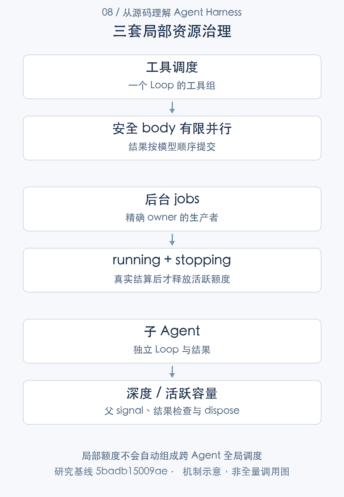

# 哪些工作可以同时执行：工具、作业与子 Agent 调度

> 从源码理解 Agent Harness · 第 08 篇 · 并发、调度与资源治理

代码修复任务可以同时读取多个文件，运行测试也可以作为后台作业，父 Agent 还可能委派子 Agent 分析模块。听起来都叫并发，实际却有不同的状态、额度和取消责任。把一个 maxConcurrency 参数放到最外层，并不能自动管理全部资源。

DeepSeek Harness 提供单 Agent driver、工具分组调度、jobs-local 和子 Agent 容量控制。本文按执行对象拆解这些机制，说明**局部并发策略怎样组合，以及它们为什么还不是统一的全局调度系统**。

## 先确定并发发生在哪一层

同一个 Agent 由单一 driver 推进，输入追加进入 inbox，不启动第二条并行 Turn 控制链。多个 Agent 则可以各自运行，可能共享模型和执行 provider。[单 Agent 输入与 driver](https://github.com/deepseek-ai/deepseek-harness/blob/5badb15009ae1756c3afe0ae0cef1faafc290ccc/packages/core/agent-loop/src/agent.ts#L154-L241)

一个 Step 内，模型可以输出多个工具调用。工具有序 prepare，body 允许有限重叠，结果仍按模型顺序提交。后台 job 是更长生命周期的生产者，child Agent 又拥有独立 Loop、scope 和结果结算。它们不能只按“同时有几个 Promise”管理。

例如并发读三份文件、后台执行一次构建、让子 Agent 审阅修改，涉及至少三种调度对象。某一对象完成，不表示其他对象释放了模型调用、文件句柄或进程资源。



## 工具并发先看安全声明

工具显式声明 isConcurrencySafe 才有资格并行，默认采用独占方式。maxParallelToolCalls 默认 10，可用 volatile 配置更新；独占调用形成屏障，尚未执行的调用之后会重新分类。[默认工具并行度](https://github.com/deepseek-ai/deepseek-harness/blob/5badb15009ae1756c3afe0ae0cef1faafc290ccc/packages/core/agent-loop/src/constants.ts#L1-L6) [工具分组和调度](https://github.com/deepseek-ai/deepseek-harness/blob/5badb15009ae1756c3afe0ae0cef1faafc290ccc/packages/core/agent-loop/src/tool-calls.ts#L60-L290)

这样选择比较保守：两个读取工具可能并行，写同一文件或操作共享状态的工具则不能仅因模型同时提出就执行。并发安全声明也不是运行时证明；若工具错误声明安全，调度器无法替它解决外部数据竞争。

prepare 和审批按顺序 await，body 可以重叠。这意味着并行度是派发上限，实际吞吐仍会受授权等待、provider 和外部服务限制。调大数值，并不会让所有前置阶段同时运行。

## 并行完成，为什么还要按顺序提交

调度器为模型调用建立 slots，记录已经启动的序号与结果。commitReady 只推进连续可用的前序槽位。

```typescript
// `committed` advances only across contiguous model-order slots.
const commitReady = async (): Promise<void> => {
  while (committed < group.length) {
    const slot = slots[committed]
    if (slot === undefined) break
    const call = group[committed]
    const result = slot.needsPost
      ? await ctx.tools[TOOL_RUNTIME_SCHEDULER].finalize(slot.exec, slot.result)
      : ctx.tools[TOOL_RUNTIME_SCHEDULER].finish(slot.exec, slot.result)
    // oxlint-disable-next-line typescript/no-non-null-assertion -- bounded index
    appendToolResult(session, turn, step, call!.block, result, callSeqs[committed]!)
    for (const context of result.additionalContexts ?? []) acceptContext(context)
    concluded ||= result.concludesTurn === true
    committed++
  }
}
```

[对应源码](https://github.com/deepseek-ai/deepseek-harness/blob/5badb15009ae1756c3afe0ae0cef1faafc290ccc/packages/core/agent-loop/src/tool-calls.ts#L146-L161)。以上为原文片段，仅统一缩进，需结合完整实现阅读。

假设模型顺序提出 A、B、C，C 最先完成，B 随后完成，A 很慢。C 和 B 的执行可以已经结束，但 committed 不能越过没有结果的 A。post 处理、tool/result 和 additionalContexts 随提交顺序进入历史。

优势是模型 history 稳定，来源引用和后续上下文不会取决于偶然完成顺序。代价是前序等待：较早的慢调用可能拖住后面结果的可见提交。若只测量 body 总耗时，而不观察最终结果进入日志的时间，容易误判并发优化效果。

取消后不继续补派发，已启动工作要 drain；未开始的槽位报告 `TOOL_ABORTED_BEFORE_DISPATCH`。调度失败也先等待在途派发，之后把异常交给 owning Step 修复。这提供局部完整性，不提供跨工具事务回滚。

## 后台作业在注册前验证可管理性

jobs-local 是进程内 registry。注册前验证精确 live owner、控制端可达性以及当前额度，先分配身份，再运行生产者启动函数；只有启动返回，才提交 job 记录并启动输出 pump。[作业准入、启动与提交](https://github.com/deepseek-ai/deepseek-harness/blob/5badb15009ae1756c3afe0ae0cef1faafc290ccc/packages/jobs/jobs-local/src/index.ts#L206-L280)

生产者启动抛错时，可能跳过一个编号，但不会留下正常注册的 job。编号连续并不是一致性目标；确保登记对象确实具有可管理生产者，才是这个时序的重点。

作业访问也有 Session 所有权约束：owned job 只能由对应 Session 访问，无 owner 的共享桶则另行处理。这是本地服务检查，不等于企业用户身份系统。[作业 owner、额度与访问](https://github.com/deepseek-ai/deepseek-harness/blob/5badb15009ae1756c3afe0ae0cef1faafc290ccc/packages/jobs/jobs-local/src/index.ts#L378-L409)

## stopping 为什么仍然占额度

作业取消后，底层生产者可能还在退出。activeJobCount 同时统计 running 和 stopping。

```typescript
/** Count authoritative active records for one exact owner or the shared unowned bucket. */
private activeJobCount(owner: Agent | undefined): number {
  let count = 0
  for (const job of this.store.values()) {
    if (job.owner === owner && (job.status === 'running' || job.status === 'stopping')) count += 1
  }
  return count
}
```

[对应源码](https://github.com/deepseek-ai/deepseek-harness/blob/5badb15009ae1756c3afe0ae0cef1faafc290ccc/packages/jobs/jobs-local/src/index.ts#L384-L391)。以上为原文片段，仅统一缩进，需结合完整实现阅读。

如果发送 cancel 就立刻释放额度，新作业会在旧生产者仍消耗资源时进入，局部限额便失真。把 stopping 算活跃，使配额与实际清理责任更接近。

owner 或服务卸载时，registry 取消、等待、清理记录。生产者不响应停止会拖住 settled；某些异常分支的告警，也不能单独证明外部工作已经终止。管理层知道作业逻辑失败，与操作系统确认执行范围退出，仍是不同事实。[作业 owner 与服务清理](https://github.com/deepseek-ai/deepseek-harness/blob/5badb15009ae1756c3afe0ae0cef1faafc290ccc/packages/jobs/jobs-local/src/index.ts#L610-L683)

## 子 Agent 是独立生命周期，不能只当函数

SubagentRuntime 控制委派深度和活跃子 Agent 容量，in-process driver 负责创建 child、挂载输出契约、连接父级 signal、等待 idle 并读取本次结果。dispose 还要释放 handle，等待结果 Promise，撤销父 signal listener。[委派容量配置](https://github.com/deepseek-ai/deepseek-harness/blob/5badb15009ae1756c3afe0ae0cef1faafc290ccc/packages/subagent/subagent/src/index.ts#L189-L202) [父子取消和结果等待](https://github.com/deepseek-ai/deepseek-harness/blob/5badb15009ae1756c3afe0ae0cef1faafc290ccc/packages/subagent/subagent-in-process-driver/src/index.ts#L158-L207)

父级取消时，子级可能正在模型请求或工具执行，停止仍需合作完成。child 正常 Loop 结束，也可能因缺少要求的结构化结果而判失败。委派不能只实现“创建子实例并 await 文本”。

这些额度也没有自动相加为任务级资源上限。一个父 Agent 可以持有 job，还可以启动 child，child 又可能调用多个工具。若产品需要统一资源治理，应明确额度归属、传播、累积和回收规则。

## 局部治理的优势与不足

优势是不同执行对象有适合自己的状态：工具强调顺序，job 强调持续生产与取消，child 强调委派身份和结果。默认工具独占、stopping 计数和 owner drain 都能减少过早释放造成的竞争。

不足在于缺少由这些机制自然推导出的全局公平性、跨 Agent 模型配额、跨主机队列和统一资源预算。两个 Agent 各自遵守并行度，仍可能一起超过供应商配额。输出记录的容量与保留策略，也需要结合具体 provider 和任务规模检查，不能从 active 数量单独保证内存有界。

需要新增全局调度时，可以先建立任务与资源身份，再将模型请求、作业、child 的准入接到统一额度服务。不要先建一个队列再猜每类资源如何释放。尤其应明确取消请求和 settled 之间谁继续占资源，这是基于现有分层的设计建议。

## 技术心得：配额应该跟随资源的真实生命周期

最有价值的收获是 stopping 仍计活跃这一细节。它体现了一个普遍原则：资源不是在“要求停止”时释放，而是在实际工作静止、管理责任结束后释放。

另一个收获是执行顺序与提交顺序可以不同。并发让工作重叠，有序提交让消费者稳定；两者之间的等待和缓存应成为明确成本，而不是实现中的意外。

V10 的 jobs 83 项和 structured child 30 项，加上既有工具调度测试，验证选定受控生命周期。它们没有测量公平性、生产吞吐或远程节点能力。下一篇将从同样的 owner 与 scope 分层，进一步分析行动权限。

---

研究基线：DeepSeek Harness `0.2.1-alpha.1`，提交 `5badb15009ae1756c3afe0ae0cef1faafc290ccc`。源码事实以该版本为准；文中的工程判断和改造建议另行说明。教学场景不代表真实模型业务实测。

源码与运行记录可从[证据索引](../appendices/evidence-index.md)和[验证附录](../appendices/validation.md)复核。本文引用此前同一提交的验证结果，本轮写作不将其重新计为新测试。

[专栏目录](README.md) · [上一篇](07-reliability.md) · [下一篇](09-security.md)
