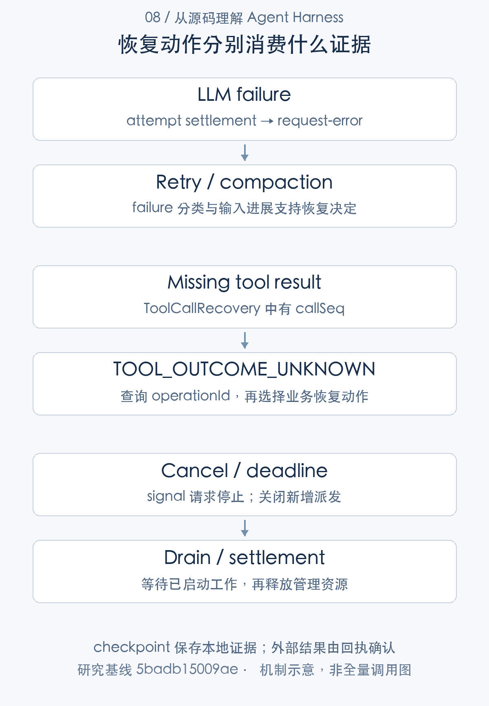
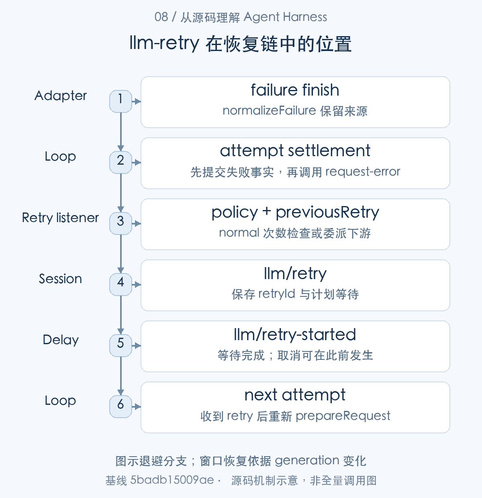
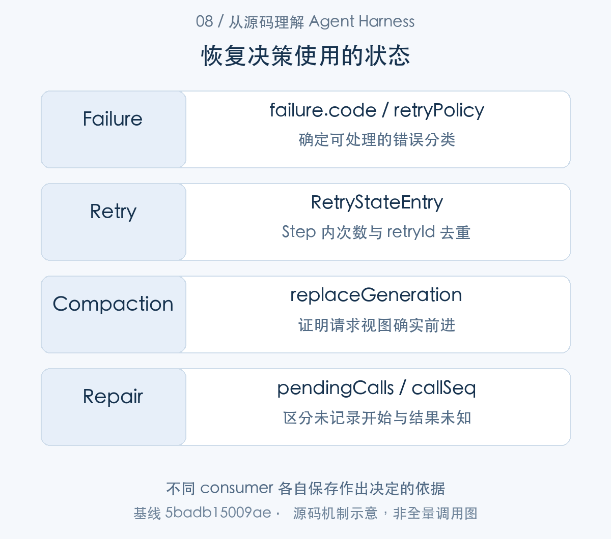
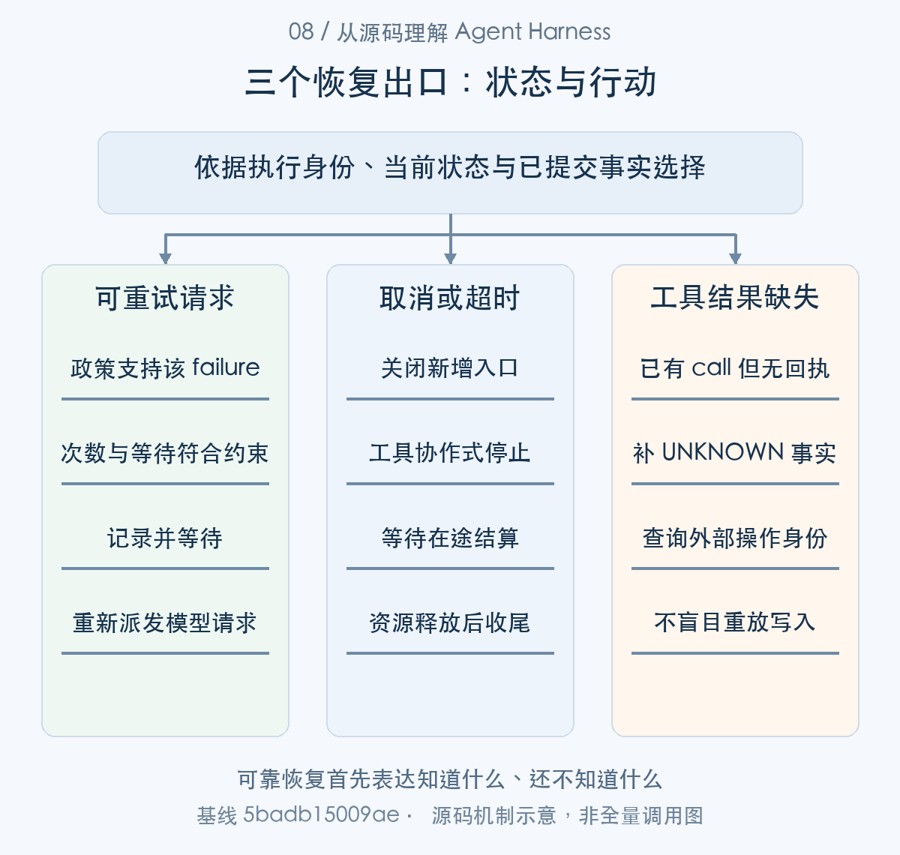

# 失败之后如何继续：重试、取消与副作用一致性

> 从源码理解 Agent Harness · 第 08 篇 · 可靠性恢复与副作用一致性

Agent 调用上传工具，远端已经保存文件，进程却在记录结果前退出。重启后日志里只有 tool/call，没有 tool/result。此时自动再上传一次，可能生成重复文件；宣布失败，又可能与远端事实不符。

这是可靠性问题的核心：系统不仅要“能够继续”，还要知道自己能够依据什么继续。DeepSeek Harness 的恢复设计区分请求重试、取消排空、日志修复与外部副作用，**未知结果被明确记录，而不是被包装成确定失败**。


本文把可靠性展开为三条有交接点的路径：模型 failure 进入 request-error 恢复链，取消沿 signal 到已启动执行并等待结算，重启则由日志修复补充缺失边界。checkpoint 为这些判断保存本地证据；外部副作用由业务回执与查询协议确认。先按失败对象分路，再沿各自的数据与返回决定追踪，才能理解系统为什么能够继续。

## 先给失败分类，再决定恢复动作

模型 adapter 抛错或流迭代失败时，LLM 层可以规范为 error finish，Loop 记录 `assistant/attempt`，把供应商、策略、失败信息和 signal 交给 `agent/request-error` waterfall。恢复插件决定是否处理，未接管则结束为相应错误。[adapter 的异常规范化](https://github.com/deepseek-ai/deepseek-harness/blob/5badb15009ae1756c3afe0ae0cef1faafc290ccc/packages/llm/llm/src/index.ts#L1047-L1114) [Loop 的请求失败处理](https://github.com/deepseek-ai/deepseek-harness/blob/5badb15009ae1756c3afe0ae0cef1faafc290ccc/packages/core/agent-loop/src/agent.ts#L398-L544)

窗口溢出可能需要缩减输入，短暂网络错误可能需要退避，参数不支持则可能根本不该原样重试。中间件或消费端异常也不一定处于 adapter 捕获范围，把所有 throw 都当作网络重试会隐藏程序错误。

工具失败属于另外的对象。body 错误通常形成 tool error outcome，模型可以据此改变方案；若工具可能完成外部写入，则还要检查副作用状态。这类恢复不能只使用模型请求的 retryPolicy。




图1：checkpoint 保存本地证据；外部结果由回执确认。先按这张主线图建立对象地图，再结合下面的 caller、数据和返回路径展开。

### 第一步：请求异常先规范化，恢复策略再接管

adapterFailureChunk() 先提供协议化 failure；stream 的 finish 由 Loop 消费，Loop 结算 attempt 后把同一 failure 传给 request-error。接下来的恢复器取得的是已发生失败的描述。


```typescript
function adapterFailureChunk(error: unknown, signal?: AbortSignal): StreamChunk {
  const failure = normalizeLlmFailure(error)
  return {
    type: 'finish',
    reason: signal?.aborted || failure.code === 'ABORTED'
      ? { kind: 'aborted', failure }
      : { kind: 'error', failure },
  }
}
```

[源码：`packages/llm/llm/src/index.ts:1146–1154`](https://github.com/deepseek-ai/deepseek-harness/blob/5badb15009ae1756c3afe0ae0cef1faafc290ccc/packages/llm/llm/src/index.ts#L1146-L1154)。

失败 chunk 把取消与供应商异常收敛为稳定分类，原始错误仍由 normalizeFailure 保留来源。恢复器面对的是协议化 failure，不能仅凭文本里出现 timeout 判断是否值得重试。尤其是 HTTP 失败与工具副作用失败，它们并不共享效果语义。

```typescript
const finish = live.finish
if (finish.kind === 'error' || finish.kind === 'aborted') {
  live.settle(
    'assistant/attempt',
    () => this.session.append('assistant/attempt', { turn, step, stream: live.stream }).seq,
  )
  const action = await this.dispatch.waterfall(
    'agent/request-error', {
      turn,
      step,
      provider: request.provider,
      failure: finish.failure,
      retryPolicy: preparedCall?.retryPolicy,
      signal,
    },
    () => Promise.resolve<RequestErrorAction>(undefined),
  )
  signal.throwIfAborted()
  if (action?.kind !== 'retry') {
    throw new LlmError(finish.failure.message, finish.failure.code, finish.failure)
  }
  continue
```

[源码：`packages/core/agent-loop/src/agent.ts:488–509`](https://github.com/deepseek-ai/deepseek-harness/blob/5badb15009ae1756c3afe0ae0cef1faafc290ccc/packages/core/agent-loop/src/agent.ts#L488-L509)。

Loop 先结算失败的 assistant attempt，再调用 agent/request-error。只有返回 retry 才继续同一个 Step；没有恢复决定便抛 LlmError。这样历史能解释每一次失败，不会因为随后成功就抹掉失败事实。恢复插件也没有权限把已经失败的 attempt 改成成功。

阅读顺序应沿 failure → attempt settlement → recovery decision → next attempt 展开。把四个阶段合成“自动重试”会隐藏恢复插件的责任以及再次准备请求的成本。


## 重试计数的作用域决定了上限含义

第一节已经把失败规范成 failure 并交给 waterfall。llm-retry 是该 waterfall 的一个 consumer，下面从它消费的计数状态解释何时返回 retry。

llm-retry 按 provider 与策略身份保存计数，状态在 step/start 或 turn/end 清空。普通模式只处理允许的错误码，并在该作用域内检查 maxRetries。

```typescript
const policyKey = retryPolicyKey(policy)
const retryState = ctx.sessionProjections.stateOf(agent.session, 'llmRetry') as LlmRetryState
const previous = retryState[retryStateKey(provider, policyKey)]
const previousRetry = previous?.retry ?? 0
if (policy.mode === 'normal' && previousRetry >= policy.maxRetries) return next()
const retry = previousRetry + 1
```

[对应源码](https://github.com/deepseek-ai/deepseek-harness/blob/5badb15009ae1756c3afe0ae0cef1faafc290ccc/packages/llm/llm-retry/src/index.ts#L219-L224)。以上为原文片段，仅统一缩进，需结合完整实现阅读。

这段代码中最重要的词是 normal。always 模式先等待下游恢复器，尊重其 retry 决定及取消，随后允许自己的退避重试，并不使用这里的 maxRetries 条件。maxDelayMs 限制一次等待，不限制总尝试次数。[normal 和 always 恢复分支](https://github.com/deepseek-ai/deepseek-harness/blob/5badb15009ae1756c3afe0ae0cef1faafc290ccc/packages/llm/llm-retry/src/index.ts#L188-L259) [重试投影的清空边界](https://github.com/deepseek-ai/deepseek-harness/blob/5badb15009ae1756c3afe0ae0cef1faafc290ccc/packages/llm/llm-retry/src/index.ts#L124-L137)

例如业务设置目标最多续跑三轮，第一轮的某个 Step 请求一直失败。若配置 always，它可以持续尝试，roundsStarted 仍不增加。任务 Turn 额度因此不能代替总调用次数、总成本或截止时间。预算篇会进一步分析这种跨层问题。

退避事件也进入日志，开始重试另有记录。延迟可被 signal 中断，插件卸载撤销 listener 后还 abort 自身 lifetime 并等待活跃恢复任务，避免已进入 waterfall 的旧回调继续行动。



图2：图示退避分支；窗口恢复依据 generation 变化。从 caller 的交接对象追到 consumer，具体分支结合正文源码阅读。

### 第二步：计数保存为 Session 投影，并在明确边界清零

Loop await 的恢复决定来到 llm-retry listener。listener 从 Session projection 读取 previousRetry，决定委派、等待或返回 retry；返回后 Loop 才重新准备 attempt。

恢复次数保存在每个路由策略的 RetryStateEntry 中：

```typescript
interface RetryStateEntry {
  retry: number
  retryId: RetryId
}
```

[源码：`packages/llm/llm-retry/src/index.ts:104–107`](https://github.com/deepseek-ai/deepseek-harness/blob/5badb15009ae1756c3afe0ae0cef1faafc290ccc/packages/llm/llm-retry/src/index.ts#L104-L107)。

|核心字段|保存的信息|使用位置|
|---|---|---|
|`retry`|当前 Step 已安排次数|normal 的次数准入|
|`retryId`|最后一次重试事实身份|重放去重|

投影以 provider 与 policyKey 分桶；step/start 和 turn/end 清空。retryId 让重放同一事件不会重复扣次数。

等待结束后的事实使用另一份 payload：

```typescript
export interface LlmRetryStartedEventData {
  retryId: RetryId
  turn: number
  step: number
  retry: number
}
```

[源码：`packages/llm/llm-retry/src/types.ts:43–48`](https://github.com/deepseek-ai/deepseek-harness/blob/5badb15009ae1756c3afe0ae0cef1faafc290ccc/packages/llm/llm-retry/src/types.ts#L43-L48)。

|核心字段|保存的信息|使用位置|
|---|---|---|
|`retryId`|连接此前的 llm/retry|识别同一次恢复等待|
|`turn` / `step` / `retry`|等待所属执行位置|回放与观测|

llm/retry 说明安排了等待，llm/retry-started 说明等待已完成；真正的下次 request 仍由 Loop 派发。这三类事实应分别统计。


```typescript
validateConfig(config)
ctx.sessionProjections.register({
  key: 'llmRetry',
  stateVersion: 1,
  stateSchema: llmRetryStateSchema,
  init: () => ({}),
  apply: (state, event) => {
    if (event.type === 'step/start' || event.type === 'turn/end') return {}
    if (event.type !== 'llm/retry') return state
    const key = retryStateKey(event.data.provider, event.data.policyKey)
    const entry = state[key]
    if (entry?.retry === event.data.retry && entry.retryId === event.data.retryId) return state
    return { ...state, [key]: { retry: event.data.retry, retryId: event.data.retryId } }
  },
})
const random = internals.random ?? Math.random
const lifetime = new AbortController()
const active = new Set<Promise<RequestErrorAction>>()
```

[源码：`packages/llm/llm-retry/src/index.ts:124–141`](https://github.com/deepseek-ai/deepseek-harness/blob/5badb15009ae1756c3afe0ae0cef1faafc290ccc/packages/llm/llm-retry/src/index.ts#L124-L141)。

step/start 与 turn/end 清空计数，llm/retry 按 provider、policyKey 更新。相同 retry/retryId 的重放不重复增加。这是当前 Step 的恢复状态，不是任务总调用数，也不是全组织供应商预算。

```typescript
  const previousRetry = previous?.retry ?? 0
  if (policy.mode === 'normal' && previousRetry >= policy.maxRetries) return next()
  const retry = previousRetry + 1
  const retryId = previous?.retryId ?? RetryId(randomUUID())
  let delayMs: number
  if (failure.providerRetryAfterMs !== undefined
    && Number.isFinite(failure.providerRetryAfterMs)
    && failure.providerRetryAfterMs > 0) {
    if (failure.providerRetryAfterMs > policy.maxDelayMs) {
      if (policy.mode === 'normal') return next()
      delayMs = localDelay(policy, retry, random)
    } else {
      delayMs = failure.providerRetryAfterMs
    }
  } else {
    delayMs = localDelay(policy, retry, random)
  }

  return backoff(agent, turn, step, failure, provider, policy, policyKey, retry, retryId, delayMs, signal)
}
```

[源码：`packages/llm/llm-retry/src/index.ts:222–241`](https://github.com/deepseek-ai/deepseek-harness/blob/5badb15009ae1756c3afe0ae0cef1faafc290ccc/packages/llm/llm-retry/src/index.ts#L222-L241)。

previousRetry 来自投影，normal 模式到 maxRetries 后委托下一策略；providerRetryAfterMs 还必须有限、正数并落在 maxDelayMs 内。normal 对过大等待不接受，always 改用本地延迟。参数的作用域决定了上限，不能把配置了 maxRetries 写成“任务最多调用模型这么多次”。

```typescript
  retryId: RetryId,
  delayMs: number,
  signal: AbortSignal,
): Promise<RequestErrorAction> {
  const fusedSignal = AbortSignal.any([signal, lifetime.signal])
  if (fusedSignal.aborted) return
  const eventData: LlmRetryEventData = policy.mode === 'normal'
    ? {
      retryId,
      turn,
      step,
      provider,
      mode: policy.mode,
      policyKey,
      retry,
      maxRetries: policy.maxRetries,
      delayMs,
      failure,
    }
    : {
      retryId,
      turn,
      step,
      provider,
      mode: policy.mode,
      policyKey,
      retry,
      delayMs,
      failure,
    }
  agent.session.append('llm/retry', eventData)
  if (!await cancellableDelay(delayMs, fusedSignal)) return
  agent.session.append('llm/retry-started', { retryId, turn, step, retry })
  return { kind: 'retry' }
}

async function recover(
  { agent, turn, step, provider, failure, retryPolicy: policy, signal }: Parameters<Events['agent/request-error']>[0],
  next: () => Promise<RequestErrorAction>,
): Promise<RequestErrorAction> {
```

[源码：`packages/llm/llm-retry/src/index.ts:158–197`](https://github.com/deepseek-ai/deepseek-harness/blob/5badb15009ae1756c3afe0ae0cef1faafc290ccc/packages/llm/llm-retry/src/index.ts#L158-L197)。

先组合请求与插件寿命 signal，记录 llm/retry，再等待，成功等完才记录 llm/retry-started 并返回 retry。取消期间存在前一条而缺后一条完全合理：它说明曾经计划重试，不能据此统计已发生的供应商请求。

## 恢复器必须证明输入有变化

同一恢复链还可以把错误交给窗口修复器。它与退避插件不是固定的前后调用：监听器的组合决定委派顺序，窗口分支根据输入变化作出自己的恢复决定。

compaction-basic 对窗口溢出检查 replaceGeneration 是否前进。没有视图变化，返回 retry 只会再次发送同一过长输入。有无需模型裁剪先成功、后续摘要失败的情况，恢复器可以依据已经生效的视图变化继续；取消则仍然优先。[压缩恢复的进展判断](https://github.com/deepseek-ai/deepseek-harness/blob/5badb15009ae1756c3afe0ae0cef1faafc290ccc/packages/compaction/compaction-basic/src/index.ts#L190-L234)

这说明重试是一项有前提的决策。普通网络退避的前提是错误可恢复，窗口修复的前提是请求视图变化，工具重做的前提则应是只读、幂等或外部状态已确认。框架不可能用同一种“再来一次”策略覆盖三者。

### 第三步：窗口溢出要先改变请求条件

窗口错误是 request-error 的另一处理支线。compaction listener 消费 failure 和当前 generation，调用压缩后用 generation 的变化决定能否把 retry 交回 Loop。


```typescript
ctx.on('agent/request-error', async (
  { agent, failure, signal },
  next,
) => {
  if (failure.code !== CONTEXT_WINDOW_EXCEEDED_CODE || signal.aborted) return next()
  this.overflowAgents.set(agent.session, agent)
  const target = routedTarget(agent.session)
  if (target === undefined) return next()
  const policy = resolveTargetPolicy(this.config, target)
  const retries = this.overflowRetries.get(agent) ?? 0
  if (retries >= policy.maxOverflowRetries) return next()

  const generation = agent.session.surface.replaceGeneration
  let result: CompactionResult | null
  try {
    result = await this.compactIfNeeded(agent, 'context-overflow', signal)
  } catch (recoveryError: unknown) {
    const message = recoveryError instanceof Error ? recoveryError.message : String(recoveryError)
    // A model-free prune can land before later summary work fails. That
    // durable reduction is sufficient retry proof; do not discard it just
    // because the optional second phase threw. Cancellation still wins.
```

[源码：`packages/compaction/compaction-basic/src/index.ts:190–210`](https://github.com/deepseek-ai/deepseek-harness/blob/5badb15009ae1756c3afe0ae0cef1faafc290ccc/packages/compaction/compaction-basic/src/index.ts#L190-L210)。

窗口错误走专门恢复通道：检查 failure 分类、目标与重试上限，保存 compactionGeneration 后再调用压缩。一般网络重试可以保持输入；窗口错误原样再送通常只会重复失败。

```typescript
    // oxlint-disable-next-line typescript/no-unnecessary-condition -- the signal can abort while recovery is awaited.
    if (!signal.aborted && agent.session.surface.replaceGeneration > generation) {
      ctx.logger.warn(
        `context-overflow compaction failed after durable surface progress: ${message}; `
        + 'retrying from the replacement surface',
      )
      this.overflowRetries.set(agent, retries + 1)
      return { kind: 'retry' }
    }
    ctx.logger.warn(
      // oxlint-disable-next-line typescript/no-unnecessary-condition -- the signal can abort while recovery is awaited.
      `context-overflow compaction failed: ${message}; ${signal.aborted
        ? 'cancellation prevents retry'
        : 'preserving the original request error'}`,
    )
    return next()
  }
  // oxlint-disable-next-line typescript/no-unnecessary-condition -- the signal can abort while compaction is awaited.
  if (signal.aborted
    || agent.session.surface.replaceGeneration <= generation) return next()
  if (result !== null) logResult(result, 'context overflow recovery')
  this.overflowRetries.set(agent, retries + 1)
  return { kind: 'retry' }
})
```

[源码：`packages/compaction/compaction-basic/src/index.ts:211–234`](https://github.com/deepseek-ai/deepseek-harness/blob/5badb15009ae1756c3afe0ae0cef1faafc290ccc/packages/compaction/compaction-basic/src/index.ts#L211-L234)。

压缩抛错时，optional prune 若已经推进 generation，仍可能提供足够进展；没有推进则不能承诺 retry 有意义。成功返回同样检查 generation。判断依据是请求视图发生了可解释变化，而不是某个插件函数“执行过”。

压缩进展不等于模型最终接纳。下一次请求仍可能过大，恢复次数仍需有界；generation 是允许再次尝试的证据，不是任务成功的证明。


## 取消不是立即返回，而是停止新增并等待结算

恢复等待与实际派发都消费 signal，因此取消会穿过前两条路径。这里从 Host cancel 切入工具包装与 scheduler，解释信号怎样转为结算完成。

用户、父级或插件卸载可以向当前 Turn 传播 AbortSignal。Loop 停止新的派发，等待已启动模型或工具结束，再关闭步骤与 Turn。已经显示的安全文本块可以作为 interrupted assistant/message 保存，没有可见内容时则保留 attempt 事实。[Agent 取消入口](https://github.com/deepseek-ai/deepseek-harness/blob/5badb15009ae1756c3afe0ae0cef1faafc290ccc/packages/core/agent-loop/src/agent.ts#L154-L241) [部分文本的结算](https://github.com/deepseek-ai/deepseek-harness/blob/5badb15009ae1756c3afe0ae0cef1faafc290ccc/packages/core/agent-loop/src/assistant-stream.ts#L45-L110)

timeout-policy 使用派生 deadline signal 包装工具执行，并等待下游静止后才产出 TOOL_TIMEOUT。它不会只用 Promise.race 提前返回并把工作遗留在后台；相应代价是工具必须合作响应 signal，否则等待仍可能拖住。[工具 deadline 包装](https://github.com/deepseek-ai/deepseek-harness/blob/5badb15009ae1756c3afe0ae0cef1faafc290ccc/packages/guard/timeout-policy/src/index.ts#L55-L81)

例如一个构建进程超时，用户看到 timeout 之前，provider 需要终止并排空托管进程范围。若构建已经写入文件，取消也不会自动删除修改。终止能力、资源清理和业务补偿是不同责任。



图3：不同 consumer 各自保存作出决定的依据。表中对象并列展示用途与寿命，层次之间以源码所示身份关联。

### 第四步：取消先关闭入口，再等待已经开始的工作

现在从错误恢复切换到取消路径：Agent.cancel() 撤销排队推进并 abort；timeout wrapper 也可派生 signal。runGroup 消费取消，停止补派发并排空已启动 body。


```typescript
cancel(cause: AgentCancelCause, options: CancelOptions = {}): void {
  if (!options.keepInbox) {
    this.inbox.clear()
    if (this.phase.kind !== 'idle') this.phase.wakeRequested = false
  }
  if (this.phase.kind !== 'idle') this.phase.abort.abort(cause)
}
```

[源码：`packages/core/agent-loop/src/agent.ts:175–181`](https://github.com/deepseek-ai/deepseek-harness/blob/5badb15009ae1756c3afe0ae0cef1faafc290ccc/packages/core/agent-loop/src/agent.ts#L175-L181)。

cancel 默认清空 inbox 和续跑锁存，再 abort 活跃 signal；keepInbox 则显式保留输入。Host 取消不能只盯一个 HTTP signal，否则此前排队的用户消息仍可能唤醒新 Turn。

```typescript
export function apply(ctx: Context): void {
  ctx.on('tools/execute', async (exec, next): Promise<ToolExecutionResult> => {
    const timeoutMs = ctx.tools.get(exec.name, exec.agent)?.timeoutMs
    // A tool that declares no budget: no deadline, delegate unchanged.
    if (timeoutMs === undefined) return next()

    using d = deadline(exec.signal, timeoutMs, TOOL_TIMEOUT)
    // Swap the derived deadline onto exec for dispatch, then restore the
    // caller's own signal so post-execute listeners never see this plugin's
    // (possibly already-aborted) timeout signal.
    const upstream = exec.signal
    exec.signal = d.signal
    try {
      const result = await next()
      // If OUR timer fired (scoped by code — a nested outer deadline reads as
      // undefined here), the tool/capability saw the abort and reached
      // quiescence; replace whatever it returned (its own abort result) with the
      // structured TOOL_TIMEOUT the model sees.
      if (timeoutOf(d.signal, TOOL_TIMEOUT) !== undefined) {
        return toolTimeoutResult(timeoutMs)
      }
      return result
    } finally {
      exec.signal = upstream
    }
  })
}
```

[源码：`packages/guard/timeout-policy/src/index.ts:55–81`](https://github.com/deepseek-ai/deepseek-harness/blob/5badb15009ae1756c3afe0ae0cef1faafc290ccc/packages/guard/timeout-policy/src/index.ts#L55-L81)。

deadline 进入 exec.signal，但 await next() 一直等到被包装工具结算；只在本包装器自己的 timeout 分类成立时替换反馈，finally 恢复上游 signal。它没有用 Promise.race 抛下还在执行的业务操作。工具若不协作，超时后的等待可能很长。

```typescript
  // already-started dispatch settles.
  try {
    await fillPool()
    while (inFlight.size > 0) {
      const settledIndex = await Promise.race(inFlight.values())
      inFlight.delete(settledIndex)
      throwSchedulerFailure()
      await commitReady()
      throwSchedulerFailure()
      // Abort may arrive while a tool or ordered commit awaits.

      if (signal.aborted) aborted = true
      await fillPool()
    }
  } catch (error: unknown) {
    schedulerFailure ??= { error }
    await Promise.allSettled(inFlight.values())
    throw schedulerFailure.error
  }

  if (aborted) {
    // Started calls and accepted context settle first; every remaining model
    // call then receives an ordered synthetic result before the turn aborts.
    for (const call of group.slice(started)) appendSkippedToolCall(session, turn, step, call.block)
    return { consumed: group.length, aborted: true, concluded }
  }
  /* v8 ignore next -- unreachable: a non-aborted group commits every started call */
  if (committed !== started) throw new Error('tool-call scheduler: uncommitted settled calls')
  return { consumed: started, aborted: false, concluded }
}

/** Append the durable call/result pair for a model call skipped after cancellation. */
```

[源码：`packages/core/agent-loop/src/tool-calls.ts:218–249`](https://github.com/deepseek-ai/deepseek-harness/blob/5badb15009ae1756c3afe0ae0cef1faafc290ccc/packages/core/agent-loop/src/tool-calls.ts#L218-L249)。

调度错误阻止新派发，并用 allSettled 等待 inFlight；取消则为尚未启动的模型调用补有序错误结果。这里解决的是本地执行链闭合，不证明一个远端系统已停止。真正的硬隔离需要进程、容器或远端取消协议。

```typescript
  const disposeListener = ctx.on('agent/request-error', (
    payload,
    next: () => Promise<RequestErrorAction>,
  ) => {
    // A waterfall may have captured this callback before its registration was
    // removed. Lifetime cancellation must prevent that stale callback from
    // entering a downstream policy after disposal.
    if (lifetime.signal.aborted) return Promise.resolve<RequestErrorAction>(undefined)
    return track(recover(payload, next))
  })

  ctx.effect(() => async () => {
    disposeListener()
    lifetime.abort(new Error('llm-retry plugin disposed'))
    await Promise.allSettled([...active])
  }, 'llm-retry: abort and drain active recovery')
}
```

[源码：`packages/llm/llm-retry/src/index.ts:243–259`](https://github.com/deepseek-ai/deepseek-harness/blob/5badb15009ae1756c3afe0ae0cef1faafc290ccc/packages/llm/llm-retry/src/index.ts#L243-L259)。

卸载先撤销 listener，再取消插件寿命，最后等待 active。已被 waterfall 捕获的旧 listener 也检查 lifetime，防止进入新的下游恢复。这是生命周期上的可靠性，不能只靠 disposer 从数组移除回调。

## 日志修复保留不知道的事实

上一节处理活实例的停止，下面转到进程中断后的恢复。此时没有原在途 Promise，只能消费持久事件判断哪些调用需要补结果。

失败 Step 和崩溃恢复都需要处理悬空工具历史。repair 定义了两种结果：调用没有记录开始，以及调用开始但没有可靠记录最终结果。

```typescript
/** Recovery code for an assistant tool request that never reached a recorded call start. */
export const TOOL_NOT_STARTED = 'TOOL_NOT_STARTED'

/** Recovery code for a recorded tool call whose completed outcome was not durably recorded. */
export const TOOL_OUTCOME_UNKNOWN = 'TOOL_OUTCOME_UNKNOWN'
```

[对应源码](https://github.com/deepseek-ai/deepseek-harness/blob/5badb15009ae1756c3afe0ae0cef1faafc290ccc/packages/core/session/src/repair.ts#L14-L18)。以上为原文片段，仅统一缩进，需结合完整实现阅读。

`TOOL_NOT_STARTED` 说明日志没有该调用的开始记录；`TOOL_OUTCOME_UNKNOWN` 说明有开始记录但没有结果。它们使模型后续历史结构完整，同时保留信息边界。对于 fork，父会话可能已经在分支点之后执行，所以子分支里的 not-started 也不能推导整个外部世界从未发生操作。[恢复和 fork 的工具说明](https://github.com/deepseek-ai/deepseek-harness/blob/5badb15009ae1756c3afe0ae0cef1faafc290ccc/packages/core/session/src/repair.ts#L14-L97)

例如上传场景恢复为 unknown，应用应以操作身份查询远端，再判断返回既有文件、重做还是请求人工处理。若远端支持幂等键，同一业务操作可以再次提交而不产生重复效果；这属于 connector 的业务协议，JSONL 本身不能提供。

工具结果修补也可能失败。Loop 在关闭 Step 前尝试补结果，失败时汇总原始与恢复错误，不应假装所有历史都已修好。错误可解释比输出一个笼统 completed 更重要。



图4：可靠恢复首先表达知道什么、还不知道什么。各分支基于自己的证据返回决定，不按完成文案推断下一动作。

### 第五步：恢复日志时区分“未开始”与“结果未知”

进程退出后，resume/read 交出日志给 openTurnClosers()，内部 ToolCallRecovery.observe() 扫描调用身份，再由 results() 形成缺失结果。这条路径不重新进入原 execute()。

修复器只保留待闭合身份与最后位置，核心状态如下：

```typescript
/** @param cause - defaults to interrupted live/crash recovery; fork-seed construction supplies its own cause. */
constructor(private readonly cause: OpenTurnCloseCause = { kind: 'interrupted' }) {}

/**
 * Consume the next committed event; closed steps and turn boundaries discard pending requests.
 * @param event - the next event from the same Session, in sequence order.
 */
```

[源码：`packages/core/session/src/repair.ts:109–115`](https://github.com/deepseek-ai/deepseek-harness/blob/5badb15009ae1756c3afe0ae0cef1faafc290ccc/packages/core/session/src/repair.ts#L109-L115)。

|核心字段|保存的信息|使用位置|
|---|---|---|
|`pendingCalls`|callId → Turn、Step、可选 callSeq|observe 建立和清除，results 消费|
|`last` / `cause`|序号时间依据与恢复原因|确定性的 synthetic events|

缺少 callSeq 表示没有记录调用开始，有 callSeq 却没有 result 表示结果未知。cause 决定 interrupted 或 forked 的解释，特别保留父 Session 可能继续执行的含义。


上面的 NOT_STARTED 与 UNKNOWN 常量是修复算法的两个出口。

两个常量表达不同知识状态。缺少 tool/call 可以标记未开始；已经存在调用却没有回执，只能说结果未知，不能填一个虚构失败然后自动重做。

```typescript
results(): SessionEvent<'tool/result'>[] {
  if (this.last === undefined) return []
  let seq = this.last.seq + 1
  const time = this.last.time
  const results: SessionEvent<'tool/result'>[] = []

  const text = CLOSER_TEXT[this.cause.kind]
  // Close calls before their step: providers reject dangling assistant calls,
  // and Map insertion order preserves their transcript order.
  for (const [callId, { turn, step, callSeq }] of this.pendingCalls) {
    const started = callSeq !== undefined
    const message: ToolResultMessage = deepFreeze({
      id: brandString<MessageId>(`${this.cause.kind}-tool-result-${callId}-${seq}`),
      role: 'tool',
      toolCallId: callId,
      isError: true,
      source: { kind: 'tool', callId },
      content: [{
        type: 'text',
        text: started ? text.started : text.notStarted,
      }],
    })
    results.push({
      type: 'tool/result',
      seq: SessionSeq(seq++),
```

[源码：`packages/core/session/src/repair.ts:157–181`](https://github.com/deepseek-ai/deepseek-harness/blob/5badb15009ae1756c3afe0ae0cef1faafc290ccc/packages/core/session/src/repair.ts#L157-L181)。

修复依据历史调用顺序和 callSeq 判断 started，为每个 pending 调用生成闭合结果。sourceEventSeqs 将修复反馈指回它依据的事实。即便回复是错误文本，错误仍可能是在说“不知道远端结果”。

```typescript
    time,
    data: {
      turn,
      step,
      message,
      error: started
        ? { name: 'ToolOutcomeUnknownError', code: TOOL_OUTCOME_UNKNOWN }
        : { name: 'ToolNotStartedError', code: TOOL_NOT_STARTED },
    },
    surfaceOp: 'append',
    ...started ? { sourceEventSeqs: [callSeq] } : {},
  })
}

return results
```

[源码：`packages/core/session/src/repair.ts:182–196`](https://github.com/deepseek-ai/deepseek-harness/blob/5badb15009ae1756c3afe0ae0cef1faafc290ccc/packages/core/session/src/repair.ts#L182-L196)。

修复结果按 surface append 进入后续模型上下文，剩余 Step/Turn 边界也要关闭。恢复不会重新调用 execute；否则对支付、建单等操作可能制造重复副作用。业务可安全恢复的前提是 operationId 查询与幂等接口，而非仅有 Session 文件。


## checkpoint 和熔断分别解决什么

checkpoint 在执行前 flush 会话事实，缩小进程崩溃时的本地缺口。它不能把远端成功与本地结果写入合并成一个原子事务，更不能承诺停电零损失或外部恰好执行一次。[执行前持久屏障](https://github.com/deepseek-ai/deepseek-harness/blob/5badb15009ae1756c3afe0ae0cef1faafc290ccc/packages/session/session-checkpoint-policy/src/index.ts#L54-L83)

provider 熔断通常还需要健康状态、打开／半开状态和试探恢复等机制。本研究在 core、llm、guard 的限定实现范围未确认这样的通用状态机；已有 retry 与 deadline 不应被命名为完整 provider circuit breaker。这个结论有范围，不代表仅靠关键词搜索证明整个仓库绝对不存在相关扩展。

如果需要新增熔断，应该明确它限制哪些路由、健康状态由谁维护、并发试探怎样准入，以及是否会影响已经准备的调用。这是改造方向，不是本基线的运行事实。

### 第六步：持久化屏障保存证据，熔断控制未来流量

最后回到执行前边界：checkpoint listener 在派发前 flush，保存供第五步读取的事实。熔断扩展则控制未来请求，两者在时间方向与控制对象上不同。


```typescript
export function apply(ctx: Context): void {
  ctx.on('llm/stream', (options, next): AsyncIterable<StreamChunk> => {
    if (options.sessionId === undefined) return next()
    const session = ctx.sessions.get(options.sessionId)
    return session === undefined ? next() : afterCheckpoint(ctx, session, next)
  })

  ctx.on('tools/execute', async (exec, next): Promise<ToolExecutionResult> => {
    if (exec.agent === undefined || exec.parent !== undefined) return next()
    await ctx.sessions.flush(exec.agent.session)
    if (exec.signal.aborted) return abortedBeforeDispatchResult()
    return next()
  })

  // Before each request, persist everything committed by the preceding step;
  // the first step's call is an intentional no-op beyond any prompt intake.
  ctx.on('agent/pre-step', async ({ agent }, next): Promise<PreStepDecision> => {
    await ctx.sessions.flush(agent.session)
    return next()
  })
```

[源码：`packages/session/session-checkpoint-policy/src/index.ts:63–82`](https://github.com/deepseek-ai/deepseek-harness/blob/5badb15009ae1756c3afe0ae0cef1faafc290ccc/packages/session/session-checkpoint-policy/src/index.ts#L63-L82)。

模型派发、顶层工具执行和 preStep 的检查点各保存前一阶段事实；dispatch 前还检查取消。写文件成功并不与远端业务事务原子提交，保存了 tool/call 也不等于保存了回执。

本版本这些接缝支持增加熔断器，但本文没有把熔断作为现成全局能力。企业实现可以在供应商 route dispatch 前判断 circuit 状态，在明确的 failure 分类后更新窗口；恢复试探需要独立额度，不能让全部 Agent 同时冲进半开状态。

|机制|控制对象|仍需独立解决|
|---|---|---|
|checkpoint|已观察的历史证据|外部操作与回执的一致性|
|有界重试|同 Step 的请求恢复|任务总额度与重试风暴|
|取消并结算|当前在途操作|不协作工具及远端效果|
|企业熔断扩展|未来供应商请求|组织级共享状态与半开配额|

## 可靠性的优势与尚需补齐的协议

DSH 的优势是失败、取消和修复都留下明确记录，工具未知结果不被盲目重跑，生命周期清理等待在途任务。请求恢复通过插件组合，也方便按失败类型选择策略。

不足在于协作式取消依赖 provider，外部副作用还需要幂等和查询；always 重试需要另设任务上限。日志结构修复可以使会话继续，却不代表业务结果已经确认。若产品需要交易级承诺，必须在工具与外部系统之间建立相应协议。

### 用一次“写入成功但响应丢失”审查恢复链

正常路径是记录 call、执行写入、收到回执、规范结果、记录 result。若网络在回执前断开，日志只能证明 call 已出现。修复必须留下 UNKNOWN，而后应用查询 operationId；只有证明操作未提交且允许重放，才重试写入。

优势在于失败分类、恢复决定、取消和历史修复有各自入口，扩展不需要重写 Loop。不足也明确：局部重试没有全局流量协调，JSONL 没有跨系统事务，不协作工具可能拖住退出。工程验收必须把这几个限制写进协议，而不是统称为“自动恢复”。

## 技术心得：可靠恢复首先要表达不确定性

### 让恢复动作对应一份证据

failure 分类、previousRetry、replaceGeneration 和 callSeq 分别支持退避、次数准入、输入修复与结果补齐。我从这些结构中得到的实践是，先说明恢复判断依赖哪份事实，再安排动作；恢复记录也保留这份依据，方便解释为何继续。

### 把停止请求推进到结算完成

cancel、deadline 和插件 lifetime 都发出停止请求，scheduler drain 与 active 等待才完成管理责任。实现工具或 provider 时，可以沿这两端设计验收：信号到达后不新增工作，已启动工作进入明确的结束与清理路径。

### 为业务副作用准备可查询身份

ToolCallRecovery 将结果未知保留为 UNKNOWN，给 connector 留下正确的下一步。对上传和建单，应用可补 operationId、幂等键与回执查询，让本地 call/result 与远端事实连接；这属于业务协议设计。

checkpoint 保存执行证据，修复补齐本地历史，查询确认外部结果。把三者组合起来，才能让用户从一次中断继续做具体工作。本文的收获来自固定版本源码及既有受控验证，本轮没有新增真实远端故障注入。

---

研究基线：DeepSeek Harness `0.2.1-alpha.1`，提交 `5badb15009ae1756c3afe0ae0cef1faafc290ccc`。源码事实以该版本为准；文中的工程判断和改造建议另行说明。教学场景不代表真实模型业务实测。

源码与运行记录可从[证据索引](../appendices/evidence-index.md)和[验证附录](../appendices/validation.md)复核。本文引用此前同一提交的验证结果，本轮写作不将其重新计为新测试。

[专栏目录](README.md) · [上一篇](07-tool-runtime.md) · [下一篇](09-concurrency.md)
