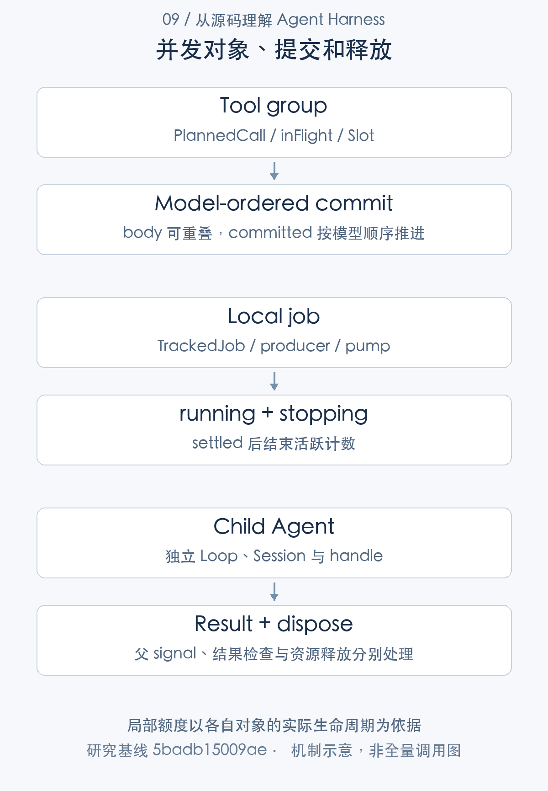
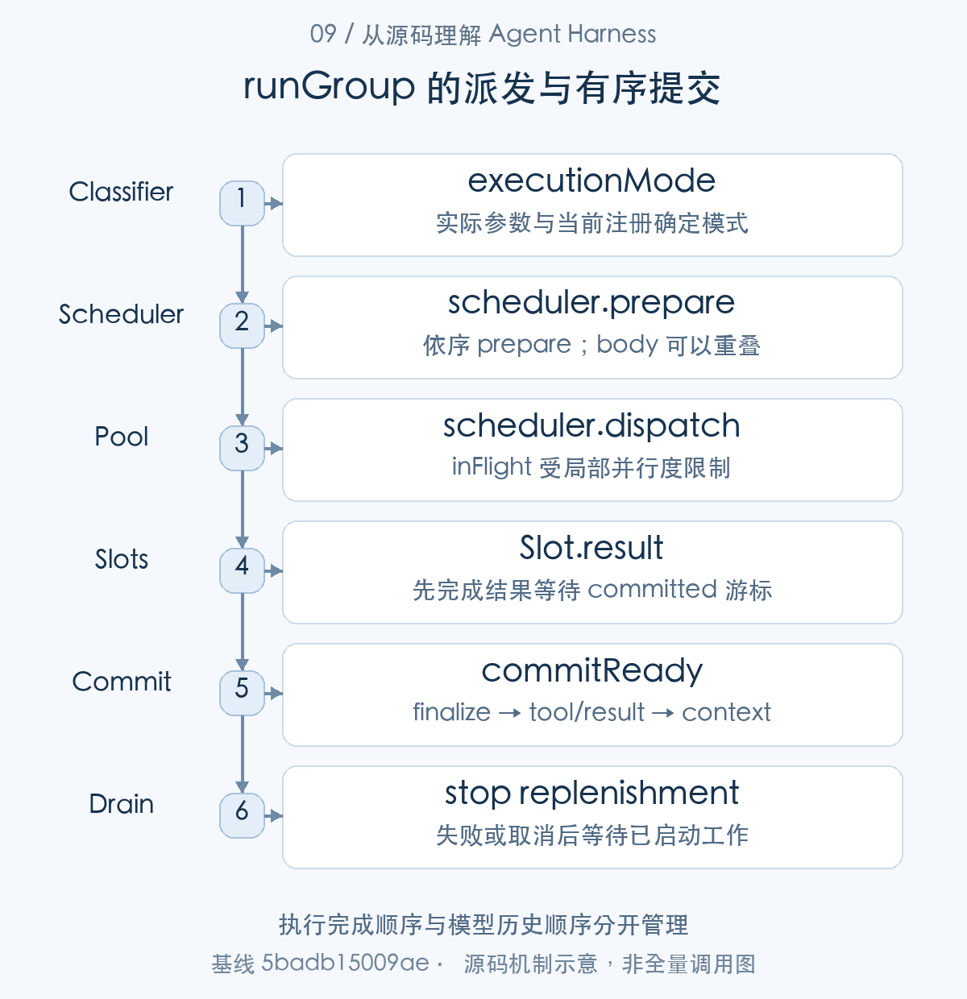
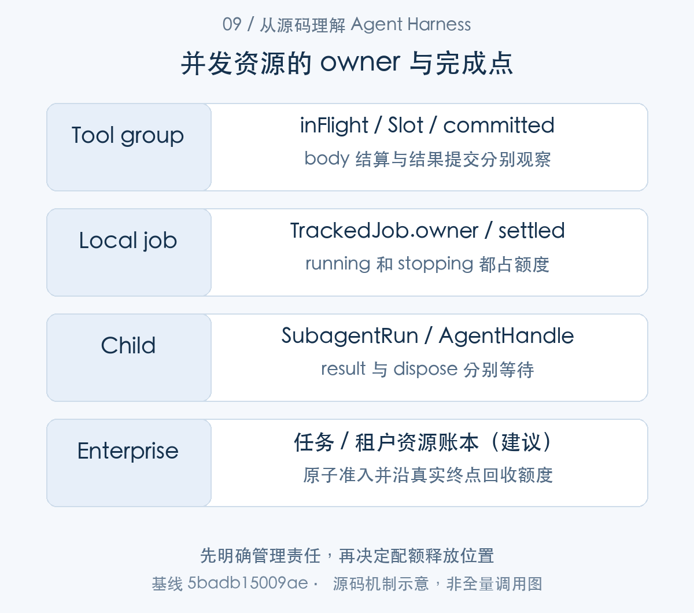
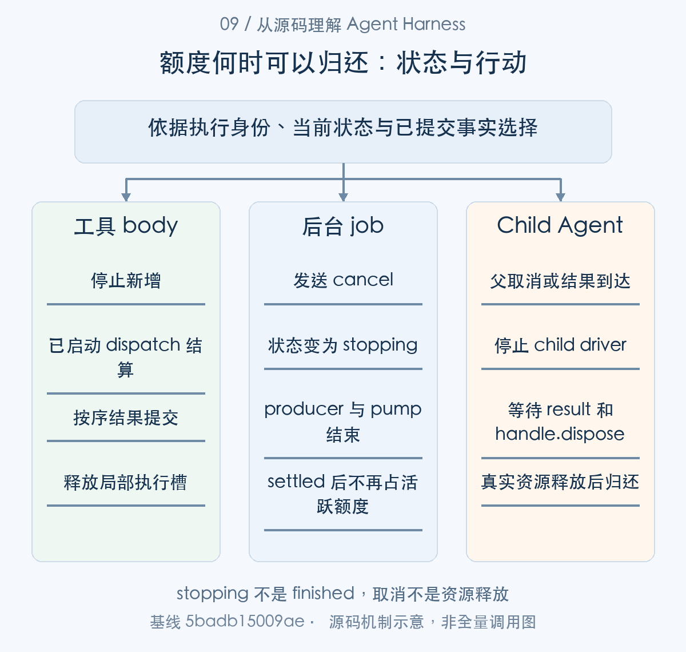

# 哪些工作可以同时执行：工具、作业与子 Agent 调度

> 从源码理解 Agent Harness · 第 09 篇 · 并发、调度与资源治理

代码修复任务可以同时读取多个文件，运行测试也可以作为后台作业，父 Agent 还可能委派子 Agent 分析模块。听起来都叫并发，实际却有不同的状态、额度和取消责任。把一个 maxConcurrency 参数放到最外层，并不能自动管理全部资源。

DeepSeek Harness 提供单 Agent driver、工具分组调度、jobs-local 和子 Agent 容量控制。本文按执行对象拆解这些机制，说明**局部并发策略怎样组合，以及它们为什么还不是统一的全局调度系统**。


并发在本文有三个不同对象。工具调用经 executeToolCalls() 分组，runGroup() 让 body 重叠，再按模型顺序提交；后台 job 由 registry 连接 producer、输出 pump 与 owner；child 由 SubagentRuntime 和 driver 管理创建、结果与 dispose。单 Agent driver 是这些工作的发起控制链，局部额度沿各自生命周期释放。下面按这张对象地图分别追踪。

## 先确定并发发生在哪一层

同一个 Agent 由单一 driver 推进，输入追加进入 inbox，不启动第二条并行 Turn 控制链。多个 Agent 则可以各自运行，可能共享模型和执行 provider。[单 Agent 输入与 driver](https://github.com/deepseek-ai/deepseek-harness/blob/5badb15009ae1756c3afe0ae0cef1faafc290ccc/packages/core/agent-loop/src/agent.ts#L154-L241)

一个 Step 内，模型可以输出多个工具调用。工具有序 prepare，body 允许有限重叠，结果仍按模型顺序提交。后台 job 是更长生命周期的生产者，child Agent 又拥有独立 Loop、scope 和结果结算。它们不能只按“同时有几个 Promise”管理。

例如并发读三份文件、后台执行一次构建、让子 Agent 审阅修改，涉及至少三种调度对象。某一对象完成，不表示其他对象释放了模型调用、文件句柄或进程资源。




图1：局部额度以各自对象的实际生命周期为依据。先按这张主线图建立对象地图，再结合下面的 caller、数据和返回路径展开。

### 第一步：区分驱动器、工具池、作业与子 Agent

wakeDriver() 保持一个 Agent 的 driver 唯一；该 driver 在 Step 中调用 executeToolCalls()，为每个模型 call 建立 PlannedCall。并发对象从这里开始分层。

模型调用进入调度器时，交接为 PlannedCall：

```typescript
interface PlannedCall {
  block: ToolCallBlock
  exec: ToolExecutionInput
}
```

[源码：`packages/core/agent-loop/src/tool-calls.ts:21–24`](https://github.com/deepseek-ai/deepseek-harness/blob/5badb15009ae1756c3afe0ae0cef1faafc290ccc/packages/core/agent-loop/src/tool-calls.ts#L21-L24)。

|核心字段|保存的信息|使用位置|
|---|---|---|
|`block`|模型原始调用及 id|call 顺序与日志|
|`exec`|解析参数、Agent 与 signal|prepare / dispatch|

模型顺序保留在数组位置，exec 各自独立；包装器修改某次 signal 不会替换整组输入。


```typescript
private wakeDriver(wakeAfterAbort = false): void {
  if (this.phase.kind !== 'idle') {
    // Maintenance and aborted drivers cannot deliver the wake: latch it for
    // replay at convergence. Live drivers claim queued work themselves;
    // disposal never latches, so teardown waits on no model turn.
    const reason = abortedCancelCause(this.phase.abort.signal)
    if (reason?.kind !== 'disposed' && (this.phase.kind === 'maintenance' || wakeAfterAbort)) {
      this.phase.wakeRequested = true
    }
    return
  }
  const driver = Promise.withResolvers<void>()
  this.activityDone = driver.promise
  this.setPhase({
    kind: 'running',
    abort: new AbortController(),
    turn: this.phase.lastTurn,
    step: 0,
    wakeRequested: false,
  })
  this.loopCtx.agents.withInitiator(this, () => this.kick()).then(driver.resolve, driver.reject)
}
```

[源码：`packages/core/agent-loop/src/agent.ts:214–235`](https://github.com/deepseek-ai/deepseek-harness/blob/5badb15009ae1756c3afe0ae0cef1faafc290ccc/packages/core/agent-loop/src/agent.ts#L214-L235)。

wakeDriver 先检查驱动器是否仍在活动；维护或取消窗口里的输入由锁存记录，idle 后再启动。这使同一 Agent 的执行驱动保持单一，不意味着工具 body 不会并行，也不意味着多个 Agent 共享全局并发上限。

```typescript
// Inputs are distinct because tools/execute wrappers may replace `exec.signal`.
const planned: PlannedCall[] = toolCalls.map(block => ({
  block,
  exec: {
    callId: block.id,
    name: block.name,
    arguments: parseArguments(block.arguments),
    agent,
    signal,
  },
}))
```

[源码：`packages/core/agent-loop/src/tool-calls.ts:71–81`](https://github.com/deepseek-ai/deepseek-harness/blob/5badb15009ae1756c3afe0ae0cef1faafc290ccc/packages/core/agent-loop/src/tool-calls.ts#L71-L81)。

每个工具调用有独立 exec，但初始共用 Step signal。exec.signal 可以被包装器替换，因此调用者 signal 与包装 signal 必须分开记。后台作业另有 owner 与 producer.done，子 Agent 则拥有独立 session 和 handle，不能直接塞进同一个 Promise 池就认为生命周期受控。


## 工具并发先看安全声明

单 driver 已明确，接下来进入它在一个 Step 内调用的 executeToolCalls()。这条路径先分类实际参数的 executionMode，再进入受限 body 池。

工具显式声明 isConcurrencySafe 才有资格并行，默认采用独占方式。maxParallelToolCalls 默认 10，可用 volatile 配置更新；独占调用形成屏障，尚未执行的调用之后会重新分类。[默认工具并行度](https://github.com/deepseek-ai/deepseek-harness/blob/5badb15009ae1756c3afe0ae0cef1faafc290ccc/packages/core/agent-loop/src/constants.ts#L1-L6) [工具分组和调度](https://github.com/deepseek-ai/deepseek-harness/blob/5badb15009ae1756c3afe0ae0cef1faafc290ccc/packages/core/agent-loop/src/tool-calls.ts#L60-L290)

这样选择比较保守：两个读取工具可能并行，写同一文件或操作共享状态的工具则不能仅因模型同时提出就执行。并发安全声明也不是运行时证明；若工具错误声明安全，调度器无法替它解决外部数据竞争。

prepare 和审批按顺序 await，body 可以重叠。这意味着并行度是派发上限，实际吞吐仍会受授权等待、provider 和外部服务限制。调大数值，并不会让所有前置阶段同时运行。



图2：执行完成顺序与模型历史顺序分开管理。从 caller 的交接对象追到 consumer，具体分支结合正文源码阅读。

### 第二步：运行时根据实际参数重读安全模式

PlannedCall 进入外层分组，executionMode() 从真实参数判定 parallel 或 exclusive。runGroup() 在实际启动前再次检查模式，再通过 fillPool() 依序 prepare、允许 body 重叠。


```typescript
if (userPresentCall) {
  tool.presentCall = (args: unknown): ToolCallView | undefined => {
    if (validate(args).length > 0) return undefined
    return userPresentCall(args as InferArgs<S>)
  }
}
if (userPresentResult) {
  tool.presentResult = (args: unknown, result: ToolResult): ToolResultView | undefined => {
    if (validate(args).length > 0) return undefined
    return userPresentResult(args as InferArgs<S>, result)
  }
}
if (userIsConcurrencySafe) {
  tool.isConcurrencySafe = (args: unknown): boolean => {
    if (validate(args).length > 0) return false
    return userIsConcurrencySafe(args as InferArgs<S>)
  }
```

[源码：`packages/core/tools/src/schema.ts:613–629`](https://github.com/deepseek-ai/deepseek-harness/blob/5badb15009ae1756c3afe0ae0cef1faafc290ccc/packages/core/tools/src/schema.ts#L613-L629)。

concurrency 判断先验证参数，不合法则 false。展示可以软降级，但并行不能冒险推断；并发安全是工具作者针对实际资源与参数的契约，不是“都是读请求”的静态标签。

```typescript
let next = 0
let concluded = false
while (next < planned.length) {
  // Commit before classifying again so registry changes affect unstarted calls.
  // oxlint-disable-next-line typescript/no-non-null-assertion -- bounded by the loop condition
  const first = planned[next]!
  const mode = ctx.tools.executionMode(first.exec).kind
  const group = mode === 'parallel' ? planned.slice(next) : [first]
  const outcome = await runGroup(
    ctx, turn, step, group, mode, signal, acceptContext,
  )
  next += outcome.consumed
  concluded ||= outcome.concluded
  if (outcome.aborted) {
    for (const call of planned.slice(next)) appendSkippedToolCall(session, turn, step, call.block)
    return { concluded }
  }
}
return { concluded }
```

[源码：`packages/core/agent-loop/src/tool-calls.ts:83–101`](https://github.com/deepseek-ai/deepseek-harness/blob/5badb15009ae1756c3afe0ae0cef1faafc290ccc/packages/core/agent-loop/src/tool-calls.ts#L83-L101)。

外层按下一调用的 executionMode 选择并行组或 exclusive 单调用。每组结束后再次分类，因为前一工具可能改变注册或资源模式。exclusive 是顺序屏障，不是操作系统锁，也不保证另一个 Agent 不会同时写同一个资源。

```typescript
const fillPool = async (): Promise<void> => {
  while (!aborted && nextToStart < group.length && inFlight.size < maxParallelToolCalls) {
    // Re-read later modes after ordered commits so registry changes can create a barrier.
    // oxlint-disable-next-line typescript/no-non-null-assertion -- bounded by the loop condition
    const nextCall = group[nextToStart]!
    if (nextToStart > 0 && mode === 'parallel'
      && ctx.tools.executionMode(nextCall.exec).kind !== 'parallel') break
    await startCall(nextToStart)
    nextToStart++
    throwSchedulerFailure()
    await commitReady()
    throwSchedulerFailure()
    // Abort may arrive while pre-execute awaits.
    if (signal.aborted) aborted = true
  }
}

// Ordered pre-execute may await; only dispatch/body overlaps. A scheduler
// failure stops new dispatches and reaches the turn boundary after every
```

[源码：`packages/core/agent-loop/src/tool-calls.ts:199–217`](https://github.com/deepseek-ai/deepseek-harness/blob/5badb15009ae1756c3afe0ae0cef1faafc290ccc/packages/core/agent-loop/src/tool-calls.ts#L199-L217)。

fillPool 按 maxParallelToolCalls 填槽，后续调用在启动前再次检查模式；准备过程依次 await，body 才能重叠。异步审批并没有全部同时弹出；已准备 body 可并行，与“整个工具协议都并行”有区别。

企业写工具还需数据库版本检查、锁或幂等约束。局部 exclusive 只协调本次 Loop 的调用列表，不能承担跨会话资源互斥。

## 并行完成，为什么还要按顺序提交

并行组能够重叠派发以后，runGroup() 还要将不同完成时间变成稳定历史。下面保持在同一个函数内部，解释槽位、游标与 commitReady() 的关系。

调度器为模型调用建立 slots，记录已经启动的序号与结果。commitReady 只推进连续可用的前序槽位。

```typescript
// `committed` advances only across contiguous model-order slots.
const commitReady = async (): Promise<void> => {
  while (committed < group.length) {
    const slot = slots[committed]
    if (slot === undefined) break
    const call = group[committed]
    const result = slot.needsPost
      ? await ctx.tools[TOOL_RUNTIME_SCHEDULER].finalize(slot.exec, slot.result)
      : ctx.tools[TOOL_RUNTIME_SCHEDULER].finish(slot.exec, slot.result)
    // oxlint-disable-next-line typescript/no-non-null-assertion -- bounded index
    appendToolResult(session, turn, step, call!.block, result, callSeqs[committed]!)
    for (const context of result.additionalContexts ?? []) acceptContext(context)
    concluded ||= result.concludesTurn === true
    committed++
  }
}
```

[对应源码](https://github.com/deepseek-ai/deepseek-harness/blob/5badb15009ae1756c3afe0ae0cef1faafc290ccc/packages/core/agent-loop/src/tool-calls.ts#L146-L161)。以上为原文片段，仅统一缩进，需结合完整实现阅读。

假设模型顺序提出 A、B、C，C 最先完成，B 随后完成，A 很慢。C 和 B 的执行可以已经结束，但 committed 不能越过没有结果的 A。post 处理、tool/result 和 additionalContexts 随提交顺序进入历史。

优势是模型 history 稳定，来源引用和后续上下文不会取决于偶然完成顺序。代价是前序等待：较早的慢调用可能拖住后面结果的可见提交。若只测量 body 总耗时，而不观察最终结果进入日志的时间，容易误判并发优化效果。

取消后不继续补派发，已启动工作要 drain；未开始的槽位报告 `TOOL_ABORTED_BEFORE_DISPATCH`。调度失败也先等待在途派发，之后把异常交给 owning Step 修复。这提供局部完整性，不提供跨工具事务回滚。

### 第三步：完成顺序与历史顺序使用两种游标

已派发 body 的 Promise 只将结果存入 Slot；runGroup() 的 commitReady() 再推进 committed。下面从接纳游标、结果槽位到日志提交，沿同一调度器解释。

body 结算后使用 Slot 等待有序 finalization：

```typescript
interface Slot {
  exec: ToolRunContext
  result: ToolExecutionResult
  needsPost: boolean
}
```

[源码：`packages/core/agent-loop/src/tool-calls.ts:27–31`](https://github.com/deepseek-ai/deepseek-harness/blob/5badb15009ae1756c3afe0ae0cef1faafc290ccc/packages/core/agent-loop/src/tool-calls.ts#L27-L31)。

|核心字段|保存的信息|使用位置|
|---|---|---|
|`exec` / `result`|本次执行身份与 outcome|finalize 与 tool/result|
|`needsPost`|是否仍应进入结果治理|commitReady 的 post 分支|

Slot 可以已存在而尚未提交。committed 只越过连续槽位，执行完成与历史可见因此是两个时刻。


```typescript
const { session } = ctx.agents.requireInitiator()
const maxParallelToolCalls = ctx.agentLoop.config.maxParallelToolCalls.get()
const slots: (Slot | undefined)[] = group.map(() => undefined)
// Started slots retain their `tool/call` seq so the result can cite it.
const callSeqs: Array<SessionSeq | undefined> = group.map(() => undefined)
let nextToStart = 0
let committed = 0
let started = 0
let aborted: boolean = signal.aborted
let concluded = false
let schedulerFailure: { error: unknown } | undefined
const throwSchedulerFailure = (): void => {
  if (schedulerFailure !== undefined) throw schedulerFailure.error
}
```

[源码：`packages/core/agent-loop/src/tool-calls.ts:131–144`](https://github.com/deepseek-ai/deepseek-harness/blob/5badb15009ae1756c3afe0ae0cef1faafc290ccc/packages/core/agent-loop/src/tool-calls.ts#L131-L144)。

slots 保存各 body 结算结果，committed 指向模型顺序中下一个可提交槽；started 与 nextToStart 描述已接纳和准备进度。多个游标不是重复变量，它们防止把“已完成”误作“已提交”。

```typescript
const commitReady = async (): Promise<void> => {
  while (committed < group.length) {
    const slot = slots[committed]
    if (slot === undefined) break
    const call = group[committed]
    const result = slot.needsPost
      ? await ctx.tools[TOOL_RUNTIME_SCHEDULER].finalize(slot.exec, slot.result)
      : ctx.tools[TOOL_RUNTIME_SCHEDULER].finish(slot.exec, slot.result)
    // oxlint-disable-next-line typescript/no-non-null-assertion -- bounded index
    appendToolResult(session, turn, step, call!.block, result, callSeqs[committed]!)
    for (const context of result.additionalContexts ?? []) acceptContext(context)
    concluded ||= result.concludesTurn === true
    committed++
  }
```

[源码：`packages/core/agent-loop/src/tool-calls.ts:147–160`](https://github.com/deepseek-ai/deepseek-harness/blob/5badb15009ae1756c3afe0ae0cef1faafc290ccc/packages/core/agent-loop/src/tool-calls.ts#L147-L160)。

commitReady 只越过连续存在的槽。比如调用 B 比 A 先完成，B 的结果暂存，A 完成后才按 A、B 写历史；additionalContexts 和 concludesTurn 同样按此顺序接纳。可重放顺序稳定，但慢 A 会造成提交队头等待。

```typescript
const startCall = async (index: number): Promise<void> => {
  // oxlint-disable-next-line typescript/no-non-null-assertion -- bounded index
  const call = group[index]!
  callSeqs[index] = appendToolCall(session, turn, step, call.block)
  started++
  const prepared = await ctx.tools[TOOL_RUNTIME_SCHEDULER].prepare(call.exec)
  throwSchedulerFailure()
  switch (prepared.kind) {
    case 'dispatch': {
      const promise = ctx.tools[TOOL_RUNTIME_SCHEDULER].dispatch(prepared.exec).then(
        (outcome) => {
          slots[index] = { exec: prepared.exec, result: outcome.result, needsPost: outcome.kind === 'post-result' }
          return index
        },
        (error: unknown) => {
          schedulerFailure ??= { error }
          return index
        },
      )
      inFlight.set(index, promise)
      break
```

[源码：`packages/core/agent-loop/src/tool-calls.ts:165–185`](https://github.com/deepseek-ai/deepseek-harness/blob/5badb15009ae1756c3afe0ae0cef1faafc290ccc/packages/core/agent-loop/src/tool-calls.ts#L165-L185)。

先 append call，依序 prepare；只有 dispatch Promise 加入 inFlight。回调存槽并返回 index，不直接写 Session。把结果生产和有序提交分开，能让后处理与历史保持确定次序。

```typescript
    await fillPool()
    while (inFlight.size > 0) {
      const settledIndex = await Promise.race(inFlight.values())
      inFlight.delete(settledIndex)
      throwSchedulerFailure()
      await commitReady()
      throwSchedulerFailure()
      // Abort may arrive while a tool or ordered commit awaits.

      if (signal.aborted) aborted = true
      await fillPool()
    }
  } catch (error: unknown) {
    schedulerFailure ??= { error }
    await Promise.allSettled(inFlight.values())
    throw schedulerFailure.error
  }

  if (aborted) {
    // Started calls and accepted context settle first; every remaining model
    // call then receives an ordered synthetic result before the turn aborts.
    for (const call of group.slice(started)) appendSkippedToolCall(session, turn, step, call.block)
    return { consumed: group.length, aborted: true, concluded }
  }
  /* v8 ignore next -- unreachable: a non-aborted group commits every started call */
  if (committed !== started) throw new Error('tool-call scheduler: uncommitted settled calls')
  return { consumed: started, aborted: false, concluded }
}

/** Append the durable call/result pair for a model call skipped after cancellation. */
```

[源码：`packages/core/agent-loop/src/tool-calls.ts:220–249`](https://github.com/deepseek-ai/deepseek-harness/blob/5badb15009ae1756c3afe0ae0cef1faafc290ccc/packages/core/agent-loop/src/tool-calls.ts#L220-L249)。

race 只用于知道哪个在途工作已结算；catch 后 allSettled 才向外抛。取消不启动余项，而为余项补未派发结果。局部并发并没有放弃清理责任，也不因 B 早完成就允许 B 抢先改写上下文。


## 后台作业在注册前验证可管理性

工具可能启动后台生产者，此时长期工作由 jobs-local 接管。这里切到 registry 注册路径，job 的额度与释放不沿工具槽位计算。

jobs-local 是进程内 registry。注册前验证精确 live owner、控制端可达性以及当前额度，先分配身份，再运行生产者启动函数；只有启动返回，才提交 job 记录并启动输出 pump。[作业准入、启动与提交](https://github.com/deepseek-ai/deepseek-harness/blob/5badb15009ae1756c3afe0ae0cef1faafc290ccc/packages/jobs/jobs-local/src/index.ts#L206-L280)

生产者启动抛错时，可能跳过一个编号，但不会留下正常注册的 job。编号连续并不是一致性目标；确保登记对象确实具有可管理生产者，才是这个时序的重点。

作业访问也有 Session 所有权约束：owned job 只能由对应 Session 访问，无 owner 的共享桶则另行处理。这是本地服务检查，不等于企业用户身份系统。[作业 owner、额度与访问](https://github.com/deepseek-ai/deepseek-harness/blob/5badb15009ae1756c3afe0ae0cef1faafc290ccc/packages/jobs/jobs-local/src/index.ts#L378-L409)



图3：先明确管理责任，再决定配额释放位置。表中对象并列展示用途与寿命，层次之间以源码所示身份关联。

### 第四步：准入需要 owner、控制器和容量同时成立

这里切到后台 job 注册：工具或其他 consumer 提供 starter 给 registry.register()。registry 先验证 owner 和 controller，再启动 producer，提交 TrackedJob 后才启动 pump。

starter 之前与登记之后共享同一份 ProducerState：

```typescript
interface ProducerState {
  /** Live progress line until settlement clears it. */
  progress: string | undefined
  /** The committed registry record; undefined exactly during the starter call. */
  job: TrackedJob | undefined
}
```

[源码：`packages/jobs/jobs-local/src/index.ts:68–73`](https://github.com/deepseek-ai/deepseek-harness/blob/5badb15009ae1756c3afe0ae0cef1faafc290ccc/packages/jobs/jobs-local/src/index.ts#L68-L73)。

|核心字段|保存的信息|使用位置|
|---|---|---|
|`progress`|生产者最新进展|JobHandle 更新|
|`job`|已提交记录；启动时为 undefined|starter → registry 的提交交接|

starter 先写进共享 state，store.set 后绑定记录。这样启动期 progress 不丢失，也不会提前制造正常注册事实。


```typescript
}
if (owner !== undefined) this.ensureOwnerCleanup(owner)

const active = this.activeJobCount(owner)
if (active >= this.maxConcurrentJobsPerOwner) {
  throw new Error(
    `background job limit reached for this owner (limit: ${this.maxConcurrentJobsPerOwner}); use job_kill to stop an unneeded job, wait for it to finish, then retry`,
  )
}

// The id is issued before the starter runs so the producer face can carry
// it; a throwing starter still leaves nothing registered — its ordinal is
// simply skipped.
const count = (this.counters.get(spec.kind) ?? 0) + 1
this.counters.set(spec.kind, count)
const id = JobId(`${spec.kind}-${count}`)
const ring = new OutputRing()
const state: ProducerState = { progress: undefined, job: undefined }
const handle: JobHandle = {
  id,
  append: (text, options) => { this.appendRing(state, ring, text, options, 'producer') },
  updateProgress: (line) => { this.updateProgress(state, line) },
}
const hooks = spec.run(handle)
```

[源码：`packages/jobs/jobs-local/src/index.ts:216–239`](https://github.com/deepseek-ai/deepseek-harness/blob/5badb15009ae1756c3afe0ae0cef1faafc290ccc/packages/jobs/jobs-local/src/index.ts#L216-L239)。

resolveOwner 后先检查 servesOwner，再校验 kind、label、输出额度和活跃数。没有 job controller 的组合不能启动无法管理的作业。owner cleanup 也在启动前建立，避免作业创建后才发现归属 Scope 已不能接收清理。

```typescript
let markSettled!: () => void
const settled = new Promise<void>((resolve) => { markSettled = resolve })
const job: TrackedJob = {
  id,
  kind: spec.kind,
  label: spec.label,
  outputLimitBytes: spec.outputLimitBytes,
  owner,
  cancel: hooks.cancel.bind(hooks),
  status: 'running',
  ring,
  modelCursor: 0,
  resultDelivered: false,
```

[源码：`packages/jobs/jobs-local/src/index.ts:241–253`](https://github.com/deepseek-ai/deepseek-harness/blob/5badb15009ae1756c3afe0ae0cef1faafc290ccc/packages/jobs/jobs-local/src/index.ts#L241-L253)。

id 在 starter 之前发放，starter 抛错只跳过序号，不登记假作业；producer handle 可以先暂存输出。序号连续不是正确性要求，登记与 owner 生命周期一致才是。

```typescript
// the starter are already in the ring and `state`, and every later handle
// call reaches the registered record for its terminal checks and signals.
state.job = job
this.store.set(id, job)
// Registration is complete and cannot fail from here, so the visible set
// has genuinely changed. The announcement precedes the pump because the
// pump drains its sources once synchronously, and that drain may append
// and announce output: a job's first event is always `registered`.
this.emit({ type: 'registered', job: this.view(job) }, owner)

// The producer's settlement or a registry-forced one ends the pump; the
// pump's final drain then lands before this registry trims the ring.
const producerDone = hooks.done.then(
  outcome => outcome,
  (error: unknown): JobOutcome => {
    // Contain a producer contract violation (`done` rejected) so cleanup and waiters cannot hang.
    this.selfCtx.logger.warn(`jobs: job ${job.id} producer done promise rejected (producer contract violation): ${String(error)}`)
    return { status: 'failed', detail: String(error) }
  },
```

[源码：`packages/jobs/jobs-local/src/index.ts:268–286`](https://github.com/deepseek-ai/deepseek-harness/blob/5badb15009ae1756c3afe0ae0cef1faafc290ccc/packages/jobs/jobs-local/src/index.ts#L268-L286)。

state.job 与 store.set 是登记提交；registered 先于 pump 输出事件。producer.done 拒绝被转成 failed，避免违反 producer 契约后让所有 waiters 永久悬挂。它控制本地记录，并不能自动杀掉已经逃逸的外部进程。

## stopping 为什么仍然占额度

作业取消后，底层生产者可能还在退出。activeJobCount 同时统计 running 和 stopping。

```typescript
/** Count authoritative active records for one exact owner or the shared unowned bucket. */
private activeJobCount(owner: Agent | undefined): number {
  let count = 0
  for (const job of this.store.values()) {
    if (job.owner === owner && (job.status === 'running' || job.status === 'stopping')) count += 1
  }
  return count
}
```

[对应源码](https://github.com/deepseek-ai/deepseek-harness/blob/5badb15009ae1756c3afe0ae0cef1faafc290ccc/packages/jobs/jobs-local/src/index.ts#L384-L391)。以上为原文片段，仅统一缩进，需结合完整实现阅读。

如果发送 cancel 就立刻释放额度，新作业会在旧生产者仍消耗资源时进入，局部限额便失真。把 stopping 算活跃，使配额与实际清理责任更接近。

owner 或服务卸载时，registry 取消、等待、清理记录。生产者不响应停止会拖住 settled；某些异常分支的告警，也不能单独证明外部工作已经终止。管理层知道作业逻辑失败，与操作系统确认执行范围退出，仍是不同事实。[作业 owner 与服务清理](https://github.com/deepseek-ai/deepseek-harness/blob/5badb15009ae1756c3afe0ae0cef1faafc290ccc/packages/jobs/jobs-local/src/index.ts#L610-L683)

### 第五步：额度以权威状态计算，不随取消按钮提前释放

register() 提交后的 TrackedJob 持续接收 producer 与 pump 状态。kill/cleanup 将它推进 stopping，settle 需要生产者与输出尾部完成，activeJobCount 因而仍计入它。

登记记录连接 owner、输出和最终结算，关键字段如下：

```typescript
interface TrackedJob {
  id: JobId
  kind: JobKind
  label: string
  outputLimitBytes: number | undefined
  /** Exact lifecycle owner; session-id authorization is derived from it. */
  owner: Agent | undefined
  cancel: (reason?: string) => void
  status: JobStatus
  ring: OutputRing
  /** The model's consuming cursor; {@link JobRegistry.readAt} never moves it. */
  modelCursor: number
  /** Whether the first post-settlement read already handed out `result`. */
  resultDelivered: boolean
  /** Producer-shared progress line and commit binding. */
  state: ProducerState
  /** Terminal reason; a recorded kill reason is merged in at settlement. */
  detail: string | undefined
  result: string | undefined
  startedAt: number
  finishedAt: number | undefined
  /** Reason recorded by {@link JobRegistry.kill}, merged into a `killed` settlement's detail. */
  killReason: string | undefined
  /** Set once a kill or teardown cancel ran; settlement reports it as the cause. */
  settleCause: JobSettleCause | undefined
  /** Resolves once the terminal record is committed and announced. */
  settled: Promise<void>
  /** Resolver for {@link settled}, called by the first effective settlement. */
  markSettled: () => void
  /** Removable resolvers for live waits; timeout/abort unregister before the job settles. */
  waitResolvers: Set<() => void>
  /** The registry-owned pump over the spec's pull sources, when it named any. */
  pump: PumpHandle | undefined
  /**
   * The spill file each pull source reported on its latest read, by source
   * index; an entry is undefined while that source keeps none. Source
   * metadata rather than per-chunk metadata, so it survives ring eviction and
   * follows a source that withdraws its file.
   */
  spillPaths: (string | undefined)[]
}
```

[源码：`packages/jobs/jobs-local/src/index.ts:76–116`](https://github.com/deepseek-ai/deepseek-harness/blob/5badb15009ae1756c3afe0ae0cef1faafc290ccc/packages/jobs/jobs-local/src/index.ts#L76-L116)。

|核心字段|保存的信息|使用位置|
|---|---|---|
|`owner` / `status`|精确归属与 running/stopping/terminal|准入、访问与清理|
|`ring` / `modelCursor` / `pump`|输出保留、消费和拉取|读取与输出尾部排空|
|`settled` / `markSettled`|terminal 提交后的完成信号|等待者和 owner cleanup|

producerDone 与 pump.done 分别表示生产者和输出结束；settled 在 terminal 记录提交后兑现。额度释放和对外访问由不同身份规则决定。


```typescript
/** Count authoritative active records for one exact owner or the shared unowned bucket. */
private activeJobCount(owner: Agent | undefined): number {
  let count = 0
  for (const job of this.store.values()) {
    if (job.owner === owner && (job.status === 'running' || job.status === 'stopping')) count += 1
  }
  return count
}

/** Look up a job and enforce caller access. */
private expect(id: JobId, caller?: SessionId): TrackedJob {
  const job = this.store.get(id)
  if (job === undefined) throw new Error(`unknown job ${id}`)
  this.assertAccess(job, caller)
  return job
}

/**
 * The isolation fence: a job with an owner is reachable only by callers
 * whose session id matches (`!== undefined` semantics — an unowned job is
 * open, and a caller-less view can never match an owned one).
 */
private assertAccess(job: TrackedJob, caller: SessionId | undefined): void {
  if (job.owner !== undefined && job.owner.id !== caller) {
    throw new Error(`job ${job.id} belongs to another session`)
  }
```

[源码：`packages/jobs/jobs-local/src/index.ts:384–409`](https://github.com/deepseek-ai/deepseek-harness/blob/5badb15009ae1756c3afe0ae0cef1faafc290ccc/packages/jobs/jobs-local/src/index.ts#L384-L409)。

activeJobCount 同时计算 running、stopping，按精确 owner 对象归属；访问则按调用者 sessionId 检查。计数与可访问性使用不同身份维度，不能用一个字符串集合替代所有规则。

```typescript
void producerDone.then(async (outcome) => {
  if (job.pump !== undefined) await job.pump.done
  this.settle(job, outcome, job.settleCause ?? 'producer')
})
```

[源码：`packages/jobs/jobs-local/src/index.ts:299–302`](https://github.com/deepseek-ai/deepseek-harness/blob/5badb15009ae1756c3afe0ae0cef1faafc290ccc/packages/jobs/jobs-local/src/index.ts#L299-L302)。

producerDone 后仍等待 pump.done，最后才 settle。停止信号之后可能还有输出尾部需要排空，若此时就归还额度，旧进程尚未释放，新进程又进入，真实并发便会超限。

```typescript
private ensureOwnerCleanup(owner: Agent): void {
  if (this.ownerCleanups.has(owner)) return
  // Record only after attach succeeds; a disposing scope rejects new effects.
  const detach = owner.ctx.effect(() => async () => {
    this.ownerCleanups.delete(owner)
    await this.disposeOwned(owner)
  }, 'jobs.ownerCleanup()')
  this.ownerCleanups.set(owner, detach)
}

/** Cancel, await terminal records, and drop every job owned by one exact agent lifecycle. */
private async disposeOwned(owner: Agent): Promise<void> {
  const owned = [...this.store.values()].filter(job => job.owner === owner)
  this.cancelForTeardown(owned, 'owner disposed')
  await Promise.all(owned.map(job => job.settled))
  this.drop(owned)
```

[源码：`packages/jobs/jobs-local/src/index.ts:614–629`](https://github.com/deepseek-ai/deepseek-harness/blob/5badb15009ae1756c3afe0ae0cef1faafc290ccc/packages/jobs/jobs-local/src/index.ts#L614-L629)。

owner Scope 清理先取消所属作业、等待所有 settled，再 drop。取消函数抛错时服务会强制失败并报告潜在 orphan；取消返回却永不 settle 仍可能卡住。工程上需要可强制结束的执行环境，而不是只增加一个本地超时 Promise。


## 子 Agent 是独立生命周期，不能只当函数

job 的 producer 和 pump 已说明，接下来切到委派路径。child 不是 registry 中同一种 job：它另有 Agent 生命周期、结果协议和 handle 释放。

SubagentRuntime 控制委派深度和活跃子 Agent 容量，in-process driver 负责创建 child、挂载输出契约、连接父级 signal、等待 idle 并读取本次结果。dispose 还要释放 handle，等待结果 Promise，撤销父 signal listener。[委派容量配置](https://github.com/deepseek-ai/deepseek-harness/blob/5badb15009ae1756c3afe0ae0cef1faafc290ccc/packages/subagent/subagent/src/index.ts#L189-L202) [父子取消和结果等待](https://github.com/deepseek-ai/deepseek-harness/blob/5badb15009ae1756c3afe0ae0cef1faafc290ccc/packages/subagent/subagent-in-process-driver/src/index.ts#L158-L207)

父级取消时，子级可能正在模型请求或工具执行，停止仍需合作完成。child 正常 Loop 结束，也可能因缺少要求的结构化结果而判失败。委派不能只实现“创建子实例并 await 文本”。

这些额度也没有自动相加为任务级资源上限。一个父 Agent 可以持有 job，还可以启动 child，child 又可能调用多个工具。若产品需要统一资源治理，应明确额度归属、传播、累积和回收规则。



图4：stopping 不是 finished，取消不是资源释放。各分支基于自己的证据返回决定，不按完成文案推断下一动作。

### 第六步：容量、父信号、结果与 handle 各有归属

最后切到子 Agent 的委派 consumer：SubagentRuntime 先核对容量，in-process driver 发布 child、连接父 signal、提交输入并 whenIdle；读取 result 之后仍要 dispose handle。


```typescript
/** Host configuration for continuable subagent capacity. */
export interface Config {
  /** Maximum live children sharing uninterrupted continuable parent links; defaults to 8. */
  maxActiveSubagents: Volatile<number>
  /** Default delegation depth for tools without an explicit limit; defaults to 1. */
  maxDepth: Volatile<number>
}

/** Named provider registry with one-shot runs, durable discovery, and continuable-child operations. */
export class SubagentRuntime extends TypertRemoteService {
  static Config = z.object({
    maxDepth: z.number().step(1).min(0).max(Number.MAX_SAFE_INTEGER).default(1).volatile(),
    maxActiveSubagents: z.number().step(1).min(1).max(Number.MAX_SAFE_INTEGER).default(8).volatile(),
  })
  private providers = new Map<string, SubagentProvider>()
  private continuations: SubagentContinuationManager | undefined
  /**
   * The contained lifecycle-edge publisher. Built here because scoped dispatch
   * keys its carrier by this exact service instance, whose own context filter
   * composes into the carrier.
   */
  private readonly emitLifecycle: LifecycleEmitter

  constructor(ctx: Context, private config: Config) {
    super(ctx, 'subagents')
    this.emitLifecycle = createLifecycleEmitter(this.ctx, parent => scopeTarget(this, parent))
    ctx.inject(['agents'], (childCtx: Context) => {
      const manager = new SubagentContinuationManager(childCtx, {
        prepareContinuable: (name, request) => this.prepareContinuable(name, request),
        observeActivation: (provider, childId, parent) => this.observeActivation(provider, childId, parent),
      }, () => this.config.maxActiveSubagents.get())
      this.continuations = manager
      childCtx.effect(() => () => {
        /* v8 ignore else -- one injected binding owns the slot until its fiber disposes. */
        if (this.continuations === manager) this.continuations = undefined
      }, 'subagents.continuationBinding()')
```

[源码：`packages/subagent/subagent/src/index.ts:189–224`](https://github.com/deepseek-ai/deepseek-harness/blob/5badb15009ae1756c3afe0ae0cef1faafc290ccc/packages/subagent/subagent/src/index.ts#L189-L224)。

continuable child 容量由 manager 读取 volatile 配置；maxDepth 则限制委派层次。这个上限不能直接套给所有一次性运行或解释为集群租户配额，需要追到使用它的 consumer。

```typescript
const child = handle.agent
const flags = { cancelled: false }
const onAbort = (): void => {
  flags.cancelled = true
  child.cancel({ kind: 'parent' })
}
signal.addEventListener('abort', onAbort, { once: true })
// Agent creation detaches its creation-only listener before returning. The
// post-registration check closes that handoff without treating an already
// published child as a failed start.
if (signal.aborted) onAbort()

const result: Promise<SubagentResult> = (async () => {
  try {
    if (!flags.cancelled) {
      child.followup(createUserMessage({ content: prompt, source: { kind: 'user' } }))
      await child.whenIdle()
    }
    return readResult(
      child,
      boundary,
      flags.cancelled,
      structured ? { captured: structured.captured() } : undefined,
    )
  } finally {
    signal.removeEventListener('abort', onAbort)
  }
```

[源码：`packages/subagent/subagent-in-process-driver/src/index.ts:166–192`](https://github.com/deepseek-ai/deepseek-harness/blob/5badb15009ae1756c3afe0ae0cef1faafc290ccc/packages/subagent/subagent-in-process-driver/src/index.ts#L166-L192)。

published child 接管父 signal，注册 listener 后立即补检查，闭合“创建取消 listener 已拆、运行 listener 尚未接”的时间窗。只有未取消时 followup，再 whenIdle，之后从 activation boundary 读结果；finally 拆 listener。

```typescript
return {
  id: childId,
  localAgent: child,
  result,
  async dispose(): Promise<void> {
    signal.removeEventListener('abort', onAbort)
    flags.cancelled = true
    const settlements = await Promise.allSettled([handle.dispose(), result])
    const disposal = settlements[0]
    // The result channel owns run faults; disposal reports only failure to
    // release the published handle after both operations settle.
    if (disposal.status === 'rejected') throw disposal.reason
  },
```

[源码：`packages/subagent/subagent-in-process-driver/src/index.ts:195–207`](https://github.com/deepseek-ai/deepseek-harness/blob/5badb15009ae1756c3afe0ae0cef1faafc290ccc/packages/subagent/subagent-in-process-driver/src/index.ts#L195-L207)。

dispose 同时等待 handle.dispose 与 result，分别报告结果通道和释放错误。子 Agent 回答完成不等于句柄已经释放；把 result Promise 当唯一生命周期会漏掉 Scope、存储句柄与后台工作。

## 局部治理的优势与不足

优势是不同执行对象有适合自己的状态：工具强调顺序，job 强调持续生产与取消，child 强调委派身份和结果。默认工具独占、stopping 计数和 owner drain 都能减少过早释放造成的竞争。

不足在于缺少由这些机制自然推导出的全局公平性、跨 Agent 模型配额、跨主机队列和统一资源预算。两个 Agent 各自遵守并行度，仍可能一起超过供应商配额。输出记录的容量与保留策略，也需要结合具体 provider 和任务规模检查，不能从 active 数量单独保证内存有界。

需要新增全局调度时，可以先建立任务与资源身份，再将模型请求、作业、child 的准入接到统一额度服务。不要先建一个队列再猜每类资源如何释放。尤其应明确取消请求和 settled 之间谁继续占资源，这是基于现有分层的设计建议。

### 从本地机制推导企业层需要补什么

|层次|现成协调对象|企业层补充|
|---|---|---|
|工具池|单组 body 并行与有序提交|共享资源版本与跨会话互斥|
|作业|精确 owner 的活跃记录|租户配额、执行节点容量|
|可继续子 Agent|maxActiveSubagents 与深度|跨实例委派身份、费用和回收|
|Scope 清理|归属对象的停止与等待|隔离环境的强终止与孤儿巡检|

源码优势是等待中的资源仍有明确 owner，退出不是丢弃 Promise。不足是配额局部、取消协作，分布式调度与不可信执行隔离仍属于部署层。将这些接缝用于扩展，比把每个 local limit 简单放大更稳妥。

## 技术心得：配额应该跟随资源的真实生命周期

### 将运行、提交与释放分别计时

Slot、committed 与 TrackedJob.settled 让我看到三个不同完成点：body 结束、结果成为历史、管理责任结束。调优时分别测量它们，才能解释前序等待、输出排空和退出耗时。

### 用 owner 连接额度和清理

job 在 stopping 仍占额度，owner cleanup 等待 settled；child 的 result 之后仍有 handle.dispose。新增执行对象时，我会先确定谁负责取消和等待，再决定在哪个事实出现后释放配额。

### 从局部协议组织企业治理

工具池的模式重查、job 的登记提交、child 的父 signal 接线提供了具体扩展位置。企业层可为这些准入补任务和租户身份，统一资源预留；释放仍依据各自真实终点，避免一个通用 done 隐去差异。

对修复任务，并发读取、后台构建和 child 审阅可以分别提速，也能分别说明提交与释放状态。本文帮助建立这份对象地图；既有受控测试支持所述路径，本轮未新增吞吐或多节点压测。

---

研究基线：DeepSeek Harness `0.2.1-alpha.1`，提交 `5badb15009ae1756c3afe0ae0cef1faafc290ccc`。源码事实以该版本为准；文中的工程判断和改造建议另行说明。教学场景不代表真实模型业务实测。

源码与运行记录可从[证据索引](../appendices/evidence-index.md)和[验证附录](../appendices/validation.md)复核。本文引用此前同一提交的验证结果，本轮写作不将其重新计为新测试。

[专栏目录](README.md) · [上一篇](08-reliability.md) · [下一篇](10-security.md)
