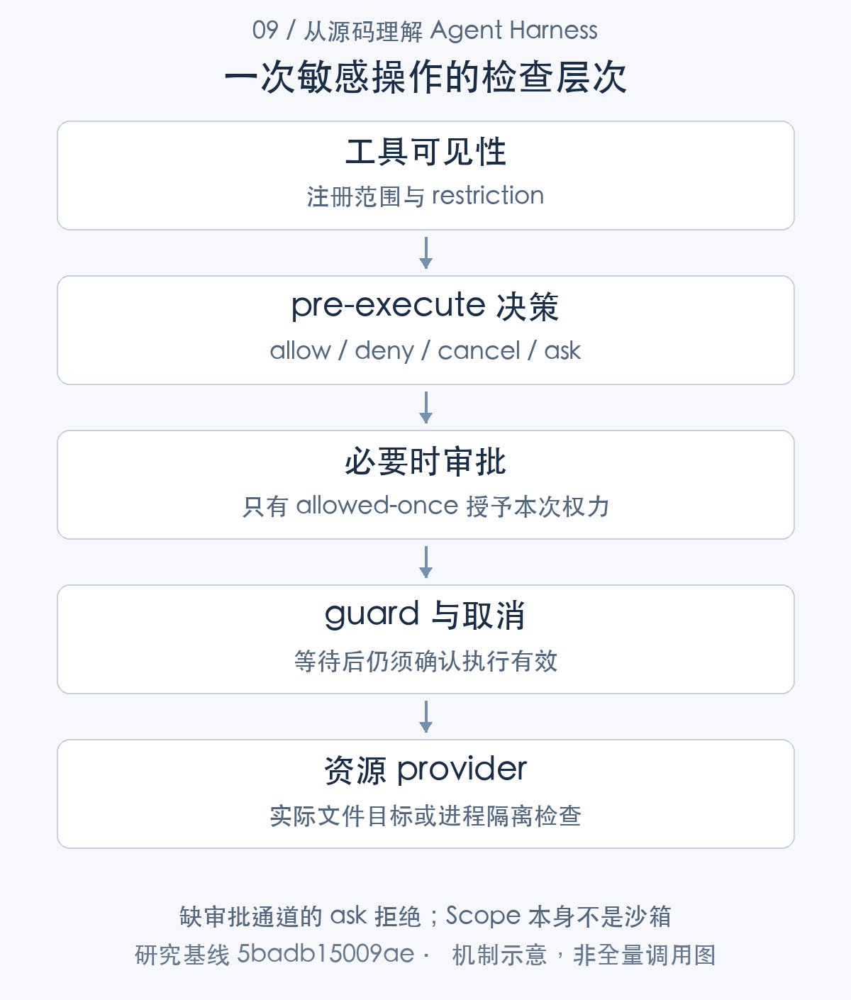

# 模型的行动权限从哪里来：审批、作用域与沙箱

> 从源码理解 Agent Harness · 第 09 篇 · 权限与安全边界

模型拿到了一个文件修改工具，就拥有工作区写权限吗？用户批准过一次 Shell 命令，后续所有命令都能执行吗？插件被挂到某个 Agent scope，是否意味着它已经被安全隔离？这几个问题看似都关于权限，却分别处于工具、授权、资源和插件执行层。

DeepSeek Harness 在这些层次提供不同检查。研究其安全设计，需要沿一次敏感操作追踪，而不是把“有审批”和“有 sandbox”加在一起便宣布安全。**每项措施限制哪一种主体、资源和动作，必须说清楚。**

## 沿一次文件写入看权限链

设想 Agent 要修改工作区外的配置文件。它先需要看见相关工具，调用进入 runtime 后通过 pre-execute 决策，可能需要审批，再经过 guard 和取消检查，最终文件 provider 还必须校验目标。某一层 allow，不代表其余层全部放行。[工具限制与 guard](https://github.com/deepseek-ai/deepseek-harness/blob/5badb15009ae1756c3afe0ae0cef1faafc290ccc/packages/core/tools/src/index.ts#L1063-L1155) [准备和执行顺序](https://github.com/deepseek-ai/deepseek-harness/blob/5badb15009ae1756c3afe0ae0cef1faafc290ccc/packages/core/tools/src/index.ts#L1493-L1699)



这种分层可以把策略选择与具体执行约束分开：应用规则决定是否应当询问用户，审批记录一次明确决定，provider 检查真正的路径或进程访问。审计时也能分别说明，是工具不可见、策略拒绝、用户拒绝，还是底层目标不合法。

模型提示中的“不要访问某目录”仍有价值，但属于行为指导。它不能替代实际资源检查，更不能成为识别用户身份和租户资源归属的证据。

## ask 没有通道时，为什么必须拒绝

ToolRuntime 对 ask 使用 ApprovalService。没有审批服务，或者没有 Agent 来提供 Session 审计和界面路由，都直接 deny。

```typescript
const approval = this.ctx.get('approval')
if (approval === undefined) {
  return {
    decision: { kind: 'deny', reason: ask.reason ?? `tool "${exec.name}" requires approval (not yet supported)` },
    approvalCancelled: false,
  }
}
if (exec.agent === undefined) {
  return {
    decision: { kind: 'deny', reason: `tool "${exec.name}" requires approval, but the call has no agent to route it through` },
    approvalCancelled: false,
  }
}
```

[对应源码](https://github.com/deepseek-ai/deepseek-harness/blob/5badb15009ae1756c3afe0ae0cef1faafc290ccc/packages/core/tools/src/index.ts#L1731-L1743)。以上为原文片段，仅统一缩进，需结合完整实现阅读。

这里不能把“部署未组合审批能力”解释成“用户默认同意”。否则删除一个插件就会扩大行动权限，授权结果与部署预期相反。

存在服务后，allowed-once、rejected、cancelled 和 unavailable 继续映射为不同结果。只有第一种提供本次 grant。policy=never 在服务分派 answerer 之前拒绝 ask，含义不是关闭所有工具执行；无需 ask 的调用仍须遵守自己的规则。[审批结果逐项映射](https://github.com/deepseek-ai/deepseek-harness/blob/5badb15009ae1756c3afe0ae0cef1faafc290ccc/packages/core/tools/src/index.ts#L1727-L1767) [审批请求及记录](https://github.com/deepseek-ai/deepseek-harness/blob/5badb15009ae1756c3afe0ae0cef1faafc290ccc/packages/interaction/user-approval/src/index.ts#L215-L307)

审批还需要处理等待期间的取消与卸载。迟到的回复不能让已经失效的执行继续，记录 decided 也不能脱离实际请求身份。否则审计中看似存在同意，授权却对应了错误生命周期。

## 资源限制应该落到真实操作处

fs-sandbox 在 writeText 中先检查 target，再委派实际写入。

```typescript
override async writeText(
  target: FsTarget,
  content: string,
  expected?: FsWriteIntent,
  signal?: AbortSignal,
  sandboxPolicy?: SandboxExecutionPolicy,
): Promise<FsWriteOutcome> {
  return super.writeText(await this.checkedTarget(target, sandboxPolicy), content, expected, signal)
}
```

[对应源码](https://github.com/deepseek-ai/deepseek-harness/blob/5badb15009ae1756c3afe0ae0cef1faafc290ccc/packages/fs/fs-sandbox/src/index.ts#L80-L88)。以上为原文片段，仅统一缩进，需结合完整实现阅读。

这个位置说明限制作用于即将执行的目标，而不只是工具注册时的一次描述。editText 同样走检查；sandbox-policy 为调用选择模式和工作区条件，sandbox-local 则构造平台 confinement 参数。[沙箱策略服务](https://github.com/deepseek-ai/deepseek-harness/blob/5badb15009ae1756c3afe0ae0cef1faafc290ccc/packages/sandbox/sandbox-policy/src/index.ts#L1-L87) [文件写入与编辑校验](https://github.com/deepseek-ai/deepseek-harness/blob/5badb15009ae1756c3afe0ae0cef1faafc290ccc/packages/fs/fs-sandbox/src/index.ts#L80-L140) [平台执行约束](https://github.com/deepseek-ai/deepseek-harness/blob/5badb15009ae1756c3afe0ae0cef1faafc290ccc/packages/sandbox/sandbox-local/src/index.ts#L152-L184)

文件检查与进程隔离并不是同一个保证。fs 工具路径合法，不证明任意 Shell 命令都被相同规则限制；命令在某种沙箱内运行，也不证明 API 调用者有权读取另一个 Session。

跨平台能力还依赖实际实现。研究读到平台链和 enforcement 描述，不能替代目标 OS 上的越界路径、符号链接、后代进程和退出验证。本次没有完成 Linux／Windows confinement 实测。

## Scope 与 realm 管理能力组合，不隔离不可信代码

Cordis realm 解析服务 symbol，HarnessScope 过滤事件载体和注册可见性。子作用域继承祖先贡献，祖先可以观察子事件；资源归属调用 Context 的 Fiber effect。[HarnessScope 的传播](https://github.com/deepseek-ai/deepseek-harness/blob/5badb15009ae1756c3afe0ae0cef1faafc290ccc/packages/core/scope/src/index.ts#L1-L180) [服务提供与解析](https://github.com/deepseek-ai/deepseek-harness/blob/5badb15009ae1756c3afe0ae0cef1faafc290ccc/vendor/cordis/src/reflect.ts#L277-L327)

这种能力适合“只给 Agent A 挂路由规则”之类组合需求。它不是操作系统地址空间隔离，不能仅因为插件处于子 scope，就假定插件无法访问进程内其他对象或本机资源。

如果产品要加载不可信第三方插件，需要进程或其他执行隔离、明确 IPC 协议和资源授权，而不是复用逻辑 scope 的名称来作安全承诺。这是新增工程要求，不是对 scope 现有用途的否定。

## 模型生成的指令不能变成人类授权

目标工具会检查消息来源与权限：当前直接人类输入、自动目标回合和其他来源拥有不同权力。子 Agent 写出的“用户批准”文本，不会因为内容像一条人类消息就获得 root 用户权限。[目标工具的来源权限](https://github.com/deepseek-ai/deepseek-harness/blob/5badb15009ae1756c3afe0ae0cef1faafc290ccc/packages/goal/tool-goal/src/authority.ts#L48-L117) [目标操作的实际限制](https://github.com/deepseek-ai/deepseek-harness/blob/5badb15009ae1756c3afe0ae0cef1faafc290ccc/packages/goal/tool-goal/src/index.ts#L207-L331)

这项区分对 prompt injection 很重要。来源应来自受控消息元信息与执行身份，不能从自然语言自述反推。MCP server 指令也只是有来源的提示段，注册进 prompt 不等于授权，亦不表示已经有完整恶意内容识别。[MCP 服务指令的进入方式](https://github.com/deepseek-ai/deepseek-harness/blob/5badb15009ae1756c3afe0ae0cef1faafc290ccc/packages/mcp/mcp-client/src/server-context.ts#L28-L40)

源码提供一些来源与执行限制，不应因此宣称已经通用解决了提示注入。输入内容识别、数据泄漏防护、工具风险策略和外部访问还需按产品目标分别设计与验证。

## 控制面安全与执行面安全要分别验收

Host API trust、浏览器启动 token 与本地凭据权限检查属于控制或配置保护。它们回答请求是否可信、凭据是否按本机要求保存；企业多用户场景还需要把主体映射到 Session、文件、模型和凭据资源。[API 请求可信性检查](https://github.com/deepseek-ai/deepseek-harness/blob/5badb15009ae1756c3afe0ae0cef1faafc290ccc/packages/client/connection/src/api-request-trust.ts#L91-L118) [浏览器启动 token](https://github.com/deepseek-ai/deepseek-harness/blob/5badb15009ae1756c3afe0ae0cef1faafc290ccc/packages/client/connection/src/browser-auth.ts#L52-L57) [本地凭据权限](https://github.com/deepseek-ai/deepseek-harness/blob/5badb15009ae1756c3afe0ae0cef1faafc290ccc/packages/credentials/credentials-local/src/index.ts#L114-L146)

例如两个用户共用一台 Host，即使 Shell 已被 confinement，若 controller 允许用户 A 订阅 B 的历史，仍然存在资源授权问题。反过来，用户身份检查正确，也不保证执行 provider 限制了敏感目录。

建立企业权限矩阵时，应逐 API 检查读取、写入、订阅与导出，逐 provider 检查实际资源访问，再检查不同生命周期的授权撤销。不能从一项本地审批测试推导整套多租户安全。

## 优势、不足与技术心得

这套分层的优势是缺审批通道时拒绝 ask，授权有日志，路径与执行限制落到 provider，逻辑 scope 也能精确组合能力。安全判断不必全塞进模型提示或单个工具。

不足是应用必须把各层接成完整策略，默认组合、provider 选择、来源身份与控制授权任何一项理解错误，都可能使产品承诺扩大。逻辑 scope 不隔离不可信插件，本地认证不自动等于企业身份，平台源码不代表全平台验证。

我从研究中得到的技术心得是：安全能力应当用“谁对什么动作拥有哪种权力”描述，而不是用一串组件名称描述。审批限制的是本次敏感调用，sandbox 限制的是执行资源，Session 授权限制的是控制访问；这些义务需要协作，也应分别测试。

此前审批用例验证选定 fail-closed 行为，目标权限用例验证来源限制；真实企业租户系统与跨平台沙箱未实测。下一篇会继续讨论：即使权限正确，怎样控制一个 Agent 何时主动继续、何时让用户接管。

---

研究基线：DeepSeek Harness `0.2.1-alpha.1`，提交 `5badb15009ae1756c3afe0ae0cef1faafc290ccc`。源码事实以该版本为准；文中的工程判断和改造建议另行说明。教学场景不代表真实模型业务实测。

源码与运行记录可从[证据索引](../appendices/evidence-index.md)和[验证附录](../appendices/validation.md)复核。本文引用此前同一提交的验证结果，本轮写作不将其重新计为新测试。

[专栏目录](README.md) · [上一篇](08-concurrency.md) · [下一篇](10-autonomy.md)
