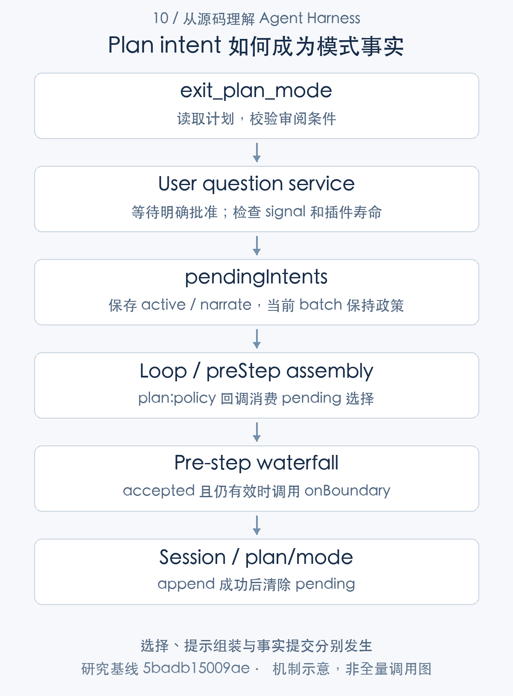
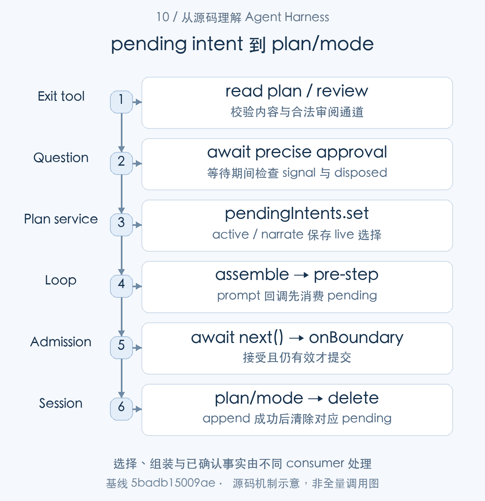
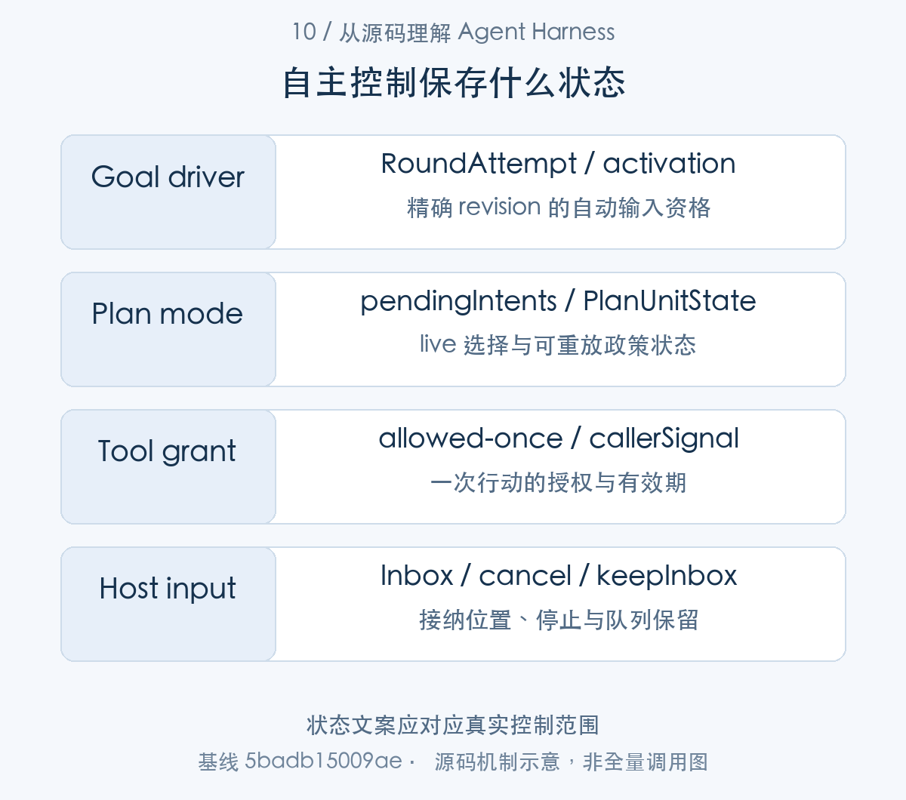
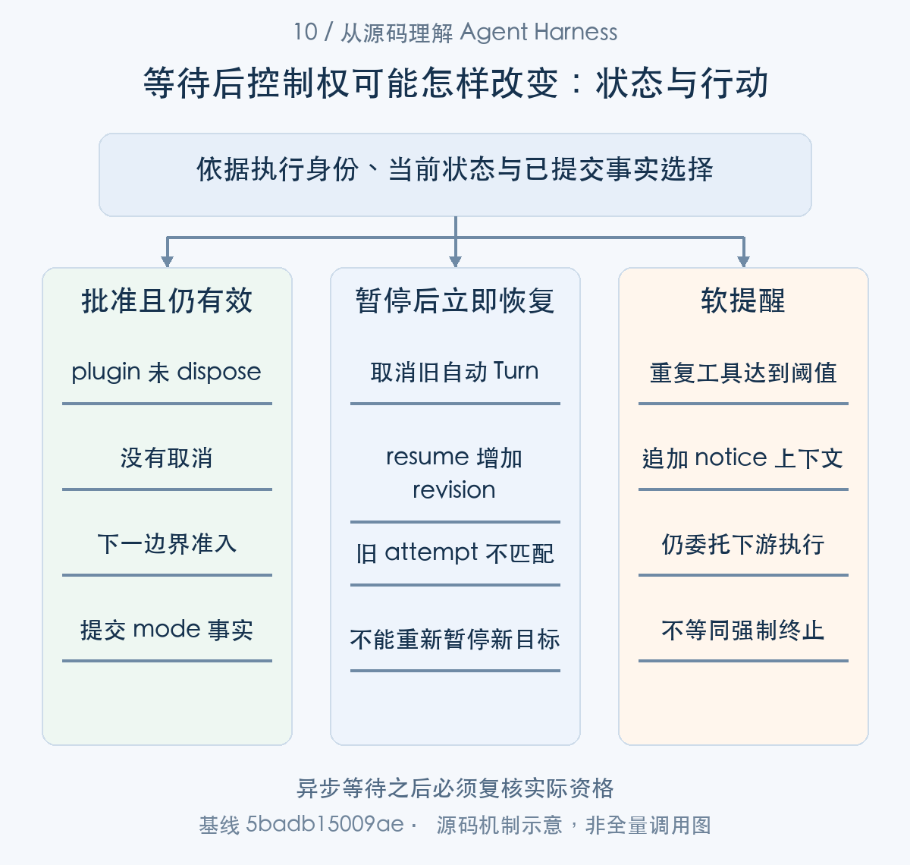

# 如何控制自动推进：规划模式、目标续跑与人工接管

> 从源码理解 Agent Harness · 第 10 篇 · 自主性控制与人工干预

用户批准计划之后，Agent 应该立刻执行所有动作吗？自动目标运行中，用户点击暂停，已经排队的下一轮能否继续？模型连续重复同一个工具，发一条提醒是否就保证它停止？这些问题都涉及自主性，却不能靠一个 auto 开关回答。

DeepSeek Harness 将自动续跑、规划状态、敏感操作审批、输入接纳与取消分别实现。本文关注它们怎样决定推进权限，尤其是**已经准备的动作如何在授权变化后失效**。


自主性控制在本文分为意图、准入和停止三阶段。plan-mode 接收审阅并保留 pending intent，在 PromptAssembly 中解释选择、在 accepted pre-step 后提交 plan/mode；goal driver 保留自动输入的 revision 与 phase，Host 干预使旧资格失效；Inbox 和 cancel 提供具体接管位置。repeat-tool-reminder 则只影响后续模型 context。下面按这些交接边界说明用户控制如何到达执行。

## 自主性要沿执行阶段控制

目标 driver 决定 idle 后是否主动发下一轮；规划模式决定接下来遵循的工作政策；审批决定某个敏感工具能否执行；steer、followup 和 cancel 则为外部干预提供不同接纳位置。[自动目标续跑](https://github.com/deepseek-ai/deepseek-harness/blob/5badb15009ae1756c3afe0ae0cef1faafc290ccc/packages/goal/goal-round-driver/src/index.ts#L137-L205) [退出规划的用户审阅](https://github.com/deepseek-ai/deepseek-harness/blob/5badb15009ae1756c3afe0ae0cef1faafc290ccc/packages/plan/plan-mode/src/index.ts#L277-L348) [工具审批](https://github.com/deepseek-ai/deepseek-harness/blob/5badb15009ae1756c3afe0ae0cef1faafc290ccc/packages/interaction/user-approval/src/index.ts#L215-L307) [输入与取消](https://github.com/deepseek-ai/deepseek-harness/blob/5badb15009ae1756c3afe0ae0cef1faafc290ccc/packages/core/agent-loop/src/agent.ts#L154-L241)

例如代码修复先处于规划模式，用户审阅计划；批准后进入实施，修改受保护资源还可能再次 ask；目标尚未完成时可以自动续跑，用户也可以暂停。这些控制各有状态与时机，不是一次批准取得全程无限行动权。

设计产品时，应该给用户说明“当前允许继续什么”，而不是只显示自动或手动。自动推进的权限、计划批准和资源写入授权分开，才容易解释拒绝和接管。




图1：选择、提示组装与事实提交分别发生。先按这张主线图建立对象地图，再结合下面的 caller、数据和返回路径展开。

### 第一步：先区分持续目标、模式与一次行动

先看 driver 生命周期与 Inbox 接纳：持久目标、进程内自动资格和待处理输入各有状态。后面的计划审阅、Host pause 与 steer 分别消费这些对象。


```typescript
ctx.on('agent/error', ({ agent }) => {
  const state = stateFor(agent)
  disarm(state)
})

ctx.on('agent/disposed', ({ agent }) => { states.delete(agent) })
ctx.on('agent/created', ({ agent }) => {
  const state = stateFor(agent)
  state.attempt = undefined
  state.competingQueued = false
  state.needsCheckpoint = false
})
```

[源码：`packages/goal/goal-round-driver/src/index.ts:246–257`](https://github.com/deepseek-ai/deepseek-harness/blob/5badb15009ae1756c3afe0ae0cef1faafc290ccc/packages/goal/goal-round-driver/src/index.ts#L246-L257)。

Agent 错误时 disarm，disposed 删除状态，created 重置本地 attempt。持久 goal.active 不因此自动授予新 driver 续跑权；状态存在和自动权限有效是两件事。

```typescript
send(message: UserMessage, target: InboxTarget, wakeup: boolean): void {
  // Waking input cannot join an aborted activity, so it starts the next turn.
  // Captured before the insertion so a reentrant cancel from a splice observer cannot reclassify it.
  const wakingAfterAbort = wakeup && this.phase.kind !== 'idle' && this.phase.abort.signal.aborted
  const resolvedTarget = wakingAfterAbort ? 'next-turn' : target
  this.inbox.splice(resolvedTarget, Infinity, 0, [message])
  if (wakeup) this.wakeDriver(wakingAfterAbort)
}

followup(input: UserMessage): void {
  this.send(input, 'next-turn', true)
}

steer(input: UserMessage): void {
  this.send(input, 'next-step', true)
}

inject(input: UserMessage): void {
  this.send(input, 'next-step', false)
}
```

[源码：`packages/core/agent-loop/src/agent.ts:154–173`](https://github.com/deepseek-ai/deepseek-harness/blob/5badb15009ae1756c3afe0ae0cef1faafc290ccc/packages/core/agent-loop/src/agent.ts#L154-L173)。

followup、steer、inject 接纳到不同 inbox 位置；取消窗口里新消息可设置 wakingAfterAbort。自主性的控制分布在驱动、准入、请求、工具、停止等接缝，单个“自主开关”难以准确表达它们的影响范围。


## 计划批准为什么不立即写最终状态

控制对象已区分，先进入计划审阅路径。exit_plan_mode 在当前工具 batch 中得到选择，把它交给 pendingIntents，而不立即改变整个 batch 的政策。

exit_plan_mode 先读取并检查计划文件，准备用户审阅请求，等待 answerer。它要求符合约束的批准结果，不接受随意一条自由回复作为肯定。下面片段体现了精确选择条件。

```typescript
const reviewItems = answer.answers.filter(entry => entry.id === REVIEW_ID)
const item = reviewItems.length === 1 ? reviewItems[0] : undefined
if (item?.selected.length !== 1 || item.selected[0] !== APPROVE_LABEL || item.custom !== undefined) {
  const feedback = item?.custom ?? ''
  throw new Error(feedback === ''
    ? 'The user chose to keep planning; revise the plan and present it again.'
    : `The user chose to keep planning; their feedback: ${feedback}`)
}
// Keep plan guidance for the rest of this assistant tool batch. The
// silent selection is appended at the next accepted in-turn pre-step,
// before its request assembly.
this.pendingIntents.set(agent.session, { active: false, narrate: false })
return { approved: true }
```

[对应源码](https://github.com/deepseek-ai/deepseek-harness/blob/5badb15009ae1756c3afe0ae0cef1faafc290ccc/packages/plan/plan-mode/src/index.ts#L340-L352)。以上为原文片段，仅统一缩进，需结合完整实现阅读。

只有一项对应审阅答案，恰好选择批准，且没有 custom 回复，才保存 `active: false` 的 pending intent。拒绝或反馈会保持规划，并将原因交回模型，等待期间发生卸载或取消也不能冒充批准。[计划读取与等待期间检查](https://github.com/deepseek-ai/deepseek-harness/blob/5badb15009ae1756c3afe0ae0cef1faafc290ccc/packages/plan/plan-mode/src/index.ts#L277-L348)

pending intent 意味着“选择已经形成，尚待合适执行边界提交”。它让当前工具 batch 保留原规划政策，避免批准工具后，同一批后续操作无声地跨入新模式。



图2：选择、组装与已确认事实由不同 consumer 处理。从 caller 的交接对象追到 consumer，具体分支结合正文源码阅读。

### 第二步：审阅发生在工具批次里，切换留给安全边界

exit_plan_mode.execute() 读取计划并 await 问题服务。严格批准结果只写 pendingIntents；下一步会看到 prompt 与 pre-step 如何消费这一意图。

审阅后的进程内意图保存为 WeakMap：

```typescript
private readonly pendingIntents = new WeakMap<Session, { active: boolean; narrate: boolean }>()
```

[源码：`packages/plan/plan-mode/src/index.ts:186–186`](https://github.com/deepseek-ai/deepseek-harness/blob/5badb15009ae1756c3afe0ae0cef1faafc290ccc/packages/plan/plan-mode/src/index.ts#L186-L186)。

|核心字段|保存的信息|使用位置|
|---|---|---|
|`Session` key|意图所属会话对象|prompt 与 boundary 共同查找|
|`active` / `narrate`|目标模式与是否添加叙述消息|组装政策和 accepted 提交|

这份状态不是日志 projection；accepted boundary 才生成 plan/mode。Session key 让选择归属于明确实例，而非共享的全局模式开关。


```typescript
execute: async (args, exec) => {
  const agent = exec.agent
  if (agent === undefined) throw new Error(`${EXIT_PLAN_MODE} requires a calling agent (no session to switch)`)
  if (!this.loggedActive(agent.session)) {
    throw new Error(`${EXIT_PLAN_MODE} is only available in plan mode`)
  }
  if (!/^#\s+\S/.test(args.plan.trim())) {
    throw new Error(`${EXIT_PLAN_MODE} requires a non-empty markdown plan starting with a # heading`)
  }
  const interaction = ctx.get('userQuestions')
  if (interaction === undefined) {
    throw new Error('no user-questions channel is available to review the plan; ask the user to switch the session mode instead')
  }
```

[源码：`packages/plan/plan-mode/src/index.ts:293–305`](https://github.com/deepseek-ai/deepseek-harness/blob/5badb15009ae1756c3afe0ae0cef1faafc290ccc/packages/plan/plan-mode/src/index.ts#L293-L305)。

exit_plan_mode 先要求 Agent、已记录规划模式、合法标题及审阅通道。没有通道不代表默认批准；等待可以很长，初始判断不能用于等待之后的所有动作。

```typescript
const answer = await interaction.ask({
  questions: [{
    id: REVIEW_ID,
    header: 'Plan review',
    question: 'Approve this plan and leave plan mode?',
    detail: args.plan,
    options: [
      { label: APPROVE_LABEL, description: 'Leave plan mode; the plan is carried out from the next step.' },
      { label: KEEP_PLANNING_LABEL, description: 'Stay in plan mode; feedback goes back to the model.' },
    ],
    // Presentation only: a capable UI renders the plan as a review
    // decision instead of a generic question, and answers with one of
    // the labels above either way.
    intent: { kind: 'plan-review', approve: APPROVE_LABEL, callId: exec.callId },
  }],
  agent,
  signal: exec.signal,
}).catch((cause: unknown) => {
```

[源码：`packages/plan/plan-mode/src/index.ts:306–323`](https://github.com/deepseek-ai/deepseek-harness/blob/5badb15009ae1756c3afe0ae0cef1faafc290ccc/packages/plan/plan-mode/src/index.ts#L306-L323)。

intent 带 callId，UI 可以呈现为计划审阅，但回答仍遵循问题协议。execute 传 signal，审批关联的是当前计划内容，不是对任意后续操作的无限许可。

```typescript
}).catch((cause: unknown) => {
  // A dismissed review is not a failed one: the user took the turn back
  // to say something the two options do not cover. Say so, because the
  // generic channel message names ask_user_question, which the model
  // never called. An abort (turn cancel, provider teardown) keeps its
  // own message — there is no user to wait for.
  if (cause instanceof UserQuestionError && cause.code === 'ASK_CANCELLED') {
    throw new Error('The user dismissed the plan review to speak instead; '
      + 'stay in plan mode, stop here, and wait for their message.')
  }
  throw cause
})
// A review may outlive this plugin fiber. Without its pre-step listener,
// an approved selection could never be appended, so fail and keep planning.
if (disposed) {
  throw new Error('the plan-mode service was reloaded while the plan was under review; present the plan again')
}
```

[源码：`packages/plan/plan-mode/src/index.ts:323–339`](https://github.com/deepseek-ai/deepseek-harness/blob/5badb15009ae1756c3afe0ae0cef1faafc290ccc/packages/plan/plan-mode/src/index.ts#L323-L339)。

用户关闭审阅、请求取消、插件 reload 分别处理。disposed 即使配合迟到批准也不能继续，因为负责下一边界提交的 listener 已不存在。原文严格批准检查之后只保存 pending intent，保留当前 assistant 工具批次的规划约束。

## 准入成功之后，再提交模式事实

审阅产生的 pending intent 由两个 consumer 使用：prompt 回调用于准备输入，pre-step listener 用于提交已接受事实。下面结合 Loop caller 解释二者的真实先后。

plan-mode 监听 pre-step，先 await next，让下游准入决策完成，然后检查拒绝、signal 和 pending，再调用 onBoundary。

```typescript
ctx.on('agent/pre-step', async (
  { agent, signal },
  next,
): Promise<PreStepDecision> => {
  const decision = await next()
  const pending = this.pendingIntents.get(agent.session)
  if (decision.kind === 'reject' || signal.aborted || pending === undefined) return decision
  const narration = this.narration(agent.session, pending.active)
  try {
    this.onBoundary(agent.session)
  } catch (error) {
    ctx.logger.warn('dsh-plan-mode: failed to append selected plan mode at step start: %o', error)
    return decision
  }
  return !pending.narrate || narration === undefined
    ? decision
    : { ...decision, messages: [...decision.messages, narration] }
})
```

[对应源码](https://github.com/deepseek-ai/deepseek-harness/blob/5badb15009ae1756c3afe0ae0cef1faafc290ccc/packages/plan/plan-mode/src/index.ts#L196-L213)。以上为原文片段，仅统一缩进，需结合完整实现阅读。

若下游 reject 或取消，不提交模式改变；提交失败记录告警，pending 不应被当作已落地事实。叙述消息也只在实际需要时添加。这种顺序让政策选择和事件记录保持对应，而不是在用户点击后立即宣布所有执行边界都已切换。[模式事件的边界提交](https://github.com/deepseek-ai/deepseek-harness/blob/5badb15009ae1756c3afe0ae0cef1faafc290ccc/packages/plan/plan-mode/src/index.ts#L418-L453)

还有一项需要结合调用方才能看清的细节：Loop preStep 在进入 waterfall 前先组装提示词。规划段的 text 回调可以读取 pending intent，因此本次 assembly 已按待应用选择构造；后续 accepted waterfall 才提交 plan/mode。源码局部注释里的“request assembly 前”不能取代这条完整调用链的时序。[Loop 组装与 waterfall 顺序](https://github.com/deepseek-ai/deepseek-harness/blob/5badb15009ae1756c3afe0ae0cef1faafc290ccc/packages/core/agent-loop/src/agent.ts#L267-L285) [规划段的 pending 读取](https://github.com/deepseek-ai/deepseek-harness/blob/5badb15009ae1756c3afe0ae0cef1faafc290ccc/packages/plan/plan-mode/src/index.ts#L196-L224)

这里并非矛盾，而是区分临时选择和已确认事实。提示词可以根据待应用意图准备，日志则必须等待接纳条件成立。

### 第三步：提示组装先读取意图，准入后写事实

审阅结束后，下一次 preStep() 先 assemble，再进入 waterfall。plan:policy 回调读取 pending，accepted listener 才调用 onBoundary() 追加 plan/mode，形成意图到事实的交接。

可重放的模式 fold 使用 PlanUnitState：

```typescript
export interface PlanUnitState {
  /** Logged plan mode. */
  active: boolean
  /** The selection's target mode; null when no selection is outstanding. */
  wanted: boolean | null
  /** The latest plan command awaiting its paired settlement. */
  running: { commandId: CommandId; wanted: boolean } | null
  /** Active state recorded by the latest `request/header`, or null. */
  activeAtLastHeader: boolean | null
}
```

[源码：`packages/plan/plan-mode/src/types.ts:27–36`](https://github.com/deepseek-ai/deepseek-harness/blob/5badb15009ae1756c3afe0ae0cef1faafc290ccc/packages/plan/plan-mode/src/types.ts#L27-L36)。

|核心字段|保存的信息|使用位置|
|---|---|---|
|`active` / `wanted`|已记录模式与待实现选择|plan/mode 和 command fold|
|`running`|尚待 command/done 的精确命令|配对结算|
|`activeAtLastHeader`|最后 request/header 的模式|模式叙述判断|

它与 pendingIntents 的用途不同：前者从事件解释可见状态，后者把 live 选择交给下一准入边界。projection 的 pending 也由自己的日志事实推导。


```typescript
private async preStep(target: InboxTarget, position: { turn: number; step: number }): Promise<PreparedStep> {
  /* v8 ignore next -- private callers establish the running phase before proposing a step */
  if (this.phase.kind !== 'running') throw new Error(`agent "${this.id}": pre-step outside running phase`)
  const signal = this.phase.abort.signal
  const claimed = this.inbox.claim(target, position.turn)
  const assembly = await this.loopCtx.systemPrompt.assemble(assembleContextFor(this, signal))
  signal.throwIfAborted()
  const sections = renderContextSections(assembly)
  const context = this.runtimeContext.project(joinContextSections(sections), sections)
  const decision = await this.dispatch.waterfall(
    'agent/pre-step', { messages: claimed, ...position, signal },
    (): Promise<PreStepDecision> => Promise.resolve<PreStepDecision>({
      kind: 'enter',
      messages: context === undefined ? claimed : [...claimed, context],
    }),
  )
  signal.throwIfAborted()
  if (decision.kind === 'reject') return decision
  return { ...decision, assembly }
```

[源码：`packages/core/agent-loop/src/agent.ts:267–285`](https://github.com/deepseek-ai/deepseek-harness/blob/5badb15009ae1756c3afe0ae0cef1faafc290ccc/packages/core/agent-loop/src/agent.ts#L267-L285)。

Loop 先 claim、assemble，再进入 pre-step waterfall。不能只根据 plan-mode 局部注释就反转这一顺序；阅读 consumer 才能确定真实时序。pending.active 能影响 assembly，最终接受后才有 plan/mode 事实。

```typescript
ctx.effect(() => () => { disposed = true }, 'dsh-plan-mode: close service lifetime')

ctx.systemPrompt.section({
  name: 'plan:policy',
  order: ctx.systemPrompt.getSectionOrder('PLAN_POLICY'),
  text: (context) => {
    if (context.agent === undefined) return ''
    const pending = this.pendingIntents.get(context.agent.session)
    return (pending?.active ?? this.loggedActive(context.agent.session)) ? this.section : ''
  },
})
```

[源码：`packages/plan/plan-mode/src/index.ts:214–224`](https://github.com/deepseek-ai/deepseek-harness/blob/5badb15009ae1756c3afe0ae0cef1faafc290ccc/packages/plan/plan-mode/src/index.ts#L214-L224)。

规划段回调读取 selection，把尚待提交选择映射为本次提示。它提供执行政策输入，不能当作会话已经发生模式切换的证明。

```typescript
set(agent: Agent, active: boolean): 'committed' | 'queued' | 'cancelled' | 'noop' {
  const session = agent.session
  const pending = this.pendingIntents.get(session)
  const target = pending?.active ?? this.loggedActive(session)
  if (active === target) return 'noop'
  if (this.hasOpenTurn(session)) {
    this.pendingIntents.set(session, { active, narrate: true })
    return this.loggedActive(session) === active ? 'cancelled' : 'queued'
  }
  // No open turn: commit now. Delete only after append succeeds so a
  // failed durable write leaves the selection retryable, not dropped.
  if (active === this.loggedActive(session)) {
    this.pendingIntents.delete(session)
    return 'cancelled'
  }
  session.append('plan/mode', { active })
  this.pendingIntents.delete(session)
  const narration = this.narration(session, active)
  if (narration !== undefined) agent.inject(narration)
  return 'committed'
```

[源码：`packages/plan/plan-mode/src/index.ts:418–437`](https://github.com/deepseek-ai/deepseek-harness/blob/5badb15009ae1756c3afe0ae0cef1faafc290ccc/packages/plan/plan-mode/src/index.ts#L418-L437)。

开放 Turn 时 set 排队意图；没有开放 Turn 才可立即 append。pending 只在 append 成功后删除，避免失败丢失可重试选择。committed、queued、cancelled、noop 是不同结果，产品 UI 应如实显示。

```typescript
private onBoundary(session: Session): void {
  const pending = this.pendingIntents.get(session)
  if (pending === undefined) return
  const target = pending.active
  if (target === this.loggedActive(session)) {
    this.pendingIntents.delete(session)
    return
  }
  session.append('plan/mode', { active: target })
  // Delete only after append succeeds so a later accepted in-turn pre-step
  // can retry a failed durable write.
  this.pendingIntents.delete(session)
}
```

[源码：`packages/plan/plan-mode/src/index.ts:441–453`](https://github.com/deepseek-ai/deepseek-harness/blob/5badb15009ae1756c3afe0ae0cef1faafc290ccc/packages/plan/plan-mode/src/index.ts#L441-L453)。

边界提交同样先 append 再 delete。这里的成功指 Session 接纳，并不直接保证 JSONL 已刷盘；若业务要求持久承诺，还要等待 persistence checkpoint。


## Host 暂停怎样阻止旧续跑

计划路径已闭合，接下来切到自动目标的接管。goal driver 同样要处理等待中的选择失效，但使用的是目标 revision 与输入 reservation。

目标 driver 为下一轮保留 goalId、revision、round 和 messageId，追踪 queued、claimed、admitted。目标改变或普通用户输入到达时，旧 reservation 可能变 stale。准入 waterfall 前后重查，checkpoint await 后也重查 live Agent 与状态。[驱动器的有效性检查](https://github.com/deepseek-ai/deepseek-harness/blob/5badb15009ae1756c3afe0ae0cef1faafc290ccc/packages/goal/goal-round-driver/src/index.ts#L96-L134) [准入双重校验](https://github.com/deepseek-ai/deepseek-harness/blob/5badb15009ae1756c3afe0ae0cef1faafc290ccc/packages/goal/goal-round-driver/src/index.ts#L350-L459)

Host 外部发起 pause 时，driver 根据 currentInitiator 与当前执行状态决定取消正在运行的 Turn，并保留需要保留的其他 inbox。模型在自己 Turn 中改变状态与外部 Host 接管位于不同边界，不能省略来源判断后写成同一种行为。[目标暂停、竞争输入与错误观察](https://github.com/deepseek-ai/deepseek-harness/blob/5badb15009ae1756c3afe0ae0cef1faafc290ccc/packages/goal/goal-round-driver/src/index.ts#L246-L344)

假设第 2 轮在 checkpoint 等待中，用户暂停后又立即恢复。revision 的变化使旧 attempt 不能误暂停新目标，也不能重新取得新目标的准入权。系统必须验证同一个生命周期、同一份授权，而不只是“现在存在一个同名目标”。

自动 activation 与持久 phase 也分开。错误、max-tokens、卸载和恢复可能撤销进程内自动权限，目标仍然可以展示为未完成。这样的保守设计避免把失败恢复直接转成新一轮外部动作。[目标激活与持久状态](https://github.com/deepseek-ai/deepseek-harness/blob/5badb15009ae1756c3afe0ae0cef1faafc290ccc/packages/goal/goal/src/index.ts#L240-L280)



图3：状态文案应对应真实控制范围。表中对象并列展示用途与寿命，层次之间以源码所示身份关联。

### 第四步：暂停需要撤销执行资格，也要防止误伤新 revision

现在切到 goal driver 的 Host pause listener：它使同一 RoundAttempt 取消或 stale，并在 idle 与 pre-step 边界按原 goalId/revision 复核。新 revision 继续保有自己的资格。

自动输入在撤销过程中沿同一 RoundAttempt 流转：

```typescript
interface RoundAttempt extends RoundIdentity {
  readonly messageId: MessageId
  readonly content: ContentBlock[]
  phase: 'queued' | 'claimed' | 'admitted'
  cancelled: boolean
  stale: boolean
}
```

[源码：`packages/goal/goal-round-driver/src/index.ts:29–35`](https://github.com/deepseek-ai/deepseek-harness/blob/5badb15009ae1756c3afe0ae0cef1faafc290ccc/packages/goal/goal-round-driver/src/index.ts#L29-L35)。

|核心字段|保存的信息|使用位置|
|---|---|---|
|`messageId` / `content`|准确匹配的输入|claim 与移除|
|`phase`|queued / claimed / admitted|控制生效的阶段|
|`cancelled` / `stale`|停止或失去当前资格|await 后再次准入检查|

继承的 goalId、revision 与 round 指向具体要求。Host pause 后立即 resume 时，新 revision 不会被旧 attempt 的收敛逻辑覆盖。


```typescript
ctx.on('goal/changed', ({ agent, change }) => {
  const state = stateFor(agent)
  state.needsCheckpoint = true
  // A host-initiated pause stops goal execution: abort the live turn so the
  // model cannot keep acting or resume in the same turn. A model-initiated
  // pause (update_goal inside its own turn) finishes normally.
  if (change.operation === 'pause' && agent.status === 'running'
    && ctx.agents.currentInitiator() !== agent) {
    agent.cancel({ kind: 'user' }, { keepInbox: true })
  }
  requestDrive(state)
})

ctx.on('agent/inbox/inserted', ({ agent, message }) => {
  if (!agent.inbox.nextTurn.some(candidate => candidate.id === message.id)) return
  const state = stateFor(agent)
  const attempt = state.attempt
  if (attempt !== undefined && sameQueued(message.content, message.source, attempt)) return
  state.competingQueued = true
  if (attempt?.phase === 'queued') attempt.stale = true
})
```

[源码：`packages/goal/goal-round-driver/src/index.ts:286–306`](https://github.com/deepseek-ai/deepseek-harness/blob/5badb15009ae1756c3afe0ae0cef1faafc290ccc/packages/goal/goal-round-driver/src/index.ts#L286-L306)。

Host pause 且当前 running 时取消 live Turn、保留 inbox；当前 Agent 自己发 pause 则正常收尾。普通下一 Turn 输入让竞争标记成立，已排队自动 attempt 变 stale，用户接管不能被旧自动续跑抢占。

```typescript
// Fence the pause to the exact dropped attempt's ref. A resume bumps
// the revision, so a host pause followed by an immediate resume (before
// the aborted turn converges to idle) must not re-pause the resumed goal.
const pause = attempt !== undefined
  && (attempt.phase === 'queued' || attempt.phase === 'claimed' || attempt.cancelled)
  && goal !== undefined && goal.phase === 'active' && goal.activation === 'armed'
  && attempt.goalId === goal.id && attempt.revision === goal.revision
// A reservation still queued when the agent reaches idle cannot run:
// withdraw it so human input queued behind it is not stranded.
if (pause || attempt?.phase === 'queued') {
  state.attempt = undefined
  try {
    if (attempt.phase === 'queued') agent.inbox.remove(attempt.messageId)
    if (pause) ctx.goals.pause(agent, goalRef(goal))
  } catch (error: unknown) {
    ctx.logger.warn(`goal-round-driver: could not settle cancelled goal round for agent "${agent.id}": ${renderThrown(error)}`)
    disarm(state)
  }
}
requestDrive(state)
```

[源码：`packages/goal/goal-round-driver/src/index.ts:264–283`](https://github.com/deepseek-ai/deepseek-harness/blob/5badb15009ae1756c3afe0ae0cef1faafc290ccc/packages/goal/goal-round-driver/src/index.ts#L264-L283)。

idle 收敛时只暂停匹配 goalId/revision 的旧 attempt。Host 紧接着 resume 会增加 revision，旧取消不能重新暂停恢复后的新目标。这是一个需要精确引用的竞争场景，而非仅检查 phase 是否 active。

```typescript
  state: DriverState,
  content: readonly ContentBlock[],
  source: GoalMessageSource,
): boolean {
  const attempt = state.attempt
  const goal = currentGoal(state)
  return ctx.fiber.state === FiberState.ACTIVE
    && !state.stopping && attempt !== undefined && attempt.phase === 'claimed'
  && !attempt.stale && sameQueued(content, source, attempt)
  && goal !== undefined && goal.id === source.goalId && goal.revision === source.revision
  && goal.phase === 'active' && goal.activation === 'armed'
  && source.round === goal.roundsStarted + 1
}
```

[源码：`packages/goal/goal-round-driver/src/index.ts:350–362`](https://github.com/deepseek-ai/deepseek-harness/blob/5badb15009ae1756c3afe0ae0cef1faafc290ccc/packages/goal/goal-round-driver/src/index.ts#L350-L362)。

validReservation 同时检查 Fiber ACTIVE、stopping、claimed、stale、来源内容、goal revision、activation 和下一 round。每项都对应一条旧权限可能失效的路径。

```typescript
try {
  valid = validReservation(state, content, source)
} catch (error: unknown) {
  ctx.logger.warn(`goal-round-driver: post-decision check failed for agent "${agent.id}": ${renderThrown(error)}`)
  disarm(state)
  valid = false
}
if (!valid) {
  state.attempt = undefined
  restoreOtherClaimed(agent, decision.messages, submitted.id)
  requestDrive(state)
  return { kind: 'reject' }
}
return { ...decision, startsRequestSeries: true }
```

[源码：`packages/goal/goal-round-driver/src/index.ts:415–428`](https://github.com/deepseek-ai/deepseek-harness/blob/5badb15009ae1756c3afe0ae0cef1faafc290ccc/packages/goal/goal-round-driver/src/index.ts#L415-L428)。

await next() 后再次重查，不合法则恢复其他已 claim 消息并 reject。异步治理期间状态可变，双重检查才保证最后提交的是当前资格。

## 人工输入在哪里接管，决定了影响范围

steer 在后续 Step 边界被接纳，followup 排下一 Turn，inject 不单独唤醒 idle Agent，cancel 则请求停止当前在途工作。取消默认清空队列，keepInbox 可保留；但保留消息并不使失效目标 revision 自动重新合法。

例如用户只想补充“修改前先展示 diff”，steer 比取消再重建任务更贴近意图；若要立刻停止敏感操作，应使用取消与 provider 的停止能力。已经完成的副作用无法凭输入接纳撤回，接管效果仍受执行阶段限制。

产品按钮需要映射到这些真实语义。界面写“暂停”，实现却只是 followup 一条自然语言消息，当前工具可能继续运行；这会使用户预期与运行事实错位。按钮含义应由控制 API 与资源停止过程决定。

### 第五步：取消、下一 Step 与下一 Turn 分别验收

资格失效以后，Agent.cancel() 决定正在运行的工作和 Inbox 的处理；driver 卸载再等待 whenIdle 与 run。steer/followup 是接纳位置，不能代替已启动操作的停止。


```typescript
cancel(cause: AgentCancelCause, options: CancelOptions = {}): void {
  if (!options.keepInbox) {
    this.inbox.clear()
    if (this.phase.kind !== 'idle') this.phase.wakeRequested = false
  }
  if (this.phase.kind !== 'idle') this.phase.abort.abort(cause)
}
```

[源码：`packages/core/agent-loop/src/agent.ts:175–181`](https://github.com/deepseek-ai/deepseek-harness/blob/5badb15009ae1756c3afe0ae0cef1faafc290ccc/packages/core/agent-loop/src/agent.ts#L175-L181)。

cancel 默认清 inbox；Host pause 则显式 keepInbox。取消当前执行与丢弃待处理人类输入并不必然一起发生，需要调用者选政策。

```typescript
yield async () => {
  const waits: Promise<void>[] = []
  for (const state of states.values()) {
    state.stopping = true
    disarm(state)
    const attempt = state.attempt
    if (attempt !== undefined) {
      attempt.stale = true
      /* v8 ignore next -- followup reserves the live agent before publishing a queued attempt */
      if (state.agent.status === 'running') {
        state.agent.cancel({ kind: 'parent' })
        waits.push(state.agent.whenIdle())
      }
    }
    if (state.run !== undefined) waits.push(state.run)
  }
  await Promise.allSettled(waits)
  states.clear()
```

[源码：`packages/goal/goal-round-driver/src/index.ts:440–457`](https://github.com/deepseek-ai/deepseek-harness/blob/5badb15009ae1756c3afe0ae0cef1faafc290ccc/packages/goal/goal-round-driver/src/index.ts#L440-L457)。

driver 卸载先 stopping/disarm，把 attempt 标记 stale，必要时 cancel 并 whenIdle，再等待已有 run，最后 clear。撤掉 listener 并不意味着旧异步回调立即消失，寿命关闭必须与排空结合。

产品可以展示“已请求停止”“正在结算”“已停止”；如果只显示已停止而 body 还在运行，用户会错误地开始另一项互斥操作。自主控制必须把这些中间状态纳入协议。


## 提醒属于软干预，不能替代终止策略

repeat-tool-reminder 观察重复调用，向后续上下文补充提醒，不阻止 body 派发。它可能帮助模型调整，但不提供强制停止不变量。[重复工具提醒的实际行为](https://github.com/deepseek-ai/deepseek-harness/blob/5badb15009ae1756c3afe0ae0cef1faafc290ccc/packages/guard/repeat-tool-reminder/src/index.ts#L188-L239)

硬约束需要明确额度、deny、取消、deadline 或应用验收策略。计划提示同样只是工作政策的一部分：运行时的工具授权和 sandbox 才限制真实资源访问，不能把“规划模式”直接称为不可突破的只读沙箱。

这并不贬低软引导。成本低、可解释、允许模型恢复思路的提醒适合低风险探索；敏感操作则应由可执行规则兜底。两种方式可以组合，但要清楚它们提供不同强度的保证。



图4：异步等待之后必须复核实际资格。各分支基于自己的证据返回决定，不按完成文案推断下一动作。

### 第六步：重复检测改变上下文，不改变执行资格

最后切到软干预的 post-execute listener。repeat-tool-reminder 根据执行后的 key 更新计数，再将 notice 放入 additionalContexts；返回链仍委派，不改变 body 的准入。


```typescript
function observe(exec: ToolExecution): UserMessage | undefined {
  // A direct `ctx.tools.execute()` caller has no model to remind and no id
  // to key on; only agent-loop calls participate.
  if (!exec.agent) return undefined
  if (!tracked(exec.name)) return undefined
  const canonical = canonicalize(exec.arguments)
  const key = JSON.stringify([exec.name, canonical])
  const chain = chains.get(exec.agent)
  const count = chain !== undefined && chain.key === key ? chain.count + 1 : 1
  chains.set(exec.agent, { key, count })
  if (!thresholdSet.has(count)) return undefined
  const text = count === thresholds[0]
    ? GENTLE_REMINDER
    : detailedReminder(exec.name, count, previewArguments(canonical, argumentsPreviewChars))
  return createUserMessage({
    content: [{ type: 'text', text }],
    source: { ...REMINDER_SOURCE, form: 'notice', summary: `${exec.name} × ${count}` },
  })
```

[源码：`packages/guard/repeat-tool-reminder/src/index.ts:196–213`](https://github.com/deepseek-ai/deepseek-harness/blob/5badb15009ae1756c3afe0ae0cef1faafc290ccc/packages/guard/repeat-tool-reminder/src/index.ts#L196-L213)。

工具名与 canonical 参数组成 key，连续相同次数命中阈值才创建 notice。post-execute 计数也包含 denied 调用，这可识别模型持续撞同一拒绝门。

```typescript
ctx.on('tools/post-execute', async (exec, _result, next): Promise<PostToolDecision> => {
  const reminder = observe(exec)
  const downstream = await next()
  if (!reminder) return downstream
  if (downstream.kind === 'block') {
    return { kind: 'block', feedback: downstream.feedback, additionalContexts: prependContext(reminder, downstream.additionalContexts) }
  }
  return {
    ...downstream,
    additionalContexts: prependContext(reminder, downstream.additionalContexts),
  }
})

// A user interjection changes the context; repetition across it is not a
// loop. Pure reset hook: always delegates (attaching nothing, vetoing
// nothing).
ctx.on('agent/pre-step', ({ agent, messages }, next): Promise<PreStepDecision> => {
  if (messages.some(message => message.source.kind === 'user')) chains.delete(agent)
  return next()
})
```

[源码：`packages/guard/repeat-tool-reminder/src/index.ts:220–239`](https://github.com/deepseek-ai/deepseek-harness/blob/5badb15009ae1756c3afe0ae0cef1faafc290ccc/packages/guard/repeat-tool-reminder/src/index.ts#L220-L239)。

插件 always delegate，把提醒加到下游决定的 additionalContexts；人类输入则清重复链。它不 veto body、不 cancel Turn，强制停止应在准入或派发等具有控制权的位置实现。

提醒适合促使模型换策略，硬额度与高风险授权必须由确定性规则控制。把软提示当硬治理，会让守规矩的模型表现良好，却没有建立系统不变量。

## 技术心得：把自主性接到可撤销的控制边界

### 把选择与提交分别展示

pendingIntents 与 PlanUnitState 说明了“已选择”和“已生效”的差别。产品可以据此显示待应用政策，并在 plan/mode 事实到达后确认切换，让界面状态对应实际接纳边界。

### 为持续行动定义失效条件

RoundAttempt 的 revision、phase 和 stale 连接自动输入的一生。我会用这些字段审查新自主策略：授权针对哪份工作，哪个等待可能使它失效，返回后在哪里复核，以及如何给用户输入让路。

### 将接管按钮接到控制 API

steer、followup、cancel 和 keepInbox 各解决一种干预需求；whenIdle 与 run 等待说明停止完成。产品可按这些边界实现补充要求、排下一 Turn、请求停止与停止完成，而把软提醒用于帮助模型调整策略。

持续代码修复需要的自主性，是能够解释当前为何继续、用户怎样改变方向、旧选择何时失效。本文从类型到 caller 的连接给出了实现依据；既有受控验证支持相关路径，本轮不把源码阅读计为新增 runtime 测试。

---

研究基线：DeepSeek Harness `0.2.1-alpha.1`，提交 `5badb15009ae1756c3afe0ae0cef1faafc290ccc`。源码事实以该版本为准；文中的工程判断和改造建议另行说明。教学场景不代表真实模型业务实测。

源码与运行记录可从[证据索引](../appendices/evidence-index.md)和[验证附录](../appendices/validation.md)复核。本文引用此前同一提交的验证结果，本轮写作不将其重新计为新测试。

[专栏目录](README.md) · [上一篇](09-security.md) · [下一篇](11-budgets.md)
