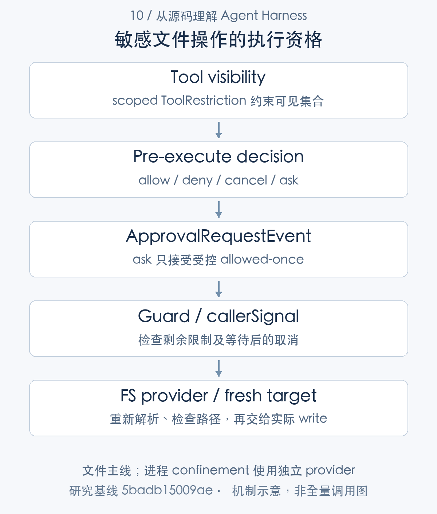
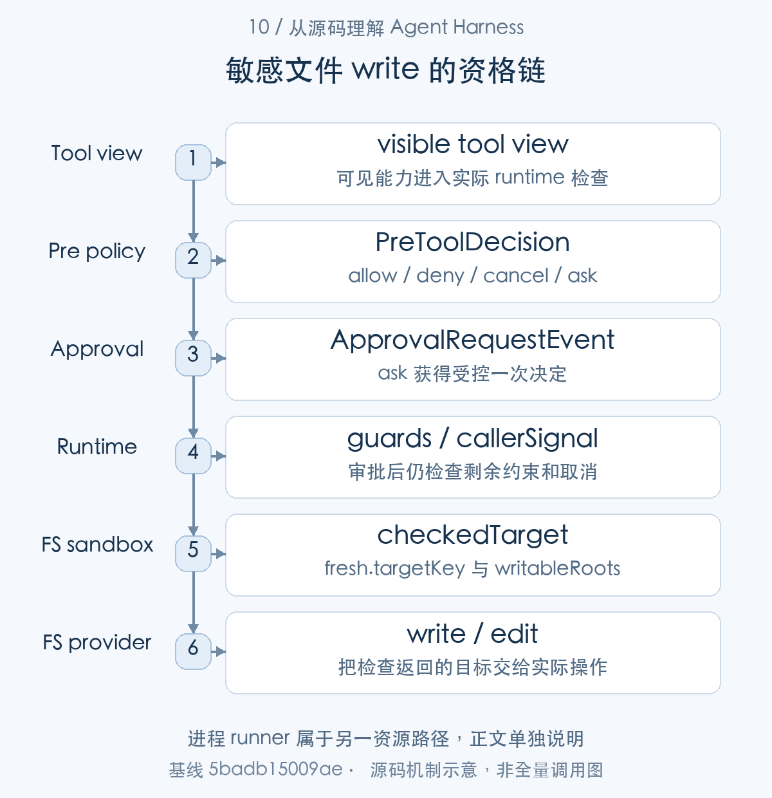
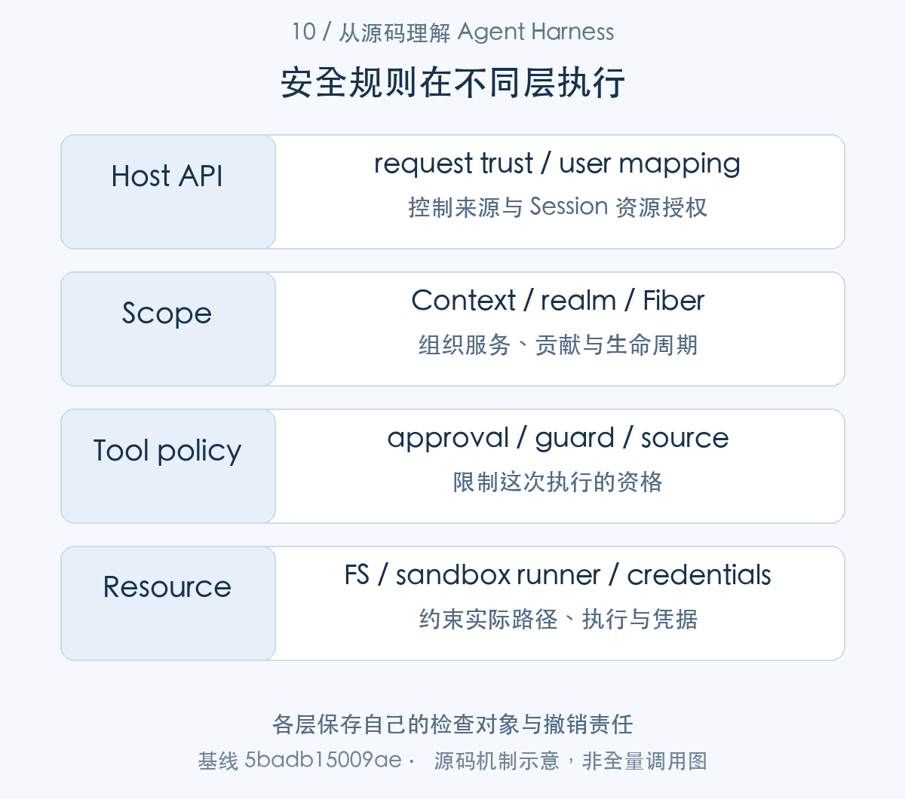
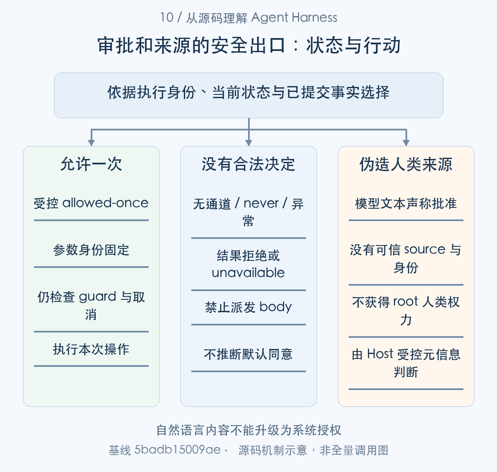

# 模型的行动权限从哪里来：审批、作用域与沙箱

> 从源码理解 Agent Harness · 第 10 篇 · 权限与安全边界

模型拿到了一个文件修改工具，就拥有工作区写权限吗？用户批准过一次 Shell 命令，后续所有命令都能执行吗？插件被挂到某个 Agent scope，是否意味着它已经被安全隔离？这几个问题看似都关于权限，却分别处于工具、授权、资源和插件执行层。

DeepSeek Harness 在这些层次提供不同检查。研究其安全设计，需要沿一次敏感操作追踪，而不是把“有审批”和“有 sandbox”加在一起便宣布安全。**每项措施限制哪一种主体、资源和动作，必须说清楚。**


本文沿敏感工具的执行资格展开：scoped tool view 决定模型可见能力，pre-execute 与 ApprovalService 决定这次调用能否继续，文件和执行 provider 约束实际资源。Scope/realm 负责组合与寿命，目标工具再检查受控来源，Host 入口检查请求可信性。后几项是相邻边界，并非一次文件调用必经的全部函数；下面明确各自主体、输入和返回决定。

## 沿一次文件写入看权限链

设想 Agent 要修改工作区外的配置文件。它先需要看见相关工具，调用进入 runtime 后通过 pre-execute 决策，可能需要审批，再经过 guard 和取消检查，最终文件 provider 还必须校验目标。某一层 allow，不代表其余层全部放行。[工具限制与 guard](https://github.com/deepseek-ai/deepseek-harness/blob/5badb15009ae1756c3afe0ae0cef1faafc290ccc/packages/core/tools/src/index.ts#L1063-L1155) [准备和执行顺序](https://github.com/deepseek-ai/deepseek-harness/blob/5badb15009ae1756c3afe0ae0cef1faafc290ccc/packages/core/tools/src/index.ts#L1493-L1699)


这种分层可以把策略选择与具体执行约束分开：应用规则决定是否应当询问用户，审批记录一次明确决定，provider 检查真正的路径或进程访问。审计时也能分别说明，是工具不可见、策略拒绝、用户拒绝，还是底层目标不合法。

模型提示中的“不要访问某目录”仍有价值，但属于行为指导。它不能替代实际资源检查，更不能成为识别用户身份和租户资源归属的证据。



图1：文件主线；进程 confinement 使用独立 provider。先按这张主线图建立对象地图，再结合下面的 caller、数据和返回路径展开。

### 第一步：可见、准入和实际访问分别检查

restrict() 先贡献工具视图，guardReason() 在准备时消费当前限制；prepare 的等待返回后检查 callerSignal。模型看见能力与一次调用取得派发资格，因而有不同判断点。

工具可见性使用可组合的 ToolRestriction：

```typescript
export interface ToolRestriction {
  /** Global tool names that stay visible; everything else is removed. */
  readonly allow?: readonly string[]
  /** Global tool names removed from visibility. */
  readonly deny?: readonly string[]
}
```

[源码：`packages/core/tools/src/index.ts:700–705`](https://github.com/deepseek-ai/deepseek-harness/blob/5badb15009ae1756c3afe0ae0cef1faafc290ccc/packages/core/tools/src/index.ts#L700-L705)。

|核心字段|保存的信息|使用位置|
|---|---|---|
|`allow`|保留的全局工具名|scoped view|
|`deny`|移除的全局工具名|祖先与局部限制合成|

它描述模型可见的工具集合；body 的实际路径权限由资源 provider 检查。两层协议都要保留。


```typescript
restrict(filter: ToolRestriction): () => void {
  const scope = scopeOf(this.ctx)
  if (scope === undefined) {
    throw new Error('tools.restrict() requires a scoped context (agent.ctx): a context-global restriction would mask every agent — deny the tool for the intended agent instead')
  }
  const allow = filter.allow
  const deny = filter.deny
  if (allow === undefined && deny === undefined) {
    throw new Error('tools.restrict({}) is a no-op: pass `allow` and/or `deny` (an empty filter is almost always a materialized-empty-config bug)')
  }
  const compiled: CompiledToolRestriction = {
    ...allow !== undefined ? { allow: new Set(allow) } : {},
    ...deny !== undefined ? { deny: new Set(deny) } : {},
  }
  if ([...allow ?? [], ...deny ?? []].includes(RUN_CODE_NAME)) {
    throw new Error(`tools.restrict() cannot name reserved PTC mode presentation transport "${RUN_CODE_NAME}"; restrict end-capability tools instead`)
  }
  const known = this.view(scope).restrictableNames
  const unknown = [...allow ?? [], ...deny ?? []].filter(name => !known.has(name))
  if (unknown.length > 0) {
    throw new Error(`tools.restrict() names unknown global tool${unknown.length > 1 ? 's' : ''} ${unknown.map(n => `"${n}"`).join(', ')}; known global tools: ${[...known].sort().join(', ') || '(none)'}`)
  }
  return this.layers.effect(
    this.ctx,
    layer => layer.restrictions.append(compiled),
    { label: 'tools.restrict()' },
  )
```

[源码：`packages/core/tools/src/index.ts:1097–1123`](https://github.com/deepseek-ai/deepseek-harness/blob/5badb15009ae1756c3afe0ae0cef1faafc290ccc/packages/core/tools/src/index.ts#L1097-L1123)。

restrict 只能在 Agent 上下文增加 allow/deny 层；root 不允许通过 scoped mask 改写全局注册。工具列表可见性是模型输入层的政策，不是操作系统访问许可。直接消费文件 provider 的代码仍需实际资源限制。

```typescript
private guardReason(exec: ToolExecution): string | undefined {
  const globalReason = this.layers.global.guardReason(exec)
  if (globalReason !== undefined) return globalReason
  if (exec.agent === undefined) return undefined
  for (const layer of this.layers.chainLayers(exec.agent)) {
    const reason = layer.guardReason(exec)
    if (reason !== undefined) return reason
  }
  return undefined
```

[源码：`packages/core/tools/src/index.ts:1145–1153`](https://github.com/deepseek-ai/deepseek-harness/blob/5badb15009ae1756c3afe0ae0cef1faafc290ccc/packages/core/tools/src/index.ts#L1145-L1153)。

guardReason 先看全局，再走 Agent 层链，首个拒绝即返回。局部贡献不能覆盖祖先拒绝，这体现了能力约束的单调性。反过来，guard 无拒绝也只是继续准备，审批和 provider 检查仍要执行。

```typescript
  if (this.callerCancelled(exec)) {
    return await next({ kind: 'post-result', exec, result: toolAbortedBeforeDispatchResult() })
  }
  return await next({ kind: 'dispatch', exec })
} catch (error: unknown) {
  return next({ kind: 'final-result', exec, result: toolErrorResult(error) })
}
```

[源码：`packages/core/tools/src/index.ts:1532–1538`](https://github.com/deepseek-ai/deepseek-harness/blob/5badb15009ae1756c3afe0ae0cef1faafc290ccc/packages/core/tools/src/index.ts#L1532-L1538)。

准备阶段等待结束后，原 callerSignal 取消仍阻止 dispatch。安全决策不仅是“某时刻允许过”，还包括当前执行是否仍有资格开始。把校验都移到注册时会错过参数、资源和生命周期变化。


## ask 没有通道时，为什么必须拒绝

tool runtime 没有被可见性或 guard 拒绝后，pre-execute 仍可返回 ask。下面沿这条分支进入 ApprovalService，再把决定交回该次工具执行。

ToolRuntime 对 ask 使用 ApprovalService。没有审批服务，或者没有 Agent 来提供 Session 审计和界面路由，都直接 deny。

```typescript
const approval = this.ctx.get('approval')
if (approval === undefined) {
  return {
    decision: { kind: 'deny', reason: ask.reason ?? `tool "${exec.name}" requires approval (not yet supported)` },
    approvalCancelled: false,
  }
}
if (exec.agent === undefined) {
  return {
    decision: { kind: 'deny', reason: `tool "${exec.name}" requires approval, but the call has no agent to route it through` },
    approvalCancelled: false,
  }
}
```

[对应源码](https://github.com/deepseek-ai/deepseek-harness/blob/5badb15009ae1756c3afe0ae0cef1faafc290ccc/packages/core/tools/src/index.ts#L1731-L1743)。以上为原文片段，仅统一缩进，需结合完整实现阅读。

这里不能把“部署未组合审批能力”解释成“用户默认同意”。否则删除一个插件就会扩大行动权限，授权结果与部署预期相反。

存在服务后，allowed-once、rejected、cancelled 和 unavailable 继续映射为不同结果。只有第一种提供本次 grant。policy=never 在服务分派 answerer 之前拒绝 ask，含义不是关闭所有工具执行；无需 ask 的调用仍须遵守自己的规则。[审批结果逐项映射](https://github.com/deepseek-ai/deepseek-harness/blob/5badb15009ae1756c3afe0ae0cef1faafc290ccc/packages/core/tools/src/index.ts#L1727-L1767) [审批请求及记录](https://github.com/deepseek-ai/deepseek-harness/blob/5badb15009ae1756c3afe0ae0cef1faafc290ccc/packages/interaction/user-approval/src/index.ts#L215-L307)

审批还需要处理等待期间的取消与卸载。迟到的回复不能让已经失效的执行继续，记录 decided 也不能脱离实际请求身份。否则审计中看似存在同意，授权却对应了错误生命周期。



图2：进程 runner 属于另一资源路径，正文单独说明。从 caller 的交接对象追到 consumer，具体分支结合正文源码阅读。

### 第二步：批准来自受控服务结果，而不是模型文本

pre-execute 返回 ask 时，runtime 组装请求交给 ApprovalService.request()。服务先检查 policy，再分派 answerer；结果与取消一起竞争结算，runtime 消费明确 outcome。

answerer 消费明确的请求结构，而不是一段“用户已同意”的文本：

```typescript
export interface ApprovalRequestEvent {
  /** Agent identity projected to the corresponding Client Context in transit. */
  readonly agent: Agent
  /** Tool whose operation requires a decision. */
  readonly toolName: string
  /** Exact tool call being decided, when available. */
  readonly callId?: ToolCallId
  /** Human-readable reason supplied by the asker. */
  readonly reason?: string
  /** Localized presentation only; never persisted in approval audit events. */
  readonly displayReason?: { readonly en: string; readonly [locale: string]: string }
  /** Cancellation lifetime of the pending request. */
  readonly signal?: AbortSignal
}
```

[源码：`packages/interaction/user-approval/src/types.ts:63–76`](https://github.com/deepseek-ai/deepseek-harness/blob/5badb15009ae1756c3afe0ae0cef1faafc290ccc/packages/interaction/user-approval/src/types.ts#L63-L76)。

|核心字段|保存的信息|使用位置|
|---|---|---|
|`agent` / `callId` / `toolName`|审批所属实例和可选精确调用|scope 分派及审计关联|
|`reason` / `displayReason`|判断解释与本地展示|审计内容和 UI|
|`signal`|这次等待的有效期|取消结算|

请求中的 Agent 身份来自受控执行上下文。返回的 allowed-once 只授权本次执行；Host 的真实用户身份需在可信控制层连接。


原文的 ask 分支先检查 approval 服务与调用 Agent。

ask 没有 approval 服务或没有 Agent 时关闭这次执行入口，不能用配置缺失自动升级为 allow。allowed-once 与 rejected、cancelled、unavailable 的映射也各有语义；unavailable 是无法获得合法决定，不是用户默认同意。

```typescript
private async decide(req: ApprovalRequest, session: Session): Promise<ApprovalOutcome> {
  const signal = req.signal
  if (signal?.aborted) return 'cancelled'
  // The 'never' policy is decided HERE, before any dispatch: a listener
  // registered with `prepend: true` after this service mounts would sit
  // ahead of any gate LISTENER, so a listener-shaped gate cannot keep the
  // documented promise that 'never' rejects deterministically regardless
  // of registration order — only the service's own request path can.
  if (this.effectivePolicy(session) === 'never') return 'rejected'
  // Enter the promise chain BEFORE dispatching: a listener that throws
  // SYNCHRONOUSLY (before its first await) must land in the same rejection
  // path as an async one — `Promise.resolve(call())` would let it escape
  // the containment into the caller.
  const answer: Promise<ApprovalOutcome> = Promise.resolve().then(
    () => this.ctx.waterfall(
      scopeTarget(req.agent, req.agent), 'approval/request', req,
      () => Promise.resolve<ApprovalOutcome>('unavailable'),
    ),
  ).then(
    // Normalize a rogue (non-vocabulary) answerer return to the fail-closed
    // outcome instead of leaking it into callers' closed-union switches.
    outcome => OUTCOMES.includes(outcome) ? outcome : 'unavailable',
    // A throwing answerer must fail the QUESTION closed, not the caller's
    // tool call open — the seam contains its callbacks.
    () => 'unavailable',
```

[源码：`packages/interaction/user-approval/src/index.ts:267–291`](https://github.com/deepseek-ai/deepseek-harness/blob/5badb15009ae1756c3afe0ae0cef1faafc290ccc/packages/interaction/user-approval/src/index.ts#L267-L291)。

never 在服务内部、进入 waterfall 前判定，避免 prepend listener 越过拒绝门。answerer 的同步异常、异步异常和非法词汇统一落为 unavailable；Promise.resolve().then 把同步 throw 也放入同一错误通道。

```typescript
if (signal === undefined) return answer
return await new Promise<ApprovalOutcome>((resolve) => {
  const onAbort = () => {
    signal.removeEventListener('abort', onAbort)
    resolve('cancelled')
  }
  signal.addEventListener('abort', onAbort, { once: true })
  void answer.then((outcome) => {
    signal.removeEventListener('abort', onAbort)
    // After an abort won the race this resolve is a settled-promise no-op:
    // the late answer is discarded by construction.
    resolve(outcome)
  })
})
```

[源码：`packages/interaction/user-approval/src/index.ts:293–306`](https://github.com/deepseek-ai/deepseek-harness/blob/5badb15009ae1756c3afe0ae0cef1faafc290ccc/packages/interaction/user-approval/src/index.ts#L293-L306)。

请求取消先结算为 cancelled，迟到回答只能 resolve 已结算 Promise，不能复活旧请求。此处保护审批问题；工具包装仍必须在 body 前检查 caller cancellation，二者共同闭合等待窗口。

不要把这些机制描述为企业身份认证：它们知道这次 Agent 请求和服务决定，却还需要 Host 绑定真实用户、租户、策略版本以及参数摘要。

## 资源限制应该落到真实操作处

合法批准使执行可以继续，body 随后调用实际 provider。这里以 fs-sandbox 为文件操作路径，sandbox-local 则是进程执行的另一资源约束支线。

fs-sandbox 在 writeText 中先检查 target，再委派实际写入。

```typescript
override async writeText(
  target: FsTarget,
  content: string,
  expected?: FsWriteIntent,
  signal?: AbortSignal,
  sandboxPolicy?: SandboxExecutionPolicy,
): Promise<FsWriteOutcome> {
  return super.writeText(await this.checkedTarget(target, sandboxPolicy), content, expected, signal)
}
```

[对应源码](https://github.com/deepseek-ai/deepseek-harness/blob/5badb15009ae1756c3afe0ae0cef1faafc290ccc/packages/fs/fs-sandbox/src/index.ts#L80-L88)。以上为原文片段，仅统一缩进，需结合完整实现阅读。

这个位置说明限制作用于即将执行的目标，而不只是工具注册时的一次描述。editText 同样走检查；sandbox-policy 为调用选择模式和工作区条件，sandbox-local 则构造平台 confinement 参数。[沙箱策略服务](https://github.com/deepseek-ai/deepseek-harness/blob/5badb15009ae1756c3afe0ae0cef1faafc290ccc/packages/sandbox/sandbox-policy/src/index.ts#L1-L87) [文件写入与编辑校验](https://github.com/deepseek-ai/deepseek-harness/blob/5badb15009ae1756c3afe0ae0cef1faafc290ccc/packages/fs/fs-sandbox/src/index.ts#L80-L140) [平台执行约束](https://github.com/deepseek-ai/deepseek-harness/blob/5badb15009ae1756c3afe0ae0cef1faafc290ccc/packages/sandbox/sandbox-local/src/index.ts#L152-L184)

文件检查与进程隔离并不是同一个保证。fs 工具路径合法，不证明任意 Shell 命令都被相同规则限制；命令在某种沙箱内运行，也不证明 API 调用者有权读取另一个 Session。

跨平台能力还依赖实际实现。研究读到平台链和 enforcement 描述，不能替代目标 OS 上的越界路径、符号链接、后代进程和退出验证。本次没有完成 Linux／Windows confinement 实测。

### 第三步：新解析的目标必须就是接下来写入的目标

取得本次资格后，文件 body 调用 fs provider。checkedTarget() 重新解析待写对象并返回 fresh，write/edit 将这份对象交给真实操作；进程则使用 sandbox runner 的独立路径。


```typescript
private async checkedTarget(target: FsTarget, sandboxPolicy?: SandboxExecutionPolicy): Promise<FsTarget> {
  const policy = sandboxPolicy ?? this.ctx.sandboxPolicy.resolve()
  const { mode } = policy
  if (mode === 'danger-full-access') return target
  if (mode === 'read-only') {
    throw new FsError(`cannot write "${target.displayPath}": file access denied under read-only mode`, 'FS_SANDBOX_DENIED')
  }
  // workspace-write: containment on the FRESH canonical path (catches a
  // symlink ancestor swapped since the tool resolved this target), and the
  // mutation delegates with THIS fresh target — never the stale one.
  const fresh = await this.resolve(target.displayPath)
  let contained = false
  for (const root of writableRoots(policy)) {
    if (await isPathUnder(fresh.targetKey, root)) {
      contained = true
      break
    }
  }
  if (!contained) {
    throw new FsError(`cannot write "${target.displayPath}": file access denied under workspace-write mode`, 'FS_SANDBOX_DENIED')
  }
  return fresh
```

[源码：`packages/fs/fs-sandbox/src/index.ts:122–143`](https://github.com/deepseek-ai/deepseek-harness/blob/5badb15009ae1756c3afe0ae0cef1faafc290ccc/packages/fs/fs-sandbox/src/index.ts#L122-L143)。

read-only 直接拒绝；workspace-write 重新 resolve displayPath，用 fresh.targetKey 检查 writableRoots，并返回 fresh。它缩小路径检查与写入对象不一致的窗口，但不能由应用层 realpath 推导所有系统级竞态已经消除；底层执行环境仍应限制实际文件效果。

```typescript
override async editText(
  target: FsTarget,
  edit: FsEditRequest,
  expected?: { version: FsVersion },
  signal?: AbortSignal,
  sandboxPolicy?: SandboxExecutionPolicy,
): Promise<FsEditOutcome> {
  return super.editText(await this.checkedTarget(target, sandboxPolicy), edit, expected, signal)
}
```

[源码：`packages/fs/fs-sandbox/src/index.ts:101–109`](https://github.com/deepseek-ai/deepseek-harness/blob/5badb15009ae1756c3afe0ae0cef1faafc290ccc/packages/fs/fs-sandbox/src/index.ts#L101-L109)。

editText 将 checkedTarget 的返回值直接交给 super.editText，也携带 expected version 和 signal。权限判断与版本冲突是两项独立约束：可写不等于读到的旧内容仍然有效。

```typescript
 * The runner chain per platform — selection is BY PLATFORM first, probes
 * second: a platform's chain is probed in preference order only when it has
 * MORE than one candidate (probing arbitrates; it does not re-validate a
 * choice that has no alternative). A platform with no chain fails closed at
 * `confine()`. Linux prefers `bwrap` (its mount profile is closest to the
 * mode vocabulary) over the Landlock launcher; darwin has exactly one
 * candidate, selected without any probe.
 */
const PLATFORM_CHAINS: Record<string, readonly SelectedRunner['runner'][]> = {
  linux: ['bwrap', 'landlock'],
  darwin: ['seatbelt'],
  // The Windows restricted-token runner (@deepseek-ai/dsh-sandbox-windows-acl):
  // a sole candidate, selected without a probe — its execution-time refusal
  // fails closed through its stderr signature (windows-acl-run:) and exit 127.
  win32: ['windows-acl'],
}
```

[源码：`packages/sandbox/sandbox-local/src/index.ts:152–167`](https://github.com/deepseek-ai/deepseek-harness/blob/5badb15009ae1756c3afe0ae0cef1faafc290ccc/packages/sandbox/sandbox-local/src/index.ts#L152-L167)。

平台先选择 runner 链，Linux 的多候选需要探测，darwin 与 Windows 单候选按配置进入执行。不能把统一 mode 名称解释为各平台保证完全相同；runner 的 enforcement、文件系统语义与不支持路径必须分别验收。


## Scope 与 realm 管理能力组合，不隔离不可信代码

资源 provider 已说明，下面回到插件装配层，解释这些规则的服务如何被找到、由谁释放。Scope/realm 是组合关系，不是上一节的进程 confinement 实现。

Cordis realm 解析服务 symbol，HarnessScope 过滤事件载体和注册可见性。子作用域继承祖先贡献，祖先可以观察子事件；资源归属调用 Context 的 Fiber effect。[HarnessScope 的传播](https://github.com/deepseek-ai/deepseek-harness/blob/5badb15009ae1756c3afe0ae0cef1faafc290ccc/packages/core/scope/src/index.ts#L1-L180) [服务提供与解析](https://github.com/deepseek-ai/deepseek-harness/blob/5badb15009ae1756c3afe0ae0cef1faafc290ccc/vendor/cordis/src/reflect.ts#L277-L327)

这种能力适合“只给 Agent A 挂路由规则”之类组合需求。它不是操作系统地址空间隔离，不能仅因为插件处于子 scope，就假定插件无法访问进程内其他对象或本机资源。

如果产品要加载不可信第三方插件，需要进程或其他执行隔离、明确 IPC 协议和资源授权，而不是复用逻辑 scope 的名称来作安全承诺。这是新增工程要求，不是对 scope 现有用途的否定。



图3：各层保存自己的检查对象与撤销责任。表中对象并列展示用途与寿命，层次之间以源码所示身份关联。

### 第四步：组合边界管理注册与寿命

这里切到服务组合：createScope() 建立 Fiber 归属，realm symbol 参与服务解析，dispose 撤销贡献并等待依赖。它管理第三步所用组件的装配寿命。


```typescript
export function bindScopeParent(key: ScopeKey, parent: ScopeKey): ScopeParentBinding {
  if (scopeParents.has(key)) {
    throw new Error('dsh-scope: scope key is already bound to a parent; re-linking requires the binding returned by the original bind')
  }
  linkScopeParent(key, parent)
  return {
    rebind(next: ScopeKey): void {
      linkScopeParent(key, next)
    },
  }
```

[源码：`packages/core/scope/src/index.ts:72–81`](https://github.com/deepseek-ai/deepseek-harness/blob/5badb15009ae1756c3afe0ae0cef1faafc290ccc/packages/core/scope/src/index.ts#L72-L81)。

父链绑定防止重复绑定，rebind 权限只交给原 binder，循环检查让链遍历可终止。这是上下文关系的完整性，不是插件执行进程的权限沙箱。

```typescript
export function createScope(ctx: Context, key: ScopeKey, options?: CreateScopeOptions): Scope {
  if (options?.parent !== undefined) bindScopeParent(key, options.parent)
  const fiber = ctx.plugin(scope)
  const scoped: Context = fiber.ctx.extend({ [kScope]: key })
  let disposing: Promise<void> | undefined
  return {
    ctx: scoped,
    rawDispose: fiber.dispose,
    dispose: () => (disposing ??= quiesceFiber(fiber)),
  }
```

[源码：`packages/core/scope/src/index.ts:137–146`](https://github.com/deepseek-ai/deepseek-harness/blob/5badb15009ae1756c3afe0ae0cef1faafc290ccc/packages/core/scope/src/index.ts#L137-L146)。

createScope 创建 Fiber、贴 scope tag，dispose 共享 quiescent 等待。插件通过 scoped Context 注册贡献，资源能随作用域释放；同一进程里的任意 JavaScript 代码却仍可能直接调用 Node API。

```typescript
  this.ctx.root[symbols.isolate][name] ??= Symbol(name)
  const key = this.ctx[symbols.isolate][name]
  const impl: Impl = { name, value, fiber: this.ctx.fiber, check }
  if (this.store[key]) {
    throw new Error(`service "${name}" has been registered at <${this.store[key].fiber.name}>`)
  }
  this.store[key] = impl
  this.ctx.fiber.store![name] = impl
  if (this.ctx.fiber.state === FiberState.ACTIVE) {
    this.notify([name])
  }
  return async () => {
    delete this.store[key]
    const fibers = this.notify([name])
    await Promise.allSettled(fibers.map(fiber => fiber.await()))
    // ensure self access before dependencies cleanup
    delete this.ctx.fiber.store![name]
  }
}, `ctx.provide(${JSON.stringify(name)})`)
```

[源码：`vendor/cordis/src/reflect.ts:286–304`](https://github.com/deepseek-ai/deepseek-harness/blob/5badb15009ae1756c3afe0ae0cef1faafc290ccc/vendor/cordis/src/reflect.ts#L286-L304)。

realm symbol 决定服务槽位，provider dispose 会通知依赖并等待它们，之后撤销自身 store。隔离的是服务解析与贡献可见性，不能用 realm 实现不可信代码的内存、系统调用或凭据隔离。

## 模型生成的指令不能变成人类授权

接下来转到修改目标的敏感工具：它消费 ToolRunContext 和 Session 来源事实，独立检查当前执行身份。此前审批或 scope 的存在不会自动替它生成直接人类来源。

目标工具会检查消息来源与权限：当前直接人类输入、自动目标 Turn 和其他来源拥有不同权力。子 Agent 写出的“用户批准”文本，不会因为内容像一条人类消息就获得 root 用户权限。[目标工具的来源权限](https://github.com/deepseek-ai/deepseek-harness/blob/5badb15009ae1756c3afe0ae0cef1faafc290ccc/packages/goal/tool-goal/src/authority.ts#L48-L117) [目标操作的实际限制](https://github.com/deepseek-ai/deepseek-harness/blob/5badb15009ae1756c3afe0ae0cef1faafc290ccc/packages/goal/tool-goal/src/index.ts#L207-L331)

这项区分对 prompt injection 很重要。来源应来自受控消息元信息与执行身份，不能从自然语言自述反推。MCP server 指令也只是有来源的提示段，注册进 prompt 不等于授权，亦不表示已经有完整恶意内容识别。[MCP 服务指令的进入方式](https://github.com/deepseek-ai/deepseek-harness/blob/5badb15009ae1756c3afe0ae0cef1faafc290ccc/packages/mcp/mcp-client/src/server-context.ts#L28-L40)

源码提供一些来源与执行限制，不应因此宣称已经通用解决了提示注入。输入内容识别、数据泄漏防护、工具风险策略和外部访问还需按产品目标分别设计与验证。

### 第五步：授权依赖来源与精确执行身份

目标工具的来源检查是另一执行 consumer。goalToolExecution() 固定 live Agent 与开放 Turn 的事件截面，authority 方法据此判断 direct-human 或匹配的 goal-round。

目标工具认证成功后的交接对象是 GoalToolExecution：

```typescript
export interface GoalToolExecution {
  readonly agent: Agent
  readonly events: readonly SessionEvent[]
  readonly openTurnStartSeq: SessionSeq
}
```

[源码：`packages/goal/tool-goal/src/authority.ts:12–16`](https://github.com/deepseek-ai/deepseek-harness/blob/5badb15009ae1756c3afe0ae0cef1faafc290ccc/packages/goal/tool-goal/src/authority.ts#L12-L16)。

|核心字段|保存的信息|使用位置|
|---|---|---|
|`agent`|同一 live Agent 对象|registry 与 driver 检查|
|`events` / `openTurnStartSeq`|不可变日志截面和当前 Turn 起点|当前已接纳来源检查|

authority 扫描的是受控事件元信息；自然语言内容不改变 source.kind。保存开放边界也防止旧 Turn 的同意被当作当前授权。


```typescript
export function goalToolExecution(ctx: Context, exec: ToolRunContext): GoalToolExecution {
  const agent = exec.agent
  if (agent === undefined) {
    return reject('goal tools require a calling agent', 'GOAL_TOOL_AGENT_REQUIRED')
  }
  if (ctx.agents.get(agent.id) !== agent || agent.status !== 'running'
    || ctx.agents.currentInitiator() !== agent) {
    return reject(
      'goal tools require the exact live calling agent inside its active driver',
      'GOAL_TOOL_DRIVER_REQUIRED',
    )
  }
  return { agent, ...openTurnEvents(ctx, agent) }
```

[源码：`packages/goal/tool-goal/src/authority.ts:48–60`](https://github.com/deepseek-ai/deepseek-harness/blob/5badb15009ae1756c3afe0ae0cef1faafc290ccc/packages/goal/tool-goal/src/authority.ts#L48-L60)。

目标工具要求 registry 中同一 Agent 对象、running 状态与 currentInitiator 一致。只有 id 相同不够，卸载后的旧对象不得继续修改新实例的目标。

```typescript
function hasDirectHumanInput(ctx: Context, execution: GoalToolExecution): boolean {
  if (!ctx.agents.roots().includes(execution.agent)) return false
  return someOpenTurnEvent(execution, event =>
    event.type === 'user/message' && event.data.source.kind === 'user')
}

/** Whether this turn is the current goal's exact admitted round. */
function isMatchingGoalRound(execution: GoalToolExecution, goal: GoalView): boolean {
  return someOpenTurnEvent(execution, event => event.type === 'user/message'
    && event.data.source.kind === 'goal'
    && event.data.source.goalId === goal.id
    && event.data.source.revision === goal.revision
    && event.data.source.round === goal.roundsStarted)
```

[源码：`packages/goal/tool-goal/src/authority.ts:80–92`](https://github.com/deepseek-ai/deepseek-harness/blob/5badb15009ae1756c3afe0ae0cef1faafc290ccc/packages/goal/tool-goal/src/authority.ts#L80-L92)。

直接人类来源必须是 root 当前 Turn 中已接纳 user/message；目标 Turn 则匹配 goalId、revision、round。内容写着“用户同意”不会改变 source.kind。Host 发自动消息也必须显式标注来源，因为缺省 followup/steer 来源是 user，误用会扩大权力。

```typescript
export function registerServerContext(ctx: Context, server: string, connection: ServerContext): void {
  ctx.inject(['mcpResources'], (inner) => {
    inner.mcpResources.register(server, connection.resources)
  })
  ctx.inject(['systemPrompt'], (inner) => {
    inner.systemPrompt.section({
      name: `mcp:${server}`,
      order: inner.systemPrompt.getSectionOrder('MCP_SERVERS'),
      interpolate: false,
      text: () => connection.instructions(),
    })
  })
}
```

[源码：`packages/mcp/mcp-client/src/server-context.ts:28–40`](https://github.com/deepseek-ai/deepseek-harness/blob/5badb15009ae1756c3afe0ae0cef1faafc290ccc/packages/mcp/mcp-client/src/server-context.ts#L28-L40)。

MCP instructions 注册为有来源的 prompt 段，帮助模型理解服务器能力。它没有把外部自然语言提升为授权证明，也没有自动识别全部 prompt injection。策略应由可信 provider 和 Host 执行，模型文本只作为待解释数据。


## 控制面安全与执行面安全要分别验收

Host API trust、浏览器启动 token 与本地凭据权限检查属于控制或配置保护。它们回答请求是否可信、凭据是否按本机要求保存；企业多用户场景还需要把主体映射到 Session、文件、模型和凭据资源。[API 请求可信性检查](https://github.com/deepseek-ai/deepseek-harness/blob/5badb15009ae1756c3afe0ae0cef1faafc290ccc/packages/client/connection/src/api-request-trust.ts#L91-L118) [浏览器启动 token](https://github.com/deepseek-ai/deepseek-harness/blob/5badb15009ae1756c3afe0ae0cef1faafc290ccc/packages/client/connection/src/browser-auth.ts#L52-L57) [本地凭据权限](https://github.com/deepseek-ai/deepseek-harness/blob/5badb15009ae1756c3afe0ae0cef1faafc290ccc/packages/credentials/credentials-local/src/index.ts#L114-L146)

例如两个用户共用一台 Host，即使 Shell 已被 confinement，若 controller 允许用户 A 订阅 B 的历史，仍然存在资源授权问题。反过来，用户身份检查正确，也不保证执行 provider 限制了敏感目录。

建立企业权限矩阵时，应逐 API 检查读取、写入、订阅与导出，逐 provider 检查实际资源访问，再检查不同生命周期的授权撤销。不能从一项本地审批测试推导整套多租户安全。



图4：自然语言内容不能升级为系统授权。各分支基于自己的证据返回决定，不按完成文案推断下一动作。

### 第六步：请求可信与资源权限是两张检查表

最后切到控制入口和凭据读取：api-request-trust 检查请求来源，credentials-local 检查文件权限。它们保护调用与配置来源，产品还需要将主体映射到具体 Session 和资源。


```typescript
export function isTrustedApiRequest(request: ConnectionTrustRequest, trustedHosts: readonly string[]): boolean {
  // Host fence (DNS-rebinding defense), applied to every request: the browser
  // fills Host from the URL it believes it is talking to, so a rebound page
  // carries the attacker's domain here even though the socket lands on this
  // server. There is no marker shortcut — a browser read over plain HTTP
  // (images and navigations) arrives with neither Origin nor
  // Fetch-Metadata, indistinguishable from curl, and its response is readable
  // by the rebound page.
  const host = header(request.headers, 'host')
  if (host === undefined) return false
  const hostUrl = parseAuthority(host)
  if (hostUrl === undefined) return false
  if (!isLoopbackHostname(hostUrl.hostname) && !isTrustedAuthority(hostUrl, trustedHosts)) return false
  // Cross-site fence: modern browsers label the initiator relationship on
  // every fetch; an explicit cross-site marker is refused regardless of Origin.
  if (header(request.headers, 'sec-fetch-site') === 'cross-site') return false
  // Origin fence: when a browser attaches an Origin it must be exactly this
  // authority (compared through the same normalization as the Host). Absent
  // Origin is fine — the Host fence above already bound the request. The
  // literal "null" (sandboxed iframes, file: pages) is an opaque origin, refused.
  const origin = header(request.headers, 'origin')
  if (origin === undefined) return true
  try {
    return new URL(origin).host === hostUrl.host
  } catch {
    return false
  }
}
```

[源码：`packages/client/connection/src/api-request-trust.ts:91–118`](https://github.com/deepseek-ai/deepseek-harness/blob/5badb15009ae1756c3afe0ae0cef1faafc290ccc/packages/client/connection/src/api-request-trust.ts#L91-L118)。

Host 必须属于 loopback 或 trustedHosts，cross-site 被拒绝，带 Origin 时与 Host authority 比较。没有 Origin 也要先通过 Host 门，这能防止将普通浏览器读取误当可信本机请求。该检查不是完整 SSO 或租户 ACL。

```typescript
async function assertOwnerOnly(filename: string): Promise<void> {
  let mode: number
  try {
    mode = (await stat(filename)).mode
  } catch (error) {
    if (!isENOENT(error)) throw error
    await canonicalizeWatchPath(filename)
    return
  }
  /* v8 ignore next -- POSIX coverage cannot take the Windows peer; native Windows coverage does. */
  if (process.platform === 'win32') return
  /* v8 ignore start -- Windows has no POSIX mode enforcement; POSIX behavior tests enforce this peer. */
  const offending = mode & GROUP_OTHER_BITS
  if (offending === 0) return
  throw new Error(
    `credentials-local: ${filename} is readable beyond its owner (mode ${(mode & 0o777).toString(8)});`
    + ` run "chmod 600 ${filename}" before starting again`,
  )
```

[源码：`packages/credentials/credentials-local/src/index.ts:127–144`](https://github.com/deepseek-ai/deepseek-harness/blob/5badb15009ae1756c3afe0ae0cef1faafc290ccc/packages/credentials/credentials-local/src/index.ts#L127-L144)。

POSIX 读取前拒绝 group/other 权限，Windows 不假造 mode 验证。这是一项本机凭据存储检查；凭据能被哪些 Agent 使用、是否按租户分离、如何轮换，需要独立的可信凭据 provider。

验收应分别覆盖 API 入口来源、用户身份映射、Agent 可用能力、具体资源范围、执行隔离与撤销后的等待路径。任一层通过都不能替另一层出具证明。

## 技术心得：沿执行资格组织安全责任

### 为每一层写清主体、动作和资源

ToolRestriction、ApprovalRequestEvent 与 fresh target 各保存不同检查对象。我会据此为敏感操作建立可读记录：哪个 Agent 提出哪次调用、收到什么决定、实际访问哪个目标。这样政策与资源效果能够逐层复核。

### 在等待返回处保持同一资格

approval cancellation、callerSignal 检查与目标 revision 校验共同体现了有效期。企业扩展可以把参数摘要和策略版本加入审批关联，再在实际操作前复核，让迟到回复仍指向原来的那次工作。

### 用组合边界安排责任

Scope/realm 能准确挂接能力与清理；资源 provider 和控制面则执行各自权限。把这份分工落实到配置、实现和验收，团队会更容易说明某个规则由谁维护，发生撤销时由谁等待在途工作结束。

对代码修复 Agent，安全研究最终应回到一次具体写入：从模型可见工具，经本次决定，到受约束的实际资源。本文提供源码上的追踪路径；原有受控验证保留，企业身份与目标平台隔离应按部署另行验收。

---

研究基线：DeepSeek Harness `0.2.1-alpha.1`，提交 `5badb15009ae1756c3afe0ae0cef1faafc290ccc`。源码事实以该版本为准；文中的工程判断和改造建议另行说明。教学场景不代表真实模型业务实测。

源码与运行记录可从[证据索引](../appendices/evidence-index.md)和[验证附录](../appendices/validation.md)复核。本文引用此前同一提交的验证结果，本轮写作不将其重新计为新测试。

[专栏目录](README.md) · [上一篇](09-concurrency.md) · [下一篇](11-autonomy.md)
