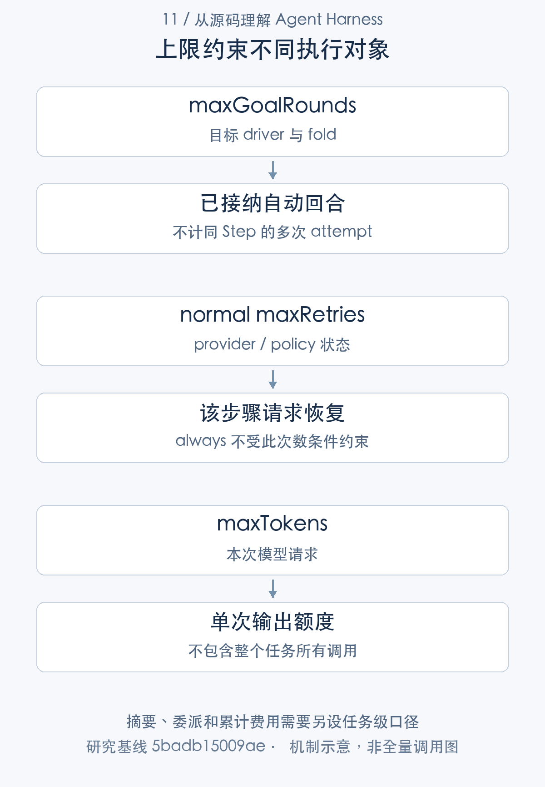
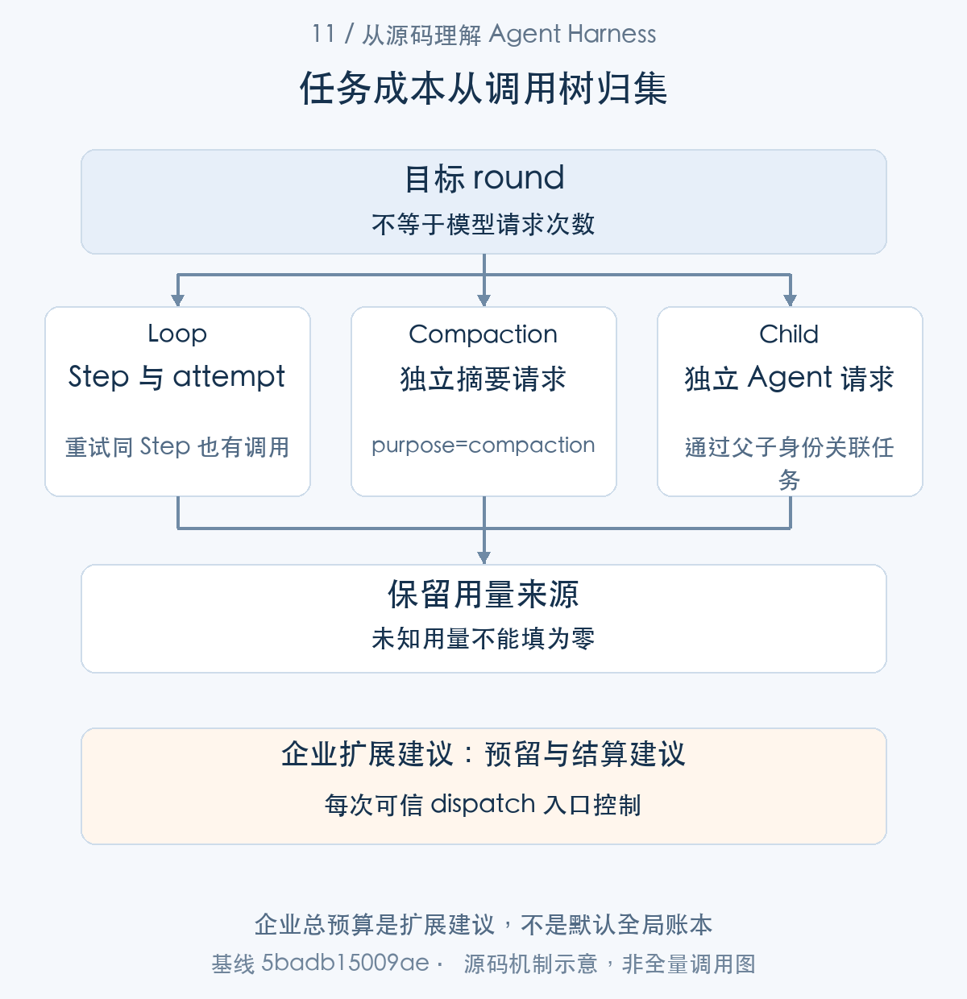
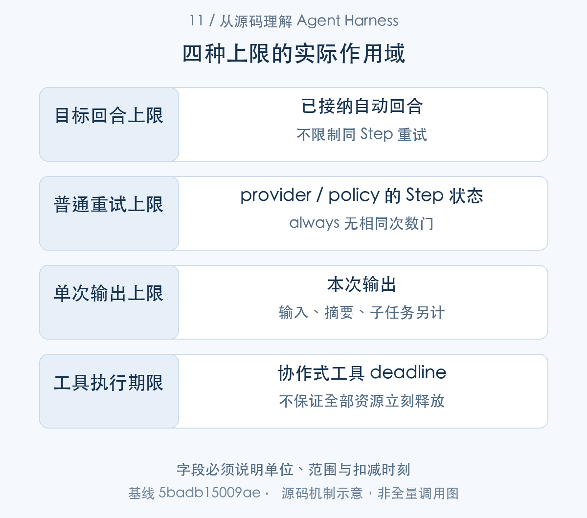
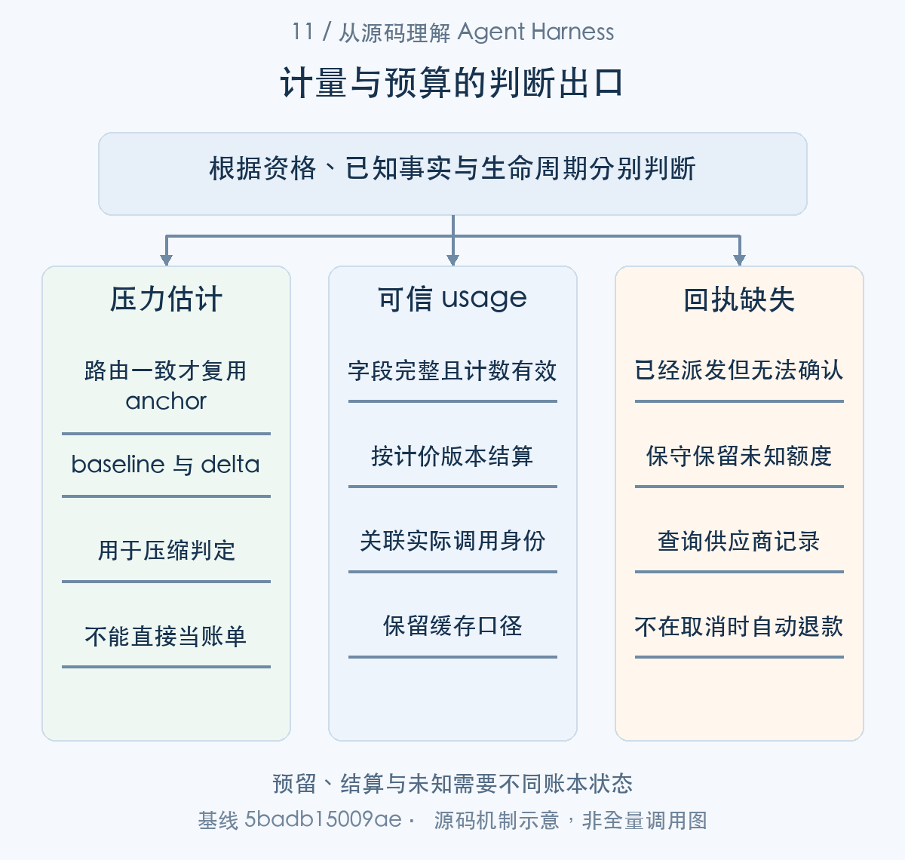

# 限制回合数为什么仍可能失控：成本、延迟与预算

> 从源码理解 Agent Harness · 第 11 篇 · 成本、延迟与预算

给 Agent 设置“最多执行三轮”，是否就能保证成本有限、几分钟内结束？如果第一轮不断重试，如果每轮都要摘要历史，如果子任务再调用模型，三轮这个数字便很难说明真正消耗了什么。

DeepSeek Harness 有输出额度、目标回合数、重试策略、压缩次数和并发配额。它们各自有用，但约束对象不同。本文从资源消耗的实际层级出发，解释**为什么多个局部上限不会自动组成任务级预算**。

## 一个任务可能产生多类调用

Turn 中有 Step，Step 中有 attempt，工具结果可能使 Loop 继续下一 Step；child Agent 有自己的请求，压缩摘要也通过独立 LLM stream 调用。单看主 Agent 的回合数，无法覆盖全部模型使用。[步骤中的请求尝试](https://github.com/deepseek-ai/deepseek-harness/blob/5badb15009ae1756c3afe0ae0cef1faafc290ccc/packages/core/agent-loop/src/agent.ts#L398-L544) [独立摘要调用](https://github.com/deepseek-ai/deepseek-harness/blob/5badb15009ae1756c3afe0ae0cef1faafc290ccc/packages/compaction/compaction-basic/src/summarizer.ts#L120-L180) [子 Agent 的执行](https://github.com/deepseek-ai/deepseek-harness/blob/5badb15009ae1756c3afe0ae0cef1faafc290ccc/packages/subagent/subagent-in-process-driver/src/index.ts#L158-L207)

例如“修复缺陷并通过测试”启动一次自动回合，先读文件，再改代码，再分析失败测试；请求重试和上下文摘要可能发生在这些步骤之间。最终只增加一轮目标计数，模型请求却已经不止一次。



图1：上限约束不同执行对象。

这张图列的是现有局部控制及其范围，统一任务预算是应用需要另行设计的能力。把图上的几个配置名称汇总成一个界面面板，不会改变它们在代码里的作用域。

### 第一步：从调用树找出所有消费入口

```typescript
private async step(decision: Extract<PreparedStep, { kind: 'enter' }>): Promise<StepEndReason | null> {
  /* v8 ignore next -- private callers establish the running phase before executing a step */
  if (this.phase.kind !== 'running') throw new Error(`agent "${this.id}": step outside running phase`)
  const { turn, step, abort: { signal } } = this.phase
  signal.throwIfAborted()

  const { assembly } = decision
  const renderedPrompt = renderPrompt(assembly)
  let firstAttempt = true
  while (true) {
    const { config, preparedCall } = await this.prepareRequest(turn, step, signal)
    const startsRequestSeries = firstAttempt && decision.startsRequestSeries === true
    const commits = this.systemPrompt.project(renderedPrompt, {
      inHistory: preparedCall?.systemPromptUpdate === 'in-history',
      startsSeries: startsRequestSeries
        || this.requestSurfaceGeneration !== this.session.surface.contentGeneration
        || (preparedCall?.toolUpdate === undefined && this.toolsChanged(assembly.tools)),
    })
    for (const { message, intent } of commits) {
      this.session.append('system/message', { turn, step, message }, intent)
    }
    if (firstAttempt) {
      for (const message of decision.messages) {
        this.session.append('user/message', message, { surfaceOp: 'append' })
      }
    }
    firstAttempt = false
    const request = this.buildRequest(config, preparedCall, assembly.tools, { turn, step }, startsRequestSeries, signal)
```

[源码：`packages/core/agent-loop/src/agent.ts:398–425`](https://github.com/deepseek-ai/deepseek-harness/blob/5badb15009ae1756c3afe0ae0cef1faafc290ccc/packages/core/agent-loop/src/agent.ts#L398-L425)。

同 Step 的 while 每次重新 prepareRequest，attempt 不是新 round。firstAttempt 只控制输入消息的首次提交，不阻止重试派发。因此目标回合数、Step 数与供应商请求数不能共用一个计数器。

```typescript
const options: GenerateOptions = {
  provider: target.provider,
  model: target.model,
  messages,
  toolHistory: agent.session.toolHistory(),
  ...input.tools === undefined ? {} : { tools: [...input.tools] },
  maxTokens: config.maxTokens,
  sessionId: agent.session.id,
  purpose: 'compaction',
  ...signal === undefined ? {} : { signal },
}
for await (const chunk of ctx.llm.stream(options)) assembler.push(chunk)
```

[源码：`packages/compaction/compaction-basic/src/summarizer.ts:152–163`](https://github.com/deepseek-ai/deepseek-harness/blob/5badb15009ae1756c3afe0ae0cef1faafc290ccc/packages/compaction/compaction-basic/src/summarizer.ts#L152-L163)。

摘要走 ctx.llm.stream，purpose 为 compaction，自有 maxTokens。它不会因为主回答尚未进入新 Step 就免费；任务成本归集必须能把摘要和父任务关联。

```typescript
const result: Promise<SubagentResult> = (async () => {
  try {
    if (!flags.cancelled) {
      child.followup(createUserMessage({ content: prompt, source: { kind: 'user' } }))
      await child.whenIdle()
    }
    return readResult(
      child,
      boundary,
      flags.cancelled,
      structured ? { captured: structured.captured() } : undefined,
    )
  } finally {
    signal.removeEventListener('abort', onAbort)
  }
})()
```

[源码：`packages/subagent/subagent-in-process-driver/src/index.ts:178–193`](https://github.com/deepseek-ai/deepseek-harness/blob/5badb15009ae1756c3afe0ae0cef1faafc290ccc/packages/subagent/subagent-in-process-driver/src/index.ts#L178-L193)。

child.followup 与 whenIdle 启动另一个 Agent 执行链。若只统计父 Session 的 assistant/message，子调用可能缺失；业务账本需要明确父子关系和任务范围，不能把父响应一次当作一次模型调用。



图2：企业总预算是扩展建议，不是默认全局账本。详见本节及相邻源码解读；图示省略其他分支。

## maxTokens 限制的是本次输出

精确模型路由解析可以补默认 maxTokens，也校验 reasoning effort。请求参数的输出上限有助于控制单次生成，但输入历史、其他 attempt、摘要和 child 调用并不因此停止消耗。[模型默认额度与能力解析](https://github.com/deepseek-ai/deepseek-harness/blob/5badb15009ae1756c3afe0ae0cef1faafc290ccc/packages/llm/llm/src/index.ts#L885-L918)

max-tokens finish 也不是普通成功：Turn 会保留截断停止信息，摘要器则拒绝把截断摘要当作完整 checkpoint。主回答或摘要被截断，后续可能需要恢复，反而增加额外调用。[回合中的截断结果](https://github.com/deepseek-ai/deepseek-harness/blob/5badb15009ae1756c3afe0ae0cef1faafc290ccc/packages/core/agent-loop/src/agent.ts#L296-L395) [摘要截断拒绝](https://github.com/deepseek-ai/deepseek-harness/blob/5badb15009ae1756c3afe0ae0cef1faafc290ccc/packages/compaction/compaction-basic/src/summarizer.ts#L196-L209)

因此输出额度需要与任务类型匹配。无限增大可能增加单次消耗，过小又可能导致反复修复。源码规定的是控制位置，适合某类任务的额度仍需根据实际输入与完成质量评测。

### 第二步：默认值在路由解析时补入

```typescript
const defaulted = config.maxTokens === undefined && info.defaultMaxTokens !== undefined
  ? { ...config, maxTokens: info.defaultMaxTokens }
  : config
const reasoning = info.reasoning
const requested = defaulted.reasoningEffort
let resolvedConfig = defaulted
if (reasoning === undefined) {
  if (requested !== undefined) {
    throw new LlmError(
      `provider "${config.provider}" model "${config.model}" does not support reasoning effort "${requested}"`,
      'UNSUPPORTED_REASONING_EFFORT',
    )
  }
} else {
  const effective = requested ?? reasoning.defaultEffort
  if (effective !== undefined) {
    if (!reasoning.efforts.some(effort => effort.id === effective)) {
      throw new LlmError(
        `provider "${config.provider}" model "${config.model}" does not support reasoning effort "${effective}"`,
        'UNSUPPORTED_REASONING_EFFORT',
      )
    }
    if (requested !== effective) resolvedConfig = { ...defaulted, reasoningEffort: effective }
  }
}
```

[源码：`packages/llm/llm/src/index.ts:889–913`](https://github.com/deepseek-ai/deepseek-harness/blob/5badb15009ae1756c3afe0ae0cef1faafc290ccc/packages/llm/llm/src/index.ts#L889-L913)。

maxTokens 未指定才使用模型默认值，reasoningEffort 则校验支持集合。这些值属于本次调用配置，不能推导任务总输入、总输出或费用上限。

```typescript
async prepareCall(config: LlmCallConfig, signal?: AbortSignal): Promise<PreparedLlmCall> {
  const registration = this.registration(config.provider)
  const adapterCall = await registration.adapter.prepareCall(config.provider, config.model, signal)
  const modelInfo = this.normalizeModelInfo(registration, config.model, adapterCall.model)
  const resolved = this.resolveCallWithInfo(config, modelInfo)
  const resolvedConfig = deepFreeze(structuredClone(resolved.config))
  const context = resolved.context === undefined
    ? undefined
    : deepFreeze(structuredClone(resolved.context))
  const adapterDefaults = deepFreeze<LlmCallConfigAdapterDefaults>({
    ...config.reasoningEffort === undefined && resolvedConfig.reasoningEffort !== undefined
      ? { reasoningEffort: true }
      : {},
    ...config.maxTokens === undefined && resolvedConfig.maxTokens !== undefined
      ? { maxTokens: true }
      : {},
  })
  let dispatched = false
```

[源码：`packages/llm/llm/src/index.ts:929–946`](https://github.com/deepseek-ai/deepseek-harness/blob/5badb15009ae1756c3afe0ae0cef1faafc290ccc/packages/llm/llm/src/index.ts#L929-L946)。

prepareCall 固定 registration，解析配置后 deepFreeze，还记录哪些默认来自 adapter。预算插件若改路由必须重新核实能力与计价来源，不能把旧模型的默认值无条件带给新模型。

```typescript
function finishError(finish: FinishReason): Error | undefined {
  switch (finish.kind) {
    case 'error':
    case 'aborted': {
      return new LlmError(finish.failure.message, finish.failure.code, finish.failure)
    }
    case 'max-tokens': {
      const error = new Error('summarization truncated at the token cap (incomplete checkpoint)') as Error & { code?: string }
      error.code = 'MAX_TOKENS'
      return error
    }
    default:
      return undefined
```

[源码：`packages/compaction/compaction-basic/src/summarizer.ts:197–209`](https://github.com/deepseek-ai/deepseek-harness/blob/5badb15009ae1756c3afe0ae0cef1faafc290ccc/packages/compaction/compaction-basic/src/summarizer.ts#L197-L209)。

截断摘要被拒绝，避免用不完整 checkpoint 替换历史。低输出额度可能使摘要失败并引发更多恢复成本；“每次少输出”与“任务总成本更低”不是必然关系。

## 目标额度不限制同一 Step 的重试

maxGoalRounds 在目标准入和 user/message fold 中限制已接纳的自动回合。被拒绝的排队消息不计，已经进入某一回合的多个步骤与请求尝试也不各算新 round。[目标回合计数](https://github.com/deepseek-ai/deepseek-harness/blob/5badb15009ae1756c3afe0ae0cef1faafc290ccc/packages/goal/goal/src/fold.ts#L313-L331)

normal retry 检查 maxRetries，但 always 不使用这项次数上限；maxDelayMs 只控制一次退避时长。一个请求可以一直停留在同一 Step，等待和重试，目标计数保持不变。[重试次数与延迟策略](https://github.com/deepseek-ai/deepseek-harness/blob/5badb15009ae1756c3afe0ae0cef1faafc290ccc/packages/llm/llm-retry/src/index.ts#L188-L259)

这不是配置名称写错，而是额度对象不同。目标额度防止自动回合无限推进，重试策略处理请求恢复；如果任务要求总时长或总调用数有限，还需要覆盖这两层的共同截止条件。

工具 timeout 也只约束被包装的执行过程，协作式取消可能继续等待底层静止。超时配置不能直接等同于“任务必定在这个秒数内返回并释放全部资源”。[工具 deadline 与等待](https://github.com/deepseek-ai/deepseek-harness/blob/5badb15009ae1756c3afe0ae0cef1faafc290ccc/packages/guard/timeout-policy/src/index.ts#L55-L81)

### 第三步：找到扣账事件，才能知道额度限制什么

```typescript
if (event.type === 'user/message') {
  const source = goalSource(event.data.source)
  if (source === undefined) return
  const current = state.goal
  if (current === undefined || current.phase !== 'active' || source.goalId !== current.id
    || source.revision !== current.revision || source.round !== state.roundsStarted + 1
    || source.round > current.maxGoalRounds) {
    throw new Error(`goal round at session event ${event.seq} is not the next admitted round of the active goal`)
  }
  state.roundsStarted = source.round
}
```

[源码：`packages/goal/goal/src/fold.ts:321–331`](https://github.com/deepseek-ai/deepseek-harness/blob/5badb15009ae1756c3afe0ae0cef1faafc290ccc/packages/goal/goal/src/fold.ts#L321-L331)。

roundsStarted 在已接纳 goal 来源的 user/message 上推进，要求当前目标、revision、下一 round 和 maxGoalRounds 全匹配。排队 reservation 不算，当前 Turn 内继续 Step 也不算。

```typescript
  const previousRetry = previous?.retry ?? 0
  if (policy.mode === 'normal' && previousRetry >= policy.maxRetries) return next()
  const retry = previousRetry + 1
  const retryId = previous?.retryId ?? RetryId(randomUUID())
  let delayMs: number
  if (failure.providerRetryAfterMs !== undefined
    && Number.isFinite(failure.providerRetryAfterMs)
    && failure.providerRetryAfterMs > 0) {
    if (failure.providerRetryAfterMs > policy.maxDelayMs) {
      if (policy.mode === 'normal') return next()
      delayMs = localDelay(policy, retry, random)
    } else {
      delayMs = failure.providerRetryAfterMs
    }
  } else {
    delayMs = localDelay(policy, retry, random)
  }

  return backoff(agent, turn, step, failure, provider, policy, policyKey, retry, retryId, delayMs, signal)
}
```

[源码：`packages/llm/llm-retry/src/index.ts:222–241`](https://github.com/deepseek-ai/deepseek-harness/blob/5badb15009ae1756c3afe0ae0cef1faafc290ccc/packages/llm/llm-retry/src/index.ts#L222-L241)。

normal 根据同 Step 的 previousRetry 检查 maxRetries；always 没有同样次数门。Retry-After 与 maxDelayMs 控制本次等待，无法限制任务总时间。企业硬预算应在每次实际 dispatch 前预留，而不是仅在新目标 round 时检查。

```typescript
export function apply(ctx: Context): void {
  ctx.on('tools/execute', async (exec, next): Promise<ToolExecutionResult> => {
    const timeoutMs = ctx.tools.get(exec.name, exec.agent)?.timeoutMs
    // A tool that declares no budget: no deadline, delegate unchanged.
    if (timeoutMs === undefined) return next()

    using d = deadline(exec.signal, timeoutMs, TOOL_TIMEOUT)
    // Swap the derived deadline onto exec for dispatch, then restore the
    // caller's own signal so post-execute listeners never see this plugin's
    // (possibly already-aborted) timeout signal.
    const upstream = exec.signal
    exec.signal = d.signal
    try {
      const result = await next()
      // If OUR timer fired (scoped by code — a nested outer deadline reads as
      // undefined here), the tool/capability saw the abort and reached
      // quiescence; replace whatever it returned (its own abort result) with the
      // structured TOOL_TIMEOUT the model sees.
      if (timeoutOf(d.signal, TOOL_TIMEOUT) !== undefined) {
        return toolTimeoutResult(timeoutMs)
      }
      return result
    } finally {
      exec.signal = upstream
    }
  })
}
```

[源码：`packages/guard/timeout-policy/src/index.ts:55–81`](https://github.com/deepseek-ai/deepseek-harness/blob/5badb15009ae1756c3afe0ae0cef1faafc290ccc/packages/guard/timeout-policy/src/index.ts#L55-L81)。

deadline 等下游协作结束后才返回。timeoutMs 是发出超时取消的政策，不是从按钮到全部资源释放的最大墙钟时间；不协作工具可能继续占用容量。



图3：字段必须说明单位、范围与扣减时刻。详见本节及相邻源码解读；图示省略其他分支。

## 输入测量与供应商用量不能混为账单

token meter 估算请求视图压力，用于决定是否压缩。供应商返回的 TokenUsage 则描述一次实际模型调用的计数，输入与缓存字段明确互斥。

```typescript
/**
 * Token accounting for one model call (cache fields are optional).
 *
 * Counts are DISJOINT: `inputTokens` is uncached input only; cached input is
 * reported separately as `cacheReadTokens`/`cacheWriteTokens` (billed input =
 * sum of the three). Adapters whose providers fold cache hits into a total
 * prompt count (DeepSeek's `prompt_tokens`) subtract them out.
 */
export interface TokenUsage {
  inputTokens: number
  outputTokens: number
  /**
   * Exact full-call total including aggregate prompt and output tokens.
   *
   * Adapters preserve a provider total or derive it from authoritative
   * aggregate prompt/output counters; they omit it when unavailable or
   * inconsistent.
   */
  totalTokens?: number
  cacheReadTokens?: number
  cacheWriteTokens?: number
  reasoningTokens?: number
}
```

[对应源码](https://github.com/deepseek-ai/deepseek-harness/blob/5badb15009ae1756c3afe0ae0cef1faafc290ccc/packages/llm/llm/src/types.ts#L167-L189)。以上为原文片段，仅统一缩进，需结合完整实现阅读。

inputTokens 是未缓存输入，cacheReadTokens 和 cacheWriteTokens 分别计数，不能把供应商已包含缓存的总输入再次加一次。totalTokens 是可信总量存在时才提供，不是所有路由都能随意推导。reasoningTokens 也不应在未核对 adapter 语义和计费规则时额外叠加成另一份费用。

如果应用做内部成本核算，应记录 provider、model、调用目的、usage 和所使用的计费版本。实际价格需要相应时点的供应商资料；本文不使用假定价格生成金额，也不把 token 估算写成实际账单。

摘要有自己的 usage。仅聚合主 Loop 的正常 assistant 输出，会漏掉摘要或其他调用；只统计成功请求，也可能漏掉供应商对失败或部分输出的实际计量。系统需要明确数据缺失时是估计还是未知，而不是填零来获得漂亮总数。

### 第四步：TokenMeter 给出请求压力估计，并保留口径

```typescript
if (anchor !== undefined && optionalHeaderEquals(anchor.header, header)) {
  // Matching headers share one route, so the anchored snapshot reprices
  // under the same pricing as the current surface and the signed delta
  // compares like with like.
  const anchorSurfaceTokens = priceSurface(anchor.nodes, pricing, fileText).surfaceTokens
    + anchor.assistantTokens
  const estimatedAnchorTokens = estimateToolsTokens(header) + anchorSurfaceTokens
  const usage = anchor.usage
  // Signed heuristic deltas remain conservative only from an anchor
  // that is at least as large as the matching full heuristic price.
  baseline = usage !== undefined && usageTokens(usage) >= estimatedAnchorTokens
    ? { kind: 'usage', tokens: usageTokens(usage), usage }
    : { kind: 'estimated', tokens: estimatedAnchorTokens }
  surfaceDeltaTokens = surface.surfaceTokens - anchorSurfaceTokens
} else if (header === undefined && surface.surfaceTokens === 0) {
  baseline = { kind: 'none', tokens: 0 }
  surfaceDeltaTokens = 0
} else {
  baseline = {
    kind: 'estimated',
    tokens: estimateToolsTokens(header) + surface.surfaceTokens,
  }
  surfaceDeltaTokens = 0
}
```

[源码：`packages/llm/token-meter/src/index.ts:158–181`](https://github.com/deepseek-ai/deepseek-harness/blob/5badb15009ae1756c3afe0ae0cef1faafc290ccc/packages/llm/token-meter/src/index.ts#L158-L181)。

同路由 header 才能复用 anchor；usage 基线还要不小于同口径 heuristic 估计。否则退到 estimated，新增表面变化作为有符号 delta。换路由后不能把旧用量直接当新模型的精准输入。

```typescript
return deepFreeze(structuredClone({
  logRevision: state.consumedEvents,
  baseline,
  surfaceDeltaTokens,
  totalTokens: Math.max(0, baseline.tokens + surfaceDeltaTokens),
  surfaceTokens: surface.surfaceTokens,
  nodes: surface.nodes,
}))
```

[源码：`packages/llm/token-meter/src/index.ts:183–190`](https://github.com/deepseek-ai/deepseek-harness/blob/5badb15009ae1756c3afe0ae0cef1faafc290ccc/packages/llm/token-meter/src/index.ts#L183-L190)。

返回 baseline、surfaceDeltaTokens、nodes 和 logRevision。总值是当前视图压力的估计组合，不是已经开出的账单；结果携带来源字段就是为了让压缩政策与展示知道可信范围。

```typescript
function normalizeUsage(usage: TokenUsage, route?: TurnTokenUsageRoute): NormalizedAttempt | undefined {
  const {
    inputTokens, outputTokens, cacheReadTokens, cacheWriteTokens, reasoningTokens, totalTokens,
  } = usage
  if (!isCount(inputTokens) || !isCount(outputTokens)) return undefined
  if (cacheReadTokens !== undefined && !isCount(cacheReadTokens)) return undefined
  if (cacheWriteTokens !== undefined && !isCount(cacheWriteTokens)) return undefined
  if (reasoningTokens !== undefined && (!isCount(reasoningTokens) || reasoningTokens > outputTokens)) {
    return undefined
  }

  const knownPrompt = safeSum([
    inputTokens,
    ...cacheReadTokens === undefined ? [] : [cacheReadTokens],
    ...cacheWriteTokens === undefined ? [] : [cacheWriteTokens],
  ])
  if (knownPrompt === undefined) return undefined

  let exactTotal: number
  if (totalTokens !== undefined) {
    if (!isCount(totalTokens)) return undefined
    const exactPrompt = totalTokens - outputTokens
    if (!isCount(exactPrompt) || exactPrompt < knownPrompt) return undefined
    if (cacheReadTokens !== undefined && cacheWriteTokens !== undefined && exactPrompt !== knownPrompt) {
      return undefined
    }
    exactTotal = totalTokens
  } else {
    if (cacheReadTokens === undefined || cacheWriteTokens === undefined) return undefined
    const derivedTotal = safeSum([knownPrompt, outputTokens])
    if (derivedTotal === undefined) return undefined
    exactTotal = derivedTotal
```

[源码：`packages/llm/token-meter/src/turn-usage.ts:81–112`](https://github.com/deepseek-ai/deepseek-harness/blob/5badb15009ae1756c3afe0ae0cef1faafc290ccc/packages/llm/token-meter/src/turn-usage.ts#L81-L112)。

usage 归一化拒绝非法计数及 reasoning 大于 output；缺失 total 时要求缓存分量完整，无法确定便返回 undefined。不能把缺失值填零后称“准确成本”。费用还需模型价格版本与缓存计价规则，本文没有引入未经验证的现行价格。

## 预留输出空间也是预算设计

compaction-basic 在压力路径解析模型窗口，结合输出预留生成压缩策略，再检查测量值。

```typescript
}
const spec = resolveCompactSpec(
  policy,
  info.context.contextWindow,
  reservedCompletionTokens(agent, info.defaultMaxTokens),
)
if (measurement.totalTokens < spec.thresholdTokens) return null
```

[对应源码](https://github.com/deepseek-ai/deepseek-harness/blob/5badb15009ae1756c3afe0ae0cef1faafc290ccc/packages/compaction/compaction-basic/src/index.ts#L313-L319)。以上为原文片段，仅统一缩进，需结合完整实现阅读。

输入空间和输出空间不能各自最大化后拼在一起。预留不足可能造成生成截断，过早压缩又可能频繁增加摘要成本。裁剪先落地、重测再决定是否摘要，可以减少某些不必要调用，但不代表对全部任务都达到最优成本。[压力阈值、裁剪与重测](https://github.com/deepseek-ai/deepseek-harness/blob/5badb15009ae1756c3afe0ae0cef1faafc290ccc/packages/compaction/compaction-basic/src/index.ts#L278-L346)

压缩的结果还影响未来请求：较小视图可能降低后续输入量，也可能因遗漏信息增加恢复工作。评估是否值得，应该比较完整任务的成本与质量，而不是只看一次摘要节省多少 token。

### 第五步：压力阈值从窗口中扣除输出与安全余量

```typescript
const messageBudgetTokens = contextWindow - reservedCompletionTokens
if (messageBudgetTokens <= 0) {
  throw new TargetPressureConfigError(
    targetKey,
    `compaction-basic: ${targetKey} reserves ${reservedCompletionTokens} completion tokens `
    + `of its ${contextWindow}-token context window, leaving no message budget; configure `
    + "the adapter model's contextWindow above the effective request maxTokens",
  )
}
const pressureBudgetTokens = messageBudgetTokens - policy.headroomTokens
if (pressureBudgetTokens <= 0) {
  throw new TargetPressureConfigError(
    targetKey,
    `compaction-basic: ${targetKey} reserves ${reservedCompletionTokens} completion tokens `
    + `and ${policy.headroomTokens} headroom tokens of its ${contextWindow}-token context `
    + 'window, leaving no pressure budget; reduce the effective request maxTokens or '
    + 'compaction headroomTokens, or configure a larger adapter model contextWindow',
  )
}
const thresholdTokens = Math.floor(Math.min(
  contextWindow * policy.thresholdRatio,
  pressureBudgetTokens,
))
```

[源码：`packages/compaction/compaction-basic/src/config.ts:172–194`](https://github.com/deepseek-ai/deepseek-harness/blob/5badb15009ae1756c3afe0ae0cef1faafc290ccc/packages/compaction/compaction-basic/src/config.ts#L172-L194)。

messageBudget=contextWindow-reservedCompletionTokens，再减 headroom，阈值取比例和实际压力空间的较小值。配置不留输入空间就明确拒绝，不把不可实现额度送给模型尝试。

```typescript
const retainTokens = policy.retainTokens === undefined
  ? Math.floor(messageBudgetTokens * policy.retainRatio)
  : policy.retainTokens
if (retainTokens >= thresholdTokens) {
  throw new TargetPressureConfigError(
    targetKey,
    `BasicCompactionConfig: ${policy.target.provider}/${policy.target.model} retainTokens `
    + `(${retainTokens}) must be less than threshold tokens ${thresholdTokens}`,
  )
}
return deepFreeze({
  target: { ...policy.target },
  contextWindow,
  thresholdRatio: policy.thresholdRatio,
  thresholdTokens,
  retainTokens,
```

[源码：`packages/compaction/compaction-basic/src/config.ts:195–210`](https://github.com/deepseek-ai/deepseek-harness/blob/5badb15009ae1756c3afe0ae0cef1faafc290ccc/packages/compaction/compaction-basic/src/config.ts#L195-L210)。

retain 必须小于 threshold，否则压缩后仍无法得到可用余量。retainRatio 对 messageBudget 计算，不能把窗口、输入预算和保留范围混用。

```typescript
// Once pressure qualifies, land the model-free pass before choosing a
// summary range, then remeasure through the singleton replay fold.
if (prune !== undefined) {
  prune.pruneSession(agent.session)
  measurement = meter.measure(agent.session)
}
if (measurement.totalTokens < spec.thresholdTokens) return null

let result: CompactionResult | null = null
for (let attempt = 0; attempt <= spec.compactionRetries; attempt += 1) {
  const range = selectCompactableRange(agent.session, measurement, spec.retainTokens)
  if (range === null) {
    /* v8 ignore else -- concrete replacement preserves a compactable checkpoint; subclass hooks cannot mutate it. */
    if (result === null) return null
    /* v8 ignore next -- paired with the defensive post-success branch above. */
    break
  }
  result = await this.compactRegion(range.start, range.end, agent, signal)
  measurement = meter.measure(agent.session)
  if (measurement.totalTokens < spec.thresholdTokens) return result
```

[源码：`packages/compaction/compaction-basic/src/index.ts:321–340`](https://github.com/deepseek-ai/deepseek-harness/blob/5badb15009ae1756c3afe0ae0cef1faafc290ccc/packages/compaction/compaction-basic/src/index.ts#L321-L340)。

先无模型 prune，重测后才选摘要范围，每轮摘要后再测。它避免一部分额外 LLM 调用，但摘要本身有成本、延迟与信息损失，参数应依据任务结果调优，不能仅追求 token 最少。



图4：预留、结算与未知需要不同账本状态。详见本节及相邻源码解读；图示省略其他分支。

## 延迟来自多种有意等待

模型首字延迟只是其中一部分。有序工具 prepare、用户审批、前序慢结果、持久 flush、摘要请求和取消排空都会进入关键路径。提高工具并行度，只能改变可并行 body 的重叠程度，不能消除这些等待。[有序提交的等待](https://github.com/deepseek-ai/deepseek-harness/blob/5badb15009ae1756c3afe0ae0cef1faafc290ccc/packages/core/agent-loop/src/tool-calls.ts#L60-L290) [执行前存储屏障](https://github.com/deepseek-ai/deepseek-harness/blob/5badb15009ae1756c3afe0ae0cef1faafc290ccc/packages/session/session-checkpoint-policy/src/index.ts#L54-L83)

资源治理还有限定范围。maxParallelToolCalls 管一个 Loop，job 配额管对应 owner，child 深度与数量管委派；它们不直接约束累计 token 或跨 Agent 供应商额度。[工具并行度](https://github.com/deepseek-ai/deepseek-harness/blob/5badb15009ae1756c3afe0ae0cef1faafc290ccc/packages/core/agent-loop/src/constants.ts#L1-L6) [作业活跃计数](https://github.com/deepseek-ai/deepseek-harness/blob/5badb15009ae1756c3afe0ae0cef1faafc290ccc/packages/jobs/jobs-local/src/index.ts#L30-L61) [子 Agent 容量](https://github.com/deepseek-ai/deepseek-harness/blob/5badb15009ae1756c3afe0ae0cef1faafc290ccc/packages/subagent/subagent/src/index.ts#L189-L202)

测量延迟时，应分开记录接纳、准备、派发、首字、结算和清理完成。否则一个慢工具与一次用户等待会被误归为模型慢，优化方向也会偏离真实原因。

### 第六步：延迟分解要覆盖恢复与结算

```typescript
  agent.session.append('llm/retry', eventData)
  if (!await cancellableDelay(delayMs, fusedSignal)) return
  agent.session.append('llm/retry-started', { retryId, turn, step, retry })
  return { kind: 'retry' }
}

async function recover(
  { agent, turn, step, provider, failure, retryPolicy: policy, signal }: Parameters<Events['agent/request-error']>[0],
  next: () => Promise<RequestErrorAction>,
): Promise<RequestErrorAction> {
```

[源码：`packages/llm/llm-retry/src/index.ts:188–197`](https://github.com/deepseek-ai/deepseek-harness/blob/5badb15009ae1756c3afe0ae0cef1faafc290ccc/packages/llm/llm-retry/src/index.ts#L188-L197)。

retry 先记录计划，再 cancellableDelay，之后记录 retry-started。等待可能没有供应商计费，却消耗用户时间和任务 deadline。审批、能力查询、摘要、工具池队头、checkpoint 与清理也可能增加端到端等待。

我建议把延迟按“准入等待、供应商执行、工具执行、恢复等待、结算释放”归集。展示 first-token latency 有用，却不能代替整个任务耗时。并发只能重叠部分 body，按序提交和释放等待仍有因果约束。

## 怎样增加真正的任务级预算

若产品需要硬额度，可以建立任务级资源账本，在请求、摘要和 child 准入时预留额度，结算时用可靠 usage 对账；达到条件后撤销自动推进并传播统一取消。还要定义用量未知、预留未结算和迟到结果的处理。这是新增设计建议，源码没有因此已经拥有统一金额控制器。

预留与实际结算必须分开。并发请求若都只检查“现在还有预算”，可能同时通过而超额；取消后费用也可能继续结算。与作业 stopping 计数一样，额度回收应跟随真实生命周期，不能只跟随用户点击。

低风险文本工具未必需要完整账本，配置有限 retry 和合理输出额度可能足够。需要财务或时间承诺的持续 Agent，则应建立覆盖所有调用目的和生命周期的策略。

### 第七步：企业预算采用预留、结算与未知三个状态

这是一项扩展建议，不是固定版本已经提供的全局账本。入口在可信的 LLM/工具 dispatch，依据 taskId、父子关系、route 和目的预留额度；回执到达后按实际 usage 结算；取消或连接丢失但无法证明未执行时，把预留转为未知待核对。

|状态|触发事实|后续动作|
|---|---|---|
|预留|即将派发且预算允许|生成唯一请求身份|
|结算|取得可信用量或业务回执|按计价版本计账、释放差额|
|未知|派发后没有完整回执|保留保守额度、查询供应商记录|
|拒绝|额度或期限不足|阻止新增派发、结算已有操作|

不要在 stream 取消时无条件退款：请求可能已经产生费用。集群还需要原子预留与幂等结算，否则每个进程独立“余额足够”仍可能一起超额。

## 技术心得：预算首先是作用域与计量口径

这次分析让我更明确，预算不是几个数字的集合，而是“谁在何时为哪些消耗负责”。回合数、attempt 数、估算 token、实际 usage 和金额都能有价值，但必须明确转换关系与缺失信息。

DSH 提供局部控制，优势是位置清楚、容易组合；不足是上层需要补跨调用预算与统一截止。研究没有真实价格测算、p95 延迟或容量压测；既有 retry、compaction 和生命周期测试只支持相关控制机制。下一篇会讨论怎样用事件与遥测观察这些真实执行阶段。

### 技术感悟：上限必须写清楚拦在哪里、算什么

maxTokens、maxGoalRounds、maxRetries 和 maxConcurrentJobs 都有价值，但单位、范围、扣减点完全不同。写配置说明时应把这些内容放在字段旁边，不能让用户从“max”自行推断全局承诺。

DSH 的优势是保留配置与 measurement 来源，局限是这些局部控制没有自动汇总成企业财务政策。成本工程应先把调用树与未知用量表达正确，再做缓存、路由和压缩优化。本次未新增供应商账单对账或真实负载测试，原有测量与截断验证也不等于精确计费。

---

研究基线：DeepSeek Harness `0.2.1-alpha.1`，提交 `5badb15009ae1756c3afe0ae0cef1faafc290ccc`。源码事实以该版本为准；文中的工程判断和改造建议另行说明。教学场景不代表真实模型业务实测。

源码与运行记录可从[证据索引](../appendices/evidence-index.md)和[验证附录](../appendices/validation.md)复核。本文引用此前同一提交的验证结果，本轮写作不将其重新计为新测试。

[专栏目录](README.md) · [上一篇](10-autonomy.md) · [下一篇](12-observability.md)
