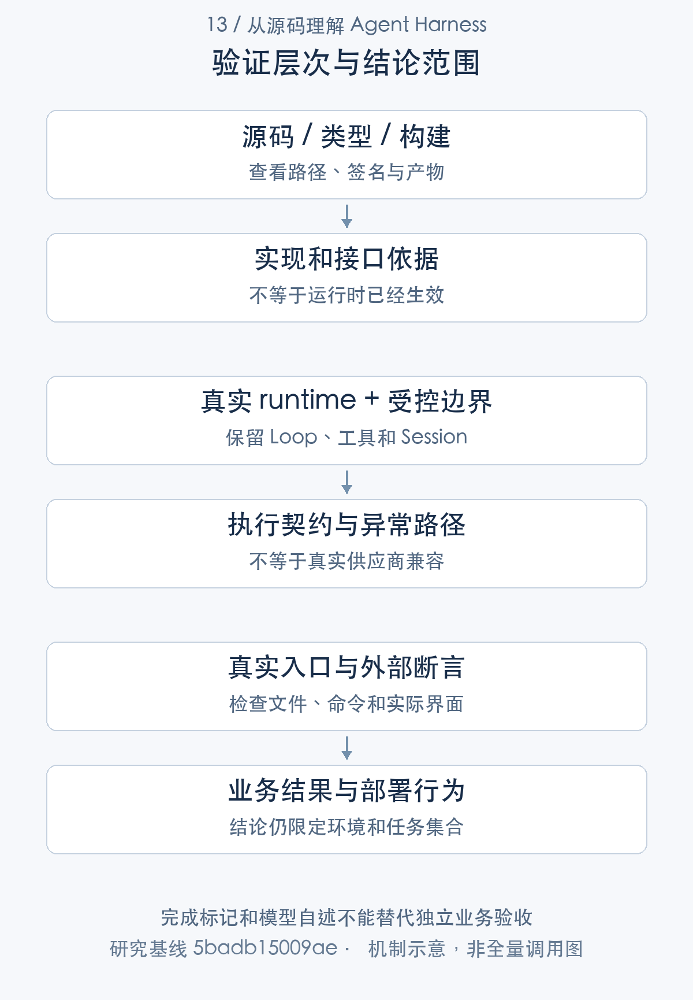

# 如何证明 Agent 运行正确：契约测试与业务验收

> 从源码理解 Agent Harness · 第 13 篇 · 评测与质量保障

一个 Agent 项目所有单元测试都绿了，产品却无法完成最简单的文件修改。这并不一定是测试数量不足，更可能是测试一直检查注册、模拟桥接或模型自述，真正的入口、工具和外部结果从未一起被验证。

DeepSeek Harness 的测试说明强调分层验证、真实组合和检查外部世界。本文结合现有研究中的实际用例，分析**怎样把一个能力声明变成可证伪的工程不变量，再与业务评测分开**。

## 先说明想证明什么

“工具可以使用”可能有多种含义：定义存在、类型正确、注册成功、模型能看到 schema、body 被执行、结果进入后续请求、发布形态能加载，以及真实模型能正确使用它。每一层都需要不同证据。

“Agent 能修复代码”则包含更多业务条件：修改目标文件、测试真正通过、无关文件保持不变，最好还要检查修复是否满足缺陷说明。Loop 正常结束只能证明控制流程，没有独立检查便不能把完成标记当成功率。[任务完成与独立评测](https://github.com/deepseek-ai/deepseek-harness/blob/5badb15009ae1756c3afe0ae0cef1faafc290ccc/packages/goal/goal/README.md#L152-L159) [分层测试与外部断言](https://github.com/deepseek-ai/deepseek-harness/blob/5badb15009ae1756c3afe0ae0cef1faafc290ccc/docs/testing.md#L7-L41)

测试设计第一步应写出待证明结论和失败条件。若故意删除工具 body，测试仍然通过，它便没有证明 body 参与了运行；若模型回复“通过”，测试就接受，它证明的是自述而不是测试命令结果。



## 将昂贵边界替换，保留真实执行链

离线研究可以 mock 模型、网络和时钟等昂贵或不稳定部分，但 registry、Loop、工具执行与状态提交应尽可能真实。否则一个自编调度器配一个自编工具，最终只是证明自己的替身相互配合。

官方说明也区分源代码测试与发布产物测试。workspace paths 指向 src 可以验证源码行为，却不能证明 plain Node 加载已发布 lib 时没有默认导出、依赖副本或模块解析问题。真实入口和打包安装需要自己的验证层。[测试入口与分层规则](https://github.com/deepseek-ai/deepseek-harness/blob/5badb15009ae1756c3afe0ae0cef1faafc290ccc/docs/testing.md#L7-L41)

本研究的 V05 使用真实 Harness runtime、受控模型及两个编译插件。fixture 手工组合 Context 用于扩展机制验证，并非完整产品启动的替代证据；我们没有把它称为发布 profile smoke。

## 一个有意义的工具回流测试

下面用例让受控模型第一次输出 research_sum(2,3)，第二次输出文本。测试检查第二次请求实际收到工具结果，并检查步骤与回合状态。

```typescript
it('executes registered tool and feeds its canonical result into the next real Loop step', async () => {
  const adapter = new ScriptAdapter([sumCall({ a: 2, b: 3 }), text('5')])
  const ctx = await runtime(adapter)
  try {
    const mounted = ctx.plugin(Sum); await mounted
    const handle = await ctx.agents.create({ sessionId: SessionId('research-sum'), agentOptions: { provider: 'mock', model: 'base' } })
    await send(handle.agent, '2 + 3')
    const events = handle.agent.session.snapshotEvents()
    expect(adapter.requests).toHaveLength(2)
    expect(adapter.requests[1]?.messages.some(m => m.role === 'tool' && m.content.some(b => b.type === 'text' && b.text === '5'))).toBe(true)
    expect(events.filter(e => e.type === 'step/start')).toHaveLength(2)
    expect(events.at(-1)).toMatchObject({ type: 'turn/end', data: { reason: { kind: 'completed' } } })
    await handle.dispose()
    await mounted.dispose()
    expect(ctx.tools.get('research_sum')).toBeUndefined()
  } finally { await ctx.fiber.dispose() }
})
```

[研究扩展测试](../validation/examples.spec.ts)。以上为原文片段，仅统一缩进，需结合完整实现阅读。

关键断言不是 mounted 存在，而是 adapter.requests 有两次，第二次 messages 包含 tool 文本 5。这样，参数解析、body、结果规范化、Session 提交和下一步请求派生必须一起成立，才能通过。

用例还检查卸载后工具消失。这使验证覆盖贡献生命周期，而不只是运行效果。生产扩展若卸载仍留注册，会污染新任务；只检查功能正常路径很难发现。

这仍然是受控模型测试。它不能证明真实模型会准确选择工具、供应商接受相同历史格式，也不证明数学以外的任务质量。好的测试边界应当清楚，才可以与其他验证组合。

## 取消测试要检查结算，而不只检查 signal

取消路径等待模型产生部分输出，再 cancel，等待 idle，并断言回合 aborted、存在保留的 assistant 消息且只有一次请求。

```typescript
await partial
handle.agent.cancel({ kind: 'user' })
await handle.agent.whenIdle()
const events = handle.agent.session.snapshotEvents()
expect(events.at(-1)).toMatchObject({ type: 'turn/end', data: { reason: { kind: 'aborted' } } })
expect(events.some(e => e.type === 'assistant/message')).toBe(true)
expect(adapter.requests).toHaveLength(1)
```

[研究扩展测试](../validation/examples.spec.ts)。以上为原文片段，仅统一缩进，需结合完整实现阅读。

如果测试只断言 signal.aborted，就没有证明 Loop 已经收尾，也没有证明可见文本如何保存。这里检查的是用户能够观察的状态与请求次数，更接近运行契约。

同样，timeout 测试应说明下游是否已经静止，job 测试应检查 stopping 到 settled 和配额释放，恢复测试应检查 unknown 结果而不盲目重跑。错误码、事件顺序与资源清理，通常比“方法没有抛错”更有辨别力。[timeout 的等待语义](https://github.com/deepseek-ai/deepseek-harness/blob/5badb15009ae1756c3afe0ae0cef1faafc290ccc/packages/guard/timeout-policy/src/index.ts#L55-L81) [作业清理](https://github.com/deepseek-ai/deepseek-harness/blob/5badb15009ae1756c3afe0ae0cef1faafc290ccc/packages/jobs/jobs-local/src/index.ts#L610-L683) [恢复结果分类](https://github.com/deepseek-ai/deepseek-harness/blob/5badb15009ae1756c3afe0ae0cef1faafc290ccc/packages/core/session/src/repair.ts#L14-L97)

## 用竞争场景验证等待后的状态

插件化 Agent 常在 await 之间改变生命周期。目标 checkpoint 期间暂停、附件准入期间替换 Agent、审批等待时取消，都是比普通成功调用更重要的测试输入。

验证对象应是精确实例与授权身份：旧回调是否仍能推进新目标，旧 handle 是否给被卸载 Agent 排队，迟到批准是否触发 body。不能只检查某个同名服务仍然存在。[目标准入的等待前后校验](https://github.com/deepseek-ai/deepseek-harness/blob/5badb15009ae1756c3afe0ae0cef1faafc290ccc/packages/goal/goal-round-driver/src/index.ts#L350-L459) [SDK 的异步 live 检查](https://github.com/deepseek-ai/deepseek-harness/blob/5badb15009ae1756c3afe0ae0cef1faafc290ccc/packages/sdk/server/src/server.ts#L178-L194)

并非每种问题都要新写一套大测试。先读现有测试与真实实现，选择可以揭露目标不变量的场景；新用例需要在行为发生错误时失败，而不是照着实现字段做一遍镜像检查。

## 业务评测必须检查外部结果

代码修复可以重新运行测试、读取文件、比对未受影响内容，并将结果关联目标 revision 和实际文件版本。文件生成应检查内容与可访问性，而不只搜索 assistant 文本包含“完成”。结构化输出则先检查 schema，再检查业务字段的真实性。[结构化运行契约](https://github.com/deepseek-ai/deepseek-harness/blob/5badb15009ae1756c3afe0ae0cef1faafc290ccc/packages/subagent/subagent-in-process-driver/src/structured.ts#L49-L141) [缺少结构化结果时的失败](https://github.com/deepseek-ai/deepseek-harness/blob/5badb15009ae1756c3afe0ae0cef1faafc290ccc/packages/subagent/subagent-in-process-driver/src/index.ts#L219-L237)

评测还要预先定义任务集合、成功条件、失败分类和环境。不同模型、工具权限、时间预算与输入窗口不能随意混在一个成功率里。没有这些口径，“一次 demo 成功”很难说明系统质量。

异常评测可以加入窗口溢出、网络中断和工具未知结果，但真实外部服务的故障注入必须使用隔离资源。mock 能验证恢复策略的分支，不能证明远端取消和账单结算真的按预期发生。

## benchmark 和测试计数怎样避免误读

官方 continuation benchmark 使用合成后端，适合研究控制循环时间、资源与规模变化，不代表真实模型长任务成功率。性能测试与质量评测的输入、指标和结论应分开。[continuation benchmark 的范围](https://github.com/deepseek-ai/deepseek-harness/blob/5badb15009ae1756c3afe0ae0cef1faafc290ccc/benchmarks/agent-continuation/README.md#L5-L27)

已有研究去重累计 36 文件、1,504 passed、1 条条件 skip，包含仓库用例和一个自编扩展文件。这是选定离线验证，不是全仓覆盖率。最初缺 native flock 的失败及环境修复保留；本轮专栏沿用这些同一提交的结果，没有把旧日志当成新执行。

JSON 中的 suite 数也可能包含 describe 分组，文件数要按实际路径统计；失败批次与复跑成功不能重复累加。测试报告应保留失败、修复、skip 条件与未执行入口，方便读者判断证据强度。

## 优势、不足与技术心得

DSH 的分层测试思想有利于把类型、源码行为、真实组合和业务结果分别验证；事件日志也提供了较多可断言的提交点。优势不在“测试多”，而在容易建立输入到事实的可观察链。

不足是不同入口、构建形态和平台需要持续维护自己的验证，mock 过度使用会让信号变弱；独立业务评测也不会随着单元覆盖自动出现。对外发布指标时，环境与口径同样重要。

我的技术心得是，测试应该针对系统对外承担的义务，而不是针对实现内部恰好存在的字段。正常链证明能力参与，异常链证明边界成立，业务断言证明结果有用。三层都成立，才能更有依据地说“这个 Agent 可用于某类任务”。

本文所有代码引用 V05 已有测试，不是新写未运行示例。真实模型、完整发布安装、浏览器和跨平台安全仍未实测。下一篇会从这些生命周期断言出发，研究扩展如何安全注册、等待依赖和卸载。

---

研究基线：DeepSeek Harness `0.2.1-alpha.1`，提交 `5badb15009ae1756c3afe0ae0cef1faafc290ccc`。源码事实以该版本为准；文中的工程判断和改造建议另行说明。教学场景不代表真实模型业务实测。

源码与运行记录可从[证据索引](../appendices/evidence-index.md)和[验证附录](../appendices/validation.md)复核。本文引用此前同一提交的验证结果，本轮写作不将其重新计为新测试。

[专栏目录](README.md) · [上一篇](12-observability.md) · [下一篇](14-plugin-lifecycle.md)
