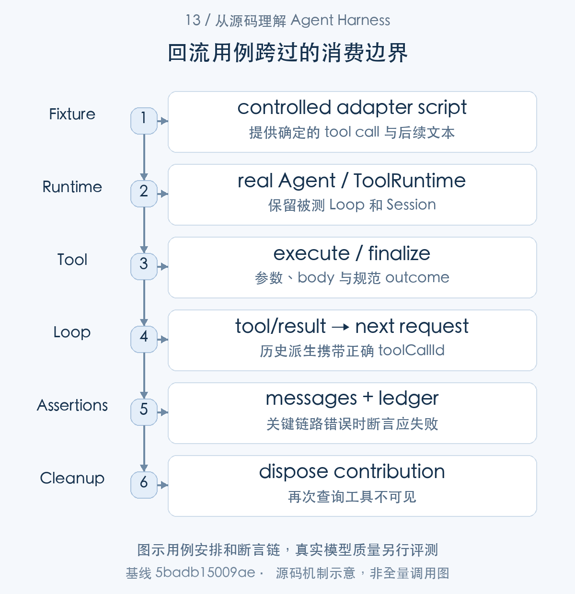
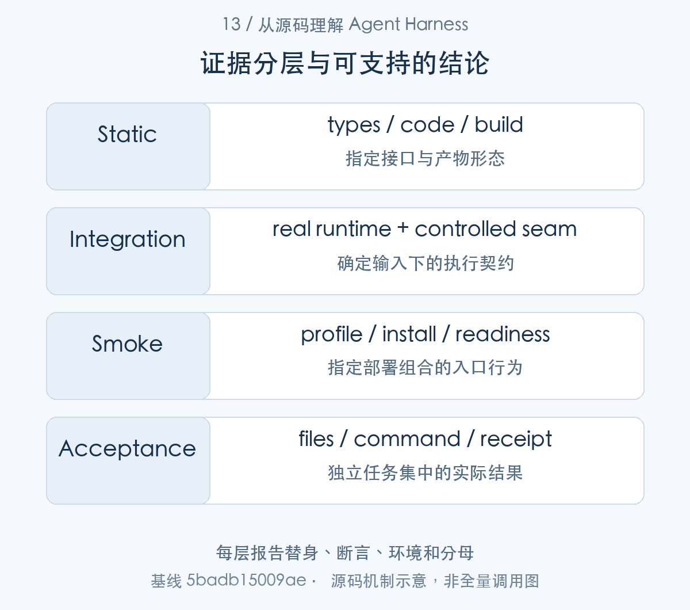
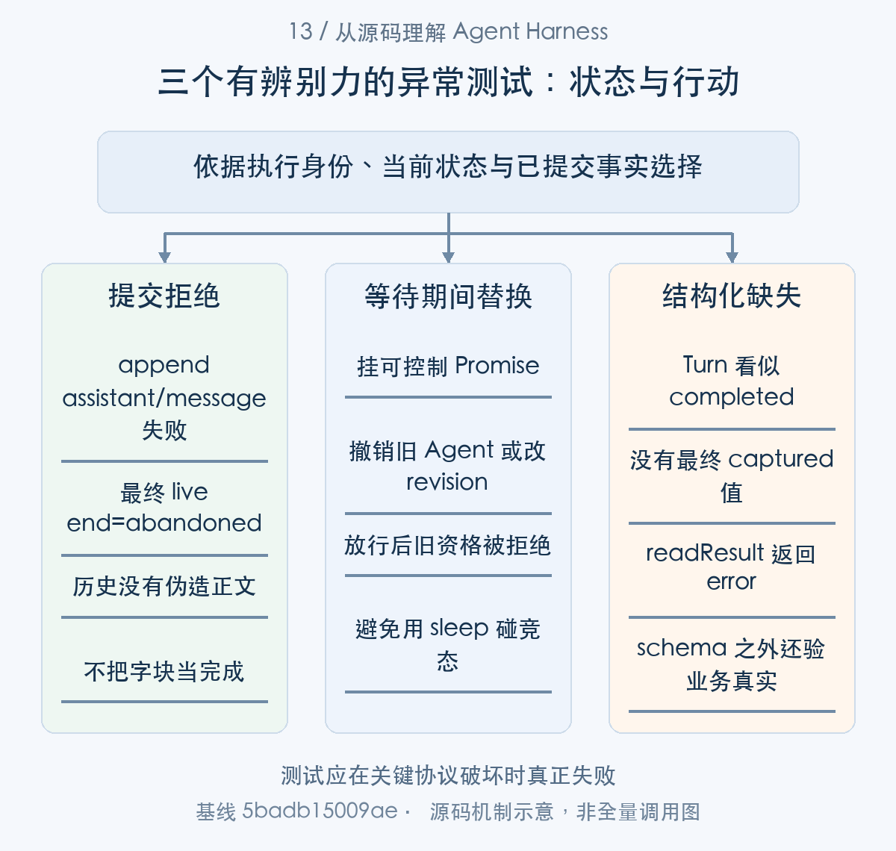

# 如何证明 Agent 运行正确：契约测试与业务验收

> 从源码理解 Agent Harness · 第 13 篇 · 评测与质量保障

一个 Agent 项目所有单元测试都绿了，产品却无法完成最简单的文件修改。这并不一定是测试数量不足，更可能是测试一直检查注册、模拟桥接或模型自述，真正的入口、工具和外部结果从未一起被验证。

DeepSeek Harness 的测试说明强调分层验证、真实组合和检查外部世界。本文结合现有研究中的实际用例，分析**怎样把一个能力声明变成可证伪的工程不变量，再与业务评测分开**。


本文用“声明、执行、提交、断言”组织质量研究。先从官方 Loop 回流用例读出要求，再沿真实工具链找到断言对应的提交点；取消、失败提交和竞争等待验证异常边界；结构化 child 先验 schema，再由业务系统验真实结果。最后将技术测试、发布 smoke 和任务评测分别报告。这不是单次 runtime 的顺序调用，而是一组围绕同一运行契约逐层增加证据的方法。

## 先说明想证明什么

“工具可以使用”可能有多种含义：定义存在、类型正确、注册成功、模型能看到 schema、body 被执行、结果进入后续请求、发布形态能加载，以及真实模型能正确使用它。每一层都需要不同证据。

“Agent 能修复代码”则包含更多业务条件：修改目标文件、测试真正通过、无关文件保持不变，最好还要检查修复是否满足缺陷说明。Loop 正常结束只能证明控制流程，没有独立检查便不能把完成标记当成功率。[任务完成与独立评测](https://github.com/deepseek-ai/deepseek-harness/blob/5badb15009ae1756c3afe0ae0cef1faafc290ccc/packages/goal/goal/README.md#L152-L159) [分层测试与外部断言](https://github.com/deepseek-ai/deepseek-harness/blob/5badb15009ae1756c3afe0ae0cef1faafc290ccc/docs/testing.md#L7-L41)

测试设计第一步应写出待证明结论和失败条件。若故意删除工具 body，测试仍然通过，它便没有证明 body 参与了运行；若模型回复“通过”，测试就接受，它证明的是自述而不是测试命令结果。


图1：每层保存输入、替身、断言与结论范围。先按这张主线图建立对象地图，再结合下面的 caller、数据和返回路径展开。

### 第一步：把能力声明改写为可以失败的断言

从官方测试的最终 expect 开始，找到工具结果回流的消费边界。后面的 fixture、生产代码与故障场景都围绕这项对外义务展开。


```typescript
// two model calls happened (tool-call step, then final step)
expect(adapter.requests).toHaveLength(2)

// the second request's derived history contains the tool result
const secondMessages = adapter.requests[1]!.messages
const toolResultMessage = secondMessages.find(m => m.role === 'tool')
expect(toolResultMessage).toBeDefined()
const message = toolResultMessage!
expect(message).toMatchObject({ toolCallId: 'c1', isError: false })
expect(message.content).toEqual([{ type: 'text', text: 'echo: ping' }])

// session log records call + result
const types = agent.session.snapshotEvents().map(e => e.type)
expect(types).toContain('tool/call')
expect(types).toContain('tool/result')
```

[源码：`packages/core/agent-loop/tests/loop.spec.ts:507–521`](https://github.com/deepseek-ai/deepseek-harness/blob/5badb15009ae1756c3afe0ae0cef1faafc290ccc/packages/core/agent-loop/tests/loop.spec.ts#L507-L521)。

官方回流测试不只检查工具注册，还检查第二次请求中的 toolCallId、isError 和规范文本，以及 ledger call/result。删除 body、丢掉结果或错误派生历史，至少一项断言应失败。这样的测试才跨过了能力的消费边界。

评测前写清输入、外部结果、负向条件与证据来源。对代码修复，输入是缺陷和仓库快照，结果是目标行为与文件变更，负向条件含无关文件损坏。goal.completed 只是其中一个控制事实，不能成为唯一业务断言。


## 将昂贵边界替换，保留真实执行链

第一节明确了需要失败的断言，接下来查看 fixture 怎样保留真实链路。受控模型提供输入，Loop、registry 与 Session 仍承担被验证的行为。

离线研究可以 mock 模型、网络和时钟等昂贵或不稳定部分，但 registry、Loop、工具执行与状态提交应尽可能真实。否则一个自编调度器配一个自编工具，最终只是证明自己的替身相互配合。

官方说明也区分源代码测试与发布产物测试。workspace paths 指向 src 可以验证源码行为，却不能证明 plain Node 加载已发布 lib 时没有默认导出、依赖副本或模块解析问题。真实入口和打包安装需要自己的验证层。[测试入口与分层规则](https://github.com/deepseek-ai/deepseek-harness/blob/5badb15009ae1756c3afe0ae0cef1faafc290ccc/docs/testing.md#L7-L41)

本研究的 V05 使用真实 Harness runtime、受控模型及两个编译插件。fixture 手工组合 Context 用于扩展机制验证，并非完整产品启动的替代证据；我们没有把它称为发布 profile smoke。



图2：图示用例安排和断言链，真实模型质量另行评测。从 caller 的交接对象追到 consumer，具体分支结合正文源码阅读。

### 第二步：受控模型决定输出，真实 Loop 决定流程

断言需要真实链路，fixture 用 MockAdapter 提供确定输出，再让实际 Context、ToolRuntime、Agent.create/send 驱动。timeout fixture 同样保留真实 wrapper，只控制下游停止时机。


```typescript
it('round-trips tool calls: model requests tool → executes → result in next request', async () => {
  const adapter = new MockAdapter([
    toolCallResponse('c1', 'echo', { text: 'ping' }, 'calling echo'),
    textResponse('done'),
  ])
  const ctx = await harness(adapter)
  ctx.tools.register(defineContentToolFixture({
    name: 'echo',
    description: 'echo back',
    parameters: { text: { type: 'string' } },
    async execute(args) {
      return [{ type: 'text', text: `echo: ${args.text}` }]
    },
  }))
  const agent = await ctx.agentLoop.create(SessionId('a1'), { provider: 'mock', model: 'mock' })

  send(agent, 'use the tool')
  await waitForIdle(ctx, agent)
```

[源码：`packages/core/agent-loop/tests/loop.spec.ts:488–506`](https://github.com/deepseek-ai/deepseek-harness/blob/5badb15009ae1756c3afe0ae0cef1faafc290ccc/packages/core/agent-loop/tests/loop.spec.ts#L488-L506)。

MockAdapter 脚本提供工具调用与后续回答；Context、工具注册、Agent create、send 与 waitForIdle 使用真实链路。替换的是不稳定供应商边界，不是所有组件。这能判断 Harness 协议，不能测真实模型选工具的能力。

```typescript
async function setup() {
  const ctx = new Context()
  await ctx.plugin(SystemPrompt)
  await ctx.plugin(ToolRuntime)
  await ctx.plugin(timeoutPolicy)
  return ctx
}

/** A cooperative tool that settles ONLY when its exec.signal aborts (returns text). */
const cooperativeTool = defineContentToolFixture({
  name: 'slow', description: 'stops when aborted', parameters: {}, timeoutMs: 100,
  execute(_args, exec): Promise<{ type: 'text'; text: string }[]> {
    const done = [{ type: 'text' as const, text: 'stopped cooperatively' }]
    if (exec.signal.aborted) return Promise.resolve(done)
    return new Promise((resolve) => { exec.signal.addEventListener('abort', () => { resolve(done) }) })
  },
})

/** A cooperative tool that THROWS its own upstream-abort error when aborted (web-provider shape). */
```

[源码：`packages/guard/timeout-policy/tests/timeout-policy.spec.ts:21–39`](https://github.com/deepseek-ai/deepseek-harness/blob/5badb15009ae1756c3afe0ae0cef1faafc290ccc/packages/guard/timeout-policy/tests/timeout-policy.spec.ts#L21-L39)。

setup 挂载真实 ToolRuntime 与 timeout-policy；cooperativeTool 只在 signal abort 后结算。这个替身保留被测契约“协作停止”，因此能验证等待语义。它也明确排除了不协作的业务实现，不能宣称全部工具都会及时停止。

源码路径测试、编译插件验证与发布入口 smoke 应分开统计。使用 paths 直接加载 src 的绿灯不能证明发布 lib 的依赖和默认导出都正确。

## 一个有意义的工具回流测试

官方 fixture 已说明，下面切到本研究保存的扩展用例，再反查同一协议的生产代码。它们是不同测试文件，但断言共同消费 tool/result 进入下一 request 的事实。

下面用例让受控模型第一次输出 research_sum(2,3)，第二次输出文本。测试检查第二次请求实际收到工具结果，并检查步骤与 Turn 状态。

```typescript
it('executes registered tool and feeds its canonical result into the next real Loop step', async () => {
  const adapter = new ScriptAdapter([sumCall({ a: 2, b: 3 }), text('5')])
  const ctx = await runtime(adapter)
  try {
    const mounted = ctx.plugin(Sum); await mounted
    const handle = await ctx.agents.create({ sessionId: SessionId('research-sum'), agentOptions: { provider: 'mock', model: 'base' } })
    await send(handle.agent, '2 + 3')
    const events = handle.agent.session.snapshotEvents()
    expect(adapter.requests).toHaveLength(2)
    expect(adapter.requests[1]?.messages.some(m => m.role === 'tool' && m.content.some(b => b.type === 'text' && b.text === '5'))).toBe(true)
    expect(events.filter(e => e.type === 'step/start')).toHaveLength(2)
    expect(events.at(-1)).toMatchObject({ type: 'turn/end', data: { reason: { kind: 'completed' } } })
    await handle.dispose()
    await mounted.dispose()
    expect(ctx.tools.get('research_sum')).toBeUndefined()
  } finally { await ctx.fiber.dispose() }
})
```

[研究扩展测试](../validation/examples.spec.ts)。以上为原文片段，仅统一缩进，需结合完整实现阅读。

关键断言不是 mounted 存在，而是 adapter.requests 有两次，第二次 messages 包含 tool 文本 5。这样，参数解析、body、结果规范化、Session 提交和下一步请求派生必须一起成立，才能通过。

用例还检查卸载后工具消失。这使验证覆盖贡献生命周期，而不只是运行效果。生产扩展若卸载仍留注册，会污染新任务；只检查功能正常路径很难发现。

这仍然是受控模型测试。它不能证明真实模型会准确选择工具、供应商接受相同历史格式，也不证明数学以外的任务质量。好的测试边界应当清楚，才可以与其他验证组合。

### 第三步：从测试断言反查实际提交代码

本研究回流用例检查第二 request 与 ledger。这里回到 executeToolCalls() 内部，看 finalize → appendToolResult → acceptContext；这正是断言所跨过的生产链。


```typescript
const commitReady = async (): Promise<void> => {
  while (committed < group.length) {
    const slot = slots[committed]
    if (slot === undefined) break
    const call = group[committed]
    const result = slot.needsPost
      ? await ctx.tools[TOOL_RUNTIME_SCHEDULER].finalize(slot.exec, slot.result)
      : ctx.tools[TOOL_RUNTIME_SCHEDULER].finish(slot.exec, slot.result)
    // oxlint-disable-next-line typescript/no-non-null-assertion -- bounded index
    appendToolResult(session, turn, step, call!.block, result, callSeqs[committed]!)
    for (const context of result.additionalContexts ?? []) acceptContext(context)
    concluded ||= result.concludesTurn === true
    committed++
  }
```

[源码：`packages/core/agent-loop/src/tool-calls.ts:147–160`](https://github.com/deepseek-ai/deepseek-harness/blob/5badb15009ae1756c3afe0ae0cef1faafc290ccc/packages/core/agent-loop/src/tool-calls.ts#L147-L160)。

真实调度器先完成工具 finalize，appendToolResult 后才接纳额外上下文。上面的第二请求断言正好覆盖提交与派生链，远比检查 execute 被 spy 调过一次更强。

```typescript
): void {
  const message = createToolResultMessage({
    callId: block.id,
    content: result.content,
    isError: result.isError,
  })
  session.append('tool/result', {
    turn, step,
    message,
    ...result.error?.info ? { error: result.error.info } : {},
    // The tool's private presentation payload (e.g. a result-time diff),
    // persisted so a UI bridge reproduces the card on replay.
    ...result.meta !== undefined ? { meta: result.meta } : {},
  }, { surfaceOp: 'append', sourceEventSeqs: [callSeq] })
}
```

[源码：`packages/core/agent-loop/src/tool-calls.ts:276–290`](https://github.com/deepseek-ai/deepseek-harness/blob/5badb15009ae1756c3afe0ae0cef1faafc290ccc/packages/core/agent-loop/src/tool-calls.ts#L276-L290)。

result 包含规范消息与错误信息，sourceEventSeqs 指向 callSeq。测试还可以检查这一关联，防止结果配错调用。注意 meta 是展示载荷，不应替代 model-facing content 的断言。

```typescript
ctx.on('agent/request-error', async () => ({ kind: 'retry' as const }))

send(agent, 'retry once')
await waitForIdle(ctx, agent)

expect(frames.map(frame => frame.revision)).toEqual(frames.map((_frame, index) => index + 1))
expect(frames.filter(frame => frame.type === 'start')).toHaveLength(2)
expect(frames.filter(frame => frame.type === 'end').map(frame => (
  frame.outcome.kind === 'committed' ? frame.outcome.eventType : frame.outcome.kind
))).toEqual(['assistant/attempt', 'assistant/message'])
```

[源码：`packages/core/agent-loop/tests/loop.spec.ts:199–208`](https://github.com/deepseek-ai/deepseek-harness/blob/5badb15009ae1756c3afe0ae0cef1faafc290ccc/packages/core/agent-loop/tests/loop.spec.ts#L199-L208)。

重试用例检查连续 live revision、两次 start，以及 assistant/attempt→assistant/message 的结算类型。失败 attempt 未被最终成功覆盖，测试验证的不仅是“最后能回答”。


## 取消测试要检查结算，而不只检查 signal

正常回流跨过提交边界后，还应主动破坏提交或触发取消。下面把 live end、whenIdle 和 scheduler drain 分别变成可观察结果。

取消路径等待模型产生部分输出，再 cancel，等待 idle，并断言 Turn aborted、存在保留的 assistant 消息且只有一次请求。

```typescript
await partial
handle.agent.cancel({ kind: 'user' })
await handle.agent.whenIdle()
const events = handle.agent.session.snapshotEvents()
expect(events.at(-1)).toMatchObject({ type: 'turn/end', data: { reason: { kind: 'aborted' } } })
expect(events.some(e => e.type === 'assistant/message')).toBe(true)
expect(adapter.requests).toHaveLength(1)
```

[研究扩展测试](../validation/examples.spec.ts)。以上为原文片段，仅统一缩进，需结合完整实现阅读。

如果测试只断言 signal.aborted，就没有证明 Loop 已经收尾，也没有证明可见文本如何保存。这里检查的是用户能够观察的状态与请求次数，更接近运行契约。

同样，timeout 测试应说明下游是否已经静止，job 测试应检查 stopping 到 settled 和配额释放，恢复测试应检查 unknown 结果而不盲目重跑。错误码、事件顺序与资源清理，通常比“方法没有抛错”更有辨别力。[timeout 的等待语义](https://github.com/deepseek-ai/deepseek-harness/blob/5badb15009ae1756c3afe0ae0cef1faafc290ccc/packages/guard/timeout-policy/src/index.ts#L55-L81) [作业清理](https://github.com/deepseek-ai/deepseek-harness/blob/5badb15009ae1756c3afe0ae0cef1faafc290ccc/packages/jobs/jobs-local/src/index.ts#L610-L683) [恢复结果分类](https://github.com/deepseek-ai/deepseek-harness/blob/5badb15009ae1756c3afe0ae0cef1faafc290ccc/packages/core/session/src/repair.ts#L14-L97)



图3：每层报告替身、断言、环境和分母。表中对象并列展示用途与寿命，层次之间以源码所示身份关联。

### 第四步：主动让提交失败，检查 UI 不会误报完成

同一提交义务还有失败分支：测试让 append 抛错，live end 应 abandoned。whenIdle 与 scheduler drain 则说明断言何时能够安全读取收束状态，而不只观察 aborted signal。

失败提交测试消费的 live 协议包含明确结算分支：

```typescript
export type AssistantStreamFrame =
  | {
    readonly type: 'start'
    readonly attemptId: LlmAttemptId
    /** Monotone within one attached Agent lifecycle; replacement restarts at 1. */
    readonly revision: number
    readonly turn: number
    readonly step: number
  }
  | {
    readonly type: 'chunk'
    readonly attemptId: LlmAttemptId
    readonly revision: number
    /** Dense zero-based position within the attempt. */
    readonly index: number
    /** Safe-integer timestamp reused by the durable embedded stream. */
    readonly time: number
    readonly chunk: StreamChunk
  }
  | {
    readonly type: 'end'
    readonly attemptId: LlmAttemptId
    readonly revision: number
    /** Number of chunk frames emitted by this attempt. */
    readonly index: number
    /** Durable settlement committed before this notification, or live abandonment without one. */
    readonly outcome:
      | {
        readonly kind: 'committed'
        readonly eventType: 'assistant/message' | 'assistant/attempt'
        readonly seq: SessionSeq
      }
      | { readonly kind: 'abandoned' }
  }
```

[源码：`packages/core/agent/src/runtime-types.ts:128–161`](https://github.com/deepseek-ai/deepseek-harness/blob/5badb15009ae1756c3afe0ae0cef1faafc290ccc/packages/core/agent/src/runtime-types.ts#L128-L161)。

|核心字段|保存的信息|使用位置|
|---|---|---|
|`attemptId` / `revision`|本次输出身份与连续发布位置|重试和重连断言|
|`type` / `index`|start/chunk/end 与 dense chunk 位置|状态变化|
|`outcome.kind` / `seq`|committed 或 abandoned|判断是否真的有 durable settlement|

committed 分支提供 eventType 与 seq；abandoned 没有已提交消息。测试应针对这种外部协议差异，而不依赖私有 buffer 长度。


```typescript
  const append = agent.session.append.bind(agent.session)
  Object.defineProperty(agent.session, 'append', {
    configurable: true,
    value: (...args: Parameters<typeof agent.session.append>): ReturnType<typeof agent.session.append> => {
      if (args[0] === 'assistant/message') throw new Error('settlement rejected')
      return Reflect.apply(append, agent.session, args) as ReturnType<typeof agent.session.append>
    },
  })

  send(agent, 'stream this')
  await waitForIdle(ctx, agent)

  expect(frames.at(-1)).toMatchObject({
    type: 'end',
    outcome: { kind: 'abandoned' },
  })
  expect(agent.session.snapshotEvents().some(event => event.type === 'assistant/message')).toBe(false)
})
```

[源码：`packages/core/agent-loop/tests/loop.spec.ts:133–150`](https://github.com/deepseek-ai/deepseek-harness/blob/5badb15009ae1756c3afe0ae0cef1faafc290ccc/packages/core/agent-loop/tests/loop.spec.ts#L133-L150)。

故意让 assistant/message append 抛错，最终 live end 必须 abandoned，历史不能出现伪造消息。它把观察输出与提交事实的差异变成可执行契约，不会只因看到字块而接受成功。

```typescript
async whenIdle(): Promise<void> {
  let activity: Promise<void>
  do {
    await (activity = this.activityDone)
  } while (activity !== this.activityDone)
}
```

[源码：`packages/core/agent-loop/src/agent.ts:237–242`](https://github.com/deepseek-ai/deepseek-harness/blob/5badb15009ae1756c3afe0ae0cef1faafc290ccc/packages/core/agent-loop/src/agent.ts#L237-L242)。

whenIdle 等待 activity，并在 await 后检查是否换了新的 activity；测试等待的是实际驱动收敛，而不是 signal 已标记。若取消后锁存又唤醒新工作，单次 await 快照可能提前结束。

```typescript

  if (aborted) {
    // Started calls and accepted context settle first; every remaining model
    // call then receives an ordered synthetic result before the turn aborts.
    for (const call of group.slice(started)) appendSkippedToolCall(session, turn, step, call.block)
    return { consumed: group.length, aborted: true, concluded }
  }
  /* v8 ignore next -- unreachable: a non-aborted group commits every started call */
  if (committed !== started) throw new Error('tool-call scheduler: uncommitted settled calls')
  return { consumed: started, aborted: false, concluded }
}

/** Append the durable call/result pair for a model call skipped after cancellation. */
```

[源码：`packages/core/agent-loop/src/tool-calls.ts:237–249`](https://github.com/deepseek-ai/deepseek-harness/blob/5badb15009ae1756c3afe0ae0cef1faafc290ccc/packages/core/agent-loop/src/tool-calls.ts#L237-L249)。

失败要排空 inFlight，取消要为未派发调用补结果。测试应分别断言未开始 body 没有执行、已开始 body 已静止、结果有序、Turn 收尾。资源配额释放也应等对应对象的真实终态。

## 用竞争场景验证等待后的状态

插件化 Agent 常在 await 之间改变生命周期。目标 checkpoint 期间暂停、附件准入期间替换 Agent、审批等待时取消，都是比普通成功调用更重要的测试输入。

验证对象应是精确实例与授权身份：旧回调是否仍能推进新目标，旧 handle 是否给被卸载 Agent 排队，迟到批准是否触发 body。不能只检查某个同名服务仍然存在。[目标准入的等待前后校验](https://github.com/deepseek-ai/deepseek-harness/blob/5badb15009ae1756c3afe0ae0cef1faafc290ccc/packages/goal/goal-round-driver/src/index.ts#L350-L459) [SDK 的异步 live 检查](https://github.com/deepseek-ai/deepseek-harness/blob/5badb15009ae1756c3afe0ae0cef1faafc290ccc/packages/sdk/server/src/server.ts#L178-L194)

并非每种问题都要新写一套大测试。先读现有测试与真实实现，选择可以揭露目标不变量的场景；新用例需要在行为发生错误时失败，而不是照着实现字段做一遍镜像检查。

### 第五步：用可控等待点，而不是靠睡眠碰运气

等待竞争需要控制返回点。SDK durablePromptContent 和 goal pre-step waterfall 都存在 await，测试可在这里撤销旧实例或 revision，再放行并检查原工作不能继续。

竞争测试最终要观察的是 PreStepDecision：

```typescript
export type PreStepDecision =
  | { kind: 'reject' }
  | {
    kind: 'enter'
    messages: UserMessage[]
    /** Start a distinct model-message series before this step's admitted messages. */
    startsRequestSeries?: true
  }
```

[源码：`packages/core/agent/src/runtime-types.ts:112–119`](https://github.com/deepseek-ai/deepseek-harness/blob/5badb15009ae1756c3afe0ae0cef1faafc290ccc/packages/core/agent/src/runtime-types.ts#L112-L119)。

reject 表达没有准入；enter 携带实际接纳 messages，并可开始新 request series。暂停/resume 后旧自动输入应 reject，其他 claimed 输入的恢复也应由公开事实核对。


```typescript
this.assertLiveAgent(rec, params.sessionId)
const content = await durablePromptContent(this.ctx, params.contentBlocks)
// Attachment admission crosses an async boundary where shutdown or an
// agent-loop reload may detach the retained handle.
this.assertLiveAgent(rec, params.sessionId)
const message = createUserMessage({
  content,
  source: { kind: 'user' },
})
rec.handle.agent.followup(message)
return { messageId: message.id }
```

[源码：`packages/sdk/server/src/server.ts:184–194`](https://github.com/deepseek-ai/deepseek-harness/blob/5badb15009ae1756c3afe0ae0cef1faafc290ccc/packages/sdk/server/src/server.ts#L184-L194)。

附件准入前后都 assertLiveAgent。可证伪场景是在 durablePromptContent 等待期间卸载原 Agent，再放行附件处理，断言 followup 不进入旧对象。单纯检验同名 id 存在无法发现实例替换。

```typescript
try {
  valid = validReservation(state, content, source)
} catch (error: unknown) {
  ctx.logger.warn(`goal-round-driver: post-decision check failed for agent "${agent.id}": ${renderThrown(error)}`)
  disarm(state)
  valid = false
}
if (!valid) {
  state.attempt = undefined
  restoreOtherClaimed(agent, decision.messages, submitted.id)
  requestDrive(state)
  return { kind: 'reject' }
}
return { ...decision, startsRequestSeries: true }
```

[源码：`packages/goal/goal-round-driver/src/index.ts:415–428`](https://github.com/deepseek-ai/deepseek-harness/blob/5badb15009ae1756c3afe0ae0cef1faafc290ccc/packages/goal/goal-round-driver/src/index.ts#L415-L428)。

目标准入等待后重查 validReservation。测试可以先挂一个可控制 Promise 的下游治理，在 await 期间 pause/resume 改 revision，再放行并检查旧输入 reject，而其他输入恢复。

这种安排验证的是业务不变量，不是复制每个私有字段。本文说明如何从 consumer 选择竞争窗口；未把这些扩写建议声称为本轮已经新增执行的测试。


## 业务评测必须检查外部结果

并发竞争验证资格有效性，业务评测接下来验证交付内容。结构化 child 的 schema、最终 capture 与业务真实性是三层独立断言。

代码修复可以重新运行测试、读取文件、比对未受影响内容，并将结果关联目标 revision 和实际文件版本。文件生成应检查内容与可访问性，而不只搜索 assistant 文本包含“完成”。结构化输出则先检查 schema，再检查业务字段的真实性。[结构化运行契约](https://github.com/deepseek-ai/deepseek-harness/blob/5badb15009ae1756c3afe0ae0cef1faafc290ccc/packages/subagent/subagent-in-process-driver/src/structured.ts#L49-L141) [缺少结构化结果时的失败](https://github.com/deepseek-ai/deepseek-harness/blob/5badb15009ae1756c3afe0ae0cef1faafc290ccc/packages/subagent/subagent-in-process-driver/src/index.ts#L219-L237)

评测还要预先定义任务集合、成功条件、失败分类和环境。不同模型、工具权限、时间预算与输入窗口不能随意混在一个成功率里。没有这些口径，“一次 demo 成功”很难说明系统质量。

异常评测可以加入窗口溢出、网络中断和工具未知结果，但真实外部服务的故障注入必须使用隔离资源。mock 能验证恢复策略的分支，不能证明远端取消和账单结算真的按预期发生。



图4：测试应在关键协议破坏时真正失败。各分支基于自己的证据返回决定，不按完成文案推断下一动作。

### 第六步：schema 有效与业务真实分两次验收

现在转到结构化交付的 consumer：capture body 校验并 stage，最终 tools/result 决定 capture；readResult() 检查是否满足要求。业务评测再从 captured.value 查询可信结果。

委派评测消费的结果结构把文本与契约交付分开：

```typescript
export interface SubagentResult {
  /**
   * The child's final assistant output is the content of its last non-empty
   * assistant message. Empty-content messages, including usage-only messages,
   * are skipped. Without a non-empty message, the output is its accumulated
   * assistant text stream, or `[]` when the child produced neither.
   */
  readonly output: readonly ContentBlock[]
  /**
   * The structured result after a requested `outputSchema` was successfully
   * satisfied. Requesting a schema does not guarantee presence: a provider can
   * end with `stopReason: 'error'` when the child fails or finishes without a
   * valid capture. The structured value is validated against the requested
   * output schema by the provider; `unknown` here because the seam is
   * schema-agnostic.
   */
  readonly structured?: unknown
  /**
   * Provider-authored, non-assistant failure detail for a non-`completed`
   * result. Providers keep this text free of tool inputs, file contents,
   * environment values, credentials, and raw protocol payloads, and limit it
   * to 4096 UTF-8 bytes. Consumers present it separately from {@link output}.
   */
  readonly diagnostic?: string
  /** Why the run ended. A non-`completed` reason means `output` may be partial. */
  readonly stopReason: SubagentStopReason
}
```

[源码：`packages/subagent/subagent/src/types.ts:271–297`](https://github.com/deepseek-ai/deepseek-harness/blob/5badb15009ae1756c3afe0ae0cef1faafc290ccc/packages/subagent/subagent/src/types.ts#L271-L297)。

|核心字段|保存的信息|使用位置|
|---|---|---|
|`output`|最终或部分 assistant 内容|文本展示与内容断言|
|`structured`|满足要求后的可选结构化值|schema 与业务验收|
|`stopReason` / `diagnostic`|执行结束原因与非模型诊断|失败分类|

请求了 schema 并不保证 structured 存在；readResult() 可以把 completed Turn 但缺少 capture 判为 error。业务真实性仍由独立回执或产物断言负责。


```typescript
execute(args: unknown, exec: ToolRunContext): Promise<{ recorded: true }> {
  const violations = validateJsonSchemaValue(schema, args)
  // ToolArgsError → isError result with INVALID_ARGS: the model retries
  // within the same turn, exactly like a schema-validated defineTool call.
  if (violations.length > 0) throw new ToolArgsError(violations)
  // Two-phase commit, keyed by THIS execution: later transformable
  // waterfalls may still turn the success into an error. ToolRuntime has
  // already frozen model-bound arguments at the actual input boundary.
  staged.set(exec, { value: args })
  exec.concludeTurn()
  return Promise.resolve({ recorded: true })
```

[源码：`packages/subagent/subagent-in-process-driver/src/structured.ts:85–95`](https://github.com/deepseek-ai/deepseek-harness/blob/5badb15009ae1756c3afe0ae0cef1faafc290ccc/packages/subagent/subagent-in-process-driver/src/structured.ts#L85-L95)。

结构化 capture 校验 JSON Schema，然后 stage，concludeTurn 只是停止意图。一个订单号格式符合 schema，不等于订单确实存在；业务评测必须访问可信数据库或回执。

前一个片段是 capture 工具的 body，它只把校验值放入 staged。下面转到同一 attachStructuredRuntime() 安装的 tools/result listener：finalize 通知将同一 exec 交回来，listener 才把 staged 转为最终 captured。

```typescript
childCtx.on('tools/result', function (this: unknown, exec, result) {
  if (exec.name === STRUCTURED_OUTPUT_TOOL) {
    const entry = staged.get(exec)
    if (entry === undefined) return
    staged.delete(exec)
    if (result.isError) return
    if (exec.parent === undefined) {
      /* v8 ignore else -- sequential agent-loop dispatch lets the guard block every later supported call */
      if (captured === undefined) captured = { value: entry.value }
    } else {
      /* v8 ignore else -- PTC mode serializes sub-dispatches, so the guard blocks every later supported call */
      if (captured === undefined && pending === undefined) {
        pending = { parent: exec.parent, value: entry.value }
      }
    }
    return
  }
  if (pending?.parent !== exec.token) return
  const entry = pending
  pending = undefined
  if (result.isError) return
  /* v8 ignore else -- PTC mode serializes outer executions, so the guard blocks every later supported call */
  if (captured === undefined) captured = { value: entry.value }
```

[源码：`packages/subagent/subagent-in-process-driver/src/structured.ts:116–138`](https://github.com/deepseek-ai/deepseek-harness/blob/5badb15009ae1756c3afe0ae0cef1faafc290ccc/packages/subagent/subagent-in-process-driver/src/structured.ts#L116-L138)。

真正 capture 等自己的 tools/result 成功；nested capture 还等父 transport 成功。post 可能把成功改成失败，因此不能在 body 里就接受最终结构化结果。

```typescript
if (structured !== undefined) {
  if (structured.captured !== undefined) {
    return { output, structured: structured.captured.value, stopReason }
  }
  if (stopReason === 'completed') return { output, stopReason: cancelled ? 'aborted' : 'error' }
}
return { output, stopReason }
```

[源码：`packages/subagent/subagent-in-process-driver/src/index.ts:231–237`](https://github.com/deepseek-ai/deepseek-harness/blob/5badb15009ae1756c3afe0ae0cef1faafc290ccc/packages/subagent/subagent-in-process-driver/src/index.ts#L231-L237)。

Turn completed 但没有 captured 结构化结果，readResult 返回 error。这是控制结束与契约交付分开的直接证据。企业评测还需对 captured.value 做业务真实性检查，不能因“结构化”就跳过外部验收。

## benchmark 和测试计数怎样避免误读

官方 continuation benchmark 使用合成后端，适合研究控制循环时间、资源与规模变化，不代表真实模型长任务成功率。性能测试与质量评测的输入、指标和结论应分开。[continuation benchmark 的范围](https://github.com/deepseek-ai/deepseek-harness/blob/5badb15009ae1756c3afe0ae0cef1faafc290ccc/benchmarks/agent-continuation/README.md#L5-L27)

已有研究在初次专栏批次去重累计 36 文件、1,504 passed、1 条条件 skip；企业示例后为37个文件、1520 passed、1个条件 skip，包含上游用例与本地研究扩展。这是选定离线验证，不是全仓覆盖率。最初缺 native flock 的失败及环境修复保留；本轮专栏沿用这些同一提交的结果，没有把旧日志当成新执行。

JSON 中的 suite 数也可能包含 describe 分组，文件数要按实际路径统计；失败批次与复跑成功不能重复累加。测试报告应保留失败、修复、skip 条件与未执行入口，方便读者判断证据强度。

### 第七步：报告输入、分母与限制

最后报告前述各层证据的输入、环境和分母。保存的测试计数描述受控协议验证，任务成功率来自另外定义的任务集与独立验收。


本研究历史验证为37个去重测试文件、1520通过、1个条件跳过，包含上游与本地扩展；这些是固定版本已保存记录，本次文档扩写未新增 runtime 执行。选定用例通过不能外推仓库全部测试都通过。

continuation benchmark 使用合成后端，能观察控制开销与规模，不能测真实长任务成功率。任务评测应报告任务集、模型与配置、重试政策、独立验收方法、成本、时间和失败分布；技术测试数量与业务成功率不能加在同一分母里。

|验证层|能够支持|不能支持|
|---|---|---|
|类型和编译|静态契约与产物生成|真实行为正确|
|受控模型集成|Loop、工具、状态的协议|真实模型任务成功率|
|发布入口 smoke|指定安装组合能启动|全部业务路径正确|
|外部验收任务集|所测任务的实际结果|未测场景与未来版本保证|

## 技术心得：从消费边界建立验证证据

### 从消费边界选择测试断言

第二 request 的工具文本、ledger call/result 和 live end outcome 分别跨过了回流、提交与展示边界。我会优先选择关键链路出错时必然失败的断言，让用例证明一项具体义务。

### 用可控等待重现真实竞争

whenIdle 的循环检查与 validReservation 的等待后复核给出了竞争窗口。测试用受控 Promise 在窗口中撤销资格，再放行并检查公开结果，能够稳定验证旧操作不推进，也方便版本变化后定位原因。

### 将协议证据交给业务验收

SubagentResult 将 output、structured 和 stopReason 分开。评测可以先确认协议交付，再检查具体文件、测试退出码或业务回执；类型、源码集成、发布 smoke 与任务集各自保存范围和分母。

对代码修复，最终收获应是可以复核的行为改变与测试结果。本文展示如何从源码选取支持这项验收的证据；历史记录仍为37个去重文件、1520 passed、1个条件 skip，本轮没有新增 runtime 或真实模型任务评测。

---

研究基线：DeepSeek Harness `0.2.1-alpha.1`，提交 `5badb15009ae1756c3afe0ae0cef1faafc290ccc`。源码事实以该版本为准；文中的工程判断和改造建议另行说明。教学场景不代表真实模型业务实测。

源码与运行记录可从[证据索引](../appendices/evidence-index.md)和[验证附录](../appendices/validation.md)复核。本文引用此前同一提交的验证结果，本轮写作不将其重新计为新测试。

[专栏目录](README.md) · [上一篇](12-observability.md) · [下一篇](14-plugin-lifecycle.md)
