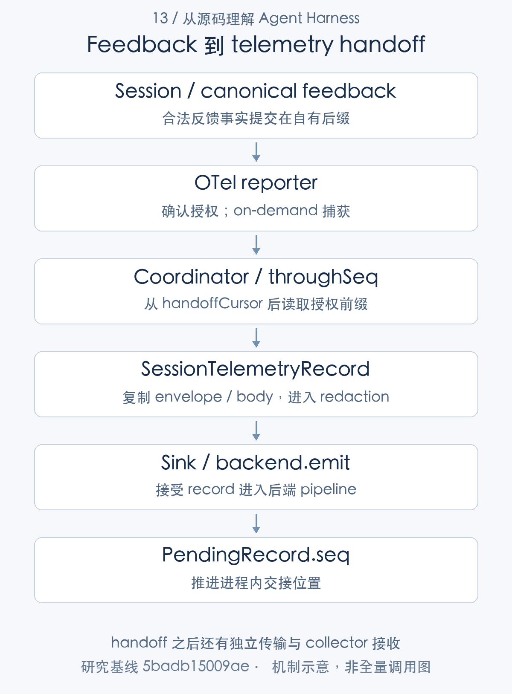
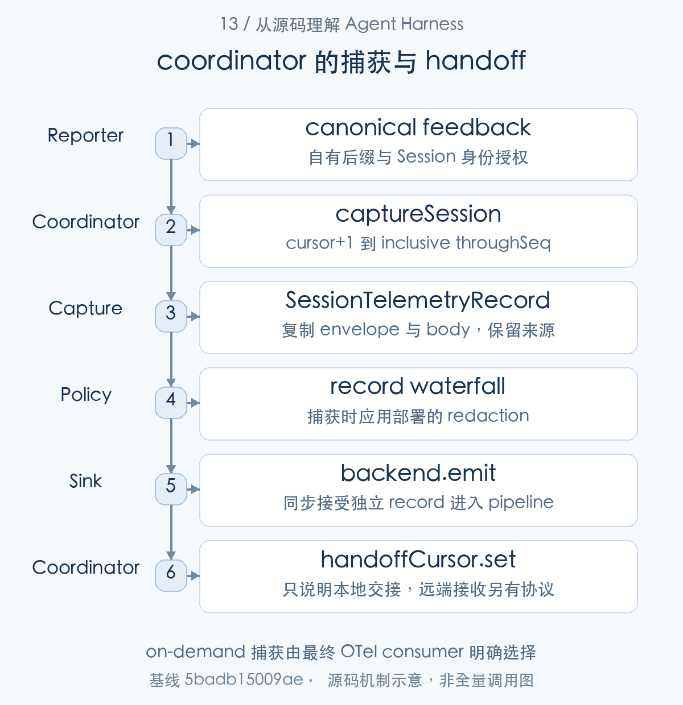
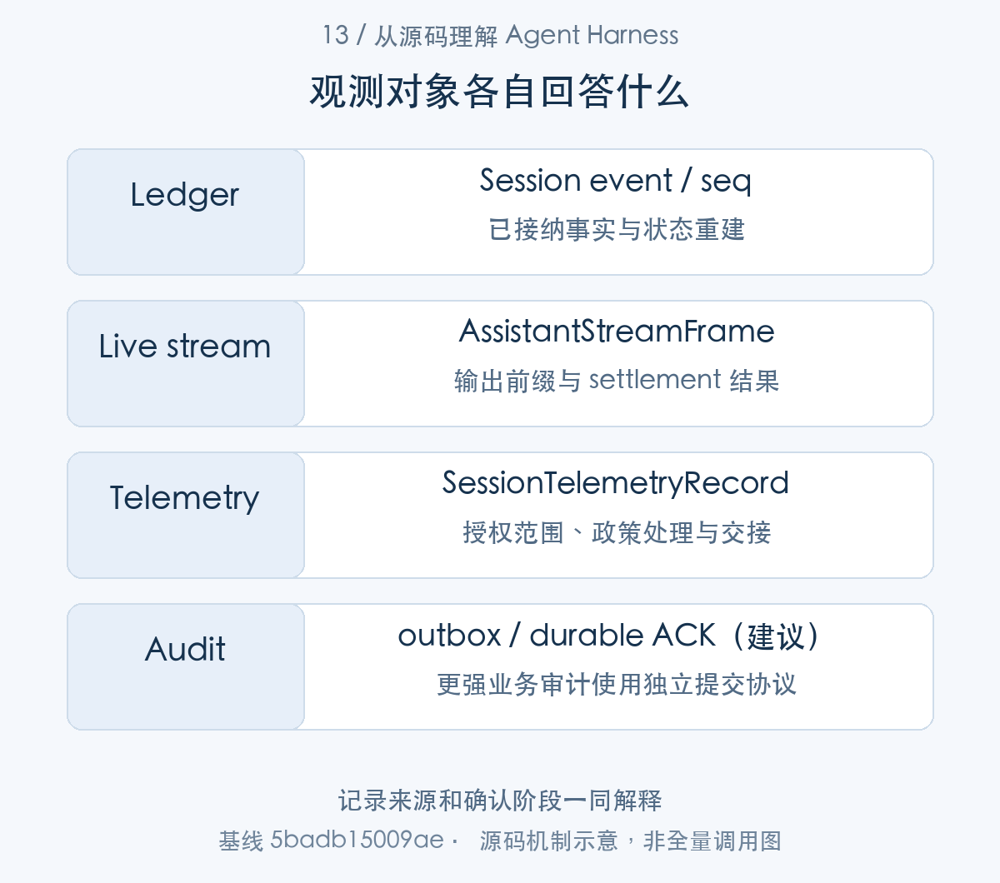
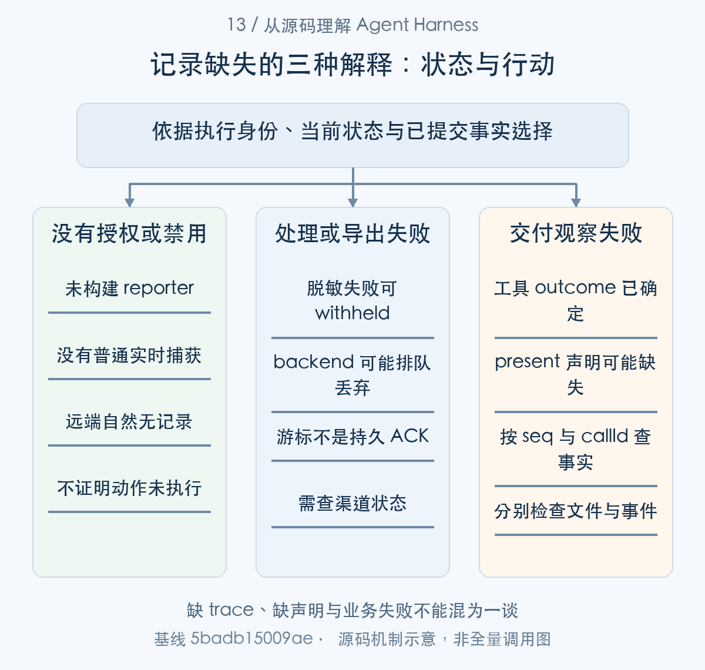

# 如何还原 Agent 的行动：事实日志与反馈授权遥测

> 从源码理解 Agent Harness · 第 13 篇 · 可观测性与审计

用户看到“文件已经生成”，随后却找不到报告。控制台没有异常，远端遥测面板也没有对应记录。此时该相信模型回复、工具结果、交付声明，还是 collector？如果系统没有区分这些信息的产生与交接过程，可观测性反而会制造更多误解。

DeepSeek Harness 将 Session 事实日志、assistant 实时流、Session telemetry 和 product analytics 分开。本文沿一次问题排查解释这些链路，重点分析反馈授权遥测，以及**为什么后端交接成功不等于远端已持久接收**。


整体观测链由本地与外发两部分组成。Session.append() 提交 ledger，assistant stream 独立提供 live frame；默认 OTel reporter 在合法反馈后调用 coordinator.captureSession()，选取授权前缀，复制成 SessionTelemetryRecord，经过 record waterfall 再交给 sink。最后以一次缺失交付调查连接工具 outcome、声明和实际文件。本文逐层区分产生、捕获、交接与接收，说明每条记录可以回答什么。

## 四种记录回答四类问题

Session ledger 记录 Turn、请求、工具、审批与领域事件，用来重建状态和还原操作。assistant live stream 提供低延迟字块与当前 attempt；Session telemetry 将选定记录外发；产品分析则关注自己的启用条件、身份和产品事件。[会话事实追加](https://github.com/deepseek-ai/deepseek-harness/blob/5badb15009ae1756c3afe0ae0cef1faafc290ccc/packages/core/session/src/index.ts#L718-L775) [实时输出结算](https://github.com/deepseek-ai/deepseek-harness/blob/5badb15009ae1756c3afe0ae0cef1faafc290ccc/packages/core/agent-loop/src/assistant-stream.ts#L45-L110) [遥测能力的组合](https://github.com/deepseek-ai/deepseek-harness/blob/5badb15009ae1756c3afe0ae0cef1faafc290ccc/packages/telemetry/otel/src/index.ts#L14-L34) [产品分析上报](https://github.com/deepseek-ai/deepseek-harness/blob/5badb15009ae1756c3afe0ae0cef1faafc290ccc/packages/client/product-analytics/src/index.ts#L76-L100)

一个 collector 不可用，不应推导本地事实停止记录；关闭遥测，也不意味着用户看不到实时输出。反过来，界面显示了一段文本，不代表文本已经进入持久日志，或发送到外部。

把这些职责分开有助于定位问题。先确认本地操作事实，再检查是否有外发授权和捕获，再检查队列及传输。若一开始就只搜索远端日志，可能把“未被授权上传”误判成“工具没有执行”。




图1：handoff 之后还有独立传输与 collector 接收。先按这张主线图建立对象地图，再结合下面的 caller、数据和返回路径展开。

### 第一步：先确定观察对象与提交点

先从 Session.append() 找到 durable 事实的本地接纳点，再切到 AssistantStreamAttempt 的 start/push/settle。两条发布路径在 committed end 的 seq 处关联，abandoned 则没有这一结算。


```typescript
const dataSnapshot = snapshotJsonValue(data)
if (dataSnapshot === undefined) {
  throw new Error(`session event "${type}" carries non-JSON-serializable data`)
}
const surfaceMetadataSnapshot = snapshotJsonValue(surfaceMetadata)
if (surfaceMetadataSnapshot === undefined) {
  throw new Error(`session event "${type}" carries non-JSON-serializable surface metadata`)
}
const entry = attachments.get(this)
if (entry?.appending) {
  throw new Error('session append cannot reenter while another append is being published')
}
const event = deepFreeze({
  type,
  seq: SessionSeq(this.log.length),
  time: Date.now(),
  data: dataSnapshot,
  ...(surfaceMetadataSnapshot as { surfaceOp?: unknown; sourceEventSeqs?: unknown }),
} as unknown as SessionEvent<T>)
validateSessionEventData(event, `session event "${type}" at seq ${event.seq}`)
this.surfaceManager.validateNext(event as SessionEvent)
```

[源码：`packages/core/session/src/index.ts:728–748`](https://github.com/deepseek-ai/deepseek-harness/blob/5badb15009ae1756c3afe0ae0cef1faafc290ccc/packages/core/session/src/index.ts#L728-L748)。

Session.append 快照、检查重入和协议，给事件分配 seq。ledger 适合重建事实，但不是所有 UI 字块都被逐块存入此日志。

```typescript
  this.attemptId = LlmAttemptId(`${sessionId}:${attempt}`)
}

/** Publish the opening marker before the first delivered chunk. */
start(): void {
  this.emit({
    type: 'start',
    attemptId: this.attemptId,
    revision: this.nextRevision(),
    turn: this.turn,
    step: this.step,
  })
}

/** Snapshot one chunk once, then feed durable compaction, assembly, and live publication. */
push(chunk: StreamChunk): void {
  const timed = this.accumulator.push({ time: Date.now(), chunk })
  this.assembler.push(timed.chunk)
  this.emit({
    type: 'chunk',
    attemptId: this.attemptId,
```

[源码：`packages/core/agent-loop/src/assistant-stream.ts:45–65`](https://github.com/deepseek-ai/deepseek-harness/blob/5badb15009ae1756c3afe0ae0cef1faafc290ccc/packages/core/agent-loop/src/assistant-stream.ts#L45-L65)。

实时 attempt 在 start/push 累积并发出展示事件，前缀还没有成为最后 assistant/message。观察到模型正在输出，不能据此认定完整结果已经提交或持久化。

```typescript
    throw error
  }
  this.terminal = true
  this.emit({
    type: 'end',
    attemptId: this.attemptId,
    revision: this.nextRevision(),
    index: this.index,
    outcome: { kind: 'committed', eventType, seq },
  })
}

/** Publish abandonment when no durable attempt event can be committed. */
abandon(): void {
  this.terminal = true
  this.emit({
    type: 'end',
    attemptId: this.attemptId,
    revision: this.nextRevision(),
    index: this.index,
    outcome: { kind: 'abandoned' },
  })
}
```

[源码：`packages/core/agent-loop/src/assistant-stream.ts:87–110`](https://github.com/deepseek-ai/deepseek-harness/blob/5badb15009ae1756c3afe0ae0cef1faafc290ccc/packages/core/agent-loop/src/assistant-stream.ts#L87-L110)。

settle 先 append，再发 committed end；abandon 则结束实时展示而不追加最终消息。两种结束要在客户端区别呈现。产品分析与 telemetry 又是外发渠道，不能由 live stream 直接推断远端有完整审计。


## 默认 Session OTel 为什么不是实时全量追踪

本地提交与实时输出已区分，下面进入外发装配。OTel reporter 选择 capture 模式并解释授权事件，coordinator 只是它调用的通用捕获机制。

base 配置采用反馈授权捕获。OTel reporter 组合通用 coordinator 时明确指定 on-demand 和 includeHistory，而不是持续订阅每个普通事件并自动上报。用户提交新的反馈，才为相应会话前缀提供捕获依据。[默认遥测配置](https://github.com/deepseek-ai/deepseek-harness/blob/5badb15009ae1756c3afe0ae0cef1faafc290ccc/packages/bundle/base/cordis.patch.yml#L188-L216) [反馈授权与捕获](https://github.com/deepseek-ai/deepseek-harness/blob/5badb15009ae1756c3afe0ae0cef1faafc290ccc/packages/session/session-telemetry-otel/src/index.ts#L218-L250)

通用 coordinator 本身支持 live 与 on-demand 两种捕获方式；是否持续观察由消费方选择。把它拥有 live 能力，误写成默认产品持续上传，是忽略配置与 consumer 后容易产生的结论错误。

反馈判定位于 OTel reporter，检查事件是否属于 Session 自有后缀，并检查涉及 Session 身份的反馈类型。

```typescript
function isFeedback(session: Session, event: SessionEvent): boolean {
  if (event.seq < session.inheritedEventCount) return false
  switch (event.type) {
    case 'feedback/record': return true
    case 'feedback/message-put':
    case 'feedback/message-delete': return event.data.sessionId === session.id
    default: return false
  }
}
```

[对应源码](https://github.com/deepseek-ai/deepseek-harness/blob/5badb15009ae1756c3afe0ae0cef1faafc290ccc/packages/session/session-telemetry-otel/src/index.ts#L45-L53)。以上为原文片段，仅统一缩进，需结合完整实现阅读。

fork 继承的旧反馈不能自动成为新 Session 的授权。reporter 还要求通知中的事件确实是 canonical log 中同一对象；直接 emit 一个同名事件，不会替代真正的反馈提交。离线反馈路径也从已提交快照重建并限制捕获边界，不把恢复产生的生命周期标记一并冒充该次提交。[canonical 反馈身份检查](https://github.com/deepseek-ai/deepseek-harness/blob/5badb15009ae1756c3afe0ae0cef1faafc290ccc/packages/session/session-telemetry-otel/src/index.ts#L218-L250)

### 第二步：默认授权规则在 reporter 组合时落地

默认外发由 OTel reporter 的构造和 listener 组合决定：DISABLED 提前结束，合法 feedback 则调用 on-demand coordinator。下面说明装配值与授权检查如何约束捕获。

backend 在组合时决定捕获政策：

```typescript
export interface SessionTelemetryCaptureOptions {
  /** Follow live events, or wait for explicit capture; defaults to live. */
  capture?: SessionTelemetryCapture
  /** Include inherited fork history and stored history from earlier lifecycles; defaults to false. */
  includeHistory?: boolean
}
```

[源码：`packages/session/session-telemetry/src/coordinator.ts:33–38`](https://github.com/deepseek-ai/deepseek-harness/blob/5badb15009ae1756c3afe0ae0cef1faafc290ccc/packages/session/session-telemetry/src/coordinator.ts#L33-L38)。

|核心字段|保存的信息|使用位置|
|---|---|---|
|`capture`|live 或 on-demand|是否连续订阅|
|`includeHistory`|是否包含历史与继承前缀|读取范围|

默认值来自通用 coordinator，但 OTel consumer 显式选择 on-demand 与 includeHistory。阅读最终 consumer 才能确定产品实际行为。


```typescript
constructor(ctx: Context, config: Config) {
  const mode = resolveMode(config.mode)
  super(ctx)
  this.sharing = sharingStatusFor(mode)
  if (mode === SessionTelemetryMode.DISABLED) {
    this.provider = undefined
    this.shutdownTimeoutMillis = DEFAULT_SHUTDOWN_TIMEOUT_MILLIS
    ctx.on('session/event', (session, event) => {
      if (isFeedback(session, event)) ctx.logger.warn(DISABLED_FEEDBACK_WARNING)
    })
    return
  }
```

[源码：`packages/session/session-telemetry-otel/src/index.ts:151–162`](https://github.com/deepseek-ai/deepseek-harness/blob/5badb15009ae1756c3afe0ae0cef1faafc290ccc/packages/session/session-telemetry-otel/src/index.ts#L151-L162)。

DISABLED 提前返回，不构造 reporter；反馈事件只能提示未上传。这是实际运行模式，不应在运维界面隐去，导致用户寻找不存在的远端 trace。

```typescript
const coordinator = new SessionTelemetryCoordinator(ctx, backend, {
  capture: 'on-demand',
  includeHistory: true,
})
ctx.on('session/event', (session, event) => {
  if (!isFeedback(session, event)) return
  // Only the canonical appended event authorizes this exact prefix.
  // oxlint-disable-next-line typescript/no-deprecated -- Existing Session history read; migration deferred.
  if (session.eventAt(event.seq) !== event) {
    ctx.logger.warn(NON_CANONICAL_EVENT_WARNING)
    return
  }
  coordinator.captureSession(session, event.seq)
})
```

[源码：`packages/session/session-telemetry-otel/src/index.ts:218–231`](https://github.com/deepseek-ai/deepseek-harness/blob/5badb15009ae1756c3afe0ae0cef1faafc290ccc/packages/session/session-telemetry-otel/src/index.ts#L218-L231)。

coordinator 明确 on-demand、includeHistory。只有 isFeedback 认可的 canonical 对象才触发 captureSession，直接 emit 同名事件不能获得授权。它是 Session 日志捕获，不是每个普通事件的实时自动上传。

```typescript
  ctx.on('feedback/committed', (inspection) => {
    const snapshot = structuredClone(inspection)
    const committed = snapshot.events.at(-1)
    if (committed === undefined) return
    const session = Session.fromRestore(
      snapshot.meta.id, snapshot.events, snapshot.meta, snapshot.inheritedEventCount,
      'detached', ctx.sessions.messageProjections,
    )
    // fromRestore appends a lifecycle marker that this submission did not commit.
    if (isFeedback(session, committed)) coordinator.captureSession(session, committed.seq)
  })
}

/**
 * Drop direct records. Only a new canonical feedback submission can authorize
 * capture through the private coordinator sink, for every provider.
 * @param _record - the direct record, never uploaded.
 */
emit(_record: SessionTelemetryRecord): void {}
```

[源码：`packages/session/session-telemetry-otel/src/index.ts:232–250`](https://github.com/deepseek-ai/deepseek-harness/blob/5badb15009ae1756c3afe0ae0cef1faafc290ccc/packages/session/session-telemetry-otel/src/index.ts#L232-L250)。

离线 committed inspection 复制后恢复为 detached Session，但捕获止于原 committed.seq，恢复新添的生命周期标记不能混入该次授权。直接 emit 接口不上传，避免绕开反馈边界。

## 捕获的是授权前缀，不是单独反馈文本

reporter 已确认一次授权，captureSession() 接下来确定读取起点与 throughSeq 上限。下面保持在同一捕获调用内部，追踪范围如何转换为逐项记录。

coordinator.captureSession 从已有交接游标后读取日志，限定 throughSeq，逐事件复制和处理。第一次授权可能包含之前的请求、工具与历史上下文，后续对同一活 Session 的捕获再从游标继续。[授权前缀与逐事件捕获](https://github.com/deepseek-ai/deepseek-harness/blob/5badb15009ae1756c3afe0ae0cef1faafc290ccc/packages/session/session-telemetry/src/coordinator.ts#L151-L164)

这意味着用户提交反馈时，隐私范围不仅是那几句反馈文字。应用应根据实际捕获策略决定需要脱敏哪些字段，怎样向用户解释记录范围，以及 collector 如何保留和删除数据。本文没有验证线上保存政策。

游标是以 Session 对象为键的模块级 WeakMap，跟随同一对象的进程内生命周期，有助于 reporter 重挂后避免重复交接；它不是跨重启的 durable ACK 记录。新的对象、新的进程或 detached 恢复不能自然继承这份状态，因此不能承诺全局 exactly-once 外发。[进程内交接游标](https://github.com/deepseek-ai/deepseek-harness/blob/5badb15009ae1756c3afe0ae0cef1faafc290ccc/packages/session/session-telemetry/src/coordinator.ts#L45-L58)



图2：on-demand 捕获由最终 OTel consumer 明确选择。从 caller 的交接对象追到 consumer，具体分支结合正文源码阅读。

### 第三步：游标决定增量，throughSeq 决定授权范围

captureSession() 消费合法授权的 throughSeq，从 handoffCursor 后开始读取。逐事件调用 captureEvent()，每项失败由局部 containment 处理；整段不是原子交接。


```typescript
/**
 * The handoff cursor: per session, the highest `seq` handed to a backend.
 * Deliberately MODULE-scope ambient state — a narrow, documented exception
 * to the registrations-are-effects discipline: cordis has no HMR
 * state-handover API, and keying by the `Session` object (which belongs to
 * the session store and outlives any telemetry fiber) is the only in-process
 * lifetime that lets a re-adopting fiber resume instead of re-handing
 * history. Entries die with their sessions; a missing entry safely means
 * "re-hand everything". Advanced only at emit time — the cursor marks
 * handed-off, not delivered.
 */
const handoffCursor = new WeakMap<Session, SessionSeqCursor>()
```

[源码：`packages/session/session-telemetry/src/coordinator.ts:47–58`](https://github.com/deepseek-ai/deepseek-harness/blob/5badb15009ae1756c3afe0ae0cef1faafc290ccc/packages/session/session-telemetry/src/coordinator.ts#L47-L58)。

handoffCursor 是 Session 对象键的 WeakMap，允许同对象 reporter 重挂后续捕获；新进程或新对象不能自然继承。它表示已交给 backend，不是 durable ACK。

```typescript
captureSession(session: Session, throughSeq?: SessionSeqType): void {
  const start = session.firstLifecycleSeq
  const cursor = handoffCursor.get(session)
    ?? (this.options.includeHistory === true || start === 0 ? -1 : SessionSeq(start - 1))
  // Containment is PER EVENT: one rejected record is withheld fail-closed
  // while the rest of the historical replay proceeds.
  // oxlint-disable-next-line typescript/no-deprecated -- Existing Session history read; migration deferred.
  for (const event of session.snapshotEvents(SessionLogOffset(cursor + 1))) {
    if (throughSeq !== undefined && event.seq > throughSeq) break
    this.contain(() => {
      this.captureEvent(session, event)
    })
  }
}
```

[源码：`packages/session/session-telemetry/src/coordinator.ts:151–164`](https://github.com/deepseek-ai/deepseek-harness/blob/5badb15009ae1756c3afe0ae0cef1faafc290ccc/packages/session/session-telemetry/src/coordinator.ts#L151-L164)。

从 cursor+1 读取 canonical snapshot，在 inclusive throughSeq 停止；每个事件的处理失败独立包含，后续事件可以继续。因此不是全批次原子交接，也不能从最大游标推断每项都已远端保存。

初次授权可能带上之前的请求与工具结果。面向用户的反馈提示应说明捕获范围与脱敏政策，而不是仅写“发送这段意见”。fork 继承的反馈受 inheritedEventCount 限制，不能替新会话授予上传权限。


## 复制、脱敏和交接的真实顺序

选定的每个 canonical event 进入 captureEvent()，从 Session 对象复制为独立 record。脱敏 waterfall 消费副本，backend 接受后才推进交接游标。

captureEvent 对 envelope 与 data 做副本，构造 ledger record，经过 `session-telemetry/record` waterfall，再交给 backend。后端可能稍后序列化，副本避免外部处理直接引用会话对象。脱敏发生在捕获时，on-demand 模式不能把它理解为事件追加时已经清洗。[事件复制与 redaction](https://github.com/deepseek-ai/deepseek-harness/blob/5badb15009ae1756c3afe0ae0cef1faafc290ccc/packages/session/session-telemetry/src/coordinator.ts#L180-L217)

```typescript
  return this.ctx.waterfall('session-telemetry/record', record, () => record)
}

/** Hand one redacted record to the backend, then advance its ledger cursor. */
private deliver(session: Session, pending: PendingRecord): void {
  this.backend.emit(pending.record)
  if (pending.seq !== undefined) handoffCursor.set(session, pending.seq)
}
```

[对应源码](https://github.com/deepseek-ai/deepseek-harness/blob/5badb15009ae1756c3afe0ae0cef1faafc290ccc/packages/session/session-telemetry/src/coordinator.ts#L206-L213)。以上为原文片段，仅统一缩进，需结合完整实现阅读。

默认 next 返回原 record，表示没有附加脱敏规则。存在 seam 不等于部署已经脱敏。规则抛错时，局部 containment 会使该记录被扣留，其他事件可以继续；这同时意味着整段前缀不保证全部抵达。

deliver 先 backend.emit，再更新游标。这个游标只能说明“交给后端”，不能说明 collector 接收、存储、建立索引或满足审计保留。后端本身还有队列额度、请求字节限制和停机期限，最终是 best-effort 外发。[导出容量与停机边界](https://github.com/deepseek-ai/deepseek-harness/blob/5badb15009ae1756c3afe0ae0cef1faafc290ccc/packages/session/session-telemetry-otel/README.md#L30-L80) [ledger、ops 与交接语义](https://github.com/deepseek-ai/deepseek-harness/blob/5badb15009ae1756c3afe0ae0cef1faafc290ccc/docs/subsystems/session-telemetry.md#L24-L60)



图3：记录来源和确认阶段一同解释。表中对象并列展示用途与寿命，层次之间以源码所示身份关联。

### 第四步：捕获时复制，再执行当前脱敏政策

captureEvent() 将 envelope 与 data 复制成 SessionTelemetryRecord，再调用 record waterfall。deliver() 消费其返回值，backend.emit 接受后更新 cursor；后端排队以后还有独立传输。

复制完成后，脱敏与 backend 共用以下 outbound 契约：

```typescript
export interface SessionTelemetryRecord {
  /** Canonical envelope without data; body carries the separately redacted payload. Absent for operational records. */
  sourceEvent?: { sessionId: SessionId; envelope: Omit<SessionEvent, 'data'> }
  /** Ledger (session-log mirror) or ops (operational signal) channel; backends keep the two under separate instrumentation scopes. */
  channel: 'ledger' | 'ops'
  /** Unix epoch milliseconds — the source event's append time for ledger records, the emission time for ops records. */
  time: number
  /** Pre-mapped alerting severity; see {@link SessionTelemetrySeverity}. */
  severity: SessionTelemetrySeverity
  /**
   * Identity attributes, deliberately minimal: ledger records carry
   * `session.id`, `session.format_version`, `event.type`, `event.seq`, plus optional
   * `session.cwd` / `session.parent_id`; a seeded Session also carries
   * `session.seed_length` from its exact inherited event count;
   * ops records carry `telemetry.op`, `session.id`, and (for `agent-error`)
   * `agent.id`, `turn`, `step`, `error.name`. Anything recoverable from the
   * body is intentionally NOT duplicated here.
   */
  attributes: Record<string, string | number>
  /**
   * The complete payload: a deep copy of the session event's `data` for
   * ledger records (JSON-serializable by `Session.append`'s own
   * validation), or the op payload for ops records. Never mutated after
   * handoff.
   */
  body: unknown
}
```

[源码：`packages/session/session-telemetry/src/index.ts:65–91`](https://github.com/deepseek-ai/deepseek-harness/blob/5badb15009ae1756c3afe0ae0cef1faafc290ccc/packages/session/session-telemetry/src/index.ts#L65-L91)。

|核心字段|保存的信息|使用位置|
|---|---|---|
|`sourceEvent` / `channel`|canonical 来源或无 seq 的 ops|来源保留与 ledger/ops 区分|
|`time` / `severity` / `attributes`|时间、严重性和最小身份|后端索引与告警|
|`body`|独立 payload 副本|redaction 与序列化|

ledger 的 envelope 与 body 分开，允许清洗数据而保留来源身份。ops 刻意没有 ledger seq，consumer 不应把它计为同一事件日志。

交给 backend 前，record 与可推进位置包装为 PendingRecord：

```typescript
interface PendingRecord {
  readonly record: SessionTelemetryRecord
  /** Ledger cursor advanced only after the backend accepts this record. */
  readonly seq?: SessionSeqType
}
```

[源码：`packages/session/session-telemetry/src/coordinator.ts:41–45`](https://github.com/deepseek-ai/deepseek-harness/blob/5badb15009ae1756c3afe0ae0cef1faafc290ccc/packages/session/session-telemetry/src/coordinator.ts#L41-L45)。

|核心字段|保存的信息|使用位置|
|---|---|---|
|`record`|经过捕获及政策处理的记录|backend.emit|
|`seq`|可选 ledger 交接位置|emit 成功后的 cursor 更新|

seq 表示本地已交接位置，ops 不提供这个字段。远端接收确认需要自己的协议，不能从该游标推导。


```typescript
private captureEvent(session: Session, event: SessionEvent): void {
  const { data, ...envelope } = event
  this.deliver(session, {
    record: this.redact({
      sourceEvent: { sessionId: session.id, envelope: structuredClone(envelope) },
      channel: 'ledger',
      time: event.time,
      severity: severityOf(event),
      attributes: identityOf(session, event),
      // The canonical event object is mutable and the backend serializes
      // later; append-time validation guarantees this clone cannot throw.
      body: structuredClone(data),
    }),
    seq: event.seq,
  })
}
```

[源码：`packages/session/session-telemetry/src/coordinator.ts:180–195`](https://github.com/deepseek-ai/deepseek-harness/blob/5badb15009ae1756c3afe0ae0cef1faafc290ccc/packages/session/session-telemetry/src/coordinator.ts#L180-L195)。

envelope 和 data structuredClone，来源身份、时间、严重性与属性形成独立 record。backend 可能延迟序列化，副本防止 exporter 引用活会话对象。复制是数据归属措施，不能替代脱敏。

```typescript
/**
 * Run the `session-telemetry/record` waterfall at capture time. The innermost `next`
 * passes the record through unchanged — this package ships no rules; exported
 * data is as clean as the listeners a deployment mounts. Callers run inside
 * {@link contain}, so a throwing rule withholds the record instead of
 * reaching the loop (fail-closed). On-demand capture invokes this waterfall
 * while reading the canonical session log, not when the event was appended.
 */
private redact(record: SessionTelemetryRecord): SessionTelemetryRecord {
  return this.ctx.waterfall('session-telemetry/record', record, () => record)
}
```

[源码：`packages/session/session-telemetry/src/coordinator.ts:197–207`](https://github.com/deepseek-ai/deepseek-harness/blob/5badb15009ae1756c3afe0ae0cef1faafc290ccc/packages/session/session-telemetry/src/coordinator.ts#L197-L207)。

waterfall 默认原样通过，不自带规则。部署挂载哪些 redaction listener，决定外发数据清洁程度；on-demand 使用捕获时的政策，不是事件追加时已经改写了本地日志。

```typescript
const enqueue: SessionTelemetrySink['emit'] = (record) => {
  if (record.sourceEvent === undefined) {
    ctx.logger.warn('Session log record withheld: redaction removed sourceEvent')
    return
  }
  reporter.reportSessionLog({
    sessionId: record.sourceEvent.sessionId,
    event: { ...record.sourceEvent.envelope, data: record.body },
    severityNumber: SEVERITY[record.severity],
    attributes: record.attributes,
  })
}
```

[源码：`packages/session/session-telemetry-otel/src/index.ts:202–213`](https://github.com/deepseek-ai/deepseek-harness/blob/5badb15009ae1756c3afe0ae0cef1faafc290ccc/packages/session/session-telemetry-otel/src/index.ts#L202-L213)。

OTel enqueue 要求 sourceEvent 尚存在，移除则 withholding；否则从 envelope 与 redacted body 重建事件。脱敏可改变 body，却不应伪造来源身份。

```typescript
ctx.effect(() => async () => {
  // Sessions still adopted here are alive through whole-application
  // teardown, so capture the marker before the backend quiesces.
  for (const session of this.adopted) {
    this.contain(() => {
      this.deliver(session, { record: this.redact(shutdownRecord(session)) })
    })
  }
  try {
    await this.backend.shutdown()
  } catch (error) {
    this.ctx.logger.warn(`telemetry: backend shutdown failed: ${String(error)}`)
  }
}, 'telemetry capture')
```

[源码：`packages/session/session-telemetry/src/coordinator.ts:125–138`](https://github.com/deepseek-ai/deepseek-harness/blob/5badb15009ae1756c3afe0ae0cef1faafc290ccc/packages/session/session-telemetry/src/coordinator.ts#L125-L138)。

退出等待 backend.shutdown，失败只警告。原文 deliver 的 backend.emit→游标推进顺序证明的是本地交接；collector 接收、持久存储和审计留存仍是下一层责任。

## 怎样用事件还原一次缺失交付物

外发边界已经说明，下面回到本地调查。tool-present 的通知 observer 与 Loop append 是不同 producer，需要先按身份关联，再比较各自提交位置。

回到报告找不到的例子。先检查批准是否形成 approval/decided，再检查模式变更是否形成 plan/mode，再看工具调用和最终结果，最后单独确认 deliverables/presented。

这些不是固定按名称排列的时序。present 在 tools/result 观察阶段追加声明，可能先于 Loop 记录 tool/result；应按 seq 和 callId 还原过程，而不能先画一条想象顺序再找证据。观察者失败也不改变既定工具 outcome，所以工具成功不能单独证明声明存在。[交付声明提交](https://github.com/deepseek-ai/deepseek-harness/blob/5badb15009ae1756c3afe0ae0cef1faafc290ccc/packages/deliverables/tool-present/src/index.ts#L70-L108) [工具观察者的错误包含](https://github.com/deepseek-ai/deepseek-harness/blob/5badb15009ae1756c3afe0ae0cef1faafc290ccc/packages/core/tools/src/index.ts#L1694-L1713)

本地事实若完整，再检查是否出现授权反馈、捕获上限、脱敏扣留、后端失败或请求丢弃。没有授权记录时，远端没有这一前缀可能正是预期行为，而不是遥测故障。

DSH_TELEMETRY_DISABLED 会提前返回，不构建相应 reporter；产品分析又有独立开关和身份条件。运维界面应显示这些实际模式，避免用户期待每一步都存在远端 trace。[禁用模式的提前退出](https://github.com/deepseek-ai/deepseek-harness/blob/5badb15009ae1756c3afe0ae0cef1faafc290ccc/packages/session/session-telemetry-otel/src/index.ts#L151-L162)

### 第五步：以 seq 和调用身份重建，不先假设名称顺序

现在以缺失文件切到业务调查：工具 finalize 发 tools/result，present observer 可追加声明，Loop 再追加规范 tool/result。不同事实以 callId 和 seq 连接，不按事件名称猜先后。


```typescript
// WeakMap-keyable view.
Object.freeze(exec)
const { name: toolName, callId } = exec
const reportFailure = (error: unknown): void => {
  this.ctx.logger.warn(`tool "${toolName}" (${callId}): tools/result observer failed: ${errorMessage(error)}`)
}
const callbacks = this.ctx.events.dispatch('emit', [
  scopeTarget(this, exec.agent), 'tools/result', exec, result,
])
for (const callback of callbacks) {
  try {
    const returned: unknown = callback(exec, result)
    void Promise.resolve(returned).catch(reportFailure)
  } catch (error: unknown) {
    reportFailure(error)
  }
}
```

[源码：`packages/core/tools/src/index.ts:1697–1713`](https://github.com/deepseek-ai/deepseek-harness/blob/5badb15009ae1756c3afe0ae0cef1faafc290ccc/packages/core/tools/src/index.ts#L1697-L1713)。

tools/result 通知包含同步与 Promise 拒绝，却不 await 异步 observer。工具 outcome 已定，后续展示失败不反向撤销它。

```typescript
ctx.on('tools/result', (exec, result) => {
  const delivery = pending.get(exec)
  pending.delete(exec)
  if (delivery === undefined || result.isError) return
  const { session, turn, files } = delivery
  session.append('deliverables/presented', {
    turn, callId: exec.callId, files,
  })
})
```

[源码：`packages/deliverables/tool-present/src/index.ts:100–108`](https://github.com/deepseek-ai/deepseek-harness/blob/5badb15009ae1756c3afe0ae0cef1faafc290ccc/packages/deliverables/tool-present/src/index.ts#L100-L108)。

present 的 observer 在成功结果上 append deliverables/presented；由于通知位于工具 finalize 内，它可能早于 Loop 的 tool/result。调查应先查 callId、seq、工具 outcome，再查声明和可访问文件，不能按“工具结果之后必有交付”画固定时序。

```typescript
const commitReady = async (): Promise<void> => {
  while (committed < group.length) {
    const slot = slots[committed]
    if (slot === undefined) break
    const call = group[committed]
    const result = slot.needsPost
      ? await ctx.tools[TOOL_RUNTIME_SCHEDULER].finalize(slot.exec, slot.result)
      : ctx.tools[TOOL_RUNTIME_SCHEDULER].finish(slot.exec, slot.result)
    // oxlint-disable-next-line typescript/no-non-null-assertion -- bounded index
    appendToolResult(session, turn, step, call!.block, result, callSeqs[committed]!)
    for (const context of result.additionalContexts ?? []) acceptContext(context)
    concluded ||= result.concludesTurn === true
    committed++
  }
```

[源码：`packages/core/agent-loop/src/tool-calls.ts:147–160`](https://github.com/deepseek-ai/deepseek-harness/blob/5badb15009ae1756c3afe0ae0cef1faafc290ccc/packages/core/agent-loop/src/tool-calls.ts#L147-L160)。

Loop 完成 finalize 后才 append tool/result，再接纳追加上下文。若声明 observer 抛错，工具消息仍可能存在；若 append result 失败，已有声明也不会自动回滚。各条事实分别回答不同问题。


## 审计要求更强时，需要增加什么

本地 ledger、受控捕获和 best-effort 上传适合问题反馈与调试。若业务要求长期强审计，则还要明确持久接收确认、重放去重、保留策略、访问权限、删除义务和用量数据的完整性。这些不能从已有 OTel 类名推出。

可能的改造方向是，将关键审计流写入专用持久通道，保存接收水位并定义重试和去重，再与可选产品遥测分开。它会增加运维与数据治理责任，不能把“全部上传”无条件当作成熟度提升。



图4：缺 trace、缺声明与业务失败不能混为一谈。各分支基于自己的证据返回决定，不按完成文案推断下一动作。

### 第六步：强审计需要新的提交协议

上述 ledger 与 handoff 各自说明了一层提交。若应用需要更强审计，可在可信业务事务建立 outbox、幂等交付与 durable ACK；以下是扩展协议，不能反推默认 reporter 已拥有它。


若要求不可抵赖审计，建议在可信业务入口生成 operationId，把业务变更、回执和 outbox 写入同一事务；独立转发器用稳定记录 id 幂等交付，并保留 durable ACK 与失败重放。这个方案是企业扩展建议，不能写成 OTel 默认保证。

|证据|可支持的结论|不支持的结论|
|---|---|---|
|Session seq|本地有序事实已接纳|业务数据库同时提交|
|handoffCursor|记录已交给 backend|collector 已持久接收|
|OTel 查询|所查记录可见|未查到就证明动作未发生|
|业务回执/outbox|可信事务产生了行动证据|任何消费端都立即可见|

脱敏策略也需要版本化、测试与保留政策。仅修改远端 exporter 不能清理已经保存的本地历史。

## 技术心得：观测信息也有来源和提交语义

### 为观测结论标出所在层

ledger seq、live revision、PendingRecord.seq 和远端查询各自说明一种事实。我的收获是，排错记录要同时写来源和确认阶段；这样缺少远端 trace 时，可以先检查授权和捕获，而不立即否定本地执行。

### 用副本连接来源与政策

SessionTelemetryRecord 将 canonical envelope 与 body 分开，record waterfall 只处理外发副本。企业可据此为脱敏政策建立版本与样例，同时保留可靠关联字段，让调试所需信息和数据治理要求一起落到实现。

### 从一次交付调查组织证据

tool outcome、deliverables/presented 与当前文件分别回答执行、声明和访问问题。以 callId、seq 连接它们，再追踪 handoff 与 sink，能够把用户的一句“文件找不到”转换成具体检查路径。

可观测性的价值在于帮助决定下一步，而非只增加记录数量。本文给出这些记录的真实 producer 和 consumer；本轮保留既有遥测验证，没有新增线上 collector 或强审计实验。

---

研究基线：DeepSeek Harness `0.2.1-alpha.1`，提交 `5badb15009ae1756c3afe0ae0cef1faafc290ccc`。源码事实以该版本为准；文中的工程判断和改造建议另行说明。教学场景不代表真实模型业务实测。

源码与运行记录可从[证据索引](../appendices/evidence-index.md)和[验证附录](../appendices/validation.md)复核。本文引用此前同一提交的验证结果，本轮写作不将其重新计为新测试。

[专栏目录](README.md) · [上一篇](12-budgets.md) · [下一篇](14-evaluation.md)
