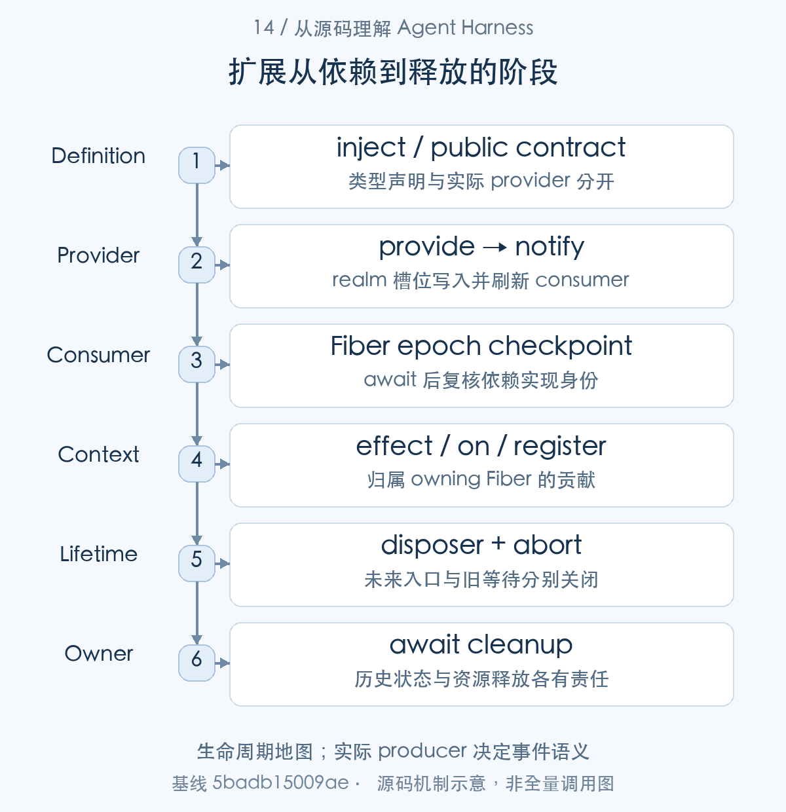
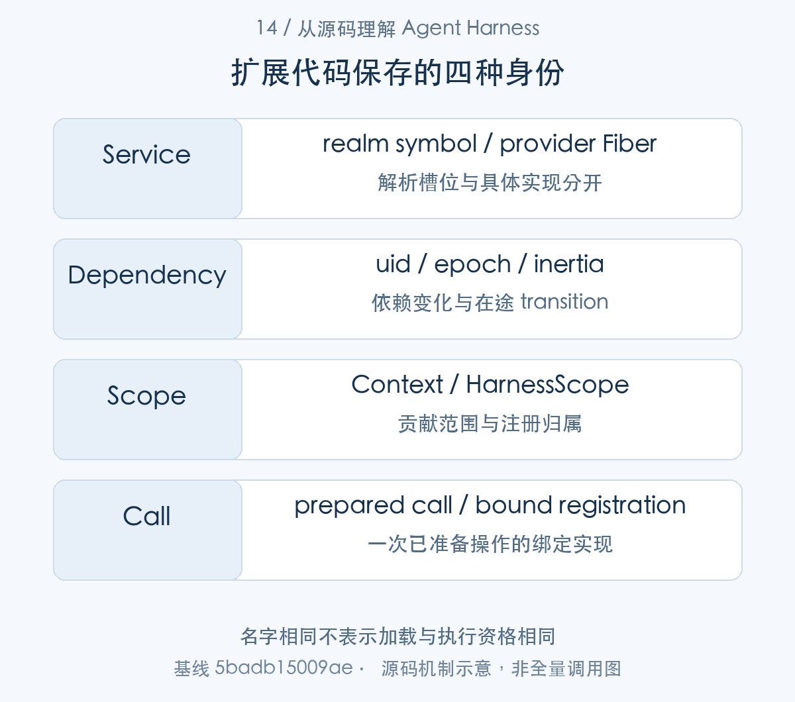
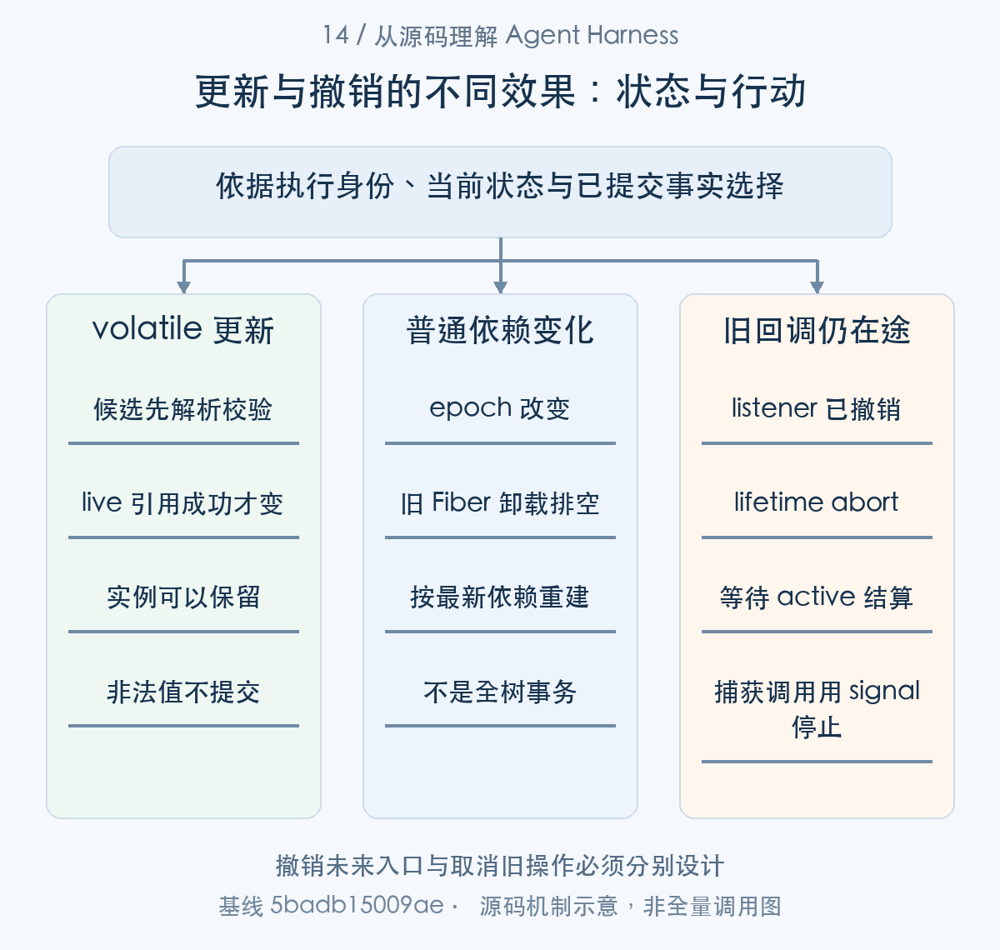

# 插件如何安全参与运行：依赖、事件与生命周期

> 从源码理解 Agent Harness · 第 14 篇 · 扩展机制与生命周期

给 Agent 增加插件时，注册一个 listener 往往只要几行。真正困难的是插件的其余生命周期：依赖尚未准备好怎么办，配置变化是否重建实例，卸载时正在等待的回调怎样停止，注册撤销后历史状态是否还保留？

DeepSeek Harness 用 Cordis 组合服务和插件，Loop 本身也是其中一项能力。本文围绕一个请求路由插件展开，说明**注册、状态和在途工作拥有不同生命周期，安全扩展必须分别管理它们**。


扩展的完整链是：Entry 配置建立 Fiber，provider 通过 realm 提供能力并唤醒依赖 consumer，consumer 注册有控制语义的事件与 effect；依赖变化触发 epoch 复核，卸载等待资源清理。已捕获的 LLM call 与 Session 中已写状态有自己的寿命。本文先沿注册与消费，再沿刷新与释放，最后区分 volatile 配置更新和模块 HMR。

## 一项能力需要定义、提供和消费

服务定义说明调用方可以依赖什么，provider 实现这项能力，consumer 在依赖可用后使用。配置与 Loader 负责把它们组合进具体应用，Context／realm 参与服务解析，Fiber 持有激活与清理状态。[Context 与 realm](https://github.com/deepseek-ai/deepseek-harness/blob/5badb15009ae1756c3afe0ae0cef1faafc290ccc/vendor/cordis/src/context.ts#L70-L145) [服务提供与通知](https://github.com/deepseek-ai/deepseek-harness/blob/5badb15009ae1756c3afe0ae0cef1faafc290ccc/vendor/cordis/src/reflect.ts#L277-L327) [Fiber 生命周期](https://github.com/deepseek-ai/deepseek-harness/blob/5badb15009ae1756c3afe0ae0cef1faafc290ccc/vendor/cordis/src/fiber.ts#L611-L752)

以模型路由插件为例，它消费 agents 与 LLM 请求事件，在 agent/request 改 provider／model，不直接包办适配器和消息存储。它的 effect 拥有 listener，而 Session request/header 另有持久状态。

这一分工支持能力替换，但替换是否安全还依赖 consumer 隐含要求。一个可导入符号、一个 register 方法或一个 disposer，都不能单独证明稳定公共 API、状态兼容或任意时刻热替换。


图1：生命周期地图；具体清理顺序由 owner 代码决定。先按这张主线图建立对象地图，再结合下面的 caller、数据和返回路径展开。

### 第一步：从 provider 到依赖消费者追踪服务身份

provide() 将实现写入 realm store 并记录 owning Fiber，notify() 据 inject 更新 consumer 引用和 refresh。tools.register() 是另一种贡献入口，同样需要正确注册上下文。


```typescript
provide(name: string, value?: any, check?: () => boolean) {
  return this.ctx.fiber.effect(() => {
    if (!this.props[name]) {
      this.props[name] ??= { type: 'service' }
    } else if (this.props[name].type !== 'service') {
      throw new Error(`property "${name}" is already declared as ${this.props[name].type}`)
    }
    this.props[name] = { type: 'service' }

    this.ctx.root[symbols.isolate][name] ??= Symbol(name)
    const key = this.ctx[symbols.isolate][name]
    const impl: Impl = { name, value, fiber: this.ctx.fiber, check }
    if (this.store[key]) {
      throw new Error(`service "${name}" has been registered at <${this.store[key].fiber.name}>`)
    }
    this.store[key] = impl
    this.ctx.fiber.store![name] = impl
    if (this.ctx.fiber.state === FiberState.ACTIVE) {
      this.notify([name])
```

[源码：`vendor/cordis/src/reflect.ts:277–295`](https://github.com/deepseek-ai/deepseek-harness/blob/5badb15009ae1756c3afe0ae0cef1faafc290ccc/vendor/cordis/src/reflect.ts#L277-L295)。

provide 通过 Fiber effect 写入 realm symbol 对应 store，拒绝同槽重复 provider，并记录 owning Fiber。仅 TypeScript interface augmentation 不会提供运行能力；消费者还要等待服务和正确的配置组合。

```typescript
notify(names: string[], filter = (ctx: Context, name: string) => ctx[symbols.isolate][name] === this.ctx[symbols.isolate][name]) {
  const fibers: Fiber[] = []
  for (const runtime of this.ctx.registry.values()) {
    for (const fiber of runtime.fibers) {
      let hasUpdate = false
      for (const name of names) {
        if (!(name in fiber.inject)) continue
        if (!filter(fiber.ctx, name)) continue
        hasUpdate = true
        fiber._checkImpl(name)
      }
      if (!hasUpdate) continue
      fiber._refresh()
      fibers.push(fiber)
```

[源码：`vendor/cordis/src/reflect.ts:314–327`](https://github.com/deepseek-ai/deepseek-harness/blob/5badb15009ae1756c3afe0ae0cef1faafc290ccc/vendor/cordis/src/reflect.ts#L314-L327)。

notify 按 inject 名称与 realm 过滤更新 consumer 的实现引用，并触发 refresh。变化不只影响当前函数查找，还会改变消费者生命周期。替换底层服务前必须考虑哪些插件依赖它、旧实例怎样退出。

```typescript
register(definition: ToolDefinition): () => void {
  const name = definition.name
  const output = (definition as Partial<ToolDefinition>).output
  if (output === undefined || typeof output !== 'object'
    || typeof output.render !== 'function'
    || (output.presentationMeta !== undefined && typeof output.presentationMeta !== 'function')) {
    throw new TypeError(`tool "${name}" must declare output { schema, render, presentationMeta? }`)
  }
  assertSupportedJsonSchema(output.schema)
  const timeoutMs = definition.timeoutMs
  if (timeoutMs !== undefined
    && (!Number.isFinite(timeoutMs) || timeoutMs <= 0)) {
    throw new TypeError(`tool "${name}" timeoutMs must be a positive finite number`)
  }
  // Reserved unconditionally: any agent may select a code mode for itself,
  // so a name free to take under the deployment default would become a
  // collision the moment a preset mounted.
  if (name === RUN_CODE_NAME) {
    throw new Error(`tool name "${RUN_CODE_NAME}" is reserved for the PTC mode presentation transport and cannot be registered or shadowed`)
  }
  return this.layers.effect(
    this.ctx,
    layer => layer.tools.insert(name, definition),
    { label: 'tools.register()' },
  )
```

[源码：`packages/core/tools/src/index.ts:1063–1087`](https://github.com/deepseek-ai/deepseek-harness/blob/5badb15009ae1756c3afe0ae0cef1faafc290ccc/packages/core/tools/src/index.ts#L1063-L1087)。

工具注册验证 schema、render 与 timeout，贡献归属于 registering Context 的层。定义、提供、消费与挂载分别可失败；不能只看工具源码存在就断定某 profile 可使用。


## 事件方式决定了插件的控制权

服务可用之后，consumer 通过事件参与运行。先读 dispatch 的等待与返回协议，再决定 listener 是治理者还是观察者，才能解释 next() 的责任。

Cordis emit 同步通知且不等待 Promise；parallel 用 allSettled 汇总；serial 有序执行并在有效返回值处停止；waterfall 把 next 交给监听者，允许它包装或截断后续行为。[Cordis 的事件调用方式](https://github.com/deepseek-ai/deepseek-harness/blob/5badb15009ae1756c3afe0ae0cef1faafc290ccc/vendor/cordis/src/events.ts#L180-L242)

```typescript
const cbs = this.dispatch('waterfall', args)
const inner = args.pop()
const next = () => {
  const cb = cbs.shift() ?? inner
  return cb(...args)
}
args.push(next)
return next()
```

[对应源码](https://github.com/deepseek-ai/deepseek-harness/blob/5badb15009ae1756c3afe0ae0cef1faafc290ccc/vendor/cordis/src/events.ts#L235-L242)。以上为原文片段，仅统一缩进，需结合完整实现阅读。

waterfall 将监听者和最终 inner 连成 next 链。调用 next 表示委派；不调用 next 表示后续链，包括内置行为，不会执行。对准入、授权和恢复，这可能是有意 veto；对普通观察扩展，无意漏 next 则可能改变整个执行。

因此不能把所有 hooks 都叫 pre／post 后直接套同一编写方式。pre-step、request、request-error 的 payload 与控制语义不同，serial stopping 又有自己的等待责任。扩展作者必须读定义和真实 producer，确认自己的返回值究竟表示什么。

Harness 在 Agent emit、Session observer 和 tools/result 等局部边界包含异常，但这不是 Cordis 全局保证。若某个插件把普通同步 emit 当成自动吞错的异步广播，就可能让错误传播方式与预期不同。[Agent 通知的异常包含](https://github.com/deepseek-ai/deepseek-harness/blob/5badb15009ae1756c3afe0ae0cef1faafc290ccc/packages/core/agent/src/dispatch.ts#L120-L176) [工具结果观察](https://github.com/deepseek-ai/deepseek-harness/blob/5badb15009ae1756c3afe0ae0cef1faafc290ccc/packages/core/tools/src/index.ts#L1694-L1713)

### 第二步：不同 dispatch 模式有不同错误与等待语义

consumer 参与事件后，producer 选择 emit、parallel、serial 或 waterfall。下面从 dispatch 的返回和错误行为追踪 listener 如何委派，以及通知为何不能事后 veto。


```typescript
async parallel(...args: any[]) {
  const results = await Promise.allSettled(this.dispatch('emit', args).map(async cb => cb(...args)))
  const errors = results.filter((result): result is PromiseRejectedResult => result.status === 'rejected')
  if (errors.length) throw new AggregateError(errors.map(error => error.reason))
}

/**
 * Run listeners synchronously without waiting for returned promises.
 *
 * @param args — optional `this`, the event name, then listener arguments.
 */
emit(...args: any[]) {
  this.dispatch('emit', args).map(cb => cb(...args))
}
```

[源码：`vendor/cordis/src/events.ts:183–196`](https://github.com/deepseek-ai/deepseek-harness/blob/5badb15009ae1756c3afe0ae0cef1faafc290ccc/vendor/cordis/src/events.ts#L183-L196)。

parallel 等全部结果并汇总错误；emit 同步调用，不等待 Promise。普通 emit 没有默认吞错保证。Harness 在部分通知边界做 containment，是调用方的决定，不是 Cordis 全局广播属性。

```typescript
async serial(...args: any[]) {
  for (const cb of this.dispatch('serial', args)) {
    const result = await cb(...args)
    if (isBailed(result)) return result
  }
}
```

[源码：`vendor/cordis/src/events.ts:204–209`](https://github.com/deepseek-ai/deepseek-harness/blob/5badb15009ae1756c3afe0ae0cef1faafc290ccc/vendor/cordis/src/events.ts#L204-L209)。

serial 有序 await，遇到 bail 值停止；用于 turn-stopping 的治理时，监听者返回值会影响后续链。选择 serial 意味着等待和顺序本身属于协议。

原文 waterfall 展示了 next 消费回调链。包装器不调用 next 可以截断；await next() 后还能变更结果。因此强制准入放在 waterfall，单纯展示放在通知，不能在 observer 中事后阻止已发生效果。

```typescript
// WeakMap-keyable view.
Object.freeze(exec)
const { name: toolName, callId } = exec
const reportFailure = (error: unknown): void => {
  this.ctx.logger.warn(`tool "${toolName}" (${callId}): tools/result observer failed: ${errorMessage(error)}`)
}
const callbacks = this.ctx.events.dispatch('emit', [
  scopeTarget(this, exec.agent), 'tools/result', exec, result,
])
for (const callback of callbacks) {
  try {
    const returned: unknown = callback(exec, result)
    void Promise.resolve(returned).catch(reportFailure)
  } catch (error: unknown) {
    reportFailure(error)
  }
}
```

[源码：`packages/core/tools/src/index.ts:1697–1713`](https://github.com/deepseek-ai/deepseek-harness/blob/5badb15009ae1756c3afe0ae0cef1faafc290ccc/packages/core/tools/src/index.ts#L1697-L1713)。

tools/result 的局部保护说明通知失败只告警。若希望审计必须完成才能执行业务，这个 best-effort 接缝就不合适，应在可信入口建立事务或预执行规则。

## 资源所有权由注册上下文决定

listener 贡献已经明确，下面追踪它由哪个 Context 创建、进入哪份 Fiber effect。可见范围与释放归属在这里连接，但仍是两种关系。

ctx.on、ctx.provide 和 tools.register 的贡献通过 Fiber effect 归属创建上下文，register 返回 disposer。HarnessScope 再依据事件载体决定可见范围，子作用域可以继承祖先注册，祖先可以观察子事件。[effect 与资源清理](https://github.com/deepseek-ai/deepseek-harness/blob/5badb15009ae1756c3afe0ae0cef1faafc290ccc/vendor/cordis/src/fiber.ts#L418-L550) [作用域关系](https://github.com/deepseek-ai/deepseek-harness/blob/5badb15009ae1756c3afe0ae0cef1faafc290ccc/packages/core/scope/src/index.ts#L1-L180)

例如在 Agent A 的 setup 中挂请求路由，只影响 A 所在 scope；另建 B 不自动得到相同 listener。若错误地在共享 root 注册，它可能影响全部会话。闭包引用 A 并不能替代正确注册归属。

signal 负责在途停止，disposer 负责贡献撤销，scope 负责逻辑可见性。混淆这三项，会使一个插件卸载时仍有旧 Promise 工作，或者取消任务后贡献意外留在新任务中。



图2：生命周期地图；实际 producer 决定事件语义。从 caller 的交接对象追到 consumer，具体分支结合正文源码阅读。

### 第三步：effect 既收集贡献，也定义清理顺序

这些 listener 和 provider 进入注册 Context 的 effect。effect 收集 disposer，Scope 组织贡献可见性，Agent owner cleanup 再按执行依赖停止 driver、释放 scope、关闭存储。

effect 的返回协议说明哪些资源能被框架收集：

```typescript
export type Effect<T = any> =
  | SyncEffect<T>
  | AsyncEffect<T>

type SyncEffect<T = any> =
  | Disposable<T>
  | Iterable<Disposable<T>, void, void>

type AsyncEffect<T = any> =
  | Promise<Disposable<T>>
  | AsyncIterable<Disposable<T>, void, void>
```

[源码：`vendor/cordis/src/fiber.ts:83–93`](https://github.com/deepseek-ai/deepseek-harness/blob/5badb15009ae1756c3afe0ae0cef1faafc290ccc/vendor/cordis/src/fiber.ts#L83-L93)。

单 disposer、Promise、同步或异步 iterable 都进入 effect 管理。generator 按取得顺序 yield 释放函数，框架才能在卸载时加入对应清理；逃逸 Promise 仍需作者自行纳入等待。


```typescript
effect(execute: () => Effect, label = 'anonymous'): any {
  this.assertActive()
  if (this.state === FiberState.UNLOADING) {
    throw new CordisError('INACTIVE_EFFECT')
  }

  const disposables: Disposable[] = []
  let disposing = false
  let disposalTask: void | Promise<void>
  const dispose = () => {
    if (disposing) return disposalTask
    disposing = true
    let task!: void | Promise<void>
    for (const disposable of disposables.splice(0).reverse()) {
      if (task) {
        task = task.then(() => runDisposable(disposable))
      } else {
        const result = runDisposable(disposable)
        if (isObject(result) && 'then' in result) {
          task = result as any
        }
      }
    }
    return disposalTask = task
  }
```

[源码：`vendor/cordis/src/fiber.ts:418–442`](https://github.com/deepseek-ai/deepseek-harness/blob/5badb15009ae1756c3afe0ae0cef1faafc290ccc/vendor/cordis/src/fiber.ts#L418-L442)。

卸载时拒绝新 effect，dispose 从 collected 资源逆序执行，异步 task 串联，重复 dispose 返回同一任务。它把拥有者与释放责任绑定起来；手工把注册存在全局数组会绕开这份生命周期。

```typescript
export function createScope(ctx: Context, key: ScopeKey, options?: CreateScopeOptions): Scope {
  if (options?.parent !== undefined) bindScopeParent(key, options.parent)
  const fiber = ctx.plugin(scope)
  const scoped: Context = fiber.ctx.extend({ [kScope]: key })
  let disposing: Promise<void> | undefined
  return {
    ctx: scoped,
    rawDispose: fiber.dispose,
    dispose: () => (disposing ??= quiesceFiber(fiber)),
  }
```

[源码：`packages/core/scope/src/index.ts:137–146`](https://github.com/deepseek-ai/deepseek-harness/blob/5badb15009ae1756c3afe0ae0cef1faafc290ccc/packages/core/scope/src/index.ts#L137-L146)。

scope 的 Context 继承 owning Fiber，dispose 等 quiesce。贡献可见性沿 scope 链继承，但资源归属注册上下文，不是最后消费它的 Agent。根服务向子 Agent 提供能力时，根和子应各有明确释放对象。

```typescript
  if (machine !== undefined) {
    machine.cancel({ kind: 'disposed' })
    await machine.whenIdle()
    await machine.scope.dispose()
  }
} catch (error: unknown) {
  failures.push(error)
}
// The loop above committed its closing events synchronously into the
// session; handle close drains them durably before releasing the write
// path. The close drain can be the first operation that surfaces a
// durability failure, so its error is retained, not logged away.
try {
  await handle?.close()
} catch (error: unknown) {
  failures.push(error)
```

[源码：`packages/core/agent-loop/src/index.ts:543–558`](https://github.com/deepseek-ai/deepseek-harness/blob/5badb15009ae1756c3afe0ae0cef1faafc290ccc/packages/core/agent-loop/src/index.ts#L543-L558)。

Agent owner 清理先 cancel 和 idle，再 Scope dispose，最后持久 handle close。若先关 provider 再等 body，仍在执行的工具可能访问已释放能力。顺序是正确性约束，不只是代码风格。


## 依赖变化由 epoch 和 Fiber 驱动

effect 定义了释放责任，依赖变化接下来触发 refresh。Fiber 的 epoch 将旧 provider 身份与加载 checkpoint 连接，下面沿 _refresh → _reload/_unload 查看。

Fiber 可以处于等待、加载、活动、失败、卸载等状态。依赖变化更新 epoch，旧加载 checkpoint 若不再对应新 epoch，会被跳过；配置解析也可以等待依赖准备，而不是在缺服务时静默使用另一份默认对象。[依赖刷新与加载状态](https://github.com/deepseek-ai/deepseek-harness/blob/5badb15009ae1756c3afe0ae0cef1faafc290ccc/vendor/cordis/src/fiber.ts#L611-L752)

_reload 失败记录错误并卸载，await 可把启动失败交给调用者。_unload 则等待已注册 disposable；下面片段显示它如何聚合释放。

```typescript
private async _unload() {
  await Promise.all(this._disposables.clear().map(async (dispose) => {
    try {
      await composeError(async (info) => {
        await Promise.resolve()
        info.error = new Error()
        await runDisposable(dispose)
      }, this._runner.getOuterStack)
    } catch (reason) {
      this.ctx.logger.error(reason)
    }
  }))
  this.store = undefined
  this._updateState(() => {
    if (this._runner.epoch === INACTIVE) {
      this.inertia = undefined
    } else {
      this.inertia = this._reload()
      return FiberState.LOADING
    }
  })
}
```

[对应源码](https://github.com/deepseek-ai/deepseek-harness/blob/5badb15009ae1756c3afe0ae0cef1faafc290ccc/vendor/cordis/src/fiber.ts#L675-L696)。以上为原文片段，仅统一缩进，需结合完整实现阅读。

多个顶层 effect 通过 Promise.all 清理，不是全局严格逆序。generator effect 内取得的资源可以逆序释放，但不能据此把整个插件树画成一条确定释放序列。若资源 B 必须在 A 之前释放，应该由同一受控清理流程显式表达依赖，而不是靠注册先后猜测。

AgentHandle 的清理同样有顺序：停止接纳并取消 driver，等待 idle，释放 scope，关闭持久 handle 并排空，最后解除关联。只撤销 registry 不等待使用者，会让仍在执行的 body 触碰已释放服务。[Agent 资源清理](https://github.com/deepseek-ai/deepseek-harness/blob/5badb15009ae1756c3afe0ae0cef1faafc290ccc/packages/core/agent-loop/src/index.ts#L479-L640)



图3：名字相同不表示加载与执行资格相同。表中对象并列展示用途与寿命，层次之间以源码所示身份关联。

### 第四步：依赖版本变化使旧加载结果失效

provider 身份变化后，notify 触发 _refresh() 重算 epoch。_reload() 在异步 checkpoint 后比较 epoch，决定是否仍可激活；_unload() 等待旧 effect，之后按新状态继续。

Fiber 实例保留状态、依赖快照与在途 transition：

```typescript
export class Fiber {
  /** Unique id within the registry; 0 for the root fiber, `null` once disposed. */
  public uid: number | null
  /** The context this fiber's plugin runs in (extends the parent context). */
  public readonly ctx: Context
  /** The validated plugin config (updated by `update()`). */
  public config: any
  /** The raw plugin config, re-resolved before each activation. */
  public _config: any
  /** Current lifecycle state; transitions emit `internal/status`. */
  public state = FiberState.PENDING
  /** Dispose this fiber: unload the plugin, then settle once cleanup finished. */
  public readonly dispose: () => Promise<void>
  /** Snapshot of required service implementations while loaded; `undefined` otherwise. */
  public store: Dict<Impl> | undefined
  /** The in-flight load/unload transition, if one is currently running. */
  public inertia: Promise<void> | undefined
```

[源码：`vendor/cordis/src/fiber.ts:184–200`](https://github.com/deepseek-ai/deepseek-harness/blob/5badb15009ae1756c3afe0ae0cef1faafc290ccc/vendor/cordis/src/fiber.ts#L184-L200)。

|核心字段|保存的信息|使用位置|
|---|---|---|
|`uid` / `state`|实例身份和生命周期|注册与激活检查|
|`store`|加载时依赖实现快照|dependency epoch|
|`inertia` / `dispose`|在途加载卸载与清理完成|refresh 和调用者等待|

这里展示实例字段，epoch 则保存在 EffectRunner 并由 _refresh 计算。名字仍相同的 provider 可能拥有新 uid，因此刷新依据具体实现身份。


```typescript
_refresh() {
  let epoch: string | boolean = false
  epoch = ''
  for (const name of Object.keys(this.inject)) {
    const impl = this._store[name]
    if (!impl) {
      epoch = INACTIVE
      break
    }
    epoch += ':' + impl.fiber.uid
  }
  this._setEpoch(epoch)
}

private _setEpoch(epoch: string) {
  const oldEpoch = this._runner.epoch
  if (epoch === oldEpoch) return
  this._runner.epoch = epoch
  if (this.inertia) return
  this._updateState(() => {
    if (epoch !== INACTIVE && oldEpoch === INACTIVE) {
      this.inertia = this._reload()
      return FiberState.LOADING
    } else {
      this.inertia = this._unload()
      return FiberState.UNLOADING
    }
  })
```

[源码：`vendor/cordis/src/fiber.ts:611–638`](https://github.com/deepseek-ai/deepseek-harness/blob/5badb15009ae1756c3afe0ae0cef1faafc290ccc/vendor/cordis/src/fiber.ts#L611-L638)。

epoch 汇总所依赖 provider Fiber uid；缺失依赖进入 INACTIVE。epoch 改变时选择 reload 或 unload，已有 inertia 则等待当前过程推进。这防止以“服务名字还一样”误认依赖实现未改变。

```typescript
private async _reload() {
  this.store = { ...this._store }
  const oldEpoch = this._runner.epoch
  try {
    await Promise.resolve()
    // A disposer queued before this checkpoint may already have invalidated
    // the load. Do not run plugin code for a stale epoch; the state update
    // below will drain any effects collected while the fiber was PENDING.
    if (this._runner.epoch === oldEpoch) {
      this.config = this._resolveConfig(this._config)
      await this._execute(this._runner)
      this._error = undefined
    }
  } catch (reason) {
    // impl guarantees that the error is non-null (?)
    this.ctx.logger.error(reason)
    this._error = reason
    this._runner.epoch = INACTIVE
  }
  this._updateState(() => {
    if (this._runner.epoch === oldEpoch) {
      this.inertia = undefined
    } else {
      this.inertia = this._unload()
      return FiberState.UNLOADING
    }
  })
```

[源码：`vendor/cordis/src/fiber.ts:646–672`](https://github.com/deepseek-ai/deepseek-harness/blob/5badb15009ae1756c3afe0ae0cef1faafc290ccc/vendor/cordis/src/fiber.ts#L646-L672)。

_reload 保存 oldEpoch，异步 checkpoint 后只有仍匹配才解析配置并执行插件；异常记录后置 INACTIVE，最终若 epoch 已变就转卸载。等待期间换服务，旧加载不会无条件宣布 ACTIVE。

原文 _unload 段与此配对：资源先排空，再依据最新 epoch 重建。插件 apply 若自行启动无法追踪的 Promise，就会让框架的生命周期等待失去完整性。

## listener 撤销之后，路由为何仍然生效

依赖更新影响未来服务解析，已有 prepared call 却已捕获 registration。这里切到运行中的 LLM consumer，解释为什么撤销贡献和停止旧操作需要分别处理。

既有 V05 用例先挂路由插件，将会话配置转到 policy 模型，随后卸载。已有 Agent 的 request/header 仍保存该路由，后续请求可以继续用 policy；新 Agent 则回到当前组合的 base 路由。

这是注册和事实分开的直接结果。disposer 撤销的是 listener 对未来事件的贡献，不会自动抹掉它之前写入 Session 的配置。若产品要求卸载立即改变存量会话，需要显式迁移或更新日志路由，而不是把历史当作可随注册一起删除的临时对象。

同理，已经进入 waterfall 的回调仍可能在 await 后继续。retry 插件卸载会 abort lifetime 并 drain，目标准入前后重查 live 身份，SDK 在附件准入前后重查 Agent。安全扩展必须考虑“撤销之后旧回调还在”的窗口。[恢复插件的卸载排空](https://github.com/deepseek-ai/deepseek-harness/blob/5badb15009ae1756c3afe0ae0cef1faafc290ccc/packages/llm/llm-retry/src/index.ts#L188-L259) [准入的生命周期复核](https://github.com/deepseek-ai/deepseek-harness/blob/5badb15009ae1756c3afe0ae0cef1faafc290ccc/packages/goal/goal-round-driver/src/index.ts#L350-L459) [SDK 的异步实例检查](https://github.com/deepseek-ai/deepseek-harness/blob/5badb15009ae1756c3afe0ae0cef1faafc290ccc/packages/sdk/server/src/server.ts#L178-L194)

### 第五步：已捕获调用与未来查找是两种寿命

现在回到已发起 request 的 LLM consumer。prepareCall() 捕获 registration 与 stream，卸载影响后续查找；retry lifetime 则主动取消并等待已捕获的回调。


```typescript
async prepareCall(config: LlmCallConfig, signal?: AbortSignal): Promise<PreparedLlmCall> {
  const registration = this.registration(config.provider)
  const adapterCall = await registration.adapter.prepareCall(config.provider, config.model, signal)
  const modelInfo = this.normalizeModelInfo(registration, config.model, adapterCall.model)
  const resolved = this.resolveCallWithInfo(config, modelInfo)
  const resolvedConfig = deepFreeze(structuredClone(resolved.config))
  const context = resolved.context === undefined
    ? undefined
    : deepFreeze(structuredClone(resolved.context))
  const adapterDefaults = deepFreeze<LlmCallConfigAdapterDefaults>({
    ...config.reasoningEffort === undefined && resolvedConfig.reasoningEffort !== undefined
      ? { reasoningEffort: true }
      : {},
    ...config.maxTokens === undefined && resolvedConfig.maxTokens !== undefined
      ? { maxTokens: true }
      : {},
  })
  let dispatched = false
```

[源码：`packages/llm/llm/src/index.ts:929–946`](https://github.com/deepseek-ai/deepseek-harness/blob/5badb15009ae1756c3afe0ae0cef1faafc290ccc/packages/llm/llm/src/index.ts#L929-L946)。

prepareCall 在 await 能力查询前捕获 registration；HMR 改未来 route lookup 不会把这次调用的能力和 dispatch 拼成不同 adapter。它保留已准备操作的一致性，不能解释为撤销后所有旧请求都立即禁止。

```typescript
  return Object.freeze({
    config: resolvedConfig,
    retryPolicy: registration.retryPolicy,
    adapterDefaults,
    ...context === undefined ? {} : { context },
    ...modelInfo.inputModalities === undefined
      ? {}
      : { inputModalities: Object.freeze([...modelInfo.inputModalities]) },
    ...modelInfo.systemPromptUpdate === undefined ? {} : { systemPromptUpdate: modelInfo.systemPromptUpdate },
    ...modelInfo.toolUpdate === undefined ? {} : { toolUpdate: modelInfo.toolUpdate },
    stream: (options: GenerateOptions): AsyncIterable<StreamChunk> => {
      if (dispatched) {
        throw new LlmError('a prepared LLM call can only be dispatched once', 'INVALID_PREPARED_CALL')
      }
      if (!callConfigEquals(options, resolvedConfig)) {
        throw new LlmError(
          'prepared LLM call config changed before adapter dispatch',
          'INVALID_PREPARED_CALL',
        )
      }
      dispatched = true
      return this.streamWithRegistration(options, {
        registration,
        config: resolvedConfig,
        modelInfo,
        dispatch: options => adapterCall.stream(options),
      })
    },
  })
}
```

[源码：`packages/llm/llm/src/index.ts:947–977`](https://github.com/deepseek-ai/deepseek-harness/blob/5badb15009ae1756c3afe0ae0cef1faafc290ccc/packages/llm/llm/src/index.ts#L947-L977)。

handle 单次使用、检查调用配置并用已捕获 registration dispatch。注册撤销影响未来入口，捕获调用仍需 signal 控制和结算；撤销与中止必须分开设计。

```typescript
  const disposeListener = ctx.on('agent/request-error', (
    payload,
    next: () => Promise<RequestErrorAction>,
  ) => {
    // A waterfall may have captured this callback before its registration was
    // removed. Lifetime cancellation must prevent that stale callback from
    // entering a downstream policy after disposal.
    if (lifetime.signal.aborted) return Promise.resolve<RequestErrorAction>(undefined)
    return track(recover(payload, next))
  })

  ctx.effect(() => async () => {
    disposeListener()
    lifetime.abort(new Error('llm-retry plugin disposed'))
    await Promise.allSettled([...active])
  }, 'llm-retry: abort and drain active recovery')
}
```

[源码：`packages/llm/llm-retry/src/index.ts:243–259`](https://github.com/deepseek-ai/deepseek-harness/blob/5badb15009ae1756c3afe0ae0cef1faafc290ccc/packages/llm/llm-retry/src/index.ts#L243-L259)。

恢复插件撤 listener、abort lifetime、await active；旧回调入口仍检查 lifetime。这个实现恰好说明“已从列表删除”并不等于“任何旧闭包都不能继续”。await 之后还要重查资格。


## 配置刷新与模块 HMR 不能合并解释

普通配置变化可能更新或重建 Fiber，volatile 字段可以在校验后保留实例。非法候选只警告，不提交 live 引用。profile reconciliation 等待更新与激活审计，但某个兄弟插件失败不保证全树回滚。[配置与 volatile 提交](https://github.com/deepseek-ai/deepseek-harness/blob/5badb15009ae1756c3afe0ae0cef1faafc290ccc/vendor/loader/src/config/entry.ts#L118-L237) [profile 配置重组](https://github.com/deepseek-ai/deepseek-harness/blob/5badb15009ae1756c3afe0ae0cef1faafc290ccc/packages/boot/app-boot/src/index.ts#L274-L302)

模块 HMR 还需要 Loader internal 与 expose-internals，备份缓存、导入 replacement、卸载旧 runtime 并等 Fiber，失败时尝试恢复旧注册。它恢复代码与配置，不恢复已发生外部写入或旧闭包任意业务状态。默认 base 主要监听配置，不能宣传所有源码开箱热更新。[模块局部 reload](https://github.com/deepseek-ai/deepseek-harness/blob/5badb15009ae1756c3afe0ae0cef1faafc290ccc/packages/boot/hmr/src/index.ts#L525-L732) [HMR 条件与串行控制](https://github.com/deepseek-ai/deepseek-harness/blob/5badb15009ae1756c3afe0ae0cef1faafc290ccc/packages/boot/hmr/src/index.ts#L262-L340)



图4：撤销未来入口与取消旧操作必须分别设计。各分支基于自己的证据返回决定，不按完成文案推断下一动作。

### 第六步：volatile 更新与实例重建分别处理

最后从代码寿命转到配置入口：Entry.update() 判断 volatile-only 能否保留 Fiber，先验证候选再提交 live refs。普通更新和模块 HMR 使用另外的重建流程。

部署配置交给 Entry 的结构如下：

```typescript
export interface EntryOptions {
  /** Stable id inside the containing entry tree. */
  id: string
  /** Module specifier imported by the entry tree. */
  name: string
  /** Config passed to the plugin. */
  config?: any
  /** Marks this entry as a nested group. */
  group?: boolean | null
  /** Prevents this entry and descendants from running. */
  disabled?: boolean | null
  /** Required services or service intercept config for this entry. */
  inject?: Inject | null
}
```

[源码：`vendor/loader/src/config/entry.ts:10–23`](https://github.com/deepseek-ai/deepseek-harness/blob/5badb15009ae1756c3afe0ae0cef1faafc290ccc/vendor/loader/src/config/entry.ts#L10-L23)。

|核心字段|保存的信息|使用位置|
|---|---|---|
|`id` / `name`|树内身份与模块 specifier|查找和 import|
|`config` / `inject`|插件参数与服务依赖|配置解析与激活|
|`group` / `disabled`|嵌套关系和运行选择|树组合|

配置对象是候选输入，Fiber.config 才是验证后的实例参数。这个区分解释非法更新为何不立即改变正在运行的能力。


```typescript
  // step 3: check if options are changed
  if (this.fiber?.uid) {
    const changes = Object.keys({ ...this.options, ...legacy })
      .filter(key => !deepEqual(this.options[key], legacy[key], key === 'config'))
    // Only an active fiber in an unchanged context takes volatile-only config changes without a remount.
    const volatileOnly = changes.length === 1 && changes[0] === 'config'
      && this.fiber.state === FiberState.ACTIVE && Object.getPrototypeOf(this.ctx) === this.parent.ctx
      && equalExceptVolatile(legacy.config, this.options.config, this.fiber.runtime?.Config)
    if (volatileOnly) this.fiber._config = this.options.config
    const pending = volatileOnly && this._commitVolatile() ? [] : changes
    if (!pending.length && !force) return
    this.context.emit('loader/partial-dispose', this, legacy, true)
    this._patchContext(pending)
  } else {
    await this.init()
  }
}
```

[源码：`vendor/loader/src/config/entry.ts:141–157`](https://github.com/deepseek-ai/deepseek-harness/blob/5badb15009ae1756c3afe0ae0cef1faafc290ccc/vendor/loader/src/config/entry.ts#L141-L157)。

只有 ACTIVE、上下文不变、变化限于 volatile 配置时才保留实例；否则走普通生命周期。不能把所有配置更新称作在线无损切换。

```typescript
private _commitVolatile(): boolean {
  const fiber = this.fiber!
  const refs = volatileEntries(fiber.config)
  if (!refs.length) return true
  const raw = this.options.config
  let candidate: unknown
  try {
    candidate = resolveConfig(fiber.runtime!, fiber.ctx.waterfall(fiber, 'internal/config', raw, () => raw))
  } catch (error) {
    this.ctx.logger.warn('volatile config update failed for %C', this.options.id)
    this.ctx.logger.warn(error)
    return true
  }
  if (!deepEqual(fiber.config, candidate, true)) {
    this.ctx.logger.debug('ordinary config values of %C changed with its volatile values; applying the ordinary update', this.options.id)
    return false
  }
  const paths = refs.flatMap(({ path, ref }) => {
    const source = path.reduce<unknown>((value, key) => Reflect.get(value as object, key), candidate) as Volatile<unknown>
    if (deepEqual(ref.get(), source.get(), true)) return []
    updateVolatile(ref, source)
    return [path]
```

[源码：`vendor/loader/src/config/entry.ts:164–185`](https://github.com/deepseek-ai/deepseek-harness/blob/5badb15009ae1756c3afe0ae0cef1faafc290ccc/vendor/loader/src/config/entry.ts#L164-L185)。

候选先解析校验，失败只警告、live refs 不变；普通字段也变则返回 false 走重建。raw 候选保留不等于 live 已提交，产品应区分配置文件内容与生效值。

模块 HMR 另有缓存备份、replacement 导入、旧 Fiber 排空与失败恢复。两种更新都不能回滚已发生业务副作用，文章第16篇继续沿产品入口和迁移细化。

## 技术心得：扩展契约覆盖注册、状态与清理

### 同时定义贡献、事实与在途工作

listener/disposer、request/header 与 PreparedLlmCall 分别属于三种寿命。我会为扩展分别列出注册项、已写状态和等待对象，再把撤销、迁移与取消排空放到对应位置。

### 让类型说明控制与等待责任

waterfall 的 next、effect 的 disposer 和 Fiber.inertia 都是可执行的协作契约。插件说明可以直接沿这些类型写出何时委派、怎样返回、谁等待清理，比只列 hook 名称更便于维护。

### 在更新时继续验证同一身份

provider uid、epoch checkpoint 与 prepared registration 让异步执行保持具体归属。新增扩展时沿用这份原则，既能解释旧调用如何完成，也能说明新实例何时取得能力。

一个可维护的路由插件，不仅会改 provider/model，也会说明历史状态如何保留、等待怎样停止、dispose 何时完成。本文沿固定版本源码给出这份完整责任；本轮未新增第三方插件兼容或动态升级实验。

---

研究基线：DeepSeek Harness `0.2.1-alpha.1`，提交 `5badb15009ae1756c3afe0ae0cef1faafc290ccc`。源码事实以该版本为准；文中的工程判断和改造建议另行说明。教学场景不代表真实模型业务实测。

源码与运行记录可从[证据索引](../appendices/evidence-index.md)和[验证附录](../appendices/validation.md)复核。本文引用此前同一提交的验证结果，本轮写作不将其重新计为新测试。

[专栏目录](README.md) · [上一篇](13-evaluation.md) · [下一篇](15-interaction-deliverables.md)
