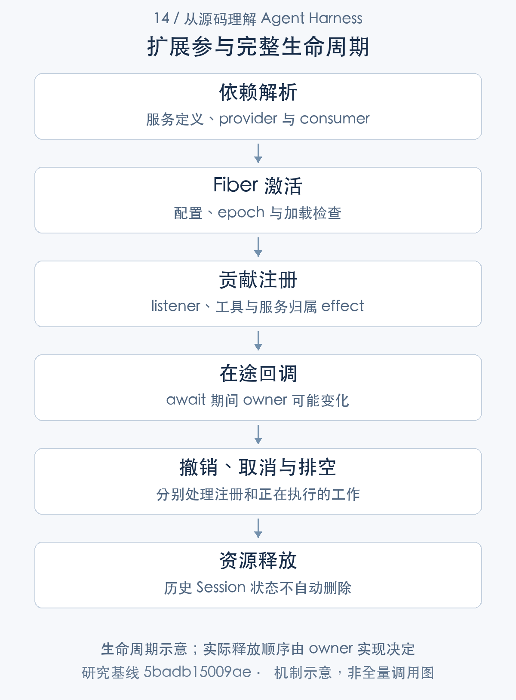

# 插件如何安全参与运行：依赖、事件与生命周期

> 从源码理解 Agent Harness · 第 14 篇 · 扩展机制与生命周期

给 Agent 增加插件时，注册一个 listener 往往只要几行。真正困难的是插件的其余生命周期：依赖尚未准备好怎么办，配置变化是否重建实例，卸载时正在等待的回调怎样停止，注册撤销后历史状态是否还保留？

DeepSeek Harness 用 Cordis 组合服务和插件，Loop 本身也是其中一项能力。本文围绕一个请求路由插件展开，说明**注册、状态和在途工作拥有不同生命周期，安全扩展必须分别管理它们**。

## 一项能力需要定义、提供和消费

服务定义说明调用方可以依赖什么，provider 实现这项能力，consumer 在依赖可用后使用。配置与 Loader 负责把它们组合进具体应用，Context／realm 参与服务解析，Fiber 持有激活与清理状态。[Context 与 realm](https://github.com/deepseek-ai/deepseek-harness/blob/5badb15009ae1756c3afe0ae0cef1faafc290ccc/vendor/cordis/src/context.ts#L70-L145) [服务提供与通知](https://github.com/deepseek-ai/deepseek-harness/blob/5badb15009ae1756c3afe0ae0cef1faafc290ccc/vendor/cordis/src/reflect.ts#L277-L327) [Fiber 生命周期](https://github.com/deepseek-ai/deepseek-harness/blob/5badb15009ae1756c3afe0ae0cef1faafc290ccc/vendor/cordis/src/fiber.ts#L611-L752)

以模型路由插件为例，它消费 agents 与 LLM 请求事件，在 agent/request 改 provider／model，不直接包办适配器和消息存储。它的 effect 拥有 listener，而 Session request/header 另有持久状态。

这一分工支持能力替换，但替换是否安全还依赖 consumer 隐含要求。一个可导入符号、一个 register 方法或一个 disposer，都不能单独证明稳定公共 API、状态兼容或任意时刻热替换。



## 事件方式决定了插件的控制权

Cordis emit 同步通知且不等待 Promise；parallel 用 allSettled 汇总；serial 有序执行并在有效返回值处停止；waterfall 把 next 交给监听者，允许它包装或截断后续行为。[Cordis 的事件调用方式](https://github.com/deepseek-ai/deepseek-harness/blob/5badb15009ae1756c3afe0ae0cef1faafc290ccc/vendor/cordis/src/events.ts#L180-L242)

```typescript
const cbs = this.dispatch('waterfall', args)
const inner = args.pop()
const next = () => {
  const cb = cbs.shift() ?? inner
  return cb(...args)
}
args.push(next)
return next()
```

[对应源码](https://github.com/deepseek-ai/deepseek-harness/blob/5badb15009ae1756c3afe0ae0cef1faafc290ccc/vendor/cordis/src/events.ts#L235-L242)。以上为原文片段，仅统一缩进，需结合完整实现阅读。

waterfall 将监听者和最终 inner 连成 next 链。调用 next 表示委派；不调用 next 表示后续链，包括内置行为，不会执行。对准入、授权和恢复，这可能是有意 veto；对普通观察扩展，无意漏 next 则可能改变整个执行。

因此不能把所有 hooks 都叫 pre／post 后直接套同一编写方式。pre-step、request、request-error 的 payload 与控制语义不同，serial stopping 又有自己的等待责任。扩展作者必须读定义和真实 producer，确认自己的返回值究竟表示什么。

Harness 在 Agent emit、Session observer 和 tools/result 等局部边界包含异常，但这不是 Cordis 全局保证。若某个插件把普通同步 emit 当成自动吞错的异步广播，就可能让错误传播方式与预期不同。[Agent 通知的异常包含](https://github.com/deepseek-ai/deepseek-harness/blob/5badb15009ae1756c3afe0ae0cef1faafc290ccc/packages/core/agent/src/dispatch.ts#L120-L176) [工具结果观察](https://github.com/deepseek-ai/deepseek-harness/blob/5badb15009ae1756c3afe0ae0cef1faafc290ccc/packages/core/tools/src/index.ts#L1694-L1713)

## 资源所有权由注册上下文决定

ctx.on、ctx.provide 和 tools.register 的贡献通过 Fiber effect 归属创建上下文，register 返回 disposer。HarnessScope 再依据事件载体决定可见范围，子作用域可以继承祖先注册，祖先可以观察子事件。[effect 与资源清理](https://github.com/deepseek-ai/deepseek-harness/blob/5badb15009ae1756c3afe0ae0cef1faafc290ccc/vendor/cordis/src/fiber.ts#L418-L550) [作用域关系](https://github.com/deepseek-ai/deepseek-harness/blob/5badb15009ae1756c3afe0ae0cef1faafc290ccc/packages/core/scope/src/index.ts#L1-L180)

例如在 Agent A 的 setup 中挂请求路由，只影响 A 所在 scope；另建 B 不自动得到相同 listener。若错误地在共享 root 注册，它可能影响全部会话。闭包引用 A 并不能替代正确注册归属。

signal 负责在途停止，disposer 负责贡献撤销，scope 负责逻辑可见性。混淆这三项，会使一个插件卸载时仍有旧 Promise 工作，或者取消任务后贡献意外留在新任务中。

## 依赖变化由 epoch 和 Fiber 驱动

Fiber 可以处于等待、加载、活动、失败、卸载等状态。依赖变化更新 epoch，旧加载 checkpoint 若不再对应新 epoch，会被跳过；配置解析也可以等待依赖准备，而不是在缺服务时静默使用另一份默认对象。[依赖刷新与加载状态](https://github.com/deepseek-ai/deepseek-harness/blob/5badb15009ae1756c3afe0ae0cef1faafc290ccc/vendor/cordis/src/fiber.ts#L611-L752)

_reload 失败记录错误并卸载，await 可把启动失败交给调用者。_unload 则等待已注册 disposable；下面片段显示它如何聚合释放。

```typescript
private async _unload() {
  await Promise.all(this._disposables.clear().map(async (dispose) => {
    try {
      await composeError(async (info) => {
        await Promise.resolve()
        info.error = new Error()
        await runDisposable(dispose)
      }, this._runner.getOuterStack)
    } catch (reason) {
      this.ctx.logger.error(reason)
    }
  }))
  this.store = undefined
  this._updateState(() => {
    if (this._runner.epoch === INACTIVE) {
      this.inertia = undefined
    } else {
      this.inertia = this._reload()
      return FiberState.LOADING
    }
  })
}
```

[对应源码](https://github.com/deepseek-ai/deepseek-harness/blob/5badb15009ae1756c3afe0ae0cef1faafc290ccc/vendor/cordis/src/fiber.ts#L675-L696)。以上为原文片段，仅统一缩进，需结合完整实现阅读。

多个顶层 effect 通过 Promise.all 清理，不是全局严格逆序。generator effect 内取得的资源可以逆序释放，但不能据此把整个插件树画成一条确定释放序列。若资源 B 必须在 A 之前释放，应该由同一受控清理流程显式表达依赖，而不是靠注册先后猜测。

AgentHandle 的清理同样有顺序：停止接纳并取消 driver，等待 idle，释放 scope，关闭持久 handle 并排空，最后解除关联。只撤销 registry 不等待使用者，会让仍在执行的 body 触碰已释放服务。[Agent 资源清理](https://github.com/deepseek-ai/deepseek-harness/blob/5badb15009ae1756c3afe0ae0cef1faafc290ccc/packages/core/agent-loop/src/index.ts#L479-L640)

## listener 撤销之后，路由为何仍然生效

既有 V05 用例先挂路由插件，将会话配置转到 policy 模型，随后卸载。已有 Agent 的 request/header 仍保存该路由，后续请求可以继续用 policy；新 Agent 则回到当前组合的 base 路由。

这是注册和事实分开的直接结果。disposer 撤销的是 listener 对未来事件的贡献，不会自动抹掉它之前写入 Session 的配置。若产品要求卸载立即改变存量会话，需要显式迁移或更新日志路由，而不是把历史当作可随注册一起删除的临时对象。

同理，已经进入 waterfall 的回调仍可能在 await 后继续。retry 插件卸载会 abort lifetime 并 drain，目标准入前后重查 live 身份，SDK 在附件准入前后重查 Agent。安全扩展必须考虑“撤销之后旧回调还在”的窗口。[恢复插件的卸载排空](https://github.com/deepseek-ai/deepseek-harness/blob/5badb15009ae1756c3afe0ae0cef1faafc290ccc/packages/llm/llm-retry/src/index.ts#L188-L259) [准入的生命周期复核](https://github.com/deepseek-ai/deepseek-harness/blob/5badb15009ae1756c3afe0ae0cef1faafc290ccc/packages/goal/goal-round-driver/src/index.ts#L350-L459) [SDK 的异步实例检查](https://github.com/deepseek-ai/deepseek-harness/blob/5badb15009ae1756c3afe0ae0cef1faafc290ccc/packages/sdk/server/src/server.ts#L178-L194)

## 配置刷新与模块 HMR 不能合并解释

普通配置变化可能更新或重建 Fiber，volatile 字段可以在校验后保留实例。非法候选只警告，不提交 live 引用。profile reconciliation 等待更新与激活审计，但某个兄弟插件失败不保证全树回滚。[配置与 volatile 提交](https://github.com/deepseek-ai/deepseek-harness/blob/5badb15009ae1756c3afe0ae0cef1faafc290ccc/vendor/loader/src/config/entry.ts#L118-L237) [profile 配置重组](https://github.com/deepseek-ai/deepseek-harness/blob/5badb15009ae1756c3afe0ae0cef1faafc290ccc/packages/boot/app-boot/src/index.ts#L274-L302)

模块 HMR 还需要 Loader internal 与 expose-internals，备份缓存、导入 replacement、卸载旧 runtime 并等 Fiber，失败时尝试恢复旧注册。它恢复代码与配置，不恢复已发生外部写入或旧闭包任意业务状态。默认 base 主要监听配置，不能宣传所有源码开箱热更新。[模块局部 reload](https://github.com/deepseek-ai/deepseek-harness/blob/5badb15009ae1756c3afe0ae0cef1faafc290ccc/packages/boot/hmr/src/index.ts#L525-L732) [HMR 条件与串行控制](https://github.com/deepseek-ai/deepseek-harness/blob/5badb15009ae1756c3afe0ae0cef1faafc290ccc/packages/boot/hmr/src/index.ts#L262-L340)

## 扩展能力的收益与维护代价

优势是能力可以组合，依赖激活和资源归属有框架支持，运行机制通过 typed events 与服务协作。新增上下文、治理或路由不必全部修改 Loop。

代价是扩展必须了解实际时序、scope 和已有日志语义。插件数越多，waterfall 顺序与不同效果相互作用越需要测试；可撤销贡献也不代表已产生状态自动撤销。API 仍处于 pre-stable，升级时需要重新核对调用方和 provider。

我的技术心得是：一个成熟扩展至少有三份清单——它贡献什么，它留下什么状态，它正在等待什么工作。卸载必须分别处理这些对象。只写注册代码，等于只完成扩展的一部分。

既有 scope、config、HMR 与 V05 路由用例支持选定边界；研究没有复现任意 stateful provider 迁移，也没有测量内存泄漏。下一篇将沿最终用户可见结果，分析协议和交付物怎样消费这些事实。

---

研究基线：DeepSeek Harness `0.2.1-alpha.1`，提交 `5badb15009ae1756c3afe0ae0cef1faafc290ccc`。源码事实以该版本为准；文中的工程判断和改造建议另行说明。教学场景不代表真实模型业务实测。

源码与运行记录可从[证据索引](../appendices/evidence-index.md)和[验证附录](../appendices/validation.md)复核。本文引用此前同一提交的验证结果，本轮写作不将其重新计为新测试。

[专栏目录](README.md) · [上一篇](13-evaluation.md) · [下一篇](15-interaction-deliverables.md)
