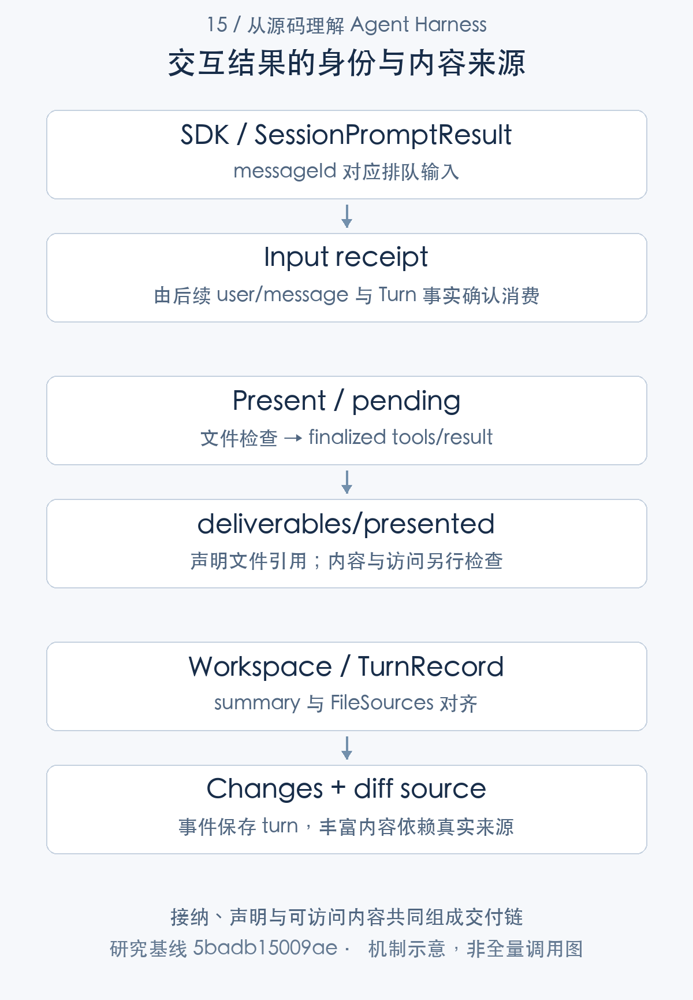
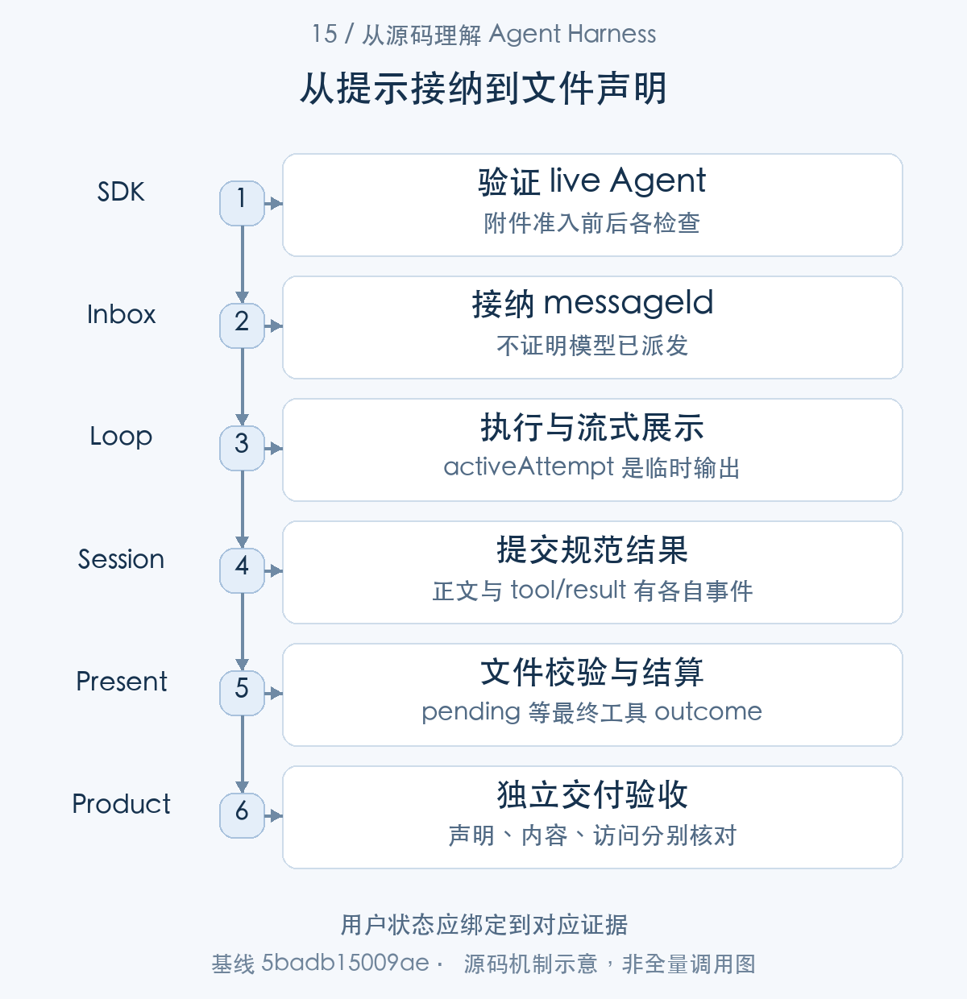
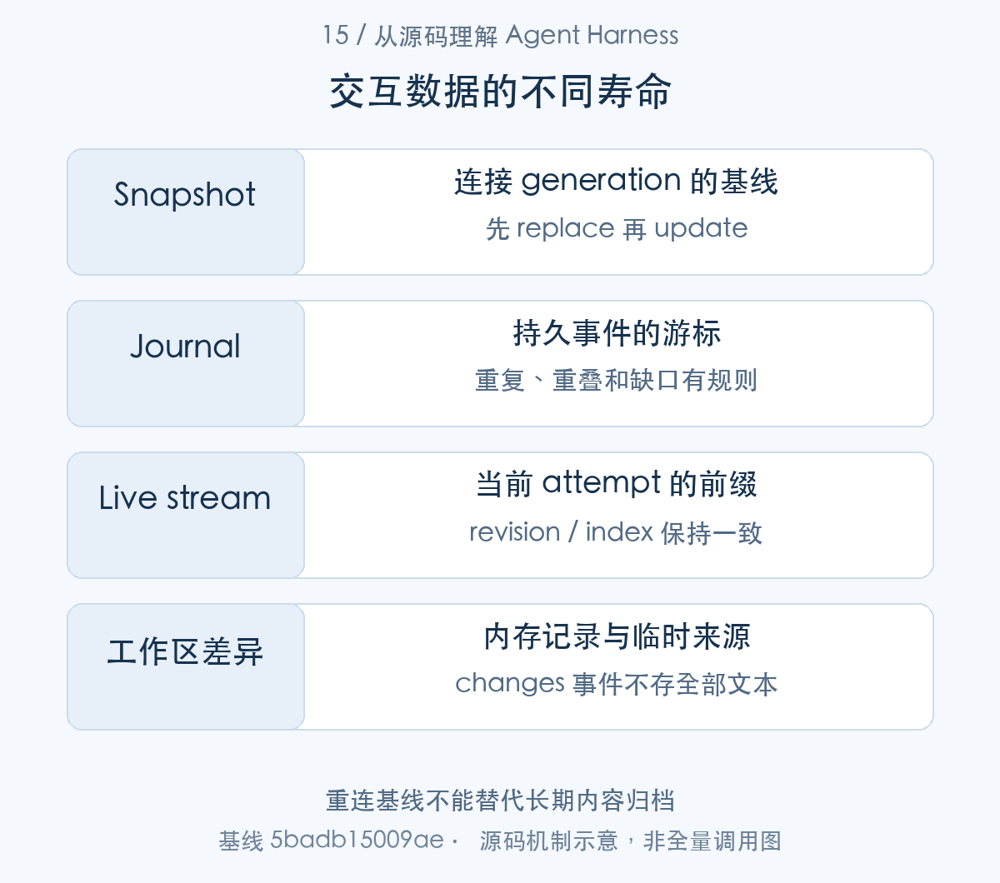
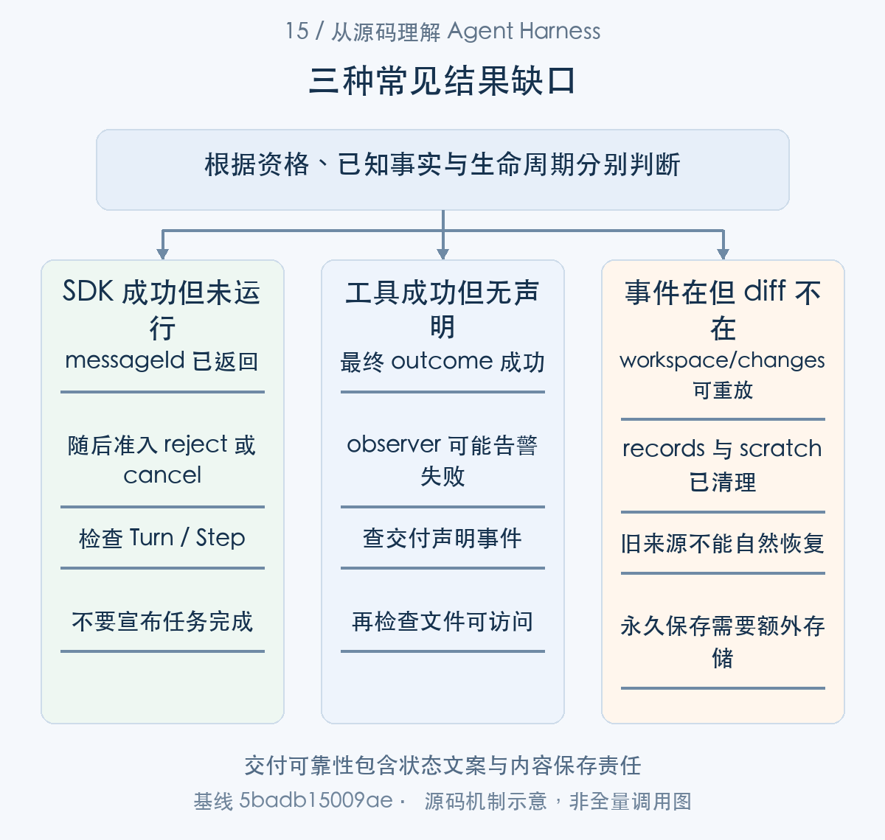

# 如何把执行结果交给用户：协议、重连与交付物

> 从源码理解 Agent Harness · 第 15 篇 · 交互协议与交付物

用户发送任务后收到一个 messageId，页面接着显示模型字块，稍后出现“修改了两个文件”和一份报告。网络断开再连接，哪些信息可以补回？进程重启后，旧 diff 还能打开吗？这既是协议问题，也是产物保存问题。

DeepSeek Harness 把命令接纳、事实订阅、实时输出、文件声明和工作区记录分成不同能力。本文围绕一次代码修复交付，说明**用户看到的完成状态应来自对应事实，而不能只从一条 RPC 响应推导**。

## messageId 证明接纳，不证明任务完成

SDK prompt 先确认初始化，取得或创建 Session，在附件处理前后检查 live Agent，再 followup 并返回 messageId。

```typescript
if (!this.initialized) throw new Error('SDK server is not initialized')
const rec = await this.getOrCreateSession(params.sessionId)
// An agent-loop-only reload disposes the loop's agents while this record
// survives; a retained agent accepts followup() silently, so validate the
// record against the live registry before delivery.
this.assertLiveAgent(rec, params.sessionId)
const content = await durablePromptContent(this.ctx, params.contentBlocks)
// Attachment admission crosses an async boundary where shutdown or an
// agent-loop reload may detach the retained handle.
this.assertLiveAgent(rec, params.sessionId)
const message = createUserMessage({
  content,
  source: { kind: 'user' },
})
rec.handle.agent.followup(message)
return { messageId: message.id }
```

[对应源码](https://github.com/deepseek-ai/deepseek-harness/blob/5badb15009ae1756c3afe0ae0cef1faafc290ccc/packages/sdk/server/src/server.ts#L179-L194)。以上为原文片段，仅统一缩进，需结合完整实现阅读。

两次 assertLiveAgent 覆盖异步附件准入窗口：旧 record 可能仍在 SDK 中，但 Agent-loop reload 已经卸载原 Agent。只有对象还在内存，不意味着它仍是 registry 中可执行实例。[SDK 消息准入](https://github.com/deepseek-ai/deepseek-harness/blob/5badb15009ae1756c3afe0ae0cef1faafc290ccc/packages/sdk/server/src/server.ts#L178-L194)

响应提供消息身份，不把后续所有活动独占分配给这条 prompt。同一 Session 可以追加输入，Turn 与 Step 的接纳边界决定实际消费位置。客户端应观察 inbox、user/message 与 Turn 事实，不能把“返回了 ID”显示成“模型已经执行”。

这也影响失败重试。若命令已经被接纳，客户端因为响应丢失再发送，可能产生第二条输入。carrier 重连恢复与业务命令重发应该分别设计，不能只用统一网络重试覆盖。



图1：三种用户可见结果。

### 第一步：提示提交跨过附件准入之后才进入 inbox

```typescript
async prompt(params: SessionPromptParams): Promise<SessionPromptResult> {
  if (!this.initialized) throw new Error('SDK server is not initialized')
  const rec = await this.getOrCreateSession(params.sessionId)
  // An agent-loop-only reload disposes the loop's agents while this record
  // survives; a retained agent accepts followup() silently, so validate the
  // record against the live registry before delivery.
  this.assertLiveAgent(rec, params.sessionId)
  const content = await durablePromptContent(this.ctx, params.contentBlocks)
  // Attachment admission crosses an async boundary where shutdown or an
  // agent-loop reload may detach the retained handle.
  this.assertLiveAgent(rec, params.sessionId)
```

[源码：`packages/sdk/server/src/server.ts:178–188`](https://github.com/deepseek-ai/deepseek-harness/blob/5badb15009ae1756c3afe0ae0cef1faafc290ccc/packages/sdk/server/src/server.ts#L178-L188)。

getOrCreateSession 后先检验 registry 的精确 live Agent，附件内容准入是异步边界，之后再次检查。旧 SDK record 可以继续存在，不能由内存中的 handle 推导它还能执行。

```typescript
send(message: UserMessage, target: InboxTarget, wakeup: boolean): void {
  // Waking input cannot join an aborted activity, so it starts the next turn.
  // Captured before the insertion so a reentrant cancel from a splice observer cannot reclassify it.
  const wakingAfterAbort = wakeup && this.phase.kind !== 'idle' && this.phase.abort.signal.aborted
  const resolvedTarget = wakingAfterAbort ? 'next-turn' : target
  this.inbox.splice(resolvedTarget, Infinity, 0, [message])
  if (wakeup) this.wakeDriver(wakingAfterAbort)
}

followup(input: UserMessage): void {
  this.send(input, 'next-turn', true)
}

steer(input: UserMessage): void {
  this.send(input, 'next-step', true)
}

inject(input: UserMessage): void {
  this.send(input, 'next-step', false)
}
```

[源码：`packages/core/agent-loop/src/agent.ts:154–173`](https://github.com/deepseek-ai/deepseek-harness/blob/5badb15009ae1756c3afe0ae0cef1faafc290ccc/packages/core/agent-loop/src/agent.ts#L154-L173)。

followup 向 next-turn 排队并唤醒驱动；返回 messageId 只帮助客户端把乐观提示与服务器接纳事实对应。排队后的消息仍可能被 cancel、目标治理或生命周期改变影响。

```typescript
private async turn(): Promise<boolean> {
  if (this.phase.kind !== 'running') {
    this.throwError(new Error(`agent "${this.id}": turn without driver reservation`))
  }
  const phase = this.phase
  const { signal } = phase.abort
  signal.throwIfAborted()
  const turn = phase.turn + 1
  try {
    this.session.append('turn/start', { turn })
  } catch (error: unknown) {
    this.throwError(error)
  }
  phase.turn = turn
  let turnEnds: TurnEndReason | null = null
  let target: InboxTarget = 'next-turn'
  try {
    while (true) {
      signal.throwIfAborted()
      const step = phase.step + 1
```

[源码：`packages/core/agent-loop/src/agent.ts:296–315`](https://github.com/deepseek-ai/deepseek-harness/blob/5badb15009ae1756c3afe0ae0cef1faafc290ccc/packages/core/agent-loop/src/agent.ts#L296-L315)。

Turn 开始后还经过 preStep，reject 可以生成 blocked 边界且没有 Step。SDK 提交成功、Turn 已启动和模型已派发是三个时刻，UI 状态应与相应证据匹配。



图2：用户状态应绑定到对应证据。详见本节及相邻源码解读；图示省略其他分支。

## snapshot、journal 和 live stream 各有什么职责

RemoteSnapshotStream 每个连接 generation 先取得完整 baseline，再应用 delta；重试期间保留旧视图，直到新 baseline 替换。RemoteJournalStream 检查起始 cursor 不倒退，忽略已覆盖重复记录，拒绝部分重叠，结合分页和 follow 补缺口。[snapshot baseline 消费](https://github.com/deepseek-ai/deepseek-harness/blob/5badb15009ae1756c3afe0ae0cef1faafc290ccc/packages/api/gateway/src/client/snapshot-stream.ts#L67-L94) [journal 游标与补偿](https://github.com/deepseek-ai/deepseek-harness/blob/5badb15009ae1756c3afe0ae0cef1faafc290ccc/packages/api/gateway/src/client/journal-stream.ts#L261-L391)

assistant-stream 使用连续 revision，snapshot 附带 activeAttempt，帮助客户端重连到当前实时状态。它不是把每个字块作为 journal 永久记录，而是针对尚在进行的展示提供一致视图。[active assistant attempt 快照](https://github.com/deepseek-ai/deepseek-harness/blob/5badb15009ae1756c3afe0ae0cef1faafc290ccc/packages/api/session-controller/src/assistant-stream.ts#L45-L102)

例如只是网络断开，Host 仍活着，新 baseline 能带回当前 attempt，之后继续接受连续变化。如果 Host 进程也退出，未结算的文本只存在旧 live 对象时，磁盘日志不能凭空补回它。两类故障对用户都像“断线”，恢复依据却不同。

协议错误也与网络载体丢失不同。游标重叠或非法 revision 可能需要终止当前订阅，不能无限吞掉再重连，否则页面展示会与真实历史悄悄偏离。

### 第二步：重新连接先建立基线，再处理增量

```typescript
private async consume(): Promise<void> {
  let generation = 0
  let snapshotSeen = false
  try {
    for await (const item of this.stream) {
      if (item.generation !== generation) {
        generation = item.generation
        snapshotSeen = false
      }
      if (this.options.isSnapshot(item.value)) {
        if (snapshotSeen) {
          throw protocolViolation(`${this.options.name} emitted more than one opening snapshot`)
        }
        this.options.replace(item.value)
        snapshotSeen = true
        item.accept()
        continue
      }
      if (!snapshotSeen) {
        throw protocolViolation(`${this.options.name} emitted an update before its opening snapshot`)
      }
      this.options.update(item.value)
    }
  } catch (error) {
    if (!this.disposed) this.options.failed(error)
  }
}
```

[源码：`packages/api/gateway/src/client/snapshot-stream.ts:67–93`](https://github.com/deepseek-ai/deepseek-harness/blob/5badb15009ae1756c3afe0ae0cef1faafc290ccc/packages/api/gateway/src/client/snapshot-stream.ts#L67-L93)。

每个 generation 恰好一个 opening snapshot；baseline 之前 update、重复 baseline 都是协议错误。保留旧视图不代表新流已接上，只有新 baseline 才建立新的增量起点。

```typescript
private opening(
  item: RemoteStreamItem<RemoteJournalFrame<Entry, Cursor, Page, Notification>>,
  resumed: boolean,
): { readonly cursor: Cursor; readonly page: Page } {
  if (item.value.type !== 'opened') {
    throw protocolViolation(`${resumed ? 'resumed ' : ''}${this.options.name} emitted an entry before its opening cursor`)
  }
  const cursor = item.value.cursor
  if (resumed && this.lastCursor !== undefined
    && this.options.compare(cursor, this.lastCursor) < 0) {
    throw protocolViolation(
      `${this.options.name} resumed at a cursor behind the last applied entry`,
    )
  }
  this.generation = item.generation
  item.accept()
  return { cursor, page: item.value.page }
```

[源码：`packages/api/gateway/src/client/journal-stream.ts:269–285`](https://github.com/deepseek-ai/deepseek-harness/blob/5badb15009ae1756c3afe0ae0cef1faafc290ccc/packages/api/gateway/src/client/journal-stream.ts#L269-L285)。

journal 重连必须先 opened，cursor 不可倒退。accept 标记接纳当前 generation；不能拿另一连接的旧游标盲目继续应用事件。

```typescript
private async acceptEntry(
  entry: Entry,
  item: JournalStreamItem<Page, Entry, Cursor, Notification>,
  iterator: AsyncIterator<JournalStreamItem<Page, Entry, Cursor, Notification>>,
): Promise<void> {
  const { first, last: cursor } = this.entryRange(entry)
  const last = this.lastCursor as Cursor
  if (this.options.compare(cursor, last) <= 0) return
  if (this.options.compare(first, last) <= 0) {
    throw protocolViolation(`${this.options.name} emitted a partially overlapping entry`)
  }
  if (!this.options.follows(last, first)) {
    const request = this.repairPageRequest()
    const superseded = await this.replaceThrough(
      request,
      cursor,
      item.generation,
      item.signal,
      iterator,
      [entry],
      [],
    )
    if (superseded !== undefined) {
      this.replaceGeneration(superseded, true)
```

[源码：`packages/api/gateway/src/client/journal-stream.ts:305–328`](https://github.com/deepseek-ai/deepseek-harness/blob/5badb15009ae1756c3afe0ae0cef1faafc290ccc/packages/api/gateway/src/client/journal-stream.ts#L305-L328)。

完全覆盖的旧 entry 忽略，部分重叠拒绝，缺口触发 replaceThrough 补偿。相比仅靠 WebSocket 重连，这里把断点和一致性纳入了客户端协议。

```typescript
switch (frame.type) {
  case 'start':
    this.activeAttempt = {
      attemptId: frame.attemptId,
      startedAfterSeq: durableCursor,
      turn: frame.turn,
      step: frame.step,
      stream: new AssistantStreamAccumulator(),
      nextIndex: 0,
    }
    break
  case 'chunk': {
    const attempt = this.activeAttempt
    if (attempt === undefined
      || attempt.attemptId !== frame.attemptId
      || frame.index !== attempt.nextIndex) {
      this.activeAttempt = undefined
      break
    }
    attempt.stream.push({ time: frame.time, chunk: frame.chunk })
    attempt.nextIndex += 1
    break
  }
  case 'end':
    this.activeAttempt = undefined
    break
}
```

[源码：`packages/api/session-controller/src/assistant-stream.ts:50–76`](https://github.com/deepseek-ai/deepseek-harness/blob/5badb15009ae1756c3afe0ae0cef1faafc290ccc/packages/api/session-controller/src/assistant-stream.ts#L50-L76)。

activeAttempt 用 attemptId、nextIndex 检查实时 chunk，不匹配就清理展示状态；end 清 active。它是未结算输出的实时视图，不能当成已经持久保存的逐字日志。

```typescript
snapshot(): SessionAssistantStreamBaseline {
  if (!this.dirty) return this.snapshotValue
  this.snapshotValue = {
    revision: this.revision,
    ...this.activeAttempt === undefined ? {} : {
      activeAttempt: {
        attemptId: this.activeAttempt.attemptId,
        startedAfterSeq: this.activeAttempt.startedAfterSeq,
        turn: this.activeAttempt.turn,
        step: this.activeAttempt.step,
        nextIndex: this.activeAttempt.nextIndex,
        stream: this.activeAttempt.stream.snapshot() as unknown as readonly JsonValue[],
      },
    },
  }
  this.dirty = false
  return this.snapshotValue
```

[源码：`packages/api/session-controller/src/assistant-stream.ts:84–100`](https://github.com/deepseek-ai/deepseek-harness/blob/5badb15009ae1756c3afe0ae0cef1faafc290ccc/packages/api/session-controller/src/assistant-stream.ts#L84-L100)。

snapshot 携带 revision 和 activeAttempt 的当前前缀，让重连客户端恢复正在输出的回答。最终正文仍应以 durable assistant/message 为准，abandoned attempt 不得显示为已提交完成。

## 声明文件交付，需要独立事件

present 工具检查目标存在且为常规文件，收集待展示引用，在最终工具结果观察阶段写 `deliverables/presented`。

```typescript
ctx.on('tools/result', (exec, result) => {
  const delivery = pending.get(exec)
  pending.delete(exec)
  if (delivery === undefined || result.isError) return
  const { session, turn, files } = delivery
  session.append('deliverables/presented', {
    turn, callId: exec.callId, files,
  })
})
```

[对应源码](https://github.com/deepseek-ai/deepseek-harness/blob/5badb15009ae1756c3afe0ae0cef1faafc290ccc/packages/deliverables/tool-present/src/index.ts#L100-L108)。以上为原文片段，仅统一缩进，需结合完整实现阅读。

pending 以执行对象关联，结果错误时不声明。tool outcome 已确定后，观察通知不会反向改变它；observer 失败只警告，因此声明事件是否成功仍需要单独检查。[present 文件检查和声明](https://github.com/deepseek-ai/deepseek-harness/blob/5badb15009ae1756c3afe0ae0cef1faafc290ccc/packages/deliverables/tool-present/src/index.ts#L70-L108) [结果观察的错误隔离](https://github.com/deepseek-ai/deepseek-harness/blob/5badb15009ae1756c3afe0ae0cef1faafc290ccc/packages/core/tools/src/index.ts#L1694-L1713)

这条声明表示“本会话展示这些文件”，不表示文件内容经过独立业务验收，也不表示文件已永久归档。路径引用所对应的文件还可能被之后修改；跨设备下载和长期分享需要额外的内容存储与访问能力。

排查交付时还要注意顺序。声明在 tools/result 通知中追加，可能先于 Loop 自己记录 tool/result。消费者按 seq 和 callId 关联，而不是假设所有成功结果之后才存在领域声明。

### 第三步：文件检查产生暂存意图，最终结果才确认声明

```typescript
async execute(args, exec) {
  if (exec.agent === undefined) throw new Error('present requires an agent Session')
  const boundary = ctx.sessionProjections.stateOf(exec.agent.session, 'turnBoundary')
  if (boundary === undefined || boundary.openTurnStartSeq === null) throw new Error('present requires an open turn')
  if (args.files.length === 0 || args.files.length > config.maxFiles) throw new Error(`present accepts 1 to ${config.maxFiles} files`)
  const cwd = exec.agent.session.header.cwd
  if (cwd === undefined) throw new Error('present requires a workspace')
  const options = { cwd, signal: exec.signal }
  const files: PresentedFile[] = []
  for (const file of args.files) {
    if (file.path.trim().length === 0) throw new Error('present requires a non-empty file path')
    const entry = await ctx.fs.lstat(file.path, { cwd }, exec.signal)
    if (entry !== undefined && entry.type !== 'file') throw new Error(`Cannot present ${file.path}: not a regular file`)
    const target = await ctx.fs.resolve(file.path, options)
    const info = await ctx.fs.stat(target, exec.signal)
    if (info === undefined) throw new FsError(`Cannot present ${file.path}: file not found. Check the path, create the file if needed, and retry.`, 'FS_NOT_FOUND')
    if (info.type !== 'file') throw new Error(`Cannot present ${file.path}: not a regular file`)
    files.push({ ...file })
  }
```

[源码：`packages/deliverables/tool-present/src/index.ts:76–94`](https://github.com/deepseek-ai/deepseek-harness/blob/5badb15009ae1756c3afe0ae0cef1faafc290ccc/packages/deliverables/tool-present/src/index.ts#L76-L94)。

present 要求开放 Turn、workspace 和合法数量，逐文件 lstat、resolve、stat，检查实际存在且为 regular file。路径文本不是交付物，校验至少跨到真实 fs provider。

```typescript
  exec.signal.throwIfAborted()
  pending.set(exec, { session: exec.agent.session, turn: boundary.lastTurn, files })
  return { turn: boundary.lastTurn, files }
},
```

[源码：`packages/deliverables/tool-present/src/index.ts:95–98`](https://github.com/deepseek-ai/deepseek-harness/blob/5badb15009ae1756c3afe0ae0cef1faafc290ccc/packages/deliverables/tool-present/src/index.ts#L95-L98)。

取消检查后，以 exec 对象保存 pending，再返回工具值。body 成功仍可能被后处理改为错误，不能在此就声明交付。原文 tools/result observer 只在最终成功时追加 deliverables/presented。

```typescript
// WeakMap-keyable view.
Object.freeze(exec)
const { name: toolName, callId } = exec
const reportFailure = (error: unknown): void => {
  this.ctx.logger.warn(`tool "${toolName}" (${callId}): tools/result observer failed: ${errorMessage(error)}`)
}
const callbacks = this.ctx.events.dispatch('emit', [
  scopeTarget(this, exec.agent), 'tools/result', exec, result,
])
for (const callback of callbacks) {
  try {
    const returned: unknown = callback(exec, result)
    void Promise.resolve(returned).catch(reportFailure)
  } catch (error: unknown) {
    reportFailure(error)
  }
}
```

[源码：`packages/core/tools/src/index.ts:1697–1713`](https://github.com/deepseek-ai/deepseek-harness/blob/5badb15009ae1756c3afe0ae0cef1faafc290ccc/packages/core/tools/src/index.ts#L1697-L1713)。

观察错误被包含、不改变已定 outcome，异步 observer 也不阻塞 Loop。因此“present 工具成功”与“声明事件存在”应独立查询，文件当前可访问性还需第三个检查。长期下载和版本固定需要企业对象存储扩展。



图3：重连基线不能替代长期内容归档。详见本节及相邻源码解读；图示省略其他分支。

## 工作区变化先捕获基线，再确认本 Turn 的修改

workspace-changes 在 Turn 开始排队获取基线，相关工具执行前捕获路径，观察最终工具结果，在 turn-stopping 计算差异并记录。它尝试区分用户既有未提交变化与本 Turn 拥有的修改，而非简单展示当前 git diff。[基线、路径与结果观察](https://github.com/deepseek-ai/deepseek-harness/blob/5badb15009ae1756c3afe0ae0cef1faafc290ccc/packages/deliverables/workspace-changes/src/recorder.ts#L128-L187) [owned delta 的计算](https://github.com/deepseek-ai/deepseek-harness/blob/5badb15009ae1756c3afe0ae0cef1faafc290ccc/packages/deliverables/workspace-changes/src/recorder.ts#L303-L333)

例如用户发送任务前已经改了 README，Agent 只修改函数和测试，交付视图不应把 README 一起归为 Agent 成果。这个区分依赖有效基线、实际捕获和工具结果身份，不是仅看文件修改时间。

缺少基线、没有对应工具结果、超出支持范围或嵌套仓库路径，都可能限制记录。完整本地 Git 状态可以辅助比较，却不能从一次 Turn 的结果自动推导所有外部修改来源。

### 第四步：变更归属依据 Turn 基线与具体捕获

```typescript
start(turn: number): void {
  const state = freshState(turn)
  this.state = state
  void this.enqueue(async (signal) => {
    try {
      this.paths ??= { cwd: await realpath(this.cwd), home: await canonicalPath(homedir()), temporaryRoots: await temporaryRoots() }
      const repository = await this.locate(this.paths.cwd, signal)
      if (repository === null) return
      const tree = await snapshotTree(repository.git, repository.workspace, signal)
      state.baseline = { ...repository, tree }
    } catch (error: unknown) {
      // A repository whose snapshot failed must not be summarized as if it had none.
      state.baseline = 'failed'
      throw error
    }
  })
}
```

[源码：`packages/deliverables/workspace-changes/src/recorder.ts:131–147`](https://github.com/deepseek-ai/deepseek-harness/blob/5badb15009ae1756c3afe0ae0cef1faafc290ccc/packages/deliverables/workspace-changes/src/recorder.ts#L131-L147)。

start 为当前 Turn 新建 state，排队抓取基线。失败明确标为 failed，不能把失败当“仓库没有原变化”，否则用户已有修改会被错误归给 Agent。

```typescript
capture(name: string, args: unknown): void {
  const path = mutationPath(name, args)
  if (path === undefined) return
  const state = this.state
  void this.enqueue(async () => {
    const paths = this.paths
    if (paths === undefined) return
    const absolute = await canonicalPath(resolve(paths.cwd, path))
    if (state.captures.has(absolute)) return
    const capture = await captureFile(absolute, join(await this.scratchDir(), 'captures'), this.env.maxFileBytes)
    if (capture !== undefined) state.captures.set(absolute, capture)
  })
}

/**
 * Remember a settled tool result, so a record after `turn/end` covers it.
 * @param event - the appended `tool/result` event.
 */
observe(event: SessionEvent<'tool/result'>): void {
  const state = this.state
  if (event.data.turn === state.turn) state.lastToolResultSeq = event.seq
}
```

[源码：`packages/deliverables/workspace-changes/src/recorder.ts:156–177`](https://github.com/deepseek-ai/deepseek-harness/blob/5badb15009ae1756c3afe0ae0cef1faafc290ccc/packages/deliverables/workspace-changes/src/recorder.ts#L156-L177)。

首次 mutation 捕获路径原内容，工具必须等待 capture 队列；observe 用当前 Turn 的 tool/result seq 标记结算进度。仅执行前捕获并不证明修改已成功，结果观察与 stopping 计算共同完成归属。

```typescript
private async record(state: TurnState, signal: AbortSignal): Promise<void> {
  const paths = this.paths
  const { baseline } = state
  if (paths === undefined || baseline === 'failed' || state.lastToolResultSeq < 0) return
  state.attemptedAfterSeq = state.lastToolResultSeq
  // Without a snapshot the working directory itself bounds the workspace.
  const root = baseline?.workspace.root ?? paths.cwd
  const listed = new Map<string, Listed>()
  let snapshot: WorkspaceChangesSummary['snapshot']
  if (baseline !== null) {
    const after = await snapshotTree(baseline.git, baseline.workspace, signal)
    snapshot = { before: baseline.tree, after }
    const repository: Repository = { git: baseline.git, workspace: baseline.workspace }
    for (const entry of await diffTrees(baseline.git, baseline.workspace, baseline.tree, after, signal)) {
      const absolute = resolve(root, entry.path)
      listed.set(absolute, {
        file: changedFile(paths, root, absolute, entry),
        sources: entry.binary ? { refusal: 'binary' } : {
          before: { kind: 'snapshot', repository, tree: baseline.tree, path: entry.oldPath ?? entry.path },
          after: { kind: 'snapshot', repository, tree: after, path: entry.path },
        },
      })
    }
```

[源码：`packages/deliverables/workspace-changes/src/recorder.ts:303–325`](https://github.com/deepseek-ai/deepseek-harness/blob/5badb15009ae1756c3afe0ae0cef1faafc290ccc/packages/deliverables/workspace-changes/src/recorder.ts#L303-L325)。

record 要求基线有效且有工具结果，比较 before/after tree 得到本回合 delta，并保留可读来源。它比直接 git diff HEAD 更接近 Agent 所做修改；并发外部编辑仍需要审查，不能据快照证明每个字节的唯一作者。

```typescript
// Captured paths the snapshots do not cover are compared from their copies.
const captured = [...state.captures.keys()].filter(absolute => !listed.has(absolute))
const workTreePath = (absolute: string): string => toPosix(relative(root, absolute))
let inWorkspace = captured.filter(absolute => isInside(root, absolute))
if (baseline !== null && inWorkspace.length > 0) {
  // Nested repositories and submodules are gitlinks: their contents never enter the summary.
  const gitlinks = await gitlinkPaths(baseline.git, baseline.workspace, signal)
  inWorkspace = inWorkspace.filter(absolute => ![...gitlinks].some(link => isInside(resolve(root, link), absolute)))
}
// A snapshot covers every workspace file except the ignored ones; without one, every file-tool edit counts.
const uncoveredInWorkspace = baseline === null
  ? new Set(inWorkspace.map(workTreePath))
  : await ignoredPaths(baseline.git, baseline.workspace, inWorkspace.map(workTreePath), signal)
for (const absolute of captured) {
  // Outside the workspace, scratch files under a temporary root stay out.
  const uncovered = isInside(root, absolute)
    ? uncoveredInWorkspace.has(workTreePath(absolute))
    : !isTemporaryPath(absolute, paths.temporaryRoots)
  if (!uncovered) continue
  const before = state.captures.get(absolute) as Capture
  const after = await captureFile(absolute, join(await this.scratchDir(), 'captures'), this.env.maxFileBytes)
  if (after === undefined || sameCapture(before, after)) continue
  listed.set(absolute, await this.compared(paths, root, absolute, before, after))
}
```

[源码：`packages/deliverables/workspace-changes/src/recorder.ts:327–350`](https://github.com/deepseek-ai/deepseek-harness/blob/5badb15009ae1756c3afe0ae0cef1faafc290ccc/packages/deliverables/workspace-changes/src/recorder.ts#L327-L350)。

未被树覆盖的捕获路径再处理，gitlinks 内容排除，忽略文件与临时根有各自政策。覆盖范围有限，不能把 changes 卡片称作全部文件系统副作用的完整清单。

## 日志里的 changes 为什么不能恢复完整 diff

下面片段显示持久事实与具体记录分开：日志追加 workspace/changes 仅携带 turn，summary 和后续内容存在 records 索引。

```typescript
  if (sorted.length === 0 && state.recordedAfterSeq < 0) return
  const event = this.session.append('workspace/changes', { turn: state.turn })
  const kept = sorted.slice(0, this.env.maxFiles)
  this.records.set(event.seq, {
    summary: {
      turn: state.turn,
      cwd: this.cwd,
      files: kept.map(entry => entry.file),
      total: sorted.length,
      added: sorted.reduce((sum, entry) => sum + entry.file.added, 0),
      deleted: sorted.reduce((sum, entry) => sum + entry.file.deleted, 0),
      ...snapshot === undefined ? {} : { snapshot },
    },
    sources: kept.map(entry => entry.sources),
  })
  state.recordedAfterSeq = event.seq
}
```

[对应源码](https://github.com/deepseek-ai/deepseek-harness/blob/5badb15009ae1756c3afe0ae0cef1faafc290ccc/packages/deliverables/workspace-changes/src/recorder.ts#L353-L369)。以上为原文片段，仅统一缩进，需结合完整实现阅读。

records 和临时 Git／捕获资源由 recorder 持有，dispose 清理索引与临时目录。重启后 Session 中可以保留 changes 事件，但旧 summary／sources 不一定仍可查询。[工作区记录的内存保存](https://github.com/deepseek-ai/deepseek-harness/blob/5badb15009ae1756c3afe0ae0cef1faafc290ccc/packages/deliverables/workspace-changes/src/recorder.ts#L342-L369) [清理索引和临时资源](https://github.com/deepseek-ai/deepseek-harness/blob/5badb15009ae1756c3afe0ae0cef1faafc290ccc/packages/deliverables/workspace-changes/src/recorder.ts#L242-L251) [官方覆盖与重启限制](https://github.com/deepseek-ai/deepseek-harness/blob/5badb15009ae1756c3afe0ae0cef1faafc290ccc/packages/deliverables/workspace-changes/README.md#L40-L60)

这是临时交付视图的生命周期，不应自动称为数据损坏。问题出在产品若承诺“永远可看旧 diff”，却只组合这项临时记录能力。要实现长期版本化产物，就需要另存内容、清单、hash 和来源版本。

### 第五步：持久事件与内存来源有不同寿命

原文 append 只写 turn，summary/sources 进入 records Map。恢复 Session 可以知道当时记录过 changes，不能仅凭该事件恢复完整差异。

```typescript
private async readSide(source: ContentSource, signal: AbortSignal): Promise<string | null | typeof OVERSIZED> {
  switch (source.kind) {
    case 'absent': return null
    case 'file': return readFile(source.file, { encoding: 'utf8', signal })
    case 'snapshot': {
      const { git, workspace } = source.repository
      const blob = await treeBlob(git, workspace, source.tree, source.path, signal)
      if (blob === null) return null
      if (blob.size > this.env.maxFileBytes) return OVERSIZED
      return blobText(git, workspace, blob.oid, this.env.maxFileBytes, signal)
    }
  }
```

[源码：`packages/deliverables/workspace-changes/src/recorder.ts:289–300`](https://github.com/deepseek-ai/deepseek-harness/blob/5badb15009ae1756c3afe0ae0cef1faafc290ccc/packages/deliverables/workspace-changes/src/recorder.ts#L289-L300)。

readSide 根据 absent、临时文件或 Git snapshot 读取内容，超字节额度返回 OVERSIZED。丰富展示依赖这些实际资源；摘要计数不等于永久保存了对应版本文本。

```typescript
async dispose(): Promise<void> {
  this.lifetime.abort()
  this.records.clear()
  await this.chain
  if (this.scratch !== undefined) await rm(await this.scratch, { recursive: true, force: true })
}
```

[源码：`packages/deliverables/workspace-changes/src/recorder.ts:246–251`](https://github.com/deepseek-ai/deepseek-harness/blob/5badb15009ae1756c3afe0ae0cef1faafc290ccc/packages/deliverables/workspace-changes/src/recorder.ts#L246-L251)。

dispose abort 队列、clear records、await chain、删除 scratch。资源回收正确意味着旧卡片来源可能不再查询。企业要永久保留 diff，应额外保存内容对象、摘要与版本身份，并将引用写入可重放事件。



图4：交付可靠性包含状态文案与内容保存责任。详见本节及相邻源码解读；图示省略其他分支。

## 怎样建立更准确的用户状态

可以把用户流程拆成几种可核验状态：消息已接纳、输入已消费、回合运行中、循环已结算、声明了交付文件、业务检查通过。网络连接状态另行展示，不把重连成功当作任务成功。

报告文件和工作区差异也应分开：前者是明确展示的文件引用，后者是一次 Turn 的修改记录。若需要下载，应确认当前文件版本；若需要审阅旧 diff，应确认对应临时或持久数据仍存在。

这些是基于现有协议和产物机制的产品设计建议，不是 DSH 当前界面全部已经提供的状态。良好界面应减少用户理解内部 seq 的负担，但其判断依据不能缺失。

### 第六步：把产品状态绑定到独立证据

|用户状态|依据|允许展示的承诺|
|---|---|---|
|已接纳|SDK messageId 与 inbox 关联|输入已进入服务处理路径|
|正在执行|Turn/Step 与 active attempt|执行或展示仍在继续|
|回答已提交|assistant/message|本地规范回答已接纳|
|工具已结算|tool/result|对应调用的反馈已经确定|
|文件已声明|deliverables/presented|系统记录了这次文件呈现|
|交付已验收|独立文件/业务检查|具体版本满足业务条件|

这不是要求 UI 展示所有实现细节，而是给状态文案正确证据。普通用户可以只看到清楚的阶段说明，排错面板再展开 seq、callId 与 revision。结束信号不应替代交付验收。

## 优势、不足与技术心得

优势是命令身份、事实 journal 和实时状态分开，重连先建立 baseline，交付声明与工具结果可以关联，工作区比较也考虑原有修改。各类消费者有明确数据来源。

不足是 live 输出无法自然变成持久历史，文件引用不自动归档，workspace diff 依赖运行缓存。业务命令去重、跨设备产物、长期审阅和强访问控制还需要应用补充。协议测试通过也不等于真实网络和浏览器已验证。

我的技术心得是，交付不是最后一句回答，而是从执行事实到用户可访问结果的一条链。消息接纳、结果结算、产物声明、内容保存和权限访问都应有负责方。遗漏任一环节，用户就可能看到“成功”却拿不到结果。

此前 transport／assistant-stream 测试、V08 present 10 项和 V10 workspace 16 项支持选定本地路径。浏览器、真实网络和远端文件分发未实测。最后一篇将讨论怎样在版本升级和部署过程中保持这些状态语义。

### 技术感悟：交互的诚实来自状态分层

DSH 的优势是实时展示、历史一致性、文件声明和变更来源有独立协议；不足是观察通知可能失败、丰富 diff 来源非持久、文件声明不包办长久访问与业务验收。

设计产品时，我会先列出用户一句“已经好了”背后需要哪些事实，再决定按钮与状态文案。让用户区分等待、停止结算和已交付，比展示一个没有明确含义的绿色 completed 更可靠。

本次沿固定源码深化，沿用原有 gateway、present、workspace 与 SDK 记录；没有新增浏览器视觉验收或重启后持久 diff 实验，企业保存方案明确作为建议。

---

研究基线：DeepSeek Harness `0.2.1-alpha.1`，提交 `5badb15009ae1756c3afe0ae0cef1faafc290ccc`。源码事实以该版本为准；文中的工程判断和改造建议另行说明。教学场景不代表真实模型业务实测。

源码与运行记录可从[证据索引](../appendices/evidence-index.md)和[验证附录](../appendices/validation.md)复核。本文引用此前同一提交的验证结果，本轮写作不将其重新计为新测试。

[专栏目录](README.md) · [上一篇](14-plugin-lifecycle.md) · [下一篇](16-deployment-evolution.md)
