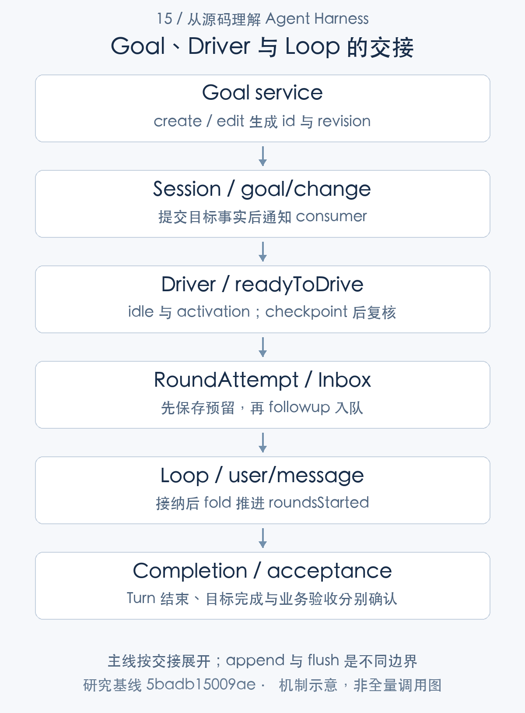
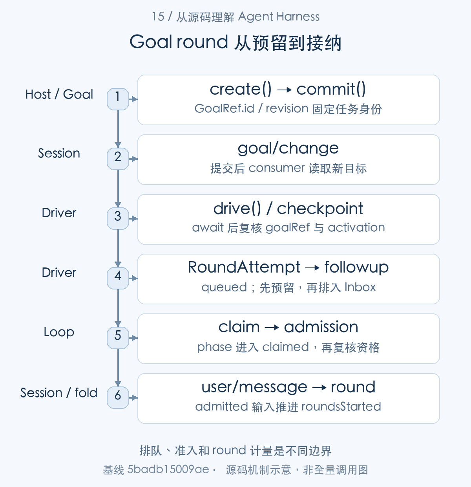
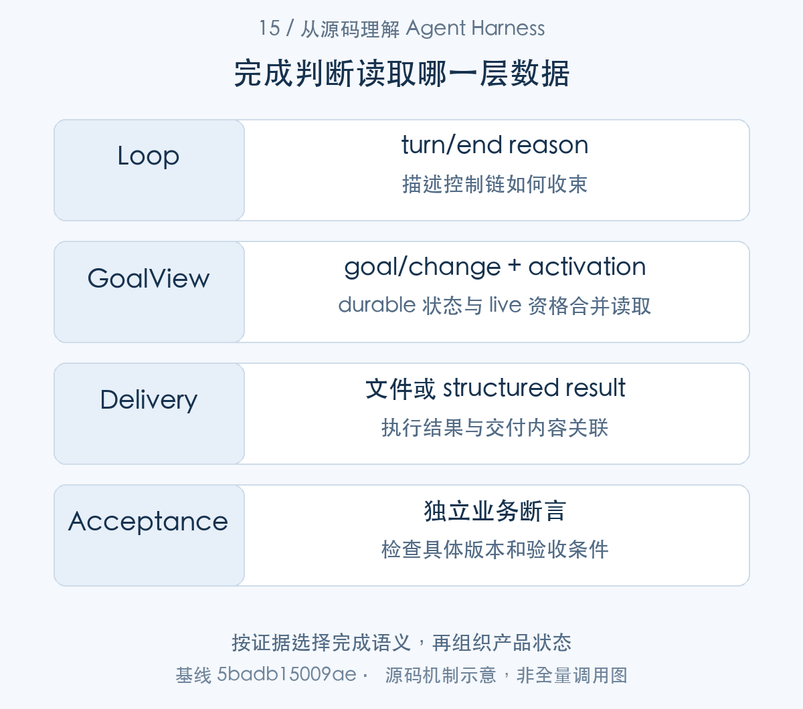
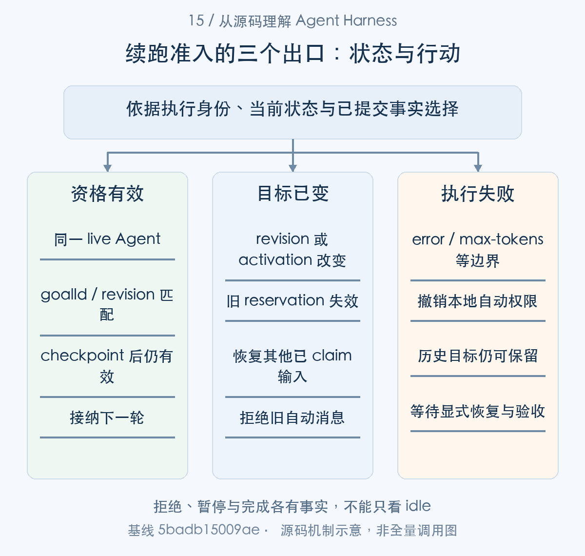

# 任务何时才算完成：目标、Turn 与业务验收

> 从源码理解 Agent Harness · 第 15 篇 · 任务定义与完成语义

让 Agent “修复一个缺陷，并确认回归测试通过”，看起来只有一个完成条件。运行起来之后，却会出现几种不同的结束：模型停止生成，某个工具执行完毕，当前 Turn 正常关闭，清单全部打勾，目标被标为 complete，以及程序确实通过验收。它们发生在不同位置，依据也不同。

假设模型修改了文件，随后说“修复完成”，但没有执行测试。Loop 可以正常结束，todo 可以全部完成，Goal 也可以被模型标为 complete。我们仍然不能据此认定缺陷已经修复。反过来，测试可能已经通过，模型却还没有更新目标状态，系统于是继续自动运行。问题既涉及执行，也涉及判断：**谁有权宣布完成，宣布的是哪一种完成，运行时凭什么继续或停止？**

本文沿着 DeepSeek Harness（下文简称 DSH）的源码回答这些问题。我们保持同一个例子：修复分页边界错误，验证 `pagination.spec.ts`，最多允许两个自动 Goal round。重点追踪 GoalService、goal-round-driver 与 Agent Loop 之间的调用、事件和提交顺序，并把 todo、规划模式及结构化子任务放回各自的职责范围。

本文所有代码来自固定提交 `5badb15009ae1756c3afe0ae0cef1faafc290ccc`。代码是仅统一公共缩进的实现选段，前后条件会在正文解释；示例任务和事件演练用于说明机制，并不代表运行过真实模型修复任务。先建立完成语义，再沿一次任务往下读，才能理解那些看似繁琐的身份检查和异步重查为什么存在。


本文追踪两条相接的链：Goal 服务用 goal/change 保存任务意图和 revision，goal-round-driver 取得执行资格、预留输入，再由 Agent Loop 接纳为 user/message。随后把 Turn 收束、目标状态、委派结果与业务验收放在各自边界解释。核心是同一份任务身份怎样穿过调度、等待与提交，而不是把某个 completed 字段当作所有层的共同答案。

## 先把完成拆成四个层次

### 1. Turn 正常结束：控制循环已经收束

在 DSH 中，一个 Turn 表示一次由已接纳输入推进的执行周期，可以包含多个 Step；一个 Step 内还可能重试模型请求。这三个层级不能互换。模型给出一段没有工具调用的回答，通常意味着当前 Step 可以结束，但不等于整个任务已经验收。

Loop 的关键判断在 `ReactLoopAgent.step()` 中：

```typescript
const toolCalls = message.content.filter(block => block.type === 'tool-call')
if (toolCalls.length === 0) return { kind: 'completed' }
const { concluded } = await executeToolCalls(
  this.loopCtx, turn, step, toolCalls, signal,
  context => this.inbox.splice('next-step', this.inbox.nextStep.length, 0, [context]),
)
return concluded ? { kind: 'completed' } : null
```

[源码：`packages/core/agent-loop/src/agent.ts:532–538`](https://github.com/deepseek-ai/deepseek-harness/blob/5badb15009ae1756c3afe0ae0cef1faafc290ccc/packages/core/agent-loop/src/agent.ts#L532-L538)。

逐句看这段代码。第一行从 assistant message 的内容块中取出 `tool-call`。它检查的是结构化内容块，不是扫描自然语言中的“完成”二字。第二行发现没有工具调用，就返回 `{ kind: 'completed' }`：这里没有测试执行，也没有 Goal 查询。

如果存在工具调用，Loop 先等待 `executeToolCalls()`；传入的回调把工具附加上下文放进 `next-step` 队列。最后一行依据 `concluded` 返回 completed 或 null。null 表示还需要后续 Step；completed 表示当前步骤给出了结束候选。它仍然不是业务正确性的断言。

这也解释了为什么不能只看模型供应商的结束字段：DSH 还会执行工具、消费追加上下文，并在 Turn 停止前调用扩展钩子。`turn()` 检查 `nextStep`、执行 `agent/turn-stopping`，确认没有新的继续输入后才关闭 Turn；无论正常、阻塞还是错误分支，最终都会尝试追加 `turn/end`。[Turn收束与 turn/end 的提交位置](https://github.com/deepseek-ai/deepseek-harness/blob/5badb15009ae1756c3afe0ae0cef1faafc290ccc/packages/core/agent-loop/src/agent.ts#L354-L389)

还有一个容易漏掉的边界：第一批输入被钩子改写为空时，Loop 可以记录 completed，却根本没有发出模型请求。因此，`turn/end completed` 最准确的解释是“这次 Turn 按运行时规则正常结束”，不能直接翻译为“模型完成了一项有效业务”。[空输入也能正常关闭Turn](https://github.com/deepseek-ai/deepseek-harness/blob/5badb15009ae1756c3afe0ae0cef1faafc290ccc/packages/core/agent-loop/src/agent.ts#L313-L327)

### 2. 目标和清单完成：有人提交了进度判断

Goal 的 complete 是跨 Turn 目标的生命周期状态；todo 的 completed 是当前清单某一项的状态。前者会阻止目标驱动器继续调度，后者便于模型组织当前工作和界面展示进展。它们都能成为结构化记录，但**被记录的判断，不会因此自动变成经过验证的事实**。

例如“修复分页错误”的目标仍 active，第一 Turn 只完成了定位，Loop 正常结束也合理。反之，模型把目标改成 complete，却遗漏空列表边界，生命周期更新也可能在接口层合法。运行时要保证状态转换合法，业务验证器要判断修复结果是否合格。这是两种不同责任。

### 3. 委派结果合规：结果符合约定的交付形态

父 Agent 可以要求子 Agent 返回结构化结果。子 Agent 即使正常关闭 Turn，若没有捕获所要求的结构化值，驱动器也不会直接把它算作成功：

```typescript
if (structured !== undefined) {
  if (structured.captured !== undefined) {
    return { output, structured: structured.captured.value, stopReason }
  }
  if (stopReason === 'completed') return { output, stopReason: cancelled ? 'aborted' : 'error' }
}
return { output, stopReason }
```

[源码：`packages/subagent/subagent-in-process-driver/src/index.ts:231–237`](https://github.com/deepseek-ai/deepseek-harness/blob/5badb15009ae1756c3afe0ae0cef1faafc290ccc/packages/subagent/subagent-in-process-driver/src/index.ts#L231-L237)。

外层 `structured !== undefined` 表示这次委派要求结构化交付。内部先检查 `captured`，有捕获值才把它放进结果；如果没有捕获值，却发现 Loop 报 completed，代码会把结果改为 error，取消条件下则改为 aborted。

注意，捕获到值的分支仍携带原来的 `stopReason`，并没有把所有结果统一升级为成功。更不能由此推导出“字段内容是真的”。一个格式正确的 `{ testsPassed: true }` 可以通过结构契约，却没有提供测试退出码或可核对的产物。结构验证解决结果如何交接，业务验收解决结果是否成立。

### 4. 业务验收通过：外部结果满足任务标准

修复类任务至少要回答：验证的是哪个文件或提交，执行了什么命令，退出码是什么，有没有失败用例，验证之后产物是否又被修改。这些内容需要任务特定的检查程序或可信应用记录，不能从 completed 状态反向推导出来。Goal 的官方说明也明确把独立评测放在包的职责之外。[官方说明中的 Goal 评测与调度边界](https://github.com/deepseek-ai/deepseek-harness/blob/5badb15009ae1756c3afe0ae0cef1faafc290ccc/packages/goal/goal/README.md#L152-L159)

将四层合在一起，更合适的记录方式如下：

|层次|直接证据|可以判断什么|仍需检查什么|
|---|---|---|---|
|Turn 结束|`turn/end.reason`|本次执行如何收束|是否做了有效工作，业务是否正确|
|目标／清单状态|`goal/change`、`todo/write`|谁报告了哪种进展|报告依据是否充分|
|委派交付|捕获的结构化值与 `stopReason`|交付形态与执行状态|字段内容及外部结果是否真实|
|业务验收|验证命令、结果与产物身份|指定版本是否满足验收规则|规则是否覆盖真实需求|

产品可以根据任务选择所需层次。文本润色可能只需要 Turn 结束和用户可读输出；代码修复则需要进一步验证。保留这些证据的来源，可以让 success 状态对应明确的验收层次。


## 持续目标由状态服务和驱动器共同推进

完成的四个层次确定之后，先从持续目标的状态与运行资格开始。Goal 服务保存 durable 状态，driver 管进程内自动续跑；后者读取前者，又把输入交给 Loop，形成一条可核对的消费链。



图1：主线按交接展开；append 与 flush 是不同边界。先按这张主线图建立对象地图，再结合下面的 caller、数据和返回路径展开。

### 第一步：先看状态放在哪里，谁负责消费它

先建立状态地图：持久目标回答当前要求是什么，进程内 activation 回答现在是否允许自动推进。driver 的判断同时依赖两者，后面的创建与恢复都从这份分工出发。


Goal 并不是 Loop 内部的一个循环标志。源码把能力拆成几个插件：`dsh-goal` 保存目标状态，`dsh-tool-goal` 向模型暴露控制工具，`dsh-command-goal` 提供命令入口，`dsh-goal-round-driver` 调度同一会话的自动续跑。基础 bundle 中能看到这些独立挂载项。只挂 GoalService，可以读写目标，但不会因此自动执行任务。[基础 bundle 中的目标服务、驱动器与命令挂载](https://github.com/deepseek-ai/deepseek-harness/blob/5badb15009ae1756c3afe0ae0cef1faafc290ccc/packages/bundle/base/cordis.patch.yml#L313-L323) [模型目标工具的独立挂载](https://github.com/deepseek-ai/deepseek-harness/blob/5badb15009ae1756c3afe0ae0cef1faafc290ccc/packages/bundle/base/cordis.patch.yml#L435-L438)


图示只表达职责关系。进一步追踪代码，需要区分三组数据：

|数据|所在位置|用途|
|---|---|---|
|GoalSnapshot、roundsStarted、时间戳|`goal/change` 与目标来源的 `user/message` 所形成的会话投影|重建目标定义、生命周期与已接纳轮数|
|activation、pendingActivation|GoalService 的 `WeakMap<Session, GoalRuntimeState>`|决定当前实例是否获得自动继续权限，协调同步发布|
|attempt、requested、run 等|驱动器的 `Map<Agent, DriverState>`|保留一次续跑预留，合并触发，处理在途竞争和清理|

持久目标的类型定义进一步限定了语义：

```typescript
export interface GoalSnapshot extends GoalRef {
  /** Human-requested completion objective. */
  readonly objective: string
  /** Durable lifecycle phase. */
  readonly phase: GoalPhase
  /** Present exactly while `phase` is `blocked`. */
  readonly blockedReason?: GoalBlockReason
  /** Total admitted goal-round cap. */
  readonly maxGoalRounds: number
}

/** Whether this live process may automatically continue an active goal. */
export type GoalActivation = 'armed' | 'disarmed'
```

[源码：`packages/goal/goal/src/types.ts:60–72`](https://github.com/deepseek-ai/deepseek-harness/blob/5badb15009ae1756c3afe0ae0cef1faafc290ccc/packages/goal/goal/src/types.ts#L60-L72)。

`GoalSnapshot` 继承 GoalRef，因此每个目标带 id 和 revision；objective、phase、maxGoalRounds 是持久定义。`blockedReason` 只应出现在 blocked 状态。紧接着另行定义的 `GoalActivation` 是 armed 或 disarmed，它没有放进这个快照。

这是一项关键设计选择：历史可以记住“这个目标还没完成”，运行实例却不必继承“我现在可以自动行动”。恢复状态和恢复权限需要分别处理。

### 第二步：从工具入口进入目标创建

有了状态模型，再沿 tool-goal 的创建请求进入 Goal 服务 create()。create 生成新目标和 revision，后续 driver 读取的正是这份提交后的目标。

创建与后续修改共享的身份契约是 GoalRef：

```typescript
export interface GoalRef {
  /** Stable goal identity. */
  readonly id: GoalId
  /** Positive revision; every durable mutation increments it. */
  readonly revision: number
}
```

[源码：`packages/goal/goal/src/types.ts:20–25`](https://github.com/deepseek-ai/deepseek-harness/blob/5badb15009ae1756c3afe0ae0cef1faafc290ccc/packages/goal/goal/src/types.ts#L20-L25)。

|核心字段|保存的信息|使用位置|
|---|---|---|
|`id`|稳定目标身份|create 后返回，变更时比较|
|`revision`|当前 durable 修订号|expectCurrent() 的比较更新|

id 表达同一个目标，revision 表达这一次要求。异步返回携带二者，才可判断结果是否仍对应当前工作。


模型调用 `create_goal` 时，工具执行先取得当前调用的 Agent，再调用 `requireDirectHuman()`，最后把参数交给 `ctx.goals.create()`。权限来源并不是参数里写一句“用户允许”，而是当前根 Agent 的已接纳 Turn 中存在 `source.kind === 'user'` 的消息。工具还检查真实 Agent 对象、running 状态与当前 initiator。[create_goal 的工具执行入口](https://github.com/deepseek-ai/deepseek-harness/blob/5badb15009ae1756c3afe0ae0cef1faafc290ccc/packages/goal/tool-goal/src/index.ts#L222-L229) [调用者与当前Turn的人类来源检查](https://github.com/deepseek-ai/deepseek-harness/blob/5badb15009ae1756c3afe0ae0cef1faafc290ccc/packages/goal/tool-goal/src/authority.ts#L48-L103)

这条边界有两个条件。其一，它检查的是宿主提供的消息来源，没有实现自然语言意图分类器；用户输入是否表达长期目标，仍有模型按工具描述理解的部分。其二，非人类消息生产者必须显式提供自己的 source，因为省略 source 的普通 followup／steer 会使用 user。企业接入层不能把自动任务误标成人类输入，再期待这个工具替它完成身份认证。

真正创建目标的代码如下：

```typescript
create(agent: Agent, request: CreateGoalRequest): GoalView {
  const spec = resolveCreateGoal(request, this.resolved.defaultMaxGoalRounds)
  const [state, runtime] = this.prepareMutation(agent)
  const current = state?.goal
  if (current !== undefined && current.phase !== 'complete') {
    throw new GoalError(`goal "${current.id}" already exists with phase "${current.phase}"`, 'GOAL_ALREADY_EXISTS')
  }
  const now = Date.now()
  const goal: GoalSnapshot = {
    id: GoalId(`goal-${randomUUID()}`),
    revision: 1,
    objective: spec.objective,
    phase: 'active',
    maxGoalRounds: spec.maxGoalRounds,
  }
  return this.commitSnapshot(agent, runtime, 'create', goal, 0, now, now, 'armed')
}
```

[源码：`packages/goal/goal/src/index.ts:303–319`](https://github.com/deepseek-ai/deepseek-harness/blob/5badb15009ae1756c3afe0ae0cef1faafc290ccc/packages/goal/goal/src/index.ts#L303-L319)。

按执行顺序读：

1. `resolveCreateGoal()` 清理 objective，并把默认轮数补齐。目标内容不能是空字符串，maxGoalRounds 必须是正的安全整数；此版本默认值为 256。[创建参数的校验与规范化](https://github.com/deepseek-ai/deepseek-harness/blob/5badb15009ae1756c3afe0ae0cef1faafc290ccc/packages/goal/goal/src/index.ts#L198-L219) [默认目标Turn数](https://github.com/deepseek-ai/deepseek-harness/blob/5badb15009ae1756c3afe0ae0cef1faafc290ccc/packages/goal/goal/src/index.ts#L243-L254)
2. `prepareMutation()` 检查 Agent 是否仍是注册表中的那个对象，并读取严格目标投影与进程内状态。这比只比较 agent.id 更严格：相同 id 的旧实例不能操纵替换后的实例。[变更前的实例与投影校验](https://github.com/deepseek-ai/deepseek-harness/blob/5badb15009ae1756c3afe0ae0cef1faafc290ccc/packages/goal/goal/src/index.ts#L449-L480)
3. 未完成的现有目标会导致 `GOAL_ALREADY_EXISTS`；active、paused、blocked 都不能被一次 create 悄悄替换。需要恢复或清理原目标。
4. 新目标获得随机 id、revision 1、active 状态；`commitSnapshot()` 记录零轮数，并把本实例激活为 armed。

对我们的例子来说，这一步得到的是“目标存在且允许自动推进”，并没有执行测试，也没有启动一个隐藏线程。后续执行由驱动器响应事件推进。

### 第三步：修改目标必须带上精确 revision

创建得到 GoalRef 后，修改目标必须携带它。expectCurrent() 是变更方法共用的身份检查，completionAuthority() 则从工具执行来源确定可以操作哪一个目标，两者共同约束旧回复。


读取目标返回的 id 与 revision，不只是显示信息，也是后续更新的比较条件：

```typescript
private expectCurrent(state: GoalProjection | null, ref: GoalRef): GoalProjection {
  if (state === null) throw new GoalError('no current goal', 'GOAL_NOT_FOUND')
  const current = state.goal
  if (ref.id !== current.id || ref.revision !== current.revision) {
    throw new GoalError(
      `stale goal ref "${ref.id}" revision ${ref.revision}; current is "${current.id}" revision ${current.revision}`,
      'GOAL_STALE_REVISION',
    )
  }
  return state
}
```

[源码：`packages/goal/goal/src/index.ts:456–466`](https://github.com/deepseek-ai/deepseek-harness/blob/5badb15009ae1756c3afe0ae0cef1faafc290ccc/packages/goal/goal/src/index.ts#L456-L466)。

`expectCurrent()` 首先拒绝不存在的目标，随后同时比较 id 和 revision。任意一个不一致都抛出 `GOAL_STALE_REVISION`。这是单个会话状态上的 compare-and-set 约束；它不能被外推为跨进程数据库锁或分布式事务。

举例：模型读到 G／revision 1；用户修改目标，服务写入 revision 2；模型再拿 G／revision 1 报 complete，就会被拒绝。否则，一份为旧要求准备的判断，就可能关闭已经改变要求的新任务。源码中的 edit、生命周期转换和 clear 都会推进 revision，`commitCurrent()` 则保留同一目标已经使用的 roundsStarted。**修改要求并不会免费重置自动额度。** [edit 推进 revision 并保持 phase](https://github.com/deepseek-ai/deepseek-harness/blob/5badb15009ae1756c3afe0ae0cef1faafc290ccc/packages/goal/goal/src/index.ts#L328-L342) [生命周期转换推进 revision](https://github.com/deepseek-ai/deepseek-harness/blob/5badb15009ae1756c3afe0ae0cef1faafc290ccc/packages/goal/goal/src/index.ts#L517-L542) [当前目标的计数与时间保留](https://github.com/deepseek-ai/deepseek-harness/blob/5badb15009ae1756c3afe0ae0cef1faafc290ccc/packages/goal/goal/src/index.ts#L552-L570)

完成权限还受工具层约束：

```typescript
export function completionAuthority(ctx: Context, execution: GoalToolExecution): GoalToolAuthority {
  if (hasDirectHumanInput(ctx, execution)) return { kind: 'direct-human' }
  const goal = ctx.goals.get(execution.agent)
  if (goal !== undefined && isMatchingGoalRound(execution, goal)) {
    return { kind: 'goal-round', goal }
  }
  return reject('complete and blocked require a direct human turn or the current goal round')
}
```

[源码：`packages/goal/tool-goal/src/authority.ts:111–118`](https://github.com/deepseek-ai/deepseek-harness/blob/5badb15009ae1756c3afe0ae0cef1faafc290ccc/packages/goal/tool-goal/src/authority.ts#L111-L118)。

有根 Agent 的当前直接人类输入时，工具取得 direct-human 权限；否则必须找到本 Turn 已经接纳的 goal 消息，且它的 goalId、revision 和 round 与当前目标吻合。匹配失败就拒绝。[自动目标Turn的精确匹配](https://github.com/deepseek-ai/deepseek-harness/blob/5badb15009ae1756c3afe0ae0cef1faafc290ccc/packages/goal/tool-goal/src/authority.ts#L86-L93)

这里回答的是“这个执行上下文能否提交完成”，没有检查它能否证明完成。服务级 API 与模型工具也有不同边界：可信宿主可直接调用服务；模型操作要经过上述来源规则。二次开发时需要明确使用的是哪一层接口。

### 第四步：重建目标不会自动恢复执行权限

这里转到实例恢复支线：agent/created 重建目标 projection，却重新建立进程内资格。它与创建目标不是一次直接调用，二者在新 Agent 生命周期的 activation 处理处汇合。


GoalService 的构造逻辑可以直接看到这一分离：

```typescript
ctx.on('agent/created', ({ agent }) => {
  this.setActivation(agent.session, 'disarmed')
})
ctx.sessionProjections.register(goalProjectionDefinition)
ctx.on('session/event', (session, event) => {
  if (event.type !== 'goal/change') return
  const runtime = this.runtimeState(session)
  const activation = runtime.pendingActivation !== undefined
    && SessionSeq(runtime.pendingActivation.offset) === event.seq
    ? runtime.pendingActivation.activation
    : 'disarmed'
  this.setActivation(session, activation)
})
```

[源码：`packages/goal/goal/src/index.ts:255–267`](https://github.com/deepseek-ai/deepseek-harness/blob/5badb15009ae1756c3afe0ae0cef1faafc290ccc/packages/goal/goal/src/index.ts#L255-L267)。

`agent/created` 到来时，service 把本会话 activation 设为 disarmed。注册 projection 后，它监听 `goal/change`；只有事件 seq 恰好对应当前服务预置的 pendingActivation，才采用预期激活值，其余外部变更默认 disarmed。

因此，恢复出的 active 目标可以显示在界面上，但不会单凭历史日志自动跑起来。驱动器重新挂载到已有 Agent 时，也主动 disarm；目标有剩余额度、再通过合适的 resume 入口取得权限后，才可能续跑。resume 还会生成新 revision，旧输入预留随之失效。[resume 的 phase、激活与剩余额度检查](https://github.com/deepseek-ai/deepseek-harness/blob/5badb15009ae1756c3afe0ae0cef1faafc290ccc/packages/goal/goal/src/index.ts#L363-L381) [驱动器挂载不继承旧的自动权限](https://github.com/deepseek-ai/deepseek-harness/blob/5badb15009ae1756c3afe0ae0cef1faafc290ccc/packages/goal/goal-round-driver/src/index.ts#L431-L436)

还有一个接口差异：服务 `resume()` 可以恢复 paused 目标，模型 `update_goal action=resume` 却明确拒绝当前 paused 状态，要求用户通过宿主入口恢复。不能仅根据服务方法支持的状态，推断模型工具也有相同权限。[模型工具对 paused 恢复的额外限制](https://github.com/deepseek-ai/deepseek-harness/blob/5badb15009ae1756c3afe0ae0cef1faafc290ccc/packages/goal/tool-goal/src/index.ts#L270-L289)



图2：排队、准入和 round 计量是不同边界。从 caller 的交接对象追到 consumer，具体分支结合正文源码阅读。

### 第五步：驱动器在什么条件下才能调度

driver 现在取得目标和资格，readyToDrive() 先判断能否推进；真正 drive() 在 checkpoint 的 await 之后再次读取身份，才进入输入预留。

driver 的串行与取消信息保存在 DriverState：

```typescript
interface DriverState {
  readonly agent: Agent
  attempt: RoundAttempt | undefined
  competingQueued: boolean
  needsCheckpoint: boolean
  requested: boolean
  run: Promise<void> | undefined
  stopping: boolean
}
```

[源码：`packages/goal/goal-round-driver/src/index.ts:38–46`](https://github.com/deepseek-ai/deepseek-harness/blob/5badb15009ae1756c3afe0ae0cef1faafc290ccc/packages/goal/goal-round-driver/src/index.ts#L38-L46)。

|核心字段|保存的信息|使用位置|
|---|---|---|
|`agent` / `attempt`|所属实例与当前输入预留|drive() 和准入 listener|
|`requested` / `run`|合并触发与串行 Promise|requestDrive()|
|`needsCheckpoint` / `stopping`|持久屏障与退出意图|调度和释放路径|

它属于精确 Agent 生命周期；Goal 服务的 durable 状态并不保存这些在途 Promise。


驱动器先检查运行环境是否真的适合继续：

```typescript
function readyToDrive(state: DriverState): boolean {
  return ctx.fiber.state === FiberState.ACTIVE
    && !state.stopping
    && ctx.agents.get(state.agent.id) === state.agent
    && state.agent.status === 'idle'
    && !state.competingQueued
}

/** Recheck every condition that an awaited checkpoint may have changed. */
function readyAfterCheckpoint(state: DriverState): boolean {
  return readyToDrive(state) && !state.needsCheckpoint
}
```

[源码：`packages/goal/goal-round-driver/src/index.ts:103–114`](https://github.com/deepseek-ai/deepseek-harness/blob/5badb15009ae1756c3afe0ae0cef1faafc290ccc/packages/goal/goal-round-driver/src/index.ts#L103-L114)。

这五项条件分别挡住不同的问题：Fiber 必须 ACTIVE，避免插件卸载期间调度；stopping 必须为 false，避免本地清理已开始；注册表必须仍指向原 Agent 对象，避免旧生命周期继续工作；Agent 必须 idle，避免与在途 Turn 重叠；没有竞争输入，避免自动目标抢占普通提示。

`readyAfterCheckpoint()` 再加上 `!needsCheckpoint`。原因是 flush 等待期间，可能又发生了目标修改，需要处理新的检查点，不能拿一次已经过期的检查结果继续调度。

随后 `drive()` 执行持久检查点，并读取最新目标：

```typescript
if (state.needsCheckpoint) {
  state.needsCheckpoint = false
  try {
    await ctx.sessions.flush(agent.session)
  } catch (error: unknown) {
    ctx.logger.warn(`goal-round-driver: durability checkpoint failed for agent "${agent.id}": ${renderThrown(error)}`)
    disarm(state)
    return
  }
  // A mutation or ordinary prompt may have arrived while the checkpoint
  // was settling. Give it its own checkpoint / turn before reserving.
  if (!readyAfterCheckpoint(state)) return
}

const attempt = state.attempt
if (attempt !== undefined) {
  state.attempt = undefined
  state.needsCheckpoint = true
  state.requested = true
  return
}

const goal = currentGoal(state)
if (goal === undefined || goal.phase !== 'active' || goal.activation !== 'armed') return
if (goal.roundsStarted >= goal.maxGoalRounds) {
  ctx.goals.block(agent, goalRef(goal), {
    code: 'round-limit',
    message: `Goal reached its configured limit of ${goal.maxGoalRounds} rounds.`,
  })
  return
}
```

[源码：`packages/goal/goal-round-driver/src/index.ts:142–172`](https://github.com/deepseek-ai/deepseek-harness/blob/5badb15009ae1756c3afe0ae0cef1faafc290ccc/packages/goal/goal-round-driver/src/index.ts#L142-L172)。

这段代码分成三个步骤理解。先清掉本次 needsCheckpoint，等待 `sessions.flush()`；flush 失败会记录警告并撤销自动权限，直接返回。flush 成功也要重查 readiness，因为异步等待期间普通输入或新变更可能插入。

第二步处理上一轮保留的 attempt：清除它，把 needsCheckpoint 和 requested 重新设为 true，再返回。这不是立即预留下一轮，而是要求下一次串行驱动先结算检查点。第三步读取 Goal：只有 active 且 armed 才继续；额度用完时，由驱动器调用 block，记录 `round-limit`，不把“跑到上限”写成“任务完成”。

必须说明 flush 的边界：驱动器调用的是 SessionStore 的统一刷新接缝，持久效果取决于实际挂载的 provider。这个检查点体现了“不先让自动执行超越需要保存的状态”的调度政策，却不是对所有存储后端 fsync 或跨系统事务的保证。

### 第六步：先记录预留，再把续跑输入放入 inbox

通过等待后的检查，drive() 形成下一轮的精确身份，并先保存 attempt，再 followup 入队。入队观察可能同步重入，因此 attempt 必须先于输入通知存在。

同一份输入从预留到接纳，通过 RoundAttempt 追踪：

```typescript
interface RoundAttempt extends RoundIdentity {
  readonly messageId: MessageId
  readonly content: ContentBlock[]
  phase: 'queued' | 'claimed' | 'admitted'
  cancelled: boolean
  stale: boolean
}
```

[源码：`packages/goal/goal-round-driver/src/index.ts:29–35`](https://github.com/deepseek-ai/deepseek-harness/blob/5badb15009ae1756c3afe0ae0cef1faafc290ccc/packages/goal/goal-round-driver/src/index.ts#L29-L35)。

|核心字段|保存的信息|使用位置|
|---|---|---|
|`messageId` / `content`|本次入队输入|Inbox 匹配与清理|
|`phase`|queued、claimed、admitted|不同接纳边界|
|`cancelled` / `stale`|取消或失去当前身份|等待后的复核|

继承的 goalId、revision、round 来自 RoundIdentity。phase 区分输入在哪里，标记则说明它是否仍有效；下一节正沿这份对象跟踪额度提交。


得到当前目标之后，驱动器准备下一轮消息：

```typescript
const round = goal.roundsStarted + 1
const content = renderGoalRoundPrompt(goal, round)
const message = createUserMessage({
  content,
  source: { kind: 'goal', goalId: goal.id, revision: goal.revision, round },
})
const reservation: RoundAttempt = {
  goalId: goal.id,
  revision: goal.revision,
  round,
  messageId: message.id,
  content,
  phase: 'queued',
  cancelled: false,
  stale: false,
}
state.attempt = reservation
try {
  agent.followup(message)
```

[源码：`packages/goal/goal-round-driver/src/index.ts:174–192`](https://github.com/deepseek-ai/deepseek-harness/blob/5badb15009ae1756c3afe0ae0cef1faafc290ccc/packages/goal/goal-round-driver/src/index.ts#L174-L192)。

`roundsStarted + 1` 是候选轮号，此时没有扣额度。`renderGoalRoundPrompt()` 把目标、轮数和完成协议写入消息；source 则携带机器可核对的 goalId、revision、round。目标文本用 JSON.stringify 表示，能让多行内容作为一个数据值呈现，但它本身不是完整的提示注入防护。[目标续跑提示的构造](https://github.com/deepseek-ai/deepseek-harness/blob/5badb15009ae1756c3afe0ae0cef1faafc290ccc/packages/goal/goal-round-driver/src/prompt.ts#L12-L26)

`reservation` 同时保存 messageId、content 和身份，phase 初始为 queued。代码先执行 `state.attempt = reservation`，再调用 followup。这一顺序很重要：入队可能同步发出观察事件，监听器必须在那一刻就能找到预留。若 followup 抛错，驱动器会清除 attempt；只有最新目标仍是同一 active、armed revision 时，才把它 block 为 `queue-failed`。这样不会用一次旧错误覆盖期间已经发生的新目标变化。[入队失败后的精确状态检查](https://github.com/deepseek-ai/deepseek-harness/blob/5badb15009ae1756c3afe0ae0cef1faafc290ccc/packages/goal/goal-round-driver/src/index.ts#L191-L204)

### 第七步：多个触发如何合并成一次串行驱动

输入产生后，还可能收到多个新的驱动触发。requestDrive() 把这些触发交给同一份 run Promise 串行消费，避免对同一目标重复预留。


创建目标、目标变化和 Agent 返回 idle 都可能触发调度。驱动器不为每个事件另开一条并发任务：

```typescript
function requestDrive(state: DriverState): void {
  /* v8 ignore next -- teardown may race a final trigger after synchronously closing the step fence */
  if (state.stopping) return
  state.requested = true
  if (state.run !== undefined) return
  let run: Promise<void>
  try {
    run = ctx.agents.withoutInitiator(async () => {
      while (state.requested && !state.stopping) {
        state.requested = false
        try {
          await drive(state)
        } catch (error: unknown) {
          ctx.logger.warn(`goal-round-driver: driver failed for agent "${state.agent.id}": ${renderThrown(error)}`)
          disarm(state)
        }
      }
```

[源码：`packages/goal/goal-round-driver/src/index.ts:208–224`](https://github.com/deepseek-ai/deepseek-harness/blob/5badb15009ae1756c3afe0ae0cef1faafc290ccc/packages/goal/goal-round-driver/src/index.ts#L208-L224)。

`requested = true` 先留下“还要检查一次”的请求；已有 run 时直接返回。当前 run 内的 while 每次先清 requested，再 await drive。等待期间的新事件可以重新把 requested 设为 true，于是它在下一轮继续检查。run 结算后的 retire 还会检查剩余请求，避免结束边缘丢掉触发。[串行任务结算与剩余触发处理](https://github.com/deepseek-ai/deepseek-harness/blob/5badb15009ae1756c3afe0ae0cef1faafc290ccc/packages/goal/goal-round-driver/src/index.ts#L231-L240)

这是单个 Agent 生命周期内的触发合并与串行调度，并不构成多主机队列。它降低了重复预留的可能，也让后续取消、目标修订和卸载可以围绕同一个 attempt 处理。

## Turn 额度在什么时刻扣除

driver 已把带目标身份的输入排入 Inbox。额度接下来是否推进，取决于 claim、准入和 user/message 提交三个不同动作；这一段沿同一份 RoundAttempt 向内跟踪。

### 第八步：claimed 只是取得候选输入，仍然需要准入检查

排队输入到了 Loop 的 claim 边界，driver 先把 attempt 标为 claimed。随后 agent/pre-step 检查候选输入的身份，claimed 到 admitted 之间仍有准入决策。


inbox 中的消息进入 Loop 后，先被 claim。claim 会从队列取出这次候选输入，驱动器通过 `agent/inbox/claimed` 把 attempt 改成 claimed；它没有在这里增加 roundsStarted。随后 Loop 组装提示与工具，进入 `agent/pre-step` 的异步 waterfall，由各插件决定这个 Step 能不能接纳。[Loop 的 claim、组装与 pre-step 顺序](https://github.com/deepseek-ai/deepseek-harness/blob/5badb15009ae1756c3afe0ae0cef1faafc290ccc/packages/core/agent-loop/src/agent.ts#L267-L285) [入队、claim 和 discard 的驱动状态更新](https://github.com/deepseek-ai/deepseek-harness/blob/5badb15009ae1756c3afe0ae0cef1faafc290ccc/packages/goal/goal-round-driver/src/index.ts#L299-L320)

驱动器的准入谓词如下：

```typescript
  const attempt = state.attempt
  const goal = currentGoal(state)
  return ctx.fiber.state === FiberState.ACTIVE
    && !state.stopping && attempt !== undefined && attempt.phase === 'claimed'
  && !attempt.stale && sameQueued(content, source, attempt)
  && goal !== undefined && goal.id === source.goalId && goal.revision === source.revision
  && goal.phase === 'active' && goal.activation === 'armed'
  && source.round === goal.roundsStarted + 1
}
```

[源码：`packages/goal/goal-round-driver/src/index.ts:354–362`](https://github.com/deepseek-ai/deepseek-harness/blob/5badb15009ae1756c3afe0ae0cef1faafc290ccc/packages/goal/goal-round-driver/src/index.ts#L354-L362)。

这里可以按四组约束逐句读：

- `ACTIVE`、`!stopping`：提供检查的插件仍在有效生命周期内。
- `attempt !== undefined`、`phase === 'claimed'`、`!stale`：必须持有驱动器预留过、且没有失效的候选。仅伪造 `source.kind = 'goal'` 不会创建执行权。
- `sameQueued()`：比较 goalId、revision、round，并对候选内容与预留内容做深相等检查。预留针对的是一份具体输入，不只是“第几轮”。[预留身份与内容的匹配方式](https://github.com/deepseek-ai/deepseek-harness/blob/5badb15009ae1756c3afe0ae0cef1faafc290ccc/packages/goal/goal-round-driver/src/index.ts#L49-L63)
- 当前 Goal 必须存在，身份吻合，active 且 armed；round 必须恰好是已接纳轮数加一。服务读取还会检查真实 Agent 对象。

这个谓词本身不检查金额，也没有独立实现模型请求计费。它保护的是目标续跑的预留与当前权限，轮数上限先由 drive 检查，日志 fold 还会做严格额度验证。

第一次检查无效时，驱动器拒绝 Step，移除失效预留，恢复同批次里其他需要保留的上下文，并请求重新调度。为什么恢复其他消息？Loop claim 的可能是一批输入，丢弃一条过期 goal 消息，不应顺带丢掉用户或其他插件已经提供的内容。恢复函数还检查 inbox 是否已有同一 messageId，防止重复插回。[其他已 claim 输入的恢复](https://github.com/deepseek-ai/deepseek-harness/blob/5badb15009ae1756c3afe0ae0cef1faafc290ccc/packages/goal/goal-round-driver/src/index.ts#L126-L134) [首次准入失败的处理](https://github.com/deepseek-ai/deepseek-harness/blob/5badb15009ae1756c3afe0ae0cef1faafc290ccc/packages/goal/goal-round-driver/src/index.ts#L364-L385)

### 第九步：await 下游钩子之后，目标还必须是原来的目标

pre-step 要等待下游治理，因此返回后再次按原 RoundAttempt 检查目标、revision、轮次与取消标记。通过这次检查的输入才有资格返回 enter。


waterfall 中的 `next()` 可能执行其他异步插件。驱动器先检查，再 `await next()`，但没有假定检查结果在等待期间保持有效。下游返回 enter 之后，它再做一次身份校验：

```typescript
  try {
    valid = validReservation(state, content, source)
  } catch (error: unknown) {
    ctx.logger.warn(`goal-round-driver: post-decision check failed for agent "${agent.id}": ${renderThrown(error)}`)
    disarm(state)
    valid = false
  }
  if (!valid) {
    state.attempt = undefined
    restoreOtherClaimed(agent, decision.messages, submitted.id)
    requestDrive(state)
    return { kind: 'reject' }
  }
  return { ...decision, startsRequestSeries: true }
})
```

[源码：`packages/goal/goal-round-driver/src/index.ts:415–429`](https://github.com/deepseek-ai/deepseek-harness/blob/5badb15009ae1756c3afe0ae0cef1faafc290ccc/packages/goal/goal-round-driver/src/index.ts#L415-L429)。

`validReservation()` 被重新调用。如果此时用户修改了 objective、暂停目标，或者预留已失效，就清除 attempt，恢复其他输入，返回 reject。通过时保留下游 decision，并追加 `startsRequestSeries: true`。这个标记声明新的模型消息系列，服务于请求上下文管理，不会新建 Session，也不负责轮数计费。

下游明确返回 reject 的分支在前面的代码：驱动器只在目标仍是当前 active、armed revision 时将其 block，原因码为 `prompt-rejected`。下游如果已经暂停目标，驱动器不会再把 paused 覆盖成 blocked。若 `next()` 抛错，代码清理预留并交回异常处理；若 signal 已取消，则遵循取消分支。[下游异常、取消与拒绝的区别](https://github.com/deepseek-ai/deepseek-harness/blob/5badb15009ae1756c3afe0ae0cef1faafc290ccc/packages/goal/goal-round-driver/src/index.ts#L387-L414)

可以用一个具体时序检验这两次检查的价值。设目标 G 的 revision 为 1，roundsStarted 为 0：

|时刻|操作|结果|
|---|---|---|
|T1|驱动器预留 G／revision 1／round 1|仍是 0 个已接纳Goal round|
|T2|Loop claim 消息，第一次准入通过|只是候选取得了继续检查的资格|
|T3|下游插件修改目标为 revision 2|当前定义已经变化，旧候选仍携带 revision 1|
|T4|下游返回 enter，驱动器重新读取目标|revision 不匹配，拒绝旧候选|
|T5|串行驱动重新检查、刷新并预留新版本|仍使用 round 1，但 source.revision 改为 2|
|T6|新输入真正追加到日志|roundsStarted 才变为 1|

“重用 round 1”合理，因为旧候选没有接纳，未消耗目标额度；“不能重用 revision 1”同样合理，因为它描述的是已经过期的要求。固定版本的测试专门在下游 pre-step 中修改目标，检查最后只发出一个有效模型请求。[下游钩子修改目标后，重新核验 revision 的测试](https://github.com/deepseek-ai/deepseek-harness/blob/5badb15009ae1756c3afe0ae0cef1faafc290ccc/packages/goal/goal-round-driver/tests/goal-round-driver.spec.ts#L474-L492)

必须保留这项机制的实际范围：两次检查覆盖的是驱动器包围的 pre-step 下游执行，随后还有请求准备等异步阶段。它不是把整个执行期锁成一个原子事务；目标后续变更、取消传播和日志一致性仍需要各自机制负责。日志检查也不能被描述成“所有副作用都尚未发生时的一道统一拦截器”。



图3：按证据选择完成语义，再组织产品状态。表中对象并列展示用途与寿命，层次之间以源码所示身份关联。

### 第十步：从 enter 走到 user/message，才形成轮数事实

enter 结果回到 step()，firstAttempt 控制 user/message 的单次提交；goal fold 消费该消息来源，再推进 roundsStarted。额度由实际接纳事实决定。

Host 读取的 GoalView 合并了 durable 投影与 live 资格：

```typescript
export interface GoalView extends GoalSnapshot {
  /** Highest admitted round number for this goal. */
  readonly roundsStarted: number
  /** Epoch milliseconds of the create mutation. */
  readonly createdAt: number
  /** Epoch milliseconds of the latest mutation. */
  readonly updatedAt: number
  /** Process-local continuation eligibility; never persisted. */
  readonly activation: GoalActivation
}
```

[源码：`packages/goal/goal/src/types.ts:90–99`](https://github.com/deepseek-ai/deepseek-harness/blob/5badb15009ae1756c3afe0ae0cef1faafc290ccc/packages/goal/goal/src/types.ts#L90-L99)。

|核心字段|保存的信息|使用位置|
|---|---|---|
|`roundsStarted`|最高已接纳自动轮次|额度判断|
|`activation`|进程内 continuation 资格|是否继续驱动|
|`createdAt` / `updatedAt`|目标变更时间|Host 状态展示|

GoalView 继承目标 snapshot，但 activation 不持久化。展示状态与重放状态因此有明确的组合关系。


Loop 收到 enter 后，先记录 `step/start`，再进行模型路由准备；`agent/request` 和 `llm.prepareCall()` 都包含异步边界与取消检查。只有准备完成，才进入下面的提交片段：

```typescript
const { config, preparedCall } = await this.prepareRequest(turn, step, signal)
const startsRequestSeries = firstAttempt && decision.startsRequestSeries === true
const commits = this.systemPrompt.project(renderedPrompt, {
  inHistory: preparedCall?.systemPromptUpdate === 'in-history',
  startsSeries: startsRequestSeries
    || this.requestSurfaceGeneration !== this.session.surface.contentGeneration
    || (preparedCall?.toolUpdate === undefined && this.toolsChanged(assembly.tools)),
})
for (const { message, intent } of commits) {
  this.session.append('system/message', { turn, step, message }, intent)
}
if (firstAttempt) {
  for (const message of decision.messages) {
    this.session.append('user/message', message, { surfaceOp: 'append' })
  }
}
firstAttempt = false
```

[源码：`packages/core/agent-loop/src/agent.ts:408–424`](https://github.com/deepseek-ai/deepseek-harness/blob/5badb15009ae1756c3afe0ae0cef1faafc290ccc/packages/core/agent-loop/src/agent.ts#L408-L424)。

第一行等待实际 prepared call。随后依据模型能力和 startsRequestSeries 计算 system prompt 的变化，按顺序追加 `system/message`。真正与目标计数相关的是 `if (firstAttempt)` 内的 `user/message` append：本次已接纳输入只在第一次 attempt 提交。

接下来把 firstAttempt 改成 false；同一个 Step 的模型重试会继续 while，却不会再次追加这批用户输入。这就是为什么一次Goal round 里的模型重试不应重复消耗Goal round 额度。它可能消耗更多 token、更多工具时间，仍然只对应一次已接纳目标输入。[失败模型请求的 retry 分支](https://github.com/deepseek-ai/deepseek-harness/blob/5badb15009ae1756c3afe0ae0cef1faafc290ccc/packages/core/agent-loop/src/agent.ts#L493-L509)

目标 fold 对这个事件执行严格检查：

```typescript
if (event.type === 'user/message') {
  const source = goalSource(event.data.source)
  if (source === undefined) return
  const current = state.goal
  if (current === undefined || current.phase !== 'active' || source.goalId !== current.id
    || source.revision !== current.revision || source.round !== state.roundsStarted + 1
    || source.round > current.maxGoalRounds) {
    throw new Error(`goal round at session event ${event.seq} is not the next admitted round of the active goal`)
  }
  state.roundsStarted = source.round
}
```

[源码：`packages/goal/goal/src/fold.ts:321–331`](https://github.com/deepseek-ai/deepseek-harness/blob/5badb15009ae1756c3afe0ae0cef1faafc290ccc/packages/goal/goal/src/fold.ts#L321-L331)。

第一行限定事件类型。`goalSource()` 会忽略非目标来源，并验证目标来源的字段；之后的条件分别检查当前目标存在且 active、goalId 相同、revision 相同、round 连续，以及没有超过 maxGoalRounds。全部通过，最后才把 roundsStarted 设为 source.round。[目标消息来源字段校验](https://github.com/deepseek-ai/deepseek-harness/blob/5badb15009ae1756c3afe0ae0cef1faafc290ccc/packages/goal/goal/src/fold.ts#L175-L182)

这段 fold 没有检查 activation，因为 activation 本来就不在持久日志里；进程内是否可以自动调度，由驱动器负责。fold 检查日志是否能构成合法历史，驱动器检查当前实例是否允许提交这份候选。两层相互补充，职责不同。

因此要把三个阶段分清：

|阶段|发生的事|已接纳轮数是否增加|剩余风险|
|---|---|---|---|
|queued|预留输入进入 inbox|否|可能被用户输入、目标变化或取消作废|
|claimed|Loop 取走候选，进入 pre-step|否|钩子仍可拒绝、改写或取消|
|admitted|目标来源的 `user/message` 已追加|合法 fold 通过后增加|模型流或工具仍可能失败|

尤其是最后一行：计数表示工作已经接纳，不表示模型流成功完成。消息已追加后，即使紧接着取消、请求构建失败或流失败，这一轮也不能简单当成“从未开始”。反过来，仅看到 step/start，也不能断言目标轮数已增加，因为 Step 与目标输入有不同提交点。

### 第十一步：达到上限与取消，应分别结算

接纳次数到达上限，或 Host 请求取消时，driver 与 Goal 服务分别处理执行和状态。这里转到结束支线，保留同一目标身份以解释为什么停止。


在两个自动 Turn 的例子中，如果模型两次都只是输出文字，没有标记 complete，驱动器最终记录 blocked／round-limit；已接纳轮数为 2。最初触发目标创建的人类 Turn 并不是额外的自动 round 1，普通用户输入也不会因为目标 active 就自动计入这项额度。

取消分支则看 attempt 阶段和精确 revision。驱动器观察 inbox discard、`turn/end aborted`，在 Agent 回到 idle 时判断是否应暂停；只有被取消预留仍对应当前目标，才调用 pause。用户如果已经暂停后立即 resume，revision 已变，旧取消不能再次暂停新目标。[取消后的 idle 结算与 revision 防护](https://github.com/deepseek-ai/deepseek-harness/blob/5badb15009ae1756c3afe0ae0cef1faafc290ccc/packages/goal/goal-round-driver/src/index.ts#L258-L285) [会话事件对 admitted 与取消状态的更新](https://github.com/deepseek-ai/deepseek-harness/blob/5badb15009ae1756c3afe0ae0cef1faafc290ccc/packages/goal/goal-round-driver/src/index.ts#L322-L345)

宿主发起 pause 与模型在自己 Turn 里调用 pause 也不同：运行中宿主暂停会 cancel 当前 Agent 并保留 inbox，避免模型继续行动；模型自己的 pause 则允许当前 Turn 正常收束。这通过 currentInitiator 区分，不能把 phase 变化一律解释为立即杀死运行线程。[宿主暂停与模型暂停的执行差别](https://github.com/deepseek-ai/deepseek-harness/blob/5badb15009ae1756c3afe0ae0cef1faafc290ccc/packages/goal/goal-round-driver/src/index.ts#L286-L297)

卸载驱动器时，代码先设置 stopping、撤销 activation、把 attempt 标为 stale；必要时取消 Agent，等待 `whenIdle()` 和调度 run 结算，最后清空状态。监听器在这些等待结束之前仍保持，保证准入检查不会先消失。这个生命周期顺序和前面的身份检查共同防止卸载期间继续预留工作。它依赖运行组件响应取消，不保证撤回已经提交的业务副作用。[驱动器卸载时的关闭、取消与等待顺序](https://github.com/deepseek-ai/deepseek-harness/blob/5badb15009ae1756c3afe0ae0cef1faafc290ccc/packages/goal/goal-round-driver/src/index.ts#L438-L459)


## 提交事实之后，再发布通知

消息提交改变已接纳的轮数，目标变更则由另一条 goal/change 链记录。下面回到 Goal 服务，检查状态提交如何与 activation 和观察通知对齐。



图4：拒绝、暂停与完成各有事实，不能只看 idle。各分支基于自己的证据返回决定，不按完成文案推断下一动作。

### 第十二步：goal/change 的提交还要协调进程内权限

目标状态变化回到 Goal 服务 commit()，先与进程内 activation 协调，再追加 goal/change，通知基于已有事实发出。


读到这里，再看 GoalService 的 commit，会发现它并不是普通的“append 然后 emit”。它同时协调持久快照和进程内 activation：

```typescript
const ref = goalChangeRef(change)
runtime.pendingActivation = { offset: agent.session.seq, activation }
try {
  const event = agent.session.append('goal/change', change)
  /* v8 ignore next -- Session.append returns the event committed at the pre-append seq. */
  if (SessionSeq(runtime.pendingActivation.offset) === event.seq) runtime.activation = activation
} finally {
  runtime.pendingActivation = undefined
}
const goal = this.view(this.state(agent.session), runtime)
const notification: GoalChanged = {
  operation: change.operation,
  ref: { ...ref },
  ...goal === undefined ? {} : { goal },
}
agentEvents(this.ctx, agent).emit('goal/changed', { change: notification })
```

[源码：`packages/goal/goal/src/index.ts:610–625`](https://github.com/deepseek-ai/deepseek-harness/blob/5badb15009ae1756c3afe0ae0cef1faafc290ccc/packages/goal/goal/src/index.ts#L610-L625)。

`goalChangeRef()` 提取变更身份，clear 时取 tombstone，其余变更取 goal id 与 revision。接下来把预期 activation 与即将使用的 session.seq 放入 pendingActivation，再执行同步 append。为什么先放这个临时值？因为 append 期间会同步通知 `session/event` 观察者，观察者可能立即调用 goals.get()。如果激活状态只在 append 返回后才更新，它读到的就可能是“新目标快照＋旧权限状态”。

前文的 constructor 监听器以 pendingActivation.offset 与 event.seq 相等为条件，识别这是本服务正在提交的那次变更，提前设置正确 activation。append 返回后又有一次同序号赋值；finally 无论成功还是失败都会清理 pendingActivation，避免它泄漏到下一次变更。

然后 service 从投影读取新目标，构造包含 operation、ref 和 goal 的通知，发出 `goal/changed`。驱动器收到它后设置 needsCheckpoint 并请求调度。**通知携带的身份已经对应会话事件，而不是先发出一项期待、再尝试补写历史。**

Session.append 本身的顺序也支持这个解释：先生成 JSON 快照、冻结事件并校验，再 `log.push()`，随后同步通知已收集的观察者。同步发布期间不允许重入 append，避免一次发布中的观察者再写入同一个日志。通知中的“已提交”在这里指内存会话事实提交；磁盘可靠性仍然要看 provider 与 flush。[Session.append 的快照、校验、提交与同步发布](https://github.com/deepseek-ai/deepseek-harness/blob/5badb15009ae1756c3afe0ae0cef1faafc290ccc/packages/core/session/src/index.ts#L728-L768)

已有测试在 `session/event` 观察者内读取新目标，断言观察值与 create 返回值完全相同，覆盖的正是这种同步读取场景；不是验证跨机器读写事务。[同步观察者读取一致目标视图的测试](https://github.com/deepseek-ai/deepseek-harness/blob/5badb15009ae1756c3afe0ae0cef1faafc290ccc/packages/goal/goal/tests/goal.spec.ts#L476-L494)

### 第十三步：重放检查不把非法日志悄悄变成合法状态

最后沿重放支线回看 applyGoalProjection()：它使用同一事件协议恢复 durable 状态，异常日志明确失败；恢复不会重新执行曾经的目标工具。


服务层校验合法状态转换之后，fold 仍会独立验证事件：非 create 变更必须正好推进一个 revision、保留轮数与 createdAt，updatedAt 不能倒退；pause、resume、complete、block 各有允许的 phase 转换。create 必须使用新 id、revision 1、active 和零轮数。[重放阶段的 revision、计数与生命周期约束](https://github.com/deepseek-ai/deepseek-harness/blob/5badb15009ae1756c3afe0ae0cef1faafc290ccc/packages/goal/goal/src/fold.ts#L192-L244) [create、clear 与快照的折叠规则](https://github.com/deepseek-ai/deepseek-harness/blob/5badb15009ae1756c3afe0ae0cef1faafc290ccc/packages/goal/goal/src/fold.ts#L271-L305)

严格 fold 发现非法事件后，投影层如何处理？

```typescript
export function applyGoalProjection(state: GoalProjectionState, event: SessionEvent): GoalProjectionState {
  if (state.failure !== null) return state
  if (event.type !== 'goal/change'
    && (event.type !== 'user/message' || event.data.source.kind !== 'goal')) return state
  const folded = goalFoldState(state)
  try {
    applyGoalEvent(folded, event)
    return goalProjectionState(folded)
  } catch (error: unknown) {
    /* v8 ignore next -- the strict goal fold throws Error instances. */
    const message = error instanceof Error ? error.message : String(error)
    return { ...state, failure: `goal replay failed at session event ${event.seq}: ${message}` }
  }
}
```

[源码：`packages/goal/goal/src/index.ts:146–159`](https://github.com/deepseek-ai/deepseek-harness/blob/5badb15009ae1756c3afe0ae0cef1faafc290ccc/packages/goal/goal/src/index.ts#L146-L159)。

已有 failure 时直接返回原状态；不属于 Goal 的事件也直接返回。相关事件进入 applyGoalEvent，合法才生成新投影。异常不会从投影事件驱动中直接抛出，而是把首次失败信息写入 failure，并保留原先的 current。

这同时服务两类消费者。客户端 view 仍可呈现最后一个合法目标；宿主 GoalService 的 `state()` 却检查 failure 并抛错，不能继续把旧视图当作健康状态使用。由于失败标记会保留，后续读取无法装作日志没有问题。[目标投影的状态与客户端 view](https://github.com/deepseek-ai/deepseek-harness/blob/5badb15009ae1756c3afe0ae0cef1faafc290ccc/packages/goal/goal/src/index.ts#L162-L169) [宿主目标读取拒绝失败投影](https://github.com/deepseek-ai/deepseek-harness/blob/5badb15009ae1756c3afe0ae0cef1faafc290ccc/packages/goal/goal/src/index.ts#L475-L480)

这里需要特别准确：fold 的拒绝不是“把刚刚写进 Session 的事件撤回”。投影是在已提交事件上运行，代码保存失败并限制后续服务读取，没有给日志和外部系统提供统一回滚。把它称为重放一致性防线，比把它称为业务事务更符合实现。

## todo 和计划为什么不能替代目标验收

### todo：清单投影随 Turn 变化，清单内容是调用者报告

todo 的投影 apply 很短，但足以决定它适合做什么：

```typescript
apply: (state, event) => {
  if (event.type === 'todo/write') return event.data.todos
  if (event.type === 'turn/start') return null
  return state
},
```

[源码：`packages/todo/tool-todo/src/index.ts:127–131`](https://github.com/deepseek-ai/deepseek-harness/blob/5badb15009ae1756c3afe0ae0cef1faafc290ccc/packages/todo/tool-todo/src/index.ts#L127-L131)。

`todo/write` 用整张新清单替换当前视图，`turn/start` 把它清空，其他事件保持原引用。这意味着 turn/end 之后，已完成清单可以留在界面上；下一个 Turn 一旦开始，当前投影又变成 null。历史 todo/write 仍在 Session 日志中，清空的是当前展示投影。

工具 body 再说明“完成”如何产生：

```typescript
execute(args, exec) {
  const todos = toTodoList(args.todos, allowParallel)
  if (!exec.agent) {
    // The list is per-agent-session state; a non-agent caller (no owning
    // session) has nowhere to write it. Reject rather than silently no-op.
    throw new Error('todo_write requires an owning agent session')
  }
  exec.agent.session.append('todo/write', { todos })
  const count = (status: TodoItem['status']): number => todos.filter(t => t.status === status).length
  return Promise.resolve({
    todos: todos.map(todo => ({ content: todo.content, status: todo.status })),
    counts: {
      pending: count('pending'),
      inProgress: count('in_progress'),
      completed: count('completed'),
    },
  })
```

[源码：`packages/todo/tool-todo/src/index.ts:192–208`](https://github.com/deepseek-ai/deepseek-harness/blob/5badb15009ae1756c3afe0ae0cef1faafc290ccc/packages/todo/tool-todo/src/index.ts#L192-L208)。

先通过 `toTodoList()` 校验清单结构与 in_progress 策略，再确认 exec.agent 存在。没有所属会话时会抛错；有会话则直接 append 整张清单。后面的 count 仅按 status 统计数量，返回一个拷贝后的结果对象。

这里没有从文件系统读取“测试是否通过”，也没有根据测试报告自动修改 todo 状态。工具执行保证写入格式合法的清单，并不证明调用者填写的 completed 有证据支持。

另一个实现细节是顺序：todo/write 在 body 内先提交，工具结果的规范化与最终日志提交发生在更后面的工具管线。因此可能出现“清单已经更新，但后续工具结算失败”的历史。清单和工具结果是两项不同事实，不能假定错误结果会自动回滚前面的清单。工具完整生命周期已在第 07 篇单独展开。

### 计划：批准工作政策，仍需要接纳与实际执行

规划模式同样拥有自己的状态。用户选择模式或退出规划工具产生的意图，可能先存进 pendingIntents；模式正式写入发生在合适的 pre-step 边界：

```typescript
ctx.on('agent/pre-step', async (
  { agent, signal },
  next,
): Promise<PreStepDecision> => {
  const decision = await next()
  const pending = this.pendingIntents.get(agent.session)
  if (decision.kind === 'reject' || signal.aborted || pending === undefined) return decision
  const narration = this.narration(agent.session, pending.active)
  try {
    this.onBoundary(agent.session)
  } catch (error) {
    ctx.logger.warn('dsh-plan-mode: failed to append selected plan mode at step start: %o', error)
    return decision
  }
  return !pending.narrate || narration === undefined
    ? decision
    : { ...decision, messages: [...decision.messages, narration] }
})
```

[源码：`packages/plan/plan-mode/src/index.ts:196–213`](https://github.com/deepseek-ai/deepseek-harness/blob/5badb15009ae1756c3afe0ae0cef1faafc290ccc/packages/plan/plan-mode/src/index.ts#L196-L213)。

先 `await next()`，拿到下游决策；读取 pending 意图；如果决策 reject、信号取消，或者没有 pending，就直接返回。只有允许继续时才计算 narration，再调用 onBoundary 追加模式事实；追加失败会警告并返回原 decision，代码注释说明意图保留到之后合适的边界重试。需要补充说明时，把 narration 附到 decision.messages。

它解决的是“批准的模式变化何时真正生效，以及模型如何知道变化”。它没有把计划文档变成经过执行和验证的产物。批准计划、模式退出、代码修改、业务验收，仍是连续但独立的步骤。

如果把这几种状态放到产品里，建议分别命名为“计划已批准”“正在执行”“目标报告完成”“验收通过”，并允许它们暂时不同步。这是基于机制分析的应用设计建议，DSH 没有在上述代码中提供统一业务验收状态机。


## 这套设计的优势，以及应用需要补上的部分

### 优势一：目标、执行与进展分工明确

从调用链看，模型工具负责来源约束和参数，GoalService 负责比较更新与持久状态，driver 负责续跑，Loop 负责 Step 和请求。这种拆分让系统可以只保存目标，也可以换一套续跑政策；业务验收不必被硬编码进通用 Loop。

它也有集成代价：宿主需要挂载合适的插件，处理变更通知、存储刷新和模型入口，不能把“挂了 goals 服务”理解为“已经具备完整长期任务系统”。调试时要先辨认哪一层没走到：未入队、未接纳、未请求、执行失败，还是验收失败。

### 优势二：旧判断与新要求之间有明确界限

id 区分任务，revision 区分目标修订，round 区分已接纳的自动续跑。服务比较更新、驱动器预留检查和日志 fold 从不同位置维护这组身份。对应到修复任务，用户把“只处理空列表”改成“还必须兼容负页码”，旧 revision 的 complete 不能直接关闭新要求。

不过，revision 保护的是目标变更，不能自动保护工作区。目标没改，其他人或插件仍可能修改代码；同一 goal revision 下也可能有多个产物版本。验收证据还需要绑定具体提交、文件摘要或不可变产物，不能只保存 goalId 与 revision。

### 优势三：恢复与权限、通知与持久性分别处理

active 历史不会自动带来 armed 权限，异步等待之后重新核对身份，必要检查点失败后撤销自动调度。这些选择让系统可以保留任务上下文，同时减少恢复或异常期间未经新授权的自动动作。

局限也很具体：activation 是当前进程状态，driver 是当前 Agent 的本地调度器。它没有从这些数据结构中获得集群唯一执行权；flush 的保证取决于 provider；取消是运行组件协作响应，外部操作需要独立幂等和核对机制。若要跨主机接管，仍需任务所有权、租约、执行标识和持久调度设计。

### 不足一：complete 没有调用独立验证器

服务完成目标的方法如下：

```typescript
@Remote('complete')
complete(agent: Agent, ref: GoalRef): GoalView {
  return this.transition(
    agent,
    ref,
    'complete',
    ['active', 'paused', 'blocked'],
    'complete',
    'disarmed',
  )
}
```

[源码：`packages/goal/goal/src/index.ts:390–400`](https://github.com/deepseek-ai/deepseek-harness/blob/5badb15009ae1756c3afe0ae0cef1faafc290ccc/packages/goal/goal/src/index.ts#L390-L400)。

它把允许的旧状态设为 active、paused、blocked，目标状态设为 complete，激活状态设为 disarmed，然后交给通用 transition。transition 检查真实 Agent、当前 revision 和允许的状态，再提交新快照。参数里没有测试结果，也没有等待验证任务的步骤。

因此，服务能够拒绝一个过期 complete，却不能判定一个当前 revision 的 complete 是否在业务上正确。模型工具在获得 completionAuthority 后，同样直接调用 ctx.goals.complete。自动 Turn 会通过 deferContext 补一条收尾说明，让后续输出汇总成果；这条说明是交互安排，不是独立验收，也不是强制撤回所有工具权限的业务屏障。[完成或阻塞后的服务调用与收尾上下文](https://github.com/deepseek-ai/deepseek-harness/blob/5badb15009ae1756c3afe0ae0cef1faafc290ccc/packages/goal/tool-goal/src/index.ts#L313-L331)

对代码修复产品，更合理的做法是保存两项状态：Agent 报告的目标 phase，以及应用验证器给出的 acceptance。complete 后 acceptance 仍可为 failed 或 stale。产品可以把这种组合显示为“报告完成，验收未通过”，再由自己的调度政策决定重新打开目标、请求补充或停止自动执行。

如果要求“没有验收不得提交 complete”，还必须把限制接到实际完成入口上。只给 UI 加一个验收字段，或另挂一个没有消费链的验证服务，都不会阻止现有目标工具先执行 complete。需要明确替换或包装模型工具入口，并管理可信宿主的完成路径。这属于应用改造，本文没有把它写成 DSH 现成能力。

### 不足二：blocked 的硬检查弱于工具的自然语言政策

模型工具的指导文字要求同一阻碍持续至少若干连续 Turn，默认阈值为 3。但实际硬检查如下：

```typescript
if (args.action === 'blocked' && authority.kind === 'goal-round'
  && authority.goal.roundsStarted < resolved.blockedAfterConsecutiveRounds) {
  throw new HarnessError(
    `blocked requires at least ${resolved.blockedAfterConsecutiveRounds} consecutive goal rounds; `
    + `current round is ${authority.goal.roundsStarted}`,
    'GOAL_TOOL_BLOCK_THRESHOLD',
  )
}
const goal = args.action === 'complete'
  ? ctx.goals.complete(execution.agent, ref)
  : ctx.goals.block(execution.agent, ref, {
    code: 'model-reported',
    message: args.blocked_reason as string,
  })
```

[源码：`packages/goal/tool-goal/src/index.ts:305–318`](https://github.com/deepseek-ai/deepseek-harness/blob/5badb15009ae1756c3afe0ae0cef1faafc290ccc/packages/goal/tool-goal/src/index.ts#L305-L318)。

它检查 action 是 blocked、权限来自 goal-round，且 `authority.goal.roundsStarted` 是否低于阈值。到阈值后调用 block，写入 `model-reported` 和模型给出的说明。它没有持久保存每一轮的阻碍身份，也没有比较连续多轮是不是同一种条件。

因此，代码能强制“自动 Turn 中的模型不能过早自报阻塞”，不能强制“模型确实连续三轮遇到了同一个障碍”。直接人类权限的调用不会受到这条 model self-block 下限约束；driver 的 round-limit 或 prompt-rejected 也走服务路径，不受该模型工具阈值限制。

这是源码研究中应特别留意的差别：工具描述中的政策、运行时能够检查的字段，以及业务事实分别是什么。如果企业要求确认同一错误持续出现，需要保存规范化阻碍码、证据和连续次数；仅把提示词写得更严格，不能补出这份状态。

### 不足三：Goal round 上限不能代替成本或时间预算

maxGoalRounds 限制的是已接纳自动目标输入。一轮可以包含多个 Step，Step 可以重试请求，也可以执行多个耗时工具。用户普通 Turn 和其他入口的工作还有各自计数范围。

所以“最多两个自动 Turn”只能保证这一条续跑路径不会无限增加目标轮数，不能保证费用、调用次数、CPU 时间或总运行时长低于某个值。目标额度、模型 attempt 配额、工具截止时间和任务金额预算需要分别定义，再决定哪个限制到达时触发 block、cancel 或人工接管。

### 应用实践：验收证据如何与任务身份绑定

回到分页修复，假设 Agent 报告“空列表和边界页测试都已通过”。应用应先把这句话当作报告，再核对可独立检查的结果。建议保存的验收记录如下；这是应用层数据设计，不是上游现有接口：

|字段组|示例|作用|
|---|---|---|
|任务身份|sessionId、goalId、验证开始时的 revision|说明为哪一版要求执行验收|
|产物身份|待验收提交、不可变工作区快照、文件摘要|说明测试验证的是哪份代码|
|验证规则|规则版本、测试命令与执行目录|说明“通过”的具体定义|
|执行结果|退出码、失败用例、日志或报告定位|提供可核对结果，避免只存文字结论|
|有效性|检查时间、完成前的身份重查、产物是否变化|判断旧结果能否支持当前完成|
|最终决定|passed、failed、stale，以及理由|把业务验收和模型报告分别表示|

实现过程应有明确先后。先读取当前目标与产物身份，再针对冻结的产物运行受控验证；保存原始结果；验证返回之后，重新读取目标和产物，检查要求及代码是否已经变化。任何一项变化，都不能把旧通过记录直接应用到当前任务。

若身份仍匹配且规则通过，可信完成入口可以用验证开始时捕获的 GoalRef 调用服务 complete，利用比较更新拒绝期间已经修改的目标。完成转换会生成新 revision，所以验收记录应保留“验证针对的 revision”和“完成事件的 revision”，不能要求二者数值永远相等。

但这个流程还不是一个跨系统原子事务。目标比较更新可以检测目标修订，不能阻止另一个进程在检查后修改工作区，也不能自动把外部验收记录与 Session 事件同时提交。要加强保证，可以使用不可变产物、应用数据库事务或待核对状态；具体取舍取决于部署和业务系统。此处只提出实现原则，没有把示意流程描述为已测试的生产方案。

### 从具体实现与既有证据复核这些判断

下面保留原有的目标工具 complete／blocked 实现和轮次测试。前两段对应状态提交的真实入口，测试则核对已接纳输入与 durable round cap 的关系；它们作为前文结论的具体复核依据，不计为本轮新运行。

```typescript
it('admits exact numbered rounds until the durable round cap', async () => {
  const test = await harness([textResponse('round one'), textResponse('round two')])
  const created = test.ctx.goals.create(test.agent, { objective: 'finish twice', maxGoalRounds: 2 })

  const final = await waitForGoal(test.ctx, test.agent, goal => goal?.phase === 'blocked')

  expect(final).toMatchObject({ id: created.id, roundsStarted: 2, activation: 'disarmed' })
  expect(final?.blockedReason).toEqual({
    code: 'round-limit',
    message: 'Goal reached its configured limit of 2 rounds.',
  })
  expect(test.adapter.requests).toHaveLength(2)
  const rounds: number[] = []
  for (const event of test.agent.session.snapshotEvents()) {
    // Round zero is a durable goal state change; positive rounds are the
    // admitted continuation prompts this test counts.
    if (event.type === 'user/message' && event.data.source.kind === 'goal' && event.data.source.round > 0) {
      rounds.push(event.data.source.round)
    }
  }
  expect(rounds).toEqual([1, 2])
  expect(requestText(test.adapter.requests[0]!)).toContain('Round: 1/2')
  expect(requestText(test.adapter.requests[1]!)).toContain('Round: 2/2')
  expect(test.agent.session.snapshotEvents().flatMap(event =>
    event.type === 'request/header' ? [event.data.reason] : [])).toEqual(['initial', 'series'])
```

[源码：`packages/goal/goal-round-driver/tests/goal-round-driver.spec.ts:194–218`](https://github.com/deepseek-ai/deepseek-harness/blob/5badb15009ae1756c3afe0ae0cef1faafc290ccc/packages/goal/goal-round-driver/tests/goal-round-driver.spec.ts#L194-L218)。

## 技术心得：完成应当是一组可解释的事实

### 从提交事实定义完成

step() 的结束理由、goal/change 的状态和子任务结构化结果各自保存一层判断。阅读这些提交点后，我会先为应用写出完成条件，再选择对应证据：循环事实用于确认执行收束，目标事实用于还原进展，测试与产物用于验收实际要求。

### 用 revision 保护具体工作

GoalRef 和 RoundAttempt 让等待前后的判断始终指向同一份任务要求。这个收获可直接用于企业审批和长任务：把工作 id、revision 与结果一同传递，返回时检查身份，再决定接纳或停止。

### 把调度、接纳与计量分开

requestDrive() 合并触发，attempt 先于入队建立，roundsStarted 在 user/message 后推进。三处设计分别解决重复驱动、重入观察和精确计量。新增自动续跑策略时，我会沿用这些现有边界，而把任务级成本与业务验收作为独立契约补充。

对代码修复任务，务实的完成记录可以连接目标 revision、最后的 Turn、测试退出码和 diff。这样进度报告与验收材料具有同一工作身份，研究所得也能转成可以检查的实现要求。

---

研究基线：DeepSeek Harness `0.2.1-alpha.1`，提交 `5badb15009ae1756c3afe0ae0cef1faafc290ccc`。源码事实以该版本为准；技术心得为分析判断，验收记录与入口改造为应用建议，均不作为上游现成能力。

源码与运行记录可从[证据索引](../appendices/evidence-index.md)、[逐段摘录清单](../validation/column-manifest.json)和[验证附录](../appendices/validation.md)复核。本文的 23 段代码均与该 Git 提交原文核对；局部片段不是完整程序，没有以文稿检查代替类型、运行或生产验证。

[专栏目录](README.md) · [上一篇](14-evaluation.md) · [下一篇](16-interaction-deliverables.md)
