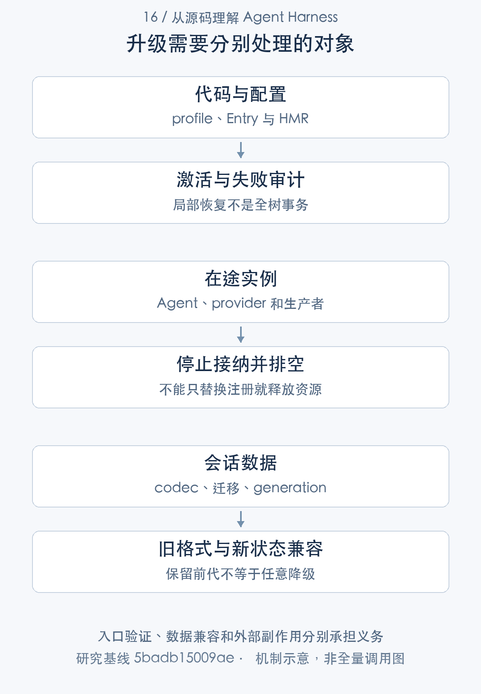

# Agent 系统如何持续演进：部署、兼容与状态迁移

> 从源码理解 Agent Harness · 第 16 篇 · 部署、兼容性与版本演进

升级一个 Agent 系统，远不止换一份程序。已有会话可能还在执行，旧日志需要读取，工具副作用不能撤销，临时产物也可能随进程退出消失。若把“支持热更新”当作完整升级策略，真正的问题通常会在存量任务中暴露。

DeepSeek Harness 的部署路径包括 profile 组合、插件激活审计、配置刷新、模块 HMR、会话格式迁移和有序退出。本文将它们放到一次版本演进中分析，说明**代码可替换、实例可释放与数据可兼容，是三项独立责任**。

## 从受支持入口验证实际组合

CLI 经 runCli、runProfile、boot 解析运行环境与 profile，创建 Context，让 Loader 激活插件树，再检查必需项和 readiness。包能导入、fixture 能手工挂 Context，并不证明这个组合可以作为完整产品启动。[CLI 入口](https://github.com/deepseek-ai/deepseek-harness/blob/5badb15009ae1756c3afe0ae0cef1faafc290ccc/apps/cli/src/bin.ts#L26-L73) [profile 启动和退出](https://github.com/deepseek-ai/deepseek-harness/blob/5badb15009ae1756c3afe0ae0cef1faafc290ccc/apps/cli/src/profile-boot.ts#L244-L326) [应用 boot](https://github.com/deepseek-ai/deepseek-harness/blob/5badb15009ae1756c3afe0ae0cef1faafc290ccc/packages/boot/app-boot/src/index.ts#L973-L1036)

模型、持久化、工具 provider、审批和 UI 能力都由组合决定。缺一个必需依赖，单个包的测试仍可能全部通过，应用却无法提供对应流程。正式部署验证应使用相应 profile 和实际构建产物，而不是临时演示入口代替。

项目处于 developer preview，公共 API 尚未稳定。包号 0.2.1-alpha.1 和 TypeScript 可编译，不足以推导长期 ABI 或跨版本插件兼容承诺。[预稳定版本说明](https://github.com/deepseek-ai/deepseek-harness/blob/5badb15009ae1756c3afe0ae0cef1faafc290ccc/README.md#L11-L13)



## 配置刷新先准备，再等待并审计

Entry 能禁用、移除、激活和重挂插件。普通有效配置变化可能重建 Fiber，仅 volatile 字段变化可保留实例；非法候选警告而不提交 live 值。[Entry 配置更新](https://github.com/deepseek-ai/deepseek-harness/blob/5badb15009ae1756c3afe0ae0cef1faafc290ccc/vendor/loader/src/config/entry.ts#L118-L237)

profile reconciliation 的代码说明，更新完成不只看方法调用是否返回。它保存旧失败和旧 Fiber，准备 patches，await 更新和依赖，再审计新增激活问题。

```typescript
export async function reconcileProfilePatches(
  ctx: Context, patches: PatchOptions[], binName: string, requiredIds: readonly string[] = [],
): Promise<string[]> {
  const entry = bootstrapIncludes.get(ctx)
  if (entry === undefined) throw new Error(`${binName}: profile reload requires the root Include entry`)
  const previousFailures = (await inactiveEntries(ctx)).map(failure => ({
    ...failure, diagnostic: inactiveDiagnostic(failure), fiber: failure.entry.fiber, options: JSON.stringify(failure.entry.options),
  }))
  // Removed entries leave the Loader store before their async disposers finish.
  const previousFibers = [...ctx.loader.entries()].flatMap(row => row.fiber === undefined ? [] : [{
    fiber: row.fiber, failed: row.fiber.state === FIBER_FAILED || row.fiber.state === FIBER_DISPOSED,
  }])
  const { patches: _previous, ...includeConfig } = entry.options.config as Include.Config
  // The recomposition judges the rows the launch judged, resolved from the file this Include read.
  const parentURL = new URL('.', new URL(includeConfig.path, entry.parent.tree.ctx.baseUrl)).href
  const prepared = prepareProfilePatches(ctx, patches, parentURL, binName)
  await entry.update({ config: { ...includeConfig, patches: prepared } })
  const results = await Promise.allSettled(previousFibers.map(({ fiber }) => fiber.await()))
  await ctx.loader.await()
  const failures = await inactiveEntries(ctx)
  const introduced = failures.filter(failure => requiredIds.includes(failure.entry.options.id) || !previousFailures.some(previous =>
    previous.entry === failure.entry && previous.fiber === failure.entry.fiber
    && previous.options === JSON.stringify(failure.entry.options) && previous.diagnostic === inactiveDiagnostic(failure)))
  if (introduced.length > 0) throw new Error(activationDiagnostic(binName, introduced).trimEnd())
  for (const [index, result] of results.entries()) {
    if (result.status === 'rejected' && !previousFibers[index]?.failed) throw result.reason
  }
  ctx.emit('app-boot/config-reload')
  return failures.map(inactiveDiagnostic)
```

[对应源码](https://github.com/deepseek-ai/deepseek-harness/blob/5badb15009ae1756c3afe0ae0cef1faafc290ccc/packages/boot/app-boot/src/index.ts#L274-L302)。以上为原文片段，仅统一缩进，需结合完整实现阅读。

旧 Entry 可能已经从 Loader store 移除，异步 disposer 却还没有结束，因此需要同时等待旧 Fiber。新配置激活完后还要检查必需项与新增失败，成功才通知 config-reload。

但这不是全局事务。解析准备失败可以保护旧配置，应用阶段某个插件失败时，成功的兄弟插件仍可能生效。部署系统应检查最终组合与错误审计，而不是把“有 reload API”写成“失败时全树自动回滚”。[配置重组与激活审计](https://github.com/deepseek-ai/deepseek-harness/blob/5badb15009ae1756c3afe0ae0cef1faafc290ccc/packages/boot/app-boot/src/index.ts#L274-L302)

## 模块 HMR 解决的是另一类变化

模块 HMR 依赖 Loader internal 和 expose-internals，通过串行队列防止嵌套 reload，分析缓存决定局部替换或退出。局部流程备份 ESM／CJS 缓存，导入 replacement，卸载旧 runtime 并等待旧 Fiber，再注册新实现。[HMR 前提与控制](https://github.com/deepseek-ai/deepseek-harness/blob/5badb15009ae1756c3afe0ae0cef1faafc290ccc/packages/boot/hmr/src/index.ts#L262-L340) [partialReload 流程](https://github.com/deepseek-ai/deepseek-harness/blob/5badb15009ae1756c3afe0ae0cef1faafc290ccc/packages/boot/hmr/src/index.ts#L525-L732)

导入失败可以恢复缓存，激活失败尝试恢复旧插件。恢复范围是代码和配置注册，不是旧对象的任意业务状态，更不是工具已经发生的外部写入。base 默认主要监听配置，不代表所有产品 profile 都开箱提供源码热替换。[base 的运行配置](https://github.com/deepseek-ai/deepseek-harness/blob/5badb15009ae1756c3afe0ae0cef1faafc290ccc/packages/bundle/base/cordis.patch.yml#L20-L40)

例如一个模型请求已经准备了 adapter registration，热替换不能假定它会自动换到新实现；安全退出也必须等它结算。一个有持久进程或连接的 provider，更需要停止接纳、排空，再决定如何重挂和恢复状态。

## 会话格式兼容由静态 catalog 承担

本基线当前 writer 格式为 4，历史 codec 和相邻迁移固定导入 catalog。是否挂载某个用户插件，不决定旧物理格式是否存在解码器。

```typescript
export const sessionFormatCatalogOptions: SessionFormatCatalogOptions = {
  currentVersion: 4,
  codecs: [
    releasedV0SessionFormatCodec,
    releasedV1SessionFormatCodec,
    releasedV2SessionFormatCodec,
    releasedV3SessionFormatCodec,
    releasedV4SessionFormatCodec,
  ],
  currentEncoder: releasedV4SessionFormatCodec,
  migrations: [
    sessionFormatV0ToV1,
    sessionFormatV1ToV2,
    sessionFormatV2ToV3,
    sessionFormatV3ToV4,
  ],
  restoreCurrent(artifact) {
    const restored = restoreReleasedV4Artifact(artifact, KNOWN_SESSION_EVENT_TYPES)
    validateInstalledCurrentSessionArtifact(restored)
    return restored
  },
  restoreTransformedCurrent(artifact) {
    return restoreReleasedV4Artifact(artifact, KNOWN_SESSION_EVENT_TYPES)
  },
  restoreCurrentHeader(header) {
    assertReleasedV4Header(header)
    validateInstalledCurrentSessionHeader(header)
    return header
  },
}

/** Physical codec dispatch and complete adjacent chain, independent of mounted plugins. */
export const sessionFormatCatalog = createSessionFormatCatalog(sessionFormatCatalogOptions)
```

[对应源码](https://github.com/deepseek-ai/deepseek-harness/blob/5badb15009ae1756c3afe0ae0cef1faafc290ccc/packages/session/session-format-catalog/src/generated.ts#L16-L48)。以上为原文片段，仅统一缩进，需结合完整实现阅读。

这份表同时规定 currentVersion、currentEncoder、迁移链和当前 artifact 恢复校验。物理格式能解码，与当前安装理解全部事件和载荷，是不同检查。未知事件或数据类型不能因为 JSON 可解析就被无声接受。

这也是保存状态的插件为什么参与升级义务：若它改变模型可见输入、Session 事件或读取类型，需要考虑旧数据和所有 consumer。API 变更只让新代码编译，不会自动迁移已有日志。[会话 header 与格式版本](https://github.com/deepseek-ai/deepseek-harness/blob/5badb15009ae1756c3afe0ae0cef1faafc290ccc/packages/core/session/src/types.ts#L79-L137) [格式基线和发布状态](https://github.com/deepseek-ai/deepseek-harness/blob/5badb15009ae1756c3afe0ae0cef1faafc290ccc/docs/session-format-status.md#L18-L51)

## 新 generation 保留历史，不提供任意降级保证

resolver 选择最高合法 canonical generation，拒绝冲突布局。迁移先准备和校验，写操作取得所有权后发布新的 successor；普通读取不会仅为了升级覆写前代。当前 generation 仍可以追加新事实。[generation 选择](https://github.com/deepseek-ai/deepseek-harness/blob/5badb15009ae1756c3afe0ae0cef1faafc290ccc/packages/session/session-persistence-jsonl/src/index.ts#L1446-L1482) [写 open 与发布路径](https://github.com/deepseek-ai/deepseek-harness/blob/5badb15009ae1756c3afe0ae0cef1faafc290ccc/packages/session/session-persistence-jsonl/src/index.ts#L314-L435)

“保留旧文件”不等于旧程序可以随时接管。新版本已经追加新事件、外部工具已经产生变化，降级后的代码未必理解，也不能把旧 generation 当作最新状态。前代用于历史兼容与追溯，不能直接宣传为任意失败的业务回滚点。

例如升级后模型已经修改文件，即使恢复旧 runtime，文件修改仍存在。迁移和业务副作用属于不同系统，只有明确的版本与补偿协议才能让它们共同支持恢复策略。

## 文档、类型与实现需要一起核对

已有研究发现官方 quick-reference 的 Persistence.export 与实际接口不一致，导出由独立 Host ZIP 路由实现；fork 示例的 meta.seedLength 也与当前 meta.isSeeded 和 inheritedEventCount 不同。[官方接口概述](https://github.com/deepseek-ai/deepseek-harness/blob/5badb15009ae1756c3afe0ae0cef1faafc290ccc/docs/architecture.md#L159-L164) [实际会话导出](https://github.com/deepseek-ai/deepseek-harness/blob/5badb15009ae1756c3afe0ae0cef1faafc290ccc/packages/session-query/session-log-export/src/index.ts#L78-L169) [当前创建选项](https://github.com/deepseek-ai/deepseek-harness/blob/5badb15009ae1756c3afe0ae0cef1faafc290ccc/packages/core/agent/src/index.ts#L64-L118)

升级时只移动源码行号，无法判断原结论是否仍然成立。相同方法文本也可能因为 caller、默认配置、投影或依赖变化改变行为。因此版本研究应沿定义、provider、consumer、配置、执行和清理重新核对，而不是只检查文件是否还在。

测试也应跟随受影响义务选择：入口变化检查真实启动，状态类型变化检查旧日志，provider 生命周期变化检查取消与释放。旧提交的成功日志不能作为新提交运行通过的证据。

## 有序退出是部署能力的一部分

CLI 使用 memoized cleanup 清理 root Fiber 与代理；SDK shutdown 先写响应并 flush transport，再 dispose root 和退出，并清理自己创建的 Agent。provider 停止可能带动依赖消费者卸载，资源释放仍需等待在途工作。[CLI 清理](https://github.com/deepseek-ai/deepseek-harness/blob/5badb15009ae1756c3afe0ae0cef1faafc290ccc/apps/cli/src/profile-boot.ts#L244-L326) [SDK shutdown 顺序](https://github.com/deepseek-ai/deepseek-harness/blob/5badb15009ae1756c3afe0ae0cef1faafc290ccc/packages/sdk/server/src/index.ts#L46-L100)

立刻杀进程可能留下未结算文本、未知工具结果或临时产物消失，恢复器随后只能依据持久事实修补。滚动升级若要求不丢业务结果，应先定义接纳停止、任务 drain、持久产物保存和恢复准入，再设计切流与退出步骤。

本研究没有执行集群滚动升级、跨版本压测、Python wheel 或多平台发布安装。上述步骤是基于源码义务的部署建议，不能写成已经验证的生产方案。

## 优势、不足与技术心得

DSH 的优势是 profile 组合和激活审计有明确入口，配置与模块刷新分开，会话历史格式由静态 catalog 管理，退出也有等待责任。它提供了进一步做版本治理的基础。

不足是局部恢复不能替代整体事务，临时资源与外部副作用不能靠 HMR 自动迁移，预稳定 API 仍要求集成方维护兼容验证。使用者需要为自己的 provider、业务产物和控制面补部署义务。

这一篇也是整套专栏的技术收获：Agent Harness 的成熟度，体现在对状态和执行责任的持续管理。任务怎样接纳，模型看见什么，工具何时产生副作用，取消如何结束，产物怎样保存，以及旧数据怎样被新版本解释，都需要一致的定义和验证。

每项机制都可以单独实现，真正的架构工作是让它们在同一生命周期中协作。对外承诺应依据具体入口、版本和环境，既不因几个测试通过而扩大，也不因能力尚有边界而否定其适用价值。本文沿用既有配置、HMR、存储与恢复验证，最后将源码、解释和限制一起保留，供后续版本继续复核。

---

研究基线：DeepSeek Harness `0.2.1-alpha.1`，提交 `5badb15009ae1756c3afe0ae0cef1faafc290ccc`。源码事实以该版本为准；文中的工程判断和改造建议另行说明。教学场景不代表真实模型业务实测。

源码与运行记录可从[证据索引](../appendices/evidence-index.md)和[验证附录](../appendices/validation.md)复核。本文引用此前同一提交的验证结果，本轮写作不将其重新计为新测试。

[专栏目录](README.md) · [上一篇](15-interaction-deliverables.md)
