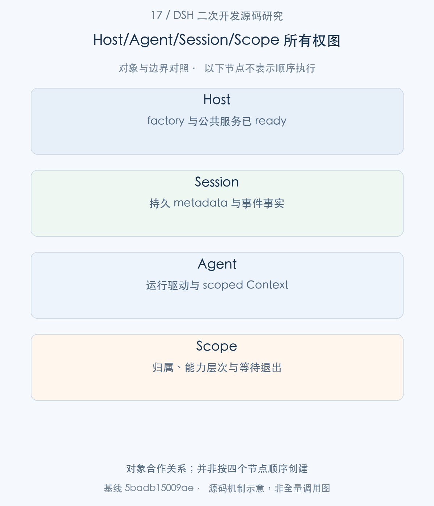
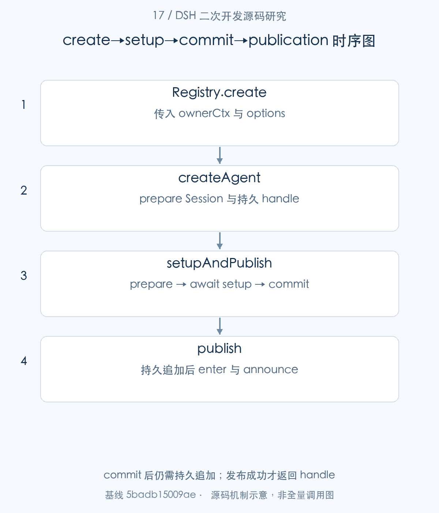
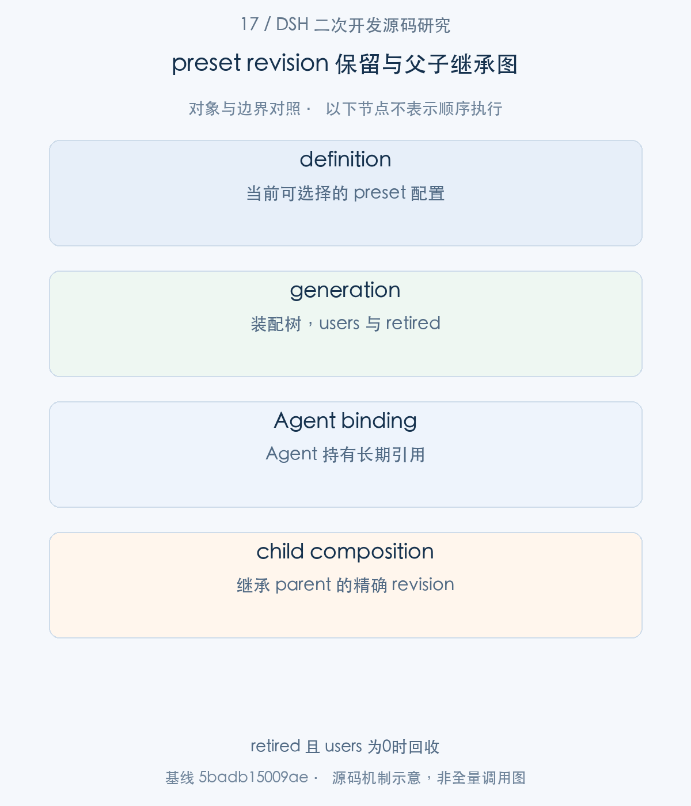
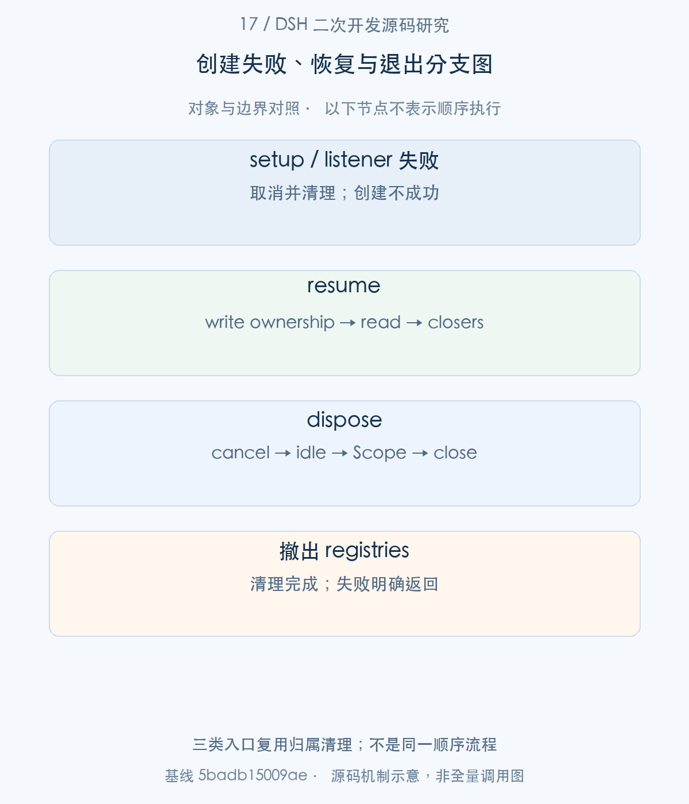

# 17｜从 Host 到一个可运行的 Agent：创建、Scope 与 preset 装配

Host 已经 ready，并不意味着业务所需的 Agent 已经存在。企业任务入口还需要创建 Session、建立 scoped 能力、选择 preset，并取得能负责退出的 handle。本文沿 AgentRegistry → AgentLoop → setupAndPublish 的实际交接展开，并进入 setup 中可选的 preset binding，重点解释一个 Agent 何时才可以被外部观察，以及失败时由谁收回资源。

> 源码基线：DSH `0.2.1-alpha.1`，提交 `5badb15009ae1756c3afe0ae0cef1faafc290ccc`。下文的源码摘录保持原文，仅移除公共缩进。企业新增设计与验证范围另行标明。

## 1. 整体地图：启动完成以后，还需要装配什么

一个最容易混淆的时刻是“服务已经加载”。00篇到达的终点是 Host 的插件树；本篇的起点是业务调用方使用这棵树提供的 Agent factory。创建 API 负责构造和发布，真正提交输入、推进 Turn 则属于返回后的使用阶段。把执行提前放进 setup，会破坏创建阶段的职责约定。

先看四个对象：Session 保留事件事实；Agent 推进执行；Context 决定插件使用哪一组服务与 effects；Scope 给能力提供层次可见性和受控寿命。它们合作，但不是同一个身份容器。



图1。对象合作关系；并非按四个节点顺序创建 [SVG](assets/17-agent-creation-composition-fig-1.svg)。

## 2. 对象与所有权：Agent、Session、Context 和 Scope

步骤1：先读创建输入。AgentRegistry 消费业务入口提供的 sessionId 和元数据；这些信息随后交给 Session 层验证与快照。

<!-- source:S01 -->
源码 [packages/core/agent/src/index.ts:63–94](https://github.com/deepseek-ai/deepseek-harness/blob/5badb15009ae1756c3afe0ae0cef1faafc290ccc/packages/core/agent/src/index.ts#L63-L94)。

```typescript
export interface CreateAgentOptions {
  /** The live agent/session identity. */
  readonly sessionId: SessionId
  /** Live parent Agent for runtime ownership; omit for a root Agent. */
  readonly parentAgent?: Agent
  /**
   * Session creation metadata: validated absolute `cwd`, `parentSession`
   * fork lineage, the `isSeeded` fork marker, the coarse `origin`
   * classification, and the `delegationDepth` recursion budget. Mirrors the
   * `cwd`/`parentSession`/`isSeeded`/`origin`/`delegationDepth` fields of
   * {@link CreateSessionOptions.meta} in dsh-session (the internal-only
   * `createdAt`, used when reconstructing a persisted session, is deliberately
   * excluded — a factory caller never sets it). This is durable session data,
   * so the session boundary validates and snapshots it before asynchronous
   * setup begins.
   */
  readonly meta?: {
    readonly cwd?: string
    readonly parentSession?: SessionId
    readonly isSeeded?: boolean
    readonly origin?: 'subagent'
    readonly delegationDepth?: number
    readonly agentPreset?: string
  }
  /** Exact fork-inherited prefix length when the session metadata sets `isSeeded`. */
  readonly inheritedEventCount?: SessionLogOffset
  /**
   * Initial replay/fork history, contiguous from seq 0 with lossless-JSON data.
   * A fork supplies an exact parent prefix, its inherited marker, and closers
   * for the open tail. Previously closed steps and turns remain unchanged.
   * The factory validates and snapshots the seed before publication.
   */
```

sessionId 是 Agent 和 Session 共享的 live identity。parentAgent 是当前运行对象的父引用，parentSession 则记录可持久化的 lineage，两者不能互换。seed 是事件前缀，inheritedEventCount 标记其中继承的范围；它不是任意文本数组。

创建输入的后半段还包含运行路由、创建期取消和装配回调。将它接到前面的identity与metadata后，才是业务入口真正交给factory的完整输入。

<!-- source:S15 -->
源码 [packages/core/agent/src/index.ts:95–119](https://github.com/deepseek-ai/deepseek-harness/blob/5badb15009ae1756c3afe0ae0cef1faafc290ccc/packages/core/agent/src/index.ts#L95-L119)。

```typescript
  readonly seed?: readonly SessionEvent[]
  /** Per-agent options (model, …). */
  readonly agentOptions?: AgentOptions
  /** Optional creation-only cancellation signal; detached before the returned handle becomes visible. */
  readonly signal?: AbortSignal
  /**
   * Creation-time composition of the agent's scoped world. The factory awaits
   * setup after minting `agentCtx` but BEFORE inserting or announcing either
   * the session or agent, so observers can never see a partially configured
   * world. Setup may return an {@link AgentSetupCommit}; the factory invokes its
   * synchronous `commit()` after every setup await settles and immediately
   * before registry publication. This lets mutable provisioning revalidate at
   * the exact publication boundary. Everything registered through `agentCtx`
   * (scoped tools, prompt sections/variables, `restrict()`, listeners, awaited
   * child plugins) exists before `session/created`, `agent/created`,
   * and the first prompt assembly. A setup
   * throw/rejection, commit throw, or owner disposal rolls the scope back
   * without publishing either id.
   *
   * **Setup composes, it never drives**: the callback is trusted same-process
   * code and receives the full scoped context, so this is a contract rather
   * than a runtime restriction. Drive the agent only after creation resolves.
   */
  readonly setup?: AgentSetup
}
```

`agentOptions`控制这个Agent的模型等运行选项；`signal`只覆盖创建阶段；`setup`获得scoped Context，并可以返回同步commit检查。注释中的“setup不驱动执行”是可信调用方的契约约定，不是隔离机制。实际commit到publish之间仍有持久追加await，第四节会按实现解释。

输入对象确定后，再看能力容器怎样获得退出责任。createScope 将 Fiber 的原始 disposer 包装成可等待的 Scope。

<!-- source:S02 -->
源码 [packages/core/scope/src/index.ts:127–166](https://github.com/deepseek-ai/deepseek-harness/blob/5badb15009ae1756c3afe0ae0cef1faafc290ccc/packages/core/scope/src/index.ts#L127-L166)。

```typescript
}

/**
 * Mint a scope under `ctx`. The scoped context inherits the minting plugin's
 * dependency API and owns every registration made through it.
 * @param ctx - active context whose dependency API the scope inherits.
 * @param key - opaque identity used for listener routing.
 * @param options - optional scope-chain placement.
 * @returns the scoped context and exact/shared disposal boundaries.
 */
export function createScope(ctx: Context, key: ScopeKey, options?: CreateScopeOptions): Scope {
  if (options?.parent !== undefined) bindScopeParent(key, options.parent)
  const fiber = ctx.plugin(scope)
  const scoped: Context = fiber.ctx.extend({ [kScope]: key })
  let disposing: Promise<void> | undefined
  return {
    ctx: scoped,
    rawDispose: fiber.dispose,
    dispose: () => (disposing ??= quiesceFiber(fiber)),
  }
}

/**
 * Read the nearest scope tag inherited by a context.
 * @param ctx - context to inspect.
 * @returns its scope key, or `undefined` for an unscoped context.
 */
export function scopeOf(ctx: Context): ScopeKey | undefined {
  return (ctx as Context & { [kScope]?: ScopeKey })[kScope]
}

/**
 * Build an opaque receiver that preserves the base filter, admits untagged
 * listeners globally, and admits tagged listeners for a matching key or any
 * of its ancestors ({@link bindScopeParent}): a listener owned by an enclosing
 * scope receives every descendant scope's events, which is what lets one
 * standing composition observe each of the agents composed under it. A tag
 * BELOW the dispatch key stays excluded — events flow up the chain, never
 * down.
 * @param base - subject or service whose existing Cordis filter is preserved.
```

关键不是简单添加一个标签。Scope 暴露 ctx、rawDispose 和 dispose；退出要等 Fiber 的 inertia 排空。插件中返回 disposer，或者把清理挂入 ctx.effect，才能进入这条归属链。企业扩展不能只把资源放进全局 Map 而绕开它。

|对象|创建阶段保存的事实|退出时的责任|
|---|---|---|
|Session|id、metadata、事件序列|关闭持久写路径、撤出 live store|
|Agent|执行状态、Session 引用|cancel 后等待 idle|
|Context / Fiber|服务使用、effects、插件子树|撤销 effects 并等待收敛|
|preset generation|装配树、users、retired|最后使用者离开后释放旧树|



图2。commit 后仍需持久追加；发布成功才返回 handle [SVG](assets/17-agent-creation-composition-fig-2.svg)。

## 3. 创建入口：从调用参数进入 AgentRegistry.create()

步骤2：业务调用 ctx.agents.create(options)，进入 Registry。这里的关键交接是 ownerCtx，而非重新寻找一个全局 Context。

<!-- source:S03 -->
源码 [packages/core/agent/src/index.ts:383–401](https://github.com/deepseek-ai/deepseek-harness/blob/5badb15009ae1756c3afe0ae0cef1faafc290ccc/packages/core/agent/src/index.ts#L383-L401)。

```typescript
 * Create and publish a new agent through the registered factory.
 * Distinct from {@link register} (which records an already-constructed
 * agent): this constructs the agent and its session. Rejects if no factory is
 * registered or creation/setup fails. The resolved {@link AgentHandle} lets
 * the owner tear down exactly this agent.
 * @param options - shared identity, optional live parent, session seed/metadata, and agent options.
 * @returns the handle after setup, rollback-covered publication, and loop start complete.
 */
async create(options: CreateAgentOptions): Promise<AgentHandle> {
  const ownerCtx = this.ctx
  // Re-trace a Service-backed factory through the accessing context
  // explicitly. This preserves AgentLoop's dependency origin while binding
  // its effects to ownerCtx; plain factories receive ownerCtx as an explicit
  // capability and need no Cordis tracker magic.
  const { target } = this.requireFactory()
  const receiver = getTraceable(ownerCtx, target)
  // oxlint-disable-next-line typescript/unbound-method -- Reflect.apply intentionally supplies the caller-traced receiver
  return Reflect.apply(target.createAgent, receiver, [ownerCtx, options])
}
```

Registry 从已注册的 factory 获得 target，再通过 getTraceable 和 Reflect.apply 调用 createAgent。调用方的 ownerCtx 作为独立参数向后传递；factory 的服务来源和调用方的资源归属同时得到保留。

步骤3：createAgent 接住 ownerCtx 与 options，先调用 sessions.prepare，再等待可选持久写路径，最后进入 setupAndPublish。

<!-- source:S04 -->
源码 [packages/core/agent-loop/src/index.ts:714–750](https://github.com/deepseek-ai/deepseek-harness/blob/5badb15009ae1756c3afe0ae0cef1faafc290ccc/packages/core/agent-loop/src/index.ts#L714-L750)。

```typescript
async createAgent(ownerCtx: Context, options: CreateAgentOptions): Promise<AgentHandle> {
  const preparation = SessionPreparation.create(this.runtime.ctx.sessions.prepare(options.sessionId, {
    ...options.seed === undefined ? {} : { seed: options.seed },
    ...options.meta === undefined ? {} : { meta: options.meta },
    ...options.inheritedEventCount === undefined ? {} : { inheritedEventCount: options.inheritedEventCount },
  }))
  const published = (async () => {
    let stored: StoredSession | undefined
    try {
      // raceAbortCall normalizes a pre-aborted or mid-create abort and
      // closes a handle that finishes creating after abandonment.
      stored = options.signal === undefined
        ? await this.createStoredSession(preparation.session)
        : await raceAbortCall(
          () => this.createStoredSession(preparation.session, options.signal),
          options.signal,
          options.sessionId,
          (abandoned) => { void abandoned?.handle.close().catch(() => {}) },
        )
    } catch (error: unknown) {
      preparation[Symbol.dispose]()
      throw error
    }
    return this.setupAndPublish(
      ownerCtx,
      options.sessionId,
      preparation,
      options.agentOptions ?? {},
      options.setup,
      options.signal,
      'startup',
      stored,
      options.parentAgent,
    )
  })()
  this.ownership.trackWrapper(published)
  return published
```

prepare 得到的是尚未发布的 Session。持久创建异常会释放 preparation；signal 取消以后才迟到的 handle 也要关闭。ownership.trackWrapper 跟踪整个创建 Promise，使 factory 卸载不只看已返回的实例。到这里尚不能从 registries 读到一个完整 Agent。

## 4. 发布之前：setup、commit 与观察者通知

步骤4：setupAndPublish 会先调用 prepare；prepare 接收同一个 ownerCtx、id、Session 与持久 handle，建立运行实例的归属。

<!-- source:S05 -->
源码 [packages/core/agent-loop/src/index.ts:479–517](https://github.com/deepseek-ai/deepseek-harness/blob/5badb15009ae1756c3afe0ae0cef1faafc290ccc/packages/core/agent-loop/src/index.ts#L479-L517)。

```typescript
private prepare(
  ownerCtx: Context,
  id: SessionId,
  options: AgentOptions,
  session: Session,
  callerSignal?: AbortSignal,
  handle?: SessionHandle,
  parentAgent?: Agent,
): PreparedAgent {
  assertAgentOptions(options)
  ownerCtx.fiber.assertActive()
  // Every caller reaches prepare() synchronously from a service method
  // whose Cordis dispatch already requires the live factory fiber, or
  // re-checks ownership itself after its awaits (resume's load barrier).
  /* v8 ignore next -- unreachable backstop, see above */
  if (!this.ownership.isActive()) throw new Error('agent loop is not active')
  if (callerSignal?.aborted) {
    throw callerSignal.reason instanceof Error
      ? callerSignal.reason
      : new Error(`agent "${id}" creation aborted`, { cause: callerSignal.reason })
  }
  const loopCtx = this.runtime.ctx

  // Deactivation fuses three owners, each with its own reason: the caller's
  // cancellation signal, the owner fiber's unload, and factory teardown.
  // It is registered BEFORE any resource exists, over mutable slots, so an
  // unload arriving while the scope is still minting finds a working
  // disposer instead of a leak.
  const abort = new AbortController()
  const onCallerAbort = (): void => {
    abort.abort(callerSignal?.reason instanceof Error
      ? callerSignal.reason
      : new Error(`agent "${id}" creation aborted`, { cause: callerSignal?.reason }))
  }
  const onFactoryTeardown = (): void => { abort.abort(this.ownership.signal.reason) }
  callerSignal?.addEventListener('abort', onCallerAbort, { once: true })
  this.ownership.signal.addEventListener('abort', onFactoryTeardown, { once: true })

  let machine: ReactLoopAgent | undefined
```

先 assertActive，再关联调用方取消、factory teardown 和 owner effect。这种顺序让“资源尚在构造时 owner 就退出”的路径也能找到 disposer。这里的 AbortController 管的是创建和归属，不等同于某次业务 Turn 的 signal。

步骤5：prepare 返回 PreparedAgent 后，setupAndPublish 将真正的初始化操作交给 initializeAgent。

<!-- source:S06 -->
源码 [packages/core/agent-loop/src/index.ts:754–800](https://github.com/deepseek-ai/deepseek-harness/blob/5badb15009ae1756c3afe0ae0cef1faafc290ccc/packages/core/agent-loop/src/index.ts#L754-L800)。

```typescript
private async setupAndPublish(
  ownerCtx: Context,
  id: SessionId,
  preparation: SessionPreparation,
  agentOptions: AgentOptions,
  setup: AgentSetup | undefined,
  signal: AbortSignal | undefined,
  source: SessionStartSource,
  stored?: StoredSession,
  parentAgent?: Agent,
): Promise<AgentHandle> {
  using ownedPreparation = preparation
  const session = ownedPreparation.session
  let prepared: PreparedAgent
  try {
    prepared = this.prepare(ownerCtx, id, agentOptions, session, signal, stored?.handle, parentAgent)
  } catch (error: unknown) {
    await stored?.handle.close().catch(() => {})
    throw error
  }
  return await this.initializeAgent(prepared, async () => {
    const setupCommit = await raceAbort(setup?.(prepared.agent.ctx, prepared.agent), prepared.signal, id)
    setupCommit?.commit()
    await this.appendUnstoredSuffix(stored, session)
    return await prepared.publish(source)
  })
}

private async initializeAgent(prepared: PreparedAgent, initialize: () => Promise<AgentHandle>): Promise<AgentHandle> {
  try {
    return await prepared.agent.runMaintenance(async () => {
      try {
        return await initialize()
      } catch (error: unknown) {
        // Teardown owns inbox cleanup and may already have removed its projection.
        prepared.agent.cancel({ kind: 'disposed' }, { keepInbox: true })
        throw error
      }
    })
  } catch (error: unknown) {
    // Rollback swallows a disposal rejection (a failing final handle close):
    // the setup failure is the primary error the caller must see.
    await prepared.dispose().catch(() => {})
    throw error
  }
}

```

setup 返回值通过 raceAbort 等待；可选 commit 同步执行，随后 appendUnstoredSuffix 和 publish。代码中 commit 与 publish 之间仍有持久追加的 await，因此不要夸大成完全无异步间隙的数据库事务。commit 的作用是完成最后的装配检查，发布成功还需持久路径及后续通知成功。initializeAgent 用 maintenance 屏障执行这一过程；异常时取消并等待 dispose，保留原始 setup 错误。

步骤6：只有初始化准备完成，PreparedAgent.publish 才把 Session 和 Agent 放进各自 registry，并发送通知。

<!-- source:S07 -->
源码 [packages/core/agent-loop/src/index.ts:616–638](https://github.com/deepseek-ai/deepseek-harness/blob/5badb15009ae1756c3afe0ae0cef1faafc290ccc/packages/core/agent-loop/src/index.ts#L616-L638)。

```typescript
      try {
        assertLive()
        detachSession = agent.ctx.sessions.enter(session)
        // The mounted backend routes announced live events into the active
        // write handle by session id; the loop only owns the handle itself.
        detachAgent = loopCtx.agents.enter(agent, parentAgent)
        agent.ctx.sessions.announce(session)
        assertLive()
        await loopCtx.agents.announce(agent, source, abort.signal)
        assertLive()
        return { agent, dispose }
      } finally {
        publication.resolve()
        publication = undefined
      }
    },
    dispose,
  }
} catch (error: unknown) {
  machineReady.resolve()
  // Rollback swallows a disposal rejection: the setup failure is primary.
  void dispose().catch(() => {})
  throw error
```

顺序为 sessions.enter → agents.enter → sessions.announce → await agents.announce。publication Promise 保留通知期间的 Session/Scope，避免 owner 卸载与异步 creation listener 交叉时提前释放。返回的 { agent, dispose } 才是业务方可以使用并承担清理的 handle。

## 5. preset 装配：选择、revision 保留与子 Agent 继承

步骤7：setup 可以请求 agentPresets.mount。先追它的前置对象：register 为定义创建 record，activate 装配一棵独立 preset Scope。

<!-- source:S08 -->
源码 [packages/preset/agent-preset-registry/src/index.ts:83–126](https://github.com/deepseek-ai/deepseek-harness/blob/5badb15009ae1756c3afe0ae0cef1faafc290ccc/packages/preset/agent-preset-registry/src/index.ts#L83-L126)。

```typescript
  if (!definition.id.trim()) throw new Error('Preset id must not be empty')
  if (this.definitions.has(definition.id)) throw new Error(`Duplicate agent preset: ${definition.id}`)
  const record: Definition = { config: definition, context, ready: Promise.resolve() }
  this.definitions.set(definition.id, record)
  let disposed = false
  const unregister = async (): Promise<void> => {
    if (disposed) return
    disposed = true
    this.definitions.delete(definition.id)
    await record.ready
    if (record.generation !== undefined) {
      record.generation.retired = true
      await this.collect(record.generation)
    }
  }
  record.ready = this.activate(record)
  await record.ready
  return unregister
}

private async activate(record: Definition): Promise<void> {
  const key = {}
  const scope = createScope(this.owner, key)
  try {
    const problem = entryListProblem(record.config.plugins)
    if (problem !== undefined) throw new Error(problem)
    const context = scope.ctx.extend({ baseUrl: record.context.baseUrl })
    const mount = await mountPreset(context, record.config.id, record.config.plugins)
    const generation: Generation = { scope, key, mount, users: 0, retired: false }
    context.effect(() => {
      this.generations.set(key, generation)
      return () => { this.generations.delete(key) }
    }, 'agent-preset.mount')
    record.generation = generation
  } catch (error) {
    record.broken = (error as Error).message
    this.owner.logger.warn(`agent preset ${record.config.id}: ${record.broken}`)
    await scope.dispose()
  }
}

/**
 * Current activation diagnostic of a definition.
 *
```

definition 和 generation 必须区分。definition 是当前可被选择的配置记录；generation 是已装配的能力树。激活失败写入 broken，保留可观察的诊断，但不会把失效 tree 当成可用 preset。users 从0开始，只有真正绑定或临时保留后才增加。

步骤8：mount 先 retain 一个可用 generation，再 bind 当前 Agent 的 Scope。

<!-- source:S09 -->
源码 [packages/preset/agent-preset-registry/src/index.ts:249–296](https://github.com/deepseek-ai/deepseek-harness/blob/5badb15009ae1756c3afe0ae0cef1faafc290ccc/packages/preset/agent-preset-registry/src/index.ts#L249-L296)。

```typescript

private async bind(ctx: Context, generation: Generation): Promise<void> {
  const key = scopeOf(ctx)
  if (key === undefined) throw new Error('Agent preset binding requires a scoped context')
  const binding = this.bindings.get(key)
  if (binding?.generation === generation) return
  if (binding !== undefined) {
    binding.parent.rebind(generation.key)
    const old = binding.generation
    generation.users++
    binding.generation = generation
    old.users--
    await this.collect(old)
  } else this.join(ctx, key, generation)
}

private join(ctx: Context, key: ScopeKey, generation: Generation): void {
  const binding = { parent: bindScopeParent(key, generation.key), generation }
  generation.users++
  this.bindings.set(key, binding)
  ctx.effect(() => async () => {
    this.bindings.delete(key)
    binding.generation.users--
    await this.collect(binding.generation)
  }, 'agent-preset.binding')
}

/** Bind an unpublished Agent to the current preset revision.
 * @param ctx Agent context from its setup callback.
 * @param id Requested preset, or the default.
 * @returns Bound preset identity.
 */
async mount(ctx: Context, id?: string): Promise<AgentPreset> {
  const generation = await this.retain(id)
  try {
    await this.bind(ctx, generation)
    return { id: generation.mount.presetId }
  } finally {
    generation.users--
    await this.collect(generation)
  }
}

/** Join a child to the exact revision retained by its parent.
 * @param ctx Child Agent context.
 * @param parent Parent Agent context.
 * @returns Inherited preset id, or undefined in a preset-free composition.
 */
```

retain 的临时引用保证异步选择期间 revision 不被释放；bind/join 为 Agent 增加长期引用。mount 的 finally 只释放临时引用。Agent 退出时 ctx.effect 的清理再释放长期引用，所以刚返回 mount 不会卸载仍被 Agent 使用的 preset。

步骤9：子 Agent 继承时进入 composeFrom，参数不是 preset 名称，而是 parent Context。

<!-- source:S10 -->
源码 [packages/preset/agent-preset-registry/src/index.ts:298–319](https://github.com/deepseek-ai/deepseek-harness/blob/5badb15009ae1756c3afe0ae0cef1faafc290ccc/packages/preset/agent-preset-registry/src/index.ts#L298-L319)。

```typescript
  const generation = this.generationFor(parent)
  if (generation === undefined) {
    if (parent.get('agentPresets')?.composedPreset(parent) !== undefined) {
      throw new Error('Parent preset revision is unavailable')
    }
    return undefined
  }
  // A child has no existing binding, so this path has no asynchronous cleanup.
  const key = scopeOf(ctx)
  if (key === undefined) throw new Error('Child preset binding requires a scope')
  if (this.bindings.has(key)) throw new Error('Child already joined a preset')
  this.join(ctx, key, generation)
  return generation.mount.presetId
}

/** Read the preset a live Agent uses.
 * @param ctx Agent context.
 * @returns Its preset id, if bound.
 */
composedPreset(ctx: Context): string | undefined { return this.generationFor(ctx)?.mount.presetId }

/** Read a service supplied inside an Agent's isolated preset group.
```

generationFor(parent) 找的是父实例实际使用的 revision。它将 child Scope 接入这棵树，避免配置热变更后 child 悄悄获得一套不同策略。bindScopeParent 的受控 rebind 也意味着 Scope 层次不能由任意扩展随意改写。

旧定义被注销以后，谁负责真正回收？答案在 collect 的两个条件里。

<!-- source:S11 -->
源码 [packages/preset/agent-preset-registry/src/index.ts:151–156](https://github.com/deepseek-ai/deepseek-harness/blob/5badb15009ae1756c3afe0ae0cef1faafc290ccc/packages/preset/agent-preset-registry/src/index.ts#L151-L156)。

```typescript
  await generation.scope.dispose()
}

private generationFor(ctx: Context): Generation | undefined {
  const key = scopeOf(ctx)
  const parent = key === undefined ? undefined : scopeParentOf(key)
```

retired 标记已经退出选择目录；users===0 表示没有 Agent 或临时 lease 继续使用。两个条件同时成立才 dispose。这个机制保留了在途任务的环境一致性，其代价是旧 generation 会继续占用资源，运维需要观察活跃用户及退出是否完成。



图3。retired 且 users 为0时回收 [SVG](assets/17-agent-creation-composition-fig-3.svg)。

## 6. resume、fork 和退出：复用哪些事实，重建哪些能力

步骤10：恢复不是重放一次 create。resumeWith 先获得持久 Session 的 write ownership，再读取已存在的事件。

<!-- source:S12 -->
源码 [packages/core/agent-loop/src/index.ts:831–866](https://github.com/deepseek-ai/deepseek-harness/blob/5badb15009ae1756c3afe0ae0cef1faafc290ccc/packages/core/agent-loop/src/index.ts#L831-L866)。

```typescript
  ...options.signal === undefined ? [] : [options.signal],
  ownerAbort.signal,
  this.ownership.signal,
])
let handle: SessionHandle | undefined
let stored: StoredSession | undefined
let preparation: SessionPreparation | undefined
try {
  try {
    // Taking write ownership FIRST excludes a concurrent resume of the
    // same id (in this process, a live agent's handle holds the claim).
    handle = await raceAbortCall(
      () => persistence.open(id, 'write', { signal: fused }),
      fused,
      id,
      (abandoned) => { void abandoned.close() },
    )
    // Semantic crash repair is the agent layer's job: persistence hands
    // back the physically valid log; an interrupted final turn receives
    // synthetic closers (missing tool errors, step/end, turn/end) that
    // are appended through the same handle as an ordinary batch.
    const coldRead = await handle.read(0, undefined, { signal: fused })
    fused.throwIfAborted()
    const persisted = coldRead.events
    const closers = interruptedTurnClosers(persisted)
    if (closers.length > 0) await handle.append(closers)
    preparation = SessionPreparation.create(this.runtime.ctx.sessions.prepare(id, {
      seed: [...persisted, ...closers],
      meta: structuredClone(handle.header),
      inheritedEventCount: handle.inheritedEventCount,
      eventState: coldRead.eventState,
    }))
    stored = { handle, storedCount: persisted.length + closers.length }
    await this.appendUnstoredSuffix(stored, preparation.session)
  } finally {
    await unfollowOwner()
```

先 open(write) 排除同一身份的并发恢复；read 返回物理有效日志后，由 Agent 层补 interruptedTurnClosers，再通过同一个 handle 追加。sessions.prepare 使用 persisted+closers 重建 live Session，随后仍走 setupAndPublish。恢复了历史事实，但 scoped 服务、缓存和连接是新装配的运行资源。

步骤11：创建失败、owner 卸载和主动 dispose 最终复用 prepare 内的同一清理 Promise。

<!-- source:S13 -->
源码 [packages/core/agent-loop/src/index.ts:524–572](https://github.com/deepseek-ai/deepseek-harness/blob/5badb15009ae1756c3afe0ae0cef1faafc290ccc/packages/core/agent-loop/src/index.ts#L524-L572)。

```typescript
// stop the machine, drain and close the session's write path, leave the
// registries, unwind the scope, release bookkeeping.
const dispose = (ownerTriggered = false): Promise<void> => (disposing ??= (async () => {
  abort.abort(new Error(`agent "${id}" lifecycle disposed`))
  callerSignal?.removeEventListener('abort', onCallerAbort)
  this.ownership.signal.removeEventListener('abort', onFactoryTeardown)
  // Teardown failures are collected, never swallowed: registry, scope,
  // and ownership cleanup always run to quiescence, then the memoized
  // disposal rejects with what failed so every racing owner observes it.
  const failures: unknown[] = []
  try {
    // Creation listeners retain the session and scope through their awaits.
    if (publication !== undefined) await publication.promise
    // Disposal IS a disposed-cause cancel followed by quiescence. New work
    // sent after this point is the sender's bug — the registries are about
    // to drop the agent, so nothing should still hold it.
    /* v8 ignore next -- Cordis effect teardown waits for synchronous setup before observing the machine slot. */
    if (machine === undefined) await machineReady.promise
    /* v8 ignore next -- setup failure untracks this disposer before resolving without a machine. */
    if (machine !== undefined) {
      machine.cancel({ kind: 'disposed' })
      await machine.whenIdle()
      await machine.scope.dispose()
    }
  } catch (error: unknown) {
    failures.push(error)
  }
  // The loop above committed its closing events synchronously into the
  // session; handle close drains them durably before releasing the write
  // path. The close drain can be the first operation that surfaces a
  // durability failure, so its error is retained, not logged away.
  try {
    await handle?.close()
  } catch (error: unknown) {
    failures.push(error)
  }
  try {
    detachAgent?.()
    detachSession?.()
  } finally {
    untrack()
    if (!ownerTriggered) await unfollowOwner()
  }
  if (failures.length === 1) throw failures[0]
  if (failures.length > 1) {
    throw new AggregateError(failures, `agent "${id}" disposal failed`)
  }
})())
const untrack = this.ownership.track(dispose)
```

disposing ??= 保证竞态调用等待同一退出结果。machine.cancel 后等待 whenIdle 和 Scope dispose；handle.close 负责持久 drain，最后撤出 registries。清理失败会累积并可能抛 AggregateError，而不是静默假装退出成功。factory 维护这些责任，所以 fork 需要正确提交 parentAgent 和继承历史，而不是复制一个 Agent 对象。



图4。三类入口复用归属清理；不是同一顺序流程 [SVG](assets/17-agent-creation-composition-fig-4.svg)。

将上述创建和退出放到一次企业任务中，交接会更直观。业务入口先取得可信任务信息，再将 `sessionId`、元数据与 `setup` 交给 Registry。`setup` 可以进行异步授权和能力装配，但此时任务仍在准备阶段：外部尚不应把它展示为可运行 Agent。授权在等待中发生变化时，需要在最后装配检查处拒绝创建；创建 Promise 拒绝后，由 factory 释放 preparation、撤出 live 注册并关闭 Scope 与 handle。

若创建成功，则入口接住 `AgentHandle`，发送输入，并在任务结束后等待 `dispose()`。句柄的意义不是保留一个方便调用的对象，而是明确谁负责从“停止接纳”走到“退出完成”。企业请求取消时也应沿这一归属关系清理，不能仅把HTTP响应结束当作资源释放。

preset 更新会给这条链增加一个维度：已有 Agent 仍使用自己绑定的 generation，新的根 Agent 可以选择新 revision，child 则从父 Context 继承实际 generation。由此可以安排一次有意义的升级实验：更新定义后分别检查旧任务、新任务和旧任务生成的 child，再等待旧任务全部退出，观察 retired generation 的回收。这个实验验证的是任务环境的一致性，而非只验证目录显示了新名称。

## 7. 开发示例与验证：创建一个有业务工具和策略的 Agent

下面把发布失败的契约落到一个现成测试。测试通过真实 Registry/factory 装配，故意让异步 creation listener 失败。

<!-- source:S14 -->
源码 [packages/core/agent-loop/tests/scope-lifecycle.spec.ts:131–152](https://github.com/deepseek-ai/deepseek-harness/blob/5badb15009ae1756c3afe0ae0cef1faafc290ccc/packages/core/agent-loop/tests/scope-lifecycle.spec.ts#L131-L152)。

```typescript
it('rolls back both registries and the scope when asynchronous creation fails', async () => {
  const adapter = new MockAdapter([textResponse('unexpected')])
  const ctx = await harness(adapter)
  const reason = new Error('async creation veto')
  const order: string[] = []
  ctx.on('agent/created', async ({ agent }) => {
    agent.followup(createUserMessage({ content: text('queued during creation'), source: { kind: 'user' } }))
    await Promise.resolve()
    throw reason
  })
  ctx.on('agent/created', () => { order.push('later-listener') })
  ctx.on('agent/disposed', () => { order.push('agent-disposed') })
  ctx.on('session/disposed', () => { order.push('session-disposed') })
  await expect(ctx.agents.create({
    sessionId: SessionId('async-veto'),
    setup(agentCtx) { agentCtx.effect(() => () => { order.push('scope-disposed') }) },
  })).rejects.toBe(reason)
  expect(order).toEqual(['scope-disposed', 'agent-disposed', 'session-disposed'])
  expect(ctx.agents.list()).toEqual([])
  expect(ctx.sessions.list()).toEqual([])
  expect(adapter.requests).toHaveLength(0)
  await ctx.fiber.dispose()
```

断言关注三类对象一起撤销以及 Session/Agent 不再可见。此处故障在 publication listener，区别于更早的 setup rejection；业务扩展也应分别覆盖这两段。可在 setup 挂业务工具和 restrict 策略，创建 resolve 后再提交输入，持有 handle 的入口在 finally 中 await dispose。

企业实施时建议把业务资源授权、工具注册和 preset.mount 放进 setup，远端数据的实际写操作放在创建之后。setup 若需要异步拉取政策，取消后还应识别迟到结果，不能继续把外部连接登记到已经退出的 Context。

可复核入口（`pnpm` 命令在 `.sources/deepseek-harness` 中运行，`node research/...` 命令在本研究仓库根目录运行；实际执行结果见[本批验证记录](../validation/supplementary-articles-validation.md)）：

```sh
pnpm exec vitest run packages/core/agent-loop/tests/scope-lifecycle.spec.ts packages/preset/agent-preset-registry/tests/registry.spec.ts
```

本篇使用现有源码测试说明契约，并不把 mock 的通过解释成真实模型、外部 server、浏览器或企业基础设施已经验收。
## 8. 工程心得：能力完整性应在发布边界建立

这条创建链给我的直接收获，是把“能力完整”定义在发布之前，把“责任完整”定义在返回 handle 之前。Agent 能被观察时，工具和策略应已装好；入口离开时，持久写路径和插件 effects 应能等待到确定的退出结果。

preset generation 则提供了另一种值得借鉴的稳定性：运行中的任务按实际 revision 继承，而不是每一步都重新查最新配置。企业政策版本应保存在受控的TaskSpec等业务记录中，再通过SessionId关联。上游[SessionHeader字段](https://github.com/deepseek-ai/deepseek-harness/blob/5badb15009ae1756c3afe0ae0cef1faafc290ccc/packages/core/session/src/types.ts#L95-L131)没有任意政策版本扩展槽；agentPreset只记录preset身份，不等于持久化generation快照。恢复后的授权仍需重新核验，运行期间则沿generation留存机制观察其使用寿命。

Scope 的价值是组织和归属。它让工程师可以推导谁能看到能力、谁负责退出；租户授权和不可信程序隔离仍需要另外的资源校验或执行环境。把这两类责任分别实现，创建入口才既清晰又可维护。


[返回补充专题目录](README.md#补充专栏17—28) · [对应写作大纲](../appendices/supplementary-article-outlines.md)
