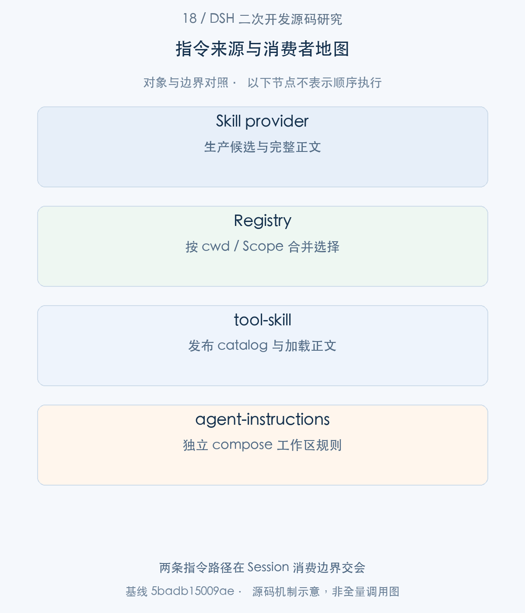
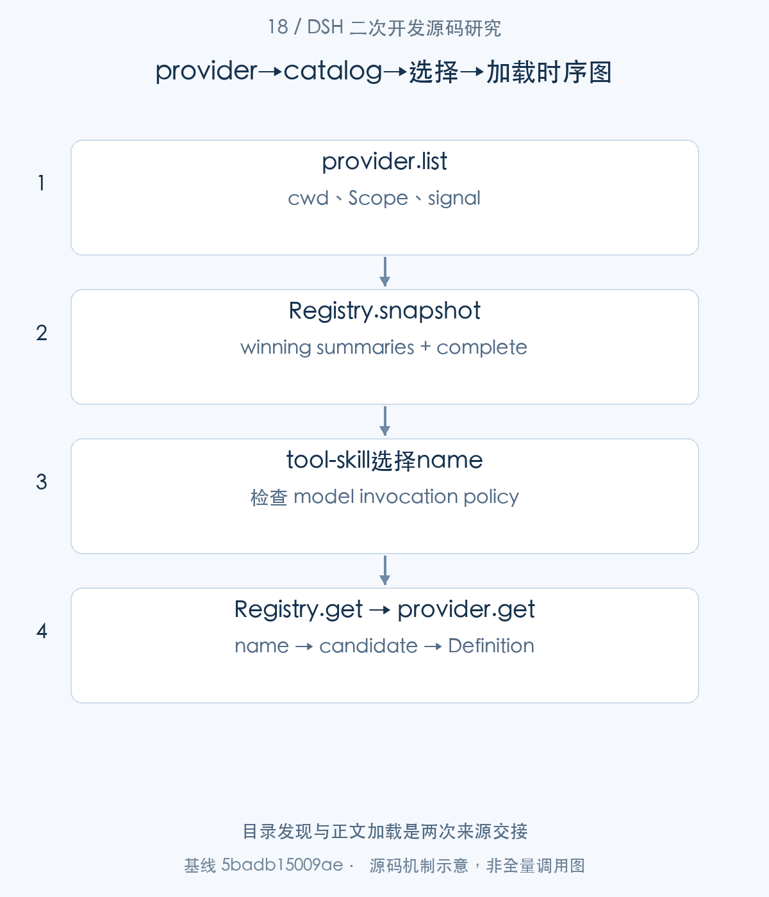
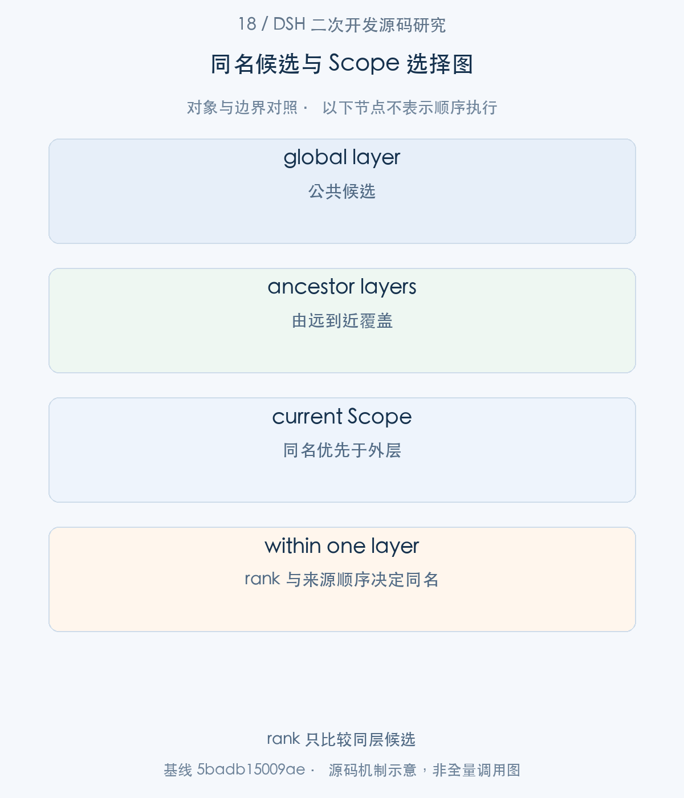
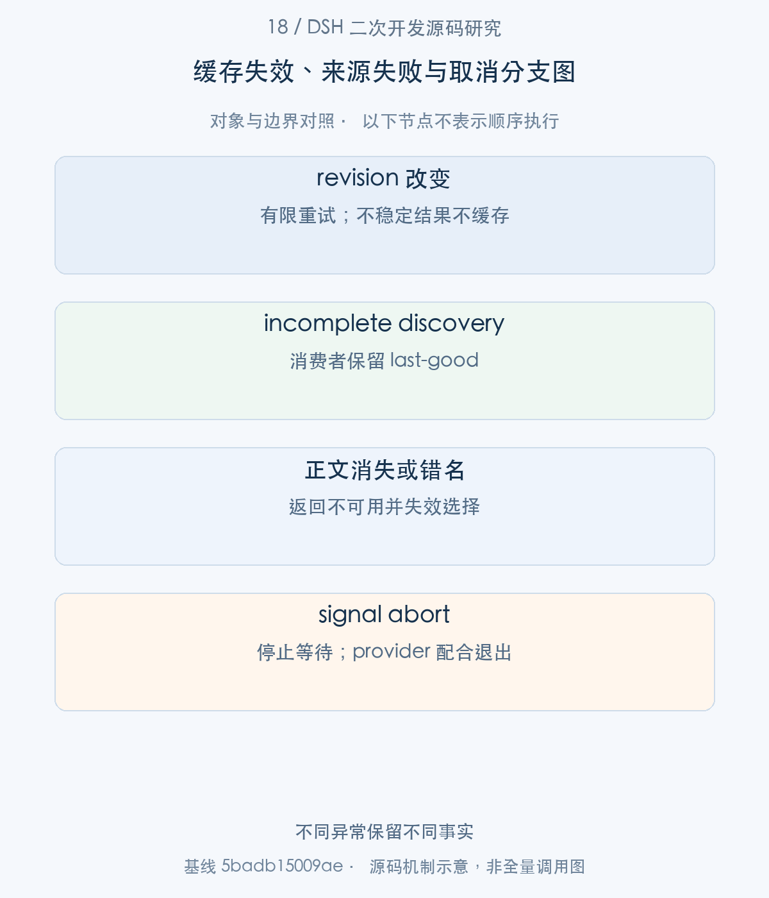

# 18｜企业指令如何进入 Agent：Skill 发现、选择与按需加载

企业 SOP 的接入，首先是让正确的 Agent 找到正确版本的指令，然后才是加载正文。DSH 把这件事拆成 provider discovery、scoped catalog、按需 get，以及进入 Session 的上下文消息。本文沿这条链解释候选选择、缓存完整性和调用策略，并单独追踪 AGENTS.md，避免把所有指令来源误认为同一种加载器。

> 源码基线：DSH `0.2.1-alpha.1`，提交 `5badb15009ae1756c3afe0ae0cef1faafc290ccc`。下文的源码摘录保持原文，仅移除公共缩进。企业新增设计与验证范围另行标明。

## 1. 整体地图：指令来源、发现目录与实际正文

假设我们有一个采购审核 SOP：目录只需告诉 Agent“何时应使用它”，真正执行任务前才读取详细步骤。若每次请求都把全部 SOP 全文注入，Context 成本会持续增长；若只缓存一次目录，更新政策又可能迟迟不被看到。DSH 的 summary/body 分离和完整观察机制正是对这两个问题的工程回答。

下面的主线从 SkillProvider.list 开始，经 Registry 合并得到 winning candidate，再由 tool-skill 消费。agent-instructions 是另一条 pre-step 插入路径，本篇最后把它接回共同的 Session。



图1。两条指令路径在 Session 消费边界交会 [SVG](assets/18-skill-instruction-loading-fig-1.svg)。

## 2. 注册入口：provider 怎样贡献候选

步骤1：先建立数据关系，随后再看 provider 注册。list 和 get 接收、返回的并不是同一种结构。

<!-- source:S01 -->
源码 [packages/skill/skill/src/index.ts:49–100](https://github.com/deepseek-ai/deepseek-harness/blob/5badb15009ae1756c3afe0ae0cef1faafc290ccc/packages/skill/skill/src/index.ts#L49-L100)。

```typescript
export interface SkillInvocationPolicy {
  /** Whether model-facing catalogs and loaders include this skill. */
  readonly modelInvocable: boolean
  /** Whether human-facing command catalogs and loaders include this skill. */
  readonly userInvocable: boolean
}

/** Invocation-neutral skill metadata returned by `ctx.skills.list()`. */
export interface SkillSummary {
  /** Absolute instruction file path when supplied by the provider; absent for virtual skills. */
  readonly path?: string
  /** Kebab-case identifier used to address the skill. */
  readonly name: string
  /** Short routing description shown by discovery consumers. */
  readonly description: string
  /** Optional extra routing guidance. */
  readonly whenToUse?: string
  /** Resolved model and user invocation controls. */
  readonly invocation: SkillInvocationPolicy
  /** Discovery source that produced this winning skill. */
  readonly source: SkillSource
  /** Provider that owns this skill body. */
  readonly provider: string
  /** Provider-specific base for relative resources. */
  readonly resourceBase?: SkillResourceBase
}

/** Provider catalog entry used by the registry to merge and later load skills. */
export interface SkillCandidate extends SkillSummary {
  /** Lower ranks win duplicate skill names before provider registration order is considered. */
  readonly rank: number
  /** Opaque provider-owned handle passed back to `provider.get()`. */
  readonly locator: unknown
  /** Parsed optional metadata object from provider-specific skill frontmatter. */
  readonly metadata?: Readonly<Record<string, unknown>>
}

/** Complete parsed skill definition, including the body loaded by `ctx.skills.get()`. */
export interface SkillDefinition extends SkillSummary {
  /** Markdown instruction body after any provider-specific metadata removal. */
  readonly content: string
  /** Parsed optional metadata object from frontmatter. */
  readonly metadata?: Readonly<Record<string, unknown>>
}

/** Runtime skill contribution accepted by `ctx.skills.register()`. */
export type SkillRegistration = Omit<SkillDefinition, 'invocation' | 'provider'> & {
  /** Invocation controls; omission permits both model and user surfaces. */
  readonly invocation?: SkillInvocationPolicy
  /** Provider label; omission uses the registry-owned runtime provider. */
  readonly provider?: string
}
```

SkillSummary 包含 name、description、source、provider 和 invocation；Candidate 增加 rank 与 locator，供 Registry 选择并回传来源；Definition 才有 content。locator 是 provider 私有句柄，消费者不应把它当可信本地路径。resourceBase 用于解释相对资源来源，也不会自动授予文件读取权限。

步骤2：registry 把候选生产委托给 provider.list，把正文读取委托给同一个 provider.get。

<!-- source:S02 -->
源码 [packages/skill/skill/src/index.ts:247–274](https://github.com/deepseek-ai/deepseek-harness/blob/5badb15009ae1756c3afe0ae0cef1faafc290ccc/packages/skill/skill/src/index.ts#L247-L274)。

```typescript
export interface SkillProvider {
  /** Unique provider name in the `ctx.skills` registry. */
  readonly name: string
  /**
   * List available skill candidates for the current lookup context. Provider
   * plugins register synchronously during `apply()`; remote initialization,
   * authentication, and discovery are awaited inside this method. Implementations
   * should settle promptly when `options.signal` aborts.
   * @param options - lookup options; `cwd` selects workspace-sensitive skills and `signal` cancels work.
   * @returns provider candidates as a complete-array shorthand, or an explicit
   *   observation when usable candidates came from incomplete discovery.
   */
  readonly list: (options: SkillLookupOptions) => Promise<readonly SkillCandidate[] | SkillProviderObservation>
  /**
   * Load a complete skill body for a previously listed candidate.
   * @param candidate - the winning candidate originally returned by this provider.
   * @param options - lookup options; `cwd` selects workspace-sensitive skills and `signal` cancels work.
   * @returns the full skill body, or `undefined` if it is no longer loadable.
   */
  readonly get: (candidate: SkillCandidate, options: SkillLookupOptions) => Promise<SkillDefinition | undefined>
}

/** Registration-scoped lifecycle and invalidation capability borrowed by one provider. */
export interface SkillProviderControl {
  /** Aborts if registration fails or when the exact provider registration is disposed. */
  readonly signal: AbortSignal
  /** Invalidate completed catalogs and notify consumers only while the exact registration remains active. */
  readonly invalidate: () => void
```

注册同步完成，远端认证和发现应在 list 内等待，避免 Host apply 被网络阻塞。control.invalidate 只对这次注册有效，signal 表示注册撤销；它们是 provider 生命周期的能力，不能复用到下一次注册。

最小 runtime contribution 则走 register，它直接为当前 Context 所在层保存完整 Definition。

<!-- source:S03 -->
源码 [packages/skill/skill/src/index.ts:439–459](https://github.com/deepseek-ai/deepseek-harness/blob/5badb15009ae1756c3afe0ae0cef1faafc290ccc/packages/skill/skill/src/index.ts#L439-L459)。

```typescript
register(skill: SkillRegistration): () => void {
  validateRuntimeSkill(skill)
  const scope = scopeOf(this.ctx)
  const existingLayer = scope === undefined ? this.layers.global : this.layers.peek(scope)
  if (existingLayer !== undefined && existingLayer.runtime.has(skill.name)) {
    this.ctx.logger.warn(`runtime skill "${skill.name}" ignored because it is already registered`)
    return () => {}
  }
  const definition: SkillDefinition = {
    ...skill,
    invocation: skill.invocation ?? { modelInvocable: true, userInvocable: true },
    provider: skill.provider ?? RUNTIME_PROVIDER,
  }
  return this.layers.effect(
    this.ctx,
    (layer) => {
      layer.runtime.set(definition.name, definition)
      return () => { layer.runtime.delete(definition.name) }
    },
    { label: 'skills.register()' },
  )
```

同一层已有同名 runtime Skill 时会告警并忽略；返回 disposer 撤销本次贡献。默认允许 model/user invocation，企业若只开放人工命令，必须明确给出 policy，而不是期待 registry 推断。

这三类对象也决定了企业Skill管理界面应该展示什么：

|对象|由谁生产|交给谁|尚未建立的事实|
|---|---|---|---|
|`SkillCandidate`|provider discovery|Registry合并与选择|正文已成功读取|
|`SkillSummary`|Registry投影获胜候选|目录、模型路由与人类命令入口|消费者拥有资源读取权限|
|`SkillDefinition`|获胜provider的`get`|工具执行与指令正文消费|SOP中的业务操作已获授权|

例如，全局与任务Scope中都存在`purchase-review`。Registry先决定这一Agent看到哪个来源，再将获胜候选的locator交回同一个provider；消费者没有理由自行拼接一个路径去读取“另一个同名文件”。这种生产与读取绑定，是支持企业虚拟Skill来源的重要条件：来源可以是目录、注册项或远端服务，消费者仍只面向统一的summary/body契约。



图2。目录发现与正文加载是两次来源交接 [SVG](assets/18-skill-instruction-loading-fig-2.svg)。

## 3. 来源选择：目录、作用域与同名冲突

步骤3：本地文件 provider 在 apply 中注册，并把 watcher 的退出纳入 ctx.effect。

<!-- source:S04 -->
源码 [packages/skill/skill-filesystem/src/index.ts:135–148](https://github.com/deepseek-ai/deepseek-harness/blob/5badb15009ae1756c3afe0ae0cef1faafc290ccc/packages/skill/skill-filesystem/src/index.ts#L135-L148)。

```typescript
  let provider!: FileSystemSkillProvider
  ctx.skills.registerProvider((control) => {
    provider = new FileSystemSkillProvider(ctx, control, config)
    return provider
  })
  ctx.effect(function* () {
    yield async () => { await provider.dispose() }
  }, 'skill-filesystem watcher')
  ctx.on('fs/observed', (target, _observation, actor) => {
    if (mutationToolName(actor) === undefined) return
    provider.observeHostMutation(target.displayPath)
  })
}

```

本地 mutation 事件交给 observeHostMutation；它和文件 watcher 共同触发目录失效。apply 没有把一个无限后台循环留在归属系统之外。

步骤4：首次 list 根据 cwd 解析 roots，然后发现候选；选中以后 get 使用原 locator 重新读取文件。

<!-- source:S05 -->
源码 [packages/skill/skill-filesystem/src/index.ts:188–219](https://github.com/deepseek-ai/deepseek-harness/blob/5badb15009ae1756c3afe0ae0cef1faafc290ccc/packages/skill/skill-filesystem/src/index.ts#L188-L219)。

```typescript
  let complete = true
  try {
    await this.watchManager.observeRoots(roots)
  } catch (error) {
    if (this.disposal !== undefined) throw error
    complete = false
  }
  const candidates: SkillCandidate[] = []
  for (const root of roots) {
    for (const skill of await discoverRoot(root, this.ctx, this.name)) {
      candidates.push(skill)
    }
  }
  return complete ? candidates : { candidates, complete }
}

/**
 * Load a complete local skill body from the candidate's file locator.
 * @param candidate - the winning candidate returned by this provider.
 * @param options - lookup options whose signal cancels filesystem reads.
 * @returns the full local skill, or `undefined` if the file disappeared.
 */
async get(candidate: SkillCandidate, options: SkillLookupOptions): Promise<SkillDefinition | undefined> {
  const locator = candidate.locator as LocalLocator
  const parsed = await parseSkillFile(locator.path, this.ctx, options.signal, candidate.source === 'bundled')
  if (parsed === undefined) return undefined
  return {
    name: parsed.name,
    description: parsed.description,
    ...parsed.whenToUse !== undefined ? { whenToUse: parsed.whenToUse } : {},
    invocation: parsed.invocation,
    source: candidate.source,
```

watcher 启动失败时仍可返回可读候选，但 complete=false。这个状态表达“目前观察不权威”，区别于“没有 Skill”。get 不直接复用旧正文，文件已经删除就返回 undefined；目录中的旧名称因此不会保证加载成功。

候选交回 Registry 后，collectFresh 逐层合并；这里才确定同名覆盖关系。

<!-- source:S06 -->
源码 [packages/skill/skill/src/index.ts:551–564](https://github.com/deepseek-ai/deepseek-harness/blob/5badb15009ae1756c3afe0ae0cef1faafc290ccc/packages/skill/skill/src/index.ts#L551-L564)。

```typescript
private async collectFresh(options: SkillViewOptions): Promise<CollectResult> {
  // Global first, then existing chain overlays farthest ancestor first and
  // the exact scope last, so the nearest layer's same-name entry replaces
  // the farther ones — the tools registry's shadowing rule. Rank decides
  // duplicates only within one layer.
  const layers = [this.layers.global, ...this.layers.chainLayers(options.scope)]
  const merged = new Map<string, IndexedCandidate>()
  let cacheable = true
  for (const layer of layers) {
    const collected = await this.collectLayer(layer, options)
    if (!collected.cacheable) cacheable = false
    for (const entry of collected.entries) merged.set(entry.candidate.name, entry)
  }
  return { entries: merged, cacheable }
```

先 global，后从远到近的 Scope layers，最后当前层覆盖同名。rank 比较只在同一层内部决定来源，不会让全局高优先级强压局部 Scope。企业可以据此提供公共 SOP 和项目专属 SOP，但必须给读者保留实际 provider/source，方便追溯最终选中了哪份政策。




图3。rank 只比较同层候选 [SVG](assets/18-skill-instruction-loading-fig-3.svg)。

## 4. catalog：缓存、观察完整性与变更通知

步骤5：消费者调用 snapshot，得到 summaries 与完整性状态。

<!-- source:S07 -->
源码 [packages/skill/skill/src/index.ts:475–487](https://github.com/deepseek-ai/deepseek-harness/blob/5badb15009ae1756c3afe0ae0cef1faafc290ccc/packages/skill/skill/src/index.ts#L475-L487)。

```typescript
 * Observe the current invocation-neutral catalog and whether discovery completed within a stable revision.
 * Incomplete observations are never cached, allowing consumers to retain last-good state and
 * retry on their next request boundary.
 * @param options - view options; `scope` selects the viewing agent's layers, `cwd` selects project roots, and `signal` cancels discovery.
 * @returns sorted summaries plus discovery-completeness state.
 */
async snapshot(options: SkillViewOptions = {}): Promise<SkillCatalogSnapshot> {
  const collected = await this.collect(options)
  return {
    skills: [...collected.entries.values()]
      .map(entry => toSummary(entry.candidate))
      .sort(compareSkillSummary),
    complete: collected.cacheable,
```

完整性是本次 catalog 的属性，不是某个 Skill content 的字段。list 是 snapshot.skills 的便捷接口，若要保留 last-good 目录，应使用 snapshot.complete。

步骤6：snapshot 内部进入 collect；缓存 key 同时包含 cwd、Scope chain 与 revision。

<!-- source:S08 -->
源码 [packages/skill/skill/src/index.ts:521–547](https://github.com/deepseek-ai/deepseek-harness/blob/5badb15009ae1756c3afe0ae0cef1faafc290ccc/packages/skill/skill/src/index.ts#L521-L547)。

```typescript
let attempt = 1
while (true) {
  const revision = this.revision
  // The chain is part of the key rather than assumed stable: a blank-session
  // recompose re-parents an existing scope without touching this registry,
  // and only a chain-bearing key makes the next read see the new preset.
  const key = this.collectCacheKey(options.cwd, scopeChainOf(options.scope), revision)
  const cached = this.collectCache.get(key)
  if (cached !== undefined) return { entries: cached, cacheable: true }

  const result = await this.collectFresh(options)
  throwIfAborted(options.signal)
  if (revision !== this.revision) {
    if (attempt < MAX_COLLECT_ATTEMPTS) {
      attempt += 1
      continue
    }
    return { entries: result.entries, cacheable: false }
  }
  if (result.cacheable) {
    this.collectCache.set(key, result.entries)
    if (this.collectCache.size > this.collectCacheMaxEntries) {
      const oldest = this.collectCache.keys().next() as IteratorYieldResult<string>
      this.collectCache.delete(oldest.value)
    }
  }
  return result
```

Scope 可被 recompose 改变父层而 registry revision 未变，因此 chain 本身必须参与 key。发现期间 revision 改变会再试一次；持续变化返回不缓存结果，避免宣称一个混合时刻的目录是稳定快照。缓存超过上限会移除最早 key；它缓存候选选择，不缓存永久有效的正文。

步骤7：模型真正消费目录时，tool-skill 的 pre-step listener 先等待后续 waterfall，再读取当前 Agent 视角。

<!-- source:S09 -->
源码 [packages/skill/tool-skill/src/index.ts:215–249](https://github.com/deepseek-ai/deepseek-harness/blob/5badb15009ae1756c3afe0ae0cef1faafc290ccc/packages/skill/tool-skill/src/index.ts#L215-L249)。

```typescript
  next,
): Promise<PreStepDecision> => {
  const decision = await next()
  if (decision.kind === 'reject') return decision
  signal.throwIfAborted()
  const toolVisible = ctx.tools.get(skillTool.name, agent) === skillTool
  const snapshot = toolVisible
    ? await ctx.skills.snapshot({ cwd: agent.session.header.cwd, signal, scope: agent })
    : { skills: [], complete: true }
  signal.throwIfAborted()
  if (!snapshot.complete) return decision
  const skills = snapshot.skills.filter(isModelInvocable)
  const entries = catalogSourceEntries(skills, catalogDescriptionMaxLength)
  const digest = digestCatalogEntries(entries)
  const history = catalogHistory(agent)
  const existing = catalogMessage(decision.messages)
  if (history.visibleDigest === digest) {
    return existing === undefined
      ? decision
      : { ...decision, messages: decision.messages.filter(message => message.id !== existing.message.id) }
  }
  if (existing !== undefined && digestCatalogEntries(existing.entries) === digest) return decision
  if (!history.published && skills.length === 0) {
    return existing === undefined
      ? decision
      : { ...decision, messages: decision.messages.filter(message => message.id !== existing.message.id) }
  }
  const catalog = history.published
    ? renderCatalogUpdate(entries)
    : renderCatalogMessage(entries)
  return {
    ...decision,
    messages: existing === undefined
      ? [...decision.messages, catalog]
      : decision.messages.map(message => message.id === existing.message.id ? catalog : message),
```

只有同一个 skillTool definition 对当前 Agent 可见才注入 catalog，不能仅凭工具名称相同就继承原插件的目录。incomplete 时返回原 decision，保留此前已发布事实；完整变化时生成替换目录消息，并用 source entries/digest 检测重复。最终进入 Session 的是可追溯上下文，而不是一个隐含全局字符串。

## 5. 按需加载：从名称选择到工具与 Session 消费

步骤8：模型选择名称以后，Registry.get 重新定位 winning candidate，并等待 provider 正文加载。

<!-- source:S10 -->
源码 [packages/skill/skill/src/index.ts:497–517](https://github.com/deepseek-ai/deepseek-harness/blob/5badb15009ae1756c3afe0ae0cef1faafc290ccc/packages/skill/skill/src/index.ts#L497-L517)。

```typescript
 *   `cwd` selects workspace-sensitive skills, and `signal` cancels work.
 * @returns the full skill, including body content, or `undefined`.
 */
async get(name: string, options: SkillViewOptions = {}): Promise<SkillDefinition | undefined> {
  if (!isSkillName(name)) return undefined
  const collected = await this.collect(options)
  throwIfAborted(options.signal)
  const match = collected.entries.get(name)
  if (match === undefined) return undefined
  const definition = await waitWithAbort(
    match.provider.get(match.candidate, options),
    options.signal,
  )
  if (definition === undefined) return undefined
  validateDefinition(definition)
  if (definition.name !== match.candidate.name) {
    this.invalidateEntry(match)
    return undefined
  }
  return definition
}
```

选择后和缓存命中后都要检查取消。provider.get 的返回 name 若与候选不一致，将失效该条选择并返回 undefined；这防止目录和正文错配，却不能代替企业对正文内容的审核。

步骤9：tool-skill 的 execute 把当前 Agent 的 cwd、Scope 与执行 signal 同时传给 list/get。

<!-- source:S11 -->
源码 [packages/skill/tool-skill/src/index.ts:126–157](https://github.com/deepseek-ai/deepseek-harness/blob/5badb15009ae1756c3afe0ae0cef1faafc290ccc/packages/skill/tool-skill/src/index.ts#L126-L157)。

```typescript
},
async execute(args, exec) {
  if (!isSkillName(args.name)) {
    throw new Error(`invalid skill name "${args.name}"`)
  }
  // The agent is its own scope key, so the lookup resolves the layered
  // registry exactly as this agent's composition sees it.
  const lookup = { cwd: exec.agent?.session.header.cwd, signal: exec.signal, scope: exec.agent }
  const summary = (await ctx.skills.list(lookup)).find(skill => skill.name === args.name)
  if (!summary) {
    throw new Error(`skill "${args.name}" is unknown or no longer available`)
  }
  if (!isModelInvocable(summary)) {
    throw new Error(`skill "${args.name}" is not available for model invocation`)
  }
  const skill = await ctx.skills.get(args.name, lookup)
  if (!skill) {
    throw new Error(`skill "${args.name}" is unknown or no longer available`)
  }
  if (!isModelInvocable(skill)) {
    throw new Error(`skill "${args.name}" is not available for model invocation`)
  }
  return {
    name: skill.name,
    provider: skill.provider,
    ...skill.resourceBase !== undefined ? {
      resourceBase: { ...skill.resourceBase },
    } : {},
    content: skill.content,
  }
},
presentCall(args) {
```

先检查 summary 的 modelInvocable，再检查最新 Definition 的 modelInvocable；两次检查覆盖发现到加载之间策略变化的窗口。返回 name、provider、resourceBase、content 给工具展示层，renderSkillContent 才把正文呈现给模型。加载 SOP 没有顺带注册财务写入工具，也不会绕过工具 runtime 的授权。


## 6. 独立指令路径：AGENTS.md 与文件引用

步骤10：AGENTS.md 等工作区规则走 agent-instructions.compose，而非 SkillProvider.get。pre-step 回调把它接回同一请求边界。

<!-- source:S12 -->
源码 [packages/context/agent-instructions/src/index.ts:315–344](https://github.com/deepseek-ai/deepseek-harness/blob/5badb15009ae1756c3afe0ae0cef1faafc290ccc/packages/context/agent-instructions/src/index.ts#L315-L344)。

```typescript
ctx.on('agent/pre-step', async (
  { agent, messages, step, signal },
  next,
): Promise<PreStepDecision> => {
  const decision = await next()
  await waitForProjections(agent)
  const pending = agent.inbox.nextStep.filter(isAgentInstructionsMessage)
  const desired = await compose(agent, signal, messages, pending)
  signal.throwIfAborted()
  // An empty first entry owns a no-step turn; keep context pending instead
  // of turning it into a standalone request. Later entries may be tool continuations.
  if (decision.kind === 'reject' || (step === 1 && decision.messages.length === 0)) {
    syncInbox(agent, messages, desired)
    return decision
  }
  // A proceeding step settles the pending context: it either enters below as
  // `desired`, or its payload is already covered by the batch, so nothing stays pending.
  for (const message of pending) agent.inbox.remove(message.id)
  if (desired === undefined || decision.messages.some(message => sameContextPayload(message, desired))) {
    return decision
  }
  // Fold the context right after the claimed batch, so the direct prompt
  // precedes it and the driver-appended runtime context follows it.
  const lastClaimedIndex = decision.messages.findLastIndex(message => messages.includes(message))
  const entered = decision.messages.toSpliced(lastClaimedIndex + 1, 0, desired)
  return { ...decision, messages: entered }
})

ctx.on('tools/result', (exec: ToolExecution, result: ToolExecutionResult) => {
  const touches = executionTouches.get(exec.token) ?? []
```

compose 结合 workspace 信息和待进入消息生成 desired context。decision reject 或首次空输入时只同步 inbox，不制造一个独立模型请求；正常推进时先消除重复 pending，再插到 claimed batch 之后。工具触碰文件时另有结果监听来更新观察。读取文件引用的展开也是单独职责，不能说“所有 Markdown 都按 Skill 加载”。

缓存失效、加载取消与文件删除应分别观察：目录可不完整而保留旧事实；正文加载可因取消终止；文件已消失则返回不可用。源系统更新与工具执行是两个阶段，修改 SOP 不应自动重跑已经完成的企业操作。



图4。不同异常保留不同事实 [SVG](assets/18-skill-instruction-loading-fig-4.svg)。

再用政策更新检查完整链路：Agent此前看过一个有效目录，远端provider随后暂时失联。这次snapshot即使带回部分候选，也会以`complete=false`表明观察不完整；tool-skill保留原来的可见目录，避免把一次网络故障误解释成政策全部撤销。下次请求仍会重新发现，因为不完整结果不进入稳定缓存。

保留目录不等于缓存正文已获永久许可。真正调用Skill时，工具重新查询summary、检查model invocation policy，再读取definition并再次检查policy。目录发布和正文获取之间可能跨越更新，所以两次检查分别保护路由与消费。企业接入还需在业务工具层检查资源授权；“能够读取这份SOP”与“能够执行SOP里的付款”是两个决策。

## 7. 开发示例与验证：一个企业 SOP Skill

一个简单的企业 SOP 可以先作为 runtime contribution 注册到创建阶段的 Agent Context，随后比较 scope 内外的 list，并通过 get 核对正文。下面教学片段使用已注册的 skills 服务；真正传给模型还要加载 tool-skill 插件。

验证应包括：同名 global/scoped 选择；同层 rank；正文内容更新但名称不变；不完整 discovery 保留 last-good catalog；modelInvocable=false；provider 卸载后的迟到请求。下列测试分别位于 registry、文件来源和实际消费层。

以下是企业新增教学示例；调用形态以本篇接口为依据，接入真实业务前仍需落实文中前置条件。

```typescript
// 位于 Agent create 的 setup(agentCtx) 中；所需 services 已加载。
const remove = agentCtx.skills.register({
  name: 'procurement-review',
  description: '审核采购请求，生成预算与供应商检查清单',
  source: 'runtime',
  invocation: { modelInvocable: true, userInvocable: true },
  content: '先读取请求事实；核对预算；列出依据；写入须通过受控业务工具。',
})
agentCtx.effect(() => remove, 'enterprise procurement SOP')
```

可复核入口（`pnpm` 命令在 `.sources/deepseek-harness` 中运行，`node research/...` 命令在本研究仓库根目录运行；实际执行结果见[本批验证记录](../validation/supplementary-articles-validation.md)）：

```sh
pnpm exec vitest run packages/skill/skill/tests/skill.spec.ts packages/skill/skill-filesystem/tests/skill-filesystem.spec.ts packages/skill/tool-skill/tests/tool-skill.spec.ts
```

本篇使用现有源码测试说明契约，并不把 mock 的通过解释成真实模型、外部 server、浏览器或企业基础设施已经验收。
## 8. 工程心得：目录可见、正文加载和执行授权分别建立事实

从这条链能获得的设计经验，是把“发现”当成一个有质量状态的观察。complete=false 比空数组更有表达力，能让消费者避免误删仍有效的目录事实。企业 connector 也可以采用这种契约，不必在网络暂时异常时声称所有能力消失。

summary、locator 与 content 分层，使成本控制和新鲜度检查落到了清楚的函数边界。二次开发时应保留来源与 policy，不要只把最终正文拼接成一个失去血缘的 Prompt。

最后，SOP 是指导任务的方法，授权是限制资源操作的能力。保留两条独立的消费链，让后续版本更新、审计和取消行为都有可验证的落点。


[返回补充专题目录](README.md#补充专栏17—28) · [对应写作大纲](../appendices/supplementary-article-outlines.md)
