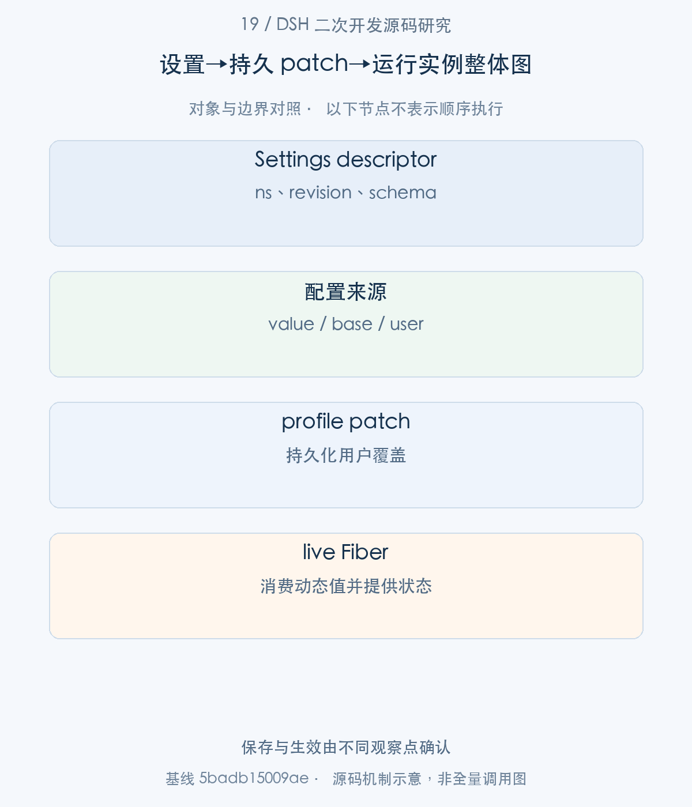
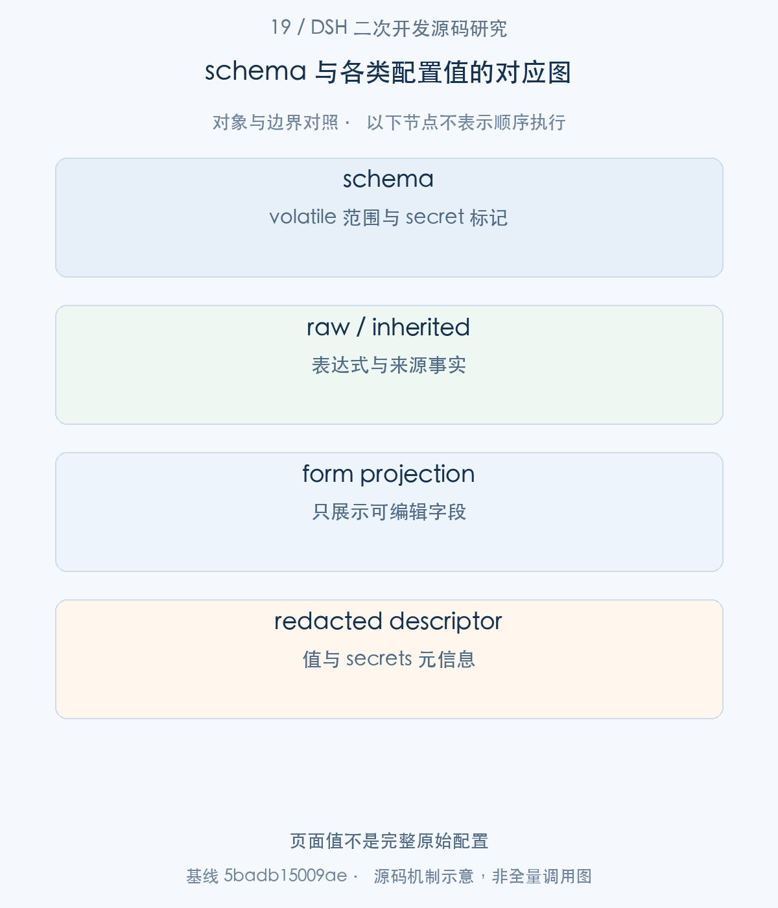
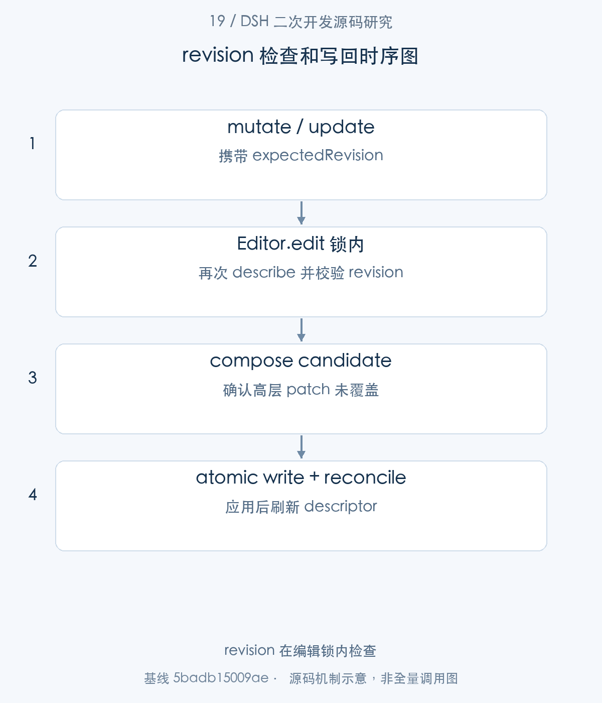
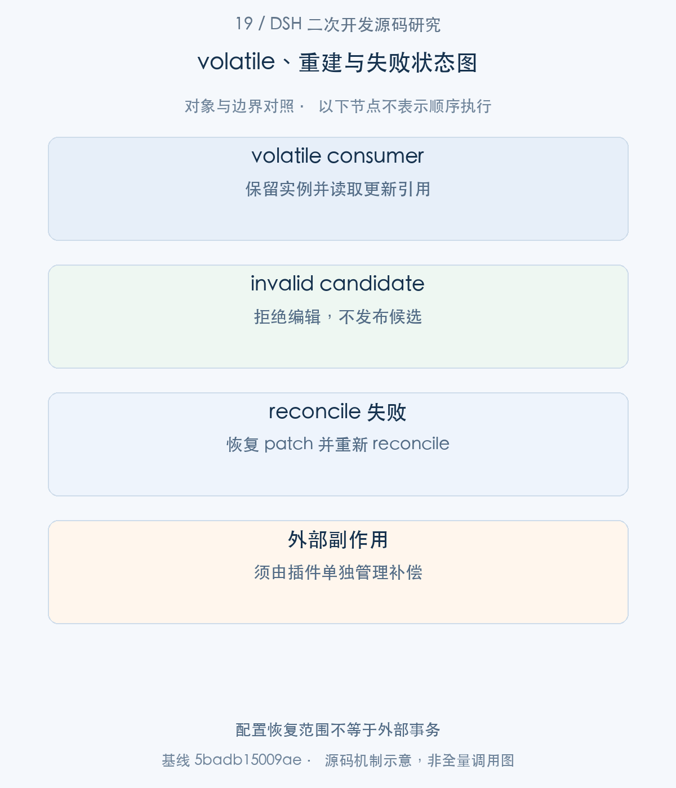

# 19｜一个设置怎样真正生效：表单、patch 写回与实例更新

企业配置页面的一次保存，要同时回答三个问题：用户编辑的是哪个 Entry，写入的是哪一层 patch，当前实例实际消费了什么值。本文从 Settings.describe 的表单对象进入 update/replace/mutate，再沿 ConfigEditor 的写锁、组合校验与 reconcile 返回运行树；重点解释 revision、secret 和 volatile 怎样共同保证可理解的写回。

> 源码基线：DSH `0.2.1-alpha.1`，提交 `5badb15009ae1756c3afe0ae0cef1faafc290ccc`。下文的源码摘录保持原文，仅移除公共缩进。企业新增设计与验证范围另行标明。

## 1. 整体地图：设置页面与运行配置之间有哪些交接

页面读取到的 value 已经是运行配置的投影，其中可能含继承值、表达式的结果和脱敏后的 secret。把整张表单直接写回文件，会固定本来应继承的默认值，也可能用占位符覆盖凭据。DSH 因而提供字段操作，并在锁内重新确认当前 descriptor。

本篇以一次修改 model/count 的操作为主线。读取阶段产生 descriptor；提交阶段产生配置候选；ConfigEditor 验证该候选确实能够成为最终有效配置，才写盘并交给 Loader。



图1。保存与生效由不同观察点确认 [SVG](assets/19-settings-config-writeback-fig-1.svg)。

## 2. 表单生产：Config schema 与 volatile 字段

步骤1：UI 或 API 调用 describe，Settings 从 configEditor.configuration 读取 Entry、inherited 与 override。

<!-- source:S01 -->
源码 [packages/settings/settings/src/index.ts:302–329](https://github.com/deepseek-ai/deepseek-harness/blob/5badb15009ae1756c3afe0ae0cef1faafc290ccc/packages/settings/settings/src/index.ts#L302-L329)。

```typescript
describe(options?: SettingsDescribeOptions): SettingsDescriptor[] {
  const active = new Set<string>()
  const descriptors = this.ownerContext.configEditor.configuration().flatMap(({ entry, inherited, override }) => {
    const schema = this.schema(entry)
    if (schema === undefined || entry.fiber === undefined
      || entry.fiber.runtime === null || entry.fiber.state !== FiberState.ACTIVE) return []
    const form = volatileForm(schema)
    if (form === undefined) return []
    active.add(entry.id)
    const raw = JSON.stringify([entry.fiber.uid, schema.toJSON(), entry.options.config ?? {}])
    const autoGenerate = this.presentations.get(entry.fiber)?.auto ?? true
    const previous = this.revisions.get(entry.id)
    const revision = previous === undefined ? 0 : previous.revision + Number(previous.raw !== raw)
    this.revisions.set(entry.id, { raw, revision, ns: entry.options.id as SettingsNamespace, autoGenerate })
    if (previous?.raw !== raw || previous.autoGenerate !== autoGenerate) {
      this.ownerContext.emit('settings/document-updated', entry.options.id as SettingsNamespace, revision)
    }
    const value = projectForm(form, plainConfig(entry.fiber.config))
    const resolved: unknown = interpolate(entry.fiber.ctx, inherited)
    const base = projectForm(form, plainConfig(inheritedConfig(entry.fiber.runtime, resolved)))
    const user = projectForm(form, override)
    const redacted = redactSecrets(form as z<never>, value)
    return [{
      autoGenerate,
      ns: entry.options.id as SettingsNamespace, schema: form.toJSON(), revision, applies: 'live' as const,
      value: options?.redactSecrets ? redacted.value : value,
      base: options?.redactSecrets ? redactSecrets(form as z<never>, base).value : base,
      user: options?.redactSecrets ? redactSecrets(form as z<never>, user).value : user,
```

只有 ACTIVE Fiber、可用 runtime 和可构造的 volatileForm 才出现在结果中。revision 的原始签名含 fiber.uid、完整 schema 和 Entry config；实例重建、schema 改变或 raw config 改变都会影响观察。这里的 namespace 实际来自 Entry id，因此同一种插件的两个实例可以独立编辑。

|字段|表示什么|使用时要注意|
|---|---|---|
|ns|Entry 身份|不是 npm package 名称|
|revision|当前配置观察版本|写时回传，冲突后重新读取|
|value|live 配置的表单投影|可能已脱敏或插值|
|base|继承配置的投影|reset/unset 可回到这里|
|user|用户覆盖投影|不等于完整 effective 值|
|secrets|secret path 与是否已设置|不包含原始凭据|



图2。页面值不是完整原始配置 [SVG](assets/19-settings-config-writeback-fig-2.svg)。

## 3. 值的来源：raw、inherited、override 与 effective

步骤2：为了理解 describe 的三种值，需要回到 describe 实际调用的数据生产者 ConfigEditor.configuration。

<!-- source:S02 -->
源码 [packages/boot/config-editor/src/index.ts:49–79](https://github.com/deepseek-ai/deepseek-harness/blob/5badb15009ae1756c3afe0ae0cef1faafc290ccc/packages/boot/config-editor/src/index.ts#L49-L79)。

```typescript
configuration(): Array<{ entry: Entry; inherited: Record<string, unknown>; override: Record<string, unknown> }> {
  const profile = this.ownerContext.profileContext
  const loaded = loadProfileDirectory('dsh', profile.dir, profile.installAnchor)
  const entries = this.entries()
  // An own config key can replace inherited config even when its value is undefined.
  const overridden = new Set(loaded.patches.filter(patch => patch.insert === undefined && Object.hasOwn(patch, 'config')).map(patch => patch.id))
  const composed = new Map<string, EntryOptions>()
  if (entries.some(entry => !overridden.has(entry.options.id))) {
    for (const row of flatten(composeEntries([...loaded.layers.map(layer => layer.patches), loaded.patches]))) {
      if (!composed.has(row.id)) composed.set(row.id, row)
    }
  }
  return entries.map(entry => ({
    entry,
    inherited: overridden.has(entry.options.id)
      ? this.inherited(entry, loaded)
      : structuredClone((composed.get(entry.options.id)?.config ?? {}) as Record<string, unknown>),
    override: structuredClone((loaded.patches.findLast(
      row => row.id === entry.options.id && row.config !== undefined,
    )?.config ?? {}) as Record<string, unknown>),
  }))
}

private inherited(entry: Entry, loaded: ReturnType<typeof loadProfileDirectory>): Record<string, unknown> {
  const patches = loaded.patches.map((patch) => {
    if (patch.id !== entry.options.id || patch.insert !== undefined) return patch
    const rest = { ...patch }; Reflect.deleteProperty(rest, 'config')
    return rest
  })
  const row = flatten(composeEntries([...loaded.layers.map(layer => layer.patches), patches])).find(row => row.id === entry.options.id)
  return structuredClone((row?.config ?? {}) as Record<string, unknown>)
```

Editor 对 profile layers 和 Entry 身份建立继承/覆盖视图，再交回 Settings。Settings 随后对 inherited 做 interpolate 和 inheritedConfig，对 fiber.config 做 plainConfig。表单 base 是解释给用户的继承结果，写盘时仍要保持表达式和非编辑字段。

回到 Settings，value、base、user 分别投影，再由 redactSecrets 按 schema 的 secret 标记处理。

<!-- source:S03 -->
源码 [packages/settings/settings/src/index.ts:318–328](https://github.com/deepseek-ai/deepseek-harness/blob/5badb15009ae1756c3afe0ae0cef1faafc290ccc/packages/settings/settings/src/index.ts#L318-L328)。

```typescript
}
const value = projectForm(form, plainConfig(entry.fiber.config))
const resolved: unknown = interpolate(entry.fiber.ctx, inherited)
const base = projectForm(form, plainConfig(inheritedConfig(entry.fiber.runtime, resolved)))
const user = projectForm(form, override)
const redacted = redactSecrets(form as z<never>, value)
return [{
  autoGenerate,
  ns: entry.options.id as SettingsNamespace, schema: form.toJSON(), revision, applies: 'live' as const,
  value: options?.redactSecrets ? redacted.value : value,
  base: options?.redactSecrets ? redactSecrets(form as z<never>, base).value : base,
```

脱敏不是给所有字符串统一打码。前端应保留 secrets 元信息并采用局部 mutate；没有修改的 secret 路径不需要重新提交一个假值。是否脱敏由 describe 参数控制，因此入口必须选择适合其信任边界的调用方式。

## 4. 写入入口：update、replace、mutate 与 reset

步骤3：用户提交之后进入 update、replace 或 mutate。三个方法共享 write，但生成候选的语义不同。

<!-- source:S04 -->
源码 [packages/settings/settings/src/index.ts:342–374](https://github.com/deepseek-ai/deepseek-harness/blob/5badb15009ae1756c3afe0ae0cef1faafc290ccc/packages/settings/settings/src/index.ts#L342-L374)。

```typescript
/** Merge editable fields into an entry's config.
 * @param ns Profile entry id.
 * @param patch Fields to merge.
 * @param expectedRevision Revision returned by describe.
 */
async update(ns: string, patch: object, expectedRevision?: number): Promise<void> {
  const input = cloneJsonShaped(patch)
  await this.write(ns, current => mergeLayers(current, input) as Record<string, unknown>, expectedRevision)
}

/** Reset all live fields, then set the supplied fields; ordinary config is preserved.
 * @param ns Profile entry id.
 * @param section Complete form values.
 * @param expectedRevision Revision returned by describe.
 */
async replace(ns: string, section: object, expectedRevision?: number): Promise<void> {
  const input = cloneJsonShaped(section)
  await this.write(ns, (_current, base) => mergeLayers(base, input) as Record<string, unknown>, expectedRevision)
}

/** Apply field edits without restating redacted secrets; unsetting an array index removes its element.
 * @param ns Profile entry id.
 * @param ops Ordered form edits.
 * @param expectedRevision Revision returned by describe.
 */
async mutate(ns: string, ops: readonly SettingsPathOp[], expectedRevision?: number): Promise<void> {
  await this.write(ns, (current, base, schema) => ops.reduce((value, op) => {
    if (op.op === 'set') return applyPathOp(value, op, schema)
    const parent = op.path.slice(0, -1).reduce<unknown>((node, key) => member(node, key), value)
    if (Array.isArray(parent)) return applyPathOp(value, op, schema)
    const inherited = op.path.reduce<unknown>((node, key) => member(node, key, true), base)
    return applyPathOp(value, inherited === undefined ? op : { op: 'set', path: op.path, value: inherited }, schema)
  }, current), expectedRevision, ops.map(op => op.path))
```

update 合并 current；replace 从 base 开始覆盖表单 live 字段；mutate 顺序执行路径操作。数组 unset 删除元素，对象字段 unset 可恢复 inherited 值。此基线没有独立 reset 方法：表单重置由 replace 或根路径 unset 等操作表达，不能按提纲假设存在一个 API。

步骤4：write 找到 Entry 和 form，先检查路径，再把 change 回调交给 configEditor.edit。

<!-- source:S05 -->
源码 [packages/settings/settings/src/index.ts:377–401](https://github.com/deepseek-ai/deepseek-harness/blob/5badb15009ae1756c3afe0ae0cef1faafc290ccc/packages/settings/settings/src/index.ts#L377-L401)。

```typescript
private async write(
  ns: string,
  change: (current: Record<string, unknown>, base: Record<string, unknown>, schema: z) => Record<string, unknown>,
  expected?: number, paths: readonly (readonly string[])[] = [],
): Promise<void> {
  const entry = this.ownerContext.configEditor.entries().find(row => row.options.id === ns)
  const schema = entry === undefined ? undefined : this.schema(entry)
  if (entry === undefined || schema === undefined) throw new Error(`No configurable plugin entry "${ns}"`)
  const form = volatileForm(schema)
  if (form === undefined) throw new Error(`Plugin entry "${ns}" has no volatile fields`)
  for (const path of paths) {
    if (path.length && !isVolatilePath(schema, path)) throw new Error(`Config field "${path.join('.')}" is not volatile`)
  }
  await this.ownerContext.configEditor.edit(entry, (raw, inherited) => {
    const descriptor = this.describe().find(row => row.ns === ns)
    if (descriptor === undefined) throw new Error(`Plugin entry "${ns}" is no longer configurable`)
    if (expected !== undefined && descriptor.revision !== expected) {
      throw new SettingsConflictError(ns as SettingsNamespace, expected, descriptor.revision)
    }
    const current = projectForm(form, raw) as Record<string, unknown>
    const base = projectForm(form, inherited) as Record<string, unknown>
    const next = cloneJsonShaped(change(current, base, schema))
    const validatePaths = (value: Record<string, unknown>, node: z, path: string[] = []): void => {
      for (const [key, child] of Object.entries(value)) {
        const target = [...path, key]
```

revision 检查发生在 Editor 的编辑回调内，而不是 UI 请求刚进入时。这使并发写入在锁内读取到更新后的 descriptor。可选 expected 缺省允许无版本保护调用；企业后台应明确传入已读取 revision，冲突后提示重载并审阅差异。

步骤5：write 验证候选只修改 volatile 范围，并把 ordinary 配置合并回去。

<!-- source:S06 -->
源码 [packages/settings/settings/src/index.ts:402–422](https://github.com/deepseek-ai/deepseek-harness/blob/5badb15009ae1756c3afe0ae0cef1faafc290ccc/packages/settings/settings/src/index.ts#L402-L422)。

```typescript
      if (isVolatilePath(schema, target)) continue
      const fields = node.dict as Record<string, z>
      const field = Object.hasOwn(fields, key) ? fields[key] : undefined
      if (isPlainObject(child) && field !== undefined) validatePaths(child, field, target)
      else throw new Error(`Config field "${target.join('.')}" is not volatile`)
    }
  }
  validatePaths(next, form)
  const strip = (value: Record<string, unknown>, node: z, path: string[] = []): Record<string, unknown> => {
    if (isVolatilePath(schema, path)) return {}
    const result = { ...value }
    for (const [key, field] of Object.entries(node.dict as Record<string, z>)) {
      const target = [...path, key]
      if (isVolatilePath(schema, target)) Reflect.deleteProperty(result, key)
      else if (isPlainObject(result[key])) result[key] = strip(result[key], field, target)
    }
    return result
  }
  return mergeLayers(strip(raw, form), next) as Record<string, unknown>
})
this.describe()
```

strip 移除可编辑部分，保留 raw 的其余字段，然后合并 next。它解决了“小表单覆盖大配置”的问题。volatile 表示字段可以参与 live 配置编辑，插件仍必须正确读取动态值；它不自动把构造函数里截取的静态变量变成最新值。

## 5. 配置写回：config-editor 怎样维护用户 patch

步骤6：Editor.edit 接住 Entry 和修改函数，在 profile package.json 的文件锁内重新解析 YAML patch。

<!-- source:S07 -->
源码 [packages/boot/config-editor/src/index.ts:87–119](https://github.com/deepseek-ai/deepseek-harness/blob/5badb15009ae1756c3afe0ae0cef1faafc290ccc/packages/boot/config-editor/src/index.ts#L87-L119)。

```typescript
async edit(
  entry: Entry,
  change: (current: Record<string, unknown>, inherited: Record<string, unknown>) => Record<string, unknown>,
): Promise<void> {
  const run = async (): Promise<void> => {
    const path = this.documentPath
    await withFileLock(join(this.ownerContext.profileContext.dir, 'package.json'), async () => {
      if (!this.entries().includes(entry) || entry.fiber === undefined) throw new Error('Configuration entry is no longer available')
      const beforePatches = readProfilePatches('dsh', this.ownerContext.profileContext)
      await reconcileProfilePatches(this.ownerContext.root, beforePatches, 'dsh')
      if (!this.entries().includes(entry)) throw new Error('Configuration entry changed during reload')
      const current = structuredClone((entry.options.config ?? {}) as Record<string, unknown>)
      const inherited = this.inherited(entry, loadProfileDirectory('dsh', this.ownerContext.profileContext.dir, this.ownerContext.profileContext.installAnchor))
      const next = change(current, inherited)
      const fiber = entry.fiber
      if (fiber.state !== FiberState.ACTIVE) throw new Error('Configuration plugin is no longer active')
      const resolved: unknown = fiber.ctx.waterfall(fiber, 'internal/config', next, () => next)
      resolveConfig(fiber.runtime as NonNullable<typeof fiber.runtime>, resolved)
      let before: string
      try { before = await readFile(path, 'utf8') }
      catch (error) {
        if ((error as NodeJS.ErrnoException).code !== 'ENOENT') throw error
        before = '[]\n'
      }
      const document = parseDocument(before, {
        customTags: [{ tag: 'tag:yaml.org,2002:js', resolve: (value: string) => value }],
      })
      if (document.errors[0] !== undefined) throw document.errors[0]
      if (!isSeq(document.contents)) throw new Error('Profile patch must be a YAML sequence')
      document.contents.flow = false
      const index = document.contents.items.findLastIndex((item, index) => isMap(item)
        && document.getIn([index, 'id']) === entry.options.id && !item.has('insert')
        && (!item.has('name') || document.getIn([index, 'name']) === entry.options.name))
```

以 Entry 对象仍在当前 entries 集合中为条件，避免 Entry 已被替换却仍对旧对象写入；编辑使用 inherited 与现有有效 raw config。通过文档树修改，能保留必要结构并处理 __jsExpr 到 YAML tag 的转回。锁和可选 HMR.runExclusive 共同串行化编辑与运行更新。

步骤7：候选写盘前再走一次完整 profile patch 组合。

<!-- source:S08 -->
源码 [packages/boot/config-editor/src/index.ts:120–141](https://github.com/deepseek-ai/deepseek-harness/blob/5badb15009ae1756c3afe0ae0cef1faafc290ccc/packages/boot/config-editor/src/index.ts#L120-L141)。

```typescript
if (isDeepStrictEqual(next, inherited)) {
  for (let index = document.contents.items.length - 1; index >= 0; index--) {
    const row = document.contents.items[index]
    if (!isMap(row) || document.getIn([index, 'id']) !== entry.options.id || row.has('insert')) continue
    row.delete('config')
    if (row.items.length === Number(row.has('id')) + Number(row.has('name'))) document.delete(index)
  }
} else if (index < 0) document.add(document.createNode({ id: entry.options.id, name: entry.options.name, config: next }))
else document.setIn([index, 'config'], document.createNode(next))
visit(document, { Map(_key, node) {
  if (node.items.length !== 1 || typeof node.get('__jsExpr') !== 'string') return
  const expression = new Scalar(node.get('__jsExpr'))
  expression.tag = 'tag:yaml.org,2002:js'
  return expression
} })
const profile = this.ownerContext.profileContext
const loaded = loadProfileDirectory('dsh', profile.dir, profile.installAnchor)
const patches = readProfilePatches('dsh', profile, { ...loaded, patches: yaml.load(String(document), { schema: entryListSchema }) as PatchOptions[] })
const effective = flatten(composeEntries([patches])).find(row => row.id === entry.options.id)
if (!isDeepStrictEqual(effective?.config ?? {}, next)) {
  throw new Error(`Configuration for "${entry.options.id}" is overridden by a home patch or command-line overlay`)
}
```

若 next 与 inherited 一致，可去掉冗余用户 config；不一致则建立或更新该 id 的覆盖。之后 composeEntries 计算最终 effective，若 home patch 或 CLI overlay 把候选覆盖掉，会直接拒绝。这个检查使“已保存”与“实际上被更高层盖住”不再混为一谈。



图3。revision 在编辑锁内检查 [SVG](assets/19-settings-config-writeback-fig-3.svg)。

## 6. 运行生效：Entry/Fiber 更新与失败状态

步骤8：writeFileAtomic 成功后，Editor await reconcileProfilePatches 将新配置交给运行树；异常进入恢复分支。

<!-- source:S09 -->
源码 [packages/boot/config-editor/src/index.ts:142–156](https://github.com/deepseek-ai/deepseek-harness/blob/5badb15009ae1756c3afe0ae0cef1faafc290ccc/packages/boot/config-editor/src/index.ts#L142-L156)。

```typescript
        await writeFileAtomic(path, String(document), { mode: 0o600 })
        try {
          await reconcileProfilePatches(this.ownerContext.root, patches, 'dsh', [entry.options.id])
        } catch (error) {
          await writeFileAtomic(path, before, { mode: 0o600 })
          await reconcileProfilePatches(this.ownerContext.root, beforePatches, 'dsh')
          throw error
        }
      })
    }
    const hmr = this.ownerContext.get('hmr')
    await (hmr === undefined ? run() : hmr.runExclusive(run))
  }
}

```

失败时先写回 before 文件，再 reconcile beforePatches；两步都成功后才重新抛出原错误。如果补偿写盘或再次reconcile也失败，相应异常会直接向上传递，不能宣称恢复已完成。这是可见的补偿流程，并非跨插件外部副作用的数据库事务。若插件 apply 已在远端产生效果，单靠恢复 patch 不能撤回效果；配置层插件应尽量把激活前检查与业务写操作分开。

volatile 消费可以保留当前 Fiber 并更新引用，ordinary 配置变化则可能触发重建。当前 Settings 表单只开放 volatile 范围，但底层 reconcile 仍要验证候选是否能应用。观察实例状态和 settings/document-updated，才能判断一次保存后的 live 事实。



图4。配置恢复范围不等于外部事务 [SVG](assets/19-settings-config-writeback-fig-4.svg)。

可以用两个页面同时编辑同一Entry来理解revision的价值。A和B都读到revision r0；A提交一个字段修改并完成reconcile后，B仍拿r0提交。B的expected检查在编辑锁内执行，会面对更新后的配置观察，而非请求刚到达时的旧对象。B应重新describe并审阅自己的变更，再提交新revision，不能把一次冲突转成无版本条件的重试。

另一个实验是给相同字段设置更高层CLI overlay。页面试图修改用户patch时，Editor会把候选重新组合成effective配置并比较预期；若高层仍覆盖该值，就拒绝这次写入。对操作者而言，这比“保存成功，但页面仍显示原值”更容易理解。企业配置界面可以据此把来源和覆盖提示放在字段旁边，而不是只显示最终value。

还应分别观察三件事：文件是否已写入、Loader reconcile是否成功、业务consumer是否按约定读取动态配置。恢复原patch处理的是前两者的一部分，不负责撤销插件激活过程中发生的外部业务效果。因此，可编辑配置的consumer最好把连接参数切换和实际业务写入分开管理。

## 7. 开发示例与验证：给业务插件增加设置表单

现成测试把一次 model 修改接到真实 consumer，再从重启视角读取持久配置。

<!-- source:S10 -->
源码 [packages/settings/settings/tests/configuration.spec.ts:9–20](https://github.com/deepseek-ai/deepseek-harness/blob/5badb15009ae1756c3afe0ae0cef1faafc290ccc/packages/settings/settings/tests/configuration.spec.ts#L9-L20)。

```typescript
it('persists a model edit, updates the real consumer without remounting, and restores it at restart', async () => {
  const { ctx, profile, start } = await fixture()
  const consumer = ctx.agentDefaultModel
  const fiber = [...ctx.loader.entries()].find(entry => entry.options.id === 'default-model')!.fiber
  await ctx.settings.mutate('default-model', [{ op: 'set', path: ['model'], value: 'changed' }])
  expect([...ctx.loader.entries()].find(entry => entry.options.id === 'default-model')!.fiber === fiber).toBe(true)
  expect(consumer.currentSelection()).toEqual({ provider: 'test', model: 'changed' })
  expect(parse(readFileSync(profile.patchPath, 'utf8'))).toContainEqual({ id: 'default-model', name: 'cordis:model', config: { provider: 'test', model: 'changed' } })
  await ctx.fiber.dispose()
  const restored = await start()
  expect(restored.agentDefaultModel.currentSelection()).toEqual({ provider: 'test', model: 'changed' })
})
```

测试同时断言值改变与实例不重挂载；它比只检查 YAML 更接近用户关心的行为。另有 concurrent writes、secret、nested ordinary sibling 和 activation failure 测试，可作为企业表单接入的回归起点。

教学接入可以调用 settings.describe({redactSecrets:true})，选择确切 ns，再用 mutate 的 set/unset 路径提交并传 descriptor.revision。若服务器返回冲突，应重新读取，而不是去掉 revision 强制覆盖。业务插件的 schema 使用 volatile 标记开放字段，consumer 在运行时读取其动态配置；完整 fixture 可直接作为本地实验入口。

可复核入口（`pnpm` 命令在 `.sources/deepseek-harness` 中运行，`node research/...` 命令在本研究仓库根目录运行；实际执行结果见[本批验证记录](../validation/supplementary-articles-validation.md)）：

```sh
pnpm exec vitest run packages/settings/settings/tests/configuration.spec.ts packages/settings/settings/tests/configuration-inheritance.spec.ts packages/settings/settings/tests/editor-failures.spec.ts
```

本篇使用现有源码测试说明契约，并不把 mock 的通过解释成真实模型、外部 server、浏览器或企业基础设施已经验收。
## 8. 工程心得：设置接口应表达来源、并发与生效状态

本篇最实用的经验，是设置 API 应同时表达来源、并发和运行结果。value/base/user 让用户理解继承；revision 让覆盖有明确前提；reconcile 和状态通知让保存结果能回到运行对象。

局部字段操作也适合企业凭据界面：用户未触碰的 secret 无须再次经过浏览器，unset 可以恢复继承，reset 不会把普通配置一起抹掉。这些都是从数据结构直接获得的维护收益。

开发时不妨用一句明确的验收问题收尾：保存后，目标 consumer 在既定生命周期中是否读取到了预期值？同时保留 patch 和实例观察，配置问题才容易定位到具体交接。


[返回补充专题目录](README.md#补充专栏17—28) · [对应写作大纲](../appendices/supplementary-article-outlines.md)
