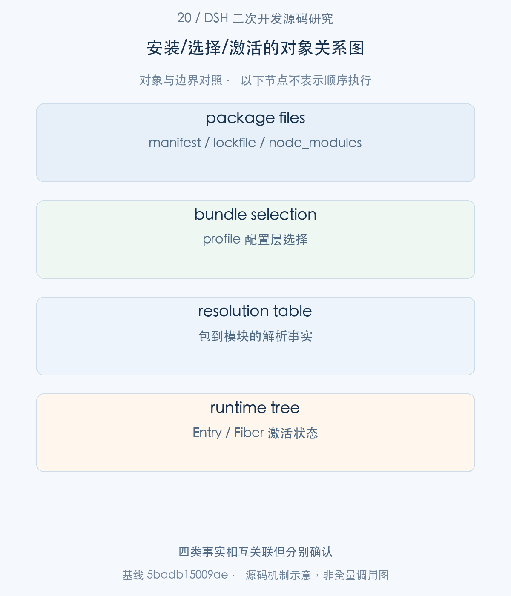
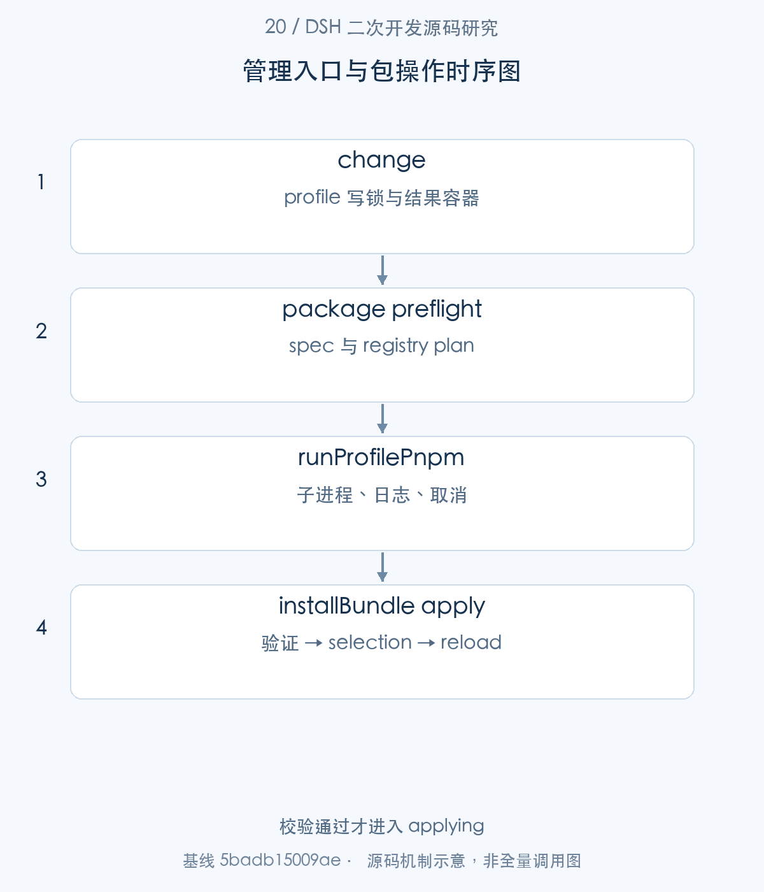
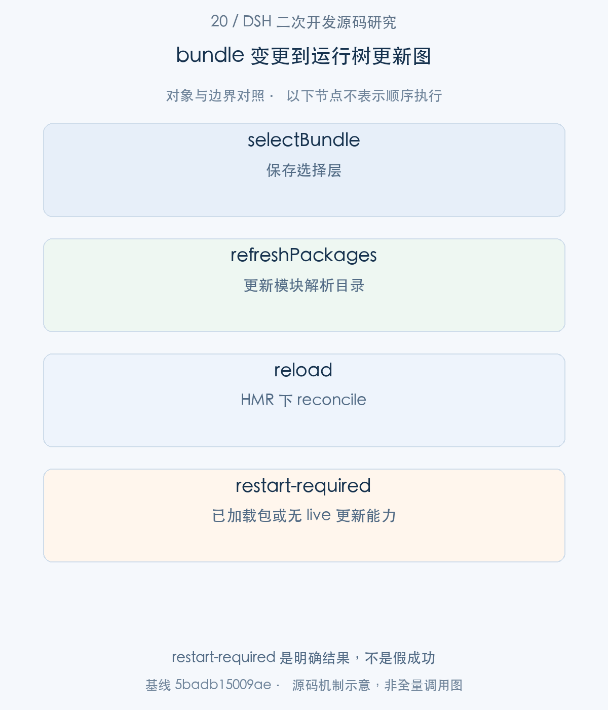
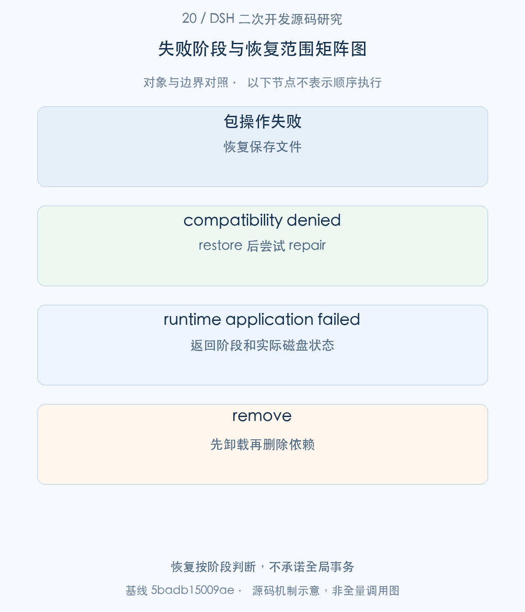

# 20｜扩展包如何进入运行系统：安装、启停、移除与恢复边界

安装企业 bundle 并不只是一条 pnpm add。它会修改 profile 文件、选择配置层、更新模块解析，并影响正在运行的 Fiber。本文以 installBundle 的阶段推进为主线，再追 disable/remove 与失败恢复，解释为什么 package 已安装、bundle 已选择和功能已激活必须作为三个事实观察。

> 源码基线：DSH `0.2.1-alpha.1`，提交 `5badb15009ae1756c3afe0ae0cef1faafc290ccc`。下文的源码摘录保持原文，仅移除公共缩进。企业新增设计与验证范围另行标明。

## 1. 整体地图：安装、选择和激活是怎样连接的

企业管理页面可以把一次扩展安装显示成一个按钮，但后端需要一个多阶段协议：先检查包，再让子进程修改依赖，验证新产物，最后选择并应用 bundle。每段失败留下的事实不同，界面应呈现 stage、application、changed 和诊断，而不是只显示 exitCode。

CLI 和 Host service 共用 profile 包操作基础设施，却采用不同输出和环境策略。本文集中分析 service 路径；安装脚本与 Host 插件都是可信进程级代码，不应把安装能力直接开放给不可信模型输入。



图1。四类事实相互关联但分别确认 [SVG](assets/20-plugin-package-management-fig-1.svg)。

## 2. 管理入口：CLI、服务与 UI 怎样进入共同操作

步骤1：所有管理变更进入 change，先获得 profile package.json 的文件锁。

<!-- source:S01 -->
源码 [packages/boot/plugin-manager/src/index.ts:795–827](https://github.com/deepseek-ai/deepseek-harness/blob/5badb15009ae1756c3afe0ae0cef1faafc290ccc/packages/boot/plugin-manager/src/index.ts#L795-L827)。

```typescript
private async change(
  operation: (result: ChangeResult) => Promise<ChangeResult['application'] | void>,
  request: Pick<ChangeResult, 'stage' | 'target' | 'enabled'>,
  reason: PluginChange['reason'],
): Promise<ChangeResult> {
  return withFileLock(join(this.profile.dir, 'package.json'), async () => {
    this.abort.signal.throwIfAborted()
    const before = this.diskState()
    const result: ChangeResult = { ...request, changed: false,
      application: this.ownerContext.get('hmr') !== undefined ? 'applied' : 'restart-required' }
    try {
      result.application = await operation(result) ?? result.application
    } catch (error) {
      if (error instanceof InstallCancelledError) {
        result.application = 'cancelled'
      } else {
        result.application = 'failed'
        result.error = managementError(error)
      }
    }
    result.changed = before !== this.diskState()
    this.ownerContext.emit('plugin-manager/changed', { reason })
    return result
  }, { waitMs: this.lockWaitMs })
}

private diskState(): string {
  return ['package.json', 'cordis.patch.yml', 'pnpm-workspace.yaml', PROFILE_COMPATIBILITY_FILENAME].map((file) => {
    try { return readFileSync(join(this.profile.dir, file), 'utf8') }
    catch (error) {
      if ((error as NodeJS.ErrnoException).code === 'ENOENT') return ''
      throw error
    }
```

锁内建立 before 与 ChangeResult，调用 operation，再归一化 failed/cancelled 等状态。changed 比较保存的磁盘状态，不代表 runtime 已激活；application 初值取决于是否有 HMR。企业接入应同时保留两者。

步骤2：带 requestId 的安装由 InstallControl 跟踪，cancelInstall 用它寻找正在执行的操作。

<!-- source:S02 -->
源码 [packages/boot/plugin-manager/src/index.ts:594–609](https://github.com/deepseek-ai/deepseek-harness/blob/5badb15009ae1756c3afe0ae0cef1faafc290ccc/packages/boot/plugin-manager/src/index.ts#L594-L609)。

```typescript
/** Stop an installation this manager owns and wait until its files are back.
 * @param requestId The id the installation was started with.
 * @returns `cancelled` once the Git check or pnpm exited and the files are restored, `too-late` once the bundle is being
 * applied, `not-running` for any other id.
 */
@Remote
async cancelInstall(requestId: PluginInstallRequestId): Promise<PluginInstallCancellation> {
  const control = this.installs.get(requestId)
  if (control === undefined) return { status: 'not-running' }
  if (control.phase === 'applying') return { status: 'too-late' }
  this.ownerContext.emit('plugin-manager/install-state', { requestId, phase: 'cancelling' })
  control.abort.abort()
  /* v8 ignore next -- change() folds every failure into its result; only a lock or disposal error rejects */
  await control.result.then(() => undefined, () => undefined)
  return { status: 'cancelled' }
}
```

installing 可以取消并等待文件恢复；applying 已越过取消边界，只返回 too-late。请求不存在返回 not-running。断开 Web 连接不自动等于取消，waitForInstall 可恢复尚在运行的结果观察，但并不是永久审计账本。



图2。校验通过才进入 applying [SVG](assets/20-plugin-package-management-fig-2.svg)。

## 3. 准备阶段：spec 检查、registry 与兼容性

步骤3：检查包信息与下载前要先确定 registry plan，不能对所有仓库盲目重试。

<!-- source:S03 -->
源码 [packages/boot/plugin-manager/src/registry.ts:54–75](https://github.com/deepseek-ai/deepseek-harness/blob/5badb15009ae1756c3afe0ae0cef1faafc290ccc/packages/boot/plugin-manager/src/registry.ts#L54-L75)。

```typescript
export function registryPlan(requested: Registry | undefined, configured: PluginRegistries): Registry[] {
  const own = configured.resolved === null ? null : normalizeRegistry(configured.resolved)
  const fallbacks = configured.fallbackRegistries.map(normalizeRegistry)
  const ownIsPublic = own !== null && (own === OFFICIAL_NPM_REGISTRY || fallbacks.includes(own))
  // What a registry is compared as: pnpm's own registry stands for the URL it names, once that is known.
  const keyOf = (registry: Registry): string | null => registry === null ? own : normalizeRegistry(registry)
  const known: Registry[] = []
  const keys: (string | null)[] = []
  for (const registry of [configured.registry, ...configured.fallbackRegistries]) {
    if (registry === null && !ownIsPublic) continue
    const key = keyOf(registry)
    if (keys.includes(key)) continue
    known.push(registry === null ? null : normalizeRegistry(registry))
    keys.push(key)
  }
  const first = requested === undefined ? configured.registry : requested
  const firstKey = keyOf(first)
  const normalizedFirst = first === null ? null : normalizeRegistry(first)
  // A private or unknown registry of pnpm's own, whichever way it was asked for, is asked alone.
  if ((first === null || firstKey === own) && !ownIsPublic) return [normalizedFirst]
  if (!keys.includes(firstKey)) return [normalizedFirst]
  return [normalizedFirst, ...known.filter((_registry, index) => keys[index] !== firstKey)]
```

配置的公共来源可形成 fallback 队列；私有或未知 registry 单独请求，避免将私有包名泄露给公共镜像。Git/tarball 的 spec-host 失败也不同于 registry 故障。包兼容性和 bundle metadata 则在下载后再次核验，preflight 不是最终真实性证明。

步骤4：runProfilePnpm 接收 launcher 确定的 profile 路径，在任何文件读取前检查未完成的 recorded run。

<!-- source:S04 -->
源码 [packages/boot/plugin-manager/src/operations.ts:288–321](https://github.com/deepseek-ai/deepseek-harness/blob/5badb15009ae1756c3afe0ae0cef1faafc290ccc/packages/boot/plugin-manager/src/operations.ts#L288-L321)。

```typescript
// Before any profile file is read: a recorded run that is still active may be rewriting them.
const active = await activeRecordedRun(dir)
const logRoot = join(dir, '.plugin-manager', 'logs')
await mkdir(logRoot, { recursive: true, mode: 0o700 })
const logDir = await mkdtemp(join(logRoot, 'operation-'))
const logPath = join(logDir, 'pnpm.log')
const log = await open(logPath, 'wx', 0o600)
if (active !== undefined) {
  await log.write(active)
  await log.close()
  options.onOutput?.(active, 'stderr')
  const bytes = Buffer.from(active)
  return { exitCode: 1, output: bytes.subarray(Math.max(0, bytes.length - options.outputBytes)).toString('utf8'), truncated: bytes.length > options.outputBytes, logPath }
}
const before = readProfileManifest('dsh', dir)
const savedFiles = ['package.json', 'pnpm-lock.yaml'].map(name => ({ path: join(dir, name), text: optionalFile(join(dir, name)) }))
const beforeDependencies = directDependencies(before)
const installedBefore = new Map(Object.keys(beforeDependencies).map(name => [name, optionalFile(join(dir, 'node_modules', name, 'package.json'))]))
let output = Buffer.alloc(0)
let truncated = false
const append = (bytes: Buffer): void => {
  output = Buffer.concat([output, bytes])
  if (output.length > options.outputBytes) {
    truncated = true
    output = output.subarray(output.length - options.outputBytes)
  }
}
const environment = { ...(options.execution === 'cli' ? process.env : scrubbedParentEnv()), ...options.env }
const restore = async (): Promise<void> => {
  for (const file of savedFiles) {
    if (file.text === undefined) await rm(file.path, { force: true })
    else await writeFileAtomic(file.path, file.text, { mode: 0o600 })
  }
}
```

新的持锁进程可能遇到上一进程退出后仍存活的 pnpm 子树；recorded run 让它避免同时读写。保存 package.json 与 pnpm-lock.yaml，记录完整本地日志，返回输出只保留有界尾部。CLI 继承环境，service 使用 scrubbedParentEnv 再叠加显式 env。

## 4. 安装阶段：profile 写锁与包管理子进程

步骤5：pnpm 已经启动后，输出 collector 同时承担日志持久和 silence timeout 的观测。

<!-- source:S05 -->
源码 [packages/boot/plugin-manager/src/operations.ts:375–399](https://github.com/deepseek-ai/deepseek-harness/blob/5badb15009ae1756c3afe0ae0cef1faafc290ccc/packages/boot/plugin-manager/src/operations.ts#L375-L399)。

```typescript
/** The silence bound: a captured run that stops printing without exiting is terminated, never awaited. */
const armIdle = (): void => {
  if (control.settled || options.idleTimeoutMs === undefined) return
  clearTimeout(idleTimer)
  idleTimer = setTimeout(() => {
    control.stalled = true
    // execa's kill reaches the whole tree of a service run, and escalates on its own.
    child.kill()
  }, options.idleTimeoutMs)
}
const collect = async (stream: AsyncIterable<Buffer | string>, kind: 'stdout' | 'stderr') => {
  try {
    for await (const chunk of stream) {
      armIdle()
      const bytes = Buffer.isBuffer(chunk) ? chunk : Buffer.from(chunk)
      writes = writes.then(async () => { await log.write(bytes) })
      await writes
      options.onOutput?.(bytes.toString('utf8'), kind)
      append(bytes)
    }
  } catch (error) {
    // A reading this call cut short is not a failure the run hit, and the run has
    // already exited, so there is nothing left for the cancellation to stop.
    if (!cut) {
      failure ??= error instanceof Error ? error : new Error(String(error))
```

收到输出重新计时；停滞时 kill 进程树，collector 异常会触发取消。不能把 stdout 暂停无条件视为正常，因为安装脚本可能永不退出；但 CLI inherited descriptors 没有 captured output，不能套用相同 silence 判断。

步骤6：子进程退出后，还要等待树和 pipes 收敛，才允许恢复文件或释放锁。

<!-- source:S06 -->
源码 [packages/boot/plugin-manager/src/operations.ts:414–439](https://github.com/deepseek-ai/deepseek-harness/blob/5badb15009ae1756c3afe0ae0cef1faafc290ccc/packages/boot/plugin-manager/src/operations.ts#L414-L439)。

```typescript
if (collectors.length > 0) armIdle()
let exitCode: number
try {
  await recordRun(dir, { pid: child.pid, grouped })
  // execa resolves its promise only once the piped stdio has ended, so the
  // process's own exit — the run's completion — is read from the raw child. A
  // spawn failure settles without one.
  const settled = Promise.allSettled([child])
  await Promise.race([exited, settled])
  control.settled = true
  clearTimeout(idleTimer)
  // A stalled run stops its whole tree first, so the caller's rollback and lock
  // release happen only after the scripts it started stopped writing.
  if (control.stalled) await awaitTreeGone({ pid: child.pid, grouped })
  // A descendant that inherited the pipes can hold them open past the process;
  // the tail drains under a bound instead of being awaited forever.
  const drained = await drainWithin(collectors, DRAIN_AFTER_EXIT_MS)
  if (drained) {
    for (const stream of await Promise.allSettled(collectors)) if (stream.status === 'rejected') throw stream.reason
  } else {
    // Cutting the tail short is this call's own end, not a failure the run hit;
    // a failure from before the cut still surfaces, and the cut leaves a notice
    // in the log because a classification may read an incomplete tail.
    cut = true
    child.stdout?.destroy()
    child.stderr?.destroy()
```

execa Promise 会等 stdio，因此先观察 raw child exit，再有界 drain。后代继承 pipes 时即使 pnpm 主进程退出也可能不结束；cut 明确是读取尾部的主动截止，不伪装成子进程失败。企业包操作日志应保留这种截断事实。

## 5. 启停阶段：bundle 选择、解析表发布与 HMR

步骤7：安装结束后 installBundle 确定变化的唯一 dependency，核对 bundle、版本兼容和 patch 可读性，再切换到 applying。

<!-- source:S07 -->
源码 [packages/boot/plugin-manager/src/index.ts:549–579](https://github.com/deepseek-ai/deepseek-harness/blob/5badb15009ae1756c3afe0ae0cef1faafc290ccc/packages/boot/plugin-manager/src/index.ts#L549-L579)。

```typescript
    const installed = Object.keys(after).filter(name => before[name] !== after[name])
    // Registry retries can retain the saved range after a partial installation.
    if (installed.length === 0) installed.push(...Object.keys(after).filter(name => spec === name || spec.startsWith(`${name}@`)))
    const target = installed[0]
    if (installed.length !== 1 || target === undefined) throw new ManagementFailure('ambiguous-install')
    name = target
    const dir = resolveBundleDir('dsh', name, this.profile.installAnchor, this.profile.dir)
    const manifest = bundleManifest(name, this.profile.dir, this.profile.installAnchor)
    if (manifest?.dsh?.bundle === undefined) throw new ManagementFailure('not-bundle')
    const compatibility = evaluatePluginCompatibility(manifest, readProfileVersionExemptions(this.profile.dir))
    if (compatibility !== undefined && !compatibility.exempted) throw new ManagementFailure('incompatible-version', [incompatiblePlugin(compatibility)])
    for (const file of bundlePatchPaths(dir, manifest.dsh.bundle)) loadOverlayPatches('dsh', file)
    version = manifest.version
  } catch (error) {
    // pnpm has exited by now, so the files it rewrote go back as they were.
    await this.restoreFiles(files)
    throw error
  }
  control.phase = 'applying'
  announce('applying')
  result.bundle = name
  if (version !== undefined) result.version = version
  result.target = name
  result.stage = 'enable'
  return this.configure(async () => {
    if (options?.enabled !== false) await this.selectBundle(name, true)
    if (Object.hasOwn(before, name)) return 'restart-required'
    await this.refreshPackages()
    if (options?.enabled !== false) result.warnings = await this.reload()
  })
}, { stage: 'install', target: spec, enabled: options?.enabled !== false }, 'install')
```

检查失败会恢复之前保存的文件。通过验证才 selectBundle；已有 dependency 的更新可能命中模块缓存，返回 restart-required。新包可 refreshPackages 并 reload。不要从“磁盘版本已改变”推出“旧 Host 已经执行新版本”。

步骤8：selectBundle 只维护 profile 的 bundle selection，不直接创建 Fiber。

<!-- source:S08 -->
源码 [packages/boot/plugin-manager/src/index.ts:734–753](https://github.com/deepseek-ai/deepseek-harness/blob/5badb15009ae1756c3afe0ae0cef1faafc290ccc/packages/boot/plugin-manager/src/index.ts#L734-L753)。

```typescript
private async selectBundle(name: string, enabled: boolean): Promise<void> {
  const manifest = readProfileManifest('dsh', this.profile.dir)
  const previous = manifest.dsh?.profile?.bundles ?? []
  if (enabled || !previous.includes(name)) {
    const metadata = bundleManifest(name, this.profile.dir, this.profile.installAnchor)
    if (metadata === undefined) throw new ManagementFailure('not-bundle')
    if (enabled) {
      const compatibility = evaluatePluginCompatibility(metadata, readProfileVersionExemptions(this.profile.dir))
      if (compatibility !== undefined && !compatibility.exempted) throw new ManagementFailure('incompatible-version', [incompatiblePlugin(compatibility)])
      this.bundleRows(name)
    }
  }
  if (!enabled && previous.includes(name)) {
    if (this.protectsManager(name)) throw new ManagementFailure('management-required')
  }
  const bundles = enabled ? [...previous, ...previous.includes(name) ? [] : [name]] : previous.filter(item => item !== name)
  if (JSON.stringify(previous) === JSON.stringify(bundles)) return
  manifest.dsh = { ...manifest.dsh, profile: { ...manifest.dsh?.profile, bundles } }
  await saveManifest(this.profile.dir, manifest)
  if (enabled) this.protectsManager(name)
```

启用先校验 metadata、compatibility 和 rows；禁用受保护管理 bundle 会被拒绝，避免管理功能自卸载。selection 保存之后仍需 refresh/reload，故三个状态必须分别说明。

步骤9：configure 使用 HMR.runExclusive；refreshPackages 更新解析目录，reload 才 reconcile profile patches。

<!-- source:S09 -->
源码 [packages/boot/plugin-manager/src/index.ts:774–793](https://github.com/deepseek-ai/deepseek-harness/blob/5badb15009ae1756c3afe0ae0cef1faafc290ccc/packages/boot/plugin-manager/src/index.ts#L774-L793)。

```typescript

private configure<T>(operation: () => Promise<T>): Promise<T> {
  const hmr = this.ownerContext.get('hmr')
  const apply = () => { this.abort.signal.throwIfAborted(); return operation() }
  return hmr === undefined ? apply() : hmr.runExclusive(apply)
}

private async refreshPackages(): Promise<void> {
  if (this.ownerContext.get('hmr') === undefined) {
    const selected = readProfileManifest('dsh', this.profile.dir).dsh?.profile?.bundles ?? []
    // Deselected startup bundles still run without HMR and need the existing package table.
    if (this.profile.startedBundles.some(name => !selected.includes(name))) return
  }
  await this.ownerContext.get('pluginPackages')?.refresh()
}

private async reload(requiredIds: readonly string[] = []): Promise<string[]> {
  if (this.ownerContext.get('hmr') === undefined) return []
  return reconcileProfilePatches(this.ownerContext.root, readProfilePatches('dsh', this.profile), 'dsh', requiredIds)
}
```

无 HMR 的 profile 可能保留已启动但被取消选择的旧 bundle，代码保留相应解析表。此时用户应看到 restart-required，而不是一个貌似即时禁用成功的状态。HMR 串行化并不会把 npm 模块缓存变成可任意回滚的版本仓库。



图3。restart-required 是明确结果，不是假成功 [SVG](assets/20-plugin-package-management-fig-3.svg)。

## 6. 移除与失败：按阶段解释保留和恢复

步骤10：removeBundle 先取消选择并等待 reload，再检查贡献是否仍被使用，最后 pnpm remove。

<!-- source:S10 -->
源码 [packages/boot/plugin-manager/src/index.ts:617–644](https://github.com/deepseek-ai/deepseek-harness/blob/5badb15009ae1756c3afe0ae0cef1faafc290ccc/packages/boot/plugin-manager/src/index.ts#L617-L644)。

```typescript
removeBundle(name: string): Promise<ChangeResult> {
  return this.change(async (result) => {
    const installed = await this.configure(async () => {
      const bundle = (await this.listBundles()).find(item => item.name === name)
      if (bundle === undefined || !bundle.removable) throw new ManagementFailure('not-removable')
      if (this.ownerContext.get('hmr') === undefined && (this.profile.startedBundles.includes(name)
        || (bundle.error === undefined && this.bundleRows(name).some(row => [...this.ctx.loader.entries()]
          .some(entry => entry.options.id === row.id && entry.fiber !== undefined))))) {
        throw new ManagementFailure('stop-profile')
      }
      const contributions = bundle.error === undefined ? this.bundleRows(name) : []
      if (bundle.enabled) {
        await this.selectBundle(name, false)
        result.warnings = await this.reload()
      }
      if ([...this.ctx.loader.entries()].some(entry => entry.fiber?.uid != null
        && contributions.some(row => row.id === entry.options.id && row.name === entry.options.name))) {
        throw new ManagementFailure('bundle-in-use')
      }
      return bundle.installed
    })
    if (!installed) return
    result.packageResult = await this.runPnpm(['remove', name])
    if (result.packageResult.exitCode !== 0 || result.packageResult.timedOut === true) {
      throw new Error(result.packageResult.output)
    }
    await this.configure(() => this.refreshPackages())
  }, { stage: 'remove', target: name }, 'remove')
```

这与“先删磁盘再停实例”的危险顺序不同。无 HMR 且 bundle 仍 live 时返回 stop-profile；卸载后仍有 matching Entry/Fiber 就拒绝 bundle-in-use。pnpm remove 失败可能保留已经取消的选择，恢复范围要按阶段读取。

步骤11：兼容性拒绝发生在替换 node_modules 之后时，底层尝试恢复 manifest/lockfile 并重新安装旧依赖。

<!-- source:S11 -->
源码 [packages/boot/plugin-manager/src/operations.ts:499–522](https://github.com/deepseek-ai/deepseek-harness/blob/5badb15009ae1756c3afe0ae0cef1faafc290ccc/packages/boot/plugin-manager/src/operations.ts#L499-L522)。

```typescript
if (warnings.length > 0) {
  // A bundle component's peers need installed contents, so this rejection lands after pnpm
  // replaced the tree: restore the files, then reinstall the restored lockfile so the version
  // that worked before this run keeps loading. A profile that had no lockfile is reinstalled
  // from its restored manifest without creating one, which removes what this run added.
  await restore()
  const hadLockfile = savedFiles.some(file => file.path.endsWith('pnpm-lock.yaml') && file.text !== undefined)
  const repair = ['install', hadLockfile ? '--frozen-lockfile' : '--config.lockfile=false']
  const repairing = execa(options.command ?? 'pnpm', [...options.args ?? [], ...repair], {
    cwd: dir, env: environment, extendEnv: false, reject: false, stdin: 'ignore',
    ...options.idleTimeoutMs === undefined ? {} : { timeout: options.idleTimeoutMs },
  })
  await recordRun(dir, { pid: repairing.pid, grouped: false })
  const repaired = await repairing
  exitCode = 1
  const restoration = repaired.exitCode === 0
    ? 'restored package.json, pnpm-lock.yaml, and node_modules'
    : "restored package.json and pnpm-lock.yaml, but node_modules could not be reinstalled; run 'dsh plugin install'"
  const diagnostic = `\ndsh: installation rejected: ${warnings.join('\n')}\ndsh: ${restoration}.\n`
  await log.write(diagnostic)
  options.onOutput?.(diagnostic, 'stderr')
  append(Buffer.from(diagnostic))
} else if (options.activateNewBundles !== false) {
  await reconcile(before, dir, context.installAnchor, options)
```

源码顶部注释对恢复描述偏简略；实际代码还有 repair install。repair 成功才声称恢复 node_modules，失败明确提示手工恢复。Manager 外层 restoreFiles 和这里的 repair 也不是同一机制，不能合并成“任何失败都全量回滚”。

|故障阶段|可确认的恢复|仍需观察|
|---|---|---|
|预检查拒绝|尚未执行安装|registry/spec 诊断|
|安装取消/包失败|Manager 恢复保存文件|下载文件、workspace 审批记录、进程收敛|
|兼容性拒绝|底层尝试 repair 旧依赖|repair exitCode|
|应用失败|返回 application=failed|selection、Fiber、外部副作用|
|移除失败|保留错误及阶段|可能已禁用但尚未删依赖|



图4。恢复按阶段判断，不承诺全局事务 [SVG](assets/20-plugin-package-management-fig-4.svg)。

把安装看成一项多阶段操作，可以得到比单一成功布尔值更有用的排查方法。用户确认一个包版本之后，先观察包管理任务是否实际退出，再看profile中的选择是否成立，最后看Loader中的Entry是否激活。`node_modules`里有文件，只能证明安装层的一部分事实；Entry已经active，也不保证浏览器仍缓存的旧Client产物已经刷新。

取消同样要按阶段解释。安装阶段能够把signal交给受控命令；进入应用阶段后，接口可能明确表示取消太晚。此时界面应继续观察最终结果，而不是立即显示“全部恢复原状”。如果命令退出失败，则要结合phase、日志和可修复状态判断后续动作，不能仅凭最后一行错误删除整个profile。

移除操作的顺序提供了另一个实践经验：先从运行选择中撤销贡献，并等待实例清理，再改变依赖文件。否则，在途工具仍可能引用已移除的实现。企业扩展若自己持有连接或后台任务，也应通过Context返回可等待清理，让PluginManager的撤销阶段能得到真实的退出事实。

## 7. 开发示例与验证：管理一个教学 bundle

这个 fixture 展示一个已损坏 bundle 的 disable/enable 操作：保存选择与 application 的判断是分别断言的。

<!-- source:S12 -->
源码 [packages/boot/plugin-manager/tests/manager.spec.ts:242–248](https://github.com/deepseek-ai/deepseek-harness/blob/5badb15009ae1756c3afe0ae0cef1faafc290ccc/packages/boot/plugin-manager/tests/manager.spec.ts#L242-L248)。

```typescript
expect([...ctx.loader.entries()].some(entry => entry.id === 'include:managed')).toBe(false)
expect((await manager.listBundles()).find(row => row.name === 'extra')).toMatchObject({
  enabled: true, source: 'extra@1.0.0', error: { code: failure === 'not a bundle' ? 'not-bundle' : 'operation-error' }, rows: [],
})
expect(await manager.setBundleEnabled('extra', false)).toMatchObject({ changed: true, application: 'applied' })
expect(readProfileManifest('test', dir).dsh?.profile?.bundles).toEqual(['core'])
expect(await manager.setBundleEnabled('extra', true)).toMatchObject({ changed: false, application: 'failed' })
```

禁用移除 selection，可 changed=true；重新启用校验失败，application=failed 且磁盘没有新变化。测试依赖上方 profile fixture，不是可以脱离 context 粘贴执行的 standalone 程序。

推荐在隔离 profile 中使用现成 fixtures 管理教学 bundle，按 listBundles → installBundle → setBundleEnabled(false/true) → removeBundle 观察每次 ChangeResult。测试应断言 saved selection 和 live Entry 两端，而不只看 pnpm argv。

源码的 operations-process/run-tree 测试涉及真实子进程和后代 pipes，manager/package-reload 测试覆盖配置与解析更新；它们是不同层次的证据。本文不执行网络安装、第三方脚本或真实企业包发布。

可复核入口（`pnpm` 命令在 `.sources/deepseek-harness` 中运行，`node research/...` 命令在本研究仓库根目录运行；实际执行结果见[本批验证记录](../validation/supplementary-articles-validation.md)）：

```sh
pnpm exec vitest run packages/boot/plugin-manager/tests/manager.spec.ts packages/boot/plugin-manager/tests/operations.spec.ts packages/boot/plugin-manager/tests/package-reload.spec.ts
```

本篇使用现有源码测试说明契约，并不把 mock 的通过解释成真实模型、外部 server、浏览器或企业基础设施已经验收。
## 8. 工程心得：包管理是多阶段操作协议

这段实现让我更清楚地看到，包管理应设计成可恢复观察的协议。requestId、phase、bounded output、logPath 和 application 共同让一个长耗时操作被解释，而不是被一个 HTTP 成功状态掩盖。

对企业产品最直接的启发，是把恢复范围写进操作结果：文件恢复、依赖树恢复、运行实例更新和远端效果分别确认。提供这些事实，比承诺一个难以实现的全局原子性更有维护价值。

另一个值得保留的细节是卸载顺序。先等待实例撤销，再删除它所依赖的包，能把故障定位到清楚的责任边界；锁与进程树等待则确保下一次操作不会接手一个仍在写盘的现场。


[返回补充专题目录](README.md#补充专栏17—28) · [对应写作大纲](../appendices/supplementary-article-outlines.md)
