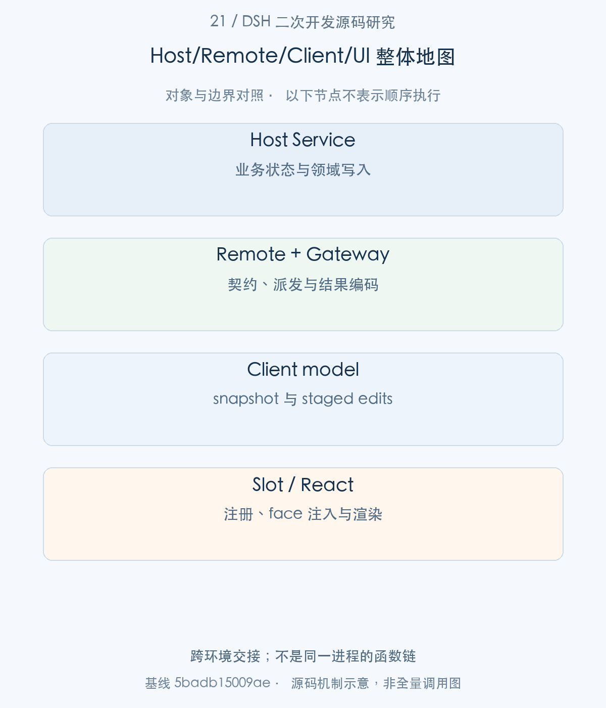
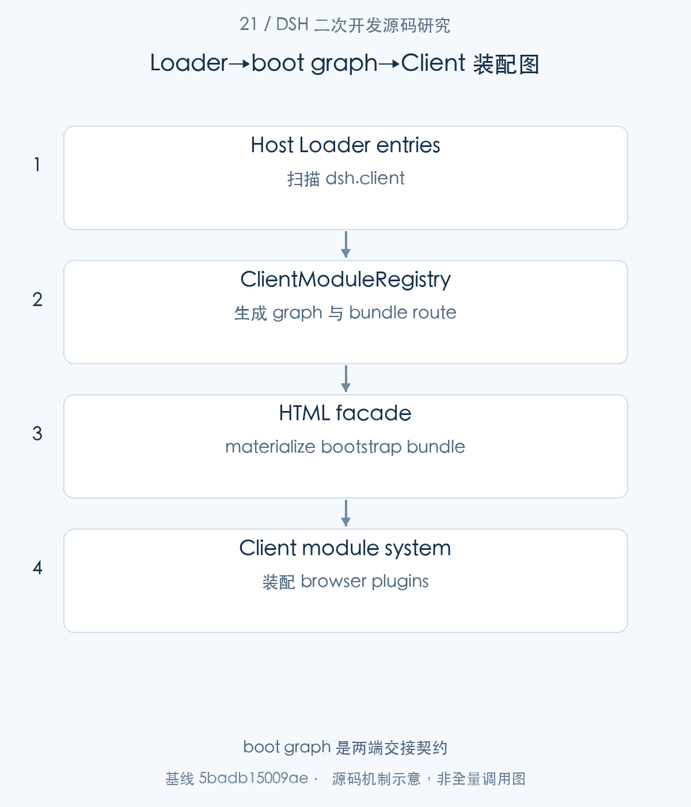
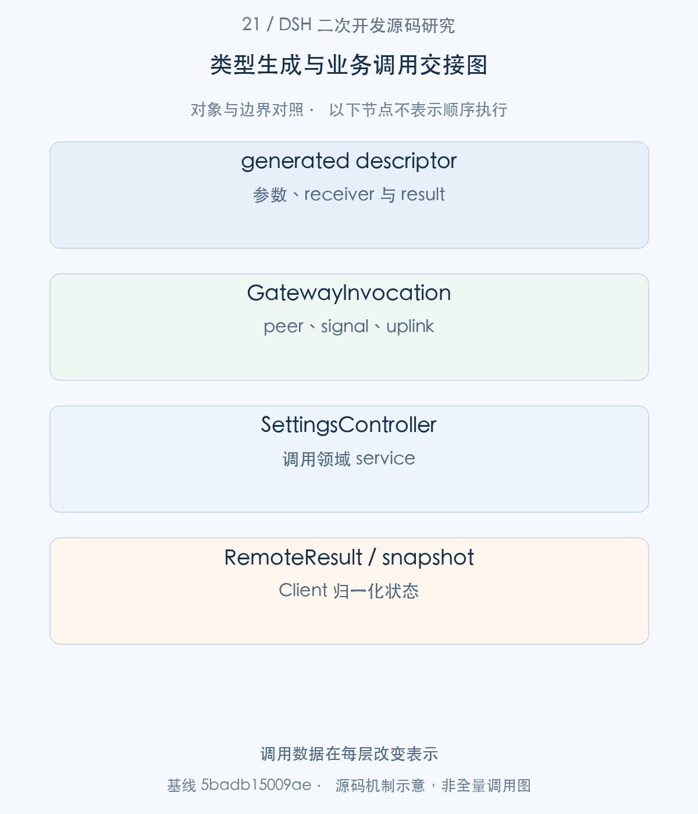
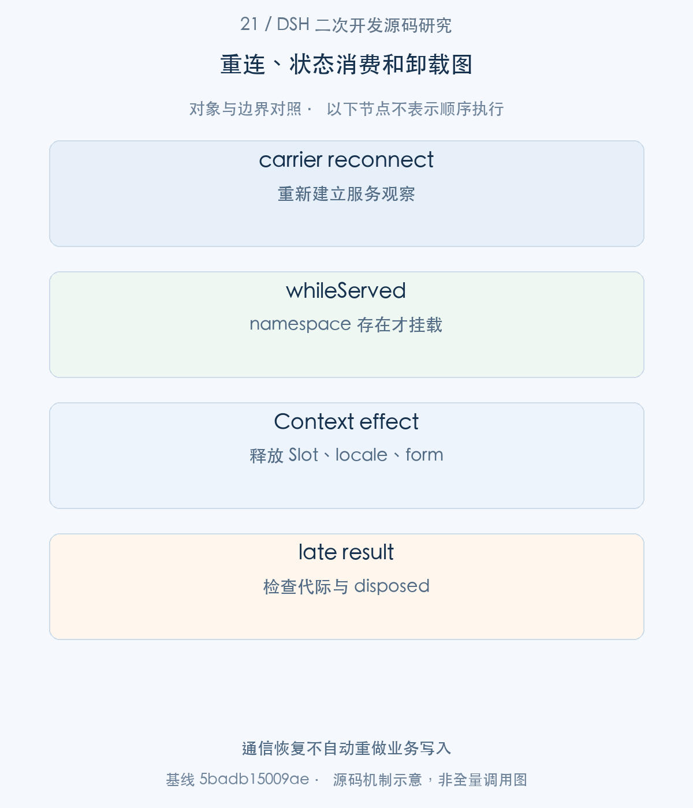

# 21｜从后端服务到浏览器面板：一个完整 DSH 插件的实现链

一个可维护的企业 DSH 功能，需要连接 Host 服务、Remote 契约、Client 模块、状态模型和 UI Slot。本文以现有 agent-loop 设置卡片为完整源码样例，从 package 声明追到 React 的保存动作，并解释 Gateway 如何找到真正的业务方法。企业查询面板可沿同样的责任分层扩展，不能只复制一个 React 组件就认为接入已经完成。

> 源码基线：DSH `0.2.1-alpha.1`，提交 `5badb15009ae1756c3afe0ae0cef1faafc290ccc`。下文的源码摘录保持原文，仅移除公共缩进。企业新增设计与验证范围另行标明。

## 1. 整体地图：一个业务功能经过哪些构建与运行环境

这条链有两种顺序：构建时先有 Host 类型和 Remote 产物，再构建 Client；运行时 Host Loader 扫描插件，浏览器 boot graph 装配 Client，页面模型通过 Remote 读取业务状态。下面先建立模块关系，再跟随一次表单读取和提交。

为避免一个未经构建的“完整示例”掩盖前置条件，本篇直接解剖上游已存在的双端插件。原始源码、manifest、controller 和组件都可定位；企业替换的业务服务与查询字段另按新增设计处理。



图1。跨环境交接；不是同一进程的函数链 [SVG](assets/21-fullstack-plugin-development-fig-1.svg)。

## 2. 包声明与产物：dsh.client、exports 和双端构建

步骤1：双端入口由 exports 和 dsh.client 声明，而不是靠扫描所有 tsx 文件发现。

<!-- source:S01 -->
源码 [packages/client/ui-settings-agent-loop/package.json:17–52](https://github.com/deepseek-ai/deepseek-harness/blob/5badb15009ae1756c3afe0ae0cef1faafc290ccc/packages/client/ui-settings-agent-loop/package.json#L17-L52)。

```json
  ".": {
    "types": "./lib/types/index.d.ts",
    "default": "./lib/index.js"
  },
  "./client": {
    "types": "./lib/types/client/index.d.ts",
    "default": "./lib/client.js"
  },
  "./src/*": "./src/*",
  "./package.json": "./package.json"
},
"dsh": {
  "client": {
    "inject": [
      "@deepseek-ai/dsh-client-locale",
      "@deepseek-ai/dsh-client-ui-settings",
      "@deepseek-ai/dsh-client-ui-plugin-manager"
    ],
    "platform": "web"
  }
},
"scripts": {
  "bundle": "tsdown",
  "watch": "tsdown --watch"
},
"license": "MIT",
"peerDependencies": {
  "@deepseek-ai/cordis": "workspace:~"
},
"devDependencies": {
  "@deepseek-ai/cordis": "workspace:~",
  "@deepseek-ai/dsh-api-remotes": "workspace:*",
  "@deepseek-ai/dsh-client-locale": "workspace:*",
  "@deepseek-ai/dsh-client-store": "workspace:*",
  "@deepseek-ai/dsh-client-test-runtime": "workspace:*",
  "@deepseek-ai/dsh-client-ui-plugin-manager": "workspace:*",
```

Host 默认入口与 ./client 浏览器产物分别导出；dsh.client.inject 表示 Client package dependencies，platform=web 限定载体。类型使用 type-only imports 引入 Context/SlotMap 合并，运行协作则通过 ctx.services，避免从别的 Client 插件导入运行实例。

步骤2：Host ClientModuleRegistry 先扫描当前 Loader entries，再建立 web carrier 和 index injections。

<!-- source:S02 -->
源码 [packages/client/modules/src/index.ts:637–658](https://github.com/deepseek-ai/deepseek-harness/blob/5badb15009ae1756c3afe0ae0cef1faafc290ccc/packages/client/modules/src/index.ts#L637-L658)。

```typescript
  // current entries, flushed synchronously (nothing async between subscribe,
  // seed, and flush).
  for (const entry of ctx.loader.entries()) this.dirty.add(entry.options.name)
  this.composed = this.compose()
  const failures: Error[] = []
  this.flush(err => failures.push(err))
  if (failures.length > 0) {
    throw new ClientPackageCompositionError(failures)
  }

  const registerWebCarrier = (webCtx: Context): void => {
    webCtx.effect(
      () => webCtx.webServer.register({ kind: 'prefix', path: PLUGIN_ROUTE, handler: this.serveBundle }),
      'client-modules: bundle route',
    )
  }
  ctx.inject(['webServer'], registerWebCarrier)
  ctx.on('webserver/index-inject', (table) => {
    table.push(...bootInjections(this.composed))
  })
}

```

初始扫描复用 incremental dirty/flush 路径，扫描失败导致 composition error。服务提供 bundle route，HTML 注入 boot graph。一个 Host package 可以对应若干 Entry，但同名 Client package 的有冲突声明必须被检测；metadata 的缓存也意味着安装新产物后需正确 refresh/restart。



图2。boot graph 是两端交接契约 [SVG](assets/21-fullstack-plugin-development-fig-2.svg)。

## 3. 浏览器装配：Host Loader 到 Client module graph

步骤3：HTML facade materialize 模块后，调用 createClientModuleSystem，将 boot manifest 交给浏览器模块系统。

<!-- source:S03 -->
源码 [packages/client/modules/src/client/index.ts:37–49](https://github.com/deepseek-ai/deepseek-harness/blob/5badb15009ae1756c3afe0ae0cef1faafc290ccc/packages/client/modules/src/client/index.ts#L37-L49)。

```typescript
 * @returns The created module system.
 */
export function createClientModuleSystem(
  target: ClientModuleLoaderTarget,
  bootstrapModule: ClientBootstrapModule,
  options: ClientModuleCreateOptions,
): ClientModuleSystem {
  return new ClientModuleSystem({
    manifest: parseBootManifest(options.boot),
    staticModules: options.staticModules,
    registrationTarget: target,
    bootstrapModule,
    ...(options.loadBundle === undefined ? {} : { loadBundle: options.loadBundle }),
```

module system 在 Cordis 前构造，这是加载机制无法通过自身加载的 bootstrap 例外；之后 apply 才将现有 Loader 的 internal 系统登记为 ctx.modules。不要把 Host apply 和 Client apply 写成同一进程内的一条普通函数调用。

步骤4：Client 设置模型通过 SettingsMirror 统一调用 remote.settings.describe，并把响应写入 snapshot store。

<!-- source:S04 -->
源码 [packages/client/ui-settings/src/client/settings-mirror.ts:172–207](https://github.com/deepseek-ai/deepseek-harness/blob/5badb15009ae1756c3afe0ae0cef1faafc290ccc/packages/client/ui-settings/src/client/settings-mirror.ts#L172-L207)。

```typescript
  do {
    const before = this.store.getSnapshot()
    if (before.status === 'idle') this.store.set({ ...before, status: 'loading' })
    // Cleared immediately before the wire read goes out: a load() marked
    // earlier (including one reentering from the loading publish above)
    // is covered by this very read, while one landing after needs the
    // rerun.
    this.rerun = false
    const generation = ++this.generation
    let outcome: { view: SettingsDescribeView } | { failure: string }
    try {
      const response = await this.ctx.remote.settings.describe()
      outcome = response.ok
        ? { view: response.value }
        : { failure: response.error.message }
    } catch (error) {
      outcome = { failure: error instanceof Error ? error.message : String(error) }
    }
    // A write answer invalidates a document read before that write committed.
    if (generation !== this.generation) continue
    if ('view' in outcome) {
      this.store.set({ status: 'ready', view: outcome.view, error: null })
    } else {
      const held = this.store.getSnapshot()
      // No answer yet: fall back to idle so `ensure` retries; with one, the
      // held view keeps serving and only the error field reports the miss.
      this.store.set({
        status: held.view === undefined ? 'idle' : 'ready',
        view: held.view,
        error: outcome.failure,
      })
    }
  } while (this.shouldRerun())
} finally {
  this.inFlight = undefined
}
```

共享 mirror 串行化读取，合并 refresh 请求，避免每张卡片分别轮询。响应使用 RemoteResult 的 ok/error 语义；关闭后丢弃迟到结果。这里的“最新页面状态”既取决于服务器结果，也取决于 Client 请求代际及退出状态。

## 4. 业务调用：Remote 声明到 Gateway 派发

步骤5：describe 的 RPC 进入 Gateway.prepareInvocation，按 endpoint 找到 descriptor，然后确定 receiver Context。

<!-- source:S05 -->
源码 [packages/api/gateway/src/index.ts:699–731](https://github.com/deepseek-ai/deepseek-harness/blob/5badb15009ae1756c3afe0ae0cef1faafc290ccc/packages/api/gateway/src/index.ts#L699-L731)。

```typescript
private async prepareInvocation(
  request: InvokeRemoteRequest,
  control: AbortController,
): Promise<PreparedInvocation> {
  const endpoint = endpointOf(request.namespace, request.method)
  const descriptor = this.resolveDescriptor(request.namespace, request.method, endpoint)
  assertExactArguments(request.args, descriptor, endpoint)
  const receiverContext = await this.resolveReceiverContext(descriptor, request.args, endpoint)
  const receiver: unknown = receiverContext.get(descriptor.service)
  if (!isObject(receiver)) {
    throw new TypertGatewayError(
      'gateway/service-unavailable',
      endpoint,
      `active Service ${JSON.stringify(descriptor.service)} is unavailable`,
    )
  }
  validateBinding(receiver, descriptor.service, descriptor.namespace, endpoint)
  const args = await Promise.all(descriptor.parameters.map(parameter =>
    this.resolveParameter(parameter, request.args, endpoint)))
  const signal = methodSignal(request, control)
  const invocation = new GatewayInvocation(
    { namespace: request.namespace, method: request.method, args: request.args },
    descriptor.service,
    request.peer ?? this.operatorPeer(),
    signal,
    {
      source: request.uplink ?? EMPTY_ASYNC_ITERABLE,
      codec: descriptor.uplink?.codec ?? SRC_JSON_CODEC,
      endpoint,
      abort: (reason) => { control.abort(reason) },
    },
  )
  if (descriptor.cancellation !== undefined) args.push(signal)
```

assertExactArguments 检查形状；resolveReceiverContext 决定服务视角；resolveParameter 将 wire args 还原为业务参数。GatewayInvocation 携带 peer、signal 与 uplink，作为 Context 属性给业务服务，不让 caller 自行填一个 this.ctx。

步骤6：Gateway 在扩展后的 Context 中取得 service view，再准备调用指定 implementation。

<!-- source:S06 -->
源码 [packages/api/gateway/src/index.ts:732–765](https://github.com/deepseek-ai/deepseek-harness/blob/5badb15009ae1756c3afe0ae0cef1faafc290ccc/packages/api/gateway/src/index.ts#L732-L765)。

```typescript
  // The method runs on a Service view bound to a Context carrying this call:
  // Cordis rebinds `this.ctx` to the accessing Context, so `this.ctx.invocation`
  // is this call and nothing travels through the parameter list. The view
  // resolves the Service the plain read above already found.
  const callReceiver = receiverContext.extend({ invocation }).get(descriptor.service) as object
  const implementation = descriptor.implementation ?? descriptor.method
  const method: unknown = Reflect.get(callReceiver, implementation)
  if (typeof method !== 'function') {
    throw new TypertGatewayError(
      'gateway/method-unavailable',
      endpoint,
      `active Service ${JSON.stringify(descriptor.service)} has no callable method ${JSON.stringify(implementation)}`,
    )
  }
  return {
    endpoint,
    descriptor,
    receiver: callReceiver,
    args,
    method: method as (...args: never[]) => unknown,
    invocation,
  }
}

private resolveDescriptor(namespace: string, method: string, endpoint: string): InvocationDescriptor {
  const strict = this.ctx.typert.local.get(endpoint)
  if (strict !== undefined) return strict
  if (this.ctx.typert.local.hasSeen(endpoint)) {
    throw new TypertGatewayError(
      'gateway/definition-unavailable',
      endpoint,
      'its strict definition was withdrawn and SRC fallback is forbidden',
    )
  }
```

strict generated descriptor 优先；如果 endpoint 曾经出现 strict 定义而后撤销，禁止回退 SRC。这个 fail-closed 细节避免 HMR 卸载期间突然退化成宽松接口。descriptor 只是类型和派发契约，身份授权仍由可信入口及业务资源层负责。

上面追踪的是describe读取支线。用户随后点击保存，走的是另一条请求：React action → SettingsFormModel.save → ConfigForm.mutate → remote.settings.mutate → 同一个Gateway。两条请求复用派发机制，但endpoint和输入不同。先补齐Client一侧的两个真实caller，再进入Host写入方法。

<!-- source:S12 -->
源码 [packages/client/ui-primitives/src/settings-form/form-model.ts:300–322](https://github.com/deepseek-ai/deepseek-harness/blob/5badb15009ae1756c3afe0ae0cef1faafc290ccc/packages/client/ui-primitives/src/settings-form/form-model.ts#L300-L322)。

```typescript
async save(): Promise<void> {
  const plan = this.plan()
  if (!plan.length || this.saving || !this.scope.getSnapshot().writable
    || plan.some(item => item.run === undefined && item.op === undefined)) return
  this.saving = true
  this.failed = false
  this.publish()
  try {
    const ops = plan.flatMap(item => item.op === undefined ? [] : [item.op])
    let landed = !ops.length || await this.scope.mutate(ops, this.baseline?.revision)
    if (!landed) { this.failed = true; return }
    for (const item of plan) if (item.run) landed = await item.run() && landed
    if (landed) { this.staged.clear(); this.baseline = undefined }
    this.failed = !landed
  } catch (_error) {
    this.failed = true
  } finally {
    this.saving = false
    this.publish()
  }
}

/** Release the form's accepted-value subscription. */
```

save把staged字段变成有序ops，并携带编辑开始时的baseline revision调用scope.mutate。只有写入获准，才清空staged；失败保留可解释的编辑状态。这一步的scope是表单契约对象，不是Agent的ScopeKey。

<!-- source:S13 -->
源码 [packages/client/ui-settings/src/client/config-form.ts:134–153](https://github.com/deepseek-ai/deepseek-harness/blob/5badb15009ae1756c3afe0ae0cef1faafc290ccc/packages/client/ui-settings/src/client/config-form.ts#L134-L153)。

```typescript
mutate(ops: readonly SettingsPathOpView[], expectedRevision?: number): Promise<boolean> {
  const ownedOps = structuredClone(ops) as SettingsPathOpView[]
  const generation = ++this.writeGeneration
  return this.enqueue(async () => {
    const revision = expectedRevision ?? this.pendingRevision ?? this.getSnapshot().revision
    const response = await this.ctx.remote.settings.mutate(this.spec.namespace, ownedOps, revision)
    if (!response.ok) {
      await this.recover(generation)
      return false
    }
    if (this.disposed) return true
    if (generation === this.writeGeneration) {
      this.pendingRevision = undefined
      this.mirror.acceptView(response.value)
    } else {
      this.pendingRevision = response.value.revision
    }
    return true
  })
}
```

ConfigForm接住ops后复制输入、排队，并把namespace、ops和revision交给Remote。成功的namespace view进入mirror；失败则走恢复读取。于是下文SettingsController收到的write不再是从describe里突然跳出来，而是这条保存请求的Host consumer。

步骤7：Host SettingsController 把 write 请求交给 settings domain，返回脱敏后的最新 namespace view。

<!-- source:S07 -->
源码 [packages/api/settings-controller/src/index.ts:192–211](https://github.com/deepseek-ai/deepseek-harness/blob/5badb15009ae1756c3afe0ae0cef1faafc290ccc/packages/api/settings-controller/src/index.ts#L192-L211)。

```typescript
): Promise<SettingsNamespaceView> {
  const parsed = settingsNamespaceRequestSchema.safeParse({ ns })
  if (!parsed.success) {
    throw new RemoteError('gateway/bad-request', `invalid payload for settings.${mode}`, { issues: parsed.error.issues })
  }
  const settings = this.provider()
  const namespace = parsed.data.ns
  try {
    if (mode === 'update') await settings.update(namespace, input, expectedRevision)
    else if (mode === 'replace') await settings.replace(namespace, input, expectedRevision)
    else await settings.mutate(namespace, input as SettingsPathOp[], expectedRevision)
  } catch (error: unknown) {
    throw rejected(ns, error)
  }
  const descriptor = settings.describe({ redactSecrets: true }).find(candidate => candidate.ns === namespace)
  if (descriptor === undefined) {
    // The write committed but the namespace vanished before this read: only a
    // concurrent registrant disposal can produce it.
    throw new RemoteError('gateway/internal', `settings namespace "${ns}" was disposed after the ${mode}`, {})
  }
```

它校验 namespace 和 input，将领域错误映射为 RemoteError。重读结果是保存之后页面恢复状态的依据；不是在 Client 先乐观显示“已生效”就结束。19篇已展开这里调用的 settings.mutate 与 ConfigEditor 写回。

## 5. 界面装配：Slots、store 与事件订阅

步骤8：Client plugin 从 configForms.get 取得绑定 namespace 的 SettingsFormScope，传给 AgentLoopCardController。

<!-- source:S08 -->
源码 [packages/client/ui-settings-agent-loop/src/client/agent-loop-card-controller.ts:38–63](https://github.com/deepseek-ai/deepseek-harness/blob/5badb15009ae1756c3afe0ae0cef1faafc290ccc/packages/client/ui-settings-agent-loop/src/client/agent-loop-card-controller.ts#L38-L63)。

```typescript
/** Bridges the `agent-loop` scope onto the page's staged form. */
export class AgentLoopCardController {
  private readonly form: SettingsFormModel<AgentLoopSettings>
  private readonly store: SnapshotStore<AgentLoopCardState>

  /** @param scope - the bound settings scope for the `agent-loop` namespace. */
  constructor(scope: SettingsFormScope<AgentLoopSettings>) {
    this.form = new SettingsFormModel(scope, [settingsNumberField('maxParallelToolCalls')])
    this.store = this.form.bind(() => this.projection())
  }

  private projection(): AgentLoopCardState {
    return { ...this.form.shell(), maxParallelToolCalls: this.form.field('maxParallelToolCalls') }
  }

  /**
   * Build the face the page's slot registration injects.
   * @returns the page's snapshot and its form actions.
   */
  inject(): AgentLoopCardFace {
    return { hooks: { agentLoopCard: this.store }, ...this.form.actions() }
  }
  /** Release accepted-value subscriptions. */
  dispose(): void { this.form.dispose() }

}
```

controller 用 SettingsFormModel 管理 staged edits，用 form.bind 生成 SnapshotStore。inject 返回 hooks 和 actions，这一 face 作为 Slot 注入提供给组件。由此 React 不需要知道 Gateway endpoint 或 profile 文件路径。

步骤9：apply 注册 locale、form subscription 与 plugins.item Slot，并分别挂到 ctx.effect。

<!-- source:S09 -->
源码 [packages/client/ui-settings-agent-loop/src/client/index.ts:43–50](https://github.com/deepseek-ai/deepseek-harness/blob/5badb15009ae1756c3afe0ae0cef1faafc290ccc/packages/client/ui-settings-agent-loop/src/client/index.ts#L43-L50)。

```typescript
  const t = ctx.locale.bind(NS)
  ctx.effect(() => ctx.locale.register(NS, { zh, en }), 'ui-settings-agent-loop: dictionaries')
  const card = new AgentLoopCardController(ctx.configForms.get(AGENT_LOOP_NS))
  ctx.effect(() => () => { card.dispose() }, 'ui-settings-agent-loop: form subscription')
  ctx.effect(() => ctx.configForms.whileServed([AGENT_LOOP_NS], () => ctx.slots.inject('plugins.item', () => ctx.slots.register({
    name: 'plugins.item', id: 'agent-loop', order: 20, label: () => t('title'), locale: NS, inject: () => card.inject(),
  }, AgentLoopCard))), 'ui-settings-agent-loop: page')
}
```

whileServed 只有 Host namespace 可用时才显示页面；slots.inject 先等待 Slot 条件，再 register 卡片。Host 服务撤销会影响可显示性，plugin 卸载则释放 locale、controller 和 Slot contribution。页面寿命和 RPC carrier 寿命相关，但不是同一个 disposer。

步骤10：renderer 将 face 绑定为 Props，React 通过 useAgentLoopCard 消费 snapshot，用 actions 提交用户编辑。

<!-- source:S10 -->
源码 [packages/client/ui-settings-agent-loop/src/client/AgentLoopCard.tsx:20–41](https://github.com/deepseek-ai/deepseek-harness/blob/5badb15009ae1756c3afe0ae0cef1faafc290ccc/packages/client/ui-settings-agent-loop/src/client/AgentLoopCard.tsx#L20-L41)。

```typescript
export function AgentLoopCard(props: AgentLoopCardProps) {
  const { t } = props
  const state = props.useAgentLoopCard(snapshot => snapshot)
  if (props.view === 'summary') return t('description')
  return (
    <SettingsForm labels={formLabels(t)} state={state} onSave={props.save} onDiscard={props.discard}>
      <SettingsValueField
        id="plugin-config-agent-loop-parallel"
        label={t('maxParallel')}
        hint={t('maxParallelHint')}
        overriddenLabel={t('overridden')}
        resetLabel={t('reset')}
        invalidLabel={t('invalidNumber')}
        numeric
        disabled={!state.writable}
        {...state.maxParallelToolCalls}
        onEdit={(text) => { props.edit('maxParallelToolCalls', text) }}
        onReset={() => { props.resetField('maxParallelToolCalls') }}
      />
    </SettingsForm>
  )
}
```

summary 与完整表单使用同一 state source；save、discard、edit、resetField 是 controller 暴露的动作。界面只表达可写性和当前 field 状态，schema、revision、secret 的细节由 ConfigForms/SettingsFormModel 处理。

到这里，可以把一次保存涉及的对象按消费者排开：

|交接对象|生产位置|消费位置|解决的问题|
|---|---|---|---|
|boot manifest|Host模块扫描与HTML materialize|浏览器module system|装配哪些Client packages|
|Gateway descriptor与wire args|生成契约与Remote调用|Gateway派发|方法、参数和receiver怎样匹配|
|`RemoteResult`|Remote调用结果|SettingsMirror|领域失败与成功值怎样进入页面状态|
|staged fields|`SettingsFormModel`|controller actions与projection|未提交编辑怎样与已接受值区分|
|`AgentLoopCardFace`|controller的`inject()`|Slot renderer与React hooks|组件如何消费store和动作|

这些对象跨越构建、网络和页面生命周期，不能用一条函数箭头掩盖。例如React点击保存并不直接调用ConfigEditor；动作先经过form与Remote，Host完成写回后返回新的namespace view，Client才更新已接受状态。相反，组件只负责渲染与交互，不必知道YAML patch保存位置。



图3。调用数据在每层改变表示 [SVG](assets/21-fullstack-plugin-development-fig-3.svg)。

## 6. 长连接与撤销：重连、取消和卸载

步骤11：如果 Slot 注册冲突，错误出现在 SlotCore.register，而不是等 React 渲染后才随机选择。

<!-- source:S11 -->
源码 [packages/client/ui-slots/src/index.ts:1203–1234](https://github.com/deepseek-ai/deepseek-harness/blob/5badb15009ae1756c3afe0ae0cef1faafc290ccc/packages/client/ui-slots/src/index.ts#L1203-L1234)。

```typescript
register(options: ErasedOptions, component: unknown): () => void {
  const rec = this.records.get(options.name)
  if (!rec?.spec) {
    throw new Error(`slot "${options.name}" is not declared (a parent entry's children table must declare it)`)
  }
  const spec = rec.spec
  // Kind constraints stay runtime checks for dynamically-composed callers;
  // typed callers already satisfied KindOptions statically. Cell occupancy
  // clashes only at the exact priority: a different priority shadows.
  const priority = options.priority ?? 0
  const occupantHint = (occupant: StoredEntry) =>
    `at priority ${priority}${occupant.registrant !== undefined ? ` (registered by ${occupant.registrant})` : ''} — register at a different priority to shadow it (lowest renders)`
  switch (spec.kind) {
    case 'single': {
      const occupant = rec.entries.find(e => (e.options.priority ?? 0) === priority)
      if (occupant) throw new Error(`single slot "${options.name}" already has a registration ${occupantHint(occupant)}`)
      break
    }
    case 'keyed': {
      if (options.key === undefined) throw new Error(`keyed slot "${options.name}" requires options.key`)
      const occupant = rec.entries.find(e => e.options.key === options.key && (e.options.priority ?? 0) === priority)
      if (occupant) {
        throw new Error(`keyed slot "${options.name}" already has an entry for key "${options.key}" ${occupantHint(occupant)}`)
      }
      break
    }
    case 'list': {
      if (options.id === undefined) throw new Error(`list slot "${options.name}" requires options.id`)
      const occupant = rec.entries.find(e => e.options.id === options.id && (e.options.priority ?? 0) === priority)
      if (occupant) {
        throw new Error(`list slot "${options.name}" already has an entry with id "${options.id}" ${occupantHint(occupant)}`)
      }
```

未声明的 Slot 拒绝贡献；single、keyed、list 分别检查 priority 与 key/id 的占用。优先级相同抛错，不同优先级可 shadow。企业 UI 扩展应选公开的 SlotMap 契约，不能只用字符串假定任何布局位置都存在。

重连恢复的是通信 carrier 与服务观察，不代表已经失败的写请求可以自动重做。SettingsMirror 可再次读取快照，写动作则需要根据 RemoteResult 和 revision 确认状态。长流还要关闭 subscription 并处理 generation 变化；卸载 controller 后的迟到结果应被忽略。



图4。通信恢复不自动重做业务写入 [SVG](assets/21-fullstack-plugin-development-fig-4.svg)。

一个典型竞态是：页面读取配置的请求仍在途中，用户先完成了一次保存，旧读取结果随后返回。若直接把最后到达的响应写进store，页面会把新值覆盖成旧值。SettingsMirror的generation检查让已经过期的读取失去更新资格；这与Host的revision解决不同问题，前者保护响应顺序，后者保护并发配置写入。

另一个竞态来自卸载。服务namespace撤销后，`whileServed`停止面板挂载；Client插件卸载还要释放controller、locale和Slot贡献。即使某个RPC已经发出，迟到结果也必须结合disposed/generation状态处理。企业面板应沿这些既有归属点接入，而不是另外维护一个永远存活的全局store。

## 7. 开发示例与验证：业务服务与查询面板

建议直接运行 agent-loop 卡片的 apply/controller/card 测试，先理解 namespace 消失时卡片撤销、staged edit 与 save settlement，再替换成企业任务查询。新插件要增加 Host service、Remote 生成契约、./client 导出和真实业务 schema，不能把这里的 agent-loop namespace 冒充自己的接口。

本篇验证目标是上游模块与组件契约，浏览器侧测试使用 jsdom。没有另建企业 Web 应用，也没有执行交互式浏览器展示；因此这些测试不能作为真实页面、网络断线或发布包验收。完整构建顺序见28篇，跨专题样例范围见配套说明。

可复核入口（`pnpm` 命令在 `.sources/deepseek-harness` 中运行，`node research/...` 命令在本研究仓库根目录运行；实际执行结果见[本批验证记录](../validation/supplementary-articles-validation.md)）：

```sh
pnpm exec vitest run packages/client/modules/tests/node-half.client.spec.ts packages/client/ui-settings-agent-loop/tests/apply.client.spec.ts packages/client/ui-settings-agent-loop/tests/controller.client.spec.ts packages/client/ui-settings-agent-loop/tests/card.client.spec.tsx packages/api/gateway/tests/gateway.host.spec.ts
```

本篇使用现有源码测试说明契约，并不把 mock 的通过解释成真实模型、外部 server、浏览器或企业基础设施已经验收。
## 8. 工程心得：功能边界应贯穿类型、传输与展示

沿完整插件走一次以后，最有价值的收获是功能边界贯穿了类型、传输、状态和展示。Host 决定事实与写入；Gateway 承担还原和派发；controller 决定页面编辑状态；Slot/React 决定显示。每一层都能明确回答自己的输入和退出责任。

这也提供了企业扩展的切入方法：先确定服务契约和 state model，再写组件；在 Context 退出时撤销每项贡献；构建产物变化时一起复核 exports、generated definitions 与 Client graph。如此形成的面板，才容易沿调用链排查“按钮正常但业务没有变化”的问题。


[返回补充专题目录](README.md#补充专栏17—28) · [对应写作大纲](../appendices/supplementary-article-outlines.md)
