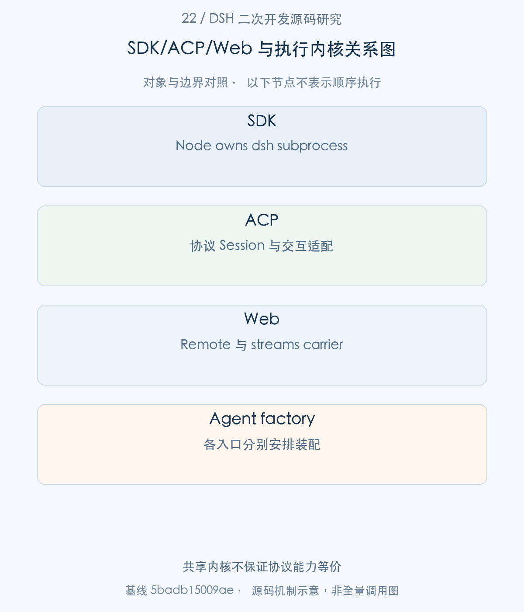
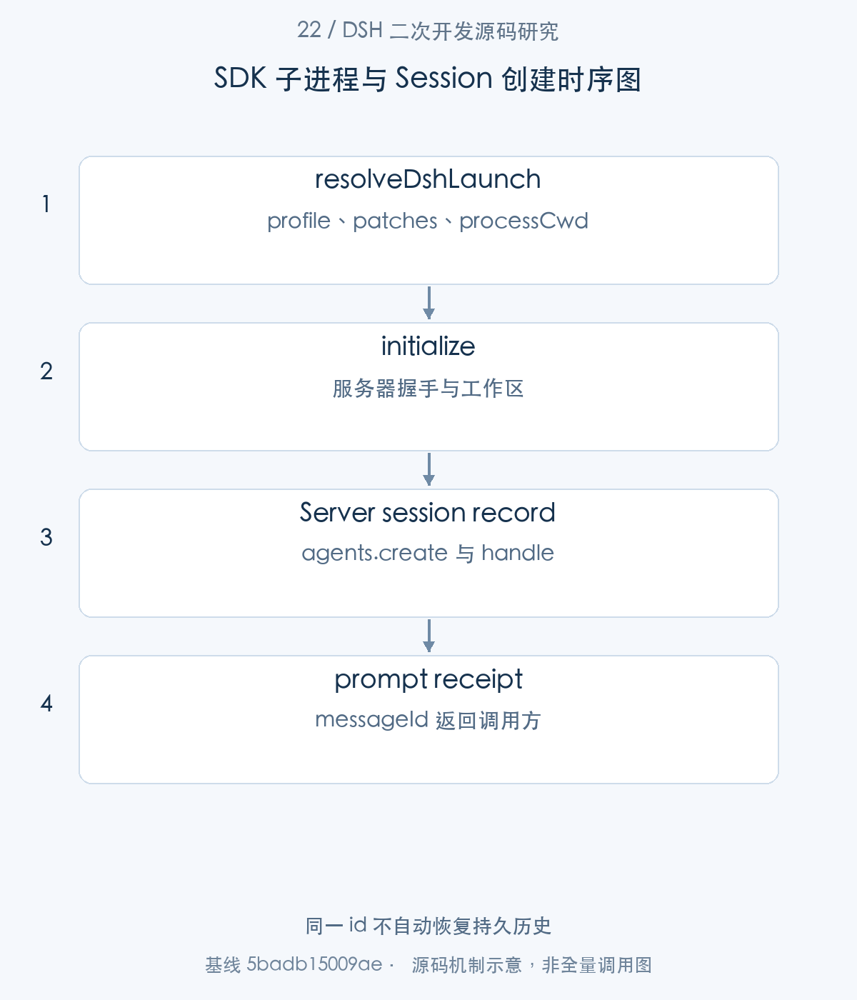
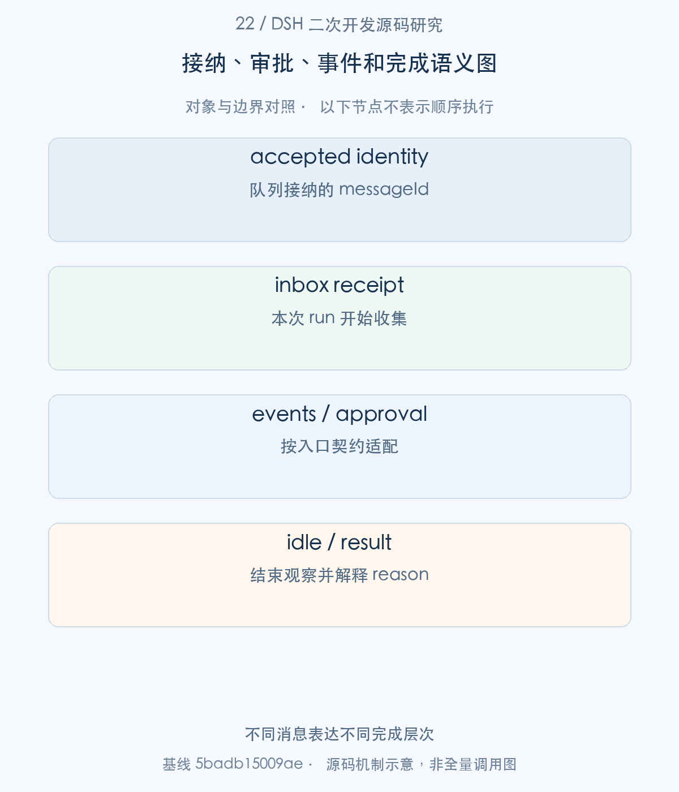
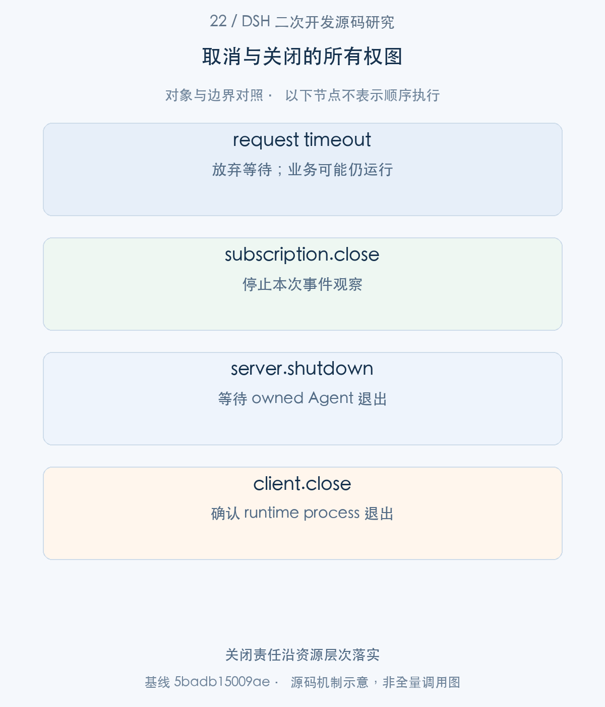

# 22｜让业务系统驱动 DSH：SDK、ACP 与 Web 的入口选择

业务系统驱动 DSH，需要选择入口，也需要明确任务与子进程的归属。本文沿 SDK 的 lazy subprocess、initialize、session/prompt 和事件结算展开，再将 ACP、Web 放到各自契约中比较。重点不是“协议已经连通”，而是输入何时接纳、任务何时结算、调用方离开时谁负责关闭。

> 源码基线：DSH `0.2.1-alpha.1`，提交 `5badb15009ae1756c3afe0ae0cef1faafc290ccc`。下文的源码摘录保持原文，仅移除公共缩进。企业新增设计与验证范围另行标明。

## 1. 整体地图：三种入口怎样接到执行内核

SDK 面向 Node 集成，拥有一个 dsh 子进程；ACP 面向兼容 Agent Client Protocol 的客户端，适配其 Session、审批和更新；Web 则通过 typed Remote 和 stream carrier 使用 Host 服务。这三者都能触达 Agent 内核，但公共内核不会让协议能力自动一一等价。

下文主线选择 SDK 的高层 DeepSeekHarness.run，先看启动参数，再追低层 RPC 和 Server Agent 创建，最后返回 high-level RunResult。恢复与审批必须依据各入口实际实现核验，不从功能名称推断。



图1。共享内核不保证协议能力等价 [SVG](assets/22-sdk-acp-web-integration-fig-1.svg)。

## 2. SDK 主线：配置 profile 并建立子进程通道

步骤1：HarnessClientOptions 进入 resolveDshLaunch，生成 process command、argv 与环境。

<!-- source:S01 -->
源码 [packages/sdk/client/src/launch.ts:127–157](https://github.com/deepseek-ai/deepseek-harness/blob/5badb15009ae1756c3afe0ae0cef1faafc290ccc/packages/sdk/client/src/launch.ts#L127-L157)。

```typescript
 */
export function resolveDshLaunch(
  options: HarnessClientOptions = {},
  callerCwd: string = process.cwd(),
): RuntimeProcessOptions {
  const profile = options.profile ?? 'sdk'
  const dshLaunch = options.dshBin === undefined
    ? installedDshNodeLaunch()
    : { nodeArgs: [resolve(callerCwd, options.dshBin)], patches: [], environment: {} }
  const patches = [
    ...dshLaunch.patches,
    ...(options.patches ?? []).map(path => resolve(callerCwd, path)),
  ]
  const dshHome = options.dshHome === undefined ? undefined : resolve(callerCwd, options.dshHome)
  return {
    command: process.execPath,
    args: [...dshLaunch.nodeArgs, '--profile', profile, ...patches.flatMap(path => ['--patch', path])],
    ...options.processCwd === undefined ? {} : { cwd: resolve(callerCwd, options.processCwd) },
    environment: () => ({
      ...(options.env ?? process.env),
      ...dshLaunch.environment,
      ...dshHome === undefined ? {} : { DSH_HOME: dshHome },
    }),
    description: `dsh profile ${JSON.stringify(profile)}`,
    initializeTimeoutMs: options.initializeTimeoutMs ?? DEFAULT_INITIALIZE_TIMEOUT_MS,
    ...options.requestTimeoutMs === undefined ? {} : { requestTimeoutMs: options.requestTimeoutMs },
    ...options.shutdownTimeoutMs === undefined ? {} : { shutdownTimeoutMs: options.shutdownTimeoutMs },
    ...options.disposeEofGraceMs === undefined ? {} : { disposeEofGraceMs: options.disposeEofGraceMs },
    ...options.disposeGraceMs === undefined ? {} : { disposeGraceMs: options.disposeGraceMs },
  }
}
```

profile 默认 sdk；内部 source compatibility patches 位于用户 patches 之前，路径按 callerCwd 解析。processCwd 与 wire cwd 作用不同，前者定位进程，后者成为业务工作区。安装包模式要求同版本 dsh executable；源码模式还有 tsx loader 和 source patch 前置。

步骤2：DeepSeekHarness 构造时将 cwd 转为绝对路径，并保存模型路由。

<!-- source:S02 -->
源码 [packages/sdk/client/src/api.ts:32–46](https://github.com/deepseek-ai/deepseek-harness/blob/5badb15009ae1756c3afe0ae0cef1faafc290ccc/packages/sdk/client/src/api.ts#L32-L46)。

```typescript

/** @param options - dsh launch configuration plus the session route, effort, and output cap. */
constructor(options?: DeepSeekHarnessOptions)
constructor(options: DeepSeekHarnessOptions = {}, clientFactory?: () => HarnessClient) {
  this.createClient = clientFactory ?? (() => new HarnessClient(options))
  this.clientInstance = this.createClient()
  // Absolute before the handshake: the child spawns relative to THIS
  // process's cwd, but the wire cwd is resolved again inside the child — a
  // relative value would double-resolve (e.g. `worker` → `worker/worker`).
  this.cwd = resolve(options.cwd ?? options.processCwd ?? process.cwd())
  this.provider = options.provider ?? 'deepseek-official'
  this.model = options.model ?? 'deepseek-v4-flash'
  this.reasoningEffort = options.reasoningEffort
  this.maxTokens = options.maxTokens
}
```

子进程可能在不同目录解释 cwd，绝对化防止 worker/worker 的二次相对解析。模型配置只是路由选择，并不证明相应 provider 凭据已经可用。



图2。同一 id 不自动恢复持久历史 [SVG](assets/22-sdk-acp-web-integration-fig-2.svg)。

## 3. Session 主线：创建、恢复与输入接纳

步骤3：第一次 run 触发 start，memoized initialize 握手失败时先关闭原 Client，确认清理后才换实例。

<!-- source:S03 -->
源码 [packages/sdk/client/src/api.ts:69–100](https://github.com/deepseek-ai/deepseek-harness/blob/5badb15009ae1756c3afe0ae0cef1faafc290ccc/packages/sdk/client/src/api.ts#L69-L100)。

```typescript
start(): Promise<void> {
  this.initialized ??= (async () => {
    try {
      this.clientInstance.start()
      await this.clientInstance.initialize({
        cwd: this.cwd,
        provider: this.provider,
        model: this.model,
        ...this.reasoningEffort === undefined ? {} : { reasoningEffort: this.reasoningEffort },
        ...this.maxTokens === undefined ? {} : { maxTokens: this.maxTokens },
      })
    } catch (error) {
      this.initialized = undefined
      try {
        await this.clientInstance.close()
      } catch (cleanupError: unknown) {
        throw new AggregateError(
          [error, cleanupError],
          'DeepSeek Harness initialization and cleanup failed',
        )
      }
      if (!this.closed) this.clientInstance = this.createClient()
      throw error
    }
  })()
  return this.initialized
}

/**
 * Open a session handle (no wire traffic; the runtime creates the session
 * on its first prompt).
 * @param sessionId - explicit id to reuse; omitted mints a fresh one.
```

cleanup 也失败会抛 AggregateError 并保留原 Client，避免旧进程仍存活时再起一个并行副本。成功的 handshake 表示服务器身份可读，不表示业务任务已提交。

步骤4：Server.getOrCreateSession 按 sessionId 复用已有 record，或者创建一个 live AgentHandle。

<!-- source:S04 -->
源码 [packages/sdk/server/src/server.ts:261–294](https://github.com/deepseek-ai/deepseek-harness/blob/5badb15009ae1756c3afe0ae0cef1faafc290ccc/packages/sdk/server/src/server.ts#L261-L294)。

```typescript
private async getOrCreateSession(sessionId: string): Promise<SessionRecord> {
  if (this.shuttingDown) throw new Error('SDK server is shutting down')
  const existing = this.sessions.get(sessionId)
  if (existing) return existing
  const pending = this.sessionCreations.get(sessionId)
  if (pending) return pending
  const creation = this.createSession(sessionId)
  this.sessionCreations.set(sessionId, creation)
  void creation.then(
    () => { this.sessionCreations.delete(sessionId) },
    () => { this.sessionCreations.delete(sessionId) },
  )
  return creation
}

private async createSession(sessionId: string): Promise<SessionRecord> {
  // No preset composition: this server's compositions keep the model-facing
  // rows in the host plane, so this agent reads them from the global layer. A
  // deployment that configures a roster has to join one here first
  // (@deepseek-ai/dsh-agent-preset-registry README, "Composing a child agent").
  const handle = await this.ctx.agents.create({
    sessionId: brandString<SessionId>(sessionId),
    meta: { cwd: this.cwd },
    agentOptions: {
      provider: this.provider,
      model: this.model,
      ...this.reasoningEffort === undefined ? {} : { reasoningEffort: this.reasoningEffort },
      ...this.maxTokens === undefined ? {} : { maxTokens: this.maxTokens },
    },
  })
  const rec: SessionRecord = { handle }
  this.sessions.set(sessionId, rec)
  return rec
}
```

此 SDK 路径直接 agents.create；其默认 bundle 将 model-facing rows 放在 Host global plane，没有在这里自动 mount preset。企业专属 preset 若要生效，需要修改明确的装配入口，不能只在 profile 中注册 roster 就期待每个 SDK Agent 自动加入。create/resume 也不是同一个操作：这里没有从相同 id 自动恢复磁盘历史。

步骤5：Server.prompt 接住 contentBlocks，确认 Agent 仍 live，转换可持久 prompt content 后再次检查，再 followup。

<!-- source:S05 -->
源码 [packages/sdk/server/src/server.ts:178–194](https://github.com/deepseek-ai/deepseek-harness/blob/5badb15009ae1756c3afe0ae0cef1faafc290ccc/packages/sdk/server/src/server.ts#L178-L194)。

```typescript
async prompt(params: SessionPromptParams): Promise<SessionPromptResult> {
  if (!this.initialized) throw new Error('SDK server is not initialized')
  const rec = await this.getOrCreateSession(params.sessionId)
  // An agent-loop-only reload disposes the loop's agents while this record
  // survives; a retained agent accepts followup() silently, so validate the
  // record against the live registry before delivery.
  this.assertLiveAgent(rec, params.sessionId)
  const content = await durablePromptContent(this.ctx, params.contentBlocks)
  // Attachment admission crosses an async boundary where shutdown or an
  // agent-loop reload may detach the retained handle.
  this.assertLiveAgent(rec, params.sessionId)
  const message = createUserMessage({
    content,
    source: { kind: 'user' },
  })
  rec.handle.agent.followup(message)
  return { messageId: message.id }
```

异步附件处理期间 AgentLoop 可能 reload，因此必须二次 assertLiveAgent。返回 messageId 表示队列接纳身份，不是 finalResponse；这与普通同步 REST 的完成结果有根本语义差异。

## 4. 任务推进：事件订阅、审批与完成观察

步骤6：Client.prompt 校验 session/prompt 的响应，把 messageId 交回 high-level run。

<!-- source:S06 -->
源码 [packages/sdk/client/src/client.ts:291–298](https://github.com/deepseek-ai/deepseek-harness/blob/5badb15009ae1756c3afe0ae0cef1faafc290ccc/packages/sdk/client/src/client.ts#L291-L298)。

```typescript
async prompt(sessionId: string, contentBlocks: SdkPromptContentBlock[]): Promise<string> {
  const params: SessionPromptParams = { sessionId, contentBlocks }
  const result = await this.request('session/prompt', { ...params })
  if (!isRecord(result) || typeof result.messageId !== 'string') {
    throw new SdkProtocolError(`session/prompt returned no message id: ${JSON.stringify(result)}`)
  }
  return result.messageId
}
```

低层接口要求响应确有字符串身份，否则抛 SdkProtocolError。它没有据此宣布模型完成，也没有隐式给 RPC请求超时赋予 Turn 取消语义。

步骤7：HarnessSession.run 先 subscribeSessionTree，再发送 prompt，避免遗漏早到事件。

<!-- source:S07 -->
源码 [packages/sdk/client/src/api.ts:176–214](https://github.com/deepseek-ai/deepseek-harness/blob/5badb15009ae1756c3afe0ae0cef1faafc290ccc/packages/sdk/client/src/api.ts#L176-L214)。

```typescript
async run(input: string | SdkPromptContentBlock[], options?: Pick<RunOptions, 'onNotification'>): Promise<RunResult> {
  await this.harness.start()
  const client = this.harness.client
  const contentBlocks = normalizeInput(input)
  const events: SessionEvent[] = []
  const notifications: HarnessNotification[] = []

  const subscription = client.subscribeSessionTree(this.id)
  const collect = (notification: HarnessNotification): void => {
    if (notification.method === 'session.event' && notification.params.sessionId === this.id) {
      // Wire boundary: the envelope feeds the typed RunResult, so a
      // malformed runtime surfaces as a protocol error, not as type-invalid
      // data (or a TypeError out of finalResponse).
      const event = validatedSessionEvent(notification.params.event)
      notifications.push(notification)
      options?.onNotification?.(notification)
      events.push(event)
      return
    }
    notifications.push(notification)
    options?.onNotification?.(notification)
  }
  try {
    const messageId = await client.prompt(this.id, contentBlocks)
    let received = false
    while (true) {
      const notification = await subscription.next()
      if (!received) {
        if (notification.method !== 'session.event'
          || notification.params.sessionId !== this.id
          || !isInboxReceipt(notification.params.event, messageId)) continue
        received = true
      }
      collect(notification)
      if (notification.method === 'session.status'
        && notification.params.sessionId === this.id
        && notification.params.status === 'idle') break
    }
  } finally {
```

订阅包含已发现的 child lineage，但主结果只将根 Session events 放入 events。received 必须等对应 messageId 的 inbox receipt；之后根 Session 达到 idle 才结算。这是 owned activity interval，不是简单遇到任意 idle 就返回，也不把所有 child 事件伪装成父 Session 历史。

步骤8：finally 关闭订阅，run 返回 events、notifications 与从历史提取的 finalResponse。

<!-- source:S08 -->
源码 [packages/sdk/client/src/api.ts:217–226](https://github.com/deepseek-ai/deepseek-harness/blob/5badb15009ae1756c3afe0ae0cef1faafc290ccc/packages/sdk/client/src/api.ts#L217-L226)。

```typescript

    return {
      sessionId: this.id,
      finalResponse: finalResponse(events),
      events,
      notifications,
    }
  }
}

```

finalResponse 是便利投影，业务判断还应消费 turn/end 的 reason 和工具结果。模型回答了“完成”并不能证明外部系统写入成功。高层 run 没有任意跨入口通用的审批回调；企业若需要人工交互，必须核对实际服务及协议的可用面。

假设worker提交任务P，随后等待超时。排查应先找P的messageId，再找该输入的inbox receipt，最后找它被接纳以后根Session的idle与终止事件。没有receipt时，无法证明本次输入已经进入执行区间；已有receipt但未结束时，应继续观察现有任务，而非立即创建同一业务写入的第二份任务。

high-level run先订阅后prompt，正是为了让这段判断可以覆盖早到事件。它收集根Session的历史，同时保留tree notifications，避免把child结果直接混入父历史。企业应用应另行关联自己的taskId与业务receipt，因为Session事件说明执行事实，外部系统的receipt才说明业务效果。

## 5. ACP 与 Web 支线：各自适配什么契约

步骤9：ACP newSession 使用协议生成 SessionId，经 AcpSession.create 进入公共 Agent factory。

<!-- source:S09 -->
源码 [packages/acp/acp/src/index.ts:196–220](https://github.com/deepseek-ai/deepseek-harness/blob/5badb15009ae1756c3afe0ae0cef1faafc290ccc/packages/acp/acp/src/index.ts#L196-L220)。

```typescript
async newSession(params: NewSessionRequest, signal: AbortSignal): Promise<NewSessionResponse> {
  assertOpen()
  validateWorkspaceParams(params)
  const sessionId = brandString<SessionId>(randomUUID())
  // No preset composition: the ACP bundle keeps the model-facing rows in
  // the host plane, so this agent reads them from the global layer. A
  // deployment that configures a roster has to join one here first
  // (@deepseek-ai/dsh-agent-preset-registry README, "Composing a child agent").
  let record: AcpSession
  try {
    record = await AcpSession.create(ctx, {
      sessionId,
      cwd: params.cwd,
      mcpServers: params.mcpServers,
      agentOptions: agentOptions(config),
      fallbackSelection: initialSelection(config),
      signal,
      notify,
    })
  } catch (error: unknown) {
    if (error instanceof AcpMcpConfigError) throw invalidParams(error.message)
    throw error
  }
  /* v8 ignore next 4 -- a real stdio close can race an in-flight create. */
  if (closed) {
```

cwd、mcpServers、signal、notify 由 ACP 请求/连接提供。此 bundle 同样说明未自动做 preset composition；它的 Session/load、prompt stopReason 和 approval adapter 则属于 ACP 自身契约。不能把 SDK 的 session(id) 无 wire handle 当成 ACP newSession 的同义方法。

ACP prompt 的另一个区别，是验证 Session 后交给 AcpSession.prompt，并等待对应 StopReason。

<!-- source:S10 -->
源码 [packages/acp/acp/src/index.ts:361–382](https://github.com/deepseek-ai/deepseek-harness/blob/5badb15009ae1756c3afe0ae0cef1faafc290ccc/packages/acp/acp/src/index.ts#L361-L382)。

```typescript
  async prompt(params: PromptRequest, requestSignal: AbortSignal): Promise<PromptResponse> {
    assertOpen()
    const record = requireSession(brandString<SessionId>(params.sessionId))
    return record.prompt(params, imagePromptEnabled, requestSignal)
  },

  cancel(params: CancelNotification): Promise<void> {
    sessions.get(brandString<SessionId>(params.sessionId))?.cancel()
    return Promise.resolve()
  },
}

/* v8 ignore next 4 -- production stdio wiring; tests inject config.stream. */
const stream: Stream = config.stream ?? ndJsonStream(
  Writable.toWeb(process.stdout) as WritableStream<Uint8Array>,
  Readable.toWeb(process.stdin) as ReadableStream<Uint8Array>,
)
const app = createAcpAgentApp({ name: 'deepseek-harness-acp' })
  .onRequest(methods.agent.initialize, ({ params }) => implementation.initialize(params))
  .onRequest(methods.agent.authenticate, async ({ params }) => {
    await implementation.authenticate(params)
    return {}
```

与 SDK 先返回 messageId 的低层 prompt 不同，ACP 使用其协议的 prompt 生命周期和 cancellation。Web typed Remote 则还会按 Context provider 解析 Agent/Session 参数。选择入口时应比较语义和依赖，而不是只比较 JSON 格式。

|入口|归属和完成观察|主要开发责任|
|---|---|---|
|SDK|Client 拥有子进程；run 等下次根 Agent idle|关闭 harness、解析事件结果、准备 profile|
|ACP|连接适配 Session 与 prompt stopReason|能力协商、审批、load/cancel 适配|
|Web|Host service + RemoteResult/streams|可信请求边界、状态模型、重连与订阅退出|



图3。不同消息表达不同完成层次 [SVG](assets/22-sdk-acp-web-integration-fig-3.svg)。

## 6. 取消与关闭：输入、Session、连接和进程

步骤10：低层 requestTimeout 只中止本地 transport pending 等待；源码明确本地超时不会发送服务端取消，工作可能继续直至自然结束或runtime关闭。

<!-- source:S11 -->
源码 [packages/sdk/client/src/client.ts:319–337](https://github.com/deepseek-ai/deepseek-harness/blob/5badb15009ae1756c3afe0ae0cef1faafc290ccc/packages/sdk/client/src/client.ts#L319-L337)。

```typescript
if (transport === undefined) throw new TransportClosedError('DeepSeek Harness runtime is not running')
const timeout = timeoutMs ?? this.runtime.requestTimeoutMs
try {
  if (timeout === undefined) return await transport.request(method, params ?? {})
  // The abort signal makes the timeout an abandonment: the transport drops
  // its pending entry, so repeated bounded requests against a hung method
  // retain no per-call state (the server-side work still runs to close).
  const abandon = new AbortController()
  const timer = setTimeout(() => {
    const stderr = this.stderrTail.length === 0 ? '' : `; stderr tail:\n${this.stderrTail.join('\n')}`
    abandon.abort(new RequestTimeoutError(`${method} timed out after ${timeout}ms waiting for ${this.runtime.description}${stderr}`))
  }, timeout)
  try {
    return await transport.request(method, params ?? {}, abandon.signal)
  } finally {
    clearTimeout(timer)
  }
} catch (error) {
  if (error instanceof JsonRpcResponseError || error instanceof RequestTimeoutError) throw error
```

这叫 abandonment，不能翻译成业务已取消。需要取消 Turn 时必须通过入口实际提供的 cancellation 机制，或关闭 owned runtime；外部效果仍应由业务系统确认。

步骤11：HarnessClient.close 先请求 shutdown，再执行 EOF/SIGTERM/SIGKILL 的 disposer ladder，并关闭 transport/subscriptions。

<!-- source:S12 -->
源码 [packages/sdk/client/src/client.ts:390–411](https://github.com/deepseek-ai/deepseek-harness/blob/5badb15009ae1756c3afe0ae0cef1faafc290ccc/packages/sdk/client/src/client.ts#L390-L411)。

```typescript
  this.closeTask ??= this.performClose()
  return this.closeTask
}

private async performClose(): Promise<void> {
  const child = this.child
  if (child === undefined) return
  try {
    await this.request('shutdown', undefined, this.runtime.shutdownTimeoutMs ?? 1_000)
  } catch (error) {
    // Diagnostic only: the dispose ladder below is the authoritative teardown
    // for a runtime that cannot answer shutdown anymore.
    this.appendStderr([`shutdown request failed: ${errorMessage(error)}`])
  }
  await disposeRuntimeProcess(child, {
    disposeEofGraceMs: this.runtime.disposeEofGraceMs ?? 6_000,
    disposeGraceMs: this.runtime.disposeGraceMs ?? 3_000,
  })
  this.transport?.close()
  this.failSubscriptions(this.closedError('DeepSeek Harness runtime closed'))
}

```

shutdown 请求失败只记诊断，真实进程退出由 disposeRuntimeProcess 确认。closeTask 保证幂等；高层 close 是终态，不会再次自动重启。连接、订阅、Session 与进程是分层资源，结束一个 notification iterator 不等于结束子进程。



图4。关闭责任沿资源层次落实 [SVG](assets/22-sdk-acp-web-integration-fig-4.svg)。

## 7. 开发示例与验证：同一任务的入口对比

以下教学集成使用公开高层 API，finally 明确拥有关闭责任。前置条件是已安装同版本 SDK/dsh，sdk profile 包含所需 provider，并配置可用模型凭据；本篇实际测试采用 fake-runtime 和协议 fixtures，不消耗真实模型服务。

同一业务任务若迁移到 ACP 或 Web，保留输入和预期结果即可，Session 创建、审批与完成等待要重新适配。对比验收应记录接纳身份、终止原因和业务 effect receipt，不能只比最终回复文本。

以下是企业新增教学示例；调用形态以本篇接口为依据，接入真实业务前仍需落实文中前置条件。

```typescript
import { DeepSeekHarness } from '@deepseek-ai/dsh-sdk-client'
const harness = new DeepSeekHarness({
  profile: 'sdk', cwd: process.cwd(),
  provider: 'deepseek-official', model: 'deepseek-v4-flash',
})
try {
  const result = await harness.run('读取本地任务材料，输出审核清单')
  console.log(result.sessionId, result.finalResponse)
  // 企业结果判断还需检查 result.events 中的 turn/end 与工具结果。
} finally {
  await harness.close()
}
```

可复核入口（`pnpm` 命令在 `.sources/deepseek-harness` 中运行，`node research/...` 命令在本研究仓库根目录运行；实际执行结果见[本批验证记录](../validation/supplementary-articles-validation.md)）：

```sh
pnpm exec vitest run packages/sdk/client/tests/sdk-client.spec.ts packages/sdk/client/tests/launch.spec.ts packages/sdk/client/tests/dispose.spec.ts packages/acp/acp/tests/approval.spec.ts
```

本篇使用现有源码测试说明契约，并不把 mock 的通过解释成真实模型、外部 server、浏览器或企业基础设施已经验收。
## 8. 工程心得：集成方式应跟随任务和资源归属

入口选型最值得反复确认的是资源归属。SDK 适合一个业务 worker 拥有一个 runtime；Web 适合长期 Host 服务被界面消费；ACP 适合协议客户端承担交互与审批。选对归属，关闭和异常恢复才不容易变成旁路逻辑。

第二个收获是分开接纳和结算。messageId、inbox receipt、idle 与 finalResponse 各自回答不同问题。企业任务可以沿这组事实建立状态机，让超时、断线和恢复观察不会误触发重复写入。

源码级集成研究还提醒我们：公共 Agent factory 是可以复用的内核边界，但 preset 装配、持久恢复和认证策略必须由入口明确提供，无法靠一个相同的 SessionId 自动获得。


[返回补充专题目录](README.md#补充专栏17—28) · [对应写作大纲](../appendices/supplementary-article-outlines.md)
