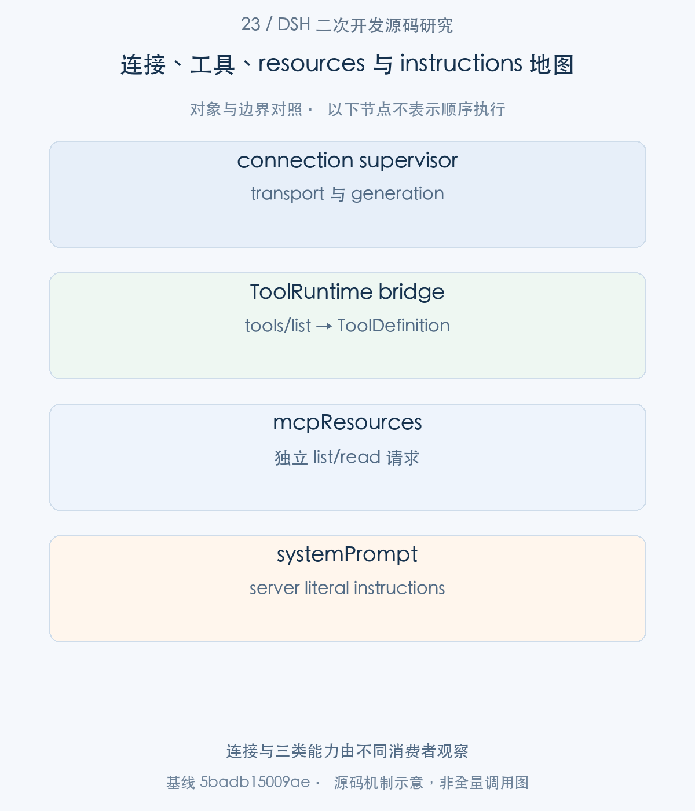
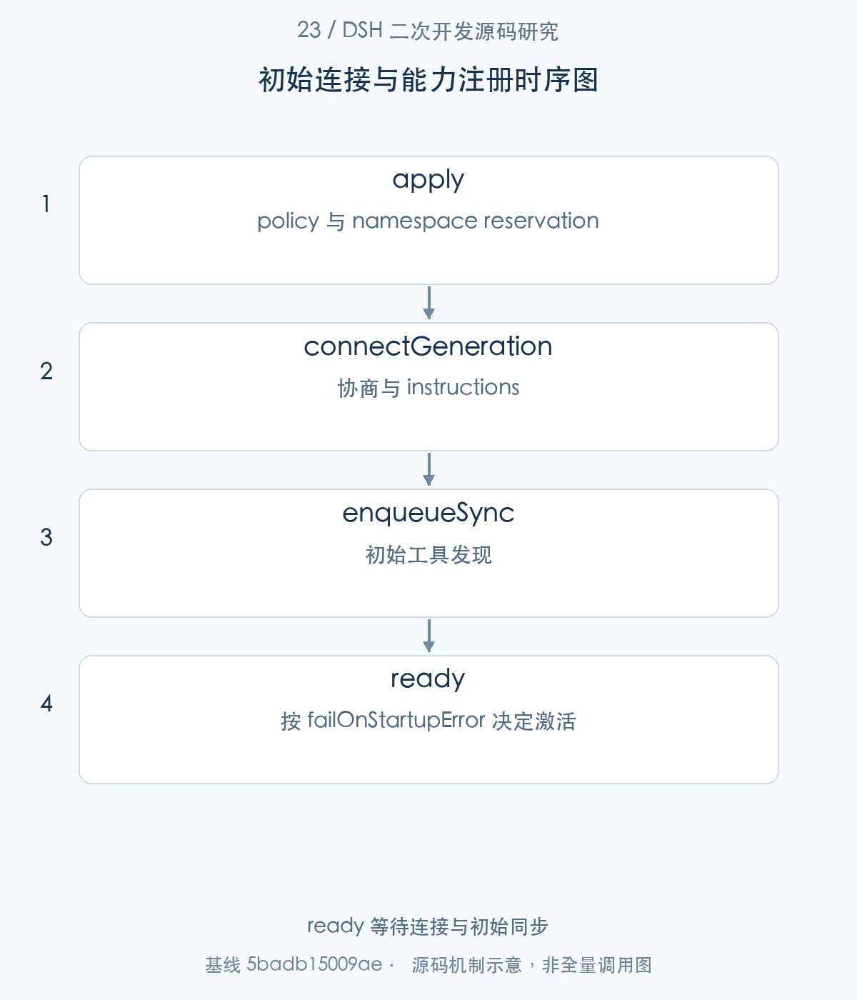
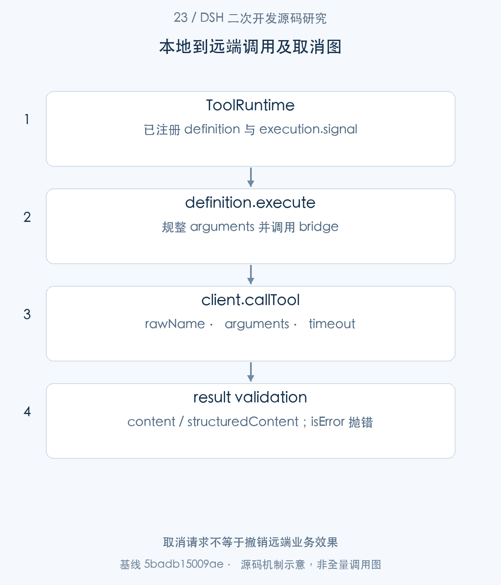
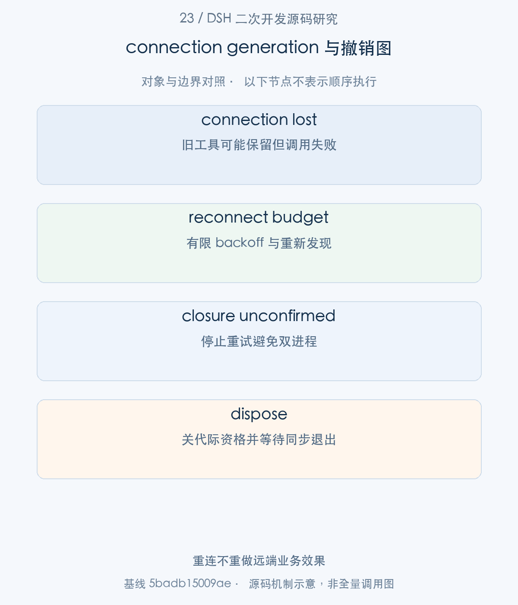

# 23｜一个 MCP server 怎样成为 Agent 能力：连接、发现与重连

MCP server 接入 DSH，要经过 transport、协议协商、工具发现、本地注册和生命周期监督。本文从 mcp-client.apply 追到 ToolRuntime，再把 resources 和 server instructions 的独立消费路径接上，重点解释 generation 如何阻止旧连接改写新状态，以及断线后的哪些事实仍需单独确认。

> 源码基线：DSH `0.2.1-alpha.1`，提交 `5badb15009ae1756c3afe0ae0cef1faafc290ccc`。下文的源码摘录保持原文，仅移除公共缩进。企业新增设计与验证范围另行标明。

## 1. 整体地图：连接不是能力加载的终点

企业 connector 常见的误判是“连接成功就可以执行”。连接成功只是第一段：server 可能尚未完成 tools/list，schema 可能不支持，本地 namespace 可能冲突。DSH 因此把初始发现纳入 readiness，并给后续变化安排串行同步。

本篇的 caller 是一个 mcp-client plugin instance，配置中的 serverName 提供本地稳定 namespace；远端 raw tool name 则只作为 wire identity。resources 和 instructions 不经过工具列表同一条返回路径，后文分别追踪。



图1。连接与三类能力由不同消费者观察 [SVG](assets/23-mcp-connection-lifecycle-fig-1.svg)。

## 2. 启动入口：stdio/HTTP transport 与 readiness

步骤1：apply 先解析 reconnect policy，再在当前 Scope/root 预留 serverName，最后启动 connection supervisor。

<!-- source:S01 -->
源码 [packages/mcp/mcp-client/src/index.ts:154–181](https://github.com/deepseek-ai/deepseek-harness/blob/5badb15009ae1756c3afe0ae0cef1faafc290ccc/packages/mcp/mcp-client/src/index.ts#L154-L181)。

```typescript
export async function apply(ctx: Context, config: Config): Promise<void> {
  // Fail loud at load: reconnect misconfiguration (including programmatic
  // construction that bypassed Schemastery) rejects THIS instance before any
  // effect registers.
  const reconnect = resolveReconnectPolicy(config.reconnect, `mcp-client(${config.serverName}): reconnect`)

  // Reserve the namespace next: a duplicate `serverName` fails THIS instance
  // at load with an actionable error and leaves the earlier instance intact.
  ctx.effect(() => {
    const owner = scopeOf(ctx) ?? ctx.root
    let names = activeServerNames.get(owner)
    if (!names) {
      names = new Set()
      activeServerNames.set(owner, names)
    }
    if (names.has(config.serverName)) {
      throw new Error(
        `mcp-client: serverName "${config.serverName}" is already in use by another mcp-client instance — pick a unique serverName in cordis.yml`,
      )
    }
    names.add(config.serverName)
    return () => void names.delete(config.serverName)
  }, 'mcp-client.serverName')

  // The supervisor owns the client/transport generations, the reconnect
  // loop, and the live tool registrations; disposal stops reconnection,
  // quiesces in-flight work, and unregisters the current generation.
  const connection = startConnection(ctx, config, reconnect)
```

重复名称拒绝当前实例，先前实例不受影响。scopeOf(ctx) 参与 reservation owner，因而不同 scoped composition 可以有独立来源。policy 配置错误在资源注册前失败，避免先建立连接才发现无法监督退出。

步骤2：connection.ready 决定初始插件激活；connection.dispose 同时挂到 effect 与 unfinished apply 的卸载观察。

<!-- source:S02 -->
源码 [packages/mcp/mcp-client/src/index.ts:181–203](https://github.com/deepseek-ai/deepseek-harness/blob/5badb15009ae1756c3afe0ae0cef1faafc290ccc/packages/mcp/mcp-client/src/index.ts#L181-L203)。

```typescript
  const connection = startConnection(ctx, config, reconnect)
  registerServerContext(ctx, config.serverName, connection)
  let stopping: Promise<void> | undefined
  const dispose = (): Promise<void> => stopping ??= connection.dispose()
  // Cordis announces unload before awaiting an unfinished apply(). Closing
  // the transport here releases startup requests that are still awaiting a reply.
  // oxlint-disable-next-line typescript/no-misused-promises -- Cordis contains observer failures; the effect also awaits this promise.
  ctx.on('internal/plugin', (fiber) => {
    if (fiber !== ctx.fiber || fiber.uid !== null) return
    return dispose()
  }, { global: true })
  ctx.effect(() => dispose, 'mcp-client.connection')

  // Block plugin activation on the initial connection + tool discovery so
  // Cordis consumers observe the tools immediately after the fiber activates.
  // When failOnStartupError is true, a failed initial attempt rejects the
  // fiber (Cordis rolls it back); otherwise the error is logged and the
  // supervisor enters its reconnect loop.
  const outcome = await connection.ready
  if (outcome.error !== undefined && config.failOnStartupError) {
    throw new Error(`mcp-client(${config.serverName}): initial connection or tool synchronization failed`, { cause: outcome.error })
  }
}
```

failOnStartupError=true 才将初始故障转成 Fiber 激活失败；否则记录错误并继续 supervisor 重连。这两个部署策略各有用途，页面需要区分“插件 active”与“server 已连接”。stopping Promise 让多个退出触发者等待同一 dispose。

步骤3：supervisor 使用 createTransport，根据 stdio 或 HTTP 配置构造 transport。

<!-- source:S03 -->
源码 [packages/mcp/mcp-client/src/transport.ts:31–46](https://github.com/deepseek-ai/deepseek-harness/blob/5badb15009ae1756c3afe0ae0cef1faafc290ccc/packages/mcp/mcp-client/src/transport.ts#L31-L46)。

```typescript
export function createTransport(config: Config): Transport {
  switch (config.transport) {
    case 'stdio':
      return new StdioClientTransport({
        command: config.command,
        args: config.args,
        env: buildChildEnv(config.env),
        cwd: config.cwd,
      })
    case 'streamable-http':
      return new StreamableHTTPClientTransport(
        new URL(config.url),
        { requestInit: { headers: config.headers } },
      )
  }
}
```

stdio 涉及受控环境中的子进程，HTTP 涉及 URL、headers 与网络连接；它们共享 MCP Client 协商，却不共享进程所有权。企业应分别配置命令允许范围和网络目的地策略，不能把 serverName 的合法性当作执行信任证明。



图2。ready 等待连接与初始同步 [SVG](assets/23-mcp-connection-lifecycle-fig-2.svg)。

## 3. 工具发现：远端定义到本地注册

步骤4：connectGeneration await connect 后检查是否已关闭或过期，再读取带 server attribution 的 instructions，最后 enqueueSync。

<!-- source:S04 -->
源码 [packages/mcp/mcp-client/src/connection.ts:306–324](https://github.com/deepseek-ai/deepseek-harness/blob/5badb15009ae1756c3afe0ae0cef1faafc290ccc/packages/mcp/mcp-client/src/connection.ts#L306-L324)。

```typescript
try {
  transport = createTransport(config)
  await generation.connect(transport)
  if (hasClosed()) {
    attemptSettled = true
    generationDown(generation)
    return
  }
  if (!isCurrent(generation)) {
    if (!await closeGeneration()) ctx.logger.error(incompleteDisposalMessage)
    return
  }
  const serverText = generation.getInstructions()?.trimEnd() ?? ''
  instructions = serverText ? `### MCP server: ${config.serverName}\n\n${serverText}` : ''
  if (Buffer.byteLength(instructions) > maxInstructionBytes) {
    throw new Error(`${label}: server instructions exceed maxInstructionBytes (${maxInstructionBytes})`)
  }
  await enqueueSync(generation, startup ? startupOpts : opts)
} catch (error) {
```

generation 必须仍是 current 才继续注册。instructions 有字节上限，超过上限使本次协商失败；这是输入约束，不代表提示词内容已经可信。startup 使用更严格的 registrationFailure 策略，后续同步则可 containment。

步骤5：远端工具名经 publicToolName 转换成本地模型可用名字。

<!-- source:S05 -->
源码 [packages/mcp/mcp-client/src/tools.ts:82–88](https://github.com/deepseek-ai/deepseek-harness/blob/5badb15009ae1756c3afe0ae0cef1faafc290ccc/packages/mcp/mcp-client/src/tools.ts#L82-L88)。

```typescript
  const joined = `mcp__${serverName}__${rawName}`
  const normalized = joined.replace(INVALID_NAME_CHARS, '_')
  if (normalized === joined && normalized.length <= MAX_PUBLIC_NAME_LENGTH) return normalized
  const hash = createHash('sha256').update(`${serverName}\0${rawName}`).digest('hex').slice(0, HASH_LENGTH)
  return `${normalized.slice(0, MAX_PUBLIC_NAME_LENGTH - HASH_LENGTH - 1)}_${hash}`
}

```

合法短名称保留 mcp__server__rawName；不合法字符或长度截断会附 identity hash。hash 减少有损规范化的碰撞风险，不是数学上无限唯一的证明。调用闭包一直保留 rawName，不通过解析 publicName 反推远端名称。

步骤6：syncTools 第一阶段刷新 tools/list，并把每个远端 definition 构造成本地 ToolDefinition。

<!-- source:S06 -->
源码 [packages/mcp/mcp-client/src/tools.ts:113–143](https://github.com/deepseek-ai/deepseek-harness/blob/5badb15009ae1756c3afe0ae0cef1faafc290ccc/packages/mcp/mcp-client/src/tools.ts#L113-L143)。

```typescript
export async function syncTools(
  client: Client,
  ctx: Context,
  opts: ToolBridgeOptions,
  previous: ToolDisposers,
): Promise<ToolDisposers> {
  // Phase 1: fetch and build the next generation without touching the registry.
  const definitions = new Map<string, ToolDefinition>()
  const response = client.getServerCapabilities()?.tools === undefined
    ? { tools: [] }
    : await client.listTools(undefined, { cacheMode: 'refresh' })
  for (const tool of response.tools) {
    const publicName = publicToolName(opts.serverName, tool.name)
    if (definitions.has(publicName)) {
      throw new Error(
        `mcp-client(${opts.serverName}): server listed tool "${tool.name}" more than once — invalid tool list`,
      )
    }
    definitions.set(publicName, createMcpToolDefinition(ctx, {
      name: publicName,
      rawName: tool.name,
      description: tool.description ?? '',
      inputSchema: tool.inputSchema,
      outputSchema: tool.outputSchema,
      taskRequired: tool.execution?.taskSupport === 'required',
      call: (args, execution) => client.callTool(
        { name: tool.name, arguments: args },
        { signal: execution.signal, timeout: opts.toolCallTimeoutMs, toolDefinition: tool },
      ),
    }))
  }
```

重复 publicName 拒绝整代候选，previous registrations 尚未变。参数 schema、output schema、taskSupport 和 per-call timeout 一起进入 bridge；taskRequired 不代表此 bridge 已支持 task execution。

步骤7：候选全量准备后，syncTools 才 dispose previous 并逐项 register。

<!-- source:S07 -->
源码 [packages/mcp/mcp-client/src/tools.ts:145–162](https://github.com/deepseek-ai/deepseek-harness/blob/5badb15009ae1756c3afe0ae0cef1faafc290ccc/packages/mcp/mcp-client/src/tools.ts#L145-L162)。

```typescript
  // Phase 2: swap generations.
  for (const dispose of previous.values()) dispose()
  const disposers: ToolDisposers = new Map()
  try {
    for (const [publicName, definition] of definitions) {
      disposers.set(publicName, ctx.tools.register(definition))
    }
  } catch (error) {
    // A conflict on an `mcp__<serverName>__`-qualified name means a foreign
    // registration occupies this server's namespace. Roll back so the model
    // sees either the full generation or none of it — never a partial set.
    for (const dispose of disposers.values()) dispose()
    ctx.logger.error(`mcp-client(${opts.serverName}): tool registration failed, no tools registered: ${String(error)}`)
    if (opts.registrationFailure === 'throw') throw error
    return new Map()
  }
  return disposers
}
```

注册冲突会撤销本次部分成功的工具，结果为完整一代或没有该 server 工具；它不恢复已撤销旧代。fetch/build 失败保留旧代，swap 失败归零，这两个恢复边界必须分开。

步骤8：enqueueSync 使用一条跨 generation 的 syncChain，避免两次 list_changed 回调交叉 swap。

<!-- source:S08 -->
源码 [packages/mcp/mcp-client/src/connection.ts:169–187](https://github.com/deepseek-ai/deepseek-harness/blob/5badb15009ae1756c3afe0ae0cef1faafc290ccc/packages/mcp/mcp-client/src/connection.ts#L169-L187)。

```typescript
function enqueueSync(generation: Client, syncOpts: ToolBridgeOptions = opts): Promise<void> {
  const run = syncChain.then(async () => {
    if (!isCurrent(generation)) return
    disposers = await syncTools(generation, ctx, syncOpts, disposers)
  })
  // The chain tail must survive a failed sync; the enqueuing caller owns reporting.
  syncChain = run.catch(() => {})
  return run
}

/** One disconnect decision per generation: the isCurrent guard makes racing close/error signals idempotent. */
function generationDown(generation: Client): void {
  if (!isCurrent(generation)) return
  client = undefined
  closeClient = undefined
  scheduleReconnect()
}

/** Decide retry ownership after a failed connection's close barrier settles. */
```

每次 run 先 isCurrent 检查。chain tail 吞掉前次 rejection 只为允许后续同步，真正的 enqueuing caller 仍负责报告错误。generationDown 清空 client owner 再安排重连，旧回调失去 current 资格，不会覆盖新连接状态。

换代机制中的状态不能压缩成一个`connected`：

|状态或对象|作用|仍需检查|
|---|---|---|
|current generation|确定哪条连接能够发布当前状态|异步结果返回时仍是current|
|候选definitions|本次list与schema构建的完整集合|名称冲突、task支持与本地注册条件|
|disposers|已发布工具集合的撤销责任|swap之后是否形成完整集合|
|syncChain|串行安排发现、替换与最终撤销|队列里的工作是否仍拥有发布资格|

例如，连接G1断开后G2开始重连，G1迟到的`tools/list`不能因为结果内容看起来正确就覆盖G2。current检查限制发布资格，syncChain限制发布次序，两者一起处理这类竞态。它们不需要让所有旧Promise瞬间消失，却要求旧工作不能改写当前能力目录。

## 4. 工具调用：本地 ToolRuntime 到远端请求

前面的连接监督和完整注册共同建立了可被Agent发现的ToolDefinition。下面从它的执行闭包进入一次真实协议请求；这才是模型工具调用与远端业务交接的位置。

步骤9：ToolRuntime 调用本地 definition 后，闭包将 args 与 execution.signal 传到 client.callTool。

<!-- source:S09 -->
源码 [packages/mcp/mcp-client/src/tools.ts:136–142](https://github.com/deepseek-ai/deepseek-harness/blob/5badb15009ae1756c3afe0ae0cef1faafc290ccc/packages/mcp/mcp-client/src/tools.ts#L136-L142)。

```typescript
  outputSchema: tool.outputSchema,
  taskRequired: tool.execution?.taskSupport === 'required',
  call: (args, execution) => client.callTool(
    { name: tool.name, arguments: args },
    { signal: execution.signal, timeout: opts.toolCallTimeoutMs, toolDefinition: tool },
  ),
}))
```

signal 和 timeout 控制当前请求，raw tool name 才发到 tools/call。MCP 协议取消只能表达中止请求，不能确认远端数据库没有提交；写操作要额外使用业务 idempotency key 或状态查询。

步骤10：createMcpToolDefinition 的 execute 校验 MCP response，将协议 isError 转换为本地工具错误。

<!-- source:S10 -->
源码 [packages/mcp/mcp-client/src/tools.ts:278–303](https://github.com/deepseek-ai/deepseek-harness/blob/5badb15009ae1756c3afe0ae0cef1faafc290ccc/packages/mcp/mcp-client/src/tools.ts#L278-L303)。

```typescript
return async (args: unknown, exec: ToolExecution) => {
  if (taskRequired) {
    throw new Error(`Tool "${rawName}" requires task-based execution, which this bridge does not support`)
  }
  // The agent loop passes `JSON.parse(model_arguments)` which is usually an
  // object, but can be any JSON value if the model misbehaves (outputs a bare
  // string/number/null). Fallback to {} lets the MCP server produce a
  // specific "missing required param" error the model can learn from.
  const argsObj = (typeof args === 'object' && args !== null ? args : {}) as Record<string, unknown>
  const parsed = specTypeSchemas.CallToolResult['~standard'].validate(await options.call(argsObj, exec))
  if (parsed.issues !== undefined) {
    throw new Error(`Tool "${rawName}" returned an invalid MCP result: ${parsed.issues.map(issue => issue.message).join('; ')}`)
  }
  const result = parsed.value

  const content = result.content as unknown as JsonValue[]
  const text = extractText(content, rawName)

  // MCP isError → throw so ToolRuntime produces an isError result for the model.
  if (result.isError === true) {
    throw new Error(text)
  }

  const value: McpResult = {
    content,
    ...result.structuredContent !== undefined
```

不支持 task-required 工具时立即拒绝；非 object 输入交给 server 得到明确参数错误。content 保留 MCP blocks，structuredContent 单独保留，图片还涉及 attachment admission 与持久引用，不应该简单 JSON.stringify 后丢掉语义。




图3。取消请求不等于撤销远端业务效果 [SVG](assets/23-mcp-connection-lifecycle-fig-3.svg)。

## 5. 资源与指令：独立消费者与作用域

工具请求返回后，还需要解释其余两类MCP能力。resources和instructions复用当前连接的观察与Scope，但由不同服务消费，不是tools/call返回值的附带注册。

步骤11：连接上下文使用两个独立服务贡献 resources 与 systemPrompt section。

<!-- source:S11 -->
源码 [packages/mcp/mcp-client/src/server-context.ts:28–40](https://github.com/deepseek-ai/deepseek-harness/blob/5badb15009ae1756c3afe0ae0cef1faafc290ccc/packages/mcp/mcp-client/src/server-context.ts#L28-L40)。

```typescript
export function registerServerContext(ctx: Context, server: string, connection: ServerContext): void {
  ctx.inject(['mcpResources'], (inner) => {
    inner.mcpResources.register(server, connection.resources)
  })
  ctx.inject(['systemPrompt'], (inner) => {
    inner.systemPrompt.section({
      name: `mcp:${server}`,
      order: inner.systemPrompt.getSectionOrder('MCP_SERVERS'),
      interpolate: false,
      text: () => connection.instructions(),
    })
  })
}
```

resources 由 mcpResources registry 分派；instructions 被设置 interpolate=false，保持 server literal text。两者依赖注入的生效与退出跟随 Context，而不是一次 tools/list 返回值。

resources consumer 最终通过 connection.resources.request 找到当前 client，并携带 ToolExecution signal。

<!-- source:S12 -->
源码 [packages/mcp/mcp-client/src/connection.ts:366–384](https://github.com/deepseek-ai/deepseek-harness/blob/5badb15009ae1756c3afe0ae0cef1faafc290ccc/packages/mcp/mcp-client/src/connection.ts#L366-L384)。

```typescript
resources: {
  async request(request, exec): Promise<JsonValue> {
    const generation = client
    if (!generation || connectedAt === undefined) throw new Error(`${label}: server is disconnected`)
    const options = { signal: exec.signal, timeout: config.toolCallTimeoutMs }
    switch (request.method) {
      case 'resources/list':
        return await generation.listResources(
          request.cursor === undefined ? undefined : { cursor: request.cursor }, options,
        ) as JsonValue
      case 'resources/templates/list':
        return await generation.listResourceTemplates(
          request.cursor === undefined ? undefined : { cursor: request.cursor }, options,
        ) as JsonValue
      case 'resources/read':
        return await generation.readResource({ uri: request.uri }, options) as JsonValue
      /* v8 ignore next 2 -- resource requests are the closed, typed tool operation union */
      default:
        return assertNever(request)
```

list、templates/list、read 对应不同 wire method。server 暂时不可用时不能从旧工具 registration 推出 resources 请求仍可用；消费者应观察调用结果。


## 6. 运行变化：重连、重新发现与 dispose

步骤12：断线后 scheduleReconnect 按稳定窗口和预算决定重试，不是一个无限循环。

<!-- source:S13 -->
源码 [packages/mcp/mcp-client/src/connection.ts:211–244](https://github.com/deepseek-ai/deepseek-harness/blob/5badb15009ae1756c3afe0ae0cef1faafc290ccc/packages/mcp/mcp-client/src/connection.ts#L211-L244)。

```typescript
function scheduleReconnect(): void {
  const lostEstablishedConnection = connectedAt !== undefined
  if (!policy.enabled) {
    const message = lostEstablishedConnection
      ? 'connection lost and reconnect is disabled — registered tools will fail until an HMR reload or Host restart'
      : 'connection failed and reconnect is disabled — no tools were registered; reload the plugin or restart the Host to connect'
    ctx.logger.error(`${label}: ${message}`)
    return
  }
  // A connection that stayed up past the stability window (= maxDelayMs, the
  // longest backoff spacing) ended the previous outage: start a fresh budget.
  if (connectedAt !== undefined && Date.now() - connectedAt >= policy.maxDelayMs) failedAttempts = 0
  connectedAt = undefined
  failedAttempts += 1
  if (failedAttempts > policy.maxAttempts) {
    // Enqueue the give-up disposal so it cannot race an in-flight sync's
    // phase-2 swap (which checks isCurrent inside the queue).
    syncChain = syncChain.then(() => {
      for (const dispose of disposers.values()) dispose()
      disposers = new Map()
      serverInstructions = ''
    })
    ctx.logger.error(`${label}: giving up after ${policy.maxAttempts} consecutive failed reconnect attempts — tools unregistered; reload the plugin or restart the Host to reconnect`)
    return
  }
  const delayMs = Math.min(policy.maxDelayMs, policy.initialDelayMs * 2 ** (failedAttempts - 1))
  const action = lostEstablishedConnection ? 'connection lost; reconnecting' : 'connection failed; retrying'
  ctx.logger.warn(`${label}: ${action} in ${delayMs}ms (attempt ${failedAttempts}/${policy.maxAttempts})`)
  reconnectTimer = setTimeout(() => {
    reconnectTimer = undefined
    settling = connectGeneration(false)
  }, delayMs)
  // An armed reconnect timer must never hold the process open on its own.
  reconnectTimer.unref()
```

禁用重连时，已注册工具可保留但调用失败；预算耗尽时队列撤销工具并清空 instructions。重连前若无法确认上一 transport 已退出，则停止重连，避免 overlapping server processes。成功重连重新发现工具，不会重做已完成的业务调用。

步骤13：dispose 标记结束、清 timer、关闭 current generation，等待 settling 和 syncChain，最后撤销工具。

<!-- source:S14 -->
源码 [packages/mcp/mcp-client/src/connection.ts:388–409](https://github.com/deepseek-ai/deepseek-harness/blob/5badb15009ae1756c3afe0ae0cef1faafc290ccc/packages/mcp/mcp-client/src/connection.ts#L388-L409)。

```typescript
    async dispose(): Promise<void> {
      disposed = true
      serverInstructions = ''
      if (reconnectTimer !== undefined) {
        clearTimeout(reconnectTimer)
        reconnectTimer = undefined
      }
      const close = closeClient
      client = undefined
      closeClient = undefined
      if (close !== undefined && !await close()) {
        ctx.logger.error(incompleteDisposalMessage)
      }
      // Quiesce, don't just request it: the in-flight attempt enqueues its
      // sync before settling, so awaiting both leaves `disposers` final.
      await settling
      await syncChain
      for (const dispose of disposers.values()) dispose()
      disposers = new Map()
    },
  }
}
```

先夺走 current 资格，再 await 关闭，避免退出期间 callback 继续换代。退出无法确认 transport closure 会明确报告；不能把 close 请求已经发送解释成远端进程已退出。



图4。重连不重做远端业务效果 [SVG](assets/23-mcp-connection-lifecycle-fig-4.svg)。

## 7. 开发示例与验证：受控 server 的完整生命周期

建议从本篇的 reconnect、negotiation-lifecycle 和 tool-definition fixtures 开始：固定 serverName，记录同一次发现的完整集合，断开后改变远端 schema，重连再读本地 definition；另测注册冲突、取消与未结束的初始协商。

这些是协议及连接契约验证。本篇没有把真实企业 MCP server 上的写入回滚作为已验证事实；同一个 connector 的读取与写入必须分别安排 effect receipt、权限和幂等测试。

可复核入口（`pnpm` 命令在 `.sources/deepseek-harness` 中运行，`node research/...` 命令在本研究仓库根目录运行；实际执行结果见[本批验证记录](../validation/supplementary-articles-validation.md)）：

```sh
pnpm exec vitest run packages/mcp/mcp-client/tests/reconnect.spec.ts packages/mcp/mcp-client/tests/negotiation-lifecycle.spec.ts packages/mcp/mcp-client/tests/tool-definition.spec.ts packages/mcp/mcp-client/tests/server-context.spec.ts
```

本篇使用现有源码测试说明契约，并不把 mock 的通过解释成真实模型、外部 server、浏览器或企业基础设施已经验收。
## 8. 工程心得：连接状态、能力状态与业务效果分别确认

MCP 这一层最值得借鉴的是 generation ownership：不是所有旧 Promise 都需要立刻结束，但它们必须失去修改当前世界的资格。current guard、串行 swap 和退出等待把这一原则落实到了实际函数。

第二个收获是 readiness 应包含真正的能力发现。只报告 TCP/HTTP 连接成功不足以让上层开始任务，先完成初始工具同步才能建立“能力已经可消费”的事实。

企业 connector 在此基础上再补业务效果确认即可形成更完整闭环：连接可观察、能力有来源、请求可取消、结果可验证。把这几段保留为独立状态，比一个简单 connected 布尔值更利于故障排查。


[返回补充专题目录](README.md#补充专栏17—28) · [对应写作大纲](../appendices/supplementary-article-outlines.md)
