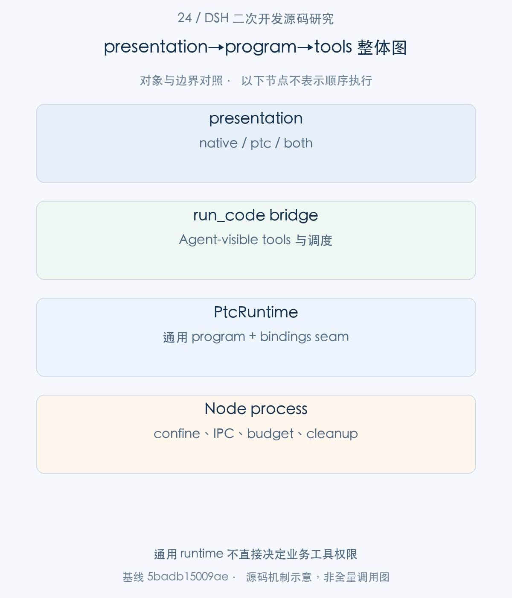
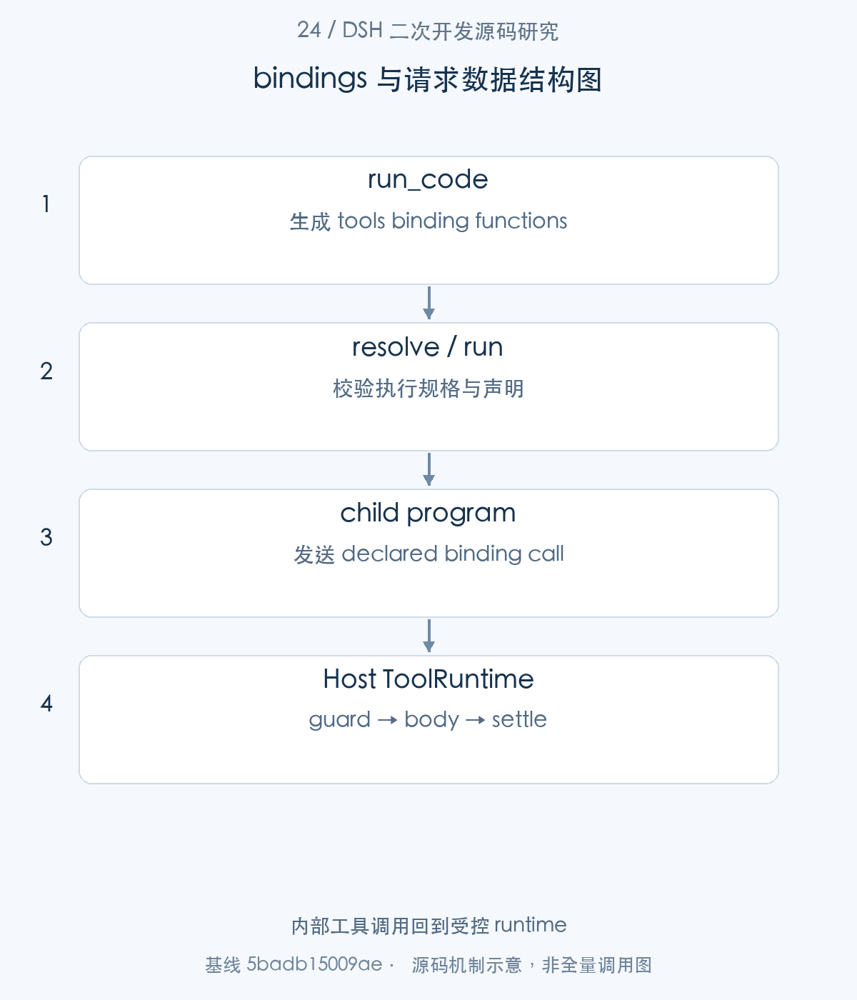
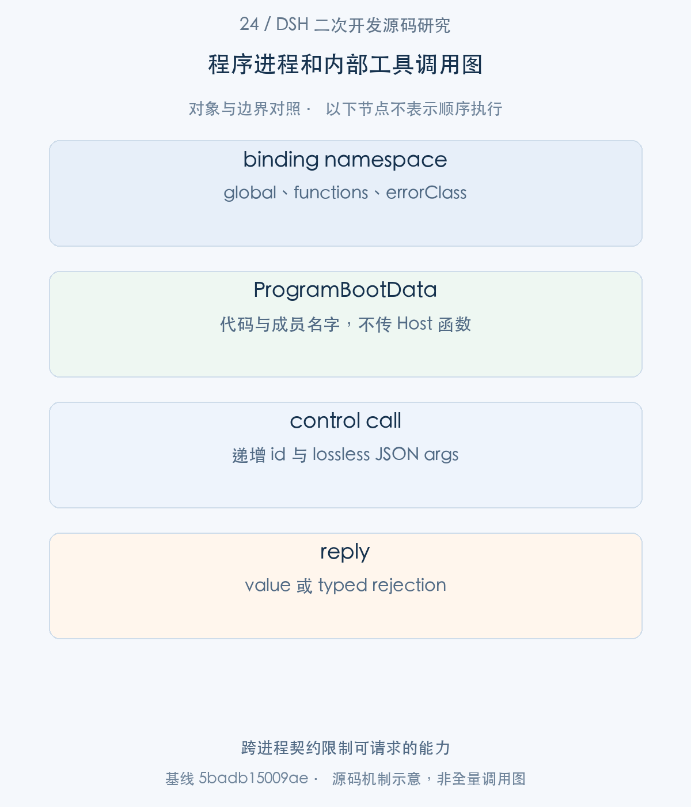
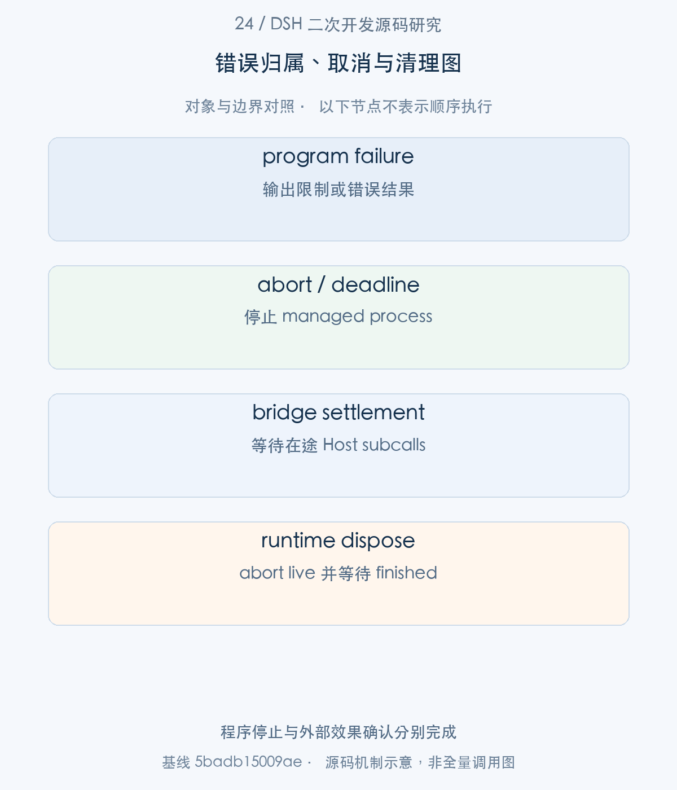

# 24｜模型程序如何受控执行：PTC、bindings 与内部工具调用

PTC 让模型编写程序，在程序中调用可见工具；它没有把模型代码直接放到 Host 执行。本文从 Agent tool presentation 进入 run_code bridge，再追 PtcRuntime.resolve/run、managed Node process 与 binding request，重点解释哪些权限仍由 ToolRuntime 判断，以及程序结束时在途工具怎样结算。

> 源码基线：DSH `0.2.1-alpha.1`，提交 `5badb15009ae1756c3afe0ae0cef1faafc290ccc`。下文的源码摘录保持原文，仅移除公共缩进。企业新增设计与验证范围另行标明。

## 1. 整体地图：从工具列表到程序式调用

企业多步骤任务适合用程序表达数据依赖，例如先查询多个资料、在本地汇总、再调用受控提交工具。PTC 减少多次模型交互，但相应增加了程序资源限制、IPC 和内部工具调度的责任。DSH 将通用执行 substrate 与 Agent 专用 tool bridge 分离，二次开发时必须看清这两层。

主线是：preset 的 presentAs 选择模型接口；ToolRuntime 提供 run_code；bridge 生成 tools bindings；runtime 启动新进程；子程序请求通过 Host 回到受控工具执行。



图1。通用 runtime 不直接决定业务工具权限 [SVG](assets/24-ptc-program-execution-fig-1.svg)。

## 2. 绑定阶段：可见工具怎样形成 SDK/bindings

步骤1：Agent composition 的 apply 选择 native/ptc/both，并按需等待 ptcRuntime。

<!-- source:S01 -->
源码 [packages/core/agent-tool-presentation/src/index.ts:61–72](https://github.com/deepseek-ai/deepseek-harness/blob/5badb15009ae1756c3afe0ae0cef1faafc290ccc/packages/core/agent-tool-presentation/src/index.ts#L61-L72)。

```typescript
  // context and hands back that exact disposer — so the declaration unwinds
  // with this row without a second wrapper owning it.
  if (config.mode === 'native') {
    ctx.tools.presentAs('native')
    return
  }
  // The wait is the loud failure: an entry still pending on `ptcRuntime` is
  // what `dsh-agent-preset-registry` reports as an unusable row, naming this id.
  ctx.inject(['ptcRuntime'], (runtimeCtx: Context) => {
    runtimeCtx.tools.presentAs(config.mode)
  })
}
```

native 不要求 PTC provider；ptc/both 缺 runtime 时 composition 保持不可用，preset activation audit 可以看到这个缺口。presentation 属于 scoped 声明，ToolRuntime 仍是共享 Host 服务；一个进程可同时有 native 和 PTC Agent。

步骤2：在 bridge 生成请求之前，先解释通用执行输入。

<!-- source:S02 -->
源码 [packages/ptc-runtime/ptc-runtime/src/types.ts:46–99](https://github.com/deepseek-ai/deepseek-harness/blob/5badb15009ae1756c3afe0ae0cef1faafc290ccc/packages/ptc-runtime/ptc-runtime/src/types.ts#L46-L99)。

```typescript
 * program as one global object (e.g. `tools`). Function names are arbitrary
 * strings — a runtime must treat names like `__proto__` or `constructor` as
 * ordinary own properties (null-prototype construction), never as prototype
 * collisions.
 */
export interface PtcBindingNamespace {
  /**
   * The global identifier the program sees. Must match the LANGUAGE-PORTABLE
   * identifier subset `[A-Za-z_][A-Za-z0-9_]*` and no language's reserved
   * words, so the same namespace list works against every backend regardless
   * of `language` — a JS-only spelling like `$tools` is rejected by design,
   * not just by the Python backend. Names that satisfy the identifier rule but
   * name a backend-owned slot (`RESERVED_BINDING_GLOBALS`, e.g. `console`,
   * `__dsh_main__`) are also refused everywhere; see its declaration for the
   * exact set and why each entry is reserved.
   */
  global: string
  /** The callable members, keyed by the exact name the program calls. */
  functions: Record<string, PtcBindingFunction>
  /** Optional program-visible typed rejection contract for this namespace. */
  errorClass?: PtcBindingErrorClass
}

/**
 * Caller inputs for one program. The provider's resolve method validates supported
 * options and supplies directory, deadline, and authority before execution.
 */
export interface PtcRunRequest {
  /**
   * The program source, in the runtime's {@link ../index.ts | language}. It
   * runs as the body of an async function: top-level `await` and `return`
   * are available, and the completion value becomes
   * {@link PtcRunResult.value}.
   */
  program: string
  /** Host functions exposed to the program, one global object per namespace. */
  bindings: PtcBindingNamespace[]
  /** Working directory in the mounted filesystem and subprocess execution world. */
  cwd?: string
  /**
   * Elapsed execution budget in milliseconds. Omission uses provider defaults;
   * null requests no deadline. Providers validate and cap numeric budgets or reject unsupported choices.
   */
  timeoutMs?: number | null
  /** Resolved authority for this execution. Providers without confinement reject an explicit policy. */
  sandboxPolicy?: SandboxExecutionPolicy
  /**
   * Abort the run: the runtime stops the program (hard, even mid-loop) and
   * resolves with a {@link PtcRunFailure} of kind `'abort'`. In-flight
   * binding calls are the CALLER's to settle — the runtime only stops asking.
   */
  signal?: AbortSignal
}

```

PtcRunRequest 包含 program、bindings、cwd、timeoutMs、sandboxPolicy、signal；bindings 是 Host 函数而非任意程序传入的 JS function。Namespace 使用 portable identifier，member 名可以是任意 own property，因此实现必须防 prototype 污染。signal 停止程序后，Host binding 的收敛仍由 caller 管理。

步骤3：PtcRuntime service 明确 language、isolation、resolve 与 run 的职责。

<!-- source:S03 -->
源码 [packages/ptc-runtime/ptc-runtime/src/index.ts:106–143](https://github.com/deepseek-ai/deepseek-harness/blob/5badb15009ae1756c3afe0ae0cef1faafc290ccc/packages/ptc-runtime/ptc-runtime/src/index.ts#L106-L143)。

```typescript
 * The source language {@link run} expects `program` to be written in, as a
 * lowercase identifier. Informational, not gating — a consumer that
 * generates language-specific presentation (typed SDK stubs, usage
 * instructions) switches on it and fails loud on a language it cannot
 * present. Well-known values: `'typescript'` and `'python'`, those
 * `dsh-tools` presents; the TypeScript backend is released, the Python
 * backend is experimental and private (not published).
 */
abstract readonly language: string

/**
 * The execution substrate, as a lowercase identifier. Informational, not
 * gating — a descriptor so deployments and diagnostics can tell backends
 * apart, not a security claim. Well-known values: `'worker-thread'`,
 * `'process'`, `'container'`.
 */
abstract readonly isolation: string

/** Provider-owned program usage guidance for consumers to present alongside the source language. */
get executionInstructions(): string { return '' }

/** Deployment file-policy mode, or undefined for a provider without confinement support. */
get sandboxMode(): SandboxMode | undefined { return undefined }

/** Configured numeric elapsed-time defaults and cap, or undefined when per-call overrides are unsupported. */
get timeout(): { defaultMs: number; maxMs: number } | undefined { return undefined }

constructor(ctx: Context) {
  super(ctx, 'ptcRuntime')
}

/**
 * Resolve supported options and provider defaults before execution.
 * @param request - Program, bindings, cancellation and optional execution choices.
 * @returns Complete directory, deadline and supported authority for run.
 * @throws When an explicit choice is invalid or unsupported by this provider.
 */
abstract resolve(request: PtcRunRequest): PtcRunSpec
```

runtime 不知道 Agent/Session，也不负责选择哪些业务工具可见。resolve 形成有效执行规格；run 返回 program/budget/abort/substrate 结果，契约误用才 reject。isolation 的字符串是 substrate 描述，不能独立作为安全保证。



图2。内部工具调用回到受控 runtime [SVG](assets/24-ptc-program-execution-fig-2.svg)。

## 3. 请求阶段：run_code 怎样交给 PTC runtime

步骤4：run_code 为调用开始时 agent-visible schemas 建立 functions，再将其作为 tools namespace 交给 runtime。

<!-- source:S04 -->
源码 [packages/core/tools/src/ptc.ts:681–709](https://github.com/deepseek-ai/deepseek-harness/blob/5badb15009ae1756c3afe0ae0cef1faafc290ccc/packages/core/tools/src/ptc.ts#L681-L709)。

```typescript
// build: a registered tool named `__proto__` must become an ordinary
// own key (a plain-object assignment would hit the prototype setter,
// silently dropping the binding), and the runtime host resolves
// binding names as own properties only.
const functions: Record<string, PtcBindingFunction> = Object.create(null) as Record<string, PtcBindingFunction>
// Enumerate the CALLING AGENT's visible set (scoped tools join,
// restricted globals vanish) — the same view the SDK section declared,
// so a program can bind exactly what its prompt promised; sub-dispatch
// re-resolves per call through the same view (exec.agent threads down).
for (const schema of registry.schemas(exec.agent)) {
  if (schema.name === RUN_CODE_NAME) continue
  Object.defineProperty(functions, schema.name, { enumerable: true, value: binding(deepFreeze(schema)) })
}

try {
  let result: PtcRunResult
  try {
    result = await runtime.run(runtime.resolve({
      program: args.code,
      bindings: [{
        global: 'tools',
        functions,
        errorClass: { name: 'ToolCallError', memberNameProperty: 'toolName' },
      }],
      signal: runController.signal,
      ...exec.agent?.session.header.cwd !== undefined ? { cwd: exec.agent.session.header.cwd } : {},
      ...policy !== undefined ? { sandboxPolicy: policy } : {},
      ...args.timeoutMs !== undefined ? { timeoutMs: args.timeoutMs } : {},
    }))
```

functions 使用 null prototype，闭包保留 schema。程序可以取得 `tools[name]` 函数并传入 `args`，却不能通过请求一个不存在的名称扩展自己的权限。runtime 参数继承本次执行的 workspace、signal、timeout 与 sandboxPolicy。run_code 是运输入口，业务限制应落在每个实际工具及 bridge 执行边界。

步骤5：binding(schema) 将模型程序的请求重新放进 registry 的执行流程。

<!-- source:S05 -->
源码 [packages/core/tools/src/ptc.ts:537–566](https://github.com/deepseek-ai/deepseek-harness/blob/5badb15009ae1756c3afe0ae0cef1faafc290ccc/packages/core/tools/src/ptc.ts#L537-L566)。

```typescript
const runOver = (): boolean => runController.signal.aborted

const binding = (schema: ToolSchema): PtcBindingFunction => async (rawArgs: unknown): Promise<JsonValue> => {
  const { name } = schema
  if (runOver()) {
    throw new Error(`run_code run is over (${String(runController.signal.reason)}); ${name} not dispatched`)
  }
  const normalized = jsonNormalizeArgs(rawArgs)
  const n = ++dispatches
  const subCallId = brandString<ToolCallId>(`${String(exec.callId)}:ptc:${n}`)
  const input = {
    callId: subCallId,
    rootCallId: exec.rootCallId,
    name,
    schema,
    arguments: normalized.dispatched,
    ...exec.agent ? { agent: exec.agent } : {},
    parent: exec.token,
    signal: runController.signal,
  }
  type DispatchOutcome = { isError: true; message: string } | { isError: false; value: JsonValue }
  const scheduler = registry[TOOL_RUNTIME_SCHEDULER]
  const outcome = await new Promise<DispatchOutcome>((resolve, reject) => {
    // Set by the dispatch stage (or start() for a pre-settled result): what commit() finalizes in submission order.
    let parked:
      | { kind: 'post-result' | 'final-result'; exec: ToolRunContext; result: ToolExecutionResult }
      | undefined
    const settle = (result: ToolExecutionResult): void => {
      // The program gets its value NOW: the log-content listener (for
      // example, a spill backend) must never delay the binding or occupy
```

请求分配内部 call identity 和 run-scoped signal，带回 parent execution、agent 与 turn/step 来源。工具 runtime 的 prepare、guards、post-execute 和事件记录仍生效，不是函数对象的直接无监管调用。约束 run_code 这个外层名字不足以表达允许哪些业务 subcalls。

## 4. 执行阶段：运行进程、协议与 host bindings

步骤6：bridge 的内部队列维护 entry 的启动、flight、commit 和 exclusivity，而非无条件 Promise.all。

<!-- source:S06 -->
源码 [packages/core/tools/src/ptc.ts:423–454](https://github.com/deepseek-ai/deepseek-harness/blob/5badb15009ae1756c3afe0ae0cef1faafc290ccc/packages/core/tools/src/ptc.ts#L423-L454)。

```typescript
// ordered policy stages never overlap each other and only the
// around-dispatch/body stage runs concurrently. Starts are strictly
// submission-ordered; results commit in submission order through the
// head-of-line cursor. Consecutive parallel-classified calls overlap up
// to maxParallel; an exclusive call waits for the pool to drain, runs
// alone, and holds its barrier until its COMMIT (post-execute included)
// completes, exactly like a native exclusive group. Classification is
// re-read via executionMode() immediately before each start (a registry
// mutation while queued can flip a call exclusive), matching the native
// scheduler's lazy reclassification.
interface PendingDispatch {
  /** Ordered stage: append the start event, await prepare (pre-execute/guards), launch the body into `flight`. */
  start(): Promise<void>
  classify(): 'parallel' | 'exclusive'
  abandon(): void
  /** Ordered stage: post-execute + context deferral + settle event, in submission order. */
  commit(): Promise<void>
  /** The launched around-dispatch/body stage; resolved until start() replaces it. */
  flight: Promise<void>
  /** True once the dispatch stage parked its outcome; the commit cursor waits on it. */
  settled: boolean
  /** The classification this entry started under; an exclusive holds its barrier through commit(). */
  mode?: 'parallel' | 'exclusive'
}
const pendingQueue: PendingDispatch[] = []
const inFlight = new Set<Promise<void>>()
/** Tracked settle-event side work (log-content listener + append), drained at run settlement. */
const logWork = new Set<Promise<void>>()
const commitQueue: PendingDispatch[] = []
let exclusiveActive = false
let driving = false
let driverRun: Promise<void> = Promise.resolve()
```

副作用/串行工具会形成 barrier；普通可并行 body 可重叠，但 pre/post 阶段和 settle 事件保持设计的提交秩序。parent Step 能因此持有一致的事件边界。并发优势来自受控 scheduling，不来自放弃记录所有权。

步骤7：Node runtime.resolve 校验 absolute cwd、timeout 与 policy；run 验证 bindings 后登记 live execution。

<!-- source:S07 -->
源码 [packages/ptc-runtime/ptc-runtime-node/src/index.ts:108–140](https://github.com/deepseek-ai/deepseek-harness/blob/5badb15009ae1756c3afe0ae0cef1faafc290ccc/packages/ptc-runtime/ptc-runtime-node/src/index.ts#L108-L140)。

```typescript
resolve(request: PtcRunRequest): PtcRunSpec {
  if (this.disposed) throw new Error('ptc-runtime-node: resolve after disposal')
  const sandboxPolicy = request.sandboxPolicy ?? this.ctx.sandboxPolicy.resolve()
  const cwd = request.cwd ?? sandboxPolicy.workspaceRoot
  if (!isAbsolute(cwd)) throw new Error('ptc-runtime-node: cwd must be absolute')
  return {
    ...request,
    cwd,
    timeoutMs: request.timeoutMs === null ? null : clampTimeout(request.timeoutMs, this.config.timeoutMs, this.config.maxTimeoutMs, 'ptc-runtime-node: timeoutMs'),
    sandboxPolicy,
  }
}

/**
 * Run a resolved program in a fresh managed and confined Node process.
 * @param spec - Inputs returned by resolve; missing authority is caller misuse.
 * @returns Output and file-confinement facts after managed cleanup.
 */
async run(spec: PtcRunSpec): Promise<PtcRunResult> {
  if (this.disposed) throw new Error('ptc-runtime-node: run after disposal')
  if (spec.sandboxPolicy === undefined) throw new Error('ptc-runtime-node: run requires a resolved sandbox policy')
  if (!isAbsolute(spec.cwd) || (spec.timeoutMs !== null && (!Number.isFinite(spec.timeoutMs) || spec.timeoutMs <= 0 || spec.timeoutMs > this.config.maxTimeoutMs))) throw new Error('ptc-runtime-node: run requires resolved cwd and timeout')
  const bindings = validateBindings(spec)
  const controller = new AbortController()
  const completion = Promise.withResolvers<void>()
  const live = { controller, finished: completion.promise }
  this.live.add(live)
  try {
    return await this.execute(spec, spec.sandboxPolicy, bindings, controller)
  } finally {
    this.live.delete(live)
    completion.resolve()
  }
```

timeoutMs=null 是显式无 deadline，数字会受 maxTimeoutMs 约束。finally 移除 live 并完成 completion，runtime unload 会先 abort 所有 live 再等待 finished。资源预算的含义要从这些数值与实际 provider 能力阅读，不能只看配置字段名。

步骤8：进程启动前 validateBindings 拒绝非法、保留与重复 namespace。

<!-- source:S08 -->
源码 [packages/ptc-runtime/ptc-runtime-node/src/bindings.ts:10–29](https://github.com/deepseek-ai/deepseek-harness/blob/5badb15009ae1756c3afe0ae0cef1faafc290ccc/packages/ptc-runtime/ptc-runtime-node/src/bindings.ts#L10-L29)。

```typescript
export function validateBindings(request: PtcRunRequest): Map<string, PtcBindingNamespace> {
  const bindings = new Map<string, PtcBindingNamespace>()
  for (const namespace of request.bindings) {
    if (!IDENTIFIER.test(namespace.global) || PORTABLE_RESERVED_WORDS.has(namespace.global)) {
      throw new Error(`dsh-ptc-runtime-node: binding global ${JSON.stringify(namespace.global)} is not a usable identifier`)
    }
    // RESERVED_BINDING_GLOBALS is the seam's shared backend-owned set:
    // `console` is THIS backend's log-capture slot; the dunder entries exist
    // for the Python side — its seeded/wrapped slots plus the `__debug__`
    // compile-time constant — refused here too so the namespace list stays
    // portable across backends. The seam declaration is the single home for
    // why each entry is reserved.
    if (RESERVED_BINDING_GLOBALS.has(namespace.global)) {
      throw new Error(`dsh-ptc-runtime-node: reserved binding global ${JSON.stringify(namespace.global)}`)
    }
    if (bindings.has(namespace.global)) {
      throw new Error(`dsh-ptc-runtime-node: duplicate binding global ${JSON.stringify(namespace.global)}`)
    }
    bindings.set(namespace.global, namespace)
  }
```

跨语言 reserved words 是共享契约，防止一个 namespace 在 Node 可用而在其他 backend 无效。error class 还有单独校验。这个验证解决 ABI 可用性，与业务授权检查承担不同职责。

程序与Host之间真正传递的数据可以归纳为三层：

|层次|关键字段|消费与边界|
|---|---|---|
|`PtcRunRequest`|program、bindings、cwd、timeoutMs、sandboxPolicy、signal|provider解析一次执行的源码、authority与预算|
|`ProgramBootData`|code、namespace的global/names、maxOutputBytes|子进程建立可见成员；Host函数本身不被序列化|
|binding call/reply|递增id、global、name、lossless JSON args/value|Host验证声明、并发和字节限制，再关联异步响应|

程序知道某个函数名，并不等于它能任意调用Host服务。成员先受bindings声明限制；`run_code`桥接产生的业务函数还要回到ToolRuntime执行实际工具guard。沙箱限制的是OS执行authority，工具策略限制的是业务能力，两种检查保护不同资源，不能彼此替代。

## 5. 内部工具：授权、超时、并发和结果提交

bindings校验完成后，现在回到步骤7的Node runtime.run。它直接调用this.execute(spec, spec.sandboxPolicy, bindings, controller)，将同一执行规格与已验证成员表交给私有执行器；下面继续展开这次调用怎样创建进程，而不是切换到另一个无关入口。

步骤9：execute 去除可擦除 TypeScript syntax，生成 ProgramBootData，构造 argv 并按 policy confine，再启动受控 subprocess。

<!-- source:S09 -->
源码 [packages/ptc-runtime/ptc-runtime-node/src/index.ts:206–238](https://github.com/deepseek-ai/deepseek-harness/blob/5badb15009ae1756c3afe0ae0cef1faafc290ccc/packages/ptc-runtime/ptc-runtime-node/src/index.ts#L206-L238)。

```typescript
const stripped = stripTypeScriptTypes(STRIP_PREFIX + spec.program + STRIP_SUFFIX)
parsing = false
const data: ProgramBootData = {
  code: stripped.slice(STRIP_PREFIX.length, stripped.length - STRIP_SUFFIX.length),
  namespaces: [...bindings.values()].map(binding => ({
    global: binding.global,
    names: Object.keys(binding.functions),
    ...binding.errorClass ? { errorClass: binding.errorClass } : {},
  })),
  maxOutputBytes: this.config.maxOutputBytes,
}
const executable = await this.ctx.subprocess.resolveExecutable(this.config.nodeExecutable, undefined, signal)
// Abort callbacks can settle execution before or during an awaited operation.
// oxlint-disable-next-line typescript/no-unnecessary-condition
if (settled) return await result.promise
const packaged = 'pkg' in process && this.config.bootstrapPath === undefined
const heapFlag = `--max-old-space-size=${this.config.maxOldGenerationSizeMb}`
const argv = [executable, ...packaged ? [] : [heapFlag], ...bootstrapArgs(this.ctx.fs, this.config, this.config.maxMessageBytes)]
confined = policy.mode === 'danger-full-access' ? undefined : await this.ctx.sandbox.confine(argv, { ...policy, mode: policy.mode }, signal)
// oxlint-disable-next-line typescript/no-unnecessary-condition -- Cancellation can settle during awaited confinement.
if (settled) return await result.promise
if (confined !== undefined) sandbox.enforcement = confined.enforcement
// Electron needs its Node-mode selector until bootstrap; the child then removes it with other ambient values.
const env: NodeJS.ProcessEnv = Object.fromEntries(Object.keys(process.env)
  .filter(key => !STARTUP_ENVIRONMENT_NAMES.has(key.toUpperCase()) && key.toUpperCase() !== 'ELECTRON_RUN_AS_NODE')
  .map(key => [key, undefined]))
if (packaged) {
  env.DSH_PTC_RUNTIME_NODE = '1'
  env.NODE_OPTIONS = heapFlag
}
handle = this.ctx.subprocess.spawn({ argv: confined?.argv ?? argv, cwd: spec.cwd, env, stdio: { stdin: 'ignore', stdout: 'pipe', stderr: 'pipe', control: 'pipe' }, graceMs: this.config.graceMs, signal })
const launched = handle
if (launched.control === undefined || launched.stdout === undefined || launched.stderr === undefined) {
```

program 是 async function body，支持 await/return，不是一个可随意 import Host 内部对象的插件。namespaces 只向程序公布名字与 error class；真正函数留在 Host。环境剥离 ambient startup variables，heap/output/message limits 和 sandbox enforcement 共同提供约束；danger-full-access 分支不做 confinement，部署需真实选择策略。

步骤10：子进程通过 control channel 发 call，Host 按递增 id、global、name 和 lossless JSON 检查后才执行 binding。

<!-- source:S10 -->
源码 [packages/ptc-runtime/ptc-runtime-node/src/index.ts:312–337](https://github.com/deepseek-ai/deepseek-harness/blob/5badb15009ae1756c3afe0ae0cef1faafc290ccc/packages/ptc-runtime/ptc-runtime-node/src/index.ts#L312-L337)。

```typescript
case 'call': {
  if (!Number.isSafeInteger(raw.id) || raw.id !== nextId || typeof raw.global !== 'string' || typeof raw.name !== 'string') { protocolFailure('invalid binding call identity'); return }
  nextId += 1
  const functions = bindings.get(raw.global)?.functions
  const fn = functions !== undefined && Object.hasOwn(functions, raw.name) ? functions[raw.name] : undefined
  if (typeof fn !== 'function') { protocolFailure('program requested an undeclared binding'); return }
  const args = decodePtcJsonWire(raw.args)
  if (args === undefined) { protocolFailure('binding arguments must be lossless JSON'); return }
  if (++pending > this.config.maxPendingCalls || (pendingBytes += bytes) > this.config.maxMessageBytes) { protocolFailure('pending binding calls exceed configured limits'); return }
  const id = raw.id
  void (async () => {
    let reply: unknown
    try {
      const value = snapshotJsonValue(await fn(args))
      if (value === undefined) throw new Error('binding resolution must be lossless JSON')
      reply = { type: 'reply', id, ok: true, value: encodePtcJsonWire(value) }
    } catch (error: unknown) {
      reply = { type: 'reply', id, ok: false, message: messageOf(error) }
    } finally {
      pending -= 1
      pendingBytes -= bytes
    }
    if (!settled) await transport.send(reply)
  })().catch((error: unknown) => { protocolFailure(messageOf(error)) })
  return
}
```

必须 own-property 命中已声明 fn；pending 数量与 bytes 超限是 protocol failure。binding value 先 snapshot，再编码 reply；错误变成可在程序中捕获的 rejection。即使程序发了合法 JSON，也不能跳出 Host 已声明的 binding 集合。



图3。跨进程契约限制可请求的能力 [SVG](assets/24-ptc-program-execution-fig-3.svg)。

## 6. 异常与清理：程序失败、工具失败和取消

步骤11：执行完成统一进入 finish，terminate 后等待 handle.done、waitForExit 并 drain 输出，才向 caller 返回结果。

<!-- source:S11 -->
源码 [packages/ptc-runtime/ptc-runtime-node/src/index.ts:166–193](https://github.com/deepseek-ai/deepseek-harness/blob/5badb15009ae1756c3afe0ae0cef1faafc290ccc/packages/ptc-runtime/ptc-runtime-node/src/index.ts#L166-L193)。

```typescript
if (settled) return
settled = true
clearTimeout(wallTimer)
signal.removeEventListener('abort', onAbort)
channel?.close()
void (async () => {
  if (handle !== undefined) {
    try {
      handle.terminate()
      await Promise.all([handle.done.catch(() => {}), handle.waitForExit()])
      const drained = await Promise.all([
        drainOutput(handle.stdout, this.config.graceMs),
        drainOutput(handle.stderr, this.config.graceMs),
      ])
      if (drained.includes(false) && failure === undefined) {
        failure = { kind: 'worker-exit', message: 'Node process output did not close cleanly' }
      }
    } catch (error: unknown) {
      failure = { kind: 'worker-exit', message: `managed process cleanup failed: ${messageOf(error)}` }
    } finally {
      handle.stdout?.destroy()
      handle.stderr?.destroy()
    }
  }
  const outcome = outputOverflow ? overflowResult ?? output.limit(logs)
    : failure === undefined ? output.success(logs, value) : output.failure(logs, failure)
  result.resolve({ ...outcome, sandbox: { ...sandbox } })
})()
```

程序输出、deadline、取消和进程错误均需经过这一清理边界。sandbox 信息和 failure 一同保留；未知的退出状态不能被当成普通程序成功。

步骤12：bridge 在 runtime settled 后 abort runController，等待已开始的 subcalls 与队列结算，最后解除 outer signal listener。

<!-- source:S12 -->
源码 [packages/core/tools/src/ptc.ts:710–731](https://github.com/deepseek-ai/deepseek-harness/blob/5badb15009ae1756c3afe0ae0cef1faafc290ccc/packages/core/tools/src/ptc.ts#L710-L731)。

```typescript
  } finally {
    // Abort sub-dispatches and drain every in-flight dispatch before
    // closing the turn (queued-unstarted ones are abandoned unlogged).
    // Binding failures remain observable through their individual promises.
    runController.abort('run_code settled')
    await drainDispatches()
  }

  if (result.error) {
    const logsText = result.logs.length > 0 ? `\nCaptured output:\n${result.logs.join('\n')}` : ''
    const sandboxText = result.sandbox === undefined ? ''
      : `\nFile sandbox: ${result.sandbox.mode}${result.sandbox.enforcement === undefined ? '' : `; enforcement: ${result.sandbox.enforcement}`}${result.sandbox.denied ? '; operation denied' : ''}.`
    throw new CodeRunFailedError(`code run failed (${result.error.kind}): ${result.error.message}${logsText}${sandboxText}${result.sandbox?.denied ? escalationGuidance(runtime) : ''}`)
  }
  return {
    logs: result.logs,
    ...result.sandbox === undefined ? {} : { sandbox: result.sandbox },
    ...result.value !== undefined ? { result: result.value } : {},
  }
} finally {
  exec.signal.removeEventListener('abort', onOuterAbort)
}
```

停止程序以后，正在进行的 Host 工具仍可能产生结果，因此 bridge 要结算而非遗弃。结果超时或取消不代表外部写入被撤回；写工具还须具备幂等和效果查询。程序可以捕获工具 rejection 继续处理，外层 CodeRunFailedError 则表达程序级失败。



图4。程序停止与外部效果确认分别完成 [SVG](assets/24-ptc-program-execution-fig-4.svg)。

还可以用两个并行binding calls理解关闭责任：程序已经发出A、B，随后在自身计算中超过deadline。Node runtime能够停止program process并不再发送新请求，但A、B可能已经在Host开始网络I/O。bridge必须取消其执行信号并等待在途Host调用收敛，才能确认这次工具执行的内部工作结束。

有序policy/commit安排也不意味着所有工具body串行。受控桥接需要保持授权观察和提交的规则，同时允许合适的body并发；exclusive操作则建立相应屏障。企业调优时先弄清排队的是检查、效果提交还是实际body，才能判断降低并发会改善资源峰值，还是仅仅增加任务等待。

## 7. 开发示例与验证：一次程序调用两个受控工具

教学实验应分两层：先用 PtcRuntime 的绑定运行一个纯数据程序，确认 lossless JSON 和退出；再用 run_code bridge 调真实受控工具，确认 policy 与事件。下面片段只使用输入常量和 Host 自建只读 binding，不承担企业写操作。

runtime/reserved/bindings 测试证明接口与校验；runtime.spec 覆盖 managed process 生命周期。未经实际企业环境核验的 sandbox/network policy、远端 connector 和 write receipt 不在这些测试结论之内。

以下是企业新增教学示例；调用形态以本篇接口为依据，接入真实业务前仍需落实文中前置条件。

```typescript
// 位于已加载 ptcRuntime、sandboxPolicy、subprocess、fs 的 Host 插件中。
const spec = ctx.ptcRuntime.resolve({
  program: 'const rows = await data.list(null); return { count: rows.length }',
  bindings: [{ global: 'data', functions: { list: async () => [{ id: 'example-1' }] } }],
  timeoutMs: 1000,
})
const outcome = await ctx.ptcRuntime.run(spec)
// 检查 outcome 的失败信息和 sandbox enforcement 后再消费 value。
```

可复核入口（`pnpm` 命令在 `.sources/deepseek-harness` 中运行，`node research/...` 命令在本研究仓库根目录运行；实际执行结果见[本批验证记录](../validation/supplementary-articles-validation.md)）：

```sh
pnpm exec vitest run packages/ptc-runtime/ptc-runtime/tests/reserved.spec.ts packages/ptc-runtime/ptc-runtime-node/tests/bindings.spec.ts packages/ptc-runtime/ptc-runtime-node/tests/runtime.spec.ts
```

本篇使用现有源码测试说明契约，并不把 mock 的通过解释成真实模型、外部 server、浏览器或企业基础设施已经验收。
## 8. 工程心得：程序执行需要保留能力与结果边界

PTC 给我的关键启发是：执行程序与执行工具需要两套相接的边界。runtime 管理进程、消息、输出和退出；ToolRuntime 管理可见能力、guard、调度和记录。职责分开后，才能更换执行 substrate 而保持业务契约。

另一点是结束程序并不等于结束效果。bridge 继续等待已开始 subcalls，正是为了使取消成为可结算的事实。企业二次开发应沿这段接口把 idempotency、effect receipt 和审计加到实际 binding 工具，而不是只给 run_code 配一个更短 timeout。

在可验证的限制下用代码表达数据依赖，PTC 的效率收益才可持续：程序更紧凑，事件仍完整，退出责任仍明确。


[返回补充专题目录](README.md#补充专栏17—28) · [对应写作大纲](../appendices/supplementary-article-outlines.md)
