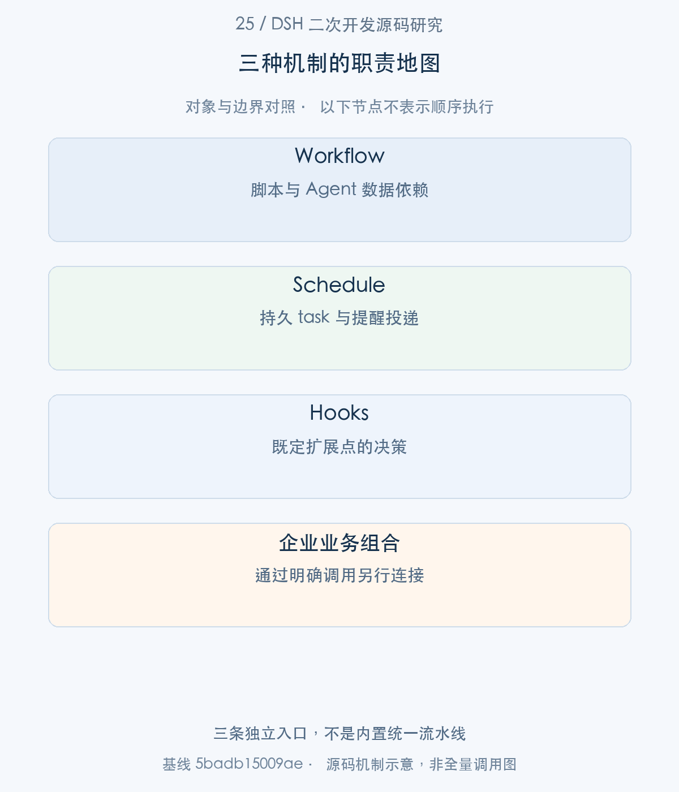
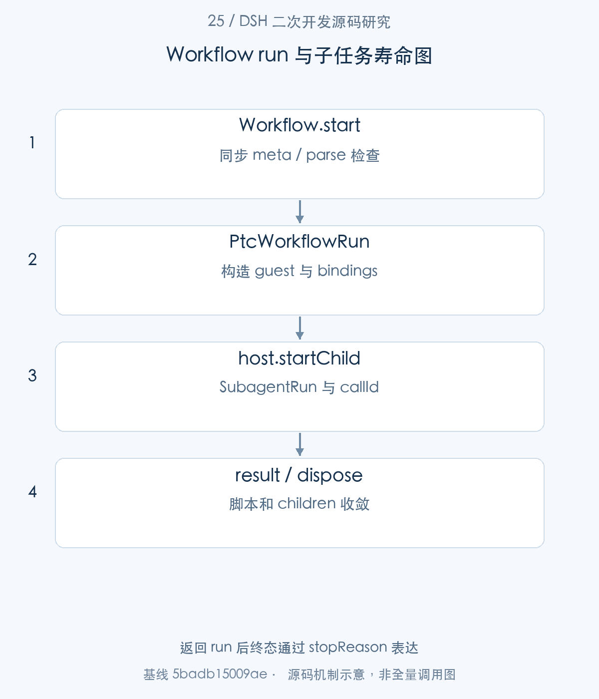
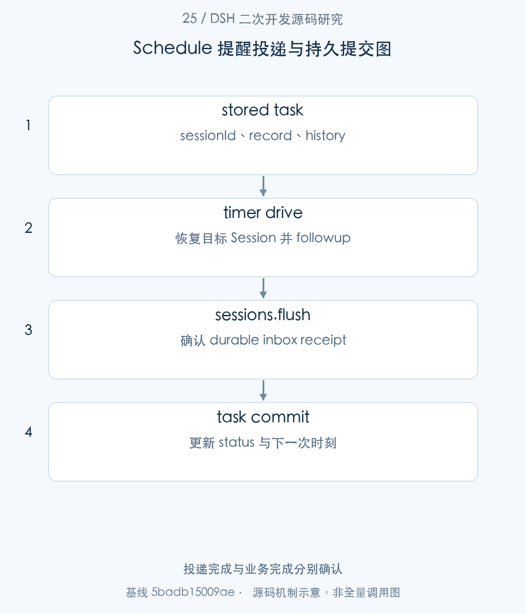
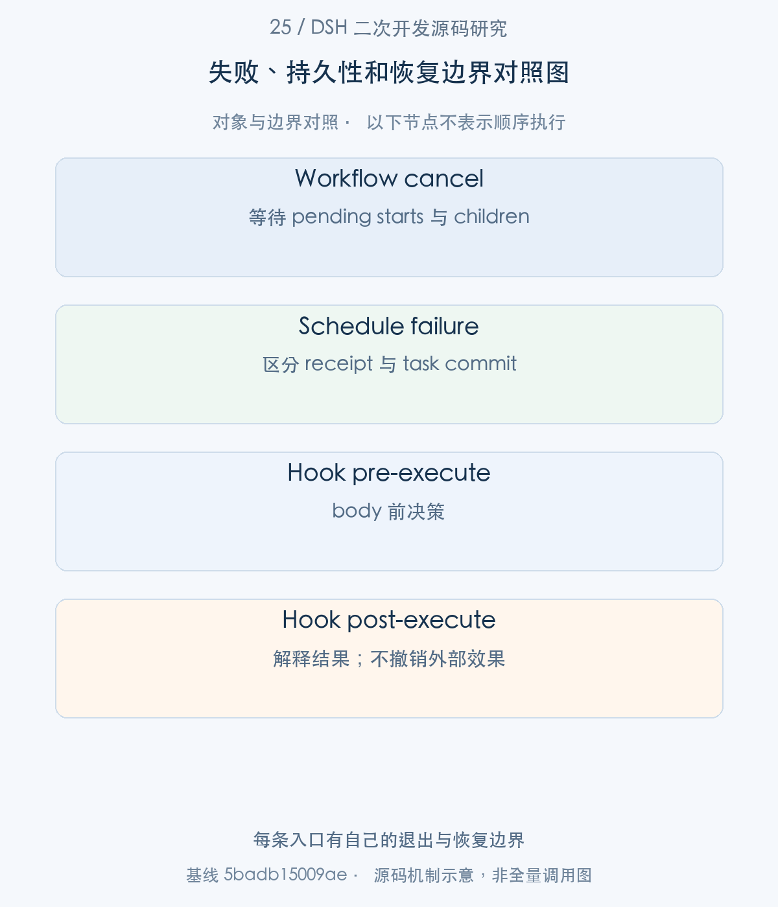

# 25｜从 Agent 执行到任务编排：Workflow、Schedule 与 Hooks

Workflow、Schedule 和 Hooks 都会影响 Agent 的执行，但职责各不相同：Workflow 组织多个 Agent 的数据依赖，Schedule 持久保存并投递提醒，Hooks 在既定扩展点改变决策或上下文。本文分别沿三个真实入口展开，再回到它们共同依赖的 Session、子任务和退出边界，避免画出源码并不存在的统一流水线。

> 源码基线：DSH `0.2.1-alpha.1`，提交 `5badb15009ae1756c3afe0ae0cef1faafc290ccc`。下文的源码摘录保持原文，仅移除公共缩进。企业新增设计与验证范围另行标明。

## 1. 整体地图：编排、触发和钩子各解决什么问题

企业“每天生成一份审核报告”的需求可以拆开：Schedule 在时间到达后向目标 Session 投递任务，任务中的 Workflow 并行研究资料，工具调用前 Hooks 检查政策。这是企业可能新增的业务组合，并非三种插件加载后自动互相调用。

本篇先把 Workflow 主线追完整，再说明 Schedule 的 durable delivery，最后说明 Hook protocol 与 dialect bridge。文章保留各自数据、结果和故障语义，不用一个“任务成功”覆盖三段事实。



图1。三条独立入口，不是内置统一流水线 [SVG](assets/25-workflow-schedule-hooks-fig-1.svg)。

## 2. Workflow 主线：脚本怎样成为一个 run

步骤1：WorkflowEngine.start 接收 script、meta、args、parent 与 signal，先同步检查能否开始。

<!-- source:S01 -->
源码 [packages/workflow/workflow-ptc/src/index.ts:133–156](https://github.com/deepseek-ai/deepseek-harness/blob/5badb15009ae1756c3afe0ae0cef1faafc290ccc/packages/workflow/workflow-ptc/src/index.ts#L133-L156)。

```typescript
start(request: WorkflowStartRequest): WorkflowRun {
  const meta = validateMeta(request.meta)
  assertBodyParses(request.script, meta.name)
  const subagentProvider = resolveSubagentProvider(this.ctx, this.config.provider, request.subagentProvider)
  const maxTotalAgents = resolveMaxTotalAgents(request.maxTotalAgents, this.config.maxTotalAgents)
  const id = WorkflowRunId(randomUUID())
  const info: WorkflowRunInfo = { id, meta }
  const limits: WorkerLimits = {
    maxConcurrentAgents: this.config.maxConcurrentAgents === 0
      ? Math.min(16, Math.max(1, availableParallelism() - 2))
      : this.config.maxConcurrentAgents,
    maxTotalAgents,
    maxItemsPerCall: this.config.maxItemsPerCall,
    syncTimeoutMs: this.config.syncTimeoutMs,
  }
  const init: WorkerInit = {
    meta,
    body: request.script,
    ...request.args !== undefined ? { args: structuredClone(request.args) } : {},
    limits,
  }
  // Captured service handles keep a holder-owned run usable after engine unload.
  const runCtx = this.ctx
  const subagents = runCtx.subagents
```

validateMeta 和 assertBodyParses 失败直接 throw；只有返回 WorkflowRun 后，错误才通过 result.stopReason 结算。limits 同时控制并发 Agent、总量和单次 items，maxConcurrent=0 会根据 CPU 生成受限值，不能解释为无限并发。

步骤2：start 将输入、捕获的 services、parent policy 和事件 observer 交给 PtcWorkflowRun。

<!-- source:S02 -->
源码 [packages/workflow/workflow-ptc/src/index.ts:157–188](https://github.com/deepseek-ai/deepseek-harness/blob/5badb15009ae1756c3afe0ae0cef1faafc290ccc/packages/workflow/workflow-ptc/src/index.ts#L157-L188)。

```typescript
  const run = new PtcWorkflowRun(
    runCtx,
    subagents,
    runCtx.ptcRuntime,
    id,
    meta,
    request.parent,
    init,
    subagentProvider,
    runCtx.sandboxPolicy.resolve({ session: request.parent.session }),
    {
      phase: (title) => { this.emitWorkflowEvent('workflow/phase', info, title) },
      log: (message) => { this.emitWorkflowEvent('workflow/log', info, message) },
      agentStart: (agent) => { this.emitWorkflowEvent('workflow/agent-start', info, agent) },
      agentEnd: (agent) => { this.emitWorkflowEvent('workflow/agent-end', info, agent) },
    },
    request.signal,
  )

  this.emitWorkflowEvent('workflow/start', info)
  // `workflow/end` fires as the (never-rejecting) result settles, with the
  // outcome DATA only — the value stays with the run's holder.
  void run.result.then((settled) => {
    this.emitWorkflowEvent('workflow/end', info, {
      stopReason: settled.stopReason,
      ...settled.error !== undefined ? { error: settled.error } : {},
      agentsStarted: settled.agentsStarted,
    })
  })

  return run
}
```

事件 workflow/end 只携带 stopReason/error/agentsStarted，value 留给 holder。持有 run 的 caller 拥有取消与退出责任，engine service 卸载与 holder-owned run 的寿命不能简单划等号。Workflow backend 还要求 TypeScript PTC，不能由语言字符串推定 Python 也可运行同一脚本。



图2。返回 run 后终态通过 stopReason 表达 [SVG](assets/25-workflow-schedule-hooks-fig-2.svg)。

## 3. 子任务主线：并行、阶段、失败与清理

步骤3：PtcWorkflowRun.drive 使用 workflowHost bindings 启动 PTC program，交给 guest runtime 执行脚本。

<!-- source:S03 -->
源码 [packages/workflow/workflow-ptc/src/host.ts:273–287](https://github.com/deepseek-ai/deepseek-harness/blob/5badb15009ae1756c3afe0ae0cef1faafc290ccc/packages/workflow/workflow-ptc/src/host.ts#L273-L287)。

```typescript
private async drive(): Promise<WorkflowResult> {
  let result: WorkflowResult
  try {
    const outcome = await this.runtime.run(this.runtime.resolve({
      program: PROGRAM,
      bindings: [{ global: 'workflowHost', functions: this.bindings() }],
      cwd: this.policy.workspaceRoot,
      sandboxPolicy: this.policy,
      timeoutMs: null,
      signal: this.controller.signal,
    }))
    this.terminal = true
    if (this.cancelReason !== undefined) result = this.cancelled()
    else if (outcome.error !== undefined) result = { value: null, stopReason: 'error', error: `workflow execution failed (${outcome.error.kind}): ${outcome.error.message}`, agentsStarted: this.started }
    else result = workflowResult(outcome.value)
```

timeoutMs=null 是这里显式的选择；脚本同步预算和 Agent 总量由 Workflow 层另行约束。PTC 的 policy 来自 parent Session，脚本不是在 Host 内直接 eval。

步骤4：guest 的 startAgent 通过 host.startChild 拿到 callId/childId，再等待 childResult，dispose 前先 drain progress。

<!-- source:S04 -->
源码 [packages/workflow/workflow-ptc/src/guest.ts:49–68](https://github.com/deepseek-ai/deepseek-harness/blob/5badb15009ae1756c3afe0ae0cef1faafc290ccc/packages/workflow/workflow-ptc/src/guest.ts#L49-L68)。

```typescript
const children: ChildPort = {
  async startAgent(request) {
    const { callId, childId } = await host.startChild(request)
    const result = host.childResult({ callId })
    // A dropped agent() call must not turn a child failure into an unhandled rejection.
    void result.catch(() => {})
    return {
      id: childId,
      result,
      async dispose() {
        // Start observers must receive the child while its host registration is still live.
        await drain()
        await host.disposeChild({ callId })
      },
    }
  },
}
const execution = new WorkflowExecution(init.meta, init.body, init.args, init.limits, observer, children)
const result = await execution.drive()
await drain()
```

进度事件只允许一个 batch 在途，避免消息无限堆积；child failure 也挂有 rejection handler，防止用户漏 await 造成 unhandled。guest 请求并不能直接取得 Host SubagentRun 对象，只拿到序列化 identity。

步骤5：Host.startChild 调用 subagents.start，记录 ChildRecord，且在 await 返回后重新检查取消。

<!-- source:S05 -->
源码 [packages/workflow/workflow-ptc/src/host.ts:197–218](https://github.com/deepseek-ai/deepseek-harness/blob/5badb15009ae1756c3afe0ae0cef1faafc290ccc/packages/workflow/workflow-ptc/src/host.ts#L197-L218)。

```typescript
private async startChild(request: ChildStartRequest): Promise<PtcJsonValue> {
  this.requireActive()
  const callId = ++this.started
  const run = await this.subagents.start(this.provider, {
    prompt: [{ type: 'text', text: request.prompt }],
    parent: this.parent,
    signal: this.controller.signal,
    ...request.schema === undefined ? {} : { outputSchema: request.schema },
    ...request.provider === undefined && request.model === undefined ? {} : {
      agentOptions: {
        ...request.provider === undefined ? {} : { provider: request.provider },
        ...request.model === undefined ? {} : { model: request.model },
      },
    },
  })
  const record: ChildRecord = { callId, run }
  this.children.set(callId, record)
  // A provider can publish after the signal fired while startup was pending.
  if (this.controller.signal.aborted) {
    await this.disposeChild(record)
    throw new Error('workflow child started after cancellation')
  }
```

provider 可能在 signal 已发出后才发布 child，因此迟到 child 仍要 dispose。parent、prompt、outputSchema 和 agentOptions 明确传给子任务。这一责任跟第17篇的 late handle 清理一致，属于可复用的归属模式。


步骤6：Workflow 无论成功还是失败都进入 finally，停止 guest 并等待 pending starts 与已发布 children 退出。

<!-- source:S06 -->
源码 [packages/workflow/workflow-ptc/src/host.ts:287–306](https://github.com/deepseek-ai/deepseek-harness/blob/5badb15009ae1756c3afe0ae0cef1faafc290ccc/packages/workflow/workflow-ptc/src/host.ts#L287-L306)。

```typescript
      else result = workflowResult(outcome.value)
    } catch (error: unknown) {
      this.terminal = true
      result = this.cancelReason === undefined
        ? { value: null, stopReason: 'error', error: renderThrown(error), agentsStarted: this.started }
        : this.cancelled()
    } finally {
      this.terminal = true
      this.signal?.removeEventListener('abort', this.externalAbort)
      this.controller.abort('workflow settled')
      // Disposing published children releases binding waits; pending starts may publish more.
      for (const record of this.children.values()) void this.disposeChild(record)
      while (this.pending.size > 0) await Promise.allSettled([...this.pending])
      await Promise.all([...this.children.values()].map(record => this.disposeChild(record)))
      this.children.clear()
      for (const info of this.liveAgents.values()) this.endAgent({ ...info, outcome: 'cancelled' })
    }
    return result
  }
}
```

result 用 completed/error/cancelled 表示终态。普通子 Agent 任务失败和执行 substrate 故障不同，脚本可根据 child output 做业务处理；基础设施故障则可能终止 run。企业 pipeline 应明确何时继续、何时 fail，而不是对所有 null 一律重试。

## 4. Schedule 支线：注册、触发和 owner 退出

Workflow的run已在finally完成收敛。下面进入独立的ScheduleService：输入从脚本请求变为持久task，consumer也从guest/child变为timer runtime与目标Session。

步骤7：ScheduleService 是另一条入口。它先 open scheduleDomain，核对 stored task key，再构造 timer runtime。

<!-- source:S07 -->
源码 [packages/schedule/schedule/src/index.ts:125–163](https://github.com/deepseek-ai/deepseek-harness/blob/5badb15009ae1756c3afe0ae0cef1faafc290ccc/packages/schedule/schedule/src/index.ts#L125-L163)。

```typescript
this.ready = ctx.storageDomain.open(scheduleDomain).then(async (domain) => {
  for (const [key, task] of domain.table('tasks').entries()) {
    if (key !== task.record.id) {
      // The mismatch is the actionable failure; a rejecting close must not replace it.
      try {
        await domain.close()
      } catch (error: unknown) {
        ctx.logger.warn(`schedule: closing the domain after a key mismatch failed: ${String(error)}`)
      }
      throw new Error(`schedule: stored task key "${key}" differs from record id "${task.record.id}"`)
    }
  }
  return domain
})
this.initialized = ctx.effect(async () => {
  const domain = await this.ready
  let cleanup: () => Promise<void>
  try {
    cleanup = ctx.effect(() => async () => {
      this.stopping = true
      await this.runtime?.dispose()
      await this.chain // The chain contains failures after returning them to their callers.
      await domain.close()
    })
  } catch (error) {
    this.stopping = true
    await domain.close()
    throw error
  }
  const tasks = domain.table('tasks')
  this.runtime = new ScheduleRuntime(ctx,
    () => [...tasks.entries()].map(([, task]) => task),
    work => this.serialize(work),
    async (task) => {
      await tasks.put(task.record.id, task)
      this.emitChanged()
    },
    this.retention)
  this.runtime.requestDrive()
```

这个基线已经有持久 storage domain、delivery history 以及 restart/recovery 逻辑，不应描述成临时 setTimeout 插件。退出顺序为停止 runtime、等待串行写链、关闭 domain。task 数据和 timer 的生命周期分别管理。

步骤8：schedule.create 在 serialize 内检查目标、等待 domain、检查 signal，然后持久写 task 并通知 runtime。

<!-- source:S08 -->
源码 [packages/schedule/schedule/src/index.ts:251–263](https://github.com/deepseek-ai/deepseek-harness/blob/5badb15009ae1756c3afe0ae0cef1faafc290ccc/packages/schedule/schedule/src/index.ts#L251-L263)。

```typescript
  return this.serialize(async () => {
    const refusal = this.reminderTargetRefusal(sessionId)
    if (refusal !== undefined) throw new ScheduleInputError('subagent_session', refusal.message)
    const domain = await this.getDomain()
    signal?.throwIfAborted()
    await domain.table('tasks').put(id, {
      sessionId, record, status: 'active', deliveryHistory: { records: [], earlierRecordsUnavailable: false },
    })
    this.emitChanged()
    this.runtime?.requestDrive()
    return record
  })
}
```

取消在持久开始前检查；写入在途取消不承诺 rollback。task 保存 sessionId、record、status 与 deliveryHistory，提醒不要求目标 Agent 此刻一定已经 live。daily/weekly/cron 等 recurrence 会计算下一次时刻，仍需以实际领域规则而非系统 crontab 理解。

Schedule的投递链还需要三种身份来解释恢复：

|数据|生产/更新位置|用来回答的问题|
|---|---|---|
|持久task record与status|schedule storage domain|哪项提醒仍具有定时义务|
|inbox messageId|followup消息与Session flush|哪个输入已被持久接纳|
|delivery history与下一scheduledAt|投递后task commit|哪次投递已记账、下次何时驱动|

若Session flush已确认，而task commit失败，提醒输入已存在，但投递账本尚未完成。这个窗口解释了为什么不能从“有持久存储”直接推导跨两个对象的exactly-once。应用要按已有messageId与业务状态确认结果，关键写操作仍应具有自己的幂等键与receipt。

Workflow则使用run/result来表达一次脚本执行，与持久Schedule task不是同一种对象。Hooks围绕既有extension point解释输入或结果，也没有自动接管上述投递账本。企业可以连接三者，例如Schedule触发输入、Agent工具启动Workflow、Hook做边界检查，但必须由应用显式传递任务身份和归属；源码并不存在一个隐含的统一编排器替应用完成这些关联。


步骤9：到期投递的提交点在 Agent.followup 之后的 sessions.flush；只有持久确认后才更新提醒状态和 history。

<!-- source:S09 -->
源码 [packages/schedule/schedule/src/runtime.ts:114–142](https://github.com/deepseek-ai/deepseek-harness/blob/5badb15009ae1756c3afe0ae0cef1faafc290ccc/packages/schedule/schedule/src/runtime.ts#L114-L142)。

```typescript
const text = isRecurringScheduleRecord(task.record)
  ? renderRecurringReminderBatchFraming(occurrences.map(({ task: member, occurrence }) => ({
    record: member.record, occurrenceAt: occurrence.occurrenceAt,
  })))
  : renderReminderFraming(task.record)
const message = createUserMessage({
  content: [{ type: 'text', text }], source: { kind: 'schedule' },
})
// followup synchronously appends the inbox splice before flush observes the Session.
resolved.agent.followup(message)
const flushed = await this.ctx.sessions.flush(resolved.agent.session)
if (!flushed) throw new Error('Session persistence did not acknowledge the reminder')
const deliveredAt = new Date(Date.now()).toISOString()
if (!isRecurringScheduleRecord(task.record)) {
  await this.commit({
    ...task, status: 'inactive',
    ...appendDelivery(task, { scheduledAt: task.record.scheduledAt, deliveredAt, messageId: message.id }, this.retention),
  })
  committed.add(task.record.id)
}
for (const { task: member, occurrence } of occurrences) {
  await this.commit({
    ...member,
    record: { ...member.record, scheduledAt: occurrence.nextScheduledAt ?? occurrence.occurrenceAt },
    status: occurrence.nextScheduledAt === undefined ? 'inactive' : 'active',
    ...appendDelivery(member, { scheduledAt: occurrence.occurrenceAt, deliveredAt, messageId: message.id }, this.retention),
  })
  committed.add(member.record.id)
}
```

message source.kind=schedule，messageId 进入 delivery receipt。一次性任务变 inactive，recurring 推进 nextScheduledAt。提醒已投递到 inbox 不代表 Agent 完成报告，更不代表下游写入成功；那是后续 Session/业务结果的观察。

步骤10：flush 或 task commit 失败时，runtime 区分已成功提交和仍未确认的任务，记录警告。

<!-- source:S10 -->
源码 [packages/schedule/schedule/src/runtime.ts:143–153](https://github.com/deepseek-ai/deepseek-harness/blob/5badb15009ae1756c3afe0ae0cef1faafc290ccc/packages/schedule/schedule/src/runtime.ts#L143-L153)。

```typescript
  } catch (error: unknown) {
    // Successful commits and targets made future by clock rollback keep their timer obligation.
    const pending = admitted.filter(member => !committed.has(member.record.id))
    const failedAt = Date.now()
    for (const member of pending) {
      if (Date.parse(member.record.scheduledAt) <= failedAt) failed.add(member.record.id)
    }
    const ids = pending.map(member => member.record.id)
    this.ctx.logger.warn(`schedule: reminders ${JSON.stringify(ids)} were not acknowledged: ${String(error)}`)
  }
}
```

inbox durable append 与 scheduleDomain task commit 是两个提交点，崩溃窗口需要恢复逻辑核对 receipt/history。不能据正常路径的 await 次序宣称跨后端 exactly-once。企业可在业务工具进一步提供幂等，防止重投递最终变成重复效果。




图3。投递完成与业务完成分别确认 [SVG](assets/25-workflow-schedule-hooks-fig-3.svg)。

## 5. Hooks 支线：协议适配和控制权

提醒投递结束后，再看工具执行边界上的Hooks。runHook的caller是具体dialect bridge，payload来自当前扩展点；它不自动接管Schedule的投递账本。


步骤11：Hooks 使用共享 runHook 执行 command，由 bridge 提供 payload、cwd、env、signal 和 expectedEventName。

<!-- source:S11 -->
源码 [packages/hooks/hook-protocol/src/runner.ts:67–95](https://github.com/deepseek-ai/deepseek-harness/blob/5badb15009ae1756c3afe0ae0cef1faafc290ccc/packages/hooks/hook-protocol/src/runner.ts#L67-L95)。

```typescript
export async function runHook(
  bash: Pick<ShellExecutor, 'resolve' | 'execute'>,
  hook: CommandHook,
  options: RunHookOptions,
  now: () => number,
): Promise<RunHookResult> {
  const started = now()
  const timeoutMs = hook.timeoutSec !== undefined ? hook.timeoutSec * 1000 : options.defaultTimeoutMs
  const stdin = JSON.stringify(options.payload) + (options.trailingNewline ? '\n' : '')

  const request = {
    command: hook.command,
    timeoutMs,
    stdin,
    signal: options.signal,
    ...options.cwd !== undefined ? { workdir: options.cwd } : {},
    ...options.env !== undefined ? { env: options.env } : {},
  }

  try {
    const result = await (await bash.execute(bash.resolve(request))).result()
    // ShellRunResult.exitCode is `number | null` (null = died by signal); the
    // protocol's exit-code contract is numeric, so a signal death maps to
    // `undefined` (a non-blocking error — no clean exit code to act on).
    const exitCode = result.exitCode ?? undefined
    return {
      output: parseHookOutput(exitCode, result.stdout.text, result.stderr.text, options.expectedEventName),
      durationMs: now() - started,
    }
```

它通过 shell.resolve/execute 而不是直接 shell 字符串拼接到一个未归属的进程。timeoutSec 转毫秒，exitCode 及 stdout/stderr 经 codec 解释。基础设施无法执行 hook 的错误在协议层可被作为非阻断错误；企业关键策略不应只依赖这种可选旁路检查。

步骤12：多个 matched outputs 由 mergeHookOutputs 合并，采用最严格决策和 sticky stop。

<!-- source:S12 -->
源码 [packages/hooks/hook-protocol/src/merge.ts:68–100](https://github.com/deepseek-ai/deepseek-harness/blob/5badb15009ae1756c3afe0ae0cef1faafc290ccc/packages/hooks/hook-protocol/src/merge.ts#L68-L100)。

```typescript
  const additionalContext: string[] = []
  const systemMessages: string[] = []

  for (const out of outputs) {
    const r = rank(out.decision)
    if (r > maxRank) maxRank = r
    if ((r === 3 || r === 2) && out.reason !== undefined && out.reason.length > 0) {
      const list = reasonsByRank.get(r) ?? []
      list.push(out.reason)
      reasonsByRank.set(r, list)
    }
    if (out.continue === false && !stop) {
      stop = true
      if (out.stopReason !== undefined) stopReason = out.stopReason
    }
    if (out.additionalContext !== undefined && out.additionalContext.length > 0) {
      additionalContext.push(out.additionalContext)
    }
    if (out.systemMessage !== undefined && out.systemMessage.length > 0) {
      systemMessages.push(out.systemMessage)
    }
  }

  const reasons = reasonsByRank.get(maxRank) ?? []
  return {
    decision: decisionForRank(maxRank),
    ...reasons.length > 0 ? { reason: reasons.join('\n\n') } : {},
    stop,
    ...stopReason !== undefined ? { stopReason } : {},
    additionalContext,
    systemMessages,
  }
}
```

deny > ask > allow；保留胜出 rank 的 reasons，additionalContext 和 systemMessages 则按顺序累计。它定义共享合并语义，不统一 Claude Code/Codex 的 matcher、payload 或 event mapping。

步骤13：Codex bridge 把合并结果接到 tools/pre-execute 与 post-execute，再由 ToolRuntime 消费 decision。

<!-- source:S13 -->
源码 [packages/hooks/hooks-codex/src/index.ts:231–261](https://github.com/deepseek-ai/deepseek-harness/blob/5badb15009ae1756c3afe0ae0cef1faafc290ccc/packages/hooks/hooks-codex/src/index.ts#L231-L261)。

```typescript
ctx.on('tools/pre-execute', async (exec, next): Promise<PreToolDecision> => {
  const turn = lastTurn(ctx, exec.agent)
  const merged = await runPoint('PreToolUse', exec.name, preToolPayload(ctx, exec, model), { ...exec.agent ? { agent: exec.agent } : {}, turn, signal: exec.signal })
  /* jscpd:ignore-end */
  if (merged.decision === 'deny') return { kind: 'deny', reason: merged.reason ?? 'blocked by PreToolUse hook' }
  return next()
})

// PostToolUse → PostToolDecision (block with feedback, or attach context).
ctx.on('tools/post-execute', async (exec, result, next): Promise<PostToolDecision> => {
  const turn = lastTurn(ctx, exec.agent)
  /* jscpd:ignore-start */
  const merged = await runPoint('PostToolUse', exec.name, postToolPayload(ctx, exec, result, model), { ...exec.agent ? { agent: exec.agent } : {}, turn, signal: exec.signal })
  const context = contextFrom(merged)
  if (merged.decision === 'deny') {
    return { kind: 'block', feedback: [{ type: 'text', text: merged.reason ?? 'blocked by PostToolUse hook' }], ...context ? { additionalContexts: [context] } : {} }
  }
  // Context alone is not a veto: DELEGATE, then fold our context onto the
  // downstream decision (a downstream block carries it too).
  const downstream = await next()
  if (!context) return downstream
  if (downstream.kind === 'block') {
    return { ...downstream, additionalContexts: prependContext(context, downstream.additionalContexts) }
  }
  return {
    ...downstream,
    additionalContexts: prependContext(context, downstream.additionalContexts),
  }
})

// A blocking Stop hook steers at the stopping boundary, which makes the
```

此 Codex bridge 的 pre-execute 只映射 deny，其余进入 next；共享 merge 支持 ask 不意味着此 bridge 已映射人工审批；post-execute 只能解释结果、添加上下文或停止后续推进，不能撤销已发生的外部写入。Hook durable events 负责审计调用与结果，detached hooks 还有独立的 quiescence owner。


## 6. 组合边界：恢复、取消与业务流程保证

三条实现至此分别完成了自己的终态交接，组合它们时需要额外保留任务身份和结果来源。Workflow由holder观察result并负责dispose；Schedule由持久task与delivery history观察投递；Hook由调用它的bridge解释outcome。这些对象不能互相替代。

恢复时，Schedule重建timer与目标Session，不会据此恢复一个已经结束的Workflow run。取消Workflow要等待pending starts及children，关闭Schedule则要等待runtime与串行写链；只退出某个Hook command也不等于撤回其前后的业务操作。应用应按实际owner分别关闭资源。

对于企业每日审核流程，可以用业务taskId关联这三类记录，再用业务receipt确认报告保存或工单变更。重复投递时复核operationId，授权变更时重新校验资源范围，未知效果时查询服务器状态。这些是企业新增组合的责任，上游三种机制本身没有提供分布式全局事务。



图4。每条入口有自己的退出与恢复边界 [SVG](assets/25-workflow-schedule-hooks-fig-4.svg)。
## 7. 开发示例与验证：一个可观察的任务编排

真实的两阶段 Workflow 样例将第一步 prose 接到第二个带 schema 的 child，并检查结果及总量。

<!-- source:S14 -->
源码 [packages/workflow/workflow-ptc/tests/integration.spec.ts:41–61](https://github.com/deepseek-ai/deepseek-harness/blob/5badb15009ae1756c3afe0ae0cef1faafc290ccc/packages/workflow/workflow-ptc/tests/integration.spec.ts#L41-L61)。

```typescript
    })
    const run = ctx.workflowEngine.start({
      meta: { name: 'integration', description: 'plain + structured children' },
      script: `phase('Read')
const prose = await agent('read the repo')
phase('Judge')
const judged = await agent('judge: ' + prose, {
  schema: { type: 'object', properties: { verdict: { type: 'string', enum: ['real', 'bogus'] }, confidence: { type: 'number' } }, required: ['verdict'] },
})
return { prose, verdict: judged.verdict, confidence: judged.confidence }`,
      parent,
    })
    const result = await run.result
    expect(result.stopReason, result.error?.split('\n')[0]).toBe('completed')
    expect(result.value).toEqual({ prose: 'the file list is a.ts', verdict: 'real', confidence: 0.9 })
    expect(result.agentsStarted).toBe(2)
    await run.dispose()
    // Both children were disposed to quiescence — no live child agents remain.
    expect(childIds.length).toBe(2)
    for (const childId of childIds) {
      expect(ctx.agents.get(SessionId(childId))).toBeUndefined()
```

代码的 parent 来自已装配 mock adapter、subagent provider 和 PTC 的 setup fixture。script 使用 phase/agent/return，结果只能在 await run.result 后解读；最后 await run.dispose 完成 children 清理。

教学组合可以先运行一个只读 Workflow，确认 parallel/pipeline 的结果和 agent count，再用固定钟 fixtures 创建 Schedule 并观察 receipt，最后加一个 deny Hook 验证工具 body 未执行。不要一开始就把模型、网络、真实定时器和企业写入一起引入，导致失败来源不可定位。

可运行入口分布在 workflow-ptc integration、schedule delivery/recovery 和 hook runner/merge/bridge 测试。正文的企业每日审核组合是方案，未新增生产任务调度平台，也没有验证多节点 claim、分布式租约或跨系统事务。

可复核入口（`pnpm` 命令在 `.sources/deepseek-harness` 中运行，`node research/...` 命令在本研究仓库根目录运行；实际执行结果见[本批验证记录](../validation/supplementary-articles-validation.md)）：

```sh
pnpm exec vitest run packages/workflow/workflow-ptc/tests/integration.spec.ts packages/schedule/schedule/tests/delivery.spec.ts packages/schedule/schedule/tests/recovery.spec.ts packages/hooks/hook-protocol/tests/runner.spec.ts packages/hooks/hook-protocol/tests/merge.spec.ts packages/hooks/hooks-codex/tests/bridge.spec.ts
```

本篇使用现有源码测试说明契约，并不把 mock 的通过解释成真实模型、外部 server、浏览器或企业基础设施已经验收。
## 8. 工程心得：触发成功、运行结算与业务完成分别记录

这三条实现共同给出的收获，是将编排、投递和策略放在不同完成边界。Workflow result 描述脚本与子任务结算，Schedule receipt 描述 durable inbox delivery，Hook outcome 描述扩展点决策。企业平台可以组合这些事实建立任务看板，而不必强行把它们改成一个通用 status。

持久提醒尤其说明了“时间到了”与“任务完成”的距离。flush 和 history 让投递可追溯；业务工具的 effect receipt 再让结果可确认。把这两层一起设计，重复投递和恢复就有明确的诊断依据。

另外，退出时等待迟到子任务、进度和写链收敛，是可复用的工程模式。二次开发无论增加何种编排入口，都应先明确 holder、pending Promise 和 terminal result 的归属。


[返回补充专题目录](README.md#补充专栏17—28) · [对应写作大纲](../appendices/supplementary-article-outlines.md)
