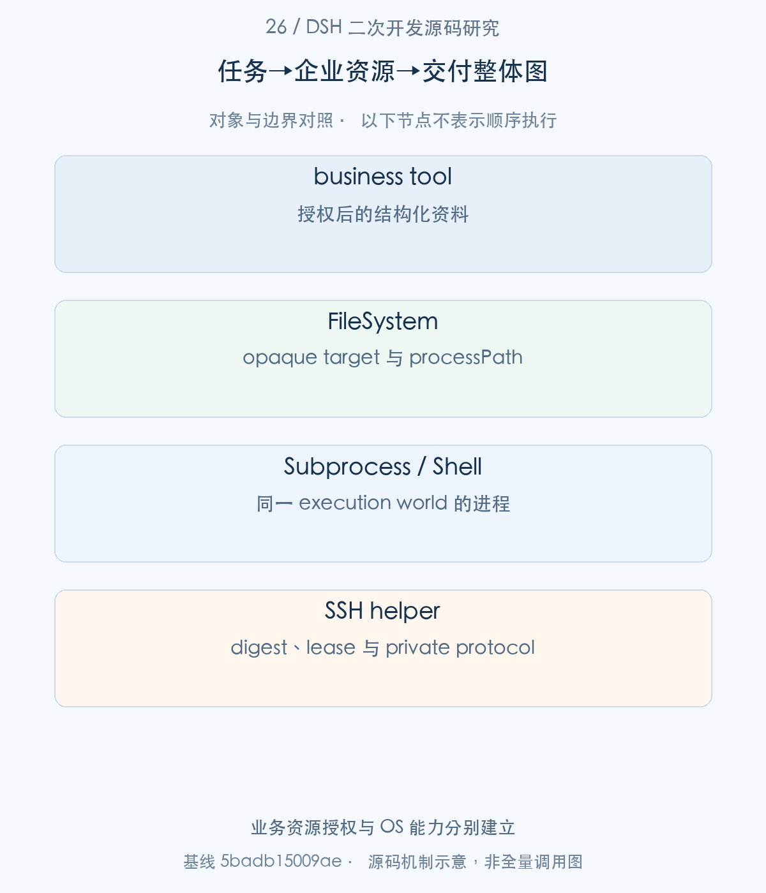
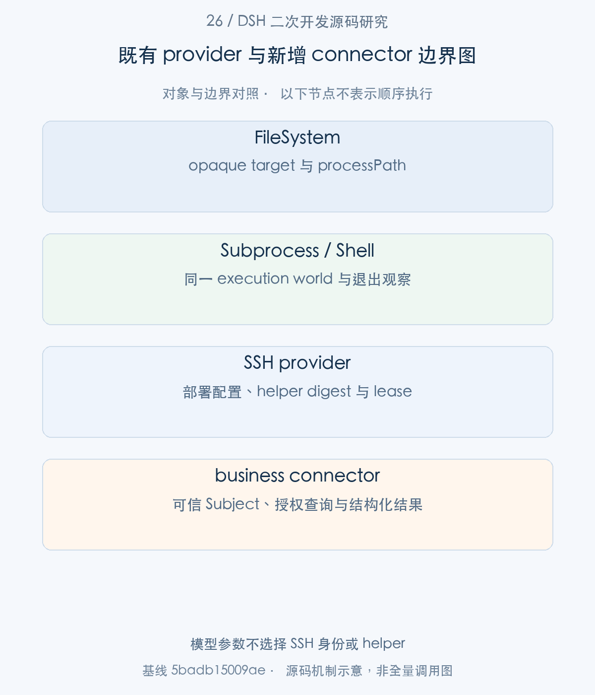
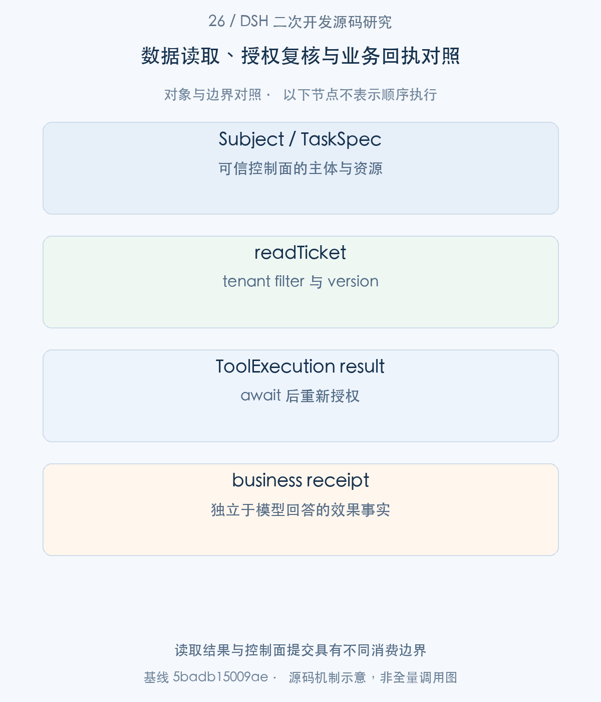
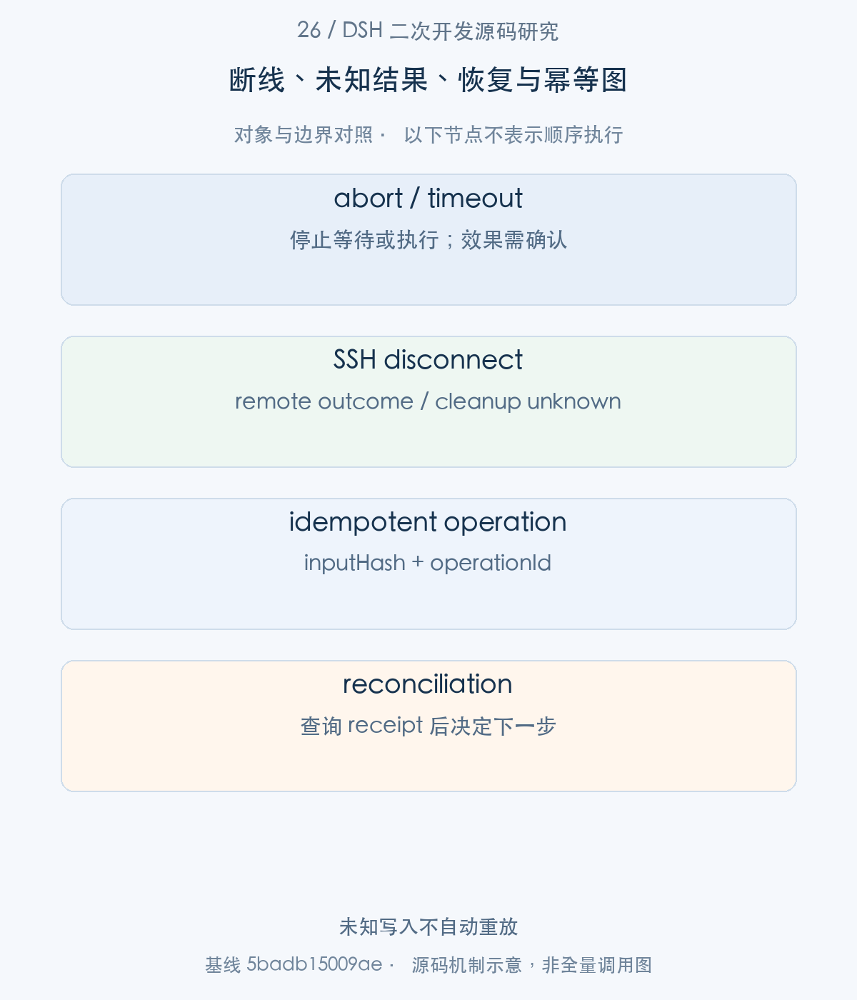

# 26｜把企业数据与远端操作接入 DSH：provider、授权与效果确认

企业数据接入有两种常见形态：通过受控业务工具读取数据库/API，通过同一执行世界的 fs、shell、subprocess provider 操作文件与远端环境。本文先建立 DSH 的能力 seam，再分别展开本仓库授权工单connector与现有SSH实现，说明输入、授权、执行、结果与效果凭证怎样相接。身份设计先落实27篇，再开始真实资源接入。

> 源码基线：DSH `0.2.1-alpha.1`，提交 `5badb15009ae1756c3afe0ae0cef1faafc290ccc`。下文的源码摘录保持原文，仅移除公共缩进。企业新增设计与验证范围另行标明。

## 1. 业务场景与整体地图：从任务到企业资源

业务资料进入 Context 后可能影响模型的下一步选择，数据访问入口必须保持来源和资源授权。远端执行又多一个难点：Host 看到的路径、进程和网络不一定是实际执行世界的坐标。DSH 用 provider-private target identity 和共享执行环境处理这一差异。

本篇分成两条真实主线：文件/进程通过 fs-ssh 与 SshConnection；结构化业务数据通过 enterprise_ticket_read 与 EnterpriseLedger。两者并不假设自动共享租户认证，企业应明确自己的身份、connector 与执行环境映射。



图1。业务资源授权与 OS 能力分别建立 [SVG](assets/26-enterprise-data-remote-execution-fig-1.svg)。

## 2. 既有接缝：fs、shell、subprocess 与 Workspace

步骤1：调用文件工具前，consumer 先 await fs.resolve 得到 FsTarget，再用 processPath 交给 OS 能力。

<!-- source:S01 -->
源码 [packages/fs/fs/src/index.ts:124–149](https://github.com/deepseek-ai/deepseek-harness/blob/5badb15009ae1756c3afe0ae0cef1faafc290ccc/packages/fs/fs/src/index.ts#L124-L149)。

```typescript
 * Resolve a model/plugin-supplied path into a stable {@link FsTarget}. May perform I/O (a
 * remote/sandboxed backend may need a round-trip to map a path to a stable identity), hence
 * async even though the local backend only normalizes + realpaths.
 *
 * @param path - the path to resolve; relative paths resolve against `opts.cwd`.
 * @param opts - optional cwd override and cancellation signal.
 * @returns the stable target; the same file yields the same `targetKey`.
 */
abstract resolve(path: string, opts?: { cwd?: string; signal?: AbortSignal }): Promise<FsTarget>

/**
 * Return the canonical absolute path a subprocess in this filesystem's
 * execution world can open. The path is deliberately separate from
 * {@link FsTarget.targetKey}: consumers may pass this value to another OS
 * capability, but must continue treating the target key as opaque.
 * @param target - the resolved target whose process path is required.
 * @returns an absolute path in the backend's execution world.
 */
abstract processPath(target: FsTarget): string

/**
 * Map an absolute path from the harness host into this filesystem's
 * execution world when both paths identify the same file. The base provider
 * exposes no mapping; host-backed or explicitly shared backends override it.
 * @param hostPath - absolute path in the harness host filesystem.
 * @returns the process path for the same file, or undefined when this
```

targetKey 是 opaque stable identity，processPath 是实际执行世界的 absolute path，displayPath 则用于展示。processPathFromHostPath 默认没有映射，远端 provider 不应把 Host 路径直接当成可读路径。

步骤2：SubprocessRuntime 规定 executable 与 fs 属于同一 execution world，done 与 waitForExit 共同描述受控范围。

<!-- source:S02 -->
源码 [packages/subprocess/subprocess/src/index.ts:89–110](https://github.com/deepseek-ai/deepseek-harness/blob/5badb15009ae1756c3afe0ae0cef1faafc290ccc/packages/subprocess/subprocess/src/index.ts#L89-L110)。

```typescript
* Abstract subprocess service. Subclass, implement {@link spawn}, and load the
* subclass as a plugin — it registers as `ctx.subprocess` (one implementation
* per context; loading a second throws, which is cordis' standard
* duplicate-service behavior).
*
* Implementations must honor these semantics:
* - Executable paths belong to one execution world shared with the mounted
*   filesystem provider.
* - {@link spawn} returns a live handle synchronously. Target identity remains
*   provider-private; `done` resolves with the spawned command's exit facts and
*   may reject for spawn or provider failures.
* - Collect-mode readers are offset-based and non-consuming, so independent
*   readers never consume one another's output; lossy reads report truncation
*   and the spill file holding the complete stream when one exists. Piped
*   streams are handed to the caller raw and never buffered here.
* - {@link SubprocessHandle.terminate} (and the spec's abort signal) starts the
*   provider's documented procedure against its managed range.
*   {@link SubprocessHandle.waitForExit} observes that same range so a
*   consumer-owned teardown ladder can hold each tier on real quiescence; each
*   provider documents its signalling and observability limits.
* - Disposal of the service terminates all still-running managed processes
*   and awaits their exit.
```

单独换一个 fs provider、仍用 local subprocess 读取 remote path，会破坏契约。spawn 同步返回 live handle，远端准备通过内部 Promise 处理；terminate 发起过程，waitForExit 才观察收敛，不能把发送信号当成退出确认。

步骤3：ShellExecutor 在这一基础上提供 resolve → execute → result，分别解释等待和进程寿命。

<!-- source:S03 -->
源码 [packages/shell/shell/src/index.ts:43–61](https://github.com/deepseek-ai/deepseek-harness/blob/5badb15009ae1756c3afe0ae0cef1faafc290ccc/packages/shell/shell/src/index.ts#L43-L61)。

```typescript
* of the spawn — a caller that awaits {@link ShellExecution.result} ran the
* command in the foreground; one that keeps the handle ran it in the
* background. A caller that waits only for a while runs the command under
* `onExpiry: 'none'` and bounds its own wait; the handle stays valid after
* the caller stops waiting.
*
* Implementations must honor these semantics:
* - {@link ShellExecution.result} rejects only for infrastructure failures.
*   Nonzero exits, timeout kills, and abort kills resolve with a descriptive
*   result: first-cause `timedOut`/`aborted`, the spec's `timeoutMs` echoed.
* - The handle is published after preparation. `done` settles at process close
*   and never rejects; spawn failures settle as `killed` with the error on the read
*   path, while `result()` carries the same failure as its rejection.
* - `onExpiry: 'none'` arms no deadline; `'kill'` kills at expiry. Expiry
*   during preparation returns a settled timed-out handle without output.
* - {@link ShellProcess.readOutput} is incremental: consecutive reads never
*   repeat output. Lossy reads report truncation and available spill files.
* - A still-running process is stopped and awaited when its owning
*   composition tears down. With the subprocess seam that boundary is
```

前后台区别取决于 caller 等待什么；onExpiry:none 允许放弃等待而不停止命令。nonzero、timeout、abort 通过 descriptive result 表达，基础设施故障才 reject。executor-only reload 不一定停掉 subprocess owner 持有的进程。



图2。模型参数不选择 SSH 身份或 helper [SVG](assets/26-enterprise-data-remote-execution-fig-2.svg)。

## 3. 企业数据接入：connector 与知识检索的新增契约

先看不依赖通用shell的业务connector：明确的工具schema接住模型输入，trusted grant决定数据范围，backend返回结构化记录。以下代码属于本仓库企业参考实现，不是上游自带CRM或知识库。

步骤4：结构化数据接入不必暴露通用 shell。enterprise_ticket_read 使用明确参数和输出 schema，读取被批准的工单。

<!-- source:S09 -->
源码 [local:research/deepseek-harness/examples/enterprise-harness/ticket-tool.ts:10–34](../examples/enterprise-harness/ticket-tool.ts)。

```typescript
ctx.tools.register(defineTool({
  name: TICKET_TOOL,
  description: 'Read the ticket authorized for this enterprise task; return its id and version.',
  parameters: { ticketId: { type: 'string', required: true } },
  output: {
    schema: {
      type: 'object', additionalProperties: false,
      properties: {
        ticketId: { type: 'string', required: true }, title: { type: 'string', required: true },
        status: { type: 'string', required: true }, version: { type: 'integer', required: true },
      },
    },
    render: (_args, value) => [{ type: 'text', text: JSON.stringify(value) }],
  },
  isConcurrencySafe: () => true,
  async execute(args, exec) {
    exec.signal.throwIfAborted()
    if (!/^[A-Z0-9-]{1,64}$/.test(args.ticketId)) throw new Error('INVALID_TICKET_ID')
    const grant = ctx.enterprisePlatform.current(exec.agent)
    const ticket = await ctx.enterprisePlatform.readTicket(grant, args.ticketId, exec.signal)
    exec.signal.throwIfAborted()
    // A revoke/dispose while awaiting the backend must prevent releasing data.
    ctx.enterprisePlatform.current(exec.agent)
    return ticket
  },
```

exec.agent 只用于找到可信 grant，model 参数不能决定租户。返回 ticketId/title/status/version，有助于回答引用与业务版本核对。输出投影收窄范围，但数据正文仍应被解释为资料，而不是新权限来源。


步骤5：EnterprisePlatform.readTicket 是替换为真实 connector 的边界，它在 await 前后检查 signal。

<!-- source:S10 -->
源码 [local:research/deepseek-harness/examples/enterprise-harness/platform.ts:54–61](../examples/enterprise-harness/platform.ts)。

```typescript
async readTicket(grant: TaskSpec, ticketId: string, signal: AbortSignal): Promise<Ticket> {
  signal.throwIfAborted()
  // Replace this boundary with a tenant-authorized backend connector in production.
  await Promise.resolve()
  signal.throwIfAborted()
  return this.ledger.readTicket(grant, ticketId)
}

```

真实实现应按 grant 选择 tenant-authorized backend，设置明确请求 deadline、输出大小和 provenance。不能把 CRM 凭据交给模型 program，也不能为了通用性开放任意 URL/SQL。此示例使用本地 ledger，不声称已经接入真实数据库或 CRM。

步骤6：ledger.readTicket 检查 current grant 和确切 ticketId，再使用 tenant_id 条件读取并裁剪结果。

<!-- source:S11 -->
源码 [local:research/deepseek-harness/examples/enterprise-harness/ledger.ts:121–129](../examples/enterprise-harness/ledger.ts)。

```typescript
readTicket(spec: TaskSpec, ticketId: string): Ticket {
  this.assertCurrent(spec)
  if (ticketId !== spec.ticketId) throw new Error('RESOURCE_NOT_AUTHORIZED')
  const row = this.db.prepare(`SELECT ticket_id,title,status,version FROM tickets
    WHERE tenant_id=? AND ticket_id=?`).get(spec.tenantId, ticketId)
  if (!row) throw new Error('RESOURCE_UNAVAILABLE')
  if (typeof row.title !== 'string' || typeof row.status !== 'string') throw new Error('INVALID_RECORD')
  return { ticketId, title: row.title.slice(0, 200), status: row.status, version: Number(row.version) }
}
```

同一 ticketId 在不同 tenant 可存在不同数据，resource-side filter 才真正落实隔离。权限若在 async backend 之后撤销，ticket-tool 会再次 current；它防止迟到数据进入 ToolRuntime result 和 Session。


如果把这条查询链扩展到企业知识检索，新增契约至少需要区分query、已授权资源范围和返回资料的来源。query可以来自模型，tenant、文档权限及输出预算应来自可信任务；返回的documentId、version、片段与citation由检索后端生产，并在结果释放前再次检查当前授权。

|企业新增交接|可信来源与consumer|应保留的事实|
|---|---|---|
|检索请求|ToolRuntime输入与受控TaskSpec共同形成|查询内容、允许资源、deadline与大小预算|
|检索响应|授权后的业务后端→connector|文档身份、版本、片段和可引用来源|
|模型工具结果|connector授权复核→Session|实际释放的资料范围及provenance|

这是新增检索adapter的设计依据，当前工单示例只执行受限资源查询，没有实现embedding、向量库或完整RAG pipeline。

## 4. 远端执行接入：位置、身份与执行环境

业务查询已有明确的connector边界。下面换到另一条入口：操作远端文件或进程时，数据不再是Ticket，而是同一execution world中的FsTarget、进程identity和streams。先由部署配置建立SSH helper，再把这些坐标交给fs与subprocess consumer。


步骤7：SSH provider 的 host、node、helperHash 和 workspace 来自部署配置，而非模型工具参数。

<!-- source:S04 -->
源码 [packages/ssh/ssh/src/index.ts:17–40](https://github.com/deepseek-ai/deepseek-harness/blob/5badb15009ae1756c3afe0ae0cef1faafc290ccc/packages/ssh/ssh/src/index.ts#L17-L40)。

```typescript
export interface Config {
  /** OpenSSH host alias, including its existing user, key and known-host configuration. */
  host: string
  /** Absolute remote Node executable. */
  node: string
  /** Absolute path to the installed, bundled helper entry. */
  helper: string
  /** SHA-256 of that bundled helper; mismatches refuse the connection. */
  helperHash: string
  /** Absolute remote default workspace. */
  workspace: string
  /** Optional preinstalled built PTC entry, paired with its expected digest. */
  bootstrapPath?: string
  /** SHA-256 of bootstrapPath; both fields must be supplied together. */
  bootstrapHash?: string
  /** Connection and administrative-request deadline, at most 2,147,483,647 milliseconds. */
  requestTimeoutMs?: number
  /** Maximum JSON payload bytes per helper request or response. */
  maxFrameBytes?: number
  /** Maximum ordinary requests; heartbeat and bounded resource cleanup have reserved capacity. */
  maxPending?: number
  /** Remote helper lease; loss of heartbeats starts remote managed cleanup. */
  leaseMs?: number
}
```

known-host/user/key 由 OpenSSH host alias 确定。helper 和可选 PTC bootstrap 必须提供 digest，leaseMs 监督断开后的清理。这不是自动远端 provisioner，也没有按 tenant 字符串自动分配主机。

步骤8：SshConnection.start 使用严格 host key checking、禁用 agent forwarding，启动 helper 并进行 hello/digest 校验。

<!-- source:S05 -->
源码 [packages/ssh/ssh/src/index.ts:259–285](https://github.com/deepseek-ai/deepseek-harness/blob/5badb15009ae1756c3afe0ae0cef1faafc290ccc/packages/ssh/ssh/src/index.ts#L259-L285)。

```typescript
this.directory = await mkdtemp('/tmp/dsh-ssh-')
if (this.closed) throw new Error('SSH connection closed before startup')
const quote = (value: string): string => `'${value.replaceAll("'", "'\\''")}'`
const command = [this.config.node, '--disable-sigusr1', this.config.helper].map(quote).join(' ')
const child = spawn('ssh', [
  '-T', '-M', '-S', this.controlPath(), '-o', 'ControlPersist=no', '-o', 'BatchMode=yes',
  '-o', 'StrictHostKeyChecking=yes', '-o', 'ForwardAgent=no', '-o', 'ClearAllForwardings=yes',
  '-o', 'ServerAliveInterval=10', '-o', 'ServerAliveCountMax=3', this.config.host, command,
], { stdio: ['pipe', 'pipe', 'pipe'] })
this.child = child
this.childClosed = new Promise((resolve) => { child.once('close', () => { resolve() }) })
child.stderr.resume() // SSH diagnostics can contain configured paths; operation errors remain structured.
child.once('error', (error) => { this.fail(error) })
child.once('close', () => { this.fail(new Error('SSH helper disconnected; remote outcomes and cleanup are unknown')) })
const rpc = new SshRpcPeer(child.stdout, child.stdin, this.config.maxFrameBytes, this.config.maxPending)
this.rpc = rpc
rpc.once('closed', (error) => { this.fail(error as Error) })
const hello = await rpc.request('hello', {
  protocol: SSH_PROTOCOL_VERSION, workspace: this.config.workspace, leaseMs: this.config.leaseMs,
  ...(this.config.bootstrapPath === undefined ? {} : { bootstrapPath: this.config.bootstrapPath }),
}, helloSchema, AbortSignal.timeout(this.config.requestTimeoutMs))
if (hello.hash !== this.config.helperHash) throw new Error('SSH helper digest differs from the configured artifact')
if (hello.bootstrapHash !== this.config.bootstrapHash) throw new Error('SSH PTC bootstrap digest differs from the configured artifact')
this.remote = hello
let heartbeatPending: Promise<unknown> | undefined
this.heartbeat = setInterval(() => {
  heartbeatPending ??= rpc.request('heartbeat', {}, z.null(), AbortSignal.timeout(this.config.leaseMs / 2))
```

protocol version、workspace、lease 与返回 hash 共同确定配对。child close 将结果与清理状态标为 unknown；连接不自动重连重放。heartbeat 只保留一个在途请求，避免 lease 检查堆积。源码已经提供这些机制，不应将它们描述为未来才需新增的抽象。


步骤9：fs-ssh 建立执行坐标并把 resolve/contains/read 操作交给 ssh.request；先读它的 target 组织与校验。

<!-- source:S06 -->
源码 [packages/ssh/fs-ssh/src/index.ts:25–62](https://github.com/deepseek-ai/deepseek-harness/blob/5badb15009ae1756c3afe0ae0cef1faafc290ccc/packages/ssh/fs-ssh/src/index.ts#L25-L62)。

```typescript
override async resolve(path: string, opts?: { cwd?: string; signal?: AbortSignal }): Promise<FsTarget> {
  return await this.call('fs.resolve', { path, cwd: opts?.cwd }, targetSchema, opts?.signal) as FsTarget
}

override processPath(target: FsTarget): string { return String(target.targetKey) }

override fileUrl(target: FsTarget): string {
  return pathToFileURL(this.processPath(target)).href
}

override contains(parent: FsTarget, child: FsTarget): boolean {
  const path = posix.relative(this.processPath(parent), this.processPath(child))
  return path === '' || (!path.startsWith('../') && path !== '..' && !posix.isAbsolute(path))
}

override async stat(target: FsTarget, signal?: AbortSignal): Promise<FsInfo | undefined> {
  return await this.call('fs.stat', { target }, infoSchema.nullable(), signal) as FsInfo | null ?? undefined
}

override async lstat(path: string, opts?: { cwd?: string }, signal?: AbortSignal): Promise<FsPathInfo | undefined> {
  return await this.call('fs.lstat', { path, cwd: opts?.cwd }, pathInfoSchema.nullable(), signal) as FsPathInfo | null ?? undefined
}

override readText(target: FsTarget, signal?: AbortSignal): Promise<string> {
  return this.call('fs.readText', { target }, z.string(), signal)
}

override async streamText(target: FsTarget, signal?: AbortSignal): Promise<AsyncIterable<string>> {
  const id = await this.call('fs.stream', { target }, textStreamIdSchema, signal)
  const call = this.call.bind(this)
  return (async function* () {
    let ended = false
    try {
      while (!ended) {
        signal?.throwIfAborted()
        const next = await call('fs.next', { id }, z.object({ done: z.boolean(), value: z.string() }).strict(), signal)
        ended = next.done
        if (next.value.length > 0) yield next.value
```

fs.resolve 直接将经 schema 检查的 helper target 返回；当前 backend 在 processPath 内解释 targetKey，普通 consumer 不能模仿它解析。write/edit 向 helper 传 expected 与 policy，读改写的观测规则由消费和策略层继续约束。ssh.request 的 result schema 是 wire boundary 校验，不等于企业 data classification 或 tenant authorization。

远端进程的交接还要继续追到 subprocess-ssh.start：先 process.prepare，建立独立 streams，再 process.start。

<!-- source:S07 -->
源码 [packages/ssh/subprocess-ssh/src/index.ts:115–150](https://github.com/deepseek-ai/deepseek-harness/blob/5badb15009ae1756c3afe0ae0cef1faafc290ccc/packages/ssh/subprocess-ssh/src/index.ts#L115-L150)。

```typescript
this.spec.signal?.throwIfAborted()
const prepared = await this.ssh.request(
  'process.prepare', { ...this.spec, signal: undefined, env: environment(this.spec.env) }, preparedSchema, this.controller.signal,
)
this.id = prepared.id
try {
  const sockets = await Promise.all(Object.entries(prepared.streams).map(async ([name, path]) =>
    [name, await this.ssh.connectStream(path, this.controller.signal)] as const))
  this.sockets = sockets.map(([, socket]) => socket)
  for (const [name, socket] of sockets) {
    if (name === 'stdout' || name === 'stderr') {
      const mode = this.spec.stdio[name]
      if (typeof mode === 'object') {
        new SshRpcPeer(socket, socket, outputSnapshotFrameLimit(mode.maxBytes), 1, (method, raw) => Promise.resolve().then(() => {
          if (method !== 'snapshot') throw new Error('Unexpected SSH output-stream operation')
          this.updateCollection[name]?.(outputSnapshotSchema.parse(raw), false)
          return null
        }))
      } else {
        socket.end()
        const output = name === 'stdout' ? this.out : this.err
        const closeSocket = (): void => { socket.destroy() }
        output.once('close', closeSocket)
        socket.once('close', () => { output.off('close', closeSocket) })
        if (output.destroyed) closeSocket()
        else socket.pipe(output)
      }
    }
    if (name === 'stdin') this.inbound.pipe(socket)
    if (name === 'control') { this.toControl.pipe(socket); socket.pipe(this.fromControl) }
  }
  this.controller.signal.throwIfAborted()
  await this.ssh.request('process.start', { id: this.id }, z.object({}).strict(), this.controller.signal)
  this.committed = true
} catch (error) {
  this.terminate()
```

prepared.id 是 helper 私有进程身份；stdout/stderr 的 collect 与 pipe 走不同分支，control stream 独立传输。任何建立流失败都不能直接假定进程尚未执行，清理和 launch acknowledgement 需要跟随 handle 的状态。

步骤10：ssh.request await ready 后重新确认 open，为行政请求加 deadline 再派给 RPC peer。

<!-- source:S08 -->
源码 [packages/ssh/ssh/src/index.ts:115–123](https://github.com/deepseek-ai/deepseek-harness/blob/5badb15009ae1756c3afe0ae0cef1faafc290ccc/packages/ssh/ssh/src/index.ts#L115-L123)。

```typescript
async request<T>(method: string, params: unknown, result: z.ZodType<T>, signal?: AbortSignal, wait: boolean = false): Promise<T> {
  this.assertOpen()
  await this.ready
  this.assertOpen()
  const bounded = wait ? signal : signal === undefined
    ? AbortSignal.timeout(this.config.requestTimeoutMs)
    : AbortSignal.any([signal, AbortSignal.timeout(this.config.requestTimeoutMs)])
  return (this.rpc as SshRpcPeer).request(method, params, result, bounded)
}
```

wait=true 允许 process observation 超过普通行政 deadline；调用取消不撤销已经完成的 remote mutation。fs-ssh、subprocess-ssh、sandbox-ssh 应使用同一 ssh service，才能共享 helper coordinates 和受控寿命。

SSH subprocess多出的prepare/start交接值得单独理解。Host先取得远端process identity与stream路径，再连接stdout、stderr、stdin或control通道，最后发送`process.start`。这样consumer在业务进程启动前就能准备输出与控制通道，而不是等远端运行后才寻找日志。prepare后的通道连接失败会进入terminate路径，避免留下一个无人负责的准备对象。

但完成`process.start`仍不代表业务已经结束。`done`观察退出事实，collect模式保存可独立读取的输出，`waitForExit`对应provider所声明的managed range。连接丢失时，这些本地观察可能不再能够确认远端效果或清理；helper租约提供另一层管理约束，也不能替代工单服务器对业务写入的确认。

FileSystem的路径交接同样不可省略。`targetKey`是provider私有身份，`processPath`才是同一个execution world中的可执行路径。通用工具先resolve再请求processPath，可以跨本地、SSH或sandbox provider保留契约；直接把opaque identity拼进shell command会破坏这一边界。

## 5. 业务效果确认：幂等、回执与未知结果

读取与远端执行各自完成后，下面进入可信控制面的业务写入。这里接住的仍是已授权TaskSpec，但返回值换成可以重试核验的CloseReceipt。


步骤11：参考方案的写操作 closeTicket 留在可信应用控制面，未注册为模型工具；它将效果、receipt 与审计放进同一 SQLite transaction。

<!-- source:S12 -->
源码 [local:research/deepseek-harness/examples/enterprise-harness/ledger.ts:132–160](../examples/enterprise-harness/ledger.ts)。

```typescript
closeTicket(spec: TaskSpec): CloseReceipt {
  return this.transaction(() => {
    this.assertCurrent(spec)
    if (!spec.canClose) throw new Error('WRITE_NOT_AUTHORIZED')
    const operationId = `${spec.taskId}:close-ticket`
    // Fixed field order; no model-supplied idempotency key or tenant.
    const inputHash = createHash('sha256').update(JSON.stringify([
      spec.tenantId, spec.actorId, spec.ticketId, spec.expectedVersion, 'closed',
    ])).digest('hex')
    const existing = this.db.prepare(`SELECT input_hash,receipt FROM operations
      WHERE tenant_id=? AND operation_id=?`).get(spec.tenantId, operationId)
    if (existing) {
      if (existing.input_hash !== inputHash || typeof existing.receipt !== 'string') {
        throw new Error('IDEMPOTENCY_CONFLICT')
      }
      return JSON.parse(existing.receipt) as CloseReceipt
    }
    const changed = this.db.prepare(`UPDATE tickets SET status='closed',version=version+1
      WHERE tenant_id=? AND ticket_id=? AND version=? AND status<>'closed'`)
      .run(spec.tenantId, spec.ticketId, spec.expectedVersion).changes
    if (Number(changed) !== 1) throw new Error('BUSINESS_VERSION_CONFLICT')
    const receipt: CloseReceipt = {
      operationId, ticketId: spec.ticketId, status: 'closed', version: spec.expectedVersion + 1,
    }
    this.db.prepare('INSERT INTO operations VALUES (?,?,?,?)')
      .run(spec.tenantId, operationId, inputHash, JSON.stringify(receipt))
    this.audit(spec, 'business-committed', receipt)
    return receipt
  })
```

operationId 由 task 生成，input hash 固定主体/资源/版本/目标状态。重复调用返回已有 receipt，输入不一致拒绝；expectedVersion 控制并发更新。这是在本地同一数据库内的可测试事务，不能搬到远端 HTTP 后仍宣称原子性。

企业工单示例把远端接入需求收敛到了另一个可核验边界：`readTicket`的查询条件来自可信grant，工具返回结果前再次确认当前授权，而`closeTicket`在可信控制面执行。后者将效果、operation receipt与audit写在同一SQLite事务中，retry返回同一receipt。这是本地同数据库事务的证明，不能直接推广到任意HTTP后端。

接入真实工单服务时，可以保持这组数据关系：task决定resource与expectedVersion，connector只执行批准范围，响应保留来源及版本，控制面凭operationId查询效果。若网络断开后结果unknown，先查服务器receipt；只有确认业务未提交或服务器接受同一幂等键，才安排后续尝试。恢复连接解决的是通信能力，恢复业务决定依赖效果事实。



图3。读取结果与控制面提交具有不同消费边界 [SVG](assets/26-enterprise-data-remote-execution-fig-3.svg)。
## 6. 恢复与交付：重新授权、结果核验与产物保存

有了业务receipt，再回到连接中断与恢复。通信恢复和效果确认分别观察，不能由一个SSH重新连接成功推导工单操作尚未发生。

步骤12：SSH fail 收回连接 owner，关闭 RPC/socket 并停止本地 SSH 子进程。

<!-- source:S13 -->
源码 [packages/ssh/ssh/src/index.ts:246–255](https://github.com/deepseek-ai/deepseek-harness/blob/5badb15009ae1756c3afe0ae0cef1faafc290ccc/packages/ssh/ssh/src/index.ts#L246-L255)。

```typescript
}

private fail(error: Error): void {
  if (this.failure !== undefined) return
  this.failure = error
  this.lifetime.abort(error)
  if (this.heartbeat !== undefined) clearInterval(this.heartbeat)
  this.rpc?.close(error)
  for (const socket of [...this.sockets].reverse()) socket.destroy(error)
  this.child?.kill('SIGTERM')
```

远端 effects 可能已经发生，lease 会启动 helper 的 managed cleanup，但断线的 caller 不能由此确认数据库、文件和进程已全部恢复。企业新增 connector 应提供 operationId 状态查询；unknown 进入人工或程序化 reconciliation，不直接重发非幂等命令。


恢复后的Agent是新的运行对象，需要重新绑定当前授权；过去的结果应结合来源、资源版本和operation receipt核验，不能直接复用旧连接或旧grant。若保存报告或文件，也应记录其实际位置与版本，再交给交付层展示，而不是用模型的一句“已保存”作为产物证明。



图4。未知写入不自动重放 [SVG](assets/26-enterprise-data-remote-execution-fig-4.svg)。
## 7. 开发示例与验证：企业查询和一次可确认写入

开发实验分两个可运行入口：本仓库 enterprise example 观察资源授权和 receipt；上游 SSH fixtures 观察 provider path、protocol disposal 与 helper 生命周期。后者使用受控 fixtures，未连接真实远端生产主机。

如果新增企业写 API，建议从 closeTicket 的输入绑定、version 与 receipt 结构出发，但把实际服务器的幂等/查询协议另行实现。教学方案中可使用 { operationId, inputHash, status, receipt } 保存 pending/committed/unknown 状态；这些状态不是 DSH 内置远端 transaction manager。

可复核入口（`pnpm` 命令在 `.sources/deepseek-harness` 中运行，`node research/...` 命令在本研究仓库根目录运行；实际执行结果见[本批验证记录](../validation/supplementary-articles-validation.md)）：

```sh
node research/deepseek-harness/validation/enterprise-example.mjs test
pnpm exec vitest run packages/ssh/fs-ssh/tests/provider.spec.ts packages/ssh/ssh/tests/protocol-disposal.spec.ts packages/ssh/subprocess-ssh/tests/lifecycle.spec.ts
```

本篇使用现有源码测试说明契约，并不把 mock 的通过解释成真实模型、外部 server、浏览器或企业基础设施已经验收。
## 8. 工程心得：Agent 结果需要连接业务事实

这一专题的收获是：provider abstraction 应保留“执行在哪里”和“由谁确认结果”两个事实。opaque targetKey、execution world、waitForExit 和 helper digest，让消费者不用猜测坐标或所有权。企业开发应保持 fs、subprocess 与 sandbox 配对，而不是只替换表面接口。

业务 connector 则应缩小到任务需要的能力。结构化输出、资源版本和授权后的 grant，使模型更容易正确使用资料，也使开发者能明确查证一次访问为何获准。

写操作的关键是承认并管理效果状态。await 失败只说明调用结果未取得；receipt、幂等键和查询协议才能进一步解释效果。将 unknown 变成有来源、有后续动作的状态，是企业 Agent 从演示走向稳定运行的重要一步。


[返回补充专题目录](README.md#补充专栏17—28) · [对应写作大纲](../appendices/supplementary-article-outlines.md)
