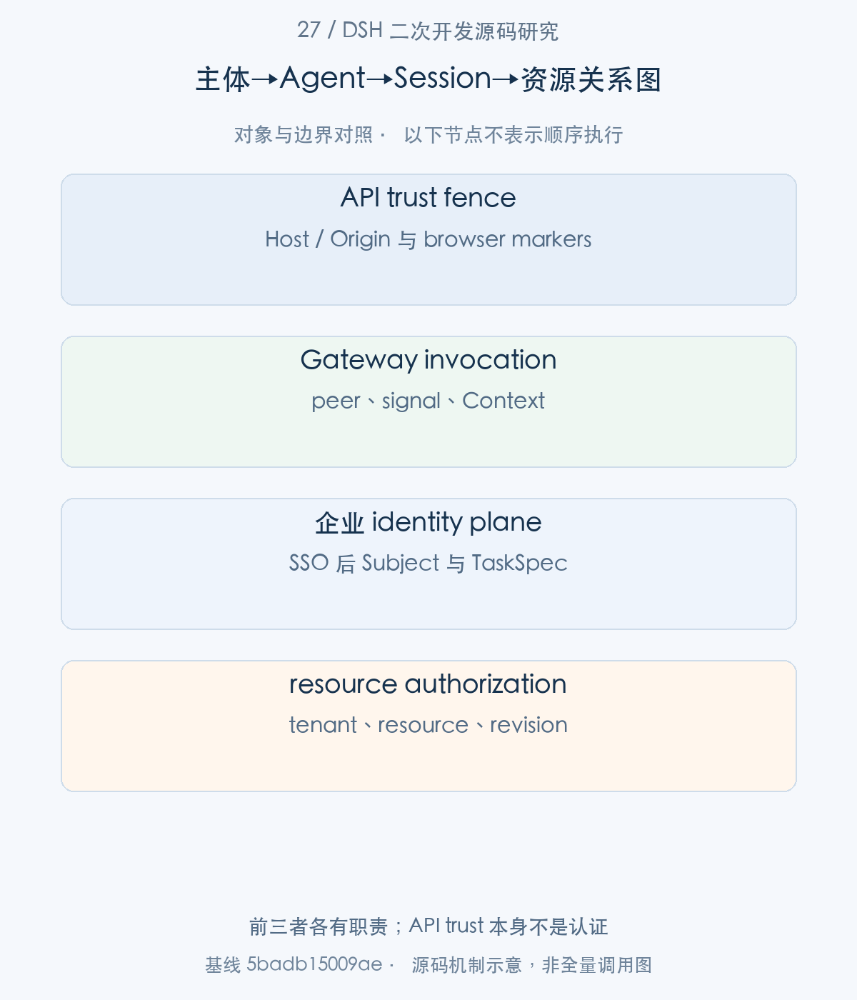
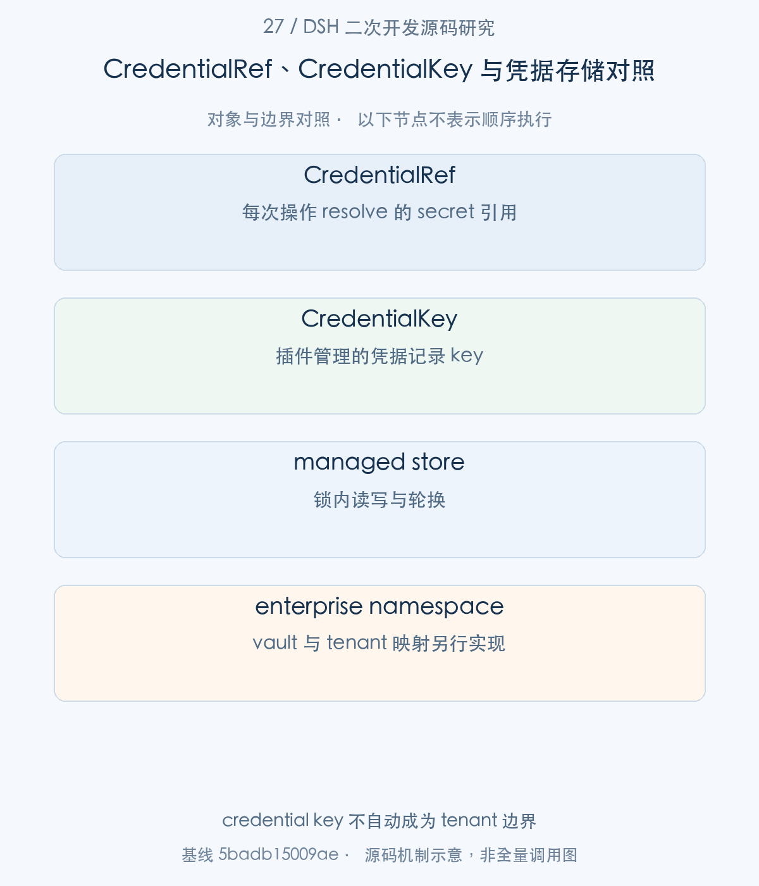
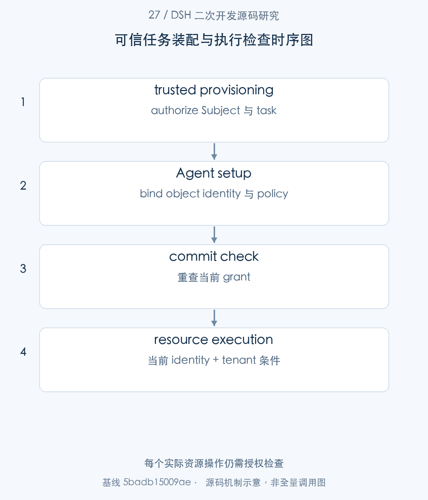
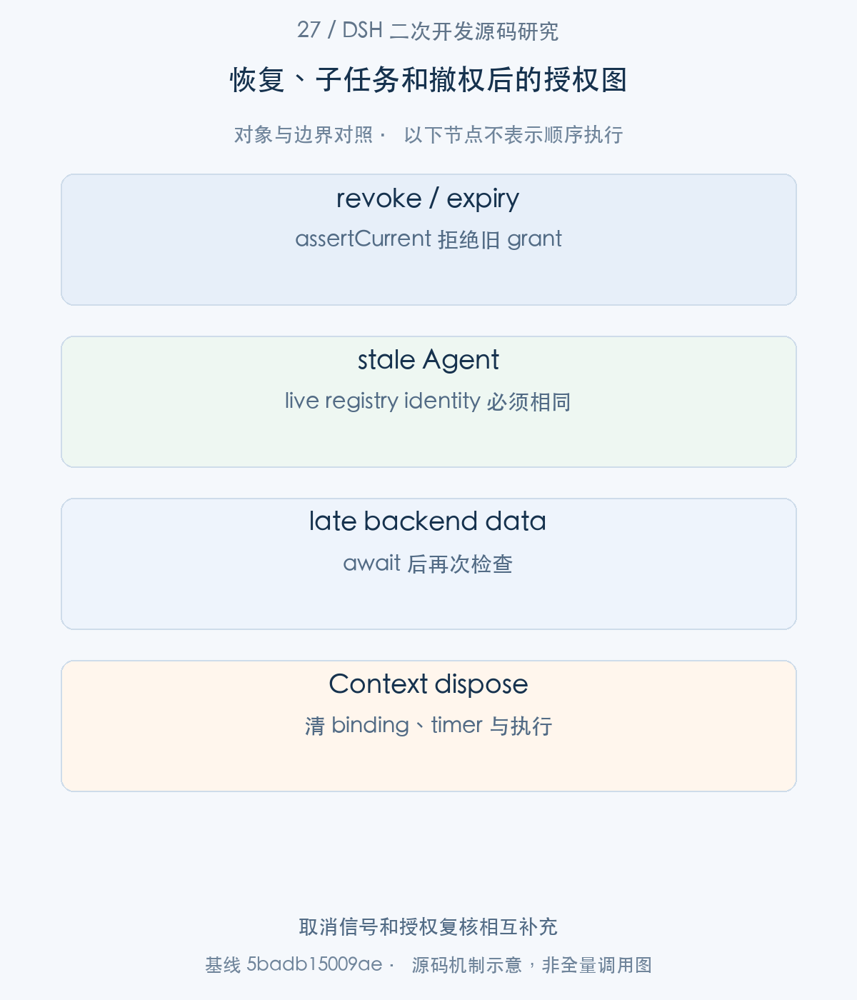

# 27｜企业 Agent 的身份边界：可信入口、凭据与租户资源授权

企业专属 Agent 需要把用户身份、租户资源、凭据与运行实例连接起来。DSH 提供浏览器请求信任边界、Gateway invocation 和 credentials seam；本仓库的 EnterprisePlatform 示例进一步建立 Subject → TaskSpec → Agent binding → resource authorization。本文先解释内置边界实际保护什么，再逐段分析企业新增代码，避免把 scoped 可见性或本地 API 信任误当作完整多租户认证。

> 源码基线：DSH `0.2.1-alpha.1`，提交 `5badb15009ae1756c3afe0ae0cef1faafc290ccc`。下文的源码摘录保持原文，仅移除公共缩进。企业新增设计与验证范围另行标明。

## 1. 整体地图：哪些身份来自可信入口

本篇按照企业资源接入的前置顺序，先于26篇研究身份。DSH 是可信插件进程中的 Harness；它的 Scope 能组织可见能力，但同进程插件仍是可信代码。企业需要在入口完成认证，把授权后的身份固定到具体 Agent，并在实际读取/写入时再次确认资源归属。

以下明确区分两种证据：固定提交的上游机制使用 GitHub 链接；本仓库 enterprise-harness 代码使用本地链接，属于新增参考方案。示例 Subject 是已认证控制面交给程序的输入，代码本身没有实现 SSO/OIDC 或端到端互联网认证。



图1。前三者各有职责；API trust 本身不是认证 [SVG](assets/27-identity-credentials-tenancy-fig-1.svg)。

## 2. 已有边界：请求信任与 Context/Session 定位

步骤1：Web 请求先经过 isTrustedApiRequest，绑定 Host authority 并检查 browser markers。

<!-- source:S01 -->
源码 [packages/client/connection/src/api-request-trust.ts:87–118](https://github.com/deepseek-ai/deepseek-harness/blob/5badb15009ae1756c3afe0ae0cef1faafc290ccc/packages/client/connection/src/api-request-trust.ts#L87-L118)。

```typescript
 * @param request - Node HTTP or Fetch request facts (headers).
 * @param trustedHosts - non-loopback authorities this deployment serves: exact `host:port`, or port-less `host` matching any port.
 * @returns true when the Host is ours (loopback or trusted) and any attached browser markers are same-origin.
 */
export function isTrustedApiRequest(request: ConnectionTrustRequest, trustedHosts: readonly string[]): boolean {
  // Host fence (DNS-rebinding defense), applied to every request: the browser
  // fills Host from the URL it believes it is talking to, so a rebound page
  // carries the attacker's domain here even though the socket lands on this
  // server. There is no marker shortcut — a browser read over plain HTTP
  // (images and navigations) arrives with neither Origin nor
  // Fetch-Metadata, indistinguishable from curl, and its response is readable
  // by the rebound page.
  const host = header(request.headers, 'host')
  if (host === undefined) return false
  const hostUrl = parseAuthority(host)
  if (hostUrl === undefined) return false
  if (!isLoopbackHostname(hostUrl.hostname) && !isTrustedAuthority(hostUrl, trustedHosts)) return false
  // Cross-site fence: modern browsers label the initiator relationship on
  // every fetch; an explicit cross-site marker is refused regardless of Origin.
  if (header(request.headers, 'sec-fetch-site') === 'cross-site') return false
  // Origin fence: when a browser attaches an Origin it must be exactly this
  // authority (compared through the same normalization as the Host). Absent
  // Origin is fine — the Host fence above already bound the request. The
  // literal "null" (sandboxed iframes, file: pages) is an opaque origin, refused.
  const origin = header(request.headers, 'origin')
  if (origin === undefined) return true
  try {
    return new URL(origin).host === hostUrl.host
  } catch {
    return false
  }
}
```

它拒绝 DNS rebinding 和 cross-site 请求；缺 Origin 的请求仍需 Host fence。trustedHosts 是部署 authority，不是用户名单，非浏览器请求也通过同一检查。此函数不认证用户，也不限制网络可达性；Reverse Proxy 与企业身份网关是额外部署责任。

步骤2：Gateway 建立 invocation，把 peer、signal 和 uplink 绑定到访问 service 的 Context。

<!-- source:S02 -->
源码 [packages/api/gateway/src/index.ts:719–736](https://github.com/deepseek-ai/deepseek-harness/blob/5badb15009ae1756c3afe0ae0cef1faafc290ccc/packages/api/gateway/src/index.ts#L719-L736)。

```typescript
const invocation = new GatewayInvocation(
  { namespace: request.namespace, method: request.method, args: request.args },
  descriptor.service,
  request.peer ?? this.operatorPeer(),
  signal,
  {
    source: request.uplink ?? EMPTY_ASYNC_ITERABLE,
    codec: descriptor.uplink?.codec ?? SRC_JSON_CODEC,
    endpoint,
    abort: (reason) => { control.abort(reason) },
  },
)
if (descriptor.cancellation !== undefined) args.push(signal)
// The method runs on a Service view bound to a Context carrying this call:
// Cordis rebinds `this.ctx` to the accessing Context, so `this.ctx.invocation`
// is this call and nothing travels through the parameter list. The view
// resolves the Service the plain read above already found.
const callReceiver = receiverContext.extend({ invocation }).get(descriptor.service) as object
```

peer 表达请求来源的载体事实，业务服务可以获得调用上下文。但企业 tenantId/actorId 应由可信入口或身份映射生产，不能直接把 wire payload 的字符串升级成已认证 principal。Remote descriptor 对参数校验也不等于资源 ownership 校验。


## 3. 凭据链：保存、读取、消费与撤销

步骤3：CredentialProvider 将 reference resolution 与无值描述分开，consumer 每次 operation 重新 resolve。

<!-- source:S03 -->
源码 [packages/credentials/credentials/src/index.ts:174–188](https://github.com/deepseek-ai/deepseek-harness/blob/5badb15009ae1756c3afe0ae0cef1faafc290ccc/packages/credentials/credentials/src/index.ts#L174-L188)。

```typescript

/**
 * Resolve one reference to its current value. Resolution is per call:
 * consumers re-resolve at each operation and must not cache across
 * operations — that per-operation read is what makes a changed credential
 * reach the next operation without a restart.
 * @param ref - the reference to resolve.
 * @returns the value and its source, or `undefined` while unconfigured.
 */
abstract resolve(ref: CredentialRef): Promise<ResolvedCredential | undefined>

/**
 * Describe one reference for configuration surfaces without exposing the
 * value.
 * @param ref - the reference to describe.
```

CredentialRef 是定位 secret 的引用，CredentialKey 是某个插件为自己的 addressing unit 保存记录的 key；两者不是企业 tenant principal。per-operation resolution 让轮换影响下一次请求，代价是 consumer 不能跨操作私藏旧值。

步骤4：本地 provider 按 inherited env → managed file → project/user fallback 解析，并向 UI 给出 writability。

<!-- source:S04 -->
源码 [packages/credentials/credentials-local/src/index.ts:609–640](https://github.com/deepseek-ai/deepseek-harness/blob/5badb15009ae1756c3afe0ae0cef1faafc290ccc/packages/credentials/credentials-local/src/index.ts#L609-L640)。

```typescript
override resolve(ref: CredentialRef): Promise<ResolvedCredential | undefined> {
  const inherited = this.inherited(ref)
  if (inherited !== undefined) return Promise.resolve({ value: inherited, source: 'env' })
  const stored = this.values.get(ref)
  if (stored !== undefined) return Promise.resolve({ value: stored, source: 'file' })
  const fallback = this.dotenvFallback(ref)
  if (fallback !== undefined) return Promise.resolve({ value: fallback.value, source: fallback.source })
  return Promise.resolve(undefined)
}

override describe(ref: CredentialRef): Promise<CredentialInfo> {
  // Only the inherited environment is unwritable: it is the one layer this
  // process cannot edit. A user `.env` value is writable in the sense that
  // matters — storing a key replaces it as the effective one.
  if (this.inherited(ref) !== undefined) {
    return Promise.resolve({ configured: true, source: 'env', writable: false })
  }
  const stored = this.values.get(ref)
  if (stored !== undefined) return Promise.resolve({ configured: true, source: 'file', writable: true })
  const fallback = this.dotenvFallback(ref)
  if (fallback !== undefined) return Promise.resolve({ configured: true, source: fallback.source, writable: true })
  return Promise.resolve({ configured: false, writable: true })
}

override async set(ref: CredentialRef, value: string): Promise<void> {
  if (value.length === 0) {
    throw new Error(`credentials-local: an empty value cannot be stored for "${ref}"; use unset`)
  }
  await this.write(ref, value)
}

override async unset(ref: CredentialRef): Promise<void> {
```

启动环境中的 secret 优先且只读，页面写入不能静默遮盖它。describe 不返回值；managed store 不是把所有 secrets 注入 process.env 的全局表。企业可换成 vault-backed provider，但 vault namespace 与租户授权仍需自己建立。


凭据读取已经建立，再进入同一个provider的写入边界。保存新值影响后续operation resolve，不改变业务主体的授权身份。


步骤5：managed store 的 mutation 在文件锁内重读，atomic write 后更新 snapshot。

<!-- source:S05 -->
源码 [packages/credentials/credentials-local/src/index.ts:704–720](https://github.com/deepseek-ai/deepseek-harness/blob/5badb15009ae1756c3afe0ae0cef1faafc290ccc/packages/credentials/credentials-local/src/index.ts#L704-L720)。

```typescript
    if (this.isClosed()) {
      throw new Error(`credentials-local was disposed before the queued "${key}" delete ran`)
    }
    await mkdir(dirname(this.spec.filename), { recursive: true, mode: 0o700 })
    await withFileLock(this.spec.filename, async () => {
      await this.reconcileFromDisk()
      if (!this.records.has(key)) return
      const nextText = renderRecord(this.text, key, undefined)
      await writeFileAtomic(this.spec.filename, nextText, { mode: 0o600, dirMode: 0o700 })
      this.text = nextText
      this.records.delete(key)
      this.notifyRecordUpdated(key)
    }, { waitMs: DOCUMENT_LOCK_WAIT_MS })
  })
}

/** Queue one exclusive document operation behind every earlier one. */
```

provider 使用 owner-only permissions 和独立凭据文件；POSIX 权限与 Windows ACL 的表达不同。按 key 修改并保留未改条目，避免两个写入者互相覆盖。未执行真实 vault/rotation deployment，本篇不把本地文件机制当成企业 Secret Manager 已完成。




图2。credential key 不自动成为 tenant 边界 [SVG](assets/27-identity-credentials-tenancy-fig-2.svg)。

## 4. 新增身份契约：principal、tenant 与资源归属

凭据决定系统怎样连接后端，下一层身份契约决定谁被允许请求哪些资源。这里开始分析本仓库企业新增的TaskSpec与授权记录。

步骤6：企业新增 TaskSpec 将 Subject、Session 和政策版本固定为可校验的授予事实。

<!-- source:S06 -->
源码 [local:research/deepseek-harness/examples/enterprise-harness/ledger.ts:4–19](../examples/enterprise-harness/ledger.ts)。

```typescript
export interface Subject { readonly tenantId: string; readonly actorId: string }
export interface TaskSpec extends Subject {
  readonly taskId: string
  readonly sessionId: string
  readonly policyRevision: number
  readonly provider: string
  readonly model: string
  readonly maxAttempts: number
  readonly maxTokens: number
  readonly expiresAt: number
  readonly ticketId: string
  readonly expectedVersion: number
  readonly canClose: boolean
}
export interface Ticket { ticketId: string; title: string; status: string; version: number }
export interface CloseReceipt { operationId: string; ticketId: string; status: string; version: number }
```

tenantId/actorId 来自可信控制面，ticketId/expectedVersion 限定具体资源，expiresAt 限定寿命，provider/model/budget 限定模型使用。它不是模型 prompt 可自由声明的角色。

步骤7：ledger.authorize 和 assertCurrent 按任务、Session、租户、主体、revision、active 与期限联合查询。

<!-- source:S07 -->
源码 [local:research/deepseek-harness/examples/enterprise-harness/ledger.ts:73–89](../examples/enterprise-harness/ledger.ts)。

```typescript
authorize(subject: Subject, taskId: string, sessionId: string): TaskSpec {
  const row = this.db.prepare(`SELECT spec FROM tasks WHERE task_id=? AND
    session_id=? AND tenant_id=? AND actor_id=? AND active=1 AND expires_at>?`)
    .get(taskId, sessionId, subject.tenantId, subject.actorId, Date.now())
  if (typeof row?.spec !== 'string') throw new Error('NOT_AUTHORIZED')
  // Written only by createTask(); this DB is inside the trusted control plane.
  const spec = JSON.parse(row.spec) as TaskSpec
  return Object.freeze(spec)
}

assertCurrent(spec: TaskSpec): void {
  const row = this.db.prepare(`SELECT spec FROM tasks WHERE task_id=? AND
    session_id=? AND tenant_id=? AND actor_id=? AND revision=? AND active=1 AND expires_at>?`)
    .get(spec.taskId, spec.sessionId, spec.tenantId, spec.actorId, spec.policyRevision, Date.now())
  if (!row || row.spec !== JSON.stringify(spec)) throw new Error('AUTHORIZATION_EXPIRED_OR_REVOKED')
}

```

authorize 为创建取得批准，assertCurrent 为运行再次核验。政策被撤销或改变 revision 后，旧 frozen TaskSpec 不再可用。DB 属于可信控制面，示例从受保护表读取 JSON 并不等于可以信任外部随意导入的 JSON。

这一企业样例中的授权数据需要按来源区分：

|数据|可信生产者|检查位置|不能替代什么|
|---|---|---|---|
|Subject的tenantId/actorId|已认证的应用控制面|ledger授权查询|模型自行提供的身份|
|TaskSpec的sessionId/taskId|受控任务记录|bind及current|仅凭SessionId恢复grant|
|policyRevision、active、expiresAt|授权存储|assertCurrent及请求边界|只在创建时检查一次|
|ticketId、expectedVersion、canClose|业务授权记录|资源查询与事务提交|连接凭据本身|

`authorize`返回冻结的TaskSpec，使一次绑定拥有确定的授权快照；`assertCurrent`再查询数据库，使这个快照不会成为永久通行证。两者配合使用：前者避免调用途中任意修改对象，后者检测政策更新、撤销和过期。`platform.current`还核对registry中的live Agent object，所以复用一个SessionId无法借用已经退出对象的grant。

## 5. 授权执行链：可见性、派发与资源操作

步骤8：EnterprisePlatform.bind 把授权放进 WeakMap<Agent,TaskSpec>，current 同时检查 live registry identity。

<!-- source:S08 -->
源码 [local:research/deepseek-harness/examples/enterprise-harness/platform.ts:36–52](../examples/enterprise-harness/platform.ts)。

```typescript
bind(owner: Context, agent: Agent, subject: Subject, taskId: string): TaskSpec {
  if (this.closing || this.grants.has(agent)) throw new Error('AGENT_BINDING_UNAVAILABLE')
  const grant = this.ledger.authorize(subject, taskId, agent.id)
  this.grants.set(agent, grant)
  this.boundAgents.add(agent)
  owner.effect(() => () => { this.grants.delete(agent); this.boundAgents.delete(agent) })
  return grant
}

/** Agent object identity matters; a reused session id does not restore a grant. */
current(agent: Agent | undefined): TaskSpec {
  if (this.closing || !agent || this.ctx.agents.get(agent.id) !== agent) throw new Error('UNBOUND_AGENT')
  const grant = this.grants.get(agent)
  if (!grant) throw new Error('UNBOUND_AGENT')
  this.ledger.assertCurrent(grant)
  return grant
}
```

一个复用的 sessionId 不能恢复旧授权，只有同一个 live Agent object 才命中 binding。owner effect 撤销 binding。这个约束挡住 stale object 和意外句柄复用，但可信同进程插件仍可访问服务，不能将它宣传为恶意插件隔离。

步骤9：createEnterpriseAgent 预检查后进入 agents.create.setup，挂策略和业务工具，再返回 commit。

<!-- source:S09 -->
源码 [local:research/deepseek-harness/examples/enterprise-harness/provision.ts:14–28](../examples/enterprise-harness/provision.ts)。

```typescript
  return ctx.agents.create({
    sessionId: SessionId(sessionId),
    agentOptions: { provider: approved.provider, model: approved.model, maxTokens: approved.maxTokens },
    setup: async (agentCtx, agent) => {
      const grant = ctx.enterprisePlatform.bind(agentCtx, agent, subject, taskId)
      const timer = setTimeout(() => agent.cancel({ kind: 'hook', reason: 'enterprise-task-deadline' }),
        Math.min(Math.max(1, grant.expiresAt - Date.now()), 2_147_483_647))
      timer.unref()
      agentCtx.effect(() => () => { clearTimeout(timer) })
      await agentCtx.plugin(Policy)
      await agentCtx.plugin(TicketTool)
      return { commit: () => ctx.enterprisePlatform.ledger.assertCurrent(grant) }
    },
  })
}
```

deadline timer 只是促使 Agent cancel，资源访问仍依赖 assertCurrent。setup commit 再核验 grant，使创建期授权变化可被拒绝；仍需注意17篇指出的后续持久 await。创建 resolve 后才能驱动任务，失败不会返回一个可用的授权 Agent。

步骤10：policy 同时使用 restrict 与 guard；前者收紧继承工具，后者检查每次实际执行。

<!-- source:S10 -->
源码 [local:research/deepseek-harness/examples/enterprise-harness/policy.ts:13–22](../examples/enterprise-harness/policy.ts)。

```typescript
// Restrict inherited/global tools. Scope-local tools are separately guarded.
ctx.tools.restrict({ allow: [] })
ctx.tools.guard(exec => {
  try {
    ctx.enterprisePlatform.current(exec.agent)
    if (exec.name !== TICKET_TOOL) return 'TOOL_NOT_AUTHORIZED'
  } catch { return 'AGENT_NOT_AUTHORIZED' }
  return undefined
})
ctx.systemPrompt.section({
```

Scope-local tools 不靠 restrict([]) 自动隐藏，因此 guard 必须拒绝未授权的实际 exec.name。只在 Prompt 中说“不能访问别的租户”无法产生这一能力约束。



图3。每个实际资源操作仍需授权检查 [SVG](assets/27-identity-credentials-tenancy-fig-3.svg)。

## 6. 恢复与 delegation：身份重新确认和缓存处理

恢复与delegation首先涉及新的Agent object。示例WeakMap不会因相同SessionId自动命中旧grant，因此resume必须通过可信provisioning重新授权、bind并安装策略。child也不能仅凭继承Context或preset获得父任务批准范围；企业若开放delegation，需要为child确定可用资源、期限与政策版本，再显式建立自己的绑定。本批没有实现一个自动分发子任务授权的生产服务。

重新建立绑定以后，运行中仍会遇到撤销和迟到结果。下面沿工具读取与模型请求的两个await窗口，说明current与预算检查为什么不能只在创建时执行一次。


步骤11：受控读取在 await backend 前后都调用 current，避免撤销后泄露迟到数据。

<!-- source:S11 -->
源码 [local:research/deepseek-harness/examples/enterprise-harness/ticket-tool.ts:25–34](../examples/enterprise-harness/ticket-tool.ts)。

```typescript
async execute(args, exec) {
  exec.signal.throwIfAborted()
  if (!/^[A-Z0-9-]{1,64}$/.test(args.ticketId)) throw new Error('INVALID_TICKET_ID')
  const grant = ctx.enterprisePlatform.current(exec.agent)
  const ticket = await ctx.enterprisePlatform.readTicket(grant, args.ticketId, exec.signal)
  exec.signal.throwIfAborted()
  // A revoke/dispose while awaiting the backend must prevent releasing data.
  ctx.enterprisePlatform.current(exec.agent)
  return ticket
},
```

真正 SQL 条件仍由 ledger.readTicket 按 grant.tenantId/ticketId 构造。模型只提供 ticketId，额外 tenant 参数不会决定来源。signal 检查和授权复核缺一不可；授权撤销并不只靠取消消息到达。

步骤12：request hook 在 downstream await 后再次取 grant，并保守 reserveAttempt。

<!-- source:S12 -->
源码 [local:research/deepseek-harness/examples/enterprise-harness/policy.ts:36–47](../examples/enterprise-harness/policy.ts)。

```typescript
  event.signal.throwIfAborted()
  ctx.enterprisePlatform.current(event.agent)
  const downstream = await next()
  event.signal.throwIfAborted()
  const grant = ctx.enterprisePlatform.current(event.agent)
  // This hook runs for each Loop attempt, including retries, but not direct summary LLM calls.
  ctx.enterprisePlatform.ledger.reserveAttempt(grant)
  return {
    ...downstream, provider: grant.provider, model: grant.model,
    maxTokens: Math.min(downstream.maxTokens ?? grant.maxTokens, grant.maxTokens),
  }
})
```

这段按 Loop attempt 计数，包括重试，不覆盖所有 direct summary LLM calls，也不是精确计费 ledger。企业全渠道模型预算需要在更广的统一服务边界补齐。审计保留请求意图、body settled 与 final observed，不能把 final observer 当成禁止写入的强制拦截点。



图4。取消信号和授权复核相互补充 [SVG](assets/27-identity-credentials-tenancy-fig-4.svg)。

以一次下游读取为例：guard通过以后，connector开始请求工单；等待期间管理员撤销授权。请求也许仍会返回数据，但工具在释放结果之前再次调用current，旧grant就不能继续把数据写入Agent上下文。这说明取消网络请求和拒绝迟到结果是互补机制：网络是否及时停止可能受外部实现影响，结果释放仍可在本地边界控制。

模型请求也有相似的时间窗口。下游request hook可能改变当前政策，所以样例在相应边界再检查授权并安排attempt reservation，避免先占预算再发现请求不允许。预算约束覆盖这个Agent Loop中的实际attempt；其他direct LLM调用、PTC bindings或Workflow children仍需显式接入同样的授权与计量契约。

## 7. 开发示例与验证：隔离两个业务主体的资源访问

本仓库已提供 strict types、ESM build 和 mock LLM integration tests，覆盖跨租户相同资源 id、伪造 subject、额外 tenant 参数、Scope-local tool、撤销窗口、retry budget 与 stale Agent。执行时应先 typecheck/build，再对编译产物测试。

这些测试证明参考代码在固定内核与本地 SQLite fixture 中的契约。真实 SSO、HTTP principal forwarding、vault、共享存储、分布式撤销和不可信插件执行仍属于企业需要另外实现和验证的工作。

可复核入口（`pnpm` 命令在 `.sources/deepseek-harness` 中运行，`node research/...` 命令在本研究仓库根目录运行；实际执行结果见[本批验证记录](../validation/supplementary-articles-validation.md)）：

```sh
node research/deepseek-harness/validation/enterprise-example.mjs typecheck
node research/deepseek-harness/validation/enterprise-example.mjs build
node research/deepseek-harness/validation/enterprise-example.mjs test
```

本篇使用现有源码测试说明契约，并不把 mock 的通过解释成真实模型、外部 server、浏览器或企业基础设施已经验收。
## 8. 工程心得：隔离承诺必须由具体执行边界支持

本篇最实用的心得，是把身份从自然语言移到受保护的数据与对象绑定。TaskSpec 定义批准的范围，Agent identity 定义使用者，assertCurrent 定义此刻仍是否有效，资源查询则落实到租户过滤。四段相接，才能解释一个具体读操作为何被允许。

凭据应继续走独立能力 seam。用户身份和 connector secret 有不同寿命，前者决定谁能请求，后者决定系统怎样访问后端；将两者分开，轮换、委托和审计才容易维护。

企业扩展不需要推翻 DSH 的 Scope 和 setup。沿它们增加可信 provisioning、执行前后检查以及 resource-side authorization，就可以把已有组织能力转成可验证的企业边界；真实部署再选择相应进程、容器或主机隔离。


[返回补充专题目录](README.md#补充专栏17—28) · [对应写作大纲](../appendices/supplementary-article-outlines.md)
