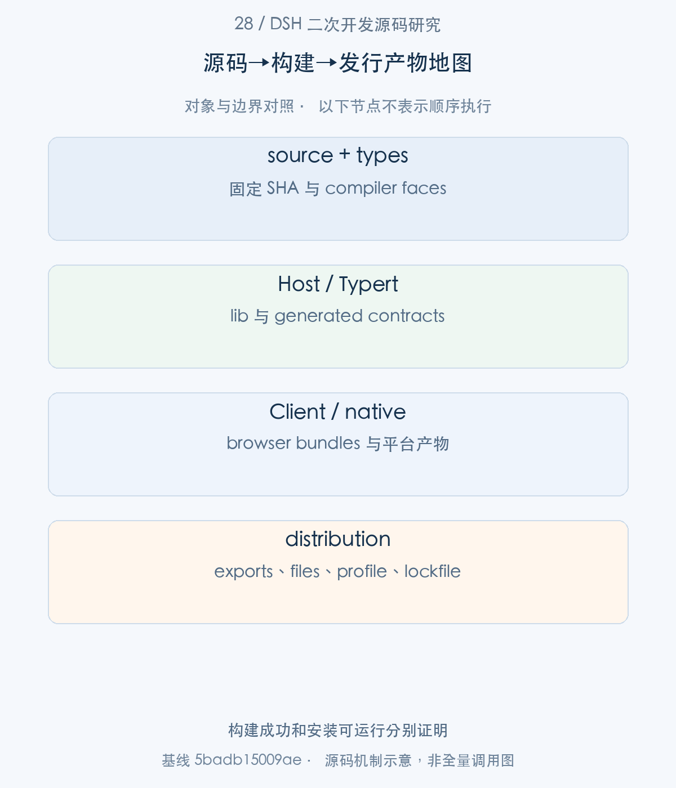
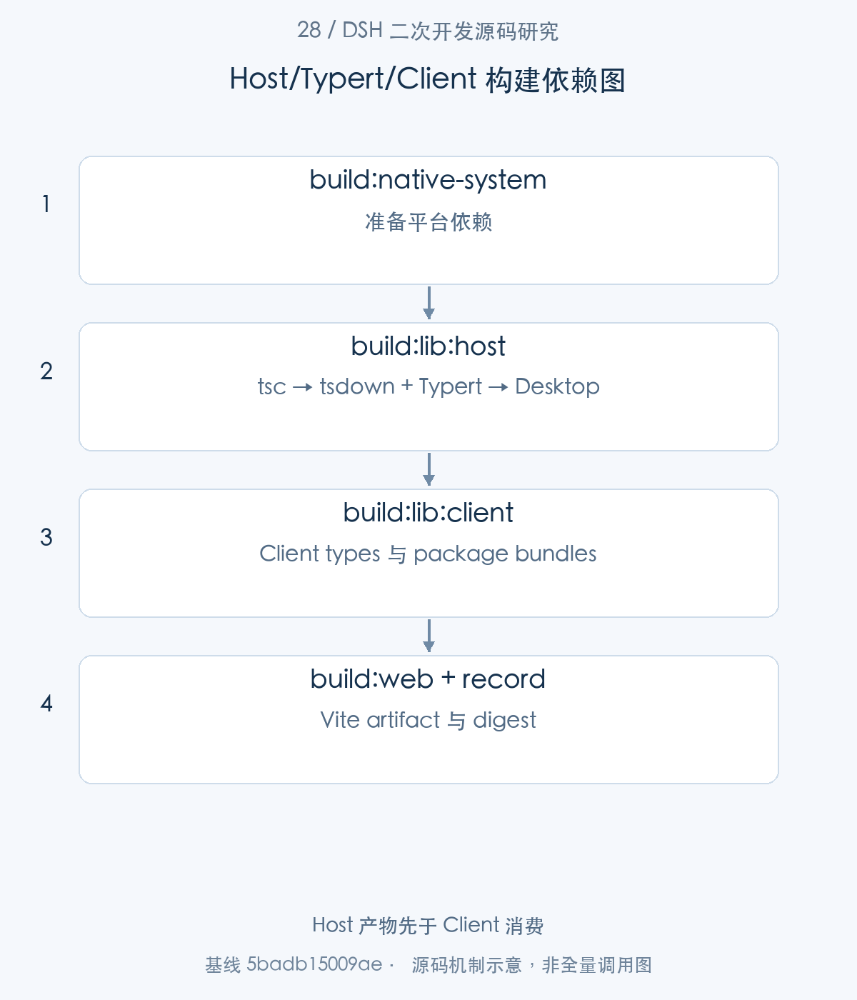
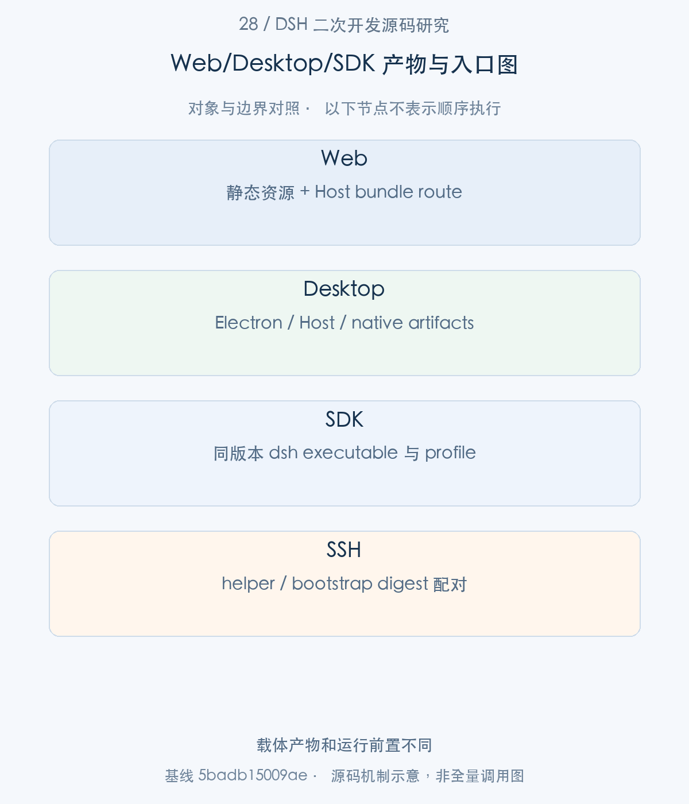
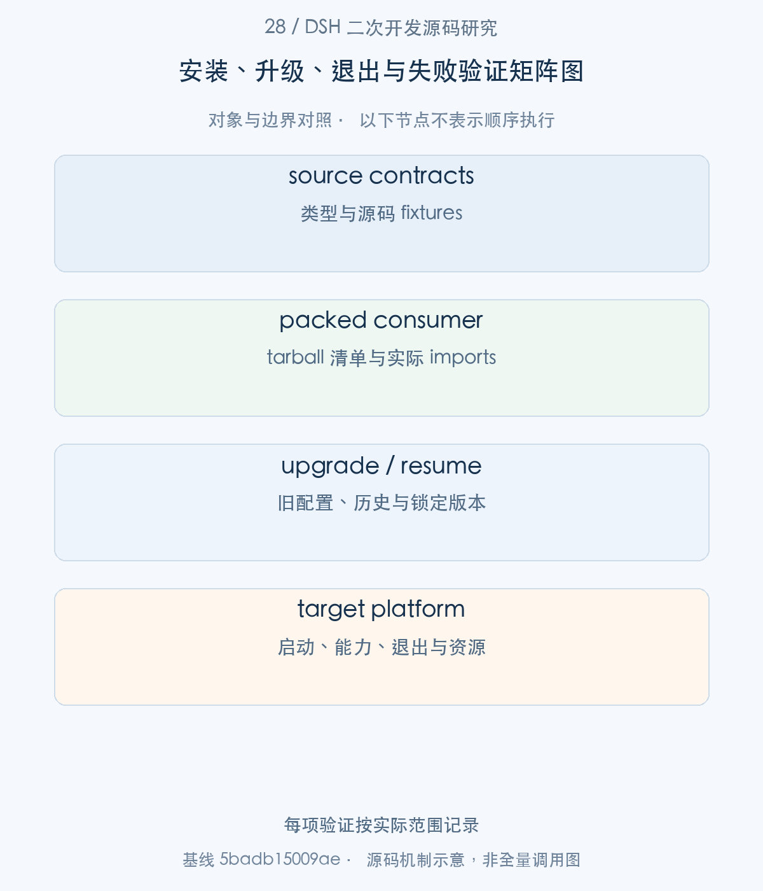

# 28｜从源码到企业发行包：构建、安装、升级与验证

企业扩展在源码 checkout 中运行，只证明了一种开发环境。真正交付还要确认 Host/Client 产物、Remote 生成契约、package exports、native dependencies 和 profile 在目标环境相互匹配。本文沿根构建脚本逐步追到发行文件，再解释干净目录消费、版本升级和本批实际执行的验证范围。

> 源码基线：DSH `0.2.1-alpha.1`，提交 `5badb15009ae1756c3afe0ae0cef1faafc290ccc`。下文的源码摘录保持原文，仅移除公共缩进。企业新增设计与验证范围另行标明。

## 1. 整体地图：哪些产物组成一份可运行发行包

DSH monorepo 可以通过 tsconfig paths 直接解析源码，发布包却依赖 lib/ 和 exports。两者之间有编译、类型生成、bundle 和 pack 四个交接；少任一产物，都可能出现测试通过但安装后入口不存在。

本篇聚焦构建与消费契约。企业品牌和策略通过 Client build environment、profile/bundle 与业务包进入发行；凭据仍是 runtime 配置，不应嵌入浏览器产物。本文没有执行公网发布，也不把一次本地 ESM build 当成跨平台产品验收。



图1。构建成功和安装可运行分别证明 [SVG](assets/28-build-package-distribution-fig-1.svg)。

## 2. 构建主线：Host、Typert 与 Client 的依赖顺序

步骤1：根 package.json 指定完整 build，以及顺序执行的 Host/Client lib 阶段。

<!-- source:S01 -->
源码 [package.json:21–28](https://github.com/deepseek-ai/deepseek-harness/blob/5badb15009ae1756c3afe0ae0cef1faafc290ccc/package.json#L21-L28)。

```json
"build": "tsx scripts/build.ts",
"build:bench": "npm run build:native-system && npm run build:lib && tsdown --config-loader native --config benchmarks/tsdown.config.ts",
"build:official": "tsx scripts/build.ts --profile official",
"build:lib": "pnpm run build:lib:host && pnpm run build:lib:client",
"build:lib:host": "node --max-old-space-size=4096 ./node_modules/typescript/bin/tsc -b tsconfig.host.json && tsdown --config-loader native --env.DSH_BUILD_FACE host && pnpm --filter @deepseek-ai/dsh-desktop run bundle",
"build:lib:client": "tsc -b tsconfig.client.json && tsdown --config-loader native --env.DSH_BUILD_FACE client",
"build:web": "pnpm --filter @deepseek-ai/dsh-web-frontend run build",
"build:desktop": "pnpm --filter @deepseek-ai/dsh-desktop run build",
```

build:lib 先 host 后 client；host tsc -b 产生 JS/types，tsdown Host pass 运行 Typert，随后 Desktop bundle 消费已生成 lib；client tsc 与 package-local bundle 才接着进行。Context merges 的两个 compiler faces 应保持隔离，不能把整个 monorepo 塞到一个 TypeScript Program。

步骤2：tsdown 根据 DSH_BUILD_FACE 选择 workspace 与 entry，并仅在 Host pass 挂 typertPlugin。

<!-- source:S02 -->
源码 [tsdown.config.ts:19–34](https://github.com/deepseek-ai/deepseek-harness/blob/5badb15009ae1756c3afe0ae0cef1faafc290ccc/tsdown.config.ts#L19-L34)。

```typescript
export default defineConfig(({ env }) => {
  const client = isBuildFaceClient(env?.DSH_BUILD_FACE)
  return {
    workspace: client
      ? ['vendor/*', 'packages/*/*', 'apps/cli']
      : ['vendor/*', 'packages/*/*', 'apps/cli', 'apps/desktop-host'],
    entry: client ? '' : ['lib/types/{index,startup}.js'],
    outDir: 'lib',
    format: ['esm'],
    platform: 'node',
    target: 'es2024',
    fixedExtension: false,
    dts: false,
    clean: false,
    plugins: client ? [] : [typertPlugin({ mode: 'workspace', faces: ['host'] })],
  }
```

Client pass 的 entry 为空，由声明 browser bundle 的 package-local config 生产 Node loader 与 Client artifact。build 调度不能推定每个 workspace 包内构建有自动依赖排序；配置特意把 Desktop bundling 放在 Host lib 完成之后。

步骤3：build.ts 校验 Node TypeScript stripping、解析公共 Client 环境，移除旧 build record，再按 native → lib → web 推进。

<!-- source:S03 -->
源码 [scripts/build.ts:32–53](https://github.com/deepseek-ai/deepseek-harness/blob/5badb15009ae1756c3afe0ae0cef1faafc290ccc/scripts/build.ts#L32-L53)。

```typescript
function main(): void {
  // tsdown.config.ts loads only through Node type stripping (`--config-loader native`); this names the cause before tsdown fails.
  if (!process.features.typescript) {
    throw new Error('build: Node.js TypeScript type stripping is unavailable in this Node.js process; remove --no-experimental-strip-types from NODE_OPTIONS or use a Node.js build with TypeScript support')
  }
  const { values } = parseArgs({
    options: { profile: { type: 'string' } },
    allowPositionals: false,
  })
  const root = resolve(import.meta.dirname, '..')
  const repositoryEnvironment = repositoryClientBuildEnvironment(root, process.env)
  const profile = values.profile ?? process.env[CLIENT_BUILD_PROFILE_SELECTOR]
  const clientEnvironment = resolveClientBuildEnvironment(repositoryEnvironment, profile)
  const buildEnvironment = clientBuildProcessEnvironment(process.env, clientEnvironment)

  rmSync(resolve(root, CLIENT_BUILD_RECORD_PATH), { force: true })
  runScript('build:native-system', buildEnvironment)
  runScript('build:lib', buildEnvironment)
  runScript('build:web', buildEnvironment)
  const record = writeClientBuildRecord(root, clientEnvironment)
  console.log(
    `build: recorded ${String(record.artifacts.fileCount)} client artifact(s) with ${String(Object.keys(record.environment).length)} public value(s)`,
```

runScript 对任何非零退出抛错，只有全链成功才 writeClientBuildRecord。旧 record 先删除避免一次失败构建沿用上次成功凭证。完整 build 与 typecheck 的工作量不同，实际命令需要从脚本读取，而不是凭名称判断。



图2。Host 产物先于 Client 消费 [SVG](assets/28-build-package-distribution-fig-2.svg)。

## 3. 扩展包主线：exports、依赖与打包内容

步骤4：CLI package 的 bin 与 files 明确运行入口 lib/bin.js 和公开文件范围。

<!-- source:S04 -->
源码 [apps/cli/package.json:13–20](https://github.com/deepseek-ai/deepseek-harness/blob/5badb15009ae1756c3afe0ae0cef1faafc290ccc/apps/cli/package.json#L13-L20)。

```json
"type": "module",
"bin": {
  "dsh": "lib/bin.js"
},
"files": [
  "lib/*.js",
  "lib/types/*.d.ts"
],
```

workspace source files 不能补救 tarball 缺失的入口。新增企业包同样要检查 exports/types/files，声明所有实际 runtime imports 为依赖或适当 peer；仅放 devDependencies 会让 monorepo 可用而独立安装失败。

步骤5：上游 baseline 发布工具先发现完整包集合，校验名称和版本关系。

<!-- source:S05 -->
源码 [scripts/publish-npm-baseline.ts:245–268](https://github.com/deepseek-ai/deepseek-harness/blob/5badb15009ae1756c3afe0ae0cef1faafc290ccc/scripts/publish-npm-baseline.ts#L245-L268)。

```typescript
const packages: PackageTarget[] = []
const names = new Set<string>()
const baseVersion = expectString(readObject(resolve(root, 'package.json')), 'version', 'package.json')
if (!/^\d+\.\d+\.\d+$/.test(baseVersion)) {
  throw new Error(`package.json must have a stable X.Y.Z version, got ${baseVersion}`)
}
for (const manifestPath of manifestPaths) {
  const manifest = readObject(resolve(root, manifestPath))
  const name = expectString(manifest, 'name', manifestPath)
  const version = expectString(manifest, 'version', manifestPath)
  const isVendored = manifestPath.startsWith('vendor/')
  // Vendored packages are rescoped too (vendor/README.md), so publication
  // never carries an upstream name that would squat it on the registry.
  if (!name.startsWith('@deepseek-ai/')) {
    throw new Error(`${manifestPath} must name an @deepseek-ai package`)
  }
  if (name === '@deepseek-ai/dsh-root') {
    throw new Error(`${manifestPath} unexpectedly selected the workspace root`)
  }
  if (names.has(name)) throw new Error(`duplicate package name: ${name}`)
  if (!isVendored && version !== baseVersion) {
    throw new Error(`${manifestPath} has version ${version}; expected ${baseVersion}`)
  }
  names.add(name)
```

此脚本要求 stable X.Y.Z，而本文基线是0.2.1-alpha.1；不能直接提供一条命令声称它可发布当前 checkout。其设计值得参考：统一 baseline、拒绝重复 names、明确 vendor origin。企业要制定自己的版本与 registry 规则，不直接篡改上游 package namespace。

步骤6：stage 在隔离 release 场景统一 version，并改写内部 dependencies，移除 private。

<!-- source:S06 -->
源码 [scripts/publish-npm-baseline.ts:279–287](https://github.com/deepseek-ai/deepseek-harness/blob/5badb15009ae1756c3afe0ae0cef1faafc290ccc/scripts/publish-npm-baseline.ts#L279-L287)。

```typescript
stage(root: string, releaseVersion: string): void {
  const internalNames = new Set(this.packages.map(pkg => pkg.name))
  for (const target of this.packages) {
    const manifestPath = resolve(root, target.directory, 'package.json')
    const manifest = readObject(manifestPath)
    manifest.version = releaseVersion
    delete manifest.private
    stageInternalDependencies(manifest, internalNames, releaseVersion, manifestPath)
    writeFileSync(manifestPath, `${JSON.stringify(manifest, null, 2)}\n`)
```

这是发行准备操作，不是本篇执行行为。私有业务扩展可继续保留 private 防误发布；本地 npm pack 与公网 publish 是不同动作。20篇管理 bundle 的 version compatibility 还需在运行安装阶段重新检查。

## 4. 应用产物：Web、Desktop 与 SDK 的装配差异

步骤7：Web/Client 公共 build metadata 从 repository version、commit 和 dirty state 产生。

<!-- source:S07 -->
源码 [scripts/client-build-environment.ts:120–138](https://github.com/deepseek-ai/deepseek-harness/blob/5badb15009ae1756c3afe0ae0cef1faafc290ccc/scripts/client-build-environment.ts#L120-L138)。

```typescript
  environment: NodeJS.ProcessEnv = process.env,
): ClientBuildEnvironment {
  const inherited = { ...clientBuildEnvironment(environment) }
  delete inherited.DSH_CLIENT_COMMIT_HASH
  delete inherited.DSH_CLIENT_GIT_DIRTY
  delete inherited.DSH_CLIENT_VERSION
  const dirty = repositoryGitDirty(root)
  return {
    ...inherited,
    DSH_CLIENT_COMMIT_HASH: repositoryCommitHash(root, environment),
    ...(dirty === true ? { DSH_CLIENT_GIT_DIRTY: 'true' } : {}),
    DSH_CLIENT_VERSION: repositoryVersion(root),
  }
}

/**
 * Resolve the exact public values required by an official build at one commit.
 * @param root - repository root whose HEAD must match the built source.
 * @param environment - optional explicit commit source for non-Git build environments.
```

DSH_CLIENT_ 前缀的值会被编译进 browser artifact，必须只存公开信息。Git SHA 用于定位源码，version 用于包契约，两者共同有价值，但不替代产物 digest。企业 brand/build profile 可使用公开字段，secret 必须留在 credentials provider。

步骤8：clientBuildEnvironmentDefines 对确定名称做静态替换，动态 process.env 观察为空对象。

<!-- source:S08 -->
源码 [scripts/client-build-environment.ts:262–273](https://github.com/deepseek-ai/deepseek-harness/blob/5badb15009ae1756c3afe0ae0cef1faafc290ccc/scripts/client-build-environment.ts#L262-L273)。

```typescript
 * @param environment - environment inherited by the build process.
 * @returns deterministic Vite/tsdown `define` expressions.
 */
export function clientBuildEnvironmentDefines(
  environment: NodeJS.ProcessEnv,
): Record<string, string> {
  const defines: Record<string, string> = { 'process.env': '{}' }
  for (const [name, value] of Object.entries(clientBuildEnvironment(environment))) {
    defines[`process.env.${name}`] = JSON.stringify(value)
  }
  return defines
}
```

这减少无意把完整环境嵌入浏览器的风险。品牌配置只替换一半 Client bundles 会造成不一致；完整根构建向 Vite 与 dynamic Client packages 提供同一 environment。

步骤9：SDK 发行消费者要求同版本 dsh，并从 manifests 定位 built executable；源码 fallback 是另一套明确前置。

<!-- source:S09 -->
源码 [packages/sdk/client/src/launch.ts:87–108](https://github.com/deepseek-ai/deepseek-harness/blob/5badb15009ae1756c3afe0ae0cef1faafc290ccc/packages/sdk/client/src/launch.ts#L87-L108)。

```typescript
  dshManifestUrl: string,
  clientManifestUrl: string,
  sourceLoaderUrl?: string,
): DshNodeLaunch {
  const bin = resolveDshBinFromManifests(dshManifestUrl, clientManifestUrl)
  if (existsSync(bin)) return { nodeArgs: [bin], patches: [], environment: {} }

  const packageDir = dirname(fileURLToPath(dshManifestUrl))
  const sourceBin = resolve(packageDir, 'src/bin.ts')
  const sourcePatch = resolve(packageDir, 'src/sdk-source.cordis.patch.yml')
  const sourceTsconfig = resolve(packageDir, 'tsconfig.json')
  if (!existsSync(sourceBin) || !existsSync(sourcePatch) || !existsSync(sourceTsconfig)) {
    throw new Error(
      `@deepseek-ai/dsh is missing its built executable ${bin} and complete source launch files ${sourceBin}, ${sourcePatch}, ${sourceTsconfig}`,
    )
  }
  const loader = sourceLoaderUrl ?? import.meta.resolve('tsx/esm')
  return {
    nodeArgs: ['--import', loader, sourceBin],
    patches: [sourcePatch],
    environment: { TSX_TSCONFIG_PATH: sourceTsconfig },
  }
```

SDK npm consumer、Web 静态资源、Desktop 主进程/Electron 与 SSH helper 是不同运行入口。Desktop 有平台 native 依赖，Web 需要 Host bundle route，SDK 拥有进程，SSH 需要部署配对的 helper digest，不能互相复制一个 dist 目录就视为等价。




图3。载体产物和运行前置不同 [SVG](assets/28-build-package-distribution-fig-3.svg)。

## 5. 安装验证：从干净目录和目标产物启动

步骤10：完整 Client build 成功后记录 environment 与 artifact digest。

<!-- source:S10 -->
源码 [scripts/client-build-environment.ts:281–294](https://github.com/deepseek-ai/deepseek-harness/blob/5badb15009ae1756c3afe0ae0cef1faafc290ccc/scripts/client-build-environment.ts#L281-L294)。

```typescript
export function writeClientBuildRecord(
  root: string,
  environment: ClientBuildEnvironment,
): ClientBuildRecord {
  const record: ClientBuildRecord = {
    formatVersion: CLIENT_BUILD_RECORD_FORMAT,
    environment: clientBuildEnvironment(environment),
    artifacts: clientArtifactDigest(root),
  }
  const path = resolve(root, CLIENT_BUILD_RECORD_PATH)
  mkdirSync(dirname(path), { recursive: true })
  writeFileSync(path, `${JSON.stringify(record, null, 2)}\n`)
  return record
}
```

record 的 fileCount/hash 来自本次实际 Client files，不是“package.json 已更新”的替代证明。CI 应把 record、文件清单、source SHA、toolchain 与测试范围一起保留。

步骤11：consumer 读取 record 后重新计算 digest，若当前文件与记录不同则要求重新完整构建。

<!-- source:S11 -->
源码 [scripts/client-build-environment.ts:310–326](https://github.com/deepseek-ai/deepseek-harness/blob/5badb15009ae1756c3afe0ae0cef1faafc290ccc/scripts/client-build-environment.ts#L310-L326)。

```typescript

let parsed: unknown
try {
  parsed = JSON.parse(readFileSync(path, 'utf8'))
} catch (error) {
  const detail = error instanceof Error ? error.message : String(error)
  throw new Error(`client build record ${CLIENT_BUILD_RECORD_PATH} is invalid JSON: ${detail}`)
}
const record = parseClientBuildRecord(parsed)
if (expected !== undefined) assertClientBuildEnvironment(record.environment, expected)

const current = clientArtifactDigest(root)
if (current.fileCount !== record.artifacts.fileCount || current.sha256 !== record.artifacts.sha256) {
  throw new Error(
    `client artifacts differ from ${CLIENT_BUILD_RECORD_PATH}; run a complete pnpm run build before consuming them`,
  )
}
```

此检查能发现手工改产物、混合构建与旧资源残留，却不会证明页面业务流程无误。干净目录验收还要 import exports、加载 Client graph、创建任务、退出并观察资源；本篇实际只对已有 enterprise 包的部分产物做本地 pack/ledger smoke，未宣布完整应用已安装验收。


## 6. 升级验证：旧数据、兼容与失败处理

步骤12：升级/回归准备必须区分 public typecheck、contracts-ready 与 native test 前置。

<!-- source:S12 -->
源码 [package.json:49–58](https://github.com/deepseek-ai/deepseek-harness/blob/5badb15009ae1756c3afe0ae0cef1faafc290ccc/package.json#L49-L58)。

```json
"typecheck": "npm run build:lib:host && npm run typecheck:contracts-ready",
"typecheck:contracts-ready": "tsc -b tsconfig.client.json",
"lint": "npm run build:lib:host && npm run lint:contracts-ready",
"lint:contracts-ready": "tsx scripts/run-oxlint.ts .",
"lint:fix": "npm run build:lib:host && npm run lint:fix:contracts-ready",
"lint:fix:contracts-ready": "tsx scripts/run-oxlint.ts --config .oxlintrc.staged.json packages/typert/generator/tests/fixtures/type-model --fix && tsx scripts/run-oxlint.ts . --fix",
"duplication": "jscpd --config .jscpd.json packages scripts",
"test": "pnpm run build:native-system && vitest run",
"test:coverage": "pnpm run build:native-system && vitest run --coverage",
"build:native-system": "tsx native/system/scripts/build.ts --host-addon-only",
```

public typecheck 先构建 Host lib/Remote contracts，internal contracts-ready 假定已准备。源码 Vitest 通过不能证明 native ABI、旧 Session schema 或不同平台可用。企业升级前应排空 owned Agent/子进程，保留旧 profile/lockfile 与应用数据，再在隔离目录核对新产物和真实恢复。

|变化面|最低复核事实|本文实际范围|
|---|---|---|
|Remote/schema|Host 生成与 Client consumer 匹配|上游契约/组件测试|
|业务扩展代码|types、ESM、compiled integration|enterprise 示例已执行|
|pack files/exports|tarball 清单与独立 consumer|本地 pack 与 ledger smoke|
|旧 Session/config|恢复、migrate、拒绝策略|相关实现分析，未全量升级验收|
|Web/Desktop/native|目标平台运行与退出|未构建完整发行产品|



图4。每项验证按实际范围记录 [SVG](assets/28-build-package-distribution-fig-4.svg)。

发行记录可以用于一个很具体的排查场景：Host启动正常，页面却出现旧字段或旧Remote契约。先核对Host lib、Typert contribution与Client产物是否来自同一构建，再核对public build inputs及产物digest。单独重新编译React组件可能留下另一端的旧契约；一个提交SHA也不足以说明运行目录里没有混入先前构建产物。

本地pack检查则回答另一个问题：发布清单里是否真正带上consumer所需文件。`exports`指向存在的lib文件只是第一层；独立解包导入可以排除monorepo aliases意外支撑运行。随后还需要精确peer dependencies、固定profile、Host能力装配和退出检查，才能证明整个扩展可被安装消费。本文把这些层次分别记录，使后续新增Web或Desktop载体时能明确补哪一层证据。

## 7. 开发示例与验证：打包并安装教学扩展

本批实际执行 enterprise typecheck/build/test，并做本地 npm pack、tarball ledger import 和业务 receipt smoke；依赖完整 DSH runtime 的 provisioning 仍通过现有 compiled integration fixture 验证。命令、版本、退出码与产物范围见配套验证记录。

若要产品验收，还需在干净目标环境安装所有运行依赖，运行固定 profile，检查工具/设置/Client Slot，再验证退出与持久恢复。下面列出本篇的可重复验证入口；完整上游 build 是发行前置建议，未在本批伪装成已执行。

可复核入口（`pnpm` 命令在 `.sources/deepseek-harness` 中运行，`node research/...` 命令在本研究仓库根目录运行；实际执行结果见[本批验证记录](../validation/supplementary-articles-validation.md)）：

```sh
node research/deepseek-harness/validation/enterprise-example.mjs typecheck
node research/deepseek-harness/validation/enterprise-example.mjs build
node research/deepseek-harness/validation/enterprise-example.mjs test
node research/deepseek-harness/validation/supplementary-pack-smoke.mjs
pnpm exec vitest run scripts/client-build-environment.client.spec.ts scripts/npm-baseline-packages.spec.ts scripts/pnpm-invocation.spec.ts
```

本篇使用现有源码测试说明契约，并不把 mock 的通过解释成真实模型、外部 server、浏览器或企业基础设施已经验收。
## 8. 工程心得：发行能力应由安装产物证明

发行研究的最大收获，是让“可运行”落到明确的 consumer。源码测试、tarball import、Host 启动、真实浏览器与跨平台 native 各自验证不同事实；把结论与 consumer 绑定，研发和运维就能清楚知道还缺哪一步。

构建顺序同样是一种架构契约。Host 类型和 Typert contribution 是 Client 的输入，public environment 是所有 Client artifact 的共同输入，build record 则给这组产物一个可核验的身份。企业团队应保留这些关系，而不是简化成一个失去证据的打包脚本。

最终交付可以从小而完整的扩展开始：固定源码版本，编译并验证业务契约，检查 pack 内容，确认实际安装与退出，再逐步增加载体和平台覆盖。这样的迭代能让二次开发始终有可信的完成边界。


[返回补充专题目录](README.md#补充专栏17—28) · [对应写作大纲](../appendices/supplementary-article-outlines.md)
